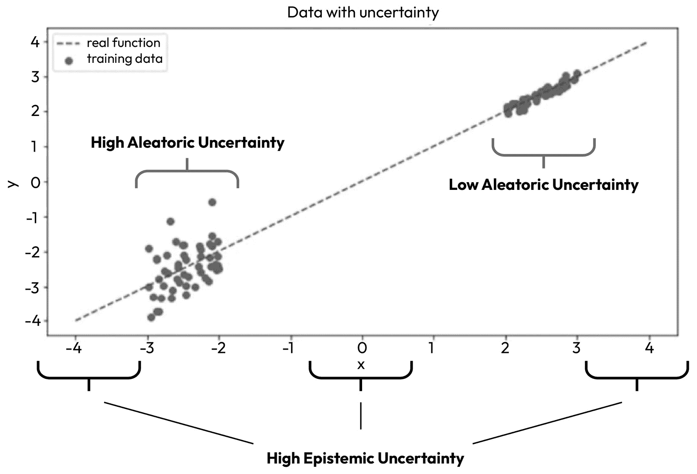
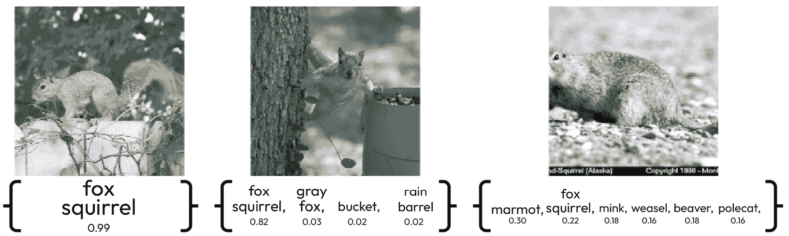

# 共形预测概述

在当今世界，数据在决策中扮演着至关重要的角色，因此测量预测中的不确定性变得越来越重要。为了实现这一目标，一种名为**共形预测**的相对较新的框架正在获得越来越多的关注。这个框架提供了既稳健又可靠的概率预测，同时也值得信赖。这是一个强大的工具，它为给定的预测提供了信心、准确性和可靠性的度量，使用户能够更有信心地做出明智的选择。

本章将概述共形预测。

它将解释为什么共形预测是量化预测不确定性的宝贵工具，尤其是在医疗保健、自动驾驶汽车和金融等关键领域。我们还将讨论**不确定性量化**（**UQ**）的概念以及共形预测框架如何成功地解决了量化不确定性的挑战。到本章结束时，您将更好地理解共形预测及其在各个领域的潜在应用。

在本章中，我们将涵盖以下主题：

+   理解不确定性量化

+   量化不确定性的不同方法

+   使用共形预测量化不确定性

# 理解不确定性量化

不确定性是任何预测的固有部分，因为总有一些未知或难以测量的因素。预测通常是基于不完整的数据或无法捕捉现实世界全部复杂性的模型。因此，预测会受到各种不确定性来源的影响，包括随机性、偏差和模型错误。

为了减轻与不确定性相关的风险，准确量化它是至关重要的。通过量化不确定性，我们可以估计可能结果的范围并评估我们对预测可以有多少信心。这些信息可用于做出明智的决策，并确定需要进一步研究或数据收集的领域。

**UQ** 是一个研究领域，帮助我们衡量在做出预测时我们不知道多少。UQ 尝试估计即使研究中的某些系统方面不完全清楚，结果发生的概率。

不确定性通常分为两种类型：**随机**和**认知**。随机不确定性是由被研究系统固有的随机性和不可预测性引起的，而认知不确定性则源于我们对系统缺乏了解。

## 随机不确定性

随机不确定性是指由系统固有的随机性和不可预测性引起的类型的不确定性。以下是一些随机不确定性的例子：

+   **掷骰子**：掷骰子的结果是固有的随机且不可预测的。你无法确定骰子上会出现哪个数字，因此这个过程存在随机不确定性。

+   **天气预报**：天气是一个受许多因素影响的复杂系统，其中一些因素本质上是随机的且难以预测。例如，由于随机不确定性，风暴系统的确切路径和强度可能难以预测。

+   **股市波动**：股市是一个受许多因素影响的复杂系统，包括人类行为、经济状况和新闻事件。其中一些因素本质上是不可预测的，可能导致股价波动，从而产生随机不确定性。

+   **交通流量**：交通流量是一个受多种因素影响的复杂系统，包括道路上的车辆数量、道路状况和驾驶员行为。在任何给定时间，交通的确切流量难以确定，导致随机不确定性。

让我们接下来讨论认知不确定性。

## 认知不确定性

认知不确定性是指由于对系统缺乏知识或理解而产生的类型的不确定性。以下是一些认知不确定性的例子：

+   **医疗诊断**：诊断医疗状况涉及基于可用数据进行预测，例如症状、病史和检测结果。然而，如果数据不完整或不可靠，或者对医疗状况理解不充分，诊断可能存在认知不确定性。

+   **金融预测**：预测未来经济状况是一项复杂任务，需要基于包括利率、通货膨胀和政治事件在内的广泛因素进行预测。然而，由于我们对经济系统的理解有限，这些预测总是存在认知不确定性。

+   **自然灾害预测**：预测自然灾害（如地震或飓风）的可能性和严重程度，需要基于过去事件和当前环境条件的数据进行预测。然而，如果我们对涉及的潜在物理过程没有完全理解，这些预测可能存在认知不确定性。

图 2.1 – 随机不确定性和认知不确定性的说明

前面的图示描绘了两个不同的点区域。左侧区域表现出明显的随机性，而右侧区域展示了结构化的数据模式，这从可以穿过其聚集点的直线中可以看出。左侧的簇表现出高随机不确定性，与右侧簇中低随机不确定性形成对比，这归因于其数据的规律性。此外，三个表现出高认知不确定性的区域对应于数据中的空白，表明我们对系统理解或知识的缺口。

让我们继续探讨量化不确定性的不同方法。

# 量化不确定性的不同方法

量化不确定性的方法有很多，每种方法都有其自身的优点和局限性。以下是一些例子：

+   **统计方法**：统计方法在不确定性量化（UQ）中得到广泛应用，涉及使用概率分布来模拟数据和预测中的不确定性。这些方法在金融、工程和物理学等领域得到广泛应用，并涉及置信区间、回归分析、蒙特卡洛模拟和假设检验等工具。

+   **贝叶斯方法**：贝叶斯方法涉及使用先验知识和数据来更新我们对预测不确定性的信念。这些方法在机器学习、自然语言处理和图像处理中得到广泛应用。贝叶斯工具包括贝叶斯推理——基于新数据更新关于预测不确定性的信念的统计方法——以及贝叶斯网络——表示变量之间概率关系的图形模型，可用于模拟各种系统和计算不同结果的可能性。贝叶斯工具还包括**马尔可夫链蒙特卡洛**（**MCMC**）——一种用于从复杂概率分布中采样的计算方法——以及贝叶斯优化——用于优化难以评估的函数的方法。

+   **模糊逻辑方法**：模糊逻辑涉及使用集合和隶属函数来表示系统中的不确定性。这种方法在控制系统、机器人和人工智能中得到广泛应用。模糊逻辑包括模糊集合——即允许部分隶属的集合。与将元素二分为集合成员或非成员的二元分类不同，模糊集合允许元素具有隶属度。这允许以更细腻的方式表示不确定性。

我们现在将讨论使用一致性预测来量化不确定性。

# 使用一致性预测量化不确定性

随着机器学习在医疗保健、金融和自动驾驶汽车等关键应用中的广泛应用，量化机器学习预测的不确定性变得越来越重要。在这些应用中，错误预测的后果可能非常严重，因此理解每个预测相关的不确定性变得至关重要。

例如，在医疗保健领域，机器学习模型被用来预测患者结果，如疾病发生的可能性或治疗的疗效。这些预测可以对患者护理和治疗决策产生重大影响。然而，如果模型无法提供自己置信度的估计，它可能没有用，并且可能存在依赖它的风险。

相反，如果模型可以提供自己不确定性的度量，临床医生可以利用这些信息做出更明智的关于患者护理和治疗的决策。

考虑一种情况，一位医生获得了患者的 MRI 扫描，并需要推断患者是否患有癌症。在这种情况下，高精度是不够的，因为医生的诊断必须排除（或不排除）患者患有如此关键、改变生活的疾病，如癌症。

类似地，在金融领域，机器学习模型被用来预测市场趋势、股价和风险评估。这些预测可以对投资决策和投资组合管理产生重大影响。然而，如果模型无法提供自己置信度的估计，它可能没有用，甚至可能导致不良的投资决策。另一方面，如果模型可以提供自己不确定性的度量，投资者可以利用这些信息做出更明智的决策，并减少与不确定性相关的风险。

量化不确定性是解释性和机器学习模型的可信度的先决条件。如果一个模型不能提供自己置信度的估计，那么可能很难解释它为什么做出了某个预测，或者难以赢得利益相关者的信任。

相反，如果模型可以提供自己不确定性的度量，利益相关者可以更好地理解模型是如何得出预测的，并且可以更有信心地评估模型的表现。

一致性预测是量化预测不确定性的相对较新的框架，它与传统统计、贝叶斯和模糊逻辑方法相比具有几个优势。

这里是使用一致性预测进行不确定性量化的一些优势：

+   **概率预测**：一致性预测提供了包含每个预测的置信度、准确性和可靠性度量的概率预测。这使用户能够做出明智的选择，并估计可能结果的范围。

+   **覆盖保证**：与其他方法不同，一致性预测模型生成的预测区域（分类任务的预测集/回归任务的预测区间）附带严格的统计有效性保证。这些宝贵的信息可以用来评估模型的可靠性，减轻风险，并确定需要进一步研究或数据收集的领域。

+   **非参数**：一致性预测不需要对潜在的概率分布做出假设，使其适用于广泛的难题和数据类型。

+   **分布无关**：只要能够保持可交换性假设，一致性预测模型适用于任何数据分布。然而，一致性预测模型最近已被扩展到不再满足可交换性假设的情境中，包括在时间序列预测中的成功应用。

+   **数据集大小无限制**：与统计和贝叶斯模型不同，一致性预测模型并不关心数据集的大小——预测的有效性不受数据集大小的影响。然而，当数据量较大时，预测区间通常更窄。这是由于机器学习模型通常能够从更多的数据中更有效地学习这一普遍模式。

+   **稳健性**：一致性预测对异常值和噪声数据具有鲁棒性，在数据可能不完美或不完整的环境中特别有用。

+   **应用广泛**：一致性预测已被成功应用于广泛的难题类别，包括分类、回归、时间序列和预测、计算机视觉、NLP、强化学习等等。

+   **计算成本低**：一致性预测模型在提供非常严格的不确定性预测区域的同时，保持了计算效率，并且不会对系统资源造成沉重负担，这使得它们非常适合实时应用和大数据集。

与其他方法相比，一致性预测提供了稳健的非参数概率预测，并保证了有效性。这在分析建模不确定性具有挑战性且需要用于决策的概率预测的情况下特别有益。

一致性预测通过提供表示预测准确性的可能性的概率度量来量化不确定性。这种不确定性度量根植于有效性的概念，它表示正确预测的预期比率。

在分类任务中，机器学习模型通常会生成类别得分并分配最高得分的标签。然而，当预测确定性低时，这可能会引发问题。

考虑以下来自 Anastasios N. Angelopoulos 和 Stephen Bates 的《一致性预测和无分布不确定性温和导论》([`arxiv.org/abs/2107.07511`](https://arxiv.org/abs/2107.07511))的图像。一个训练好的深度学习模型将为新的图像输出类别得分，就像以下图中的三个一样。

我们可以看到，这三个例子并没有产生相同的结果。

图 2.2 – 分类问题中的不确定性

注意

前面的图来源于*Angelopoulos and Bates, 2023*（经作者许可使用）。

左侧的图片容易预测——模型已经看到了很多松鼠的例子，对其预测相当有信心。因此，预测集中只包含一个潜在的标签——狐狸松鼠。

中间的图片与它相关联的不确定性程度中等——虽然背景中还有其他物体，但模型仍然相当确信它最可能是狐狸松鼠。然而，为了规避预测风险，模型现在输出额外的标签，如*灰狐狸、桶和* *雨桶*。

右侧的图片最难分类，因为数据集中有很多不确定性；动物的头部分被遮挡，背景也很不寻常。为了应对这种预测不确定性，模型不仅降低了`狐狸松鼠`类别的概率，还引入了动物实际上可能是土拨鼠的可能性。此外，模型通过留下这种动物实际上也可能是*水獭、黄鼠狼、海狸或甚至* *黄鼬*的可能性来扩展预测集。

注意保形预测模型如何扩展了深度神经网络的点预测，因为它不是生成一个点预测，而是在指定的 95%置信水平下生成一个预测集。保形预测模型生成的预测集提供了更多信息，以改善下游决策。

保形预测框架基于构建一个包含真实值并具有一定置信度的预测集的想法。这个集合被称为保形预测集，它是基于一组训练数据构建的。

构建一个保形预测集时，该框架使用一个非一致性函数来衡量预测与训练数据拟合得有多好。

非一致性度量用于按预测与训练数据拟合得有多好来对预测进行排序。最相似的预测包含在保形预测集中，以及基于非一致性度量具有一定置信度的一组额外预测。通过遵循这种方法，保形预测模型可以提供其自身不确定性的度量。这允许模型构建者和利益相关者更好地理解模型是如何得出预测的，并可以增强对模型性能的信心。

# 摘要

在本章中，我们概述了保形预测，并解释了为什么保形预测是量化预测不确定性的宝贵工具，尤其是在医疗保健、自动驾驶汽车和金融等关键领域。我们还讨论了不确定性量化（UQ）的概念以及保形预测框架如何成功地解决了量化不确定性的挑战。

在下一章中，我们将更深入地探讨一致预测的基础知识并将其应用于二元分类问题。我们将说明如何通过计算不符合度得分和 p 值，然后使用 p 值来决定哪些类别标签应包含在您的预测集中，来将一致预测应用于您自己的二元分类问题。

# 第二部分：一致预测框架

本部分将解释一致预测的基础知识。您将了解一致预测模型类型以及一致预测的关键概念，包括有效性、效率和不符合度度量。

本节包含以下章节：*

+   *第三章**，一致预测的基础知识*

+   *第四章**，一致预测的有效性和效率*

+   *第五章**，一致预测器的类型*
