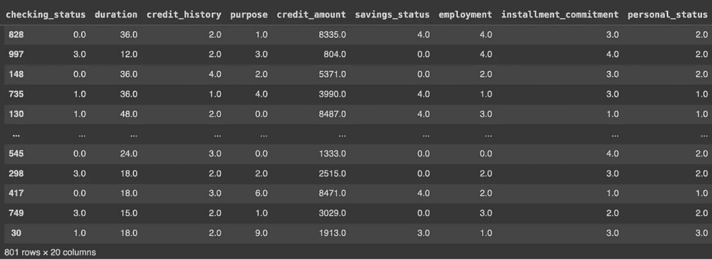
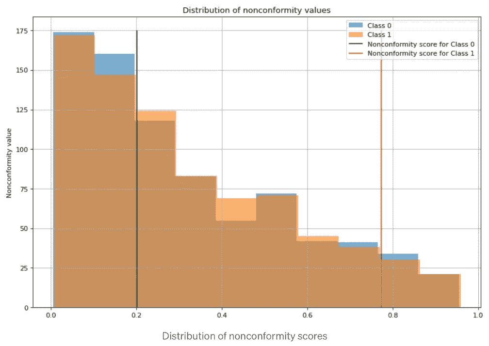
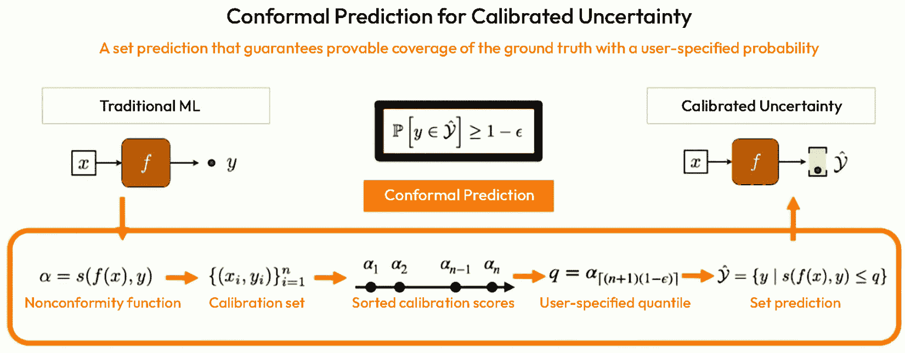

# 5

# 正规预测器的类型

本章描述了不同类型的正规预测器家族，探讨了量化不确定性的各种方法。通过实际例子，我们提供了对这些技术及其如何应用于现实世界情况的中间水平理解。

下面是公司如何使用正规预测的例子。

在一场名为 GTC 2023 的知名 AI 开发者大会上（[`www.nvidia.com/gtc/`](https://www.nvidia.com/gtc/))，NVIDIA 的首席科学家兼研究高级副总裁比尔·达利（Bill Dally）分享了对 NVIDIA 研发主要关注点之一的见解，即正规预测（[`www.hpcwire.com/2023/03/28/whats-stirring-in-nvidias-rd-lab-chief-scientist-bill-dally-provides-a-peek/`](https://www.hpcwire.com/2023/03/28/whats-stirring-in-nvidias-rd-lab-chief-scientist-bill-dally-provides-a-peek/))。

传统自动驾驶车辆机器学习模型输出单个分类（例如，道路上是否有行人）和检测到的对象的定位估计。然而，NVIDIA 希望产生一组带有概率的潜在输出；例如，一个物体可能是行人（80%概率）或骑自行车者（20%概率），位于 20 +/- 1 米的某个位置。

这使得车辆的规划者能够保证考虑到多种可能结果的安全行动。正规预测不仅提供最可能标签和位置，还提供一系列可能的选项，例如“80%置信度的行人位于 19-21 米处”。

NVIDIA 使用非一致性函数来计算概率，这些概率衡量每个潜在标签和位置相对于训练数据的奇异或不同程度。这生成一个多模态预测分布，反映了不确定性。

正规预测为 NVIDIA 的车辆提供了一种可靠的方式来量化不确定性，并考虑环境的多重解释。通过规划所有可能的结局，而不仅仅是单一的最可能结局，正规预测提高了鲁棒性和安全性。

在机器学习的领域，量化不确定性和提供可靠的预测具有重要意义。正规预测是一种创新技术，它允许我们构建预测集（在分类中）和预测区间（在回归中），为我们预测提供信心度量的指标。

本章旨在提供对不同类型正规预测器和它们量化不确定性的各自方法的更深入理解。通过实际例子，我们将展示这些技术如何应用于各种机器学习任务。

在本章中，我们将探讨以下主题：

+   经典和归纳正规预测器的基础

+   检查正规预测器的算法描述

+   数学公式和实际例子

+   正规预测器的优缺点

+   选择最适合特定问题域的最合适一致预测器的指南

让我们从经典一致预测开始。

# 理解经典预测器

在深入探讨一致预测的复杂性之前，让我们简要回顾一下前几章的关键概念。一致预测是一个框架，它允许我们在控制错误率的同时为我们的预测创建置信区域。

这种方法在需要不确定性度量的情况下特别有益，例如在医学诊断、自动驾驶汽车或金融风险管理中。该框架包括两种主要类型的一致预测器：**经典**和**归纳**。

**经典传输归纳一致预测**（**TCP**）是一致预测的原始形式，由一致预测的发明者开发。它构成了理解一致预测一般原则的基础。经典一致预测是为了构建符合指定置信水平的预测区域而开发的。经典一致预测的关键方面是其无分布性质，这意味着它不对数据分布做出任何假设。因此，它可以应用于任何机器学习算法，使其具有算法无关性。

与广泛使用的归纳一致预测相比，经典 TCP 不需要单独的校准集，从而更有效地利用整个数据集。

因此，对于较小的数据集，它可以生成更准确的预测。这种方法允许统计、机器学习和深度学习模型充分利用所有可用数据，可能导致更有效（更窄）的预测集和区间。

让我们讨论一下经典 TCP 如何在分类问题中使用。

## 将 TCP 应用于分类问题

在分类任务中，我们不仅寻求分配标签，而且希望这样做既自信又准确。这正是经典 TCP（传输归纳一致预测）的亮点所在。当我们深入研究其在分类中的应用时，我们将介绍其独特的方法和相对于传统技术的优势。准备好探索了吗？让我们深入了解分类中 TCP 的微妙之处！

在前几章中，我们讨论了一致预测框架的核心概念，即对数据集中的每个对象分配一个非一致性度量（或奇异度）。这个度量被用来对数据集中的对象进行排序。随后，在预测一个新对象时，创建一个包含与数据集中对象特定比例值相关的预测区域，这个比例由它们的奇异度得分确定。这个比例对应于预测所需的置信水平。

与更受欢迎的归纳一致性预测方法相比，后者依赖于校准集根据对象的非一致性分数对对象进行排序，经典 TCP 则结合使用整个数据集和新对象的特征来建立预测区域。

虽然这种方法在计算上可能很昂贵，但它允许你充分利用整个数据集来捕捉数据分布的变化，从而提供更准确的预测区域。

然而，经典一致性预测也有一些局限性。例如，对于大型数据集或实时应用来说，它可能不可行，因为它需要为每个新的预测重新训练底层点预测模型。

经典一致性预测是一个涉及多个关键步骤的过程。在此，我们概述这些步骤，以提供对程序的清晰理解：

1.  **数据集准备**：将数据集划分为训练集和测试集。训练集用于训练机器学习模型，而测试集用于评估一致性预测器的性能。

1.  **模型训练**：使用训练数据集训练底层机器学习模型。这个点预测模型将为新对象生成点预测。

1.  **非一致性度量计算**：定义一个非一致性（奇异度）度量，该度量量化了对象与数据集中其他对象的不同程度。对于训练数据集中的每个对象，使用训练好的模型计算其非一致性分数。

1.  **新对象非一致性分数**：当引入一个新对象（没有其标签）时，使用相同的非一致性度量以及训练好的点预测模型来计算其非一致性分数。

1.  **排序**：根据计算出的非一致性分数，对所有对象进行排序，包括训练数据集中的对象和新对象。

1.  **预测区域**：确定预测所需的置信水平。识别与该置信水平相对应的排序集中对象的占比。形成一个包含这些对象相关值的预测集。

让我们通过一个实际例子来阐明这些概念，这个例子使用了我们在前几章讨论的拉格朗日损失非一致性度量。提醒一下，拉格朗日损失（也称为逆概率或 LAC 损失）是一种非一致性度量，计算为*1-P(y|x)*，其中*P(y|x)*代表底层模型为实际类别产生的类别分数。

拉格朗日损失非一致性度量直观地衡量了理想分类器为正确类别（理想情况下应为 1）生成的概率分数与分类器模型产生的分类分数之间的差异。它量化了模型的预测与完美分类之间的距离，非一致性分数越大，理想预测与实际预测之间的差异就越显著。

为了计算逆概率（铰链）非一致性得分，考虑一个例子，其中你的分类器生成两个得分：*class_0 = 0.6* 和 *class_1 = 0.4*，实际标签 *y=1*。为了确定非一致性得分，从真实类别的概率（在这种情况下，1 减去 0.4）中减去。

得到的逆概率（铰链）非一致性得分为 0.6。

当底层机器学习分类模型表现更好时，铰链（逆概率）得分更低。这种性能受多种因素的影响，例如数据集的大小和复杂性、所采用的机器学习模型类型以及模型构建的质量。换句话说，使用适合给定数据集的适当机器学习技术构建的良好模型通常会生成较低的铰链得分，表明更好的预测。

训练过程是 TCP 与**归纳一致性预测**（**ICP**）之间的关键区别。在 ICP 中，底层分类器仅在训练集上训练一次，一致性预测模型的校准发生在校准数据集上。

相比之下，在 TCP 中，通过将每个测试点添加到训练集中两次来训练分类器，每次分配潜在的标签 0 和 1。对于测试集中的每个点，重复此过程。因此，底层分类器模型被训练了*2 x m*次，其中 m 是测试集中的点数。对于大型数据集，这可能会变得计算成本高昂，对于此类数据集，使用 ICP 可能是一个更合适的选择。

然而，对于中等和较小的数据集，计算成本通常是可管理的。为了获得潜在的更好点预测和更窄的概率区间，您可以考虑 TCP，通过训练分类器模型*2 x m*次来实现更好的预测区间。许多算法，如逻辑回归，都快速且适合这种方法。

训练 TCP 的整体方法保持基本不变。TCP 算法过程如下：

1.  在整个训练集上训练底层分类器。

1.  将每个测试点及其所有可能的类别标签逐个添加到训练集中。

1.  对于每个添加的带有假设标签的测试点，重新训练分类器，并根据假设标签计算测试点的非一致性得分。

1.  计算每个假设标签的 p 值，比较测试点的非一致性得分与训练集中点的得分。

1.  对于每个测试点和每个假设的标签，如果其 p 值大于或等于所选显著性水平，则将假设的标签包含在预测集中。

我们将使用德国信贷数据集（[`www.openml.org/d/31`](https://www.openml.org/d/31)）来举例说明 TCP 方法，这是一个经典的描述良好和不良信用风险的数据库，基于贷款期限、信用历史、就业、财产、年龄、住房等特征。

在本书的 GitHub 仓库中，你可以找到一个描述 TCP 如何工作的笔记本（[`github.com/PacktPublishing/Practical-Guide-to-Applied-Conformal-Prediction/blob/main/Chapter_05_TCP.ipynb`](https://github.com/PacktPublishing/Practical-Guide-to-Applied-Conformal-Prediction/blob/main/Chapter_05_TCP.ipynb)），你可以通过它来理解 TCP 在实践中的关键概念。

图 5.1 – 德国信贷数据集

为了清晰起见，让我们检查第一个测试点，其原始索引为`30`，现在已被添加到训练集的末尾。我们将使用我们创建的这个扩展训练集来训练经典的归纳一致性预测器。这个新数据集是通过笔记本中的代码创建的，它包含了原始训练集中的所有点和单个测试点。

现在我们有一个特征集来训练两个分类模型：一个假设测试点的标签为 0，另一个假设标签为 1。我们使用任何分类器（在这种情况下，来自 scikit-learn 的*逻辑回归*）训练两个模型，并使用描述的流程计算非一致性分数。

图 5.2 – 非一致性分数分布

从非一致性分数的分布中，我们可以观察到对于*标签 0*（由绿色垂直线表示）的非一致性分数相对典型（更符合训练集）。相比之下，潜在*标签 1*（由红色垂直线表示）的非一致性分数位于低密度概率区域。

这表明测试对象更有可能被分配标签 0，而标签 1 则不太可能。然而，一致性预测是一个健壮的数学机器学习框架，因此我们必须对这个决策进行量化和统计检验。这就是 p 值发挥作用的地方。

让我们花点时间回顾一下我们之前在*第三章*中探讨的传统计算 p 值的过程，使用 Vovk 的书籍《*随机世界中的算法学习*》中的公式。

p 值可以按照以下方式计算：

p = (|z i : α i ≥ : α T| + 1) / (n + 1)

在这里，新测试点的非一致性分数与训练集中的点的非一致性分数进行比较。本质上，非一致性分数量化了新测试对象与训练数据集中先前遇到的物体相比的“奇特”或新颖程度。

根据公式，我们需要做的是检查（对于每个测试点和标签 0 和 1 的每个潜在值）在添加测试点后的训练数据集中有多少对象的非一致性值大于或等于测试点的非一致性得分。

然后，我们将它除以训练点的数量*(n+1)*（+1 是为了我们添加到训练集中的测试点）。结果，我们为每个测试点获得两个 p 值：一个用于类别 0，一个用于类别 1。

一致性预测的核心概念是利用每个测试点的非一致性值来评估其与训练集的匹配程度。通过基于这种评估计算 p 值，我们可以进行稳健的统计测试，以确定每个潜在标签值是否应该包含在预测集中。

假设我们有一个假设的标签（要么是 0 要么是 1）。如果训练集中有足够的实例，其非一致性值等于或大于测试点的非一致性值，那么我们推断这个假设的标签与观察到的数据匹配得很好。因此，我们将这个标签纳入我们的预测集。相反，如果假设的标签与观察到的数据不匹配，我们则不将其纳入预测集。

从本质上讲，这个程序反映了统计假设检验的原则。对于每个假设的标签值，我们建立了一个零假设，即如果其关联的 p 值超过预先定义的显著性水平，则标签可以是预测集的一部分。如果 p 值低于这个阈值，我们则拒绝零假设。这意味着提出的标签不足以匹配训练数据中发现的模式，导致我们将其排除在我们的预测集之外。

例如，假设我们为第一个测试对象计算了两个 p 值：

1.  假设对于标签 0，p 值是 0.55。由于 p 值大于显著性水平（0.05），我们将假设的标签（在这种情况下是 0）纳入这个测试点的预测集中。

1.  现在假设对于标签 1，p 值是 0.002。由于 p 值小于显著性水平（0.05），我们不能将假设的标签（在这种情况下是 1）纳入这个测试点的预测集中。

1.  因此，这个点的最终预测集是 0。

在 TCP 的背景下，二分类和多分类之间的关键区别在于每个测试点考虑的潜在标签数量。在二分类场景中，只有两个标签存在（0 和 1）。相比之下，多分类涉及更多的类别（例如，C1、C2、C3、...）。

与二进制分类的主要区别在于，我们将不得不为每个可能的类标签重复此过程，随着需要为每个测试点和每个潜在标签重新训练分类器，计算复杂性会增加。然而，获取预测集的整体方法保持不变。

在深入研究分类中 TCP 的细微差别之后，让我们转换我们的焦点。接下来，我们将探讨在回归环境中应用 TCP 的复杂性。这种方法提供了独特的挑战和好处，让我们深入探讨！

## 将 TCP 应用于回归问题

TCP 也可以应用于回归问题。回归中 TCP 的过程与用于分类的过程类似，但在计算非一致性得分和预测区间方面有一些差异。以下是回归问题中 TCP 的算法描述：

1.  在整个训练集上训练基础回归模型。

1.  对于每个测试点，创建一个潜在目标值的网格。该网格的粒度取决于所需的精度和问题的性质。

1.  对于网格上的每个测试点和每个潜在的目标值，将测试点及其相关目标值附加到训练集中。

1.  对于每个附加的测试点及其假设的目标值，重新训练回归模型并计算给定假设目标值的非一致性得分。非一致性得分可以计算为预测值与附加点的真实值之间的绝对差异，或者您可以使用其他误差度量，如**均方误差**（**MSE**）来计算它。

1.  通过比较测试点在每个潜在目标值网格上的非一致性得分与训练集中点的得分，为每个假设的目标值计算 p 值。

1.  对于每个测试点，如果其 p 值大于或等于所选的显著性水平，则将其假设的目标值包含在预测区间中。

回归问题的预测集将是一个区间，而不是分类中的离散标签集合。与分类的主要区别在于，您将不得不对网格中的每个潜在目标值重复此过程，这可能会增加计算复杂性。然而，获取预测区间的整体方法保持不变。

我们通过总结 TCP 的优点和局限性来结束关于 TCP 的部分。

## 优点

TCP 相对于其他不确定性量化方法具有几个优点：

+   **无分布假设**：归纳一致性预测器不对数据的分布做出任何假设，这使得它们适用于各种类型的数据

+   **有效性**：它们提供具有保证覆盖概率的预测区间，从而允许对不确定性进行可靠的度量

+   **适应性**：符合预测器可以应用于各种机器学习模型，使它们具有多功能性和易于适应不同环境

+   **更好的预测区间**：与归纳一致预测器相比，传递一致预测器通常产生更精确的预测区间，因为它们充分利用数据集来训练底层点预测模型

但也有一些局限性：

+   **计算成本**：TCP 需要对每个测试点和每个潜在类别标签（在分类中）或网格回归中的每个潜在目标值重新训练模型，这使得它计算成本高昂，尤其是在大数据集中

+   **不适用于在线学习**：由于计算成本，传递一致预测器不适合在线学习场景，在这些场景中，模型必须持续更新

+   **复杂性**：实现传递一致预测器可能比传统机器学习模型更复杂，这可能会成为广泛采用的一个障碍

传递一致预测器在提供可靠、无分布预测区间方面具有几个优点。然而，它们的计算成本和可扩展性限制应予以考虑，尤其是在大规模或在线学习应用中。

在我们探索 TCP 的基础上，现在是时候将我们的注意力转向另一个有趣的变体：归纳一致预测器。与它的经典对应物在关键方面有所不同，这种方法带来了一套全新的策略和好处。准备好深入了解归纳一致预测器的机制和优点了吗？让我们开始这段启发性的旅程！

# 理解归纳一致预测器

ICP 是一种符合预测的变体，它在经典符合预测的相同假设下提供有效的预测区域，并且具有计算效率提高的额外好处，这在处理大数据集时特别有用。

ICPs 在机器学习领域提供了一个高效且有效的解决方案。它们提供了一种符合预测的形式，适用于更大的数据集，非常适合涉及大量数据量的现实世界应用。在模型构建过程中，ICPs 将数据集分为训练集和校准集。训练集用于开发模型，而校准集有助于计算非一致性分数。这个两步过程优化了计算并提供了精确的预测区域。

图 5.3 – 归纳一致预测

预测模型，如神经网络或决策树，首先在合适的训练集上训练。然后，使用训练好的模型计算校准集中每个示例的非一致性。非一致性度量是一个实值函数，描述了一个示例与数据集其他部分相矛盾的程度。然后，使用校准集的非一致性分数来确定新示例预测区域的大小。

归纳方法在计算上提供了显著的优势，尤其是在处理大数据集时。通过仅创建一次预测模型，ICP 减少了算法的时间复杂度，与需要为每个新的预测重新训练模型的 TCP 不同。然而，需要注意的是，ICP 假设数据是可交换的，这意味着数据的顺序不携带任何信息。

在应用方面，归纳一致性预测器可以用于分类（二分类和多分类）和回归任务。该方法提供了一种灵活且高效的方式来提供与预测相关的不确定性的度量，这在许多实际应用中是一个有价值的特性。

ICP 包含几个步骤，其中大部分集中在非一致性分数的计算上。以下是算法的粗略概述以及相关的数学公式：

1.  **数据分区**：将初始数据集 *D* 划分为合适的训练集 *D_train* 和校准集 *D_cal*。

1.  **模型训练**：在 *D_train* 上训练预测模型 *M*。该模型用于对新实例进行预测。模型类型（例如，SVM、决策树、线性回归等）取决于具体问题。

1.  **非一致性度量计算**：使用训练好的模型 *M* 对校准集 *D_cal* 中的实例进行预测。对于 *D_cal* 中的每个实例 *(x_i, y_i)*，计算一个非一致性分数 *α_i*，表示实例的*奇特性*或*异常性*。非一致性度量 *α* 通常与问题相关。例如，分类任务可能是铰链损失 *1 - p_yi*，其中 *p_yi* 是根据模型 *M* 预测的正确类别 *y_i* 的概率。对于回归，它可能是绝对误差 *|y_i - y_hat_i|*，其中 *y_hat_i* 是模型对 *x_i* 的预测。

1.  `|{i: α_i ≥ α_x}|` 表示校准集中非一致性分数大于或等于 *α_x* 的实例数量。这个 p 值表示我们期望通过偶然观察到至少与 *α_x* 一样大的非一致性分数的频率。

1.  **预测输出**：使用计算出的 p 值，为新测试点 x 创建一个预测集Γ(x)。对于分类，预测集包含所有 p 值至少为所选显著性水平ε的类别 y：Γ(x) = {y: p_y ≥ ε}。对于回归，通常输出一个区间预测（y_lower, y_upper），其中 y_lower 和 y_upper 分别是 p 值至少与所选显著性水平一样大的最低和最高值。

请注意，这是一个对算法和数学公式的概述性描述。具体细节可能根据使用的具体形式 ICP 和要解决的问题的类型（分类、回归等）而有所不同。

随着我们解开了传统和归纳方法复杂性和功能，现在至关重要的是要辨别如何为特定情况选择最佳方法。让我们在接下来的部分，*选择合适的保形预测器*中，探讨将指导你选择最适合你特定需求的保形预测器的因素和指南。

# 选择合适的保形预测器

无论是传统的还是归纳的保形预测器，都为构建可靠的机器学习模型提供了有价值的途径。然而，它们各自都有独特的优势和劣势。

传统的保形预测器高度适应性强，不对数据分布做任何假设。然而，它们通常计算成本较高，需要为每个新的预测重新训练模型。

相反，归纳保形预测器在计算上更高效，因为它们只需要对模型进行一次训练。

选择合适的保形预测器在很大程度上取决于手头问题的具体要求。以下是一些可能需要考虑的因素：

+   **计算资源**：如果计算资源或时间是一个问题，由于它们的计算成本较低，归纳保形预测器可能更适合。

+   **数据量**：对于较小的数据集，传统的保形预测器可能更合适，而对于较大的数据集，由于计算效率高，归纳保形预测器通常是首选。

+   **数据质量**：如果数据质量高，归纳保形预测器可能是一个不错的选择。

+   **实时需求**：如果模型需要做出实时预测，由于它们的单次训练过程，归纳保形预测器可能更适合。

这里有一些现实生活中的场景，说明了何时可能会选择传统的或归纳的保形预测器。

## 传统的保形预测器

在数据有限的情况下进行医疗诊断：

+   **场景**：一家医院使用机器学习来诊断罕见疾病，但只有有限的过往患者数据集。

+   **推理**：鉴于数据集较小且准确预测至关重要，经典 TCP（传输控制协议）更受欢迎。其适应性和无分布特性可能导致更准确的预测，尽管这可能需要每个预测更多的计算能力。

## 归纳符合预测

电子商务推荐系统：

+   **场景**：一个大型电子商务平台希望根据用户的浏览习惯向数百万用户提供实时产品推荐。

+   **推理**：由于规模巨大，系统无法为每个推荐重新训练模型。ICP（集成符合预测）的一次性训练过程，结合其在大型数据集上的计算效率，使其成为合适的选择。

为了有效地选择合适的符合预测类型，深入了解经典和归纳符合预测、它们的工作原理以及它们的优缺点至关重要。此外，了解问题域的性质和需求，如数据的特定特征、可用的计算资源、对实时预测的需求以及模型可解释性的重要性，可以显著帮助做出明智的选择。始终记住，最好的符合预测是能满足您特定问题域需求的那一个。

# 摘要

本章探讨了符合预测的迷人世界，包括其类型和独特特征。我们触及的关键概念和技能包括覆盖符合预测的基础原理及其在机器学习中的应用。它还突出了经典转导符合预测和归纳符合预测之间的差异。我们还介绍了如何根据问题的具体要求有效地选择合适的符合预测类型。最后，还包括了符合预测在二分类、多分类和回归中的实际应用。

本章还提供了经典和归纳符合预测的详细算法描述和数学公式，增加了我们的理论理解。为了深化我们的学习，我们还采取了动手方法，查看 Python 中的实际示例。

对于那些想进一步探索符合预测的人来说，存在几个可以考虑的途径。可以追求对符合预测数学基础的更深入研究，以及将符合预测实现到更复杂的机器学习模型中。

探索符合预测的高级版本，如 Mondrian 符合预测，或了解如何将符合预测与其他机器学习技术（如神经网络和集成学习）集成，也是进一步研究的令人兴奋的领域。

在结束之前，我们希望这一章已经为正则预测的原则和应用提供了坚实的基础。进入下一章，我们将更深入地探讨正则预测在分类问题中的应用。一如既往，继续探索，继续学习，并享受这段旅程！

# 第三部分：正则预测的应用

在这部分，我们将提供更多关于正则预测在分类问题中的详细信息。它将介绍校准概念，并说明正则预测与其他校准方法相比的优势，解释它如何量化回归中的不确定性以产生良好的校准预测区间。这部分还将解释正则预测如何为点预测模型产生预测区间，通过使用开源库展示应用，并详细说明正则预测在自然语言处理中的最新创新。最后，这部分将解释如何将正则预测应用于产生自然语言处理中最先进的确定性量化，并通过使用开源库展示应用。

本节包含以下章节：

+   *第六章*，*正则预测在分类中的应用*

+   *第七章*，*正则预测在回归中的应用*

+   *第八章*，*正则预测在时间序列和预测中的应用*

+   *第九章*，*正则预测在计算机视觉中的应用*

+   *第十章*，*正则预测在自然语言处理中的应用*
