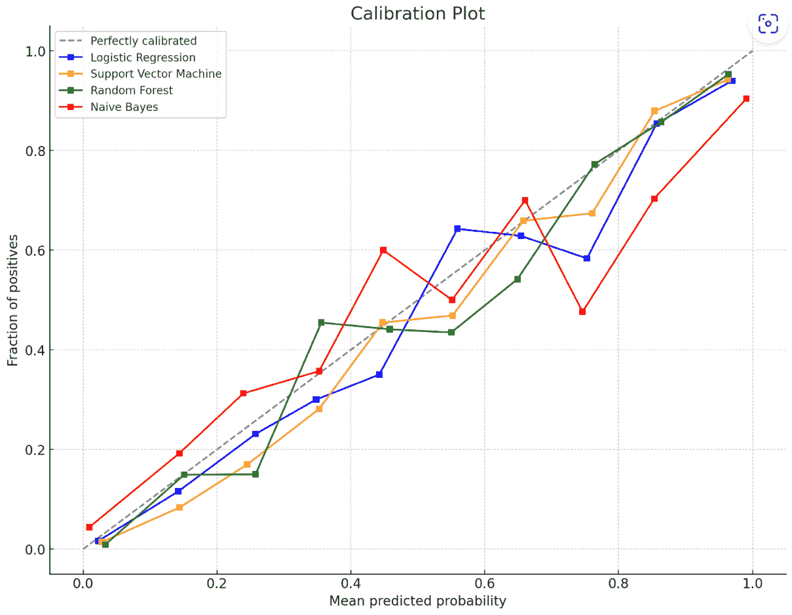
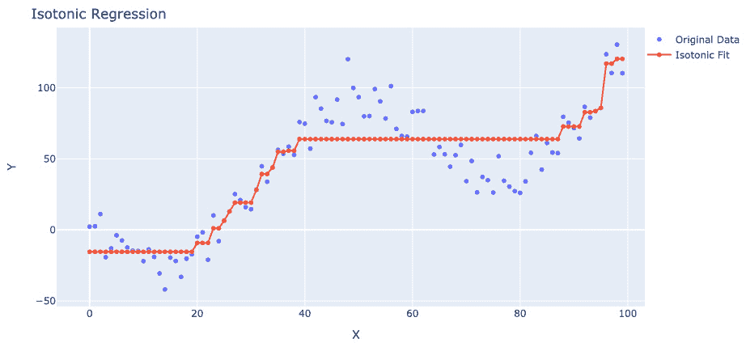

# 第六章：符合预测的分类

本章将更深入地探讨分类问题的符合预测。我们将探讨分类器校准的概念，并在介绍符合预测中的专用技术 Venn-ABERS 预测器之前，展示符合预测与其他校准方法的比较。此外，我们还将概述可用于实现分类器校准的符合预测的开源工具。

在本章中，我们将涵盖以下主题：

+   分类器校准

+   评估校准性能

+   分类器校准的各种方法

+   符合预测的分类器校准

+   用于分类问题中的符合预测的开源工具

# 分类器校准

大多数统计、机器学习和深度学习模型输出预测的类别标签，模型通常根据其准确性进行评估。

准确性是评估机器学习分类模型性能的常用指标。它量化了正确识别的实例与数据集中总数之比。换句话说，准确性告诉我们模型预测与数据真实标签一致的程度。

准确性得分衡量模型预测与真实观察标签匹配的频率。它是所有预测中正确预测的比例。0 到 1 之间的准确性得分量化了模型预测与真实数据相比的准确性。接近 1 的较高准确性得分表示模型整体表现非常准确，大多数预测都是正确的。接近 0 的较低准确性表示性能较差，与真实标签相比，模型的大多数预测都是错误的。

准确性越接近 1，模型的表现越好。越接近 0，模型在预测数据中的真实标签方面的表现越差。

准确性是一个简单直观的指标，易于理解和解释。然而，它可能并不总是最合适的指标，尤其是在处理不平衡数据集时。在不平衡数据集中，不同类别的实例数量差异很大，仅凭准确性可能具有误导性。在不平衡数据集中，一个始终预测多数类的分类器可以根据类别分布获得高准确性，即使它没有识别出少数类。

在这些情况下，查看其他评估指标，如精确度、召回率、F1 分数或 ROC-AUC，对于全面了解模型的有效性至关重要。

根据具体问题和要求，其他指标和考虑因素，如假阳性和假阴性的成本，可能更为相关。因此，使用多个评估指标评估模型性能并考虑分类模型将应用到的上下文是至关重要的。

单纯的准确性可能不足，尤其是在关键应用中，原因有以下几点：

+   **不平衡数据集**：在数据集不平衡的情况下，准确性可能会误导。如果大多数类别主导数据集，那么仅预测大多数类别的模型可以达到高准确性，但无法有效地捕捉少数类别。在正确识别罕见事件或检测异常至关重要的关键应用中，这可能会成为问题。

+   **错误成本**：在许多实际应用中，假阳性和假阴性的成本可能差异很大。准确性将所有错误视为同等，并且不考虑误分类的后果。例如，在医疗诊断中，一个假阴性（未能检测到疾病）可能比一个假阳性（错误地检测到疾病）要严重得多。在这种情况下，仅准确性并不能提供关于模型性能的充分信息，即对决策和结果的实际影响。

+   **概率估计**：准确性不考虑模型预测的置信度或不确定性。评估模型提供良好校准的概率估计的能力是至关重要的。校准是指预测概率与事件的真实概率之间的对齐。一个校准不良的模型可能会提供过度自信或不可靠的概率估计，这可能导致错误的决策或对风险的误解。

+   **决策阈值**：准确性不考虑用于分类的决策阈值。不同的决策阈值会导致精确度和召回率之间的不同权衡。根据应用，某些误分类错误可能比其他错误更可容忍。仅评估准确性并不能提供关于模型在不同决策阈值下性能的见解。

让我们来了解分类器校准的概念。

## 理解分类器校准的概念

在前面的章节中，我们定义并讨论了分类器校准的概念。

分类器校准包括调整分类模型的预测概率，以便它们更好地反映每个类的真实可能性。目标是使预测更加校准。

一个校准良好的分类器是指预测概率与经验概率相匹配的分类器。例如，如果模型在 100 个示例中预测“类别 A”的概率为 60%，那么在 100 个预测中，类别 A 应该大约出现 60 次。

更正式地说，一个校准良好的分类器满足以下公式：

P(实际类别为 c | 预测 c 的概率为 p) ≈ p

这意味着当模型以概率 p 预测类别 c 时，类别 c 的观察频率应该接近 p。

校准调整确保预测概率与实际数据中的相对频率相一致。预测被校准到经验证据上，因此预测概率为`0.7`对应于基于数据的 70%的可能性。这种校准对于概率估计的有意义和可靠性至关重要。

例如，考虑一个二元分类器，它预测一封电子邮件是否为垃圾邮件。对于每封电子邮件，它可能会预测一个概率，比如说`0.8`，这意味着它认为这封电子邮件有 80%的可能性是垃圾邮件。如果分类器校准良好，那么在所有被分配`0.8`垃圾邮件概率的电子邮件中，大约 80%应该是垃圾邮件。

没有校准，分类器的输出概率可能不会对应于预测类别的真实可能性，这可能会对决策造成问题。校准方法调整这些概率以更好地反映现实。目标是使分类器的输出概率尽可能接近真实概率。

模型校准至关重要，原因如下：

+   **可靠的概率估计**：校准分类器为预测类别提供准确和可靠的概率估计。概率估计反映了模型对其预测的信心，可以解释为特定类别正确的可能性。在许多实际应用中，如医疗诊断、风险评估或欺诈检测，拥有良好的概率估计对于做出明智的决策和评估与预测相关的不确定性水平至关重要。

+   **可靠的风险评估**：在许多领域，准确的风险评估至关重要。校准分类器提供校准良好的概率估计，反映了事件的真正可能性。这允许更准确和可靠的风险评估，使决策者能够更有效地分配资源、优先处理行动或估计某些事件的影响。例如，在信用评分中，校准分类器可以提供准确的违约概率估计，有助于更好的风险管理。

+   **决策阈值确定**：在分类任务中，决策通常是通过在预测概率上设置一个阈值来做出的。这个阈值决定了精确度和召回率之间的权衡，或者说，是假阳性与假阴性之间的权衡。校准后的分类器通过将概率估计与期望的权衡相一致，考虑到不同类型错误的具体成本或后果，有助于选择合适的决策阈值。这确保了决策与应用的目标和要求相一致。

+   **可解释性和信任**：校准增强了模型预测的可解释性。校准后的概率估计可以用来理解模型对其预测的信心水平。这种透明度有助于与用户、利益相关者和监管机构建立信任，特别是在决策至关重要且必须得到证明的领域。通过提供良好的校准概率估计，模型的预测可以更好地被理解和验证，从而增强对其可靠性的信心。

+   **提高公平性**：校准后的分类器可以促进决策过程中的公平性。通过提供良好的校准概率估计，它们可以帮助识别和减轻可能源于底层训练数据或模型假设的偏差。这允许做出更公平、更公正的预测，确保不同群体得到一致的对待，且没有不合理的偏见。

评估模型校准对于确保模型的预测与数据中的潜在不确定性相一致至关重要。这种评估有助于做出明智的决策，了解模型的局限性，并管理与误分类或错误的概率估计相关的风险。

传统上，许多分类器，如逻辑回归或支持向量机，基于其内部模型生成概率估计。然而，这些概率估计并不总是准确或校准良好的，导致对预测过度自信或缺乏信心。例如，分类器可能将接近 `1.0` 或 `0.0` 的概率分配给某些示例，而它应该分配接近 `0.7` 或 `0.3` 的概率，分别。

为了解决这个问题，已经提出了各种技术来校准分类器并提高其概率估计的可靠性。这些技术旨在将原始概率得分映射到更准确和校准后的概率。目标是确保，平均而言，预测的概率与观察到的预测事件的频率或可能性相匹配。

# 评估校准性能

评估分类器的校准性能对于评估其概率估计的可靠性和准确性至关重要。校准评估使我们能够确定预测概率与预测事件的真实概率或似然度之间的匹配程度。以下是评估分类器校准性能的一些常用技术：

+   **校准图**：校准图通过视觉方式评估分类器的预测概率与真实类频率的匹配程度。*x*轴显示每个类的预测概率，而*y*轴显示这些预测的经验观察频率。

    对于一个校准良好的模型，校准曲线应与对角线紧密匹配，表示预测概率与实际概率之间存在 1:1 的关系。偏离对角线表明存在误校准，即预测与经验证据不一致。

    校准图提供了一种直观的方法来识别分类器在不同概率范围内对其估计的过度自信或不足自信。曲线越接近对角线，预测概率的校准就越好。显著的偏差表明需要对模型的输出进行重新校准，以确保其可靠性：



图 6.1 – 校准图

+   **校准误差**：校准误差衡量预测概率与预测事件的实际概率之间的平均差异。它由估计概率与观察概率之间的平均绝对偏差确定。较低的校准误差值表示校准性能更好。

+   **校准指标**：可以使用多个指标来评估分类器的校准性能。常用的指标包括**期望校准误差**（**ECE**）、对数损失和 Brier 分数。ECE 通过将预测概率划分为区间并计算每个区间内平均预测概率与平均经验概率之间的差异来衡量校准误差。Brier 分数评估预测概率的整体准确性，考虑了概率估计的校准和解算（锐度）。Brier 分数是评估概率预测校准的常用评分规则。它衡量预测概率与实际结果之间的平均平方差异。

    对于一组*N*个预测，Brier 分数计算为 BS = 1 * N ∑ t=1 N (f_t − o_t)²，其中*ft,i*是时间*t*对事件*i*的预测概率，*ot,i*是时间*t*事件*i*的实际结果（0 或 1）。

    将误差平方赋予大错误更大的权重。然后对所有预测取平均平方误差。

    较低的 Brier 分数表示校准更好，对于完美的概率预报员，最小值为 0。它惩罚不准确以及过度/不足自信的预测。

+   **交叉验证**：交叉验证是一种估计校准性能的技术。它通过将数据集划分为多个折叠，在一个折叠上训练模型，同时在剩余的折叠上评估校准来实现。这有助于评估不同数据子集的校准性能，并提供更稳健的评估。

在评估校准性能时，将结果与适当的基线进行比较是很重要的。一个校准良好的分类器应该优于随机或未校准的概率估计。

# 分类器校准的各种方法

在探讨一致性预测如何提供校准概率之前，我们首先将讨论一些常见的非一致性校准技术及其优缺点。这些包括直方图分箱、Platt 缩放和等调回归。

需要注意的是，以下方法不属于一致性预测框架的一部分。我们介绍它们是为了建立对校准的直觉，并突出一些传统校准方法中的挑战。这个背景将激发对一致性预测视角的需求及其好处，以便我们获得可靠的概率估计。

我们将要探索的校准技术，包括直方图分箱、Platt 缩放和等调回归，代表了调整分类器置信值值广泛使用的方法。然而，正如我们将讨论的，它们在模型灵活性、计算成本和泛化方面存在某些局限性。

通过首先理解这些现有的校准方法和它们的缺点，我们将能够更好地理解一致性预测固有的校准属性的价值。这个背景在介绍一致性预测作为有吸引力的现代解决方案之前，为校准问题提供了背景。

## 直方图分箱

直方图分箱是一种在分类器校准中常用的技术，用于提高概率估计的校准性能。它涉及将预测概率划分为箱或区间，并根据每个箱内预测事件的经验频率或观察比例，将它们映射到更准确和可靠的概率。直方图分箱的目标是将预测概率与事件的真正概率对齐，从而得到校准更好的分类器。

直方图分箱的过程可以概括如下：

1.  **分区**：预测概率被划分为预定义的多个箱或区间。箱的数量可以根据数据集和所需的校准粒度而变化。

1.  **箱子分配**：数据集中的每个实例根据其预测概率分配到相应的箱子中。例如，如果我们有五个等宽间隔的箱子（例如，*0-0.2*，*0.2-0.4*，*0.4-0.6*，*0.6-0.8*，和*0.8-1.0*），一个预测概率为 0.45 的实例将被分配到第三个箱子。

1.  `0.7`。

1.  **映射到校准概率**：然后根据正例的实证比例，将每个箱子内的预测概率映射或调整为更准确和校准良好的概率。此映射可以使用各种技术执行，例如等调回归或 Platt 校准。

1.  **整体校准**：一旦映射应用于所有箱子，通过结合所有箱子的概率，获得校准概率。结果是校准概率集，更好地与事件的真正概率或似然性对齐。

这里是使用直方图分箱进行分类器校准的一些潜在缺点：

+   **不灵活性**：直方图分箱将预测空间划分为固定间隔。它缺乏建模复杂、非线性误校准模式的灵活性。

+   **数据未充分利用**：硬分箱会丢弃每个箱子内的信息。校准映射仅使用箱子平均值而不是整个分布。

+   **对分箱方案的敏感性**：校准质量取决于所选的具体分箱阈值，这些阈值可能是任意的。最优分箱通常事先未知。

+   **不连续性**：相邻箱子可能具有非常不同的调整，导致校准映射中的突然不连续性。这可能会引入伪影。

+   **外推困难**：分箱校准仅基于训练数据分布。它可能无法很好地外推到稀疏或无覆盖的未见数据。

+   **维度诅咒**：直方图在处理高维特征空间时扩展性不佳。数据在每个箱子内变得过于稀疏。

+   **模型表达能力有限**：直方图只能表示简单、低阶的校准关系。它们无法建模复杂的误校准模式。

直方图分箱易于实现，但提供的校准映射不够灵活，不连续。通常需要更复杂的密集建模和平滑处理以获得最佳的校准质量。

## Platt 校准

Platt 校准，有时被称为 Platt 方法或 Sigmoid 校准，是一种后处理方法，用于细化二元分类模型的输出概率。它由 John C. Platt 于 1999 年提出，用于将支持向量机分类器的原始输出分数转换为校准良好的概率。

Platt 缩放法的目的是调整分类器产生的预测分数或 logits，使其更准确地反映真实概率的估计。这是通过在分类器的分数上拟合逻辑回归模型，同时使用标记验证集或保留集来实现的。逻辑回归模型被训练以将原始分数映射到校准概率。

Platt 缩放法涉及到的步骤如下：

1.  收集一个与用于训练分类器的训练数据不同的标记验证集或保留集。

1.  使用分类器为验证集中的实例生成原始输出分数或 logits。

1.  在验证集上拟合逻辑回归模型，将原始分数视为自变量，将真实类别标签视为因变量。

1.  使用标准技术（如最大似然估计或梯度下降）训练逻辑回归模型以估计模型参数。

1.  一旦训练了逻辑回归模型，它可以用作校准函数。给定一个新实例，分类器产生的原始分数被输入到逻辑回归模型中，该模型将其转换为校准概率估计。

逻辑回归模型本质上通过估计截距和斜率参数来学习从原始分数到校准概率的转换。这种转换由 Sigmoid 函数表示，它将分数映射到`0`到`1`之间的概率。

Platt 缩放法旨在通过调整预测概率以匹配事件的真正概率或似然性来达到更好的校准。

重要的是要注意，Platt 缩放法假设原始分数与真实概率之间的关系可以通过逻辑函数建模。如果底层关系更复杂，其他校准方法（如一致性预测）可能更合适。

虽然 Platt 缩放法可以是一种有效的校准分类器概率的技术，但重要的是要了解其局限性和潜在缺点：

+   **对单独验证集的要求**：Platt 缩放法需要一个与训练数据不同的标记验证集或保留集。这意味着可能需要额外的数据进行校准，这在获取标记数据困难或成本高昂的情况下可能是一个限制。

+   **对逻辑关系的假设**：Platt 缩放法假设原始分数与真实概率之间的关系可以通过逻辑函数准确建模。如果底层关系更复杂或不同，逻辑回归模型可能无法充分捕捉真实的校准映射。

+   **对极端分数敏感**：Platt 缩放可能对验证集中的极端分数或异常值敏感。异常值可能不成比例地影响校准函数，导致潜在的过拟合或次优校准。

+   **对不同校准形状的灵活性不足**：Platt 缩放中使用的逻辑回归模型被限制为拟合一个 S 形函数，这可能不适合所有校准形状。如果所需的校准形状与 S 形曲线有显著偏差，Platt 缩放可能无法实现最佳校准。

+   **对多类问题的适用性有限**：Platt 缩放主要设计用于二元分类问题。将其扩展到多类分类可能具有挑战性，因为它需要调整校准映射以处理多个类别及其相应的概率。

+   **极端概率中的潜在过度自信**：Platt 缩放可能会在极端预测概率中引入过度自信。接近边界（接近 0 或 1）的校准概率可能比应有的更极端，导致在这些区域产生过度自信的预测。

+   **依赖于验证集的质量**：Platt 缩放的有效性取决于验证集的质量和代表性。如果验证集未能准确捕捉目标变量的真实分布，则得到的校准可能不是最优的。

考虑这些缺点并评估 Platt 缩放是否适合特定应用非常重要，或者根据问题的具体特征和数据集，基于一致性预测等方法可能更适合。

## 等调回归

等调回归是一种非参数回归技术，用于校准和单调性建模。它通常用于调整分类器的输出分数或预测概率，以提高其校准。等调回归旨在找到一个单调函数，将原始分数映射到校准概率，同时保留分数的顺序。

等调回归的主要目标是确定一个非递减函数，该函数可以减少预测概率与目标概率或实际发生之间的平方差异之和。通过将分段线性或分段常数函数拟合到数据中，等调回归确保预测概率是单调递增或非递减的。

等调回归的步骤如下：

1.  收集一个与训练数据分开的标记验证集或保留集。

1.  使用分类器生成验证集中实例的原始输出分数或概率。

1.  根据原始分数对验证集中的实例进行排序。

1.  将等调回归函数初始化为恒等函数，其中初始预测概率等于原始分数。

1.  通过调整预测概率以最小化预测概率与目标概率之间的平方差，迭代更新等调回归函数。这种调整受非递减概率的约束。

1.  重复更新过程，直到收敛或达到停止标准：



图 6.2 – 等调回归

一旦训练好等调回归模型，就可以用它将新实例的原始分数映射到校准概率。该模型确保预测概率单调递增，并与事件的真正概率或似然性更好地对齐。

虽然等调回归是校准分类器概率的有价值技术，但考虑其局限性和潜在缺点是很重要的：

+   **潜在的过拟合**：如果校准函数过于复杂或校准数据集很小，等调回归可能会过拟合。正则化技术，如使用分段线性函数中的有限段数，可以帮助防止过拟合。

+   **复杂性和计算成本**：等调回归可能资源密集，尤其是在处理大量数据集或导航高维特征时。随着数据点和唯一分数或概率数量的增加，等调回归的复杂性也会增加。在使用等调回归进行大量任务时，权衡计算限制至关重要。

+   **对异常值的敏感性**：等调回归可能对数据中的异常值敏感。异常值可能对估计的校准函数有重大影响，可能导致校准不佳。可能需要仔细的数据预处理或异常值检测技术来减轻这一问题。

+   **复杂校准形状的灵活性有限**：等调回归假设分数与概率之间存在单调关系，这限制了校准函数为分段常数或分段线性。这限制了模型捕捉更复杂或非线性校准形状的能力。如果所需的校准形状与单调性有显著偏差，等调回归可能无法提供最佳拟合。

+   **需要足够的数据**：等调回归需要足够数量的标记数据来准确估计校准函数。如果校准数据集很小或不平衡，估计可能不佳。确保校准数据集具有代表性且大小适当对于可靠的校准结果很重要。

+   **处理多类问题的困难**：等调回归本质上是为二元分类问题设计的，因此将其扩展到多类问题并不简单。将等调回归调整为处理多个类别及其相应的概率需要仔细考虑和修改算法。

+   **缺乏概率解释**：与使用逻辑回归显式建模概率的 Platt scaling 不同，等调回归不提供校准分数的概率解释。它仅专注于确保单调性，可能无法直接估计校准良好的概率。

在决定等调回归是否是最合适的校准方法时，评估这些局限性并考虑手头问题的特征是很重要的。

比较不同校准技术（如一致性预测和 Platt scaling）的优缺点，可以帮助确定在特定应用中实现校准良好的概率的最佳方法。

# 用于分类器校准的一致性预测

一致性预测是一个强大的概率预测框架，它提供了有效和校准良好的预测集和预测区间。它提供了一种原则性的方法来量化和控制与预测相关的不确定性。

我们已经看到，如**归纳一致性预测**（**ICP**）和**转导一致性预测**（**TCP**）等一致性预测方法旨在生成具有准确覆盖概率的集合。为了回顾，一致性预测通过比较每个潜在标签的 p 值与选定的显著性水平来计算 p 值并构建预测集。

与 Platt scaling、直方图分箱和等调回归等专注于校准预测概率或分数的方法不同，一致性预测通过提供包含与预测相关的不确定性的预测集，采取更全面的方法，并通过提供有效的置信度或显著性度量来增强预测的可靠性和可解释性。

## Venn-ABERS 一致性预测

经典方法如 Platt scaling 最初是作为校准分类器的参数解决方案开发的。然而，这些方法正变得有些过时，由于它们的简单假设，存在局限性，导致概率校准不佳。

Platt 缩放假设分数和概率之间存在逻辑关系，这在实际场景中可能不足以充分捕捉实际的校准形状。值得注意的是，Platt 在 1999 年的原始论文中并没有明确讨论这种方法的潜在假设。然而，最近的研究（参见 *Beta 校准：对二元分类器的逻辑校准的一种有根据且易于实施的改进*：https://proceedings.mlr.press/v54/kull17a.html）揭示了这些假设本质上等同于假设正态性和同方差性，这对于现实世界的数据集来说是过于严格的假设。现实数据集通常表现出更复杂和多样化的模式，这些模式无法通过此类假设准确捕捉。因此，仅依靠 Platt 缩放及其潜在假设可能会导致校准不佳和校准概率不佳。

同质性回归作为一种方法，假设分数和概率之间存在单调关系。然而，这种假设可能无法捕捉所有情况下校准曲线的复杂本质。此外，同质性回归依赖于测试数据集上完美排序（ROC AUC 为 1）的假设，这在现实世界的数据集中很少能够实现。此外，已有研究表明，当应用于较小的数据集时，同质性回归可能会过拟合。

单调关系的假设限制了同质性回归的灵活性，使其难以模拟可能表现出非单调模式的更复杂的校准曲线。此外，测试数据集上完美排序（ROC AUC 为 1）的要求通常是不切实际的，因为数据集通常涉及固有的噪声和不确定性。这种假设在实践中可能导致校准结果不佳。

此外，当处理较小的数据集时，同质性回归的过拟合问题变得更加突出。当数据集的大小有限时，同质性回归可能会过度调整到噪声或训练数据的特定特征，从而导致泛化性能不佳。

由于它们的简单假设，Platt 缩放和同质性回归可能无法实现最佳校准，并且可能无法提供良好的校准概率。这些方法可能难以捕捉非线性或更复杂的校准模式，限制它们在某些应用中的有效性。

为了解决经典校准器（如 Platt 缩放和同质性回归）的局限性，符合预测的创造者 Vladimir Vovk、Ivan Petej 和 Valentina Fedorova 开发了一种名为 Venn-ABERS 的强大解决方案。Venn-ABERS 是一种符合预测方法，无论数据分布、数据集大小或潜在分类模型如何，都能提供有效性的数学保证。

这项工作在 NeurIPS 论文《带有和没有有效性保证的大规模概率预测器》中有详细描述（[`papers.nips.cc/paper_files/paper/2015/hash/a9a1d5317a33ae8cef33961c34144f84-Abstract.html`](https://papers.nips.cc/paper_files/paper/2015/hash/a9a1d5317a33ae8cef33961c34144f84-Abstract.html)）。为了更数学化的理解，请观看相关的演示，*带有和没有有效性保证的大规模概率预测*，在[`www.youtube.com/watch?v=ksrUJdb2tA8`](https://www.youtube.com/watch?v=ksrUJdb2tA8)。

Venn-ABERS 这个名字来源于 Venn 预测器，另一类共形预测器，以及为经典论文《具有不完整信息的抽样经验分布函数》（M. Ayer, H.D. Brunk, G.M. Ewing, W.T. Reid, 和 E. Silverman：[`projecteuclid.org/journals/annals-of-mathematical-statistics/volume-26/issue-4/An-Empirical-Distribution-Function-for-Sampling-with-Incomplete-Information/10.1214/aoms/1177728423.full`](https://projecteuclid.org/journals/annals-of-mathematical-statistics/volume-26/issue-4/An-Empirical-Distribution-Function-for-Sampling-with-Incomplete-Information/10.1214/aoms/1177728423.full)）做出贡献的作者的首字母缩写。

那么，Venn-ABERS 预测器是如何工作的呢？Venn-ABERS 不是一次性构建等调回归，而是通过假设每个测试对象都可以具有标签 0 和标签 1，进行两次等调回归的拟合。这意味着每个测试对象被添加到校准集中两次，一次是标签 0，一次是标签 1。然后拟合两个独立的等调回归，为每个测试对象得到两个概率，*p0*和*p1*。

重要的是要注意，*p0*（下限）和*p1*（上限）都代表对象属于类别 1 的概率。这些概率为类别 1 的概率创建了一个预测区间，并提供了数学保证，实际概率落在这个区间内。

因此，Venn-ABERS 完美地解决了这个问题，无需对得分分布（如 Platt 缩放）做出假设，也不会出现过度拟合的问题。

Venn-ABERS 的预测是一个多预测器，区间(*p0, p1*)的宽度包含了关于分类置信度的宝贵信息。在较大的数据集中，*p0*和*p1*通常非常接近。然而，对于较小且更具挑战性的数据集，*p0*和*p1*可能会分离，这表明某些对象由于数据分布、数据不足或底层分类器的性能等因素而难以分类。

重要的是，在关键情况下，Venn-ABERS 预测器不仅输出准确且校准良好的概率，而且通过扩大(*p0, p1*)区间发出“警报”。这个警报表明决策过程应考虑增加的不确定性。

对于实际决策目的，可以使用公式*p = p1 / (1 - p0 + p1)*将概率合并成一个单一值。这个类*1*的合并概率*p*可以用于决策任务，如贷款发放或确定是否在自动驾驶汽车中禁用自动驾驶。包含*p*后，决策过程可以成功完成。

## 比较校准方法

考虑到校准方法的范围，你可能想知道它们是如何相互比较的。我们已经看到，像 Platt 缩放和等调回归这样的经典方法依赖于限制性假设，并且与符合预测的 Venn-ABERS 方法不同，它们没有有效性保证。一个有趣的问题也是，不同方法在一系列数据集上的性能如何进行实证比较。

这样一项研究已经完成，其结果总结在论文《scikit-learn 中的概率预测》*Probabilistic Prediction in scikit-learn* ([`www.diva-portal.org/smash/get/diva2:1603345/FULLTEXT01.pdf`](http://www.diva-portal.org/smash/get/diva2:1603345/FULLTEXT01.pdf))中。在这篇论文中，进行了一项大规模的实验研究，以调查 scikit-learn 模型的开箱即用校准情况。此外，该研究还探讨了诸如 Platt 缩放、等调回归和 Venn-ABERs 之类的校准技术是否能够改善校准。

研究结果表明，在评估的七个算法（逻辑回归、随机森林、AdaBoost、梯度提升、kNN、朴素贝叶斯和决策树）中，唯一获得良好校准预测的模型是逻辑回归。校准增强了所有模型，尤其是决策树、提升树（如 XGBoost、LightGBM 和 CatBoost）以及朴素贝叶斯。这强调了专业人士的明确建议：获得相对良好的校准预测的是逻辑回归。

此外，该研究揭示了一个值得注意的发现，即校准不当的模型往往表现出高度的过度自信。令人惊讶的是，即使是逻辑回归，尽管与其他模型相比程度较轻，但在其预测中也显示出系统性的乐观。

换句话说，这些校准不当的模型往往赋予其预测更高的概率或信心，高于实际结果所证明的。这种过度自信可能导致决策失误或对预测可靠性的错误信任。

认识到，尽管逻辑回归在与其他模型相比表现出更好的校准，但它仍然表现出一定程度的系统性乐观。这突出了彻底评估和校准模型的重要性，即使是那些被认为是校准良好的模型，以确保准确和可靠的概率预测。

当从校准技术的校准效益角度审视时，通常观察到其有效性顺序为 Venn-ABERS，其次是 Platt 缩放和等调回归。

Venn-ABERS 往往在校准方面显示出最显著的改进，在实现良好校准的预测方面提供了显著的好处。在一致性预测框架内使用它，可以可靠地估计不确定性并提高校准性能。

总结来说，对校准技术的比较显示，Venn-ABERS 往往能带来最显著的好处，其次是 Platt 缩放和等调回归。根据手头问题的具体要求选择适当的技术非常重要，需要考虑的因素包括校准曲线的复杂性和期望的校准改进水平。

研究的发现强调，校准不当的模型往往表现出过度自信，即使是比其他模型更校准的逻辑回归，也可能表现出系统性的乐观。这突出了评估和增强模型校准的必要性，以避免不必要的自信，并基于准确的概率预测做出明智的决策。研究进一步指出，未校准的模型通常也表现出过度自信。这包括逻辑回归，虽然系统性的乐观程度较低，但仍然存在。

# 用于分类问题中的校准预测的开源工具

在深入研究分类问题中的一致性预测的复杂性时，已经很明显，合适的工具可以显著提高我们的实施效率。认识到这一点，开源社区通过提供针对此目的定制的各种工具做出了显著的贡献。在本节中，我们将探讨一些突出的开源校准预测工具，这些工具可以无缝集成到你的项目中，并提升你的预测能力。

## Nonconformist

`nonconformist`([`github.com/donlnz/nonconformist`](https://github.com/donlnz/nonconformist))是一个经典的校准预测包，可用于分类问题中的校准预测。

让我们通过`nonconformist`来展示如何创建一个 ICP。你可以在这里找到包含相关代码的 Jupyter 笔记本：[`github.com/PacktPublishing/Practical-Guide-to-Applied-Conformal-Prediction/blob/main/Chapter_06.ipynb`](https://github.com/PacktPublishing/Practical-Guide-to-Applied-Conformal-Prediction/blob/main/Chapter_06.ipynb)：

1.  你可以在这里找到`nonconformist`的文档：http://donlnz.github.io/nonconformist/index.html。首先，我们将使用标准功能安装`nonconformist`——即`pip install`：

    ```py
    !pip install nonconformist
    ```

1.  我们可以按照以下方式导入相关模块：

    ```py
    from nonconformist.base import ClassifierAdapter
    ```

    ```py
    from nonconformist.cp import IcpClassifier
    ```

    ```py
    from nonconformist.nc import NcFactory
    ```

    ```py
    from nonconformist.nc import ClassifierNc,
    ```

    ```py
    InverseProbabilityErrFunc, andMarginErrFunc specify the nonconformity measure using NcFactory.create_nc
    ```

    在这个案例中，我们创建了一个具有公差度量指标的 ICP；我们已在之前的章节中讨论了这一点。此 ICP 使用逻辑回归作为基础分类器：

    ```py
    icp=IcpClassifier(ClassifierNc(ClassifierAdapter (LogisticRegression()), MarginErrFunc()))
    ```

1.  然后，我们必须使用适当的训练集来拟合 ICP，并使用校准集来校准它：

    ```py
    icp.fit(X_train, y_train)
    ```

    ```py
    icp.calibrate(X_calib, y_calib)
    ```

1.  使用训练好的模型，我们可以在校准集和测试集上获得预测的类别得分：

    ```py
    y_pred_calib = model.predict(X_calib)
    ```

    ```py
    y_pred_score_calib = model.predict_proba(X_calib)
    ```

    ```py
    y_pred_test = model.predict(X_test)
    ```

    ```py
    y_pred_score_test = model.predict_proba(X_test)
    ```

在笔记本中，我们使用了一个与葡萄牙银行机构的直接营销活动相关的银行营销数据集（[`archive.ics.uci.edu/dataset/222/bank+marketing`](https://archive.ics.uci.edu/dataset/222/bank+marketing)）。此数据集包含以下特征：

+   `age`（数值）

+   `job`: 职业类型（分类：`行政`、`未知`、`失业`、`管理`、`家政`、`企业家`、`学生`、`蓝领`、`自雇`、`退休`、`技术人员` 或 `服务行业`)

+   `marital`: 婚姻状况（分类：`已婚`、`离婚` 或 `单身`；注意，`离婚` 表示离婚或丧偶）

+   `education`（分类：`未知`、`中学`、`小学` 或 `大学`)

+   `default`: 是否有信用违约？（二进制：`是` 或 `否`)

+   `balance`: 平均年度余额，以欧元为单位（数值）

+   `housing`: 是否有住房贷款？（二进制：`是` 或 `否`)

+   `loan`: 是否有个人贷款？（二进制：`是` 或 `否`)

以下特征与当前活动的最后联系相关：

+   `contact`: 联系沟通类型（分类：`未知`、`电话` 和 `手机`)

+   `day`: 月份最后联系日（数值）

+   `month`: 年度最后联系月份（分类：`jan`、`feb`、`mar`、...、`nov`、`dec`)

+   `duration`: 最后联系持续时间，以秒为单位（数值）

其他属性如下：

+   `campaign`: 在此活动中为此客户进行的联系次数（数值；这包括最后联系）

+   `pdays`: 客户上次被联系后经过的天数（数值；`-1` 表示客户之前未被联系）

+   `previous`: 在此活动之前为此客户进行的联系次数（数值）

+   `poutcome`: 上一次营销活动的结果（分类：`未知`、`其他`、`失败` 或 `成功`)

输出变量（期望的目标）是 `y` – 客户是否订阅了定期存款？（二进制：`是`、`否`。）

目标是预测 `Class` 目标变量，以指示营销活动是否成功，即客户是否因营销活动而订阅了定期存款。数据集略微不平衡，大约有 12%的客户因营销活动而订阅了定期存款。

我们将使用 OpenML API 来访问和读取数据集。如前几章所述，ICP 需要一个单独的校准集，该集不应用于训练底层的机器学习分类器。在下面的代码中，我们创建了三个数据集 – *用于分类器的适当训练数据集*，*用于使用 ICP 校准分类器的校准数据集*，以及 *用于评估性能的测试数据集*。数据集包含 45,211 个实例；我们必须将其拆分，以便每个训练集和校准集都有 1,000 个实例：

```py
X_train_calib, X_test, y_train_calib, y_test = train_test_split(X, y, test_size=1000, random_state=42, stratify=y)
```

```py
X_train, X_calib, y_train, y_calib = train_test_split(X_train_calib, y_train_calib, test_size=1000, random_state=42, stratify=y_train_calib)
```

现在，我们可以使用逻辑回归构建底层分类器，并在测试集上计算准确率和 ROC AUC：

1.  首先，让我们使用标准的 scikit-learn 功能训练逻辑回归：

    ```py
    model = LogisticRegression()
    ```

    ```py
    model.fit(X_train, y_train)
    ```

1.  接下来，我们必须使用训练好的逻辑回归分类器模型来预测校准集和测试集上的类别标签和类别得分：

    ```py
    y_pred_calib = model.predict(X_calib)
    ```

    ```py
    y_pred_score_calib = model.predict_proba(X_calib)
    ```

    ```py
    y_pred_test = model.predict(X_test)
    ```

    ```py
    y_pred_score_test = model.predict_proba(X_test)
    ```

1.  现在，在测试集上计算分类准确率和 ROC AUC：

    ```py
    print('Classification accuracy on the test: {}'.format(accuracy_score(y_test, y_pred_test)))
    ```

    ```py
    print('ROC AUC on the test set: {}'.format(roc_auc_score(y_test, y_pred_score_test[:,1])))
    ```

到目前为止，我们只使用了标准的分类功能。现在，让我们使用 `nonconformist` 构建 ICP：

1.  首先，我们必须使用 `nonconformist` 的包装器创建 ICP 分类器：

    ```py
    icp = IcpClassifier(ClassifierNc(ClassifierAdapter (LogisticRegression()),MarginErrFunc()))
    ```

    这段代码片段构建了一个使用逻辑回归作为底层机器学习模型的 ICP。以下是发生的事情的分解：

1.  `` `LogisticRegression()` ``: 这是 Python 中 scikit-learn 库的一个用于二元分类任务的分类器。它预测属于特定类别的实例的类别得分。

1.  `` `ClassifierAdapter(LogisticRegression())` ``: 这将逻辑回归模型包装起来，使其与非一致性评分器兼容。适配器确保底层分类器的方 法与非一致性评分器的期望相一致。

1.  `` `ClassifierNc(ClassifierAdapter(LogisticRegression()))` ``: 这里，创建了一个非一致性评分器。在一致性预测的上下文中，非一致性评分器用于衡量一个实例根据训练数据偏离正常程度的大小。在这种情况下，`ClassifierNc` 使用 `ClassifierAdapter` 创建了一个基于逻辑回归分类器的非一致性评分器。

1.  `` `MarginErrFunc()` ``: 这是我们在前几章中讨论的非一致性度量。在 `nonconformist` 中，边缘误差被定义为 0.5 − ˆ P(y i ∣ x) − max y!=y  i  ˆ P(y ∣ x)  _____________ 2 .

1.  `` ` ```pyIcpClassifier(ClassifierNc(ClassifierAdapter` **(LogisticRegression())), MarginErrFunc())`**: Finally, an ICP is created. An ICP is a type of conformal predictor that separates the calibration set from the training set, thereby providing valid predictions even under distribution shift. It uses the defined nonconformity scorer (based on the logistic regression classifier) and the margin error function to make predictions.
7.  Then, we must train the ICP classifier on the proper training set and calibrate it on the calibration set:

    ```

    icp.fit(X_train, y_train)

    ```py

    ```

    icp.calibrate(X_calib, y_calib)

    ```py

8.  Now that we have trained the conformal predictor, we can compute predictions on the test set using the specified significance level:

    ```

    # 为测试集生成预测，置信度为 95%

    ```py

    ```

    prediction = icp.predict(X_test.values, significance=0.05)

    ```

注意 `nonconformist` 使用经典的一致性预测并输出预测集。

`nonconformist` 是一个基于 scikit-learn 构建的 Python 库，专注于实现分类任务的一致性预测方法。它提供了一套全面的工具和算法，用于生成预测区间、估计不确定性和增强分类模型中的校准。以下是 `nonconformist` 库的主要功能和能力概述：

+   `nonconformist` 提供了专门为分类设计的一致性预测算法。这些算法包括以下内容：

    +   **归纳一致性分类器**（**ICC**）：这基于训练集构建非一致性度量和一个预测区域

    +   **传递性一致性分类器**（**TCC**）：这将在预测区域的构建中将测试集纳入其中

    +   **Venn 预测器**：这通过嵌套 Venn 区域生成预测区间，以控制假阳性的数量

    +   **随机森林一致性预测器**：这利用随机森林模型作为一致性预测的底层分类器

+   `nonconformist` 与 scikit-learn 无缝集成，使用户能够利用 scikit-learn 丰富的分类器集合。它提供了一个包装类，允许在一致性预测框架中使用 scikit-learn 分类器。

+   `nonconformist` 还提供了评估校准质量的工具，例如可靠性图。

+   `nonconformist` 提供评估指标来评估一致性预测模型的性能。这些指标包括准确率、错误率、p 值和效率度量，使得对不同模型进行彻底的评估和比较成为可能。

+   **交叉验证支持**：该库提供了对使用一致性预测模型进行交叉验证的支持。这使得模型能够在数据集的不同折叠中进行稳健的评估和验证。

`nonconformist` 是将一致性预测技术应用于分类问题的强大工具。凭借其广泛的算法、与 scikit-learn 的兼容性、校准和不确定性估计能力、评估指标以及交叉验证支持，`nonconformist` 为实现和评估分类任务中的一致性预测模型提供了一个全面的框架。它是研究人员和实践者将一致性预测纳入其分类项目的宝贵资源。

# 摘要

在本章中，我们开始了一次针对分类任务的共形预测的启发式探索。我们首先强调了校准在分类领域的重要性，强调了它在确保模型预测的可靠性和可信度方面的作用。在我们的旅程中，我们了解了各种校准方法，包括共形预测的各种方法。我们观察到，共形预测独特地解决了校准的挑战，为传统方法提供了理论和实践上的优势。

我们还深入探讨了 Venn-ABERS 预测器的微妙领域，揭示了它们在校准过程中的作用和影响。

最后，我们强调了开源社区在这一领域的宝贵贡献。我们突出了如`nonconformist`库等工具，这些工具对于热衷于在他们的分类挑战中实施共形预测的从业者来说是必不可少的资源。

随着本章的结束，很明显，校准，尤其是共形预测，在增强分类模型的鲁棒性和可靠性方面发挥着关键作用。凭借我们手头的工具和知识，我们已充分准备，以更大的信心和精确度应对分类问题。

在下一章中，我们将介绍回归问题的共形预测。
