# 回归问题的共形预测

在本章中，我们将介绍回归问题的共形预测。

回归是机器学习的基础，使我们能够从给定数据中预测连续结果。然而，与许多预测任务一样，预测永远不会没有不确定性。传统的回归技术给我们一个点估计，但无法衡量不确定性。这就是共形预测力量的体现，它扩展了我们的回归模型，以产生良好校准的预测区间。

本章深入探讨了专门针对回归问题的共形预测。通过理解和欣赏量化不确定性的重要性，我们将探讨共形预测如何增强回归，不仅提供点预测，还提供整个区间，甚至分布，其中实际结果可能以预指定的置信度出现。这在许多现实场景中非常有价值，尤其是在基于预测做出决策且风险很高，仅仅“大致正确”还不够的情况下。

本章将涵盖以下主题：

+   回归问题的不确定性量化

+   产生预测区间的各种方法

+   回归问题的共形预测

+   使用共形预测构建预测区间和预测分布

# 回归问题的不确定性量化

完成本章学习后，无论何时预测任何连续变量，你都将能够为你的预测添加一层稳健性和可靠性。理解和量化这种不确定性对于以下几个原因至关重要：

+   **模型可解释性和可信度**：不确定性量化帮助我们理解我们模型预测的可靠性。通过提供一系列可能的输出，我们可以建立对我们模型预测的信任，并更有效地解释它们。

+   **决策制定**：在回归分析的许多实际应用中，决策者必须依赖点估计之外的东西。他们通常需要知道实际值可能落在某个概率范围内的范围。这个范围，或预测区间，提供了关于预测不确定性的关键信息，有助于风险管理。

+   **模型改进**：不确定性可以突出模型可能从额外数据或特征工程中受益的领域。高不确定性可能表明模型需要帮助捕捉潜在关系，这表明需要修订模型或添加更多数据。

+   **异常值检测**：不确定性量化还可以帮助我们识别数据中的异常值或异常情况。与高预测不确定性相关的观测值可能是异常值或表明在模型训练期间未捕获的新情况。

因此，不确定性量化是回归问题的一个基本组成部分。它提供了一个更全面的预测性能图景，允许更好的风险管理，并提高模型的信任度和可解释性。本章将讨论的回归的符合性预测，是一种在回归问题中有效量化不确定性的方法。

## 理解回归模型中不确定性的类型和来源

回归模型中的不确定性可能来自几个来源，并以不同的方式表现出来。广义上，这些不确定性可以分为两大类——**随机性**和**认知性**：

+   **随机不确定性**：这种类型的不确定性通常被称为“内在的”、“不可减少的”或“随机的”不确定性。它源于数据本身的固有变异性，这通常超出了我们的控制范围。即使我们收集更多数据或改进测量，这种不确定性也不会消失。随机不确定性反映了我们的样本群体中的随机性、变异性或异质性。

+   **认知不确定性**：也称为“可减少的”或“系统性的”不确定性，这种类型源于对研究中的系统或过程的了解不足。这可能是由于数据不足、测量误差或对潜在数据分布或模型结构的错误假设。与随机不确定性不同，认知不确定性可以通过更多的信息或数据来减少。

这些不确定性的主要来源如下：

+   **数据不确定性**：这包括测量误差、缺失值和数据中的变异性。数据可能在不同的条件下或来源下收集，这会给数据集增加更多的不确定性。

+   **模型不确定性**：这源于模型无法精确捕捉预测变量和结果之间的适当关系。每个模型都做出某些假设（例如，线性、独立性、正态性等），任何对这些假设的违反都会引入不确定性。

+   **参数不确定性**：每个回归模型都涉及估计参数（例如，系数）。这些估计总是存在一些不确定性，这可能会对预测的整体不确定性做出贡献。

+   **结构不确定性**：这指的是由于选择特定模型形式而产生的不确定性。不同的模型结构或类型（例如，线性回归、多项式回归等）可能会导致不同的解释和预测。

+   **残差不确定性**：这来自模型的残差或误差。它代表了观察到的结果与模型预测的结果之间的差异。

在回归模型的情况下，识别这些不确定性的类型和来源可以帮助更准确地解释模型的预测。它可以指导模型精炼和验证的过程。

## 预测区间的概念

预测区间是与回归预测相关的区间估计，表示实际结果可能落在这个范围内的概率。虽然点预测给出一个最可能的结果值，但预测区间提供了一个范围，提供了关于该预测不确定性的更清晰图景。

## 我们为什么需要预测区间？

让我们来看看：

+   **量化不确定性**：采用预测区间的首要原因是量化我们预测的不确定性。无论模型多么复杂，每个预测都伴随着固有的变异性。通过使用预测区间，我们可以有效地传达这种变异性。

+   **风险管理**：在各个行业中，特别是在金融、医疗保健和工程领域，了解潜在结果的范围对于风险评估和缓解至关重要。预测区间有助于决策者权衡他们行动的潜在风险和收益。

+   **模型透明度**：提供区间而不是仅仅的点估计可以增强模型的透明度。利益相关者不仅可以了解模型预测的内容，还可以了解模型对该预测的信心程度。

+   **指导决策**：当决策者了解最坏和最好的情况时，他们可以更加果断地采取行动。例如，了解销售预测中预测销售的上下限可以帮助分配资源。

在各种情境中理解预测区间的必要性为深入讨论其本质铺平了道路，尤其是在与置信区间比较时。

## 它与置信区间有何不同？

这种区别至关重要。置信区间涉及基于样本统计量的关于总体参数的不确定性。例如，我们可能会使用置信区间来估计基于样本均值的总体均值。另一方面，预测区间是关于预测单个未来观察值并量化该单个预测的不确定性的。

### 预测区间的组成部分

预测区间通常具有以下组成部分：

+   **下限**：预测范围内的最小值。

+   **上限**：预期范围内的最大值。

+   **覆盖概率**：实际结果落在预测区间内的概率。常用的概率是 90%、95%和 99%。

产生预测区间有各种方法。在回归模型中量化不确定性对于理解预测的可靠性至关重要。以下是一些最常用的技术：

+   **置信区间和预测区间**：这些是量化不确定性的基本技术。置信区间提供了一个范围，其中我们期望在给定的置信水平下，真实的回归参数将落在其中。另一方面，预测区间提供了一个范围，用于预测新的观测值，它结合了均值函数估计的不确定性和新观测值的随机性。

+   **重采样方法**：如自助法和交叉验证等技术可以提供模型不确定性的经验估计。例如，自助法涉及从数据集中有放回地重复采样并重新计算回归估计，以获得估计的经验分布。

+   **贝叶斯方法**：贝叶斯回归分析提供了一个概率框架来量化不确定性。贝叶斯回归不是给出单点估计，而是给出模型参数的后验分布，这可以用来构建预测区间。

+   **同构预测**：同构预测是一种较新的方法，它衡量机器学习算法做出的预测的确定性。它构建预测区域，在有限样本中达到有效的覆盖范围，而不对数据分布做出假设。

+   **分位数回归**：与标准回归技术不同，后者根据预测变量的特定值来建模响应变量的条件均值，分位数回归模型的是条件中位数或其他分位数。它可以提供对可能结果及其相关概率的更全面视角。

+   **蒙特卡洛方法**：蒙特卡洛方法是一类使用随机采样来获得数值结果的计算算法。在不确定性量化方面，蒙特卡洛方法可以用来传播输入变量到响应变量的不确定性。

+   **敏感性分析**：敏感性分析是一种技术，用于确定在给定的一组假设下，独立变量的不同值将如何影响特定的依赖变量。这种技术是在依赖于一个或多个输入变量的特定边界内使用的。

理解预测区间的内在价值和重要性对于辨别帮助我们生成它们的方方法和工具至关重要。虽然传统统计方法有其优点，但数据驱动行业的动态格局需要更适应性和可靠的技巧。基于算法随机性和有效性的同构预测提供了一种诱人的方法。随着我们过渡到下一部分，我们将探讨同构预测如何适应回归问题，确保我们的预测区间既准确又具有理论上的合理性。让我们深入探讨，揭示回归背景下同构预测的复杂性。

# 回归问题的符合预测

在前几章中，我们探讨了符合预测提供的众多优势。以下是一些包括：

+   **有效性和校准**：符合预测无论数据集的大小如何，都保持其有效性和校准。这使得它成为不同数据集大小预测的稳健方法。

+   **无分布特性**：符合预测的一个重要优点是其无分布特性。它不对底层数据分布做出具体假设，使其成为许多预测问题的灵活和多功能工具。

+   **与各种预测器的兼容性**：符合预测可以无缝地与任何点预测器集成，无论其性质如何。这一特性增强了其适应性，扩大了其在不同领域的应用范围。

+   **非侵入性**：符合预测框架是非侵入性的，这意味着它不会干扰或改变原始预测模型。相反，它是一个额外的层，量化不确定性，提供对模型预测的整体视角。

在回归分析中，一个至关重要的关注点是各种不确定性量化方法的有效性和校准。这些品质在生成预测区间时尤为重要，因为这些区间预期提供与指定置信水平相匹配的覆盖范围，这有时可能具有挑战性。

在由 Nicolas Dewolf、Bernard De Baets 和 Willem Waegeman 撰写的综合研究论文《回归问题的有效预测区间》中（[`arxiv.org/abs/2107.00363`](https://arxiv.org/abs/2107.00363)），作者们探讨了四种旨在回归场景中估计预测区间的广泛方法类别——贝叶斯方法、集成方法、直接估计方法和符合预测方法：

+   **贝叶斯方法**：这个类别包括使用贝叶斯定理来预测区间后验概率的技术。这些方法可以通过对整个输出分布进行建模来提供稳健的预测区间。

+   **集成方法**：如随机森林或袋装等集成方法可以通过利用集成中各个模型的变异性来生成预测区间。

+   **直接估计方法**：这些技术涉及直接计算预测区间。它们通常需要对底层数据或误差分布做出特定的假设。

+   **符合预测方法**：符合预测因其无分布特性和能够在各种场景下提供有效预测区间而脱颖而出。

本研究的作者强调，人类对人工智能系统的采用与这些系统能够提供的可靠性密切相关。这里的可靠性不仅指产生准确的点预测，还包括系统准确评估和传达其不确定性水平的能力。因此，这些系统应该擅长突出其知识领域和局限性，特别是需要澄清的方面。

在现实世界的应用中，将不确定性或“他们不知道的事情”转换为更关键，因为预测往往驱动着重要的决策。因此，不确定性量化有助于做出明智和风险意识的决定，有助于人工智能系统的更广泛接受和信任。

校准是指预测区间的实际覆盖范围与其名义覆盖水平相匹配的程度。换句话说，如果预测区间以预期的频率包含响应变量的真实值，则该预测区间是良好校准的。校准是必不可少的，因为它确保预测区间既不太窄也不太宽，并且提供关于预测不确定性的准确信息。在本研究中，作者使用保形预测作为一般的校准程序，以确保预测区间得到良好校准。

除了保形预测之外的方法可能会遭受校准问题，因为它们可能对误差分布或模型参数的分布做出假设，而这些假设在实际情况中并不成立。例如，贝叶斯方法可能假设误差是具有固定方差的正态分布，这可能并不成立。另一方面，集成方法可能没有考虑集成中各个模型预测之间的相关性。数据中的异常值或其他噪声源也可能影响直接估计方法。此外，一些区间估计器最多只能是渐近有效的；由于这仅对无限大的数据集有保证，因此无法保证它适用于最终大小为实数的数据集，尤其是对于中等大小和更小的数据集。

这些问题可能导致校准不良的预测区间，这意味着它们没有提供关于预测不确定性的准确信息。

相反，保形预测是一种非参数方法，它不对误差分布或模型参数的分布做出任何假设。相反，它使用数据来构建预测区间，这些区间保证能够很好地校准，无论误差的潜在分布如何。

下表总结了在回归设置中构建预测区间的四种方法类别的特征：

| **方法** | **边缘有效性** | **可扩展性** | **领域知识** | **验证集** |
| --- | --- | --- | --- | --- |
| 贝叶斯方法 | 否 | 仅在近似推理下可扩展 | 是 | 否 |
| 集成方法 | 否 | 是（当使用可扩展模型时） | 否 | 否 |
| 直接区间估计 | 否 | 是 | 否 | 是 |
| 一致性预测 | 是 | 是（对于 ICP） | 否 | 是 |

表 7.1 – 不确定性量化方法的总结

对于每种方法类别，该表指出了该方法是否具有边缘有效性（意味着它不需要关于误差分布或模型参数的任何假设），是否可扩展（意味着它可以应用于大型数据集），是否需要领域知识（意味着它需要特定问题域的知识），以及是否需要验证集（意味着它需要一个单独的数据集来评估该方法的表现）。

该表显示了以下内容：

+   贝叶斯方法没有边缘有效性，仅在近似推理下可扩展，需要领域知识，并且不需要验证集

+   集成方法没有边缘有效性，可扩展，不需要领域知识，并且不需要验证集

+   直接区间估计方法没有边缘有效性，可扩展，不需要领域知识，并需要一个验证集

+   一致性预测具有边缘有效性，可扩展，不需要领域知识，并且需要验证集（在**归纳一致性预测**（**ICP**）版本中）

对回归问题的几种预测区间估计器进行了回顾和比较，如下所示：

+   **贝叶斯方法**：高斯过程和近似高斯过程

+   **集成方法**：Dropout 集成、深度集成和均值-方差估计器

+   **直接区间估计方法**：神经网络分位数回归

+   **一致性预测**：神经网络和随机森林

这种比较基于两个主要属性——*覆盖度*和*预测区间*的*平均宽度*。

在校准之前，预测区间估计器的性能在不同基准数据集之间差异显著，性能从一个数据集到另一个数据集之间有大幅波动。这是由于某些方法类别的内在假设被违反所致。例如，某些方法可能在正态分布误差的数据集上表现良好，但在强偏斜误差的数据集上表现不佳。同样，某些方法可能在噪声水平低的数据集上表现良好，但在噪声水平高的数据集上表现不佳。

论文还发现，构建预测区间的不同方法的性能取决于几个因素，例如数据集的大小、模型的复杂性和数据的偏斜程度。

例如，该论文发现贝叶斯方法在小数据集上往往表现更好，而集成方法在大数据集上往往表现良好。论文还发现，均值-方差估计器，作为一种集成方法，可能对正态性假设敏感，并在强偏斜数据集上可能表现不佳。

最后，论文发现直接区间估计方法，如神经网络分位数回归，可能计算成本高昂，并且可能需要许多训练样本才能达到良好的性能。

符合性预测框架被用于事后校准，发现所有方法在校准后都达到了预期的覆盖率，在某些情况下，校准后的模型甚至产生了更小的平均宽度区间。

作者说明了如何将符合性预测用作一种通用校准程序，用于那些在没有校准步骤的情况下提供较差结果的方法，并表明它可以在广泛的数据库上提高这些方法的性能，使符合性预测成为回归设置中构建预测区间的有希望框架。特别是，论文表明符合性预测可以用作一种通用校准程序，用于那些在没有校准步骤的情况下提供较差结果的方法。论文还发现，符合性预测在构建预测区间方面与其他方法相比具有几个显著优势。例如，符合性预测具有边缘有效性，这意味着它不需要对误差分布或模型参数的任何假设。此外，符合性预测是可扩展的，这意味着它可以应用于大数据集。最后，符合性预测不需要领域知识，这意味着它不需要了解特定的问题领域。

符合性预测是量化机器学习预测不确定性的强大框架。其原理可以应用于涉及不确定性量化的各种类型的问题，包括回归，其中涉及预测一个连续的输出变量。

当应用于回归问题时，符合性预测提供预测区间而不是点预测。这些预测区间为目标变量提供一系列可能的值，并指定一个置信水平。例如，95%的预测区间表示我们可以有 95%的信心，目标变量的真实值位于这个范围内。

符合性预测在回归场景中最引人注目的特征是其有效性，这指的是如果我们声称 95%的置信水平，那么真实值确实会在预测区间内 95%的时间。重要的是，这种有效性对于未见过的测试数据、任何样本大小（不仅仅是大型或无限样本）以及任何潜在的点回归模型都是保证的。

此外，回归的一致性预测是非参数的，这意味着它不对基础数据分布做出任何特定的假设。这使得它在不同的回归问题和数据集上具有广泛的应用性。

要实现回归的一致性预测，我们需要一个非一致性度量，它量化了每个观测值偏离正常值多少。回归中常见的选项包括绝对残差。一旦我们有了非一致性得分，我们就可以根据校准集的非一致性得分的顺序生成预测区间。

一致性预测的不同变体可以用于回归，例如归纳（完整）一致性预测、ICP，它比经典的 TCP 更高效，还有 jackknife+和交叉一致性方法，它们提供了更高的精度和稳健性。

总体而言，一致性预测为回归问题中的不确定性量化提供了一种灵活、稳健和可靠的方法，提供了有效且校准良好的预测区间。

# 使用一致性预测构建预测区间和预测分布

ICP 是原始归纳一致性预测框架的一种计算高效的变体。像一致性预测家族中的所有其他模型一样，ICP 在基础点预测模型和数据分布方面是模型无关的，并为任何大小的最终样本提供自动的有效性保证。

与原始的一致性预测变体（归纳一致性预测）相比，ICP 的关键优势在于 ICP 只需要对基础回归模型进行一次训练，从而在校准和预测阶段实现高效的计算。由于与基础模型训练相比，一致性层只需要很少的计算开销，因此 ICP 在计算效率上非常高。

ICP 过程涉及将数据集分成合适的训练集和校准集。训练集用于创建初始点预测模型，而校准集则用于计算一致性得分并产生未见点的预测区间。

ICP 自动保证有效性，并确保预测区间包含实际测试点，并具有指定的选择覆盖度。

ICP 的效率和灵活性使其成为各种应用中不确定性估计的热门选择。

我们将使用位于 https://github.com/PacktPublishing/Practical-Guide-to-Applied-Conformal-Prediction/blob/main/Chapter_07.ipynb 的笔记本来说明如何使用 ICP：

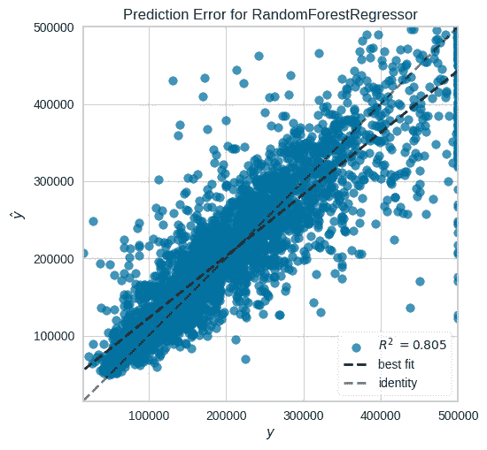

图 7.1 – RandomForestRegressor 在测试集上的预测

让我们利用`RandomForestRegressor`作为核心预测模型来生成预测区间，并使用 ICP 将基础机器学习模型做出的点预测转换为良好校准的预测区间：

1.  **模型训练**：通过使用适当的训练数据集训练所选模型来启动这个过程：

    ```py
    model = RandomForestRegressor(n_jobs=-1)
    ```

    ```py
    model.fit(X_proper_train, y_proper_train)
    ```

    ```py
    y_pred_calib = model.predict(X_calib)
    ```

1.  **进行预测**：利用训练好的模型在校准集和测试集上生成预测：

    ```py
    y_pred_calib = model.predict(X_calib)
    ```

    ```py
    y_pred_test = model.predict(X_test)
    ```

1.  **非一致性度量计算**：对于校准集中的每个观测值，计算非一致性度量：

    ```py
    y_calib_error = np.abs(y_calib - y_pred_calib)
    ```

1.  **量数计算**：使用为最终样本校正设计的公式确定非一致性度量值的量数。该公式包括最终样本校正因子：

    ```py
    q_yhat_calib = np.quantile(y_calib_error,np.ceil((n_calib+1)*(1-alpha))/n_calib)
    ```

1.  **建立预测区间**：使用上一步计算的量数，为测试集建立预测区间。这些区间应基于底层模型做出的点预测：

    ```py
    y_hat_test_lower = y_pred_test - q_yhat_calib
    ```

    ```py
    y_hat_test_upper = y_pred_test + q_yhat_calib
    ```

我们可以在一个包含点估计、实际值和 ICP 生成的预测区间的图表上展示预测结果：

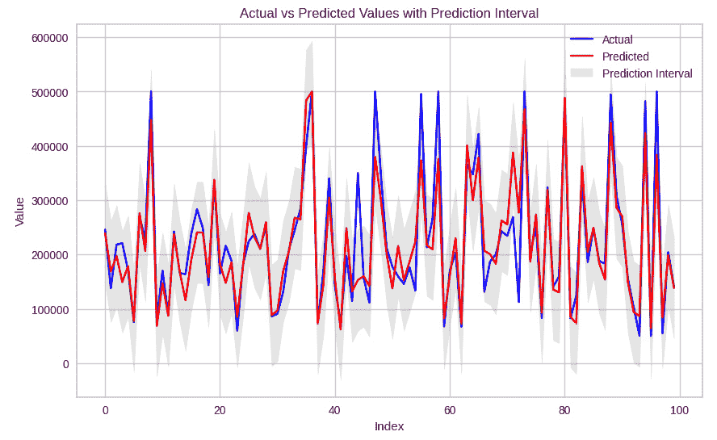

图 7.2 – 实际值与预测值及预测区间

我们可以确认在 ICP 中，预测区间的宽度保持恒定（如设计所示）。

ICP 回归提供了几个优点和一些缺点。让我们考虑这些。

我们首先介绍其优势：

+   **模型无关性**：ICP 可以应用于任何现有的回归模型。这意味着它是一种灵活的方法，可以用来增强各种回归模型。

+   **效率**：ICP 只需要对底层回归模型进行一次训练，在校准和预测阶段计算效率高。这使得它在计算上比原始的归纳一致性预测框架更高效，后者需要对每个新的预测重新训练模型。

+   **有效性**：ICP 自带自动有效性保证。如果数据分布是可交换的（即数据点的顺序不重要），那么 ICP 生成的预测区间将具有所需的覆盖概率。

+   **无分布假设**：ICP 对数据的分布没有任何假设。这意味着即使数据不遵循任何已知的统计分布，也可以应用它。

现在，让我们谈谈其缺点：

+   **性能依赖性**：ICP 的有效性高度依赖于底层回归模型的表现。如果底层模型没有很好地拟合数据，ICP 生成的预测区间可能会太宽。

+   **可交换性假设**：ICP 的有效性保证依赖于可交换性的假设，这在许多现实场景中可能不成立（例如，处理时间序列数据时）。

+   **适应性不足**：与我们在本章后面将要介绍的如**一致性量化回归**（CQR）和 jackknife+ 方法等其他一致性预测方法不同，ICP 并非本质上具有适应性。它不会动态调整以适应数据的复杂度或结构。例如，它不会自然地在模型更自信的数据区域产生更窄的区间，在模型不太自信的数据区域产生更宽的区间。

在接下来的章节中，我们将深入探讨最流行的一致性预测模型之一——CQR。这是一种将一致性预测的鲁棒性与量化回归的精度相结合的复杂技术。这种融合促进了可靠预测区间的生成，并确保这些区间以最佳方式调整以高概率包含真实值。通过利用一致性预测和量化回归的优势，CQR 成为了构建良好校准预测区间的强大工具，从而增强了预测模型的可解释性和可信度。随着我们进入这一节，我们将揭示 CQR 的机制，阐明其优势，并展示其在现实世界预测场景中的应用。

# CQR 的力学

在上一节中，我们观察到 ICP 生成的是宽度均匀的预测区间。因此，它不会对异方差数据进行自适应调整，其中响应变量的变异性在不同数据区域并不恒定。

在许多情况下，不仅确保最终样本中的有效覆盖至关重要，而且生成输入空间中每个点的最简洁预测区间也是有益的。这有助于保持这些区间的信息量。当处理异方差数据时，模型应能够调整预测区间的长度以匹配特征空间中每个点的局部变异性。

CQR（由 Yaniv Romano、Evan Patterson 和 Emmanuel Candes 开发，并在论文《一致性量化回归》中发表[`arxiv.org/abs/1905.03222`](https://arxiv.org/abs/1905.03222)）是最受欢迎和最广泛采用的一致性预测模型之一。它专门设计用来解决适应性需求，通过采用量化回归作为基础回归模型。

罗杰·科恩克开发了分位数回归——一种统计方法，它根据一组特征估计响应变量的条件分位数。与经典回归不同，经典回归侧重于估计条件均值，而分位数回归通过估计指定的分位数，提供了预测变量和响应变量之间关系的更完整图景。分位数回归通过允许分位数调整到数据的局部变异性，提供了适应性。这在数据异方差时尤为重要，意味着响应变量的方差在预测变量的范围内变化。然而，与符合预测框架中的模型不同，分位数回归没有自动的有效性保证。

通过将分位数回归的概念与符合预测框架相结合，CQR 继承了符合预测在有限样本中的分布自由有效性保证，以及分位数回归的统计效率和适应性。

将符合预测与分位数回归相结合以创建 CQR，与现有方法相比提供了几个优势：

+   符合预测是一种构建预测区间的方法，在有限样本中实现有效的覆盖，而不做分布假设。这意味着 CQR 产生的预测区间保证以一定的概率包含真实响应值，无论数据的潜在分布如何。

+   分位数回归提供了一种灵活且高效的方法来估计响应变量的条件分位数，这使得 CQR 能够根据数据的局部变异性调整预测区间的长度。这种适应性在数据异方差时尤为重要，意味着响应变量的方差在预测变量的范围内变化。通过在预测空间中的每个查询点估计条件分位数，CQR 可以构建比经典回归方法获得的预测区间更短、更具有信息量的区间。

+   根据论文《符合化分位数回归》中发布的结果，CQR 倾向于产生比 ICP 更短的区间，并且具有适应性。这是因为 CQR 可以使用分位数回归调整预测区间的长度，以适应数据的局部变异性。

我们现在将描述 CRQ 的机制，从经典分位数回归开始。

## 分位数回归

分位数回归是一种统计方法，它根据一组预测变量（特征）估计响应变量的条件分位数。与经典回归不同，经典回归侧重于估计条件均值，而分位数回归通过估计整个条件分布，提供了预测变量和响应变量之间关系的更完整图景。

从高层次来看，分位数回归最小化一个损失函数，该函数衡量观察到的响应值与预测分位数之间的差异。在分位数回归中使用的损失函数通常是指示球损失，这是一个分段线性函数，在指定的分位数水平上对残差赋予更大的权重：

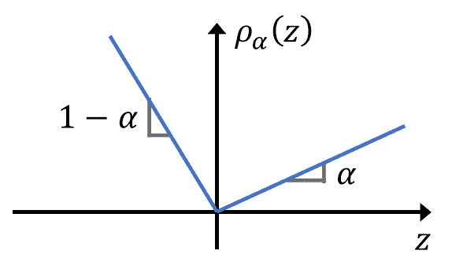

图 7.3 – 指示球损失函数的可视化，其中 y=y_hat

在底层，分位数回归可以使用各种算法实现，包括线性分位数回归、神经网络、分位数随机森林和梯度提升方法。

估计分位数回归中的不确定性的一个常见策略是计算测试数据集中每个 X 值的下分位数（*q_lo*）和上分位数（*q_hi*），然后输出[*q_lo, q_hi*]作为预测区间。虽然这种方法有时可以表现良好并适应异方差性，但它并不保证实现所需的覆盖范围。如果没有对最终样本的这种保证，使用此类策略的结果可能会灾难性，尤其是在医疗保健、金融和自动驾驶等关键应用中。这一点由论文中的实验结果得到证实，这些结果表明神经网络产生的预测区间可能会显著低估实际值。

存在多种方法可以提供分位数回归的渐近一致结果，包括对于相关方法如分位数随机森林。然而，这些方法中没有任何一种在最终样本中提供有效性保证。

## CQR

在前面的章节中，我们讨论了符合预测（无论是其传递形式还是归纳形式）如何在最终样本中提供有效性保证。虽然符合预测的两种变体都可以应用于分位数回归，但由于 ICP（局部一致性预测）的广泛应用，我们将仅关注 CQR（条件分位数回归）中 ICP 的应用。

下面的图来自[`arxiv.org/abs/1905.03222`](https://arxiv.org/abs/1905.03222)，展示了标准 ICP 模型（称为分割符合性）产生的预测区间、其局部自适应变体和 CQR 之间的比较：

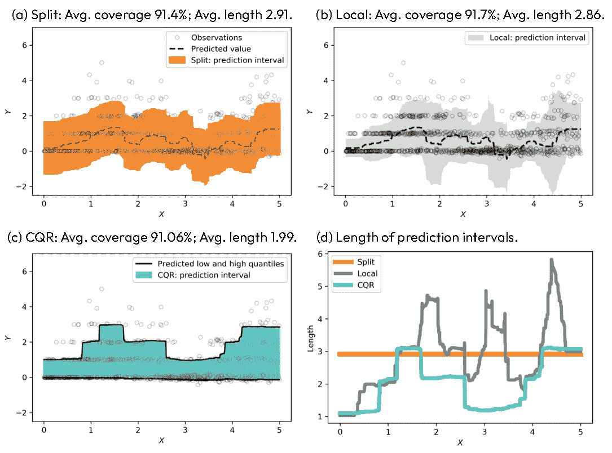

图 7.4 – 在具有异常值的模拟异方差数据上的预测区间 – (a) 标准分割符合性方法，(b) 其局部自适应变体，和(c) CQR。区间长度作为 X 的函数在(d)中显示。目标覆盖率为 90%

异方差数据集，包含异常值，通过三种不同的方法建模，所有方法都实现了用户指定的 90% 覆盖率。正如我们在讨论 ICP 时所讨论的，ICP（分割符合性）生成恒定宽度的预测区间，表明其非自适应性质。ICP 的局部加权变体显示出部分自适应。然而，CQR 是完全自适应的，并且显著地产生了平均长度最短的预测区间。

让我们描述 CQR 所涉及到的步骤：

1.  将数据分为适当的训练集和校准集。适当的训练集用于拟合分位数回归模型，而校准集用于构建预测区间。

1.  使用任何分位数回归算法（如随机森林或深度神经网络）将分位数回归模型拟合到适当的训练集。这一步涉及估计给定预测变量的响应变量的条件分位数。

1.  计算符合性分数，该分数量化了从分位数回归得到的预测区间[`q_lo`, `q_hi`]所犯的错误，通过使用 E i : = max{ ˆ q  α lo(X i) − Y i, Y i −  ˆ q  α hi(X i)}来计算非符合性分数。非符合性分数可以这样解释——如果实际标签 y 落在区间的下限以下，非符合性分数对应于 y 到下限的距离。相反，如果 y 超过上限，非符合性分数是 y 到上限的距离。然而，如果实际标签 y 在区间内，非符合性分数被认为是负数，并对应于 y 到最近边界的距离。

1.  通过使用 E i 的经验分位数来计算每个测试点的预测区间。

    预测区间公式的最后一步如下：

    C(X n+1) = [ ˆ q  α lo(X n+1) − Q 1−α(E, ℐ 2),  ˆ q  α hi(X n+1) + Q 1−α(E, ℐ 2)]

    在这里，Q 1−α(E, ℐ 2) : = (1 − α)(1 + 1 / |ℐ 2|) 是 E i 的经验分位数，ℐ 2 是校准集，而 |ℐ 2| 只是一个数学符号，表示校准集中的元素数量。

这里的符合性预测思想与我们之前在 ICP 中所做的是相似的——我们简单地使用校准集来计算某种形式的非符合性度量，然后使用非符合性度量的分位数来产生围绕训练的点预测模型预测点的预测区间。唯一的区别是，我们不是调整回归模型产生的点预测，而是调整由基础统计、机器学习或深度学习模型产生的分位数。否则，考虑到我们已描述的非符合性度量定义，分位数计算的思想和机制与 ICP 相同。

论文中的关键结果是，如果数据可交换，那么由分割（归纳）CQR 算法构建的预测区间满足有效性属性——也就是说，ℙ{Y n+1 ∈ C(X n+1)} ≥ 1 − α。

这就像在所有其他一致性预测模型中一样，意味着给定用户指定的置信水平 1 − α，实际值*y*落在构建的预测区间内的概率保证超过 1 − α。所以，如果指定的用户置信度为 90%，实际点保证有 90%的时间落在预测区间内。

另一个额外的好处是，如果非一致性得分 E i 几乎肯定不同，那么覆盖度也有界，即ℙ{Y n+1 ∈ C(X n+1)} ≤ 1 − α +  1 _ |ℐ 2| + 1，其中|ℐ 2|是校准数据集的大小。例如，对于校准数据集中的 500 个点，覆盖度保证在 90%和~90.2%之间。

总结来说，CQR 与 ICP 相比，往往产生更短的区间。这是因为 CQR 使用分位数回归调整预测区间的长度以适应数据的局部变化，这在数据异方差时尤为重要。

总体而言，CQR 中将一致性预测和分位数回归相结合提供了一个强大且灵活的框架，用于构建既无分布依赖又适应异方差的预测区间。

## Jackknife+

现在我们将描述另一种广泛使用的回归一致性预测方法，称为 Jackknife+。Jackknife+技术的描述与开创性论文《使用 Jackknife+进行预测推理》中概述的细节紧密一致，在该论文中首次介绍了这种方法。

我们的目标是将回归函数拟合到训练数据上，该数据由特征对(*X**i*, *Y**i*)组成。我们的目标是给定新的特征向量 Xn+1=x，预测输出 Yn+1，并为这个测试点生成相应的置信区间。我们要求该区间包含在指定的目标覆盖度下真实的 Yn+1——也就是说，1 − α : ℙ{Y n+1 ∈ C(X n+1)} ≥ 1 − α。

一个简单的解决方案可能是使用在训练数据上拟合的底层回归器的残差，|Y i −  ˆ μ (X i)|，并计算残差的分位数来估计新测试点的预测区间宽度，如下所示：

ˆ μ (X n+1) ± ( |Y 1 −  ˆ μ (X 1)|的(1 − α)分位数, … , |Y n −  ˆ μ (X n)|)

然而，在实践中，这种方法将低估不确定性，因为训练集上的残差通常小于未见过的测试数据上的残差。

为了避免过拟合，统计学家开发了一种称为“刀切法”的稳健技术。这种方法最初是为了减少偏差和估计方差而设计的。它通过迭代地从数据集中省略一个观测值并重新计算模型来工作。这为评估模型对单个数据点的稳定性和弹性提供了一个经验方法：

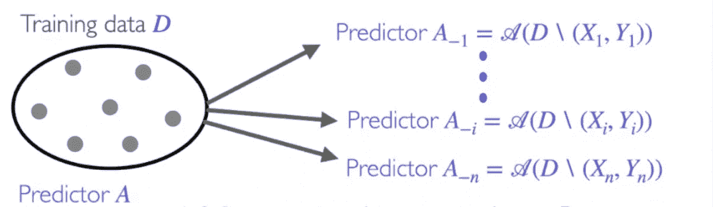

图 7.5 – 刀切预测方法的示意图

## 刀切回归

每次执行刀切回归时，它都会将模型拟合到所有数据点，除了由(Xi, Yi)指定的那个。这个过程使得刀切回归可以估计出单个数据点留下的残差，表示为|Y i −  ˆ μ  −i(X i)|。通过将这些单个数据点留下的残差视为非一致性分数，我们可以估计出 1 − α分位数，并形成类似于 ICP 的预测区间。从概念上讲，这种方法有望实现所需的覆盖范围，因为它有效地解决了过拟合的问题。这是因为残差|Y i −  ˆ μ  −i(X i)|是在样本外的方式下计算的，因此提供了对模型性能的更现实评估。

然而，刀切程序并没有普遍的理论保证，在某些情况下可能具有较差的覆盖特性，尤其是当数据高度偏斜或具有重尾时。尽管在刀切回归算法的渐近设置或稳定性假设下有统计结果，但很明显，在刀切估计量不稳定的情况下，刀切方法可能导致预测覆盖范围的损失。

在某些情况下，刀切方法甚至可以有零覆盖，这意味着真实值不包含在估计的预测区间内。此外，刀切方法可能计算量很大，因为它需要在减少的数据集上多次拟合模型。

这些挑战促使人们创造了一种改进的变体，称为刀切+。这种方法不仅旨在加强原始刀切方法的覆盖特性和计算效率，而且与符合预测方法家族保持一致。因此，刀切+从符合预测框架的所有稳健特性中受益。它保证了即使在任何大小的最终样本中也能保证有效性，表现出无分布的特性，并且足够灵活，可以应用于任何回归模型。

构建预测区间时，jackknife 方法和 jackknife+方法之间的主要区别在于，jackknife+方法在测试点使用留一法预测来解释拟合回归函数的变异性，以及除了 jackknife 方法使用的留一法残差分位数外。这种改进使得 jackknife+方法能够为任何将训练点对称对待的算法提供严格的覆盖保证，无论数据点的分布如何。相比之下，原始的 jackknife 方法在没有稳定性假设的情况下不提供理论保证，有时可能具有较差的覆盖特性。留一法预测捕捉了在目标点拟合模型预测的不确定性，使区间能够根据模型变异性进行调整。相比之下，原始的 jackknife 方法在没有稳定性假设的情况下不提供理论保证，有时可能具有较差的覆盖特性。

jackknife+方法与 Vovk 提出的交叉一致性预测有关，因为这两种方法都旨在构建提供严格覆盖保证的预测区间，无论数据点的分布如何，对于任何将训练点对称对待的算法。

然而，jackknife+方法与交叉一致性预测不同，因为它在测试点使用留一法预测来解释拟合回归函数的变异性以及交叉一致性预测中使用的留一法残差的分位数。

## Jackknife+回归

回顾一下，ICP 在用户指定的 1 − α置信水平下提供有效性保证，并且由于它不需要重新训练基础回归模型，因此在计算上非常高效。然而，这些优势是以需要将数据分成单独的校准数据集为代价的。由于这减少了可用于训练基础回归器的数据量，可能会导致回归模型拟合度降低，从而预测区间变宽，尤其是在原始数据集较小的情况下。相反，如果校准集较小，可能会导致更高的变异性。

Jackknife+是对 jackknife 的一种改进。与 jackknife 类似，我们对数据集中的每个点*n*进行*n*次回归器的拟合：

ˆμ−i = 𝒜((X1, Y1), … , (Xi−1, Yi−1), (Xi+1, Yi+1), … , (Xn, Yn))

jackknife 方法和 jackknife+方法之间的主要区别在于，后者除了使用 jackknife 方法使用的留一法残差分位数外，还在测试点使用留一法预测。

Jackknife+方法生成的预测区间利用分位数来构建预测区间。然而，它不仅检查留一法预测错误的分位数，还考虑了回归模型对 X n+1 点预测产生的*n*个预测。这种方法有效地扩大了预测模型的范围，同时考虑了误差估计和个别预测：

ˆ C  n,α Jackknife +(X n+1) = [ ˆ q  n,α − { ˆ μ  −i(X n+1) − R i LOO},  ˆ q  n,α + { ˆ μ  −i(X n+1) + R i LOO}]

将此公式与 Jackknife 的公式进行比较：

ˆ C  n,α Jackknife (X n+1) = [ ˆ q  n,α − { ˆ μ (X n+1) − R i LOO},  ˆ q  n,α + { ˆ μ (X n+1) + R i LOO}]

Jackknife 和 Jackknife+之间的显著差异在于对 X n+1 测试点进行点预测的方式。虽然 Jackknife 模型只进行一次预测，但 Jackknife+模型进行*n*次预测，每次将模型拟合到*n-1*个数据点，同时每次排除一个点。

这种结构有效地适应了回归算法中可能的不稳定性，这是一个以前阻碍 Jackknife 实现理论有效性保证的问题。在回归模型对训练数据高度敏感的情况下，输出可能会显著变化。因此，Jackknife+提供了一个更加细致和灵活的预测模型，以适应数据可能的变化。

下图展示了 Jackknife 和 Jackknife+模型产生的预测区间的比较图：

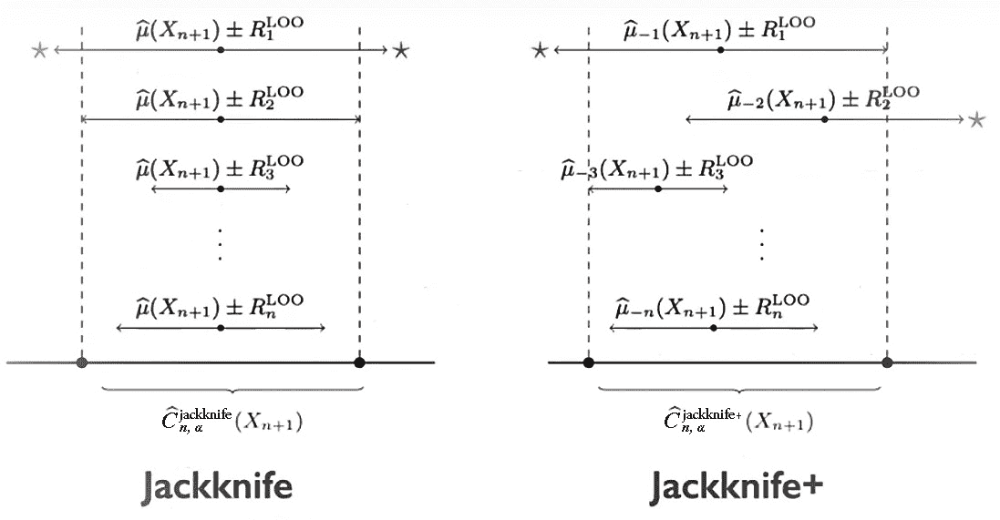

图 7.6 – Jackknife 和 Jackknife+模型产生的预测区间

在回归算法稳定的情况下，两种模型的表现相当相似，提供的经验覆盖度大约等于 1 − α。然而，在回归模型不稳定且对训练数据敏感的情况下，以至于删除单个数据点可以显著改变 X n+1 处的预测值，两个模型的输出可能会显著偏离。

与缺乏理论有效性保证的 Jackknife 方法相反，Jackknife+模型即使在最坏的情况下也能保证至少 1-2\alpha 的覆盖度。此外，在大多数实际场景中，除非涉及不稳定的实例，否则预计 Jackknife+模型将提供 1-\alpha 的经验覆盖度，使其成为不确定性预测的稳健方法。

虽然 Jackknife 方法提供了一种计算非一致性分数的稳健方法，但它具有显著的计算开销，因为它需要为校准集中的每个实例重新训练模型。这就是 Jackknife+方法出现的地方。

jackknife+方法通过允许在不重新训练校准集中的每个实例的情况下计算非一致性分数，从而改进了 jackknife 方法。这是通过调整非一致性分数的计算来考虑每个示例对模型预测的影响来实现的。

首先，jackknife+方法在完整训练数据集上训练模型。然后，对于校准集中的每个实例，该方法计算一个调整后的预测，该预测近似于在训练模型时省略该实例所做出的预测。每个实例的非一致性分数是其实际值与调整后预测之间的绝对差。

Jackknife+方法的主要优点是计算效率，因为它不需要为校准集中的每个实例重新训练模型。

## 一致预测分布

**一致预测分布**（**CPD**）是一种创新方法，它将一致预测的原则应用于生成预测分布。这些分布提供了对预测不确定性的全面视图，不仅提供了区间估计，而且还提供了所有潜在结果的完整分布。

CPD 的概念首次在论文《基于一致预测的非参数预测分布*》([`link.springer.com/article/10.1007/s10994-018-5755-8`](https://link.springer.com/article/10.1007/s10994-018-5755-8))中提出，作者为 Vladimir Vovk、Jieli Shen、Valery Manokhin 和 Min-ge Xie。在这篇论文中，作者将一致预测应用于在非参数假设下推导有效的预测分布。

在随后的论文《*具有核的一致预测分布*》([`arxiv.org/abs/1710.08894`](https://arxiv.org/abs/1710.08894))中，作者 Vladimir Vovk、Ilia Nouretdinov、Valery Manokhin 和 Alex Gammerman 回顾了统计学中预测分布的历史，并讨论了两个关键发展。第一个是将预测分布集成到机器学习中，第二个是将预测分布与核方法相结合。

在论文《*交叉一致预测分布*》([`proceedings.mlr.press/v91/vovk18a.html`](http://proceedings.mlr.press/v91/vovk18a.html))中，作者 Vladimir Vovk、Ilia Nouretdinov、Valery Manokhin 和 Alexander Gammerman 将 CPD 扩展到任何底层模型，无论是统计模型、机器学习模型还是深度学习模型。

归纳（分割）一致预测系统是一致预测系统的计算高效版本，在回归问题中为测试观察值的标签输出概率分布。这些系统提供了在决策中可能有用的额外信息。

交叉一致性预测系统是符合预测的一种新颖应用，它促进了自动决策。它们建立在分割一致性预测系统之上，虽然在原则上可能会失去其有效性，但在实践中通常满足有效性要求。因此，交叉一致性预测系统与传统的一致性预测器不同，它们是更高效的计算版本，可用于自动决策。

下一个图展示了单个测试实例的 CPD 预测过程：

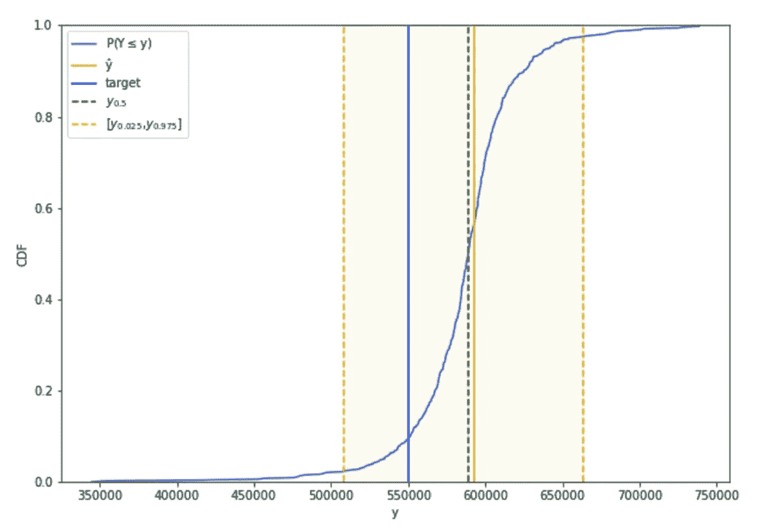

图 7.7 – CPD

让我们在实践中应用这些概念；我们将使用笔记本 *Conformal Prediction for* *Regression* ([`github.com/PacktPublishing/Practical-Guide-to-Applied-Conformal-Prediction/blob/main/Chapter_07.ipynb`](https://github.com/PacktPublishing/Practical-Guide-to-Applied-Conformal-Prediction/blob/main/Chapter_07.ipynb))。

我们将遵循 MAPIE 教程进行 CQR。该数据集的目标变量是加利福尼亚地区的房屋中位数价值。该数据集包括八个特征，包括房屋的年龄、社区的 median 收入、平均房间或卧室数量，甚至经纬度位置。总共有大约 20k 个观测值。我们计算了特征之间的相关性，以及特征与目标之间的相关性。从分析中可以看出，房价与社区 median 收入的相关性最为显著：

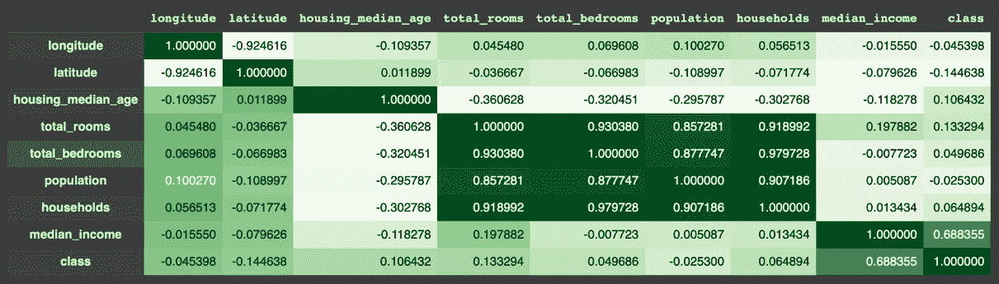

图 7.8 – 加利福尼亚房价 – 相关系数矩阵

我们还可以绘制房价的分布：

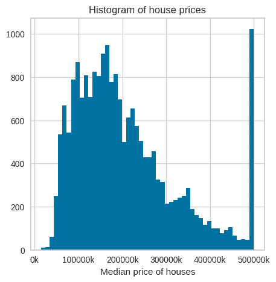

图 7.9 – 加利福尼亚房价 – 房价直方图

现在，我们可以训练和优化底层模型：

```py
estimator = LGBMRegressor(objective='quantile', alpha=0.5, random_state=random_state)
```

```py
params_distributions = dict(
```

```py
    num_leaves=randint(low=10, high=50),
```

```py
    max_depth=randint(low=3, high=20),
```

```py
    n_estimators=randint(low=50, high=300),
```

```py
    learning_rate=uniform()
```

```py
)
```

```py
optim_model = RandomizedSearchCV(
```

```py
    estimator,
```

```py
    param_distributions=params_distributions,
```

```py
    n_jobs=-1,
```

```py
    n_iter=100,
```

```py
    cv=KFold(n_splits=5, shuffle=True),
```

```py
    verbose=0
```

```py
)
```

```py
optim_model.fit(X_train, y_train)
```

```py
estimator = optim_model.best_estimator_
```

使用多种方法产生概率预测，包括 CQR 和一种 jackknife 变体。

我们可以绘制使用不同方法产生的结果：

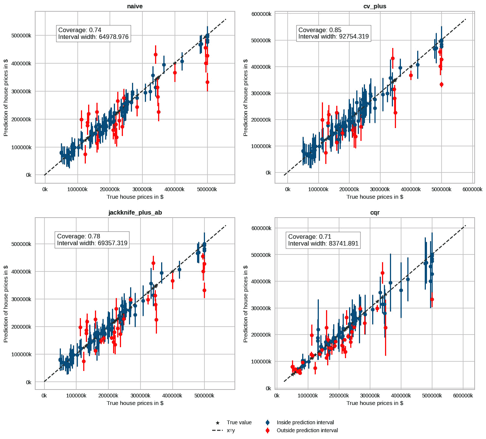

图 7.10 – 使用各种方法预测加利福尼亚房价

我们观察到，与其他保持固定区间宽度的方法相比，CQR 的预测区间具有更高的灵活性。具体来说，随着价格的上升，预测区间相应地扩大。为了证实这些观察结果，我们将检查这些区间内的条件覆盖和区间宽度，按分位数进行分段：

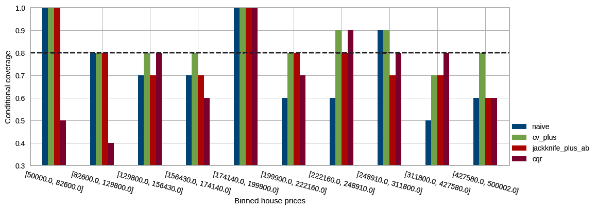

图 7.11 – 根据价格水平对分箱房价的预测区间覆盖

如我们所见，CQR 在调整较大价格方面更为熟练。其条件覆盖率与较高价格和较低价格下的目标覆盖率紧密一致，在其他方法超过必要覆盖率的地方。这种适应性可能会影响区间的宽度。

我们还可以按分箱绘制区间宽度：

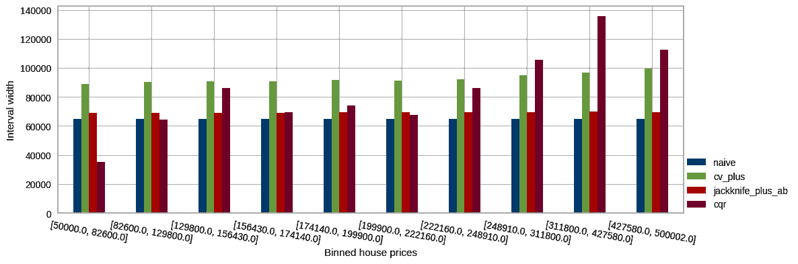

图 7.12 – 根据房价水平通过分箱房价预测区间宽度

现在，我们可以使用相同的笔记本来查看 CPD 的实际应用：

1.  我们将使用 Crepes 包来演示 CPD 的使用。有关 Crepes 包的快速入门指南，请参阅 https://github.com/henrikbostrom/crepes。我们将使用 Crepes 中的`WrapRegressor`类包装标准的随机森林回归器，并以通常的方式将其拟合到适当的训练集：

    ```py
    rf = WrapRegressor(RandomForestRegressor())
    ```

    ```py
    rf.fit(X_prop_train, y_prop_train)
    ```

1.  然后，我们将使用校准集校准回归器：

    ```py
    rf.calibrate(X_cal, y_cal)
    ```

1.  符合性回归器现在已准备好生成测试集的预测区间，使用 99%的置信水平。输出将是一个 NumPy 数组。每一行对应一个测试实例，有两列表示每个预测区间的下限和上限：

    ```py
    rf.predict_int(X_test, confidence=0.99)
    ```

1.  我们可以指定我们希望修剪区间以省略不可能的值 – 在这个场景中，值低于 0。使用默认的置信水平（0.95），生成的输出区间将稍微更简洁：

    ```py
    rf.predict_int(X_test, y_min=0)
    ```

1.  我们将使用`crepes`中的`DifficultyEstimator()`来使区间更适应。在这里，难度是通过校准集中每个对象的适当训练集中默认 k=25 最近邻的目标的标准差来估计的。首先，我们将获得校准集的难度估计：

    ```py
    de = DifficultyEstimator()
    ```

    ```py
    de.fit(X_prop_train, y=y_prop_train)
    ```

    ```py
    sigmas_cal = de.apply(X_cal)
    ```

1.  这些现在可以用于校准，这将产生一个归一化的符合性回归器：

    ```py
    rf.calibrate(X_cal, y_cal, sigmas=sigmas_cal)
    ```

1.  我们还需要测试集的难度估计，我们将它作为输入提供给`predict_int`：

    ```py
    sigmas_test = de.apply(X_test)
    ```

    ```py
    crepes_predictions = rf.predict_int(X_test, sigmas=sigmas_test, y_min=0)
    ```

    我们将得到以下输出：

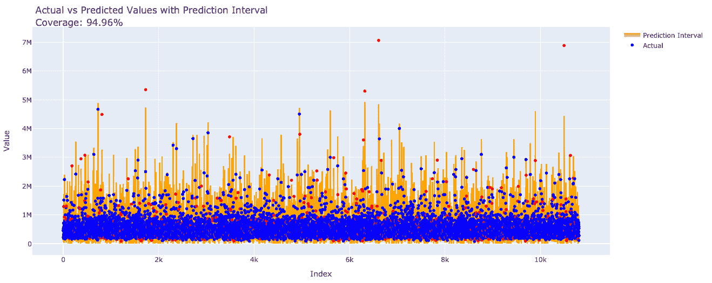

图 7.13 – 实际值与预测值以及预测区间覆盖率的比较

### Crepes 包中的 CPD（符合性预测系统）

CPD 产生累积分布函数（符合性预测分布）。这不仅允许我们创建预测区间，还使我们能够推导出特定目标值的百分位数、校准点预测和*p*值。让我们探索如何实现这一点。

所需的唯一修改是将`cps=True`传递给`calibrate`方法：

1.  例如，我们可以通过向`calibrate`方法提供`bins`和`sigmas`来建立归一化的 Mondrian 符合性预测系统。在这种情况下，我们将检查由分箱点预测形成的 Mondrian 类别：

    ```py
    bins_cal, bin_thresholds = binning(rf.predict(X_cal), bins=5)
    ```

    ```py
    rf.calibrate(X_cal, y_cal, sigmas=sigmas_cal, bins=bins_cal, cps=True)
    ```

1.  通过为测试对象提供`bins`（和`sigmas`），我们可以通过使用`predict_cps`方法利用正则预测系统进行预测。此方法提供了对输出的灵活控制。在此实例中，我们寻求获得 95%置信水平的预测区间：

    ```py
    bins_test = binning(rf.predict(X_test), bins=bin_thresholds)
    ```

    ```py
    rf.predict_cps(X_test, sigmas=sigmas_test, bins=bins_test,
    ```

    ```py
                   lower_percentiles=2.5, higher_percentiles=97.5, y_min=0)
    ```

1.  我们可以通过设置`return_cpds=True`来指示`predict_cps`方法返回每个测试实例的完整 CPD，这些 CPD 由阈值值界定。这些分布的结构根据正则预测系统的类型而有所不同。对于标准化和归一化的 CPS，输出是一个数组，每行对应一个测试实例，每列对应一个校准实例（残差）。相反，对于 Mondrian CPS，默认输出是一个向量，每个测试实例有一个 CPD，因为值数量可能在类别之间波动：

    ```py
    cpds = rf.predict_cps(X_test, sigmas=sigmas_test, bins=bins_test, return_cpds=True)
    ```

1.  我们可以绘制测试集中随机对象的 CPD：

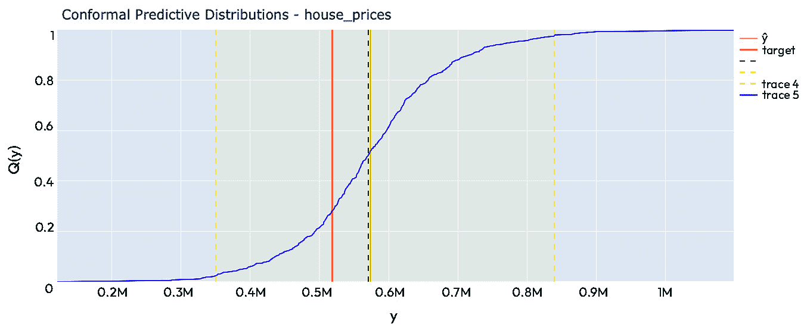

图 7.14 – 测试对象的 CPD

# 摘要

本章探讨了回归问题的不确定性量化，这是数据科学和机器学习的一个关键方面。它强调了不确定性的重要性以及有效处理不确定性的方法，以做出更可靠的预测和决策。

本章的一个重要部分是介绍可用于生成预测区间的各种方法。它系统地分解并解释了不同的方法，阐明了每种方法的工作原理及其优缺点。这种详细分析有助于理解这些方法背后的机制及其在现实世界回归问题中的实际应用。

此外，本章讨论了使用正则预测来构建预测区间和预测分布。我们提供了构建这些区间和分布的逐步指南。本章还提供了关于如何有效地利用正则预测在回归问题中实现更可靠和可信预测的实际见解和建议。

此外，我们还深入探讨了高级主题，如 CQR、jackknife+和 CPD。这些高级技术被详细分解和解释，帮助您掌握它们的复杂性和在处理回归问题中的实用性。

在本章中，实际演示至关重要，它提供了实际经验和见解。本章利用房价数据集来展示所讨论的模型和技术应用。MAPIE 和 Crepes 等库被应用于数据集，为您提供超越理论理解的实用知识和经验。

总结来说，本章提供了一本全面且实用的指南，涵盖了与不确定性量化、预测区间和回归问题的同构预测相关的各种主题。使用真实世界的数据集和库的实例说明进一步增强了学习体验，使本章成为任何希望深化对这些关键领域理解和加强技能的人的有价值资源。
