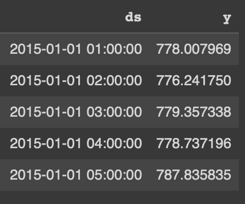
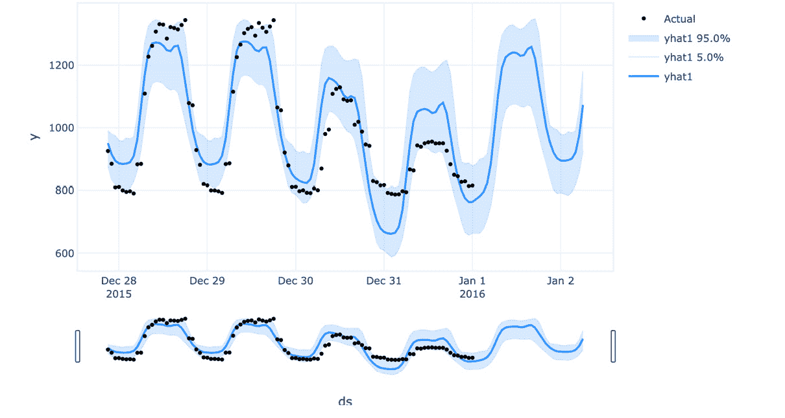
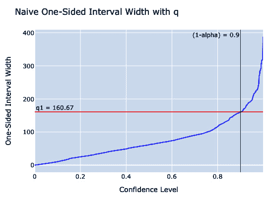
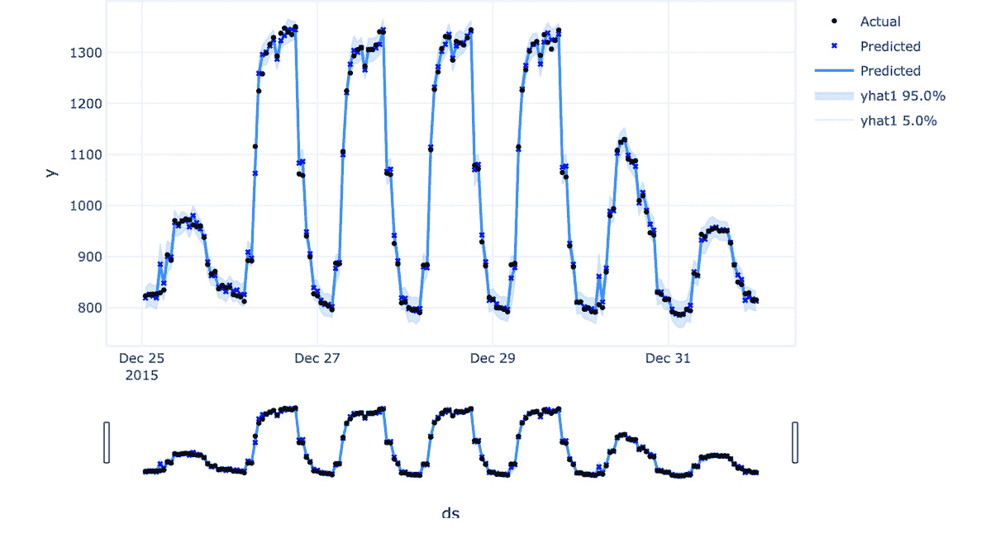
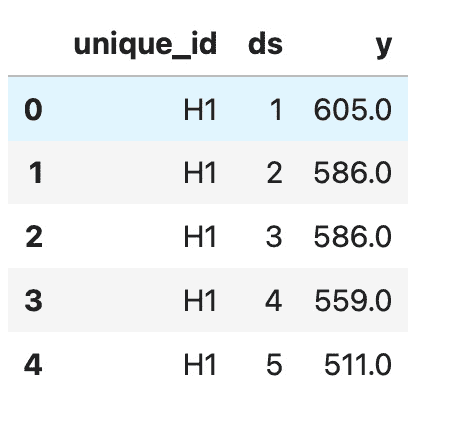
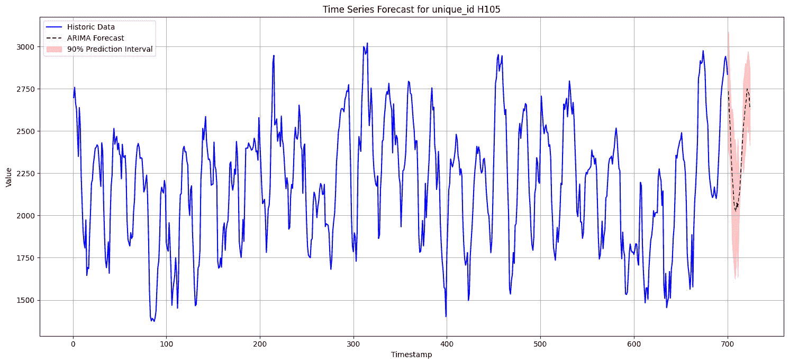

# 时间序列和预测的一致性预测

在本章中，我们将探索时间序列和预测中的激动人心的**一致性预测**领域。一致性预测是生成点预测模型的**预测区间（PIs**）的强大工具，我们将向您展示如何使用开源库应用这项技术到您的数据中。本章将带您从理解时间序列中不确定性量化（UQ）的基础到预测中一致性预测背后的复杂机制进行一次旅行。

通过本章，您将牢固地理解生成 PIs 的各种方法，并将能够使用一致性预测构建您的 PIs。

在本章中，我们将涵盖以下主要主题：

+   时间序列和预测问题的 UQ

+   预测应用中 PI 的概念

+   生成 PIs 的各种方法

+   时间序列和预测的一致性预测

到本章结束时，您将能够将所讨论的概念和开源工具应用到您的行业应用中，提供具有明确不确定性界限的稳健预测。这些课程将提高您的预测能力，通过允许您向预测添加置信度度量，使您的模型更具优势。

# 时间序列和预测问题的 UQ

UQ 不仅仅是时间序列预测中的复杂补充；它是一个基本方面，为预测的本质提供了宝贵的见解。让我们看看为什么它很重要，以及其发展的简要历史。

## UQ 的重要性

UQ 是时间序列预测的一个关键组成部分。虽然预测模型可能在平均意义上提供准确的预测，但理解这些预测的不确定性同样至关重要。有几个关键原因说明为什么正确量化不确定性对于实际时间序列预测至关重要：

+   **风险评估**：在许多领域，如金融、医疗保健和环境科学，预测与决策紧密相连。理解预测的不确定性有助于评估潜在风险，从而实现明智的决策。

+   **模型置信度**：UQ 提供了对每个模型预测的置信度的理解。这可能导致更精细的模型选择，并有助于识别模型可能表现不佳的领域。

+   **资源优化**：通过承认不确定性，资源可以更优化地分配。例如，了解供应链管理中需求预测的不确定性可能导致更好的库存管理。

+   **合规性监管**：在某些行业中，监管机构可能要求量化预测的不确定性，这强调了系统化 UQ 方法的重要性

在确立了不确定性量化（UQ）的关键作用后，我们现在转向其演变过程。

## UQ 的历史

提供可靠的不确定性度量与时间序列预测并行的需求早已被认识到。几十年来，统计和计算方法的发展使得量化不确定性的更复杂方法成为可能。以下是一些重要的历史发展：

+   **早期统计方法**：时间序列中 UQ 的根源可以追溯到早期的统计模型。例如，PIs（预测区间）等技术被应用于为预测提供界限。

+   **贝叶斯方法**：贝叶斯方法为 UQ 带来了概率视角，允许进行更细致的不确定性描述。贝叶斯预测模型结合先验信念和似然函数来创建后验分布，全面地表示不确定性。

+   **自助法和重采样**：如自助法等技术使 UQ 无需强烈的参数假设，使其对更复杂的模型变得可访问。

我们所探讨的历史发展为我们理解时间序列分析中的 UQ 提供了关键的基础。现在，让我们更深入地探讨那些早期统计技术，看看它们是如何使量化预测不确定性的第一步成为可能的。

## 早期统计方法——时间序列中 UQ 的根源

UQ（不确定性量化）一直是统计分析的关键部分，其在时间序列预测中的作用也并无不同。统计建模的早期阶段为理解预测中的不确定性奠定了基础，并开发了各种技术来为预测提供界限。在这里，我们将探讨这些早期统计方法，并了解它们是如何为现代时间序列分析中的 UQ 理解铺平道路的。

时间序列预测中 UQ 的一个开创性贡献是置信区间的概念：

+   **小样本的 t 分布**：在处理小样本量时，t 分布提供了更准确的区间，考虑到由于数据有限而增加的不确定性。

+   **自回归模型的区间估计**：为时间序列模型如 ARIMA 开发了特定技术，其中可以推导出参数和预测的置信区间。

除了置信区间，还开发了预测界限来封装与未来观测相关的不确定性。这些界限考虑了模型参数的不确定性和未来误差的随机性：

+   **预测误差方差**：通过估计预测误差方差，可以在预测值周围创建界限。

+   **预测误差分解**：开发了将预测误差分解为各种组件的技术，从而为不确定性的来源提供了洞察。

虽然这些早期方法具有高度的影响力，但它们通常依赖于对潜在分布和模型结构的强烈假设。这些技术的参数性质使得它们在处理复杂、非线性时间序列数据时不够灵活：

+   **非参数方法**：认识到这些局限性导致了非参数方法的发展，这些方法不依赖于特定的分布假设

+   **稳健的统计技术**：还努力创造更稳健的统计方法，能够处理异常值和非恒定方差，扩展了早期 UQ 方法的范围

时间序列不确定性量化（UQ）的早期统计方法为该领域的后续进步奠定了基础。这些技术中嵌入的原则，如置信区间和预测界限，仍然是现代 UQ 方法的核心。它们代表了一种经过构建和改进的遗产，导致了当前理解时间序列预测中不确定性的各种方法。

现在，让我们深入探讨一些早期的统计技术，看看它们是如何使预测不确定性的量化迈出第一步的。

## 现代机器学习方法

前几节探讨了时间序列预测不确定性量化（UQ）的早期统计基础。虽然这些技术具有开创性，但它们在很大程度上依赖于参数假设和简单的模型结构。现代机器学习的兴起使得量化不确定性的方法更加灵活和稳健，克服了传统方法的一些局限性。让我们看看这个领域的关键创新：

+   **现代机器学习方法**：随着机器学习的兴起，开发了诸如 dropout 和集成方法等技术来量化不确定性。

+   **符合预测**：最近，符合预测已成为 UQ 的一个稳健框架。它提供了一种非参数方法，在温和的假设下保证有效的 PI。

UQ 对于时间序列预测至关重要。它丰富了预测的理解，促进了更好的决策，并符合监管要求。随着时间的推移，UQ 的演变导致了多样化的方法，每种方法在不同的环境中都增加了价值。

本章稍后将探讨的符合预测（conformal prediction）的最近出现代表了该领域的一个重要进步，提供了稳健且普遍适用的不确定性度量。

总结来说，灵活的机器学习技术的出现使得 UQ 有了新的稳健方法，克服了早期统计方法的局限性。这种演变为量化时间序列预测中的不确定性提供了一套多样化的工具箱。

接下来，我们将探讨 PI 背后的概念，这是传达预测不确定性的基础。

# 预测应用中 PI（预测区间）的概念

PIs 是预测中的关键工具，提供了一系列可能值，其中未来观测值很可能会发生。与只给出一个最佳估计值的点预测不同，PIs 传达了该估计值周围的不确定性。

本节探讨了 PIs 背后的基本概念及其在各个预测应用中的重要性。

## 定义和构建

PIs 围绕一个预测点构建，以表示未来观测值预期落在其中的范围，并具有给定的置信水平。例如，95%的 PI 意味着在 100 个未来观测值中，有 95 个预期将落在定义的范围内。

PIs 可以采取多种形式，具体取决于生成它们的方法。以下有两个关键的区别因素：

+   **对称与不对称区间**：PIs 可以是对称的，即边界与预测点等距，或者是不对称的，反映不同方向上的不同不确定性

+   **参数方法与非参数方法**：PIs 可以使用参数方法（例如，假设正态分布）或非参数方法创建，具体取决于数据分布的潜在假设

## 预测应用的重要性

PIs 在各个预测领域扮演着至关重要的角色，原因如下：

+   **决策制定**：PIs 使决策者能够评估风险和机遇——例如，它们允许投资者评估资产的波动性

+   **模型评估**：将实际观测值与 PIs 进行比较可以是模型诊断检查的一部分，有助于评估模型在捕捉不确定性方面的充分性

+   **优化运营**：在供应链管理中，PIs 可以通过反映需求预测的不确定性来帮助优化库存

+   **传达不确定性**：PIs 有效地向非技术利益相关者传达不确定性，促进更细致的讨论和规划

## 挑战和考虑因素

虽然非常有价值，但构建准确可靠的 PIs 并非没有挑战：

+   **假设敏感性**：PIs 可能对关于数据分布的潜在假设敏感，错误的假设可能导致误导性的区间。

+   **覆盖范围与宽度权衡**：实现正确的覆盖概率（95%）往往与希望获得狭窄区间的愿望相竞争。较宽的区间可能覆盖所需的观测值百分比，但可能需要提供更多信息。

+   **计算复杂性**：一些构建 PIs 的方法可能计算密集，尤其是在大型数据集或复杂模型中。

PIs 是预测应用中不确定性量化（UQ）的核心，提供了对前景的更全面视角。它们支持战略决策，使模型评估成为可能，并促进对不确定性的有效沟通。理解 PIs 的概念和实践对于任何使用预测模型的人来说都是必不可少的，它提供了一种导航和利用预测未来结果固有不确定性的手段。

虽然 PIs 提供了无价的见解，但构建准确且信息丰富的区间并不总是那么简单，正如我们所看到的。然而，几十年的研究产生了各种技术来应对这些挑战。

# 生成 PIs 的各种方法

PIs 是预测中的基本工具，使从业者能够了解未来观测值可能落在的范围。已经开发出各种方法来生成这些区间，每种方法都有其优点、应用和挑战。本节将探讨创建 PIs 最突出的技术。

## 参数方法

参数方法对预测误差的分布做出具体假设以推导 PIs。这一类别中的一些标准技术如下：

+   **正态分布假设**：通过假设预测误差遵循正态分布，我们可以根据正态分布的标准误差和临界值计算对称的 PIs。

+   **时间序列模型**：例如 ARIMA 和指数平滑等模型可以通过对潜在随机过程建模并使用估计的参数来生成预测区间（PIs）。

+   **广义线性模型（GLMs）**：GLMs 将线性模型扩展到非正态分布，从而允许更灵活地构建 PIs。GLMs 将线性回归扩展到除了正态分布以外的响应变量。GLMs 使我们能够对具有非正态响应的数据进行建模，例如二元、计数或分类结果。与线性模型一样，GLMs 通过链接函数和线性预测器将均值响应与解释变量相关联。然而，响应分布可以是非正态的，通过指数族对数似然函数进行处理。以下是 GLMs 的一些常见示例：

    +   二元分类的逻辑回归（logit 链接，二项分布）

    +   泊松回归用于计数数据（log 链接，泊松分布）

    +   多项式回归用于分类响应（logit 链接，多项分布）

GLMs 估计每个特征的系数，就像普通线性回归一样。然而，通过扩展响应分布和链接函数，它们可以模拟回归式预测所需的非正态过程，目标是非连续的。

它们的灵活性使 GLMs 在构建比标准线性回归更广泛的问题的 PIs 时非常有用。这些区间包含了建模的响应分布。

## 非参数方法

非参数方法旨在构建 PI，而不对预测误差的分布做出严格假设。这一类别中的一些基本技术如下：

+   **自助法**：自助法涉及对观测数据进行重采样并估计预测的分布，从而可以推导出 PI

+   **分位数回归**：这种方法直接对响应变量的分位数进行建模，使得在无需特定分布假设的情况下构建 PI 成为可能

+   **经验分位数**：使用历史和经验分位数，我们可以构建无需参数假设的 PI

## 贝叶斯方法

贝叶斯统计框架通过明确建模不同来源的不确定性，提供了一种生成 PI 的概率方法。贝叶斯 PI 构建的两个关键技术如下：

+   **贝叶斯预测模型**：贝叶斯模型提供了一个概率框架，该框架捕捉了参数和预测中的不确定性，允许从后验分布中直接计算 PI

+   **蒙特卡洛马尔可夫链（MCMC）采样**：MCMC 采样可以用来模拟贝叶斯模型的后验分布，从而能够构建 PI

## 机器学习方法

现代机器学习模型的灵活性为以数据驱动的方式生成 PI 提供了新的机会。通过利用针对这些高度复杂和非线性模型量身定制的技巧，可以在不严格假设分布的情况下获得有效的 PI。让我们来看看一些机器学习方法：

+   **集成方法**：如随机森林和梯度提升机等技术可以通过使用单个集成成员的预测分布来创建 PI

+   **神经网络分位数回归**：神经网络可以被训练来预测特定的分位数，这构成了 PI 的基础

+   **dropout 作为贝叶斯近似**：在深度学习中，dropout 可以近似贝叶斯推理，从而允许进行不确定性量化（UQ）和 PI 构建

## 一致性预测

作为一种非参数、无分布框架，一致性预测可以与各种建模方法相结合以生成 PI。本章主要讨论使用一致性预测方法为时间序列预测模型生成 PI。

生成预测区间（PIs）是一个多方面的过程，针对不同的数据类型、模型和需求，有多种方法。从传统的统计方法到前沿的机器学习技术以及一致性预测，PI 构建领域丰富多彩。了解这些方法使从业者能够为他们的预测应用选择最合适的方法，在准确性、可解释性、计算效率和其他考虑因素之间取得平衡。无论是严格遵循参数假设还是探索灵活的非参数技术，这些方法都能为预测中固有的不确定性提供有价值的见解。

符合预测，一个用于生成点预测模型 PI 的稳健框架，已被广泛应用于时间序列和预测应用中。许多研究记录了各种符合预测模型在时间序列预测中的演变和流行。

# 时间序列和预测的符合预测

为时间序列预测创建可靠的 PI 一直是一个长期而复杂的挑战，直到符合预测的出现才得以解决。

这个问题在 2018 年 M4 预测竞赛中被强调，该竞赛要求参与者提供 PI 和点估计。

在题为《*M4 竞赛中预测区间的结合*》的研究论文中（[`www.sciencedirect.com/science/article/abs/pii/S0169207019301141`](https://www.sciencedirect.com/science/article/abs/pii/S0169207019301141)），达登商学院的 Yael Grushka-Cockayne 和哈佛商学院的 Victor Richmond R. Jose 仔细审查了 20 个区间提交。他们评估了预测的校准和精度，并衡量了它们在不同时间跨度上的表现。他们的分析得出结论，提交的预测在准确估计不确定性方面是无效的。

## 集成批量 PI（EnbPIs）

由乔治亚理工学院的研究员陈旭和谢耀撰写的《*动态时间序列的符合预测区间*》([`proceedings.mlr.press/v139/xu21h/xu21h.pdf`](http://proceedings.mlr.press/v139/xu21h/xu21h.pdf))，是第一篇将符合预测应用于时间序列预测的论文，并在 2021 年的著名会议 ICML 上展出。

EnbPI 是目前时间序列预测中符合预测最流行的实现之一。它已被实现于流行的开源符合预测库，如 MAPIE、Amazon Fortuna 和 PUNCC。

该研究介绍了一种为动态时间序列数据创建不受任何特定分布限制的 PI 的技术。EnbPI 方法包括一个自举集成估计器来制定顺序 PI。与需要数据可交换性的经典符合预测方法不同，EnbPI 不需要数据可交换性，并且专门为时间序列构建。

数据可交换性假设表明，数据集中观测值出现的顺序并不重要。然而，这个假设并不适用于时间序列，其中数据点的顺序至关重要。EnbPI 不依赖于数据可交换性，因此非常适合时间序列分析。

EnbPI 生成的 PI 在强混合随机误差的温和假设下，对于广泛的回归函数和时间序列具有有限样本、近似有效的边缘覆盖。此外，EnbPI 计算效率高，通过不需要数据拆分或训练多个集成估计器来避免过拟合。它还可以按顺序生成任意数量的 PI，非常适合广泛的回归函数。

时间序列数据是动态的，通常是非平稳的，这意味着统计属性会随时间变化。虽然存在各种用于预测时间序列的回归函数，例如使用提升树或神经网络结构的函数，但这些现有方法通常需要帮助构建准确的 PIs。通常，它们只能通过在时间序列的潜在分布上施加限制性假设来创建可靠的区间，这可能只有时是适当或可行的。

下面是构建 EnbPI 预测器的步骤简化版：

1.  **选择 bootstrap 集成估计器**：任何 bootstrap 集成估计器都可以与 EnbPI 一起使用。

1.  **训练集成估计器**：基础预测模型在从原始训练数据中抽取的不同 bootstrap 样本上多次训练，以生成集成。每个 bootstrap 样本是通过从训练集中有放回地采样创建的。这导致了一个具有略微不同训练数据的模型集成。

1.  **计算残差**：对于 t = 1，…，T 中的每个点，使用未使用点*t*进行训练的集成估计器计算残差。目的是使用样本外误差作为非一致性度量，以指示预测的方差。所有这些样本外误差都被编译成一个单一的数组。

1.  **生成预测**：集成估计器为测试数据生成点预测。

1.  **构建 PIs**：PIs 是通过使用集成估计器的预测和选定的显著性水平构建的。像许多其他一致性预测方法一样，可以将指定置信水平的分位数应用于在*步骤 3*中创建的样本外误差分布。然后，使用训练的集成估计器生成的聚合点预测应用分位数值来创建 PIs。

为了展示 EnbPI 的实际应用，我们将使用 Amazon Fortuna ([`aws-fortuna.readthedocs.io/en/latest/index.html`](https://aws-fortuna.readthedocs.io/en/latest/index.html)) 并遵循其示例，*使用 EnbPI 进行时间序列回归，一种一致性预测方法* ([`aws-fortuna.readthedocs.io/en/latest/examples/enbpi_ts_regression.html`](https://aws-fortuna.readthedocs.io/en/latest/examples/enbpi_ts_regression.html))。您可以在本书的 GitHub 仓库中找到 Jupyter 笔记本，`Chapter_08_EnbPI_ipynb.ipynb`：[`github.com/PacktPublishing/Practical-Guide-to-Applied-Conformal-Prediction/blob/main/Chapter_08_EnbPI.ipynb`](https://github.com/PacktPublishing/Practical-Guide-to-Applied-Conformal-Prediction/blob/main/Chapter_08_EnbPI.ipynb)。让我们开始吧：

1.  首先，我们将使用`pip install`安装 Amazon Fortuna：

    ```py
    !pip install aws-fortuna
    ```

1.  我们将使用 scikit-learn 上可用的`Bike sharing demand`数据集：

    ```py
    from sklearn.datasets import fetch_openml
    ```

    ```py
    bike_sharing = fetch_openml("Bike_Sharing_Demand", version=2, as_frame=True, parser="pandas")
    ```

1.  让我们检查数据集标题：


图 8.1 – 自行车共享需求数据集

数据集包含有关共享单车租赁的信息，包括温度、湿度和风速等附加信息。问题要求预测以租用自行车数量表示的共享单车需求。

1.  我们可以按星期几和小时分组计算需求，并使用以下图表展示结果：


图 8.2 – 一周内平均每小时自行车需求

EnbPI 需要数据预取样 – 也就是说，对时间序列进行带替换的随机子集采样，并为每个样本训练一个模型。

1.  我们可以测试`DataFrameBootstrapper`类，并查看预取样数据样本的示例。例如，第一个预取样样本看起来是这样的：


图 8.3 – 预取样样本的示例

1.  我们可以检查这个预取样样本中的重复项 – 由于预取样是带替换的，正如预期的那样，我们可以看到在预取样过程中一些对象被重复了：


图 8.4 – 预取样样本中的重复对象

1.  我们现在可以为每个预取样样本训练模型。为了评估一致 PI，我们可以计算覆盖概率，这衡量了落在生成的区间内的测试观察值的百分比，并检查包含点预测的区间比例。

1.  最终，我们评估了一致区间的维度，在这个没有在线反馈的场景中，EnbPI 假设所有区间都是均匀的。

    包含实际目标的区间百分比是`0.95`，而一致区间的尺寸是`0.4446`。

使用 EnbPI，我们根据用户定义的 0.95 置信度创建了 PI。与大多数其他 UQ 方法不同，这些方法往往无法满足用户指定的置信水平，一致预测满足用户要求。它始终生成与用户定义的置信水平一致的 PI。

让我们绘制预测图：


图 8.5 – 使用 EnbPI 的预测

EnbPI 模型擅长避免过拟合，确保计算效率，并且可以扩展以顺序产生多个 PI。在实践中，EnbPI 模型根据用户定义的置信水平创建 PI，确保其预测的可靠性。我们提供了使用 Amazon Fortuna 和来自 scikit-learn 的共享单车需求数据集的实用示例，展示了模型准确评估**预测区间覆盖概率**（PICP）和一致区间大小的能力。

## NeuralProphet

`NeuralProphet` 是一个基于 PyTorch 的预测框架，它将传统方法的可解释性与深度学习模型的可扩展性相结合。它使用标准的深度学习技术进行训练，并为各种预测应用提供准确且可解释的结果。

该框架通过自回归和协变量模块引入局部上下文，这些模块可以设置为经典线性回归或神经网络。这使得 `NeuralProphet` 能够处理短期预测，同时捕捉变量之间的复杂非线性关系。自回归模块模型化目标变量对其过去值的依赖性，而协变量模块解决其对其他已知变量的依赖性。

`NeuralProphet` 被设计成用户友好，为初学者提供可靠的默认值和自动超参数，同时允许经验丰富的用户通过可选的模型定制输入领域知识。作为 Facebook Prophet 的继任者，它保留了基础组件，但提高了精度和可扩展性。

`NeuralProphet` 的基本模型组件包括趋势、季节性、节假日、自回归和协变量模块。这些加性组件可以通过趋势进行缩放以产生乘性效应。每个模块都有其输入和建模过程，但所有模块都必须产生 *h* 个输出，其中 *h* 是一次预测到未来的步数。

`NeuralProphet` 将符合预测技术纳入其预测工作流程，具体采用**归纳（分割）符合预测**（**ICP**）方法。关键步骤如下：

1.  `NeuralProphet` 使用这些数据来创建一个初始的预测区间（PI）。

1.  `NeuralProphet` 通过比较实际的目标变量值与预测输出，评估其预测的准确性。

1.  `NeuralProphet` 测量其预测中的不确定性。这是一个关键步骤，因为理解这种方差对于生成精确的预测区间是至关重要的。

1.  `NeuralProphet` 公式化最终的预测区间。此区间提供了一个范围，其中实际的未来值预计将在此范围内，具有预定义的置信水平。

`NeuralProphet` 将符合预测方法集成到其预测工作流程中，特别是采用 ICP 策略。这种方法能够为模型预测创建统计上稳健的不确定性集或区间，增强其可靠性和置信度。

让我们看看 `NeuralProphet` 在符合预测框架内用于建立预测区间的两种方法：

+   `NeuralProphet`为每个实例提供一个单独的输出，作为点估计，基于 50%分位数回归计算。`NeuralProphet`对象需要至少一个上分位数和下分位数对作为参数来创建置信区间。例如，对于实际值有 90%的概率落在估计区间内，置信水平设置为 0.9，定义两个分位数在 0.05 和 0.95，对应于预测分布的第 5 个和第 95 个分位数。

+   `NeuralProphet`模型，可以使用`conformal_predict`方法来生成符合性预测。`NeuralProphet`使用两种不确定性量化（UQ）的变体——朴素符合性预测和**符合性分位数回归**（**CQR**），我们在*第七章*中讨论过。

为了展示`NeuralProphet`如何使用符合性预测创建置信区间，我们将遵循 https://github.com/PacktPublishing/Practical-Guide-to-Applied-Conformal-Prediction/blob/main/Chapter_08_NeuralProphet.ipynb 中的笔记本，该笔记本基于`NeuralProphet`教程中的 UQ（[`neuralprophet.com/how-to-guides/feature-guides/uncertainty_quantification.html`](https://neuralprophet.com/how-to-guides/feature-guides/uncertainty_quantification.html))。

该数据集使用旧金山医院电力负荷数据集的电力负荷数据([`github.com/ourownstory/neuralprophet-data`](https://github.com/ourownstory/neuralprophet-data))。

让我们看看数据集的标题：



图 8.6 – 旧金山医院负荷数据集

`NeuralProphet`需要以特定格式提供数据，其中包含名为*ds*的时间列和名为*y*的时间序列值。

让我们创建一个`NeuralProphet`对象，指定 0 到 1 之间的数据分割比率：

```py
m = NeuralProphet()
```

```py
train_df, test_df = m.split_df(df, freq="H", valid_p=1.0 / 16)
```

默认情况下，`NeuralProphet`的预测提供单一输出：每个实例的点估计。此估计是从 50%分位数回归中得出的。`NeuralProphet`对象需要至少一个上分位数和下分位数对作为其参数以建立置信区间。然而，在`NeuralProphet`模型中，我们可以根据需要定义多个分位数。

例如，假设我们想要使用 90%置信区间来预测医院的电力负荷。我们希望 90%的实际值落在生成的区间内。

我们可以训练一个分位数回归模型来预测三个分位数——第 5 个、第 50 个和第 95 个分位数。第 5 个和第 95 个分位数将提供 90%置信区间的下限和上限。第 50 个分位数将提供中位数预测点：

```py
confidence_lv = 0.9
```

```py
quantile_list = [round(((1 - confidence_lv) / 2), 2), round((confidence_lv + (1 - confidence_lv) / 2), 2)]
```

```py
qr_model = NeuralProphet(quantiles=quantile_list)
```

```py
qr_model.set_plotting_backend("plotly-static")
```

分位数回归在`NeuralProphet`中用于生成置信区间。它使用一个称为 pinball loss（也称为分位数损失）的专用损失函数来训练模型。

与简单的误差最小化不同，弹珠损失函数根据分位数不对称地加权误差。对于像 90%这样的上分位数，低估比高估受到更重的惩罚。对于像 10%这样的下分位数，情况正好相反。

这与分位数的内在含义相匹配 – 90%表示我们预计 90%的实际值将低于预测值。因此，实际值超过预测值的误差违反了这一点。

通过在训练过程中最小化不对称的弹珠损失，模型学习到反映实际值根据数据落在上方或下方的适当概率的分位数线。然后上下分位数形成预测区间。

现在，我们可以拟合模型并创建一个包含结果的 DataFrame，预测 30 个周期：

```py
metrics = qr_model.fit(df, freq="H")
```

```py
future = qr_model.make_future_dataframe(df, periods=30, n_historic_predictions=100)
```

```py
forecast = qr_model.predict(df=future)
```

我们可以使用图表来可视化分位数回归的预测区间。实线表示中位数预测，而阴影区域表示下分位数线和上分位数线之间的区间。这代表在指定的置信水平下预期包含实际值的范围：



图 8.7 – 使用分位数回归预测医院电力负荷

总结来说，分位数回归允许 `NeuralProphet` 通过训练模型来预测作为区间边界的分位数来生成预测区间（PI）。弹珠损失函数使得基于分位数的不确定性量化（UQ）成为可能。

分位数回归依赖于建模假设，并需要指定感兴趣的分位数。接下来，我们将探讨 `NeuralProphet` 如何使用符合预测技术产生无分布的预测区间（PI）。

### NeuralProphet 中的符合预测

`NeuralProphet` 采用拆分符合预测方法。这种方法需要保留一个或校准集。为了执行拆分符合预测，数据集必须分为三个集合：训练集、校准集和测试集。使用训练数据集训练的模型建立初始 PI。然后通过比较校准集的目标变量与预测值来评估不确定性。这种量化的不确定性随后被纳入预测值的两端，形成最终的符合预测区间。

在 `NeuralProphet` 中，您可以选择基于绝对残差的朴素方法或 CQR 进行符合预测。

使用数据拆分函数添加一个校准集：

```py
train_df, cal_df = m.split_df(train_df, freq="H", valid_p=1.0 / 11)
```

您可以构建任何您认为合适的 `NeuralProphet` 模型作为基础模型。符合预测中的校准过程将随后添加到基础模型中，以量化最终估计中的不确定性。我们感兴趣的是了解符合预测如何影响不同的模型。

在我们的例子中，我们将比较简单分位数回归和复杂四层自回归模型在我们的图示中的符合预测结果。

我们将指定 72 小时作为滞后时间，并创建一个简单的分位数回归模型作为基础模型 1。我们还将创建一个四层自回归模型作为基础模型 2：

```py
n_lags = 3 * 24
```

```py
cp_model1 = NeuralProphet(quantiles=quantile_list)
```

```py
cp_model1.set_plotting_backend("plotly-static")
```

```py
cp_model2 = NeuralProphet(
```

```py
    yearly_seasonality=False,
```

```py
    weekly_seasonality=False,
```

```py
    daily_seasonality=False,
```

```py
    n_lags=n_lags,
```

```py
    ar_layers=[32, 32, 32, 32],
```

```py
    learning_rate=0.003,
```

```py
    quantiles=quantile_list,
```

```py
)
```

```py
cp_model2.set_plotting_backend("plotly-static")
```

在配置模型后，我们必须使用训练集拟合模型。假设您已经将训练数据集进一步分为训练集和验证集。在这种情况下，您可以将两个数据集连接为一个数据集进行训练，或者将训练集和验证集作为两个单独的参数分配。

将配置的 `NeuralProphet` 模型中的训练子集输入。然后，通过将 `H` 分配给 `freq` 参数来配置每小时频率：

```py
set_random_seed(0)
```

```py
metrics1 = cp_model1.fit(train_df, freq="H")
```

```py
set_random_seed(0)
```

```py
metrics2 = cp_model2.fit(train_df, freq="H")
```

让我们使用拟合的基础模型来预测测试数据集的点预测和分位数回归 PI：

```py
forecast1 = cp_model1.predict(test_df)[n_lags:]
```

```py
forecast2 = cp_model2.predict(test_df)[n_lags:]
```

### 选项 1 – 天真一致性预测

在训练基础模型后，我们可以使用天真模块进行校准过程。步骤如下：

1.  预测校准集中实例的输出值。

1.  通过比较校准集中每个观测值的实际值和预测值来计算绝对残差。

1.  将所有残差按升序排序。

1.  使用所需置信水平找到绝对残差分布的分位数。

1.  使用绝对残差的分布的分位数来制作最终的 PIs。

返回到我们的例子，我们需要在预训练模型之上表示校准集的参数值和一致性预测的显著性水平（α）：

```py
Method = ""aïve"
```

```py
alpha–= 1 - confidence_lv
```

我们现在可以使用预训练模型启用一致性预测。

```py
naïve_forecast1 = cp_model1.conformal_predict(
```

```py
    test_df,
```

```py
    calibration_df=cal_df,
```

```py
    alpha=alpha,
```

```py
    method=method,
```

```py
    plotting_backend="plotly-static",
```

```py
    show_all_PI=naïvee,
```

```py
)
```

```py
naive_forecast2 = cp_model2.conformal_predict(
```

```py
    test_df,
```

```py
    calibration_df=cal_df,
```

```py
    alpha=alpha,
```

```py
    method=method,
```

```py
    plotting_backend""plotly-static",
```

```py
    show_all_PI=True,
```

```py
)
```

`NeuralProphet` 可以绘制单侧区间宽度与所选置信水平的关系图：



图 8.8 – 单侧区间宽度与置信水平的关系

此图展示了 PI 的宽度如何随着不同的置信水平（1-α）而变化。

### 选项 2 – CQR

CQR 在 CQR 模块中按以下方式运行：

1.  非一致性分数是校准数据集中的数据点与其最近的预测分位数之间的差异。这些分数提供了对数据与现有分位数回归模型拟合程度的洞察。位于分位数回归区间内的数据点产生负的非一致性分数，而位于区间外的数据点产生正分数。

1.  非一致性分数随后按顺序组织。

1.  α 值被确定，使得大于 α 的分数中的一部分与错误率相匹配。

1.  α 量调整回归模型的分位数。

根据α的值，CQR 模型可以有两种解释方式。

当单侧 PI 宽度调整值为正时，CQR 超出 QR 间隔。这表明 CQR 认为 QR 间隔过于自信。

另一方面，如果调整值为负，CQR 会缩小 QR 间隔，这表明 QR 间隔可能过于谨慎。

我们可以使用以下代码运行 CQR 选项：

```py
method = "cqr"
```

```py
cqr_forecast1 = cp_model1.conformal_predict(
```

```py
    test_df, calibration_df=cal_df, alpha=alpha, method=method, plotting_backend="plotly-static"
```

```py
)
```

```py
cqr_forecast2 = cp_model2.conformal_predict(
```

```py
    test_df, calibration_df=cal_df, alpha=alpha, method=method, plotting_backend="plotly-static"
```

```py
)
```

再次，我们可以绘制 PI 来检查这种 CQR 方法如何影响结果：



图 8.9 – 使用分位数回归预测医院电力负荷（CQR 选项）

我们可以看到，`NeuralProphet`使用`cqr`选项进行一致性预测，已经产生了优秀的 PI。

现在，让我们学习如何通过比较我们使用的各种不确定性量化方法来评估性能并获得一些见解。

我们使用区间宽度和误覆盖率作为性能指标：

+   `interval_width`: 这是平均 PI，或`q_hat`，乘以二，因为它是不变的或非自适应的；这也被称为**效率指标**

+   `miscoverage_rate`: 这是在 OOS 测试集上的实际误覆盖错误率；这也被称为**有效性指标**

让我们评估我们之前训练的模型。根据笔记本中的结果，我们得出以下结论：

+   分位数回归无法提供所需的覆盖范围

+   基础模型越复杂，其准确性就越高，因此 CP 区间的**区间宽度**就越低

+   对于默认模型，CQR 输出的 PI 宽度比朴素方法窄

### 使用 Nixtla 进行一致性预测

我们将使用位于 https://github.com/PacktPublishing/Practical-Guide-to-Applied-Conformal-Prediction/blob/main/Chapter_08_NixtlaStatsforecast.ipynb 的笔记本来说明如何使用一致性预测为流行的统计和计量经济学模型创建 PI。

我们将使用 M4 竞赛的小时数据集：

1.  首先，让我们安装 Nixtla 的`statsforecast`:

    ```py
    !pip install git+https://github.com/Nixtla/statsforecast.git
    ```

1.  然后，我们必须导入必要的模块，包括特别是 Nixtla 的模块：

    ```py
    from statsforecast.models import SeasonalExponentialSmoothing, ADIDA, and ARIMA
    ```

    ```py
    from statsforecast.utils import ConformalIntervals
    ```

    ```py
    import matplotlib.pyplot as plt
    ```

    ```py
    from statsforecast.models import (
    ```

    ```py
        AutoETS,
    ```

    ```py
        HistoricAverage,
    ```

    ```py
        Naive,
    ```

    ```py
        RandomWalkWithDrift,
    ```

    ```py
        SeasonalNaive
    ```

    ```py
    )
    ```

1.  接下来，我们必须加载训练和测试数据集：

    ```py
    train = pd.read_csv('https://auto-arima-results.s3.amazonaws.com/M4-Hourly.csv')
    ```

    ```py
    test = pd.read_csv('https://auto-arima-results.s3.amazonaws.com/M4-Hourly-test.csv'
    ```

1.  让我们看看数据集的结构。类似于`NeuralProphet`，`statsforecast`要求列以特定的方式命名：



图 8.10 – M4 竞赛的小时数据集

1.  我们现在可以训练模型了；我们将只使用数据集的前八个序列来减少总计算时间：

    ```py
    n_series = 8
    ```

    ```py
    uids = train['unique_id'].unique()[:n_series]
    ```

    ```py
    train = train.query('unique_id in @uids')test = test.query('unique_id in @uids')
    StatsForecast.plot(train, test, plot_random = False)
    ```

    我们将得到以下输出：


图 8.11 – M4 竞赛的小时序列

1.  让我们创建一个模型和实例化参数的列表。为了使用这些模型，我们需要从`statsforecast.models`导入它们，然后实例化它们。鉴于我们处理的是小时数据，我们需要在需要此参数的模型中设置`seasonal_length=24`：

    ```py
    models = [
    ```

    ```py
        AutoETS(season_length=24),
    ```

    ```py
        HistoricAverage(),
    ```

    ```py
        Naive(),
    ```

    ```py
        RandomWalkWithDrift(),
    ```

    ```py
        SeasonalNaive(season_length=24)
    ```

    ```py
    ]
    ```

    要实例化一个新的`StatsForecast`对象，我们需要以下参数：

    +   `df`: 包含训练数据的 DataFrame。

    +   `models`: 在上一步定义的模型列表。

    +   `freq`: 一个表示数据频率的字符串。请参阅 pandas 的可用频率。

    +   `n_jobs`：一个表示并行处理中使用的作业数量的整数。使用`-1`选择所有核心：

        ```py
        sf = StatsForecast(
        ```

        ```py
            df=train,
        ```

        ```py
            models=models,
        ```

        ```py
            freq='H',
        ```

        ```py
            n_jobs=-1
        ```

        ```py
        )
        ```

1.  现在，我们已经准备好生成点预测和预测区间。为此，我们将使用预测方法，该方法接受两个参数：

    +   `h`：一个表示预测范围的整数。在这种情况下，我们将预测接下来的 48 小时。

    +   `level`：一个包含预测区间置信水平的浮点数列表。例如，`level=[95]`意味着值范围应该包含实际未来值，概率为 95%：

        ```py
        levels = [80, 90, 95, 99] # confidence levels of the prediction intervals
        ```

        ```py
        forecasts = sf.forecast(h=48, level=levels)
        ```

        ```py
        forecasts = forecasts.reset_index()
        ```

        ```py
        forecasts.head()
        ```

1.  现在，我们可以绘制预测区间：

    ```py
    sf.plot(train, test, plot_random = False, models=['SeasonalNaive'], level=levels)
    ```

    下面是这个的图表：


图 8.12 – 使用季节性朴素基准预测每小时序列

多分位数损失和统计模型可以提供预测区间（PIs）。然而，问题是这些（预测区间）未校准，这意味着实际观测值落在区间内的频率与其置信水平不一致。例如，一个校准的 95%预测区间应该在实际重复抽样中有 95%的时间包含实际值。另一方面，一个未校准的 95%预测区间可能只有 80%或 99%的时间包含真实值。在前一种情况下，区间太窄，低估了不确定性；而在后一种情况下，区间太宽，高估了不确定性。

统计方法也经常假设正态性。在这里，我们使用一致性预测校准了统计模型生成的预测区间。一致性预测区间使用交叉验证在点预测模型上生成区间。不需要先验概率，输出是校准良好的。不需要额外的训练，模型被视为黑盒。这种方法与任何模型兼容。`Statsforecast`现在支持所有可用模型的一致性预测。

`StatsForecast`可以高效地对不同的时间序列训练多个模型。这些模型可以生成概率预测，产生点预测和预测区间。在这个例子中，我们将使用`SimpleExponentialSmoothing`和 ADIDA（一个间歇性需求模型），这些模型本身不提供预测区间。因此，使用一致性预测生成预测区间是有意义的。我们还将展示如何使用 ARIMA 提供不假设正态性的预测区间。

要使用这些模型，我们首先需要从`statsforecast.models`导入它们，然后需要实例化它们，如下所示：

```py
intervals = ConformalIntervals(h=24, n_windows=2)
```

```py
models = [
```

```py
   SeasonalExponentialSmoothing(season_length=24,alpha=0.1, prediction_intervals=intervals),
```

```py
    ADIDA(prediction_intervals=intervals),
```

```py
    ARIMA(order=(24,0,12), season_length=24, prediction_intervals=intervals),
```

```py
]
```

```py
sf = StatsForecast(
```

```py
    df=train,
```

```py
    models=models,
```

```py
    freq='H',
```

```py
)
```

```py
levels = [80, 90] # confidence levels of the prediction intervals
```

```py
forecasts = sf.forecast(h=24, level=levels)
```

让我们绘制使用一致性预测生成的 ARIMA 预测区间：



图 8.13 – 使用一致性预测生成的 ARIMA 预测区间

本节探讨了在几个流行的开源库中实现一致性预测用于时间序列预测的方法。

Amazon Fortuna 通过其 EnbPI 模块提供了共形预测功能。这使我们能够通过将任何集成模型与自助重采样包装起来来生成非参数 PI。我们看到了 EnbPI 如何利用集成来近似预测分布而不做假设。

Nixtla，一个用于时间序列建模的开源库，包括用于预测任务的共形预测函数。我们考察了其 CP 模块如何将任何底层模型转换为添加共形 PI。Nixtla 还支持在线共形预测以适应区间。

最后，`NeuralProphet` 本地集成了共形预测和分位数回归来量化不确定性。我们考察了其 ICP 方法，该方法使用校准集来细化初始区间。这在不依赖分布假设的情况下生成了有效的预测区域。

通过整合共形预测，这些库使得鲁棒且易于访问的不确定性量化（UQ）在 Python 中的时间序列预测者中变得可用。实现方式的多样性展示了共形预测作为一个模型无关框架的灵活性，它可以应用于任何预测方法。

# 摘要

本章教给你如何将共形预测应用于时间序列预测。共形预测是构建点预测模型预测区间（PIs）的一种强大技术。

本章还提供了如何利用开源平台来运用这一方法的见解。

我们从探索时间序列中的不确定性量化开始，深入探讨了预测区间的重要性，并展示了生成它们的各种策略。

共形预测的概念及其在预测场景中的应用是本章的核心。到这一点，你已经拥有了将这些方法应用于现实世界设置的知识，这将为你的预测模型提供精确的不确定性界限。将置信度度量添加到预测中确保了预测的准确性和可靠性。

对于时间序列的共形预测有了扎实的理解之后，我们现在将聚焦于另一个关键应用领域——计算机视觉。
