# 第五章

QAOA：量子近似优化算法

*真正的优化是现代研究对决策过程的革命性贡献。*

——乔治·丹齐格

我们在前两章中介绍的技术已经使我们能够在量子计算机上解决组合优化问题。具体来说，我们已经研究了如何使用 QUBO 形式化来编写问题，以及如何使用量子退火器来采样近似解。这是量子优化的重要方法，但并非唯一的方法。

在本章中，我们将展示我们已探索的想法也可以用于数字量子计算机。我们将使用我们钟爱的量子电路——包括所有它们的量子比特、量子门和测量——来解决在 QUBO 框架中表述的组合优化问题。

更具体地说，我们将研究著名的**量子近似** **优化算法**（**QAOA**），这是一个基于门的算法，可以理解为量子电路模型中量子退火的对应物。我们将首先介绍理解此算法所需的所有理论概念，然后研究其实施中使用的电路类型，最后解释如何使用 Qiskit 和 PennyLane 运行 QAOA。

在阅读完本章后，您将了解 QAOA 的工作原理，您将知道如何设计算法中使用的电路，您将能够使用 Qiskit 和 PennyLane 中的 QAOA 来解决您自己的组合优化问题。

本章我们将涵盖以下主题：

+   从绝热计算到 QAOA

+   使用 Qiskit 进行 QAOA

+   使用 PennyLane 进行 QAOA

# 5.1 从绝热计算到 QAOA

在本节的第一部分，我们将介绍所有将使我们深入理解 QAOA 的理论概念。但在那之前，我们将通过研究其与量子退火的关系，给出 QAOA 工作原理的直观理解。听起来很有趣吗？那么继续阅读，因为这就开始了！

## 5.1.1 绝热量子计算的离散化

在上一章中，我们研究了绝热量子计算及其实际实现——量子退火，并学习了如何使用它们来获得组合优化问题的近似解。这两种技术都依赖于绝热定理。当我们应用它们时，我们使用了一个随时间变化的哈密顿量，它引起了一个量子系统状态的连续变换：从一个初始状态到一个最终状态——希望——与我们的问题的解有大的重叠。

一个自然的问题是要问是否存在某种类似的方法来解决基于电路的量子计算机的优化问题。乍一看，这个想法存在一个明显的困难，因为在量子电路模型中，我们应用**瞬时**操作——量子门——以离散步骤改变状态向量。我们如何解决这些离散操作和我们所依赖的绝热量子计算中的连续演化之间的“张力”呢？

答案是我们可能**离散化**任何连续演化，通过一系列小而离散的变化来近似它。这个过程有时被称为**Trotter 化**，是本章所讨论的主题的灵感来源：量子近似优化算法——简称 QAOA。

QAOA 最初被提出[37]作为一种**离散化**或 Trotter 化绝热量子计算的方法，目的是近似组合优化问题的最优解。正如你肯定记得的，在绝热量子计算——以及量子退火中——所使用的哈密顿量形式为

 = A(t)H_{0} + B(t)H_{1},")

其中和是两个固定的哈密顿量，")和")是满足 = B(T) = 1")和 = B(0) = 0")的函数，其中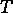是整个过程的总时间。结果是，量子系统的演化由著名的时变薛定谔方程控制，如果你能解出它，你将得到在任何时刻（在和之间）的系统状态向量的表达式。

然而，要理解 QAOA，我们不需要学习如何解薛定谔方程——那几乎就是了，但我们设法避开了这个子弹！我们只需要知道的是，应用离散化，我们可以将解表示为形式为操作符的乘积

H_{0} + B(t_{c})H_{1}})}}")

应用于初始状态。在这里，是虚数单位，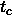是中的一个固定时间点，而是一小段时间。关键思想是在这个区间内，我们假设哈密顿量是常数，并且等于 = A(t_{c})H_{0} + B(t_{c})H_{1}")。当然，越小，这个近似越好。同样重要的是要注意，H_{0} + B(t_{c})H_{1}})}}")是一个幺正变换，就像我们在*第* * *1*，*量子计算基础*这一章中研究的那样。实际上，你肯定记得我们在这章中介绍的一些量子门，例如, , 和,也是某些矩阵的指数。使用这种离散化技术，如果是初始状态，那么最终状态可以近似为*

*H_{0} + B(t_{m})H_{1}})}}} \right)\left| \psi_{0} \right\rangle,")

其中和.

为了用量子电路计算这个状态，我们只需要一个额外的近似。正如你所知，对于任何实数和，都成立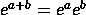。对于矩阵指数的类似恒等式通常不成立——除非矩阵对易。然而，如果很小，那么

H_{0} + B(t_{c})H_{1}})}} \approx e^{i\Delta tA(t_{c})H_{0}}e^{i\Delta tB(t_{c})H_{1}},")

这就是所谓的**李-特罗特公式**。

将所有这些放在一起，绝热演化的最终状态可以近似为

H_{0}}e^{i\Delta tB(t_{m})H_{1}}\left| \psi_{0} \right\rangle,")

这就是 QAOA 的灵感来源，我们将在下一小节中看到。

## 5.1.2 QAOA：算法

QAOA 的起点和目标与量子退火完全相同。我们从一个我们想要解决的组合优化问题开始，正如我们在 *第* **3*，*处理二次无约束二进制优化问题* 中所学的那样，将其编码成一个 Ising 哈密顿量 . 为了找到其基态并解决我们的问题，我们寻求应用类似于量子退火的量子状态演化，但使用量子线路而不是量子退火器。

*鉴于我们在上一小节末获得的绝热演化的离散化，QAOA 的理念很简单。为了用量子线路模拟在时变哈密顿量下的状态演化，你只需要取一个初始状态 ，然后交替应用  次操作符  和 ，其中  和  取某些值。顺便说一下，在下一小节中，我们将看到单位变换  和  可以仅用单量子比特和双量子比特量子门来实现。

我们所做的是，然后，使用量子线路来制备一种形式的状态


其中 . 通常，我们将指数中的所有系数收集在两个元组 ") 和 ") 中，并用  表示整个状态。

在 QAOA 中，我们选择一个固定的值，并且我们有和的一些值。与我们在前一小节中那样，将和的值视为由函数和给出的强度系数乘以小时间增量，我们现在将它们视为“普通的实数”。这正是魔法开始发挥作用的地方。既然我们现在可以自由地选择它们的值，为什么不尽可能选择它们的最优值呢？

但在这里，“**最佳**”意味着什么？请记住，我们只是在尝试找到的基态，因此，对我们来说，能量的值越低越好。这样，我们就将我们的优化问题转化为另一个问题：找到和的值，以使它们最小化。

 = \left\langle {\mathbf{\beta},\mathbf{\gamma}} \right|H_{1}\left| {\mathbf{\beta},\mathbf{\gamma}} \right\rangle.")

注意，由于和是实数，能量")也是实数，所以我们手头上的问题是寻找一个具有实数输入的实值函数的最小值的老问题。我们可以应用许多算法来解决这个问题，例如著名的**梯度下降算法**，我们将在本书的**第三部分***III*，“天作之合：量子机器学习”中用它来训练机器学习模型。然而，这里有一个重要的转折。正如我们所知，描述像这样的状态的振幅数量是我们所使用的量子比特数量的指数级。因此，仅用经典计算机计算")可能很困难。

*但是，结果证明，使用量子计算机来估算")的值是非常高效的——至少当中的项数是量子比特数的多项式时，这种情况通常是我们感兴趣的问题中的情况。在下一个小节中，我们将详细解释如何计算这种估算，但到目前为止，只需记住，给定一些和的值，我们可以依赖量子计算机来计算")。*

然后，我们可以使用任何用于函数最小化的经典算法，每当它需要计算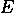函数的值时，我们就使用量子计算机来估算它，并将该值返回给经典算法，直到它需要另一个的值。在那个时刻，我们再次使用量子计算机来获得它，以此类推，直到我们遇到经典算法的停止标准。这就是我们所说的**混合算法**，在这种算法中，经典计算机和量子计算机协同工作来解决一个问题。在整个书中，我们将看到这种交互的许多例子。

一旦我们获得了和的最优值和——或者至少是它们的估算值——我们就可以再次使用量子计算机来准备状态。这种状态应该与的基态有相当大的重叠，因此当我们以计算基对其进行测量时，我们有很大的机会获得一串零和一，这将是解决我们原始问题——使用*第* *3* *章* **3**，*处理二次无约束* *二进制优化问题* *的技术编码在中*的一个很好的解决方案。

*我们现在已经拥有了拼图的全部碎片，让我们把它们全部放在一起。QAOA 的输入是一个伊辛哈密顿量 , 我们希望近似其基态，因为它编码了解决某个组合优化问题的解。为此，我们考虑之前定义的能量函数 ") 并着手最小化它。为此，我们选择  和一些初始值  和 ，我们将它们用作某些经典最小化算法的起点。然后，我们运行最小化算法，每当它请求在某个点  和  以及  上进行评估时，我们使用量子计算机来准备状态  并估计其能量，并将该值返回给经典算法。我们继续这个过程，直到经典最小化算法停止，返回一些最优值  和 。作为最后一步，我们使用量子计算机来准备 。当我们测量它时，我们获得一个——希望是——好的组合问题的近似解。

我们将这些步骤收集为以下算法的伪代码。请注意，只有在两个点上需要量子计算机。

**算法 5.1** (QAOA)**.**

为  选择一个值

选择一组起始值 ") 和 ")

**当**停止条件未满足时 **do**

准备状态      *这是在量子计算机上完成的！*

从  的测量中估计 ")

根据最小化算法更新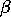和

-

获得最小化算法返回的最优值和

准备状态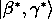     *这是在量子计算机上完成的！*

测量状态以获得一个近似解

要了解更多...

在结束本小节之前，我们认为这是一个与我们分享一个历史事实的好时机。

当它在 2014 年的一篇论文[37]中提出时，QAOA 为 Max-Cut 问题提供了比任何现有经典算法更好的近似比率，这些经典算法将在多项式时间内运行。我们说它是“提供”的，因为不久之后，这一主张被一篇论文[11]所挑战，该论文提出了一种能够击败 QAOA 的经典算法。

我们能说什么呢？有时候经典的东西是不愿意消亡的！

我们所讨论的 QAOA 描述可能显得有些抽象。但不用担心。在下一个小节中，我们将使所有这些内容更加具体，因为我们将会详细研究实现量子计算机上运行的算法部分的量子电路。

## 5.1.3 QAOA 电路

正如我们刚才看到的，量子计算机只在 QAOA 的某些步骤中使用。实际上，这些步骤总是涉及准备一种形式的状态

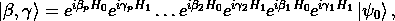

其中是的基态。当然，我们需要在量子电路中准备足够的状态，因此让我们分析我们需要执行的操作。一个关键的观察是，哈密顿量和具有一个非常特定的形式。正如我们在上一章所研究的，通常被取为，而是一个形式为 Ising 哈密顿量的


其中系数 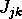 和 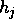 是实数。

 的基态是 ，正如你在 *练习* * *4.2* 中所证明的那样。这个状态可以很容易地制备：从  开始，你只需要在每个量子比特上使用一个哈达玛门（Hadamard gate）。

*这很简单，那么现在让我们专注于形式为  的操作，其中  是一个实数。注意  并且所有 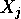 矩阵彼此交换，因此我们可以用指数的乘积代替和的指数。因此，它成立


但是  是旋转门 ") 的表达式，这意味着我们只需要将这个门应用到我们电路中的每个量子比特上。真不错，不是吗？

我们需要转换成量子门的最后一种操作是任何实系数  的 。我们知道  是形式为 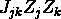 和 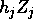 的项的和。同样，这些矩阵彼此交换，所以我们得到

} = \prod\limits_{j,k}e^{- i\gamma_{l}J_{jk}Z_{j}Z_{k}}\prod\limits_{j}e^{- i\gamma_{l}h_{j}Z_{j}}.")

与的情况类似，形式为的操作可以使用旋转门执行。因此，我们只需要学习如何实现。为了简化问题，让我们用表示实数。请注意，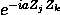是对角矩阵的指数，因为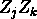是对角矩阵的张量积。实际上，如果是计算基态，其中量子位和具有相同的值，那么


另一方面，如果量子位和具有不同的值，那么


这种幺正操作通过*图* **5.1*中的电路实现，其中，为了简单起见，我们只描绘了量子位和 — 对其余量子位的作用将是恒等门。

*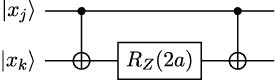

**图 5.1**：的实现

我们现在已经有了所有必要的元素，让我们用一个例子来说明它们。假设你问题的伊辛哈密顿量为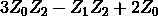。那么，QAOA 用来准备且的电路如图*图* **5.2*所示。

*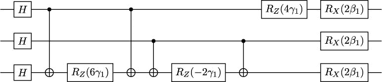

**图 5.2**：的 QAOA 电路

注意我们首先使用一系列 Hadamard 门准备  的基态。然后，我们通过在量子位  和  之间使用 CNOT 门，在量子位  上使用  门，以及在量子位  和  之间再次使用 CNOT 门来实现 。 的实现类似，但是在量子位  和  上。然后，我们在量子位  上使用  门来实现 。最后，一列  门实现了 。如果我们增加了 **层**  的数量，电路将通过重复 *图* * *5.2* 中显示的相同电路结构（除了初始的 Hadamard 门）来增长。此外，我们还需要在第二层将参数  和  替换为  和 ，在第三层替换为  和 ，依此类推。*

*练习 5.1

获取  的 QAOA 电路，其中 。

现在我们已经知道了 QAOA 所需的所有电路，让我们研究如何使用它们来估算状态  的能量。

## 5.1.4 估算能量

我们刚刚研究的电路使我们能够准备任何形式为  的状态。但我们并不对状态本身感兴趣。我们需要的是它们相对于  的能量，因为这是我们想要最小化的量。也就是说，我们需要评估 ，但当然，我们无法访问状态向量，因为我们正在使用量子计算机来准备状态。那么，我们能做什么呢？

这里关键观察点是，我们已知如何高效地评估任何基态。实际上，是组合优化问题代价函数中的值，因为我们正是从它推导出的。因此，例如，如果我们试图解决最大切割问题，每个代表一个切割，我们可以很容易地——使用经典计算机——计算出这个切割的成本，就像我们在*第 3.1.2 节*（ch011.xhtml#x1-620003.1.2）中所做的那样。

*更重要的是，我们还可以直接从哈密顿量的表达式中评估。我们只需要注意到，如果的第位是，则；否则，。以类似的方式，如果的第位和第位相等，则；如果它们不相等，则。

然后，通过线性关系，我们可以轻松地评估。例如，如果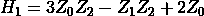, 我们将得到


练习 5.2

评估 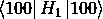，其中 .

我们还知道，我们总是可以将 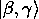 写作基态的线性组合。也就是说，我们有

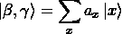

对于某些振幅 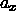 使得 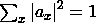.

但此时成立

H_{1}(sumlimits_{x}a_{x}left| x rightrangle) = sumlimits_{y}sumlimits_{x}a_{y}^{*}a_{x}leftlangle y right|H_{1}left| x rightrangle = sumlimits_{x}|a_{x}|^{2}leftlangle x right|H_{1}left| x rightrangle,")

因为 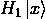 总是 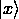 的倍数（只需注意  是对角矩阵，因为它是对角矩阵之和），因为当 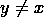 时 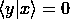，以及因为 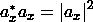.

现在，由于我们可以轻松地使用经典计算机计算，我们已经将问题简化为计算的值。但是当状态被准备时测量的概率——这就是为什么，在*第* * *3*，*与二次无约束二进制优化问题一起工作* *中，我们称形式为的表达式为期望值；它们确实是在测量状态!时的期望或平均能量；*

*从这个观察结果可以得出，我们可以使用量子计算机来准备并测量它次，以进行估计


其中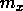是被测量的次数。当然，的值越高，这个近似就越好。

重要提示

在使用量子计算机估计所有不同状态的能量过程中，我们将计算优化问题中许多二进制字符串的成本。当然，在优化过程中始终保留所见到的最佳是明智的。偶尔，它甚至可能比我们在测量最终状态时获得的结果更好。

我们现在已经了解了关于 QAOA 内部工作原理所需的所有知识。在我们继续展示如何使用 Qiskit 和 PennyLane 实现和使用此算法之前，我们将介绍一个好处，那就是我们不再使用量子退火器，而是使用通用量子计算机。这将帮助我们以更自然的方式提出一些问题，正如我们将在下一小节中展示的那样。

## 5.1.5 QUBO 和 HOBO

到目前为止，我们只考虑了可以用 QUBO 形式表示的问题。也就是说，成本函数是二进制变量的二次多项式，对这些变量可以取的值没有任何约束。这比看起来要宽松，因为 QUBO 是-难问题，而且有许多重要的问题我们可以通过约简来重写，正如我们在*第 3.4 节*中看到的。

*然而，考虑一个像著名的**可满足性**或**SAT**这样的问题。在其中，我们被给出一个关于二进制变量的布尔公式，我们必须确定是否存在任何赋值可以使公式为真。例如，我们可能会收到

 \land (\neg x_{0} \vee x_{1} \vee \neg x_{2}) \land (x_{0} \vee x_{1} \vee x_{2}),")

这在赋值所有变量为*true*的情况下是**可满足的**）。或者我们可以被给出


这显然是**不可满足的**。

很容易看出 SAT 属于（实际上，它是-完全的——参见 Sipser 的书中*第 7.4 节* [90]）。那么，我们知道必须有一种方法可以将任何 SAT 实例重写为 QUBO 形式。但如果我们通过允许任何阶的二进制多项式来放宽 QUBO 公式的条件，这项任务就会变得容易得多。让我们看看为什么！

为了举例说明，让我们考虑公式  \land (\neg x_{0} \vee x_{1} \vee \neg x_{2}) \land (x_{0} \vee x_{1} \vee x_{2})")。我们将展示它如何表示为多项式

 = (1 - x_{0})x_{1}(1 - x_{2}) + x_{0}(1 - x_{1})x_{2} + (1 - x_{0})(1 - x_{1})(1 - x_{2}),")

在二进制变量 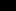, 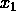, 和 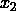 上。假设我们考虑原始公式中变量的某些真值赋值，并在多项式中将 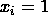 设置为为真，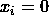如果为假。很容易看出，在这种情况下，原始公式将是真的，当且仅当  = 0")，并且它将是假的，当且仅当  > 0")。因此，如果多项式  对于其变量的某些值是 ，那么原始公式必须是可满足的。否则，它必须是不满足的。

然后，我们可以将我们的原始问题重新表述如下：

x_{1}(1 - x_{2}) + x_{0}(1 - x_{1})x_{2} + (1 - x_{0})(1 - x_{1})(1 - x_{2})\qquad} & & \qquad \\ {\text{subject~to~}\quad} & {x_{j} \in \{ 0,1\},\qquad j = 0,1,2.\qquad} & & \qquad \\ & \qquad & & \\ \end{array}") 是受诺贝尔物理奖获得者**理查德·费曼**启发的。

如果多项式的最小值为 ，则该公式将是可满足的。否则，该公式将不可满足。

通过简单的转换，我们已经能够将我们的问题重新表述为类似于 QUBO 实例的东西。但是等等！这**不是**一个 QUBO 问题。原因是二进制多项式的次数是  而不是 ，这可以通过展开其表达式轻松检查出来。这些优化问题，其中我们被要求最小化一个任意次数的二进制多项式——没有任何额外限制，被称为**高阶二进制优化**（**HOBO**）或**多项式无约束二进制优化**（**PUBO**）问题，原因很明显。

我们应用的方法相当通用。实际上，很容易看出我们可以将其应用于任何以变量的析取和变量的否定为合取的布尔公式。例如，像这样的公式，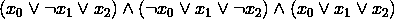 或 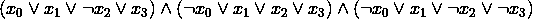。我们称这些公式为**合取范式**或**CNF**。在这种情况下，我们只需获得一个由乘积之和组成的关联多项式。每个乘积将对应于公式中的一个析取。如果一个变量  在析取中以否定形式出现，它将作为  出现在乘积中。如果它以正形式出现，它将作为 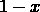 出现在乘积中。

练习 5.3

将 SAT 问题用布尔公式写成 HOBO 版本

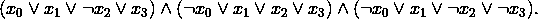

那么关于不是 CNF（合取范式）的布尔公式怎么办呢？在这种情况下，我们可以应用一种称为**Tseitin 变换**的方法，该方法在多项式时间内运行，并给我们一个 CNF 形式的公式，该公式只有在原始公式可满足时才可满足（更多细节请参见 [17，第二章]）。实际上，得到的公式将是**3-CNF**，这意味着析取将涉及最多三个变量或变量的否定。这非常方便，因为它保证了将多项式展开以获得系数的过程将是高效的。

但关于可满足性问题就说到这里。让我们回到 HOBO 问题。我们如何解决它们？一种方法是将它们转换成 QUBO 问题。通过引入辅助变量，有不同的技术可以将 HOBO 问题重写为 QUBO 实例。例如，只要引入惩罚项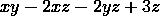，你就可以用新的二进制变量替换乘积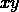，其中等于![0]当且仅当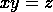。这样，你可以将阶数为的项，如，简化为阶数为的项，以及一个关于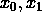和的二次惩罚项。通过重复此过程所需次数，你可以得到一个等价问题，其中目标函数是一个二进制二次多项式。这种类型的转换在 D-Wave 的 Ocean 中使用，在那里你可以找到可以将其简化为度数为的多项式的`BinaryPolynomial`对象，你可以使用`make_quadratic`函数实现。

然而，如果你使用 QAOA，你可以直接处理 HOBO 问题。我们可以考虑任何度数的二项式，并使用**第 3.3 节**中的技术对其进行转换。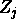矩阵的张量积之和将构成哈密顿量。唯一的区别是，现在这些乘积可以涉及一个以上的矩阵。

这意味着，当我们着手创建的电路时，我们可能需要实现形式为的幺正操作，其中![m > 2]。但这并不比实现更困难。事实上，我们可以几乎重复**第 5.1.3 节**中的论点，因为和都是对角矩阵。实际上，如果是一个基态，那么

在位置上的比特之和是偶数的话，并且


如果和是奇数的话。

这个幺正操作可以通过使用控制量子比特在和目标在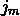上的连续 CNOT 门来实现，然后在量子比特上使用参数为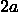的门，再次使用控制量子比特在和目标在上的连续 CNOT 门。*图* * *5.3*展示了在只有四个量子比特的假设下，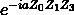的情况下的这个过程。

*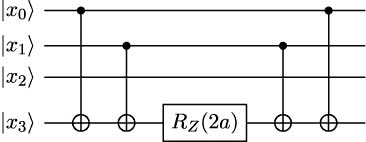

**图 5.3**：的实现

当然，这个操作只是实现的一部分，我们需要对哈密顿量的每一项重复类似的过程。

练习 5.4

在一个包含 5 个量子比特的电路中实现操作。

注意，我们也可以用与我们在*第 5.1.4 节*中解释的非常相似的方式估计包含矩阵张量的哈密顿量的能量。关键事实是，对于任何基态，都成立。

*

如果在位置上的比特之和是偶数的话，并且


otherwise. 通过线性，我们可以评估，并从那里通过测量多次来估计，这与我们在*第 5.1.4 节* **5.1.4*中所做的方法完全相同。

*练习 5.5

使用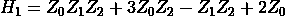来评估。

我们现在已经涵盖了理解 QAOA 所需的所有必要概念。在接下来的两个部分中，我们将展示如何使用 Qiskit 和 PennyLane 实现并运行此算法。

# 5.2 使用 Qiskit 进行 QAOA

在本章前几节中我们已经学到的内容，以及我们从*第二章* **2*，*量子计算中的工具*和*第 3.2.2 节* **3.2.2*中了解到的 Qiskit 知识，我们可以实现我们自己的 Qiskit 版本 QAOA。然而，没有必要这么做！正如我们将在本节中展示的，Qiskit 优化包提供了在量子模拟器和实际量子计算机上运行 QAOA 所需的一切。此外，它还包括一套直接与 QUBO 形式化下编写的问题进行工作的工具。实际上，在本节中，我们还将看到 Qiskit 在底层是如何使用我们一直在研究的相同数学概念的。**

**首先，我们来解释一下，当我们已经拥有问题哈密顿量时，如何在 Qiskit 中与 QAOA 进行交互**。

## 5.2.1 使用哈密顿量进行 QAOA

如果我们有编码优化问题的哈密顿量，使用 Qiskit 的 QAOA 实现来近似其基态是非常容易的。让我们从一个简单的例子开始，其中我们有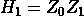。我们可以使用以下代码行创建这个哈密顿量并准备相应的 QAOA 电路：

```py

from qiskit.opflow import Z 

from qiskit.algorithms import QAOA 

H1 = Z^Z # Define Z_0Z_1 

qaoa = QAOA() 

circuit = qaoa.construct_circuit([1,2],H1)[0] 

circuit.draw(output="mpl")

```

结果，我们将获得*图* **5.4*中所示的电路。我们可以看到它从两个 Hadamard 门开始，然后是的指数，然后是的指数（因为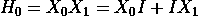)。这正是我们在本章第一部分推导出的电路。

*

**图 5.4**：的 QAOA 电路

为了创建电路，除了 `H1` 之外，我们还向 `construct_circuit` 方法传递了 `[1,2]`。这个列表包含我们想要使用的  和  参数。在 *图 5.4* 中，这通过门框下方的数字表示。请注意，这意味着 `[1,2]` 中的第一个元素就是我们所说的 ，第二个是 。另外请注意，我们在 `construct_circuit` 调用之后使用了 `[0]`。这是因为这个方法通常返回多个电路的列表——但在这个情况下，只有一个，就是我们选择的那个。*

我们可以通过分解指数——即，将它们转换为更简单的门——来更详细地可视化电路，这要做几次。为此，我们可以使用

```py

circuit.decompose().decompose().draw(output="mpl")

```

以获得图 **5.5* 中所示的电路。该电路中的门序列正是我们在此章早期推导中期望的，因为  = H \right.")，正如你可以从我们在 *第 1.3.4 节* (*1.3.4*) 中给出的定义中轻松检查到的（ 是 Qiskit 对我们  门的命名）。**

**

**图 5.5**： 的 QAOA 电路，更详细

默认情况下，Qiskit 中 QAOA 的  的值为 。然而，我们可以通过在调用类构造函数时使用 `reps` 参数来更改它。例如，以下代码可以用来获取  的 QAOA 电路，其中 ，，，，和 ：

```py

qaoa = QAOA(reps = 2) 

circuit = qaoa.construct_circuit([1,2,3,4],H1)[0] 

circuit.decompose().decompose().draw(output="mpl")

```

执行结果是图 **5.6* 中所示的电路。

*

**图 5.6**： 的 QAOA 电路，

所有这些都很好，但我们还没有解决任何优化问题！为了做到这一点，我们需要在创建 `QAOA` 对象时传递两个额外的参数。第一个是一个 `QuantumInstance`。也就是说，一些能够执行 QAOA 量子电路以评估  状态能量的后端。第二个是一个经典优化器，它将为  和  设置初始值，使用 `QuantumInstance` 评估状态能量，并更新  和  参数以优化它们，直到满足某些停止标准。

要了解更多……

经典优化器的选择可能会对 QAOA 获得的解决方案的执行时间和质量产生重大影响。

对于这方面的见解，你可以参考 [39]。

在以下代码片段中，我们给出了如何创建量子实例和经典最小化器对象，以及如何使用它们与 QAOA 解决简单问题的示例：

```py

from qiskit.utils import algorithm_globals, QuantumInstance 

from qiskit import Aer 

from qiskit.algorithms.optimizers import COBYLA 

seed = 1234 

algorithm_globals.random_seed = seed 

quantum_instance = QuantumInstance(Aer.get_backend("aer_simulator"), 

                   seed_simulator=seed, seed_transpiler=seed, 

                   shots = 10) 

qaoa = QAOA(optimizer = COBYLA(), quantum_instance=quantum_instance) 

result = qaoa.compute_minimum_eigenvalue(H1) 

print(result)

```

在这里，我们依赖于 `H1` 的先前定义 `Z``^``Z`，在 `Aer` 模拟器上运行电路，使用  次射击，并使用 `COBYLA` 作为经典优化器——有关最小化器的更新列表，请参阅 Qiskit 的文档 [`qiskit.org/documentation/stubs/qiskit.algorithms.optimizers.html`](https://qiskit.org/documentation/stubs/qiskit.algorithms.optimizers.html)。我们还为需要随机数的那些过程设置了种子，以便获得可重复的结果。

如果你运行前面的指令，你将获得以下输出：

@empty

```py

{   ’aux_operator_eigenvalues’: None, 

    ’cost_function_evals’: 20, 

    ’eigenstate’: {’01’: 0.5477225575051661, ’10’: 0.8366600265340756}, 

    ’eigenvalue’: (-1+0j), 

    ’optimal_parameters’: { 

    ParameterVectorElement(@$\gamma$@[0]): -0.847240391875931, 

    ParameterVectorElement(@$\beta$@[0]): 6.7647519845416655}, 

    ’optimal_point’: array([ 6.76475198, -0.84724039]), 

    ’optimal_value’: -1.0, 

    ’optimizer_evals’: None, 

    ’optimizer_time’: 0.07764506340026855}

```

这确实是一大堆信息！让我们尝试解释其中最相关的部分。首先，我们需要理解的是，这个结果指的是 QAOA 获得的最终状态，而不是如果我们测量它我们会得到的解。实际上，这个状态是通过次测量重建的——因为我们的模拟器使用了次射击——但这些测量并没有作为输出的一部分给出。相反，我们得到了`eigenstate`字段，它显示我们有一个的振幅大约为和的振幅大约为。这些数字实际上是和，这意味着，一旦通过最小化器找到的最佳参数状态被准备并测量，`01`在次测量中出现了次，而`10`在剩余的次测量中出现。这个状态可以通过使用结果中报告的最佳参数和来使用 QAOA 电路进行准备。

注意到，对于哈密顿量，和的期望值均为，这是最佳能量。这意味着我们已经能够找到一个最佳解——实际上是有两个——通过 QAOA！为了得到这个结果，QAOA 评估了能量函数——通过准备一个包含和某些值的电路，并测量它以估计其期望值——20 次，如`cost_function_evals`字段所示，并且它使用了大约秒的计算机时间——尽管你的运行时间肯定与我们不同。

所有这些都是在 Aer 模拟器上完成的。如果我们想使用真实的量子计算机，我们只需在`QuantumInstance`对象的实例化中替换`backend`，并使用 IBM 提供的某些量子设备，就像我们在*第* **2.2.4* *节中展示的那样。然而，这并不是最佳的做法。这种直接方法的缺点是您将在本地运行算法的经典部分。然后，每次需要能量估计时，都会向量子计算机提交一个新的作业，并且如果您有其他用户也提交了作业以执行，您将不得不等待队列。这可能会相当慢，不是因为过程本身，而是因为队列等待时间。

*幸运的是，Qiskit 最近引入了一个名为 Runtime 的新模块，允许我们减少像 QAOA 这样的混合算法的执行时间。与逐个提交每个电路不同，使用 Runtime，您可以提交一个包含算法的经典和量子部分的**程序**。程序随后只排队一次，大大加快了整个执行过程。

使用 QAOA 与 Runtime 结合非常简单。实际上，我们只需要指定与`QAOA`类相同的元素，但方式略有不同。以下代码片段展示了如何进行此操作：

```py

from qiskit import IBMQ 

provider = IBMQ.load_account() 

program_id = "qaoa" 

H1 = Z^Z 

opt = COBYLA() 

reps = 1 

shots = 1024 

runtime_inputs = { 

    "operator": H1, 

    "reps": reps, 

    "optimizer": opt, 

    "initial_point": [0,0], 

    "use_swap_strategies": False 

} 

options = {"backend_name": "ibmq_belem"} 

job = provider.runtime.run(program_id=program_id, 

      options=options, inputs=runtime_inputs)

```

这将创建并运行一个 QAOA Runtime 作业，其量子部分将在我们在`options["backend_name"]`字段中指定的量子计算机上执行——在我们的案例中，是`ibmq_belem`。我们使用了哈密顿量，COBYLA 作为优化器，一个的值（通过`reps`变量指定），以及次射击。

我们还选择了和的初始值为，使用`initial_point`字段。如果此字段未使用，初始值将随机选择。

一旦程序运行完成（您可以使用`job.status()`跟踪其执行），结果可以通过`job.result()`检索。我们可以使用以下指令访问其一些参数：

```py

result = job.result() 

print("Optimizer time", result[’optimizer_time’]) 

print("Optimal value", result[’optimal_value’]) 

print("Optimal point", result[’optimal_point’]) 

print("Optimal state", result[’eigenstate’])

```

在我们的情况下，运行这些代码行得到了以下结果：

```py

Optimizer time 88.11612486839294 

Optimal value -0.84765625 

Optimal point [0.42727683 2.39693691] 

Optimal state {’00’: 0.2576941016011038, ’01’: 0.691748238161833, 

               ’10’: 0.6584783595532961, ’11’: 0.14657549249448218}

```

如您所欣赏，由于噪声的影响，结果略逊于模拟器。但两个最优基态——和——仍然是可能性最大的，因此，如果我们多次准备和测量最终状态，我们找到最优解的概率将非常高。

因此，我们现在知道了如何使用 Qiskit 解决 QAOA 问题，无论是使用模拟器还是实际量子计算机。然而，到目前为止，我们不得不自己准备问题的哈密顿量，这并不理想。正如我们在 *第* **3*，*“与二次无约束* *二进制优化问题一起工作”* 这一章节中学到的，对于许多问题，使用 QUBO 公式或甚至将问题写成二进制线性规划会更方便。在 Qiskit 中直接使用这些公式的可能性如何？绝对可以！我们将在下一小节中向您展示。

*## 5.2.2 在 Qiskit 中使用 QAOA 解决 QUBO 问题

Qiskit 提供了处理二次问题的工具，无论是带约束还是不带约束，这些工具与我们研究 Ocean 时使用的类似，在 *第* **4*，*“量子绝热计算和量子退火”* 这一章节中。例如，我们可以使用以下代码定义一个简单的二进制程序：

*```py

from qiskit_optimization.problems import QuadraticProgram 

qp = QuadraticProgram() 

qp.binary_var(’x’) 

qp.binary_var(’y’) 

qp.binary_var(’z’) 

qp.minimize(linear = {’y’:-1}, quadratic = {(’x’,’y’):2, (’z’,’y’):-4}) 

qp.linear_constraint(linear = {’x’:1, ’y’:2, ’z’:3}, 

    sense ="<=", rhs = 5) 

print(qp.export_as_lp_string())

```

如您所见，我们正在定义一个具有三个二进制变量的二次问题，一个具有线性部分和二次部分的要最小化的函数，以及一个在二进制变量中的线性约束。当我们运行这些指令时，我们获得以下输出：

```py

\ This file has been generated by DOcplex 

\ ENCODING=ISO-8859-1 

\Problem name: CPLEX 

Minimize 

 obj: - y + [ 4 x*y - 8 y*z ]/2 

Subject To 

 c0: x + 2 y + 3 z <= 5 

Bounds 

 0 <= x <= 1 

 0 <= y <= 1 

 0 <= z <= 1 

Binaries 

 x y z 

End

```

问题恰好包含我们指定的元素。可能需要稍作解释的细节是，为什么目标函数的二次部分被表示为 \slash 2 \right.") 而不是 。这种看似奇怪的选择的原因是，这样可以使具有二次系数的矩阵变得对称。而不是将  系数的值设为  和  乘积的值设为 ，值被重复，两个项都将有  作为它们的系数——但这样我们就需要除以 ，以便总系数保持与原始规范一致。

要了解更多…

这些二次问题的内部表示是 CPLEX 所使用的，CPLEX 是一个 IBM 包，用于使用经典方法解决优化问题。您可以在其网页上了解更多关于 CPLEX 的信息：[`www.ibm.com/products/ilog-cplex-optimization-studio`](https://www.ibm.com/products/ilog-cplex-optimization-studio)。

一旦我们有一个 `QuadraticProgram` 对象，我们就可以使用 Qiskit 提供的算法之一来解决问题。为了实现这一点，我们可以使用 `MinimumEigenOptimizer` 与一个具体的求解器一起。例如，我们可以使用一个经典的精确求解器，它尝试每一个可能的解并选择最优解。在 Qiskit 中，这就像使用以下指令一样简单：

```py

from qiskit_optimization.algorithms import MinimumEigenOptimizer 

from qiskit.algorithms import NumPyMinimumEigensolver 

np_solver = NumPyMinimumEigensolver() 

np_optimizer = MinimumEigenOptimizer(np_solver) 

result = np_optimizer.solve(qp) 

print(result)

```

执行的结果如下：

```py

fval=-5.0, x=0.0, y=1.0, z=1.0, status=SUCCESS

```

正如你所见，我们获得了最佳分配 (、 和 )，函数的最佳值（在这种情况下，），以及分配是否满足约束，由 `SUCCESS` 值表示，或者不满足——如果没有分配满足约束，我们将会获得 `INFEASIBLE` 作为 `status` 的值。

以类似的方式，我们可以使用 QAOA 通过以下指令解决问题：

```py

from qiskit import Aer 

from qiskit.algorithms import QAOA 

from qiskit.algorithms.optimizers import COBYLA 

from qiskit.utils import QuantumInstance 

quantum_instance = QuantumInstance(Aer.get_backend("aer_simulator"), 

    shots = 1024) 

qaoa = QAOA(optimizer = COBYLA(), 

    quantum_instance=quantum_instance, reps = 1) 

qaoa_optimizer = MinimumEigenOptimizer(qaoa) 

result = qaoa_optimizer.solve(qp) 

print(result)

```

在这种情况下，结果将与使用 `NumPyMinimumEigensolver` 获得的结果相同。但我们可以通过以下指令获得更多信息：

```py

print(’Variable order:’, [var.name for var in result.variables]) 

for s in result.samples: 

    print(s)

```

结果将类似于以下内容：

```py

Variable order: [’x’, ’y’, ’z’] 

SolutionSample(x=array([0., 1., 1.]), fval=-5.0, 

probability=0.11621093749999999, status=<OptimizationResultStatus.SUCCESS: 0>) 

SolutionSample(x=array([0., 1., 0.]), fval=-1.0, 

probability=0.107421875, status=<OptimizationResultStatus.SUCCESS: 0>) 

SolutionSample(x=array([1., 0., 1.]), fval=0.0, 

probability=0.1494140625, status=<OptimizationResultStatus.SUCCESS: 0>) 

SolutionSample(x=array([0., 0., 1.]), fval=0.0, 

probability=0.1103515625, status=<OptimizationResultStatus.SUCCESS: 0>) 

SolutionSample(x=array([1., 0., 0.]), fval=0.0, 

probability=0.103515625, status=<OptimizationResultStatus.SUCCESS: 0>) 

SolutionSample(x=array([0., 0., 0.]), fval=0.0, 

probability=0.1416015625, status=<OptimizationResultStatus.SUCCESS: 0>) 

SolutionSample(x=array([1., 1., 0.]), fval=1.0, 

probability=0.13769531249999997, status=<OptimizationResultStatus.SUCCESS: 0>) 

SolutionSample(x=array([1., 1., 1.]), fval=-3.0, 

probability=0.1337890625, status=<OptimizationResultStatus.INFEASIBLE: 2>)

```

首先，我们打印了变量的顺序，以便更容易解释求解器考虑的分配。然后，我们列出了 QAOA 找到的最终最优状态中的不同解决方案。列表中的每一项包括分配、能量或函数值、测量 QAOA 状态时获得相应基态的概率，以及解决方案是否可行——`status``=<``OptimizationResultStatus``.``SUCCESS``:` `0>` 表示解决方案是可行的，而 `status``=<``OptimizationResultStatus``.``INFEASIBLE``:`

`2>` 表示它不是。

练习 5.6

修改我们刚刚运行的代码，以便结果可重复。*提示*：你可以像我们在 *第 5.2.1 节* 中所做的那样设置种子。

*我们还可以通过以下方式获得 QAOA 执行的完整信息：

```py

print(result.min_eigen_solver_result)

```

我们将获得类似以下内容（其中我们已截断部分输出）：

@empty

```py

{   ’aux_operator_eigenvalues’: None, 

    ’cost_function_evals’: 32, 

    ’eigenstate’: {   ’000000’: 0.09375, 

                      ’000001’: 0.03125, 

                      ’000010’: 0.05412658773652741, 

                      [.....] 

                      ’111101’: 0.11692679333668567, 

                      ’111110’: 0.08838834764831845, 

                      ’111111’: 0.07654655446197431}, 

    ’eigenvalue’: (-14.7548828125+0j), 

    ’optimal_parameters’: { 

    ParameterVectorElement(@$\gamma$@[0]): -5.087643335935586, 

    ParameterVectorElement(@$\beta$@[0]): -0.24590437874189125}, 

    ’optimal_point’: array([-0.24590438, -5.08764334]), 

    ’optimal_value’: -14.7548828125, 

    ’optimizer_evals’: None, 

    ’optimizer_time’: 0.6570718288421631}

```

注意，然而，这些分配包括在从约束问题到无约束问题的转换中使用的辅助变量，正如我们在 *第三章* 中研究的过程，*处理二次无约束二进制优化问题*，函数值也是转换问题中采用的值。实际上，你可以使用以下代码获得相应的 QUBO 问题：

*```py

from qiskit_optimization.converters import QuadraticProgramToQubo 

qp_to_qubo = QuadraticProgramToQubo() 

qubo = qp_to_qubo.convert(qp) 

print(qubo.export_as_lp_string())

```

输出将如下所示：

```py

\ This file has been generated by DOcplex 

\ ENCODING=ISO-8859-1 

\Problem name: CPLEX 

Minimize 

 obj: - 80 x - 161 y - 240 z - 80 c0@int_slack@0 - 160 c0@int_slack@1 

      - 160 c0@int_slack@2 + [ 16 x² + 68 x*y + 96 x*z + 

      32 x*c0@int_slack@0 + 64 x*c0@int_slack@1 + 64 x*c0@int_slack@2 

      + 64 y² + 184 y*z + 64 y*c0@int_slack@0 + 128 y*c0@int_slack@1 

      + 128 y*c0@int_slack@2 + 144 z² + 96 z*c0@int_slack@0 

      + 192 z*c0@int_slack@1 + 192 z*c0@int_slack@2 

      + 16 c0@int_slack@0² + 64 c0@int_slack@0*c0@int_slack@1 

      + 64 c0@int_slack@0*c0@int_slack@2 + 64 c0@int_slack@1² 

      + 128 c0@int_slack@1*c0@int_slack@2 + 64 c0@int_slack@2² ]/2 

      + 200 

Subject To 

Bounds 

 0 <= x <= 1 

 0 <= y <= 1 

 0 <= z <= 1 

 0 <= c0@int_slack@0 <= 1 

 0 <= c0@int_slack@1 <= 1 

 0 <= c0@int_slack@2 <= 1 

Binaries 

 x y z c0@int_slack@0 c0@int_slack@1 c0@int_slack@2 

End

```

正如你所见，这现在是一个 QUBO 问题，其中引入了松弛变量和惩罚项，正如我们在 *第三章* 中所做的那样，*处理二次无约束二进制优化问题*。

*了解更多...

在 `qiskit_optimization` 的 `converters` 模块中，你还可以找到 `InequalityToEquality`、`IntegerToBinary` 和 `LinearEqualityToPenalty` 函数。`QuadraticProgramToQubo` 函数通过首先引入松弛变量将不等式转换为等式，然后将整数松弛变量转换为二进制变量，最后用惩罚项替换等式约束，将具有约束的二次规划转换为 QUBO 实例。

你可能现在想知道如何使用 `MinimumEigenOptimizer` 与量子计算机而不是与模拟器一起使用。当然，当定义与 `QAOA` 对象一起使用的 `quantum_instance` 参数时，你可以简单地声明一个真实的量子设备。但是，正如我们已经提到的，那将意味着多次进入设备队列，从而导致延迟。

你肯定还记得从上一个子节中，如果你有一个哈密顿量，你可以在 QAOA 运行时程序中直接使用它，以便一次性将你的问题提交到队列中。那么，我们能否获得我们问题的哈密顿量呢？当然可以！你可以运行以下代码，将 QUBO 问题进一步转换为等价的哈密顿量：

```py

H1, offset = qubo.to_ising() 

print("The Hamiltonian is", H1) 

print("The constant term is", offset)

```

然后，你可以使用 `H1` 通过 QAOA 运行时程序解决问题，甚至可以通过添加 `offset` 项来恢复能量。但是……这看起来好像要做很多工作，不是吗？更重要的是，你需要处理所有那些引入来将二次规划转换为 QUBO 形式的丑陋松弛变量。肯定有更简单的方法。

幸运的是，Qiskit 开发者非常周到，他们已经使我们能够直接使用 Qiskit Runtime 与 `MinimumEigenOptimizer` 一起使用。不过，为了做到这一点，你需要一个叫做 `QAOAClient` 的东西，它将确保一旦连接到 `MinimumEigenOptimizer`，一切运行顺畅。使用它就像选择一个具有足够量子位的设备一样简单。我们需要至少 ，所以我们选择了 `ibm_lagos`，它有 ；如果你没有足够大的设备，你总是可以使用 `ibmq_qasm_simulator`，它支持多达 。一旦我们有了设备，我们就可以运行以下指令：

```py

from qiskit_optimization.runtime import QAOAClient 

from qiskit import IBMQ 

provider = IBMQ.load_account() 

qaoa_client = QAOAClient(provider=provider, 

                      backend=provider.get_backend("ibm_oslo"), reps=1) 

qaoa = MinimumEigenOptimizer(qaoa_client) 

result = qaoa.solve(qp) 

print(result)

```

这将产生以下输出：

```py

fval=-5.0, x=0.0, y=1.0, z=1.0, status=SUCCESS

```

当然，你可以通过访问和使用变量 `result``.``variables`、`result``.``samples` 和 `result``.``min_eigen_solver_result` 的值来获取有关执行情况的更多信息，就像我们在之前的示例中所做的那样。非常方便，对吧？

我们现在已经学会了如何在 Qiskit 中使用 QAOA，以及如何以许多不同的方式管理和解决我们的问题。现在是时候回到 PennyLane，看看它能为解决我们心爱的 QUBO 问题提供什么了。

# 5.3 使用 PennyLane 的 QAOA

正如我们在 *第* **2* *章* **2* 中提到的，*量子计算中的工具*，PennyLane 是一个主要关注量子机器学习的量子编程库。因此，它不像 Qiskit 那样包含许多量子优化算法（如 QAOA）的工具。然而，它确实提供了一些有趣的功能，例如自动微分——即梯度的解析计算——这可能在某些情况下使其成为 Qiskit 的一个有吸引力的替代品。

首先，我们来解释如何在 PennyLane 中声明和使用哈密顿量。为此，我们将使用`Hamiltonian`类。它提供了一个构造函数，接受一个系数列表和一个泡利矩阵乘积列表。例如，如果你想定义,你需要将`[2,-1,3.5]`作为第一个参数传递，将`[``PauliZ``(0)``@PauliZ``(1),``PauliZ``(0)``@PauliZ``(2),``PauliZ``(1)]`作为第二个参数。正如我们从*第* * *2* *章中了解到的，*量子计算中的工具*，`PauliZ`是 PennyLane 中的矩阵。我们还使用了`@`运算符，它是 PennyLane 表示张量积运算的符号。将这些放在一起，我们得到以下指令：

*```py

import pennylane as qml 

from pennylane import PauliZ 

coefficients = [2,-1,3.5] 

paulis = [PauliZ(0)@PauliZ(1),PauliZ(0)@PauliZ(2),PauliZ(1)] 

H = qml.Hamiltonian(coefficients,paulis) 

print(H)

```

执行该代码的输出将是以下内容：

```py

(3.5) [Z1] 

+ (-1) [Z0 Z2] 

+ (2) [Z0 Z1]

```

如你所见，我们构建的哈密顿量正是我们想要的。我们还可以通过使用`print``(``qml``.``matrix``(``H``))`来获取其矩阵，这将给出以下输出：

```py

[[4.5+0.j  0\. +0.j  0\. +0.j  0\. +0.j  0\. +0.j  0\. +0.j  0\. +0.j  0\. +0.j] 

 [0\. +0.j  6.5+0.j  0\. +0.j  0\. +0.j  0\. +0.j  0\. +0.j  0\. +0.j  0\. +0.j] 

 [0\. +0.j  0\. +0.j -6.5+0.j  0\. +0.j  0\. +0.j  0\. +0.j  0\. +0.j  0\. +0.j] 

 [0\. +0.j  0\. +0.j  0\. +0.j -4.5+0.j  0\. +0.j  0\. +0.j  0\. +0.j  0\. +0.j] 

 [0\. +0.j  0\. +0.j  0\. +0.j  0\. +0.j  2.5+0.j  0\. +0.j  0\. +0.j  0\. +0.j] 

 [0\. +0.j  0\. +0.j  0\. +0.j  0\. +0.j  0\. +0.j  0.5+0.j  0\. +0.j  0\. +0.j] 

 [0\. +0.j  0\. +0.j  0\. +0.j  0\. +0.j  0\. +0.j  0\. +0.j -0.5+0.j  0\. +0.j] 

 [0\. +0.j  0\. +0.j  0\. +0.j  0\. +0.j  0\. +0.j  0\. +0.j  0\. +0.j -2.5+0.j]]

```

如预期的那样，这是一个对角矩阵。我们可以通过执行以下指令以更紧凑的方式可视化它，这将只给出非零元素：

```py

from pennylane.utils import sparse_hamiltonian 

print(sparse_hamiltonian(H))

```

结果将是以下内容：

```py

  (0, 0)    (4.5+0j) 

  (1, 1)    (6.5+0j) 

  (2, 2)    (-6.5+0j) 

  (3, 3)    (-4.5+0j) 

  (4, 4)    (2.5+0j) 

  (5, 5)    (0.5+0j) 

  (6, 6)    (-0.5+0j) 

  (7, 7)    (-2.5+0j)

```

你也可以通过指定以下数学表达式来以更紧凑的方式定义哈密顿量：

```py

H = 2*PauliZ(0)@PauliZ(1) - PauliZ(0)@PauliZ(2) +3.5*PauliZ(1)

```

如果你打印`H`，你会发现这个定义与之前介绍的定义是等价的。

练习 5.7

使用 PennyLane 以两种不同的方式定义![- 3Z_{0}Z_{1}Z_{2} + 2Z_{1}Z_{2} - Z_{2}]哈密顿量。

现在我们知道了如何定义哈密顿量，我们可以使用它们通过 PennyLane 创建 QAOA 电路。为此，我们将导入`qaoa`模块，这将使我们能够访问`cost_layer`和`mixer_layer`函数。我们需要一个成本哈密顿量——用于编码我们的优化问题——与`cost_layer`一起使用，我们将使用与`mixer_layer`（在 QAOA 文献中，我们的哈密顿量有时被称为**混合哈密顿量**，因此函数的名称）。有了它们，我们可以创建一个函数来构建 QAOA 电路，并计算电路制备的状态相对于的能量。这部分使用 PennyLane 非常容易完成，因为它提供了`expval`函数，它正好计算这一点，并且可以用作我们在*第* * *2.3.1* *节中介绍的类型测量）。

因此，我们可以定义一个函数，使用以下代码段来计算参数的能量：

```py

from pennylane import qaoa 

H0 = qml.PauliX(0) + qml.PauliX(1) 

H1 = 1.0*qml.PauliZ(0) @ qml.PauliZ(1) 

wires = range(2) 

dev = qml.device("default.qubit", wires=wires) 

p = 2 

@qml.qnode(dev) 

def energy(angles): 

    for w in wires: 

        qml.Hadamard(wires=w) 

    for i in range(p): 

        qaoa.cost_layer(angles[2*i+1], H1) 

        qaoa.mixer_layer(angles[2*i], H0) 

    return qml.expval(H1)

```

在这里，我们需要解释几个细节。首先，我们正在处理一个简单的问题，我们想要找到  的基态。我们定义了我们的  哈密顿量为 ，其中 `H0` `=` `qml``.``PauliX``(0)` `+` `qml``.``PauliX``(1)`。对于 ，我们使用了 `1.0*``qml``.``PauliZ``(0)` `@` `qml``.``PauliZ``(1)` 而不是仅仅 `qml``.``PauliZ``(0)` `@` `qml``.``PauliZ``(1)`。如果你不包括 `1.0` 系数，张量积将不会转换为 `Hamiltonian` 对象，所以你应该小心这一点。另一个重要的细节是，`energy` 函数只接收 QAOA 电路中旋转的角度作为参数，并且我们已将 `p` 声明为全局变量。这是因为我们稍后想要根据其参数优化 `energy`，而 `p` 不是我们想要优化的东西，而是一个固定值——在这种情况下，我们将它设置为 。

最后，请注意， 和  的指数从 `angles` 列中接收它们的参数，交替使用  和 : 首先是  的指数（由 `mixer_layer` 实现），然后是  的指数（由 `cost_layer` 实现），然后又是  的指数，以此类推。在我们整个章节中使用的符号中，如果 `angles` 是 `[1.0,2.0,3.0,4.0]`，那么我们会有 , , , 和 。现在我们已准备好运行优化过程。为此，我们可以使用以下代码：

```py

from pennylane import numpy as np 

optimizer = qml.GradientDescentOptimizer() 

steps = 20 

angles = np.array([1,1,1,1], requires_grad=True) 

for i in range(steps): 

    angles = optimizer.step(energy, angles) 

print("Optimal angles", angles)

```

我们使用 `GradientDescentOptimizer` 作为经典的最小化器。它使用著名的梯度下降算法——我们将在书的 *第 * *III* * 部分（ch016.xhtml#x1-138000III）中详细研究这种方法——通过利用 PennyLane 实现自动微分来计算所有所需的导数。这就是为什么我们在定义初始角度时使用 `requires_grad``=``True`，以通知 PennyLane 这些是我们需要计算梯度的参数。我们运行了 10 步，... 哇！我们获得了一些（接近）最优参数。在这种情况下，`[0.78178403` `0.7203965` `1.17250771`*

`1.27995423` 是优化器找到的答案。你找到的角度和能量可能高度依赖于初始参数，因此建议你使用几个不同的初始角度运行你的代码。

在任何情况下，我们现在可以从我们找到的参数的 QAOA 电路中进行采样，以获得我们问题的候选解决方案。我们只需要稍微修改一下之前定义的`energy`函数。例如，我们可以这样做：

```py

@qml.qnode(dev) 

def sample_solutions(angles): 

    for w in wires: 

        qml.Hadamard(wires=w) 

    for i in range(p): 

        qaoa.cost_layer(angles[2*i+1], H1) 

        qaoa.mixer_layer(angles[2*i], H0) 

    return qml.sample() 

print(sample_solutions(angles, shots = 5))

```

运行这些指令的输出将类似于以下内容：

```py

[[0 1] 

 [0 1] 

 [0 1] 

 [1 0] 

 [0 1]]

```

这五个样本确实是的基态。再一次，我们能够使用 QAOA 解决这个问题，这次是使用 PennyLane！

你肯定已经注意到，我们已经在`default`的`qubit`设备上运行了我们的代码，这是一个模拟器。当然，你可以用我们学到的在*第* **2.3.2* *节中做的那样，用量子设备来替换它。然而，这意味着每次优化器需要评估某些参数的能量时，你将不得不在量子计算机执行队列上等待。

*不幸的是，在撰写本文时，PennyLane 还没有包括使用 Qiskit Runtime 运行 QAOA 程序的功能。然而，不要绝望！正如我们将在*第* **7* *章中学习到的，VQE：变分量子* *求解器*，PennyLane 为一些其他算法提供了一种 Runtime 程序的实现。希望 QAOA 很快也会得到同样的待遇。*

*通过这一点，我们现在已经完成了对 QAOA 的研究。在下一章中，我们将研究一种不同的方法来寻找优化问题的解决方案，它将基于所有最著名的量子算法之一：Grover 算法。

# 摘要

在本章中，你学习了 QAOA，这是用于解决基于门量子计算机的优化问题的最流行的量子算法之一。你现在知道 QAOA 是从量子退火离散化得到的，并且它被实现为一个混合方法，该方法使用经典计算机和量子计算机来实现其目标。

你还理解了如何构建算法量子部分的所需所有操作的电路。特别是，你知道如何使用这些电路以有效的方式估计期望值。

你已经掌握了 Qiskit 提供的工具，以便实现 QAOA 实例并在量子模拟器和量子计算机上运行它们。你甚至知道如何使用 Qiskit Runtime 加速在量子设备上运行你的代码的过程。而且，如果你需要使用 PennyLane 来执行 QAOA，你也知道如何通过一些预定义的实用工具和 PennyLane 的自动微分能力来实现。这让你可以根据需要和可用的资源以多种不同的方式解决优化问题。

我们的下一步将是**Grover 的自适应搜索**，也称为**GAS**，这是一种相当不同的量子方法，你可以用它来解决优化问题，我们将在下一章中介绍。***********************************
