# 第六章

GAS: Grover 自适应搜索

*如果你不期待意外，你就不会找到它，因为它不是* *可以通过搜索或追踪来达到的*。

——赫拉克利特

在本章中，我们将介绍另一种解决组合优化问题的量子方法。在这种情况下，我们将以 Grover 算法——最著名和备受赞誉的量子方法之一——为起点。Grover 算法用于在未排序的数据结构中找到满足特定条件的元素。但是，正如我们很快就会看到的，它可以很容易地适应函数最小化任务——这正是我们优化问题所需要的！这种方法有时被称为**Grover 自适应搜索**或**GAS**。

重要的是要注意，GAS 与我们在本书的这一部分所研究的量子算法本质上不同。这种方法不是专门为 NISQ 设备设计的，需要容错量子计算机才能完全实现其潜力。然而，我们仍然决定介绍它，因为它可以在某些量子编程库中轻松实现——例如 Qiskit——并且它可以帮助比较和基准测试其他量子优化算法。

我们将本章从回顾 Grover 算法的一些细节开始，包括实现它所需的电路以及**oracles**在其中扮演的角色。然后，我们将讨论**Dürr-Høyer**方法，该方法使用 Grover 技术来寻找某些类型函数的最小值。之后，我们将特别针对 QUBO 问题细化算法，并研究如何实现它们所需的 oracles。

使用所有这些工具，我们将拥有解决 GAS 优化问题的公式化和求解所需的一切，因此我们将转向解释如何使用 Qiskit 算法的实现。我们将研究运行此方法的不同选项，并在几个不同的示例上对其进行测试。

在阅读本章后，你将了解 Grover 自适应搜索的理论基础，你将知道如何实现优化问题的有效 oracles 以及如何与 GAS 一起使用它们，你将能够运行 Qiskit 算法的实现来解决你自己的优化问题。

本章涵盖的主题如下：

+   Grover 算法

+   组合优化的量子或 acles

+   使用 Qiskit 进行 GAS

# 6.1 Grover 算法

在本节中，我们将介绍 Grover 算法最重要的特性。我们不会涵盖该过程背后的所有理论细节——为此，我们推荐 Nielsen 和 Chuang 的书籍[69]，特别是 John Watrous 的讲义[95]——但我们至少需要熟悉该方法的工作方式、预言机是什么以及它们如何在算法中使用，以及实现它所需的电路类型。

让我们从基础知识开始。Grover 算法用于搜索满足特定条件的元素。更正式地说，该算法假设我们有一个由位字符串索引的元素集合，以及一个布尔函数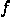，该函数接受这些二进制字符串并返回“true”（或和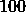索引。那么，将是这样一个布尔函数，当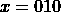或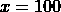时， = 1")，否则 = 0"）。为了简化符号，从现在起我们将用用于索引元素的字符串来标识元素。

重要的是要注意，在这种情况下，我们无法访问的内部工作原理。它就像一个黑盒。我们能做的唯一一件事就是调用函数并观察输出，从而检查给定的输入是否满足我们正在考虑的条件。由于我们没有关于满足条件的元素索引的任何信息，我们无法偏向任何位置。因此，在经典算法中，如果我们正在搜索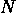个元素，并且只有一个元素满足我们感兴趣的特定条件，我们平均需要调用大约次才能找到它。元素可能就在任何地方！实际上，如果我们非常不幸，我们可能需要使用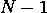次调用（请注意，我们不需要次调用：如果我们经过次不同的调用后还没有找到元素，我们已经知道剩余的位置就是元素所在的位置）。

因此，使用 Grover 算法，我们有可能通过大约次调用来以高概率找到隐藏的元素（关于这一点，本节后面将详细介绍）。这意味着如果我们正在搜索个元素，使用经典计算机平均需要检查大约次，但使用量子计算机，至少以高概率，调用少于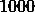次就足够解决问题了。更重要的是，当更高时，经典方法和量子方法之间的调用次数差异会更大。

这怎么可能呢？这似乎违反了所有逻辑，但它基于我们已经熟悉的属性，比如叠加和纠缠。事实上，Grover 算法将使用处于叠加状态的元素查询。但为了理解这一点，我们需要探索量子或门是什么以及它们如何被使用，那么让我们开始吧！

## 6.1.1 量子或门

我们提到，在 Grover 算法解决的搜索问题设置中，我们被给定一个布尔函数，我们可以用它来确定一个元素是否是我们正在寻找的。但当我们说“给定”这个函数时，我们是什么意思呢？

在经典情况下，这基本上是直截了当的。如果我们用 Python 编写代码，我们可能会得到一个接收位字符串并返回`True`或`False`的函数对象。然后，我们可以在自己的代码中使用这个函数来检查我们想要考虑的元素，而不必知道它是如何实现的。

但是……当我们与量子电路一起工作时，那个函数定义的等价物是什么？最自然的假设是我们被提供了一个新的量子门，它实现了，并且我们可以在需要时在我们的电路中使用它。然而，量子门需要是一个单位可逆操作，特别是可逆的，因此我们在设计它时需要稍微小心一些。

在经典情况下，我们拥有个输入——字符串的位——以及仅仅一个输出。在量子情况下，我们至少需要个输入——个量子比特——但仅仅一个输出是不够的，因为那样的话，操作将无法实现可逆性，更不用说单位可逆性了。实际上，正如你肯定记得的那样，每个量子门都有相同数量的输入和输出。

因此，通常的方法是考虑一个在个量子比特上的量子门。这其中的前个量子比特将作为输入，额外的那个将用于存储输出。更正式地说，对于任何输入，其中是一个位字符串，是一个单比特，门的输出将是} \right\rangle")，其中表示模 2 加法（参见*附录* * *B**，*基础线性代数*，以复习模算术）。这定义了该门在计算基态上的作用，然后我们可以通过线性扩展到其他量子态，就像通常那样。

*这看起来可能是一个奇怪的选择。最“自然”的事情可能是要求输出为} \right\rangle")，对吧？但这种情况在一般情况下是不可逆的，因为我们会在输入和上获得相同的输出。然而，根据我们的选择，操作是可逆的。如果我们对应用两次，我们会得到 \oplus f(x)} \right\rangle")，这等于，因为当我们执行模加法时， \oplus f(x) = 0")，无论")的值是多少。

练习 6.1

证明不仅可逆，而且是幺正的，因此它值得被称为“量子门”。

通常， 被称为  的量子 Oracle，因为我们可以在不担心其内部工作原理的情况下查询它，以获取任何输入  上  的值。实际上，如果  的输入是 ，那么输出是 } \right\rangle = \left| x \right\rangle\left| {f(x)} \right\rangle")，因此我们可以通过测量最后一个量子比特来恢复 ")。

对于任何 ，总可以通过仅使用 NOT 和多控制 NOT 门来构建 ，即使在这种情况下得到的电路在大多数情况下不是最有效的。例如，如果  是一个作用在 3 位字符串上的布尔函数，且  仅在 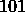 和 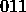 上取值 ，那么我们可以使用 *图* **6.1* 中所示的电路。注意我们是如何在多控制门前后使用 NOT 门来选择那些在输入中应为  的量子比特，并将它们恢复到原始值的。

* 的 Oracle，它在 101 和 011 上取值 ，在其余的 3 位字符串上取值 ](img/file804.jpg)

**图 6.1**: 布尔函数  的 Oracle，它在  和  上取值 ，在其余的 3 位字符串上取值 

练习 6.2

构建一个  电路，其中  是一个 4 位布尔函数，它在 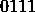、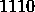 和 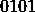 上取值 ，在其余输入上取值 。

这就解决了我们将如何接收布尔函数 ，我们可以用它来检查给定的元素是否满足我们感兴趣的条件：该函数将以量子 Oracle 的形式提供给我们。现在是我们展示如何使用这些量子 Oracle 在 Grover 算法中发挥作用的时候了。

## 6.1.2 Grover 电路

假设我们想要将 Grover 算法应用于接收长度为  的二进制字符串的布尔函数 。除了上一节中描述的  Oracle 之外，Grover 算法中使用的电路还涉及两个其他部分，如 *图* **6.2* 所示。

*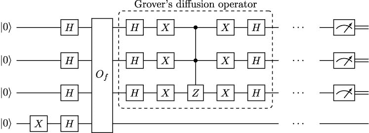

**图 6.2**：当接收长度为的字符串作为输入时，Grover 算法的电路。在最终测量之前，和 Grover 扩散算子按顺序重复多次

第一个块由作用于初始状态的单量子比特门组成，其中第一个寄存器的长度为，第二个寄存器的长度为。因此，在应用或然性算子之前的状态是

\cdots(\left| 0 \right\rangle + \left| 1 \right\rangle)} \right)\left| - \right\rangle = \frac{1}{\sqrt{2^{n}}}\sum\limits_{x = 0}^{2^{n} - 1}\left| x \right\rangle\left| - \right\rangle,")

因为我们将第一个门应用于以获得。

注意，这个状态的第一个寄存器是所有基态的叠加。这正是我们将使用我们的或然性算子来评估“叠加”中的”时所需要的东西。实际上，根据的定义，我们在应用或然性算子之后将得到的状态是

![\begin{matrix} {O_{f}\left( {\frac{1}{\sqrt{2^{n}}}\sum\limits_{x = 0}^{2^{n} - 1}\left| x \right\rangle\left| - \right\rangle} \right) = O_{f}\left( {\frac{1}{\sqrt{2^{n + 1}}}\sum\limits_{x = 0}^{2^{n} - 1}\left| x \right\rangle(\left| 0 \right\rangle - \left| 1 \right\rangle)} \right) =} & \\ {\frac{1}{\sqrt{2^{n + 1}}}\sum\limits_{x = 0}^{2^{n} - 1}O_{f}\left| x \right\rangle(\left| 0 \right\rangle - \left| 1 \right\rangle) = \frac{1}{\sqrt{2^{n + 1}}}\sum\limits_{x = 0}^{2^{n} - 1}\left| x \right\rangle(\left| {0 \oplus f(x)} \right\rangle - \left| {1 \oplus f(x)} \right\rangle),} & \\ \end{matrix}](img/right) = O_{f}\left( {\frac{1}{\sqrt{2^{n + 1}}}\sum\limits_{x = 0}^{2^{n} - 1}\left| x \right\rangle(\left| 0 \right\rangle - \left| 1 \right\rangle)} \right) =} & \\ {\frac{1}{\sqrt{2^{n + 1}}}\sum\limits_{x = 0}^{2^{n} - 1}O_{f}\left| x \right\rangle(\left| 0 \right\rangle - \left| 1 \right\rangle) = \frac{1}{\sqrt{2^{n + 1}}}\sum\limits_{x = 0}^{2^{n} - 1}\left| x \right\rangle(\left| {0 \oplus f(x)} \right\rangle - \left| {1 \oplus f(x)} \right\rangle),} & \\ \end{matrix}")

其中在最后两个等式中，他使用了线性性质以及  的定义。

让我们关注 } \right\rangle - \left| {1 \oplus f(x)} \right\rangle") 这一项。如果  = 0"), 那么它就是 . 然而，如果  = 1"), 我们有

} \right\rangle - \left| {1 \oplus f(x)} \right\rangle = \left| {0 \oplus 1} \right\rangle - \left| {1 \oplus 1} \right\rangle = \left| 1 \right\rangle - \left| 0 \right\rangle = - (\left| 0 \right\rangle - \left| 1 \right\rangle),")

因为 . 在这两种情况下，我们可以写成

} \right\rangle - \left| {1 \oplus f(x)} \right\rangle = {( - 1)}^{f(x)}(\left| 0 \right\rangle - \left| 1 \right\rangle),")

因为 }^{0} = 1") 和 }^{1} = - 1").

注意，由于这些变换，现在状态振幅中编码了关于值")的信息。正如你很快就会看到的，这是算法的关键组成部分。

如果我们将这个应用到我们的或然应用后的状态表达式中，我们得到

\[\begin{matrix} {O_{f}\left( {\frac{1}{\sqrt{2^{n}}}\sum\limits_{x = 0}^{2^{n} - 1}\left| x \right\rangle\left| - \right\rangle} \right) = \frac{1}{\sqrt{2^{n + 1}}}\sum\limits_{x = 0}^{2^{n} - 1}\left| x \right\rangle(\left| {0 \oplus f(x)} \right\rangle - \left| {1 \oplus f(x)} \right\rangle) =} \\ {\frac{1}{\sqrt{2^{n + 1}}}\sum\limits_{x = 0}^{2^{n} - 1}{( - 1)}^{f(x)}\left| x \right\rangle(\left| 0 \right\rangle - \left| 1 \right\rangle) = \frac{1}{\sqrt{2^{n}}}\sum\limits_{x = 0}^{2^{n} - 1}{( - 1)}^{f(x)}\left| x \right\rangle\frac{1}{\sqrt{2}}(\left| 0 \right\rangle - \left| 1 \right\rangle) =} \\ {\frac{1}{\sqrt{2^{n}}}\sum\limits_{x = 0}^{2^{n} - 1}{( - 1)}^{f(x)}\left| x \right\rangle\left| - \right\rangle.} & \\ \end{matrix}\]

注意到的应用如何在叠加态中的某些状态中引入了相对相。这种技术被称为**相位回弹**，因为我们只使用了状态的寄存器来创建相位，但它最终影响了整个状态。它被用于其他著名的量子方法，如 Deutsch-Jozsa 算法和 Simon 算法（参见 Yanofsky 和 Mannucci 的书籍[100]，其中对这些方法的解释非常出色）。

正如我们所证明的，与基态相关的相只依赖于")，如果 = 0")，则它是，如果 = 1")，则它是。这样，我们说我们已经**标记**了满足我们感兴趣条件的元素，即那些元素，使得 = 1")。值得注意的是，我们只通过一次调用就完成了这一点，利用了它在叠加中评估的可能性。这只是一个调用就进行了指数级数量的函数评估！这听起来像是魔法，不是吗？

然而，尽管在应用之后，我们 somehow 将满足 = 1")的元素与其他元素分离，但我们似乎并没有更接近找到其中之一。如果我们像现在这样测量状态，测量满足 = 1")的的概率与应用之前相同。我们引入的相的绝对值等于，因此不会影响测量概率。

但是，等等！Grover 算法还有更多内容。在应用之后，我们还有一个电路块要应用：它被称为**Grover 的扩散算子**，我们将用它来增加测量标记状态的概率。详细描述其内部工作原理可能会让我们偏离正轨——为此，我们建议您阅读 Robert Sutor 的《与量子比特共舞》[92]，其中提供了对其行为的完美解释——但至少让我们快速概述一下它所做的工作。

Grover 的扩散算子实现了一个称为**关于平均值的反转**的操作。这可能听起来很复杂，但实际上相当简单。首先，计算所有状态振幅的平均值。然后，将每个振幅替换为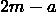。经过这种转换后，正振幅会稍微小一点，但负振幅会稍微大一点。这就是为什么 Grover 算法使用的技巧被称为**振幅放大**。再次建议您查阅 Sutor 的书籍[92]，以详细了解这种操作是如何工作的。

因此，在第一次应用 Grover 的扩散算子之后，我们感兴趣寻找的元素的振幅稍微大一些。但是，在一般情况下，这仍然不足以保证测量其中一个元素的高概率。因此，我们需要再次使用标记元素，然后再次应用扩散算子。我们将重复这个程序，首先应用然后是扩散算子，多次直到测量我们寻找的状态之一的高概率足够高（接近）。那就是我们可以测量整个状态并观察结果，希望获得一个满足条件的元素的时刻。

但是，我们应该应用多少次，然后跟随扩散算子？这是 Grover 算法中的一个关键点，我们将在下一小节中更详细地研究。

## 6.1.3 找到标记元素的概率

正如我们刚才看到的，在使用 Grover 算法时，我们反复应用给定的量子或然算子，然后是扩散算子。当然，我们希望重复的次数尽可能少——这样算法运行得更快——同时保证找到标记元素之一的高概率。我们该如何进行呢？

分析 Grover 算法行为的一个可能方法可以是研究我们在前一小节中提到的关于平均值的反转操作的性质。然而，有一个更好的方法。结果是，和 Grover 的扩散算子的组合在二维空间中就像一个旋转。我们不会给出全部细节——请查看 John Watrous 的讲义[95]以获得非常详尽和易读的解释——但是，如果我们有位字符串，并且只有一个标记元素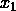，可以证明我们在应用和扩散算子次之后达到的状态是

\theta\left| x_{0} \right\rangle + \sin(2m + 1)\theta\left| x_{1} \right\rangle,")

其中


并且  \right.") 是这样的，使得


注意， 只是状态  的均匀叠加，使得  = 0")。那么，我们想要获得的状态是 \theta") 接近 ，因为这样在我们测量时会有很高的概率找到 。为此，理想情况下，我们希望有

\theta \approx \frac{\pi}{2},")

因为 。

解出 ，我们得到


更重要的是，我们知道 , 因此，对于足够大的 ，我们将有

![\theta \approx \sqrt{\frac{1}{2^{n}}}] (img/file831.png "\theta \approx \sqrt{\frac{1}{2^{n}}} ")

然后我们可以选择


即小于或等于 \sqrt{2^{n}} \right.") 的最大整数。

注意，恰好有  个元素，但其中只有一个满足我们感兴趣的条件。这意味着，使用经典算法，如果我们只能使用  来检查元素  是否是我们正在寻找的——即检查  = 1") ——那么我们平均需要大约  次调用  才能找到 。然而，使用 Grover 算法，我们只需要大约 。这是一个平方速度提升！

然而，这里有一个微妙之处。在经典设置中，如果我们多次使用 ，找到标记元素的几率会增加。但是，使用 Grover 算法，如果  没有被明智地选择，我们可能会超过目标，实际上降低成功几率而不是提高它！

这听起来令人困惑。我们如何通过搜索更多反而发现自己找到隐藏元素的可能性更小了呢？关键在于，正如我们所展示的，测量的概率是\theta)}^{2}"). 这个函数是周期性的，在和之间振荡，所以当达到接近的值后，它会回到。

让我们用一个例子来说明这一点。在*图* **6.3*中，我们考虑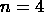的情况，并展示当我们改变 Grover 迭代的次数，从到时，找到恰好一个标记元素的概率是如何变化的。在这种情况下，\sqrt{2^{n}}\rfloor \right.")是，并且正如你所看到的，当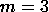时，成功概率接近。然而，对于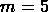，概率急剧下降，对于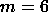，它几乎接近。

*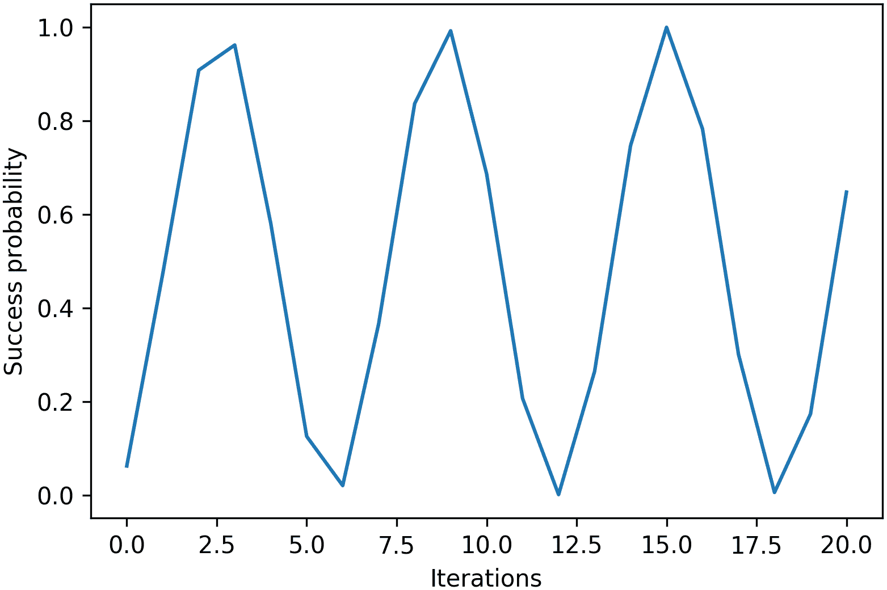*

**图 6.3**：使用 Grover 算法且迭代次数从到变化时，在 16 个元素中找到单个标记元素的概率

这表明在选择 Grover 算法中的迭代次数时，我们需要非常小心。对于只有一个标记元素的情况，我们已经为找到了一个不错的选择。但是，如果有多个标记元素呢？结果——请参阅 John Watrous 的讲义[95]——如果存在个标记元素，我们可以重复之前的推理，并表明一个合适的值是


在相对于较小的情况下。如果相对于不是较小，请不要担心；那么随机选择找到标记元素的概率是, 这将是相当大的，所以你甚至一开始就根本不需要量子计算机。

如果我们知道有多少标记元素，这就能解决我们的问题。但在最一般的情况下，我们可能缺乏这方面的信息。在这种情况下，我们可以应用 Boyer、Brassard、Høyer 和 Tapp 发表的一篇非常有用的论文的结果[20]。他们证明了通过在动态增加的范围内随机选择，我们仍然可以保证以高概率找到标记元素，同时保持平均迭代次数为")（有关渐近记号的复习，请参阅*附录* * *C**，计算复杂性）。*

*事实上，他们证明了使用他们的方法找到标记元素的概率至少是 。这看起来可能并不令人印象深刻，但我们很容易看出这已经足够多了。实际上，找不到标记元素的概率不会超过 。因此，假设我们重复这个过程  次。那么，失败的概率最多是  \right.^{1000}")，这非常低。实际上，一颗陨石在运行你的电路时撞击你的量子计算机的概率比这要大得多！*

到目前为止，在本节中，我们已经涵盖了应用 Grover 算法解决搜索问题所需的所有知识。然而，我们的主要目标是解决优化问题。我们将在下一小节中探讨这两个任务之间的联系。

## 6.1.4 使用 Grover 算法寻找最小值

优化问题显然与搜索问题相关。事实上，在解决优化问题时，我们试图找到一个具有特殊属性的值：它应该是所有可能值中的最小值或最大值。Dürr 和 Høyer 在 1996 年的一篇论文[33]中利用了这种联系，他们介绍了一种基于 Grover 搜索的量子算法，用于寻找函数的最小值。算法背后的主要思想相当简单。假设我们想要找到一个长度为的二进制字符串上的函数的最小值。我们随机选择这样一个字符串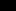并计算")。现在我们应用 Grover 算法，其中 oracles 在输入时，如果 < g(x_{0})")则返回，否则返回。如果我们测量应用 Grover 搜索后的元素，称之为，并且它确实达到了比")更低的值，我们就用它替换并重复这个过程，但现在使用检查条件 < g(x_{1})")的 oracles。如果不是，我们继续使用.我们重复这个过程几次，并返回我们考虑过的元素中值最低的元素。

在这里，我们需要详细说明几个细节。第一个是如何构建 oracles。当然，一般来说，这取决于函数。因此，在下一节中，我们将重点关注可以使用 Dürr-Høyer 算法解决 QUBO 和 HOBO 问题的电路。

另一方面，我们应该注意在每次应用 Grover 算法时使用的迭代次数，以及我们需要重复选择新元素和构建新 oracles 的次数。Dürr 和 Høyer 的原始论文提供了所有细节，但让我们只提一下，它使用了 Boyer、Brassard、Høyer 和 Tapp 提出的方法[20]，我们在前面的子节中已经解释过，并且它保证了至少以的概率找到最小值，所需的 oracles 调用次数为").

通过这种方式，我们现在已经涵盖了应用这种搜索方法解决 QUBO 和 HOBO 问题所需的所有概念。在下一节中，我们将解释如何为这类问题构建量子 oracles。

# 6.2 组合优化的量子或 acles

正如我们所看到的，Dürr-Høyer 算法可以用以以高概率找到函数的最小值，并且比暴力搜索有二次加速。然而，为了使用它，我们需要一个量子或然，该或然在给定二进制字符串和的情况下，检查 < g(y)")是否成立。

在我们的情况下，我们对可以出现在 QUBO 和 HOBO 问题中的函数感兴趣。这意味着将是一个具有实系数和二进制变量的多项式，我们可以通过直接的方法实现量子或然：设计一个使用 AND、OR 和 NOT 门的经典电路，然后使用我们在*第 1.5.2 节* [[ch008.xhtml#x1-370001.5.2]]中展示的 Toffoli 量子门来模拟经典门。

*然而，在 2021 年，Gilliam、Woerner 和 Gonciulea 在一篇题为*“Grover 自适应搜索用于约束多项式二进制**优化**”*的论文中介绍了一种改进的量子或然实现量子 QUBO 和 HOBO 问题的方法 [45]。

在本节中，我们将详细研究他们提出的技巧以及如何使用它们来实现我们的量子或然。我们将首先考虑多项式的所有系数都是整数的情况，然后我们将扩展我们的研究到系数为实数的最一般情况。但在我们到达那里之前，我们需要简要地谈谈量子计算中最重要的子程序之一：**量子傅里叶** **变换**。

## 6.2.1 量子傅里叶变换

量子傅里叶变换（通常简称为**QFT**）毫无疑问是量子计算中最有用的工具之一。它是 Shor 算法进行整数分解的必要部分 [87]，也是其他著名量子算法（如 HHL [49]）加速背后的原因。

我们将使用 QFT 来帮助我们实现所需的算术运算，以便计算 QUBO 和 HOBO 问题的多项式函数的值。例如，我们可以在基表示中实现这些运算。作为一个例子，我们可能会设计一个幺正变换，将变换为，其中和是二进制数，而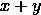是它们的和。然而，这可能会涉及到大量的单比特和双比特门。

相反，我们将使用 Gilliam、Woerner 和 Gonciulea 在[45]中提出的方法，并使用状态振幅来计算算术运算。我们将在下一小节中详细解释如何做到这一点。但在那之前，我们将研究如何使用 QFT 从量子状态振幅中恢复信息。

在个量子比特上的 QFT 定义为将基态变换为


其中是虚数单位。其作用通过线性扩展到其他状态。

我们将不会详细研究 QFT 的性质。为此，你可以参考 Robert Sutor 的《与量子比特共舞》[92]。然而，我们需要知道 QFT 可以用数量为的平方的单一和双量子比特门来实现。这比我们目前最好的类似经典操作（**离散傅里叶变换**）的算法要快指数级。

例如，三个量子比特上的 QFT 电路如图*6.4*所示。在这个电路中，最右侧的门作用于顶部和底部的量子比特，是 SWAP 门。正如我们在*第 1.4.3 节*中提到的，这个门交换两个量子比特的状态，可以通过 CNOT 门实现。此外，这个 QFT 电路使用了**相位门**，表示为")。这是一个依赖于角度的参数化门，其坐标矩阵为**

****

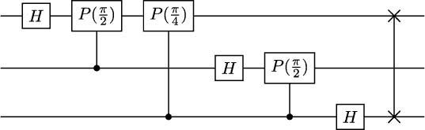

**图 6.4**：3 个量子比特上的量子傅里叶变换电路

重要提示

相位门与我们之前在*第 1.3.4 节*中介绍的门非常相似。事实上，当单独应用于一个量子比特时，")相当于")，直到一个不重要的全局相位。然而，在量子场论电路中，我们使用的是相位门的受控版本，全局相位变成了相对相位，这绝对不是不重要的！

*正如我们所见，当 QFT 应用到基态  上时，它会引入形式为  的相位。然而，为了我们计算的目的，我们更感兴趣的是从这些相位中恢复值 。为此，我们需要**逆量子傅里叶变换**，通常表示为 QFT。当然，它的作用是 QFT 的逆，这意味着它将一个状态转换为


到基态 。

逆 QFT 的电路可以通过读取 QFT 的电路反向并使用我们找到的每个门的逆来获得。例如，3 个量子比特的逆 QFT 电路如图 *图* **6.5* 所示。注意，") 的逆是 "), 而  和 SWAP 门是它们自己的逆。

*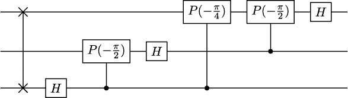

**图 6.5**：3 个量子比特的逆量子傅里叶变换电路

当设计一个量子或 acles 以最小化函数  时，我们的目标将以一种方式执行计算，使得 ") 值出现在我们状态的振幅的指数中，这样我们就可以通过逆 QFT 恢复它们。这可能听起来像是一项艰巨的任务，但正如我们将在以下小节中展示的，我们已经拥有了成功所需的所有工具。我们将首先展示如何以我们所需的方式编码整数值。

## 6.2.2 编码和加整数数

在本节中很快就会变得明显，在 GAS 或 acles 的上下文中处理整数数最方便的方式是使用它们的**二进制补码**表示。在这种表示中，我们可以使用位字符串来编码从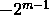到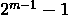的数字。正数以二进制数的常规方式表示，但一个负数由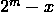表示。

例如，如果 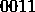 表示 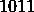 表示 （这是  和  并执行它们的加法。

正如我们在前一小节中提到的，当我们用一个或门计算 ") 时，我们感兴趣的是获得以下状态

k}{2^{m}}}\left| k \right\rangle")

以便我们随后可以应用逆量子傅里叶变换得到 } \right\rangle")。我们将逐步实现这一步骤。

注意到 ") 总是整数值的乘积之和。所以，我们首先处理整数加法，将乘法留到下一小节。

按照文献 [82] 中的符号，我们将称这个状态为


的**相位编码**。然后，为了我们的目的，我们只需要知道如何准备的相位编码，以及如何将给定的整数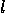添加到任何其他整数的相位编码中。这样，我们可以从开始，逐个添加的多项式表达式中的所有项。

准备的相位编码简直不能再简单了。我们只需要将我们用来表示整数值的每个量子位都应用 Hadamard 门。这样，我们将获得以下状态


这实际上就是的相位编码。

假设我们现在有一个相位编码的状态，并且我们想要向其中添加。我们首先假设是非负的，稍后我们将处理负数。要在相位编码中添加，我们只需应用*图* **6.6**中显示的门。*

*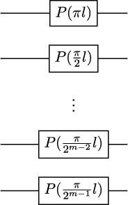

**图 6.6**：当拥有个量子位时，将添加到相位编码状态的电路

事实上，当我们将这些门应用于基态时，我们得到。为了证明这一点，只需注意，如果的第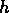个量子位是，那么*图* **6.6**中的电路会添加一个值为的相位（我们从开始计数量子位）并且没有相位否则。当我们对所有中值为的量子位求和时，我们得到。因此，通过线性，当我们将该电路应用于的相位编码时，我们得到*

*

2 ∑_{k = 0}^{2^m - 1} e^(2πi(j + l)k/2^m) |k⟩,")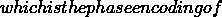

因此，这对于非负数来说工作得非常好。但是，对于负数呢？结果发现，如果是负数，我们还可以再次使用*图* **6.6*中的电路——无需进一步调整。关键观察是，对于任何整数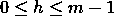，都成立*

*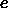

2^h = e^{}")

/2^h) = e^{}")

) = e^{}")

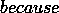m-h≥02^(m-h)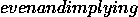e^(πi2^(m-h)) = 1.")

这意味着如果我们把或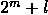插入*图* **6.6*的闸门中，我们将得到完全相同的电路。因此，我们可以使用的补码表示而不是，我们之前为非负整数证明的加法结果也将适用于负整数。唯一可能的问题是，当我们用补码加一个正数和一个负数时，我们可能会得到一个进位（例如，在之前的例子中，当我们把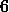和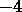相加时）。然而，在这种情况下，进位将给我们一个 2 的偶数次幂，并且，相应的相位将是，这将保持结果不变。实际上，我们是在执行模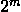的算术，所以我们很安全。注意，尽管如此，如果我们把两个正数或两个负数相加并且得到一个进位，那么我们将得到一个错误的结果——在这种情况下，模运算会反对我们！*

*重要提示

你始终需要使用足够多的量子位来表示可能从计算中出现的任何整数，使用二进制补码表示。如果你正在处理多项式"),你可以简单地将")中所有系数的绝对值相加以获得一个常数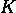。然后，你可以选择任何，使得。如果你想更加精确，你可以选择作为所有正系数之和与所有负系数绝对值之和的最大值。

例如，在*图* **6.7*中，我们展示了一个电路，它准备的相位表示，向其添加，然后添加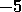（或者等价地，减去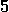）。请注意，一些门可以简化。例如，")只是")。我们还可以通过将角度相加将连续的门合并成单个门（例如，P(3/2) = P( - 2/2) = P(π)")).为了清晰起见，在本节中，我们将保持门的原有形式，不做任何简化。

*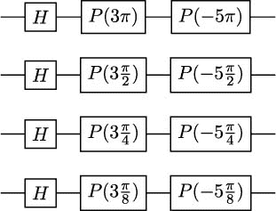

**图 6.7**：准备的相位表示、向其添加然后减去的电路

练习 6.4

推导一个电路，该电路准备的相位表示，向其添加然后减去。使用个量子位。

现在我们已经得到了计算")多项式所需的第一种成分：在相位编码中添加整数。在下一个小节中，我们将学习如何处理二进制变量的乘积。

## 6.2.3 计算整个多项式

你可能会觉得，执行我们需要的乘法要比执行加法困难得多。但并非如此！让我们来看看这一点。

我们所考虑的所有变量都是二进制的，这意味着当我们执行如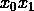这样的乘法时，我们总是得到或作为结果。因此，如果")例如是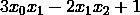，我们总是需要添加（因为它是不依赖项，正如其名称所暗示的，它不依赖于变量的值），但只有当和都是时，我们才需要添加，而且只有当和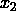都取值为时，我们才需要减去。

这听起来熟悉吗？嗯，应该是的，因为这些我们所描述的计算与受控操作的运用完全对应。因此，为了计算如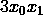这样的项的贡献，我们可以使用在前一小节中推导出的电路来在相位编码中添加，但每个门都由和共同控制。请注意，仅使用两个量子位作为控制并没有什么特殊之处，因此我们也可以考虑具有如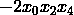或等项的多项式。

为了更好地阐明这些技术，在*图* **6.8**中，我们展示了一个计算的电路。第一个门的列准备的相位编码。第二个门添加多项式的独立项。下一个门添加，但只有当（这就是为什么所有门都由和量子位控制）时才添加。同样，最后一列减去，但只有当时才减去。

**

**图 6.8**：计算的相位编码电路

关于 *图* **6.8* 中的电路，有几个技术细节需要讨论。首先，我们采用了通常的惯例，将受相同量子位控制的单个量子位门设置在同一列中。实际上，我们可以将它们视为一个单一的多量子位门，但在某些量子计算机中，你可能需要将它们分开并按顺序应用（无论如何，这是编译器应该处理的事情，不用担心）。此外，请注意，这些门是多控制的，但——使用像 [69] 中第 4.3 节描述的技术——你可以将它们转换为一组和二量子位门的组合，这些组合又可以分解为仅一和二量子位门。

*练习 6.5

设计一个用于计算  的电路。使用多量子位和多控制门。

现在我们已经知道了如何在相位编码中计算具有整数系数的二进制变量的多项式值。但是，当系数是实数时怎么办呢？我们有两种处理这种情况的方法。第一种方法是通过使用相同分母的分数来近似它们。例如，如果你的系数是  和 ，你可以用  和  来表示它们。然后，你可以将整个多项式乘以 ，而不改变达到最小值时的变量值，并使用  和 ，它们是整数。另一种选择是在编码中直接使用实数。例如，在 *图* **6.6* 的电路中，即使它不是整数，你也会使用 。在这种情况下，你将使用实系数近似值的叠加，更好的近似值具有更大的幅度（有关所有细节，请参见 [45] 的讨论）。

*这完成了我们在相位编码中计算任何二进制变量上多项式值的方法的讨论。然而，我们还没有完全完成！在下一小节中，我们将利用我们新获得的知识来最终实现 GAS 算法所需的预言机。

## 6.2.4 构建预言机

到目前为止，在本节中我们已经覆盖了很多内容。然而，我们不应忘记我们的最终目标：我们想要实现一个预言机，给定  和 ，返回  < g(y)") 是否成立。这是为了使用 **Dürr-Høyer** 算法找到  的最小值所必需的。在前一小节中，我们展示了如何构建一个电路，给定 ，在相位编码中计算 ")。为了简化起见，在本小节中我们将使用的电路中，我们将实现 ") 的门序列（不包括  门的初始列）用一个带有 ") 的大方框表示。以类似的方式，当我们需要使用 QFT 或其逆时，我们将使用一个标有 QFT 或 QFT 的方框。

使用这种表示法，可以通过使用图 **6.9* 中所示的电路来实现一个确定  < g(y)") 的预言机。

*

**图 6.9**：确定  < g(y)") 的预言机

让我们逐个解释电路的元素。首先，注意上方的量子位被保留用于输入  和 ，因此它们是每个  量子位的寄存器。接下来，我们有  个辅助量子位，我们将使用它们来计算多项式的值（如我们之前提到的，你需要选择  以确保它足够大，可以存储所有中间结果）。最后，底部的量子位将存储检查  < g(y)") 的结果。

从本节所学内容以及假设中的所有系数都是整数出发，我们知道在 CNOT 门之前的量子态是 - g(y)} \right\rangle\left| 0 \right\rangle")。现在，如果 < g(y)"), 则 - g(y) < 0")，并且 - g(y)")的最高有效位将是，因为我们使用的是二进制补码表示。因此，当我们应用 CNOT 门时，如果 < g(y)"), 我们将底层量子比特设置为，否则我们将其保持在状态。这就是我们将表示为的值。

很自然地，我们可能会认为在应用 CNOT 门后就可以结束电路。毕竟，我们已经计算出了所需的结果：如果 < g(y)"), 则将是，否则将是。然而，我们需要将辅助量子比特设置回。这是后续应用或 acle（记住我们正在使用 Grover 算法，因此或 acle 电路将会有多次重复）所期望的值。更重要的是，我们还需要将这些量子比特设置回，以使它们与电路中的其他量子比特解耦。如果它们保持纠缠，可能会阻止电路的其他部分正常工作。

将量子位设置回的过程被称为**逆计算**，这是许多量子算法中的一个非常重要的技术。由于所有量子门都是可逆的，我们不能简单地“擦除”某些量子位的内容（这将是非常不可逆的，因为我们将会忘记原始值，并且无法恢复它们）。我们需要执行我们进行的相同计算，但方向相反：因此得名“逆计算”。在我们的情况下，我们使用 QFT 回到相位编码，然后我们添加 - g(x)"),这当然是添加 - g(y)")的逆。因此，在 - g(x)")门之后，辅助量子位包含的相位编码，当我们应用门列时，我们得到所需的。

我们最终完成了为 GAS 所需的预言机构建。然而，在实践中可能还有一些额外的细节可能是有用的。一方面，请注意，在 GAS 中应用 Grover 算法的每一次中，的值是固定的（它是,那时我们找到的最佳解）。因此，我们可以通过消除为保留的量子位，用经典计算机计算")，并在计算多项式值的门中使用 - g(x_{0})")和 - g(x)")来简化*图* * *6.9**中的预言机设计。

*另一方面，使用本节中我们研究过的类似技术，我们可以创建预言机来检查多项式约束是否满足。例如，如果我们的问题中的一个约束是，我们可以轻松地调整我们的预言机构建来检查该条件是否满足。因此，我们并不总是需要将我们的优化问题转换为纯 QUBO 形式，但我们可以保留（一些）约束并直接检查它们。在某些情况下，这可能比处理惩罚项更方便。

但现在就理论上的考虑已经足够了。在下一节中，我们将解释如何在 Qiskit 中使用 GAS 来解决组合优化问题。

# 6.3 使用 Qiskit 的 GAS

如果你想要练习本章关于 Grover 搜索、Dürr-Høyer 算法和构造或 acles 所学的知识，你可以尝试从头开始实现你自己的 GAS 版本在 Qiskit 中。这不是一个困难的项目，而且可以非常令人满意。然而，没有必要这么做。在 Qiskit 优化模块中，你可以找到一个现成的 Grover 自适应搜索（我们将使用**版本 0.4.0**的包）实现。让我们看看如何使用它。

与 Qiskit 的 GAS 实现一起工作的一个额外优点是，它接受我们与 QAOA 在**第 5.2.2 节**（*5.2.2*）中使用的优化问题格式。使用它的最简单方法是通过定义一个 QUBO 问题，就像我们以下代码块可以创建的那样：

*```py

from qiskit_optimization.problems import QuadraticProgram 

qp = QuadraticProgram() 

qp.binary_var(’x’) 

qp.binary_var(’y’) 

qp.minimize(linear = {’x’:2,’y’:2}, quadratic = {(’x’,’y’):-3}) 

print(qp.export_as_lp_string())

```

执行的输出如下：

```py

\ This file has been generated by DOcplex 

\ ENCODING=ISO-8859-1 

\Problem name: CPLEX 

Minimize 

 obj: 2 x + 2 y + [ - 6 x*y ]/2 

Subject To 

Bounds 

 0 <= x <= 1 

 0 <= y <= 1 

Binaries 

 x y 

End

```

如你所知，这是我们最近几章中广泛研究的问题类型。要在 Qiskit 中使用 GAS 解决它，我们需要定义一个`GroverOptimizer`对象，如下所示：

```py

from qiskit_optimization.algorithms import GroverOptimizer 

from qiskit import Aer 

from qiskit.utils import algorithm_globals, QuantumInstance 

seed = 1234 

algorithm_globals.random_seed = seed 

quantum_instance = QuantumInstance(Aer.get_backend("aer_simulator"), 

    shots = 1024, seed_simulator = seed, seed_transpiler=seed) 

grover_optimizer = GroverOptimizer(num_value_qubits = 3, num_iterations=2, 

    quantum_instance=quantum_instance)

```

注意，我们已设置种子值以确保可重复性，并基于 Aer 模拟器创建了一个量子实例。当然，如果你想使用真实的量子计算机，你只需从我们之前章节中看到的一个量子设备创建量子实例即可。然后，我们定义了一个`GroverOptimizer`对象，它使用个量子位来表示多项式的值（我们在上一节中用表示），并在个连续迭代中没有看到改进时停止执行（`num_iterations`参数）。请注意，个量子位足以表示我们多项式的所有可能值，但个量子位就太少了。

要使用这个`GroverOptimizer`对象来解决问题，我们可以运行以下指令：

```py

results = grover_optimizer.solve(qp) 

print(results)

```

这将给出以下输出：

```py

fval=0.0, x=0.0, y=0.0, status=SUCCESS

```

这确实是问题的最优解，你可以通过尝试个可能选项来验证。这很简单，不是吗？

练习 6.6

编写使用 GAS 在 Qiskit 中找到具有二元变量、和以及目标函数的 QUBO 问题解的代码。

但如果你想要解决一个更复杂的问题呢？实际上，Grover 优化器类也可以与有约束的问题一起工作。想象一下，我们用以下指令定义了一个问题：

```py

qp = QuadraticProgram() 

qp.binary_var(’x’) 

qp.binary_var(’y’) 

qp.binary_var(’z’) 

qp.minimize(linear = {’x’:2}, quadratic = {(’x’,’z’):1, (’z’,’y’):-2}) 

qp.linear_constraint(linear = {’x’:2, ’y’:-1, ’z’:1}, 

    sense ="<=", rhs = 2) 

print(qp.export_as_lp_string())

```

如果我们执行代码，我们将得到以下输出，它对应于一个具有线性约束的二次规划问题：

```py

\ This file has been generated by DOcplex 

\ ENCODING=ISO-8859-1 

\Problem name: CPLEX 

Minimize 

 obj: 2 x + [ 2 x*z - 4 y*z ]/2 

Subject To 

 c0: 2 x - y + z <= 2 

Bounds 

 0 <= x <= 1 

 0 <= y <= 1 

 0 <= z <= 1 

Binaries 

 x y z 

End

```

我们可以创建一个`GroverOptimizer`对象，并直接使用其`solve`方法与`qp`一起使用。然后，`GroverOptimizer`对象将约束问题转换为 QUBO 问题并解决它。简单易行。然而，有一个小问题：我们如何知道应该使用多少量子比特来存储多项式值？由于我们不知道转换中引入的惩罚项，我们不知道多项式的系数。当然，我们可以使用足够大的值以确保没有问题，但这会使执行速度变慢，尤其是在模拟器中。如果我们使用过多的量子比特，我们的结果可能会出错。

因此，我们建议首先将问题转换为 QUBO 形式，然后使用 GAS 来解决它。这样，我们可以更准确地确定所需的量子比特数量。例如，对于我们刚刚定义的问题，我们可以使用以下指令获得转换后的 QUBO 问题：

```py

from qiskit_optimization.converters import QuadraticProgramToQubo 

qp_to_qubo = QuadraticProgramToQubo() 

qubo = qp_to_qubo.convert(qp) 

print(qubo.export_as_lp_string())

```

输出如下：

```py

\ This file has been generated by DOcplex 

\ ENCODING=ISO-8859-1 

\Problem name: CPLEX 

Minimize 

 obj: - 46 x + 24 y - 24 z - 24 c0@int_slack@0 - 48 c0@int_slack@1 + [ 48 x² 

      - 48 x*y + 50 x*z + 48 x*c0@int_slack@0 + 96 x*c0@int_slack@1 + 12 y² 

      - 28 y*z - 24 y*c0@int_slack@0 - 48 y*c0@int_slack@1 + 12 z² 

      + 24 z*c0@int_slack@0 + 48 z*c0@int_slack@1 + 12 c0@int_slack@0² 

      + 48 c0@int_slack@0*c0@int_slack@1 + 48 c0@int_slack@1² ]/2 + 24 

Subject To 

Bounds 

 0 <= x <= 1 

 0 <= y <= 1 

 0 <= z <= 1 

 0 <= c0@int_slack@0 <= 1 

 0 <= c0@int_slack@1 <= 1 

Binaries 

 x y z c0@int_slack@0 c0@int_slack@1 

End

```

如你所见，这现在是一个真正的 QUBO 问题。此外，通过检查多项式系数，我们可以注意到，例如，量子比特就足够存储多项式值。因此，我们可以使用以下代码片段来解决问题：

```py

grover_optimizer = GroverOptimizer(10, 

    num_iterations=4, quantum_instance=quantum_instance) 

results = grover_optimizer.solve(qubo) 

print(results)

```

如果我们运行它，我们会得到以下结果，这确实是问题的解决方案：

```py

fval=-2.0, x=0.0, y=1.0, z=1.0, c0@int_slack@0=0.0, c0@int_slack@1=1.0, 

status=SUCCESS

```

然而，这涉及到转换中使用的松弛变量。如果你不想看到它们，现在我们知道应该使用多少量子比特，你可以选择在原始问题上运行 GAS：

```py

grover_optimizer = GroverOptimizer(10, num_iterations=4, 

    quantum_instance=quantum_instance) 

results = grover_optimizer.solve(qp) 

print(results)

```

在这种情况下，输出如下：

```py

fval=-2.0, x=0.0, y=1.0, z=1.0, status=SUCCESS

```

这正是我们通过转换问题所得到的结果，但现在没有松弛变量。

如果你想在 Qiskit 中使用 GAS，这些都是你需要知道的内容。在下一章中，我们将研究**变分量子本征求解器**，它是 QAOA 的推广，将使我们能够解决许多有趣的优化问题。

# 摘要

在本章中，我们学习了 Grover 搜索算法以及如何通过 Dürr-Høyer 算法将其应用于寻找函数的最小值。我们还学习了量子或然性及其在这两种方法中的作用。

之后，我们学习了如何在相位编码中执行算术运算，以及如何通过强大的量子傅里叶变换来检索结果。我们还研究了如何使用所有这些技术来实现可用于 Grover 自适应搜索以解决组合优化问题的或然性。

最后，我们还学习了如何使用 Qiskit 中的 GAS 来获得 QUBO 问题和约束二次规划问题的解决方案。

现在，准备好进入下一章：我们将研究变分量子本征求解器及其一些最重要的应用！*********************
