# 第七章

VQE：变分量子本征求解器

*从如此简单的一个起点，无数最美丽、最* *奇妙的形式已经被，并且正在被，进化出来。*

— 查尔斯·达尔文

在本书本部分的之前章节中，我们研究了量子算法如何帮助我们解决组合优化问题，但那里还有许多其他重要的优化问题类型！本章将扩大我们的优化方法范围，涵盖更一般的设置，包括在化学和物理等领域中的应用。

我们将通过研究著名的**变分量子本征求解器**（**VQE**）算法来实现这一点，该算法可以看作是我们之前在*第* **5*，*QAOA：量子近似优化算法*中研究的量子近似优化算法的推广。实际上，更准确的说法是我们可以将 QAOA 看作是 VQE 的一个特例；事实上，VQE 是在 Peruzzo 等人的一篇现在著名的论文中比 QAOA 更早被引入的 [76]。

*我们将从扩展我们对哈密顿量的知识开始，并通过更好地理解如何使用量子计算机估计它们的期望值。这将使我们能够全面地定义 VQE，并欣赏其公式的简洁性和其在寻找不同类型哈密顿量基态方面的广泛应用。*

然后，我们将通过化学领域的示例展示如何使用 Qiskit 和 PennyLane 进行 VQE，并展示如何通过运行有噪声量子计算机的模拟来研究误差对算法的影响，我们甚至将讨论一些减轻读出误差不利影响的技巧。

在阅读本章后，你将了解 VQE 的理论基础以及如何在各种实际情况下使用它，无论是在模拟器上还是在实际的量子计算机上。

本章我们将涵盖以下主题：

+   哈密顿量、可观测量及其期望值

+   介绍变分量子本征求解器

+   使用 Qiskit 进行 VQE

+   使用 PennyLane 进行 VQE

我们有很多东西要学习，实际上，有无数最美丽的形式等待我们去发现。所以，让我们不要浪费时间，立即开始吧！

# 7.1 哈密顿量、可观测量及其期望值

到目前为止，我们在哈密顿量中找到了一种编码组合优化问题的方法。正如你肯定记得的，在这些优化问题中，我们从一个函数开始，该函数将实数分配给特定长度的二进制字符串，我们寻求找到一个成本最小的二进制字符串，即")。为了使用量子算法做到这一点，我们定义一个哈密顿量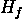，使得

")

对于长度为的每一个二进制字符串都成立。然后，我们可以通过找到的基态（即一个状态，使得期望值最小）来解决我们的原始问题。

这只是对*第* **3*，*处理二次无约束二进制优化问题*的简要概述。当你阅读这一章时，你可能已经注意到与相关的哈密顿量具有一个额外、非常显著的性质。我们已经提到过几次，但值得记住的是，对于每一个计算基态，都成立：

*\left| x \right\rangle.")

这意味着每个是的一个特征向量，其对应的特征值为")（如果你不记得特征向量和特征值是什么，请查看*附录* * *B*，*安装工具*，以获取所有相关定义和概念）。事实上，这很容易看出，因为我们始终使用的是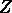矩阵的张量积之和的哈密顿量，这些矩阵显然是对角的。但是对角矩阵的张量积本身也是对角矩阵，对角矩阵的和仍然是对角矩阵。因此，由于这些哈密顿量是对角的，计算基态就是它们的特征向量。*

*更重要的是，如果我们有一个状态，我们总能将其写成计算基态的线性组合。事实上，成立：


其中求和是对所有计算基态和进行的。这很容易验证，因为


最后这个恒等式是由以下事实得出的：如果 ，则  等于 ，否则等于 （记住计算基是一个正交归一基）。

然后，在状态  中  的期望值可以计算如下

![\begin{array}{rlr} {\left\langle \psi \right|H_{f}\left| \psi \right\rangle = \sum\limits_{y}\alpha_{y}^{\ast}\left\langle y \right|H_{f}\sum\limits_{x}\alpha_{x}\left| x \right\rangle = \sum\limits_{x,y}\alpha_{y}^{\ast}\alpha_{x}\left\langle y \right|H_{f}\left| x \right\rangle = \sum\limits_{x,y}\alpha_{y}^{\ast}\alpha_{x}f(x)\left\langle y \middle| x \right\rangle} & \qquad & \\ {= \sum\limits_{x}\alpha_{x}^{\ast}\alpha_{x}f(x) = \sum\limits_{x}\left| \alpha_{x} \right|^{2}f(x).} & \qquad & \\ \end{array}](img/alpha_{x}f(x)\left\langle y \middle| x \right\rangle} & \qquad & \\ {= \sum\limits_{x}\alpha_{x}^{\ast}\alpha_{x}f(x) = \sum\limits_{x}\left| \alpha_{x} \right|^{2}f(x).} & \qquad & \\ \end{array}")

此外，我们知道  是在计算基下测量  时获得  的概率；这样，期望值就与测量的统计期望值相匹配。正如你肯定记得的，这正是我们在 *第* *5* *章* **5*，*量子近似优化算法* *QAOA* 中使用的事实，用来估计在量子计算机上运行 QAOA 电路时成本函数的值。

*这些性质可能看起来依赖于我们所使用的哈密顿量的特定形式。但实际上，它们是非常普遍的结果，我们将在研究 VQE 算法时广泛使用它们。但在我们到达那里之前，我们需要引入“可观测量”的一般概念，这正是下一小节的主题。

## 7.1.1 可观测量

到目前为止，我们只考虑了计算基中的测量。这对于我们的目的来说已经足够好了，但在这样做的时候，我们忽略了一些关于量子力学中测量真正理解和描述的细节。我们现在将填补这个空白。

我们鼓励你慢慢地阅读这一节。花些时间，也许为自己准备一杯你最喜欢的热饮。这里提出的思想一开始可能看起来有点奇怪，但很快你就会意识到它们与我们迄今为止所做的工作非常契合。

在量子力学中，你可以测量的任何物理量——也称为 **(物理)可观测量**——都由一个厄米算子表示。如果你不记得，这些是等于其伴随算子（它们的共轭转置）的线性算子 ，即它们满足 。

要了解更多…

你可能还记得在 *第* **3*，*处理二次无约束二进制优化问题* 中，我们广泛地使用了哈密顿量。一般来说，这些是与其可观测量大小相关的厄米算子。这个大小正是系统的能量！*

*厄米算子的好处是，对于它们，总能找到一个具有实特征值的正交归一基的特征向量（如果你需要复习这些概念，请查看 *附录* **B*，*基础线性代数*）。这意味着存在实数 , ，所有这些都不同，以及状态 ，其中  和 ，使得状态  形成一个正交归一基，并且*

*

对于每一个  和每一个 .

在这里，我们考虑了存在几个与同一特征值相关的特征向量的可能性，因此使用了超下标, 其中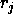是与特征值相关的特征向量的数量。如果所有特征值都不同（这是一个相当常见的情况），那么对于每个，我们将有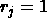，我们可以简单地省略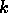超下标。

这些厄米算子与物理测量有什么联系？让我们考虑一个由厄米算子表示的可观测量，以及一个正交归一的特征向量基，使得。这种表示必须考虑到以下因素：

+   可观测量的测量可能结果必须由不同的特征值表示

+   状态在测量时得到的概率必须是

所有这些都是公理。任何物理可观测量都可以通过一个厄米算子来表示，这样就能满足这些要求。此外，量子力学的公设是，如果测量返回与特征值相关的结果，那么系统的状态将变为在特征值为的特征向量空间上的归一化投影。这意味着如果我们对一个叠加态进行测量，例如


如果我们得到作为结果，那么新的状态将是


这就是我们所说的原始状态的“坍缩”，这正是我们在*第* **1*，*量子计算基础*中研究计算基测量时所考虑的现象。

“可观测量”一词常用于指物理可观测量和表示它们的任何厄米算符。因此，我们可以将厄米算符本身称为可观测量。为了避免混淆，我们通常在提到物理可观测量时不会省略“物理”这个形容词。

作为简单示例，每当我们在计算基下进行测量时，我们实际上是在测量某些物理可观测量，而这个物理可观测量当然可以用一个厄米算符来表示。这在某种意义上是量子计算中最简单的可观测量，它自然地作为这种更一般量子测量理论的特例出现。

这个测量算符相对于计算基的坐标矩阵可能是对角矩阵

|  |
| --- |

练习 7.1

证明，确实，前面的矩阵是表示计算基测量的厄米算符的坐标矩阵。

当我们在计算基下测量单个量子比特时，与该相关厄米算符的计算基坐标矩阵可能是以下之一

|  |
| --- |

是的，最后一个矩阵是无可置疑的泡利矩阵。这两个算符代表相同的可观测量；它们只是在它们关联到不同可能结果的特征值上有所不同。第一个算符将特征值和分别关联到量子比特的值为和，而第二个可观测量将特征值和关联到这些结果。

重要提示

量子力学中的测量由厄米算符表示，我们称之为可观测量。一个对应于在计算基下测量量子比特的可能算符可以是泡利矩阵。

现在我们已经知道了可观测量是什么，我们可以研究它的**期望值**以及如何计算。在状态下的任何可观测量期望值可以定义为

|  |
| --- |

这是一个自然的定义，与我们根据测量所得到的结果的统计期望值相一致。尽管这个表达式可能看起来很直观，我们还可以进一步简化如下：


注意到我们使用了和这两个事实。后一个恒等式来源于是一个正交归一基的事实，实际上，它可以用与我们在本节开头处理计算基相同的方式证明。

这个期望值的表达式与我们之前在*第三章**3*，*处理二次无约束二进制优化* *问题*中做的工作一致。

*重要提示

任何厄米算子（可观察量）的期望值由以下表达式给出

|  |
| --- |

注意到，从可观察量的期望值的定义出发，我们可以很容易地推导出变分原理。这个原理指出，正如你可能从*第三章**3*，*处理二次无约束二进制优化问题*中回忆的那样，可观察量的最小期望值总是出现在该可观察量的特征向量上。为了证明这一点，假设是的所有特征值中最小的。那么，对于任何状态，都成立：

*|  |

其中最后一个等式来源于以下事实：，因为所有可能结果的概率之和必须等于。

如果我们现在取与相关的任意特征向量，其期望值将是


证明最小期望值确实是在的特征向量处实现的。显然，如果有几个与相关的正交特征向量，它们的任何归一化线性组合也将是的基态。

在本小节中，我们研究了任何可观察量的期望值的数学表达式。但我们还不知道如何用量子计算机来估计这些期望值。我们该如何做呢？只需继续阅读，因为下一小节我们将探讨这个问题。

## 7.1.2 估计可观察量的期望值

在 VQE 算法的背景下，我们需要估计一个通用可观察量的期望值。也就是说，我们不再假设是对角的，正如我们在所有前面的章节中所做的那样。因此，我们需要开发一种新的方法来估计期望值。

我们知道，对于给定的状态，的期望值可以通过以下方式计算：


因此，如果我们知道了的特征值和特征向量，我们就可以尝试计算以及的期望值。然而，这种信息我们通常并不知道。事实上，VQE 的目的正是精确地找到哈密顿量的某些特征值和特征向量！此外，特征向量的数量会随着我们系统中的量子比特数量的指数增长，因此，即使我们知道它们，以这种方式计算期望值可能非常计算量大。

因此，我们需要采取间接的方法。为此，我们将利用这样一个事实：我们总是可以将在个量子比特上的表示为一个张量积的线性组合（例如，参见 John Preskill 著名讲义中的*第七章* [77]）。实际上，在大多数情况下将以这种形式给出，就像我们的组合优化问题的哈密顿量总是表示为矩阵的张量积之和一样。

例如，假设我们给定一个可观测量


注意，由于线性关系，

![\begin{array}{rlrl} {\left\langle \psi \right|A\left| \psi \right\rangle} & {= \left\langle \psi \right|\left( {\frac{1}{2}Z \otimes I \otimes X - 3I \otimes Y \otimes Y + 2Z \otimes X \otimes Z} \right)\left| \psi \right\rangle\qquad} & & \qquad \\ & {= \left\langle \psi \right|\left( {\frac{1}{2}\left( {Z \otimes I \otimes X} \right)\left| \psi \right\rangle - 3\left( {I \otimes Y \otimes Y} \right)\left| \psi \right\rangle + 2\left( {Z \otimes X \otimes Z} \right)\left| \psi \right\rangle} \right)\qquad} & & \qquad \\ & {= \frac{1}{2}\left\langle \psi \right|\left( {Z \otimes I \otimes X} \right)\left| \psi \right\rangle - 3\left\langle \psi \right|\left( {I \otimes Y \otimes Y} \right)\left| \psi \right\rangle + 2\left\langle \psi \right|\left( {Z \otimes X \otimes Z} \right)\left| \psi \right\rangle.\qquad} & & \qquad \\ \end{array}](img/right)\left| \psi \right\rangle\qquad} & & \qquad \\  & {= \left\langle \psi \right|\left( {\frac{1}{2}\left( {Z \otimes I \otimes X} \right)\left| \psi \right\rangle - 3\left( {I \otimes Y \otimes Y} \right)\left| \psi \right\rangle + 2\left( {Z \otimes X \otimes Z} \right)\left| \psi \right\rangle} \right)\qquad} & & \qquad \\  & {= \frac{1}{2}\left\langle \psi \right|\left( {Z \otimes I \otimes X} \right)\left| \psi \right\rangle - 3\left\langle \psi \right|\left( {I \otimes Y \otimes Y} \right)\left| \psi \right\rangle + 2\left\langle \psi \right|\left( {Z \otimes X \otimes Z} \right)\left| \psi \right\rangle.\qquad} & & \qquad \\ \end{array}")

然后，为了计算的期望值，我们可以计算、和的期望值，并将它们的结果结合起来。但是等等！这难道不是更复杂了吗？毕竟，我们需要计算三个期望值而不是一个，对吧？

关键观察在于，虽然我们可能事先不知道的特征值和特征向量，但我们很容易获得或任何其他泡利矩阵的张量积的特征值。实际上，这非常简单，你将在接下来的两个练习中学习如何自己完成它。

练习 7.2

假设是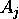的一个特征向量，其对应的特征值为，对于。证明是的一个特征向量，其对应的特征值为.

练习 7.3

证明：

1.  的特征向量是（其对应的特征值为）和（其对应的特征值为）。

1.  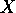的特征向量是（其对应的特征值为）和（其对应的特征值为）。

1.  的特征向量是\left( {\left| 0 \right\rangle + i\left| 1 \right\rangle} \right)")（其对应的特征值为）和\left( {\left| 0 \right\rangle - i\left| 1 \right\rangle} \right)")（其对应的特征值为）。

1.  任何非零态都是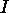的特征向量，其对应的特征值为.

利用这些练习中的结果，我们可以很容易地推导出 , ,  和  是  的特征向量，其特征值为 ，以及 , ,  和  是  的特征向量，其特征值为 。所有这些状态共同构成了  的特征向量正交基，如果你计算它们的内积，可以很容易地验证这一点。

练习 7.4

找到  和  的特征向量正交基。计算它们相关的特征值。

因此，我们现在知道了如何获得任意泡利矩阵张量的特征值和特征向量。我们如何利用这一点来估计它们的期望值呢？记住，给定一个厄米矩阵 ，我们可以通过以下方式计算 ：


其中 \(A\) 的特征值为 \(\lambda_{j}\)(img/file183.png "A") 和相应的特征向量为 \(\{\left| \lambda_{j}^{k} \right\rangle\}_{j,k}\)(img/file949.png "\{\left| \lambda_{j}^{k} \right\rangle\}_{j,k}\")。在我们的情况下，我们只有两个特征值：\(1\)(img/file13.png "1") 和 \(-1\)(img/file312.png "- 1")。因此，如果我们能够估计值 \(\left\langle \lambda_{j}^{k} \middle| \psi \right\rangle \right|^{2})，我们将拥有“烹饪”期望值所需的所有成分。

从量子计算机中获取值 \(\left\langle \lambda_{j}^{k} \middle| \psi \right\rangle \right|^{2}) 的过程在先验上可能看起来是一项艰巨的任务。例如，你可能想知道是否需要在我们的量子设备上执行一些奇怪的测量来获取这些概率！然而，实际上，我们可以在任何量子计算机上通过在计算基上使用普通测量和一系列量子门轻松地估计它们。所以，不用担心。如果你刚刚购买了一台炫目的量子计算机，目前还不需要硬件升级。

在任何情况下，我们如何使用我们拥有的工具实际估计这些 \(\left\langle \lambda_{j}^{k} \middle| \psi \right\rangle \right|^{2}) 值呢？让我们先从一个例子开始。

让我们考虑可观测量 \(Z \otimes X \otimes Z\)(img/file977.png "Z \otimes X \otimes Z")。我们在这个部分之前已经得到了它的特征向量，所以让我们关注其中一个：\(\left| 0 \right\rangle\left| + \right\rangle\left| 0 \right\rangle\)(img/file986.png "\(\left| 0 \right\rangle\left| + \right\rangle\left| 0 \right\rangle\")).如果我们想要计算 \(\left| {\left( {\left\langle 0 \right|\left\langle + \right|\left\langle 0 \right|} \right)\left| \psi \right\rangle} \right|^{2}\)(img/file995.png "\(\left| {\left( {\left\langle 0 \right|\left\langle + \right|\left\langle 0 \right|} \right)\left| \psi \right\rangle} \right|^{2}"), 其中 \(\left| \psi \right\rangle\)(img/file43.png "\(\left| \psi \right\rangle\)) 是一个特定的 3 量子比特态，我们只需注意到

\left| 0 \right\rangle\left| 0 \right\rangle\left| 0 \right\rangle"))

因此

![\begin{array}{rlrl} {\left\langle 0 \right|\left\langle + \right|\left\langle 0 \right|} & {= \left( {\left| 0 \right\rangle\left| + \right\rangle\left| 0 \right\rangle} \right)^{\dagger} = \left( {\left( {I \otimes H \otimes I} \right)\left| 0 \right\rangle\left| 0 \right\rangle\left| 0 \right\rangle} \right)^{\dagger} = \left\langle 0 \right|\left\langle 0 \right|\left\langle 0 \right|\left( {I \otimes H \otimes I} \right)^{\dagger}\qquad} & & \qquad \\ & {= \left\langle 0 \right|\left\langle 0 \right|\left\langle 0 \right|\left( {I \otimes H \otimes I} \right),\qquad} & & \qquad \\ \end{array}](img/right)^{\dagger} = \left( {\left( {I \otimes H \otimes I} \right)\left| 0 \right\rangle\left| 0 \right\rangle\left| 0 \right\rangle} \right)^{\dagger} = \left\langle 0 \right|\left\langle 0 \right|\left\langle 0 \right|\left( {I \otimes H \otimes I} \right)^{\dagger}\qquad} & & \qquad \\  & {= \left\langle 0 \right|\left\langle 0 \right|\left\langle 0 \right|\left( {I \otimes H \otimes I} \right),\qquad} & & \qquad \\ \end{array}")

其中我们使用了以下事实： 和  是自伴的，因此  也是自伴的。然而，请注意，尽管它仍然代表同一个算子，但在这个例子中，当我们提到  的伴随算子时，我们仍然会使用 daggers。

从这个结果，我们可以直接得出结论

\left| \psi \right\rangle} \right|^{2} = \left| {\left\langle 0 \right|\left\langle 0 \right|\left\langle 0 \right|\left( {I \otimes H \otimes I} \right)^{\dagger}\left| \psi \right\rangle} \right|^{2}.")

但对于任何状态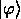, 我们知道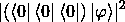是在计算基下测量得到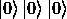的概率。因此，我们可以通过反复制备状态†|ψ>"), 在计算基下测量它，然后计算的相对频率来估计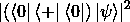的值。

这并不是唯一满足这一条件的特征向量。实际上，对于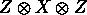的每一个特征向量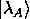，在计算基中都有一个唯一的状态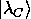，使得

| 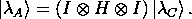 = (I ⊗ H ⊗ I) | C 态的表示>. |
| --- | --- |

实际上，这种对应是双射的：对于计算基中的每一个状态，也存在的唯一特征向量，使得†λ_A 态")，其中我们使用了对于幺正算子，")的事实。例如，

| \left\langle 1 \right\rangle\left\langle 1 \right\rangle\left\langle 1 \right\rangle,\qquad\left\langle 1 \right\rangle\left\langle 1 \right\rangle\left\langle 1 \right\rangle = {(I \otimes H \otimes I)}^{\dagger}\left\langle 1 \right\rangle\left\langle - \right\rangle\left\langle 1 \right\rangle.") |
| --- | --- | --- |

这就是为什么我们称为的本征向量基与计算基之间的**基变换算子**。

以这种方式，如果我们想要估计当状态恰好是的本征向量时，概率，我们只需准备^{\dagger}\left| \psi \right\rangle")并在计算基中进行测量。然后，给定的任意本征向量，可以通过与}^{\dagger}\left| \lambda_{A} \right\rangle")相关的测量结果的相对频率来估计概率。这是因为

| † | ψ rangle ) = 左 langle λ_A rangle ( (I ⊗ H ⊗ I) (I ⊗ H ⊗ I)† | ψ rangle ) = 左 langle λ_A rangle | ψ rangle,") |
| --- | --- | --- | --- | --- | --- | --- |

其中我们使用了以下事实：对于任何算子 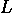 和任何状态 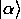 和 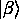，如果 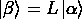，那么 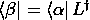，并且 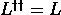。

作为最后的注意事项，在这个例子中，当我们开始计算概率 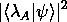 时，我们不需要为每个概率单独运行执行：我们可以同时计算它们。我们只需要多次测量 † | ψ rangle") 在计算基下的值，然后检索每个结果的相对频率。这是因为 †") 将  的所有特征向量转换成计算基的状态。然后，概率  将是计算基下与 † | λ_A rangle") 相关的结果的相对频率。当然，准备和测量的次数越多，我们的估计就越准确。

要了解更多…

注意这种过程与计算基中的标准测量的相似性。当我们对计算基中的  进行测量时，我们以概率  获得与  相关的结果。如果我们测量一个具有所有  作为特征向量且每个都具有不同特征值的可观测量——这是一个能够区分基中所有特征向量的可观测量——我们会有概率  获得与  相关的结果。

正是因为这个原因，我们称在计算基中进行基变换和测量的过程为在  的特征向量基  中进行 **测量**。这完全等同于我们有一个能够测量并区分  的所有特征向量的可观测量。

但是等等，还有更多！我们能够在这个情况下进行基变换绝非偶然。实际上，对于每个泡利矩阵  的张量积，都有一个简单的基变换矩阵，它定义了计算基中的状态与  的特征向量之间完美的对应关系。同样，这也可以很容易地验证，我们邀请你在接下来的两个练习中尝试一下。

练习 7.5

由于计算基是  的特征向量基，因此  的基变换算符可以是 。检查一下，为了从计算基变换到  的特征向量基，你可以使用哈达玛矩阵 ，并且为了变换到  的特征向量基，你可以使用 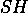。

练习 7.6

证明如果  和  分别是从计算基到两个可观测量  和  的特征向量基的变换算子，那么  是从计算基到  的特征向量基的变换算子。

将所有这些放在一起，我们可以很容易地推断出，例如， 将  的特征向量带到计算基，而 }^{\dagger} \otimes {(SH)}^{\dagger}") 也将  的特征向量带到计算基的状态。

因此，为了估计期望值 \left| \psi \right\rangle")，我们可以使用任何所需的电路来制备 ，然后取 }^{\dagger} = I \otimes I \otimes H") 的共轭，然后在计算基中进行测量，然后得到我们刚才讨论的概率。以类似的方式，为了估计 \left| \psi \right\rangle")，我们首先制备 ，然后应用 ，最后在计算基中进行测量。

顺便说一下，注意  和  是自伴的，所以当我们取它们的共轭时，没有观测到（无意中）效果。而  则不是这样，因为 }^{\dagger} = H^{\dagger}S^{\dagger} = HS^{\dagger}").

要了解更多...

对于任何厄米算子，总存在一个幺正变换，可以将的任意一组本征向量基转换到计算基，反之亦然。然而，这种变换可能非常难以实现。在是 Pauli 矩阵的张量积的情况下，我们已经证明我们可以总是通过非常简单的单量子比特操作的张量积来获得这种变换。

最后，在我们估计了可观测量中每个 Pauli 项的期望值（在我们的例子中，, , 和 )之后，我们可以将它们乘以线性组合中的相应系数，然后将所有这些加在一起得到最终结果。这就完成了！

现在你已经知道了如何通过在不同基下测量来估计可观测量期望值。你可以自豪地说，正如著名的网络迷因所说，“所有的基础都属于我们。”实际上，这是我们引入 VQE 所需的技术要素的最后一个，我们将在下一节立即进行介绍。

# 7.2 引入 VQE

**变分量子本征求解器**（**VQE**）的目标是找到一个给定哈密顿量的基态。这个哈密顿量可以描述，例如，某个物理或化学过程所需的能量，我们将在接下来的两节中通过一些这样的例子来介绍如何使用 Qiskit 和 PennyLane 执行 VQE。然而，目前我们将保持一切抽象化，专注于找到一个状态，使得是最小的。请注意，在本节中，我们将使用来指代哈密顿量，以免与我们在计算中也将使用的 Hadamard 矩阵混淆。

要了解更多……

VQE 绝对不是唯一被提出用于寻找哈密顿量基态的量子算法。一些非常有前景的选项使用了一种名为**量子相位估计**（**QPE**）的量子子程序（例如，参见 McArdle 等人出色的综述[66]和 Cao 等人[22]）。这些方法的主要缺点是 QPE 使用了我们在*第六章* *GAS: Grover 自适应搜索*中研究的量子傅里叶变换，因此需要能够抵御噪声的量子计算机。这些限制（以及 VQE 的相对鲁棒性）的实验演示可以在 O’Malley 等人发表的论文[70]中找到。因此，我们将主要关注 VQE 及其应用，这些应用似乎在可用的 NISQ 计算机上获得了更好的结果。

*VQE 的一般结构与 QAOA 非常相似，你肯定还记得*第五章* *QAOA: 量子近似优化算法*：我们准备一个参数化的量子态，我们测量它，我们估计它的能量，然后我们改变参数以最小化它；然后，我们重复这个过程几次，直到满足某些停止标准。状态的准备和测量是在量子计算机上完成的，而能量估计和参数最小化则由经典计算机处理。

*参数化电路，通常被称为**变分形式**或**基函数**，通常在选择时会考虑到问题域的信息。例如，你可以考虑参数化典型解决方案的基函数。我们将在本章的最后两节中展示一些这方面的例子。无论如何，基函数是在事先选择的，并且通常很容易在量子电路中实现。

重要提示

在许多应用中，我们可以将参数化状态的创建分为两个部分：初始状态的准备，它不依赖于任何参数，然后是变分形式")本身，它显然依赖于。因此，如果我们有，对于某个通过一些量子门实现的单位变换，则该假设给出了状态U\left| 0 \right\rangle")。然而，请注意，我们始终可以将整个操作U")视为假设，并要求初始状态为。为了简化我们的符号，我们通常会这样做，尽管我们将在本章后面考虑的一些实际例子中明确区分初始状态和假设。

算法 7.1 给出了 VQE 的伪代码。注意它与*第* *5* *章* *QAOA：量子近似优化算法* *5.1*的相似之处。

***算法 7.1**（VQE）**。**

**要求：**作为泡利矩阵张量积的线性组合给出

选择一个变分形式（假设）")

为选择一组起始值

**当**停止条件不满足时**执行**

准备状态} \right\rangle = V(\theta)\left| 0 \right\rangle")     *这是在量子计算机上完成的！*

从不同基的} \right\rangle")的测量中，估计} \right|H_{1}\left| {\psi(\theta)} \right\rangle")

根据最小化算法更新

-

准备状态} \right\rangle = V(\theta)\left| 0 \right\rangle")     *这是在量子计算机上完成的！*

从不同基的} \right\rangle")测量中，估计} \right|H_{1}\left| {\psi(\theta)} \right\rangle")

让我们对此伪代码的一些内容进行评论。注意，我们要求以泡利矩阵的张量积的线性组合的形式给出；这样我们就可以使用我们在上一节中介绍的技术来估计。当然，线性组合中的项越多，我们可能需要测量的基的数量就越大。尽管如此，在某些情况下，我们可能将几个测量组合在一起。例如，如果我们有、和这样的项，我们可以使用作为我们的基变换矩阵（请注意！这个是 Hadamard 矩阵，而不是哈密顿量！）因为它同时适用于这三个项——记住，任何正交归一基都是的特征向量基，而不仅仅是。显然，另一个将影响 VQE 执行时间的超参数是我们需要在每个基中测量的次数。这个次数越高，估计就越精确，但同时也需要更多的时间来估计。

注意，算法 7.1 的伪代码以估计最后由最小化算法找到的状态} \right\rangle")的} \right|H_{1}\left| {\psi(\theta)} \right\rangle")来完成。这是一个相当常见的用例，例如，如果我们想确定特定系统的基态能量。然而，你并不局限于这一点。在 VQE 执行结束时，你还知道用于构建基态的参数，你可以使用它们来重建} \right\rangle = V(\theta_{0})\left| 0 \right\rangle")。这个状态可以用于其他目的，例如将其输入到另一个量子算法中。

实际上，在下一小节中，我们将探讨这种用途之一：计算哈密顿量的额外**本征态**（也就是我们老朋友的特征向量）。你应该感到兴奋！

## 7.2.1 使用 VQE 激发

正如我们刚刚解释的，变分量子特征值估计（VQE）用于寻找给定哈密顿量的基态。然而，经过微小修改，我们也可以用它来寻找**激发态**：具有更高能量的本征态。让我们来解释如何实现这一点。

假设你已经得到了一个哈密顿量，并且你已经使用 VQE 找到了基态\left| 0 \right\rangle")，其能量为。然后，我们可以考虑修改后的哈密顿量


其中是一个正实数。

在我们详细说明为什么能够帮助我们找到激发态之前，让我们解释一下那个表达式中的术语的含义。首先，请注意，这个术语代表一个方阵：它是长度相同的列向量()和行向量()的乘积。此外，它是一个厄米矩阵，因为

^{\dagger} = \left\langle \psi_{0} \right|^{\dagger}\left| \psi_{0} \right\rangle^{\dagger} = \left| \psi_{0} \right\rangle\left\langle \psi_{0} \right|.")

然后，是两个厄米矩阵的和，因此也是厄米的。那么它的期望值是多少呢？如果我们有一个通用的量子态，那么


即，在状态中的期望值是的期望值加上一个非负值，该值量化了和的重叠程度。因此，我们有两个极端情况对于。如果，则此项将为。如果和是正交的，则此项将为。

因此，如果我们让足够大，将不再是的基态。让我们以更正式的方式证明这一点。为此，设是与正交特征向量基中每个特征向量的关联特征值（由于不同的特征向量可能具有相同的特征值，一些能量可能重复）。由于根据假设是基态，我们假设。状态也是的特征向量，因为一方面，如果,


由于和是正交的。另一方面，

\left| \lambda_{0} \right\rangle.")

因此，当时，有，而当。因此，如果,那么将不再是的基态，因为的能量将低于的能量。多亏了变分原理，我们知道最小能量是在的特征向量处达到的，所以必须是的基态。

然后，我们可以使用 VQE 来搜索的基态，并得到我们想要的状态。

要了解更多信息…

注意，可能存在的情况。在这种情况下，将是的另一个基态。否则，它将是的第一个激发态。

你可能也注意到，即使基态是唯一的，第一个激发态的固有态可能并不如此。这种情况发生在且仅当（以及基中的其他可能状态）具有与相同的能量时（即)。在这种情况下，这些固有向量的任何归一化线性组合都将的基态。其中任何一个都将同样有效地为我们服务。

当然，一旦你获得了，你可以考虑并使用 VQE 来寻找，以此类推。记住，在这个过程中，我们必须适当地选择常数——只是为了确保我们已知的任何固有态都不会再次成为基态！

这样，我们寻找能量增加的固有向量的问题就解决了。或者，是这样吗？

只有一个小小的实现细节可能会让你感到烦恼。在上一个章节中，我们讨论了在假设哈密顿量是以泡利矩阵张量积之和给出的情况下，如何估计哈密顿量的期望值。然而，项并不是那种形式。实际上，我们只知道是应用 VQE 的结果，所以我们很可能不会明确地知道；相反，我们可能只有一些参数，使得\left| 0 \right\rangle = \left| \psi_{0} \right\rangle")。然而，这已经足够我们计算所需的期望值了。

让我们稍微退后一步，看看我们需要计算什么。在 VQE 应用的一个特定时刻，我们有一些参数 ，并且我们想要估计相对于 > = V(θ)|0>") 的 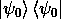 的期望值。这个量是

|ψ_0><ψ_0|ψ(θ)> = |<ψ_0|ψ(θ)>|² = |<0|V(θ_0)^†V(θ)|0>|²")。

但这仅仅是获得 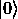 作为 ^†V(θ)|0>") 在计算基下测量结果的概率！这是我们可以轻松估计的，因为我们可以通过首先应用我们的试探解 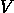，使用 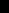 作为参数，到  上，然后应用试探解的逆，参数为 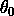，到所得状态来制备 ^†V(θ)|0>")。我们将重复这个过程几次，总是测量所得状态 ^†V(θ)|0>") 在计算基下的结果，并计算  的相对频率。这如图 **7.1** 所示。

*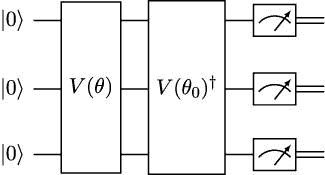*

**图 7.1**：计算 ^†V(θ)|0>²") 的电路。

这种方法可能一开始看起来困难的是获取}^{\dagger}")的电路。然而，这相当简单。你只需要记住每个幺正门都是可逆的。因此，你可以取")的电路，从右到左读取门，并反转每一个。作为一个简单的例子，如果")和 = XR_{Z}(a)R_{X}(b)S")，那么}^{\dagger} = S^{\dagger}R_{X}( - b)R_{Z}( - a)X")。

不要忘记这个用于估计}^{\dagger}V(\theta)\left| 0 \right\rangle} \right|^{2}")的技术，因为我们将在*第* * *9*，*量子支持向量* *机器*中再次使用它，在完全不同的背景下。*

*这标志着我们对 VQE 的理论研究结束。在下一节中，我们将学习如何使用 Qiskit 来应用这个算法*。

# 7.3 使用 Qiskit 进行 VQE

在本节中，我们将展示如何使用 Qiskit 在模拟器和实际量子硬件上运行 VQE。为此，我们将使用一个来自量子化学的问题：确定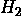或二氢分子的能量。我们的第一个子节将致力于定义这个问题。

## 7.3.1 在 Qiskit 中定义分子问题

为了说明如何使用 Qiskit 应用 VQE，我们将考虑一个简单的量子化学问题。我们将设想有两个氢原子形成一个分子，并且我们想要计算其基态及其能量。为此，我们需要获得系统的哈密顿量，这与我们习惯的哈密顿量略有不同。我们迄今为止考虑的哈密顿量被称为**量子比特**哈密顿量，而我们需要描述分子能量的哈密顿量被称为**费米子**哈密顿量——这个名字来源于它涉及到费米子，即如电子、质子和中子这样的粒子。

我们不需要深入了解此类哈密顿量的计算细节（如果你感兴趣，可以参考 Sharkey 和 Chancé合著的书籍中的*第四章* [86]），因为所有必要的方法都包含在 Qiskit Nature 包中。更重要的是，整个过程中不涉及任何量子计算机；所有计算和估计都是经典完成的。

要使用 Qiskit 获取二氢分子的费米子哈密顿量，我们需要安装 Qiskit Nature 包以及 pyscf 库，该库用于计算化学计算（请参阅*附录* **D*，*安装工具*，了解安装过程，并注意我们将使用该包的 0.4.5 版本）。

然后，我们可以执行以下指令：

```py

from qiskit_nature.drivers import Molecule 

from qiskit_nature.drivers.second_quantization import \ 

    ElectronicStructureMoleculeDriver, ElectronicStructureDriverType 

from qiskit_nature.problems.second_quantization import \ 

    ElectronicStructureProblem 

mol = Molecule(geometry=[[’H’, [0., 0., -0.37]], 

                        [’H’, [0., 0., 0.37]]]) 

driver = ElectronicStructureMoleculeDriver(mol, basis=’sto3g’, 

        driver_type=ElectronicStructureDriverType.PYSCF) 

problem = ElectronicStructureProblem(driver) 

secqop = problem.second_q_ops() 

print(secqop[0])

```

在这里，我们定义了一个由两个位于坐标 ") 和 ")（以埃为单位）的氢原子组成的分子，这接近于该分子的平衡状态。我们使用默认参数，例如，例如，确定该分子不带电。然后，我们定义一个电子结构问题；也就是说，我们通过 Qiskit 接口请求 pyscf 库计算考虑两个氢原子电子的不同可能配置的费米子哈密顿量。这是通过称为**第二** **量子化**（因此我们使用的方法命名为`second_q_ops`）来完成的。

当我们运行这段代码时，我们获得以下输出：

```py

Fermionic Operator 

register length=4, number terms=36 

  -1.2533097866459775 * ( +_0 -_0 ) 

+ -0.47506884877217725 * ( +_1 -_1 ) 

+ -1.2533097866459775 * ( +_2 -_2 ) 

+ -0.47506884877217725 * ( +_3 -_3 ) 

+ -0.3373779634072241 * ( +_0 +_0 -_0 -_0 ) 

+ -0.0 ...

```

这是对费米子哈密顿量的截断视图，涉及一种称为**创建**和**湮灭**算符的东西，它们描述了电子如何从一个轨道移动到另一个轨道（更多细节可以在 Sharkey 和 Chancé所著的书中找到，见第四章 [86]）。

这一切都很不错，但我们还不能在我们的闪亮量子计算机上使用它。为此，我们需要将费米子哈密顿量转换为量子比特哈密顿量，涉及泡利门。有几种方法可以做到这一点。其中最受欢迎的一种是**乔丹-威格纳**变换（再次，请参阅 Sharkey 和 Chancé所著的书籍 [86] 以获得详细解释），我们可以在 Qiskit 中使用以下指令：

```py

from qiskit_nature.converters.second_quantization import QubitConverter 

from qiskit_nature.mappers.second_quantization import JordanWignerMapper 

qconverter = QubitConverter(JordanWignerMapper()) 

qhamiltonian = qconverter.convert(secqop[0]) 

print("Qubit Hamiltonian") 

print(qhamiltonian)

```

运行此代码后，我们将获得以下输出：

```py

Qubit Hamiltonian 

-0.8121706072487122 * IIII 

+ 0.17141282644776915 * IIIZ 

- 0.22343153690813483 * IIZI 

+ 0.17141282644776915 * IZII 

- 0.22343153690813483 * ZIII 

+ 0.12062523483390415 * IIZZ 

+ 0.16868898170361205 * IZIZ 

+ 0.04530261550379923 * YYYY 

+ 0.04530261550379923 * XXYY 

+ 0.04530261550379923 * YYXX 

+ 0.04530261550379923 * XXXX 

+ 0.16592785033770338 * ZIIZ 

+ 0.16592785033770338 * IZZI 

+ 0.1744128761226159 * ZIZI 

+ 0.12062523483390415 * ZZII

```

现在，我们又回到了熟悉的领域！这确实是我们已经了解并喜爱的哈密顿量之一。事实上，这是一个涉及个量子比特的哈密顿量，包括、、和门的张量积，正如在`0.17141282644776915` `*` `IIIZ` 或 `0.04530261550379923` `*` `XXYY`之类的项中出现的那些。

对我们来说更重要的是：这是我们能够应用 VQE 算法以获得其基态的哈密顿量。而且，无需进一步说明，这正是我们将在下一小节中要做的。

## 7.3.2 使用哈密顿量进行 VQE

现在我们已经有一个描述我们电子问题的量子比特哈密顿量，让我们看看我们如何使用 Qiskit 中的 VQE 来找到它的基态。记住，要使用 VQE，我们首先需要选择一个基函数。首先，我们将使用一些简单的东西。我们将选择 Qiskit 提供的变分形式之一：`EfficientSU2`形式。我们可以用以下指令定义它并为其比特绘制电路（请记住，您需要安装 pylatexenc 库以使用`"``mpl``"`选项进行绘制；请参阅*附录* * *D*，*安装工具*）：

*```py

from qiskit.circuit.library import EfficientSU2 

ansatz = EfficientSU2(num_qubits=4, reps=1, entanglement="linear", 

    insert_barriers = True) 

ansatz.decompose().draw("mpl")

```

在这里，我们指定了我们正在使用比特上的变分形式，我们只使用一次重复（即一个 CNOT 门层），并且我们想要使用的纠缠是线性的：这意味着每个量子比特都与下一个量子比特的 CNOT 门纠缠。运行这段代码后，我们将获得*图* * *7.2*中所示的形象。正如你所看到的，我们正在使用和门，以及纠缠门（在这种情况下是 CNOT 门）。总共，我们有 16 个不同的可调参数，如图中的所示。我们将在*章节* * *9*和* *10*中讨论更多类似这种的变分形式。现在，只需注意这一点就足够了，这是一个我们可以轻松在当前量子硬件中实现的电路（因为它只涉及简单的一比特和两比特门），但它允许我们创建相对复杂的量子态，所有量子比特之间都有纠缠。***

**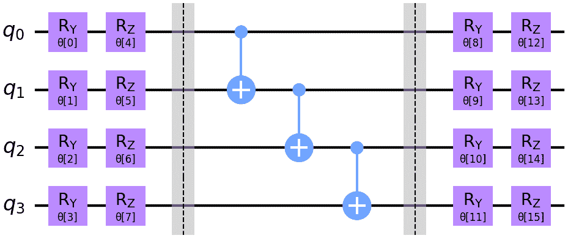**

**图 7.2**：4 比特上的 EfficientSU2 变分形式。

一旦我们选择了基函数，我们就可以定义一个 VQE 实例。为了做到这一点，我们可以使用以下指令：

```py

from qiskit.algorithms import VQE 

from qiskit import Aer 

from qiskit.utils import QuantumInstance, algorithm_globals 

import numpy as np 

from qiskit.algorithms.optimizers import COBYLA 

seed = 1234 

np.random.seed(seed) 

algorithm_globals.random_seed = seed 

optimizer = COBYLA() 

initial_point = np.random.random(ansatz.num_parameters) 

quantum_instance = QuantumInstance(backend = 

    Aer.get_backend(’aer_simulator_statevector’)) 

vqe = VQE(ansatz=ansatz, optimizer=optimizer, 

    initial_point=initial_point, 

    quantum_instance=quantum_instance)

```

在必要的导入之后，我们设置了一个种子以实现可重复性。然后，我们选择了 COBYLA 作为我们的经典优化器；也就是说，负责改变参数以找到实现最小能量的算法。我们还为我们的参数设置了一些随机初始值，并声明了一个封装状态向量的`QuantumInstance`。最后，我们使用基函数、优化器、初始值和量子实例选项声明了我们的 VQE 实例。

运行 VQE 现在非常简单。我们只需要执行以下指令：

```py

result = vqe.compute_minimum_eigenvalue(qhamiltonian) 

print(result)

```

几秒钟后，我们得到了以下输出：

@empty

```py

{   ’aux_operator_eigenvalues’: None, 

    ’cost_function_evals’: 888, 

    ’eigenstate’: array([ 1.55163279e-09+7.04522580e-10j, 

        1.17994431e-06+6.29389934e-07j, 

       -6.87287902e-05-1.19175176e-04j,  9.01607105e-09+1.75153048e-10j, 

        3.17070261e-06-2.71251777e-05j, -9.23514532e-01-3.66685696e-01j, 

       -6.50833666e-07-1.04178617e-06j, -6.40877389e-06-1.04499914e-05j, 

       -1.33988128e-06+3.63309921e-07j,  1.08441415e-05+7.61755332e-08j, 

        1.04578392e-01+4.15432635e-02j, -5.85921512e-06+4.47076415e-06j, 

       -1.01179799e-09+1.85616927e-09j,  5.57085679e-05+5.29593190e-05j, 

        1.47630244e-07+4.00357904e-08j,  1.51330159e-10+9.41869390e-10j]), 

    ’eigenvalue’: (-1.8523881417094914+0j), 

    ’optimal_circuit’: None, 

    ’optimal_parameters’: { 

        ParameterVectorElement(@$\theta$@[7]): -0.10263498379273155, 

        ParameterVectorElement(@$\theta$@[6]): -0.13154223054201972, 

        ParameterVectorElement(@$\theta$@[8]): 3.1416468430294864, 

        ParameterVectorElement(@$\theta$@[13]): 0.6426987629297032, 

        ParameterVectorElement(@$\theta$@[9]): 2.4674114077579344e-05, 

        ParameterVectorElement(@$\theta$@[14]): -0.11387081297526412, 

        ParameterVectorElement(@$\theta$@[15]): 2.525254909939928, 

        ParameterVectorElement(@$\theta$@[12]): 1.8446272942674344, 

        ParameterVectorElement(@$\theta$@[11]): -0.0011789455587669483, 

        ParameterVectorElement(@$\theta$@[10]): 2.7179451047891577e-06, 

        ParameterVectorElement(@$\theta$@[3]): 3.1403232388683655, 

        ParameterVectorElement(@$\theta$@[1]): 9.061128731357842e-06, 

        ParameterVectorElement(@$\theta$@[2]): 3.141570826032646, 

        ParameterVectorElement(@$\theta$@[0]): -0.22553325325129397, 

        ParameterVectorElement(@$\theta$@[5]): 2.1513214842441912, 

        ParameterVectorElement(@$\theta$@[4]): 1.7045601611970793}, 

    ’optimal_point’: array([-2.25533253e-01,  9.06112873e-06, 

        3.14157083e+00,  3.14032324e+00, 

        1.70456016e+00,  2.15132148e+00, -1.31542231e-01, -1.02634984e-01, 

        3.14164684e+00,  2.46741141e-05,  2.71794510e-06, -1.17894556e-03, 

        1.84462729e+00,  6.42698763e-01, -1.13870813e-01,  2.52525491e+00]), 

    ’optimal_value’: -1.8523881417094914, 

    ’optimizer_evals’: None, 

    ’optimizer_result’: None, 

    ’optimizer_time’: 3.0011892318725586}

```

这些信息可能看起来很多，但实际上，一些数据以不同的方式呈现了多次，总的来说，格式与我们使用 Qiskit 在*第* **5** *章* *QAOA: 量子近似优化算法*中使用的格式非常相似。正如你所看到的，我们已经获得了电路参数的最优值，使用这些参数生成的状态（``eigenstate``字段）以及我们所寻找的：该状态的能量，它恰好是约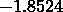 hartrees（在分子轨道计算中常用的能量单位）。这意味着……我们解决了我们的问题！或者，我们已经解决了吗？我们如何确保我们获得的价值是正确的？*

*在这种情况下，我们使用的哈密顿量相当小（只有个量子位），因此我们可以使用一个经典的求解器来检查我们的结果，该求解器可以找到精确的基态。我们将使用`NumPyMinimumEigensolver`，就像我们在*第* **5** *章* *QAOA: 量子近似优化算法*中考虑的组合优化问题一样。为此，我们可以运行以下代码片段：

```py

from qiskit.algorithms.minimum_eigensolvers import \ 

    NumPyMinimumEigensolver 

solver = NumPyMinimumEigensolver() 

result = solver.compute_minimum_eigenvalue(qhamiltonian) 

print(result)

```

这些指令的输出如下：

```py

{   ’aux_operators_evaluated’: None, 

    ’eigenstate’: Statevector([-1.53666363e-17-4.93701060e-20j, 

             -4.57234900e-16-4.65250782e-16j, 

              1.25565337e-17-2.11612780e-17j, 

              4.73690908e-16-1.33060132e-16j, 

              1.52564317e-16-1.40021223e-16j, 

             -6.67316913e-01-7.36221442e-01j, 

             -1.62999711e-16-2.24584031e-16j, 

             -8.42710421e-17+6.43081213e-17j, 

             -7.98957973e-17-1.35250844e-17j, 

              1.90408979e-16+3.25517112e-16j, 

              7.55826341e-02+8.33870007e-02j, 

             -3.56170534e-17+9.82948865e-17j, 

             -4.51619835e-16+1.70721750e-16j, 

              1.91645940e-17-1.45775129e-16j, 

             -4.79331105e-17+5.57184037e-17j, 

             -3.62080563e-17+4.86380668e-17j], 

            dims=(2, 2, 2, 2)), 

    ’eigenvalue’: -1.852388173569583}

```

这确实比 VQE 的输出更简洁，但最终能量几乎与我们之前获得的一样。现在我们真的可以说：我们做到了！我们成功地使用 VQE 解决了一个分子问题！

当然，我们可以使用 VQE 与任何类型的哈密顿量一起使用，而不仅仅是来自量子化学问题的那些。我们甚至可以用组合优化问题的哈密顿量来使用它，就像我们在*第* **5** *章* *QAOA: 量子近似优化算法*中做的那样。根据我们已知的，这很简单……简单到我们可以把它作为练习交给你。*

*练习 7.7

使用 Qiskit 的 VQE 实现来解决一个有个顶点的图的最大切割问题，其中连接是,(1,2),(2,3),(3,4)")和")。

一旦我们知道了如何使用 VQE 找到哈密顿量的基态，为什么不更加雄心勃勃一些呢？在下一个小节中，我们也将寻找激发态！

## 7.3.3 使用 Qiskit 寻找激发态

在*第* **7.2.1**节中，我们学习了如何使用 VQE 迭代地找到哈密顿量的基态，以及我们称之为激发态的更高能量状态。我们研究的算法有时被称为**变分** **量子压缩**（这是 Higgot、Wang 和 Brierley 在介绍它时使用的名称 [53]）或**VQD**，并且它由 Qiskit 在`VQD`类中实现。

*在 Qiskit 中使用 VQD 几乎与使用 VQE 相同。唯一的区别是我们需要指定我们想要获得多少个本征态（当然，如果我们只请求，这将与应用 VQE 完全相同）。例如，如果我们想在分子问题中获取两个本征态（基态和第一个激发态），我们可以使用以下指令：

```py

from qiskit.algorithms import VQD 

vqd = VQD(ansatz=ansatz, 

    optimizer=optimizer, 

    initial_point=initial_point, 

    quantum_instance=quantum_instance, 

    k = 2) 

result = vqd.compute_eigenvalues(qhamiltonian) 

print(result)

```

`k`参数是我们用来指定所需本征态数量的参数。运行这些指令后，我们得到以下输出（为了简洁，我们省略了一部分）：

@empty

```py

{   ’aux_operator_eigenvalues’: None, 

    ’cost_function_evals’: array([ 888, 1000]), 

    ’eigenstates’: ListOp([VectorStateFn(Statevector( 

            [ 1.55163279e-09+7.04522580e-10j, 

              1.17994431e-06+6.29389934e-07j, 

              ... 

              1.51330159e-10+9.41869390e-10j], 

            dims=(2, 2, 2, 2)), coeff=1.0, 

            is_measurement=False), 

            VectorStateFn(Statevector( 

            [-5.01605162e-02+4.38928908e-02j, 

             -7.31117975e-01-3.69461649e-02j, 

             -6.34876999e-03-5.19845422e-03j, 

             ... 

             -4.10301081e-02+2.77415065e-02j], 

            dims=(2, 2, 2, 2)), coeff=1.0, 

            is_measurement=False)], coeff=1.0, 

            abelian=False), 

    ’eigenvalues’: array([-1.85238814-1.11e-16j, -1.19536442+0.00e+00j]), 

    ’optimal_circuit’: None, 

    ’optimal_parameters’: [ 

    {   ParameterVectorElement(@$\theta$@[0]): -0.22553325325129397, 

        ParameterVectorElement(@$\theta$@[1]): 9.061128731357842e-06, 

        ... 

        ParameterVectorElement(@$\theta$@[15]): 2.525254909939928}, 

    {   ParameterVectorElement(@$\theta$@[0]): 0.012174657752649348, 

        ParameterVectorElement(@$\theta$@[1]): -0.056812096977499754, 

        ... 

        ParameterVectorElement(@$\theta$@[15]): 1.522408417522795}], 

    ’optimal_point’: 

    array([[-2.25533253e-01,  9.06112873e-06,  3.14157083e+00, 

         3.14032324e+00,  1.70456016e+00,  2.15132148e+00, 

         ... 

         2.52525491e+00], 

       [ 1.21746578e-02, -5.68120970e-02,  1.31641034e+00, 

         4.59223490e-01,  7.25749716e-01,  9.54546607e-02, 

         ... 

         1.52240842e+00]]), 

    ’optimal_value’: array([-1.85238814, -1.1952203 ]), 

    ’optimizer_evals’: None, 

    ’optimizer_result’: None, 

    ’optimizer_time’: array([ 2.32541203, 53.26829457])}

```

正如你所见，这个输出结构与 VQE 执行的输出结构相似。然而，在这种情况下，我们每个字段中都有两个条目，对应于我们请求的每个本征态。

到目前为止，我们已经学习了如何使用可能来自任何来源的哈密顿量来使用 VQE 和 VQD。然而，寻找分子哈密顿量基态的使用案例如此重要，以至于 Qiskit 提供了专门的方法来处理它们。我们将在下一小节中学习如何做。

## 7.3.4 使用 VQE 解决分子问题

除了使用 VQE 来寻找任何给定哈密顿量的基态之外，我们还可以直接使用我们用 Qiskit Nature 实用工具定义的分子问题。例如，我们可以使用一个 VQE 实例来解决我们在前一小节中定义的电子问题。为此，我们只需要运行以下指令：

```py

from qiskit_nature.algorithms import GroundStateEigensolver 

solver = GroundStateEigensolver(qconverter, vqe) 

result = solver.solve(problem) 

print(result)

```

正如你所见，我们定义了一个`GroundStateEigensolver`对象，然后我们使用它来解决问题。这个对象反过来又使用了我们之前定义的两个对象——`qconverter`，它用于将费米子哈密顿量转换为量子比特哈密顿量，以及我们之前两个小节中使用的 VQE 实例。当我们运行这些指令时，我们得到以下输出：

```py

=== GROUND STATE ENERGY === 

* Electronic ground state energy (Hartree): -1.852388141709 

  - computed part:      -1.852388141709 

~ Nuclear repulsion energy (Hartree): 0.715104339081 

> Total ground state energy (Hartree): -1.137283802628 

=== MEASURED OBSERVABLES === 

  0:  # Particles: 2.000 S: 0.000 S²: 0.000 M: 0.000 

=== DIPOLE MOMENTS === 

~ Nuclear dipole moment (a.u.): [0.0  0.0  0.0] 

  0: 

  * Electronic dipole moment (a.u.): [0.0  0.0  0.00001495] 

    - computed part:      [0.0  0.0  0.00001495] 

  > Dipole moment (a.u.): [0.0  0.0  -0.00001495]  Total: 0.00001495 

                 (debye): [0.0  0.0  -0.000038]  Total: 0.000038

```

在这个案例中，我们得到的信息比之前获得的抽象层次更高。例如，我们得到了关于粒子数量、偶极矩等信息（如果你不理解这些概念，不用担心；它们是为了让化学家和物理学家理解这类问题而设计的）。然而，电子基态能量的数值结果与之前我们使用 VQE 得到的结果相同。不同的是，现在我们不仅向求解器提供了哈密顿量，还提供了整个问题，它可以使用这些信息在物理术语中重建计算的意义。例如，我们现在得到了一些额外信息，如**总基态能量**，这是由于电子结构（我们之前计算的那个）和由于核排斥产生的能量的总和。

这种输出方式更易于阅读。这就是为什么我们将使用这个求解器在本节的其余部分。

作为使用 VQE 解决分子问题的另一个示例，我们现在将考虑一个不同、更复杂的线性组合。在本章早期，我们提到在选择与 VQE 一起使用的变分形式和初始状态时，考虑问题域的信息可能是有用的。这就是**单位耦合簇单双**或**UCCSD**线性组合的情况，它被广泛用于分子计算（有关更多详细信息，请参阅 McArdle 等人的调查 [66]）。

在 Qiskit 中，我们可以使用以下指令使用 UCSSD 线性组合：

```py

from qiskit_nature.algorithms import VQEUCCFactory 

vqeuccf = VQEUCCFactory(quantum_instance = quantum_instance)

```

`VQEUCCFactory` 类创建了一个完整的 VQE 实例，其中 UCSSD 线性组合作为默认的变分形式。在这里，我们使用之前定义的 `quantum_instance` 对象。我们可以使用以下指令可视化由 `VQEUCCFactory` 创建的线性组合的电路：

```py

vqeuccf.get_solver(problem, qconverter).ansatz.decompose().draw("mpl")

```

注意，我们调用 `get_solver` 方法，并将之前定义的 `problem` 对象传递给它，以提供有关计算中涉及的哈密顿量的信息。然后，我们通过 `ansatz` 属性访问线性组合电路，并继续绘制它。运行此指令后，我们获得 *图* **7.3* 中所示的电路。如您所见，线性组合涉及泡利矩阵张量积的指数函数。电路开头还有两个  门，它们将初始状态设置为随后应用的变分形式。在这种情况下，该状态被称为**哈特里-福克**状态，再次是使用量子计算机解决分子问题时广泛使用的选项——以及 `VQEUCCFactory` 的默认值。

*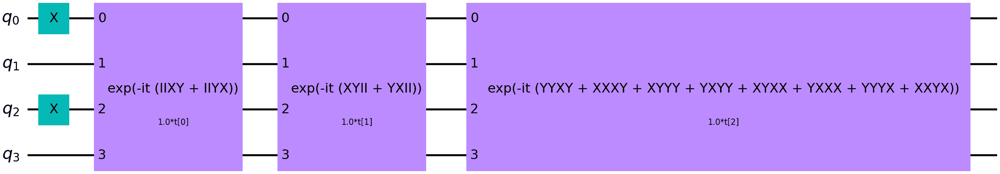

**图 7.3**：我们问题的 UCCSD 线性组合

现在，我们可以通过运行以下代码片段轻松使用 VQE 和选定的线性组合来解决我们的问题：

```py

solver = GroundStateEigensolver(qconverter, vqeuccf) 

result = solver.solve(problem) 

print(result)

```

这将给出以下输出：

```py

=== GROUND STATE ENERGY === 

* Electronic ground state energy (Hartree): -1.852388173513 

  - computed part:      -1.852388173513 

~ Nuclear repulsion energy (Hartree): 0.715104339081 

> Total ground state energy (Hartree): -1.137283834432 

=== MEASURED OBSERVABLES === 

  0:  # Particles: 2.000 S: 0.000 S²: 0.000 M: 0.000 

=== DIPOLE MOMENTS === 

~ Nuclear dipole moment (a.u.): [0.0  0.0  0.0] 

  0: 

  * Electronic dipole moment (a.u.): [0.0  0.0  -0.00000013] 

    - computed part:      [0.0  0.0  -0.00000013] 

  > Dipole moment (a.u.): [0.0  0.0  0.00000013]  Total: 0.00000013 

                 (debye): [0.0  0.0  0.00000033]  Total: 0.00000033

```

此结果与我们使用 `EfficientSU2` 线性组合获得的结果非常相似。

练习 7.8

编写代码使用 VQE 和 UCCSD 线性组合来计算两个氢原子在从  到 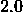 ångström 的距离范围内，以  ångström 为步长计算的总基态能量。绘制能量与距离的关系图。这种图有时被称为分子的**解离谱**。*提示：*在分子问题上进行 VQE 运行时，您可以通过结果对象的 `total_energies` 属性访问总基态能量。

现在我们知道了如何使用模拟器以不同的方式使用 VQE，我们可以尝试在真实的量子计算机上运行该算法。然而，在这样做之前，我们将学习如何将噪声纳入我们的量子模拟器。

## 7.3.5 带噪声的模拟

从一个完美的、经典的算法模拟到在真实的量子设备上执行，有时可能是一个太大的步骤。正如我们多次提到的，当前的量子计算机受到不同类型噪声的影响，包括读出错误、门实现的缺陷和退相干，如果电路太深，我们的状态就会失去量子特性。

因此，在转到实际量子设备之前，在噪声的影响下对我们的算法进行模拟通常是一个好主意。这样，我们可以在一个受控环境中研究我们算法的性能，并在量子计算机上运行它们之前校准和调整一些参数。例如，如果我们观察到结果与理想模拟差异很大，我们可能会决定通过使用更简单的基组来减少电路的深度。

有几种方法可以在 Qiskit 中进行有噪声的模拟。在这里，我们将展示如何使用一种既简单又非常有用的一种方法。我们将创建一个模拟器，它模拟真实设备的操作，包括它所受的噪声。我们可以通过以下方式使用`AerSimulator`类来完成：

```py

from qiskit.providers.aer import AerSimulator 

from qiskit import IBMQ 

provider = IBMQ.load_account() 

backend = provider.get_backend(’ibmq_manila’) 

quantum_instance = QuantumInstance( 

    backend = AerSimulator.from_backend(backend), 

    seed_simulator=seed, seed_transpiler = seed, shots = 1024)

```

注意，我们需要加载一个 IBM 账户才能访问真实设备的校准（在我们的例子中是`ibmq_manila`）。这种校准定期更新以保持与量子计算机状态的实时性，包括读出错误、门错误和相干时间等信息。当然，这些数据会不时变化，但我们决定为我们的`QuantumInstance`对象包含种子，以便在相同的校准数据下使结果可重现。注意，我们现在指定了射击次数，因为我们不再使用状态向量模拟。

现在，我们可以像以前一样运行 VQE 算法：

```py

vqe = VQE( 

    ansatz=ansatz, 

    optimizer=optimizer, 

    initial_point=initial_point, 

    quantum_instance=quantum_instance 

) 

solver = GroundStateEigensolver(qconverter, vqe) 

result = solver.solve(problem) 

print(result)

```

当我们运行这段代码时，我们得到了以下输出（你的结果可能因设备校准不同而不同）：

```py

=== GROUND STATE ENERGY === 

* Electronic ground state energy (Hartree): -1.763282965888 

  - computed part:      -1.763282965888 

~ Nuclear repulsion energy (Hartree): 0.715104339081 

> Total ground state energy (Hartree): -1.048178626807 

=== MEASURED OBSERVABLES === 

  0:  # Particles: 1.978 S: 0.080 S²: 0.086 M: 0.001 

=== DIPOLE MOMENTS === 

~ Nuclear dipole moment (a.u.): [0.0  0.0  0.0] 

  0: 

  * Electronic dipole moment (a.u.): [0.0  0.0  0.04634607] 

    - computed part:      [0.0  0.0  0.04634607] 

  > Dipole moment (a.u.): [0.0  0.0  -0.04634607]  Total: 0.04634607 

                 (debye): [0.0  0.0  -0.11779994]  Total: 0.11779994

```

观察噪声如何影响算法的性能并使其退化，给出了一个与正确值不太接近的总基态能量。

要了解更多...

模拟真实量子计算机行为的一种替代方法是使用`FakeProvider`类的对象。区别在于它们使用设备的过去校准快照而不是最新的校准。更多详情请见[`qiskit.org/documentation/apidoc/providers_fake_provider.html`](https://qiskit.org/documentation/apidoc/providers_fake_provider.html)。

此外，您还可以创建自定义噪声模型，这些模型包括在`qiskit_aer.noise`包中实现的不同的噪声类型。有关进一步说明，请参阅[`qiskit.org/documentation/apidoc/aer_noise.html`](https://qiskit.org/documentation/apidoc/aer_noise.html)。

一种尝试减少我们计算中噪声不利影响的方法是使用**读出错误缓解**方法。我们将使用的方法背后的思想非常简单。想象一下，我们知道当我们的量子比特状态是时，有百分之多少的时间我们在测量时会得到错误值。然后，我们可以考虑这些信息来纠正我们获得的测量结果。

在 Qiskit 中，使用读出错误缓解非常简单。我们只需要以下方式创建我们的量子实例对象：

```py

from qiskit.utils.mitigation import CompleteMeasFitter 

quantum_instance = QuantumInstance( 

    backend = AerSimulator.from_backend(backend), 

    measurement_error_mitigation_cls=CompleteMeasFitter, 

    seed_simulator=seed, seed_transpiler = seed, shots = 1024)

```

然后，我们可以像往常一样运行 VQE，使用这个新的`QuantumInstance`变量。在我们的案例中，这导致了以下结果（再次提醒，你的结果可能会因为设备校准而有所不同）：

```py

=== GROUND STATE ENERGY === 

* Electronic ground state energy (Hartree): -1.827326686753 

  - computed part:      -1.827326686753 

~ Nuclear repulsion energy (Hartree): 0.715104339081 

> Total ground state energy (Hartree): -1.112222347671 

=== MEASURED OBSERVABLES === 

  0:  # Particles: 1.991 S: -0.000 S²: -0.000 M: -0.006 

=== DIPOLE MOMENTS === 

~ Nuclear dipole moment (a.u.): [0.0  0.0  0.0] 

  0: 

  * Electronic dipole moment (a.u.): [0.0  0.0  -0.05906852] 

    - computed part:      [0.0  0.0  -0.05906852] 

  > Dipole moment (a.u.): [0.0  0.0  0.05906852]  Total: 0.05906852 

                 (debye): [0.0  0.0  0.15013718]  Total: 0.15013718

```

如你所见，我们当前的结果——与我们的先前带有噪声且没有错误缓解的模拟相比——现在更接近真实的基态能量（尽管你肯定已经注意到还有改进的空间）。

为了运行这种错误缓解，我们需要知道当我们实际上拥有时，测量的概率，对于每一对二进制字符串和。当然，估计这些值在计算上非常昂贵，因为字符串的数量随着量子比特数量的指数增长。或者，我们可以假设读出错误是局部的，并估计每个单独量子比特获得错误结果的概率。在 Qiskit 中，你可以通过用`TensoredMeasFitter`替换`CompleteMeasFitter`来选择这种方法。然而，在撰写本文时，并非所有后端都支持这种可能性，所以如果你决定使用它，请务必小心。

要了解更多…

关于尝试缓解量子计算中噪声的影响还有很多可以说的。不幸的是，进一步研究错误缓解会使本章变得非常非常长（它已经相当长了！）。如果你对这个主题感兴趣，我们可以推荐你查看 Bravyi 等人撰写的论文[21]，以了解更多关于测量错误缓解的信息，以及 Temme 等人撰写的论文[94]和 Endo 等人撰写的论文[35]，以了解更多关于如何一般性地缓解错误，包括由不完美的门实现引起的错误。你可能还希望看看 Mitiq，这是一个非常易于使用的错误缓解软件包，与 Qiskit 和其他量子计算库兼容[63]。

我们介绍用于模拟噪声设备和缓解读出误差的技术不仅适用于 VQE 算法。实际上，在运行任何电路时都可以使用噪声模拟，因为我们只需使用`AerSimulator`的`from_backend`函数和一个真实量子计算机创建的`backend`对象。

此外，读出误差缓解可以与任何使用`QuantumInstance`类对象运行电路的算法一起使用。这包括我们在第 **5* 和 **6* 章节中研究的 QAOA 和 GAS，以及我们将在 **9*、**10*、**11* 和 **12* 章节中研究的 QSVMs、QNNs 和 QGANs。**

**但是可能性并不止于此。实际上，每个`QuantumInstance`对象都提供了一个`execute`方法，该方法接收量子电路并执行它们。因此，你可以创建一个带有噪声后端和`measurement_error_mitigation_cls`参数的`QuantumInstance`，然后调用`execute`方法以获得具有误差缓解的结果。**

练习 7.9

从真实量子计算机创建一个噪声后端。然后，使用它运行一个简单的两量子比特电路，该电路在第一个量子比特上有一个 Hadamard 门，一个控制第一个量子比特和目标在第二个量子比特上的 CNOT 门，以及两个量子比特的最终测量。将结果与理想模拟的结果进行比较。然后，从你的后端创建一个`QuantumInstance`，并使用读出误差缓解。用这个实例运行电路。将结果与之前获得的结果进行比较。

练习 7.10

在带噪声的模拟器上，带有和不带有读出误差缓解的情况下运行 QAOA。比较结果。

现在我们知道了如何运行带噪声的模拟，我们准备迈出下一步：让我们在真实的量子设备上运行 VQE。

## 7.3.6 在量子计算机上运行 VQE

到目前为止，你肯定已经猜到了我们将要说的关于在量子设备上运行 VQE 的内容。如果你认为我们可以在创建`QuantumInstance`对象时使用真实后端，但这将涉及等待多个队列，并且一定有更好的方法，那么你的想法完全正确。实际上，我们可以使用 Runtime 将我们的 VQE 作业发送到 IBM 的量子计算机，只需在一个执行队列中等待。我们可以使用 VQE 与 Runtime 的方式与我们之前在第 **5.2.1* 章节中为 QAOA 展示的方式非常相似。我们可以如下使用`VQEClient`：*

*```py

from qiskit_nature.runtime import VQEClient 

backend = provider.get_backend(’ibmq_manila’) 

vqe = VQEClient( 

    ansatz=ansatz, 

    provider=provider, 

    backend=backend, 

    shots=1024, 

    initial_point = initial_point, 

    measurement_error_mitigation=False 

) 

solver = GroundStateEigensolver(qconverter, vqe) 

result = solver.solve(problem) 

print(result)

```

这与我们如何在本地模拟器上运行 VQE 完全类似，但现在我们将任务发送到名为`ibmq_manila`的实际量子设备。请注意，我们已经指定了射击次数，并且我们选择使用默认优化器，因为我们没有为优化器参数提供值。此算法的默认优化器是 SPSA。

我们得到的结果（在队列中等待一段时间后）如下：

```py

=== GROUND STATE ENERGY === 

* Electronic ground state energy (Hartree): -1.745062049527 

  - computed part:      -1.745062049527 

~ Nuclear repulsion energy (Hartree): 0.715104339081 

> Total ground state energy (Hartree): -1.029957710446 

=== MEASURED OBSERVABLES === 

  0:  # Particles: 1.988 S: 0.131 S²: 0.149 M: -0.005 

=== DIPOLE MOMENTS === 

~ Nuclear dipole moment (a.u.): [0.0  0.0  0.0] 

  0: 

  * Electronic dipole moment (a.u.): [0.0  0.0  0.01726618] 

    - computed part:      [0.0  0.0  0.01726618] 

  > Dipole moment (a.u.): [0.0  0.0  -0.01726618]  Total: 0.01726618 

                 (debye): [0.0  0.0  -0.04388625]  Total: 0.04388625

```

我们可以再次观察到这种执行中的噪声效应。当然，我们可以通过设置 `measurement_error_mitigation``=``True` 并再次运行相同的代码来尝试减少它。当我们这样做时，我们得到了以下输出：

```py

=== GROUND STATE ENERGY === 

* Electronic ground state energy (Hartree): -1.830922842008 

  - computed part:      -1.830922842008 

~ Nuclear repulsion energy (Hartree): 0.715104339081 

> Total ground state energy (Hartree): -1.115818502927 

=== MEASURED OBSERVABLES === 

  0:  # Particles: 2.020 S: 0.035 S²: 0.036 M: 0.010 

=== DIPOLE MOMENTS === 

~ Nuclear dipole moment (a.u.): [0.0  0.0  0.0] 

  0: 

  * Electronic dipole moment (a.u.): [0.0  0.0  -0.00999621] 

    - computed part:      [0.0  0.0  -0.00999621] 

  > Dipole moment (a.u.): [0.0  0.0  0.00999621]  Total: 0.00999621 

                 (debye): [0.0  0.0  0.02540783]  Total: 0.02540783

```

这好一些了，对吧？

通过这种方式，我们已经涵盖了关于如何使用 Qiskit 运行 VQE 的所有我们想要告诉你的内容……或者几乎所有的内容。在下一小节中，我们将向你展示一些即将添加到 Qiskit 中的新功能，这些功能可能会改变像 VQE 这样的算法的使用方式。

## 7.3.7 未来的事物形状：Qiskit 的未来

量子计算软件库处于不断进化中，Qiskit 也不例外。尽管本节中我们研究的内容是使用 Qiskit 最新版本（在撰写本书时为 0.39.2）运行 VQE 的主要方式，但也在引入一种新的执行算法的方式，它可能会在不久的将来成为默认方式。

这种新的做事方式涉及一些修改，其中最重要的是用 `Estimator` 变量替换 `QuantumInstance` 对象的使用。`Estimator` 是一个能够运行参数化电路以获得量子状态并估计（谁能猜到？）该状态下某些可观察量的期望值的对象。当然，这正是我们为了能够运行 VQE 所需要的，正如你从 *第 * *7.2* *节* **7.2*中肯定记得的。

*让我们看看一个例子，看看这将如何工作。以下代码是使用 Qiskit 的新实现运行 VQE 解决本节中一直考虑的相同分子问题的可能方法：

```py

from qiskit.algorithms.minimum_eigensolvers import VQE 

from qiskit.primitives import Estimator 

estimator= Estimator() 

vqe = VQE( 

    ansatz=ansatz, 

    optimizer=optimizer, 

    initial_point=initial_point, 

    estimator=estimator 

) 

result = vqe.compute_minimum_eigenvalue(qhamiltonian) 

print(result)

```

注意，我们是从 `qiskit``.``algorithms``.``minimum_eigensolvers` 而不是从 `qiskit``.``algorithms` 导入 `VQE` 的。还要注意 `Estimator` 对象是如何取代了我们以前使用的 `QuantumInstance` 对象的。

运行这些指令将给出如下输出（此处为了简洁而缩短）：

@empty

```py

{   ’aux_operators_evaluated’: None, 

    ’cost_function_evals’: 1000, 

    ’eigenvalue’: -1.8523881060316512, 

    ’optimal_circuit’: 

    <qiskit.circuit.library.n_local.efficient_su2.EfficientSU2 

    object at 0x7f92367aac90>, 

    ’optimal_parameters’: { 

        ParameterVectorElement(@$\theta$@[10]): -5.6469331359894016e-05, 

        ParameterVectorElement(@$\theta$@[7]): -0.07317113283182797, 

        ... 

        ParameterVectorElement(@$\theta$@[15]): 2.5406547025358206}, 

    ’optimal_point’: array( 

        [-2.25566150e-01, -3.48673819e-05, 3.14159358e+00,  3.13967948e+00, 

        1.74766932e+00,  2.19381131e+00, -1.17362733e-01, -7.31711328e-02, 

        3.14163959e+00, -5.24406909e-05, -5.64693314e-05, -1.86976530e-03, 

        1.95315840e+00,  6.62795965e-01, -1.43666055e-01,  2.54065470e+00]), 

    ’optimal_value’: -1.8523881060316512, 

    ’optimizer_evals’: None, 

    ’optimizer_result’: 

    <qiskit.algorithms.optimizers.optimizer.OptimizerResult 

    object at 0x7f9240af82d0>, 

    ’optimizer_time’: 6.93215799331665}

```

这听起来很熟悉，因为这是我们使用当前 VQE 实现在哈密顿量上直接使用时得到的结果。

如您所见，在这个新版本中，变化并不会很大。主要的创新点是使用了`Estimator`对象。那么，它们是如何工作的呢？好吧，这取决于具体情况。例如，我们从`qiskit``.``primitives`导入的那个`Estimator`对象，它使用状态向量模拟器从电路中获取量子态。然后，通过调用`expectation_value`方法来计算其期望值，就像我们在*第 3.2.2 节*（ch011.xhtml#x1-660003.2.2）中所做的那样。然而，`qiskit_aer``.``primitives`中实现的`Estimator`类使用我们在*第 7.1.2 节*（#x1-1220007.1.2）中解释的方法，通过向参数化电路中添加额外的门来在不同的基中进行测量。**

**不幸的是，在撰写本书时，我们本节中介绍的一些功能，如噪声模拟和错误缓解，在算法的新版本中尚未完全支持。此外，一些`Estimator`类与新的 VQE 实现尚不完全兼容。**

然而，Qiskit 发展迅速，所以也许，在您阅读这些行的时候，您可以用`Estimator`对象而不是`QuantumInstance`对象完全重现我们的代码。时间会证明一切！

重要提示

我们在本小节中描述的更改预计也将影响 Qiskit 中实现的其他算法，例如 VQD 或 QAOA。在 QAOA 的情况下，您将需要使用`Sampler`对象而不是`Estimator`对象。正如您所想象的那样，它们将允许您从参数化电路中获取样本，这些样本随后可以被 QAOA 用来估计成本函数的值。

现在，我们保证，这就是我们想要告诉您关于使用 Qiskit 运行 VQE 的所有内容。我们的下一个目的地是 PennyLane。

# 7.4 使用 PennyLane 进行 VQE

在本节中，我们将说明如何使用 PennyLane 运行 VQE。我们将处理的将是寻找二氢分子的基态问题。这是我们已经很熟悉的一个任务，而且，这还将使我们能够将我们的结果与我们在上一节中使用 Qiskit 获得的结果进行比较。所以，无需多言，让我们首先展示如何在 PennyLane 中定义这个问题。

## 7.4.1 在 PennyLane 中定义分子问题

与 Qiskit 一样，PennyLane 提供了处理量子化学问题的方法。为了研究分子，我们可以使用以下指令：

```py

import pennylane as qml 

from pennylane import numpy as np 

seed = 1234 

np.random.seed(seed) 

symbols = ["H", "H"] 

coordinates = np.array([0.0, 0.0, -0.6991986158, 0.0, 0.0, 0.6991986158]) 

H, qubits = qml.qchem.molecular_hamiltonian(symbols, coordinates) 

print("Qubit Hamiltonian: ") 

print(H)

```

您可能认为这里有些可疑。当我们用 Qiskit 定义相同的分子时，我们使用了坐标`[0., 0., -0.37],[0., 0., 0.37]`，这似乎与我们现在使用的不同。这种变化的解释是，虽然 Qiskit 使用埃（angstroms）来测量原子距离，但 PennyLane 期望值以原子单位表示。一个埃等于原子单位，因此存在差异。

我们现在可以通过运行以下代码片段来获取我们需要与 VQE 一起使用的量子比特哈密顿量：

```py

H, qubits = qml.qchem.molecular_hamiltonian(symbols, coordinates) 

print("Qubit Hamiltonian: ") 

print(H)

```

我们获得的结果如下：

```py

Qubit Hamiltonian: 

  (-0.22343155727095726) [Z2] 

+ (-0.22343155727095726) [Z3] 

+ (-0.09706620778626623) [I0] 

+ (0.17141283498167342) [Z1] 

+ (0.1714128349816736) [Z0] 

+ (0.12062523781179485) [Z0 Z2] 

+ (0.12062523781179485) [Z1 Z3] 

+ (0.16592785242008765) [Z0 Z3] 

+ (0.16592785242008765) [Z1 Z2] 

+ (0.16868898461469894) [Z0 Z1] 

+ (0.17441287780052514) [Z2 Z3] 

+ (-0.04530261460829278) [Y0 Y1 X2 X3] 

+ (-0.04530261460829278) [X0 X1 Y2 Y3] 

+ (0.04530261460829278) [Y0 X1 X2 Y3] 

+ (0.04530261460829278) [X0 Y1 Y2 X3]

```

如果你将这个哈密顿量与我们为相同问题使用 Qiskit 获得的哈密顿量进行比较，你会注意到它们非常不同。但别慌张。虽然 Qiskit 为我们提供了分子的电子结构的哈密顿量，但 PennyLane 正在考虑包括核排斥在内的总能量。我们稍后将运行该算法，相信我们，我们会看到一切是如何加起来的。

## 7.4.2 实现和运行 VQE

在使用 VQE 之前，我们需要决定我们将使用哪种变分形式作为基。为了简化问题，我们将坚持使用在上一节中使用的`EfficientSU2`。

这种变分形式在撰写本书时并未包含在 PennyLane 中，但我们可以通过以下代码轻松实现它：

```py

nqubits = 4 

def EfficientSU2(theta): 

    for i in range(nqubits): 

        qml.RY(theta[i], wires = i) 

        qml.RZ(theta[i+nqubits], wires = i) 

    for i in range(nqubits-1): 

        qml.CNOT(wires = [i, i + 1]) 

    for i in range(nqubits): 

        qml.RY(theta[i+2*nqubits], wires = i) 

        qml.RZ(theta[i+3*nqubits], wires = i)

```

注意，我们将重复次数固定为，这与我们在上一节中使用 Qiskit 的情况相同。

现在我们有了我们的变分形式，我们可以用它来在 PennyLane 中实现 VQE 算法。为此，我们将定义能量函数，并将其编译为一个量子节点，因为它需要在能够运行量子电路的设备上评估。我们可以通过以下指令来完成：

```py

dev = qml.device("lightning.qubit", wires=qubits) 

@qml.qnode(dev) 

def energy(param): 

    EfficientSU2(param) 

    return qml.expval(H)

```

注意我们使用了`EfficientSU2`基，随后评估了我们的哈密顿量的期望值（通过使用我们在*第* **5* *章中介绍的`qml.expval`函数）。现在，为了执行 VQE，我们只需要为基参数选择一些初始值，并使用最小化器找到它们的最佳值。我们可以通过以下代码片段来实现这一点：

*```py

from scipy.optimize import minimize 

theta = np.array(np.random.random(4*nqubits), requires_grad=True) 

result = minimize(energy, x0=theta) 

print("Optimal parameters", result.x) 

print("Energy", result.fun)

```

我们已从`scipy.optimize`包中导入`minimize`函数（scipy 是一个功能强大且非常流行的 Python 科学计算库）。我们随机选择了一些变分形式参数的初始值。我们使用`requires_grad=True`允许最小化器计算梯度以优化参数（我们将在本书的*第* **III* *部分中详细讨论这一点）。然后，我们使用`minimize`方法的默认参数最小化了`energy`函数。注意`x0`参数是如何用来指定初始值的。

*运行此代码后，我们得到的结果如下：

```py

Optimal parameters 

[ 2.25573385e-01  3.14158133e+00  1.91103424e-07 -1.88149577e-06 

 -2.71613763e-03 -7.94107899e-01  4.52510610e-01  6.17686238e-01 

  3.14158772e+00  6.28319382e+00  3.14158403e+00  3.14160984e+00 

  2.21495304e-01  5.01302639e-01  6.51839333e-01  7.36625551e-02] 

Energy -1.137283835001276

```

这包括优化器找到的最佳值（`x`字段）以及最小能量。正如你可以检查的，这与我们使用 Qiskit 获得的分子总能量结果很好地吻合。

现在我们知道了如何在 PennyLane 模拟器上运行 VQE，我们将转向在真实量子计算机上执行算法的任务。

## 7.4.3 在真实量子设备上运行 VQE

你可能记得，在*第 5.3 节* **5.3*中，我们提到有一个 PennyLane 运行时客户端可以用来运行 VQE 程序。这正是我们现在需要的，所以现在是学习如何使用它的最佳时机。*

*事实上，使用这个运行时实现非常简单，因为它与我们之前与 Qiskit 一起使用的非常相似。首先，我们需要确保我们已经安装了`pennylane_qiskit`并且我们的 IBM 量子账户已启用（有关说明，请参阅*附录* **D*，*安装工具*）。然后，我们可以运行以下指令：*

*```py

from pennylane_qiskit import upload_vqe_runner, vqe_runner 

program_id = upload_vqe_runner(hub="ibm-q", group="open", project="main") 

job = vqe_runner( 

    program_id=program_id, 

    backend="ibm_oslo", 

    hamiltonian=H, 

    ansatz=EfficientSU2, 

    x0=np.array(np.random.random(4*nqubits)), 

    shots=1024, 

    optimizer="SPSA", 

    kwargs={"hub": "ibm-q", "group": "open", "project": "main"} 

) 

print(job.result())

```

代码基本上是自我解释的：我们只是在为我们的 VQE 执行选择选项，包括运行电路的设备，在这种情况下，恰好是`ibm_oslo`。等待作业运行完成后，我们将获得类似以下输出的结果：

```py

     fun: -1.0125211856761642 

 message: ’Optimization terminated successfully.’ 

    nfev: 300 

     nit: 100 

 success: True 

       x: array([-0.02558326,  0.50137847,  1.49781722,  2.83016638, 

       1.50688742, -0.00830098,  1.56006908, -0.01401641, -0.08208851, 

       2.71490414, 1.39380584,  1.30662208,  1.5691855 ,  1.34979806, 

       1.50345895, 0.39946571])

```

你可能想知道我们是否也可以使用误差缓解来尝试改进我们的结果。答案是肯定的，当然。事实上，设置起来非常简单，因为我们只需要在创建`vqe_runner`对象时包含额外的参数`use_measurement_mitigation` `=` `True`。使用此选项运行将给出类似以下的结果，这更接近真实的最优值：

```py

     fun: -1.0835711819668128 

 message: ’Optimization terminated successfully.’ 

    nfev: 300 

     nit: 100 

 success: True 

       x: array([-0.06213913,  2.62825807,  2.85476345, -0.2260965, 

       -0.07639407, -1.51018602,  1.73431192, -0.07301669, -0.16907148, 

       2.60134032, 3.29831133, -0.2912491 ,  0.33893055,  1.90085806, 

       1.7206114 , -1.49009082])

```

有了这些，我们完成了对 VQE 的研究，实际上，我们也完成了本书对优化问题的研究部分。从下一章开始，我们将深入探索量子机器学习的迷人世界。请耐心等待，为这次旅行做好准备！

# 摘要

在本章中，我们详细研究了哈密顿量和可观察量。特别是，我们学习了如何推导它们的期望值的数学表达式，以及如何使用量子计算机估计这些量。

然后，我们研究了 VQE 算法及其如何用于寻找一般哈密顿量的基态。我们还描述了 VQE 的一个修改版本，称为 VQD，它也可以用来计算激发态，而不仅仅是最低能量状态。

然后，我们转向实际问题，学习了如何使用 Qiskit 运行 VQE 和 VQD。我们用一个非常有意思的问题来说明这一点：寻找简单分子的基态。然后，我们介绍了模拟量子算法在有噪声时的行为的方法，以及如何使用一些缓解技术来减少读出误差的不利影响。我们还研究了如何使用 IBM 运行时在真实的量子计算机上运行 VQE 问题。

之后，我们还学习了如何在 PennyLane 上实现和运行 VQE，再次解决分子结构问题。我们甚至研究了如何使用 PennyLane 的 Runtime 将 VQE 实例发送到真实的量子计算机。

阅读本章后，你现在能够理解 VQE 算法背后的所有数学细节。你还知道如何使用 Qiskit 和 PennyLane 在各类问题上运行它。此外，你现在还可以运行我们所学过的所有算法（以及你未来可能学习的任何其他量子算法）的噪声模拟，以及在对模拟和实际量子设备进行读出错误缓解。

在下一章中，我们将开始学习本书的第二个重要主题：量子机器学习。准备好学习（量子）机器是如何学习的！********************************
