# 第十一章

两种世界的最佳结合：混合架构

*团结就是力量。*

— 英文谚语

到目前为止，我们对经典和量子神经网络都有了坚实的理解。在本章中，我们将利用这些知识来探索一种有趣类型的模型：量子神经网络的混合架构。

在本章中，我们将讨论这些模型是什么以及它们如何有用，我们还将学习如何使用 PennyLane 和 Qiskit 来实现和训练它们。整章将非常实用，我们还将花时间填补一些关于在现实场景中训练模型的实际实践方面的空白。除此之外——为了增加一些趣味性——我们还将超越我们通常的二分类器，并考虑其他类型的问题。

本章我们将涵盖以下主题：

+   混合架构的“什么”和“为什么”

+   PennyLane 中的混合架构（包括在现实场景中训练模型的最佳实践概述以及多类分类问题的介绍）

+   Qiskit 中的混合架构（包括 PyTorch 的介绍）

这将是一个非常激动人心的章节。让我们首先为这些混合架构赋予意义。

# 11.1 混合架构的“什么”和“为什么”

到目前为止，我们使用形容词“混合”来描述依赖于经典和量子处理的算法；例如 QAOA 或 VQE 以及 QSVMs 和 QNNs 的训练都属于这一类别。然而，当我们谈论**混合架构**或**混合模型**时，我们指的是更具体的东西：我们谈论的是通过将它们组合在一起并作为一个单一单元进行训练，将经典模型与其他基于量子模型的模型结合在一起的模型。当然，混合模型的训练本身也将是一个混合算法。我们知道术语可能有些令人困惑，但我们能怎么办呢？混合这个词太灵活了，不能放弃。

尤其地，我们将结合量子神经网络和经典神经网络，因为它们是两种更自然地结合在一起的模式。我们将通过将一个普通的经典神经网络作为其一层插入量子神经网络来实现这一点。这样，“量子层”将接受前一层的输出（或如果没有前一层，则为模型的输入）并将其输出传递给下一层（如果有）。量子神经网络的输出将是一个长度为的数值数组；因此，在下一层看来，量子层将表现得像一个具有个神经元的经典层。

这些结合经典和量子神经网络的混合架构据说对任何人来说都不会感到惊讶，**混合量子神经网络**。

重要提示

总结来说，混合 QNN 是一个经典神经网络，其中一层或多层已被量子层所取代。这些是量子神经网络，它们从前一层的输出获取输入，并将它们的输出馈送到下一层。当然，如果没有下一层，量子层的输出将是网络的输出。类似地，如果没有前一层，量子网络的输入将是模型的输入。

正如我们已经暗示的，混合神经网络作为一个单一单元进行训练：训练过程涉及经典层的参数和量子层内量子神经网络的参数的优化。

为了使混合 QNNs 的定义更加清晰，让我们考虑一个简单的例子，说明这样一个网络可能如何构建：

1.  混合 QNN 必须开始接收一些经典输入。比如说它接收。

1.  我们可以将输入数据馈送到一个通常的经典层，该层包含个神经元，并使用 sigmoid 激活函数。

1.  然后，我们将添加一个量子层。这个量子层必须从前一层接受个输入。例如，我们可以使用一个具有三个量子比特并使用振幅编码的 QNN。这个量子层的输出可以是，例如，第一个和第二个量子比特在计算基上的期望值。在这种情况下，我们添加的这个量子层将返回两个数值。

1.  最后，我们可能添加一个包含单个神经元并使用 sigmoid 激活函数的经典层。这个层将从量子层接收输入，因此它将接受两个输入。它基本上将量子层视为一个具有两个神经元的经典层。

这就是你可以构建一个简单的混合 QNN 的方法——至少在理论上是这样！但问题是...我们为什么要这样做？这些混合模型有什么好处？让我们用一个典型的例子来说明。

在上一章中，我们学习了如何使用 QNN 来解决一个（二进制）分类任务。但是，由于当前量子硬件和模拟器的限制，我们被迫在可以使用之前对我们的数据进行一些降维处理。这就是混合 QNNs 可能有用的情况：为什么不将经典神经网络执行的经典降维与量子神经网络执行的分类结合在一个模型中呢？

以这种方式，我们不必首先降低数据的维度，然后用量子神经网络对其进行分类，我们可以考虑一个具有以下特征的混合 QNN：

+   一系列经典层，这些层将降低我们数据的维度，

+   与一个负责分类的量子层相连。

当然，由于整个网络将作为一个单一单元进行训练，我们无法真正判断网络的经典部分是否只进行降维，而量子部分只进行分类。很可能是两个部分都会在一定程度上同时处理这两个任务。

在继续前进之前，有一些免责声明是必要的。首先也是最重要的：量子层并不是一种神奇的工具，它一定会导致经典神经网络的性能得到显著提升。实际上，如果使用不当，量子层可能会对你的模型产生负面影响！关键是要记住，你不应该盲目地将量子层仅作为网络中经典层的替代品。要有目的性。如果你打算在你的模型中包含量子层，考虑它在模型中将扮演什么角色。

此外，当与混合量子神经网络一起工作时，你应该注意如何将经典层和量子层结合起来。例如，如果你有一个使用需要其输入归一化的特征图的量子层，那么在前一层使用 ELU 激活函数可能不是最好的主意，因为它没有任何界限。另一方面，在这种情况下，sigmoid 激活函数可能非常适合前一层。

在我们之前讨论的用例中（结合经典数据降维与量子分类），我们可以见证我们刚刚提到的“目的性”。我们知道，从原则上讲，神经网络可以很好地处理数据降维；如果你不知道，这是一个已知的事实：使用一种称为**自动编码器**（104，第十七章）的技术，可以训练一个**编码器**网络来降低数据集的维度。我们还知道，量子神经网络可以很好地对来自降维技术的数据进行分类（只需看看上一章的内容！）因此，必须有一些参数的选择，使得结合的混合模型能够成功完成这两个任务。因此，通过适当的训练，我们的混合模型应该能够至少与分别训练的经典编码器和量子分类器一样好。重要的是“至少”，因为当一起训练经典编码器和量子分类器时，我们可以结合它们的力量！

这就是混合神经网络这一有趣应用的启发式理由。实际上，这是我们将在本章中探讨的用例。然而，这绝对不是混合模型唯一的用途！

要了解更多...

混合架构也可以用于回归问题，正如我们将在练习中看到的。事实上，这是一个非常有趣的应用，Skolit 等人[91]已经表明，在量子神经网络输出上添加一个具有可训练参数的最终层可以在某些强化学习问题中非常有益。

我们承诺这一章将非常实用，我们将履行这一承诺。理论介绍应该已经足够了，所以让我们准备起来！准备好训练一系列混合量子神经网络（QNNs）来对数据进行分类。

# 11.2 PennyLane 中的混合架构

在本节中，我们将使用 PennyLane 实现和训练几个混合 QNNs 来解决一些分类问题。首先，我们将解决一个二元分类问题，以便更好地理解混合 QNNs 在熟悉环境中的工作方式。然后，我们将更进一步，对多类分类问题做同样的处理。

在我们开始解决问题之前，让我们先做好准备工作。

## 11.2.1 准备工作

如同之前的场合，我们将首先导入 NumPy 和 TensorFlow，并为这两个包设置一个种子——所有这些都是为了确保我们结果的复现性：

```py

import numpy as np 

import tensorflow as tf 

seed = 1234 

np.random.seed(seed) 

tf.random.set_seed(seed)

```

现在我们可以从 scikit-learn 导入一些有用的函数了。我们已经广泛地使用了它们——无需介绍！

```py

from sklearn.metrics import accuracy_score 

from sklearn.model_selection import train_test_split

```

在本章中，我们将生成自己的数据集以获得更多的灵活性。为了创建它们，我们将依赖于 scikit-learn 包中的`make_classification`函数。记住，我们在*第**8*，*什么是* *量子机器学习？* 中介绍了它：

```py

from sklearn.datasets import make_classification

```

此外，在本节中，我们将使用具有伴随微分的 Lightning 模拟器来获得良好的性能。因此，我们需要更改 Keras 模型默认使用的数据类型：

```py

tf.keras.backend.set_floatx(’float64’)

```

现在我们可以导入 PennyLane 并定义我们在上一章中使用过的厄米矩阵 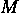。回想一下，它对应于将特征值  分配给  和特征值  分配给  的可观测量；也就是说，。

```py

import pennylane as qml 

state_0 = [[1], [0]] 

M = state_0 * np.conj(state_0).T

```

最后，我们可以导入 Matplotlib 并重用我们在上一章中定义的用于绘制训练和验证损失的函数：

```py

import matplotlib.pyplot as plt 

def plot_losses(history): 

    tr_loss = history.history["loss"] 

    val_loss = history.history["val_loss"] 

    epochs = np.array(range(len(tr_loss))) + 1 

    plt.plot(epochs, tr_loss, label = "Training loss") 

    plt.plot(epochs, val_loss, label = "Validation loss") 

    plt.xlabel("Epoch") 

    plt.legend() 

    plt.show()

```

那就是我们开始所需的所有内容。让我们开始我们的第一个问题。

## 11.2.2 二元分类问题

现在，我们已经准备好构建我们的第一个混合 QNN，并训练它来解决一个二元分类任务。当然，我们首先需要数据，正如我们在上一节中讨论的，我们将使用`make_classification`函数来生成它。使用将“结合经典编码与量子分类”的混合 QNN 是有意义的，如果我们数据集中有大量的变量（特征），因此我们将生成一个包含个变量的数据集——这已经对于当前的量子硬件来说可能相当大了！为了确保我们有足够的数据，我们将生成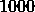个样本。这就是我们如何做到这一点的：

```py

x, y = make_classification(n_samples = 1000, n_features = 20)

```

默认情况下，`make_classification`函数生成具有两个可能类别的数据集。这正是我们想要的！

如同往常，我们必须将这个数据集分成一些训练集、验证集和测试集：

```py

x_tr, x_test, y_tr, y_test = train_test_split( 

    x, y, train_size = 0.8) 

x_val, x_test, y_val, y_test = train_test_split( 

    x_test, y_test, train_size = 0.5)

```

我们的数据已经准备好了，我们需要考虑我们将要使用的模型。让我们先构建网络末尾将包含的量子层（QNN）。

对于这个问题，我们将使用我们在上一章中介绍的两个局部变分形式（参见*图* *10.2*）。正如你肯定记得的，我们可以在 PennyLane 中如下实现它：

```py

def TwoLocal(nqubits, theta, reps = 1): 

    for r in range(reps): 

        for i in range(nqubits): 

            qml.RY(theta[r * nqubits + i], wires = i) 

        for i in range(nqubits - 1): 

            qml.CNOT(wires = [i, i + 1]) 

    for i in range(nqubits): 

        qml.RY(theta[reps * nqubits + i], wires = i)

```

我们将量子层视为一个简单的四比特 QNN，使用角度嵌入作为特征图，随后是刚刚实现的两个局部变分形式。QNN 中的测量操作将是计算第一个量子比特上的期望值；这对于二元分类器来说是一个合理的选择，因为它返回一个介于和之间的值。QNN 可以定义为如下：

```py

nqubits = 4 

dev = qml.device("lightning.qubit", wires = nqubits) 

@qml.qnode(dev, interface="tf", diff_method = "adjoint") 

def qnn(inputs, theta): 

    qml.AngleEmbedding(inputs, range(nqubits)) 

    TwoLocal(nqubits, theta, reps = 2) 

    return qml.expval(qml.Hermitian(M, wires = [0])) 

weights = {"theta": 12}

```

注意我们已经声明了权重字典，我们必须将其发送到 TensorFlow 接口以创建量子层。在其中，我们指定我们的变分形式使用 = 12")个权重。

我们将定义我们的混合 QNN，使其具有个输入，以匹配我们数据的维度。这将随后是一个经典层，紧接着是量子神经网络（量子层）。由于我们的 QNN 接受个输入，因此经典层本身也将有个神经元。此外，为了使 QNN 能够最优地工作，我们需要数据被归一化，因此经典层将使用 sigmoid 激活函数。我们可以在 Keras 中如下定义此模型：

```py

model = tf.keras.models.Sequential([ 

    tf.keras.layers.Input(20), 

    tf.keras.layers.Dense(4, activation = "sigmoid"), 

    qml.qnn.KerasLayer(qnn, weights, output_dim=1) 

])

```

要了解更多…

在定义 Keras 模型时，你可能倾向于将量子层存储在一个变量中，然后在模型定义中使用它，如下所示：

```py

qlayer = qml.qnn.KerasLayer(qnn, weights, output_dim=1) 

model = tf.keras.models.Sequential([ 

    tf.keras.layers.Input(20), 

    tf.keras.layers.Dense(4, activation = "sigmoid"), 

    qlayer 

])

```

这段代码将有效运行，并且从先验知识来看，它没有任何问题。然而，如果你决定重置或修改你的模型，你也将不得不重新运行第一行，即`qlayer`的定义，如果你想要重新初始化量子神经网络中的可优化参数（权重）！

模型准备就绪后，我们还可以定义我们常用的早期停止回调：

```py

earlystop = tf.keras.callbacks.EarlyStopping( 

    monitor="val_loss", patience=2, verbose=1, 

    restore_best_weights=True)

```

我们将耐心设置为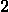个 epoch，以加快训练速度；有更高的耐心可能会轻易地带来更好的结果！

现在，我们训练模型所需做的只是——就像我们一直在 TensorFlow 上所做的那样——选择一个优化器，使用二元交叉熵损失函数编译我们的模型，并使用适当的参数调用`fit`方法：

```py

opt = tf.keras.optimizers.Adam(learning_rate = 0.005) 

model.compile(opt, loss=tf.keras.losses.BinaryCrossentropy()) 

history = model.fit(x_tr, y_tr, epochs = 50, shuffle = True, 

    validation_data = (x_val, y_val), 

    batch_size = 10, 

    callbacks = [earlystop])

```

Et voilà！只需几分钟，你那炫目的混合模型就会完成训练。花点时间反思一下这有多简单。你能够轻松地训练一个混合 QNN，就像它是一个简单的 QNN 一样。有了 PennyLane，量子机器学习变得易如反掌。

为了检查训练情况，我们可以使用我们的自定义函数绘制训练和验证损失：

```py

plot_losses(history)

```

生成的图表可以在*图* *11.1* 中找到。

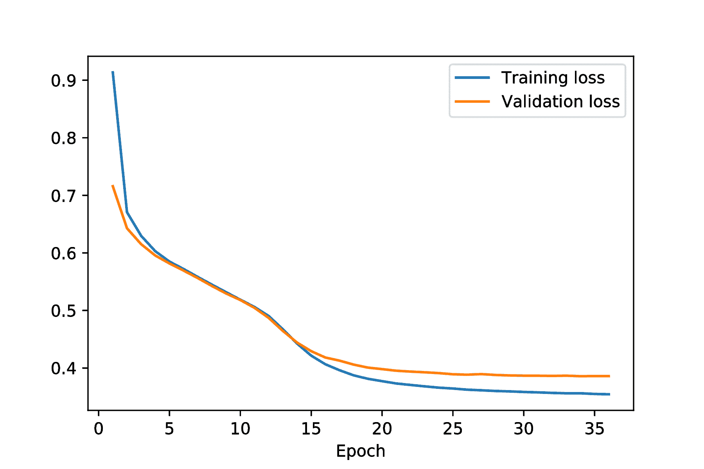

**图 11.1**：混合 QNN 二分类器训练中训练和验证损失函数的演变

这些损失看起来非常好；似乎没有过拟合的迹象，模型看起来正在学习。无论如何，让我们计算测试准确率。我们也可以计算训练和验证准确率，仅供参考：

```py

tr_acc = accuracy_score(model.predict(x_tr) >= 0.5, y_tr) 

val_acc = accuracy_score(model.predict(x_val) >= 0.5, y_val) 

test_acc = accuracy_score(model.predict(x_test) >= 0.5, y_test) 

print("Train accuracy:", tr_acc) 

print("Validation accuracy:", val_acc) 

print("Test accuracy:", test_acc)

```

在运行前面的代码时，我们可以看到我们的模型有的训练准确率，的验证准确率，以及的测试准确率。

这是一个非常令人满意的结果。我们刚刚训练了我们的第一个混合 QNN 二分类器，并看到了它如何有效地解决分类任务。

练习 11.1

尝试使用两个额外的（密集的）经典层解决这个问题，每个层有和个神经元。比较结果。

现在，我们说这一章将是一个动手实践，我们确实是这么想的。到目前为止，我们只是训练模型并在一次尝试中就得到了正确的结果，但在实践中这种情况很少发生。这就是为什么我们专门编写了一个小节，介绍如何在现实世界条件下优化模型。

## 11.2.3 在现实世界中训练模型

无论你是否相信，我们都关心你，亲爱的读者。在这段时间里，在每一个我们训练的模型背后，我们都投入了数小时细致的参数选择和模型准备——都是为了确保我们给出的结果足够好，如果不是最优的。

当您开始自己训练模型时，您很快就会发现自己期望的事情并不总是那么顺利。对于每个表现良好的模型，都会有成十甚至上百个被丢弃的模型。这是您需要做好准备的事情。

在一般机器学习项目的早期阶段——尤其是量子机器学习项目——您应该解决以下两个主要问题：

+   **您将如何记录所有结果？** 当您训练大量模型时，您需要找到一种方法来记录它们的性能以及它们的架构和训练中使用的参数。这样，您可以轻松地识别出哪些有效，哪些无效，并避免重复犯同样的错误。

+   **您将如何探索您模型的变体？** 当您不训练很多模型时，为每个模型保留一个单独的脚本可能是可管理的，但这并不是大规模项目的解决方案。通常，您想尝试广泛的配置，看看哪一个效果最好。而自动化在这方面确实可以让您的生活更轻松。

我们将第一个问题留给您。实际上，没有通用的方法来解决这个问题——它完全取决于手头的问题和您采取的训练策略。然而，关于第二个问题，我们确实有一些东西可以提供。

在训练模型时，选择良好的超参数——例如良好的批量大小或学习率——并不是一件容易的事情，但这是一件至关重要的任务。您应该使用较小的还是较大的学习率？您应该使用多少层？它们是什么类型的？决定，决定，决定！可能性的数量呈指数增长，因此不可能探索每一个。但在机器学习中，找到一个好的配置可能是成功与失败之间的区别。我们如何系统地（某种程度上）轻松地做到这一点呢？

现在市面上有很多软件包和实用工具可以帮助您自动化搜索最佳训练参数。其中最受欢迎的一个是 Optuna 软件包，我们即将演示它。请参阅*附录* *D*，*安装工具*，获取安装说明。

要了解更多...

在机器学习问题中自动搜索最佳训练参数的过程符合所谓的**自动化机器学习**，通常缩写为**AutoML**。这指的是使用自动化来解决机器学习问题。让机器负责训练其他机器！

一旦您安装了 Optuna，您可以按照以下方式导入它：

```py

import optuna

```

我们将使用 Optuna 在值 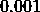 和 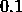 之间找到最佳的学习率。为了做到这一点，我们需要定义一个函数（我们将称之为 `objective`），它只有一个参数（`trial`）。目标函数应该使用我们想要优化的训练参数——我们将很快明确这一点——并且应该返回我们想要优化的任何指标。例如，在我们的情况下，我们希望最大化验证准确率，因此目标函数应该训练一个模型并返回验证准确率。

`objective` 函数的 `trial` 参数旨在表示 `optuna.trial` 模块中可以找到的 `Trial` 类的对象。我们将使用此对象在目标函数本身中定义我们想要优化的训练参数，同时指定它们的约束：我们是否希望它们是整数或浮点数，我们希望我们的值在哪个范围内，等等。

对于我们的情况，这是我们必须要定义的目标函数：

```py

def objective(trial): 

    # Define the learning rate as an optimizable parameter. 

    lrate = trial.suggest_float("learning_rate", 0.001, 0.1) 

    # Define the optimizer with the learning rate. 

    opt = tf.keras.optimizers.Adam(learning_rate = lrate) 

    # Prepare and compile the model. 

    model = tf.keras.models.Sequential([ 

        tf.keras.layers.Input(20), 

        tf.keras.layers.Dense(4, activation = "sigmoid"), 

        qml.qnn.KerasLayer(qnn, weights, output_dim=1) 

    ]) 

    model.compile(opt, loss=tf.keras.losses.BinaryCrossentropy()) 

    # Train it! 

    history = model.fit(x_tr, y_tr, epochs = 50, shuffle = True, 

        validation_data = (x_val, y_val), 

        batch_size = 10, 

        callbacks = [earlystop], 

        verbose = 0 # We want TensorFlow to be quiet. 

    ) 

    # Return the validation accuracy. 

    return accuracy_score(model.predict(x_val) >= 0.5, y_val)

```

注意我们是如何通过调用 `trial.suggest_float`(`"learning_rate"`，`0.001`，`0.1`) 方法将学习率定义为可优化参数的。一般来说，如果你想优化名为 `"parameter"` 的参数，以下适用：

+   如果参数的数据类型是浮点数，并且参数被限制在 `m` 和 `M` 之间，你应该调用 `suggest_float`(`"parameter"`，`m`，`M`) 方法。如果你只想让你的参数在 `m` 和 `M` 之间以步长 `s` 分隔的离散值中取值，你可以发送可选参数 `step` `=` `s`，默认值为 `None`（默认情况下，参数将取连续值）。

+   如果参数的数据类型是介于 `m` 和 `M` 之间的整数，你应该调用 `suggest_int`(`"parameter"`，`m`，`M`)。此外，如果参数的值应该从 `m` 到 `M` 以步长 `s` 分隔，你可以发送 `step` `=` `s`。

+   如果你的参数的值在可能的值列表 `values` 中，你应该调用 `suggest_categorical`(`"parameter"`，`values`)。例如，如果我们想在神经网络的层上尝试不同的激活函数，我们可以使用以下类似的方法：

    ```py

    activation = trial.suggest_categorical( 

        "activation_function", ["sigmoid", "elu", "relu"]).

    ```

当然，一个单一的目标函数可以有任意多的可优化参数。它们只是通过我们刚刚概述的方法的单独调用来定义的。

因此，这就是你可以创建一个目标函数并指定在其中要优化的参数的方法。现在，我们如何优化它们呢？第一步是使用 `create_study` 函数创建一个 `Study` 对象，就像下面这样：

```py

from optuna.samplers import TPESampler 

study = optuna.create_study(direction=’maximize’, 

    sampler=TPESampler(seed = seed))

```

在这里，我们指定了我们要创建一个研究来最大化某个目标函数，并使用带有种子的`TPESampler`。默认情况下，Optuna 会尝试最小化目标函数——这就是为什么我们必须传递那个参数。我们传递的采样器只是一个在优化过程中将寻找尝试值的对象。我们选择的是默认的采样器，但我们手动传递它，以便给它一个种子并得到可重复的结果。还有很多其他的采样器。最值得注意的是，`GridSampler`允许你尝试预定义的“搜索空间”中所有参数的组合。例如，我们可以使用以下采样器：

```py

values = {"learning_rate": [0.001, 0.003, 0.005, 0.008, 0.01]} 

sampler = optuna.samplers.GridSampler(values)

```

这将使 Optuna 尝试、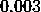、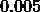、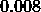和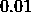——以及其他值。

如果你想了解更多关于这些采样器如何工作的信息，你可以查看它们的在线文档([`optuna.readthedocs.io/en/stable/reference/samplers/index.html`](https://optuna.readthedocs.io/en/stable/reference/samplers/index.html))。

在准备好`Study`对象后，我们只需要调用`optimize`方法，指定目标函数和我们将让 Optuna 运行的试验次数：

```py

study.optimize(objective, n_trials=6)

```

运行这个（可能需要一段时间），你将得到类似以下输出的结果：

```py

Trial 0 finished with value: 0.9 and parameters: 
    {’learning_rate’: 0.01996042558751034}. 
    Best is trial 0 with value: 0.9\. 

Trial 1 finished with value: 0.9 and parameters: 
    {’learning_rate’: 0.06258876833294336}. 
    Best is trial 0 with value: 0.9\. 

Trial 2 finished with value: 0.9 and parameters: 
    {’learning_rate’: 0.04433504616170433}. 
    Best is trial 0 with value: 0.9\. 

Trial 3 finished with value: 0.91 and parameters: 
    {’learning_rate’: 0.07875049978766316}. 
    Best is trial 3 with value: 0.91\. 

Trial 4 finished with value: 0.92 and parameters: 
    {’learning_rate’: 0.07821760500376156}. 
    Best is trial 4 with value: 0.92\. 

Trial 5 finished with value: 0.9 and parameters: 
    {’learning_rate’: 0.02798666792298152}. 
    Best is trial 4 with value: 0.92.

```

在我们考虑的参数变化中，我们没有看到性能上的任何显著差异。但是，至少我们学会了如何使用 Optuna！

练习 11.2

使用 Optuna 同时优化模型的学习率和批量大小。

最后一点，请注意，在目标函数中，我们使用了验证准确率而不是测试准确率。记住，测试数据集应该在已经选择了最佳模型之后才能使用。否则，其独立性会受到损害。例如，如果我们每次 Optuna 试验后都保存了模型，那么现在对我们来说，在试验 4 的模型上计算测试准确率是有意义的，以确保我们有一个低泛化误差。

练习 11.3

Optuna 可以在任何框架中使用，而不仅仅是 TensorFlow——它可以用来优化任何目的的任何参数！你只需要构建一个合适的目标函数。为了进一步说明这一点，使用 Optuna 找到函数 = {(x - 3)}^{2}")的最小值。

要了解更多...

在这几页中，我们还没有能够涵盖关于 Optuna 的所有知识。如果你想了解更多，你应该查看其在线文档。你可以在[`optuna.readthedocs.io/en/stable/index.html`](https://optuna.readthedocs.io/en/stable/index.html)找到它。

这是对如何在现实场景中训练（量子）机器学习模型的一个简要概述。在接下来的小节中，我们将走出我们的舒适区，使用 PennyLane 为我们解决一个新的问题：一个多分类任务。

## 11.2.4 多分类问题

这将是一个令人兴奋的小节，因为我们即将考虑一个可以应用我们的量子机器学习知识的新问题。然而，任何漫长的旅程都是从第一步开始的，我们的第一步将是重置 NumPy 和 TensorFlow 的种子，以便更容易实现可重复性：

```py

np.random.seed(seed) 

tf.random.set_seed(seed)

```

我们即将考虑一个多分类问题，当然，我们首先需要的是数据。我们熟悉的`make_classification`函数在这里可以帮助我们，我们可以给它一个可选参数`n_classes` `=` `3`，以便它生成一个包含个不同类别的数据集，这些类别将被标记为、和。然而，有一个问题。增加类别的数量意味着，根据函数的要求，我们还需要调整一些默认参数；通过将参数`n_clusters_per_class`设置为，我们可以达到一个有效的配置。因此，我们可以这样生成我们的三分类数据集：

```py

x, y = make_classification(n_samples = 1000, n_features = 20, 

    n_classes = 3, n_clusters_per_class = 1)

```

现在我们有了数据，是我们思考模型的时候了。我们正接近一种新的问题类型，因此我们需要回归基础。目前，让我们先忘记网络的混合组件，试着思考如何设计一个能够解决三分类问题的 QNN（量子神经网络）。

#### 多分类任务的一般视角

在这方面，看看这种问题是如何用经典神经网络处理的是有用的。我们知道，在解决二元分类问题时，我们考虑的是在最终层只有一个神经元且具有有界激活函数的神经网络；这样，我们根据输出是更接近还是来分配标签。这种做法在处理多个类别时，通常可能不太有效。

当处理类分类问题时，神经网络通常设计为在它们的最终层有个神经元——再次强调，使用有界激活函数，使得值介于和之间。那么，如何从这些神经元的输出中分配标签呢？很简单。每个神经元都与一个标签相关联，所以我们只需分配输出最高的神经元的标签。直观地，你可以将这些个最终层的神经元看作是灯泡——其亮度由其输出决定——表示输入属于某个类别的可能性。我们最终所做的只是分配最亮的灯泡对应的类别！

将这个想法应用到量子神经网络中很容易。我们不是在第一个量子比特上取可观测量的期望值，而是返回一个包含期望值数组的值，这些期望值是在第一个个量子比特上的可观测量——为每个量子比特分配一个标签。这真是太简单了。

要了解更多...

在处理多类问题中构建分类器有其他方法。例如，两种流行的方法是**一对多**和**一对一**方法。它们涉及训练多个二元分类器并合并它们的结果。如果你对此好奇，请查看 Geron 的书籍的第三章[104]。

这样就解决了设计一个能够处理我们任务的 QNN 的问题，但我们仍然有一个遗留问题：我们还没有为这类问题找到一个合适的损失函数。在二元分类中，我们可以依赖二元交叉熵函数，但它不适用于多类别问题。幸运的是，有一个泛化二元交叉熵的损失函数。请允许我们向您介绍**分类交叉熵**损失函数。

让我们考虑一个任意的神经网络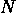，对于任何参数的选择和任何输入，它返回一个包含个条目的数组")，所有条目都在和之间。类别交叉熵损失函数依赖于神经网络的参数、输入和目标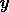，但有一个重要的细微差别：损失函数期望目标以**独热****形式**出现。这意味着不应该是一个表示标签的数字 ()。相反，它应该是一个包含个条目的向量（数组），其中所有条目都设置为，除了标签位置的条目，应该设置为。因此，我们不会得到，而是得到"),或者，我们不会得到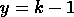，而是得到"),等等。在这些假设下，类别交叉熵被定义为如下：

 = - \sum\limits_{j = 1}^{k}y_{j}{\log}(N_{\theta}(x)_{j}).")

当然，我们在和")中使用了下标来表示它们的-th 条目。注意，在这个定义中，我们隐含地假设了最终层的第一个神经元与标签相关联，第二个神经元与相关联，以此类推。

练习 11.4

证明二元交叉熵损失是类别交叉熵损失的一个特殊情况，当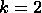时。

当然，类别交叉熵函数是多类分类的一个合理的损失函数，并且它与二元交叉熵损失函数共享一些良好的性质。例如，如果一个分类器完全正确地得到了输出（它将分配给正确的输出，将分配给其余部分），那么它的值就是零，但如果分类器将分配给错误的输出，将分配给其余部分，那么它就会发散。

到目前为止，我们已经知道如何实现我们的 QNN，并且我们有一个损失函数，所以我们只需要最终确定我们架构的细节。关于量子层，我们已经知道我们将使用哪个可观察量，所以这不是问题。对于特征图，我们将依赖角度编码，对于可变形式，我们将使用双局部可变形式。为了保持一定的效率，我们将我们的 QNN 设置为四个量子位，并将混合架构的其他部分保持与上一小节相同。

现在已经足够进行抽象思考了；让我们转向代码。并且做好准备，因为接下来事情可能会变得很热。

#### 实现一个用于三分类问题的 QNN

根据我们的计划，我们首先需要做的事情是将我们的目标数组`y`编码为 one-hot 形式。

练习 11.5

存在一种分类交叉熵损失的变体，它不需要目标以 one-hot 形式存在。这就是**稀疏** **分类交叉熵损失**。尝试使用这个损失函数和未编码的目标来复制以下内容。你可以通过`tf.keras.losses.SparseCategoricalCrossentropy`来访问它。

我们可以自己实现一个 one-hot 编码器，但没必要。scikit-learn 包——再次拯救我们！——已经实现了一个`OneHotEncoder`类，你可以从`sklearn.preprocessing`导入它。你可以像使用其他熟悉的 scikit-learn 类一样使用这个类，例如`MaxAbsScaler`。

为了对目标数组进行 one-hot 编码，你需要一个`OneHotEncoder`对象，你只需要将数组传递给`fit_transform`方法。但是有一个限制：数组应该是一个列向量！我们的目标数组`y`是一维的，所以我们必须在将其传递给`fit_transform`方法之前对其进行重塑。因此，这就是我们如何将目标数组编码为 one-hot 形式的方法：

```py

from sklearn.preprocessing import OneHotEncoder 

hot = OneHotEncoder(sparse = False) 

y_hot = hot.fit_transform(y.reshape(-1,1))

```

注意我们添加了`sparse = False`参数。这个默认为`True`的布尔值决定了编码器是否应该返回稀疏矩阵。稀疏矩阵是一种数据类型，当存储具有许多零的矩阵（如 one-hot 编码数组）时，可以非常节省内存。本质上，稀疏矩阵只跟踪矩阵中的非零条目，而不是记录矩阵中每个条目的值。当处理非常大的矩阵时，它可以节省大量的内存，但遗憾的是，使用稀疏矩阵会导致训练中出现问题，因此我们需要我们的 one-hot 编码器给我们一个普通数组。

要了解更多...

`OneHotEncoder` 类的巧妙之处在于，一旦我们使用 `fit_transform` 对每个类别的代表进行编码后，我们就可以在任意目标数组上使用 `transform` 方法。在我们的例子中，`hot` 对象将记住我们的数据集中有  个类别，因此 `hot` 的 `transform` 方法将正确地编码任何目标：即使它接收到的输入除了零以外什么都没有，它仍然会将它们编码为长度为  的数组。

我们对我们的数据不再需要做任何事情，因此现在我们可以将其分成一些训练、验证和测试数据集：

```py

x_tr, x_test, y_tr, y_test = train_test_split( 

    x, y_hot, train_size = 0.8) 

x_val, x_test, y_val, y_test = train_test_split( 

    x_test, y_test, train_size = 0.5)

```

现在，我们可以实现构成我们模型量子层的 QNN。实际上，这个量子神经网络没有什么特别之处，除了它将返回一个值数组而不是单个值。根据我们之前的规格，我们可以定义它如下：

```py

nqubits = 4 

dev = qml.device("lightning.qubit", wires = nqubits) 

@qml.qnode(dev, interface="tf", diff_method = "adjoint") 

def qnn(inputs, theta): 

    qml.AngleEmbedding(inputs, range(nqubits)) 

    TwoLocal(nqubits, theta, reps = 2) 

    return [qml.expval(qml.Hermitian(M, wires = [0])), 

            qml.expval(qml.Hermitian(M, wires = [1])), 

            qml.expval(qml.Hermitian(M, wires = [2]))] 

weights = {"theta": 12}

```

代码相当直观。请注意，像往常一样，我们有机会定义一个权重字典，这个字典将在量子 Keras 层的定义中使用。在这种情况下，我们将使用  权重，正如我们在 *子节* * *11.2.2* 中的模型一样，因为我们使用的是相同的变分形式和相同数量的量子比特和重复次数。

*随着我们的 QNN 准备就绪，我们可以定义混合 QNN 的 Keras 模型。这就像我们在前面的子节中做的那样，但有一些重要的区别——不要那么快复制粘贴！首先，在这种情况下，我们需要将量子层的输出维度设置为三个，而不是一个。更重要的是，我们需要在 QNN 输出上添加一个额外的激活函数。

离散交叉熵损失函数期望概率分布。原则上，它假设第  个神经元的输出是输入属于类别  的概率。因此，模型输出的数据应该是归一化的：它应该加起来等于 。然而，从先验的角度来看，我们无法保证我们的 QNN 将返回一些归一化的输出。为了确保这一点，我们可以使用 **softmax** 激活函数，其定义如下

|  = \frac{1}{\sum\limits_{j = 1}^{n}e^{x_{j}}}(e^{x_{1}},\ldots,e^{x_{n}}).") |
| --- |

很容易验证  是一个由  和  界定的向量，其分量之和为 ，因此是一个概率分布。

除了这些修改之外，我们还将添加一个额外的经典层，包含  个神经元：

```py

model = tf.keras.models.Sequential([ 

    tf.keras.layers.Input(20), 

    tf.keras.layers.Dense(8, activation = "elu"), 

    tf.keras.layers.Dense(4, activation = "sigmoid"), 

    qml.qnn.KerasLayer(qnn, weights, output_dim = 3), 

    tf.keras.layers.Activation(activation = "softmax") 

])

```

我们现在可以使用 Adam 优化器和分类交叉熵损失来编译我们的模型，并在`fit`方法之前对其进行训练；这里没有什么特别激动人心的地方。有趣的事实是，如果你足够健忘，告诉 TensorFlow 使用二元交叉熵损失而不是分类交叉熵损失，它仍然会使用分类交叉熵损失（不要看我们；我们不是从经验中说的，对吧？）。这是 TensorFlow 背后的人们的相当好和周到的一个特性。

```py

opt = tf.keras.optimizers.Adam(learning_rate = 0.001) 

model.compile(opt, loss=tf.keras.losses.CategoricalCrossentropy()) 

history = model.fit(x_tr, y_tr, epochs = 50, shuffle = True, 

    validation_data = (x_val, y_val), 

    batch_size = 10, 

    callbacks = [earlystop])

```

经过几分钟的训练，我们可能会得到以下指令下训练和验证损失演变的图表：

```py

plot_losses(history)

```

结果图表可以在*图* *11.2* 中找到，它显示了损失函数的演变。

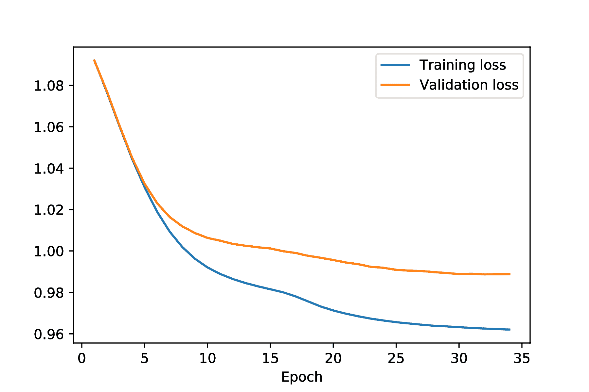

**图 11.2**：混合 QNN 多类分类器训练中训练和验证损失函数的演变

我们现在可以计算我们新训练的模型的训练、验证和测试准确率，但为了做到这一点，`accuracy_score`函数需要预测和实际标签以数字形式表示，而不是以 one-hot 形式作为数组进行编码。因此，我们需要撤销 one-hot 编码。为此，我们可以使用`argmax`方法，它返回数组中最大值的条目，并且可以提供一个可选的`axis`参数，以便它只在一个轴上应用。因此，我们可以按以下方式计算准确率得分：

```py

tr_acc = accuracy_score( 

    model.predict(x_tr).argmax(axis = 1), 

    y_tr.argmax(axis = 1)) 

val_acc = accuracy_score( 

    model.predict(x_val).argmax(axis = 1), 

    y_val.argmax(axis = 1)) 

test_acc = accuracy_score( 

    model.predict(x_test).argmax(axis = 1), 

    y_test.argmax(axis = 1)) 

print("Train accuracy:", tr_acc) 

print("Validation accuracy:", val_acc) 

print("Test accuracy:", test_acc)

```

这将返回以下训练准确率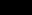，验证准确率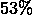，以及测试准确率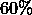。请注意，与训练数据集相比，验证数据集上的低准确率似乎表明存在过拟合问题。这可能可以通过使用更大的训练数据集来修复；当然，这会导致更长的训练时间。

练习 11.6

为了进一步跳出我们的“分类器舒适区”，尝试实现一个能够进行回归的混合模型。这个模型应该在一些具有输入和目标值的数据上训练，对于这些数据存在一个连续函数")，使得 ≈ y")（例如，您可以使用 scikit-learn 的`make_regression`方法创建这样的数据集）。该模型应该尝试学习数据集中所有点的函数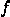。

您可以使用一些经典层设计这个模型，然后是一个我们考虑过的量子层，最后是一个没有激活函数且只有一个神经元的经典层。您应该使用均方误差损失对其进行训练。

这就结束了我们在 PennyLane 中对混合架构的研究。是时候我们转向 Qiskit 了，这将是一次非常不同的冒险！

# 11.3 Qiskit 中的混合架构

在上一节中，我们讨论了如何使用 PennyLane 和我们已知的机器学习框架 TensorFlow 来实现和训练混合量子神经网络。我们将在本节中研究如何在 Qiskit 中使用这些混合架构，在这个任务中，我们将面临一个新的挑战。

无论好坏，截至撰写本文时，Qiskit 没有内置的 TensorFlow 接口。它只支持一个不同的机器学习框架：PyTorch。因此，如果我们想在 Qiskit 上运行那些混合神经网络，我们最好学习一些关于 PyTorch 的知识。尽管这项任务可能看起来很艰巨，但它不会那么麻烦，而且将来会带来巨大的回报——是的，未来就是我们的下一章关于 QGANs。

重要提示

我们将使用 **版本 1.13** 的 PyTorch 包。如果您使用的是不同版本，事情可能会有所不同！

PyTorch 有什么特别之处，值得我们花时间在这短短的一节之外去了解？来看看吧。

## 11.3.1 欢迎来到 PyTorch！

到目前为止，我们一直在使用 TensorFlow。根据我们的经验，这个框架为各种基于网络的模型的实现和训练提供了一个非常简单和流畅的体验。然而，在这所有易用性背后，有一个小小的陷阱。在这本书中，我们并没有使用“纯 TensorFlow”，而是严重依赖 Keras。尽管 Keras 已经完全集成到 TensorFlow 中，但它是一个创建了一些额外的抽象层以简化 TensorFlow 中神经网络模型处理的组件。在这段时间里，Keras 一直在幕后为我们处理很多事情。

在撰写本文时，有两个非常流行的机器学习框架：TensorFlow 和 PyTorch。前者我们已经很熟悉了，后者我们很快就会了解。与 TensorFlow 不同，PyTorch 并没有自带 Keras（尽管有一些第三方包提供了类似的功能）。在 PyTorch 中，我们将不得不自己处理许多细节。这很好。当然，学习如何使用 PyTorch 将需要我们付出一点额外的努力，但 PyTorch 将为我们提供 TensorFlow 的 Keras 简单无法达到的灵活性。那么，让我们开始吧。

我们将使用 PyTorch 包的 1.13 版本。请参阅 *附录* *D*，*安装工具*，了解如何安装它。

如同往常，我们将从导入 NumPy 和 scikit-learn 的一些实用工具开始。我们还将为 NumPy 设置一个种子：

```py

import numpy as np 

from sklearn.metrics import accuracy_score 

from sklearn.model_selection import train_test_split 

from sklearn.datasets import make_classification 

seed = 1234 

np.random.seed(seed)

```

在完成这些导入之后，我们可以进入我们的主要内容。这是如何导入 PyTorch 并为其设置一个种子以确保可重复性的方法：

```py

import torch 

torch.manual_seed(seed)

```

与模型实现相关的多数功能都在 `torch.nn` 模块中，而大多数激活函数可以在 `torch.nn.functional` 模块中找到，所以让我们也导入这些模块：

```py

import torch.nn as nn 

import torch.nn.functional as F

```

这些就是我们现在需要的所有导入。

### 在 PyTorch 中设置模型

为了理解 PyTorch 包的工作原理，我们将实现并训练一个简单的二分类器作为（经典的）神经网络。这个神经网络将接受  个输入，并返回一个介于  和  之间的唯一输出。像往常一样，两个可能的标签将是  和 ，输出标签将根据网络输出更接近  还是  来决定。

让我们看看我们如何实现这个神经网络分类器。在 PyTorch 中，模型架构被定义为 `nn.Module` 类的子类，而单个模型是这些子类的对象。在定义 `nn.Module` 的子类时，你应该实现一个初始化器，该初始化器首先调用父类的初始化器，然后准备模型架构的所有变量；例如，所有的网络层都应该在这里初始化。此外，你需要提供一个 `forward` 方法来定义网络的行为：这个方法应该接受网络输入的任何参数，并返回其输出。

我们希望实现的神经网络可以如下实现（别担心，我们马上就会讨论这段代码）：

```py

class TorchClassifier(nn.Module): 

    def __init__(self): 

        # Initialize super class. 

        super(TorchClassifier, self).__init__() 

        # Declare the layers that we will use. 

        self.layer1 = nn.Linear(16, 8) 

        self.layer2 = nn.Linear(8, 4) 

        self.layer3 = nn.Linear(4, 2) 

        self.layer4 = nn.Linear(2, 1) 

    # Define the transformation of an input. 

    def forward(self, x): 

        x = F.elu(self.layer1(x)) 

        x = F.elu(self.layer2(x)) 

        x = F.elu(self.layer3(x)) 

        x = torch.sigmoid(self.layer4(x)) 

        return x

```

在这个实现中，有几个要点需要消化。让我们首先看看初始化器。正如预期的那样，我们正在定义一个 `nn.Module` 的子类，并且我们首先调用了父类的初始化器；到目前为止，一切顺利。然后我们定义了看起来像是神经网络层的部分，这就是可能出现混淆的地方。我们第一个问题来自于术语：“线性层”是 PyTorch 对 Keras “密集”层的等效，这不是什么大问题。但接着我们遇到了更深层次的问题。回到我们使用 Keras 的日子，我们通过指定神经网络的神经元数量及其激活函数来定义网络层。但在这里，我们找不到激活函数的痕迹，而且层接受看起来像是二维的参数。这是怎么回事？

在神经网络中，你有一堆排列成数组的神经元，这些数组通过它们之间的某些“线性连接”相互连接。此外，每个神经元数组都有一个（通常是非线性）激活函数。在 Keras 中，层与这些神经元数组本身（及其激活函数）以及它们之前的“线性连接”相关联。另一方面，在 PyTorch 中，当我们提到层时，我们只指的是这些神经元数组之间的线性连接。因此，`nn``.``Linear``(16,` `8)` 仅仅是  个神经元数组与  个神经元数组之间的线性连接——包括其权重和偏差。当我们查看 `forward` 方法时，这会更有意义。

`forward` 方法定义了任何输入进入网络后会发生什么。在其实现中，我们可以看到任何输入，它将是一个长度为  的 PyTorch 张量，如何通过第一层。这一层是  个神经元数组与  个神经元数组之间的“线性连接”；它有自己的权重 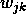 和偏差 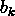，并且对于任何输入 ")，它返回一个向量 ")，其

|  |
| --- |

然后，结果张量中的每个条目都会通过 ELU 激活函数。其余的代码是自我解释的，它只是简单地定义了一个符合我们规格的神经网络。

要了解更多…

PyTorch 中的层定义它们自己的权重和偏差。如果您希望移除偏差——将其设置为永远为零——您可以在初始化层时发送可选参数 `bias` `=` `False`。

现在我们已经定义了模型架构，我们可以通过初始化 `TorchClassifier` 类的对象来将其实例化为一个单独的模型。顺便说一句，PyTorch 模型的一个优点是它们可以被打印；它们的输出会给你一个不同模型组件的概述。让我们创建我们的模型对象并看看这个动作：

```py

model = TorchClassifier() 

print(model)

```

运行此代码后，我们从打印指令中得到了以下输出：

```py

TorchClassifier( 
  (layer1): Linear(in_features=16, out_features=8, bias=True) 
  (layer2): Linear(in_features=8, out_features=4, bias=True) 
  (layer3): Linear(in_features=4, out_features=2, bias=True) 
  (layer4): Linear(in_features=2, out_features=1, bias=True) 
)

```

这与我们在 Keras 中可以打印的模型摘要有些类似。

默认情况下，模型的权重和偏差是随机的，因此我们新创建的 `model` 应该已经准备好使用。让我们试试看！`torch``.``rand` 函数可以创建任何指定大小的随机张量。我们将使用它来向我们的模型提供一些随机数据，看看它是否工作：

```py

model(torch.rand(16))

```

这是我们的输出：

```py

tensor([0.4240], grad_fn=<SigmoidBackward0>)

```

就这样！正如预期的那样，我们的模型返回的值在和之间。顺便说一下，注意输出中的一个细节：在张量值旁边，有一个`grad_fn`值，它以某种方式记得这个输出是最后通过应用 sigmoid 函数获得的。有趣，不是吗？好吧，你可能记得 TensorFlow 使用它自己的张量数据类型，PyTorch 也有它自己的张量。它们酷的地方在于，每个 PyTorch 张量都会跟踪它是如何计算的，以便通过反向传播启用梯度计算。我们将在本小节稍后进一步讨论这一点。

无论如何，现在我们的网络已经全部设置好了，让我们生成一些数据，并将其分成一些训练、验证和测试数据集：

```py

x, y = make_classification(n_samples = 1000, n_features = 16) 

x_tr, x_test, y_tr, y_test = train_test_split( 

    x, y, train_size = 0.8) 

x_val, x_test, y_val, y_test = train_test_split( 

    x_test, y_test, train_size = 0.5)

```

### 在 PyTorch 中训练模型

在原则上，我们可以像在 TensorFlow 中那样处理这些原始数据——也许将其转换为 PyTorch 张量，但仍然如此。然而，我们知道 PyTorch 将需要我们亲自处理许多事情；其中之一就是，如果我们想的话，将我们的数据分成批次。自己来做这件事至少是繁琐的。幸运的是，PyTorch 提供了一些工具，可以帮助我们在过程中，所以我们最好给他们一个机会。

在 PyTorch 中处理数据集的最佳方式是将数据存储在`Dataset`类的子类中，该类位于`torch.utils.data`模块中。任何`Dataset`的子类都应该实现一个初始化器，一个`__getitem__`方法（通过索引访问数据项），以及一个`__len__`方法（返回数据集中的项目数量）。为了我们的目的，我们可以创建一个子类，以便从我们的 NumPy 数组中创建数据集：

```py

from torch.utils.data import Dataset 

class NumpyDataset(Dataset): 

    def __init__(self, x, y): 

        if (x.shape[0] != y.shape[0]): 

            raise Exception("Incompatible arrays") 

        y = y.reshape(-1,1) 

        self.x = torch.from_numpy(x).to(torch.float) 

        self.y = torch.from_numpy(y).to(torch.float) 

    def __getitem__(self, i): 

        return self.x[i], self.y[i] 

    def __len__(self): 

        return self.y.shape[0]

```

注意我们如何添加了一些尺寸检查，以确保数据数组和标签向量具有匹配的维度，以及我们如何重塑目标数组——这是为了避免与损失函数的问题，它们期望它们是列向量。有了这个类，我们可以创建训练、验证和测试数据集的数据集对象，如下所示：

```py

tr_data = NumpyDataset(x_tr, y_tr) 

val_data = NumpyDataset(x_val, y_val) 

test_data = NumpyDataset(x_test, y_test)

```

为了检查我们的实现是否成功，让我们尝试访问`tr_data`中的第一个元素，并获取训练数据集的长度：

```py

print(tr_data[0]) 

print("Length:", len(tr_data))

```

这是这些指令返回的输出：

```py

(tensor([ 1.4791,  1.4646,  0.0430,  0.0409, -0.3792, -0.5357, 
          0.9736, -1.3697, -1.2596,  1.5159, -0.9276,  0.6868, 
          0.5138,  0.4751,  1.0193, -1.7873]), 
tensor([0.])) 

Length: 800

```

我们可以看到，它确实给了我们一个长度为的张量及其对应的标签的元组。此外，调用`len`函数确实返回了我们数据集中的正确项目数。现在，你可能会合理地想知道为什么我们要费心创建数据集类。有几个原因。首先，这允许我们以更有序的方式组织和结构化我们的数据。更重要的是，使用数据集对象，我们可以创建数据加载器。`DataLoader`类可以从`torch.utils.data`导入，并且它的对象允许我们轻松地遍历数据批次。一个例子可能有助于澄清这一点。

假设我们想要以个批次迭代训练数据集。我们只需创建一个数据加载器，指定`tr_data`数据集的批次大小以及我们希望它打乱数据的事实。然后，我们可以使用`iter`函数从数据加载器中创建一个迭代器对象，并遍历所有批次。这在上面的代码片段中有所展示：

```py

from torch.utils.data import DataLoader 

tr_loader = iter(DataLoader( 

    tr_data, batch_size = 2, shuffle = True)) 

print(next(tr_loader))

```

你可能还记得，从 Python 101 中，第一次调用`next(``tr_loader``)`将与运行一个`for` `x` `in` `tr_loader`循环并提取第一次迭代的`x`值等价。这是我们得到的结果：

```py

[tensor([[-1.2835, -0.4155,  0.4518,  0.6778, -1.3869, -0.4262, -0.1016, 
           1.4012, -0.9625,  1.0038,  0.3946,  0.1961, -0.7455,  0.4267, 
           -0.8352,  0.9295], 
          [-1.4578, -0.4947, -1.1755, -0.4800, -0.3247,  0.7821, -0.0078, 
           -0.5397, -1.0385, -1.3466,  0.4591,  0.5761,  0.2188, -0.1447, 
           0.3534,  0.5055]]), 
 tensor([[0.], 
         [0.]])]

```

看到这里！在数据加载器的每个迭代中，我们得到一个包含批次中训练数据的数组及其对应的标签数组。所有这些都会由 PyTorch 自动打乱和处理。这不是很酷吗？这可以并且将会节省我们大量的精力。

我们必须说，实际上，你可以技术上使用数据加载器而无需经过定义数据集的全过程——只需发送 numpy 数组即可。但这并不是最“PyTorch”的做法。无论如何，这解决了我们准备数据集的工作。

在训练过程中，我们将像往常一样使用二元交叉熵损失。我们可以将其函数保存在一个变量中，如下所示：

```py

get_loss = F.binary_cross_entropy

```

因此，`get_loss`函数将接受一个介于和之间的值张量以及一个匹配的标签张量，并使用它们来计算二元交叉熵损失。为了看看它是否按预期工作，我们可以计算一个简单的损失：

```py

print(get_loss(torch.tensor([1.]), torch.tensor([1.])))

```

由于张量中的唯一值与预期值匹配，我们应该得到的损失，并且确实，这条指令返回了`tensor`。

`(0.)`。

我们已经在为训练做准备。在我们的情况下，由于我们的数据集有个元素，使用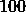个批次大小是有意义的，因此让我们为这个目的准备训练数据加载器：

```py

tr_loader = DataLoader(tr_data, batch_size = 100, shuffle = True)

```

如同往常，我们将依赖 Adam 优化器进行训练。优化器在 `torch``.``optim` 模块中实现为一个类，为了使用它，我们需要指定它将要优化的参数；在我们的情况下，那将是模型中的参数，我们可以通过 `parameters` 方法检索它们。此外，我们可以通过传递可选参数（如学习率等可调整参数）来进一步配置优化器。我们将使用学习率  并信任剩余参数的默认值。因此，我们可以定义我们的优化器如下：

```py

opt = torch.optim.Adam(model.parameters(), lr = 0.005)

```

现在我们已经准备好了所有必要的材料，我们可以最终进行训练本身。在 Keras 中，这就像调用一个带有许多参数的方法一样简单，但在这里我们必须自己处理训练！我们将首先定义一个函数，它将执行一个完整的训练周期。它将是以下内容：

```py

def run_epoch(opt, tr_loader): 

    # Iterate through the batches. 

    for data in iter(tr_loader): 

        x, y = data # Get the data in the batch. 

        opt.zero_grad() # Reset the gradients. 

        # Compute gradients. 

        loss = get_loss(model(x), y) 

        loss.backward() 

        opt.step() # Update the weights. 

    return get_loss(model(tr_data.x), tr_data.y)

```

代码基本上是自我解释的，但有一些细节需要澄清。我们使用了两种新的方法：`backward` 和 `step`。简单来说，`backward` 方法在 `loss` 上通过回溯其计算过程并保存依赖于该损失的模型的可优化参数的偏导数来计算损失的梯度。这就是我们在 *第* *8* *章* **8*，*什么是量子机器学习？* *中讨论的著名反向传播技术。然后，`opt``.``step``()` 提示优化器使用 `loss``.``backward``()` 计算的导数来更新可优化参数。*

*要了解更多信息...

如果你对 PyTorch 张量上的 `backward` 方法如何进行微分感兴趣，我们可以运行一个快速示例来演示。我们可能定义两个变量，`a` 和 `b`，分别取值  和 ，如下所示：

```py

a = torch.tensor([2.], requires_grad = True) 

b = torch.tensor([3.], requires_grad = True)

```

注意我们如何设置 `requires_grad` `=` `True` 来告诉 PyTorch 这些是它应该跟踪的变量。然后我们可以定义函数  = a^{2} + b") 并计算其梯度如下：

```py

f = a**2 + b 

f.backward()

```

我们知道 a^{2} + b = 2a \right.")，在我们的情况下等于 。当我们运行 `backward` 方法时，PyTorch 已经为我们计算了这个偏导数，我们可以通过调用 `a``.``grad` 来访问它，正如预期的那样，它返回 `tensor``([4.])`。类似地，，并且正如预期的那样，`b``.``grad` 返回 `tensor` `([1.])`。

从原则上讲，我们可以通过手动多次调用 `run_epoch` 来训练我们的模型，但为什么要在那种情况下受苦，当我们可以让 Python 负责的时候呢？

让我们定义一个训练循环，在每次迭代中，我们将运行一个 epoch 并记录整个数据集上获得的训练和验证损失。而不是固定一个特定的 epoch 数，我们将继续迭代，直到验证损失增加——这将是我们在 TensorFlow 中使用的早期停止回调的版本。以下代码块完成了这项工作：

```py

tr_losses = [] 

val_losses = [] 

while (len(val_losses) < 2 or val_losses[-1] < val_losses[-2]): 

    print("EPOCH", len(tr_losses) + 1, end = " ") 

    tr_losses.append(float(run_epoch(opt, tr_loader))) 

    # ^^ Remember that run_epoch returns the training loss. 

    val_losses.append(float( 

        get_loss(model(val_data.x), val_data.y))) 

    print("| Train loss:", round(tr_losses[-1], 4), end = " ") 

    print("| Valid loss:", round(val_losses[-1], 4))

```

注意，当在`tr_losses`中记录损失时，我们已经将 PyTorch 张量转换为浮点数。这是执行此循环后得到的输出：

```py

EPOCH 1 | Train loss: 0.6727 | Valid loss: 0.6527 
EPOCH 2 | Train loss: 0.638 | Valid loss: 0.6315 
EPOCH 3 | Train loss: 0.5861 | Valid loss: 0.5929 
EPOCH 4 | Train loss: 0.5129 | Valid loss: 0.5277 
EPOCH 5 | Train loss: 0.4244 | Valid loss: 0.4428 
EPOCH 6 | Train loss: 0.3382 | Valid loss: 0.3633 
EPOCH 7 | Train loss: 0.2673 | Valid loss: 0.3024 
EPOCH 8 | Train loss: 0.2198 | Valid loss: 0.2734 
EPOCH 9 | Train loss: 0.1938 | Valid loss: 0.2622 
EPOCH 10 | Train loss: 0.1819 | Valid loss: 0.2616 
EPOCH 11 | Train loss: 0.1769 | Valid loss: 0.2687

```

一图胜千言，为了对训练性能有一个直观的了解，让我们重新使用为 TensorFlow 准备的`plot_losses`函数并运行它：

```py

import matplotlib.pyplot as plt 

def plot_losses(tr_loss, val_loss): 

    epochs = np.array(range(len(tr_loss))) + 1 

    plt.plot(epochs, tr_loss, label = "Training loss") 

    plt.plot(epochs, val_loss, label = "Validation loss") 

    plt.xlabel("Epoch") 

    plt.legend() 

    plt.show() 

plot_losses(tr_losses, val_losses)

```

结果图可以在*图* *11.3*中找到。该图确实显示出一些过拟合的迹象，但可能不是需要担心的问题；无论如何，让我们等到我们在测试数据集上获得准确性后再说。

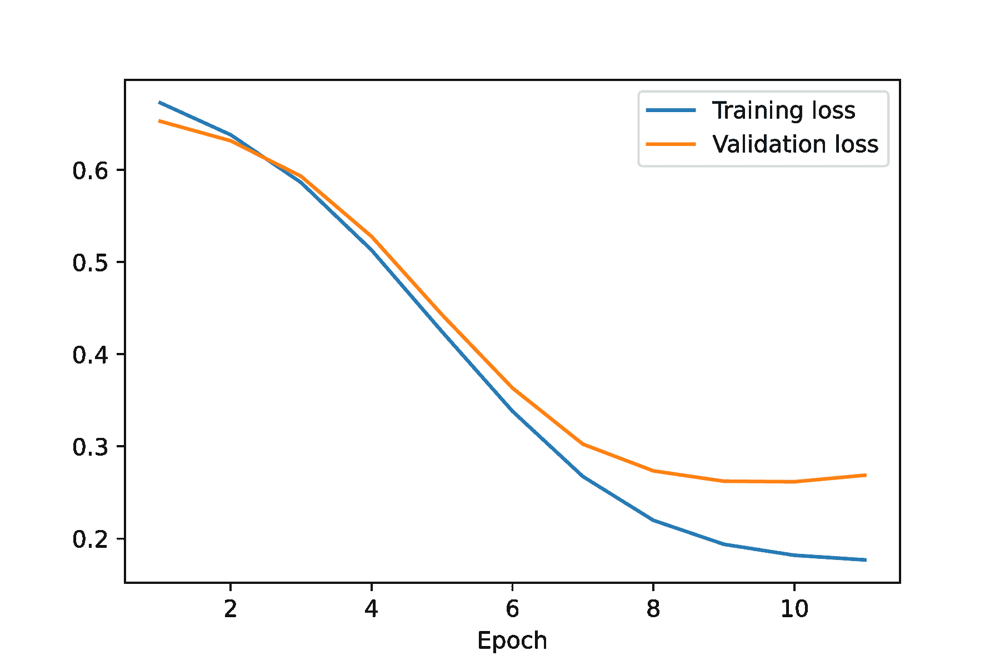

**图 11.3**：使用 PyTorch 训练经典二分类器的训练和验证损失演变

为了获取我们的分类器在训练、验证和测试数据集上的准确性，我们可以运行以下指令：

```py

train_acc = accuracy_score( 

    (model(tr_data.x) >= 0.5).to(float), tr_data.y) 

val_acc = accuracy_score( 

    (model(val_data.x) >= 0.5).to(float), val_data.y) 

test_acc = accuracy_score( 

    (model(test_data.x) >= 0.5).to(float), test_data.y) 

print("Training accuracy:", train_acc) 

print("Validation accuracy:", val_acc) 

print("Test accuracy:", test_acc)

```

这返回了 94%的训练准确性，92%的验证准确性和 96%的测试准确性。

我们刚刚结束了关于 PyTorch 的简短介绍。让我们进入量子领域！

## 11.3.2 使用 Qiskit 构建混合二分类器

在本小节中，我们将实现我们的第一个混合 QNN，使用 Qiskit。这个过程将相当直接，我们将能够依赖我们已有的大量代码。为了开始，让我们导入 Qiskit 包以及它附带捆绑的 ZZ 特征图和双局部变分形式：

```py

from qiskit import * 

from qiskit.circuit.library import ZZFeatureMap, TwoLocal

```

使用 QNN 时，为了使训练时间在我们的模拟器上合理，建议使用较小的数据集。我们可以按照以下方式准备它们，以及相应的数据集和数据加载器对象：

```py

x, y = make_classification(n_samples = 500, n_features = 16) 

x_tr, x_test, y_tr, y_test = train_test_split(x, y, train_size = 0.8) 

x_val, x_test, y_val, y_test = train_test_split(x_test, y_test, train_size = 0.5) 

tr_data = NumpyDataset(x_tr, y_tr) 

val_data = NumpyDataset(x_val, y_val) 

test_data = NumpyDataset(x_test, y_test) 

tr_loader = DataLoader(tr_data, batch_size = 20, shuffle = True)

```

我们量子层将是一个简单的-比特 QNN，包含一个 ZZ 特征图实例和双局部变分形式。因此，我们将在 QNN 电路中使用的组件如下：

```py

zzfm = ZZFeatureMap(2) 

twolocal = TwoLocal(2, [’ry’,’rz’], ’cz’, ’linear’, reps = 1)

```

在这里，我们实例化了与*第* *10* *章* *量子* *神经网络*中相同的双局部形式。

此外，就像我们在上一章中做的那样，我们可以使用`TwoLayerQNN`类来生成符合我们规格的量子神经网络。我们可以按以下方式导入它：

```py

from qiskit_machine_learning.neural_networks import TwoLayerQNN

```

现在，我们准备好使用 PyTorch 定义我们的模型架构。其结构将与经典架构类似。唯一的区别是我们必须在初始化器中定义一个量子神经网络对象，并且我们必须依赖`TorchConnector`来在`forward`方法中使用 QNN。这个`TorchConnector`类似于我们在 PennyLane 中使用的`qml``.``qnn``.``KerasLayer`，只是它是为 Qiskit 和 PyTorch 设计的！这就是我们定义混合网络并实例化模型的方式：

```py

from qiskit_machine_learning.connectors import TorchConnector 

from qiskit.providers.aer import AerSimulator 

class HybridQNN(nn.Module): 

    def __init__(self): 

        # Initialize super class. 

        super(HybridQNN, self).__init__() 

        # Declare the layers that we will use. 

        qnn = TwoLayerQNN(2, zzfm, twolocal, input_gradients = True, 

            quantum_instance = AerSimulator(method="statevector")) 

        self.layer1 = nn.Linear(16, 2) 

        self.qnn = TorchConnector(qnn) 

        self.final_layer = nn.Linear(1,1) 

    def forward(self, x): 

        x = torch.sigmoid(self.layer1(x)) 

        x = self.qnn(x) 

        x = torch.sigmoid(self.final_layer(x)) 

        return x 

model = HybridQNN()

```

注意我们如何将可选参数`input_gradients` `=` `True`传递给`TwoLayer`初始化器；这是 PyTorch 接口正常工作所必需的。除此之外，量子神经网络的构建与我们在*第十章*，*量子神经网络*中做的是完全类似的。可能需要解释的一个细节是我们为什么在量子层之后包含一个最终的经典层。这是因为我们的 QNN 将返回介于和之间的值，而不是介于和之间；通过包含这个最终层并跟随经典 sigmoid 激活函数，我们可以确保网络的输出将介于和之间，正如我们所期望的那样。

在我们开始训练之前，我们只剩下准备优化器和将模型参数发送给它的任务：

```py

opt = torch.optim.Adam(model.parameters(), lr = 0.005)

```

然后，我们可以简单地重用`run_epoch`函数来完成训练，就像我们在前面的子节中做的那样：

```py

tr_losses = [] 

val_losses = [] 

while (len(val_losses) < 2 or val_losses[-1] < val_losses[-2]): 

    print("EPOCH", len(tr_losses) + 1, end = " ") 

    tr_losses.append(float(run_epoch(opt, tr_loader))) 

    val_losses.append(float(get_loss(model(val_data.x), val_data.y))) 

    print("| Train loss:", round(tr_losses[-1], 4), end = " ") 

    print("| Valid loss:", round(val_losses[-1], 4))

```

这就是执行将产生的输出：

```py

EPOCH 1 | Train loss: 0.6908 | Valid loss: 0.696 
EPOCH 2 | Train loss: 0.6872 | Valid loss: 0.691 
EPOCH 3 | Train loss: 0.6756 | Valid loss: 0.6811 
EPOCH 4 | Train loss: 0.6388 | Valid loss: 0.6455 
EPOCH 5 | Train loss: 0.5661 | Valid loss: 0.5837 
EPOCH 6 | Train loss: 0.5099 | Valid loss: 0.5424 
EPOCH 7 | Train loss: 0.4692 | Valid loss: 0.5201 
EPOCH 8 | Train loss: 0.4425 | Valid loss: 0.5014 
EPOCH 9 | Train loss: 0.4204 | Valid loss: 0.4947 
EPOCH 10 | Train loss: 0.4019 | Valid loss: 0.4923 
EPOCH 11 | Train loss: 0.3862 | Valid loss: 0.4774 
EPOCH 12 | Train loss: 0.3716 | Valid loss: 0.4668 
EPOCH 13 | Train loss: 0.3575 | Valid loss: 0.451 
EPOCH 14 | Train loss: 0.3446 | Valid loss: 0.4349 
EPOCH 15 | Train loss: 0.3332 | Valid loss: 0.4323 
EPOCH 16 | Train loss: 0.3229 | Valid loss: 0.4259 
EPOCH 17 | Train loss: 0.3141 | Valid loss: 0.4253 
EPOCH 18 | Train loss: 0.3055 | Valid loss: 0.422 
EPOCH 19 | Train loss: 0.2997 | Valid loss: 0.4152 
EPOCH 20 | Train loss: 0.2954 | Valid loss: 0.4211

```

与之前一样，我们可以得到损失演变的图表如下：

```py

plot_losses(tr_losses, val_losses)

```

这返回了*图**11.4*中显示的图表。似乎存在一些过拟合，这很可能是通过向分类器提供更多数据来解决的。

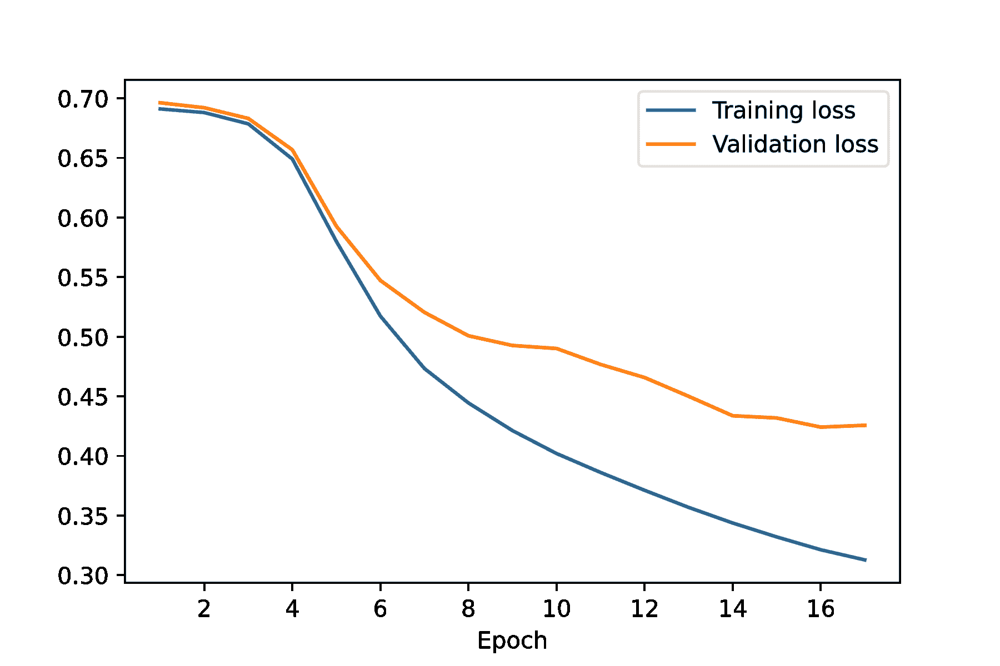

**图 11.4**：使用 PyTorch 训练混合二分类器的训练和验证损失演变

无论如何，让我们计算训练、验证和测试准确率，以更好地了解分类器的性能。我们可以通过执行以下指令来完成：

```py

tr_acc = accuracy_score( 

    (model(tr_data.x) >= 0.5).to(float), tr_data.y) 

val_acc = accuracy_score( 

    (model(val_data.x) >= 0.5).to(float), val_data.y) 

test_acc = accuracy_score( 

    (model(test_data.x) >= 0.5).to(float), test_data.y) 

print("Training accuracy:", tr_acc) 

print("Validation accuracy:", val_acc) 

print("Test accuracy:", test_acc)

```

运行此代码后，我们得到训练准确率为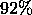，验证准确率为，测试准确率为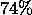。这证实了我们对过拟合存在的怀疑。与其他情况一样，如果我们想解决这个问题，我们可以尝试用额外的数据训练模型，例如。

当然，我们关于如何使用 PyTorch 和 Qiskit 训练混合 QNN 的所有知识也适用于普通 QNN。如果您想使用 PyTorch 训练一个简单的 Qiskit QNN，您已经学会了如何做；只需定义一个没有经典层的模型即可。

这标志着我们在 Qiskit 中对混合神经网络的研究结束。但在结束这一节之前，我们还有一件事要做。

Qiskit 的一个优点是与 IBM 量子硬件的紧密集成。然而，正如我们在量子优化研究中所做的那样，排队时间使得通过 IBM 硬件的常规接口（即仅使用真实硬件后端，正如我们在第*2*章“量子计算中的工具”中讨论的那样）在真实硬件上训练任何 QNN 模型变得不可行。幸运的是，有更好的方法。

## 11.3.3 使用 Runtime 训练 Qiskit QNNs

使用 Qiskit 的 Runtime 服务，就像我们在第*5*章和第*7*章中所做的那样，我们可以通过 Qiskit Torch 连接器在 IBM Quantum 提供的任何设备和模拟器上有效地训练任何在 PyTorch 中定义的 QNN 模型。只需等待一个队列，整个训练过程作为一个单元执行——包括所有在量子硬件上的执行。IBM 的同事们将 Qiskit Runtime 的这个用例称为“Torch Runtime”。

这非常方便。但是，我们必须警告您，在撰写本文时，运行这些 Torch Runtime 程序可能需要相当长的排队时间：大约几小时。此外，您应该记住——同样，在撰写本文时——这项服务使您能够训练在 PyTorch 上定义的 QNN，但不能训练混合 QNN！也就是说，您的 PyTorch 模型不应有任何经典层。

我们将在一个真实设备上训练一个简单的 QNN 模型。像往常一样，我们首先应该加载我们的 IBMQ 账户并选择一个设备。我们将选择所有至少有四个量子比特的真实设备中最不繁忙的设备：

```py

from qiskit.providers.ibmq import * 

provider = IBMQ.load_account() 

dev_list = provider.backends( 

    filters = lambda x: x.configuration().n_qubits >= 4, 

                        simulator = False) 

dev = least_busy(dev_list)

```

我们可以使用 PyTorch 连接器定义一个简单的 QNN 模型，如下所示：

```py

class QiskitQNN(nn.Module): 

    def __init__(self): 

        super(QiskitQNN, self).__init__() 

        qnn = TwoLayerQNN(2, zzfm, twolocal, input_gradients = True) 

        self.qnn = TorchConnector(qnn) 

    def forward(self, x): 

        x = self.qnn(x) 

        return x 

model = QiskitQNN()

```

然后，我们可以使用`make_classification`函数生成一些数据来训练这个模型：

```py

x, y = make_classification(n_samples = 100, n_features = 2, 

    n_clusters_per_class = 1, n_informative = 1, n_redundant = 1) 

x_tr, x_test, y_tr, y_test = train_test_split(x, y, train_size = 0.8) 

x_val, x_test, y_val, y_test = train_test_split(x_test, y_test, 

    train_size = 0.5) 

tr_data = NumpyDataset(x_tr, y_tr) 

val_data = NumpyDataset(x_val, y_val) 

test_data = NumpyDataset(x_test, y_test)

```

注意我们是如何调整`make_classification`函数的一些参数，以符合其要求的（更多详细信息，请查看其文档[`scikit-learn.org/stable/modules/generated/sklearn.datasets.make_classification.html`](https://scikit-learn.org/stable/modules/generated/sklearn.datasets.make_classification.html)）。

我们的模式应该返回和之间的值，但我们为我们的电路选择的可观测量——默认的可观测量，偶校验可观测量（参考*第十章**10*，*量子神经网络*）——返回两个可能的值：或，而不是和。因此，我们需要更新目标映射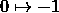和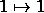。这可以通过以下指令完成：

```py

tr_data.y = 2 * (tr_data.y - 1/2) 

val_data.y = 2 * (val_data.y - 1/2) 

test_data.y = 2 * (test_data.y - 1/2)

```

让我们现在为训练、验证和测试数据设置一些数据加载器：

```py

tr_loader = DataLoader(tr_data, batch_size = 20, shuffle = True) 

val_loader = DataLoader(val_data) 

test_loader = DataLoader(test_data)

```

我们剩下的唯一需要定义的成分是优化器和损失函数。我们仍然可以使用 Adam 作为优化器，但由于我们的标签现在是和而不是和，二进制交叉熵损失将不再适用；因此，我们将使用均方误差损失：

```py

get_loss = F.mse_loss 

opt = torch.optim.Adam(model.parameters(), lr = 0.005)

```

为了能够使用我们的模型与 Torch Runtime 一起使用，我们必须定义一个 Torch Runtime 客户端，`client`，指定一些自解释的参数。这可以通过以下方式完成：

```py

from qiskit_machine_learning.runtime import TorchRuntimeClient 

client = TorchRuntimeClient(provider = provider, backend = dev, 

    model = model, optimizer = opt, loss_func = get_loss, 

    epochs = 5)

```

我们将 epoch 的数量设置为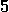以获得一些快速的结果，但请随意增加它。

现在这是我们要执行的指令，如果我们想要训练我们的模型：

```py

result = client.fit(train_loader = tr_loader, val_loader = val_loader)

```

这可能需要一段时间，因为运行 Torch Runtime 程序所需的队列时间。请放松并休息。最终，你的模型将被训练。一旦发生这种情况，你可以从`result`对象中获取有关训练的信息，其类型为`TorchRuntimeResult`。特别是，`train_history`和`val_history`属性将显示在整个训练过程中训练和验证损失的演变。

如果你想要获取模型对某些数据的预测——例如，测试数据集——你只需要将数据的数据加载器对象发送到`predict`方法。以下是如何获取你的预测：

```py

pred = client.predict(test_loader).prediction

```

不要期望获得出色的结果！我们定义的模型并不强大，我们只训练了几个 epoch。更不用说，当你运行在实际硬件上时，总是存在处理噪声的问题。当然，你可以使用我们之前在*第七章**7*，*VQE: 变分量子本征值求解器*中使用的错误缓解方法，通过在`TorchRuntimeClient`实例化时设置`measurement_error_mitigation` `=` `True`。

## 11.3.4 看向未来的一瞥

我们与 Torch Runtime 合作的方式在撰写本文时得到了 IBM 的支持，但在 Qiskit 的世界里，变化是唯一的不变。

在未来，Torch Runtime 将不再被支持，并且将需要使用不同的接口来使用 Qiskit Runtime 训练量子神经网络。这个接口——在撰写本文时，它仍在积极开发中——将依赖于我们在*第 7.3.7 节* **7.3.7*中提到的`Sampler`和`Estimator`对象。在本小节中，我们将向您展示一个简单的示例，展示如何使用这个新接口。

以下代码片段可以用于在`ibmq_lima`设备上使用“新”的 Qiskit Runtime 训练一个简单的变分量子分类器（一个`VQC`对象）：

```py

from qiskit_ibm_runtime import QiskitRuntimeService,Session,Sampler,Options 

from qiskit_machine_learning.algorithms.classifiers import VQC 

# channel = "ibmq_quantum" gives us access to IBM’s quantum computers. 

service = QiskitRuntimeService(channel = "ibm_quantum", token = "TOKEN") 

with Session(service = service, backend = "ibmq_lima"): 

    sampler = Sampler() 

    vqc = VQC(sampler = sampler, num_qubits = 2) 

    vqc.fit(x_tr, y_tr)

```

请注意，您需要安装`qiskit_ibm_runtime`包（有关说明，请参阅*附录* **D*，*安装工具*），并将`"``TOKEN``"`替换为您实际的 IBM 量子令牌。

*实际上，当您通过这个新的 Qiskit Runtime 接口发送程序时，您很可能会在 IBM Quantum 仪表板上看到一大堆作业。不用担心，Runtime 运行得很好。所有这些作业都对应于对量子计算机的不同调用，但它们都是无需在每个作业执行后等待队列即可执行。

这就是我们想与你们分享的有关 Torch Runtime 实用工具的所有内容。让我们结束这一章。

# 摘要

这是一段漫长而紧张的经历。我们首先学习了混合神经网络实际上是什么，以及它们在哪些用例中可能有用。然后我们探讨了如何在 PennyLane 中实现和训练这些混合网络，在这个过程中，我们还讨论了一些适用于任何机器学习项目的良好实践。此外，我们跳出舒适区，考虑了一种新的量子机器学习问题：多类分类器的训练。

在完成对 PennyLane 的学习后，我们深入研究了 Qiskit，那里有一个惊喜在等着我们。由于 Qiskit 依赖于与 PyTorch ML 包的接口来实现混合量子神经网络，我们投入了大量精力学习如何使用 PyTorch。在这个过程中，我们看到了 PyTorch 如何为我们提供一种使用 TensorFlow 和 Keras 所无法获得的灵活性。在我们对 PyTorch 包有了稳固的理解之后，我们开始使用 Qiskit 及其 PyTorch 连接器，并用它们训练了一个混合量子神经网络。

最后，我们通过履行在*第十章* **10*，*量子神经网络*中做出的承诺，结束了这一章，并讨论了如何使用 Torch Runtime 在 IBM 的量子硬件上训练量子神经网络。
