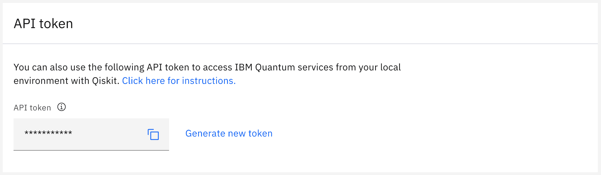
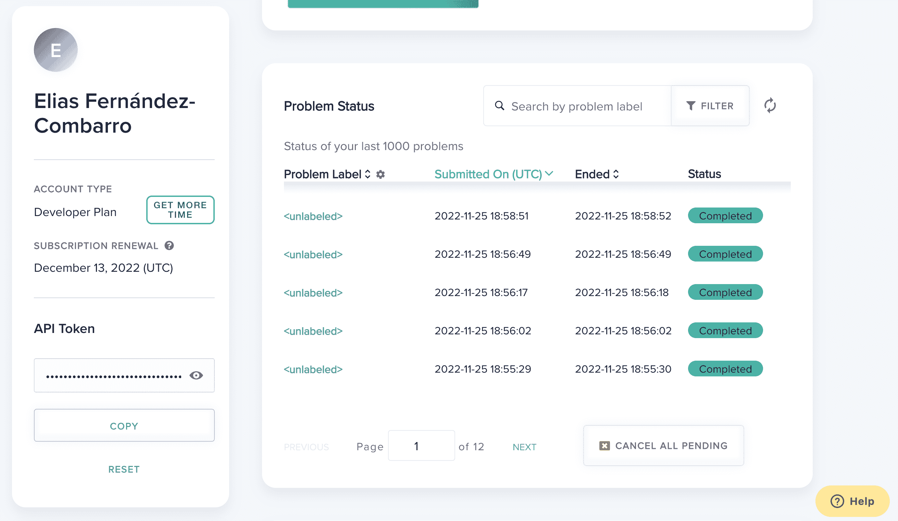
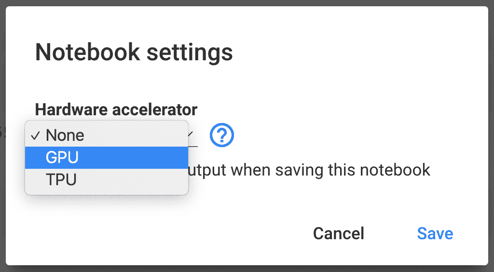

# 附录 D

安装工具

*人是使用工具的动物。没有工具，他什么都不是；有了工具，他*什么都是*。

— 托马斯·卡莱尔

在本附录中，我们将为您提供运行正文中所提供的代码示例所需的所有说明。我们将首先引导您通过安装我们将使用的软件的过程，然后我们将学习如何访问我们将运行代码的真实量子计算机，最后，我们还将向您展示如何通过使用 GPU 来加速一些执行。

# D.1 获取 Python

我们在这本书中使用的所有量子编程库都是基于 Python 的，因此您需要一个有效的 Python 发行版。如果您的操作系统是 Linux 或 macOS，您可能已经有一个了。如果您的 Python 版本至少是 3.7，那么您就可以开始了。

然而，即使您已经在系统上安装了 Python，我们也建议您考虑以下两种选项之一：

+   **安装 Anaconda**：Anaconda 是一个数据科学软件发行版，包括 Python 及其许多科学库。此外，它还包括 Jupyter，这是一个极其有用的基于网页的交互式计算平台，允许您运行代码、编写文本和公式以及可视化图形，所有这些都被组织到笔记本中。为了方便，我们提供了书中所有代码的 Jupyter 笔记本，您可以从[`github.com/PacktPublishing/A-Practical-Guide-to-Quantum-Machine-Learning-and-Quantum-Optimization`](https://github.com/PacktPublishing/A-Practical-Guide-to-Quantum-Machine-Learning-and-Quantum-Optimization)下载。

    如果您安装了 Anaconda，您将拥有我们在这本书中使用的几乎所有非量子软件库，以及一些您可能认为对其他相关项目方便的额外库。

    有一个名为**Anaconda Distribution**的 Anaconda 版本，可以从[`www.anaconda.com/products/distribution`](https://www.anaconda.com/products/distribution)免费下载。它适用于 Windows、Linux 和 Mac。Anaconda Distribution 提供了一个图形安装程序，因此设置起来非常简单。如果有疑问，您始终可以查看[`docs.anaconda.com/anaconda/install/index.html`](https://docs.anaconda.com/anaconda/install/index.html)的安装说明。

    一旦安装了 Anaconda，我们建议您启动它并运行 JupyterLab。这将在一个网页浏览器中打开一个 IDE，您可以使用它来管理 Jupyter 笔记本并立即开始运行代码。要快速了解如何使用 JupyterLab，您可以查看 JupyterLab 文档中包含的界面概述：[`jupyterlab.readthedocs.io/en/stable/user/interface.html`](https://jupyterlab.readthedocs.io/en/stable/user/interface.html)。

+   **使用 Google Colab**：如果您不想在自己的计算机上安装任何东西，我们也有一个选项供您选择。Google Colab 是由 Google 提供的一个基于网络的平台，您可以在其中运行带有 Python 代码的 Jupyter 笔记本。实际上，它的界面与 Jupyter 非常相似，可以用来运行本书中的所有代码（我们知道因为我们自己就是这样做的！）以及许多其他项目，特别是那些与机器学习和数据科学相关的项目。

    使用 Jupyter 和 Google Colab 之间的主要区别在于 Colab 不在您的计算机上运行，而是基于云：它使用 Google 拥有的硬件。他们为您提供（通常是适度的）CPU、一定量的 RAM 和一些磁盘空间，您还有机会请求 GPU 来加速您的机器学习模型的训练。

    Google Colab 的基本版本是免费的：您只需要一个有效的 Google 账户，就可以在 [`colab.research.google.com/`](https://colab.research.google.com/) 上开始使用它。如果您需要更多的计算能力，您可以升级到付费版本（更多详情请见 [`colab.research.google.com/signup`](https://colab.research.google.com/signup)）。

    顺便说一句，[`colab.research.google.com/`](https://colab.research.google.com/) 上的教程非常有帮助，所以你几乎可以立即开始运行你的项目。

这些选项各有优缺点。使用 Anaconda，您可以完美控制您要安装的内容，可以使用自己的硬件（可能比 Google Colab 提供的更强大，也许除了那些令人愉悦的 GPU 之外），并且可以离线工作。但是，您需要自己安装一切，保持其更新，并解决可能出现的任何版本冲突。

使用 Google Colab，您可以从任何连接到互联网的计算机立即开始运行代码，无需承担安装 Python 和许多其他库的负担，并且可以免费使用相当强大的 GPU。然而，您需要始终在线，对您可以同时运行的项目数量有一些限制（至少，对于免费版本来说是这样），并且 CPU 速度并不算快。

好事是，这些可能性（或任何其他让您获得运行 Python 分发的可能性）都可以完美地用于运行本书中的代码。此外，它们之间完全兼容，因此您可以在 Google Colab 上开始编写笔记本，然后用 Anaconda 完成，反之亦然。由于两者都是免费的，您可以尝试它们两个，并在任何给定时刻使用更适合您需求的那个。

当然，我们不想过于武断。如果您不想依赖 Anaconda 或云服务，您可以使用本地机器而不添加任何插件，只要您有我们将使用的包的正确版本，一切都会运行得很好。

# D.2 安装库

尽管 Anaconda 和 Google Colab 默认已经安装了大量的数据科学、可视化和机器学习库，但它们还没有包括我们在本书中使用的任何量子计算库。

然而，使用**pip**（Python 捆绑的包管理器）设置和运行它们非常简单——你不需要安装 Anaconda 或访问 Google Colab 来使用它。为了使用 pip 安装新库，你只需要在你的终端上运行以下指令：

```py

pip install name-of-library

```

如果你使用 Jupyter 笔记本运行代码，你可以使用完全相同的指令，但你需要将其写在单独的单元中，不要添加任何额外的代码。如果你需要安装几个不同的库，并且不想为每个 pip 指令创建不同的单元，那么你可以将它们全部放在同一个单元中，但你需要使用转义符号`!`。例如，你可以在 Jupyter 笔记本的同一个单元中安装三个库，如下所示：

```py

!pip install first-library 

!pip install second-library 

!pip install last-library

```

有时候，你需要安装某个库的特定版本。本书中的一些示例就是这样。别担心，因为 pip 在这方面也有支持。你只需要运行以下指令：

```py

pip install name-of-library==version-number

```

例如，要安装本书使用的 Qiskit 版本 0.39.2，你需要运行以下指令：

```py

pip install qiskit==0.39.2

```

当然，我们刚才关于 Jupyter 笔记本中转义符号的评论也适用于这种情况。

重要提示

如果你在一个 Jupyter 笔记本上运行`pip install`命令来安装系统上已经存在的库的不同版本，你可能需要重新启动内核（如果你在本地机器上运行 Jupyter 笔记本）或运行时（在 Google Colab 中）以使更改生效。

在*表* **D.1*中，我们收集了本书代码所需的所有库，按照正文中的顺序排列，以及我们创建示例所使用的版本。第二列指定了每个库在 pip 中的名称，因此你需要使用`pip install`命令使用该名称。

*| 库名称 | Pip 名称 | 版本号 |

| Qiskit | qiskit | 0.39.2 |
| --- | --- | --- |
| Pylatexenc | pylatexenc | 2.10 |
| Numpy | numpy | 1.21.6 |
| Qiskit Aer GPU | qiskit-aer-gpu | 0.11.1 |
| PennyLane | pennylane | 0.26 |
| PennyLane Qiskit 插件 | pennylane-qiskit | 0.24.0 |
| Ocean | dwave-ocean-sdk | 6.0.1 |
| Qiskit Optimization | qiskit-optimization | 0.4.0 |
| Qiskit Nature | qiskit-nature | 0.4.5 |
| Scipy | scipy | 1.7.3 |
| Matplotlib | matplotlib | 3.2.2 |
| PySCF | pyscf | 2.11 |
| scikit-learn | scikit-learn | 1.0.2 |
| TensorFlow | tensorflow | 2.9.1 |
| Qiskit Machine Learning | qiskit-machine-learning | 0.5.0 |
| Optuna | optuna | 3.0.3 |
| PyTorch | torch | 1.13 |
| Qiskit IBM Runtime | qiskit-ibm-runtime | 0.7.0 |

**表 D.1**：本书中使用的库及其版本号

您可能已经注意到列表中有几个库我们从未在我们的代码中明确导入。然而，它们被其他包用来能够绘制电路（Pylatexenc）以及为分子问题获取哈密顿量（PySCF），因此它们需要存在于您的系统中。

一些库已经包含在 Anaconda 和 Google Colab 中。事实上，这本书中的代码很可能与那些分布中包含的任何版本兼容，因此安装表中提到的确切版本不应该特别重要。

唯一的例外是 PyTorch 和 TensorFlow：对于它们，您应该使用表中列出的版本。

对于不包含在 Anaconda 和 Google Colab 中的库，强烈建议您坚持使用表中列出的版本。这对于 Qiskit 及其所有模块尤其重要，因为它们倾向于频繁更改它们的 API。

在任何情况下，为了方便起见，在您可以从 [`github.com/PacktPublishing/A-Practical-Guide-to-Quantum-Machine-Learning-and-Quantum-Optimization`](https://github.com/PacktPublishing/A-Practical-Guide-to-Quantum-Machine-Learning-and-Quantum-Optimization) 下载的笔记本中，我们明确包含了那些库的安装命令以及我们创建示例所使用的确切版本。如果您在本地 Python 安装上运行代码，您只需安装这些库一次，因此您可以在第一次执行后删除 `pip install` 命令。然而，如果您使用 Google Colab，您每次创建新的运行时都需要运行这些命令，因为数据从一个会话到另一个会话没有持久性。

# D.3 访问 IBM 的量子计算机

为了能够从您的 Python 程序在 IBM 的量子计算机上运行电路，您首先需要创建一个 IBM 账户。这可以通过位于 [`quantum-computing.ibm.com/login`](https://quantum-computing.ibm.com/login) 的 IBM 量子登录页面完成，并且这是完全免费的。

然后，您需要获取您的 API 令牌。您可以通过访问 [`quantum-computing.ibm.com/account`](https://quantum-computing.ibm.com/account)，如果需要的话登录，并找到标题为 **API 令牌** 的字段（见 *图* **D.1*）。然后，您可以点击旁边有两个矩形的图标来将令牌复制到您的剪贴板。如果您需要的话，这也是您可以点击 **生成新** **令牌** 来生成新 API 令牌的页面。

*

**图 D.1**: 获取您的 IBM 量子 API 令牌

一旦您有了令牌，如果您想从您的 Qiskit 程序访问 IBM 的设备，您需要运行以下指令：

```py

from qiskit import IBMQ 

IBMQ.save_account("TOKEN")

```

其中，当然，您应该用您实际的令牌替换 `TOKEN`。然后，您可以通过使用 `IBMQ.load_account()` 来获得对 IBM 提供商的访问权限，就像我们在正文中所做的那样。

如果您使用的是本地 Python 安装，您只需保存一次账户（并且，此外，每次更改 API 令牌时）。然而，如果您使用 Google Colab，您需要在每个新的运行时保存您的账户。我们已经准备了您可以从 [`github.com/PacktPublishing/A-Practical-Guide-to-Quantum-Machine-Learning-and-Quantum-Optimization`](https://github.com/PacktPublishing/A-Practical-Guide-to-Quantum-Machine-Learning-and-Quantum-Optimization) 下载的笔记本，这样您只需在 `ibm_token =` 指令中写入实际的令牌。

如果您需要从 PennyLane 访问 IBM 量子计算机，过程几乎相同。唯一的区别是您还需要安装之前章节中看到的 PennyLane-Qiskit 插件。

# D.4 访问 D-Wave 量子退火器

为了从您的代码中访问 D-Wave 量子退火器，您首先需要在 [`cloud.dwavesys.com/leap/signup/`](https://cloud.dwavesys.com/leap/signup/) 创建一个免费的 D-Wave Leap 账户。这将为您提供 1 分钟的免费访问时间，以便在真实的量子设备上运行您的问题，如 *第* **4** 章 *[阿迪亚布 atic 量子计算和量子退火*] 中所述。如果您想将这种访问扩展到每月额外获得 1 分钟的免费时间，您可以通过访问 [`cloud.dwavesys.com/leap/plans/#Custom`](https://cloud.dwavesys.com/leap/plans/#Custom) 并点击 **Get Developer Access** 来提供您的 GitHub 用户名和存储库。

*在任何情况下，就像使用 IBM 量子计算机一样，您现在需要获取您的 API 令牌。您可以通过访问 [`cloud.dwavesys.com/leap/`](https://cloud.dwavesys.com/leap/)，如果需要的话登录，并找到标题为 **API 令牌** 的字段来实现。这通常位于页面左侧，在您的姓名和账户类型下方（见 *图* **D.2*）。在那里，您可以点击 **COPY** 将令牌复制到剪贴板，并点击 **RESET** 生成新的令牌。*

*

**图 D.2**：获取您的 D-Wave API 令牌

然后，您需要通过运行 `dwave config create` 来配置您的访问权限。您可以在终端、Python 笔记本或程序中这样做，但在后一种情况下，您需要在命令前使用转义符号 `!`。然后，您将需要输入一些配置选项。您只需在所有问题中按默认值（按 *Enter*）进行操作，除了**认证令牌**，对于这个选项，您需要提供从 D-Wave Leap 网站复制的 API 令牌。

如果你使用的是本地 Python 安装，这只需要做一次，之后你就可以像我们在*第* **4*，*《绝热量子计算和量子退火》* **4*中描述的那样访问 D-Wave 的量子退火器。如果你使用 Google Colab，每次使用新的运行时都需要运行配置步骤。

*# D.5 在 Google Colab 中使用 GPU 加速模拟

正如我们在*第* **2*，*《量子计算的工具》* **2*中提到的，使用 GPU 来模拟量子电路在某些情况下可以提供计算时间的明显加速。一般来说，将 GPU 设置为与量子库（如 Qiskit）一起工作的高度依赖于你的硬件配置和你的 GPU 型号（尽管，原则上，只支持 Nvidia GPU）。

*然而，如果你使用 Google Colab，你有机会请求一个 GPU 来运行你的电路。这种方法的优点是双重的。你不需要自己购买 GPU，而且你也不需要设置它。

要为你的 Google Colab 笔记本请求一个 GPU，你需要选择**运行时**菜单中的**更改运行时类型**选项。然后，你需要选择**GPU**选项（见*图* **D.3*）并点击**保存**。如果有可用性，你将被分配一个 GPU。要检查 GPU 的状态，你可以运行`!``nvidia``-``smi` `-``L`。你将得到以下输出（GPU 型号可能因会话而异）：*

*```py

GPU 0: Tesla T4 (UUID: GPU-a6c87248-f520-fbc1-d604-309890a20713)

```



**图 D.3**：请求 GPU

如果这个命令没有错误执行，这意味着你可以访问 GPU。现在，为了在 Qiskit 中使用它，你需要通过运行以下指令来安装 Qiskit Aer GPU 包：

```py

pip install qiskit-aer-gpu==0.11.1

```

注意，这将替换通常的 Qiskit Aer 模块（仅与 CPU 一起工作的那个模块），因此如果你已经运行了一些 Qiskit 代码，你可能需要重新启动你的运行时。现在，你可以通过执行以下指令尝试 GPU 模拟：

```py

from qiskit import * 

from qiskit.providers.aer import AerSimulator 

sim = AerSimulator(device = ’GPU’) 

qc = QuantumCircuit(2, 2) 

qc.h(0) 

qc.cnot(0,1) 

qc.measure(range(2), range(2)) 

job = execute(qc, sim, shots = 1024) 

result = job.result() 

counts = result.get_counts() 

print(counts)

```

你将得到一个输出，就像你在 CPU 上运行模拟一样。它可能看起来像这样：

```py

{’00’: 489, ’11’: 535}

```******
