# 评估

# 第一章，量子计算基础

**(1.1)** 如果量子比特的状态是, 测量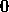的概率正好是


同样，测量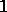的概率也是。如果量子比特的状态是, 测量的概率是，测量的概率是

最后，如果量子比特的状态是, 测量的概率是，测量的概率是

**(1.2)**  和  的内积是 

 和  的内积是 

**(1.3)** 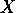 的伴随是  本身，并且满足 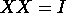。因此， 是幺正的，其逆也是  本身。操作  将  变为 .

**(1.4)** 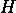 的伴随是其自身，并且它满足 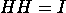。因此， 是幺正的，其逆也是  本身。操作  将  映射到 ，将  映射到 。最后，它还满足  和 .

**(1.5)** 它表明  和  它还表明 ![\begin{pmatrix} \frac{1}{\sqrt{2}} & \frac{1}{\sqrt{2}} \\ \frac{1}{\sqrt{2}} & {- \frac{1}{\sqrt{2}}} \\ \end{pmatrix}\begin{pmatrix} 0 & 1 \\ 1 & 0 \\ \end{pmatrix}\begin{pmatrix} \frac{1}{\sqrt{2}} & \frac{1}{\sqrt{2}} \\ \frac{1}{\sqrt{2}} & {- \frac{1}{\sqrt{2}}} \\ \end{pmatrix} = \begin{pmatrix} \frac{1}{\sqrt{2}} & \frac{1}{\sqrt{2}} \\ \frac{1}{\sqrt{2}} & {- \frac{1}{\sqrt{2}}} \\ \end{pmatrix}\begin{pmatrix} \frac{1}{\sqrt{2}} & {- \frac{1}{\sqrt{2}}} \\ \frac{1}{\sqrt{2}} & \frac{1}{\sqrt{2}} \\ \end{pmatrix} = \begin{pmatrix} 1 & 0 \\ 0 & {- 1} \\ \end{pmatrix}.](img/end{pmatrix}.")

**(1.6)** 由于，显然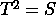。此外，根据欧拉公式，我们有，因此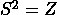。因此，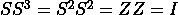，所以。同样，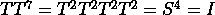，因此.

**(1.7)** 通过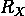的定义，我们有 = \begin{pmatrix} {\cos\frac{\pi}{2}} & {- i\sin\frac{\pi}{2}} \\ {- i\sin\frac{\pi}{2}} & {\cos\frac{\pi}{2}} \\ \end{pmatrix} = \begin{pmatrix} 0 & {- i} \\ {- i} & 0 \\ \end{pmatrix} = - iX.")

类似地， = \begin{pmatrix} {\cos\frac{\pi}{2}} & {- \sin\frac{\pi}{2}} \\ {\sin\frac{\pi}{2}} & {\cos\frac{\pi}{2}} \\ \end{pmatrix} = \begin{pmatrix} 0 & {- 1} \\ 1 & 0 \\ \end{pmatrix} = - iY")和 = \begin{pmatrix} e^{- i\frac{\pi}{2}} & 0 \\ 0 & e^{i\frac{\pi}{2}} \\ \end{pmatrix} = \begin{pmatrix} {- i} & 0 \\ 0 & i \\ \end{pmatrix} = - iZ.")

此外， = \begin{pmatrix} e^{- i\frac{\pi}{4}} & 0 \\ 0 & e^{i\frac{\pi}{4}} \\ \end{pmatrix} = e^{- i\frac{\pi}{4}}S")和 = \begin{pmatrix} e^{- i\frac{\pi}{8}} & 0 \\ 0 & e^{i\frac{\pi}{8}} \\ \end{pmatrix} = e^{- i\frac{\pi}{8}}T.")

**(1.8)** 从")的定义出发，我们得到U(θ,φ,λ)† = \begin{pmatrix} \cos\frac{\theta}{2} & - e^{i\lambda}\sin\frac{\theta}{2} \\ e^{i\varphi}\sin\frac{\theta}{2} & e^{i{(\varphi + \lambda})}\cos\frac{\theta}{2} \\ \end{pmatrix}\begin{pmatrix} \cos\frac{\theta}{2} & e^{- i\varphi}\sin\frac{\theta}{2} \\ - e^{- i\lambda}\sin\frac{\theta}{2} & e^{- i{(\varphi + \lambda})}\cos\frac{\theta}{2} \\ \end{pmatrix} = I")和，类似地，†U(θ,φ,λ) = I")。因此，")是正交的。

此外，我们得到 = \begin{pmatrix} \cos\frac{\theta}{2} & - i\sin\frac{\theta}{2} \\ - i\sin\frac{\theta}{2} & \cos\frac{\theta}{2} \\ \end{pmatrix} = R_{X}(\theta). \right.")

类似地，它成立，即 = \begin{pmatrix} \cos\frac{\theta}{2} & - \sin\frac{\theta}{2} \\ \sin\frac{\theta}{2} & \cos\frac{\theta}{2} \\ \end{pmatrix} = R_{Y}(\theta)")以及 = \begin{pmatrix} 1 & 0 \\ 0 & e^{i\theta} \\ \end{pmatrix} = e^{i\frac{\theta}{2}}R_{Z}(\theta).")。

**(1.9)** 由于 , 测量前的状态是 

因此，测量的概率是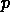，测量的概率是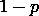.

**(1.10)** 获得符号的概率将是 . 在这个测量结果下，状态将塌缩到 

**(1.11)** 它表明 (U_{1}^{\dagger} \otimes U_{2}^{\dagger}) = (U_{1}U_{1}^{\dagger}) \otimes (U_{2}U_{2}^{\dagger}) = I \otimes I.")

类似地，）（\(U_{1} \otimes U_{2}\)）= \(I \otimes I\")). 因此，\(U_{1} \otimes U_{2}\) 的逆是 \(U_{1}^{\dagger} \otimes U_{2}^{\dagger}\)。另外，根据两个矩阵张量积的定义，对于每一个矩阵 \(A\) 和 \(B\)（即使它们不是幺正的），都有 ![\begin{array}{rlrl} {A^{\dagger} \otimes B^{\dagger} = \begin{pmatrix} a_{11}^{\ast} & a_{21}^{\ast} \\ a_{12}^{\ast} & a_{22}^{\ast} \\ \end{pmatrix} \otimes \begin{pmatrix} b_{11}^{\ast} & b_{21}^{\ast} \\ b_{12}^{\ast} & b_{22}^{\ast} \\ \end{pmatrix}} & {= \begin{pmatrix} {a_{11}^{\ast}\begin{pmatrix} b_{11}^{\ast} & b_{21}^{\ast} \\ b_{12}^{\ast} & b_{22}^{\ast} \\ \end{pmatrix}} & {a_{21}^{\ast}\begin{pmatrix} b_{11}^{\ast} & b_{21}^{\ast} \\ b_{12}^{\ast} & b_{22}^{\ast} \\ \end{pmatrix}} \\ {a_{12}^{\ast}\begin{pmatrix} b_{11}^{\ast} & b_{21}^{\ast} \\ b_{12}^{\ast} & b_{22}^{\ast} \\ \end{pmatrix}} & {a_{22}^{\ast}\begin{pmatrix} b_{11}^{\ast} & b_{21}^{\ast} \\ b_{12}^{\ast} & b_{22}^{\ast} \\ \end{pmatrix}} \\ \end{pmatrix}\qquad} & & \qquad \\ & {= \begin{pmatrix} {a_{11}^{\ast}b_{11}^{\ast}} & {a_{11}^{\ast}b_{21}^{\ast}} & {a_{21}^{\ast}b_{11}^{\ast}} & {a_{21}^{\ast}b_{21}^{\ast}} \\ {a_{11}^{\ast}b_{12}^{\ast}} & {a_{11}^{\ast}b_{22}^{\ast}} & {a_{21}^{\ast}b_{12}^{\ast}} & {a_{21}^{\ast}b_{22}^{\ast}} \\ {a_{12}^{\ast}b_{11}^{\ast}} & {a_{12}^{\ast}b_{21}^{\ast}} & {a_{22}^{\ast}b_{11}^{\ast}} & {a_{22}^{\ast}b_{21}^{\ast}} \\ {a_{12}^{\ast}b_{12}^{\ast}} & {a_{12}^{\ast}b_{22}^{\ast}} & {a_{22}^{\ast}b_{12}^{\ast}} & {a_{22}^{\ast}b_{22}^{\ast}} \\ \end{pmatrix} = {(A \otimes B)}^{\dagger}.\qquad} & & \qquad \\ \end{array}](img/otimes B)}^{\dagger}.\qquad} & & \qquad \\ \end{array}")

**(1.12)**  的矩阵是 

 的矩阵是 

**(1.13)** 在电路

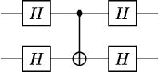

状态  和  保持不变，而  和  被映射到对方。这正是控制位在底部、目标位在顶部的 CNOT 门的作用。

电路的矩阵是


这正是从底部量子位到顶部量子位的 CNOT 门的矩阵。

另一方面，电路

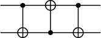

保持  和  不变，同时将  和  映射到对方。这正是 SWAP 门的作用。

或者，电路的矩阵是


这又是 SWAP 门的矩阵。

**(1.14)** 状态 ") 确实是纠缠的。然而，") 是一个乘积态，因为它可以写成 

**(1.15)** 如果  的矩阵为 }_{i,j = 1}^{2}"), 则 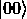 和 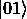 由 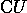 保持不变。此外，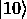 被转换为 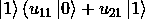)，而 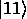 被转换为 )。因此， 的矩阵是


 的伴随矩阵是 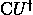，并且满足 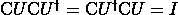。因此， 是幺正的。

**(1.16)** 等价性直接来源于 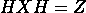 的事实。

**(1.17)** 我们可以使用以下电路来制备 (|00> - |11>))：

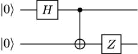

我们可以使用电路

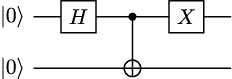

用于制备 (|10> + |01>))。

最后，电路

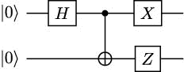

可以用来获得 (|10> - |01>))。

注意，为了制备这些状态，我们只使用了附加到电路中的张量积门，这些电路用于获得原始贝尔态 (|00> + |11>))。例如，我们有

 = (X \otimes Z)\sqrt{\left. 1\slash 2 \right.}(\left| {00} \right\rangle + \left| {11} \right\rangle)")

然后，这也成立：

\sqrt{\left. 1\slash 2 \right.}(\left| {10} \right\rangle - \left| {01} \right\rangle) = \sqrt{\left. 1\slash 2 \right.}(\left| {00} \right\rangle + \left| {11} \right\rangle).")

如果 ") 是一个乘积态，那么 ") 也将是一个乘积态。但是这是不可能的，因为我们知道 ") 是纠缠态的。

**(1.18)** 我们可以通过归纳法来证明它。我们知道当 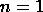 时结果是正确的。现在，假设当 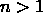 时它是正确的，并考虑一个 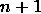 个量子比特的基态 。如果 ，那么  的列向量将始于  的列向量的元素，然后它将有 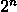 个零。但是，根据归纳假设， 的列向量正好是我们感兴趣的形式。因此， 也具有所需的结构。当  时情况类似。

另一方面，由于每个 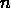-量子比特状态都可以写成基态的归一化线性组合，因此它的向量表示是一个具有  个坐标的单位长度列向量。

**(1.19)** 如果我们测量一个通用多量子比特状态的 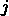-量子比特，得到  的概率由以下公式给出


其中 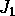 是那些 -位为  的数字集合。坍缩后的状态将是


**(1.20)** 当我们测量 

测量第二个量子比特并得到  的结果将是


**(1.21)** 让我们表示  和 , 其中 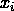 是 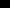 的 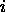-位，而 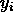 是 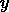 的 -位。那么，它成立：


因此，当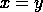时，；而当时，。由此可知，中的元素是正交归一的。由于这个集合的基数是，它是-量子比特状态的维度，我们可以得出结论，这个集合构成一个基。

**(1.22)** 成立的是

![\begin{array}{rlrl} & {\frac{1}{\sqrt{2}}\left( {\left\langle {000} \right| + \left\langle {111} \right|} \right)\frac{1}{2}\left( {\left| {000} \right\rangle + \left| {011} \right\rangle + \left| {101} \right\rangle + \left| {110} \right\rangle} \right)\qquad} & & \qquad \\ & {\qquad = \frac{1}{2\sqrt{2}}(\left\langle 000 \middle| 000 \right\rangle + \left\langle 000 \middle| 011 \right\rangle + \left\langle 000 \middle| 101 \right\rangle + \left\langle 000 \middle| 110 \right\rangle + \qquad} & & \qquad \\ & {\qquad\qquad\left\langle 111 \middle| 000 \right\rangle + \left\langle 111 \middle| 011 \right\rangle + \left\langle 111 \middle| 101 \right\rangle + \left\langle 111 \middle| 110 \right\rangle)\qquad} & & \qquad \\ & {\qquad = \frac{1}{2\sqrt{2}},\qquad} & & \qquad \\ \end{array}](img/right)\frac{1}{2}\left( {\left| {000} \right\rangle + \left| {011} \right\rangle + \left| {101} \right\rangle + \left| {110} \right\rangle} \right)\qquad} & & \qquad \\  & {\qquad = \frac{1}{2\sqrt{2}}(\left\langle 000 \middle| 000 \right\rangle + \left\langle 000 \middle| 011 \right\rangle + \left\langle 000 \middle| 101 \right\rangle + \left\langle 000 \middle| 110 \right\rangle + \qquad} & & \qquad \\  & {\qquad\qquad\left\langle 111 \middle| 000 \right\rangle + \left\langle 111 \middle| 011 \right\rangle + \left\langle 111 \middle| 101 \right\rangle + \left\langle 111 \middle| 110 \right\rangle)\qquad} & & \qquad \\  & {\qquad = \frac{1}{2\sqrt{2}},\qquad} & & \qquad \\ \end{array}")

因为所有内积都是，除了，它是。

**(1.23)** 从其作用于基态的作用中，我们推断出 CCNOT 门的矩阵为：

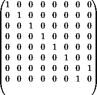

该矩阵是其自身的伴随矩阵，并且其平方是单位矩阵。因此，该矩阵是正交的。

**(1.24**) 该电路

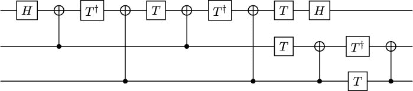

保持所有状态不变，除了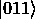和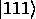。它还交换和。这正是目标在顶层量子比特上的 CCNOT 门的作用。

# 第二章，量子计算中的工具

**(2.1**) 我们已经在*附录**D*，*安装工具*中给出了解决方案。

**(2.2**) 为了构建图*2.2b*中的电路，你需要执行以下代码片段：

```py

from qiskit import * 

import numpy as np 

qc = QuantumCircuit(2) 

qc.z(0) 

qc.y(1) 

qc.cry(np.pi/2, 0, 1) 

qc.u(np.pi/4, np.pi, 0, 0) 

qc.rz(np.pi/4,1)

```

如果你想要可视化电路，当然，你可以使用`qc.draw("mpl")`。

**(2.3**) 你可以检查 IBM 自己的方法实现([`github.com/Qiskit/qiskit-terra/blob/5ccf3a41cb10742ae2158b6ee9d13bbb05f64f36/qiskit/circuit/quantumcircuit.py#L2205`](https://github.com/Qiskit/qiskit-terra/blob/5ccf3a41cb10742ae2158b6ee9d13bbb05f64f36/qiskit/circuit/quantumcircuit.py#L2205))并与你自己的进行比较！

它们采取了我们没有考虑的一些额外步骤，例如在电路中添加**障碍**，但你可以忽略这些细节。

**(2.4**) 你已经在*附录**D*，*安装工具*中找到了解决方案。

**(2.5**) 我们已经看到了如何在 Qiskit 中构建这些电路。要在 PennyLane 中构建它们，我们需要运行以下代码片段：

```py

import pennylane as qml 

import numpy as np 

dev = qml.device(’default.qubit’, wires = 2) 

@qml.qnode(dev) 

def qcircA(): 

    qml.PauliX(wires = 0) 

    qml.RX(np.pi/4, wires = 1) 

    qml.CNOT(wires = [0,1]) 

    qml.U3(np.pi/3, 0, np.pi, wires = 0) 

    return qml.state() 

@qml.qnode(dev) 

def qcircB(): 

    qml.PauliZ(wires = 0) 

    qml.PauliY(wires = 1) 

    qml.CRY(np.pi/2, wires = [0,1]) 

    qml.U3(np.pi/4, np.pi, 0, wires = 0) 

    qml.RZ(np.pi/4, wires = 1) 

    return qml.state()

```

如果我们执行`print(qcircB())`来运行电路 B，我们得到以下状态向量：

```py

tensor([ 0\.        +0.j        , -0.35355339+0.85355339j, 
         0\.        +0.j        ,  0.14644661-0.35355339j], 
         requires_grad=True)

```

另一方面，如果我们使用 Qiskit 模拟相同的电路，我们得到以下输出：

```py

Statevector([-5.65831421e-17-3.20736464e-17j, 
              2.34375049e-17+1.32853393e-17j, 
             -3.53553391e-01+8.53553391e-01j, 
              1.46446609e-01-3.53553391e-01j], 
            dims=(2, 2))

```

注意，这与我们用 PennyLane 得到的结果相同。首先，我们必须考虑到前两个值——从计算的角度来看——是零。然后，我们必须关注 Qiskit 如何根据其自己的约定，以下列顺序给出基态的振幅：、、 和 。

# 第三章，处理二次无约束二进制优化问题

**(3.1)** 我们可以将顶点 、 和 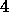 放在同一组，将顶点 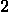 和  放在另一组。然后，五条边属于该割集，即 ,(1,2),(1,3),(2,4)") 和 ").

**(3.2)** *图* **3.3* 中图的 Max-Cut 优化问题是

*

给定 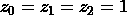 和 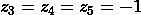 的割集值为 。这个割集不是最优的，因为例如，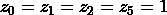 和 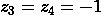 可以得到更低的值。

**(3.3)** 成立的是 \left| {010} \right\rangle = 0") 和 \left| {100} \right\rangle = - 2")。这个值是最小可能的，因为我们图中只有两条边。

**(3.4)** 我们可以使用以下代码计算所需的期望值：

```py

from qiskit.quantum_info import Pauli 

from qiskit.opflow.primitive_ops import PauliOp 

from qiskit.quantum_info import Statevector 

H_cut = PauliOp(Pauli("ZZI")) + PauliOp(Pauli("ZIZ")) 

for x in range(8): # We consider x=0,1...7 

    psi = Statevector.from_int(x, dims = 8) 

    print("The expectation value of |",x,">", "is", 

        psi.expectation_value(H_cut))

```

如果我们运行它，我们将得到以下输出：

```py

The expectation value of | 0 > is (2+0j) 

The expectation value of | 1 > is 0j 

The expectation value of | 2 > is 0j 

The expectation value of | 3 > is (-2+0j) 

The expectation value of | 4 > is (-2+0j) 

The expectation value of | 5 > is 0j 

The expectation value of | 6 > is 0j 

The expectation value of | 7 > is (2+0j)

```

因此，我们可以看到有两个状态可以获得最优值，并且它们都对应于在一组中，而和在另一组中的割。

**(3.5)** QUBO 问题将是


等价的 Ising 基态问题将是


其中我们省略了独立项.

**(3.6)** 二进制线性规划将是


**(3.7)** QUBO 问题如下


**(3.8)** 路径成本的表示式是


# 第四章，绝热量子计算和量子退火

**(4.1)** 我们首先考虑一个状态 ，其中每个  要么是 ，要么是 。对于正交基的所有  这样的状态，以及因此任何一般的  状态，可以写成  其中 。

然后，对于每个 ，它满足


但  当  时，如果 ，而当  时，如果 . 因此，它满足  因为  对于每个  和 .

然后，由于 , 根据线性性质，我们得到 

另一方面，如果我们考虑 ，根据之前的推理，我们有 。因此， ，这是可能的最小值，因此  是我们寻找的基态。

**(4.2)** 我们可以使用以下代码定义最小化  的 QUBO 问题：

```py

import dimod 

J = {(0,1):-1, (0,2):1} 

h = {1:2} 

problem = dimod.BinaryQuadraticModel(h, J, 0.0, dimod.BINARY) 

print("The problem we are going to solve is:") 

print(problem)

```

我们可以使用以下方法来解决它：

```py

from dwave.system import DWaveSampler 

from dwave.system import EmbeddingComposite 

sampler = EmbeddingComposite(DWaveSampler()) 

result = sampler.sample(problem, num_reads=10) 

print("The solutions that we have obtained are") 

print(result)

```

**(4.3)** 为了简单起见，我们将松弛变量表示为  和 。然后，惩罚项是 }^{2}")。当您将其乘以 5，展开并添加到成本函数中时，您将获得 `cqm_to_bqm` 方法计算的确切表达式。

**(4.4)** 对于  到  的量子位，我们有以下连接：

```py

{0: {4, 5, 6, 7, 128}, 1: {4, 5, 6, 7, 129}, 

 2: {4, 5, 6, 7, 130}, 3: {4, 5, 6, 7, 131}, 

 4: {0, 1, 2, 3, 12}, 5: {0, 1, 2, 3, 13}, 

 6: {0, 1, 2, 3, 14}, 7: {0, 1, 2, 3, 15}}

```

显然，从  到  的每个顶点都连接到从  到  的每个顶点，正如我们所需要的。此外，从  到  的每个顶点都连接到位于第一个单元格下面的  到  的一个顶点，而从  到  的每个顶点都连接到位于第一个单元格右侧的  到  的一个顶点。

**(4.5)** 您可以使用以下说明轻松检查这些值：

```py

sampler = DWaveSampler(solver = "DW_2000Q_6") 

print("The default annealing time is", 

    sampler.properties["default_annealing_time"],"microsends") 

print("The possible values for the annealing time (in microseconds)"\ 

    " lie in the range",sampler.properties["annealing_time_range"])

```

在这种情况下，输出将如下所示：

```py

The default annealing time is 20.0 microsends 

The possible values for the annealing time (in microseconds) 

    lie in the range [1.0, 2000.0]

```

# 第五章，QAOA：量子近似优化算法

**(5.1)** 对于 ，其中  的 QAOA 电路如下：


**(5.2)** 它满足以下条件：


**(5.3)** 我们可以将问题重新表述为

(1 - x_{1})x_{2}(1 - x_{3}) + x_{0}(1 - x_{1})(1 - x_{2})(1 - x_{3}) + x_{0}(1 - x_{1})x_{2}x_{3}} & & & & \\ {subject~to~} & {x_{j} \in \{ 0,1\},\quad j = 0,1,2,3.} & & & & \\ & & & & \\ \end{array}")

**(5.4)** 该操作可以用以下电路实现：


**(5.5)** 它认为


**(5.6)** 您可以使用以下代码获得可重复的结果：

```py

from qiskit import Aer 

from qiskit.algorithms import QAOA 

from qiskit.algorithms.optimizers import COBYLA 

from qiskit.utils import algorithm_globals, QuantumInstance 

from qiskit_optimization.algorithms import MinimumEigenOptimizer 

seed = 1234 

algorithm_globals.random_seed = seed 

quantum_instance = QuantumInstance(Aer.get_backend("aer_simulator"), 

    shots = 1024, seed_simulator=seed, seed_transpiler=seed) 

qaoa = QAOA(optimizer = COBYLA(), 

            quantum_instance=quantum_instance, reps = 1) 

qaoa_optimizer = MinimumEigenOptimizer(qaoa) 

result = qaoa_optimizer.solve(qp) 

print(’Variable order:’, [var.name for var in result.variables]) 

for s in result.samples: 

    print(s)

```

**(5.7)** 我们可以使用以下说明定义哈密顿量：

```py

coefficients = [-3,2,-1] 

paulis = [PauliZ(0)@PauliZ(1)@PauliZ(2), 

    PauliZ(1)@PauliZ(2),PauliZ(2)] 

H = qml.Hamiltonian(coefficients,paulis)

```

我们也可以使用

```py

H = -3*PauliZ(0)@PauliZ(1)@PauliZ(2) 

    + 2*PauliZ(1)@PauliZ(2) -PauliZ(2)

```

# 第六章，GAS：Grover 自适应搜索

**(6.1)** 根据我们的定义，总是从一个基态转换到另一个基态。因此，在矩阵表示中，其列向量中恰好有一个元素是，其余都是。这意味着，特别是，所有它的项都是实数。

此外，这个矩阵是对称的。为了证明这一点，假设矩阵有这样的元素。如果它不是对称的，那么存在使得。我们可以假设，不失一般性，和。我们还知道，所以矩阵的平方是单位矩阵。特别是，因为这是矩阵平方中行，列的元素，所以。但我们知道，并且如果，那么，因为每一列中只有一个。然而，那么，，这是矛盾的。

因此，我们有，由于，所以是幺正的。

**(6.2)** 我们可以使用以下电路：


**(6.3)** 的表示是，而的表示是。它们的和是，编码了。

**(6.4)** 我们可以使用以下电路：


**(6.5)** 我们可以使用以下电路：


**(6.6)** 我们可以使用以下代码：

```py

from qiskit_optimization.problems import QuadraticProgram 

from qiskit_optimization.algorithms import GroverOptimizer 

from qiskit import Aer 

from qiskit.utils import algorithm_globals, QuantumInstance 

seed = 1234 

algorithm_globals.random_seed = seed 

qp = QuadraticProgram() 

qp.binary_var(’x’) 

qp.binary_var(’y’) 

qp.binary_var(’z’) 

qp.minimize(linear = {’x’:3,’y’:2,’z’:-3}, quadratic = {(’x’,’y’):3}) 

quantum_instance = QuantumInstance(Aer.get_backend("aer_simulator"), 

    shots = 1024, seed_simulator = seed, seed_transpiler=seed) 

grover_optimizer = GroverOptimizer(num_value_qubits = 5, 

    num_iterations=4, quantum_instance=quantum_instance) 

results = grover_optimizer.solve(qp) 

print(results)

```

# 第七章，变分量子本征求解器（VQE）

**(7.1)** 所有这些都源于矩阵是对角线且所有对角线元素都不同的事实，其特征值对应于测量结果的实际标签。

记住，如果一个算符相对于基的坐标矩阵是对角的，这意味着基向量是该算符的特征向量，而且更重要的是，相应的特征值位于对角线上。

**(7.2)** 我们知道

\left| \lambda_{1} \right\rangle \otimes \cdots \otimes \left| \lambda_{n} \right\rangle = A_{1}\left| \lambda_{1} \right\rangle \otimes \cdots \otimes A_{n}\left| \lambda_{n} \right\rangle.") 由于 , 结果直接得出。

**(7.3)** 它包含以下内容：, , , , \left( {\left| 0 \right\rangle + i\left| 1 \right\rangle} \right) = \left( 1\slash\sqrt{2} \right)\left( {\left| 0 \right\rangle + i\left| 1 \right\rangle} \right)"), 和 \left( {\left| 0 \right\rangle - i\left| 1 \right\rangle} \right) = - \left( 1\slash\sqrt{2} \right)\left( {\left| 0 \right\rangle - i\left| 1 \right\rangle} \right)").

由于对于任何 ，也成立 ，结果随之得出。

**(7.4)**  的一个可能的正交归一化特征向量基由 , , , , , ,  和  组成。前四个特征向量与特征值  相关联，其余的与特征值  相关联。

为了简化，我们可以表示 \left( {\left| 0 \right\rangle + i\left| 1 \right\rangle} \right)") 和 \left( {\left| 0 \right\rangle - i\left| 1 \right\rangle} \right)"). 然后， 的一个可能的标准正交基为 , , , , , ,  和 . 前四个特征向量与特征值  相关联，其余的与特征值  相关联。

**(7.5)** 成立  和 。这证明了  将计算基映射到  的特征向量。此外，\left( {\left| 0 \right\rangle + i\left| 1 \right\rangle} \right)") 和 \left( {\left| 0 \right\rangle - i\left| 1 \right\rangle} \right)"), 因此  将计算基映射到  的特征向量。

**(7.6)** 这直接源于以下事实：如果  和  分别是  和  的特征向量基，那么  是  的特征向量基。

**(7.7)** 我们问题的哈密顿量为  然后，我们可以使用以下代码通过 VQE 来求解它：

```py

from qiskit.circuit.library import EfficientSU2 

from qiskit.algorithms import VQE 

from qiskit import Aer 

from qiskit.utils import QuantumInstance 

import numpy as np 

from qiskit.algorithms.optimizers import COBYLA 

from qiskit.opflow import Z, I 

seed = 1234 

np.random.seed(seed) 

H= (Z^Z^I^I^I) + (I^Z^Z^I^I) + (I^I^Z^Z^I) + (I^I^I^Z^Z) + (Z^I^I^I^Z) 

ansatz = EfficientSU2(num_qubits=5, reps=1, entanglement="linear", 

    insert_barriers = True) 

optimizer = COBYLA() 

initial_point = np.random.random(ansatz.num_parameters) 

quantum_instance = QuantumInstance(backend = 

    Aer.get_backend(’aer_simulator_statevector’)) 

vqe = VQE(ansatz=ansatz, optimizer=optimizer, 

    initial_point=initial_point, 

    quantum_instance=quantum_instance) 

result = vqe.compute_minimum_eigenvalue(H) 

print(result)

```

**(7.8)** 我们可以使用以下代码：

```py

from qiskit_nature.drivers import Molecule 

from qiskit_nature.drivers.second_quantization import \ 

    ElectronicStructureMoleculeDriver, ElectronicStructureDriverType 

from qiskit_nature.problems.second_quantization import \ 

    ElectronicStructureProblem 

from qiskit_nature.converters.second_quantization import QubitConverter 

from qiskit_nature.mappers.second_quantization import JordanWignerMapper 

from qiskit_nature.algorithms import VQEUCCFactory 

from qiskit import Aer 

from qiskit.utils import QuantumInstance 

from qiskit_nature.algorithms import GroundStateEigensolver 

import matplotlib.pyplot as plt 

import numpy as np 

quantum_instance = QuantumInstance( 

    backend = Aer.get_backend(’aer_simulator_statevector’)) 

vqeuccf = VQEUCCFactory(quantum_instance = quantum_instance) 

qconverter = QubitConverter(JordanWignerMapper()) 

solver = GroundStateEigensolver(qconverter, vqeuccf) 

energies = [] 

distances = np.arange(0.2, 2.01, 0.01) 

for d in distances: 

  mol = Molecule(geometry=[[’H’, [0., 0., -d/2]], 

                              [’H’, [0., 0., d/2]]]) 

  driver = ElectronicStructureMoleculeDriver(mol, basis=’sto3g’, 

        driver_type=ElectronicStructureDriverType.PYSCF) 

  problem = ElectronicStructureProblem(driver) 

  result = solver.solve(problem) 

  energies.append(result.total_energies) 

plt.plot(distances, energies) 

plt.title(’Dissociation profile’) 

plt.xlabel(’Distance’) 

plt.ylabel(’Energy’);

```

**(7.9)** 我们可以使用以下代码：

```py

from qiskit import * 

from qiskit.providers.aer import AerSimulator 

from qiskit.utils.mitigation import CompleteMeasFitter 

from qiskit.utils import QuantumInstance 

provider = IBMQ.load_account() 

backend = AerSimulator.from_backend( 

    provider.get_backend(’ibmq_manila’)) 

shots = 1024 

qc = QuantumCircuit(2,2) 

qc.h(0) 

qc.cx(0,1) 

qc.measure(range(2),range(2)) 

result = execute(qc, backend, shots = shots) 

print("Result of noisy simulation:") 

print(result.result().get_counts()) 

quantum_instance = QuantumInstance( 

    backend = backend, shots = shots, 

    measurement_error_mitigation_cls=CompleteMeasFitter) 

result = quantum_instance.execute(qc) 

print("Result of noisy simulation with error mitigation:") 

print(result.get_counts())

```

运行这些指令的结果如下：

```py

Result of noisy simulation: 

{’01’: 88, ’10’: 50, ’00’: 453, ’11’: 433} 

Result of noisy simulation with error mitigation: 

{’00’: 475, ’01’: 12, ’10’: 14, ’11’: 523}

```

我们知道，运行此电路的理想结果不应产生任何  或  测量。这些在噪声模拟中相当突出，但当我们使用读出错误缓解时，则不那么明显。

**(7.10)** 我们可以使用以下代码：

```py

from qiskit.opflow import Z 

from qiskit.providers.aer import AerSimulator 

from qiskit.algorithms import QAOA 

from qiskit.utils import QuantumInstance 

from qiskit import Aer, IBMQ 

from qiskit.algorithms.optimizers import COBYLA 

from qiskit.utils.mitigation import CompleteMeasFitter 

H1 = Z^Z 

provider = IBMQ.load_account() 

backend = AerSimulator.from_backend( 

    provider.get_backend(’ibmq_manila’)) 

quantum_instance = QuantumInstance(backend=backend, 

                   shots = 1024) 

qaoa = QAOA(optimizer = COBYLA(), quantum_instance=quantum_instance) 

result = qaoa.compute_minimum_eigenvalue(H1) 

print("Result of noisy simulation:",result.optimal_value) 

quantum_instance = QuantumInstance(backend=backend, 

    measurement_error_mitigation_cls=CompleteMeasFitter, 

    shots = 1024) 

qaoa = QAOA(optimizer = COBYLA(), quantum_instance=quantum_instance) 

result = qaoa.compute_minimum_eigenvalue(H1) 

print("Result of noisy simulation with error mitigation:", 

    result.optimal_value)

```

我们运行它时得到的结果如下：

```py

Result of noisy simulation: -0.8066406250000001 

Result of noisy simulation with error mitigation: -0.93359375

```

我们知道，我们哈密顿量的实际最优值是 。因此，我们观察到，在这种情况下，噪声对 QAOA 的性能有负面影响，并且通过使用读出错误缓解可以减少这种影响。

# 第八章，什么是量子机器学习？

**(8.1)** 我们将通过反证法进行证明。我们假设存在一些系数  使得

|  |
| --- |
|  |

简化后，这些等式相当于

|  |
| --- |

前三个恒等式意味着  和 ，因此最后一个恒等式无法满足。

**(8.2)** 直方图通常是多功能且强大的选项。然而，在这种情况下，由于我们的数据集有两个特征，我们也可以使用 `plt``.``scatter` 函数绘制散点图。

**(8.3)** 函数显然是严格递增的，因为其导数是

| }^{2}} > 0.") |
| --- |

此外，显然有  = 1") 和  = 0").

ELU 函数是光滑的，因为  在  处的导数是 ，同样  在  处的导数也是 。这两个函数都是严格递增的，且  和 。

ReLU 函数的图像显然是 "). 它不光滑，因为 }^{\prime} = 1") 而 }^{\prime} = 0").

**(8.4)** 在不失一般性的情况下，我们将假设 （ 的情况完全类似）。如果  = y = 1")，那么  = - 1{\,\log}(1) + 0 = 0") 因为对于任何  的值， 都是 。另一方面，当 \rightarrow 0 \right.") 时，则 )\rightarrow\infty \right.")，因此  也发散。

**(8.5)** 我们可以使用以下代码片段绘制损失：

```py

val_loss = history.history["val_loss"] 

train_loss = history.history["loss"] 

epochs = range(len(train_loss)) 

plt.plot(epochs, train_loss, label = "Training loss") 

plt.plot(epochs, val_loss, label = "Validation loss") 

plt.legend() 

plt.show()

```

**(8.6)** 当我们在不增加 epoch 数量的情况下降低学习率时，结果会不准确，因为算法无法采取足够的步骤达到最小值。当我们把训练数据集减少到  时，我们也会得到更差的结果，因为我们有过拟合。这可以通过观察验证损失的演变并注意到它在训练损失急剧下降的同时急剧上升来识别。

# 第九章，量子支持向量机

**(9.1)** 我们将证明由  或  特征的超平面  和由  给出的  之间的距离是 。结果将随后从  是彼此在  上的投影这一事实得出。

让我们考虑一个点 .  和  之间的距离将是唯一一个垂直于  方向且连接  到  中一点的向量的长度。更重要的是，由于  垂直于 ,这样一个向量需要是某个标量  的  的形式。让我们找到这个标量。

我们知道 , 因此我们必须有

|  + b = 1.") |
| --- |

但考虑到以及因此，这可以进一步简化为

| .") |
| --- | --- | --- | --- | --- |

向量的长度将是, 这就是, 正如我们想要证明的那样。

**(9.2)** 假设核函数定义为 = |\langle \varphi(a) | \varphi(b) \rangle|²")。在中的内积是共轭对称的，因此我们必须有

|  = | \langle \varphi(b) | \varphi(a) \rangle | ² = | \overline{\langle \varphi(a) | \varphi(b) \rangle} | ² = | \langle \varphi(a) | \varphi(b) \rangle | ² = k(a,b).") |
| --- | --- | --- | --- | --- | --- | --- | --- | --- | --- | --- | --- | --- | --- | --- | --- | --- | --- | --- |

**(9.3)** 量子态需要归一化，因此它们与自身的标量积必须为 1。

**(9.4)** 以下代码片段将实现该函数：

```py

from qiskit import * 

from qiskit . circuit import ParameterVector 

def AngleEncodingX(n): 

    x = ParameterVector("x", length = n) 

    qc = QuantumCircuit(n) 

    for i in range(n): 

        qc.rx(parameter[i], i) 

    return qc

```

# 第十章，量子神经网络

**(10.1)** 只需记住，虽然基矢量由列矩阵表示，而共轭基矢量由行矩阵表示。这样，

|  |
| --- | --- | --- | --- | --- |

类似地，

| ![\left | 1 \right\rangle\left\langle 1 \right | = \begin{pmatrix} 0 \\ 1 \\ \end{pmatrix}\begin{pmatrix} 0 & 1 \\ \end{pmatrix} = \begin{pmatrix} 0 & 0 \\ 0 & 1 \\ \end{pmatrix}. |
| --- | --- | --- | --- | --- |

结果由此直接得出。

**(10.2)** 该过程将完全类似。唯一的区别在于网络的定义、设备和权重字典，可能如下所示：

```py

nqubits = 5 

dev = qml.device("default.qubit", wires=nqubits) 

def qnn_circuit(inputs, theta): 

    qml.AmplitudeEmbedding(features = [a for a in inputs], 

        wires = range(nqubits), normalize = True, pad_with = 0.) 

    TwoLocal(nqubits = nqubits, theta = theta, reps = 2) 

    return qml.expval(qml.Hermitian(M, wires = [0])) 

qnn = qml.QNode(qnn_circuit, dev, interface="tf") 

weights = {"theta": 15}

```

此外，请记住，你应该在原始数据集（`x_tr`和`y_tr`）上训练此模型，而不是在减少的数据集上！

**(10.3)** 在量子硬件上，对于大多数返回类型，可以使用有限差分法和参数平移规则。在模拟器中——在特定条件下——除了反向传播和伴随微分之外，还可以使用这些方法。

# 第十一章，两全其美：混合架构

**(11.1)** 为了包含额外的经典层，我们需要执行相同的代码，但以以下方式定义模型：

```py

model = tf.keras.models.Sequential([ 

    tf.keras.layers.Input(20), 

    tf.keras.layers.Dense(16, activation = "elu"), 

    tf.keras.layers.Dense(8, activation = "elu"), 

    tf.keras.layers.Dense(4, activation = "sigmoid"), 

    qml.qnn.KerasLayer(qnn, weights, output_dim=1) 

])

```

训练后，此模型具有相似的性能。添加经典层并没有带来非常显著的区别。

**(11.2)** 为了优化学习率和批量大小，我们可以将目标函数定义为以下形式：

```py

def objective(trial): 

    # Define the learning rate as an optimizable parameter. 

    lrate = trial.suggest_float("learning_rate", 0.001, 0.1) 

    bsize = trial.suggest_int("batch_size", 5, 50) 

    # Define the optimizer with the learning rate. 

    opt = tf.keras.optimizers.Adam(learning_rate = lrate) 

    # Prepare and compile the model. 

    model = tf.keras.models.Sequential([ 

        tf.keras.layers.Input(20), 

        tf.keras.layers.Dense(4, activation = "sigmoid"), 

        qml.qnn.KerasLayer(qnn, weights, output_dim=1) 

    ]) 

    model.compile(opt, loss=tf.keras.losses.BinaryCrossentropy()) 

    # Train it! 

    history = model.fit(x_tr, y_tr, epochs = 50, shuffle = True, 

        validation_data = (x_val, y_val), 

        batch_size = bsize, 

        callbacks = [earlystop], 

        verbose = 0 # We want TensorFlow to be quiet. 

    ) 

    # Return the validation accuracy. 

    return accuracy_score(model.predict(x_val) >= 0.5, y_val)

```

**(11.3)** 我们可以尝试使用 Optuna 找到  = {(x - 3)}^{2}") 的数值近似，如下所示：

```py

import optuna 

from optuna.samplers import TPESampler 

seed = 1234 

def objective(trial): 

    x = trial.suggest_float("x", -10, 10) 

    return (x-3)**2 

study = optuna.create_study(direction=’minimize’, 

sampler=TPESampler(seed = seed)) 

study.optimize(objective, n_trials=100)

```

当然，Optuna 并非针对（通用）函数最小化而设计，而是仅作为一个超参数优化器而构思。

**(11.4)** 设为预期的标签。只需注意，在一维热编码形式中是属于类别的概率是}_{j}"). 因此

) = \sum\limits_{j} - y_{j}{\log}(N_{\theta}(x)_{j}) =")

{\,\log}(N_{\theta}(x)_{0}) - y{\,\log}(N_{\theta}(x)_{1}) =")

{\,\log}(1 - N_{\theta}(x)_{1}) - y{\,\log}(N_{\theta}(x)_{1}),")

其中我们假设 ") 是归一化的，因此 }_{0} + N_{\theta}{(x)}_{1} = 1")。结果现在可以从以下事实得出，即在二元交叉熵中，我们考虑的概率是分配标签  的概率，即 _{1}")。

**(11.5)** 在准备数据集时，我们只需使用`y`目标而不是`y_hot`目标，然后在编译模型时调用声明中给出的稀疏交叉熵损失。

**(11.6)** 您可以使用以下指令创建一个包含 1000 个样本和 20 个特征的合适数据集：

```py

x, y = make_regression(n_samples = 1000, n_features = 20)

```

然后，您可以按照以下方式构建模型：

```py

nqubits = 4 

dev = qml.device("lightning.qubit", wires = nqubits) 

@qml.qnode(dev, interface="tf", diff_method = "adjoint") 

def qnn(inputs, theta): 

    qml.AngleEmbedding(inputs, range(nqubits)) 

    TwoLocal(nqubits, theta, reps = 2) 

    return [qml.expval(qml.Hermitian(M, wires = [0]))] 

weights = {"theta": 12} 

model = tf.keras.models.Sequential([ 

    tf.keras.layers.Input(20), 

    tf.keras.layers.Dense(16, activation = "elu"), 

    tf.keras.layers.Dense(8, activation = "elu"), 

    tf.keras.layers.Dense(4, activation = "sigmoid"), 

    qml.qnn.KerasLayer(qnn, weights, output_dim=1), 

    tf.keras.layers.Dense(1) 

])

```

然后，它将使用均方误差损失函数进行训练，您可以通过`tf``.``keras``.``losses``.``MeanSquaredError` `()`访问该函数。

# 第十二章，量子生成对抗网络

**(12.1)** (1) QSVMs，QNNs 或混合 QNNs (2) QGANs。 (3) QSVMs，QNNs 或混合 QNNs。 (4) QSVMs，QNNs 或混合 QNNs。 (5) QGANs。

**(12.2)** 生成解的步骤与我们正文中所做的是类似的；只需更改定义状态  的角度值，可能还需要增加训练周期数。

**(12.3)** 让我们考虑布洛赫球体上的一个点 ")。它的球坐标是 ")，使得

|  = (\sin\theta\cos\varphi,\sin\theta\sin\varphi,\cos\theta) \right.") |
| --- |

并且具有那些球面布洛赫球坐标的状态是处于状态 {|0\rangle} + e^{i\phi}{\sin}(\theta/2){|1\rangle}. \right.") 在该状态下  的期望值是

|  - e^{- i\varphi + i\varphi}{\sin}^{2}(\theta\slash 2) = \cos\theta = z. \right.") |
| --- | --- | --- | --- | --- |

关于期望值 , 我们有 {\,\cos}(\theta/2) - ie^{i\phi}{\sin}(\theta/2){\,\cos}(\theta/2) \right.")

({\sin}(\theta/2){\,\cos}(\theta/2)) \right.")

{\,\cos}(\theta/2) = {\sin\,}\phi{\,\sin\,}\theta = y. \right.")

最后，关于期望值 ，

{\,\cos}(\theta/2) + e^{i\phi}{\sin}(\theta/2){\,\cos}(\theta/2) \right.")

({\sin}(\theta/2){\,\cos}(\theta/2)) \right.")

{\,\cos}(\theta/2) = {\cos\,}\phi{\,\sin\,}\theta = x. \right.")
