# 第三章。聚类

在本章中，我们将介绍以下内容：

+   层次聚类 - 世界银行

+   层次聚类 - 1999-2010 年间亚马逊雨林火灾

+   层次聚类 - 基因聚类

+   二元聚类 - 数学测试

+   K-means 聚类 - 欧洲国家蛋白质消耗

+   K-means 聚类 - 食品

# 简介

**层次聚类**：在无监督学习中，层次聚类是其中最重要的方法之一。在层次聚类中，对于一组给定的数据点，输出以二叉树（树状图）的形式呈现。在二叉树中，叶子代表数据点，而内部节点代表各种大小的嵌套簇。每个对象被分配到一个单独的簇。所有簇的评估基于成对距离矩阵。距离矩阵将使用距离值构建。必须考虑距离最短的簇对。然后应从矩阵中删除已识别的这对簇并将它们合并。合并后的簇与其它簇的距离必须被评估，距离矩阵应更新。这个过程需要重复进行，直到距离矩阵减少到单个元素。

层次聚类产生对象的排序。这有助于信息数据的展示。产生的较小簇有助于信息的发现。层次聚类的缺点是，如果对象在早期阶段被错误地分组，那么没有提供对象重新定位的方案。使用不同的距离度量来衡量簇之间的距离可能会导致生成不同的结果。

**K-means 聚类**：K-means 聚类算法是一种估计 K 组均值（向量）的方法。K-means 聚类方法本质上是无监督的、非确定性的和迭代的。该方法产生特定数量的不相交的、平坦的（非层次）簇。K 表示簇的数量。这些簇基于现有数据。每个簇至少有一个数据点。簇在本质上是非重叠和非层次化的。数据集被划分为 K 个簇。数据点随机分配到每个簇中。这导致数据点在簇中的早期阶段几乎均匀分布。如果一个数据点最接近其自己的簇，则不会改变。如果一个数据点不接近其自己的簇，则将其移动到最接近的簇。对于所有数据点重复这些步骤，直到没有数据点从一个簇移动到另一个簇。在这个时候，簇稳定下来，聚类过程结束。初始分区和选择的选择可以极大地影响最终簇的结果，包括簇间和簇内距离以及凝聚力。 

K-means 聚类的优点是，与层次聚类相比，它在计算上相对节省时间。主要挑战是确定簇的数量有困难。

# 层次聚类 - 世界银行样本数据集

世界银行成立的主要目标之一是抗击和消除贫困。在不断变化的世界中持续发展和微调其政策，一直帮助该机构实现消除贫困的目标。消除贫困的成功指标是以改善健康、教育、卫生、基础设施和其他改善贫困人民生活的服务中的每个参数来衡量的。确保目标必须以环境、社会和经济可持续的方式追求的发展收益。

## 准备工作

为了执行层次聚类，我们将使用来自世界银行数据集收集的数据集。

### 步骤 1 - 收集和描述数据

应使用标题为`WBClust2013`的数据集。该数据集以`WBClust2013.csv`为标题的 CSV 格式提供。数据集是标准格式。有 80 行数据和 14 个变量。数值变量包括：

+   `new.forest`

+   `Rural`

+   `log.CO2`

+   `log.GNI`

+   `log.Energy.2011`

+   `LifeExp`

+   `Fertility`

+   `InfMort`

+   `log.Exports`

+   `log.Imports`

+   `CellPhone`

+   `RuralWater`

+   `Pop`

非数值变量是：

+   `Country`

## 如何操作...

让我们深入了解。

### 步骤 2 - 探索数据

### 注意

版本信息：本页面的代码在 R 版本 3.2.3（2015-12-10）中进行了测试

让我们探索数据并了解变量之间的关系。我们将从导入名为`WBClust2013.csv`的 CSV 文件开始。我们将数据保存到`wbclust`数据框中：

```py
> wbclust=read.csv("d:/WBClust2013.csv",header=T)

```

接下来，我们将打印`wbclust`数据框。`head()`函数返回`wbclust`数据框。将`wbclust`数据框作为输入参数传递：

```py
> head(wbclust)

```

结果如下：

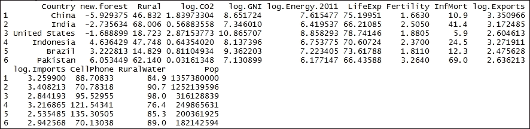

### 步骤 3 - 转换数据

将变量居中并创建 z 分数是两种常见的数据分析活动，用于标准化数据。上述提到的数值变量需要创建 z 分数。`scale()`函数是一个通用函数，其默认方法是对数值矩阵的列进行居中或缩放。数据框`wbclust`被传递给`scale`函数。只有数值字段被考虑。结果存储在另一个数据框`wbnorm`中。

```py
 > wbnorm <- scale(wbclust[,2:13])
 > wbnorm

```

结果如下：

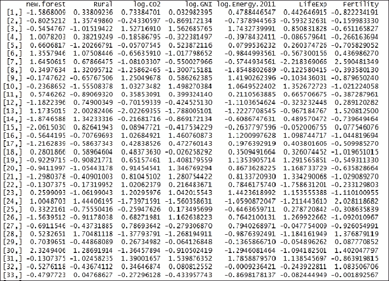

所有数据框都有一个`rownames`属性。为了检索或设置类似矩阵的对象的行或列名，使用`rownames()`函数。将具有第一列的数据框`wbclust`传递给`rownames()`函数。

```py
 > rownames(wbnorm)=wbclust[,1]
 > rownames(wbnorm)

```

函数调用`rownames(wbnorm)`的结果是显示第一列的值。结果如下：

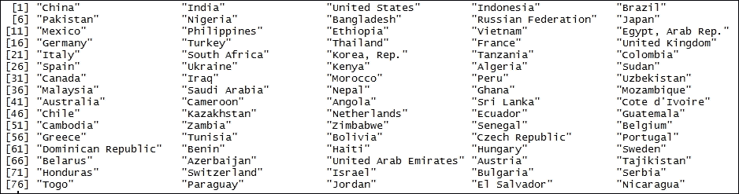

### 第 4 步 - 训练和评估模型性能

下一步是训练模型。第一步是计算距离矩阵。使用 `dist()` 函数。使用指定的距离度量，计算数据矩阵行之间的距离。使用的距离度量可以是欧几里得、最大、曼哈顿、Canberra、二进制或闵可夫斯基。使用的距离度量是欧几里得。欧几里得距离计算两个向量之间的距离为 *sqrt(sum((x_i - y_i)²))*。然后将结果存储在一个新的数据框中，`dist1`。

```py
> dist1 <- dist(wbnorm, method="euclidean")

```

下一步是使用 Ward 方法进行聚类。使用 `hclust()` 函数。为了对一个由 *n* 个对象的相似性集合进行聚类分析，使用 `hclust()` 函数。在第一阶段，每个对象被分配到它自己的聚类中。之后，在每一阶段，算法迭代并合并两个最相似的聚类。这个过程一直持续到只剩下一个聚类。`hclust()` 函数要求我们以距离矩阵的形式提供数据。`dist1` 数据框被传递。默认情况下，使用完全链接方法。有多个聚合方法可以使用，其中一些可能是 `ward.D`、`ward.D2`、`single`、`complete` 和 `average`。

```py
 > clust1 <- hclust(dist1,method="ward.D")
 > clust1

```

函数 `clust1` 的调用结果显示了使用的聚合方法、距离计算的方式以及对象的数量。结果如下：

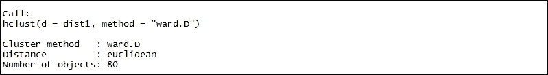

### 第 5 步 - 绘制模型

`plot()` 函数是一个用于绘制 R 对象的通用函数。在这里，`plot()` 函数用于绘制树状图：

```py
> plot(clust1,labels= wbclust$Country, cex=0.7, xlab="",ylab="Distance",main="Clustering for 80 Most Populous Countries")

```

结果如下：

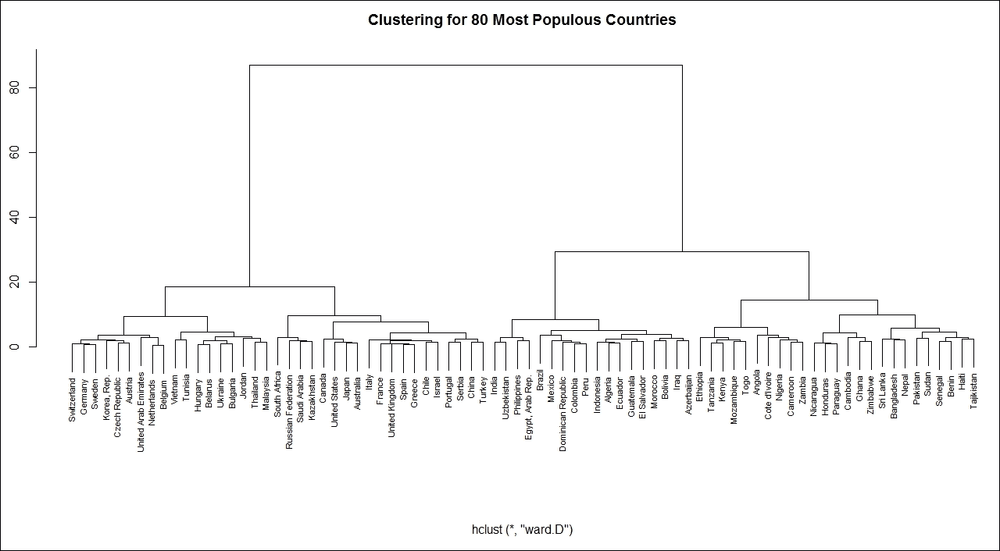

`rect.hclust()` 函数突出显示聚类并在树状图的分支周围绘制矩形。首先在某个级别上切割树状图，然后围绕选定的分支绘制矩形。

将对象 `clust1` 作为对象传递给函数，并指定要形成的聚类数量：

```py
> rect.hclust(clust1,k=5)

```

结果如下：

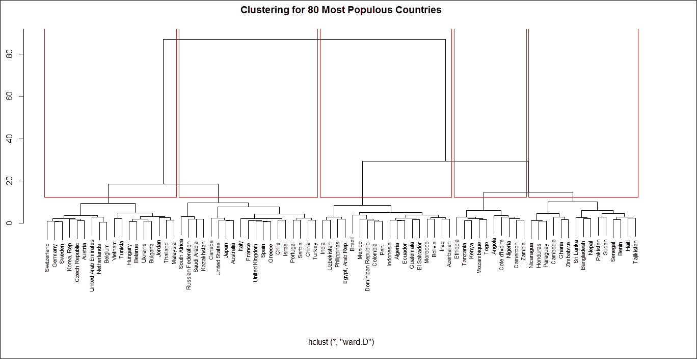

`cuts()` 函数应根据所需的组数或切割高度将树切割成多个组。在这里，将 `clust1` 作为对象传递给函数，并指定所需的组数：

```py
 > cuts=cutree(clust1,k=5)
 > cuts

```

结果如下：

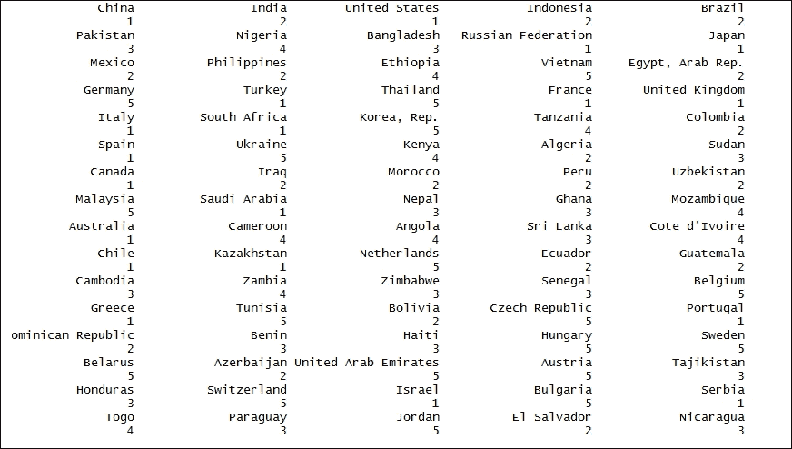

获取每个组的国家列表：

```py
for (i in 1:5){
 print(paste("Countries in Cluster ",i))
 print(wbclust$Country[cuts==i])
 print (" ")
}

```

结果如下：

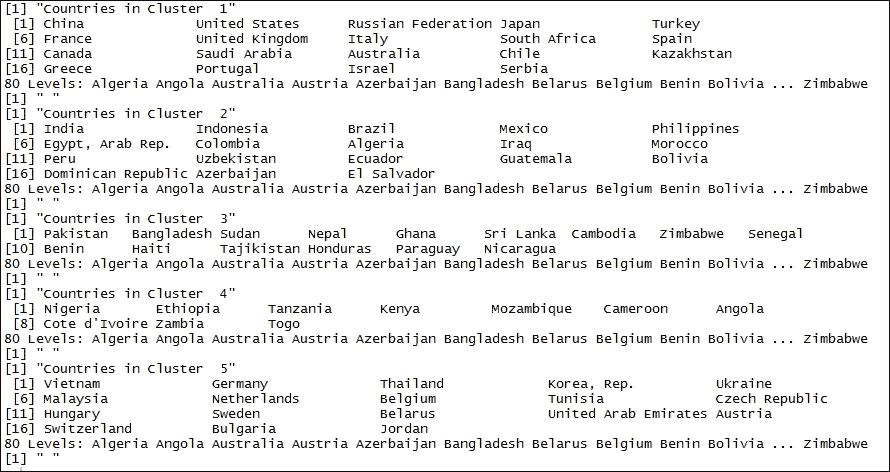

# 层次聚类 - 亚马逊雨林在 1999-2010 年间被烧毁

在 1999-2010 年之间，亚马逊雨林有 33,000 平方英里（85,500 平方公里），即 2.8%被烧毁。这是 NASA 领导的研究发现。研究的主要目的是测量森林冠层下火灾的蔓延程度。研究发现，燃烧的森林破坏的面积比农业和牧场清理森林土地时大得多。然而，无法在火灾和森林砍伐之间建立相关性。

关于火灾与森林砍伐之间无相关性的查询答案在于 NASA 的 Aqua 卫星上搭载的**大气红外探测器**（**AIRS**）仪器收集的湿度数据。火灾频率与夜间低湿度相吻合，这使得低强度地表火灾得以持续燃烧。

## 准备工作

为了执行层次聚类，我们将使用收集于亚马逊雨林的 dataset，该雨林从 1999 年至 2010 年发生火灾。

### 第 1 步 - 收集和描述数据

将使用`NASAUnderstory`数据集。该数据集以 CSV 格式作为`NASAUnderstory.csv`提供。数据集是标准格式。有 64 行数据，32 个变量。数值变量是：

+   `PlotID`

+   `SPHA`

+   `BLIT`

+   `ASMA`

+   `MOSS`

+   `LEGR`

+   `CHCA`

+   `GRAS`

+   `SEDG`

+   `SMTR`

+   `PTAQ`

+   `COCA`

+   `VAAN`

+   `GAHI`

+   `ARNU`

+   `LYOB`

+   `PIMA`

+   `RUBU`

+   `VAOX`

+   `ACSP`

+   `COCO`

+   `ACRU`

+   `TRBO`

+   `MACA`

+   `CLOB`

+   `STRO`

+   `FUNG`

+   `DILO`

+   `ERIO`

+   `GATR`

非数值变量是：

+   `Overstory Species`

+   `标签`

## 如何做...

让我们深入了解。

### 第 2 步 - 探索数据

### 注意

版本信息：本页面的代码在 R 版本 3.2.3（2015-12-10）上进行了测试。

让我们探索数据并了解变量之间的关系。我们将从导入名为`NASAUnderstory.csv`的文件开始。我们将把数据保存到`NASA`数据框中：

```py
> NASA = read.csv("d:/NASAU   nderstory.csv",header=T)

```

接下来，我们将获取每个物种列标签的长版本：

```py
 *>* NASA.lab=NASA$Labels

```

接下来，我们将打印`NASA.lab`数据框。它包含每个物种的完整名称，如所获得。

结果如下：

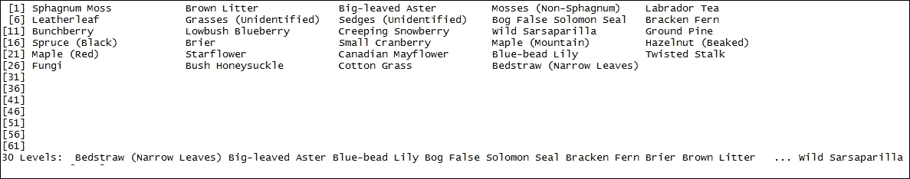

接下来，我们将整个数据内容传递到`NASA`数据框中：

```py
> NASA=NASA[,-32]

```

打印`NASA`数据框将显示整个数据内容。

```py
> NASA

```

结果如下：

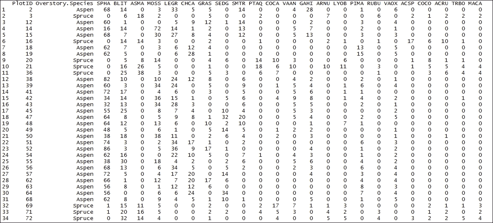

### 第 3 步 - 转换数据

接下来，将执行数据标准化。`scale()`函数将中心化和缩放前面提到的所有数值变量的列：

```py
> NASAscale <- scale(NASA[,3:31])

```

这将缩放`NASA`数据框中第`3`列到第`31`列之间的所有数值。

打印`NASAscale`数据框将显示所有缩放和居中的`NASAscale`值。

```py
> NASAscale

```

结果如下：

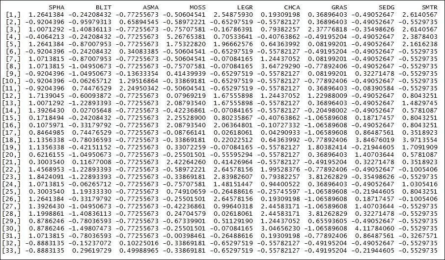

为了将向量编码为因子，使用 `factor` 函数。如果 `ordered` 参数为 `TRUE`，则假设因子级别是有序的。在这里，我们将 `OverstorySpecies` 列作为值传递给因子函数：

```py
> rownames(NASAscale)=as.factor(NASA$Overstory.Species) 

```

`as.factor()` 返回一个具有行名的数据框。

打印数据框 `rownames(NASAscale)` 会显示 `OverstorySpecies` 列的所有值：

```py
> rownames(NASAscale)

```

结果如下：

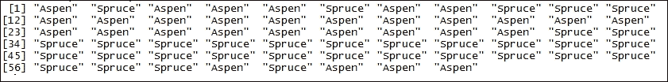

### 步骤 4 - 训练和评估模型性能

下一步是训练模型。第一步是计算距离矩阵。使用 `dist()` 函数。该函数使用指定的距离度量来计算数据矩阵行之间的距离。使用的距离度量可以是欧几里得、最大、曼哈顿、Canberra、二元或 Minkowski。使用的距离度量是欧几里得。欧几里得距离计算两个向量之间的距离为 *sqrt(sum((x_i - y_i)²))*。然后将结果存储在一个新的数据框 `dist1` 中。

```py
> dist1 <- dist(NASAscale, method="euclidean")

```

下一步是使用 Ward 方法进行聚类。使用 `hclust()` 函数。为了对一个由 *n* 个对象的相似性集合进行聚类分析，使用 `hclust()` 函数。在第一阶段，每个对象被分配到它自己的聚类中。然后算法在每个阶段迭代地连接两个最相似的聚类。这个过程一直持续到只剩下一个聚类为止。`hclust()` 函数需要我们以距离矩阵的形式提供数据。`dist1` 数据框被传递。默认情况下，使用完全连接方法。可以使用多种聚合方法，其中一些可能是 `ward.D`、`ward.D2`、`single`、`complete` 和 `average`。

```py
 > clust1 <- hclust(dist1,method="ward.D")
 > clust1

```

函数调用 `clust1` 会显示所使用的聚合方法、计算距离的方式以及对象的数量。结果如下：

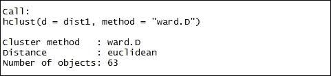

### 步骤 5 - 绘制模型

`plot()` 函数是 R 对象的通用绘图函数。在这里，使用 `plot()` 函数绘制树状图：

```py
> plot(clust1,labels= NASA[,2], cex=0.5, xlab="",ylab="Distance",main="Clustering for NASA Understory Data")

```

结果如下：

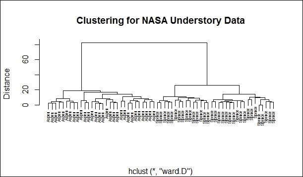

`rect.hclust()` 函数突出显示聚类并在树状图的分支周围绘制矩形。首先在某个级别上切割树状图，然后围绕选定的分支绘制矩形。

将对象 `clust1` 作为对象传递给函数，并指定要形成的聚类数量：

```py
> rect.hclust(clust1,k=2)

```

结果如下：

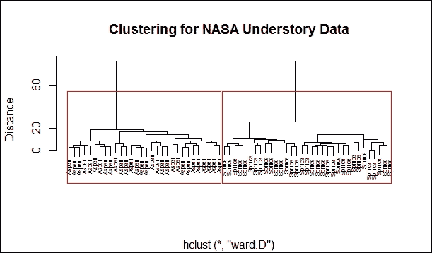

`cuts()` 函数根据所需的组数或切割高度将树切割成多个组。在这里，将 `clust1` 作为对象传递给函数，并指定所需的组数：

```py
 > cuts=cutree(clust1,k=2)
 > cuts

```

结果如下：

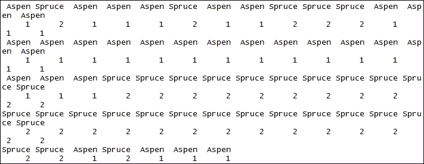

### 步骤 6 - 提高模型性能

首先需要加载以下包：

```py
> library(vegan)

```

`vegan` 库主要被群落和植被生态学家使用。它包含排序方法、多样性分析和其他功能。一些流行的工具包括**多样性分析、物种丰度模型、物种丰富度分析、相似性分析等等**。

下一步是使用距离方法 `jaccard` 训练以提高模型。第一步是计算距离矩阵。使用 `vegdist()` 函数。该函数计算成对距离。然后将结果存储在一个新的数据框 `dist1` 中。`jaccard` 系数衡量有限样本集之间的相似性。这是通过将交集的大小除以并集的大小来计算的：

```py
> dist1 <- vegdist(NASA[,3:31], method="jaccard", upper=T)

```

下一步是使用 Ward 方法进行聚类。使用 `hclust()` 函数：

```py
 > clust1 <- hclust(dist1,method="ward.D")
 > clust1

```

调用 `clust1` 函数会导致显示所使用的聚类方法、计算距离的方式以及对象的数量。结果如下：

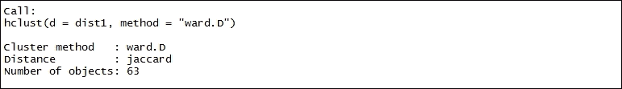

`plot()` 函数是 R 对象绘图的通用函数：

```py
> plot(clust1,labels= NASA[,2], cex=0.5, xlab="",ylab="Distance",main="Clustering for NASA Understory Data")

```

将 `clust1` 数据框作为对象传递给函数。`cex` 提供了相对于默认值的文本和符号放大数值。

结果如下：

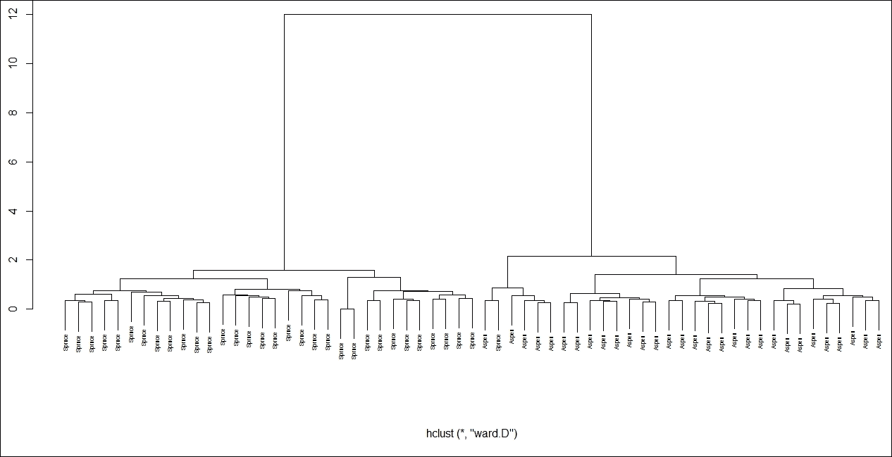

将对象 `clust1` 和要形成的聚类数量一起传递给函数：

```py
> rect.hclust(clust1,k=2)

```

结果如下：

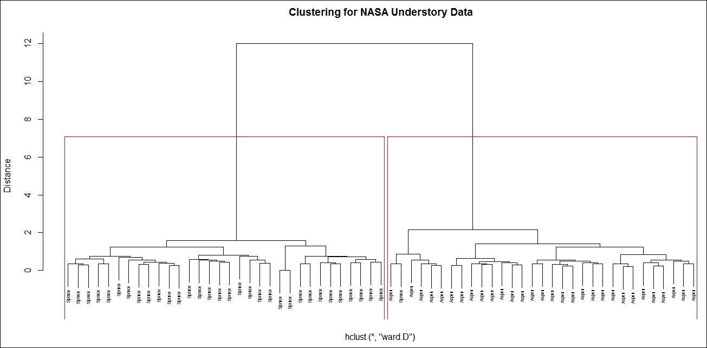

`cuts()` 函数应根据所需的组数或切割高度将树切割成多个组：

```py
 > cuts=cutree(clust1,k=2)
 > cuts

```

结果如下：

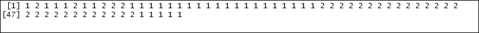

使用主成分分析使我们能够绘制两个聚类解决方案。

`clusplot()` 函数应绘制二维聚类图。在此，将 `NASA` 数据框作为对象传递。

结果如下：

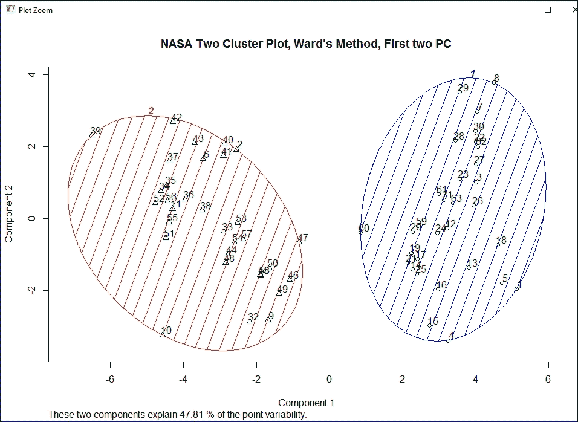

使用判别函数使我们能够绘制两个聚类解决方案。

`plotcluster()` 函数使用投影方法进行绘图，以区分给定的类别。各种投影方法包括经典判别坐标、投影均值和协方差结构差异的方法、非对称方法（将同质类与异质类分离）、基于局部邻域的方法以及基于鲁棒协方差矩阵的方法。

`clusplot()` 函数应绘制二维聚类图。在此，将 `NASA` 数据框作为对象传递：

```py
> clusplot(NASA, cuts, color=TRUE, shade=TRUE, labels=2, lines=0,  main="NASA Two Cluster  Plot, Ward's Method, First two PC")

```

结果如下：

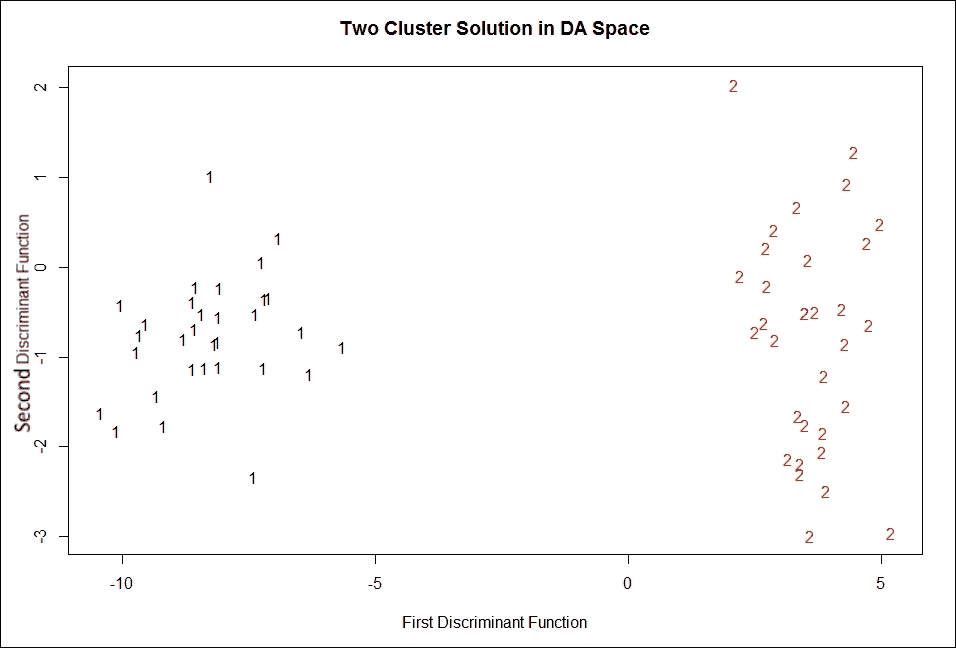

接下来，使用`t()`函数对`NASAscale`数据框进行转置：

```py
 > library(fpc)
 > NASAtrans=t(NASAscale)

```

下一步是使用 Minkowski 距离方法通过训练来提高模型。第一步是计算距离矩阵。使用`dist()`函数。

Minkowski 距离常用于变量在具有绝对零值的比率尺度上测量时。

```py
 > dist1 <- dist(NASAtrans, method="minkowski", p=3) 

```

下一步是使用 Ward 方法进行聚类分析。使用`hclust()`函数。

```py
 > clust1 <- hclust(dist1,method="ward.D")
 > clust1

```

调用`clust1`函数将显示所使用的聚合方法、计算距离的方式以及对象的数量。结果如下：

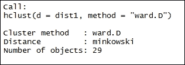

`plot()`函数是 R 对象绘图的通用函数。在这里，`plot()`函数用于绘制树状图：

```py
> plot(clust1,labels= NASA.lab[1:29], cex=1, xlab="",ylab="Distance",main="Clustering for NASA Understory Data")

```

结果如下：

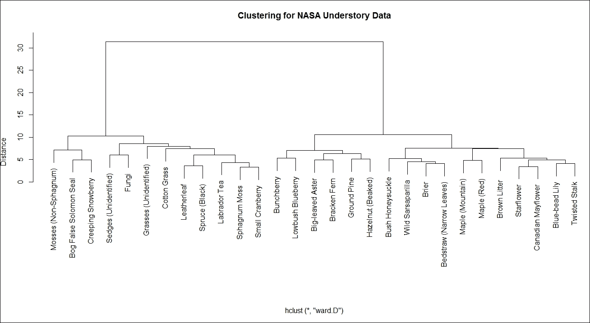

`rect.hclust()`函数将在树状图的分支周围绘制矩形，突出相应的簇。首先，在某个级别上切割树状图，然后围绕选定的分支绘制矩形。

将`clust1`对象作为对象传递给函数，同时指定要形成的簇数：

```py
> rect.hclust(clust1,k=3)

```

结果如下：

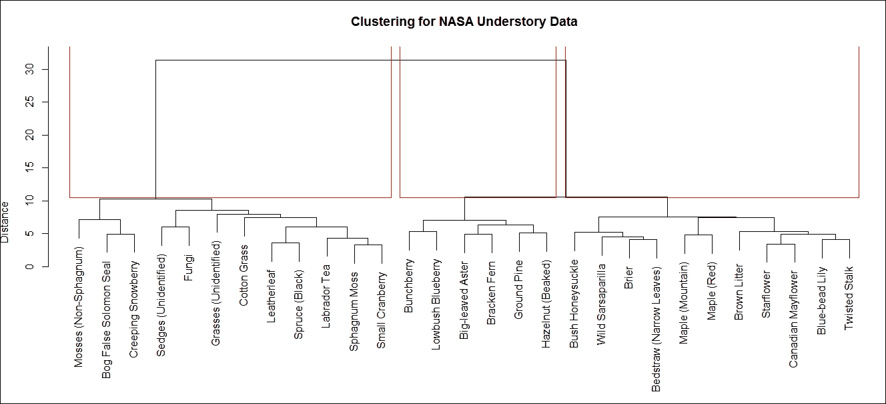

`cuts()`函数将根据所需的组数或切割高度将树切割成多个组。在这里，将`clust1`对象作为对象传递给函数，同时指定所需的组数：

```py
 > cuts=cutree(clust1,k=3)
 > cuts

```

结果如下：

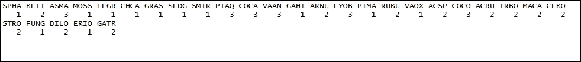

# 层次聚类 - 基因聚类

收集全基因组表达数据的能力是一项计算上复杂的任务。人类大脑由于其局限性无法解决这个问题。然而，通过将基因细分为更少的类别，然后进行分析，可以将数据细化到易于理解的水平。

聚类分析的目标是以一种方式细分一组基因，使得相似的项目落在同一个簇中，而不相似的项目落在不同的簇中。需要考虑的重要问题是关于相似性和对已聚类的项目的使用决策。在这里，我们将探索使用两种基因型的光感受器时间序列对基因和样本进行聚类。

## 准备中

为了执行层次聚类，我们将使用在老鼠身上收集的数据集。

### 第 1 步 - 收集和描述数据

将使用标题为`GSE4051_data`和`GSE4051_design`的数据集。这些数据集以`GSE4051_data.csv`和`GSE4051_design.csv`的 CSV 格式提供。数据集是标准格式。

在`GSE4051_data`中，有 29,949 行数据以及 39 个变量。数值变量包括：

+   `Sample_21`

+   `Sample_22`

+   `Sample_23`

+   `Sample_16`

+   `Sample_17`

+   `Sample_6`

+   `Sample_24`

+   `Sample_25`

+   `Sample_26`

+   `Sample_27`

+   `Sample_14`

+   `Sample_3`

+   `Sample_5`

+   `Sample_8`

+   `Sample_28`

+   `Sample_29`

+   `Sample_30`

+   `Sample_31`

+   `Sample_1`

+   `Sample_10`

+   `Sample_4`

+   `Sample_7`

+   `Sample_32`

+   `Sample_33`

+   `Sample_34`

+   `Sample_35`

+   `Sample_13`

+   `Sample_15`

+   `Sample_18`

+   `Sample_19`

+   `Sample_36`

+   `Sample_37`

+   `Sample_38`

+   `Sample_39`

+   `Sample_11`

+   `Sample_12`

+   `Sample_2`

+   `Sample_9`

在`GSE4051_design`数据集中有 39 行数据 和 4 个变量。数值变量是：

+   `sidNum`

非数值变量是：

+   `sidChar`

+   `devStage`

+   `gType`

## 如何操作...

让我们深入了解。

### 第 2 步 - 探索数据

### 注意

版本信息：本页面的代码在 R 版本 3.2.3（2015-12-10）中进行了测试

The `RColorBrewer` package is an R package from [`colorbrewer2.org`](http://colorbrewer2.org)  and provides color schemes for maps and other graphics.

The `pvclust` package is used for assessing uncertainty in hierarchical cluster analysis. In hierarchical clustering, each of the clusters calculates p-values via multi-scale bootstrap resampling. The p-value of a cluster is measured between 0 and 1\. There are two types of p-value available: **approximately** **unbiased** (**AU**) and **bootstrap probability** (**BP**) value. The AU p-value is calculated using the multi-scale bootstrap resampling method, while the ordinary bootstrap resampling method is used to calculate the BP p-value. The AU p-value has superiority bias compared to the BP p-value.

LaTeX 格式的表格由`xtable`包生成。使用`xtable`，可以将特定包的 R 对象转换为`xtables`。然后，这些`xtables`可以以 LaTeX 或 HTML 格式输出。

The `plyr` package is used as a tool for carrying out **split-apply-combine** (**SAC**) procedures. It breaks a big problem down into manageable pieces, operates on each piece, and then puts all the pieces back together.

The following packages must be loaded:

```py
 > library(RColorBrewer)
 > library(cluster)
 > library(pvclust)
 > library(xtable)
 > library(plyr)

```

让我们探索数据并了解变量之间的关系。我们将从导入名为`GSE4051_data.csv`的 CSV 文件开始。我们将数据保存到`GSE4051_data`数据框中：

```py
> GSE4051_data =read.csv("d:/ GSE4051_data.csv",header=T)

```

接下来，我们将打印关于`GSE4051_data`数据框的信息。`str()`函数返回关于`GSE4051_data`数据框结构的信息。它紧凑地显示`GSE4051_data`数据框的内部结构。`max.level`表示用于显示嵌套结构的最大嵌套级别：

```py
> str(GSE4051_data, max.level = 0) 

```

结果如下：

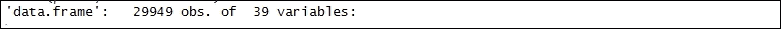

接下来，我们将导入名为`GSE4051_design.csv`的 CSV 文件。我们将数据保存到`GSE4051_design`数据框中：

```py
> GSE4051_design =read.csv("d:/ GSE4051_design.csv",header=T)

```

前一行打印了`GSE4051_design`数据框的内部结构。

结果如下：

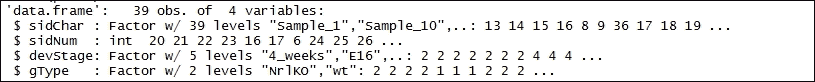

### 第 3 步 - 转换数据

为了便于后续的可视化，对行进行了缩放。由于当前所需的基因表达之间的绝对差异，因此执行了行的缩放。

变量中心化和创建 z 分数是两种常见的数据分析活动。`scale`函数对数值矩阵的列进行中心化和/或缩放。

转置矩阵。将`GSE4051_data`数据框传递以进行数据框的转置：

```py
> trans_GSE4051_data <- t(scale(t(GSE4051_data)))

```

接下来，我们将打印有关`GSE4051_data`数据框的信息。使用`give.attr = FALSE`，不显示属性作为子结构。

```py
> str(trans_GSE4051_data, max.level = 0, give.attr = FALSE)

```

结果如下：

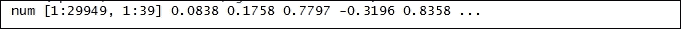

`head()`函数返回向量、矩阵、表格、数据框或函数的第一部分。`GSE4051_data`和`trans_GSE4051_data`数据框作为对象传递。`rowMeans()`函数计算行的平均值。`data.frame()`函数创建数据框，它们是紧密耦合的变量集合，并共享许多矩阵的性质：

```py
 > round(data.frame(avgBefore = rowMeans(head(GSE4051_data)), 
avgAfter = rowMeans(head(trans_GSE4051_data)), 
varBefore = apply(head(GSE4051_data), 1, var), 
                      varAfter = apply(head(trans_GSE4051_data),                      1, var)), 2)

```

结果如下：

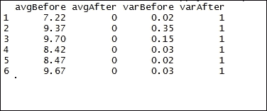

### 步骤 4 - 训练模型

下一步是训练模型。第一步是计算距离矩阵。使用`dist()`函数。该函数使用指定的距离度量来计算数据矩阵行之间的距离。使用的距离度量可以是欧几里得、最大值、曼哈顿、Canberra、二元或闵可夫斯基。使用的距离度量是欧几里得。欧几里得距离计算两个向量之间的距离为*sqrt(sum((x_i - y_i)²))*。使用转置的`trans_GSE4051_data`数据框来计算距离。然后将结果存储在`pair_dist_GSE4051_data`数据框中。

```py
> pair_dist_GSE4051_data <- dist(t(trans_GSE4051_data), method = 'euclidean')

```

接下来，使用`interaction()`函数，该函数计算并返回一个包含`gType`、`devStage`变量交互作用的未排序因子。未排序因子的结果与数据框`GSE4051_design`一起传递给`with()`函数，从而创建一个表示`gType`、`devStage`变量交互作用的新因子：

```py
> GSE4051_design$group <- with(GSE4051_design, interaction(gType, devStage))

```

使用`summary()`函数来生成数据框`GSE4051_design$group`的结果摘要：

```py
> summary(GSE4051_design$group)

```

结果如下：

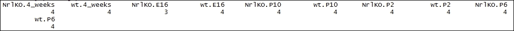

接下来，执行使用各种连接类型的层次聚类计算。

使用`hclust()`函数。为了对*n*个对象的相似性集进行聚类分析，使用`hclust()`函数。在第一阶段，每个对象被分配到它自己的簇中。然后算法在每个阶段迭代地连接两个最相似的簇。这个过程一直持续到只剩下一个簇为止。`hclust()`函数需要我们以距离矩阵的形式提供数据。`pair_dist_GSE4051_data`数据框被传递。

聚合法`single`作为第一种情况使用：

```py
> pr.hc.single <- hclust(pair_dist_GSE4051_data, method = 'single')

```

调用`pr.hc.single`会导致显示使用的聚合法、距离计算方式以及对象的数量：

```py
> pr.hc.single

```

结果如下：

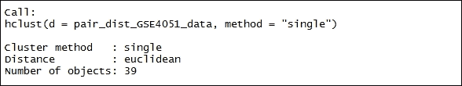

聚类方法 `complete` 被用作第二个案例：

```py
> pr.hc.complete <- hclust(pair_dist_GSE4051_data, method = 'complete')

```

调用 `pr.hc.complete` 将显示所使用的聚类方法、计算距离的方式以及对象的数量：

```py
> pr.hc.complete

```

结果如下：

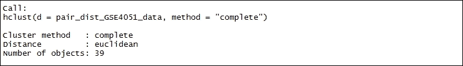

聚类方法 `average` 被用作第三个案例：

```py
> pr.hc.average <- hclust(pair_dist_GSE4051_data, method = 'average')

```

调用 `pr.hc.average` 将显示所使用的聚类方法、计算距离的方式以及对象的数量：

```py
> pr.hc.average

```

结果如下：

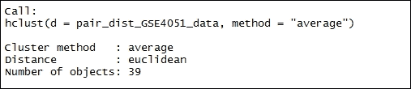

聚类方法 ward 被用作第四个案例：

```py
> pr.hc.ward <- hclust(pair_dist_GSE4051_data, method = 'ward.D2')

```

调用 `pr.hc.ward` 将显示所使用的聚类方法、计算距离的方式以及对象的数量：

```py
> pr.hc.ward

```

结果如下：

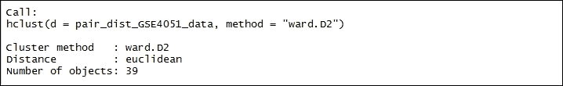

```py
> op <- par(mar = c(0,4,4,2), mfrow = c(2,2))

```

`plot()` 函数是用于绘制 R 对象的通用函数。

第一次调用 `plot()` 函数时，将 `pr.hc.single` 数据框作为对象传递：

```py
> plot(pr.hc.single, labels = FALSE, main = "Single Linkage Representation", xlab = "")

```

结果如下：

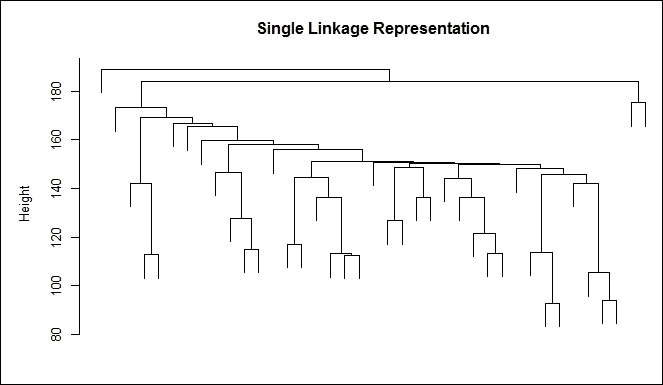

第二次调用 `plot()` 函数时，将 `pr.hc.complete` 数据框作为对象传递：

```py
> plot(pr.hc.complete, labels = FALSE, main = "Complete Linkage Representation", xlab = "")

```

结果如下：

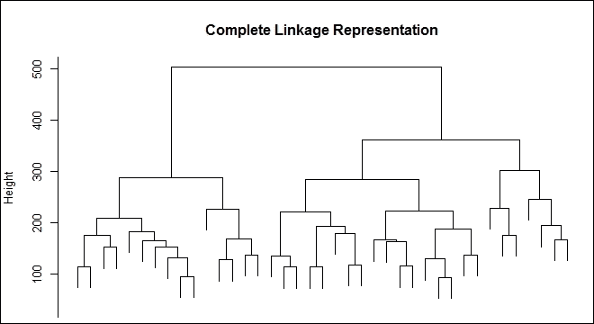

第三次调用 `plot()` 函数时，将 `pr.hc.average` 数据框作为对象传递：

```py
> plot(pr.hc.average, labels = FALSE, main = "Average Linkage Representation", xlab = "")

```

结果如下：

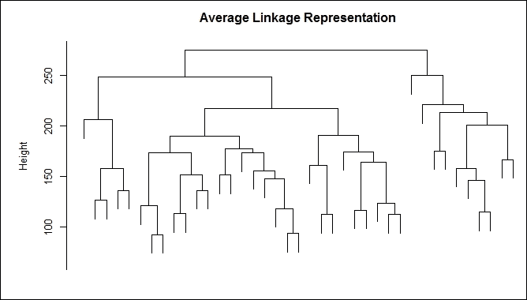

第四次调用 `plot()` 函数时，将 `pr.hc.ward` 数据框作为对象传递：

```py
> plot(pr.hc.ward, labels = FALSE, main = "Ward Linkage Representation", xlab = "")

```

结果如下：

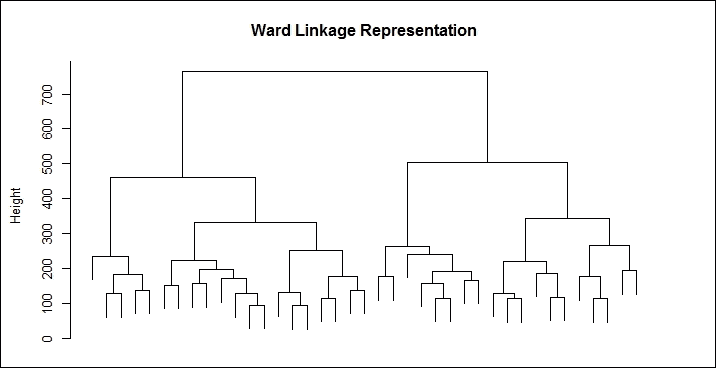

```py
 > par(op)
 > op <- par(mar = c(1,4,4,1))

```

### 步骤 5 - 绘制模型

`plot()` 函数是用于绘制 R 对象的通用函数。在这里，`plot()` 函数被用来绘制树状图。

`rect.hclust()` 函数应在树状图的分支周围绘制矩形，突出显示相应的聚类。首先在某个级别上切割树状图，然后围绕选定的分支绘制矩形。

`RColorBrewer` 使用 [`colorbrewer2.org/`](http://colorbrewer2.org/) 上的工作来为 R 中的图形选择合理的颜色方案。

颜色被分为三个组：

+   顺序：低数据--浅色；高数据--深色

+   分离：中间范围数据--浅色；低和高范围数据--对比深色

+   定性：颜色被设计用来突出显示类别之间的最大视觉差异

`RColorBrewer` 的重要功能之一是 `brewer.pal()`。此函数允许用户通过传递颜色数量和调色板名称来从 `display.brewer.all()` 函数中选择。

作为第一个案例，`pr.hc.single` 被作为对象传递给 `plot()` 函数：

```py
 > plot(pr.hc.single, labels = GSE4051_design$group, cex = 0.6, main = "Single Hierarchical Cluster - 10 clusters")
 > rect.hclust(clust1,k=5)

```

结果如下：

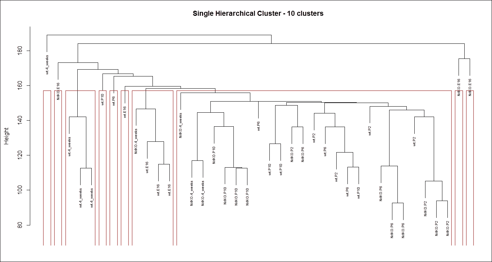

接下来，我们使用 `single` 聚类方法创建热图。默认情况下，`heatmap()` 函数使用聚类方法 `euclidean`：

```py
     > par(op)
     > jGraysFun <- colorRampPalette(brewer.pal(n = 9, "Blues"))
     > gTypeCols <- brewer.pal(9, "Spectral")[c(4,7)]
     > heatmap(as.matrix(trans_GSE4051_data), Rowv = NA, col = jGraysFun(256), hclustfun = function(x) hclust(x, method = 'single'),
scale = "none", labCol = GSE4051_design$group, labRow = NA, margins = c(8,1), 
 ColSideColor = gTypeCols[unclass(GSE4051_design$gType)])
     > legend("topright", legend = levels(GSE4051_design$gType), col = gTypeCols, lty = 1, lwd = 5, cex = 0.5)

```

结果如下：

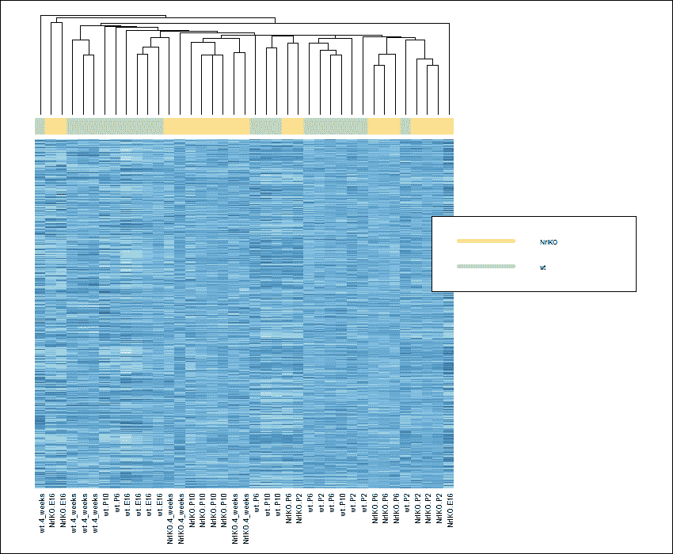

作为第二个案例，`pr.hc.complete` 作为对象传递给 `plot()` 函数：

```py
 > plot(pr.hc.complete, labels = GSE4051_design$group, cex = 0.6, main = "Complete Hierarchical Cluster - 10 clusters")
 > rect.hclust(pr.hc.complete, k = 10)

```

结果如下：

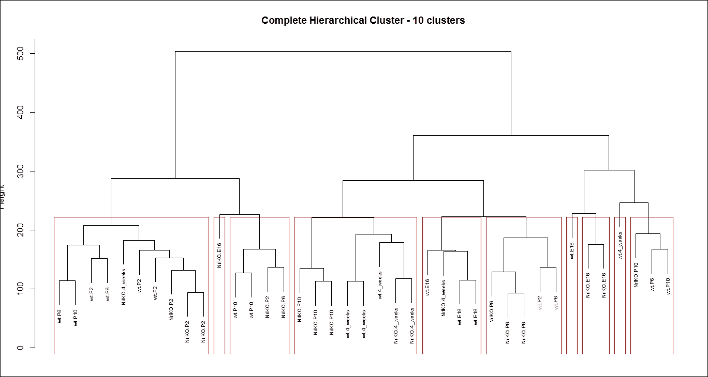

接下来，我们使用 `complete` 聚类方法创建热图。

```py
    > par(op)
    > jGraysFun <- colorRampPalette(brewer.pal(n = 9, "Greens"))
    > gTypeCols <- brewer.pal(11, "PRGn")[c(4,7)]
> heatmap(as.matrix(trans_GSE4051_data), Rowv = NA, col = jGraysFun(256), hclustfun = function(x) hclust(x, method = 'complete'), 
 scale = "none", labCol = GSE4051_design$group, labRow = NA, margins = c(8,1),
 ColSideColor = gTypeCols[unclass(GSE4051_design$gType)])
    > legend("topright", legend = levels(GSE4051_design$gType), col = gTypeCols, lty = 1, lwd = 5, cex = 0.5)

```

结果如下：

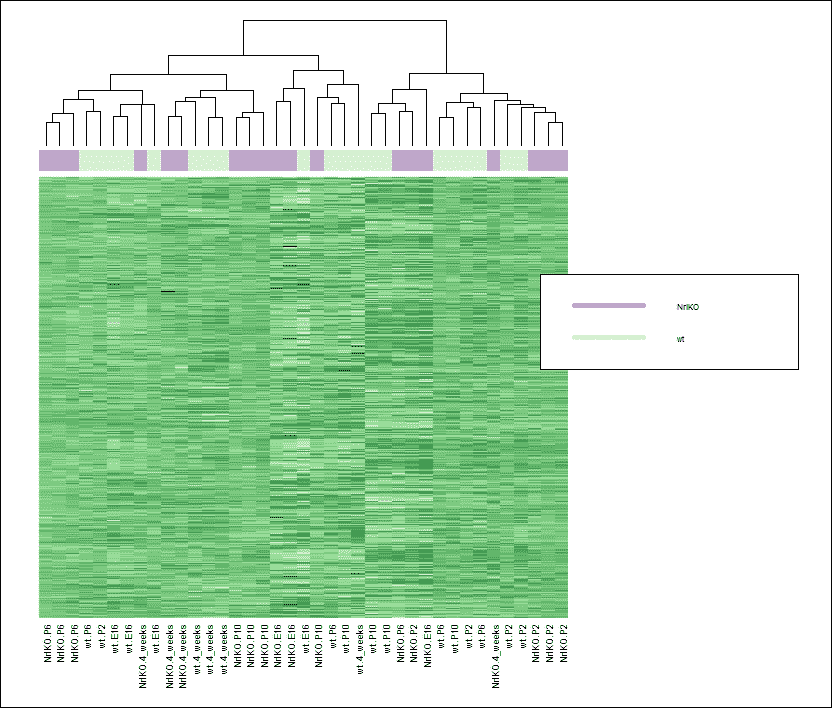

作为第三个案例，`pr.hc.average` 作为对象传递给 `plot()` 函数：

```py
 > plot(pr.hc.average, labels = GSE4051_design$group, cex = 0.6, main = "Average Hierarchical Cluster - 10 clusters")
 > rect.hclust(pr.hc.average, k = 10)

```

结果如下：

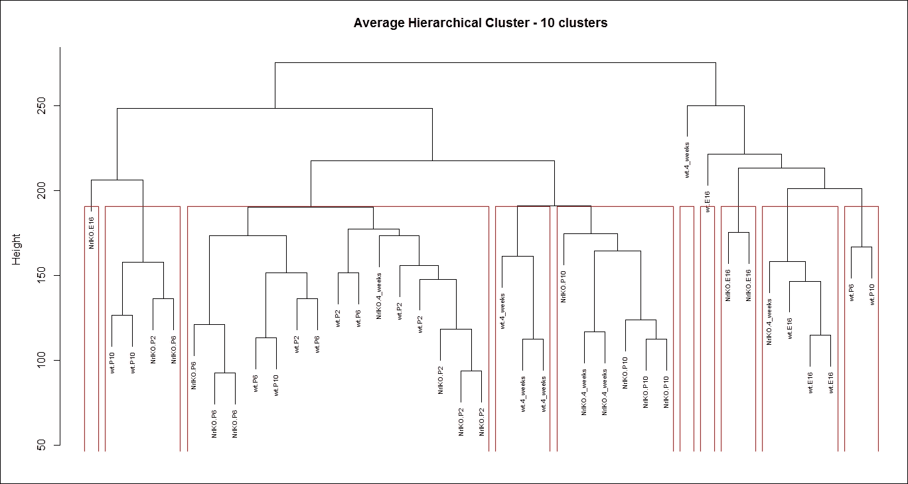

接下来，我们使用 `average` 聚类方法创建热图：

```py
    > jGraysFun <- colorRampPalette(brewer.pal(n = 9, "Oranges"))
    > gTypeCols <- brewer.pal(9, "Oranges")[c(4,7)]
> heatmap(as.matrix(trans_GSE4051_data), Rowv = NA, col = jGraysFun(256), hclustfun = function(x) hclust(x, method = 'average'), 
scale = "none", labCol = GSE4051_design$group, labRow = NA, margins = c(8,1), 
 ColSideColor = gTypeCols[unclass(GSE4051_design$gType)])
    > legend("topright", legend = levels(GSE4051_design$gType), col = gTypeCols, lty = 1, lwd = 5, cex = 0.5)

```

结果如下：

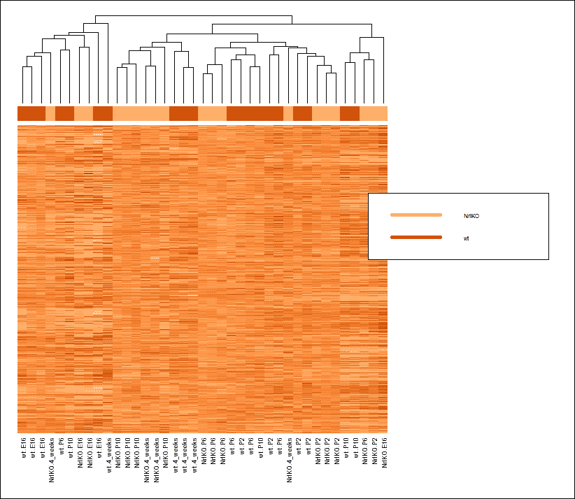

作为第四个案例，`pr.hc.ward` 作为对象传递给 `plot()` 函数：

```py
 > plot(pr.hc.ward, labels = GSE4051_design$group, cex = 0.6, main = "Ward Hierarchical Cluster - 10 clusters")
 > rect.hclust(pr.hc.ward, k = 10)

```

结果如下：

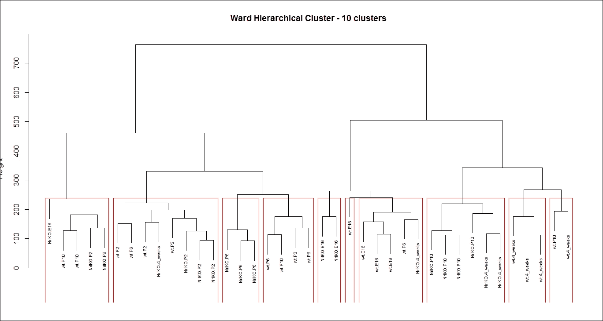

接下来，我们使用 `ward` 聚类方法创建热图：

```py
 > jGraysFun <- colorRampPalette(brewer.pal(n = 9, "Reds")) 
 > gTypeCols <- brewer.pal(9, "Reds")[c(4,7)] 
 > heatmap(as.matrix(trans_GSE4051_data), Rowv = NA, col = jGraysFun(256), hclustfun = function(x) hclust(x, method = 'ward.D2'), 
 scale = "none", labCol = GSE4051_design$group, labRow = NA, margins = c(8,1), 
 ColSideColor = gTypeCols[unclass(GSE4051_design$gType)]) 
 > legend("topright", legend = levels(GSE4051_design$gType), col = gTypeCols, lty = 1, lwd = 5, cex = 0.5)

```

结果如下：

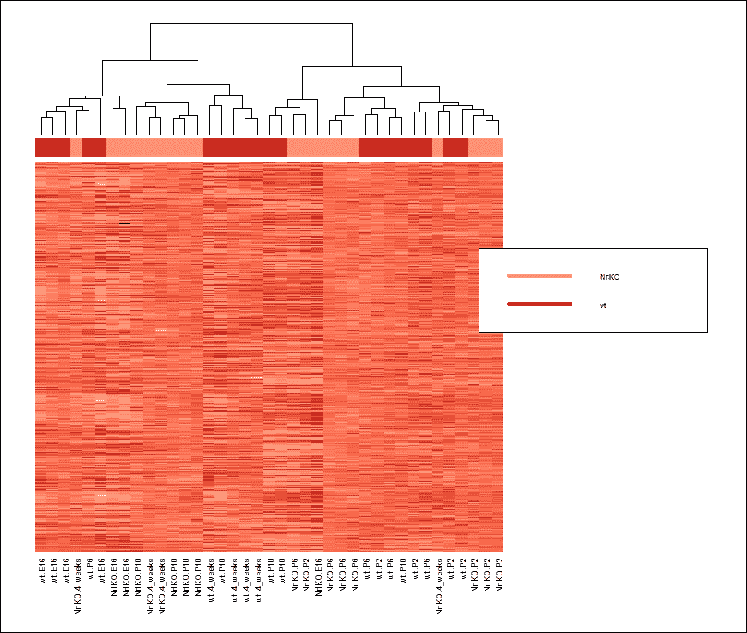

# 二元聚类 - 数学测试

在教育体系中，测试和考试是主要特征。考试系统的优势在于它可以作为区分表现好与差的一种方式。考试系统使学生有责任提升到下一个标准，他们应该参加并通过考试。它使学生有责任定期学习。考试系统使学生为应对未来的挑战做好准备。它帮助他们分析原因，并在固定时间内有效地传达他们的想法。另一方面，也注意到一些缺点，如学习慢的学生在测试中表现不佳，这会在学生中造成低劣的复杂性。

## 准备工作

为了执行二元聚类，我们将使用在数学测试中收集的数据集。

### 步骤 1 - 收集和描述数据

将使用标题为 `math test` 的数据集。该数据集以 `math test.txt` 的 TXT 格式提供。数据集是标准格式。有 60 行数据。有 60 列。列是 55 名男生的项目得分。

## 如何操作...

让我们深入了解。

### 步骤 2 - 探索数据

### 注意

版本信息：本页面的代码在 R 版本 3.2.3（2015-12-10）上进行了测试。

让我们探索数据并了解变量之间的关系。我们将从导入名为 `ACT math test.txt` 的 TXT 文件开始。我们将数据保存到 `Mathtest` 数据框中：

```py
> Mathtest = read.table("d:/math test.txt",header=T)

```

### 步骤 3 - 训练和评估模型性能

接下来，我们将对项目进行聚类。根据学生的分数，将项目分组在一起。

首先，我们将根据平方欧几里得距离计算总的不匹配数。

调用 `dist()` 函数。将 `Mathtest` 数据框作为输入传递给 `dist()` 函数。根据平方欧几里得距离计算总的不匹配数，结果应存储在 `dist.items` 数据框中：

```py
> dist.items <- dist(Mathtest[,-1], method='euclidean')²

```

接下来，我们将打印 `dist.items` 数据框。

```py
> dist.items

```

结果如下：

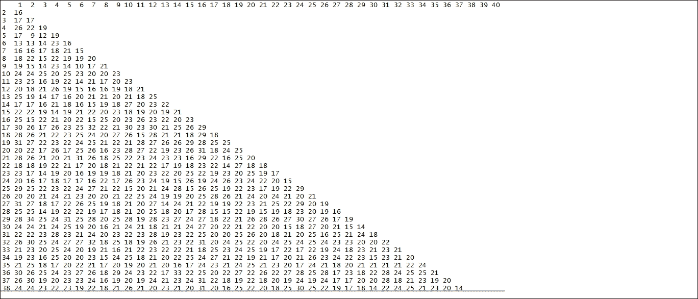

接下来，距离度量完全忽略 `0-0` 匹配。在 `dist()` 函数中应使用二进制方法。在二进制方法中，非零元素处于开启状态，而零元素处于关闭状态，因为向量被视为二进制位。

```py
> dist.items.2 <- dist(Mathtest[,-1], method='binary')

```

接下来，我们将打印数据框 `dist.items.2` 以观察结果。

结果如下：

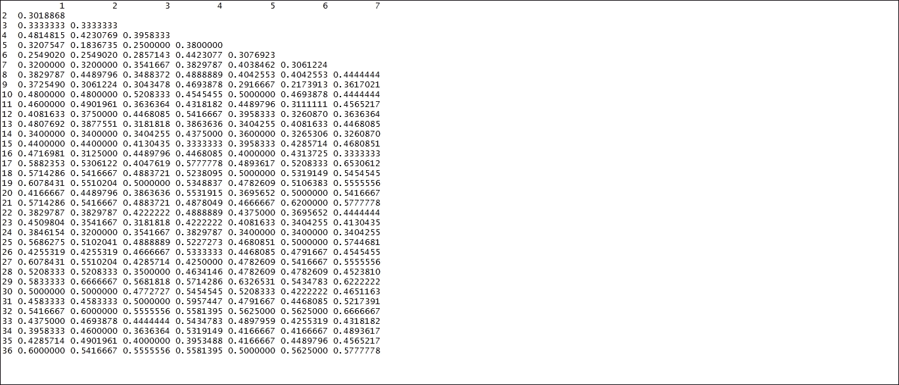

接下来，距离度量完全忽略 `1-1` 匹配。在 `dist()` 函数中应使用二进制方法。在二进制方法中，非零元素处于开启状态，而零元素处于关闭状态，因为向量被视为二进制位。

```py
> dist.items.3 <- dist(1 - Mathtest[,-1], method='binary')

```

接下来，我们将打印数据框 `dist.items.3` 以观察结果。

结果如下：

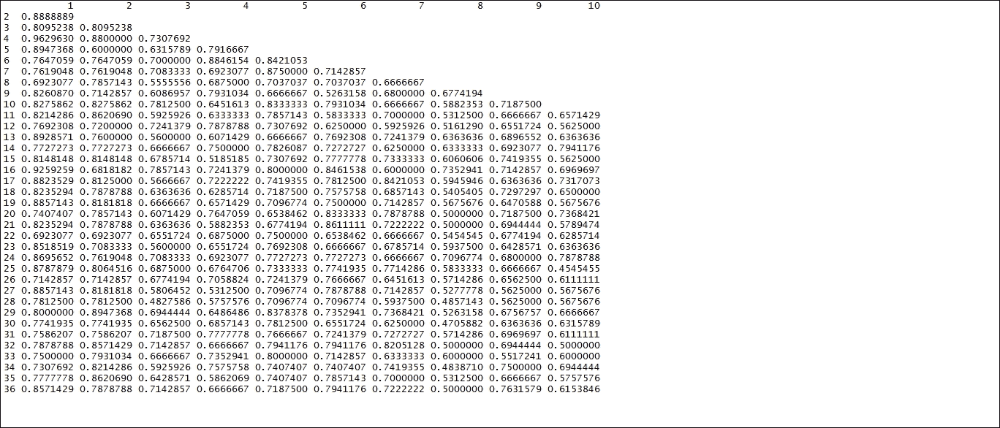

下一步是使用 `complete` 方法进行聚类。使用 `hclust()` 函数。为了对 *n* 个对象的相似性集进行聚类分析，使用 `hclust()` 函数。在第一阶段，每个对象都被分配到它自己的簇中。然后算法在每个阶段迭代地连接两个最相似的簇。这个过程一直持续到只剩下一个簇为止。`hclust()` 函数要求我们以距离矩阵的形式提供数据。`dist1` 数据框被传递。默认情况下，使用完整链接方法。可以有多个聚合方法可供使用，其中一些可能是 `ward.D`、`ward.D2`、`single`、`complete` 或 `average`。

使用的方法是完整的。当使用完整方法时，形成的簇中任何对象与其他对象之间的最大距离：

```py
 > items.complete.link <- hclust(dist.items, method='complete')
 > items.complete.link

```

调用 `items.complete.link` 函数会导致显示所使用的聚合方法、计算距离的方式以及对象的数量。结果如下：

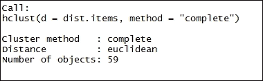

### 第 4 步 - 绘制模型

`plot()` 函数是 R 对象的通用绘图函数。在这里，`plot()` 函数用于绘制完整链接树状图。

完整链接用于层次聚类，并确保两个簇之间的距离是最大距离。在算法的每个步骤中使用完整链接时，将两个最近的簇合并在一起。这个过程迭代进行，直到整个数据集合并成一个单一的簇：

```py
> plot(items.complete.link, labels=Mathtest[,1], ylab="Distance")

```

结果如下：

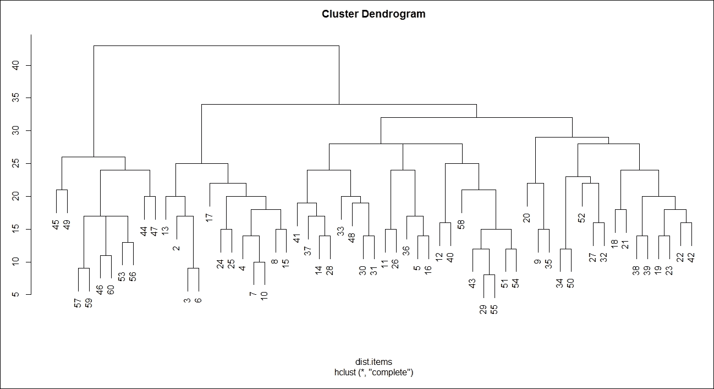

接下来，我们将在树状图上执行单链接。在单链接层次聚类中，每一步都是基于与其他对象的最小距离合并成两个簇，或者簇之间的最小成对距离：

```py
 > items.sing.link <- hclust(dist.items, method='single')
 > items.sing.link

```

调用 `items.sing.link` 函数将显示使用的聚合方法、距离计算方式以及对象数量。结果如下：

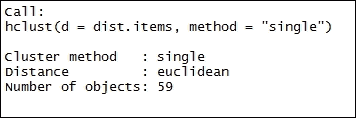

这里，`plot()` 函数用于绘制完整的链接树状图。`items.sing.link` 作为数据框传递：

```py
> plot(items.sing.link, labels=Mathtest[,1], ylab="Distance")

```

结果如下：

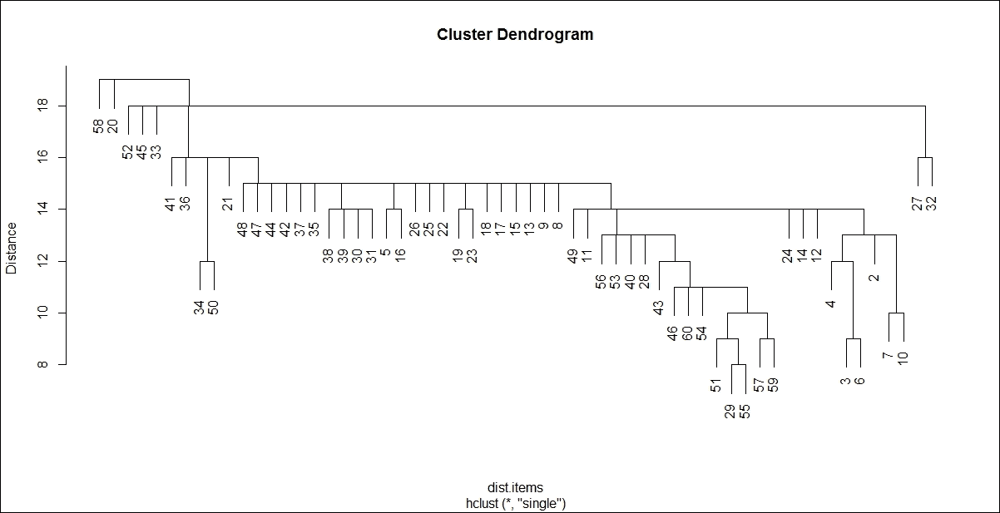

### 步骤 5 - K-medoids 聚类

加载 `cluster()` 库：

```py
> library(cluster)

```

为了计算平均轮廓宽度，我们编写了一个函数。

轮廓是指一种用于解释和验证数据簇内一致性的方法。为了提供对象在簇中的位置，该技术使用图形表示。轮廓范围在 -1 到 1 之间，其中 1 表示对象与其自身簇的最高匹配度，-1 表示对象与其自身簇的最低匹配度。在一个簇中，如果大多数对象具有高值，例如接近 1，则聚类配置是合适的。

```py
> my.k.choices <- 2:8

```

`rep()` 是一个通用函数，用于复制 `my.k.choices` 的值。结果存储在数据框 `avg.sil.width` 中：

```py
> avg.sil.width <- rep(0, times=length(my.k.choices))

```

**PAM** 代表 **基于聚类中心的划分**。PAM 要求用户知道期望的簇数（类似于 k-means 聚类），但它比 k-means 聚类进行更多的计算，以确保找到的聚类中心真正代表给定簇内的观测值。

```py
 > for (ii in (1:length(my.k.choices)) ){
 + avg.sil.width[ii] <- pam(dist.items, k=my.k.choices[ii])$silinfo$avg.width
 + }

```

打印带有轮廓值的选项值。

```py
> print( cbind(my.k.choices, avg.sil.width) )

```

结果如下：

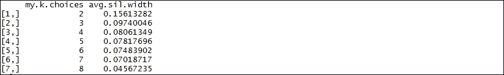

基于两个簇进行聚类：

```py
 > items.kmed.2 <- pam(dist.items, k=2, diss=T)
 > items.kmed.2

```

结果如下：

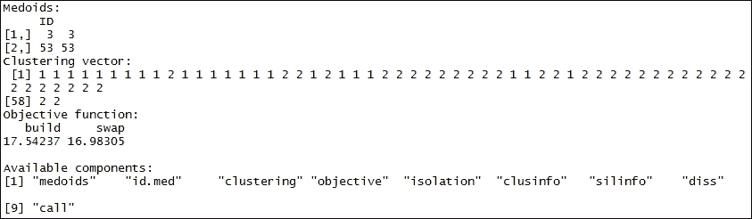

`lapply()` 函数是一个通用函数，用于复制 `my.k.choices` 的值。结果存储在数据框 `avg.sil.width` 中：

```py
 > items.2.clust <- lapply(1:2, function(nc) Mathtest[,1][items.kmed.2$clustering==nc]) 
 > items.2.clust

```

结果如下：

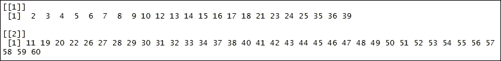

基于三个簇进行聚类。

```py
 > items.kmed.3 <- pam(dist.items, k=3, diss=T)
 > items.kmed.3

```

结果如下：

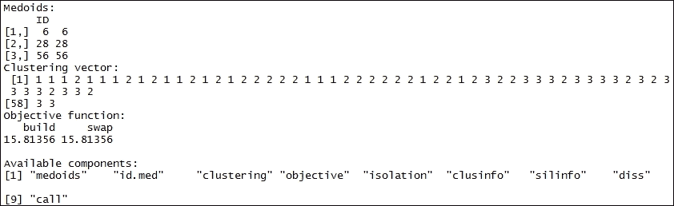

```py
 > items.3.clust <- lapply(1:3, function(nc) Mathtest[,1][items.kmed.3$clustering==nc])
 > items.3.clust

```

结果如下：

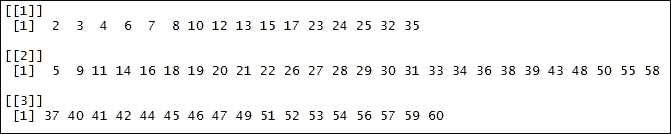

# K-means 聚类 - 欧洲国家蛋白质消耗

在医学和营养学领域，食物消费模式非常有趣。食物消费与个人的整体健康、食物的营养价值、购买食物项涉及的经济以及消费的环境相关。这项分析关注的是 25 个欧洲国家中肉类与其他食物项之间的关系。观察肉类与其他食物项之间的相关性很有趣。数据包括红肉、白肉、鸡蛋、牛奶、鱼类、谷物、淀粉类食物、坚果（包括豆类和油料种子）、水果和蔬菜的测量值。

## 准备中

为了执行 K-means 聚类，我们将使用收集的 25 个欧洲国家的蛋白质消费数据集。

### 步骤 1 - 收集和描述数据

标题为 `protein` 的数据集，该数据集为 CSV 格式，应被使用。数据集为标准格式。共有 25 行数据，包含 10 个变量。

数值变量是：

+   `红肉`

+   `白肉`

+   `鸡蛋`

+   `牛奶`

+   `鱼类`

+   `谷物`

+   `淀粉`

+   `坚果`

+   `水果和蔬菜`

非数值变量是：

+   `国家`

## 如何操作...

让我们深入了解。

### 步骤 2 - 探索数据

### 注意

版本信息：本页面的代码在 R 版本 3.2.3（2015-12-10）上进行了测试

让我们探索数据并了解变量之间的关系。我们将从导入名为 `protein.csv` 的 CSV 文件开始。我们将把数据保存到 `protein` 数据框中：

```py
> protein = read.csv("d:/Europenaprotein.csv",header=T)

```

`head()` 返回向量、矩阵、表、数据框或函数的第一部分或最后一部分。将 `protein` 数据框传递给 `head()` 函数。

```py
> head(protein)

```

结果如下：

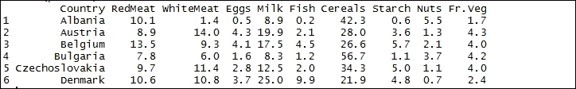

### 步骤 3 - 聚类

基于三个聚类开始聚类。

为了在初始阶段找到随机的聚类数量，调用 `set.seed()` 函数。`set.seed()` 函数的结果是生成随机数：

```py
> set.seed(123456789)

```

`kmeans()` 函数将对数据矩阵执行 K-means 聚类。`protein` 数据矩阵作为可以强制转换为数值矩阵的对象传递。`centers=3` 表示初始（不同）聚类中心的数量。由于聚类数量用数字表示，`nstart=10` 定义了要选择的随机集的数量：

```py
 > groupMeat <- kmeans(protein[,c("WhiteMeat","RedMeat")], centers=3, nstart=10)
 > groupMeat

```

结果如下：

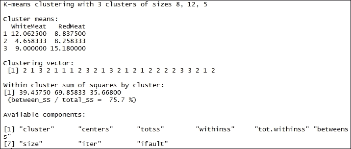

接下来，进行聚类分配的列表。`order()` 函数返回一个排列，它重新排列其第一个参数，以升序或降序排列。将数据框 `groupMeat` 作为数据框对象传递：

```py
> o=order(groupMeat$cluster)

```

调用 `data.frame()` 函数的结果是显示国家和它们所在的聚类：

```py
> data.frame(protein$Country[o],groupMeat$cluster[o])

```

结果如下：

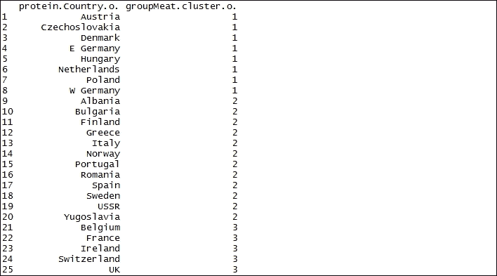

`plot()`函数是一个通用的绘图 R 对象函数。参数类型表示要绘制的图类型。`xlim`参数意味着应该给出范围的极限，而不是一个范围。`xlab`和`ylab`分别提供*x-*轴和*y-*轴的标题：

```py
 > plot(protein$Red, protein$White, type="n", xlim=c(3,19), xlab="Red Meat", ylab="White Meat")
 > text(x=protein$Red, y=protein$White, labels=protein$Country,col=groupMeat$cluster+1)

```

结果如下：

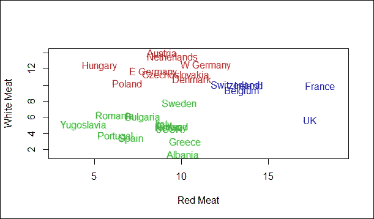

### 步骤 4 - 改进模型

接下来，对所有九个蛋白质组进行聚类，创建了七个簇。白色肉类与红色肉类的彩色散点图之间存在密切的相关性。地理位置相近的国家往往被聚类到同一个组。

`set.seed()`函数会导致随机数的生成：

```py
> set.seed(123456789)

```

`centers=7`表示初始（不同）簇中心的数量：

```py
 > groupProtein <- kmeans(protein[,-1], centers=7, nstart=10)
 > o=order(groupProtein$cluster)
 > data.frame(protein$Country[o],groupProtein$cluster[o])

```

形成了七个不同的簇。25 个国家中的每一个都被放置在一个簇中。

结果如下：

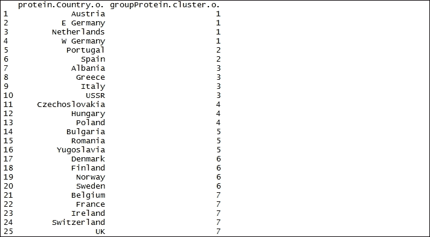

```py
 > library(cluster)

```

`clustplot()`函数创建了一个双变量图，可以将其可视化为数据的分区（聚类）。所有观测值都通过图中的点表示，使用主成分。在每个簇周围画一个椭圆。将数据框`protein`作为对象传递：

```py
> clusplot(protein[,-1], groupProtein$cluster, main='2D representation of the Cluster solution', color=TRUE, shade=TRUE, labels=2, lines=0)

```

结果如下：

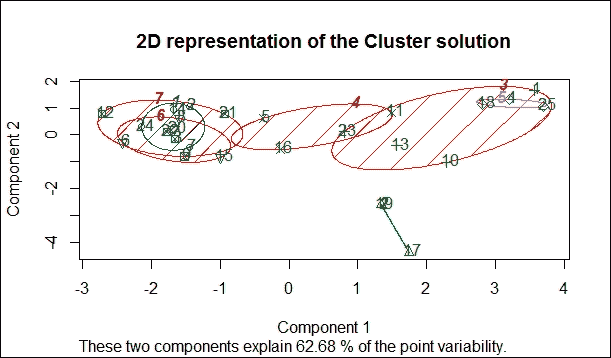

另一种方法是将其以层次形式查看。使用`agnes()`函数。通过将`diss=FALSE`，使用原始数据计算距离矩阵。`metric="euclidean"`表示使用欧几里得距离度量：

```py
 > foodagg=agnes(protein,diss=FALSE,metric="euclidean")
 > foodagg

```

结果如下：

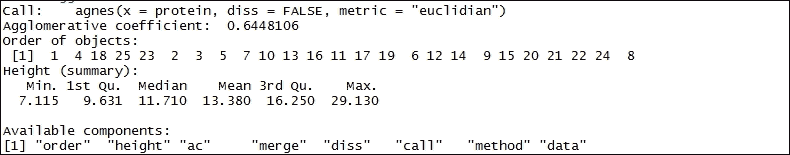

```py
> plot(foodagg, main='Dendrogram')

```

结果如下：

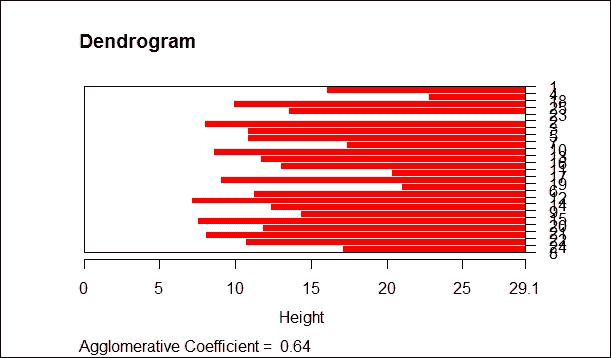

`cutree()`函数通过指定所需的组数或切割高度将树切割成几个组：

```py
> groups <- cutree(foodagg, k=4)

```

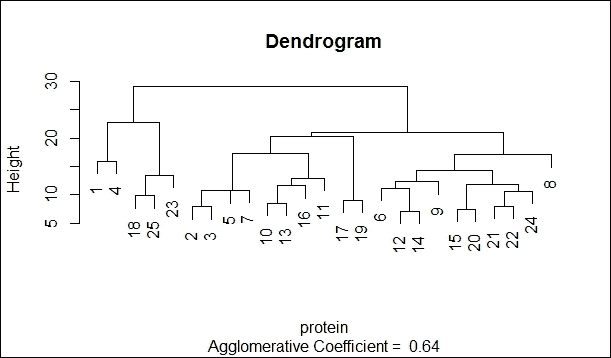

```py
> rect.hclust(foodagg, k=4, border="red")

```

结果如下：

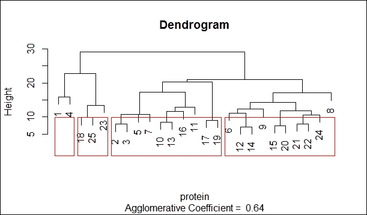

# K-means 聚类 - 食品

我们摄入的食物中的营养素可以根据它们在构建身体质量中的作用进行分类。这些营养素可以分为宏量营养素或必需的微量营养素。宏量营养素的一些例子是碳水化合物、蛋白质和脂肪，而必需的微量营养素的一些例子是维生素、矿物质和水。

## 准备工作

让我们从食谱开始。

### 步骤 1 - 收集和描述数据

为了执行 K-means 聚类，我们将使用收集的各种食品及其相应的`能量`、`蛋白质`、`脂肪`、`钙`和`铁`含量的数据集。数值变量包括：

+   `能量`

+   `蛋白质`

+   `脂肪`

+   `钙`

+   `铁`

非数值变量是：

+   `食品`

## 如何做...

让我们深入了解细节。

### 步骤 2 - 探索数据

### 注意

版本信息：本页面的代码在 R 版本 3.2.3（2015-12-10）中进行了测试。

加载`cluster()`库。

```py
> library(cluster)

```

让我们探索数据并了解变量之间的关系。我们将从导入名为 `foodstuffs.txt` 的文本文件开始。我们将数据保存到 `food.energycontent` 数据框中：

```py
> food.energycontent <- read.table("d:/foodstuffs.txt", header=T)

```

`head()` 函数返回向量、矩阵、表、数据框或函数的第一部分或最后一部分。`food.energycontent` 数据框传递给 `head()` 函数：

```py
> head(food.energycontent) 

```

结果如下：

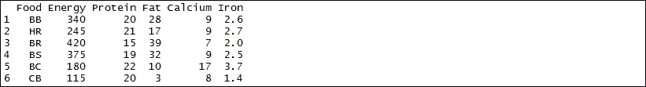

`str()` 函数返回有关 `food.energycontent` 数据框结构的提供信息。它紧凑地显示内部结构：

```py
> str(food.energycontent)

```

结果如下：

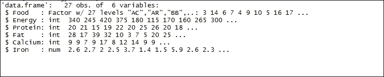

### 步骤 3 - 转换数据

`apply()` 函数对数据框和矩阵进行逐项更改。它返回一个向量、数组或列表，该列表是通过将函数应用于数组的边缘或矩阵的边缘而获得的值。2 表示函数将应用到的列子索引。`sd` 是标准差函数，它将应用于数据框：

```py
 > standard.deviation <- apply(food.energycontent[,-1], 2, sd)
 > standard.deviation

```

结果如下：

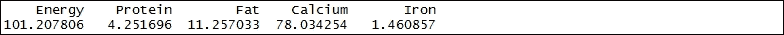

`sweep()` 函数返回一个从输入数组中通过清除汇总统计量获得的数组。`food.energycontent[,-1]` 作为数组传递。2 表示函数将应用到的列子索引。`standard.deviation` 是要清除的汇总统计量：

```py
 > foodergycnt.stddev <- sweep(food.energycontent[,-1],2,standard.deviation,FUN="/") 
 > foodergycnt.stddev

```

结果如下：

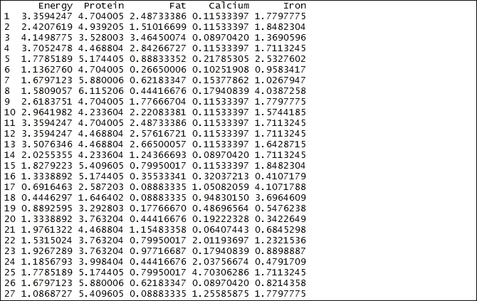

### 步骤 4 - 聚类

`kmeans()` 函数应在数据矩阵上执行 K-means 聚类。数据矩阵 `foodergycnt.stddev` 作为可以强制转换为数据数值矩阵的对象传递。`centers=5` 表示初始（不同）聚类中心的数量。`iter.max=100` 表示允许的最大迭代次数。由于聚类数量用数字表示，`nstart=25` 定义了要选择的随机集的数量：

```py
 > food.5cluster <- kmeans(foodergycnt.stddev, centers=5, iter.max=100, nstart=25)
 > food.5cluster

```

结果如下：

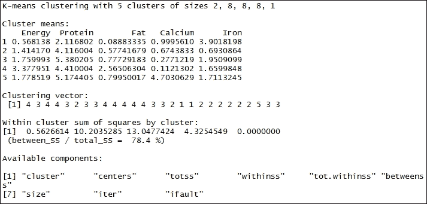

```py
 > food.4cluster <- kmeans(foodergycnt.stddev, centers=4, iter.max=100, nstart=25)
 > food.4cluster

```

结果如下：

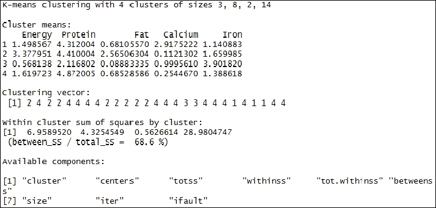

打印 4 聚类解决方案的聚类向量：

```py
> food.4cluster$cluster

```

结果如下：

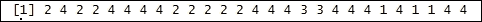

接下来，我们将按食品标签打印 4 聚类解决方案的聚类。

`lapply()` 函数返回一个与 X 长度相同的列表：

```py
 > food.4cluster.clust <- lapply(1:4, function(nc) protein[food.4cluster$cluster==nc])
 > food.4cluster.clust

```

结果如下：

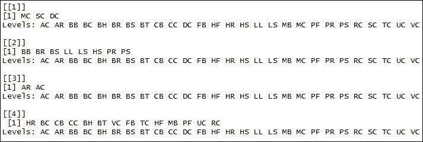

### 步骤 5 - 可视化聚类

使用 `pairs()` 函数，生成一个散点图矩阵。`food.energycontent[,-1]` 提供了作为矩阵或数据框的数值列的点坐标。

```py
> pairs(food.energycontent[,-1], panel=function(x,y) text(x,y,food.4cluster$cluster))

```

结果如下：

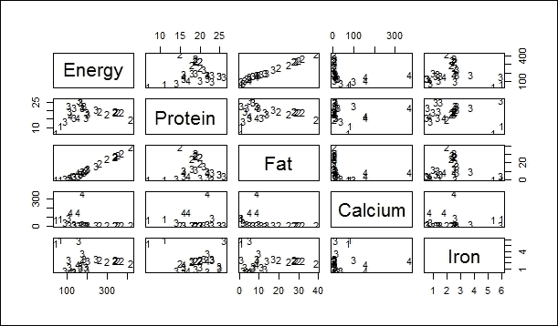

`princomp()`函数对给定的数值数据矩阵执行主成分分析。该函数产生一个未旋转的主成分分析。`cor=T`表示一个逻辑值，指示计算应使用相关矩阵：

```py
 > food.pc <- princomp(food.energycontent[,-1],cor=T)
 > my.color.vector <- rep("green", times=nrow(food.energycontent))
 > my.color.vector[food.4cluster$cluster==2] <- "blue"
 > my.color.vector[food.4cluster$cluster==3] <- "red"
 > my.color.vector[food.4cluster$cluster==4] <- "orange"

```

`par()`函数将多个图表组合成一个整体图形。`s`生成一个正方形绘图区域：

```py
> par(pty="s")

```

绘制聚类图：

```py
 > plot(food.pc$scores[,1], food.pc$scores[,2], ylim=range(food.pc$scores[,1]), 
 + xlab="PC 1", ylab="PC 2", type ='n', lwd=2)
 > text(food.pc$scores[,1], food.pc$scores[,2], labels=Food, cex=0.7, lwd=2,
 + col=my.color.vector)

```

结果如下：

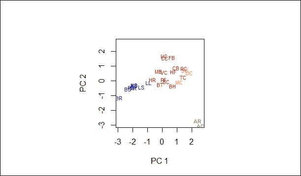
