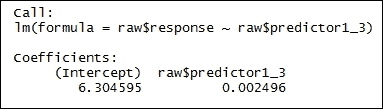
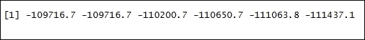

# 第五章。非线性

在本章中，我们将介绍以下食谱：

+   广义加性模型 - 测量新西兰的家庭收入

+   光滑样条 - 理解汽车和速度

+   局部回归 - 理解干旱预警和影响

# 广义加性模型 - 测量新西兰的家庭收入

收入调查提供了人们和家庭收入水平的快照。它给出了来自大多数来源的中位数和平均每周收入。存在不同人口群体之间的收入比较。收入是间歇性收到的，而消费是随时间平滑的。因此，可以合理地预期，消费与当前生活水平比当前收入更直接相关，至少在短期参考期内是这样。

## 准备工作

为了执行收缩方法，我们将使用 2013 年新西兰人口普查收集的数据集。

### 步骤 1 - 收集和描述数据

`nzcensus` 包包含超过 60 个新西兰人口统计值。这些值在网格块、面积单位、地区当局和地区议会级别累积。

## 如何做到这一点...

让我们深入了解。

### 步骤 2 - 探索数据

第一步是加载以下包：

```py
 > devtools::install_github("ellisp/nzelect/pkg2")
> library(leaflet)
> library(nzcensus)
> library(Metrics)
> library(ggplot2)
> library(scales)
> library(boot)
> library(dplyr)
> library(Hmisc)
> library(mgcv)
> library(caret)
> library(grid)
> library(stringr)
> library(ggrepel)
> library(glmnet)
> library(maps)

```

从数据集中删除查塔姆群岛。`AreaUnits2013` 是一个 esriGeometryPolygon 几何类型对象。它定义了来自 2013 年人口普查模式的面积单位：

```py
    > tmp <- AreaUnits2013[AreaUnits2013$WGS84Longitude> 0 & !is.na(AreaUnits2013$MedianIncome2013), ]

```

创建颜色调色板函数：

```py
    > palette <- colorQuantile("RdBu", NULL, n = 10)

```

为弹出窗口创建标签。`paste0()` 函数在转换为字符后将向量连接起来：

```py
    > labels <- paste0(tmp$AU_NAM, " $", format(tmp$MedianIncome2013, big.mark = ","))

```

绘制地图：

```py
> leaflet() %>%
+ addProviderTiles("CartoDB.Positron") %>%
+ addCircles(lng = tmp$WGS84Longitude, lat = tmp$WGS84Latitude,
+ color = pal(-tmp$MedianIncome2013),
+ popup = labs,
+ radius = 500) %>%
+ addLegend(
+ pal = pal,
+ values = -tmp$MedianIncome2013,
+ title = "Quantile of median<br>household income",
+ position = "topleft",
+ bins = 5) 

```

结果如下：


### 步骤 3 - 为模型设置数据

将数据整理成方便的形状。消除区域的代码和名称，以及冗余的坐标系：

```py
    > au <- AreaUnits2013 %>%     +  select(-AU2014, -AU_NAM, -NZTM2000Easting, -NZTM2000Northing) %>%     +  select(-PropWorked40_49hours2013, -Prop35to39_2013, -PropFemale2013)     > row.names(au) <- AreaUnits2013$AU_NAM

```

替换所有重复模式的实例。`gsub()` 函数搜索模式 `"_2013"`、`"2013"` 和 `"Prop"`，然后将它们替换为 `names(au)`：

```py
 names(au) <- gsub("_2013", "", names(au))
> names(au) <- gsub("2013", "", names(au))
> names(au) <- gsub("Prop", "", names(au))

```

获取一个逻辑向量，指示一组案例是否完整：

```py
    > au <- au[complete.cases(au), ]

```

提供一个通用名称：

```py
    > data_use <- au

```

探索 `data_use` 数据框的维度。`dim()` 函数返回 `data_use` 框架的维度。将 `data_use` 数据框作为输入参数传递。结果清楚地表明有 `1785` 行数据和 `69` 列：

```py
    > dim(data_use)

```

结果如下：


```py
    > data_use <- data_use[the_data$WGS84Longitude > 100, ]

```

从字符向量创建语法有效的名称并设置它们。`names()` 函数在从返回的字符向量创建语法有效的名称的同时设置 `data_use` 对象的名称：

```py
    > names(data_use) <- make.names(names(data_use))

```

显示从 `data_use` 数据框创建的名称：

```py
    > names(data_use)

```

结果如下：


### 步骤 4 - 构建模型

估计非参数模型的强度。`spearman2()`计算 Spearman 的 rho 秩相关系数的平方，以及其推广，其中*x*可以非单调地与*y*相关。这是通过计算*(rank(x), rank(x)²)*与*y*之间的 Spearman 多重 rho 平方来完成的：

```py
    > reg_data <- spearman2(MedianIncome ~ ., data = data_use)

```

按降序排列数据：

```py
    > reg_data[order(-reg_data[ ,6])[1:15], ]

```

结果如下：


将灵活的样条分配给前 15 个变量。`terms()`函数从多个 R 数据对象中提取`terms`对象：

```py
> reg_formula <- terms(MedianIncome ~
s(FullTimeEmployed, k = 6) +
s(InternetHH, k = 6) +
s(NoQualification, k = 5) +
s(UnemploymentBenefit, k = 5) +
s(Smoker, k = 5) +
s(Partnered, k = 5) +
s(Managers, k = 4) +
s(Bachelor, k = 4) +
s(SelfEmployed, k = 4) +
s(NoMotorVehicle, k = 4) +
s(Unemployed, k = 3) +
s(Labourers, k = 3) +
s(Worked50_59hours, k = 3) +
s(Separated, k = 3) +
s(Maori, k = 3) +
s(WGS84Longitude, WGS84Latitude) +
.,
data = data_use)

```

拟合广义加性模型。`reg_formula`是公式，而`data_use`是数据集。

```py
> gam_model <- gam(reg_formula, data = data_use) 

```

绘制`gam_model`。

```py
    > par(bty = "l", mar = c(5,4, 2, 1))     > par(mar = rep(2, 4))     > plot(gam_model, residuals = TRUE, pages = 1, shade = TRUE, seWithMean = TRUE, ylab = "")

```

结果如下：


```py
    > rmses_gam_boot <- boot(data = data_use, statistic = fit_gam, R = 99)

```

打印`rmses_gam_boot`数据框：

```py
    > rmses_gam_boot

```

结果如下：


计算`rmses_gam_boot$t`的均值：

```py
    > gam_rmse <- mean(rmses_gam_boot$t)

```

打印`gam_rmse`数据框：

```py
    > gam_rmse

```

结果如下：


# 平滑样条 - 理解汽车和速度

为了确定用于拟合模型的统计参数，可以使用多种方法。在每种情况下，拟合都涉及从数据中估计少量参数。除了估计参数外，两个重要阶段是确定合适的模型和验证模型。这些平滑方法可以以多种方式使用：帮助理解并生成平滑图，从平滑数据形状中识别合适的参数模型，或者专注于感兴趣的效应，以消除无用的复杂效应。

## 如何做到这一点...

让我们深入了解细节。

### 步骤 1 - 探索数据

第一步是加载以下包：

```py
> install.packages("graphics")
> install.packages("splines")
> library(graphics)
> library(splines)

```

创建矩阵。`cbind()`函数将数字序列组合成一个矩阵。然后将结果传递给`matrix()`函数，创建一个两行的矩阵。结果存储在矩阵中：

```py
    > matrx = matrix(cbind(1,.99, .99,1),nrow=2)

```

### 步骤 2 - 创建模型

Cholesky 分解创建正定矩阵*A*，它可以分解为*A=LL^T*，其中*L*是下三角矩阵，对角线元素为正。`chol()`函数计算实对称正定方阵的 Cholesky 分解。结果存储在`cholsky`中：

```py
> cholsky = t(chol(matrx))
> nvars = dim(cholsky)[1]

```


密度分布的观测数：

```py
    > numobs = 1000     
> set.seed(1)

```

使用正态分布计算矩阵。`rnorm()`计算正态分布，`numobs`为要使用的观测数。然后将结果用于`matrix()`函数计算矩阵，`nrow=nvars`为两行，`ncol=numobs`为 1,000 列。结果存储在`random_normal`中：

```py
    > random_normal = matrix(rnorm(nvars*numobs,10,1), nrow=nvars, ncol=numobs)

```

执行矩阵乘法。`cholsky`与矩阵`random_normal`相乘：

```py
    > X = cholsky %*% random_normal

```

转置矩阵`X`：

```py
    > newX = t(X)

```

创建矩阵的数据框。`as.data.frame()` 函数创建数据框 raw，它是一组紧密耦合的变量，这些变量共享矩阵 `newX` 的许多属性：

```py
    > raw = as.data.frame(newX)

```

打印原始数据框。`head()` 函数返回原始数据框的第一部分。原始数据框作为输入参数传递：

```py
    > head(raw)

```

结果如下：


创建 `random_normal` 的转置数据框。`t()` 函数创建 `random_normal` 矩阵的转置矩阵，然后将其转换为紧密耦合的变量集合。这些变量共享矩阵的许多属性：

```py
    > raw_original = as.data.frame(t(random_normal))

```

结合响应和 `predictor1` 的名称。`c()` 函数将响应和 `predictor1` 作为参数结合，形成一个向量：

```py
    > names(raw) = c("response","predictor1")

```

`raw$predictor1` 的指数增长到 3 次方：

```py
    > raw$predictor1_3 = raw$predictor1³

```

打印 `raw$predictor1_3` 数据框。`head()` 函数返回 `raw$predictor1_3` 数据框的第一部分。`raw$predictor1_3` 数据框作为输入参数传递：

```py
    > head(raw$predictor1_3)

```

结果如下：


`raw$predictor1` 的指数增长到 2 次方：

```py
    > raw$predictor1_2 = raw$predictor1²

```

打印 `raw$predictor1_2` 数据框。`head()` 函数返回 `raw$predictor1_2` 数据框的第一部分。`raw$predictor1_2` 数据框作为输入参数传递：

```py
    > head(raw$predictor1_2)

```

结果如下：


使用 `raw$response ~ raw$predictor1_3` 作为公式的普通最小二乘估计。`lm()` 函数用于拟合线性模型。`raw$response ~ raw$predictor1_3` 是公式。结果存储在拟合数据框中：

```py
    > fit = lm(raw$response ~ raw$predictor1_3)

```

打印拟合数据框：

```py
    > fit

```

结果如下：



绘制普通最小二乘估计公式。`plot()` 函数是用于绘制 R 对象的通用函数。`raw$response ~ raw$predictor1_3` 公式作为函数值传递：

```py
    > plot(raw$response ~ raw$predictor1_3, pch=16, cex=.4, xlab="Predictor", ylab="Response", col ="red", main="Simulated Data with Slight Curve")

```

结果如下：


在当前图表上添加直线函数：

```py
    > abline(fit)

```

结果如下：


在 *x* 轴上拟合汽车和速度的值：

```py
    > x_axis <- with(cars, speed)

```

在 y 轴上拟合汽车和速度的值：

```py
    > y_axis <- with(cars, dist)

```

设置平滑曲线评估的点数：

```py
    > eval_length = 50

```

### 第 3 步 - 拟合平滑曲线模型

在两个变量之间拟合平滑曲线是一种非参数方法，因为传统回归方法的线性假设已经被放宽。它被称为**局部回归**，因为在点 *x* 处的拟合是加权向 *x* 附近的数据：

`loess.smooth()`函数在散点图上绘制并添加计算出的平滑曲线。`x_axis`，`y_axis`是提供给绘图 x 和 y 坐标的参数。例如`evaluation = eval.length`，`eval_length = 50`表示平滑曲线评估的点数。`span=.75`是平滑度参数。`degree=1`是局部多项式的次数：

```py
> fit_loess <- loess.smooth(x_axis, y_axis, evaluation = eval_length, family="gaussian", span=.75, degree=1) 

```

打印`fit_loess`数据框：

```py
    > fit_loess

```

结果如下：


在一个或多个数值预测的基础上，使用局部拟合拟合多项式表面。`loess()`函数拟合多项式表面。`y_axis ~ x_axis`表示公式。`span=.75`是平滑度参数。`degree=1`是局部多项式的次数：

```py
    > fit_loess_2 <- loess(y_axis ~ x_axis, family="gaussian", span=.75, degree=1)

```

打印`fit_loess_2`数据框：

```py
    > fit_loess_2

```

结果如下：


生成*y*轴最小值和最大值的常规序列。`Seq()`函数接受`length.out=eval_length`，例如`eval_length = 50`，表示从*x*轴的最小值和最大值生成的序列的期望长度：

```py
    > new_x_axis = seq(min(x_axis),max(x_axis), length.out=eval_length)

```

打印`new_x_axis`数据框：

```py
    > new_x_axis

```

结果如下：


在`fit.loess`模型上设置 95%的置信水平：

```py
> conf_int = cbind( 
 + predict(fit_loess_2, data.frame(x=new_x_axis)), 
 + predict(fit_loess_2, data.frame(x=new_x_axis))+ 
 + predict(fit_loess_2, data.frame(x=new_x_axis), se=TRUE)$se.fit*qnorm(1-.05/2), 
 + predict(fit_loess_2, data.frame(x=new_x_axis))- 
+ predict(fit_loess_2, data.frame(x=new_x_axis), se=TRUE)$se.fit*qnorm(1-.05/2) 
 + )

```

使用`y_axis ~ x_axis`作为公式构建普通最小二乘估计。使用`lm()`函数拟合线性模型。`y_axis ~ x_axis`是公式。结果存储在`fit_lm`数据框中：

```py
    > fit_lm = lm(y_axis ~ x_axis)

```

打印`fit_lm`数据框：

```py
    > fit_lm

```

结果如下：


构建多项式函数。`y_axis ~ poly(x_axis,3)`是具有三个自由度的多项式函数。使用`lm()`函数拟合线性模型。`y_axis ~ poly(x_axis,3)`是公式。结果存储在`fit_poly`数据框中：

```py
    > fit_poly = lm(y_axis ~ poly(x_axis,3) )

```

打印`fit_poly`数据框：

```py
    > fit_poly

```

结果如下：


构建自然样条函数。`y_axis ~ ns(x_axis, 3)`是具有 3 个自由度的自然样条函数。使用`lm()`函数拟合线性模型。`y_axis ~ ns(x_axis, 3)`是公式。结果存储在`fit_nat_spline`数据框中：

```py
    > fit_nat_spline = lm(y_axis ~ ns(x_axis, 3) )

```

打印`fit_nat_spline`数据框：

```py
    > fit_nat_spline

```

结果如下：


样条曲线的平滑处理：

```py
    > fit_smth_spline <- smooth.spline(y_axis ~ x_axis, nknots=15)

```

打印`fit_smth_spline`数据框：

```py
    > fit_smth_spline

```

结果如下：


### 步骤 4 - 绘制结果

绘制模型：

```py
    > plot(x_axis, y_axis, xlim=c(min(x_axis),max(x_axis)), ylim=c(min(y_axis),max(y_axis)), pch=16, cex=.5, ylab = "Stopping Distance (feet)", xlab= "Speed (MPH)", main="Comparison of Models", sub="Splines")

```

结果如下：


向图中添加额外的模型。绘制带有置信区间的 LOESS：

```py
    > matplot(new_x_axis, conf_int, lty = c(1,2,2), col=c(1,2,2), type = "l", add=T)

```

结果如下：


绘制普通最小二乘估计。`predict()` 函数根据线性模型预测值。`fit_lm` 是 `lm` 类的对象：

```py
    > lines(new_x_axis, predict(fit_lm, data.frame(x=new_x_axis)), col="red", lty=3)

```

结果如下：


绘制多项式函数估计：

```py
    > lines(new_x_axis, predict(fit_poly, data.frame(x=new_x_axis)), col="blue", lty=4)

```

结果如下：


绘制自然样条函数：

```py
    > lines(new_x_axis, predict(fit_nat_spline, data.frame(x=new_x_axis)), col="green", lty=5)

```

结果如下：


绘制平滑样条：

```py
    > lines(fit_smth_spline, col="dark grey", lty=6)

```

结果如下：


绘制核曲线。`ksmooth()` 函数：

```py
    > lines(ksmooth(x_axis, y_axis, "normal", bandwidth = 5), col = 'purple', lty=7)

```

结果如下：


# 局部回归 - 理解干旱预警和影响

干旱是一种自然灾害，其特征是低于预期的或低于正常水平的降雨。当这种状况在超过正常时间周期的更长时期内持续时，不足以满足人类活动的需求，对环境有害。干旱是一种暂时现象。干旱的三个主要特征是强度、持续时间和空间覆盖范围。干旱预警系统可以帮助识别气候变化，了解供水趋势，并为即将到来的紧急情况做好准备。干旱预警可以帮助决策者采取适当的措施来应对即将到来的挑战。然后，他们可以衡量影响的严重程度，并了解特定地点、特定人群或经济部门脆弱性的潜在原因，以降低风险。

## 准备就绪

让我们从配方开始。

### 第 1 步 - 收集和描述数据

`dataRetrieval` 包是一组函数，用于帮助检索美国地质调查局（**USGS**）和美国环境保护署（**EPA**）。

## 如何操作...

让我们深入了解细节。

### 第 2 步 - 收集和探索数据

第一步是加载以下包：

```py
> library(dataRetrieval)
> library(dplyr)

```

获取站点编号。站点编号通常是一个八位数的数字，它被表示为一个字符串或向量：

```py
> siteNumber <- c("01538000") 

```

获取参数代码：

```py
    > parameterCd <- "00060"

```

使用站点编号和参数代码从 NWIS 网络服务导入数据。结果存储在 `Q_daily` 数据框中：

```py
    > Q_daily <- readNWISdv(siteNumber, parameterCd)

```

打印 `Q_daily` 数据框。`tail()` 函数返回 `Q_daily` 数据框的最后部分。`Q_daily` 数据框作为输入参数传递：

```py
    > tail(Q_daily)

```

结果如下：


探索 `Q_daily` 数据框的内部结构。`str()` 函数显示数据框的内部结构。`Q_daily` 作为 R 对象传递给 `str()` 函数：

```py
    > str(Q_daily)

```

结果如下：


重命名列 -- `renameNWISColumns()` 函数重命名从 NWIS 获取的列。`Q_daily` 是从 NWIS 网站获取的每日或单位值数据集：

```py
    > Q_daily <- renameNWISColumns(Q_daily)

```

打印重命名的 `Q_daily` 数据框。`tail()` 函数返回 `Q_daily` 数据框的最后部分。`Q_daily` 数据框作为输入参数传递：

```py
    > tail(Q_daily)

```

结果如下：


从 USGS 文件站点导入数据。`readNWISsite()` 函数使用 8 位数字的 `siteNumber`，它代表 USGS 站点编号。结果存储在 `stationInfo` 数据框中：

```py
    > stationInfo <- readNWISsite(siteNumber)

```

### 步骤 3 - 计算移动平均

检查缺失天数：

```py
> if(as.numeric(diff(range(Q_daily$Date))) != (nrow(Q_daily)+1)){
+ fullDates <- seq(from=min(Q_daily$Date),
+ to = max(Q_daily$Date), by="1 day")
+ fullDates <- data.frame(Date = fullDates,
+ agency_cd = Q_daily$agency_cd[1],
+ site_no = Q_daily$site_no[1],
+ stringsAsFactors = FALSE)
+ Q_daily <- full_join(Q_daily, fullDates,
+ by=c("Date","agency_cd","site_no")) %>%
+ arrange(Date)
+ }

```

计算 30 天的移动平均。`filter()` 函数对时间序列应用线性滤波。`sides=1`，仅对过去值应用滤波系数：

```py
> moving_avg <- function(x,n=30){stats::filter(x,rep(1/n,n), sides=1)}     > 
Q_daily <- Q_daily %>% mutate(rollMean = as.numeric(moving_avg(Flow)), day.of.year = as.numeric(strftime(Date, format = "%j")))

```

打印 `Q_daily` 数据框。`tail()` 函数返回 `Q_daily` 数据框的最后部分。`Q_daily` 数据框作为输入参数传递：

```py
    > tail(Q_daily)

```

结果如下：


### 步骤 4 - 计算百分位数

计算历史百分位数。使用相应的概率计算各种分位数。然后，使用 `summarize()` 函数将数据框折叠成单行。最后，使用 `group_by()` 函数，将结果（以表格形式）转换为并分组到表格中：

```py
> Q_summary >- Q_daily %>%
+ group_by(day.of.year) %>%
+ summarize(p75 = quantile(rollMean, probs = .75, na.rm = TRUE),
+ p25 = quantile(rollMean, probs = .25, na.rm = TRUE),
+ p10 = quantile(rollMean, probs = 0.1, na.rm = TRUE),
+ p05 = quantile(rollMean, probs = 0.05, na.rm = TRUE),
+ p00 = quantile(rollMean, probs = 0, na.rm = TRUE))

```

从系统中获取当前年份：

```py
> current_year <- as.numeric(strftime(Sys.Date(), format = "%Y"))
> summary.0 <- Q_summary %>% mutate(Date = as.Date(day.of.year - 1,
origin = paste0(current_year-2,"-01-01")), day.of.year = day.of.year - 365)
> summary.1 <- Q_summary %>% mutate(Date = as.Date(day.of.year - 1,
origin = paste0(current_year-1,"-01-01")))
> summary.2 <- Q_summary %>% mutate(Date = as.Date(day.of.year - 1,
origin = paste0(current_year,"-01-01")), day.of.year = day.of.year + 365)

```

合并每个数据框：

```py
    > Q_summary <- bind_rows(summary.0, summary.1, summary.2) 

```

打印 `Q_summary` 数据框：

```py
    > Q_summary

```

结果如下：


```py
    > smooth.span <- 0.3

```

根据线性模型预测值并拟合多项式曲面。`loess()` 函数拟合多项式曲面。`p75~day.of.year` 表示公式，而 `span = smooth.span` 例如 `smooth.span= 0.3` 控制平滑程度：

```py
    > Q_summary$sm.75 <- predict(loess(p75~day.of.year, data = Q_summary, span = smooth.span))

```

打印 `Q_summary$sm.75` 数据框：

```py
    > head(Q_summary$sm.75)

```

结果如下：


```py
    > Q_summary$sm.25 <- predict(loess(p25~day.of.year, data = Q_summary, span = smooth.span))

```

打印 `Q_summary$sm.25` 数据框：

```py
    > head(summaryQ$sm.25)

```

结果如下：


```py
    > Q_summary$sm.10 <- predict(loess(p10~day.of.year, data = Q_summary, span = smooth.span))

```

打印 `Q_summary$sm.10` 数据框：

```py
    > head(summaryQ$sm.10)

```

结果如下：


```py
    > Q_summary$sm.05 <- predict(loess(p05~day.of.year, data = Q_summary, span = smooth.span))

```

打印 `Q_summary$sm.05` 数据框：

```py
    > head(summaryQ$sm.05)

```

结果如下：


```py
    > Q_summary$sm.00 <- predict(loess(p00~day.of.year, data = Q_summary, span = smooth.span))

```

打印 `Q_summary$sm.05` 数据框：

```py
    > head(summaryQ$sm.00)

```

结果如下：



```py
    > Q_summary <- select(Q_summary, Date, day.of.year, sm.75, sm.25, sm.10, sm.05, sm.00) %>% filter(Date >= as.Date(paste0(current_year-1,"-01-01")))

```

打印 `Q_summary` 数据框：

```py
    > Q_summary

```

结果如下：


```py
    > latest.years <- Q_daily %>% filter(Date >= as.Date(paste0(current_year-1,"-01-01"))) %>% mutate(day.of.year = 1:nrow(.))

```

### 步骤 5 - 绘制结果

绘制数据：

```py
> title.text <- paste0(stationInfo$station_nm,"n", "Provisional Data - Subject to changen", "Record Start = ", min(Q_daily$Date), "  Number of years = ", as.integer (as.numeric(difftime(time1 = max(Q_daily$Date), time2 = min(Q_daily$Date), units = "weeks"))/52.25), "nDate of plot = ",Sys.Date(), "  Drainage Area = ",stationInfo$drain_area_va, "mi²")     > mid.month.days <- c(15, 45, 74, 105, 135, 166, 196, 227, 258, 288, 319, 349)     > month.letters <- c("J","F","M","A","M","J","J","A","S","O","N","D")     > start.month.days <- c(1, 32, 61, 92, 121, 152, 182, 214, 245, 274, 305, 335)     > label.text <- c("Normal","DroughtWatch","DroughtWarning","Drought Emergency")     > year1_summary <- data.frame(Q_summary[2:366,])     > head(year1_summary) 

```

结果如下：


```py
    > year2_summary <- data.frame(Q_summary[367:733,])     
> head(year2_summary)

```

结果如下：


```py
> simple.plot <- ggplot(data = Q_summary, aes(x = day.of.year)) + 
+ geom_ribbon(aes(ymin = sm.25, ymax = sm.75, fill = "Normal")) + 
    + geom_ribbon(aes(ymin = sm.10, ymax = sm.25, fill =       "Drought Watch")) +
    + geom_ribbon(aes(ymin = sm.05, ymax = sm.10, fill = "Drought Warning")) +
+ geom_ribbon(aes(ymin = sm.00, ymax = sm.05, fill = "Drought Emergency")) + 
+ scale_y_log10(limits = c(1,1000)) + 
+ geom_line(data = latest.years, aes(x=day.of.year, y=rollMean, color = "30-Day Mean"),size=2) + 
+ geom_vline(xintercept = 365) 
    > simple.plot

```

结果如下：


