# 第六章. 监督学习

在本章中，我们将涵盖以下内容：

+   决策树学习 - 胸痛患者的健康指导

+   决策树学习 - 房地产价值基于收入的分布

+   决策树学习 - 预测股票运动的方向

+   朴素贝叶斯 - 预测股票运动的方向

+   随机森林 - 货币交易策略

+   支持向量机 - 货币交易策略

+   随机梯度下降 - 成人收入

# 简介

**决策树学习**：决策树是分类和预测问题中非常流行的工具。决策树是一种递归地将实例空间或变量集进行划分的分类器。决策树以树结构表示，其中每个节点可以分类为叶节点或决策节点。叶节点包含目标属性的值，而决策节点指定对单个属性值要实施的规则。每个决策节点根据输入属性值的某个离散函数将实例空间划分为两个或更多子空间。每个测试考虑一个属性，因此实例空间根据属性值进行划分。在数值属性的情况下，条件指的是一个范围。在决策节点上实施规则后，子树是一个结果。每个叶节点都包含一个概率向量，表示目标属性具有某个值的概率。通过沿着路径的测试结果，从树的根节点导航到叶节点来对实例进行分类。

使用决策树挖掘数据的关键要求如下：

+   **属性值描述**：对象可以用一组固定的属性或属性来表示

+   **预定义类别**：要分配给示例的类别必须是监督数据

+   **充足数据**：使用多个训练案例

**朴素贝叶斯**：朴素贝叶斯是一种监督学习方法。它是一个线性分类器。它基于贝叶斯定理，该定理表明一个类别的特定特征的存在与任何其他特征的存在无关。它是一个健壮且高效的算法。贝叶斯分类器可以预测类成员概率，例如给定元组属于特定类的概率。贝叶斯信念网络是联合条件概率分布。它允许在变量子集之间定义类条件独立性。它提供了一个因果关系的图形模型，可以在其上进行学习。

**随机森林**：随机森林是决策树的集合，提供对数据结构的预测。它们是利用多个决策树在合理随机化、集成学习中的力量来产生预测模型的一种工具。它们为每个记录提供变量排名、缺失值、分割和报告，以确保深入理解数据。在每棵树构建完成后，所有数据都会通过树。对于每一对案例，计算邻近区域。如果两个案例占据相同的终端节点，它们的邻近区域增加一。运行结束后，通过树的数量进行归一化。邻近区域用于替换缺失数据、定位异常值和揭示数据的低维理解。训练数据，即袋外数据，用于估计分类错误和计算变量的重要性。

随机森林在大数据库上运行非常高效，产生准确的结果。它们处理多个变量而不删除，给出变量对解决分类问题重要性的估计。它们在森林构建过程中生成内部无偏估计的泛化误差。随机森林是估计缺失数据的有效方法，并且在大量数据缺失时保持准确性。

**支持向量机**：机器学习算法使用正确的特征集来解决学习问题。SVMs 利用一个（非线性）映射函数φ，将输入空间中的数据转换为特征空间中的数据，以便使问题线性可分。然后 SVM 发现最优的分离超平面，然后通过φ-1 将其映射回输入空间。在所有可能超平面中，我们选择距离最近数据点（边缘）距离尽可能大的那个超平面。

# 决策树学习 - 胸痛患者的健康指导文件

健康指导文件声明了关于个人在各种医疗条件下未来医疗保健的指示。它指导个人在紧急情况下或需要时做出正确的决定。该文件帮助个人了解其医疗保健决策的性质和后果，了解指导的性质和影响，自由自愿地做出这些决定，并以某种方式传达这些决定。

## 准备工作

为了执行决策树分类，我们将使用从心脏病患者数据集中收集的数据集。

### 第 1 步 - 收集和描述数据

将使用标题为`Heart.csv`的数据集，该数据集以 CSV 格式提供。数据集是标准格式。有 303 行数据。有 15 个变量。数值变量如下：

+   `Age`

+   `Sex`

+   `RestBP`

+   `Chol`

+   `Fbs`

+   `RestECG`

+   `MaxHR`

+   `ExAng`

+   `Oldpeak`

+   `Slope`

+   `Ca`

非数值变量如下：

+   `ChestPain`

+   `Thal`

+   `AHD`

## 如何做...

让我们深入了解。

### 第 2 步 - 探索数据

以下包需要在第一步执行时加载：

```py
> install.packages("tree")
> install.packages("caret")
> install.packages("e1071")
> library(tree)
> library(caret)

```

### 注意

版本信息：本页面的代码在 R 版本 3.3.0（2016-05-03）上进行了测试。

让我们探索数据并了解变量之间的关系。我们将首先导入名为 `Heart.csv` 的 CSV 数据文件。我们将数据保存到 `AHD_data` 数据框中：

```py
    > AHD_data <- read.csv("d:/Heart.csv", header = TRUE)

```

探索 `AHD_data` 数据框的内部结构。`str()` 函数显示数据框的内部结构。`AHD_data` 作为 R 对象传递给 `str()` 函数：

```py
> str(AHD_data) 

```

结果如下：

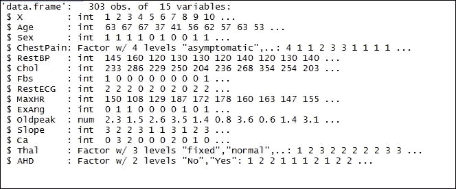

打印 `AHD_data` 数据框。`head()` 函数返回 `AHD_data` 数据框的前部分。`AHD_data` 数据框作为输入参数传递：

```py
    > head(AHD_data)

```

结果如下：

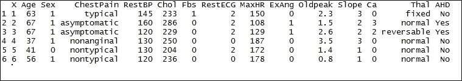

探索 `AHD_data` 数据框的维度。`dim()` 函数返回 `AHD_data` 数据框的维度。将 `AHD_data` 数据框作为输入参数传递。结果清楚地表明有 303 行数据和 15 列：

```py
    >dim(AHD_data)

```

结果如下：

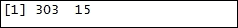

### 第 3 步 - 准备数据

需要准备数据以执行模型构建和测试。数据分为两部分--一部分用于构建模型，另一部分用于测试模型，这将准备。

使用 `createDataPartition()` 函数创建数据的分割。将 `AHD_data` 作为参数传递给函数。进行随机抽样。表示用于训练的数据百分比的 `p`。在这里，`p` 的值为 `0.5`，这意味着 50% 的数据用于训练。`List = 'FALSE'` 避免以列表的形式返回数据。结果存储在数据框 `split` 中：

```py
    > split <- createDataPartition(y=AHD_data$AHD, p = 0.5, list=FALSE)

```

调用 `split` 数据框显示用于训练目的的训练集数据：

```py
    > split

```

结果如下：

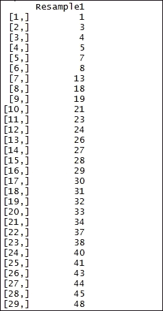

将创建训练数据。使用 `split` 数据框创建训练数据。`train` 数据框用于存储训练数据的值：

```py
    > train <- AHD_data[split,]

```

打印训练数据框：

```py
    > train

```

结果如下：

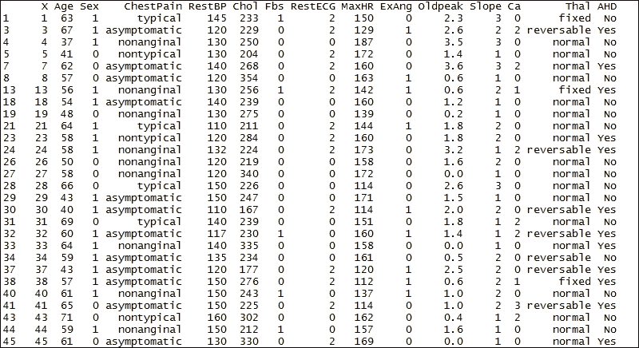

将创建测试数据。使用 `split` 数据框创建测试数据。`split` 数据框前的 `-` 符号表示所有那些未被考虑用于训练目的的数据行。测试数据框用于存储测试数据的值：

```py
    > test <- AHD_data[-split,]

```

打印测试数据框：

```py
    > test

```

结果如下：

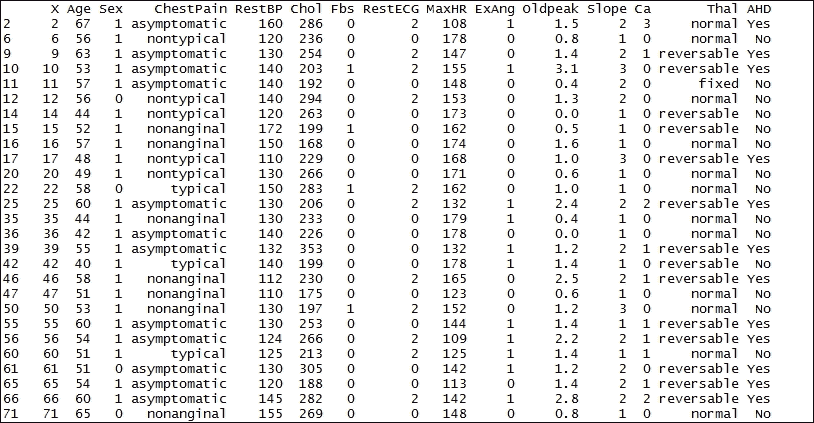

### 第 4 步 - 训练模型

模型现在将被准备并在训练数据集上训练。当数据集被分成组时使用决策树，与调查数值响应及其与一组描述符变量的关系相比。在 R 中使用 `tree()` 函数实现分类树。

使用 `tree()` 函数实现分类树。通过二分递归分割来生长树。训练数据集上的 `AHD` 字段用于形成分类树。结果数据框存储在 `trees` 数据框中：

```py
    > trees <- tree(AHD ~., train)

```

将显示数据框的图形版本。`plot()` 函数是 R 对象绘图的通用函数。将数据框 `trees` 作为函数值传递：

```py
    > plot(trees)

```

结果如下：

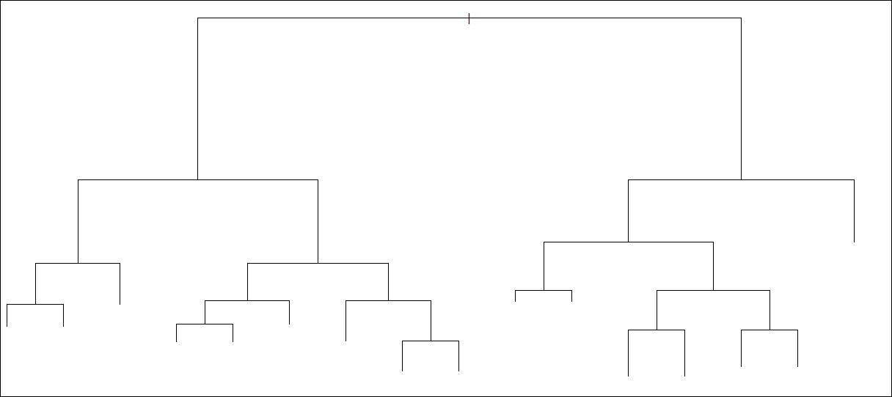

通过运行交叉验证实验来查找偏差或错误分类的数量。将使用 `cv.tree()` 函数。将 `trees` 数据框对象传递。`FUN=prune.misclass` 通过递归剪掉最不重要的分割来获取提供的 `data frame trees` 的嵌套子树序列。结果存储在 `cv.trees` 数据框中：

```py
    > cv.trees <- cv.tree(trees, FUN=prune.misclass)

```

打印数据框 `cv.trees` 的结果：

```py
    > cv.trees

```

`$dev` 字段给出了每个 K 的偏差。

结果如下：

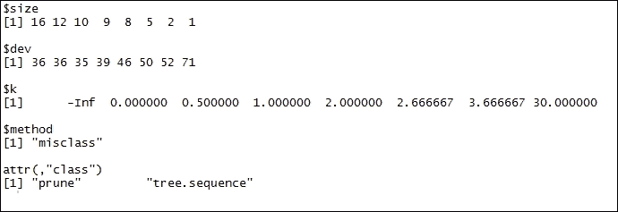

使用 `plot()` 函数数据框，显示 `cv.trees`。`$dev` 值位于 *y* 轴（右侧）。`$k` 值位于顶部。`$size` 值位于 *x* 轴。

如清晰可见，当 `$size = 1`，`$k = 30.000000`，`$dev = 1`。我们使用以下方式绘制数据框：

```py
    > plot(cv.trees)

```

结果如下：

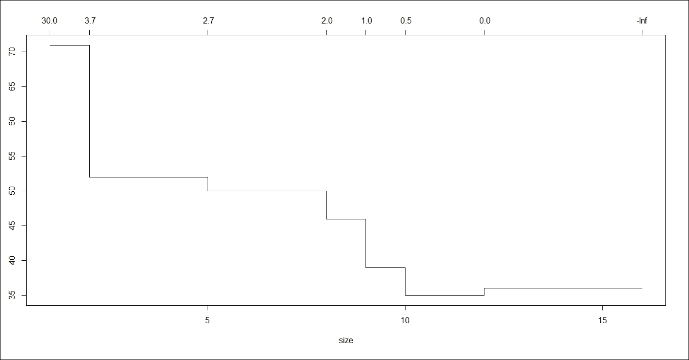

### 步骤 5 - 改进模型

让我们通过分割偏差最低的树来改进模型。调用 `prune.misclass()` 函数来分割树。`prune.misclass` 通过递归剪掉最不重要的分割来获取提供的 `data frame trees` 的嵌套子树序列。结果存储在 `prune.trees` 数据框中。`best=4` 表示要返回的成本-复杂度序列中特定子树的大小（例如，终端节点的数量）：

```py
    > prune.trees <- prune.misclass(trees, best=4)

```

使用 `plot()` 函数数据框，显示 `prune.trees`：

```py
    > plot(prune.trees)

```

结果如下：

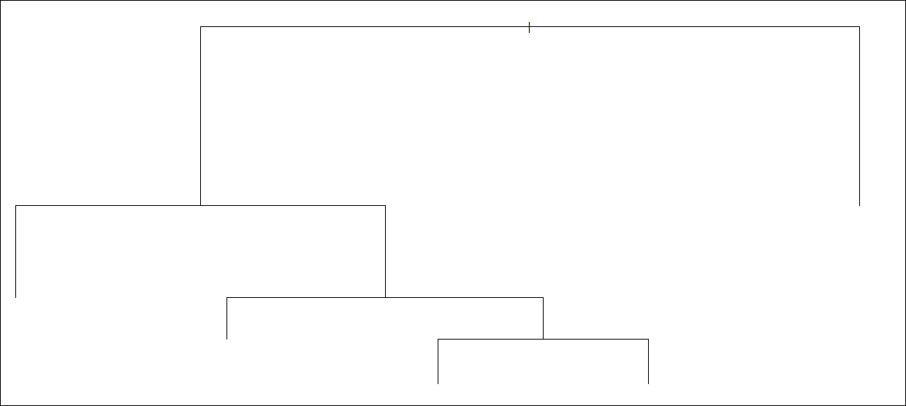

向前面的修剪树添加文本：

```py
    > text(prune.trees, pretty=0)

```

结果如下：

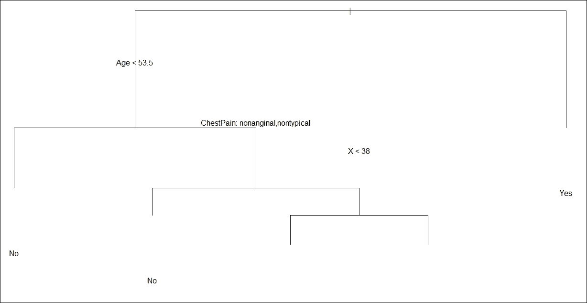

为了根据线性模型对象预测值，我们将使用 `predict()` 函数。将 `prune.trees` 作为对象传递。将 `test` 数据对象传递作为查找预测变量的对象。结果将存储在 `tree.pred` 数据框中：

```py
    > tree.pred <- predict(prune.trees, test, type='class')

```

显示变量 `test.pred` 的值：

```py
    > tree.pred

```

结果如下：

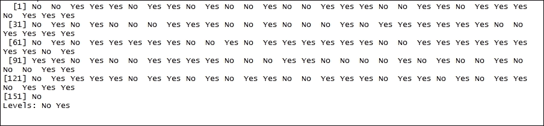

总结模型的成果。`confusionMatrix()` 计算观察到的和预测的类别的交叉表。`tree.pred` 作为预测类别的因子传递：

```py
    > confusionMatrix(tree.pred, test$AHD)

```

结果如下：

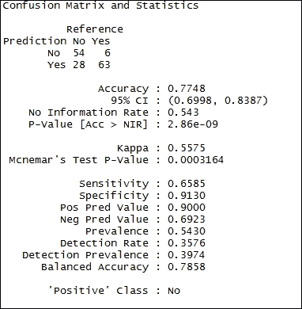

# 决策树学习 - 基于收入的房地产价值分布

收入一直是房地产作为一种资产类别提供的具有吸引力的长期总回报的一个基本组成部分。投资房地产产生的年度收入回报比股票高出 2.5 倍以上，仅落后于债券 50 个基点。房地产通常为租户支付的租金提供稳定的收入来源。

## 准备工作

为了执行决策树分类，我们将使用从房地产数据集中收集的数据集。

### 步骤 1 - 收集和描述数据

将使用标题为 `RealEstate.txt` 的数据集。此数据集以 TXT 格式提供，标题为 `RealEstate.txt`。数据集是标准格式。有 20,640 行数据。9 个数值变量如下：

+   `MedianHouseValue`

+   `MedianIncome`

+   `MedianHouseAge`

+   `TotalRooms`

+   `TotalBedrooms`

+   `Population`

+   `Households`

+   `Latitude`

+   `Longitude`

## 如何做到这一点...

让我们深入了解细节。

### 步骤 2 - 探索数据

需要在第一步中加载以下包：

```py
    > install.packages("tree")

```

### 注意

版本信息：本页面的代码在 R 版本 3.3.0（2016-05-03）中进行了测试。

让我们探索数据并了解变量之间的关系。我们将从导入名为 `RealEstate.txt` 的 TXT 数据文件开始。我们将数据保存到 `realEstate` 数据框中：

```py
    > realEstate <- read.table("d:/RealEstate.txt", header=TRUE)

```

探索 `realEstate` 数据框的维度。`dim()` 函数返回 `realEstate` 框的维度。`realEstate` 数据框作为输入参数传递。结果清楚地表明有 20,640 行数据和 9 列：

```py
    > dim(realEstate)

```

结果如下：


探索 `realEstate` 数据框的内部结构。`str()` 函数显示数据框的内部结构。`realEstate` 作为 R 对象传递给 `str()` 函数：

```py
    > str(realEstate)

```

结果如下：

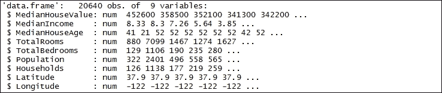

打印 `realEstate` 数据框。`head()` 函数返回 `realEstate` 数据框的前部分。`realEstate` 数据框作为输入参数传递：

```py
    > head(realEstate)

```

结果如下：

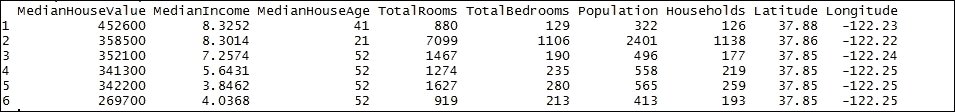

打印 `realEstate` 数据框的摘要。`summary()` 函数是一个多功能函数。`summary()` 是一个通用函数，它提供与单个对象或数据框相关的数据摘要。`realEstate` 数据框作为 R 对象传递给 `summary()` 函数：

```py
    > summary(realEstate)

```

结果如下：

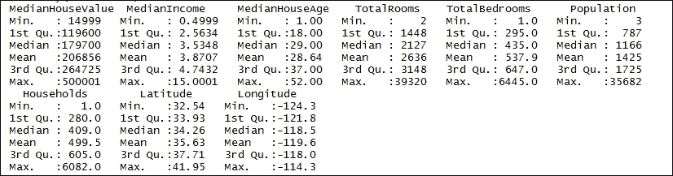

### 步骤 3 - 训练模型

模型现在将在数据集上准备。决策树是分类和预测的工具。它们代表人类可以理解并用于如数据库等知识系统的规则。它们通过从树的根开始并移动到叶节点来对实例进行分类。节点指定对单个属性的测试，叶节点指示目标属性的值，边分割出一个属性。

使用`tree()`函数实现分类树。通过二元递归分区来生长树。这些模型是计算密集型技术，因为它们根据响应变量与一个或多个预测变量的关系递归地将响应变量分割成子集。

公式表达式基于变量`纬度`和`经度`的总和。总和的结果存储在`MedianHouseValue`的对数值中。`data=realEstate`表示优先解释公式、权重和子集的数据框。

结果数据框存储在数据框`treeModel`中：

```py
> treeModel <- tree(log(MedianHouseValue) ~ Longitude + Latitude, data=realEstate) 

```

将显示`treeModel`的摘要。摘要显示了所使用的公式，以及树中的终端节点或叶子的数量。还显示了残差的统计分布。

使用`summary()`函数显示`treeModel`的统计摘要。它是一个泛型，用于生成各种拟合函数的结果摘要。希望进行摘要的数据框是`treeModel`，它作为输入参数传递。

在这里，偏差表示均方误差：

```py
    > summary(treeModel)

```

结果如下：

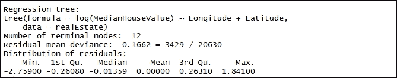

将显示`treeModel`数据框的图形版本。`plot()`函数是用于绘制 R 对象的泛型函数。`treeModel`数据框作为函数值传递：

```py
> plot(treeModel) 

```

结果如下：

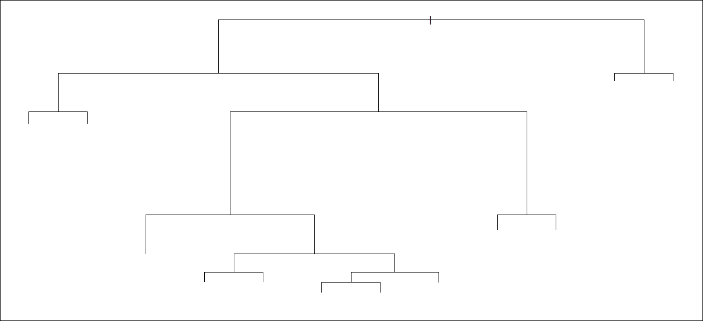

在显示`treeModel`数据框的图形版本后，需要插入文本以显示每个节点和叶子的值。使用`text()`函数在给定的坐标处插入标签向量中给出的字符串：

```py
    > text(treeModel, cex=.75)

```

结果如下：

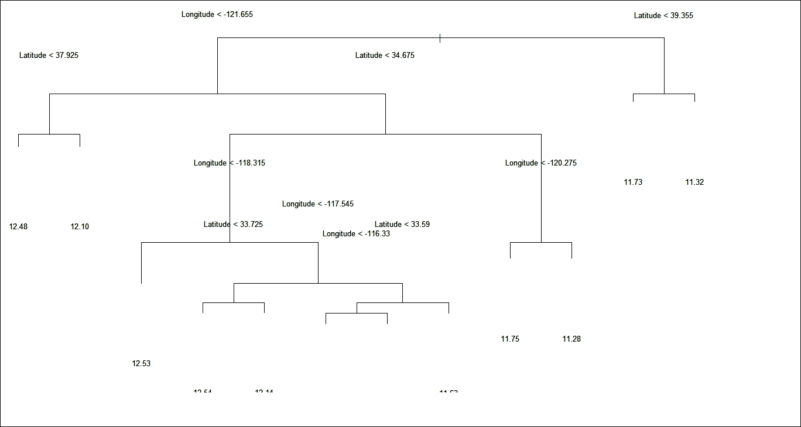

### 第 4 步 - 比较预测

将预测与反映全球价格趋势的数据集进行比较。我们希望总结`MedianHouseValue`的频率分布，以便于报告或比较。最直接的方法是使用分位数。分位数是分布中的点，与该分布中值的排名顺序相关。分位数将分割`MedianHouseValue`分布，使得观测值在分位数下方的比例是给定的。

`quantile()` 函数产生与给定概率相对应的样本分位数。`realEstate$MedianHouseValue` 是想要样本分位数的数值向量。`quantile()` 函数返回长度为的 `priceDeciles` 向量：

```py
    > priceDeciles <- quantile(realEstate$MedianHouseValue, 0:10/10)

```

显示 `priceDeciles` 数据框的值：

```py
    > priceDeciles

```

结果如下：

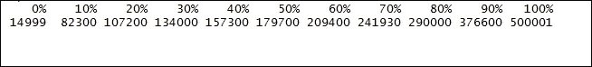

接下来，将显示 `priceDeciles` 的摘要。使用 `summary()` 函数显示 `priceDeciles` 的统计摘要。希望摘要的数据框是 `priceDeciles`，它作为输入参数传递：

```py
    > summary(priceDeciles)

```

结果如下：

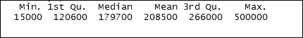

将 `priceDeciles` 向量划分为不同的范围。`cut()` 函数根据它们所属的区间来划分区间范围。`realEstate` 数据框中的数值向量 `MedianHouseValue` 需要通过切割转换为因子：

```py
    > cutPrices <- cut(realEstate$MedianHouseValue, priceDeciles, include.lowest=TRUE)

```

打印 `cutPrices` 数据框。`head()` 函数返回 `cutPrices` 数据框的前部分。`cutPrices` 数据框作为输入参数传递：

```py
    > head(cutPrices)

```

结果如下：

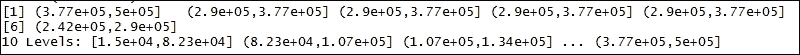

将显示 `cutPrices` 的摘要。使用 `summary()` 函数显示 `treeModel` 的统计摘要。希望摘要的数据框是 `cutPrices`，它作为输入参数传递：

```py
    > summary(cutPrices)

```

结果如下：

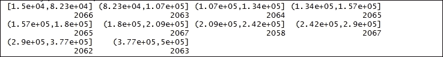

绘制 `cutPrices` 的值。`plot()` 函数是 R 对象绘图的通用函数。`realEstate` 数据集中的经度变量代表图中点的 *x* 坐标。`realEstate` 数据集中的纬度变量代表图中点的 *y* 坐标。`col=grey(10:2/11)` 代表绘图颜色。`pch=20` 代表在绘图点时使用的符号大小。`xlab="Longitude"` 代表 x 轴的标题，而 `ylab="Latitude"` 代表 *y* 轴的标题：

```py
> plot(realEstate$Longitude, realEstate$Latitude, col=grey(10:2/11)[cutPrices], pch=20, xlab="Longitude",ylab="Latitude") 

```

结果如下：

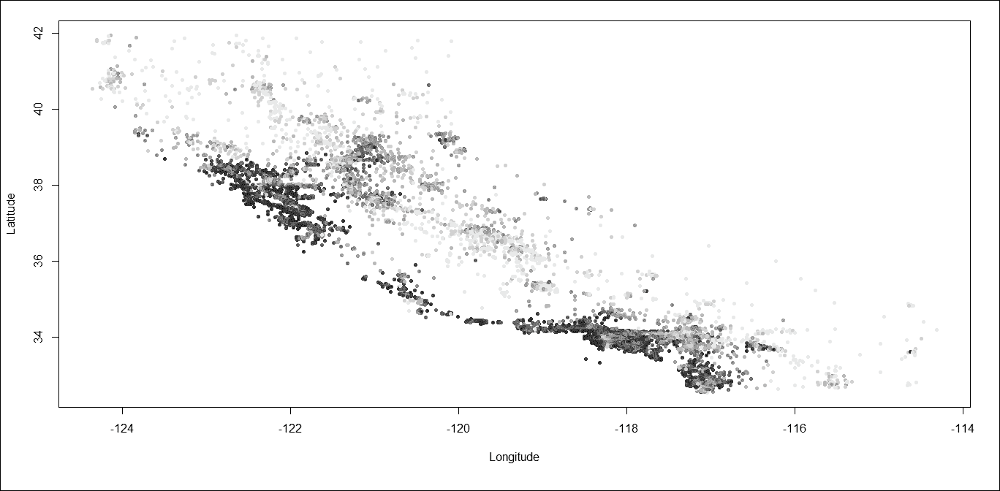

将显示 `Longitude` 的摘要。使用 `summary()` 函数显示统计摘要：

```py
    > summary(realEstate$Longitude)

```

结果如下：

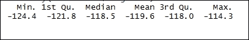

打印 `Longitude` 数据框。`head()` 函数返回 `Longitude` 数据框的前部分：

```py
    > head(realEstate$Longitude)

```

结果如下：

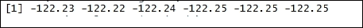

将显示 `Latitude` 的摘要。使用 `summary()` 函数显示统计摘要：

```py
    > summary(realEstate$Latitude)

```

结果如下：

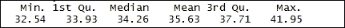

打印 `纬度` 数据框。`head()` 函数返回 `纬度` 数据框的前部分：

```py
    > head(realEstate$Latitude)

```

结果如下：

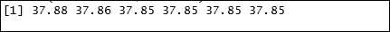

使用 `partition.tree()` 函数对涉及两个或更多变量的树进行分区。`treeModel` 作为树对象传递。`ordvars=c("经度","纬度")` 表示用于绘图的变量顺序。经度代表 *x* 轴，而 `纬度` 代表 y 轴。`add=TRUE` 表示添加到现有图形：

```py
    > partition.tree(treeModel, ordvars=c("Longitude","Latitude"), add=TRUE)

```

结果如下：

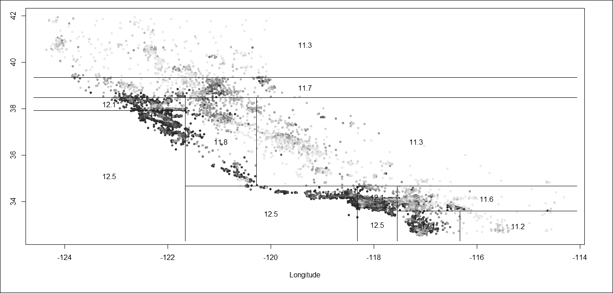

### 步骤 5 - 改进模型

树中的叶子节点数量控制着树的灵活性。叶子节点的数量表示它们将树分割成多少个单元格。每个节点必须包含一定数量的点，并且添加节点必须至少减少一定的错误。`min.dev` 的默认值是 0.01。

接下来，我们将 `min.dev` 的值降低到 0.001。

使用 `tree()` 函数实现分类树。公式表达式基于变量 `纬度` 和 `经度` 的总和。总和的结果存储在 `MedianHouseValue` 的对数值中。`data=realEstate` 表示在其中的数据框中优先解释公式、权重和子集。`min.dev` 的值表示必须至少是根节点偏差的 0.001 倍才能进行节点分割。

结果数据框存储在 `treeModel2` 数据框中：

```py
    > treeModel2 <- tree(log(MedianHouseValue) ~ Longitude + Latitude, data=realEstate, mindev=0.001)

```

将显示 `treeModel2` 的摘要。摘要显示使用的公式，以及树中的终端节点或叶子节点的数量。还显示了残差的统计分布。

使用 `summary()` 函数显示 `treeModel2` 的统计摘要。希望进行摘要的数据框是 `treeModel2`，它作为输入参数传递。

偏差在这里意味着均方误差：

```py
    > summary(treeModel2)

```

结果如下：


与 `treeModel` 的摘要相比，`treeModel2` 中的叶子节点值从 12 增加到 68。对于 `treeModel` 和 `treeModel2`，偏差值分别从 0.1666 变为 0.1052。

将显示 `treeModel2` 数据框的图形版本。`plot()` 函数是用于绘图 R 对象的通用函数。将 `treeModel2` 数据框作为函数值传递：

```py
    > plot(treeModel2)

```

结果如下：

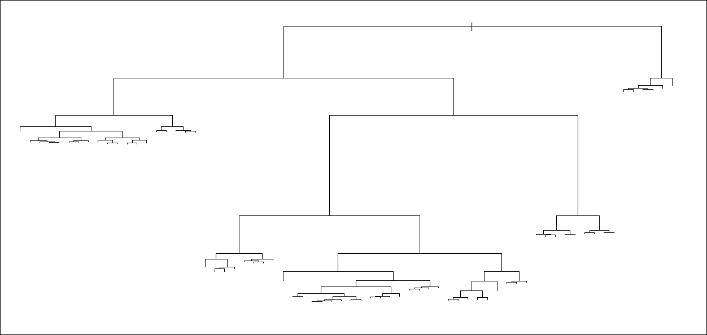

在显示 `treeModel2` 数据框的图形版本后，需要插入文本以显示每个节点和叶子节点的值。使用 `text()` 函数在给定的坐标处插入向量标签中给出的字符串：

```py
    > text(treeModel2, cex=.65)

```

结果如下：

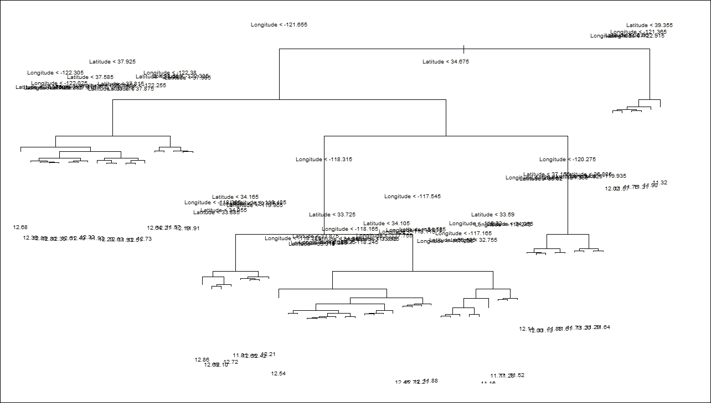

在公式扩展中包含所有变量。

使用`tree()`函数实现分类树。公式表达式基于所有变量。

结果数据框存储在`treeModel3`数据框中：

```py
    > treeModel3 <- tree(log(MedianHouseValue) ~ ., data=realEstate)

```

将显示`treeModel3`的摘要。摘要显示了使用的公式以及树中的终端节点或叶子节点的数量。还显示了残差的统计分布。

使用`summary()`函数显示`treeModel3`的统计摘要。希望进行摘要的数据框是`treeModel3`，它作为输入参数传递。

偏差在这里表示均方误差：

```py
    > summary(treeModel3)

```

结果如下：

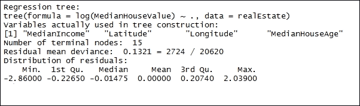

公式明确指出`realEstate`数据集中的所有变量。

将显示`treeModel3`数据框的图形版本。`plot()`函数是用于绘制 R 对象的通用函数。`treeModel3`数据框作为函数值传递：

```py
    > plot(treeModel3)

```

结果如下：

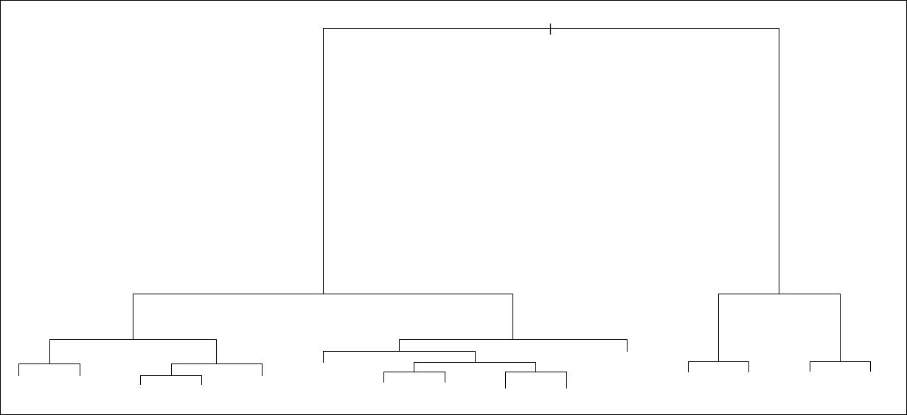

在显示`treeModel3`数据框的图形版本后，需要插入文本以显示每个节点和叶子节点的值。使用`text()`函数在给定的坐标处插入向量标签中的字符串：

```py
    > text(treeModel3, cex=.75)

```

结果如下：

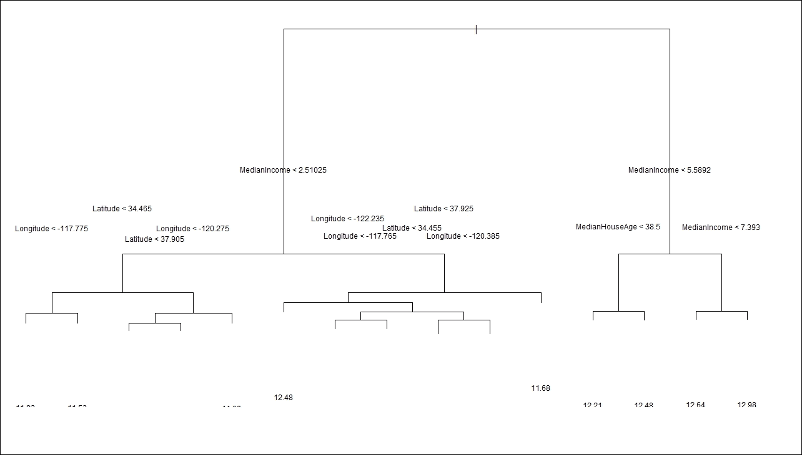

# 决策树学习 - 预测股票运动方向

股票交易是统计学家试图解决的最具挑战性的问题之一。有多个技术指标，例如趋势方向、动量或市场中的动量不足、盈利潜力的波动性和用于监测市场流行度的成交量等。这些指标可以用来创建策略以创造高概率的交易机会。可以花费数天/周/月来发现技术指标之间的关系。可以使用像决策树这样的高效且节省时间的工具。决策树的主要优势是它是一个强大且易于解释的算法，为良好的起点提供了帮助。

## 准备工作

为了执行决策树分类，我们将使用从股票市场数据集中收集的数据集。

### 第 1 步 - 收集和描述数据

要使用的数据集是美国银行 2012 年 1 月 1 日至 2014 年 1 月 1 日的每日收盘价。此数据集在[`yahoo.com/`](https://yahoo.com/)上免费提供，我们将从那里下载数据。

## 如何做到这一点...

让我们深入了解。

### 第 2 步 - 探索数据

需要在第一步加载以下包：

```py
> install.packages("quantmod")
> install.packages("rpart")
> install.packages("rpart.plot")

```

### 注意

版本信息：本页面的代码在 R 版本 3.3.0（2016-05-03）上进行了测试。

上述每个库都需要安装：

```py
> library("quantmod")
> library("rpart")
> library("rpart.plot")

```

让我们下载数据。我们将首先标记所需数据的时间段的开始和结束日期。

使用`as.Date()`函数将字符表示和`Date`类的对象转换为日历日期。

数据集的起始日期存储在`startDate`中，它代表日历日期的字符向量表示。表示的格式为*YYYY-MM-DD*：

```py
    > startDate = as.Date("2012-01-01")

```

数据集的结束日期存储在`endDate`中，它代表日历日期的字符向量表示。表示的格式为*YYYY-MM-DD*：

```py
    > endDate = as.Date("2014-01-01")

```

使用`getSymbols()`函数加载数据。该函数从多个来源加载数据，无论是本地还是远程。数据被检索并存储在指定的`env`中。`env`的默认值是`.GlobalEnv`。`BAC`是字符向量，指定要加载的符号名称。`src = yahoo`指定数据来源方法：

```py
    > getSymbols("BAC", env = .GlobalEnv,  src = "yahoo", from = startDate, to = endDate)

```

### 步骤 3 - 计算指标

相对强弱指数（Relative Strength Index）已计算。它是最近上升价格变动与绝对价格变动的比率。使用`RSI()`函数来计算相对强弱指数。`BAC`符号用作价格序列。`n = 3`代表移动平均的周期数。结果存储在`relativeStrengthIndex3`数据框中：

```py
> relativeStrengthIndex3 <- RSI(Op(BAC), n= 3) 

```

显示`relativeStrengthIndex3`的值：

```py
    > relativeStrengthIndex3

```

结果如下：

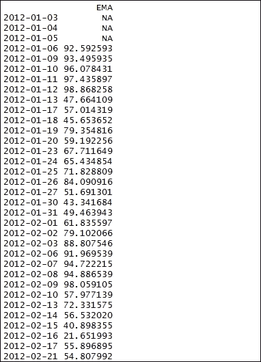

计算移动平均。**指数移动平均**用于技术分析和作为技术指标。在**简单移动平均**中，序列中的每个值具有相等的权重。时间序列之外的价值不包括在平均中。然而，指数移动平均是一个累积计算，包括所有数据。过去的数据具有递减的价值，而最近的数据值具有更大的贡献。

`EMA()`使用`BAC`符号，并用作价格序列。`n = 5`代表平均的时间周期。结果存储在`exponentialMovingAverage5`数据框中：

```py
    > exponentialMovingAverage5 <- EMA(Op(BAC),n=5)

```

显示`exponentialMovingAverage5`的值：

```py
    > exponentialMovingAverage5

```

结果如下：

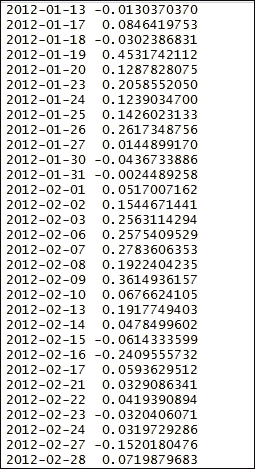

探索`exponentialMovingAverage5`数据框的维度。`dim()`函数返回`exponentialMovingAverage5`框架的维度。将`exponentialMovingAverage5`数据框作为输入参数传递。结果清楚地表明有 502 行数据和 1 列：

```py
    > dim(exponentialMovingAverage5)

```

结果如下：

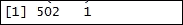

探索`exponentialMovingAverage5`数据框的内部结构。`str()`函数显示数据框的内部结构。将`exponentialMovingAverage5`作为 R 对象传递给`str()`函数：

```py
    > str(exponentialMovingAverage5)

```

结果如下：

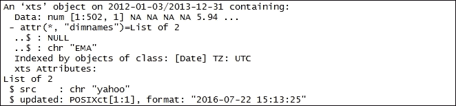

计算价格和计算出的`exponentialMovingAverage5`（例如，五年指数移动平均值）之间的差异。结果存储在`exponentialMovingAverageDiff`数据框中：

```py
    > exponentialMovingAverageDiff <- Op(BAC)-exponentialMovingAverage5

```

比较 BAC 系列快速移动平均与 BAC 系列慢速移动平均。`BAC`作为价格矩阵传递。`fast = 12`表示快速移动平均的周期数，`slow = 26`表示慢速移动平均的周期数，`signal = 9`表示移动平均的信号：

```py
    > MACD <- MACD(Op(BAC),fast = 12, slow = 26, signal = 9)

```

显示 MACD 值：

```py
    > MACD

```

结果如下：


打印 MACD 数据框。`head()`函数返回`MACD`数据框的第一部分。`MACD`数据框作为输入参数传递：

```py
    > head(MACD)

```

结果如下：

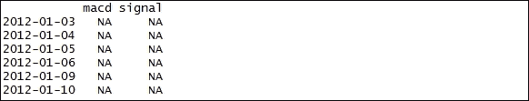

捕获信号线作为指标。结果存储在`MACDsignal`数据框中：

```py
    > MACDsignal <- MACD[,2]

```

显示`MACDsignal`值：

```py
    > MACDsignal

```

结果如下：

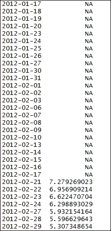

确定收盘价相对于高低范围的中间位置。为了确定每天收盘价相对于高低范围的位置，使用随机振荡器。`SMI()`函数用于动量指标。

`BAC`是包含高低收盘价矩阵。`n = 13`表示周期数。`slow=25`表示双平滑的周期数。`fast=2`表示初始平滑的周期数。`signal=9`表示信号线的周期数。结果存储在`stochasticOscillator`数据框中：

```py
    > stochasticOscillator <- SMI(Op(BAC),n=13,slow=25,fast=2,signal=9)

```

显示`stochasticOscillator`值：

```py
    > stochasticOscillator

```

结果如下：

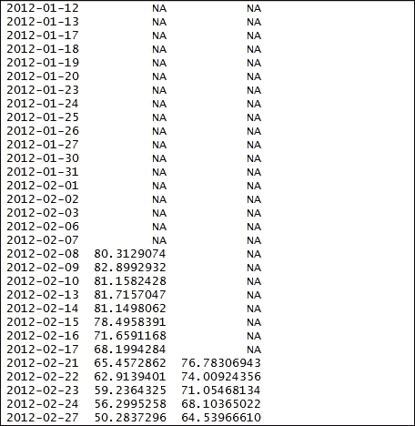

捕获振荡器作为指标。结果存储在`stochasticOscillatorSignal`数据框中：

```py
    > stochasticOscillatorSignal <- stochasticOscillator[,1]

```

显示`stochasticOscillatorSignal`值：

```py
    > stochasticOscillatorSignal

```

结果如下：

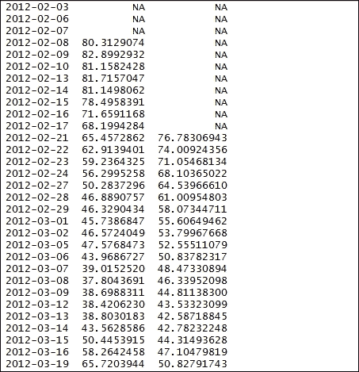

### 第 4 步 - 准备变量以构建数据集

计算收盘价和开盘价之间的差异。`Cl`代表收盘价，`Op`代表开盘价。结果存储在`PriceChange`数据框中：

```py
    > PriceChange <- Cl(BAC) - Op(BAC)

```

显示`PriceChange`值：

```py
    > PriceChange

```

结果如下：

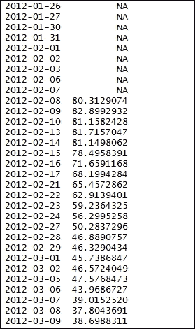

创建一个二元分类变量。`ifelse()`函数使用一个测试表达式来返回值，该值本身是一个向量，其长度与测试表达式相同。如果`test`表达式的对应值为`TRUE`，则返回`x`中的元素；如果`test`表达式的对应值为`FALSE`，则返回`y`中的元素。

在这里，`PriceChange>0` 是测试函数，将在逻辑模式下进行测试。`UP` 和 `DOWN` 执行逻辑测试。结果随后存储在 `binaryClassification` 数据框中：

```py
    > binaryClassification <- ifelse(PriceChange>0,"UP","DOWN")

```

显示 `binaryClassification` 值：

```py
    > binaryClassification

```

结果如下：

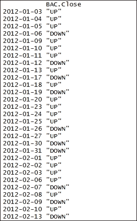

探索 `binaryClassification` 数据框的内部结构。`str()` 函数显示数据框的内部结构。`binaryClassification` 作为 R 对象传递给 `str()` 函数：

```py
    > str(binaryClassification)

```

结果如下：

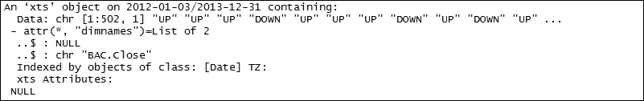

创建要使用的数据集。`data.frame()` 函数用于根据紧密耦合的变量集创建数据框。这些变量具有矩阵的性质。传递给 `data.frame()` 的参数变量有 `relativeStrengthIndex3`、`exponentialMovingAverageDiff`、`MACDsignal`、`stochasticOscillator` 和 `binaryClassification`。

结果随后存储在 `DataSet` 数据框中：

```py
> AAPLDataSetNew >-
data.frame(weekDays,exponentialMovingAverageDiffRound,
binaryClassification) 

```

显示 `DataSet` 值：

```py
    > DataSet

```

结果如下：

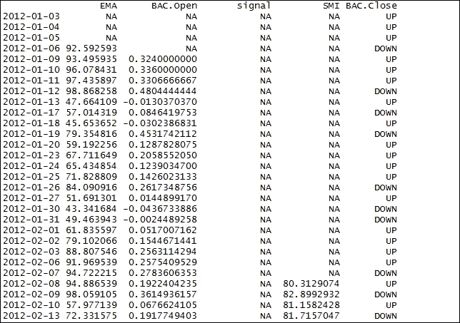

打印 `DataSet` 数据框。`head()` 函数返回 `DataSet` 数据框的第一部分。`DataSet` 数据框作为输入参数传递：

```py
    > head(DataSet)

```

结果如下：

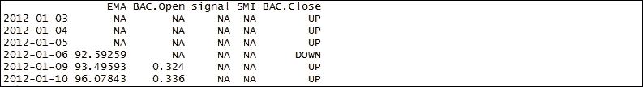

探索 `DataSet` 数据框的内部结构。`str()` 函数显示数据框的内部结构。`DataSet` 作为 R 对象传递给 `str()` 函数：

```py
    > str(DataSet)

```

结果如下：

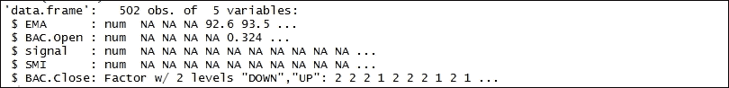

命名列。`c()` 函数用于将参数组合成向量。

传递给 `c()` 函数的参数变量有 `relativeStrengthIndex3`、`exponentialMovingAverageDiff`、`MACDsignal`、`stochasticOscillator` 和 `binaryClassification`：

```py
    > colnames(DataSet) <- c("relativeStrengthIndex3", "exponentialMovingAverageDiff", "MACDsignal", "stochasticOscillator", "binaryClassification")

```

显示 `colnames(DataSet)` 值：

```py
    > colnames(DataSet)

```

结果如下：

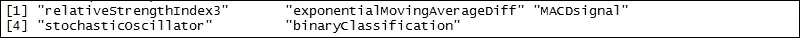

删除要计算指标的数据：

```py
    > DataSet <- DataSet[-c(1:33),]

```

显示 `DataSet` 值：

```py
    > DataSet

```

结果如下：

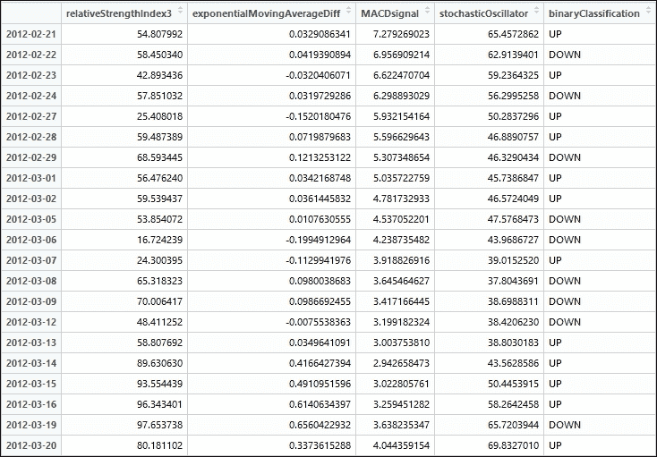

打印 `DataSet` 数据框。`head()` 函数返回 `DataSet` 数据框的第一部分。`DataSet` 数据框作为输入参数传递：

```py
    > head(DataSet)

```

结果如下：

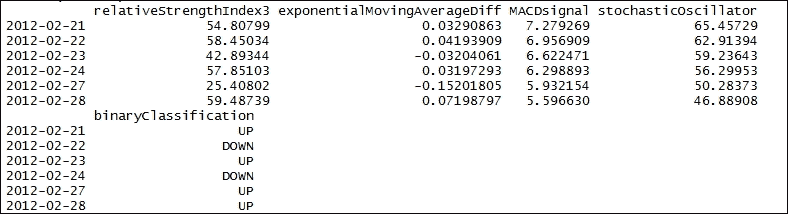

探索 `DataSet` 数据框的内部结构。`str()` 函数显示数据框的内部结构。`DataSet` 作为 R 对象传递给 `str()` 函数：

```py
    > str(DataSet)

```

结果如下：

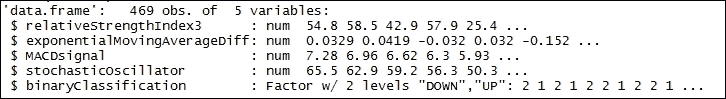

探索`DataSet`数据框的维度。`dim()`函数返回`DataSet`框的维度。将`DataSet`数据框作为输入参数传递。结果显示，共有 469 行数据和 5 列：

```py
    > dim(DataSet)

```

结果如下：

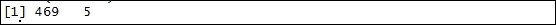

构建训练数据集。`DataSet`数据框中的三分之二元素将用作训练数据集，而`DataSet`数据框中的一分之一元素将用作测试数据集。

训练数据集将存储在`TrainingDataSet`中：

```py
    > TrainingDataSet <- DataSet[1:312,]

```

显示`TrainingDataSet`的值：

```py
    > TrainingDataSet

```

结果如下：

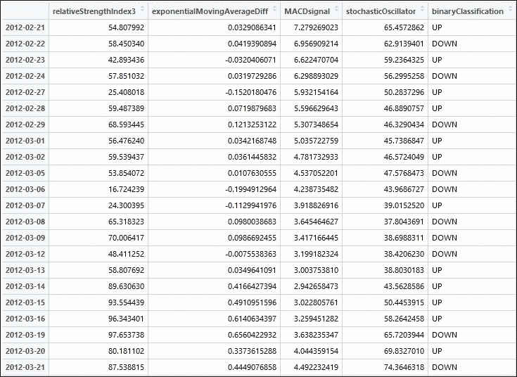

探索`TrainingDataSet`数据框的内部结构。`str()`函数显示数据框的内部结构。将`TrainingDataSet`作为 R 对象传递给`str()`函数：

```py
    > str(TrainingDataSet)

```

结果如下：

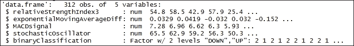

训练数据集将存储在`TestDataSet`中：

```py
    > TestDataSet <- DataSet[313:469,]

```

显示`TestDataSet`的值：

```py
    > TestDataSet

```

结果如下：

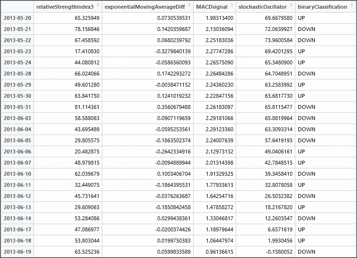

探索`TestDataSet`数据框的内部结构。`str()`函数显示数据框的内部结构。将`TestDataSet`作为 R 对象传递给`str()`函数：

```py
    > str(TestDataSet)

```

结果如下：

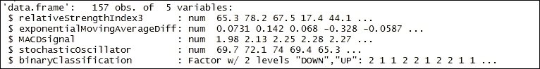

### 步骤 5 - 构建模型

通过指定指标构建树模型。将使用`rpart()`函数。它将拟合模型。`binaryClassification`是结果，使用`relativeStrengthIndex3`、`exponentialMovingAverageDiff`、`MACDsignal`和`stochasticOscillator`的总和作为预测因子。`data=TrainingDataSet`表示数据框。`cp=.001`表示复杂性参数。该参数的主要作用是通过剪枝来节省计算时间。结果随后存储在`DecisionTree`数据框中：

```py
    > DecisionTree <- rpart(binaryClassification~relativeStrengthIndex3+exponentialMovingAverageDiff+MACDsignal+stochasticOscillator,data=TrainingDataSet, cp=.001)

```

绘制树模型。将使用`prp()`函数绘制`DecisionTree`数据框。`type=2`将交替节点垂直移动：

```py
    > prp(DecisionTree,type=2)

```

结果如下：

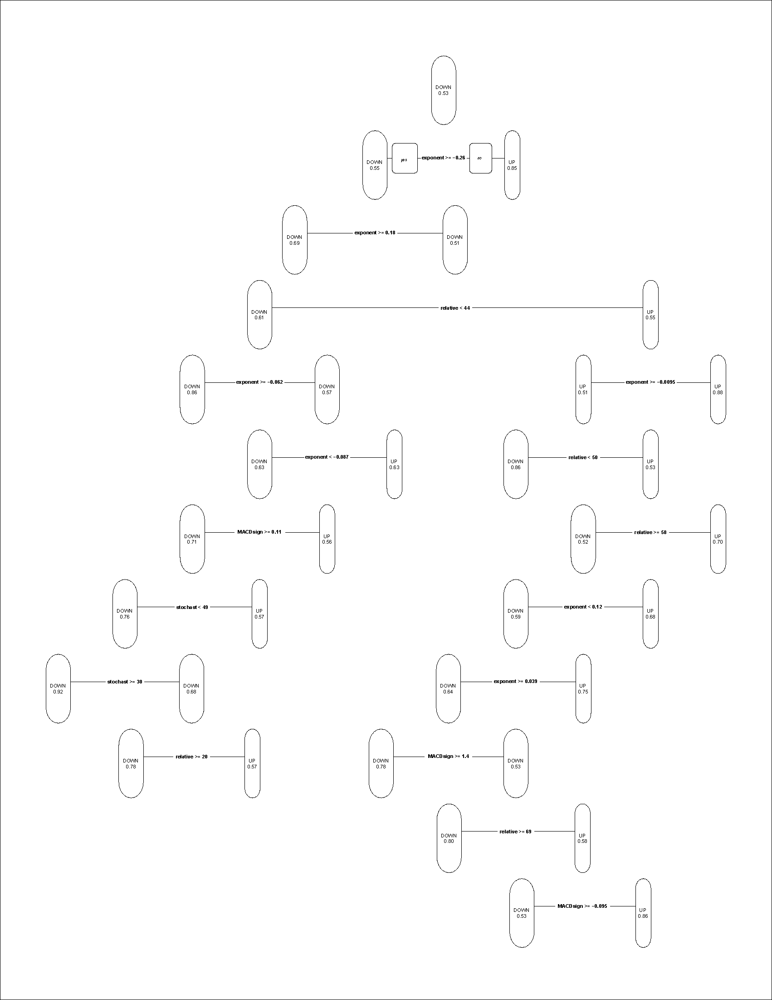

显示`DecisionTree`数据框的`cp`表。使用`printcp()`函数。将`DecisionTree`作为输入传递：

```py
    > printcp(DecisionTree)

```

结果如下：

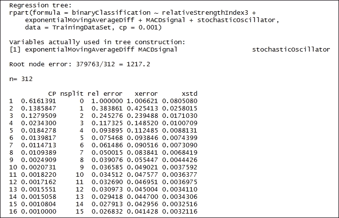

绘制树的几何平均。使用`plotcp()`函数。它提供了`DecisionTree`数据框交叉验证结果的视觉表示：

```py
    > plotcp(DecisionTree,upper="splits")

```

结果如下：

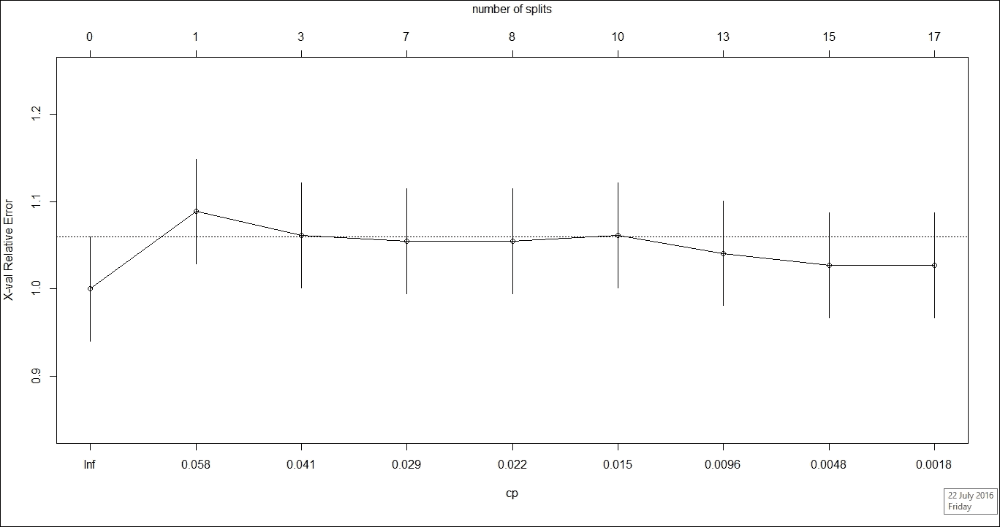

### 步骤 6 - 改进模型

在剪枝后改进模型。使用`prune()`函数。`DecisionTree`是作为输入传递的数据框。`cp=0.041428`已被采用，因为这是最低的交叉验证错误值（x 错误）：

```py
    > PrunedDecisionTree <- prune(DecisionTree,cp=0.041428)

```

绘制`tree`模型。将使用`prp()`函数绘制`DecisionTree`数据框。`type=4`将交替节点垂直移动：

```py
    > prp(PrunedDecisionTree, type=4)

```

结果如下：

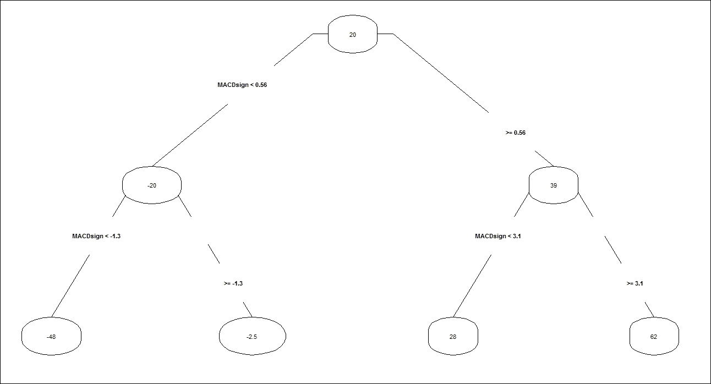

测试模型：

```py
> table(predict(PrunedDecisionTree,TestDataSet), TestDataSet[,5],dnn=list('predicted','actual')) 

```

结果如下：

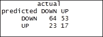

# 简单贝叶斯 - 预测股票运动的方向

股票交易是统计学家试图解决的最具挑战性的问题之一。市场中有多个技术指标，例如趋势方向、动量或市场动量的缺乏、波动性以衡量盈利潜力，以及用于监控市场流行度的成交量等，仅举几例。这些指标可以用来创建策略以捕捉高概率的交易机会。可能需要花费数日/数周/数月来发现技术指标之间的关系。可以使用像决策树这样的高效且节省时间的工具。决策树的主要优势在于它是一个强大且易于解释的算法，这为良好的起点提供了帮助。

## 准备工作

为了执行简单贝叶斯，我们将使用从股票市场数据集中收集的数据集。

### 第 1 步 - 收集和描述数据

要使用的数据集是 2012 年 1 月 1 日至 2014 年 1 月 1 日苹果公司每日收盘价。此数据集在[`www.yahoo.com/`](https://www.yahoo.com/)上免费提供，我们将从那里下载数据。

## 如何做到这一点...

让我们深入了解细节。

### 第 2 步 - 探索数据

以下包需要在执行第一步时加载：

```py
    > install.packages("quantmod")
    > install.packages("lubridate")
    > install.packages("e1071")

```

### 注意

版本信息：本页面的代码在 R 版本 3.3.0（2016-05-03）上进行了测试

以下每个库都需要安装：

```py
    > library("quantmod")
    > library("lubridate")
    > library("e1071")

```

让我们下载数据。我们首先标记所需数据的时间段的开始和结束日期。

使用`as.Date()`函数将字符表示和*Date*类的对象转换为日历日期。

数据集的开始日期存储在`startDate`中，它表示日历日期的字符向量表示。表示的格式是*YYYY-MM-DD*：

```py
    > startDate = as.Date("2012-01-01")

```

数据集的结束日期存储在`endDate`中，它表示日历日期的字符向量表示。表示的格式是 YYYY-MM-DD：

```py
    > endDate = as.Date("2014-01-01")

```

使用`getSymbols()`函数加载数据。该函数从多个来源加载数据，无论是本地还是远程。数据被检索并保存在指定的`env`中。对于`env`，默认值是`.GlobalEnv`。`AAPL`是字符向量，指定要加载的符号名称。`src = yahoo`指定了数据来源方法：

```py
    > getSymbols("AAPL", env = .GlobalEnv, src = "yahoo", from = startDate,  to = endDate)

```


探索数据可用的星期几。使用 `wday()` 函数。该函数以十进制格式返回星期几。`AAPL` 代表数据框。`label = TRUE` 将星期几显示为字符串，例如，星期日。结果随后存储在 `weekDays` 数据框中：

```py
    > weekDays <- wday(AAPL, label=TRUE)

```

打印 `weekDays` 数据框。`head()` 函数返回 `weekDays` 数据框的前部分。将 `weekDays` 数据框作为输入参数传递：

```py
    > head(weekDays)

```

结果如下：

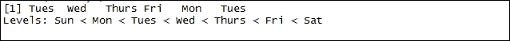

### 第 3 步 - 准备构建数据集的变量

计算收盘价和开盘价之间的差异。`Cl` 代表收盘价，`Op` 代表开盘价。结果存储在 `changeInPrices` 数据框中：

```py
    > changeInPrices <- Cl(AAPL) - Op(AAPL)

```

打印 `changeInPrices` 数据框。`head()` 函数返回 `changeInPrices` 数据框的前部分。将 `changeInPrices` 数据框作为输入参数传递：

```py
    > head(changeInPrices)

```

结果如下：

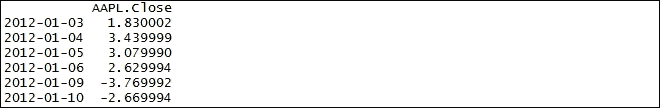

探索价格变化的摘要。使用 `summary()` 函数。该函数提供一系列描述性统计，以生成 `changeInPrices` 数据框的结果摘要：

```py
    > summary(changeInPrices)

```

结果如下：

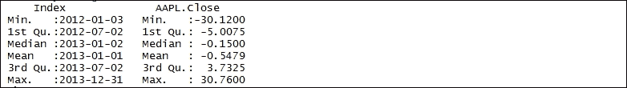

探索 `changeInPrices` 数据框的维度。`dim()` 函数返回 `changeInPrices` 框的维度。将 `changeInPrices` 数据框作为输入参数传递。结果清楚地表明有 502 行数据和 1 列：

```py
    > dim(changeInPrices)

```

结果如下：

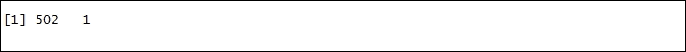

创建一个二元分类变量。`ifelse()` 函数使用测试表达式返回值，该值本身是一个向量，其长度与测试表达式相同。如果测试表达式的对应值为 `TRUE`，则从 `x` 中返回向量中的一个元素，如果测试表达式的对应值为 `FALSE`，则从 `y` 中返回。

在这里，`changeInPrices>0` 是一个测试函数，用于测试逻辑模式。`UP` 和 `DOWN` 执行逻辑测试。结果随后存储在 `binaryClassification` 数据框中：

```py
    > binaryClassification <- ifelse(changeInPrices>0,"UP","DOWN")

```

显示 `binaryClassification` 值：

```py
    > binaryClassification

```

结果如下：

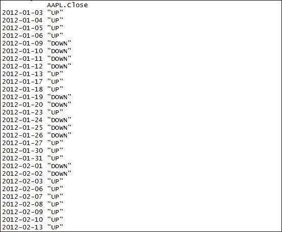

探索价格变化的摘要。使用 `summary()` 函数。该函数提供一系列描述性统计，以生成 `binaryClassification` 数据框的结果摘要：

```py
    > summary(binaryClassification)

```

结果如下：

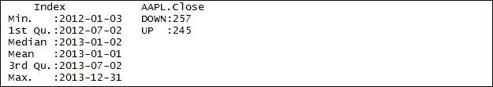

创建要使用的数据集。使用 `data.frame()` 函数根据紧密耦合的变量集创建数据框。这些变量具有矩阵的性质。

将作为`data.frame()`参数传递的变量是`weekDays`和`binaryClassification`。结果随后存储在`DataSet`数据框中：

```py
    > AAPLDataSet <- data.frame(weekDays,binaryClassification)

```

显示`AAPLDataSet`值：

```py
    > AAPLDataSet

```

结果如下：

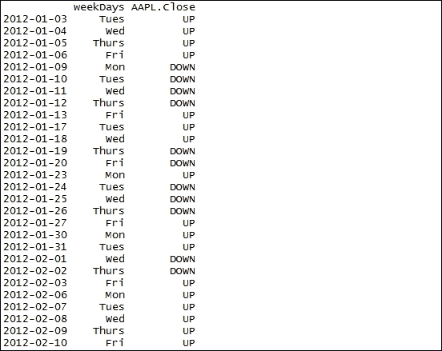

打印`AAPLDataSet`数据框。`head()`函数返回`AAPLDataSet`数据框的前部分。将`AAPLDataSet`数据框作为输入参数传递：

```py
    > head(AAPLDataSet)

```

结果如下：

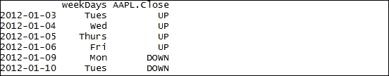

探索`AAPLDataSet`数据框的维度。`dim()`函数返回`AAPLDataSet`数据框的维度。将`AAPLDataSet`数据框作为输入参数传递。结果明确指出有 502 行数据和 2 列：

```py
    > dim(AAPLDataSet)

```

结果如下：

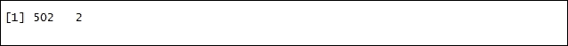

### 第 4 步 - 构建模型

通过指定指标构建朴素贝叶斯分类器。将使用`naiveBayes()`函数。该函数使用贝叶斯规则来计算给定一组独立预测变量的后验概率。该函数假设度量预测变量服从高斯分布。"NaiveBayesclassifier"是函数的输出结果，其中独立变量是`AAPLDataSet[,1]`，因变量是`AAPLDataSet[,2]`：

```py
    > NaiveBayesclassifier <- naiveBayes(AAPLDataSet[,1], AAPLDataSet[,2])

```

显示`NaiveBayesclassifier`结果：

```py
    > NaiveBayesclassifier

```

结果如下：

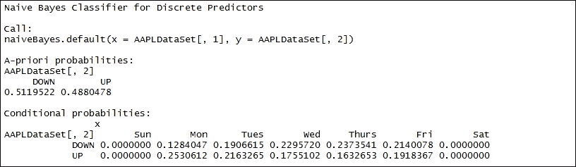

结果覆盖整个数据集，并显示价格增加或减少的概率。其本质上是看跌的。

### 第 5 步 - 创建新的、改进模型的数据

制定一个复杂的策略，展望超过一天。对模型计算 5 年的移动平均。`EMA()`使用 AAPL 符号作为价格序列。"n = 5"代表平均的时间段。结果随后存储在`exponentialMovingAverage5`数据框中：

```py
    > exponentialMovingAverage5 <- EMA(Op(AAPL),n = 5)

```

显示`exponentialMovingAverage5`值：

```py
    > exponentialMovingAverage5

```

结果如下：

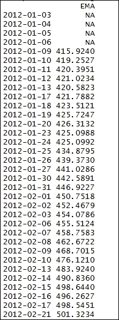

探索价格变化的摘要。使用`summary()`函数。该函数提供一系列描述性统计量，以生成`exponentialMovingAverage5`数据框的结果摘要：

```py
    > summary(exponentialMovingAverage5)

```

结果如下：

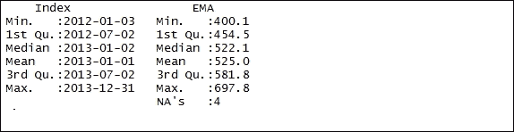

对模型计算 10 年的移动平均。

`EMA()`使用 AAPL 符号作为价格序列。"n = 10"代表平均的时间段。结果随后存储在`exponentialMovingAverage10`数据框中：

```py
    > exponentialMovingAverage10 <- EMA(Op(AAPL),n = 10)

```

显示`exponentialMovingAverage10`值：

```py
    > exponentialMovingAverage10

```

结果如下：

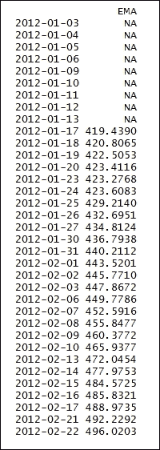

探索价格变化的摘要。使用 `summary()` 函数。该函数提供一系列描述性统计量，以生成 `exponentialMovingAverage10` 数据框的结果摘要：

```py
    > summary(exponentialMovingAverage10)

```

结果如下：

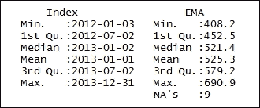

探索 `exponentialMovingAverage10` 数据框的维度。`dim()` 函数返回 `exponentialMovingAverage10` 框的维度。将 `exponentialMovingAverage10` 数据框作为输入参数传递。结果清楚地表明有 502 行数据和 1 列：

```py
    > dim(exponentialMovingAverage10)

```

结果如下：


计算 `exponentialMovingAverage5` 和 `exponentialMovingAverage10` 之间的差异：

```py
    > exponentialMovingAverageDiff <- exponentialMovingAverage5 - exponentialMovingAverage10

```

显示 `exponentialMovingAverageDiff` 值：

```py
    > exponentialMovingAverageDiff

```

结果如下：

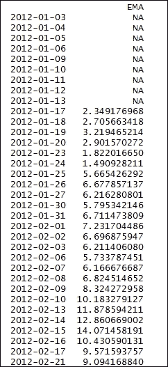

探索价格变化的摘要。使用 `summary()` 函数。该函数提供一系列描述性统计量，以生成 `exponentialMovingAverageDiff` 数据框的结果摘要：

```py
    > summary(exponentialMovingAverageDiff)

```

结果如下：

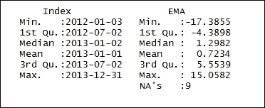

将 `exponentialMovingAverageDiff` 数据框四舍五入到两位有效数字：

```py
    > exponentialMovingAverageDiffRound <- round(exponentialMovingAverageDiff, 2)

```

探索价格变化的摘要。使用 `summary()` 函数。该函数提供一系列描述性统计量，以生成 `exponentialMovingAverageDiffRound` 数据框的结果摘要：

```py
    > summary(exponentialMovingAverageDiffRound)

```

结果如下：

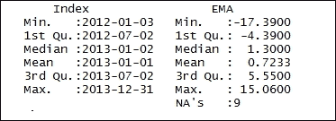

### 步骤 6 - 改进模型

创建用于的数据集。使用 `data.frame()` 函数根据一组紧密耦合的变量创建数据框。这些变量具有矩阵的性质。传递给 `data.frame()` 的参数变量是 `weekDays`、`exponentialMovingAverageDiffRound` 和 `binaryClassification`。结果存储在 `AAPLDataSetNew` 数据框中：

```py
> AAPLDataSetNew <- data.frame(weekDays,exponentialMovingAverageDiffRound, binaryClassification) 

```

显示 `AAPLDataSetNew` 值：

```py
> AAPLDataSetNew 

```

结果如下：

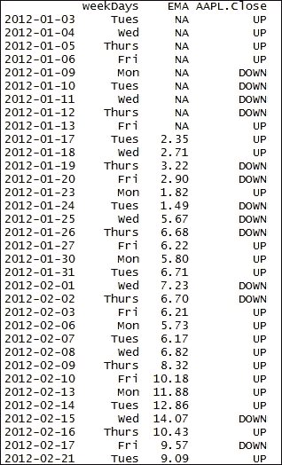

探索价格变化的摘要。使用 `summary()` 函数。该函数提供一系列描述性统计量，以生成 `AAPLDataSetNew` 数据框的结果摘要：

```py
    > summary(AAPLDataSetNew)

```

结果如下：

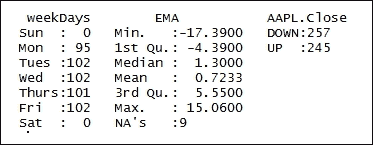

```py
    > AAPLDataSetNew <- AAPLDataSetNew[-c(1:10),]

```

结果如下：

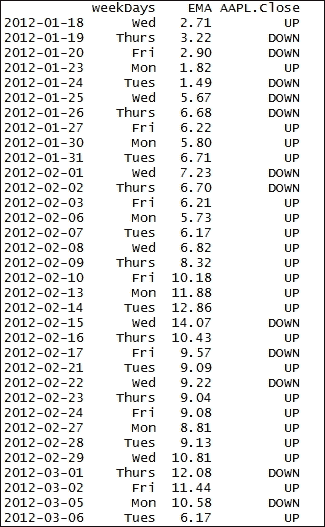

探索价格变化的摘要。使用 `summary()` 函数。该函数提供一系列描述性统计量，以生成 `AAPLDataSetNew` 数据框的结果摘要：

```py
> summary(AAPLDataSetNew) 

```

结果如下：

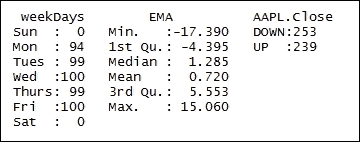

探索 `AAPLDataSetNew` 数据框的维度。`dim()` 函数返回 `AAPLDataSetNew` 框的维度。将 `AAPLDataSetNew` 数据框作为输入参数传递。结果明确指出有 492 行数据和 3 列：

```py
    > dim(AAPLDataSetNew)

```

结果如下：

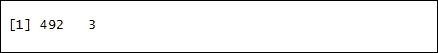

构建训练数据集。`AAPLDataSetNew` 数据框中的三分之二元素将用作训练数据集，而 `AAPLDataSetNew` 数据框中的一分之一元素将用作测试数据集。

训练数据集将存储在 `trainingDataSet` 数据框中：

```py
> trainingDataSet <- AAPLDataSetNew[1:328,] 

```

探索 `trainingDataSet` 数据框的维度。`dim()` 函数返回 `trainingDataSet` 数据框的维度。将 `trainingDataSet` 数据框作为输入参数传递。结果明确指出有 328 行数据和 3 列：

```py
    > dim(trainingDataSet)

```

结果如下：


探索价格变化的摘要。使用 `trainingDataSet()` 函数。该函数提供一系列描述性统计量，以生成 `trainingDataSet` 数据框的结果摘要：

```py
    > summary(trainingDataSet)

```

结果如下：

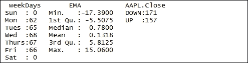

训练数据集将存储在 `TestDataSet` 数据框中：

```py
    > TestDataSet <- AAPLDataSetNew[329:492,]

```

探索 `TestDataSet` 数据框的维度。`dim()` 函数返回 `TestDataSet` 框的维度。将 `TestDataSet` 数据框作为输入参数传递。结果明确指出有 164 行数据和 3 列：

```py
    > dim(TestDataSet)

```

结果如下：

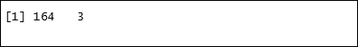

```py
    > summary(TestDataSet)

```

结果如下：

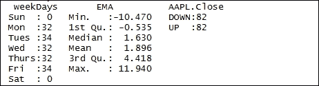

通过指定指标构建朴素贝叶斯分类器。将使用 `naiveBayes()` 函数。它使用贝叶斯规则计算给定一组类别变量和独立预测变量后的后验概率。该函数假设度量预测变量的高斯分布。

`exponentialMovingAverageDiffRoundModel` 是函数的输出结果，其中自变量是 `trainingDataSet[,1:2]`，因变量是 `trainingDataSet[,3]`：

```py
> exponentialMovingAverageDiffRoundModel <-
naiveBayes(trainingDataSet[,1:2],trainingDataSet[,3])

```

显示 `exponentialMovingAverageDiffRoundModel` 结果：

```py
    > exponentialMovingAverageDiffRoundModel

```

结果如下：

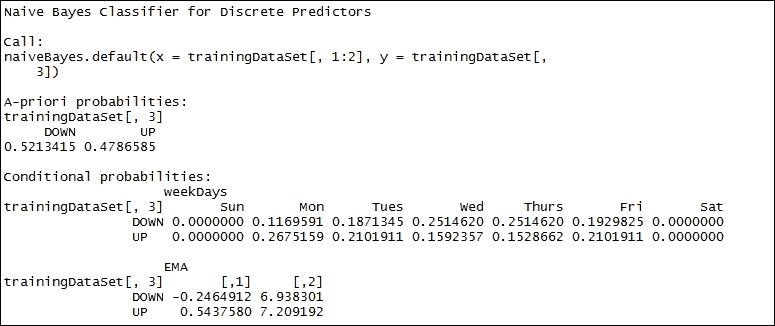

测试结果：

```py
    > table(predict(exponentialMovingAverageDiffRoundModel,TestDataSet),
TestDataSet[,3],dnn=list('Predicted','Actual')) 

```

结果如下：

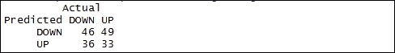

# 随机森林 - 货币交易策略

在进行技术分析后，可以科学地实现预测外汇市场未来价格趋势的目标。外汇交易者根据市场趋势、成交量、范围、支撑和阻力水平、图表模式和指标等多种技术分析制定策略，并使用不同时间框架的图表进行多时间框架分析。基于过去市场行动的统计数据，如过去价格和过去成交量，创建技术分析策略以评估资产。分析的主要目标不是衡量资产的基本价值，而是计算市场的历史表现所指示的未来市场表现。

## 准备工作

为了执行随机森林，我们将使用从美元和英镑数据集收集的数据集。

### 第一步 - 收集和描述数据

将使用标题为 `PoundDollar.csv` 的数据集。数据集是标准格式。有 5,257 行数据和 6 个变量。数值变量如下：

+   `日期`

+   `开盘价`

+   `最高价`

+   `最低价`

+   `收盘价`

+   `成交量`

## 如何操作...

让我们深入了解细节。

### 第二步 - 探索数据

作为第一步要执行，以下包需要加载：

```py
> install.packages("quantmod")
> install.packages("randomForest")
> install.packages("Hmisc")

```

### 备注

版本信息：本页代码在 R 版本 3.3.0（2016-05-03）中进行了测试。

以下每个库都需要安装：

```py
> library("quantmod")
> library("randomForest")
> library("Hmisc")

```

让我们探索数据并了解变量之间的关系。我们将首先导入名为 `PoundDollar.csv` 的 CSV 数据文件。我们将把数据保存到 `PoundDollar` 数据框中：

```py
    > PoundDollar <- read.csv("d:/PoundDollar.csv")

```

打印 `PoundDollar` 数据框。`head()` 函数返回 `PoundDollar` 数据框的前一部分。`PoundDollar` 数据框作为输入参数传递：

```py
    > head(PoundDollar)

```

结果如下：

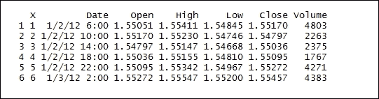

打印 `PoundDollar` 数据框的摘要。`summary()` 函数是一个多功能函数。`summary()` 是一个通用函数，它提供了与单个对象或数据框相关的数据的摘要。`PoundDollar` 数据框作为 R 对象传递给 `summary()` 函数：

```py
    > summary(PoundDollar)

```

结果如下：

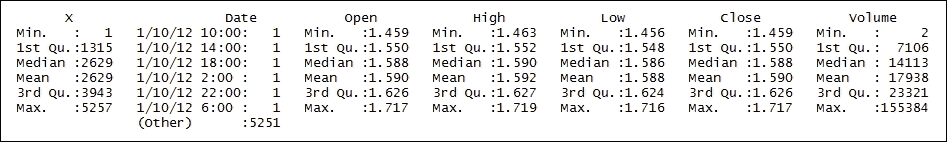

探索 `PoundDollar` 数据框的维度。`dim()` 函数返回 `PoundDollar` 框的维度。`PoundDollar` 数据框作为输入参数传递。结果清楚地表明有 5,257 行数据和 7 列：

```py
    > dim(PoundDollar)

```

结果如下：

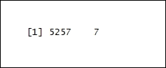

### 第三步 - 准备变量以构建数据集

表示日历日期和时间。`as.POSIXlt()` 函数将对象操作为表示日期和时间。`PoundDollar` 作为参数传递。`format="%m/%d/%y %H:%M` 表示日期时间格式。结果存储在 `DateAndTime` 数据框中：

```py
    > DateAndTime <- as.POSIXlt(PoundDollar[,2],format="%m/%d/%y %H:%M")

```

捕获 `最高价`、`最低价` 和 `收盘价` 值：

```py
    > HighLowClose <- PoundDollar[,4:6]

```

`PoundDollar`数据框捕获了第四、第五和第六列中的`High`、`Low`和`Close`值。打印`HighLowClose`数据框。`head()`函数返回`HighLowClose`数据框的第一部分。`HighLowClose`数据框被作为输入参数传递：

```py
    > head(HighLowClose)

```

结果如下：

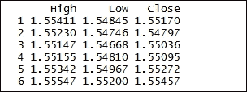

打印`HighLowClose`数据框的摘要。`summary()`函数是一个多功能函数。`summary()`是一个泛型函数，它提供了与单个对象或数据框相关的数据的摘要。`HighLowClose`数据框被作为 R 对象传递给`summary()`函数：

```py
    > summary(HighLowClose)

```

结果如下：

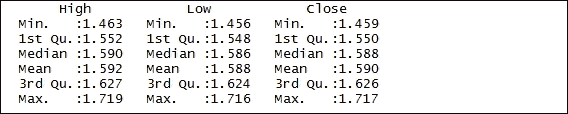

探索`HighLowClose`数据框的内部结构。`str()`函数显示数据框的内部结构。将`HighLowClose`作为 R 对象传递给`str()`函数：

```py
    > str(HighLowClose)

```

结果如下：

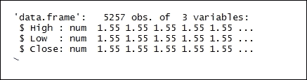

创建要使用的数据集。使用`data.frame()`函数根据紧密耦合的变量集创建数据框。这些变量具有矩阵的性质。将`HighLowClose`作为参数传递给`data.frame()`。然后将结果存储在`HighLowClosets`数据框中。`row.names=DateAndTime`表示一个整数字符串，指定用作行名的列。结果存储在`HighLowClose`数据框中：

```py
> HighLowClosets <- data.frame(HighLowClose, row.names=DateAndTime) 

```

描述数据集。`describe()`函数提供项目分析。`HighLowClosets`作为输入参数传递：

```py
    > describe(HighLowClosets)

```

结果如下：

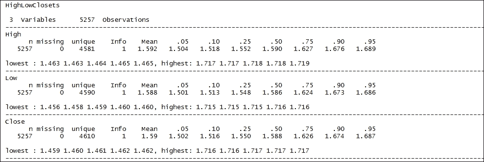

创建时间序列对象。使用`as.xts()`函数。它将任意类别的数据对象转换为`xts`类，而不丢失原始格式的任何属性。`HighLowClosets`被作为输入对象传递：

```py
    > HighLowClosexts <- as.xts(HighLowClosets)

```

计算布林带。布林带是一种范围指标，它从移动平均数计算标准差。布林带遵循的逻辑是，货币对的价格最有可能趋向于其平均值，因此当它偏离太多，例如两个标准差之外时，它将回溯到其移动平均数。使用`BBands()`函数来计算布林带。`HighLowClosexts`被作为对象传递，该对象被转换为包含高低收盘价的矩阵。`n=20`表示移动平均数的周期数。SMA 命名要调用的函数。`sd=2`表示两个标准差：

```py
    > BollingerBands <- BBands(HighLowClosexts,n=20,SMA,sd=2)

```

描述数据集。`describe()`函数提供项目分析。`BollingerBands`作为输入参数传递：

```py
    > describe(BollingerBands)

```

结果如下：

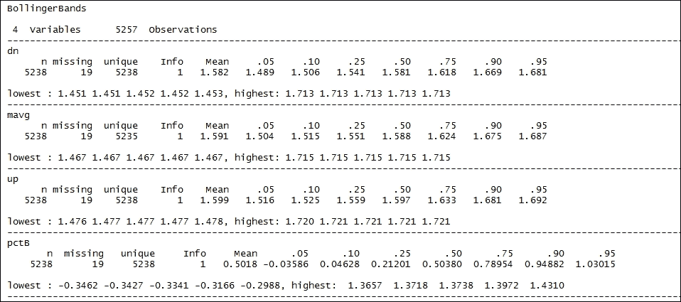

构建上限带：

```py
    > Upper <- BollingerBands$up - HighLowClosexts$Close

```

打印上界数据框的摘要。`summary()` 函数是一个多功能函数。`summary()` 是一个通用函数，它提供了与单个对象或数据框相关的数据的摘要。`Upper` 数据框作为 R 对象传递给 `summary()` 函数：

```py
    > summary(Upper)

```

结果如下：

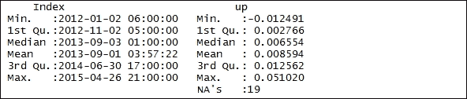

构建下界带：

```py
    > Lower <- BollingerBands$dn - HighLowClosexts$Close

```

打印下界数据框的摘要。`summary()` 函数是一个多功能函数。`summary()` 是一个通用函数，它提供了与单个对象或数据框相关的数据的摘要。下界数据框作为 R 对象传递给 `summary()` 函数：

```py
    > summary(Upper)

```

结果如下：

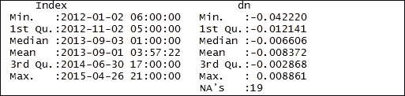

构建中间带：

```py
    > Middle <- BollingerBands$mavg - HighLowClosexts$Close

```

打印中间数据框的摘要。`summary()` 函数是一个多功能函数。`summary()` 是一个通用函数，它提供了与单个对象或数据框相关的数据的摘要。`Middle` 数据框作为 R 对象传递给 `summary()` 函数：

```py
    > summary(Middle)

```

结果如下：

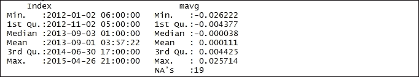

计算百分比变化。使用 `Delt()` 函数计算给定序列从一个时期到另一个时期的百分比变化。`k=1` 表示在各个时期的变化。结果存储在 `PercentageChngpctB` 数据框中：

```py
    > PercentageChngpctB <- Delt(BollingerBands$pctB,k=1)

```

描述数据集。`describe()` 函数提供项目分析。`PercentageChngpctB` 作为输入参数传递：

```py
    > describe(PercentageChngpctB)

```

结果如下：

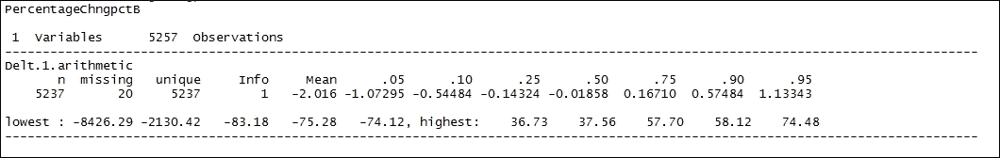

计算上界数据框的百分比变化。`k=1` 表示在各个时期的变化：

```py
    > PercentageChngUp <- Delt(Upper,k=1)

```

描述数据集。`describe()` 函数提供项目分析。`PercentageChngUp` 作为输入参数传递：

```py
    > describe(PercentageChngUp)

```

结果如下：

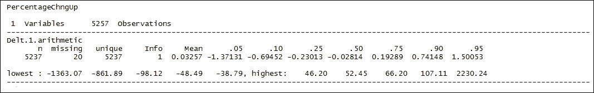

计算下界数据框的百分比变化。`k=1` 表示在各个时期的变化：

```py
    > PercentageChngLow <- Delt(Lower, k=1)

```

描述数据集。`describe()` 函数提供项目分析。`PercentageChngLow` 作为输入参数传递：

```py
    > describe(PercentageChngLow)

```

结果如下：


计算中间数据框的百分比变化。`k=1` 表示在各个时期的变化：

```py
    > PercentageChngMid <- Delt(Middle,k=1)

```

描述数据集。`describe()` 函数提供项目分析。`PercentageChngMid` 作为输入参数传递：

```py
    > describe(PercentageChngMid)

```

结果如下：


计算变量 `HighLowClosexts$Close` 的百分比变化。`k=1` 表示在各个时期的变化：

```py
    > Returns <- Delt(HighLowClosexts$Close, k=1)

```

### 第 4 步 - 构建模型

创建二元分类变量。`ifelse()` 函数使用测试表达式返回值，该值本身是一个向量，其长度与测试表达式相同。如果测试表达式的对应值为 `TRUE`，则从 `x` 中返回一个元素；如果测试表达式的对应值为 `FALSE`，则从 `y` 中返回一个元素。

在这里，`Returns>0` 是测试函数，需要在逻辑模式下进行测试。`UP` 和 `DOWN` 执行逻辑测试。结果随后存储在 `binaryClassification` 数据框中：

```py
> binaryClassification <- ifelse(Returns>0,"Up","Down") 

```

探索价格变化的摘要。使用 `summary()` 函数。该函数提供一系列描述性统计量，以生成 `binaryClassification` 数据框的结果摘要：

```py
    > summary(binaryClassification)

```

结果如下：

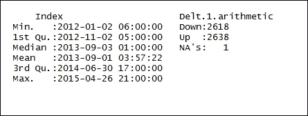

将类别回退一个：

```py
    > ClassShifted <- binaryClassification[-1]

```

结合所有特征。使用 `data.frame()` 函数根据紧密耦合的变量集创建数据框。这些变量具有矩阵的性质。

传递给 `data.frame()` 的参数变量有 `Upper`、`Lower`、`Middle`、`BollingerBands$pctB`、`PercentageChngpctB`、`PercentageChngUp`、`PercentageChngLow` 和 `PercentageChngMid`。结果随后存储在 `FeaturesCombined` 数据框中：

```py
    > FeaturesCombined <- data.frame(Upper, Lower, Middle, BollingerBands$pctB, PercentageChngpctB, PercentageChngUp, PercentageChngLow, PercentageChngMid)

```

探索价格变化的摘要。使用 `summary()` 函数。该函数提供一系列描述性统计量，以生成 `FeaturesCombined` 数据框的结果摘要：

```py
    > summary(FeaturesCombined)

```

结果如下：


匹配类别：

```py
    > FeaturesShifted <- FeaturesCombined[-5257,]

```

结合 `FeaturesShifted` 和 `ClassShifted` 数据框。传递给 `data.frame()` 的参数变量是 `FeaturesShifted` 和 `ClassShifted`。结果随后存储在 `FeaturesClassData` 数据框中：

```py
    > FeaturesClassData <- data.frame(FeaturesShifted, ClassShifted)

```

探索价格变化的摘要。使用 `summary()` 函数。该函数提供一系列描述性统计量，以生成 `FeaturesClassData` 数据框的结果摘要：

```py
    > summary(FeaturesClassData)

```

结果如下：

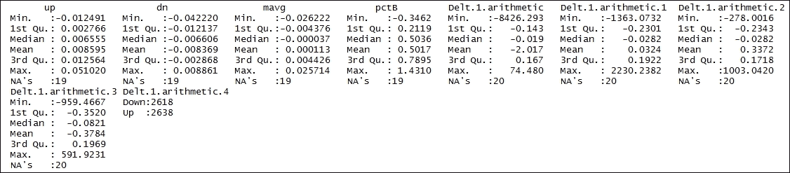

计算指标正在被移除：

```py
    > FinalModelData <- FeaturesClassData[-c(1:20),]

```

命名列。使用 `c()` 函数将参数组合成向量：

```py
    > colnames(FinalModelData) <- c("pctB","LowDiff","UpDiff","MidDiff","PercentageChngpctB","PercentageChngUp","PercentageChngLow","PercentageChngMid","binaryClassification")

```

探索 `FinalModelData` 数据框的内部结构。`str()` 函数显示数据框的内部结构。`FinalModelData` 作为 R 对象传递给 `str()` 函数：

```py
    > str(FinalModelData)

```

结果如下：

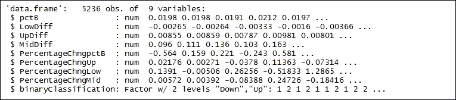

设置初始随机变量：

```py
    > set.seed(1)

```

使用类别（第 9 列）评估特征（第 1 至 9 列）以找到每棵树的最佳特征数量。"FinalModelData[,-9]" 表示预测变量数据框，"FinalModelData[,9]" 表示响应变量数据框。"ntreeTry=100" 表示在调整步骤中使用的树的数量。"stepFactor=1.5" 表示每次迭代的值，"mtry" 通过这个值膨胀（或缩水），"improve=0.01" 表示搜索必须继续的（相对）出袋误差的改善量。"trace=TRUE" 表示是否打印搜索的进度。"dobest=FALSE" 表示是否使用找到的最佳 "mtry" 运行森林：

```py
    > FeatureNumber <- tuneRF(FinalModelData[,-9], FinalModelData[,9], ntreeTry=100, stepFactor=1.5, improve=0.01, trace=TRUE, plot=TRUE, dobest=FALSE)

```

使用所有特征进行分类预测，每棵树有两个特征。使用 "randomForest()" 函数。`data=FinalModelData` 表示包含模型中变量的数据框。"mtry=2" 表示在每次分割中随机采样的变量作为候选者的数量。"ntree=2000" 表示要生长的树的数量。"keep.forest=TRUE" 表示森林将保留在输出对象中。"importance=TRUE" 表示要评估预测变量的重要性：

```py
    > RandomForest <- randomForest(binaryClassification~., data=FinalModelData, mtry=2,  ntree=2000, keep.forest=TRUE, importance=TRUE)

```

结果如下：

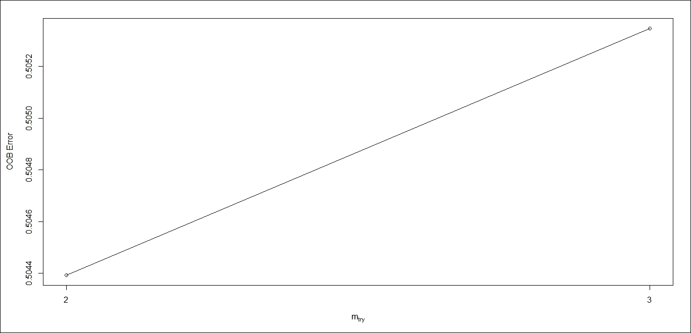

绘制随机森林：

```py
    > varImpPlot(RandomForest, main = 'Random Forest: Measurement of Importance of Each Feature',pch=16,col='blue' )

```

结果如下：

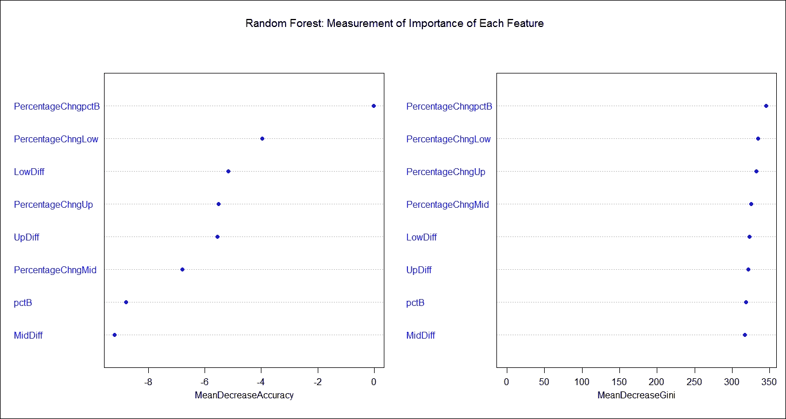

# 支持向量机 - 货币交易策略

外汇市场是一个国际交易市场，各国货币可以自由买卖。一种货币的价格仅由市场参与者决定，由供求关系驱动。交易通过个别合约进行。标准合约规模（也称为一手）通常是 100,000 单位。这意味着，对于每份标准合约，控制的是 100,000 单位的基础货币。对于这个合约规模，每个点（最小的价格变动单位）价值 10 美元。根据交易者的交易策略，头寸可以维持非常短的时间，也可以维持更长的时间，甚至数年。有几个工具允许交易者理解和在市场上做出决策，这些工具基本上分为基本面分析或技术分析。基本面分析考虑了政治和经济信息的持续交换。技术分析基本上基于价格、时间和成交量——货币达到的最低和最高价格、时间段、交易次数等。技术分析还假设市场的重复性，它很可能在未来再次执行，就像它在过去已经执行的那样。它分析过去的报价，并根据统计和数学计算预测未来的价格。

## 准备中

为了执行支持向量机，我们将使用从美元和英镑数据集中收集的数据集。

### 步骤 1 - 收集和描述数据

将使用标题为 `PoundDollar.csv` 的数据集。数据集是标准格式。有 5,257 行数据，6 个变量。数值变量如下：

+   `日期`

+   `开盘价`

+   `最高价`

+   `低`

+   `收盘价`

+   `成交量`

## 如何操作...

让我们深入了解细节。

### 步骤 2 - 探索数据

作为第一步需要加载以下包：

```py
> install.packages("quantmod")
> install.packages("e1071")
> install.packages("Hmisc")
> install.packages("ggplot2")

```

### 注意

版本信息：本页代码在 R 版本 3.3.0（2016-05-03）中进行了测试。

以下每个库都需要安装：

```py
> library("quantmod")
> library("e1071")
> library("Hmisc")
> install.packages("ggplot2")

```

让我们探索数据并了解变量之间的关系。我们将从导入名为 `PoundDollar.csv` 的 CSV 数据文件开始。我们将数据保存到 `PoundDollar` 数据框中：

```py
    > PoundDollar <- read.csv("d:/PoundDollar.csv")

```

打印 `PoundDollar` 数据框。`head()` 函数返回 `PoundDollar` 数据框的前一部分。`PoundDollar` 数据框作为输入参数传递：

```py
    > head(PoundDollar)

```

结果如下：

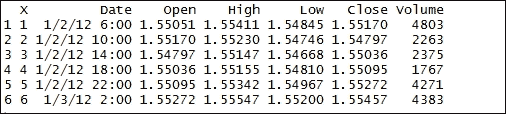

探索 `PoundDollar` 数据框的内部结构。`str()` 函数显示数据框的内部结构。`PoundDollar` 作为 R 对象传递给 `str()` 函数：

```py
    > str(PoundDollar)

```

结果如下：

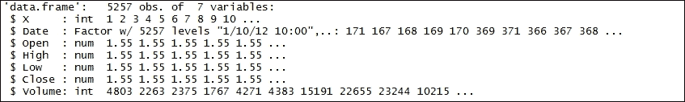

### 步骤 3 - 计算指标

计算相对强弱指数（RSI）。它是最近向上价格变动与绝对价格变动的比率。使用 `RSI()` 函数计算相对强弱指数。`PoundDollar` 数据框用作价格序列。`n = 3` 表示移动平均的周期数。结果存储在 `relativeStrengthIndex3` 数据框中：

```py
    > relativeStrengthIndex3 <- RSI(Op(PoundDollar), n= 3)

```

探索价格变化的摘要。使用 `summary()` 函数。该函数提供了一系列描述性统计量，以生成 `relativeStrengthIndex3` 数据框的结果摘要：

```py
    > summary(relativeStrengthIndex3)

```

结果如下：

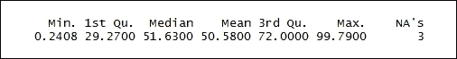

计算 `PoundDollar` 序列的 **移动平均**（**MA**）。`SMA` 计算过去一系列观察值的算术平均值。`n=50` 表示平均的周期数：

```py
    > SeriesMeanAvg50 <- SMA(Op(PoundDollar), n=50)

```

打印 `SeriesMeanAvg50` 数据框的摘要。`summary()` 函数是一个多功能函数。`summary()` 是一个通用函数，它提供了与单个对象或数据框相关的数据的摘要。`SeriesMeanAvg50` 数据框作为 R 对象传递给 `summary()` 函数：

```py
    > summary(SeriesMeanAvg50)

```

结果如下：

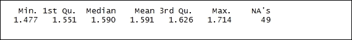

描述数据集。`describe()` 函数提供项目分析。`SeriesMeanAvg50` 作为输入参数传递：

```py
    > describe(SeriesMeanAvg50)

```

结果如下：

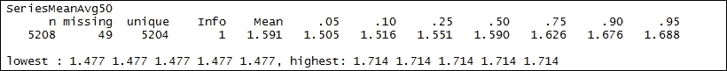

测量趋势。找出开盘价与 50 期简单移动平均价之间的差异：

```py
    > Trend <- Op(PoundDollar) - SeriesMeanAvg50

```

打印 `SeriesMeanAvg50` 数据框的摘要。`Trend` 数据框作为 R 对象传递给 `summary()` 函数：

```py
    > summary(Trend)

```

结果如下：

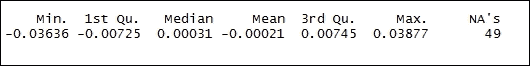

计算收盘价和开盘价之间的价格差异。结果存储在数据框 `PriceDiff` 中：

```py
    > PriceDiff <- Cl(PoundDollar) - Op(PoundDollar)

```

打印 `PriceDiff` 数据框的摘要。`Trend` 数据框作为 R 对象传递给 `summary()` 函数：

```py
    > summary(PriceDiff)

```

结果如下：

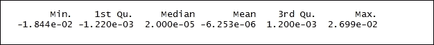

### 步骤 4 - 准备变量以构建数据集

创建二元分类变量。`ifelse()` 函数使用测试表达式返回值，该值本身是一个向量，其长度与测试表达式相同。如果测试表达式的对应值为 `TRUE`，则返回 `x` 的元素；如果对应值为 `FALSE`，则返回 `y` 的元素。

这里，`PriceChange>0` 是测试函数，需要在逻辑模式下进行测试。`UP` 和 `DOWN` 执行逻辑测试。结果随后存储在 `binaryClassification` 数据框中：

```py
    > binaryClassification <- ifelse(PriceDiff>0,"UP","DOWN")

```

打印 `binaryClassification` 数据框的摘要。`Trend` 数据框作为 R 对象传递给 `summary()` 函数：

```py
    > summary(binaryClassification)

```

结果如下：

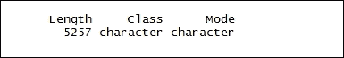

结合相对 `StrengthIndex3`、`Trend` 和 `binaryClassification` 数据框。传递给 `data.frame()` 的参数是 `relativeStrengthIndex3`、`Trend` 和 `binaryClassification`。结果存储在 `DataSet` 数据框中：

```py
    > DataSet <- data.frame(relativeStrengthIndex3, Trend, binaryClassification)

```

打印 `DataSet` 数据框的摘要。`Trend` 数据框作为 R 对象传递给 `summary()` 函数：

```py
    > summary(DataSet)

```

结果如下：

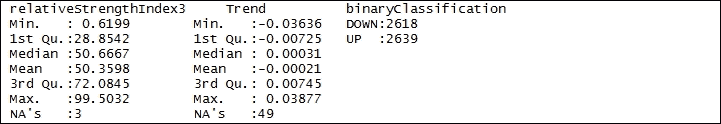

探索 `DataSet` 数据框的内部结构。`str()` 函数显示数据框的内部结构。`DataSet` 作为 R 对象传递给 `str()` 函数：

```py
    > str(DataSet)

```

结果如下：

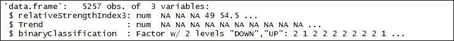

计算指标、创建数据集和删除点：

```py
    > DataSet <- DataSet[-c(1:49),]

```

探索 `DataSet` 数据框的维度。`dim()` 函数返回 `DataSet` 框的维度。`DataSet` 数据框作为输入参数传递。结果清楚地表明有 5,208 行数据和 3 列：

```py
> dim(DataSet) 

```

结果如下：

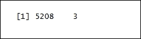

分离训练数据集：

```py
    > TrainingDataSet <- DataSet[1:4528,]

```

探索 `TrainingDataSet` 数据框的维度。`dim()` 函数返回 `TrainingDataSet` 框的维度。`TrainingDataSet` 数据框作为输入参数传递。结果清楚地表明有 4,528 行数据和 3 列：

```py
    > dim(TrainingDataSet)

```

结果如下：

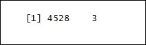

打印`TrainingDataSet`数据框的摘要。`TrainingDataSet`数据框作为 R 对象传递给`summary()`函数：

```py
    > summary(TrainingDataSet)

```

结果如下：

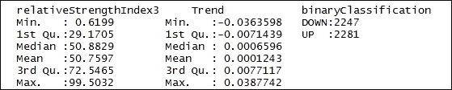

分离测试数据集：

```py
    > TestDataSet <- DataSet[4529:6038,]

```

探索`TestDataSet`数据框的维度。`dim()`函数返回`TestDataSet`框的维度。将`TestDataSet`数据框作为输入参数传递。结果清楚地表明有 1,510 行数据和 3 列：

```py
    > dim(TestDataSet)

```

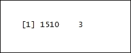

打印`TestDataSet`数据框的摘要。`TestDataSet`数据框作为 R 对象传递给`summary()`函数：

```py
    > summary(TestDataSet)

```

结果如下：

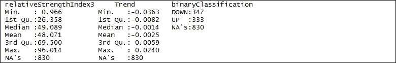

### 步骤 5 - 构建模型

使用`svm()`函数构建支持向量机。使用`binaryClassification~relativeStrengthIndex3+Trend`作为公式。`data=TrainingDataSet`用作包含模型变量的数据框。`kernel="radial"`表示在训练和预测中使用径向基核函数。`cost=1`表示违反约束的成本。`gamma=1/2`表示除线性核函数之外所有核函数所需的参数：

```py
    > SVM <- svm(binaryClassification~relativeStrengthIndex3+Trend, data=TrainingDataSet, kernel="radial", cost=1, gamma=1/2)

```

打印`SVM`数据框的摘要。`SVM`数据框作为 R 对象传递给`summary()`函数：

```py
    > summary(SVM)

```

结果如下：

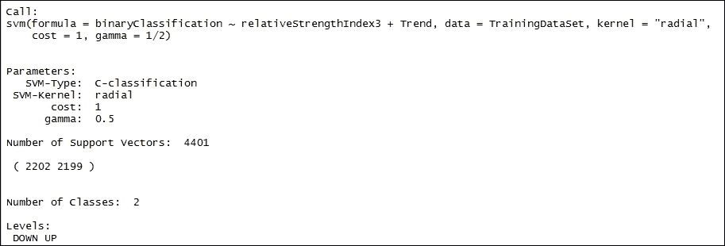

为了根据模型对象预测值，我们将使用`predict()`函数。将`SVM`作为对象传递。将`TrainingDataSet`数据对象作为对象传递，在其中查找用于预测的变量：

```py
    > TrainingPredictions <- predict(SVM, TrainingDataSet, type="class")

```

打印`TrainingPredictions`数据框的摘要。`SVM`数据框作为 R 对象传递给`summary()`函数：

```py
    > summary(TrainingPredictions)

```

结果如下：

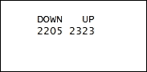

描述数据集。`describe()`函数提供项目分析。将`TrainingPredictions`作为输入参数传递：

```py
    > describe(TrainingPredictions)

```

结果如下：


合并`TrainingDataSet`和`TrainingPredictions`数据框。传递给`data.frame()`函数的参数是`TrainingDataSet`和`TrainingPredictions`。结果存储在`TrainingDatadata`数据框中：

```py
    > TrainingData <- data.frame (TrainingDataSet, TrainingPredictions)

```

打印`TrainingData`数据框的摘要。`TrainingData`数据框作为 R 对象传递给`summary()`函数：

```py
    > summary(TrainingData)

```

结果如下：

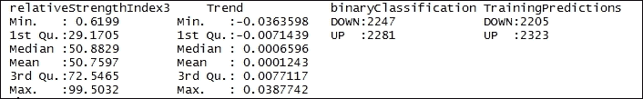

打印`TrainingData`：

```py
    > ggplot(TrainingData,aes(x=Trend,y=relativeStrengthIndex3))    +stat_density2d(geom="contour",aes(color=TrainingPredictions))    +labs(,x="Open - SMA50",y="RSI3",color="Training Predictions")

```

结果如下：

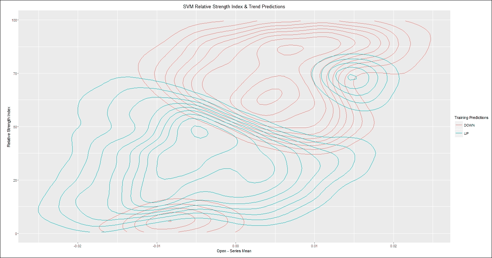

# 随机梯度下降 - 成人收入

**随机梯度下降**也称为**增量**梯度下降，是梯度下降优化方法的一个随机近似，该方法用于最小化一个表示为可微函数之和的目标函数。它通过迭代尝试找到最小值或最大值。在随机梯度下降中，*Q(w)*的真正梯度被一个单例的梯度近似：

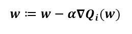

当算法遍历训练集时，它会对每个训练示例执行上述更新。可以在训练集上多次遍历，直到算法收敛。如果这样做，则可以在每次遍历中打乱数据以防止循环。典型的实现可能使用自适应学习率，以便算法收敛。

## 准备工作

为了执行随机梯度下降，我们将使用从人口普查数据收集的数据集来预测收入。

### 第 1 步 - 收集和描述数据

将使用名为`adult.txt`的数据集。数据集是标准格式。有 32,561 行数据和 15 个变量。数值变量如下：

+   `年龄`

+   `fnlwgt`

+   `教育年限`

+   `资本收益`

+   `资本损失`

+   `每周工作小时数`

非数值变量如下：

+   `工作类别`

+   `教育`

+   `婚姻状况`

+   `职业`

+   `关系`

+   `种族`

+   `性别`

+   `国籍`

+   `收入范围`

## 如何做到这一点...

让我们深入了解细节。

### 第 2 步 - 探索数据

以下每个库都需要安装：

```py
> library("klar")
> library("caret")
> library ("stringr")

```

### 注意

版本信息：本页面的代码在 R 版本 3.3.0（2016-05-03）中进行了测试。

让我们探索数据并了解变量之间的关系。我们将从导入名为`adult.txt`的 TXT 数据文件开始。我们将数据保存到`labels`数据框中：

```py
    > labels <- read.csv("d:/adult.txt")

```

探索`allData`数据框的内部结构。`str()`函数显示数据框的内部结构。将`allData`作为 R 对象传递给`str()`函数：

```py
    > str(allData)

```

结果如下：

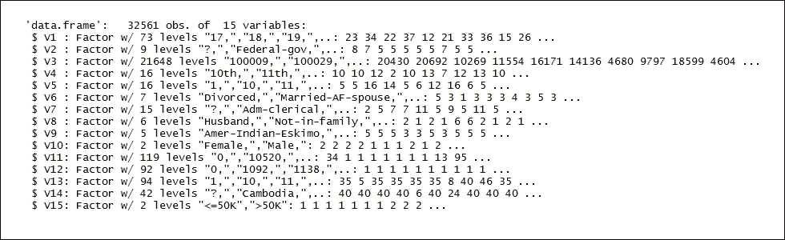

### 第 3 步 - 准备数据

从主文件中获取标签。使用`as.factor()`函数将`allData[,15]`向量编码为因子，以确保格式兼容性。然后，结果存储在`labels`数据框中：

```py
    > labels <- as.factor(allData[,15])

```

在去除标签后获取数据的所有特征。结果存储在`allFeatures`数据框中：

```py
    > allFeatures <- allData[,-c(15)]

```

打印`allFeatures`数据框。`head()`函数返回`allFeatures`数据框的前部分。将`allFeatures`数据框作为输入参数传递：

```py
    > head(allFeatures)

```

结果如下：

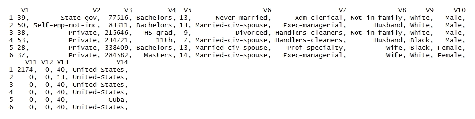

标准化特征。均值和尺度转换为`z`分数，使得`variance = 1`。`scale()`函数的默认方法将数值矩阵的列中心化和/或缩放。`continuousFeatures`是数值矩阵。结果存储在`continuousFeatures`数据框中：

```py
    > continuousFeatures <- scale(continuousFeatures)

```

打印`continuousFeatures`数据框。`head()`函数返回`continuousFeatures`数据框的前部分。`continuousFeatures`数据框作为输入参数传递：

```py
    > head(continuousFeatures)

```

结果如下：

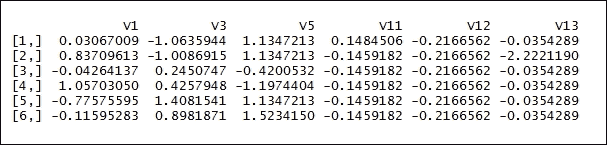

将标签转换为`1`或`-1`。使用`rep()`函数复制值。结果存储在`labels.n`数据框中：

```py
    > labels.n = rep(0,length(labels))     
> labels.n[labels==" <=50K"] = -1     
> labels.n[labels==" >50K"] = 1     
> labels = labels.n     
> rm(labels.n)

```

分离训练数据集。`createDataPartition()`函数创建一组训练数据分区。`y=labels`表示结果向量。`p=.8`表示 80%的数据用于训练数据集：

```py
    > trainingData <- createDataPartition(y=labels, p=.8, list=FALSE)

```

探索`trainingData`数据框的维度。`dim()`函数返回`trainingData`数据框的维度。`trainingData`数据框作为输入参数传递。结果清楚地表明有 26,049 行数据和单列：

```py
    > dim(trainingData)

```

结果如下：


创建`trainingData`数据框的训练特征和训练标签：

```py
    > trainingFeatures <- continuousFeatures[trainingData,]     
> trainingLabels <- labels[trainingData]

```

确定剩余 20%的数据用于测试和验证：

```py
    > remainingLabels <- labels[-trainingData]     
> remainingFeatures <- continuousFeatures[-trainingData,]

```

创建`trainingData`数据框的测试特征和测试标签。在 20%的数据中，其中 50%用于测试目的，剩余的 50%用于验证目的。

`createDataPartition()`函数创建一组训练数据分区。`y=remainingLabels`表示结果向量。`p=.5`表示 50%的数据用于训练数据集。结果存储在`testingData`数据框中：

```py
    > testingData <- createDataPartition(y=remainingLabels, p=.5, list=FALSE)     
> testingLabels <- remainingLabels[testingData]     
> testingFeatures <- remainingFeatures[testingData,]

```

创建`testingData`数据框的验证特征和测试标签：

```py
    > validationLabels <- remainingLabels[-testingData]
    > validationFeatures <- remainingFeatures[-testingData,]

```

定义所需的准确度度量：

```py
> getAccuracy >- function(a,b,features,labels){
+ estFxn = features %*% a + b;
+ predictedLabels = rep(0,length(labels));
+ predictedLabels [estFxn < 0] = -1 ;
+ predictedLabels [estFxn >= 0] = 1 ;
+ return(sum(predictedLabels == labels) / length(labels))
+ }

```

### 第 4 步 - 构建模型

设置初始参数：

```py
> numEpochs = 100
> numStepsPerEpoch = 500
> nStepsPerPlot = 30
> evalidationSetSize = 50
> c1 = 0.01
> c2 = 50

```

组合一组参数。结果存储在`lambda_vals`数据框中：

```py
    > lambda_vals = c(0.001, 0.01, 0.1, 1)     
> bestAccuracy = 0

```

探索`lambda_vals`数据框的内部结构。`str()`函数显示数据框的内部结构。`lambda_vals`作为 R 对象传递给`str()`函数：

```py
    > str(lambda_vals)

```

结果如下：

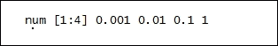

从给定的一组值中创建每个 epoch 的矩阵。使用`matrix()`函数。`nrow = (numStepsPerEpoch/nStepsPerPlot)*numEpochs+1`表示矩阵的行数，而`ncol = length(lambda_vals)`表示矩阵的列数：

```py
    > accMat <- matrix(NA, nrow = (numStepsPerEpoch/nStepsPerPlot)*numEpochs+1, ncol = length(lambda_vals))

```

从给定的一组值中创建用于验证集准确性的矩阵。`matrix()` 函数被使用。`nrow = (numStepsPerEpoch/nStepsPerPlot)*numEpochs+1` 表示矩阵的行数，而 `ncol = length(lambda_vals)` 表示矩阵的列数：

```py
    > accMatv <- matrix(NA, nrow = (numStepsPerEpoch/nStepsPerPlot)*numEpochs+1, ncol = length(lambda_vals))

```

设置分类器模型：

```py
for(i in 1:4){ 
lambda = lambda_vals[i] 
accMatRow = 1 
accMatCol = i 
a = rep(0,ncol(continuousFeatures)) 
b = 0 
stepIndex = 0 
       for (e in 1:numEpochs){

```

`#createDataPartition()` 函数创建一组训练数据分区。`y= trainingLabels` 表示结果向量。`p = (1 - evalidationSetSize/length(trainingLabels))` 百分比的数据用于训练数据集。结果存储在 `etrainingData` 数据框中：

```py
etrainingData <- createDataPartition(y=trainingLabels, p=(1 -   evalidationSetSize/length(trainingLabels)), list=FALSE) 
 etrainingFeatures <- trainingFeatures[etrainingData,] 
 etrainingLabels <- trainingLabels[etrainingData] 
 evalidationFeatures <- trainingFeatures[-etrainingData,] 
 evalidationLabels <- trainingLabels[-etrainingData] 
 steplength = 1 / (e*c1 + c2) 
 for (step in 1:numStepsPerEpoch){ 
 stepIndex = stepIndex+1 
 index = sample.int(nrow(etrainingFeatures),1) 
 xk = etrainingFeatures[index,] 
 yk = etrainingLabels[index] 
 costfxn = yk * (a %*% xk + b) 
 if(costfxn >= 1){ 
 a_dir = lambda * a 
 a = a - steplength * a_dir 
 } else { 
 a_dir = (lambda * a) - (yk * xk) 
 a = a - steplength * a_dir 
 b_dir = -yk 
 b = b - (steplength * b_dir) 
 } 

```

记录准确性。调用 `getAccuracy()`：

```py
if (stepIndex %% nStepsPerPlot == 1){#30){ 
accMat[accMatRow,accMatCol] = getAccuracy(a,b,evalidationFeatures,evalidationLabels) 
accMatv[accMatRow,accMatCol] = getAccuracy(a,b,validationFeatures,validationLabels) 
accMatRow = accMatRow + 1 
} 
} 
} 
tempAccuracy = getAccuracy(a,b,validationFeatures,validationLabels) 
print(str_c("tempAcc = ", tempAccuracy," and bestAcc = ", bestAccuracy) ) 
if(tempAccuracy > bestAccuracy){ 
bestAccuracy = tempAccuracy 
best_a = a 
best_b = b 
best_lambdaIndex = i 
} 
   }

```

计算模型的准确性。使用先前定义的 `getAccuracy()`：

```py
   > getAccuracy(best_a,best_b, testingFeatures, testingLabels)

```

### 步骤 5 - 绘制模型

绘制训练过程中模型的准确性。使用 `c()` 函数将参数组合成向量：

```py
    > colors = c("red","blue","green","black")

```

设置用于图表的向量：

```py
> xaxislabel = "Step"
> yaxislabels = c("Accuracy on Randomized Epoch Validation
Set","Accuracy on Validation Set")
>
> ylims=c(0,1)
> stepValues = seq(1,15000,length=500)

```

创建一个通用向量。调用 `list()`，它将 `accMat` 和 `accMatv` 数据框连接起来：

```py
    > mats =  list(accMat,accMatv)

```

绘制图表：

```py
> for(j in 1:length(mats)){
mat = mats[[j]]
for(i in 1:4){
if(i == 1){

```

`# plot()` 函数是一个用于绘制 R 对象的通用函数。将 `stepValues` 数据框作为函数值传递：

```py
 plot(stepValues, mat[1:500,i], type = "l",xlim=c(0, 15000), ylim=ylims, 
 col=colors[i],xlab=xaxislabel,ylab=yaxislabels[j],main=title) 
 } else{ 
 lines(stepValues, mat[1:500,i], type = "l",xlim=c(0, 15000), ylim=ylims, 
 col=colors[i],xlab=xaxislabel,ylab=yaxislabels[j],main=title) 
 } 
 Sys.sleep(1) 
 } 
 legend(x=10000,y=.5,legend=c("lambda=.001","lambda=.01","lambda=.1","lambda=1"),fill=colors) 
 } 

```

生成的图表将如下所示：

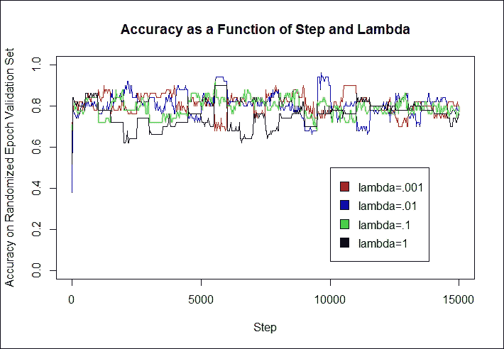
