# 第八章. 强化学习

在本章中，我们将介绍以下食谱：

+   马尔可夫链 - 股票状态切换模型

+   马尔可夫链 - 多渠道归因模型

+   马尔可夫链 - 汽车租赁代理服务

+   连续马尔可夫链 - 加油站车辆服务

+   蒙特卡洛模拟 - 校准的 Hull 和 White 短期利率

# 简介

**马尔可夫链**：如果一个实验的每次试验的结果是离散状态集合中的一个，并且试验的结果只依赖于当前状态而不依赖于任何过去的状态，那么这个实验的试验序列就是一个马尔可夫链。从一个状态转换到另一个状态的概率表示为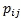。这被称为转移概率。转移概率矩阵是一个 n × n 矩阵，其中矩阵的每个元素都是非负的，并且矩阵的每一行之和为 1。

**连续时间马尔可夫链**：连续时间马尔可夫链可以被标记为带有离散状态的速率增强的转移系统。状态具有连续的时间步长，延迟是指数分布的。连续时间马尔可夫链适用于建模可靠性模型、控制系统、生物途径、化学反应等。

**蒙特卡洛模拟**：蒙特卡洛模拟是对系统行为的随机模拟。模拟使用对模型进行的采样实验，然后使用计算机进行数值实验，以获得对系统行为的统计理解。蒙特卡洛模拟用于构建复杂系统观察行为的理论，预测系统的未来行为，并研究系统内部输入和参数变化对最终结果的影响。随机模拟是一种实验系统以找到改进或更好地理解系统行为的方法。它使用在区间[0, 1]上均匀分布的随机数。这些均匀分布的随机数用于从各种概率分布中生成随机变量。然后生成与系统行为建模相关的采样实验。

# 马尔可夫链 - 股票状态切换模型

在过去几十年中，对波动性的分析和预测进行了大量研究。波动性是指随着时间的推移，通过回报率的标准差来衡量的交易价格系列的变动程度。股票回报率模型假设回报率遵循几何布朗运动。这意味着在任何离散时间间隔内，股票的回报率是对数正态分布的，且非重叠间隔内的回报率是独立的。研究发现，该模型无法捕捉极端价格变动和波动性参数中的随机变异性。随机波动性取离散值，在这些值之间随机切换。这是**制度切换对数正态过程**（**RSLN**）的基础。

## 准备中

为了执行马尔可夫链制度切换模型，我们将使用从股票数据集中收集的数据。

### 第一步 - 收集和描述数据

将使用名为`StocksRegimeSwitching.csv`的数据集。该数据集以 csv 格式提供，并命名为`StocksRegimeSwitching.csv`。数据集采用标准格式。有 66 行数据。有七个变量。数值变量如下：

+   `LRY`

+   `LRV`

+   `INT`

+   `LRC`

+   `LVS`

+   `LGS`

非数值变量如下：

+   `DATE`

## 如何做到这一点...

让我们深入了解细节。

### 第二步 - 探索数据

第一步是加载以下包：

```py
 >install.packages("MSwM")
 >library(MSwM)

```

### 注意

版本信息：本页面的代码在 R 版本 3.2.2（2015-08-14）中进行了测试。

让我们探索数据并了解变量之间的关系。我们将首先导入名为`StocksRegimeSwitching.csv`的 CSV 数据文件。我们将把数据保存到`MarkovSwitchData`数据框中：

```py
> MarkovSwitchData <- read.csv("d:/StocksRegimeSwitching.csv", header = TRUE)

```

附加数据集。`attach()`函数将数据集附加到搜索路径。在评估变量时搜索数据集。`MarkovSwitchData`作为参数传递：

```py
> attach(MarkovSwitchData)

```

打印`MarkovSwitchData`数据框。`head()`函数返回`MarkovSwitchData`数据框的前部分。`MarkovSwitchData`数据框作为输入参数传递：

```py
> head(MarkovSwitchData)

```

结果如下：

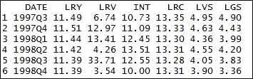

探索`MarkovSwitchData`数据框的维度。`dim()`函数返回`MarkovSwitchData`数据框的维度。`MarkovSwitchData`数据框作为输入参数传递。结果清楚地表明，有 66 行数据，七个单列：

```py
> dim(MarkovSwitchData)

```

结果如下：


打印`MarkovSwitchData`数据框的摘要。`summary()`函数是一个多功能函数。`summary()`函数是一个通用函数，它提供了与单个对象或数据框相关的数据摘要。`MarkovSwitchData`数据框作为 R 对象传递给`summary()`函数：

```py
> summary(MarkovSwitchData)

```

结果如下：

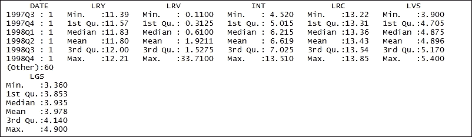

### 步骤 3 - 准备回归模型

在数据集上准备回归模型。当认为两个或更多变量通过线性关系系统性地连接时，使用回归分析。回归模型用于从一个变量预测另一个变量。它们基于信息提供关于过去、现在和未来事件的预测。

定义因变量。`cbind()` 函数用于定义因变量。该函数接受 `LVS` 数据框。结果数据框存储在 `yLogValueStocks` 数据框中：

```py
 > yLogValueStocks <- cbind(LVS)

```

打印 `yLogValueStocks` 数据框。`head()` 函数返回 `yLogValueStocks` 数据框的前部分。`yLogValueStocks` 数据框作为输入参数传递：

```py
 > head(yLogValueStocks)

```

结果如下：

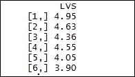

`cbind()` 函数接受 `LGS` 数据框。结果数据框存储在 `yLogGrowthStocks` 数据框中。

打印 `yLogGrowthStocks` 数据框。`head()` 函数返回 `yLogGrowthStocks` 数据框的前部分。`yLogGrowthStocks` 数据框作为输入参数传递：

```py
> head(yLogGrowthStocks)

```

结果如下：

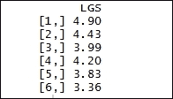

定义自变量。`cbind()` 函数用于定义因变量。该函数接受 `LRY`、`LRC`、`INT`、`LRV` 数据框。结果数据框存储在 `x` 数据框中：

```py
> x <- cbind(LRY, LRC, INT, LRV)

```

创建一个**普通最小二乘**（**OLS**）回归方程。使用 `lm()` 函数拟合线性模型。要拟合的模型以符号形式表示为 `yLogValueStocks~x`。结果存储在 `olsLogValueStocks` 数据框中：

```py
> olsLogValueStocks <- lm(yLogValueStocks~x)

```

打印 `olsLogValueStocks` 数据框的摘要。使用 `summary()` 函数提供与单个对象或数据框相关的数据摘要。将 `olsLogValueStocks` 数据框作为 R 对象传递给 `summary()` 函数：

```py
> summary(olsLogValueStocks)

```

结果如下：

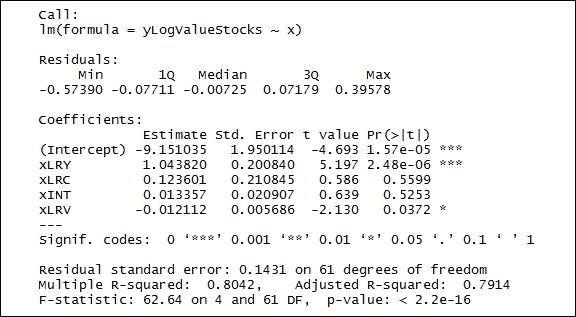

创建一个普通最小二乘回归方程。要拟合的模型以符号形式表示为 `yLogGrowthStocks~x`。结果存储在 `olsLogGrowthStocks` 数据框中：

```py
> olsLogGrowthStocks <- lm(yLogGrowthStocks~x)

```

打印 `olsLogGrowthStocks` 数据框的摘要。将 `olsLogGrowthStocks` 数据框作为 R 对象传递给 `summary()` 函数：

```py
> summary(olsLogGrowthStocks)

```

结果如下：

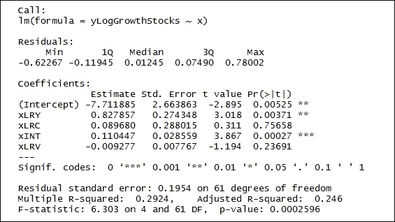

### 步骤 4 - 准备马尔可夫切换模型

马尔可夫切换模型涉及多个方程，可以表征不同制度下的时间序列行为。模型通过在结构之间切换来捕捉复杂的动态模式。状态变量的当前值取决于即时过去值，该值由马尔可夫性质控制。

为股票价值创建马尔可夫切换模型。`msmFit()` 函数使用 EM 算法实现马尔可夫切换模型，如下所示。`olsLogValueStocks` 是 `lm` 类型的对象。`k = 2` 代表估计的状态数量。结果存储在 `MarkovSwtchLogValueStocks` 数据框中：

```py
> MarkovSwtchLogValueStocks <- msmFit(olsLogValueStocks, k = 2, sw = rep(TRUE, 6))

```

按如下方式打印 `MarkovSwtchLogValueStocks` 数据框的摘要。将 `MarkovSwtchLogValueStocks` 数据框作为 R 对象传递给 `summary()` 函数：

```py
> summary(MarkovSwtchLogValueStocks)

```

结果如下：

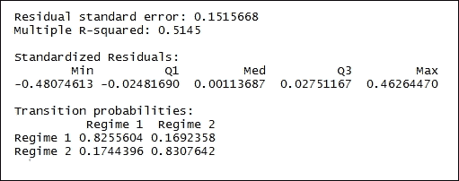

创建增长股票的马尔可夫切换模型。`msmFit()` 函数使用 EM 算法实现马尔可夫切换模型。`olsLogGrowthStocks` 是 `lm` 类型的对象。`k = 2` 代表估计的状态数量。结果存储在 `MarkoSwtchLogGrowthStocks` 数据框中：

```py
> MarkoSwtchLogGrowthStocks<- msmFit(olsLogGrowthStocks, k = 2, sw = rep(TRUE, 6))

```

打印 `MarkoSwtchLogGrowthStocks` 数据框的摘要。将 `MarkoSwtchLogGrowthStocks` 数据框作为 R 对象传递给 `summary()` 函数：

```py
> summary(MarkoSwtchLogGrowthStocks)

```

结果如下：

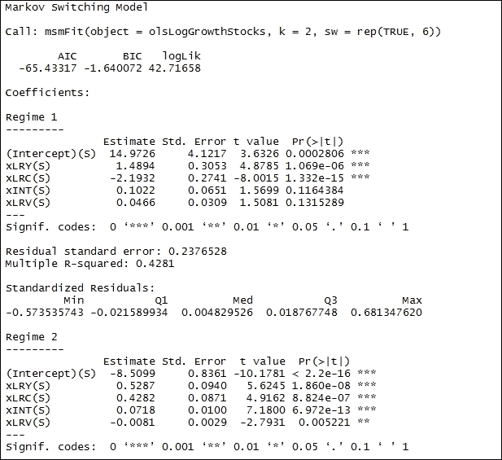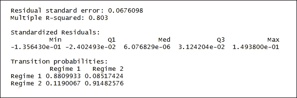

### 步骤 5 - 绘制状态概率图

接下来，我们将绘制已计算出的状态概率图。

绘制股票价值的状态概率图。使用 `par()` 函数查询图形参数如下：

```py
> par(mar=c(3,3,3,3))

```

`plotProb()` 函数为每个状态创建每个图。该图包含平滑和过滤后的概率。`MarkovSwtchLogValueStocks` 作为 `MSM.lm` 类型的对象传递。`which = 1` 的值代表所需的图集子集。使用以下命令：

```py
> plotProb(MarkovSwtchLogValueStocks, which=1)

```

结果如下：

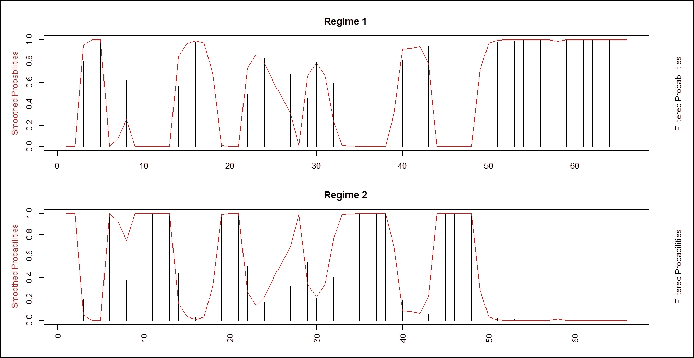

`plotProb()` 函数为每个状态创建每个图。该图包含平滑和过滤后的概率。`MarkovSwtchLogValueStocks` 作为 `MSM.lm` 类型的对象传递。`which = 2` 的值代表响应变量与平滑概率的图。使用以下命令：

```py
> plotProb(MarkovSwtchLogValueStocks, which=2)

```

结果如下：

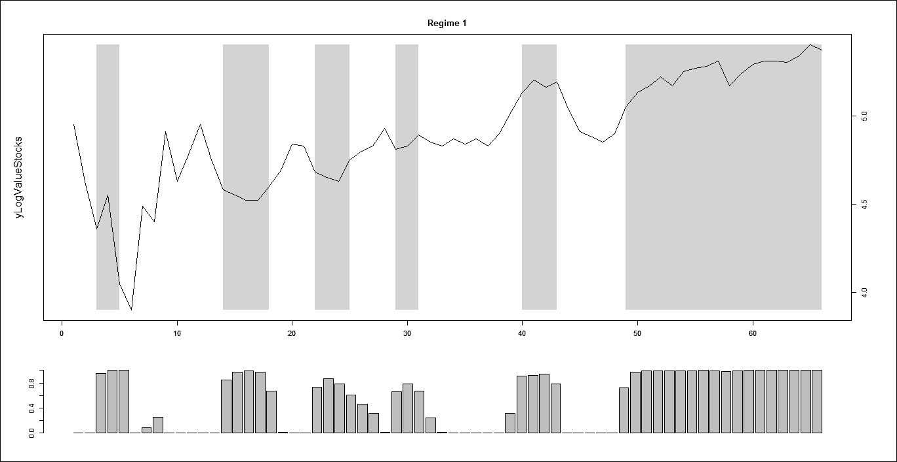

`plotProb()` 函数为每个状态创建每个图。`MarkoSwtchLogGrowthStocks` 作为 `MSM.lm` 类型的对象传递。`which = 1` 的值代表所需的图集子集：

```py
> plotProb(MarkoSwtchLogGrowthStocks, which=1)

```

结果如下：

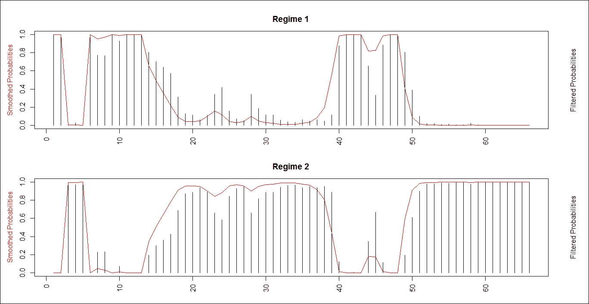

`plotProb()` 函数为每个状态创建每个图。`MarkoSwtchLogGrowthStocks` 作为 `MSM.lm` 类型的对象传递。`which = 2` 的值代表响应变量与平滑概率的图。使用以下命令：

```py
> plotProb(MarkoSwtchLogGrowthStocks, which=2)

```

结果如下：

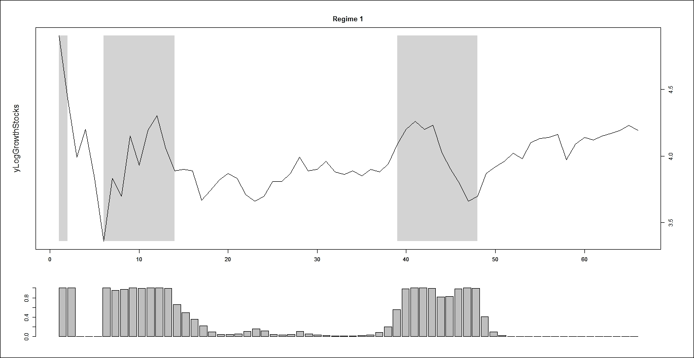

### 第 6 步 - 测试马尔可夫切换模型

接下来，我们将对马尔可夫切换模型运行一系列诊断测试。

绘制股票价值的制度概率图。使用 `par()` 函数查询图形参数：

```py
> par(mar=c(3,3,3,3))

```

创建残差分析的绘图。`plotDiag()` 函数将残差与拟合值进行绘图。`MarkovSwtchLogValueStocks` 作为 `MSM.lm` 类型的对象传递。`which = 1` 的值表示所需的绘图子集。`which=1` 的值表示残差与拟合值的绘图：

```py
> plotDiag(MarkovSwtchLogValueStocks, regime=1, which=1)

```

结果如下：

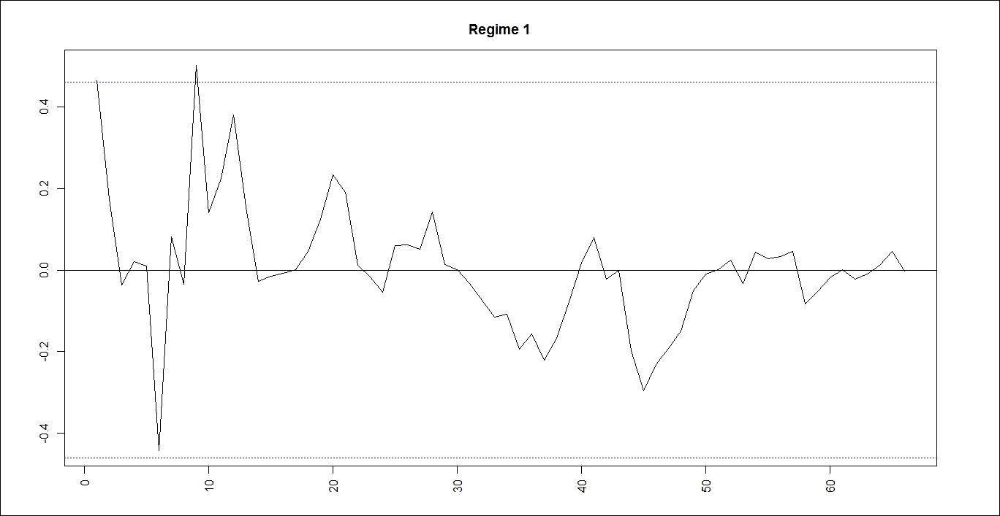

`plotDiag()` 函数将残差与拟合值进行绘图。`MarkovSwtchLogValueStocks` 作为 `MSM.lm` 类型的对象传递。`which = 2` 表示所需的绘图子集。`which=2` 表示正态 Q-Q 图：

```py
> plotDiag(MarkovSwtchLogValueStocks, regime=1, which=2)

```

结果如下：

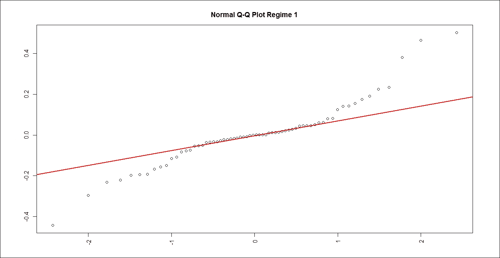

`plotDiag()` 函数将残差与拟合值进行绘图。`MarkoSwtchLogGrowthStocks` 作为 `MSM.lm` 类型的对象传递。`which = 3` 表示所需的绘图子集。`which=3` 表示残差和平方残差的 ACF/PACF：

```py
> plotDiag(MarkoSwtchLogGrowthStocks, regime=1, which=3)

```

结果如下：

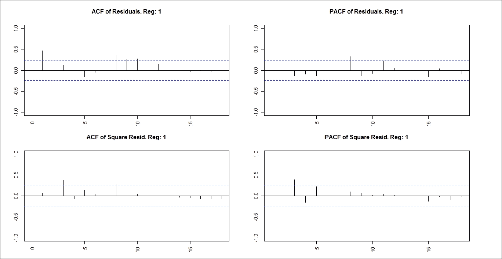

`plotDiag()` 函数将残差与拟合值进行绘图。`MarkoSwtchLogGrowthStocks` 作为 `MSM.lm` 类型的对象传递。`which = 1` 表示所需的绘图子集。`which = 1` 表示残差与拟合值的绘图：

```py
> plotDiag(MarkoSwtchLogGrowthStocks, regime=1, which=1)

```

结果如下：

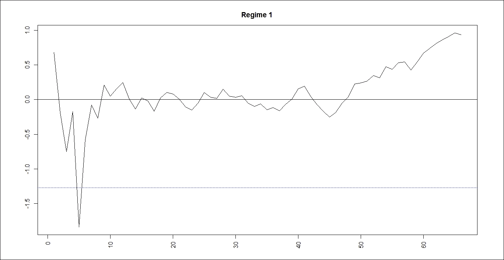

`plotDiag()` 函数将残差与拟合值进行绘图。`MarkoSwtchLogGrowthStocks` 作为 `MSM.lm` 类型的对象传递。`which = 2` 表示所需的绘图子集。`which=2` 表示正态 Q-Q 图：

```py
> plotDiag(MarkoSwtchLogGrowthStocks, regime=1, which=2)

```

结果如下：

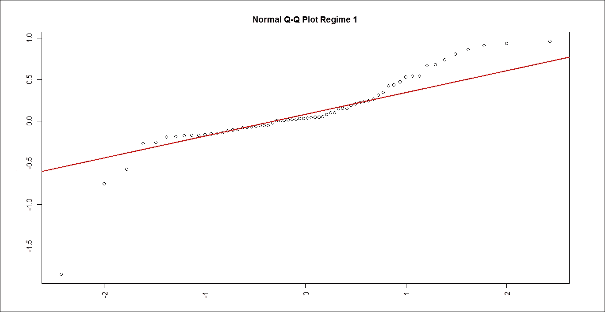

`plotDiag()` 函数将残差与拟合值进行绘图。`MarkoSwtchLogGrowthStocks` 作为 `MSM.lm` 类型的对象传递。`which = 3` 表示所需的绘图子集。`which=3` 表示残差和平方残差的 ACF/PACF：

```py
> plotDiag(MarkoSwtchLogGrowthStocks, regime=1, which=3)

```

结果如下：

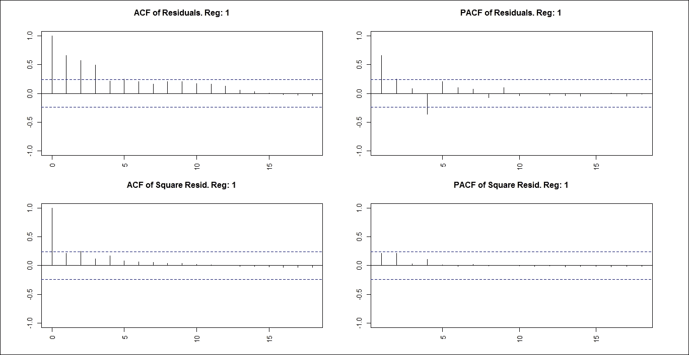

# 马尔可夫链 - 多渠道归因模型

在电子商务网站上，顾客的购物之旅会经历不同的渠道路径，在购买之前。多渠道归因会给旅程中的每一步分配一个价值。问题是人们在你网站上采取哪些行动可以识别导致转化的价值。通常，企业使用“最后点击”归因，这意味着将所有转化价值分配给旅程中的最后一步或“首次点击”归因。发展多渠道归因分析的第一步是理解顾客的旅程——从意识通过购买到购买后的支持。最终目标是培养忠诚的顾客，他们在购买上花费大量金钱，向他人推荐品牌，并可能成为品牌。

## 准备工作

为了执行马尔可夫链多渠道归因模型，我们将模拟包含三个独特渠道的顾客旅程。

## 如何操作...

让我们深入了解细节。

### 步骤 1 - 准备数据集

首先加载以下包：

```py
    > install.packages("dplyr")
    > install.packages("reshape2")
    > install.packages("ggplot2")
    > install.packages("ChannelAttribution")
    > install.packages("markovchain")
    > library(dplyr)
    > library(reshape2)
    > library(ggplot2)
    > library(ChannelAttribution)
    > library(markovchain)

```

### 注意

版本信息：本页面的代码在 R 版本 3.2.2（2015-08-14）中进行了测试。

创建数据样本：`c()`函数将参数组合起来形成一个向量。传递给函数的所有参数都会组合成一个共同类型，即返回值的类型。`data.frame()`函数创建了一个紧密耦合的数据框，它是具有许多矩阵和列表属性变量的集合。我们将以下方式将数据保存到`datafrm1`数据框中：

```py
> datafrm1 <- data.frame(path = c('c1 > c2 > c3', 'c1', 'c2 > c3'), conv = c(1, 0, 0), conv_null = c(0, 1, 1))

```

按以下方式打印`datafrm1`数据框：

```py
> datafrm1

```

结果如下：


### 步骤 2 - 准备模型

准备马尔可夫模型。`markov_model()`函数从顾客旅程数据中估计 k 阶马尔可夫模型。`datafrm1`是包含定义好的顾客旅程的数据框。`var_path`变量包含包含旅程路径的列名。`var_conv`变量代表包含总转化的列名。`var_null`变量代表包含不导致转化的总路径的列。`out_more = TRUE`返回渠道之间的转移概率和消除效应。

估计的 k 阶马尔可夫模型的结果存储在以下`model1`数据框中：

```py
> model1 <- markov_model(datafrm1, var_path = 'path', var_conv = 'conv', var_null = 'conv_null', out_more = TRUE)

```

打印`model1`数据框：

```py
> model1

```

结果如下：

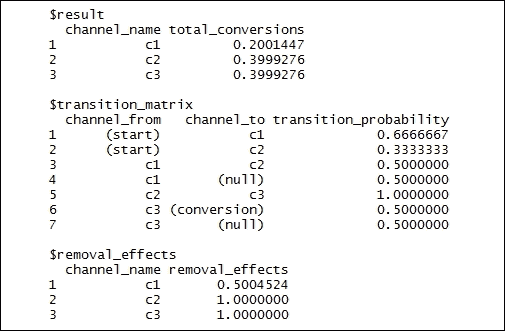

按以下方式从`model1data`数据框中提取结果归因。结果随后存储在`datafrmresult1`数据框中：

```py
> datafr{BS}l1$result

```

按以下方式从`model1data`数据框中提取`transition_matrix`归因。结果随后存储在`datafrmtransmatrix1`数据框中：

```py
> datafrmtransmatrix1 <- model1$transition_matrix

```

重新塑形数据框。重塑后的数据框结果存储在`datafrmtransmatrix`：

```py
> datafrmtransmatrix <- dcast(datafrmtransmatrix1, channel_from ~ channel_to, value.var = 'transition_probability')

```

打印`datafrmtransmatrix`数据框：

```py
> datafrmtransmatrix

```

结果如下：

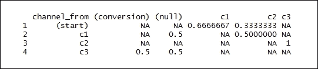

### 步骤 3 - 绘制马尔可夫图

从 `model1` 数据框中提取 `transition_matrix` 属性。结果随后存储在 `datafrmtransmatrix` 数据框中：

```py
> datafrmtransmatrix <- model1$transition_matrix

```

按如下方式打印 `datafrmtransmatrix` 数据框：

```py
> datafrmtransmatrix

```

结果如下：

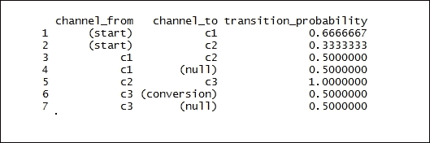

创建 `datafrmdummy` 数据样本。`c()` 函数将参数组合成向量。传递给函数的所有参数组合成一个返回值的公共类型。`data.frame()` 函数创建一个紧密耦合的数据框，它是具有矩阵和列表许多属性的变量的集合。我们将如下将数据保存到 `datafrmdummy` 数据框中：

```py
> datafrmdummy <- data.frame(channel_from = c('(start)', '(conversion)', '(null)'), channel_to = c('(start)', '(conversion)', '(null)'), transition_probability = c(0, 1, 1))

```

打印 `datafrmtransmatrix` 数据框：

```py
> datafrmtransmatrix

```

结果如下：

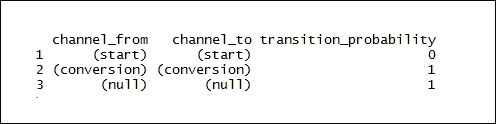

按如下方式合并列*.* `rbind()` 函数接受一系列数据框并将它们合并。`datafrmtransmatrix` 和 `df_dummy` 作为输入参数传递。结果是 `datafrmtransmatrix` 数据框：

```py
> datafrmtransmatrix <- rbind(datafrmtransmatrix, datafrmdummy)

```

打印 `datafrmtransmatrix` 数据框：

```py
> datafrmtransmatrix

```

结果如下：

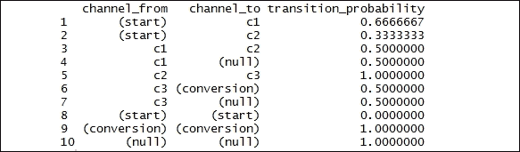

按以下顺序排列通道。`factor()` 函数用作将向量编码为因子的函数。`datafrmtransmatrix$channel_from` 作为数据向量传递。`levels = c('(start)', '(conversion)', '(null)', 'c1', 'c2', 'c3')` 表示一个可选的值向量：

```py
> datafrmtransmatrix$channel_from <- factor(datafrmtransmatrix$channel_from, levels = c('(start)', '(conversion)', '(null)', 'c1', 'c2', 'c3'))

```

按如下方式打印 `datafrmtransmatrix$channel_from` 数据框：

```py
> datafrmtransmatrix$channel_from

```

结果如下：

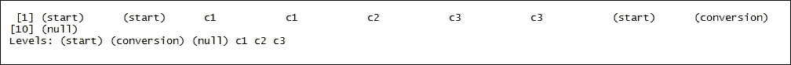

按以下顺序排列通道。`datafrmtransmatrix$channel_to` 作为数据向量传递：

```py
> datafrmtransmatrix$channel_to <- factor(datafrmtransmatrix$channel_to, levels = c('(start)', '(conversion)', '(null)', 'c1', 'c2', 'c3'))

```

打印 `datafrmtransmatrix$channel_to` 数据框：

```py
> datafrmtransmatrix$channel_to

```

结果如下：

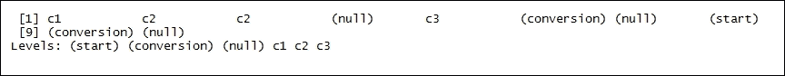

重新塑形数据框。重塑数据框的结果存储在 `datafrmtransmatrix` 中：

```py
> datafrmtransmatrix <- dcast(datafrmtransmatrix, channel_from ~ channel_to, value.var = 'transition_probability')

```

打印 `datafrmtransmatrix` 数据框：

```py
> datafrmtransmatrix

```

结果如下：

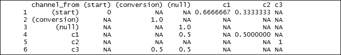

创建马尔可夫链对象。`matrix()` 函数从给定的一组值创建矩阵：

```py
> transitionmatrix <- matrix(data = as.matrix(datafrmtransmatrix[, -1]), nrow = nrow(datafrmtransmatrix[, -1]), ncol = ncol(datafrmtransmatrix[, -1]), dimnames = list
(c(as.character(datafrmtransmatrix[, 1])), c(colnames(datafrmtransmatrix[, -1]))))

```

打印 `transitionmatrix` 数据框：

```py
> transitionmatrix

```

结果如下：

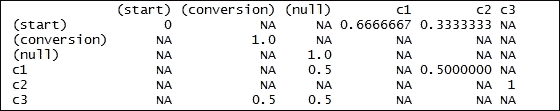

```py
> transitionmatrix[is.na(transitionmatrix)] <- 0

```

创建马尔可夫链对象。`transitionMatrix` 将是一个转换矩阵，即所有条目都是概率，并且所有行或所有列的总和都等于一：

```py
> transitionmatrix1 <- new("markovchain", transitionMatrix = transitionmatrix)

```

打印 `transitionmatrix1` 数据框：

```py
> transitionmatrix1

```

结果如下：

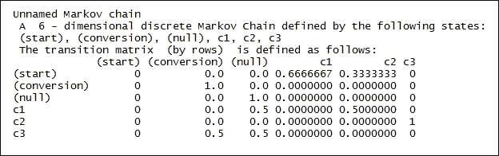

绘制图形：

```py
> plot(transitionmatrix1, edge.arrow.size = 0.5, main = "Markov Graph Transition Matrix - transitionmatrix1")

```

结果如下：

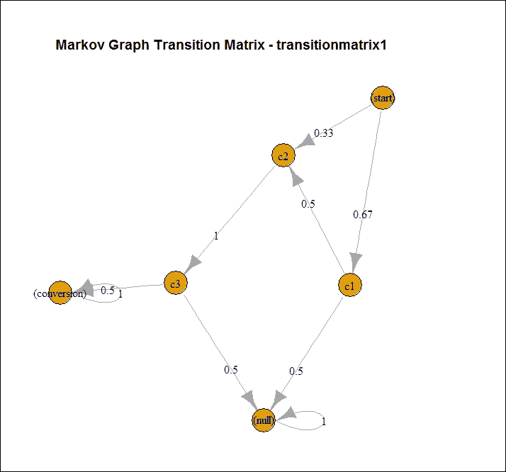

### 步骤 4 - 模拟客户旅程数据集

`data.frame()` 函数创建了一个紧密耦合的数据框，它是具有许多矩阵和列表属性集合的变量。我们将如下将数据保存到 `datafrm2` 数据框中：

```py
    > set.seed(354)
    > datafrm2 <- data.frame(client_id = sample(c(1:1000), 5000, replace = TRUE), date = sample(c(1:32), 5000, replace = TRUE), channel = sample(c(0:9), 5000, replace = TRUE, prob = c(0.1, 0.15, 0.05, 0.07, 0.11, 0.07, 0.13, 0.1, 0.06, 0.16)))

```

打印 `datafrm2` 数据框。`head()` 函数返回 `datafrm2` 数据框的前部分。将 `datafrm2` 数据框作为输入参数传递：

```py
> head(datafrm2)

```

结果如下：

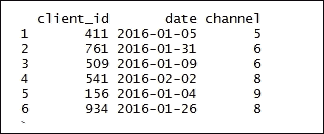

将字符对象转换为日期对象。`datafrm2$date` 表示要转换的对象。`origin = "2016-01-01"` 表示 `Date` 对象：

```py
> datafrm2$date <- as.Date(datafrm2$date, origin = "2016-01-01")

```

在转换为字符后连接向量。将 `channel_` 对象添加到渠道中。`datafrm2$channel` 表示数据框：

```py
> datafrm2$channel <- paste0('channel_', datafrm2$channel)

```

打印 `datafrm2` 数据框。`head()` 函数返回 `datafrm2` 数据框的前部分。将 `datafrm2` 数据框作为输入参数传递：

```py
> head(datafrm2)

```

结果如下：

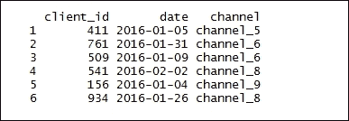

将渠道聚合到每个客户的路径中：

```py
> datafrm2 <- datafrm2 %>% group_by(client_id) %>% summarise(path = paste(channel, collapse = ' > '), conv = 1, conv_null = 0) %>% ungroup()

```

打印 `datafrm2` 数据框：

```py
> datafrm2

```

结果如下：

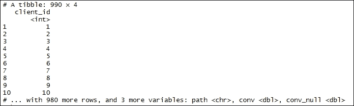

准备马尔可夫模型。`markov_model()` 函数从客户旅程数据中估计 k 阶马尔可夫模型。`datafrm2` 是包含客户旅程数据的数据框。`var_path` 包含包含旅程路径的列名。`var_conv` 表示包含总转换的列名。`var_null` 表示包含总路径但不导致转换的列。`out_more = TRUE` 返回渠道之间的转换概率和移除效果。

估计的 k 阶马尔可夫模型的结果存储在 `model2` 数据框中，如下所示：

```py
> model2 <- markov_model(datafrm2, var_path = 'path', var_conv = 'conv', var_null = 'conv_null', out_more = TRUE)

```

```py
> datafrmheuristic <- datafrm2 %>% mutate(channel_name_ft = sub('>.*', '', path), channel_name_ft = sub(' ', '', channel_name_ft), channel_name_lt = sub('.*>', '', path), channel_name_lt = sub(' ', '', channel_name_lt))

```

打印 `datafrmheuristic` 数据框：

```py
> datafrmheuristic

```

结果如下：

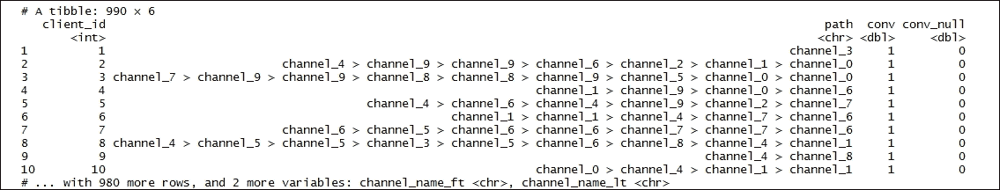

```py
> datafrmfirsttouch <- datafrmheuristic %>% group_by(channel_name_ft) %>% summarise(first_touch_conversions = sum(conv)) %>% ungroup()

```

打印 `datafrmfirsttouch` 数据框：

```py
> datafrmfirsttouch

```

结果如下：

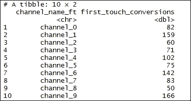

```py
> datafrmlasttouch <- datafrmheuristic %>% group_by(channel_name_lt) %>% summarise(last_touch_conversions = sum(conv)) %>% ungroup()

```

打印 `datafrmfirsttouch` 数据框：

```py
> datafrmfirsttouch

```

结果如下：

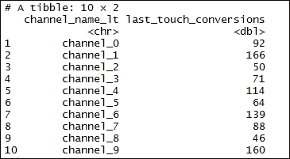

通过公共列合并两个数据框。结果存储在 `heuristicmodel2` 数据框中：

```py
> heuristicmodel2 <- merge(datafrmfirsttouch, datafrmlasttouch, by.x = 'channel_name_ft', by.y = 'channel_name_lt')

```

打印 `heuristicmodel2` 数据框：

```py
> heuristicmodel2

```

结果如下：

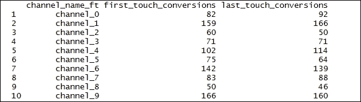

合并所有模型：

```py
> allmodels <- merge(heuristicmodel2, model2$result, by.x = 'channel_name_ft', by.y = 'channel_name')

```

打印 `allmodels` 数据框：

```py
> allmodels

```

结果如下：

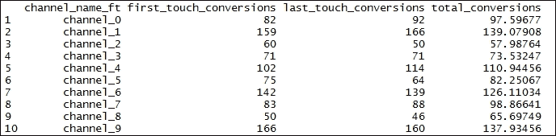

### 步骤 5 - 准备真实数据的转换矩阵热图

绘制热图。

```py
    > colnames(allmodels)[c(1, 4)] <- c('channel_name', 'attrib_model_conversions')
    > datafrmplottransition <- model2$transition_matrix
    > cols <- c("#e7f0fa", "#c9e2f6", "#95cbee", "#0099dc", "#4ab04a", "#ffd73e", "#eec73a", "#e29421", "#e29421", "#f05336", "#ce472e")

```

从 `datafrmplottransition$transition_probability` 数据框中返回所有参数的最大值：

```py
> t <- max(datafrmplottransition$transition_probability)

```

打印 `t` 的值：

```py
> t

```

结果如下：

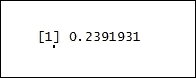

```py
> ggplot(datafrmplottransition, aes(y = channel_from, x = channel_to, fill = transition_probability)) + theme_minimal() + geom_tile(colour = "white", width = .9, height = .9) + scale_fill_gradientn(colours = cols, limits = c(0, t), breaks = seq(0, t, by = t/4), labels = c("0", round(t/4*1, 2), round(t/4*2, 2), round(t/4*3, 2), round(t/4*4, 2)), guide = guide_colourbar(ticks = T, nbin = 50, barheight = .5, label = T, barwidth = 10)) + geom_text(aes(label = round(transition_probability, 2)), fontface = "bold", size = 4) + theme(legend.position = 'bottom', legend.direction = "horizontal", panel.grid.major = element_blank(), panel.grid.minor = element_blank(), plot.title = element_text(size = 20, face = "bold", vjust = 2, color = 'black', lineheight = 0.8), axis.title.x = element_text(size = 24, face = "bold"), axis.title.y = element_text(size = 24, face = "bold"), axis.text.y = element_text(size = 8, face = "bold", color = 'black'), axis.text.x = element_text(size = 8, angle = 90, hjust = 0.5, vjust = 0.5, face = "plain")) + ggtitle("Heatmap - Transition Matrix ")

```

结果如下：

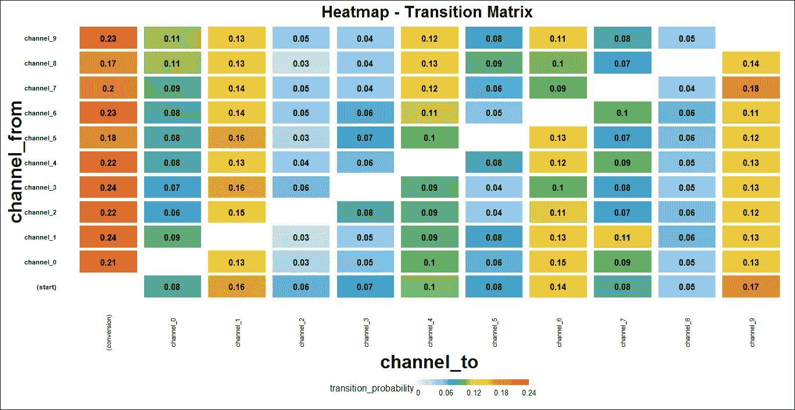

# 马尔可夫链 - 汽车租赁机构服务

假设一家汽车租赁机构在渥太华有三个位置：一个市中心位置（标记为 A），一个东部端位置（标记为 B），以及一个西部端位置（标记为 C）。该机构有一组送货司机为所有三个位置提供服务。该机构的统计学家已经确定了以下情况：

+   在对“市中心”位置的呼叫中，30%的呼叫被投递到市中心区域，30%的呼叫被投递到“东部”端，40%的呼叫被投递到“西部”端

+   在对“东部”端位置的呼叫中，40%的呼叫被投递到市中心区域，40%的呼叫被投递到“东部”端，20%的呼叫被投递到“西部”端

+   在对“西部”端位置的呼叫中，50%的呼叫被投递到市中心区域，30%的呼叫被投递到“东部”端，20%的呼叫被投递到“西部”端

在完成一次送货后，司机前往最近的地点进行下一次送货。这样，特定司机的位置仅由其先前位置决定。

## 如何做到这一点...

让我们深入了解。

### 步骤 1 - 准备数据集

加载以下包：

```py
    > install.packages("markovchain")
    > library(markovchain)

```

### 注意

版本信息：本页代码在 R 版本 3.2.2（2015-08-14）中进行了测试。

创建数据样本。`c()`函数将参数组合成一个向量。传递给函数的所有参数都被组合成一个返回值的共同类型。我们将数据保存到`RentalStates`数据框中：

```py
> RentalStates <- c("Downtown", "East", "West")

```

打印`RentalStates`的值：

```py
> RentalStates

```

结果如下：

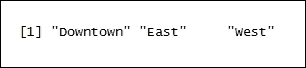

创建矩阵。`matrix()`函数从给定的值集合创建矩阵。`byrow = T`矩阵按行填充。`nrow = 3`代表所需的行数。`c()`函数将参数组合成一个向量。传递给函数的所有参数都被组合成一个返回值的共同类型：

```py
> RentalTransitionMatrix <- matrix(c(0.3, 0.3, 0.4, 
 0.4, 0.4, 0.2, 
 0.5, 0.3, 0.2),
 byrow = T, nrow = 3, dimnames = list(RentalStates, RentalStates))

```

打印`RentalTransitionMatrix`的值：

```py
> RentalTransitionMatrix

```

结果如下：

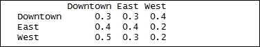

### 步骤 2 - 准备模型

创建马尔可夫链对象。`new()`函数创建`markovchain`类型的对象。状态表示之前定义的`RentalStates`。`byrow = T`矩阵按行填充。结果随后存储在数据框`mcRental`中：

```py
> mcRental <- new("markovchain", states = RentalStates, byrow = T, transitionMatrix = RentalTransitionMatrix, name = "Rental Cars")

```

打印`mcRental`数据框：

```py
> mcRental

```

结果如下：

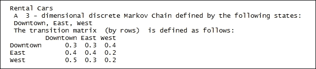

通过调用`mcRental`对象来访问转移矩阵如下：

```py
> mcRental[2]

```

结果如下：

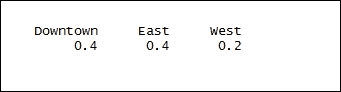

绘制`mcRental`对象。`plot()`是一个通用的绘图函数：

```py
> plot(mcRental)

```

结果如下：

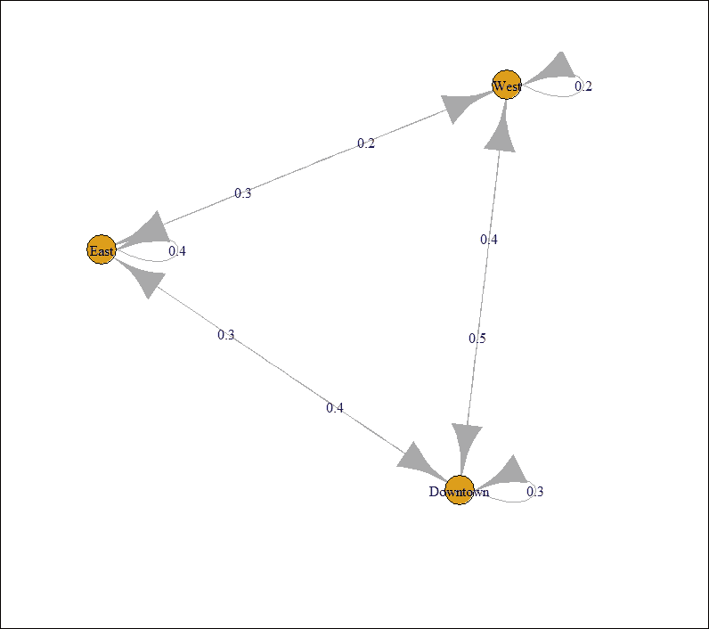

计算转移概率。`transitionProbability` `()` 提供了对转移概率的直接访问。

```py
> transitionProbability(mcRental, "East", "West")

```

结果如下：

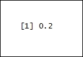

### 步骤 3 - 改进模型

计算两次行程中在市中心的可能性；市中心到市中心：

```py
> x <- 0.3 * 0.3

```

计算从东位置前往市中心的概率；东到市中心：

```py
> y <- 0.3 * 0.4

```

计算从西位置前往市中心的概率；西到市中心：

```py
    > z <- 0.4 * 0.5
    > x + y + z

```

结果如下：

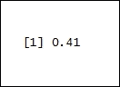

将 `mcRental` 矩阵平方以计算两次行程中到达市中心的概率：

```py
> mcRental ^ 2

```

结果如下：

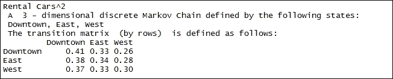

使用 `mcRental` 矩阵概率计算检查我们将在 20 次行程中到达市中心的概率如下：

```py
> mcRental ^ 20

```

结果如下：

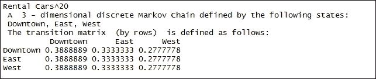

使用 `mcRental` 矩阵概率计算检查我们将在三次行程中到达市中心的概率如下：

```py
> mcRental ^ 30

```

结果如下：


此方法返回 markovchain 对象的矩阵形式的稳态向量：

```py
> 70 * steadyStates(mcRental)

```

结果如下：


打印 `mcRental` 的摘要：

```py
> summary(mcRental)

```

结果如下：


提取给定当前状态的后续状态的条件分布。`mcRental` 是传递的 markov chain 对象，而 `"Downtown"` 是下一个状态：

```py
> conditionalDistribution(mcRental, "Downtown")

```

结果如下：


```py
> conditionalDistribution(mcRental, "West")

```

结果如下：


```py
> conditionalDistribution(mcRental, "East")

```

结果如下：


# 连续马尔可夫链 - 加油站车辆服务

一个加油站只有一个加油机。没有空间供车辆等待。如果一辆车到达加油机，且没有地方加油，那么车辆将离开加油机而不加油。车辆以每分钟 3/20 辆车的速率按照泊松过程到达加油站。到达加油机的车辆中，75% 是汽车，25% 是摩托车。加油时间可以用平均为八分钟的指数随机变量来建模，对于摩托车则是三分钟。

## 准备中

为了对加油站车辆服务进行连续马尔可夫链模拟，我们需要模拟数据。

## 如何操作...

让我们深入了解。

### 步骤 1 - 准备数据集

加载以下包：

```py
    > install.packages("simmer")
    > install.packages("ggplot2")
    > library(simmer)
    > library(ggplot2)

```

### 注意

版本信息：本页面的代码在 R 版本 3.2.2（2015-08-14）下进行了测试

初始化车辆到达速率：

```py
> ArrivalRate <- 3/20

```

打印 `ArrivalRate` 数据框：

```py
> ArrivalRate

```

结果如下：


初始化车辆的服务速率并创建数据样本。`c()` 函数将参数组合成一个向量。传递给函数的所有参数组合形成一个返回值的共同类型。我们将数据保存到 `ServiceRate` 数据框中：

```py
> ServiceRate <- c(1/8, 1/3)

```

打印 `ServiceRate` 数据框：

```py
> ServiceRate

```

结果如下：


初始化汽车到达的概率：

```py
> p <- 0.75

```

创建转移矩阵。`matrix()` 函数从给定的一组值创建矩阵。结果存储在 `TransitionMatrix` 数据框中：

```py
> TransitionMatrix <- matrix(c(1,   ServiceRate[1],     0,
 1,   -ArrivalRate,       (1-p)*ArrivalRate,
 1,   ServiceRate[2],     -ServiceRate[2]), byrow=T, ncol=3)

```

打印 `TransitionMatrix` 数据框：

```py
> TransitionMatrix

```

结果如下：


初始化向量：

```py
> B <- c(1, 0, 0)

```

### 步骤 2 - 计算理论分辨率

解线性方程组。`solve()` 用于计算线性方程。`t(A)` 表示转移矩阵，而 `B` 是向量。结果随后存储在 `P` 中：

```py
> P <- solve(t(A), B)

```

打印 `P` 数据框：

```py
> P

```

结果如下：


计算理论分辨率。`sum()` 计算总和。结果随后存储在 `Resolution` 中：

```py
> Resolution <- sum(P * c(1, 0, 1)) 

```

打印 `Resolution` 数据框：

```py
> Resolution

```

结果如下：


### 步骤 3 - 验证理论解的收敛性

模拟系统并验证其收敛到理论解：

```py
> set.seed(1234)

```

定义 `option.1` 函数。一个 `create_trajectory()` 函数创建汽车和摩托车类型的轨迹对象。这些对象构成一个要附加到生成器对象的活动链。通过名称捕获泵对象的活动被执行。`amount=1` 表示需要捕获的对象数量。`timeout()` 函数根据用户定义插入延迟。`timeout()` 函数还接受 `rexp()` 函数，该函数随机生成指数分布，其速率定义为 `ServiceRate[1] = 1/8` 用于 `car` 对象，以及 `ServiceRate[1] = 1/3` 用于 `motorcycle` 对象。

然后创建如下模拟对象。该方法初始化模拟环境。使用指数分布创建 `car` 和 `motorcycle` 对象，其速率定义为 `p*ArrivalRate`，其中 `ArrivalRate = 0.15`。然后在模拟环境中创建一个新的到达生成器：

```py
> option.1 <- function(t) {
 car <- create_trajectory() %>%
 seize("pump", amount=1) %>%
 timeout(function() rexp(1, ServiceRate[1])) %>%
 release("pump", amount=1)

```

```py
 motorcycle <- create_trajectory() %>%
 seize("pump", amount=1) %>%
 timeout(function() rexp(1, ServiceRate[2])) %>%
 release("pump", amount=1)

```

```py
 simmer() %>%
 add_resource("pump", capacity=1, queue_size=0) %>%
 add_generator("car", car, function() rexp(1, p*ArrivalRate)) %>%
 add_generator("motorcycle", motorcycle, function() rexp(1, (1-p)*ArrivalRate)) %>%
 run(until=t)
 }

```

定义 `option.2` 函数。为所有类型的车辆定义一个生成器和一个轨迹。为了区分汽车和摩托车，在捕获资源后定义一个分支以选择适当的服务时间。

`create_trajectory()`函数创建了`vehicle`类型的轨迹对象。此对象包含一系列要附加到生成器对象的活动。执行按名称捕获泵对象的活动。`amount=1`表示需要捕获的对象数量。然后`create_trajectory()`函数调用`timeout()`函数，该函数根据用户定义插入延迟。`timeout()`函数还接受`rexp()`函数，该函数随机生成指数分布，其速率定义为汽车对象的`ServiceRate[1] = 1/8`和摩托车对象的`ServiceRate[1] = 1/3`。

然后按照以下方式创建一个模拟对象。该方法初始化一个模拟环境。使用指数分布创建了`car`和`motorcycle`对象，其速率定义为`p*ArrivalRate. ArrivalRate = 0.15`。然后`run()`函数继续运行，直到用户定义的超时时间，如`until=t`所述：

```py
> option.2 <- function(t) {
 vehicle <- create_trajectory() %>%
 seize("pump", amount=1) %>%
 branch(function() sample(c(1, 2), 1, prob=c(p, 1-p)), merge=c(T, T),
 create_trajectory("car") %>%
 timeout(function() rexp(1, ServiceRate[1])),
 create_trajectory("motorcycle") %>%
 timeout(function() rexp(1, ServiceRate[2]))) %>%
 release("pump", amount=1)
 simmer() %>%
 add_resource("pump", capacity=1, queue_size=0) %>%
 add_generator("vehicle", vehicle, function() rexp(1, ArrivalRate)) %>%
 run(until=t)
 }

```

定义`option.3`函数。`option.2`添加了不必要的开销。额外调用以选择分支，因此性能降低。直接在`timeout()`函数内选择服务时间：

```py
    > option.3 <- function(t) {
       vehicle <- create_trajectory() %>%
       seize("pump", amount=1) %>%
       timeout(function() {
if (runif(1) < p) rexp(1, ServiceRate[1]) 
else rexp(1, ServiceRate[2]) 
       }) %>%
    release("pump", amount=1)
    simmer() %>%
    add_resource("pump", capacity=1, queue_size=0) %>%
    add_generator("vehicle", vehicle, function() rexp(1, ArrivalRate)) %>%
    run(until=t)
    }

```

按照以下方式调用创建的选项：

```py
> gas.station <- option.3(5000)

```

### 步骤 4 - 绘制结果

绘制结果。使用`plot_resource_usage()`绘制资源在模拟时间框架内的使用情况。`gas.station`代表单个模拟环境。"pump"代表资源的名称。"items="system"`指的是要绘制的资源组件。结果随后存储在`ggplot2`类型图形的对象中：

```py
    > graph <- plot_resource_usage(gas.station, "pump", items="system")
    > graph + geom_hline(yintercept = Resolution)

```

结果如下：


# 蒙特卡洛模拟 - 校准的 Hull 和 White 短期利率

蒙特卡洛模拟是对系统行为的随机模拟。模拟使用采样实验在模型上执行，然后使用计算机进行数值实验，以获得对系统行为的统计理解。

## 准备工作

为了对校准的船体和白短期利率进行蒙特卡洛模拟，从与`QuantLib` 0.3.10 一起发布的示例代码中获取数据，使用市场数据构建利率期限结构和期权波动率矩阵，并对应于到期日和期限。

### 步骤 1 - 安装包和库

加载以下包：

```py
    >install.packages("RQuantLib", type="binary")
    >install.packages("ESGtoolkit")
    >library(RQuantLib)
    >library(ESGtoolkit)

```

### 注意

版本信息：本页面的代码在 R 版本 3.2.2（2015-08-14）中进行了测试

为了使`Quantlib`包的部分内容对 R 环境`RQuantLib`可用，使用了`RQuantLib`。`Quantlib`包提供了一个用于定量金融的全面软件框架。`RQuantLib`的目标是提供用于建模、交易、来源的源库，无论是本地还是远程来源。GSPC 是资产。

`type="binary"` 表示要下载和安装的包的类型。这意味着要安装的包的性质不是源包。

## 如何做到这一点...

让我们深入了解。

### 第 2 步 - 初始化数据和变量

初始化变量：

```py
    > freq <- "monthly"
    > delta_t <- 1/12

```

打印 `delta_t` 的值：

```py
> delta_t

```

结果如下：


从与 `QuantLib` 0.3.10 集成的示例代码中初始化变量。一个指定 `tradeDate`（月/日/年）、`settleDate`、远期利率时间跨度 `dt` 以及两个曲线构建选项：`interpWhat`（可能的值为贴现、远期和零）和 `interpHow`（可能的值为线性、对数线性和平滑）。这里的平滑意味着对 `interpWhat` 值进行三次样条插值。

然后将结果存储在 `params` 数据框中：

```py
> params <- list(tradeDate=as.Date('2002-2-15'),
 settleDate=as.Date('2002-2-19'),
 payFixed=TRUE,
 dt=delta_t,
 strike=.06,
 method="HWAnalytic",
 interpWhat="zero",
 interpHow= "spline")

```

初始化市场数据。为利率、存款和掉期构建了期限结构。然后将结果存储在 `TermQuotes` 中：

```py
> TermQuotes  <- list(d1w =0.0382, # 1-week deposit rate
 d1m =0.0372,# 1-month deposit rate
 d3m = 0.0363,# 3-month deposit rate
 d6m = 0.0353,# 6-month deposit rate
 d9m = 0.0348,# 9-month deposit rate
 d1y = 0.0345,# 1-year deposit rate
 s2y = 0.037125,# 2-year swap rate
 s3y =0.0398,# 3-year swap rate
 s5y =0.0443,# 5-year swap rate
 s10y =0.05165,# 10-year swap rate
 s15y =0.055175)# 15-year swap rate

```

初始化 `Swaptionmaturities`：

```py
> SwaptionMaturities <- c(1,2,3,4,5)

```

打印 `SwaptionMaturities` 的值：

```py
> SwaptionMaturities

```

结果如下：


初始化掉期期限：

```py
> SwapTenors <- c(1,2,3,4,5)

```

打印 `SwapTenors` 的值：

```py
> SwapTenors

```

结果如下：


初始化波动率矩阵。`matrix()` 函数从给定的值集中创建矩阵。`ncol=5` 表示所需的列数。`byrow=TRUE` 表示矩阵按行填充。然后将结果存储在 `VolatilityMatrix` 中：

```py
> VolatilityMatrix <- matrix(
 c(0.1490, 0.1340, 0.1228, 0.1189, 0.1148,
 0.1290, 0.1201, 0.1146, 0.1108, 0.1040,
 0.1149, 0.1112, 0.1070, 0.1010, 0.0957,
 0.1047, 0.1021, 0.0980, 0.0951, 0.1270,
 0.1000, 0.0950, 0.0900, 0.1230, 0.1160),
 ncol=5, byrow=TRUE)

```

### 第 3 步 - 评估伯努利掉期期权

按以下方式评估伯努利掉期期权。`BermudanSwaption` 是 `Quantlib` 包的一部分。通过 `RQuantLib` 可在 R 环境中使用。`BermudanSwaption` 在将选定的短期利率模型校准到输入的掉期波动率矩阵后，评估具有指定行权和到期日（以年为单位）的伯努利掉期期权。掉期期权的到期日和掉期期限以年为单位。假设伯努利掉期期权在基础掉期的每个重置日均可行使。通过传递 `params`、`TermQuotes`、`SwaptionMaturities`、`SwapTenors` 和 `VolatilityMatrix` 作为输入来计算伯努利掉期期权。结果存储在 `BermudanSwaption` 中：

```py
> BermudanSwaption <- RQuantLib::BermudanSwaption(params, TermQuotes, SwaptionMaturities, SwapTenors, VolatilityMatrix)

```

显示 `BermudanSwaption` 的估值。结果如下：


打印 `BermudanSwaption` 的摘要：

```py
> summary(BermudanSwaption)

```

结果如下：


打印 `BermudanSwaption` 的估值：

```py
> BermudanSwaption

```

结果如下：


### 第 4 步 - 构建利率的现货期限结构

初始化返回贴现因子、远期利率和零利率的时间向量。时间指定为最大时间加上 `delta_t` 不超过用于校准的金融工具的最长期限（不进行外推）：

```py
> times <- seq(from = delta_t, to = 5, by = delta_t)

```

`DiscountCurve` 根据输入的市场数据构建利率的即期期限结构，包括结算日期、存款利率和掉期利率。它返回指定为输入的时间向量对应的贴现因子、零利率和远期利率。`params` 代表一个列表，指定了 `tradeDate`（月/日/年）、`settleDate`、远期利率时间跨度以及两个曲线构建选项：`interpWhat`（可能的值为贴现、远期和零）和 `interpHow`（可能的值为 `linear`、`loglinear` 和 `spline`）。这里的 `spline` 表示对 `interpWhat` 值的三次样条插值。`TermQuotes` 代表构建利率即期期限结构的市场报价。使用以下命令：

```py
> DiscountCurve <- RQuantLib::DiscountCurve(params, TermQuotes, times)

```

探索 `DiscountCurve` 数据框的内部结构。`str()` 函数显示数据框的内部结构。`DiscountCurve` 作为 R 对象传递给 `str()` 函数：

```py
> str(DiscountCurve)

```

结果如下：


寻找返回贴现因子、远期利率和零利率的到期时间：

```py
> maturities <- DiscountCurve$times

```

打印到期日的值：

```py
> maturities

```

结果如下：


寻找零息利率：

```py
> MarketZeroRates <- DiscountCurve$zerorates

```

打印零息利率的值：

```py
> MarketZeroRates

```

结果如下：


寻找贴现因子：

```py
> MarketPrices <- DiscountCurve$discounts

```

打印贴现因子：

```py
> MarketPrices

```

结果如下：


### 第 5 步 - 模拟 Hull-White 短期利率

设置时间范围：

```py
> horizon <- 5

```

设置模拟次数：

```py
    > NoSimulations <- 10000
    > a <- BermudanSwaption$a

```

打印 `a` 的值：

```py
> a

```


```py
> sigma <- BermudanSwaption$sigma

```

打印 `sigma` 的值：

```py
> sigma

```


模拟高斯冲击。`simshocks()` 创建与风险因子相关的或依赖的高斯冲击的模拟版本。`n = NoSimulations` 表示模拟次数。`horizon = 5` 表示时间范围。`frequency = monthly`。结果随后存储在 `GaussianShocks` 数据框中：

```py
> GaussianShocks <- ESGtoolkit::simshocks(n = NoSimulations, horizon = horizon, frequency = freq)

```

`simdiff()` 用于模拟扩散过程。`n = NoSimulations` 表示独立观察的数量。`frequency = freq` 表示每月。`model = "OU"` 代表奥恩斯坦-乌伦贝克方法。`x0 = 0` 是过程的起始值。`eps = GaussianShocks` 代表高斯冲击：

```py
> x <- ESGtoolkit::simdiff(n = NoSimulations, horizon = horizon, frequency = freq, model = "OU", x0 = 0, theta1 = 0, theta2 = a, theta3 = sigma, eps = GaussianShocks)

```

计算远期利率。`ts()` 创建时间序列对象。`replicate(nb.sims, DiscountCurve$forwards)` 创建时间序列值向量。`start = start(x)` 表示第一次观察的时间。`deltat = deltat(x)` 表示连续观察之间的采样周期分数。结果存储在 `ForwardRates` 数据框中：

```py
> ForwardRates <- ts(replicate(nb.sims, DiscountCurve$forwards), start = start(x), deltat = deltat(x))

```

生成常规序列。`from = 0`，`to = horizon` 表示序列的起始和结束值。`by = delta_t` 表示序列的增量：

```py
    > t.out <- seq(from = 0, to = horizon, by = delta_t)
    > param.alpha <- ts(replicate(NoSimulations, 0.5*(sigma²)*(1 - exp(-a*t.out))²/(a²)), start = start(x), deltat = deltat(x))
    > alpha <- ForwardRates + param.alpha

```

生成短期利率：

```py
> ShortRates <- x + alpha

```

计算随机贴现值：

```py
> StochasticDiscount <- ESGtoolkit::esgdiscountfactor(r = ShortRates, X = 1)

```

计算随机贴现值的平均值：

```py
> MonteCarloPrices <- rowMeans(StochasticDiscount)

```

打印 `MonteCarloPrices` 的值：

```py
> MonteCarloPrices

```

结果如下：


计算随机贴现值的零利率：

```py
> MonteCarloZeroRates <- -log(MonteCarloPrices)/maturities

```

打印 `MonteCarloZeroRates` 的值：

```py
> MonteCarloZeroRates

```

结果如下：


对随机贴现项与市场价格之间的差异进行学生 t 检验。`t.test(x)` 执行 t 检验。`conf.int` 表示均值适当的置信区间：

```py
> ConfidenceInterval <- t(apply((StochasticDiscount - MarketPrices)[-1, ], 1, function(x) t.test(x)$conf.int))

```

`head()` 函数返回 `ConfidenceInterval` 框架的第一部分。`ConfidenceInterval` 框架作为输入参数按如下方式传递：

```py
> head(ConfidenceInterval)

```


设置图形参数如下：

```py
> par(mfrow = c(2, 2))

```

`esgplotbands()` 按如下方式绘制颜色置信区间带。`ShortRates` 表示置信区间：

```py
> ESGtoolkit::esgplotbands(ShortRates, xlab = "maturities", ylab = "short-rate quantiles", main = "Short Rate Quantiles")

```


按如下方式绘制 **蒙特卡洛与市场 n 零利率** 对比图。到期日，`MonteCarloZeroRates` 表示时间序列：

```py
> plot(maturities, MonteCarloZeroRates, type='l', col = 'blue', lwd = 1, main = "Monte Carlo v/s Market n Zero Rates")

```


在到期日 `MonteCarloZeroRates` 之间的指定坐标处添加一系列点：

```py
> points(maturities, MonteCarloZeroRates, col = 'red')

```


按如下方式绘制蒙特卡洛与市场价格对比图。到期日，`MonteCarloPrices` 表示时间序列：

```py
> plot(maturities, MonteCarloPrices, type='l', col = 'blue', lwd = 1, main = "Monte Carlo v/s Market Prices")

```


在到期日 `MonteCarloPrices` 之间的指定坐标处添加一系列点：

```py
> points(maturities, MonteCarloPrices, col = 'red')

```


```py
> matplot(maturities[-1], conf.int, type = 'l', main = "Confidence Interval for the price difference")

```
