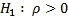

# 第十章 神经网络

在本章中，我们将介绍以下内容：

+   模拟标准普尔 500

+   测量失业率

# 简介

**神经网络**：神经网络是一个有序的三元组 ，其中  是神经元的集合， 是一个集合 ，其元素被称为神经元  和神经元  之间的连接。函数  定义了权重，其中  是神经元  和神经元  之间连接的权重。数据通过连接在神经元之间传输，连接权重可以是兴奋的或抑制的。

# 模拟标准普尔 500

根据市值，纽约证券交易所或纳斯达克综合指数上市的 500 家最大公司的股票市值是通过标准普尔 500 指数来衡量的。标准普尔提供了一种基于股票价格的市场和经济走势的快速观察。标准普尔 500 指数是金融媒体和专业人士最常用的衡量指标。标准普尔 500 指数是通过将所有标准普尔 500 股票的调整市值相加，然后除以标准普尔开发的指数除数来计算的。当出现股票分割、特殊股息或分拆等可能影响指数价值的情况时，除数会进行调整。除数确保这些非经济因素不会影响指数。

## 准备工作

为了使用神经网络来模拟标准普尔 500 指数，我们将使用从 `GSPC` 数据集收集的数据集。

### 第 1 步 - 收集和描述数据

要使用的数据集是 2009 年 1 月 1 日至 2014 年 1 月 1 日之间的 `GSPC` 每日收盘股票价值。这个数据集在 [`www.yahoo.com/`](https://www.yahoo.com/) 上免费提供，我们将从那里下载数据。

## 如何操作...

让我们深入了解细节。

### 第 2 步 - 探索数据

首先，需要加载以下包：

```py
 > install.packages("quantmod")
 > install.packages("neuralnet")
 > library(quantmod)
 > library(neuralnet)

```

让我们下载数据。我们将首先标记所需时间段的开始和结束日期。

`as.Date()` 函数用于将字符表示和 `Date` 类对象转换为日历日期。

数据集的开始日期存储在 `startDate` 中，它代表日历日期的字符向量表示。这种表示的格式是 YYYY-MM-DD：

```py
> startDate = as.Date("2009-01-01")

```

数据集的结束日期存储在 `endDate` 中，它代表日历日期的字符向量表示。这种表示的格式是 YYYY-MM-DD：

```py
> endDate = as.Date("2014-01-01")

```

使用`getSymbols()`函数加载数据：该函数从多个来源加载数据，无论是本地还是远程。`GSPC`是字符向量，指定要加载的符号名称。`src = yahoo`指定了数据来源方法：

```py
> getSymbols("^GSPC", src="img/yahoo", from=startDate, to=endDate)

```


### 步骤 3 - 计算指标

计算相对强弱指数：这是最近上升价格变动与绝对价格变动的比率。使用`RSI()`函数计算**相对强弱指数**。`GSPC`数据框用作价格序列。`n = 3`代表移动平均的周期数。结果存储在`relativeStrengthIndex3`数据框中：

```py
> relativeStrengthIndex3 <- RSI(Op(GSPC),n=3)

```

探索价格变化的总结：为此使用`summary()`函数。该函数提供一系列描述性统计，以生成`relativeStrengthIndex3`数据框的结果摘要：

```py
> summary(relativeStrengthIndex3)

```

结果如下：


`EMA()`函数使用`GSPC`符号作为价格序列。`n = 5`代表平均的时间周期。结果存储在`exponentialMovingAverage5`数据框中：

```py
> exponentialMovingAverage5 <- EMA(Op(GSPC),n=5)

```

打印`exponentialMovingAverage5`数据框：`head()`函数返回`exponentialMovingAverage5`数据框的前部分。`exponentialMovingAverage5`数据框作为输入参数传递：

```py
> head(exponentialMovingAverage5)

```

结果如下：


探索价格变化的总结。为此，使用`summary()`函数。此函数提供一系列描述性统计，以生成`exponentialMovingAverage5`数据框的结果摘要。

```py
> summary(exponentialMovingAverage5)

```

结果如下：


计算`GSPC`和`exponentialMovingAverage5`的指数开盘价之间的差异：

```py
> exponentialMovingAverageDiff <- Op(GSPC) - exponentialMovingAverage5

```

现在让我们打印`exponentialMovingAverageDiff`数据框。`head()`函数返回`exponentialMovingAverageDiff`数据框的前部分。`exponentialMovingAverageDiff`数据框作为输入参数传递：

```py
> head(exponentialMovingAverageDiff)

```

结果如下：


探索价格变化的总结：为此使用`summary()`函数。此函数提供一系列描述性统计，以生成`exponentialMovingAverageDiff`数据框的结果摘要。

```py
> summary(exponentialMovingAverageDiff)

```

结果如下：


我们现在将比较`GSPC`系列快速移动平均与`GSPC`系列的慢速移动平均。为此，将`GSPC`作为价格矩阵传递。`fast = 12`代表快速移动平均的周期数，`slow = 26`代表慢速移动平均的周期数，`signal = 9`代表移动平均的信号：

```py
> MACD <- MACD(Op(GSPC),fast = 12, slow = 26, signal = 9)

```

打印 `MACD` 数据框：`tail()` 函数返回 `MACD` 数据框的最后部分。`MACD` 数据框作为输入参数传递：

```py
> tail(MACD)

```

结果如下：


使用 `summary()` 函数探索价格变化摘要：

```py
> summary(MACD)

```

结果如下：


接下来，我们将抓取信号线作为指标。结果存储在 `MACDsignal` 数据框中：

```py
> MACDsignal <- MACD[,2]

```

计算 **布林带**：它们是范围指标，从移动平均线计算标准差。布林带在以下逻辑下运行：货币对的价格最有可能趋向于其平均值；因此，当它偏离太多，比如说两个标准差之外时，它将回落到其移动平均线。`BBands()` 函数用于计算布林带。`GSPC` 作为对象传递，`n=20` 表示移动平均期的数量。`sd=2` 表示两个标准差：

```py
> BollingerBands <- BBands(Op(GSPC),n=20,sd=2)

```

现在让我们打印 `BollingerBands` 数据框：

```py
> tail(BollingerBands)

```

结果如下：


探索价格变化的摘要：

```py
> summary(BollingerBands)

```

结果如下：


现在让我们从 `BollingerBands` 抓取信号线作为指标：

```py
> PercentageChngpctB <- BollingerBands[,4]

```

打印 `PercentageChngpctB` 数据框：

```py
> tail(PercentageChngpctB)

```

结果如下：


探索 `PercentageChngpctB` 的变化摘要：

```py
> summary(PercentageChngpctB)

```

结果如下：


查找收盘价和开盘价之间的差异：

```py
> Price <- Cl(GSPC)-Op(GSPC)

```

打印 `price` 数据框：

```py
> tail(Price)

```

结果如下：


结合 `relativeStrengthIndex3`、`expMvAvg5Cross`、`MACDsignal`、`PercentageChngpctB` 和 `Price` 数据框：结果随后存储在 `DataSet` 数据框中：

```py
> DataSet <- data.frame(relativeStrengthIndex3, expMvAvg5Cross, MACDsignal, PercentageChngpctB, Price)

```

探索 `DataSet` 数据框的内部结构：`str()` 函数显示数据框的内部结构。`DataSet` 作为 R 对象传递给 `str()` 函数：

```py
> str(DataSet)

```

结果如下：


计算指标、创建数据集和移除点：

```py
> DataSet <- DataSet[-c(1:33),]

```

探索 `DataSet` 数据框的维度：`dim()` 函数返回 `DataSet` 数据框的维度。`DataSet` 数据框作为输入参数传递。结果清楚地表明有 1,176 行数据和 5 列：

```py
> dim(DataSet)

```

结果如下：


命名列：`c()` 函数用于将参数组合成向量：

```py
> colnames(DataSet) <- c("RSI3","EMAcross","MACDsignal","BollingerB","Price")

```

探索 `DataSet` 数据框的维度：

```py
> str(DataSet)

```

结果如下：


### 步骤 4 - 为模型构建准备数据

将数据集归一化到 0 到 1 之间：

```py
> Normalized <- function(x) {(x-min(x))/(max(x)-min(x))}

```

调用归一化数据集的函数：

```py
> NormalizedData <- as.data.frame(lapply(DataSet,Normalized))

```

打印 `NormalizedData` 数据框：

```py
> tail(NormalizedData)

```

结果如下：


构建训练数据集：`NormalizedData` 数据框中的 `1:816` 数据元素将被用作训练数据集。训练数据集应存储在 `TrainingSet` 中：

```py
> TrainingSet <- NormalizedData[1:816,]

```

探索 `TrainingSet` 数据框的维度：

```py
> dim(TrainingSet)

```

结果如下：


探索 `TrainingSet` 的变化摘要：

```py
> summary(TrainingSet)

```

结果如下：


构建测试数据集：`NormalizedData` 数据框中的 `817:1225` 数据元素将被用作训练数据集。此测试数据集应存储在 `TestSet` 中：

```py
> TestSet <- NormalizedData[817:1225 ,]

```

探索 `TrainingSet` 数据框的维度：

```py
> dim(TestSet)

```

结果如下：


探索 `TestSet` 的变化摘要：

```py
> summary(TestSet)

```

结果如下：


### 第 5 步 - 构建模型

构建神经网络：`neuralnet()` 函数使用不带权重回溯的反向传播算法训练神经网络。`Price~RSI3+EMAcross+MACDsignal+BollingerB` 是要拟合的模型的描述。`data=TrainingSet` 是包含公式中指定变量的数据框。`hidden=c(3,3)` 指定了每层的隐藏神经元（顶点）数量。`learningrate=.001` 表示反向传播算法使用的学习率。`algorithm="backprop"` 指的是反向传播算法：

```py
> nn1 <- neuralnet(Price~RSI3+EMAcross+MACDsignal+BollingerB,data=TrainingSet, hidden=c(3,3), learningrate=.001,algorithm="backprop")

```

绘制神经网络：

```py
> plot(nn1)

```

结果如下：


# 测量失业率

失业率定义为失业的劳动力占总劳动力的百分比，且积极寻找工作并愿意工作。根据**国际劳工组织**（**ILO**）的定义，失业者是指积极寻找工作但没有工作的人。失业率是衡量失业人数同时**失业**和**寻找工作**的指标。

## 准备就绪

为了使用神经网络进行失业率测量，我们将使用收集到的威斯康星州失业率数据集。

### 第 1 步 - 收集和描述数据

为此，我们将使用标题为 `FRED-WIUR.csv` 的 CSV 数据集。有 448 行数据。有两个数值变量如下：

+   `日期`

+   `值`

此数据集显示了 1976 年 1 月 1 日至 2013 年 4 月 1 日间威斯康星州的失业率。

## 如何操作...

让我们深入了解。

### 第 2 步 - 探索数据

首先，需要加载以下包：

```py
 > install.packages("forecast ")
 > install.packages("lmtest") 
 > install.packages("caret ")
 > library(forecast)
 > library(lmtest)
 > library(caret)

```

### 注意

版本信息：本页面的代码在 R 版本 3.3.0 中进行了测试

让我们探索数据并了解变量之间的关系。我们将首先导入名为 `FRED-WIUR.csv` 的 CSV 数据文件。我们将数据保存到 `ud` 数据框中：

```py
> ud <- read.csv("d:/FRED-WIUR.csv", colClasses=c('Date'='Date'))

```

打印 `ud` 数据框：`tail()` 函数返回 `ud` 数据框的最后部分。将 `ud` 数据框作为输入参数传递：

```py
> tail(ud)

```

结果如下：


命名列：使用 `c()` 函数将参数组合成向量：

```py
> colnames(ud) <- c('date', 'rate')

```

使用 `as.Date()` 函数将字符表示和 `Date` 类的对象转换为日期：

```py
> ud$date <- as.Date(ud$date)

```

探索失业数据的摘要：为此，使用 `summary()` 函数。该函数提供一系列描述性统计，以生成 `ud` 数据框的结果摘要：

```py
> summary (ud)

```

结果如下：


现在，让我们从第 1 行到第 436 行创建基础数据：

```py
> ud.b <- ud[1:436,]

```

探索基础失业数据的摘要。为此，使用 `summary()` 函数。该函数提供一系列描述性统计，以生成 `ud.b` 数据框的结果摘要：

```py
> summary(ud.b)

```

结果如下：


现在，让我们从第 437 行到第 448 行创建测试数据：

```py
> ud.p <- ud[437:448,]

```

探索测试失业数据的摘要：

```py
> summary(ud.p)

```

结果如下：


从 1976 年创建基础时间序列数据：`ts()` 函数作为创建时间序列对象的函数。`ud.b$rate` 代表观察到的时序值向量：

```py
> ud.ts <- ts(ud.b$rate, start=c(1976, 1), frequency=12)

```

打印 `ud.ts` 数据框的值：

```py
> ud.ts

```

结果如下：


创建测试时间序列数据：`ts()` 函数创建时间序列对象。`ud.b$rate` 代表观察到的时序值向量：

```py
> ud.p.ts <- ts(ud.p$rate, start=c(2012, 5), frequency=12)

```

打印 `ud.ts` 数据框的值：

```py
> ud.ts

```

结果如下：


绘制基础时间序列数据：

```py
> plot.ts(ud.ts)

```

结果如下：


绘制测试时间序列数据：

```py
> plot.ts(ud.p.ts)

```

结果如下：


### 第三步 - 准备和验证模型

计算基础时间序列数据集的平均值。`meanf()` 函数返回对 `ud.ts` 数据集应用 **i.i.d** 模型后的预测和预测区间。`12` 表示预测的周期：

```py
> mean <- meanf(ud.ts, 12)

```

对具有漂移的基础时间序列进行预测和预测区间。`rwf()` 函数对时间序列 `ud.ts` 进行随机游走预测并返回。参数 `12` 表示预测的周期：

```py
> forecast_randomwalk <- rwf(ud.ts, 12)

```

从 ARIMA(0,0,0)(0,1,0)m 基础时间序列对随机游走进行预测和预测区间：`snaive()`函数对时间序列`ud.ts`执行 ARIMA(0,0,0)(0,1,0)m，并返回预测结果。参数`12`表示预测的周期：

```py
> forecast_arima <- snaive(ud.ts, 12)

```

预测基础时间序列的漂移。`rwf()`函数对时间序列`ud.ts`上的随机游走进行预测并返回结果。参数`12`表示预测的周期。`drift=T`是一个逻辑标志，用于拟合带有漂移模型的随机游走：

```py
> drift <- rwf(ud.ts, 12, drift=T)

```

接下来，我们将为趋势基础时间序列数据准备线性拟合模型。`tslm()`函数将线性模型拟合到`ud.ts`时间序列。`ud.ts~trend`公式表示必须考虑趋势成分：

```py
> m1 <- tslm(ud.ts~trend)

```

为基础时间序列数据准备趋势和季节性的线性拟合模型：`tslm()`函数将线性模型拟合到`ud.ts`时间序列。`ud.ts~trend+season`公式表示趋势和季节性成分必须被考虑：

```py
> m2 <- tslm(ud.ts~trend+season)

```

`residuals()`是一个通用函数，在为趋势基础时间序列数据拟合模型后，从对象`m1`中提取模型残差。

```py
> residual_1 <- residuals(m1)

```

绘制残差模型：

```py
> plot(residual_1, ylab="Residuals",xlab="Year", title("Residual - Trends"), col = "red")

```

结果如下：


现在我们来看如何估计`自协方差`函数。`residual_1`是单变量数值时间序列对象：

```py
> acf(residual_1, main="ACF of residuals")

```

结果如下：


`residuals()`是一个通用函数，在为趋势基础时间序列数据拟合模型后，从对象`m2`中提取模型残差。

```py
> residual_2 <- residuals(m2)

```

绘制残差模型：

```py
> plot(residual_2, ylab="Residuals",xlab="Year",title("Residual - Trends + Seasonality"), col = "red")

```

结果如下：


```py
> acf(residual_2, main="ACF of residuals")

```

结果如下：


杜宾-沃森检验用于确定线性回归或多元回归的残差是否独立。在杜宾-沃森检验中通常考虑的假设如下：



测试统计量如下：


在此方程中，，是单个的观测值，而是单个的预测值。

随着序列相关性的增加，的值降低。对于的不同值（解释变量的数量）和，已经为上、下临界值和编制了表格：

如果拒绝

如果不拒绝

如果的测试结果不确定。

对基础时间序列数据的趋势进行线性拟合模型的 Durbin-Watson 测试：

```py
> dwtest(m1, alt="two.sided")

```

结果如下：


对基础时间序列数据的趋势和季节性进行线性拟合模型的 Durbin-Watson 测试：

```py
 > dwtest(m2, alt="two.sided")

```

结果如下：


使用 LOESS 将基础数据时间序列分解为周期、季节、趋势和不规则成分：

```py
> m3 <- stl(ud.ts, s.window='periodic')

```

绘制分解后的基础数据时间序列图：

```py
> plot(m3)

```

结果如下：


对基础数据时间序列执行指数平滑状态空间模型。`ets()`函数返回`ud.ts`时间序列上的`ets`模型。`ZZZ - "Z"`表示自动选择。第一个字母表示误差类型，第二个字母表示趋势类型，第三个字母表示季节类型：

```py
> m4 <- ets(ud.ts, model='ZZZ')

```

绘制基础数据时间序列的指数平滑状态空间模型图：

```py
> plot(m4)

```

结果如下：


返回基础数据时间序列单变量 ARIMA 的阶数：

```py
> m5 <- auto.arima(ud.ts)

```

绘制基础数据时间序列的单变量 ARIMA 图：

```py
> plot(forecast(m5, h=12))

```

结果如下：


构建前馈神经网络模型：`nnetar()`函数使用单个隐藏层和滞后输入构建前馈神经网络，用于预测基础数据的单变量时间序列：

```py
> m6 <- nnetar(ud.ts)

```

打印前馈神经网络模型的值：

```py
> m6

```

结果如下：


绘制前馈神经网络模型图：

```py
> plot(forecast(m6, h=12))

```

结果如下：


### 步骤 4 - 预测和测试构建的模型的准确性

使用测试数据时间序列测试基础数据时间序列平均值的准确性。`accuracy()`函数返回预测准确性的汇总度量范围。`ud.p.ts`是测试数据时间序列：

```py
> a1 <- accuracy(mean, ud.p.ts)

```

使用漂移测试预测和预测的基础数据时间序列的准确性：

```py
> a2 <- accuracy(forecast_randomwalk, ud.p.ts)

```

使用 ARIMA(0,0,0)(0,1,0)m 测试预测和预测的基础数据时间序列的准确性：

```py
> a3 <- accuracy(forecast_arima, ud.p.ts)

```

测试基础数据时间序列漂移的准确性：

```py
> a4 <- accuracy(drift, ud.p.ts)

```

将结果组合到表格中：

```py
> a.table <- rbind(a1, a2, a3, a4)

```

打印结果：

```py
> a.table

```

结果如下：


预测趋势的基础时间序列数据的线性拟合模型。`h=12`表示预测的周期：

```py
> f1 <- forecast(m1, h=12)

```

预测趋势和季节性的基础时间序列数据的线性拟合模型：

```py
> f2 <- forecast(m2, h=12)

```

使用 LOESS 将分解的基础数据时间序列预测为周期、季节、趋势和不规则成分：

```py
> f3 <- forecast(m3, h=12)

```

预测基础数据时间序列的指数平滑状态空间模型：

```py
> f4 <- forecast(m4, h=12)

```

预测基础数据时间序列的有序单变量 ARIMA：

```py
> f5 <- forecast(m5, h=12)

```

预测具有单个隐藏层的前馈神经网络模型：

```py
> f6 <- forecast(m6, h=12)

```

测试预测的趋势的基础时间序列数据的线性拟合模型的准确性：

```py
> a5 <- accuracy(f1, ud.p.ts)

```

测试预测的趋势和季节性的基础时间序列数据的线性拟合模型的准确性：

```py
> a6 <- accuracy(f2, ud.p.ts)

```

使用 LOESS 测试预测分解的基础数据时间序列（周期、季节、趋势和不规则成分）的准确性：

```py
> a7 <- accuracy(f3, ud.p.ts)

```

测试基础数据时间序列预测的指数平滑状态空间模型的准确性：

```py
> a8 <- accuracy(f4, ud.p.ts)

```

测试基础数据时间序列预测的有序单变量 ARIMA 的准确性：

```py
> a9 <- accuracy(f5, ud.p.ts)

```

测试预测的前馈神经网络模型（具有单个隐藏层）的准确性：

```py
> a10 <- accuracy(f6, ud.p.ts)

```

将结果组合到表格中：

```py
> a.table.1 <- rbind(a5, a6, a7, a8, a9, a10)

```

打印结果：

```py
> a.table.1

```

结果如下：


