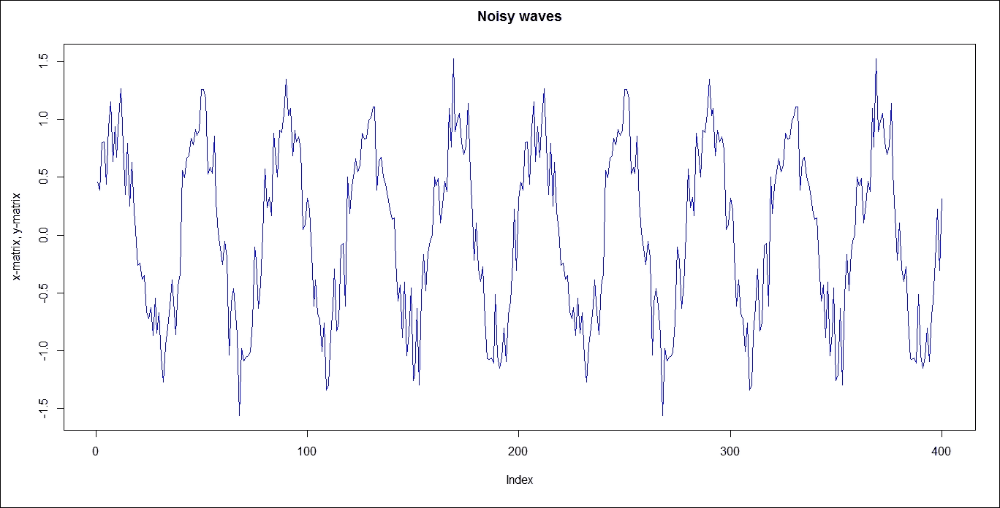
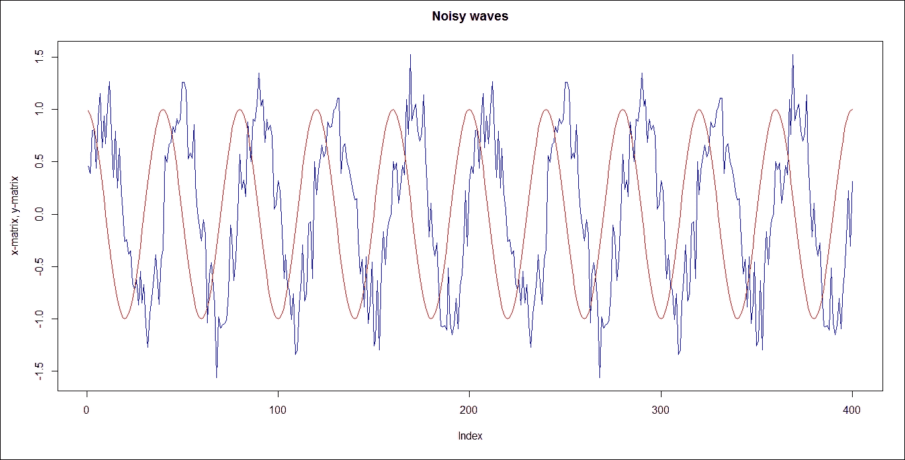
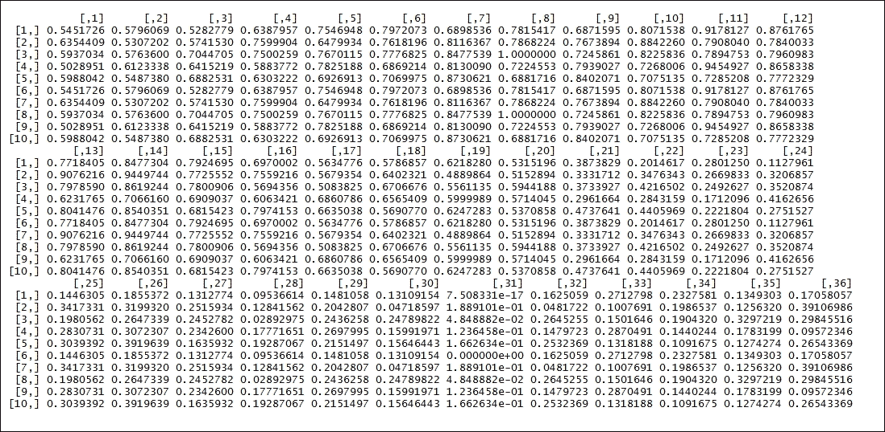
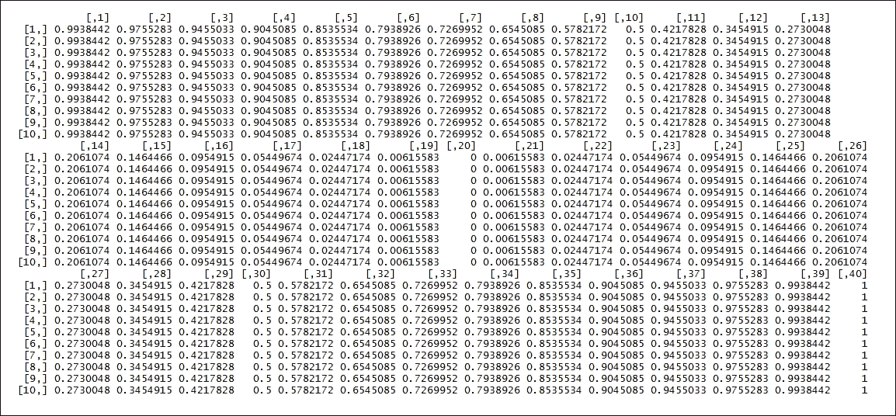
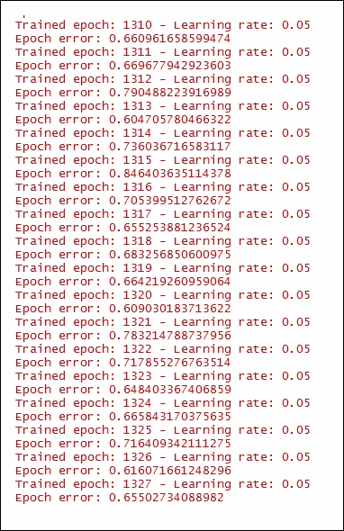
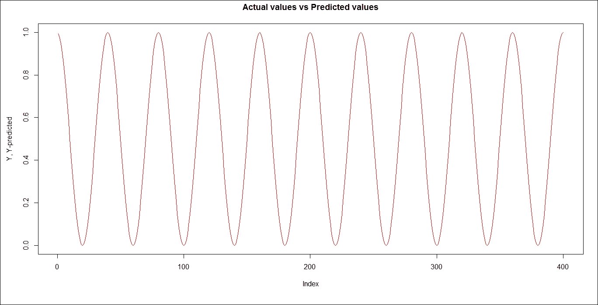
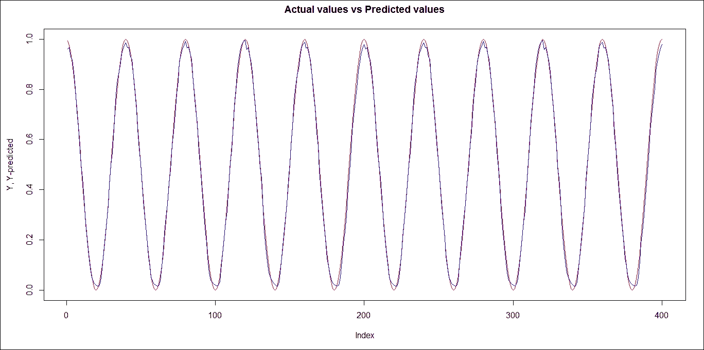
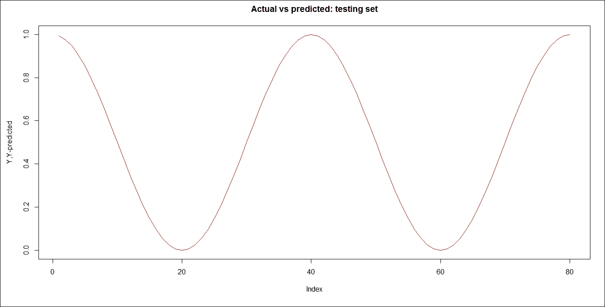
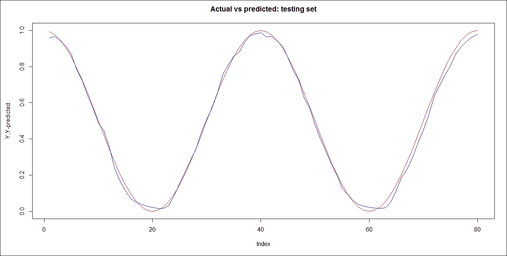

# 第十一章 深度学习

在本章中，我们将介绍以下内容：

循环神经网络 - 预测周期信号

# 简介

大多数机器学习算法由于预定义的表示和输入特征而表现良好。机器学习算法通过优化权重来最佳地做出最终预测，而表示学习试图自动学习良好的特征或表示。深度学习算法通过增加复杂性来尝试在多个表示级别上学习。深度架构由多个非线性行为级别组成，例如具有许多隐藏层的神经网络。深度学习技术的目标主要是学习特征层次。深度学习技术可以分为三大类；用于无监督或生成学习的深度网络，用于监督学习的深度网络和混合深度网络

# 循环神经网络 - 预测周期信号

振荡器是产生特定、周期性波形的电路，如方波、三角波、锯齿波和正弦波。为了生成输出，振荡器通常使用某种形式的主动设备-灯，它被电阻器、电容器和电感器所包围。振荡器的两种主要类型是弛豫振荡器和正弦振荡器。三角波、锯齿波和其他非正弦波形是通过弛豫振荡器产生的，而正弦振荡器由外部组件和放大器组成，以产生振荡。通常，纯正弦波中不含有谐波，它们只包含一个频率。

## 准备工作...

任务是从一个带噪声的正弦波中预测余弦波。使用 5Hz 频率的正弦波，其中包含一些正态分布的噪声和一个平滑的余弦波。创建的数据集是一组 10 个序列，每个序列包含 40 个观测值。

## 如何做...

需要在第一步加载以下包：

```py
 > install.packages("rnn")
 > library(rnn)

```

将初始种子设置为随机数，以实现可重复性：

```py
> set.seed(10)

```

初始化所需的频率：

```py
> f <- 5

```

创建所需的向量：

```py
> w <- 2*pi*f

```

生成序列：`seq()`函数生成常规序列。`0.005`是起始值，`2`是结束值。`by=0.005`确定增量序列：

```py
> t <- seq(0.005,2,by=0.005)

```

生成`sin`和`cos`值：

```py
 > x <- sin(t*w) + rnorm(200, 0, 0.25)
 > y <- cos(t*w)

```

生成时间序列样本：`matrix()`函数从`x`和`y`值创建矩阵。`nrow = 40`表示所需的行数：

```py
 > X <- matrix(x, nrow = 40)
 > Y <- matrix(y, nrow = 40)

```

绘制带噪声的波形：`plot()`函数是用于绘制 R 对象的通用函数。`as.vector(X)`数据框作为函数值传递。`type='l'`表示线条：

```py
> plot(as.vector(X), col='blue', type='l', ylab = "x-matrix, y-matrix", main = "Noisy waves")

```

结果如下：



```py
> lines(as.vector(Y), col = "red")

```

结果如下：



标准化`X`的值。值的范围在 0 到 1 之间：

```py
> X <- (X - min(X)) / (max(X) - min(X))

```

打印`X`的值：

```py
> X

```

结果如下：



标准化 `Y` 的值。值的范围介于 0 和 1 之间：

```py
> X <- (X - min(X)) / (max(X) - min(X))

```

打印 `X` 的值：

```py
> X

```

结果如下：



转置 `X` 和 `Y` 的值：

```py
 > X <- t(X)
 > Y <- t(Y)

```

创建训练集和测试集：

```py
 > train <- 1:8
 > test <- 9:10

```

训练循环神经网络。`Y = Y[train,]` 表示输出值的数组。`X = X[train,]` 表示输入值的数组。`learningrate = 0.05` 表示权重迭代的速率。`hidden_dim = 16` 是隐藏层的维度。`numepochs = 1500` 是整个数据集进行训练的次数。

这个阶段将花费时间。所需时间取决于学习率、维度数量以及整个数据集进行训练的次数：

```py
> model <- trainr(Y = Y[train,],X = X[train,],learningrate = 0.05,hidden_dim = 16,numepochs = 1500)

```

结果如下：



预测循环神经网络（Recurrent Neural Network）的输出：

```py
> Y_predicted <- predictr(model, X)

```

绘制 **实际值与预测值** 的对比图。输出构成训练集和测试集：

```py
> plot(as.vector(t(Y)), col = 'red', type = 'l', main = "Actual values vs Predicted values", ylab = "Y, Y-predicted")

```

结果如下：



```py
> lines(as.vector(t(Y_predicted)), type = 'l', col = 'blue')

```

结果如下：



绘制 **实际值与预测值** 的对比图。输出仅构成测试集：

```py
> plot(as.vector(t(Y[test,])), col = 'red', type='l', main = "Actual vs predicted: testing set", ylab = "Y,Y-predicted")

```

结果如下：



```py
> lines(as.vector(t(Y_predicted[test,])), type = 'l', col = 'blue')

```

结果如下：


