# 第一章 机器学习简介

本章的目标是带您了解机器学习领域，并为后续章节提前概述基本概念。更重要的是，重点是帮助您探索各种学习策略，并深入不同机器学习子领域。每个子领域下的技术和算法，以及构成任何机器学习项目实施核心的整体架构，都将进行深入探讨。

关于机器学习有许多出版物，过去在这个领域已经做了很多工作。除了机器学习概念之外，重点将主要放在通过实际案例的具体实践方面。重要的是你已经对基本编程技术和算法范式有相当高的了解；尽管对于每个编程部分，都有相应的入门指南。

本章将深入探讨以下主题：

+   机器学习简介

+   基本定义和用法环境

+   机器学习与数据挖掘、**人工智能**（**AI**）、统计学和数据科学之间的差异和相似性

+   与大数据的关系

+   术语和机制：模型、准确性、数据、特征、复杂性和评估指标

+   机器学习子领域：监督学习、无监督学习、半监督学习、强化学习和深度学习。每个机器学习子领域也涵盖了特定的机器学习技术和算法

+   机器学习问题类别：分类、回归、预测和优化

+   机器学习架构、生命周期和实际问题

+   机器学习技术、工具和框架

# 机器学习

机器学习已经存在很多年了，所有社交媒体用户在某个时间点都曾是机器学习技术的消费者。一个常见的例子是面部识别软件，它具有识别数字照片中是否包含特定人物的能力。如今，Facebook 用户可以在上传的数字照片中看到自动建议标记他们的朋友。一些相机和软件，如 iPhoto，也具备这种功能。本章后面将更详细地讨论许多例子和用例。

以下概念图代表了本章将涵盖的机器学习的关键方面和语义：

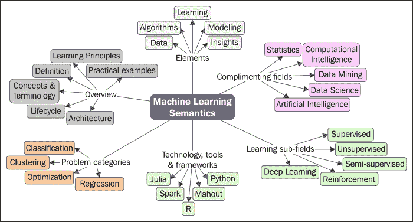

## 定义

让我们从定义机器学习是什么开始。机器学习有许多技术和功能定义，以下是一些例子：

|   | *"如果一个计算机程序在任务 T 中从经验 E 中学习，相对于某些任务类 T 和性能度量 P，如果其性能随着经验 E 的提高而提高，则称该程序从经验 E 中学习。" |   |
| --- | --- | --- |
|   | --*Tom M. Mitchell* |
|   | *"机器学习是从数据中训练模型，该模型对性能度量进行泛化决策。" |   |
|   | --*Jason Brownlee* |
|   | *"人工智能的一个分支，其中计算机生成基于输入的原始数据的基本规则。" |   |
|   | --*Dictionary.com* |
|   | *"机器学习是一门科学，它涉及设计和发展算法，使计算机能够根据经验数据，如传感器数据或数据库中的数据，进化行为。" |   |
|   | --*Wikipedia* |

上述定义既迷人又相关。它们要么具有算法、统计或数学的角度。

除了这些定义之外，一个单一的术语或定义对于机器学习的定义至关重要，它有助于促进问题解决平台的定义。基本上，它是一种*模式搜索机制*，将智能构建到机器中，使其能够学习，这意味着它将能够从自己的经验中做得更好。

深入探讨一个模式通常是什么，模式搜索或模式识别本质上研究的是机器如何感知环境，学会区分感兴趣的行为与其他行为，并能够对分类行为做出合理的决策。这通常由人类来完成。目标是提高准确性、速度，并避免系统被不当使用的可能性。

以这种方式构建的机器学习算法处理构建智能。本质上，机器以与人类相似的方式理解数据。

机器学习实现的根本目标是开发一个通用的算法，该算法能够解决实际且具体的问题。在这个过程中需要考虑的重要方面包括数据、时间和空间需求。最重要的是，具有应用于广泛学习问题的能力，学习算法的目标是产生一个尽可能准确的结果，即一条规则。

另一个重要的方面是大数据环境；也就是说，机器学习方法已知在需要从大型、多样化和快速变化的数据集中发现洞察力的情况下也有效。关于机器学习的大规模数据方面的更多内容将在第二章 *机器学习与大规模数据集* 中介绍。

## 核心概念和术语

机器学习的核心是了解并适当地使用数据。这包括收集*正确*的数据、清洗数据，并使用学习算法迭代地处理数据，利用数据的关键特征构建模型，并根据这些模型的假设进行预测。

在本节中，我们将介绍机器学习中使用的标准术语或命名法，从如何描述数据、学习、建模、算法以及特定的机器学习任务开始。

## 什么是学习？

现在，让我们看看在机器学习背景下“学习”的定义。简单来说，历史数据或观察结果被用来预测或推导出可执行的任务。非常明显，一个智能系统的基本要求就是其学习能力。以下是一些定义学习问题的考虑因素：

+   提供一个定义，说明学习者应该学习什么以及学习的必要性。

+   定义数据需求和数据来源。

+   定义学习者是否应该在整个数据集上操作，或者一个子集就足够了。

在我们深入理解以下各节中每种学习类型的内部机制之前，你需要了解解决学习问题所遵循的简单过程，这涉及到构建和验证模型，以最大精度解决问题。

### 小贴士

模型不过是将算法应用于数据集的输出，它通常是数据的表示。我们将在后面的章节中更详细地介绍模型。

通常，为了执行机器学习，主要需要两种类型的数据集。第一种数据集通常是手动准备的，其中输入数据和预期的输出数据都可用并已准备。重要的是，每一条输入数据都应该有一个可预期的输出数据点，因为这将以监督方式用于构建规则。第二种数据集是我们有输入数据，我们感兴趣的是预测预期的输出。

作为第一步，给定的数据被划分为三个数据集：训练集、验证集和测试集。没有一条固定的规则规定数据集的百分比应该是多少，可以是 70-10-20、60-30-10、50-25-25 或其他任何值。

训练数据集指的是用于学习或构建分类器的数据示例，例如。验证数据集指的是用于验证构建的分类器的数据示例，可以帮助调整输出的准确性。测试数据集指的是帮助评估分类器性能的数据示例。

执行机器学习通常有三个阶段：

+   **第一阶段——训练阶段**：这是使用训练数据通过将给定的输入与预期的输出配对来训练模型的过程。这一阶段的输出是学习模型本身。

+   **第二阶段——验证和测试阶段**：这个阶段是为了衡量已经训练好的学习模型的好坏，并估计模型属性，如误差度量、召回率、精确度等。这个阶段使用验证数据集，输出是一个复杂的学习模型。

+   **第三阶段——应用阶段**：在这个阶段，模型需要接受实际世界的数据，并从中得出结果。

下图展示了如何将学习应用于预测行为：

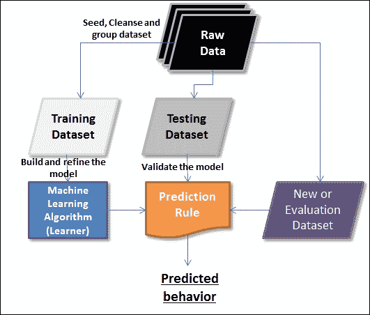

### 数据

数据是机器学习中的主要学习来源。这里所引用的数据可以是任何格式，可以以任何频率接收，可以是任何大小。在处理机器学习环境中的大型数据集时，有一些新技术已经发展起来，并正在被实验。还有更多的大数据方面，包括并行处理、分布式存储和执行。下一章将更详细地介绍数据的这些大规模方面，包括一些独特的区分因素。

当我们想到数据时，维度就会浮现在脑海中。首先，对于结构化和非结构化数据，我们有行和列。这本书将涵盖在机器学习环境中处理结构化和非结构化数据。在本节中，我们将介绍与机器学习环境中的数据相关的术语。

| 术语 | 在机器学习环境中的目的或意义 |
| --- | --- |
| 特征、属性、字段或变量 | 这是学习算法所引用的单个数据列。一些特征可以作为输入提供给学习算法，而一些可以是输出。 |
| 实例 | 这是数据集中的一个单独的数据行。 |
| 特征向量或元组 | 这是一个特征列表。 |
| 维度 | 这是用于描述数据属性的一组属性子集。例如，日期维度由三个属性组成：日、月和年。 |
| 数据集 | 行或实例的集合被称为数据集。在机器学习环境中，存在不同类型的数据集，用于不同的目的。算法在不同的数据集上运行，以衡量模型的准确性。有三种类型的数据集：训练数据集、测试数据集和评估数据集。任何给定的大型数据集通常会被分成三个数据集类别，其比例通常是：60%训练，30%测试，10%评估。 |
| a. 训练数据集 | 训练数据集是模型构建或训练的基础数据集。 |
| b. 测试数据集 | 测试数据集是用于验证所构建模型的那个数据集。这个数据集也被称为验证数据集。 |
| c. 评估数据集 | 评估数据集是用于模型最终验证的数据集（可以更类似于用户验收测试）。 |

| 数据类型 | 属性或特征可以有不同的数据类型。以下列出了一些数据类型：

+   分类（例如：年轻，年老）。

+   序数（例如：0，1）。

+   数值（例如：1.3，2.1，3.2 等）。

|

| 覆盖率 | 预测或模型覆盖的数据集百分比。这决定了预测模型的置信度。 |
| --- | --- |

### 标记和未标记数据

在机器学习背景下，数据可以是标记的或未标记的。在我们深入探讨机器学习基础知识之前，你需要了解这种分类，以及何时使用哪些数据，因为这种术语将在整本书中使用。

未标记数据通常是数据的原始形式。它由自然或人为创造的样本组成。这类数据在数量上很容易获得。例如，视频流、音频、照片和推文等。这种形式的数据通常没有附加的解释说明。

当一个意义被附加到未标记数据上时，它就变成了标记数据。在这里，我们谈论的是附加一个“标签”或“标记”，这是必需的，并且是解释和定义相关性的强制性要求。例如，照片的标签可以是它包含的细节，如动物、树木、大学等，或者在音频文件的情况下，可以是政治会议、告别派对等。更常见的是，标签由人类映射或定义，并且比未标记的原始数据获得成本高得多。

学习模型可以应用于标记数据和未标记数据。我们可以通过结合标记和未标记数据集来推导出更精确的模型。以下图表表示了标记和未标记数据。三角形和更大的圆圈代表标记数据，而小圆圈代表未标记数据。

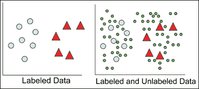

标记和未标记数据的应用将在以下章节中更详细地讨论。你会看到，监督学习采用标记数据，无监督学习采用未标记数据。半监督学习和深度学习技术以各种方式结合标记和未标记数据来构建准确的模型。

### 任务

任务是机器学习算法旨在解决的问题。我们衡量任务上的性能是很重要的。在这个上下文中，“性能”一词无非是解决问题的程度或信心。不同的算法在不同的数据集上运行会产生不同的模型。重要的是，生成的模型不应进行比较，而应衡量不同数据集和不同模型之间结果的一致性。

### 算法

在对当前机器学习问题有一个清晰的理解之后，重点转向哪些数据和算法是相关或适用的。有几种算法可供选择。这些算法要么按学习子领域（如监督学习、无监督学习、强化学习、半监督学习或深度学习）分组，要么按问题类别（如分类、回归、聚类或优化）分组。这些算法在多个数据集上迭代应用，并捕获随着新数据而演化的模型。

### 模型

模型是任何机器学习实现的核心。模型描述了系统中观察到的数据。模型是应用于数据集的算法的输出。在许多情况下，这些模型应用于新的数据集，这有助于模型学习新的行为并预测它们。针对给定问题，有广泛的机器学习算法可供应用。在非常高的层面上，模型被分类如下：

+   逻辑模型

+   几何模型

+   概率模型

#### 逻辑模型

逻辑模型在本质上更具有算法性，通过迭代运行算法帮助我们推导出一组规则。决策树就是一个这样的例子：

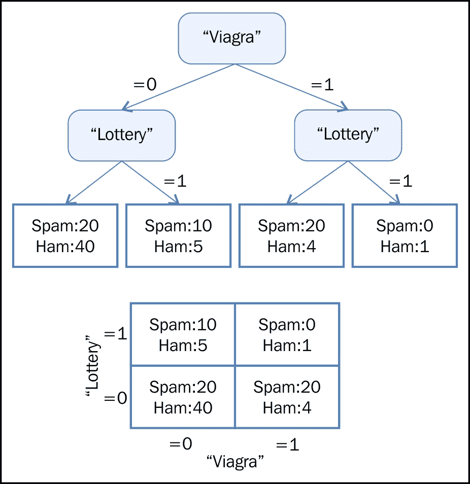

#### 几何模型

几何模型使用诸如线、平面和距离等几何概念。这些模型通常在大量数据上操作，或者可以操作。通常，线性变换有助于比较不同的机器学习方法：

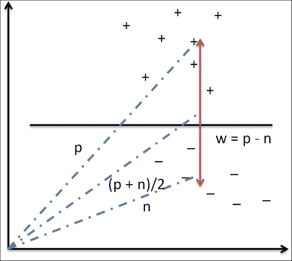

#### 概率模型

概率模型是采用统计技术的统计模型。这些模型基于一种定义两个变量之间关系的策略。由于涉及使用随机背景过程，这种关系可以确定地推导出来。在大多数情况下，可以认为整体数据的一个子集用于处理：

| Viagra | Lottery | P(Y= Spam (Viagra, lottery)) | P(Y= ham (Viagra, lottery)) |
| --- | --- | --- | --- |
| 0 | 0 | 0.31 | 0.69 |
| 0 | 1 | 0.65 | 0.35 |
| 1 | 0 | 0.80 | 0.20 |
| 1 | 1 | 0.40 | 0.60 |

## 机器学习中的数据和不一致性

本节详细介绍了在实施机器学习项目过程中可能遇到的所有可能的数据不一致性，例如：

+   欠拟合

+   过拟合

+   数据不稳定

+   不可预测的未来

幸运的是，目前有一些既定的流程来解决这些不一致性。以下各节将介绍这些不一致性。

### 欠拟合

当一个模型没有考虑足够的信息来准确建模实际数据时，我们称其为欠拟合。例如，如果只在指数曲线上映射两个点，这可能会成为一个线性表示，但可能存在没有模式的情况。在这些情况下，我们会看到不断增加的错误，随后是一个不准确的模型。此外，在分类器过于僵化或不够复杂的情况下，欠拟合不仅可能是由于数据不足，也可能是由于建模不正确。例如，如果两个类别形成同心圆，而我们试图拟合一个线性模型，假设它们是线性可分的，这可能会导致欠拟合。

模型的准确性由统计世界中称为“功率”的度量来确定。如果数据集大小太小，我们永远无法达到最优解。

### 过拟合

这种情况与之前解释的欠拟合情况正好相反。虽然样本太小不适合定义最优解，但大数据集也存在模型过拟合数据的危险。过拟合通常发生在统计模型描述噪声而不是描述关系时。在这个背景下详细说明前面的例子，假设我们有 500,000 个数据点。如果模型最终要适应所有 500,000 个数据点，这就变成了过拟合。这实际上意味着模型正在记忆数据。只要数据集没有曲线外的点，这个模型就能很好地工作。一个过拟合的模型表现不佳，因为数据的小幅波动往往会被夸大。过拟合的主要原因也可能是用于训练模型的准则与用于评估模型有效性的准则不同。简单来说，如果模型记住训练数据而不是学习，这种情况就会更频繁地发生。

现在，在缓解数据欠拟合问题的过程中，通过提供更多数据，这本身可能就是一个风险，并最终导致过拟合。考虑到更多数据可能意味着更多的复杂性和噪声，我们可能会得到一个解决方案模型，它只适合当前的数据，而不适合其他任何数据，这使得它无法使用。在下面的图中，随着模型复杂性和错误的增加，过拟合和欠拟合的条件被指出来：

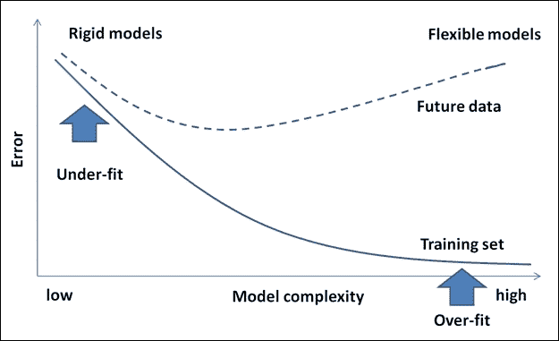

### 数据不稳定

机器学习算法通常对数据中的噪声具有鲁棒性。如果异常值是由于人为错误或对相关数据的误解造成的，那么就会发生问题。这将导致数据偏斜，最终导致模型错误。

因此，有一个过程来纠正或处理可能导致构建错误模型的人为错误是非常必要的。

### 不可预测的数据格式

机器学习旨在与系统不断进入的新数据一起工作，并从这些数据中学习。当进入系统的新的数据格式不被机器学习系统支持时，复杂性就会逐渐增加。鉴于我们接收到的数据格式不稳定，现在很难说我们的模型对新数据是否工作良好，除非有机制来处理这种情况。

## 实际机器学习示例

在本节中，让我们探索一些实际的机器学习应用。我们在本章的介绍部分涵盖了各种示例，现在我们将涵盖一些特定领域的示例，并对每个问题进行简要描述。

对于在线和离线应用，以下的一些示例可以轻松猜出。在接下来的章节中，将选择这些示例的子集，以使用合适的机器学习算法展示实际实施方面的示例。

| 问题 / 问题域 | 描述 |
| --- | --- |
| 邮件垃圾检测 | 这里的问题陈述是要识别哪些电子邮件是“垃圾邮件”。一个机器学习算法可以根据它使用电子邮件数据的一些关键特征构建的规则，将电子邮件分类为垃圾邮件。一旦电子邮件被标记为垃圾邮件，该邮件就会被移动到垃圾邮件文件夹，其余的则留在收件箱中。 |
| 信用卡欺诈检测 | 这是信用卡公司需要解决的一个近期问题。基于消费者使用的信用卡模式和客户的购买行为，需要识别任何可能不是由客户进行的交易，并将它们标记为欺诈，以便采取必要的行动。 |
| 数字识别 | 这是一个非常简单的用例，需要根据邮编对帖子进行分组的能力。这包括准确解释手写数字并根据邮编对帖子进行分类以加快处理的需求。 |
| 语音识别 | 自动呼叫中心需要这种能力，即用户的电话请求被解释并映射到执行任务之一。一旦用户请求可以映射到任务，其执行就可以自动化。这个问题的一个模型将允许程序理解并尝试满足那个请求。配备 Siri 的 iPhone 就有这种能力。 |
| 人脸检测 | 这是今天社交媒体网站提供的关键功能之一。这个功能提供了一种在许多数字照片中标记人的能力。这为按人分组或对照片进行分类提供了能力。一些相机和软件，如 iPhoto，就有这种能力。 |
| 产品推荐或客户细分 | 这种能力几乎存在于今天所有的顶级在线购物网站上。给定一个客户的购买历史和大量产品库存，目标是识别那些客户最有可能购买的产品，从而激励更多的产品购买。许多在线购物和社交网站支持此功能（例如：亚马逊、Facebook、Google+等）。还有其他情况，比如预测试用版客户是否会选择产品的付费版本。 |
| 股票交易 | 这意味着根据当前和过去的股票走势来预测股票表现。这项任务对金融分析师至关重要，并在买卖股票时提供决策支持。 |
| 情感分析 | 许多时候，我们发现客户是基于他人的意见做出决定的。例如，我们购买一个产品是因为它的大部分用户给出了积极的反馈。不仅如前所述的商业业务中，情感分析也被政治策略家用来衡量政策声明或竞选信息的公众舆论。 |

## 学习问题的类型

本节重点阐述不同的学习问题类别。机器学习算法也被归类在这些学习问题中。以下图展示了各种类型的学习问题：

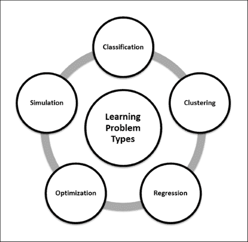

### 分类

分类是一种识别给定数据集分组技术的方法，这样根据目标或输出属性的一个值，整个数据集可以被归类为属于一个类别。这项技术有助于识别数据行为模式。简而言之，这是一种区分机制。

例如，销售经理需要帮助识别潜在客户，并想确定是否值得花费客户要求的努力和时间。经理的关键输入是客户数据，这种情况通常被称为**总终身价值**（**TLV**）。

我们获取数据，开始在图表上盲目地绘制（如下面的图表所示），其中 *x* 轴代表购买的总商品数量，*y* 轴代表花费的总金额（以美元的百倍为单位）。现在我们定义标准以确定，例如，一个客户是好是坏。在下面的图表中，所有单次购买超过 800 美元的客户都被归类为好客户（请注意，这是一个假设的例子或分析）。

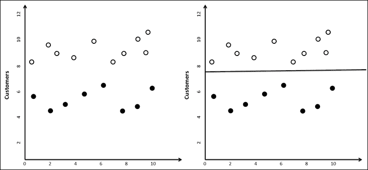

现在当新的客户数据进来时，销售经理可以将新客户绘制在这个图表上，并根据他们所在的哪一侧，预测客户是否可能成为好客户或坏客户。

### 小贴士

注意，分类不一定是二元的（是或否，男或女，好或坏，等等），可以根据问题定义定义任意数量的分类（差，低于平均水平，平均水平，高于平均水平，好）。

### 聚类

在许多情况下，数据分析师只是被提供了一些数据，并期望他们能够挖掘出可能有助于得出情报的有趣模式。这个任务与分类任务的主要区别在于，在分类问题中，业务用户指定了他/她正在寻找的内容（一个好的客户或一个坏的客户，一个成功或一个失败，等等）。

现在我们来扩展在分类部分提到的相同例子。在这里，识别用于分类客户的模式时并没有考虑任何目标或先前的分类，而且与运行分类不同，结果可能并不总是相同的（例如，取决于初始质心的选择方式）。聚类的一个示例建模方法是 k-means 聚类。关于 k-means 聚类的更多细节将在下一节和后续章节中详细说明。

简而言之，聚类是一种分类分析，它并不以一个特定的目标为出发点（好/坏，会买/不会买）。

### 预测、预测或回归

与分类类似，预测或预测也是关于识别事物未来可能发生的方式。这种信息是从过去的经验或知识中得出的。在某些情况下，数据不足，需要通过回归来定义未来。预测和预测结果总是与不确定性的程度或概率一起呈现。这种问题类型的分类也称为**规则提取**。

让我们举一个例子，一个农业科学家正在研究她开发的新作物。作为试验，这种种子在各个海拔高度种植，并计算了产量。这里的要求是根据海拔细节（以及一些相关的数据点）预测作物的产量。通过在参数之间绘制图表，确定了产量与海拔之间的关系。记录了一个适合大多数数据点的方程，在数据不拟合曲线的情况下，我们可以去除这些数据。这种技术被称为回归。

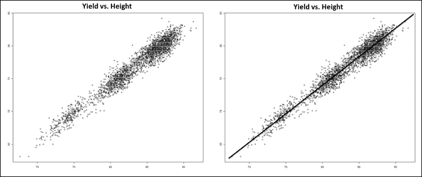

### 模拟

除了我们之前定义的所有技术之外，可能存在数据本身具有许多不确定性的情况。例如，一个外包经理被分配了一个任务，并且可以根据经验估计，这个任务可以由一个具有特定技能的团队在 2-4 小时内完成。

假设输入材料的成本可能在 100-120 美元之间，而任何给定一天来上班的员工数量可能在 6 到 9 人之间。然后分析师估计项目可能需要多长时间。解决这类问题需要模拟大量的替代方案。

通常在预测、分类和无监督学习中，我们被给予数据，但我们实际上并不知道数据是如何相互关联的。没有方程可以描述一个变量作为其他变量的函数。

从本质上讲，数据科学家结合使用前面提到的一种或多种技术来解决具有挑战性的问题，这些问题包括：

+   网络搜索和信息提取

+   药物设计

+   预测资本市场行为

+   理解客户行为

+   设计机器人

### 优化

简单来说，优化是一种使某事物变得更好或为解决方案定义一个使其成为最佳的上下文的机制。

考虑一个生产场景，假设有两个机器可以生产所需的产品，但一个机器在生产高速时需要更多的能量和较少的原材料，而另一个机器则需要更多的原材料和较少的能量来在相同的时间内生产相同的输出。理解基于输入变化的输出模式非常重要；可能带来最高利润的组合可能是生产经理想要了解的。作为分析师，你需要确定在机器之间分配生产以获得最高利润的最佳方式。

下图显示了在两个机器之间绘制各种分布选项的图表时，最高利润点。识别这个点是这种技术的目标。

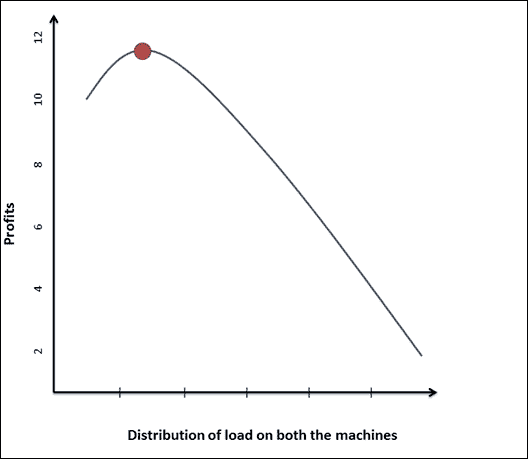

与存在与输入数据相关的不确定性的模拟案例不同，在优化中，我们不仅能够访问数据，而且还有关于数据属性之间依赖关系和关系的信息。

机器学习中的一个关键概念是称为**归纳**的过程。以下学习子领域使用归纳过程来构建模型。归纳学习是一个推理过程，它使用一个实验的结果来运行下一组实验，并通过迭代从具体信息中演变出一个模型。

下图描述了机器学习的各个子领域。这些子领域是机器学习算法分类的方式之一。

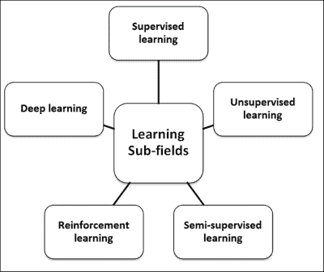

### 监督学习

监督学习完全是关于操作到一个已知的期望，在这种情况下，需要从定义中的数据中分析什么。在这个背景下，输入数据集也被称为“标记”数据集。归类在这个类别的算法专注于建立输入和输出属性之间的关系，并使用这种关系推测性地为新的输入数据点生成输出。在前一小节中，为分类问题定义的例子也是监督学习的一个例子。标记数据有助于构建可靠的模型，但通常成本高昂且有限。

当数据的输入和输出属性已知时，监督学习的关键是输入到输出的映射。这些映射有很多例子，但连接输入和输出属性的复杂函数是未知的。监督学习算法负责这种连接，并且给定大量输入/输出对的大数据集，这些函数有助于预测任何新输入值的输出。

### 无监督学习

在一些学习问题中，我们并没有特定的目标来解决。在前面的小节中，我们讨论了聚类，这是一种分类分析，我们并没有带着特定的目标（好/坏，会买/不会买）开始，因此被称为无监督分析或学习。在这种情况下，目标是解码数据中的结构，与数据输入和输出属性之间的构建映射相对，实际上输出属性并未定义。这些学习算法因此在一个“未标记”的数据集上操作。

### 半监督学习

半监督学习是关于使用标记数据和未标记数据来更好地学习模型。对于未标记数据，存在适当的假设是很重要的，任何不适当的假设都可能使模型无效。半监督学习从人类的学习方式中获得其动机。

### 强化学习

强化学习是关注最大化结果奖励的学习。例如，在教导幼儿新习惯时，每次他们遵循指示就给予奖励非常有效。事实上，他们发现哪些行为有助于他们获得奖励。这是强化学习，也称为信用评估学习。

在强化学习中，模型除了负责做出决策外，还要对收到周期性奖励的决策负责。在这种情况下，结果与监督学习不同，不是立即的，可能需要执行一系列步骤才能看到最终结果。理想情况下，算法将生成一系列决策，有助于实现最高的奖励或效用。

在这种学习技术中的目标是通过对数据进行探索和利用来有效地衡量权衡。例如，当一个人必须从点 A 到点 B 旅行时，会有许多方式，包括乘坐飞机、水路、公路或步行，通过衡量这些选项中的每一个的权衡来考虑这些数据具有很大的价值。另一个重要方面是奖励延迟的重要性。这会如何影响学习？例如，在象棋等游戏中，任何奖励识别的延迟都可能改变结果。

### 深度学习

深度学习是机器学习的一个领域，它侧重于将机器学习与人工智能统一。从与人工神经网络的关系来看，这个领域更多的是对在大量常见数据上工作的人工神经网络的进步，以得出实用的见解。它涉及构建更复杂的神经网络来解决半监督学习下的问题，并在具有少量标记数据的数据集上运行。以下列出了一些深度学习技术：

+   卷积网络

+   **受限玻尔兹曼** **机** (**RBM**)

+   **深度信念** **网络** (**DBN**)

+   堆叠自编码器

# 性能度量

性能度量用于评估学习算法，并形成机器学习的一个重要方面。在某些情况下，这些度量也用作启发式方法来构建学习模型。

现在让我们探讨**可能近似正确**（**PAC**）理论的概念。当我们描述假设的准确性时，我们通常根据 PAC 理论谈论两种类型的不确定性：

+   **近似**: 这个度量表示对假设错误的接受程度

+   **概率**: 这个度量是假设正确的百分比确定性

以下图表显示了样本数量随错误、概率和假设增长的情况：

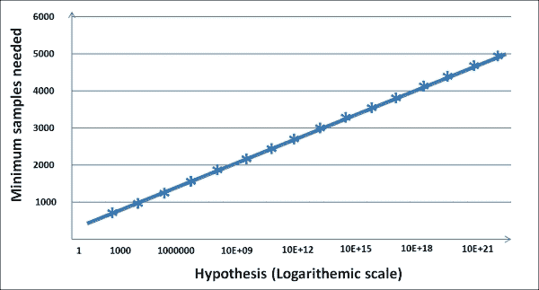

## 解决方案好吗？

分类和预测问题的错误度量是不同的。在本节中，我们将介绍一些这些错误度量，然后介绍如何解决它们。

在分类问题中，你可以有两种不同类型的错误，这些错误可以用“混淆矩阵”优雅地表示。假设在我们的目标营销问题中，我们处理了 10,000 个客户记录，以预测哪些客户可能对我们的营销活动做出响应。

在分析活动后，你可以构建以下表格，其中列是你的预测，行是实际观察：

| 行动 | 预测（将有购买） | 预测（将没有购买） |
| --- | --- | --- |
| 实际购买 | TP: 500 | FN: 400 |
| 实际未购买 | FP: 100 | TN: 9000 |

在主对角线上，我们有买家和非买家，他们的预测与实际情况相符。这些都是正确的预测。它们分别被称为真阳性（true positive）和真阴性（true negative）。在上右角，我们有那些我们预测为非买家，但实际上是买家的人。这是一个被称为假阴性错误（false negative error）的错误。在下左角，我们有那些我们预测为买家，但实际上是非买家的人。这是另一个被称为假阳性（false positive）的错误。

对于客户来说，两种错误同样昂贵吗？实际上并非如此！如果我们预测某人是买家，而他们实际上不是买家，公司最多只会损失在邮件或电话上的开支。然而，如果我们预测某人不会购买，而他们实际上确实是买家，公司就不会基于这个预测给他们打电话，从而失去了一位客户。因此，在这种情况下，假阴性错误比假阳性错误要昂贵得多。

机器学习社区在分类问题中使用三种不同的错误度量：

+   **度量 1：准确率**是指正确预测的百分比。

    示例：准确率为（9,000+500）/ 10,000 = 95%

+   **度量 2：召回率**是指你能够捕捉到的阳性病例的百分比。如果假阳性率低，召回率就会高。

    示例：召回率为 500/600 = 83.33%

+   **度量 3：精确度**是指正确预测的阳性预测的百分比。如果假阴性率低，精确度就会高。

    示例：精确率为 500/900 = 55.55%

在预测中，你是在预测一个连续变量。因此，这里的错误度量相当不同。通常，错误度量是通过比较模型的预测值与目标变量的真实值，并计算平均误差来获得的。这里有一些度量。

### 均方误差 (MSE)

要计算 MSE，我们首先取每个记录实际值与预测值之间差值的平方。然后我们取这些平方误差的平均值。如果第*i*个记录的预测值是*Pi*，实际值是*Ai*，那么 MSE 是：

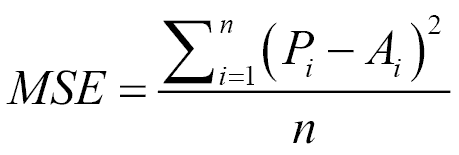

使用这个数量（称为**均方根误差**）的平方根也是很常见的。

### 均方误差 (MAE)

要计算 MAE，我们取每个记录预测值与实际值之间的绝对差值。然后我们取这些绝对差值的平均值。性能指标的选择取决于应用。MSE 是许多应用的优秀性能指标，因为它与方差有更多的统计基础。另一方面，MAE 更直观，对异常值不太敏感。观察 MAE 和 RMSE 可以给我们关于误差分布的额外信息。在回归中，如果 RMSE 接近 MAE，则模型会犯许多相对较小的错误。如果 RMSE 接近 MAE²，则模型会犯一些但较大的错误。

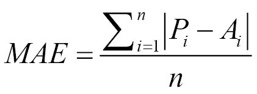

### 归一化均方误差和平均绝对误差（NMSE 和 NMAE）

MSE 和 MAE 都不表示误差有多大，因为它们是依赖于目标变量尺度的数值。与基准指数比较可以提供更好的洞察。常见的做法是取我们预测的主要属性的均值，并假设我们的朴素预测模型就是均值。然后我们根据朴素模型和原始模型计算 MSE。这个比率可以提供关于我们的模型与朴素模型相比是好是坏的洞察。

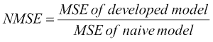

类似的定义也可以用于 MAE。

### 解决误差：偏差和方差

这种构建高度定制化高阶模型的陷阱被称为过拟合，这是一个关键概念。由此产生的错误被称为模型的**方差**。本质上，如果我们采用了不同的训练集，我们将得到一个非常不同的模型。方差是衡量模型对训练集依赖性的一个指标。顺便说一句，你看到的最右侧（线性拟合）的模型被称为欠拟合，由于欠拟合而产生的错误被称为偏差。在欠拟合或高偏差的情况下，模型无法解释数据之间的关系。本质上，我们试图拟合一个过于简单的假设，例如，线性拟合，而我们应该寻找更高阶的多项式。

为了避免过拟合和欠拟合的陷阱，数据科学家在训练集上构建模型，然后在测试集上找到误差。他们不断优化模型，直到测试集上的误差降低。随着模型开始定制于训练数据，测试集上的误差开始上升。他们在那个点停止优化模型。

让我们在本章中更深入地分析偏差和方差，并学习一些处理它们的实用方法。任何模型的误差都可以表示为偏差、方差和随机误差的组合。在较简单的模型中，偏差项较高，而在更复杂的模型中，方差项较高，如下面的图所示：

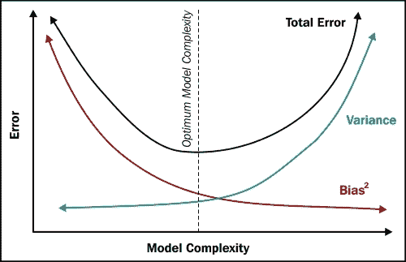

为了减少偏差或方差，让我们先问这个问题。如果一个模型有高偏差，它的误差如何随着数据量的增加而变化？

在非常小的数据量下，任何模型都可以很好地拟合数据（任何模型都可以拟合一个点，任何线性模型都可以拟合两个点，二次函数可以拟合三个点，依此类推）。因此，高偏差模型在训练集上的误差开始时非常小，随着数据点的增加而增加。然而，在测试集上，误差最初保持较高，因为模型高度定制于训练集。随着模型越来越精细，误差减少并等于训练集的误差。

以下图表清楚地描述了这种情况：

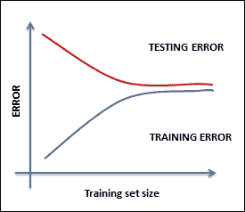

解决这种情况的方法可能包括以下之一：

+   很可能你正在处理非常少的特征，因此你必须找到更多特征

+   通过增加多项式和深度来增加模型的复杂性

+   如果模型有很高的偏差，增加数据量将不会有很大帮助

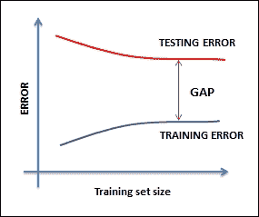

当你面临这种情况时，你可以尝试以下补救措施（与之前的相反）：

+   很可能你正在处理太多的特征，因此你必须减少特征数量

+   减少模型的复杂性

+   增加数据量将有所帮助

# 一些补充的机器学习领域

机器学习与许多相关领域密切相关，包括人工智能、数据挖掘、统计学、数据科学等。实际上，机器学习是一种多学科领域，并且在某些方面与所有这些领域都有联系。

在本节中，我们将定义一些这些领域，将它们与机器学习的相关性进行类比，并了解它们之间的相似之处和不同之处。总体而言，我们将从机器学习的核心定义开始，将其作为一个包括开发自学习算法的科学领域。我们现在将要讨论的大多数领域要么使用机器学习技术，要么使用机器学习技术的超集或子集。

## 数据挖掘

数据挖掘是一个通过应用业务规则到（大量）数据集中，分析数据并从中提取洞察的过程。这里的重点是数据和数据的领域。在识别哪些规则相关、哪些不相关的过程中采用了机器学习技术。

| 机器学习与数据挖掘 |
| --- |
| **与机器学习的相似之处** | **与机器学习的不同之处** | **与机器学习的关系** |
| 机器学习和数据挖掘都旨在从数据中提取价值。用于机器学习和数据挖掘的大多数工具都是通用的。例如，R 和 Weka 等。 | 虽然机器学习侧重于使用已知的知识或经验，而数据挖掘侧重于发现未知的知识，如数据中存在的特定结构，这有助于分析数据。在机器学习中，从数据中提取的智能旨在由机器消费，而在数据挖掘中，目标消费者是人类。 | 机器学习和数据挖掘领域相互交织，在基本原理和方法上存在显著的重叠。 |

## 人工智能 (AI)

人工智能专注于构建能够模仿人类行为的系统。它已经存在了一段时间，现代人工智能一直在持续发展，现在包括专门的数据需求。在许多其他能力中，人工智能应该展示以下特点：

+   知识存储和表示，以保存所有受调查和调查的数据

+   **自然语言处理**（**NLP**）能力，以便能够处理文本

+   推理能力，以便能够回答问题和促进结论

+   能够规划、调度和自动化

+   机器学习，以便能够构建自学习算法

+   机器人和更多

机器学习是人工智能的一个子领域。

| 机器学习与人工智能比较 |
| --- |
| **与机器学习的相似之处** | **与机器学习的不同之处** | **与机器学习的关系** |
| 机器学习和人工智能都采用学习算法，在推理或决策时侧重于自动化。 | 虽然机器学习被认为是人工智能兴趣范围内的一个领域，但机器学习的主要重点是提高机器在执行任务时的性能，并且构建的经验不一定是人类行为。在人工智能的情况下，采用受人类启发的算法。 | 机器学习通常被认为是人工智能的一个子领域。 |

## 统计学习

在统计学习中，预测函数是通过数据样本得出的，并且主要来源于样本数据。在这个过程中，数据的收集、清洗和管理非常重要。统计学与数学非常接近，因为它涉及数据的量化和对数字的操作。

| 机器学习与统计学习比较 |
| --- |
| **与机器学习的相似之处** | **与机器学习的不同之处** | **与机器学习的关系** |
| 就像机器学习一样，统计学习也是关于从数据中推断出某些情况下代表经验的能力。 | 统计学习侧重于得出有效的结论，而机器学习则是关于预测。统计学习在数据和允许假设方面与机器学习不同。机器学习和统计学由不同的群体实践。与统计学相比，机器学习是一个相对较新的领域。 | 机器学习技术实现了统计技术。 |

## 数据科学

数据科学是将数据转化为产品的过程。它是将分析学和机器学习付诸实践，从数据中得出推论和见解。数据科学被认为是从传统的数据分析知识系统，如**数据仓库**（**DW**）和**商业智能**（**BI**），到大数据的各个方面的一个第一步，这些系统考虑了大数据的所有方面。

数据科学生命周期包括从数据可用性/加载到推导和传达数据洞察，直至将过程投入运营的步骤，而机器学习通常是这个过程中的一个子集。

| 机器学习与数据科学 |
| --- |
| **与机器学习的相似之处** | **与机器学习的不同之处** | **与机器学习的关系** |
| 机器学习和数据科学在问题背景下有一个共同的绑定结果：预测。 | 机器学习和数据科学之间的重要区别是需要领域专业知识。数据科学专注于解决特定领域的问题，而机器学习专注于构建可以通用地适应问题背景的模型。 | 数据科学是机器学习、数据挖掘和相关学科的集合。它广泛涵盖了从数据加载到生产的完整过程。 |

# 机器学习过程生命周期和解决方案架构

在本节中，我们将讨论机器学习实现过程和解决方案架构：

1.  定义解决方案架构的第一步是定义问题陈述，这包括定义目标、过程和假设。

1.  确定这个问题属于哪种问题类型？是分类、回归还是优化问题？

1.  选择一个将用于衡量模型准确性的指标。

1.  为了确保模型能够很好地处理未见过的数据：

    1.  使用训练数据构建模型。

    1.  使用测试数据调整模型。

    1.  根据最终版本声明准确性。

以下图解释了底层系统的流程和架构：

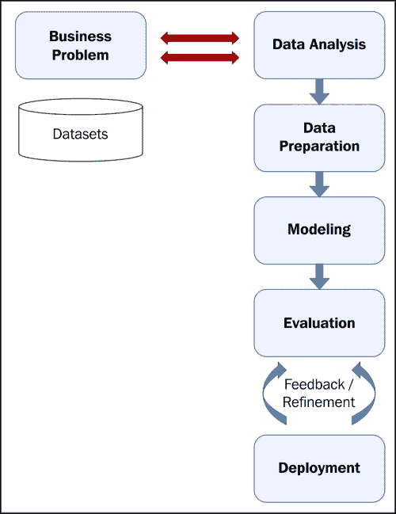

# 机器学习算法

现在，让我们看看重要的机器学习算法以及关于每个算法的一些简要细节。每个算法的深入实现方面将在后面的章节中介绍。这些算法要么根据问题类型，要么根据学习类型进行分类。给出了算法的简单分类，但它是直观的，并不一定是详尽的。

有许多方法可以对机器学习算法进行分类或分组，在这本书中，我们将使用基于学习模型的分组方法。从第第五章开始，我们将涵盖一个或多个学习模型及其相关算法。以下的概念模型描述了学习模型的列表：

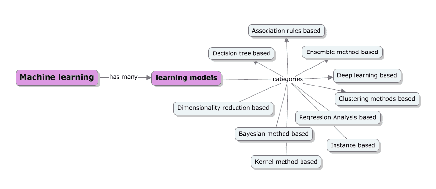

## 基于决策树的算法

基于决策树的算法定义了基于提供的数据迭代或递归构建的模型。基于决策树的算法的目标是在给定一组输入变量的情况下预测目标变量的值。决策树通过基于树的方法帮助解决分类和回归问题。在树结构中，决策分支直到对给定记录做出预测决策。以下是一些算法：

+   随机森林

+   **分类和** **回归树**（**CART**）

+   C4.5 和 C5.0

+   卡方检验

+   **梯度** **提升机**（**GBM**）

+   **卡方自动** **交互** **检测**（**CHAID**）

+   决策树

+   **多元自适应** **回归样条**（**MARS**）

## 基于贝叶斯方法的算法

贝叶斯方法是那些明确应用贝叶斯推理定理并再次解决分类和回归问题的方法。贝叶斯方法促进了建模中的主观概率。以下是一些基于贝叶斯的算法：

+   简单贝叶斯

+   **平均** **一依赖** **估计器**（**AODE**）

+   **贝叶斯信念** **网络**（**BBN**）

## 基于核方法的算法

当我们听到核方法时，首先想到的是**支持向量机**（**SVM**）。这些方法通常是一组方法本身。核方法关注模式分析，正如前几节所解释的，模式分析的核心包括各种映射技术。在这里，映射数据集包括向量空间。以下是一些基于核方法的学习算法的例子：

+   支持向量机（SVM）

+   **线性判别分析**（**LDA**）

## 聚类方法

聚类，就像回归一样，描述了一类问题和一类方法。聚类方法通常按建模方法组织，如基于质心的和层次化的。这些方法通过评估输入数据结构中的相似性来组织数据成组：

+   K-均值

+   **期望** **最大化**（**EM**）和**高斯** **混合模型**（**GMM**）

## 人工神经网络（ANN）

与核方法类似，人工神经网络再次成为一类模式匹配技术，但这些模型是受生物神经网络结构的启发。这些方法再次用于解决分类和回归问题。它们与深度学习建模相关，并且有许多子算法领域，有助于解决特定上下文中的问题。

这个类别中的一些方法包括：

+   **学习** **向量** **量化**（**LVQ**）

+   **自组织** **映射**（**SOM**）

+   跳频网络

+   感知机

+   反向传播

## 维度约简

与聚类方法一样，降维方法以迭代和无监督的方式在数据结构上工作。给定数据集和维度，更多的维度意味着在机器学习实现中需要做更多的工作。想法是迭代地减少维度，并将更多相关的维度向前推进。这种技术通常用于简化高维数据，然后应用监督学习技术。以下是一些降维方法的示例：

+   **多维** **尺度** （**MDS**）

+   **主成分** **分析** （**PCA**）

+   **投影** **追踪** （**PP**）

+   **偏最小** **二乘** （**PLS**） 回归

+   Sammon 映射

## 集成方法

如其名所示，集成方法包括多个独立构建的模型，这些模型的输出被组合并负责整体预测。确定要组合或包含哪些独立模型，如何组合结果以及如何实现所需结果的方式是至关重要的。组合的模型子集有时被称为较弱模型，因为这些模型的结果在独立情况下不需要完全满足预期结果。这是一类非常强大且广泛采用的技术。以下是一些集成方法算法的示例：

+   随机森林

+   Bagging

+   AdaBoost

+   自举聚合（Boosting）

+   堆叠泛化（blending）

+   **梯度** **提升机** （**GBM**）

## 基于实例的学习算法

实例不过是数据集的子集，基于实例的学习模型在识别的实例或对问题至关重要的实例组上工作。实例之间的结果会被比较，这可以包括新数据的一个实例。这种比较使用特定的相似度度量来找到最佳匹配并进行预测。基于实例的方法也被称为基于案例或基于记忆的学习。在这里，重点是实例的表示和实例之间比较的相似度度量。以下是一些基于实例的学习算法的示例：

+   **k-最近** **邻** （**k-NN**）

+   自组织

+   **学习** **向量** **量化** （**LVQ**）

+   **自组织** **映射** （**SOM**）

## 基于回归分析的算法

回归是一个基于模型产生的误差进行迭代优化的过程。回归也被用来定义机器学习问题类型。回归中的一些示例算法包括：

+   普通最小二乘线性回归

+   逻辑回归

+   **多元自适应回归样条** （**MARS**）

+   步进回归

## 基于关联规则的机器学习算法

考虑到变量，基于关联规则的机器学习算法提取并定义可以在数据集上应用并展示基于经验学习的规则，从而进行预测。这些规则在多维数据环境中关联时，在商业环境中也可能很有用。以下是一些基于关联规则的算法示例：

+   Apriori 算法

+   Eclat 算法

# 机器学习工具和框架

机器学习在技术和商业组织中迅速普及。每个组织都在积极制定战略，以利用他们的数据，并利用它来增强客户的体验和建立新的业务。当涉及到机器学习的工具或框架时，市场上有很多开源和商业选项。新一代的工具都是构建来支持大数据、分布式存储和并行处理的。在下一章中，我们将介绍机器学习环境中处理大规模数据的一些方面。

在非常高的层面上，机器学习工具有三代。

第一代机器学习工具主要关注提供丰富的机器学习算法和深度分析支持。这些工具并非专为处理大规模数据或支持分布式存储和并行处理而构建。其中一些工具由于支持垂直扩展，仍然可以处理大量数据。属于这一类别的工具包括 SAS、SPSS、Weka、R 等。尽管如此，现在大多数这些工具都在升级以支持大数据需求。

第二代工具专注于支持大数据需求，其中大多数在 Hadoop 平台上运行，并提供在 MapReduce 范式下运行机器学习算法的能力。属于这一类别的工具包括 Mahout、RapidMiner、Pentaho 和 MADlib。其中一些工具不支持所有机器学习算法。

第三代工具是道路上的聪明孩子，打破了批量操作的传统规范，支持实时分析，提供对大数据高级数据类型的支持，同时支持更深入的统计分析。属于这一类别的工具包括 Spark、HaLoop 和 Pregel。

在第四章《机器学习工具、库和框架》中，我们将介绍一些关键的机器学习工具，并展示如何根据问题的上下文使用它们。对于 R、Julia、Python、Mahout 和 Spark 等工具的实现细节将进行深入探讨。还将提供所需的技术入门和安装或设置相关的指导。

# 摘要

在本章中，它构成了本书其余章节的基础，我们介绍了机器学习的基础知识和机器学习语义的格局。我们首先用简单的术语定义了机器学习，并介绍了机器学习的术语或常用术语。

机器学习领域中有许多相互竞争和补充的分支。我们已经详细解释了机器学习与人工智能、数据挖掘、数据科学和统计学等领域的相似性、差异以及它们之间的关系。总体而言，所有这些领域都非常相似，并且具有重叠的目标。在大多数情况下，这些领域的从业者各不相同。即使在使用的工具方面，也存在许多共同点。

我们还研究了机器学习中可以使用的最新和最优秀的工具。其中一些工具将在使用实际例子的章节中进行演示。

在下一章中，我们将探讨机器学习的一个独特方面，这个方面在很大程度上改变了人们看待机器学习实现的方式。我们将探讨大数据或大型数据集的方面如何影响了工具选择和实现方法的选择。
