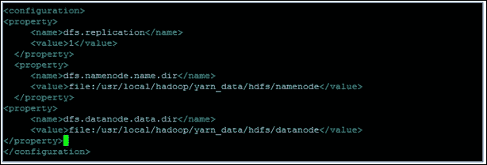

# 第三章。Hadoop 架构和生态系统的介绍

从本章开始，我们将探讨机器学习的实现方面。让我们开始学习选择平台——一个可以扩展到高级企业数据需求（特别是机器学习的具体大数据需求）的平台——Hadoop。

在本章中，我们介绍了 Hadoop 平台及其在解决机器学习大规模加载、存储和处理挑战方面的能力。除了对 Hadoop 架构、其核心框架以及其他支持生态系统组件的概述外，还包括了一个详细的安装过程和示例部署方法。尽管有许多商业版的 Hadoop，但本章的重点是介绍开源的 Apache Hadoop 发行版（最新版本 2.x）。

在本章中，以下主题将进行深入探讨：

+   Apache Hadoop 的介绍，其演变历史，核心概念以及构成 Hadoop 的生态系统框架

+   Hadoop 发行版和特定产品

+   Hadoop 环境的安装和设置

+   Hadoop 2.0——HDFS 和 MapReduce（也称为 **YARN**（**另一个资源协调器**））架构，以及使用架构的不同组件的示例实现场景

+   理解核心生态系统组件的目的，设置并学习使用示例构建和运行程序

+   探索针对机器学习特定生态系统扩展，如 Mahout 和 R Connectors (第四章，*机器学习工具、库和框架*，涵盖了实现细节）

# Apache Hadoop 简介

Apache Hadoop 是 Apache 软件基金会的一个基于 Java 的开源项目。该软件的核心目的是提供一个可扩展、可扩展和容错的平台，用于分布式存储和处理大数据。请参阅 第二章，*机器学习和大规模数据集*，了解更多关于哪些数据可以被视为大数据的信息。以下图像是 Hadoop 的标准标志：


其核心是利用节点集群，这些节点可以是商用服务器，并促进并行处理。Hadoop 这个名字是由其创造者 Doug Cutting 取的，他以自己孩子的黄色填充玩具大象命名。到目前为止，Yahoo! 是最大的贡献者和 Hadoop 的广泛使用者。有关 Hadoop 的更多详细信息、其架构和下载链接，请访问 [`hadoop.apache.org/`](http://hadoop.apache.org/)。

Hadoop 是大数据的行业标准平台，它为市场上所有流行的机器学习工具提供了广泛的支持。该平台现在被微软、谷歌、Yahoo！和 IBM 等几家大型公司使用。它还被用来解决特定的机器学习需求，如情感分析、搜索引擎等。

以下章节涵盖了 Hadoop 平台的一些关键特性，使其在大型数据存储和处理能力方面效率极高。

## Hadoop 的发展（首选平台）

以下图（来源 Cloudera Inc.）解释了 Hadoop 平台的发展历程。从 2002 年 Doug Cutting 和 Mike Cafarella 开始，旨在构建一个可高度扩展的、开源的、可扩展的、运行在多台机器上的搜索引擎。在这个演变阶段的一些重要里程碑包括 Google 在 2003 年 10 月发布的**Google 文件系统**（**GFS**），随后在 2004 年 12 月发布的 MapReduce 框架，它演变成了核心框架 HDFS 和 MapReduce/YARN。

另一个重要的里程碑发生在 2008 年 2 月左右，当时 Yahoo 贡献并采用了 Hadoop 的生产版本，该版本在超过 10,000 个 Hadoop 集群节点上实现了搜索索引。以下表格描述了 Hadoop 的发展历程：


## Hadoop 及其核心元素

以下概念图描绘了 Hadoop 平台的核心元素和方面：


# 大数据机器学习解决方案架构（采用 Hadoop）

在本节中，让我们看看在考虑大数据需求时实施机器学习解决方案的基本架构组件。

建议的解决方案架构应支持以高效且经济的方式消费各种数据源。以下图总结了可能成为机器学习解决方案技术栈一部分的核心架构组件。框架的选择可以是开源或打包许可选项。在本书的背景下，我们考虑了开源（Apache）Hadoop 及其生态系统组件的最新版本。

### 注意

本章不涉及特定供应商的框架和扩展。


在接下来的章节中，我们将详细讨论这些参考架构层以及每一层所需的框架。

## 数据源层

数据源层是机器学习参考架构的关键部分。有许多内部和外部数据源形成了解决机器学习问题的输入。这些源可以是结构化、非结构化或半结构化的。此外，在实时、批量或近实时模式下，它们需要无缝集成和汇总，以便用于分析引擎和可视化工具。

在将数据摄取到系统中进行进一步处理之前，去除数据中的无关或噪声是很重要的。可以应用一些独特的技术来清理和过滤数据。

这些综合数据集在大数据和数据聚合环境中也被称为数据湖。Hadoop 是数据湖选择的存储选项之一。

以下图表显示了构成主要输入源的各种数据源。


数据架构始终被设计来支持一些协议，例如 JMS、HTTP、XML 等。然而，现在，大数据领域的最新进展已经带来了显著的变化。因此，现在的新时代数据源包括来自社交网站的数据流、GPS 数据、用户访问日志等机器生成数据以及其他专有数据格式。

## 摄取层

数据摄取层负责将来自多个数据源的数据引入系统，其主要责任是确保数据质量。这一层具有过滤、转换、集成和验证数据的能力。选择实施这一层的技术应能够支持高数据量和其他数据特性。以下元模型显示了摄取层组成和功能流程。摄取层可能是一个**ETL**（提取、转换和加载）能力的架构。

以下列出了摄取层的一组基本要求：

+   从任何源系统以任何方式高速转换数据

+   以最短时间处理大量记录

+   以语义丰富的格式生成输出，以便任何目标系统都可以查询**智能数据**

摄取层的架构框架需要提供以下能力；以下模型描绘了各种层和组成：

+   适配器框架——任何产品组或应用都应该能够使用适配器框架快速、可靠和程序性地开发连接到不同数据源的连接器（文件、CSV 格式和数据库）

+   一个高速、并行变换执行引擎

+   一个作业执行框架

+   语义化输出生成框架

摄取层将相关数据加载到存储层，在我们的当前环境中，这是以文件为基础的存储层 Hadoop 存储层。

下面的概念图列出了摄入核心模式（这些模式针对机器学习架构的性能和可扩展性需求）：


+   **并行处理和分区模式**：处理大量摄入需求的基本架构是并行化执行。并行地对不同输入数据进行转换，并将单个大型输入数据分区成更小的批次以并行处理，有助于实现并行化。

+   **管道设计模式**：在设计摄入作业的工作流程时，需要解决一些特定问题，例如避免大型顺序管道以实现并行处理。同样，从数据可靠性角度来看，创建适当的审计和执行日志对于管理整个摄入执行过程非常重要。

+   **转换模式**：存在不同类别的转换。转换设计的主要方面之一是处理依赖关系。在第一类（并行化）中提到的模式也处理依赖需求。其他问题与对过去和历史数据的依赖有关，这在处理额外负载时尤其重要。

+   **存储设计**：在将数据加载到目标数据存储时，存在诸如从失败的转换中恢复或为特定馈送重新加载数据等问题（例如，当应该有一个固定的转换规则时）。

+   **数据加载模式**：数据摄入过程中最大的性能瓶颈之一是将数据加载到目标数据仓库的速度。特别是当目标是关系型数据库管理系统（RDBMS）时，并行化策略在加载数据时会导致并发问题，从而限制了可能的摄入吞吐量。这些模式展示了实现数据加载并解决加载数据时的性能和并发问题的某些技术。

## Hadoop 存储层

机器学习架构具有支持在大型数据上运行分析或重计算的并行处理的分布式存储层。使用分布式存储和并行处理大量数据是企业在处理大数据方面的一种根本性变化。

典型的分布式存储通过并行处理在 PB 级数据上运行的算法，提供容错、可靠性和并行处理能力，从而实现高性能。

在当前的 Hadoop 架构背景下，**Hadoop 分布式文件系统（HDFS**）是核心存储机制。在本节中，让我们简要了解一下 HDFS 和 NoSQL（非 SQL）存储选项。以下几节将更详细地介绍 HDFS 及其架构。

HDFS 是核心组件之一，充当 Hadoop 的数据库。它是一个跨节点集群存储大规模数据的分布式文件系统。它附带一个框架来确保数据可靠性和容错性。应用程序可以根据大小将文件存储部分或全部，并且它促进了单次写入多次读取。

由于 HDFS 是一个文件系统，对数据的访问或操作并不简单，需要一些复杂的文件操作程序。另一种使数据管理更简单的方法是使用非关系型存储，称为 NoSQL 存储。

以下模型表示各种 NoSQL 数据存储类别，以及每个类别的示例。每个数据存储类别都满足特定的业务需求，了解这些 NoSQL 存储类别的目的对于根据特定需求做出正确的选择非常重要。CAP 定理（代表一致性、可用性和分区容错性）的属性在每种 NoSQL 存储中都有不同程度的满足，从而支持预期适用于这些属性组合的优化存储系统。实际上，这些 NoSQL 存储可能需要与关系型存储共存，因为它们需要一个记录系统来根据需要同步，或者更好的情况是我们需要使用关系型和非关系型数据的组合。

以下图展示了 NoSQL 数据库的类型以及市场上的一些产品：


Hadoop 最初是为了批处理而设计的，其中数据以批量或计划的方式加载到 HDFS 中。通常，存储层的数据是以批量加载的。一些核心和生态系统组件，如 Sqoop、**HIHO**（Hadoop-in Hadoop-out）MapReduce 函数和 ETL 函数等，有助于数据加载或摄入 HDFS。

## Hadoop（物理）基础设施层 - 支持设备

传统架构与大数据（用于机器学习）架构之间的区别在于底层基础设施的重要性。性能、可扩展性、可靠性、容错性、高可用性和灾难恢复是该架构必须支持的一些重要质量属性。平台的基础设施处理这些需求。

Hadoop 基础设施是一个分布式架构或模型，其中数据不是存储在一个地方，而是分布到多个或一组节点上。数据分布策略可以是智能的（如 Greenplum 的情况），也可以是简单的数学方法（如 Hadoop 的情况）。分布式文件系统节点通过网络连接。这被称为**无共享架构**（**SNA**），大数据解决方案基于此参考架构。随着数据分布到多个节点，进程在数据节点本地运行。

这首先在 Michael Stonebraker 的论文中被引用，该论文可通过[`db.cs.berkeley.edu/papers/hpts85-nothing.pdf`](http://db.cs.berkeley.edu/papers/hpts85-nothing.pdf)访问。

存储数据的节点称为数据节点，而处理发生的节点称为计算节点。数据节点和计算节点可以是本地化部署或解耦部署。以下图表示了一个具有本地化数据节点和计算节点的 SNA（无共享架构）环境：


无共享数据架构支持并行处理。冗余是默认期望，因为它处理来自不同来源的各种数据。

Hadoop 和 HDFS 通过网格基础设施连接，通过快速千兆网络或虚拟云基础设施连接，形成了支持大规模机器学习架构的基础设施层。

以下图展示了使用通用服务器设置的大数据基础设施：


## Hadoop 平台/处理层

Hadoop 的平台或处理层是机器学习架构工具的核心数据处理层。这一层便于查询或访问存储在 Hadoop 存储层（通常使用 HDFS 存储文件系统的 NoSQL 数据库）中的数据，位于 Hadoop 基础设施层的顶部。

如第二章所述，*机器学习与大规模数据集*，计算领域的科技进步现在使得处理大量分布式计算和并行处理成为可能。

Hadoop 的 MapReduce 框架有助于高效且低成本地存储和分析大量数据。

Hadoop 平台或处理层的关键组件如下；这些组件是生态系统的一部分，将在本章后续部分详细讨论：

+   **MapReduce**：MapReduce 是一种编程范式，用于高效地在大量数据上执行函数，通常以批量模式运行。*map*函数负责将任务分配到多个系统，均匀分配负载并并行管理处理。在后续处理中，*reduce*函数将元素同化并合并以提供结果。在*Hadoop 生态系统组件*部分介绍了在 Hadoop 原生 MapReduce 架构、MapReduce v2 和 YARN 上的逐步实现。

+   **Hive**：Hive 是 Hadoop 的数据仓库框架，负责使用类似 SQL 的函数聚合大量数据。Hive 提供了一种高效的数据存储方式，能够最优地使用资源。Hive 的配置和实现方面在*Hadoop 生态系统组件*部分进行了介绍。

+   **Pig**：Pig 是一种简单的脚本语言，它简化了在 HDFS 上查询和操作数据的操作。它内部以 MapReduce 范式运行函数，通常被认为简化了构建 MapReduce 函数的过程。在*Hadoop 生态系统组件*部分提供了配置、学习语法和构建基本函数的详细逐步指南。

+   **Sqoop**：Sqoop 是 Hadoop 的数据导入工具，具有内置函数，可以从特定的表、列或整个数据库导入数据到文件系统。在后续处理中，Sqoop 支持从多个关系型数据库和 NoSQL 数据存储中提取数据。

+   **HBase**：HBase 是一个兼容 Hadoop 的 NoSQL 数据存储（一个列式 NoSQL 数据存储），它使用 HDFS 作为底层文件系统。它支持分布式存储和自动线性可伸缩性。

+   **ZooKeeper**：ZooKeeper 是一个监控和协调服务，有助于监控 Hadoop 实例和节点。它负责保持基础设施同步，保护分布式系统免受部分故障的影响，并确保数据一致性。ZooKeeper 框架可以独立于 Hadoop 工作。

在接下来的章节中，将深入讨论这些生态系统组件。

## 分析层

更常见的是，企业拥有一些真正的**商业智能（BI**）工具，这些工具负责运行一些分析查询并生成一些管理信息系统（MIS）报告或仪表板。现在需要现代机器学习或分析工具和框架与它们共存。现在需要分析可以在传统方式下在数据仓库或可以处理结构化、半结构化和非结构化数据的大数据存储上运行。

在这种情况下，我们可以期待使用像 Sqoop 这样的工具在传统数据存储和大数据存储之间进行数据流。

NoSQL 存储以其低延迟而闻名；它们促进了实时分析。许多开源分析框架简化了模型的构建，并使用简单的开箱即用的函数运行复杂的统计和数学算法。现在所需的是理解每个算法的相关性，以及在给定特定问题时选择合适的算法或方法的能力。

让我们来看看以下列出的开源分析和机器学习框架，在接下来的章节中会有详细介绍。

+   R

+   Apache Mahout

+   Python（scikit-learn 发行版）

+   Julia

+   Apache Spark

本节介绍了即将推出的 Spring 项目之一，称为**Spring XD**，它看起来像是一个可以在 Hadoop 上运行的全面的机器学习解决方案。

## 消费层

从分析层或数据处理中产生的洞察力以多种方式被最终客户消费。以下是一些使数据可供消费的方式：

+   服务 API（例如，基于 SOAP 或 REST 的 Web 服务接口）

+   网络应用程序

+   报告引擎和数据集市

+   仪表板和可视化工具

在所有选项中，**可视化**是核心，它不仅是一种重要的机器学习结果分发或沟通方式，而且是一种以有助于决策的方式表示数据的好方法。很明显，数据可视化正在大数据和数据分析领域获得关注。最能代表数据和其背后模式和关系的可视化是决策的关键。


有两种类型的可视化；一种是为了解释数据，另一种是为了探索数据和其背后的模式。可视化现在被视为一种新的沟通语言。

### 使用可视化解释和探索数据

用于解释和探索数据的可视化是独特的，用于不同的目的。

用于解释的可视化是我们通常在营销和销售演示中看到的典型可视化。在这种情况下，手头的数据尽可能干净。数据的意义是清晰的，沟通是通过最终决策者完成的。

另一方面，用于探索的可视化有助于纠正数据并连接数据的相关和有用属性，以理解数据本身。探索性的可视化有时可能不准确。探索通常以迭代方式进行，可能需要多次细化可视化，才能从现有数据中得出一些有意义的结论。有时需要去除数据中的某些无关属性，甚至整个数据（被识别为*噪声*）。使用可视化进行数据探索的这一步骤有时会取代运行复杂的算法，并且通常需要统计敏锐度。

市场上一些流行的可视化工具（包括开源和商业）有 Highcharts JS、D3、Tableau 等。尽管我们使用其中一些框架来展示如何描绘和传达洞察力，但我们并没有深入探讨任何可视化选项。

另一个重要方面是，这些可视化工具通常需要利用传统的数据仓库工具和大数据分析工具。以下图展示了所提出的机器学习架构如何支持现有数据仓库或 BI 工具与大数据分析工具共存。正如在第一章中所述，“机器学习简介”，聚合数据和数据湖成为运行机器学习工具的任何大数据分析工具的核心输入。新时代数据存储的箴言是语义数据结构。关于语义数据架构的更多内容将在第十四章中介绍，“机器学习的新一代数据架构”。以下图展示了数据湖和数据仓库背景下的可视化高级视图：


### 安全和监控层。

当在多个来源上处理和整合大量数据时，安全性变得极其重要，在敏感数据的情况下，保护数据隐私的需求是关键，有时也是关键合规要求。所需的身份验证和授权检查需要作为执行机器学习算法的一部分来实施。这更多的是一个先决条件，不能作为机器学习架构中的事后考虑。

数据摄取和处理功能是控制数据访问的关键区域，因此需要严格的安全实施。

由于分布式架构，大数据应用程序天生容易受到安全漏洞的影响；有必要确保安全实施得到妥善处理，并且不会影响这些应用程序的执行、可扩展性或功能。

机器学习架构本身应该支持以下作为安全性的基本需求：

+   对集群中的每个节点进行身份验证，支持如 Kerberos 等标准协议。

+   由于它是一个文件系统，因此需要提供最低限度的加密支持。

+   与节点通信应始终使用**SSL**（**安全套接字层**）、TLS 或其他包含 NameNode 的协议。

+   安全密钥和令牌以及使用标准密钥管理系统。

+   实现分布式日志记录以轻松跟踪跨层问题。

下一个重要的需求是监控。分布式数据架构配备了强大的监控和支持工具，可以处理在联邦模型中连接的大量节点集群。

对于应用程序的停机时间，总是有服务级别协议（SLA），并且恢复机制必须遵守这些 SLA，同时确保应用程序的可用性。

这些节点和集群以机器无关的方式与监控系统通信是很重要的，并且使用类似 XML 的格式是关键。监控系统的数据存储需求不应影响应用程序的整体性能。

通常，每个大数据栈都自带内置的监控框架或工具。此外，还有如 Ganglia 和 Nagios 等开源工具可以集成并用于监控大数据应用程序。

### Hadoop 核心组件框架

Apache Hadoop 有两个核心组件：

+   Hadoop 分布式文件系统也称为 HDFS

+   MapReduce（在 Hadoop 2.x 版本中称为 YARN）

Hadoop 的其他组件在机器学习解决方案架构中得到了表示。使用 Hadoop，我们围绕这两个核心组件工作，形成了 Hadoop 的生态系统组件。

本章的重点是 Apache Hadoop 2.x 版本。在这个版本中，HDFS 和 MapReduce（在 Hadoop 2.x 版本中称为 YARN）的架构发生了一些变化。我们首先介绍核心架构，然后介绍 2.x 架构中引入的变化。

#### Hadoop 分布式文件系统 (HDFS)

**HDFS**（Hadoop 分布式文件系统）是从**GFS**（Google 文件系统）中启发并构建的。它是一个弹性可扩展的分布式文件系统，支持负载均衡和容错性，以确保高可用性。它内置了数据冗余，以展示数据的可靠性和一致性。


HDFS 实现了主从架构。在这里，主节点被称为 NameNode，从节点被称为 DataNodes。NameNode 是所有客户端应用程序的入口点，数据的分布是通过 NameNode 在 DataNodes 之间进行的。实际数据不会通过 NameNode 服务器传递，以确保 NameNode 不会成为任何数据分布的瓶颈。只有元数据会与客户端通信，实际的数据移动是直接在客户端和 DataNodes 之间进行的。

在 Hadoop 架构中，NameNode 和 DataNode 都被称作守护进程。NameNode 需要高端机器，并且预期只运行 NameNode 守护进程。以下要点说明了为什么 NameNode 需要高端机器：

+   整个集群的元数据都存储在内存中，以便快速访问，并且需要更多的内存

+   NameNode 是 Hadoop 集群的单点入口和故障点

+   NameNode 与数百或数千个 DataNode 协调，并管理批处理作业

HDFS 建立在传统的分层文件系统之上，其中创建新目录、添加新文件、删除目录或子目录、删除文件、重命名、移动或更新文件是常见任务。在各个 DataNode 上创建和存储的目录、文件、数据节点和块详情作为元数据存储在 NameNode 中。

在这个架构中，NameNode 还会与另一个节点进行通信，这个节点被称为二级 NameNode。二级 NameNode 不是 NameNode 的备份，因此不会切换到二级 NameNode。相反，它用于存储从 NameNode 复制来的元数据和日志文件。NameNode 将数据块的元数据和相关分布细节存储在一个名为`fsimage`的文件中。这个镜像文件不会在文件系统的每个数据操作后更新，而是通过在单独的日志文件中记录它们来定期跟踪。这确保了更快的 I/O，从而提高了数据导入或导出操作的效率。

在这方面，二级 NameNode 具有特定的功能。它定期下载镜像和日志文件，通过将日志文件中的当前操作追加到 fsimage 中创建一个新的镜像，然后将新的镜像文件上传回 NameNode。这消除了 NameNode 上的任何开销。NameNode 的任何重启都非常快，从而确保了系统的效率。以下图展示了客户端应用程序和 HDFS 之间的通信工作流程：


HDFS 是为了在 DataNode 之间读取和写入大量数据而构建的。这些大文件被分割成更小的文件块，通常大小固定，如 64 MB 或 128 MB，这些块被分布到 DataNode 上。对于这些块中的每一个，总共存储三个副本以确保冗余和支持容错。副本的数量可以更改，这是系统的配置之一。关于 HDFS 架构和特定功能的更多信息将在下一节中介绍。

##### 二级 NameNode 和检查点过程

在定义二级 NameNode 的目的和功能时，我们了解了一个重要的功能，它负责更新或准备存储在名为`fsimage`的文件中的 NameNode 元数据。通过合并现有的 fsimage 和日志文件来生成新的 fsimage 的过程称为**检查点**。以下图展示了检查点过程：


需要对与检查点过程相关的`cross-site.XML`文件进行一些配置更改。

| 属性 | 目的 |
| --- | --- |
| `dfs.namenode.checkpoint.dir` | 这是临时 fsimage 文件存放以运行合并过程的目录路径。 |
| `dfs.namenode.checkpoint.edits.dir` | 这是临时编辑运行合并过程所持有的目录路径。此参数的默认值与 `dfs.namenode.checkpoint.dir` 相同 |
| `dfs.namenode.checkpoint.period` | 两次 checkpoint 运行之间的时间间隔（以秒为单位）。 |
| `dfs.namenode.checkpoint.txns` | 不论时间间隔配置如何，此属性定义了在触发 checkpoint 过程之前需要经过多少事务。 |
| `dfs.namenode.checkpoint.check.period` | 此属性定义了 NameNode 被轮询以检查未 checkpoint 的事务的频率（以秒为单位）。 |
| `dfs.namenode.checkpoint.max-retries` | 在失败的情况下，辅助 NameNode 会重试 checkpoint。此属性定义了辅助 NameNode 在放弃之前尝试重试 checkpoint 的次数。 |
| `dfs.namenode.num.checkpoints.retained` | 此属性表示 NameNode 和辅助 NameNode 保留的 checkpoint 文件数量。 |

checkpoint 过程可以由 NameNode 和辅助 NameNode 触发。辅助 NameNode 还负责定期备份`fsimage`文件，这有助于进一步恢复。

##### 分割大数据文件

HDFS 将大量文件的小块存储在集群中分布的数据节点上。在文件存储之前，HDFS 内部将整个文件内容分割成多个固定大小的数据块（默认为 64 MB）。此大小是可以配置的。分割文件和构建数据块没有遵循特定的业务逻辑；它纯粹是由文件大小驱动的。然后，这些数据块存储在 DataNodes 上，以便数据读写可以并行进行。每个数据块在本地文件系统中本身也是一个文件。

下图展示了如何将大文件分割成更小的固定大小块：


每个数据块的大小可以通过以下配置参数在 `hdfs-site.xml` 中进行控制。集群范围内的数据块大小由 `hdfs-site.XML` 中的 `dfs.blocksize` 配置属性控制。Hadoop 1.0 中的默认值为 64 MB，而在 Hadoop 2.x 中为 128 MB。数据块的大小取决于基础设施的有效性，并且随着传输速度的提高和新一代驱动器的使用而增大：

| 属性 | 目的 |
| --- | --- |
| `dfs.blocksize` | 该值为 134217728。之前的字节数值代表 128 MB，或者可以定义任何带有度量单位的值。例如，512m，1g，128k，等等。 |

对块大小值的任何更新都不会应用于现有块；只有新块才有资格。

##### 块加载到集群和复制

文件分割后，数据块由固定大小的块组成，并针对环境进行配置。

由于分布式架构，存储数据块的副本以处理数据可靠性有很强的需求。默认情况下，每个数据块存储三个副本。副本数量的配置属性称为复制因子。以下表格列出了所有与数据加载和复制相关的配置：

| 属性 | 目的 |
| --- | --- |
| `dfs.replication` | 该值为 3。这定义了每个块需要存储的副本数量。 |
| `dfs.replication.max` | 最大块复制。 |
| `dfs.namenode.replication.min` | 最小块复制。 |

NameNode 负责确保按照配置执行块放置和复制。将这些数据块放置到 DataNodes 后，集群中的每个 DataNode 定期向 NameNode 发送块状态。NameNode 从数据节点接收信号的事实表明，数据节点是活跃的并且运行正常。

HDFS 使用一个**默认的块放置策略**，旨在在可用节点之间实现负载均衡。以下是该策略的范围：

+   首先，副本或复制件被写入创建文件的 DataNode；这有助于提高写入性能

+   其次，副本或复制件被写入同一机架中的另一个 DataNode；这样可以最小化网络流量

+   第三，副本被写入不同机架中的 DataNode；这样即使交换机出现故障，仍然有数据块的副本可用

应用一个默认的块放置策略，该策略使用机架上的所有节点，而不影响性能、数据可靠性和可用性。以下图像展示了如何使用两个额外副本的复制策略，将三个数据块放置在四个节点上。其中一些节点位于机架上，以实现最佳容错性。


总体而言，将数据加载到 HDFS 的流程如下所示：


### 写入和读取 HDFS

在将文件写入 HDFS 时，客户端首先联系 NameNode，并传递需要写入 HDFS 的文件详情。NameNode 提供有关复制配置和其他元数据详情，这些详情指定了放置数据块的位置。以下图解说明了这一流程：


### 处理故障

当 Hadoop 集群启动时，NameNode 进入安全模式状态，并从所有数据节点接收心跳信号。NameNode 从数据节点接收块报告的事实表明，数据节点正在运行并正常工作。

现在假设**数据节点 4**出现故障；这意味着**名称节点**没有从**数据节点 4**接收到任何心跳信号。**名称节点**记录了**名称节点**的不可用状态，因此，**数据节点 4**所做的任何操作都会被负载均衡到其他拥有副本的节点。然后，**名称节点**会将这些数据更新到元数据注册表中。以下图示展示了相同的内容：


### HDFS 命令行

HDFS 有一个名为**FS Shell**的命令行界面。这便于使用 shell 命令来管理 HDFS。以下截图显示了`Hadoop fs`命令及其用法/语法：


### RESTful HDFS

为了让外部应用程序，尤其是 Web 应用程序或类似的应用程序，能够通过 HTTP 轻松访问 HDFS 中的数据。HDFS 支持一个名为 WebHDFS 的附加协议，该协议基于 RESTful 标准，便于通过 HTTP 访问 HDFS 数据，无需 Java 绑定或完整的 Hadoop 环境。客户端可以使用 curl/wget 等常用工具访问 HDFS。在提供基于 Web 服务的 HDFS 数据访问时，WebHDFS 保留了平台内置的安全性和并行处理能力。

要启用 WebHDFS，请在`hdfs-site.xml`中进行以下配置更改：

```py
<property>
          <name>dfs.webhdfs.enabled</name>
          <value>true</value>
</property>
```

更多关于 WebHDFS REST API 的详细信息可以在[`hadoop.apache.org/docs/current/hadoop-project-dist/hadoop-hdfs/WebHDFS.html`](http://hadoop.apache.org/docs/current/hadoop-project-dist/hadoop-hdfs/WebHDFS.html)找到。

## MapReduce

MapReduce 与 HDFS 类似。Hadoop MapReduce 框架受 Google 的 MapReduce 框架的启发和构建。它是一个分布式计算框架，便于在集群中并行处理大量数据，并具有内置的容错机制。它基于本地数据和数据处理范式，其中处理逻辑被移动到数据，而不是数据移动到处理逻辑。


### MapReduce 架构

MapReduce 框架也是基于主从架构的。主作业称为作业跟踪器（JobTracker），从作业称为任务跟踪器（TaskTrackers）。与名称节点和数据节点不同，这些不是物理节点，而是负责在数据节点上运行处理逻辑的守护进程处理器：

+   **作业跟踪器**：作业跟踪器安排多个任务的作业执行。它负责在任务跟踪器上运行任务或作业，并并行监控处理状态。在出现任何故障的情况下，它负责在任务跟踪器上重新运行失败的任务。

+   **任务跟踪器**：任务跟踪器执行作业跟踪器安排的任务，并持续与作业跟踪器通信，协同工作。

现在，让我们将 HDFS 上的主从架构与 MapReduce 进行类比。NameNode 运行 JobTracker，DataNodes 运行 TaskTrackers。

在一个典型的多节点集群中，NameNode 和 DataNodes 是独立的物理节点，但在单节点集群的情况下，如果 NameNode 和 DataNode 在基础设施上是相同的，JobTracker 和 TaskTracker 功能将在同一节点上运行。单节点集群用于开发环境。


MapReduce 过程中有两个函数——`Map`和`Reduce`。

+   **Mapper**：Mapper 作业将文件并行分割成多个块，并运行一些基本函数，如排序、过滤以及根据需要执行的其他特定业务或分析函数。Mapper 函数的输出是 Reducer 函数的输入。

+   **Reducer**：Reducer 作业用于合并 Mapper 的结果，并且可以根据需要执行任何业务或分析功能。Mapper 和 Reducer 作业的中间输出存储在文件系统中作为键值对。Map 和 Reduce 作业的输入和输出都存储在 HDFS 中。总的来说，MapReduce 框架负责调度任务、监控状态和处理（如果有）故障。以下图表描述了`Map`和`Reduce`函数如何工作以及它们在 HDFS 中操作数据：

### 是什么使得 MapReduce 能够满足大数据集的需求？

MapReduce 编程框架的一些优点如下列所示：

+   **并行执行**：MapReduce 程序默认是设计为并行执行的，可以在节点集群上执行。开发团队不需要关注分布式计算的内部细节，可以直接使用该框架。

+   **容错性**：MapReduce 框架在主从架构上工作，如果在任何节点发生故障，框架会自动采取纠正措施。

+   **可伸缩性**：MapReduce 框架具有分布式工作的能力，并且具有向外扩展（横向可伸缩性）的能力，随着数据量的增长，可以在需要时向集群添加新的节点。

+   **数据局部性**：MapReduce 框架的一个核心前提是将程序带到数据，而不是传统的将数据带到代码的方式。所以，更精确地说，MapReduce 总是有本地数据，这是性能最重要的原因之一。

### MapReduce 执行流程和组件

在本节中，我们将深入探讨 MapReduce 的执行流程以及每个组件如何工作：

1.  客户端通过 JobTracker（一个 MapReduce 作业）提交一个新作业，包括输入和输出文件路径以及所需的配置。作业被排队等待执行，然后由作业调度器选取。

1.  JobTracker 在数据所在的位置获取数据，并创建一个执行计划，触发 TaskTrackers 进行执行。

1.  JobTracker 将作业提交给已识别的 TaskTrackers。

1.  TaskTrackers 使用它们本地的数据执行任务。如果数据不在本地 Data Node 上，它会与其他 DataNodes 通信。

1.  TaskTrackers 通过心跳信号将状态报告给 JobTracker。JobTracker 能够处理任何固有的故障情况。

1.  最后，JobTracker 在作业完成后向 Job 客户端报告输出。

如上所述的步骤在以下图中表示。流程分为两部分：HDFS 和 MapReduce，分别对应节点和追踪器。


让我们关注 MapReduce 程序的一些核心组件，并学习如何编写代码。以下流程图详细说明了流程从输入数据到输出数据的过程，以及 MapReduce 框架的每个组件或函数如何启动以执行。虚线红色方块是组件，蓝色方块代表通过过程传递的数据。


### 开发 MapReduce 组件

Hadoop 的 MapReduce 框架包含一组需要扩展或实现以包含特定功能的 Java API，这些功能旨在在 Hadoop 集群上并行执行。以下是需要完成的某些 API 实现：

+   输入和输出数据格式接口

+   Mapper 实现

+   Reducer 实现

+   Partitioner

+   Combiner

+   Driver

+   Context

#### InputFormat

`InputFormat` 类负责从文件中读取数据并将其作为输入提供给 `map` 函数。这个过程执行了两个核心功能；一个是将输入数据分割成逻辑片段，称为 InputSplits，另一个是将这些分割作为键值对读取，以供 `map` 函数使用。有两个不同的接口来执行这两个功能：

+   InputSplit

+   RecordReader

输入文件的分割不是必需的功能。如果我们需要考虑整个文件进行处理，我们需要重写 `isSplittable()` 函数并将标志设置为 `false`。

#### OutputFormat

`OutputFormat` API 负责验证 Hadoop 是否有输出数据格式与作业的输出规范相匹配。RecordWriter 实现负责将最终的输出键值对写入文件系统。每个 InputFormat API 都有一个对应的 OutputFormat API。以下表格列出了 MapReduce 框架的一些输入和输出格式 API：

| 输入格式 API | 对应的输出格式 API |
| --- | --- |
| `TextInputFormat` | `TextOutputFormat` |
| `SequenceFileInputFormat` | `SequenceFileOutputFormat` |
| `DBInputFormat` | `DBOutputFormat` |

#### Mapper 实现

所有的 Mapper 实现都需要扩展`Mapper<KeyIn, ValueIn, KeyOut, ValueOut>`基类，并且非常重要地覆盖`map()`方法以实现特定的业务功能。Mapper 实现类接受键值对作为输入，并返回一组键值对作为输出。任何其他后续输出随后由 shuffle 和 sort 函数处理。

对于给定的 MapReduce 作业，每个由 InputFormat 生成的 InputSplit 都有一个 Mapper 实例。

总体来说，Mapper 实现类需要从基类扩展四个方法。以下是简要描述的这些方法及其目的：

| 方法名称和语法 | 目的 |
| --- | --- |
| `setup(Context)` | 这是当 mapper 被启动执行时第一次被调用的方法。除非需要进行任何特定的初始化或配置设置，否则不需要覆盖此方法。 |
| `map(Object, Object, Context)` | 覆盖此方法是 mapper 实现的关键，因为这个方法将在执行 mapper 逻辑时被调用。它接受键值对作为输入，响应可以是一组键值对 |
| `clean (Context)` | 此方法在 mapper 函数执行生命周期的末尾被调用，有助于清除 mapper 使用的任何资源。 |
| `run (Context)` | 覆盖此方法提供了运行多线程 mapper 的额外能力。 |

让我们从一个给定的文件中举一个例子；我们想找出一个单词重复了多少次。在这种情况下，使用`TextInputFormat`。实际上，这是默认的 InputFormat。以下图表显示了 InputSplit 函数的作用。它将每一行分割并构建一个键值对。

图表显示了文本如何在多个 DataNode 块上存储。`TextInputFormat`随后读取这些块并生成多个 InputSplit（我们可以看到有两个 InputSplit，因此有两个 mapper）。每个 mapper 选择一个 InputSplit 并为每个跟随数字 1 的单词的出现生成一个键值对。


mapper 函数的输出在处理结束时写入磁盘，中间结果不会写入文件系统。它们被保存在内存中。这有助于优化性能。这是可能的，因为键空间被分区，每个 mapper 只获取总数据集的一部分。现在，关于为此目的分配多少内存，默认情况下分配了 100 MB，对于任何对此值的更改，都需要设置`io.sort.mb`属性。通常会有一个阈值设置在此限制，如果超过此限制，则会有一个后台进程开始写入磁盘。以下程序片段演示了如何实现 mapper 类。

```py
public static class VowelMapper extends Mapper<Object, Text, Text, IntWritable>
{
private final static IntWritable one = new IntWritable(1);
private Text word = new Text();
public void map(Object key, Text value, Context context) throws IOException, InterruptedException
{
StringTokenizer itr = new StringTokenizer(value.toString());
while (itr.hasMoreTokens())
{
word.set(itr.nextToken());
context.write(word, one);
}
}
}
```

# Hadoop 2.x

在 Hadoop 2.x 之前，所有发行版都专注于解决 Hadoop 1.x 的局限性，但并未偏离核心架构。Hadoop 2.x 真正改变了底层架构假设，并成为了一个真正的突破；最重要的是，YARN 的引入。YARN 是一个用于管理 Hadoop 集群的新框架，它引入了处理实时处理需求的能力，除了批处理。以下是一些已解决的问题：

+   单个 NameNode 问题

+   集群节点数量的显著增加

+   将 Hadoop 能够成功处理的任务数量扩展

以下图展示了 Hadoop 1.x 和 2.x 架构之间的差异，以及 YARN 如何连接 MapReduce 和 HDFS：


## Hadoop 生态系统组件

Hadoop 已经衍生出许多辅助和支持框架。以下图展示了开源开发者团体贡献的支持框架的全貌：


以下表格列出了所有框架及其每个框架的目的。这些框架与 Apache Hadoop 发行版一起工作。有许多由供应商构建的框架，它们在商业上定位，并不在本书的范围之内：

| 框架 | URL | 目的（简要） |
| --- | --- | --- |
| **HDFS** (**Hadoop 分布式文件系统**) | [`hadoop.apache.org/docs/current/hadoop-project-dist/hadoop-hdfs/HdfsUserGuide.html`](http://hadoop.apache.org/docs/current/hadoop-project-dist/hadoop-hdfs/HdfsUserGuide.html) | Hadoop 文件存储系统是 Hadoop 的核心组件，它具有内置的容错能力（有关架构和实现细节的更多信息，请参阅 HDFS 部分）。 |
| MapReduce | [`hadoop.apache.org/docs/current/hadoop-mapreduce-client/hadoop-mapreduce-client-core/MapReduceTutorial.html`](http://hadoop.apache.org/docs/current/hadoop-mapreduce-client/hadoop-mapreduce-client-core/MapReduceTutorial.html) | MapReduce 是一个用于在分布式平台（如 Hadoop）上处理大量数据的编程模型和框架。Apache MapReduce 的最新版本扩展了另一个框架 Apache YARN。**YARN**：MapReduce 在 Hadoop 2.0 中经历了彻底的重构，现在被称为 MapReduce 2.0，但 MapReduce 编程模型并未改变。YARN 提供了一种新的资源管理和作业调度模型，以及其执行 MapReduce 作业的实现。在大多数情况下，现有的 MapReduce 作业无需任何更改即可运行。在某些情况下，可能需要进行一些小的更新和重新编译。 |
| Pig | [`pig.apache.org/`](https://pig.apache.org/) | Pig 是一个并行执行数据流的框架。它包含一种脚本语言 Pig Latin，有助于开发数据流。Pig Latin 包含一系列内部操作，如连接、拆分、排序等。Pig 在 Hadoop 上运行，并利用 HDFS 和 MapReduce。编译后的 Pig Latin 脚本并行且内部执行其功能。 |
| Hive | [`hive.apache.org/`](https://hive.apache.org/) | Hive 是 Hadoop 的数据仓库框架。它支持查询和处理分布式存储中持有的大数据集。可以使用类似 SQL 的查询语言 HiveQL，允许插入映射器和归约器程序。 |
| Flume | [`flume.apache.org/`](http://flume.apache.org/) | Flume 框架更像是高效的传输框架，它促进了大量日志数据的聚合、分析、处理和移动。它包含一个可扩展的数据模型，并支持在线分析。 |
| Chukwa | [`chukwa.apache.org/`](https://chukwa.apache.org/) | Chukwa 框架包含一个 API，它有助于轻松收集、分析和监控重要的数据集合。Chukwa 在 HDFS 和 MapReduce 框架之上运行，因此继承了 Hadoop 的可扩展性能力。 |
| HBase | [`hbase.apache.org/`](http://hbase.apache.org/) | HBase 受 Google BigTable 的启发。它是一个 NoSQL、列式数据存储，旨在补充 Hadoop 平台，并支持对数据的实时操作。HBase 是一个 Hadoop 数据库，负责支持 MapReduce 作业的输出。 |
| HCatalog | [`cwiki.apache.org/confluence/display/Hive/HCatalog`](https://cwiki.apache.org/confluence/display/Hive/HCatalog) | HCatalog 类似于 HDFS 中数据的关联视图。它无关乎底层数据存储的位置、方式或格式。目前它是 Hive 的一部分，并且当前版本没有单独的发行版。 |
| Avro | [`avro.apache.org/`](http://avro.apache.org/) | Apache Avro 框架更像是数据的一个接口。它支持建模、序列化和执行**远程过程调用**（RPC）。Avro 中的每个模式表示，也称为元数据定义，都靠近数据并且位于同一文件中，从而使得文件具有自描述性。 |
| HIHO | [`github.com/sonalgoyal/hiho/wiki/About-HIHO`](https://github.com/sonalgoyal/hiho/wiki/About-HIHO) | HIHO 代表 Hadoop-in Hadoop-out。这个框架帮助连接多个数据存储与 Hadoop 系统，并促进互操作性。HIHO 支持多种关系型数据库管理系统（RDBMS）和文件系统，提供内部功能以并行地在 RDBMS 和 HDFS 之间加载数据和卸载数据。 |
| Sqoop | [`sqoop.apache.org/`](http://sqoop.apache.org/) | Sqoop 是一个广泛采用的数据传输框架，用于在 HDFS 和 RDBMS 之间进行批量或批量传输。它与 Flume 非常相似，但与 RDBMS 一起操作。Sqoop 是 Hadoop 的**ETL**（**提取-转换-加载**）工具之一。 |
| Tajo | [`tajo.apache.org/`](http://tajo.apache.org/) | Tajo 是一个基于 Apache Hadoop 的分布式数据仓库系统，本质上是一个关系型系统。Tajo 支持即席查询和在线集成，以及存储在 HDFS 或其他数据存储中的大数据集的提取-转换-加载功能。 |
| Oozie | [`oozie.apache.org/`](http://oozie.apache.org/) | Oozie 是一个促进工作流管理的框架。它作为 MapReduce 作业的调度系统，使用**DAG**（**有向无环图**）。Oozie 在调度和执行作业时可以是数据感知的或时间感知的。 |
| ZooKeeper | [`zookeeper.apache.org/`](http://zookeeper.apache.org/) | 如其名所示，Zookeeper 更像是一个 Hadoop 的编排和协调服务。它提供构建、管理和为分布式应用程序提供高可用性的工具。 |
| Ambari | [`ambari.apache.org/`](http://ambari.apache.org/) | Ambari 是一个直观的 Hadoop 管理 Web UI，具有 RESTful API。Apache Ambari 是 Hortonworks 的贡献。它作为许多其他 Hadoop 框架在生态系统中的接口。 |
| Mahout | [`mahout.apache.org/`](http://mahout.apache.org/) | Apache Mahout 是一个开源的机器学习算法库。Mahout 的设计重点是提供一个可扩展的库，用于跨多个系统分布式的大数据集。Apache Mahout 是一个从原始数据中提取有用信息的工具。 |

## Hadoop 安装和设置

设置 Hadoop 有三种不同的方式：

+   **独立操作**：在此操作中，Hadoop 以非分布式模式运行。所有守护进程都在单个 Java 进程中运行，有助于轻松调试。这种设置也称为单节点安装。

+   **伪分布式操作**：在此操作中，Hadoop 配置为在单个节点上运行，但以伪分布式模式运行，可以在不同的 JVM 上运行不同的守护进程进程。

+   **全分布式操作**：在此操作中，Hadoop 配置为在多个节点上以全分布式模式运行，所有 Hadoop 守护进程（如 NameNode、Secondary Namenode 和 Master 节点上的 JobTracker；以及从节点上的 DataNode 和 TaskTracker）都在节点集群上运行（简而言之，在节点集群上运行）。

基于 Ubuntu 的 Hadoop 安装的先决条件如下：

+   Java v1.7

+   创建专用的 Hadoop 用户

+   配置 SSH 访问

+   禁用 IPv6

### 安装 Jdk 1.7

1.  使用以下命令下载 Java：

    ```py
    wget https://edelivery.oracle.com/otn-pub/java/jdk/7u45-b18/jdk-7u45-linux-x64.tar.gz

    ```

    

1.  使用以下命令解压二进制文件：

    ```py
    sudo tar xvzf jdk-7u45-linux-x64.tar.gz

    ```

1.  使用以下命令创建用于安装 Java 的目录：

    ```py
    mkdir -P /usr/local/Java
    cd /usr/local/Java

    ```

1.  将二进制文件复制到新创建的目录中：

    ```py
    sudo cp -r jdk-1.7.0_45 /usr/local/java

    ```

1.  配置 PATH 参数：

    ```py
    sudo nano /etc/profile

    ```

    或者，使用此命令：

    ```py
    sudo gedit /etc/profile

    ```

1.  在文件末尾包含以下内容：

    ```py
    JAVA_HOME=/usr/local/Java/jdk1.7.0_45
    PATH=$PATH:$HOME/bin:$JAVA_HOME/bin
    export JAVA_HOME
    export PATH

    ```

1.  在 Ubuntu 中，配置 Java 路径：

    ```py
    sudo update-alternatives --install "/usr/bin/javac" "javac" "/usr/local/java/jdk1.7.0_45/bin/javac" 1
    sudo update-alternatives --set javac /usr/local/Java/jdk1.7.0_45/bin/javac

    ```

1.  检查安装完成情况：

    ```py
    java -version

    ```

    

### 为 Hadoop 创建系统用户（专用）

1.  创建/添加一个新的组：

    ```py
    sudo addgroup hadoop

    ```

1.  创建/添加新用户并将其附加到组：

    ```py
    sudo adduser –ingroup hadoop hduser

    ```

    

1.  创建/配置 SSH 密钥访问：

    ```py
    ssh-keygen -t rsa -P ""
    cat $HOME/.ssh/id_rsa.pub >> $HOME/.ssh/authorized_keys

    ```

1.  验证 SSH 设置：

    ```py
    ssh hduser@localhost

    ```

### 禁用 IPv6

使用以下命令打开`sysctl.conf`：

```py
sudo gedit /etc/sysctl.conf

```

### 小贴士

**下载示例代码**

您可以从[`www.packtpub.com`](http://www.packtpub.com)的账户下载您购买的所有 Packt 书籍的示例代码文件。如果您在其他地方购买了此书，您可以访问[`www.packtpub.com/support`](http://www.packtpub.com/support)并注册，以便将文件直接通过电子邮件发送给您。

在文件末尾添加以下行。重启机器以正确更新配置：

```py
#disable ipv6
net.ipv6.conf.all.disable_ipv6 = 1
net.ipv6.conf.default.disable_ipv6 = 1
net.ipv6.conf.lo.disable_ipv6 = 1

```

### 安装 Hadoop 2.6.0 的步骤

1.  使用此方法下载 Hadoop 2.6.0：

    ```py
    wget  http://apache.claz.org/hadoop/common/hadoop-2.6.0/hadoop-2.6.0.tar.gz

    ```

1.  使用此方法解压缩压缩的 Hadoop 文件：

    ```py
    tar –xvzf hadoop-2.6.0.tar.gz

    ```

1.  移动 hadoop-2.6.0 目录（一个新目录）：

    ```py
    mv hadoop-2.6.0 hadoop

    ```

1.  使用此命令将 Hadoop 移动到本地文件夹（方便起见）：

    ```py
    sudo mv hadoop /usr/local/

    ```

1.  更改文件夹的所有者：

    ```py
    sudo chown -R hduser:hadoop Hadoop

    ```

1.  接下来，更新配置文件。

    有三个特定于站点的配置文件和一个与主节点（NameNode）和从节点（DataNodes）通信的环境设置配置文件：

    +   `core-site.xml`

    +   `hdfs-site.xml`

    +   `mapred-site.xml`

    +   `yarn-site.xml`

    导航到包含配置文件的路径：

    ```py
    cd /usr/local/Hadoop/etc/Hadoop

    ```

    

    `yarn-site.xml`

`core-site.XML`文件包含主节点 IP 或主机名的详细信息，Hadoop 临时目录路径等。


core-site.xml

`hdfs-site.xml`文件包含以下详细信息：

+   NameNode 存储命名空间和事务日志的本地文件系统路径

+   存储块的本地文件系统路径列表

+   块大小

+   复制次数



hdfs-site.xml

`mapred-site.xml`文件包含以下详细信息：

+   JobTracker 运行的主机或 IP 和端口号

+   Map/Reduce 存储文件的 HDFS 路径

+   本地文件系统上的路径列表，用于存储中间 MapReduce 数据

+   每个任务跟踪器的 Map/Reduce 任务的最大限制

+   需要包含或排除的数据节点列表

+   需要包含或排除的任务跟踪器列表

    `mapred-site.xml`

按照以下截图编辑`.bashrc`文件：


### 启动 Hadoop

+   要启动 NameNode：

    ```py
    $ Hadoop-daemon.sh start namenode
    $ jps

    ```

+   要启动 DataNode：

    ```py
    $ Hadoop-daemon.sh start datanode
    $ jps

    ```

+   要启动 ResourceManager，请使用以下命令：

    ```py
    $ yarn-daemon.sh start resourcemanager
    $ jps

    ```

    

+   要启动 NodeManager：

    ```py
    $ yarn-daemon.sh start nodemanager

    ```

+   检查 Hadoop Web 界面：

    NameNode: `http://localhost:50070`

    次要 NameNode：`http://localhost:50090`

+   要停止 Hadoop，请使用以下命令：

    ```py
    stop-dfs.sh
    stop-yarn.sh

    ```

## Hadoop 发行版和供应商

由于 Apache Hadoop 发行版是开源和核心版本，大数据社区正在采用，因此几个供应商都有自己的 Apache Hadoop 开源版本。其中一些仅仅增加了支持，而另一些则封装并扩展了 Apache Hadoop 及其生态系统组件的功能。在许多情况下，他们基于核心框架构建了自己的框架或库，以向底层核心组件添加新的功能或特性。

在本节中，让我们探讨一些 Apache Hadoop 的发行版以及一些区分数据事实，这些事实有助于开发团队或组织做出关于最适合其需求的发行版的决定。

让我们考虑以下供应商：

+   Cloudera

+   Hortonworks

+   MapR

+   Pivotal / EMC

+   IBM

    | 类别 | 功能/框架 | Cloudera | Hortonworks | MapR | Pivotal | IBM |
    | --- | --- | --- | --- | --- | --- |
    | 性能和可扩展性 | 数据摄取 | 批量 | 批量 | 批量和流式 | 批量和流式 | 批量和流式 |
    |   | 元数据架构 | 集中式 | 集中式 | 分布式 | 集中式 | 集中式 |
    |   | HBase 性能 | 延迟峰值 | 延迟峰值 | 低延迟 | 低延迟 | 延迟峰值 |
    |   | NoSQL 支持 | 主要为批量应用程序 | 主要为批量应用程序 | 批量和在线系统 | 批量和在线系统 | 批量和在线系统 |
    | 可靠性 | 高可用性 | 单次故障恢复 | 单次故障恢复 | 多次故障自愈 | 多次故障自愈 | 单次故障恢复 |
    |   | 灾难恢复 | 文件复制 | N/A | 镜像 | 镜像 | 文件复制 |
    |   | 复制 | 数据 | 数据 | 数据和元数据 | 数据和元数据 | 数据 |
    |   | 快照 | 与关闭文件一致 | 与关闭文件一致 | 时间点一致性 | 与关闭文件一致 | 与关闭文件一致 |
    |   | 升级 | 滚动升级 | 计划 | 滚动升级 | 计划 | 计划 |
    | **可管理性** | 体积支持 | 否 | 否 | 是 | 是 | 是 |
    |   | 管理工具 | Cloudera 管理器 | Ambari | MapR 控制系统 | 专有控制台 | 专有控制台 |
    |   | 与 REST API 集成 | 是 | 是 | 是 | 是 | 是 |
    |   | 作业替换控制 | 否 | 否 | 是 | 是 | 否 |
    | **数据访问与处理** | 文件系统 | HDFS、只读 NFS | HDFS、只读 NFS | HDFS、读写 NFS 和 POSIX | HDFS、读写 NFS | HDFS、只读 NFS |
    |   | 文件 I/O | 仅追加 | 仅追加 | 读写 | 仅追加 | 仅追加 |
    |   | 安全 ACLs | 是 | 是 | 是 | 是 | 是 |
    |   | 认证 | Kerberos | Kerberos | Kerberos 和本地 | Kerberos 和本地 | Kerberos 和本地 |

# 摘要

在本章中，我们涵盖了关于 Hadoop 的所有内容，从核心框架到生态系统组件。本章结束时，读者应该能够设置 Hadoop 并运行一些 MapReduce 函数。用户应该能够运行和管理 Hadoop 环境，并使用一个或多个生态系统组件理解命令行使用。

在下一章中，我们的重点是关键机器学习框架，如 Mahout、Python、R、Spark 和 Julia；这些框架要么在 Hadoop 平台上具有内在支持，要么需要与 Hadoop 平台直接集成以支持大数据集。
