# 第六章：基于实例和核方法的实例学习

在上一章中，我们介绍了用于解决分类和回归问题的决策树模型。在本章中，我们将介绍两种重要的监督学习和无监督学习技术模型，即使用基于实例学习模型的最近邻方法，以及使用基于核方法学习模型的**支持向量机**（**SVM**）模型。对于这两种方法，我们将学习其技术基础，并了解如何在 Apache Mahout、R、Julia、Apache Spark 和 Python 中实现。以下图展示了本书中涵盖的不同学习模型以及将在本章中讨论的技术。

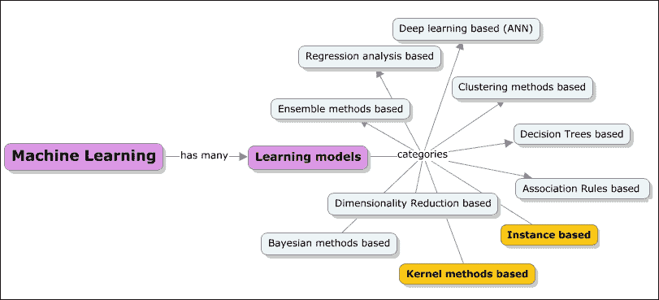

本章节深入探讨了以下主题：

+   基于实例的学习模型

+   基于实例学习的简介

+   懒学习和积极学习

+   简要介绍基于实例学习的不同算法/方法，如最近邻方法、案例推理、局部加权回归和径向基函数

+   深入探讨 KNN（k-最近邻）算法，并附上实际应用案例；加快 KNN 的机制

+   Apache Mahout、R、Apache Spark、Julia 和 Python（scikit-learn）库和模块的示例实现

+   基于核的学习模型

    +   基于核的学习简介

    +   简要介绍基于核的学习技术、支持向量机（SVM）、线性判别分析（LDA）等不同算法/方法

    +   深入探讨 SVM 算法，并附上实际应用案例

# 基于实例的学习（IBL）

基于实例学习的 IBL 技术通过简单地存储提供的训练数据，并将其用作预测/确定新查询行为时的参考。正如在第一章中学习的，*机器学习简介*，实例不过是数据集的子集。基于实例的学习模型在识别的实例或对问题至关重要的实例组上工作。实例之间的结果进行比较，可以包括新数据的一个实例。这种比较使用特定的相似性度量来找到最佳匹配并进行预测。由于它使用存储在内存中的历史数据，这种学习技术也被称为基于内存或基于案例的学习。在这里，重点是实例的表示以及它们之间比较的相似性度量。

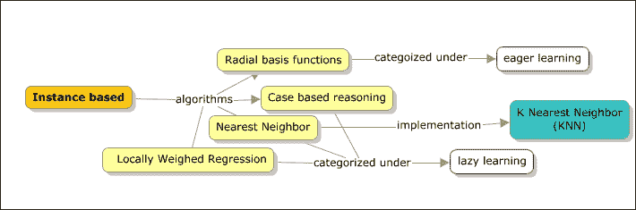

每当接收到一个新的查询实例进行处理时，都会从内存中检索出一组相似的、相关的实例，然后使用这些数据来对新查询实例进行分类。

基于实例的学习者也被称为懒惰学习者。总的来说，整个数据库被用来预测行为。一组被称为**邻居**的数据点被识别出来，它们有与目标属性一致的历史。一旦形成数据点的邻域，邻居的偏好将被结合以产生对活动目标属性的预测或**top-K 推荐**。

这些方法适用于可以用更简单的局部近似表示的复杂目标函数。不幸的是，使用这些方法，对新的实例进行分类的成本总是很高的，在存在维度诅咒的情况下，这些方法可能会留下更大的足迹，因为所有实例的所有属性都被考虑在内。分类器和回归将在本节和即将到来的下一章中介绍。使用分类器，我们试图预测一个类别，而使用回归，我们预测一个实数。我们将首先查看最近邻算法，它可以用于分类和回归问题。

死记硬背学习者是实例化分类器之一，专注于记忆整个训练数据。分类主要是在目标属性值与训练示例中的属性值完全匹配时才进行。另一个分类器是最近邻，它根据最近的邻居进行分类。在下节中，我们将深入探讨最近邻算法。

## 最近邻

在我们开始理解最近邻算法是什么之前，让我们从一个例子开始；以下图表显示了数据点 *X* 和 *Y* 的绘制，它们有两个类别：星星和三角形。我们不必真正担心确切的数据表示或数据点。如果我们必须直观地解决找出那个特定红色方块数据点的问题，那么答案显然是一个绿色三角形。这是一种直觉，而且，在不真正理解或分析数据点的情况下，我们可以得出这个结论。但实际上发生的情况是，我们已经看到了数据点上下文中邻居的特征，并预测了新数据点可能属于的类别。总的来说，学习算法的基础实际上是附近或邻近点的行为。

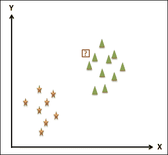

最近邻算法是一种利用直觉基本技术的算法。该算法使用一些将在下文讨论的距离测量技术来找到最近邻。现在让我们扩展到另一个示例数据集；再次，需要一个新的带有问号（?）的数据点来进行分类。

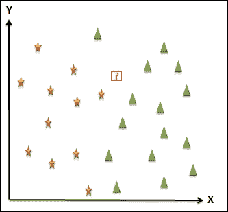

假设新的数据点所属的类别是黄色星号。距离度量的重要方面之一是最近邻永远不会只是一个单独的点，而通常是一个区域。以下图显示了该区域以及所有属于该区域的点都属于黄色星号类别。这个区域被称为**Voronoi 单元**。这个区域通常是具有直线边界的多边形，如果使用的距离度量是**欧几里得**距离度量。

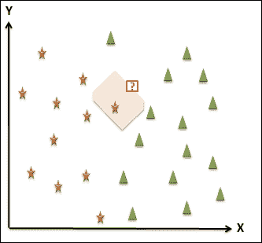

对于每个训练示例，如果计算了 Voronoi 单元，我们可以看到如以下图所示的 Voronoi 网格。这种网格表示空间被划分为非重叠区域，通常每个区域有一个示例。

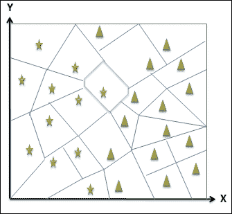

单元的大小由可用示例的数量确定。示例越多，区域的大小就越小。Voronoi 网格的另一个有趣方面是，可以雕刻出边界，形成类别的分隔，如下面的图所示。粗线的右侧属于三角形类别，左侧属于星号类别。

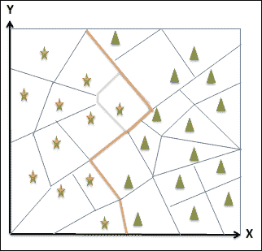

使用最近邻方法的一个主要问题是其对异常值的敏感性，这会真正搞乱边界，解决这个问题的方法之一是考虑多个邻居，这将使模型更加稳定和光滑。因此，考虑 k 个邻居意味着 k-最近邻算法。

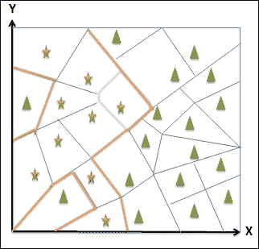

现在我们来看一下 KNN 分类算法是如何工作的：

给定 *{x[i], y[i]}* 训练示例，其中 *x*[i] 表示属性值，*y*[i] 表示类别标签，并且有一个新的测试点 *X* 需要被分类，在 KNN 分类算法中执行以下步骤：

1.  在每个给定的 *x*[i] 值之间计算 *x* 和 *x*[i] 的距离。

1.  选择 k 个最近的邻居 *xi1, … xik* 以及相应的类别标签 *yi1, … yik*。

1.  返回列表 *yi1, … yik* 中出现频率最高的 *y*。

现在我们来看一下 KNN 回归算法在重要差异中的不同之处。与输出一个类别不同，我们将输出实数，如评分或年龄等。算法是相同的，但唯一的区别在于返回值，即第 3 步，我们取 *y's* 的平均值，而不是最频繁的值。

### KNN 中的 k 值

*k* 的值对 KNN 的性能有巨大的影响。如果 *k* 的值太大，KNN 算法会使用前一个值，从而可能导致不准确。在 *k* 值太小的情况下，模型会像前一个章节中看到的那样对异常值过于敏感。因此，准确的 *k* 值通常位于最小值和最大值之间。方法是选择这个范围内的一个值，并在训练数据上测量误差，选择一个给出最佳泛化性能的 *k* 值。

以下图展示了点 *x* 的 1、2 和 3 个最近邻：

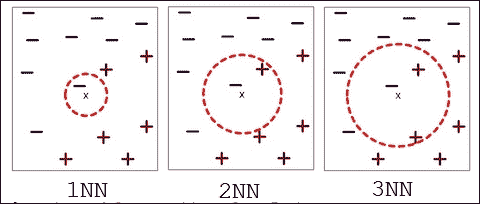

点 *x* 的 k-最近邻是所有与 *x* 距离最小的 k 个数据点。

### KNN 中的距离度量

这是最近邻算法的一个属性，可能是唯一可以实验或尝试替代方法的领域。有许多距离测量选项，在本节中，我们将讨论一些常用的度量。距离度量的主要目的是识别相似或不相似的例子。与 k 值类似，距离度量决定了 KNN 的性能。

#### 欧几里得距离

欧几里得距离是数值属性的默认选项。距离度量公式如下：

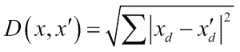

欧几里得距离度量是对称的和球形的，并且对所有的维度都同等对待。这个度量方法的一个缺点是对单个属性中极端值的敏感性。这与均方误差类似。

#### 汉明距离

汉明距离度量是我们需要处理分类属性时的默认选项。汉明距离度量的主要功能是检查两个属性是否相等。当它们相等时，距离为 0，否则为 1；实际上，我们检查两个实例之间的属性数量。汉明距离度量的公式如下：

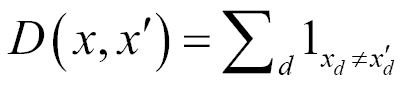

不同的属性在不同的尺度上被测量，因此需要对属性进行归一化。

#### Minkowski 距离

我们现在将探讨*p*-范数距离度量族，它是欧几里得距离度量的推广。这些度量相对比较灵活。

Minkowski 距离公式与欧几里得距离类似，如下所示：

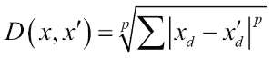

如果 *p=0*，距离度量是汉明度量。

如果 *p=1*，距离度量是曼哈顿度量。

如果 *p=2*，距离度量是欧几里得度量。

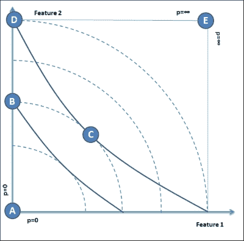

### 基于案例推理（CBR）

CBR 是一种高级基于实例的学习方法，用于更复杂的实例对象。除了拥有固定的过去案例数据库外，CBR 还积累和存储了分类的新数据。像所有其他基于实例的学习方法一样，CBR 通过匹配新案例来寻找相似的过去案例。在这种情况下，应用基于语义网的距离度量进行匹配数据。这是一种不同于欧几里得距离度量等方法的图示匹配方法。

与其他基于实例的学习方法类似，CBR 是一种懒惰学习器，其力量来自于案例的组织和内容。

重复使用过去的案例是人类解决问题和推理方式的关键因素之一。由于 CBR 是基于人类问题解决建模的，因此对人类来说更容易理解。这意味着 CBR 的工作方式可以通过专家或专家咨询来改变。

由于其处理非常复杂实例的能力，CBR 常用于医学诊断，用于检测心脏病、听力缺陷和其他相对复杂的情况。以下图展示了典型的 CBR 学习流程，并被称为 R4 模型。

机器学习中的懒惰学习就是将泛化过程推迟到查询时间，超出训练数据。其优点是现在可以执行并行处理，但缺点是内存需求更高。以下图表展示了一个 CBR 函数的过程流程：

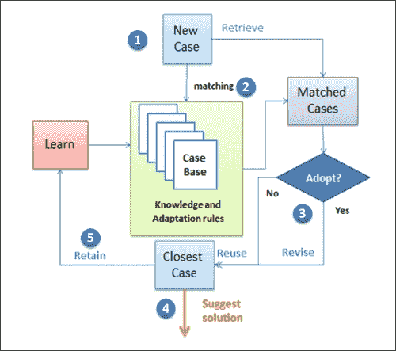

1.  首先，接收到一个新案例。

1.  然后，触发一个匹配过程，将接收到的案例与具有现有案例和已分类案例的案例库进行匹配。这是检索过程。

1.  检查匹配的案例是否完美地符合新案例。

1.  如果是，则重复使用，如果不是，则修改。

1.  输出最终的推荐解决方案。

1.  在以后的某个时间点，基于事实，如果推荐是一致的，保留学习并添加到案例库中。学习阶段也可能向知识库添加规则，这些规则最终的事实建议。

### 本地加权回归（LWR）

LWR 是线性回归的一个特例，由于噪声，数据集不再是线性的，线性回归对训练数据欠拟合。通过为最近邻分配权重来解决非线性问题。分配的权重通常对于需要预测的数据点更接近的数据点更大。

## 实现 KNN

请参考本章提供的源代码以实现 k-Nearest Neighbor 算法（在每个技术文件夹下的`.../chapter6/...`路径下）。

### 使用 Mahout

请参考文件夹`.../mahout/chapter6/knnexample/`。

### 使用 R

请参考文件夹`.../r/chapter6/knnexample/`。

### 使用 Spark

请参考文件夹`.../spark/chapter6/knnexample/`。

### 使用 Python（scikit-learn）

请参考文件夹`.../python scikit learn/ chapter6/knnexample/`。

### 使用 Julia

请参阅文件夹 `.../julia/chapter6/knnexample/`。

# 基于核方法的机器学习

我们刚刚了解了基于实例的学习方法，并深入探讨了最近邻算法及其特定的实现方面。在本节中，我们将探讨核函数以及基于核的机器学习算法。

简单来说，核是一个相似性函数，它被输入到机器学习算法中。它接受两个输入并建议它们有多相似。例如，如果我们面临一个分类图像的任务，输入数据是一个键值对（图像，标签）。因此，在流程方面，图像数据被提取，计算特征，然后将特征向量输入到机器学习算法中。但是，在相似性函数的情况下，我们可以定义一个核函数，它内部计算图像之间的相似性，并将其与图像和标签数据一起输入到学习算法中。这样做的结果是得到一个分类器。

标准的回归或 SVM 或感知器框架使用核函数，并且只使用向量。为了满足这一需求，我们将机器学习算法表示为点积，以便可以使用核函数。

核函数比特征向量更可取。有许多优点；其中一个关键原因在于计算的简便性。此外，与点积相比，特征向量需要更多的存储空间。可以编写机器学习算法来使用点积，并将其映射到使用核函数。这样，就可以完全避免使用特征向量。这将使我们能够轻松地处理高度复杂、计算效率高且性能优异的核函数，而无需真正开发多维向量。

## 核函数

让我们了解核函数究竟是什么；以下图示通过一个简单的 1 维示例来表示 1 维函数。假设给定的点如下：

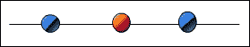

如前所述的一般 1 维超平面将是一条垂直线，没有其他垂直线可以分离数据集。如果我们观察下一个 2 维表示，如所示，有一个超平面（2 维空间中的任意线）将红色和蓝色点分开，因此可以使用 SVM 进行分离。

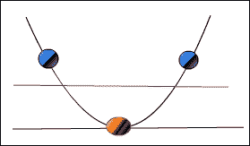

随着维度空间的增长，需要能够分离数据的需求增加。这种映射，*x* -> (*x*, *x2*)，被称为核函数。

在维度空间不断增长的情况下，计算变得更加复杂，**核技巧**需要被应用以廉价地解决这些计算。

## 支持向量机 (SVM)

支持向量机用于解决分类问题。总的来说，作为一个方法，目标是找到一个能够有效划分数据类别表示的超平面。超平面可以定义为二维空间中线的推广和三维空间中平面的推广。现在让我们举一个例子来了解 SVM 如何对线性可分二元数据集起作用。我们将使用与最近邻算法中相同的例子。以下图表表示具有两个特征*X*和*Y*的数据以及可用的类别为三角形和星星。

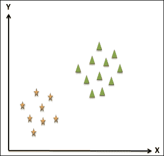

SVM 的目标是找到能够分离这两个类别的超平面。以下图表描绘了一些可以划分数据集的可能超平面。最佳超平面的选择由为两个类别留下的最大边缘程度定义。边缘是超平面与分类中最接近的点之间的距离。

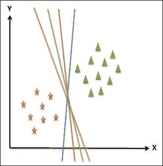

让我们取两个超平面中的两个，并检查由**M1**和**M2**表示的边缘。很明显，边缘**M1** > **M2**，因此选择最佳分离的超平面是新平面，位于绿色和蓝色平面之间。

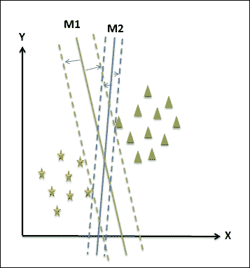

新的平面可以用线性方程表示为：

f(x) = ax + b

假设这个方程给出了三角形类别的所有≥1 的值，对于星星类别，≤-1。这个平面与两个类别中最接近的点的距离至少为 1；模长为 1。

对于三角形，*f(x) ≥ 1*，对于星星，*f(x) ≤ 1*或*|f(x)| = 1*。

使用以下公式可以计算超平面与点之间的距离。

M1 = |f(x)| / ||a|| = 1 / ||a||

总边缘是*1 / ||a|| + 1 / ||a|| = 2 / ||a|*。

为了最大化可分性，这是 SVM 的目标，我们需要最大化*||a||*值。这个值被称为权重向量。最小化*a*权重值的过程是一个非线性优化任务。一种方法是使用**Karush-Kuhn-Tucker**（**KKT**）条件，使用拉格朗日乘子*λ*[i]。

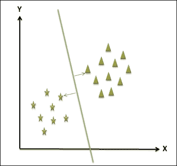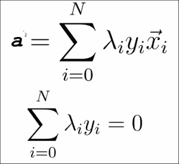

让我们取两个属性*X*和*Y*之间的两个点的例子。我们需要找到一个点，这个点在这两个点之间具有最大的距离。这个要求在下面的图中表示。最优点用红色圆圈表示。

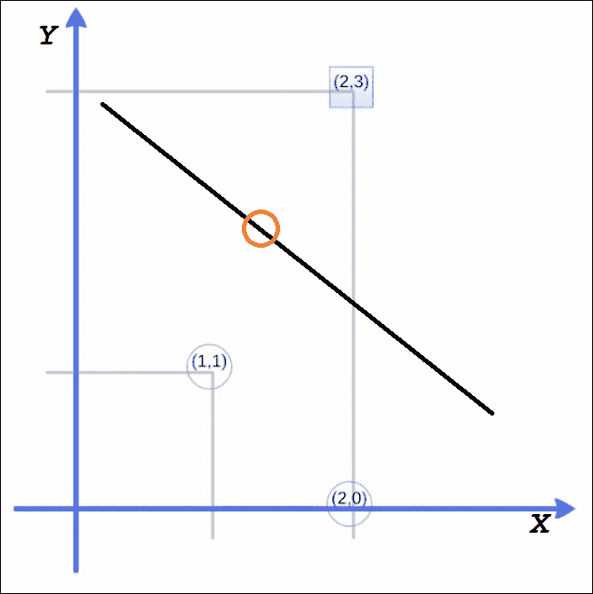

最大边缘权重向量与从*(1, 1)*到*(2, 3)*的线平行。权重向量在*(1,2)*，这成为一条决策边界，位于中间，垂直于通过*(1.5, 2)*的线。

因此，*y = x1 +2x2 − 5.5*，几何边缘计算为*√5*。

计算 SVM 的步骤如下：

对于 *w = (a, 2a)*，其中 *a* 是点 (1,1) 和 (2,3) 的函数，可以表示如下：

对于点 (1,1)，有 a + 2a + ω[0] = -1

对于点 (2,3)，有 2a + 6a + ω[0] = 1

权重可以按以下方式计算：

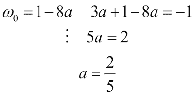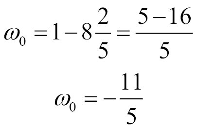

这些是支持向量：

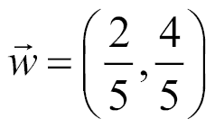

最后，最终的方程如下：

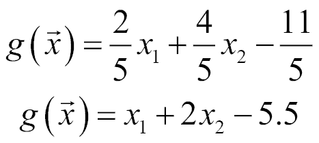

### 不可分数据

SVMs 可能能帮助你找到存在的分离超平面。可能存在无法定义超平面的情况，这可能是由于数据中的噪声引起的。实际上，另一个原因可能是非线性边界。下面的第一个图表展示了噪声，第二个图表展示了非线性边界。

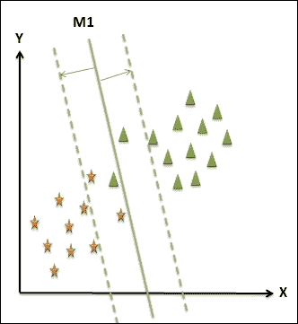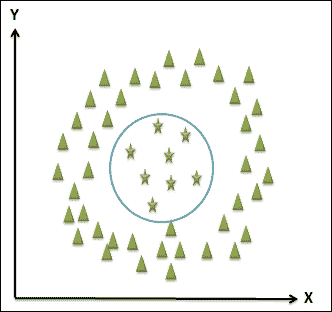

在数据噪声引起的问题的情况下，最好的方法是减少边际并引入松弛。

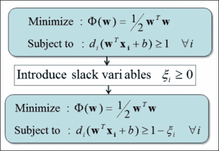

通过引入核函数可以解决非线性边界问题。以下图表展示了可以引入的一些核函数：

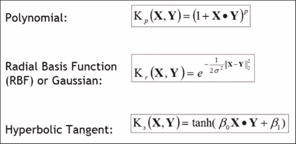

## 实现 SVM

请参考本章提供的源代码以实现 SVM 算法（源代码路径为 `.../chapter6/...`，位于每个技术文件夹下）。

### 使用 Mahout

请参考文件夹 `.../mahout/chapter6/svmexample/`。

### 使用 R

请参考文件夹 `.../r/chapter6/svmexample/`。

### 使用 Spark

请参考文件夹 `.../spark/chapter6/svmexample/`。

### 使用 Python (Scikit-learn)

请参考文件夹 `.../python-scikit-learn/chapter6/svmexample/`。

### 使用 Julia

请参考文件夹 `.../julia/chapter6/svmexample/`。

# 摘要

在本章中，我们探讨了两种学习算法，基于实例和核方法，并看到了它们如何解决分类和预测需求。在基于实例的学习方法中，我们详细探讨了最近邻算法，并看到了如何使用我们的技术栈 Mahout、Spark、R、Julia 和 Python 来实现它。同样，在基于核的方法中，我们探讨了 SVM。在下一章中，我们将介绍基于关联规则的学习方法，重点关注 Apriori 和 FP-growth 算法。
