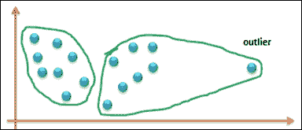

# 第八章 基于聚类的学习

在本章中，我们将介绍基于聚类的学习方法，特别是 k-means 聚类算法等。基于聚类的学习是一种无监督学习技术，因此无需对目标属性有具体的定义。您将学习该技术的基礎和高级概念，并获得使用 Apache Mahout、R、Julia、Apache Spark 和 Python 实现 k-means 聚类算法的实践指导。

以下图表展示了本书中涵盖的不同学习模型，以及用橙色突出显示的技术将在本章中详细讨论：

下面的主题将在本章中深入探讨：

+   基于聚类的学习方法的核心原则和目标

+   如何表示簇和理解所需的距离测量技术

+   深入学习 k-means 聚类、选择合适的聚类算法和簇评估规则。更重要的是，选择合适的簇数量。

+   层次聚类的概述、数据标准化、发现空洞和数据区域。

+   使用 Apache Mahout、R、Apache Spark、Julia 和 Python（scikit-learn）库和模块的示例实现。

# 基于聚类的学习

基于聚类的学习方法被识别为一种无监督学习任务，其中学习从没有特定目标属性开始，数据被探索以寻找其中的内在结构。

以下图表展示了本章将要介绍的基于聚类的学习方法范围：

聚类技术的首要目标是找到数据中的相似或同质群体，这些群体被称为**簇**。这样做的方式是——相似或简而言之，彼此靠近的数据实例被分组到一个簇中，而不同的实例被分组到不同的簇中。以下图表展示了图表上的数据点，以及簇是如何被标记的（在这里，是通过纯粹直觉）由三个自然簇：

因此，簇可以被定义为包含彼此相似且与其他簇中的对象不同的对象的集合。以下图表展示了聚类过程：

聚类的简单示例可以如下：

+   衬衫根据尺寸分为小号（S）、中号（M）、大号（L）、加大号（XL）等。

+   目标营销：根据客户的相似性对客户进行分组

+   文本文档的分组：这里的要求是组织文档，并基于它们的内容相似性构建主题层次结构

实际上，聚类技术在许多领域都有非常广泛的应用，例如考古学、生物学、市场营销、保险、图书馆、金融服务以及许多其他领域。

# 聚类类型

聚类分析主要关注的是在给定数据的情况下，可以用来自动找到聚类的算法。主要有两类聚类算法；如下所示：

+   层次聚类算法

+   划分聚类算法

层次聚类算法定义了具有层次结构的聚类，而划分聚类算法定义了将数据集划分为互斥分区的聚类。

## 层次聚类

层次聚类是关于定义具有层次结构的聚类，这可以通过迭代地将较小的聚类合并成较大的聚类，或者将较大的聚类划分为较小的聚类来实现。由聚类算法产生的这种聚类层次结构被称为**树状图**。树状图是表示层次聚类的一种方式，用户可以根据树状图定义的级别实现不同的聚类。它使用一个相似度尺度，表示从较大的聚类中分组出来的聚类之间的距离。以下图展示了层次聚类的树状图表示：

存在另一种表示层次聚类的简单方法；那就是维恩图。在这种表示中，我们圈出属于聚类的数据点。以下图展示了五个数据点的维恩图表示：

层次聚类中有两种聚类算法：聚合聚类算法和划分聚类算法。

聚合聚类算法采用自底向上的方法，将一组聚类合并成一个更大的聚类。划分聚类算法采用自顶向下的方法，将一个聚类划分为子聚类。确定哪个聚类将被考虑合并或划分，是通过贪婪方法决定的，距离测量在这里变得至关重要。让我们快速回顾一下第六章中的实例学习方法，*基于实例和核方法的学习*。我们已经介绍了欧几里得距离、曼哈顿距离和余弦相似度作为数值数据中最常用的相似性度量，以及汉明距离用于非数值数据。对于层次聚类，实际上不需要实际数据点，只需要距离度量矩阵就足够了，因为分组是基于距离进行的。

层次聚类算法的步骤可以定义为如下：

1.  从如下聚类开始，例如 *S1={X1}, S2={X2} … Sm= {Xm}*。

1.  找到一组最近的聚类并将它们合并成一个单独的聚类。

1.  重复步骤 2，直到形成的聚类数量等于定义的数量。

## 划分聚类

与层次聚类算法相比，划分聚类算法不同，因为聚类或分区是通过使用特定预定义的标准来生成和评估的，该标准是特定领域的。由于每个形成的聚类都是互斥的，因此聚类之间永远不会存在层次关系。实际上，每个实例都可以放置在仅有的一个*k*个聚类中。要形成的聚类数量（*k*）作为输入输入到该算法中，这组*k*个聚类是划分聚类算法的输出。在本章中我们将要介绍的最常用的划分聚类算法之一是 k-means 聚类算法。

在我们深入探讨 k-means 聚类算法之前，让我们在这里快速定义一下。输入为*k*，表示期望的聚类数量，将定义*k*个中心或质心，这将有助于定义*k*个分区。基于这些中心（质心），算法识别成员并因此构建一个分区，然后根据识别的成员重新计算新的中心。这个过程会迭代进行，直到暴露出清晰且最优的不相似度，使分区真正独特。因此，质心的准确性是分区聚类算法成功的关键。以下是在基于质心的划分聚类算法中涉及到的步骤：

输入：*k*（聚类数量）和*d*（包含*n*个对象的数据库）

输出：一组*k*个聚类，这些聚类将所有对象到识别的中位数（质心）的不相似度之和最小化。

1.  识别*k*个对象作为第一组质心。

1.  将剩余的最近质心的对象分配到聚类中。

1.  随机选择一个非质心对象，并重新计算将进行交换以形成新的质心集的总点数，直到不再需要交换。

层次聚类和划分聚类技术在许多方面本质上存在关键差异，其中一些包括一些基本假设；执行时间假设、输入参数和结果聚类。通常，划分聚类比层次聚类更快。虽然层次聚类可以仅使用相似度度量进行工作，但划分聚类需要指定聚类数量以及初始中心的相关细节。与划分聚类结果产生的精确且精确的“k”聚类相比，层次聚类技术的聚类定义更为主观。

### 小贴士

聚类的质量取决于选择的算法、距离函数和应用。当簇间距离最大化，簇内距离最小化时，簇质量被认为是最佳的。

# k-means 聚类分析算法

在本节中，我们将深入探讨 k-means 聚类分析算法。k-means 是一种划分聚类算法。

设数据点集（或实例）如下：

*D = {x*[1]*, x*[2]*, …, x*[n]*}*, 其中

*xi = (xi*[1]*, xi*[2]*, …, xi*[r]*)* 是实值空间 *X ⊆ R*[r,] 中的一个向量，且 *r* 是数据中的属性数量。

k-means 算法将给定的数据划分为 *k* 个簇，每个簇都有一个称为中心点的中心。

*k* 由用户指定。

给定 *k*，k-means 算法的工作原理如下：

算法 k-means (*k*, *D*)

1.  识别 *k* 个数据点作为初始中心点（簇中心）。

1.  重复步骤 1。

1.  对于每个数据点 *x ϵ D* 执行以下操作。

1.  计算数据点 *x* 到中心点的距离。

1.  将 *x* 分配到最近的中心点（中心点代表一个簇）。

1.  endfor

1.  使用当前的簇成员资格重新计算中心点，直到满足停止标准。

## k-means 聚类分析的收敛或停止标准

以下列表描述了 k-means 聚类分析算法的收敛标准：

+   数据点重新分配到不同簇的数量为零或最小

+   中心点的变化为零或最小

+   否则，预测平方误差和（**SSE**）的减少是最小的

如果 *C[j]* 是第 *j* 个簇，那么 *m*[j] 是簇 *C*[j] 的中心点（*C*[j] 中所有数据点的均值向量），如果 *dist(x, m*[j]*)* 是数据点 *x* 和中心点 *m*[j]* 之间的距离，那么以下使用图形表示的示例说明了收敛标准。

例如：

1.  随机识别 k 个中心点：

1.  迭代 1：计算中心点并分配簇：

1.  迭代 2：重新计算中心点并重新分配簇：

1.  迭代 3：重新计算中心点并重新分配簇：

1.  由于中心点或簇重新分配的最小变化而终止过程。

### 磁盘上的 k-means 聚类分析

K-means 聚类算法也可以在磁盘上的数据上实现。这种方法用于无法容纳在内存中的大型数据集。这里使用的策略是通过对数据集进行一次扫描来增量计算质心。该算法的性能取决于迭代次数的控制程度。建议运行少于 50 次的有限迭代次数。尽管这个版本有助于扩展，但它并不是扩展的最佳算法；还有其他可扩展的聚类算法，例如，BIRCH 就是其中之一。以下算法描述了磁盘上 k-means 算法的步骤：

磁盘 k-means 算法 (*k*, *D*)

1.  选择 *k* 个数据点作为初始质心（聚类中心） *m*[j]，其中 *j = 1,2,3….k*。

1.  重复

1.  初始化 *s*[j]*=0*，其中 *j=1,2,3….k*；（一个所有值都为零的向量）。

1.  初始化 *n*[j]*=0*，其中 *j=1,2,3….k*；（n[j] 是聚类中的点数），

1.  对于每个数据点 *x ϵ D* 进行。

1.  *j = arg min dist(x, m*[j]*)*。

1.  将 *x* 分配到聚类 *j*。

1.  *s*[j] *= s*[j] *+ x*。

1.  *n*[j] *= n*[j] *+ 1*。

1.  endfor.

1.  *m*[i] *= s*[j]*/n*[j]，其中 *i=1,2,…k*。

1.  直到满足停止条件。

## k-means 方法的优点

无监督学习的 k-means 方法有许多好处；其中一些如下：

+   由于其简单性和易于实现，k-means 聚类在流行和广泛采用。

它是高效的，并且具有由 *O*(*ikn*) 定义的优化的时间复杂度，其中 *n* 是数据点的数量，*k* 是聚类的数量，*i* 是迭代的数量。由于 *l* 和 *k* 的值保持较小，k-means 聚类也可以表示线性表达式。

## k-means 算法的缺点

以下 k-means 算法的缺点或劣势：

+   *k* 的值始终是用户输入的，并且与识别出的 *k* 数值相同。

+   此算法仅适用于均值可用时，在分类数据的情况下，质心不过是频繁值。

+   聚类永远不会是椭圆形的，总是超球形的。

+   识别出的聚类对最初识别的种子非常敏感，当涉及不同的随机种子多次运行时可能会有所不同。以下图展示了两个不同的质心如何改变聚类。这可以通过迭代处理实现：

+   再次强调，k-means 算法对异常值非常敏感。异常值可能是数据记录中的错误，或者是具有非常不同值的特殊数据点。以下图表展示了异常值可能对簇形成带来的偏斜：第一个表示理想簇，第二个表示不理想的簇：

我们至今所见到的许多算法和学习技术都对异常值敏感。有一些标准技术可以被采用。

一种方法是从评估中过滤掉异常值，这需要我们应用一些技术来处理数据中的噪声。噪声减少技术将在下一章中介绍。在 k-means 聚类的情况下，可以在几次迭代后删除异常值，以确保确定的数据点确实是异常值。或者，另一种方法是坚持使用较小的数据样本来运行算法。这样，选择异常值的可能性将最小。

## 距离度量

距离度量在聚类算法中非常重要。重新分配数据点到簇中是由重新定义质心来决定的。以下是一些测量两个簇之间距离的方法：

+   **单链**: 这种方法指的是测量属于两个不同簇的两个最近数据点之间的距离。数据中可能存在噪声，这也应被认真考虑。

+   **完全链**: 这种方法指的是测量属于两个不同簇的两个最远数据点之间的距离。这种方法可以使簇对异常值更加敏感。

+   **平均链**: 这种方法使用两个簇之间所有距离对的平均距离度量。

+   **质心**: 这种方法指的是通过测量两个簇之间的质心距离来测量两个簇之间的距离。

## 复杂度度量

选择最佳的聚类算法一直是一个挑战。有许多算法可供选择，并且准确性和复杂性度量在选择正确的算法时都很重要。单链方法可以帮助实现 *O(n²)*；完全链接和平均链接可以在 *O(n²logn)* 内完成。每种算法都有其优点和局限性，它们在数据分布的某些上下文中表现良好；数据分布中没有标准模式使得解决这个问题变得复杂。因此，数据准备和标准化成为机器学习中的一个重要方面。哪种距离度量是一个理想的选择，只能通过迭代实现不同的距离度量，并比较迭代结果来确定。总体而言，聚类方法高度依赖于初始选择，并且可能具有主观性。

# 实现 k-means 聚类

请参考本章提供的源代码以实现 k-means 聚类方法（仅监督学习技术 - 每个技术文件夹下的源代码路径为`.../chapter08/...`）。

## 使用 Mahout

请参考文件夹`.../mahout/chapter8/k-meansexample/`。

## 使用 R

请参考文件夹`.../r/chapter8/k-meansexample/`。

## 使用 Spark

请参考文件夹`.../spark/chapter8/k-meansexample/`。

## 使用 Python（scikit-learn）

请参考文件夹`.../python-scikit-learn/chapter8/k-meansexample/`。

## 使用 Julia

请参考文件夹`.../julia/chapter8/k-meansexample/`。

# 摘要

在本章中，我们介绍了基于聚类的学习方法。我们通过一个示例深入探讨了 k-means 聚类算法。你已经学会了使用 Mahout、R、Python、Julia 和 Spark 实现 k-means 聚类。在下一章中，我们将介绍贝叶斯方法，特别是朴素贝叶斯算法。
