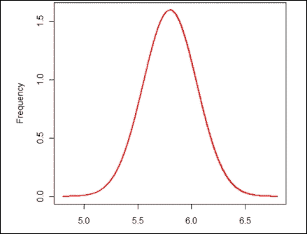

# 第九章 贝叶斯学习

在本章中，我们将回顾一个重要的基于统计的学习方法，称为贝叶斯学习方法，特别是其中的朴素贝叶斯算法等。统计模型通常具有一个明确的概率模型，它揭示了实例属于特定类别的概率，而不仅仅是分类，在解决分类问题时。在深入探讨贝叶斯学习之前，你将学习一些统计学中的重要概念，如概率分布和贝叶斯定理，这是贝叶斯学习的核心。

贝叶斯学习是一种监督学习技术，其目标是构建一个具有明确目标属性定义的类别标签分布模型。朴素贝叶斯基于应用贝叶斯定理，并假设每个特征对之间都是**朴素**的独立性。

你将学习该技术的基本和高级概念，并获得使用 Apache Mahout、R、Julia、Apache Spark 和 Python 实现均值聚类算法的实践指导。

以下图展示了本书中涵盖的不同学习模型，本章将详细处理突出显示的技术：

本章将深入探讨以下主题：

+   贝叶斯统计概述及其核心原理或概念，如概率、分布以及其他相关统计度量

+   贝叶斯定理及其机制

+   深入探讨朴素贝叶斯算法及其变体，如多项式和伯努利分类器

+   对贝叶斯学习技术可以解决的某些现实世界问题或用例的详细解释

+   使用 Apache Mahout、R、Apache Spark、Julia 和 Python（scikit-learn）库和模块的示例实现

# 贝叶斯学习

在监督学习技术中，归类于统计方法的模型包括基于实例的学习方法和贝叶斯学习方法。在我们理解贝叶斯学习方法之前，我们将首先概述与机器学习相关的概率建模和贝叶斯统计概念。统计学的基本概念非常深入，接下来几节将主要关注为你提供概率机器学习动态和多样性的基本理解，这对于解释贝叶斯学习方法的运作是足够的。

## 统计学家的思维方式

统计学家的目标是使用数据回答来自各个领域的人们提出的问题。典型的工程方法使用一些主观/客观的方法来回答问题，而这些方法不需要数据。但是，统计学家总是查看数据来回答问题。他们还在所有模型中纳入了可变性（在两个不同时间对精确数量进行测量的概率略有不同）。

让我们举一个例子：*M.F. 胡赛因是一位优秀的画家吗？* 回答这个问题的方法之一是根据某些被接受的标准（由个人或社区制定）来衡量画作的质量。在这种情况下，答案可能基于创造性表达、色彩运用、形式和形状。*我相信 M.F. 胡赛因是一位优秀的画家。* 在这种情况下，这种回应可以相当主观（这意味着你从一个人那里得到的回应可能与从另一个人那里得到的回应大相径庭）。统计学家回答这个问题的方法非常不同。他们首先从被认为在评估画作质量方面是专家的人群中收集数据（艺术大学的教授、其他艺术家、艺术收藏家等）。然后，在分析数据后，他们会得出结论，例如：“在 3000 名调查参与者（每个类别的人数相等）的数据中，75%的艺术大学教授、83%的专业艺术家和 96%的艺术收藏家认为 M.F. 胡赛因先生是一位优秀的画家”。因此，可以说他被认为是大多数人眼中的优秀画家。非常明显，这是一个非常客观的衡量标准。

### 重要的术语和定义

以下是一些用于评估和理解数据的必要参数和概念。在某些情况下，它们被解释为定义，在其他情况下则用例子和公式解释。它们被归类为“词汇”和“统计量”。你将在本章的下一部分遇到一些这些术语：

| 术语 | 定义 |
| --- | --- |
| **总体** | 这是数据的宇宙。通常，统计学家想要对一组对象（印度人、星系、国家等）做出预测。该组的所有成员被称为总体。 |

| **样本** | 大多数时候，对整个群体进行工作是不切实际的。因此，统计学家从群体中收集一个代表性的样本，并在其上进行所有计算。用于分析的群体子集被称为**样本**。与群体或人口普查相比，编制样本总是更便宜。收集样本有几种技术：

+   **分层抽样**：这被定义为在抽样之前将总体成员划分为同质子组的流程。每个子组应该是相互排斥的，并且总体中的每个元素都应该分配到一个子组。

+   **聚类抽样**：这种方法确保 n 个独特的集群，其中每个集群的元素没有重复。

|

| **样本大小** | 这是一个每个统计学家都曾遇到的明显困境。样本的大小应该是多大？样本越大，准确性就越高。然而，收集和分析的成本也会相应增加。因此，挑战在于找到一个最佳样本大小，这样结果准确，成本较低。 |
| --- | --- |
| **抽样偏差** | 偏差是一种系统性的错误，以某种方式影响结果。抽样偏差是由于样本选择而产生的持续错误。 |
| **变量** | 它是样本或人口的一个测量指标。如果我们正在取一个班级的所有成员，那么他们的年龄、学术背景、性别、身高等等，就变成了变量。一些变量是独立的。这意味着它们不依赖于任何其他变量。一些是相关的。 |
| **随机性** | 如果一个事件在发生之前其结果是不确定的，那么这个事件被称为随机事件。一个随机事件的例子是明天下午 1 点黄金价格的值。 |
| **均值** | 它等于样本中所有值的总和除以样本中观察值的总数。 |
| **中位数** | 中位数是数据集最低值和最高值之间的中间值。这也称为第二四分位数（表示为 Q2）= 切割数据集一半 = 50^(th) 百分位数。如果没有确切的中间值（即样本中的观察值是偶数），则中位数是中间两个点的平均值。 |
| **众数** | 这是变量出现频率最高的值。数据可以是单峰（单众数），或多峰（频繁的多个值）。如果数据遵循正态分布（关于这一点你将在以后学习），则使用经验公式获得众数：*均值 – 众数 = 3 x (均值 - 中位数)* |
| **标准差** | 它是衡量样本中每个测量值与平均值偏离程度的一个平均值。标准差也称为平均标准差。 |

### 概率

在我们开始理解概率之前，让我们首先看看为什么我们首先需要考虑不确定性。任何现实生活中的行动总是与结果或结果的不确定性相关联。让我们举一些例子；我今天能否准时赶上火车？我们最畅销产品的销量在本季度是否将继续保持领先地位？如果我掷硬币，我会得到正面还是反面？我能否在*t*分钟内到达机场？

可能存在许多不确定性的来源：

+   由于缺乏知识导致的不确定性，这是由于数据不足、分析不完整和不准确的测量结果

+   否则，不确定性也可能由于复杂性，这是由于不完整处理条件的结果

在现实世界中，我们需要使用概率和不确定性来总结我们缺乏知识和预测结果的能力。

让我们详细说明上一个例子。

我能在 25 分钟内到达机场吗？可能会有很多问题，比如对道路状况的不完整观察、嘈杂的传感器（交通报告），或者行动的不确定性，比如轮胎没气或交通模型复杂。为了预测结果，肯定需要做出一些假设，并且我们需要以原则性的方式处理不确定性；这被称为**概率**。简而言之，概率是随机性和不确定性的研究。

在概率论中，实验是可以重复进行并且结果具有不确定性的。实验的单个结果被称为单个事件，事件是一系列结果的集合。**样本空间**概率是实验所有可能结果的列表。

事件 *E* 的概率表示为 *P(E)*，定义为该事件发生的可能性。

### 备注

事件 P(E)的概率 = 事件发生的方式数 / 可能的结果数

例如，对于掷硬币，有两种可能性：正面或反面。

正面朝上的概率是 *P(H) = ½ = 0.5*

当掷骰子时，有六种可能性，即 1、2、3、4、5 和 6。

数字 1 的概率是 *P(1) = 1/6 = 0.16667*

投掷任何事件 *E* 的概率 *P(E)* 必须在 *0* 和 *1* 之间（包括两端）。

0 ≤ P(E) ≤ 1

概率为 *0* 表示事件不可能发生，而概率为 *1* 表示事件必然发生。如果有 *n* 个事件，那么每个事件概率的总和为 *1*。这可以表示为：

如果 *S = {e1, e2, ….en}*，那么 *P(e1) +P(e2)+…P(en) = 1*

确定概率的方法有很多：

+   **经典方法**：这是我们之前章节中用来定义概率的方法。这种方法要求结果等可能。因此，如果一个实验有等可能的 *n* 个事件，并且有 *m* 种可能性，那么事件 *E* 就可以发生。

    P(E) = 事件 E 发生的方式数 / 可能的结果数 = m/n。

    例如，一个装有巧克力的袋子里有五块棕色包装的巧克力，六块黄色包装的巧克力，两块红色包装的巧克力，八块橙色包装的巧克力，两块蓝色包装的巧克力和七块绿色包装的巧克力。假设随机选择一块巧克力。巧克力是棕色的概率是多少？

    *P (B) = 5/30*

+   **经验方法**：概率计算的经验方法也称为相对频率，因为这个公式需要实验重复的次数。这种方法定义了事件 E 的概率，即事件在实验重复的总次数中被观察到的次数。在这种情况下，计算概率的基础是观察或经验。

    P(E) = 实验中 E 的频率 / 实验次数。

    例如，我们想要计算研究生选择医学作为主修的概率。我们选取，比如说，200 名学生的样本，其中 55 人选择医学作为主修，那么：

    *P(有人选择医学) = 55/200 = 0.275*

+   **主观方法**：这种方法使用一些公平的、计算出的或基于经验的假设。它通常描述了个人对事件发生的可能性的感知。这意味着个人的信念程度被考虑在内，因此可能会存在偏见。例如，有 40%的可能性物理教授不会来上课。

#### 事件类型

事件可以是互斥的、独立的或相关的。

##### 互斥或不相交事件

互斥事件是指不能同时发生的事件。简而言之，两个事件同时发生的概率是*0*。*P(1)*和*P(5)*。当掷骰子时，存在互斥事件。互斥事件的维恩图表示如下：

对于互斥事件 A 和 B，加法规则是：

P(A 或 B) = P(A) + P(B)

对于互斥事件 A 和 B，乘法规则是：

P(A 和 B) = P(A) x P(B)

##### 独立事件

如果一个事件的结果不影响另一个事件的结果，这两个事件被称为独立事件。例如，事件 A 是周日下雨，事件 B 是汽车轮胎没气。这两个事件不相关，一个事件发生的概率不会影响另一个。独立事件可以是互斥的，但反之则不然。

在事件 A 和 B 独立的情况下，乘法规则是：

P(A 和 B) = P(A) x P(B)

##### 相关事件

相关事件是指一个事件的发生可以影响另一个事件的发生。例如，一个将英语作为第一专业的学生可以选择政治学作为第二专业。相关事件的维恩图表示如下：

事件 A 和 B 的加法规则是：

P(A 或 B) = P(A) + P(B) – P(A 和 B)

事件 A 和 B 的乘法规则是：

P(A 和 B) = P(A) x P(B)

### 概率的类型

在本节中，我们将探讨不同类型的概率，具体如下：

+   **先验概率和后验概率**：先验概率是在没有任何先验信息或对问题背景中任何假设的了解的情况下，事件 E 发生的概率。

    让我们举一个例子。如果你的朋友正在乘飞机旅行，有人问你他们的邻居是男性还是女性，根据概率的基础公式，有 0.5（50%）的概率是男性，有 0.5（50%）的概率是女性。当提供更多信息时，这些值可能会改变，那时测量的概率被称为后验概率。

+   **条件概率**：条件概率是指给定另一个事件已经发生的情况下，一个事件发生的概率。*P(B|A)* 被解释为在事件 A 发生的条件下，事件 B 的概率。

    例如，让我们计算一个人在马路上行走时被汽车撞到的概率。设 *H* 为一个离散随机变量，描述一个人被汽车撞到的概率，将撞击定义为 1，不撞击定义为 0。

    设 *L* 为一个离散随机变量，描述在某一时刻交叉交通信号灯的状态，取值于 *{red, yellow, green}*：

    *P(L=red) = 0.7,*

    *P(L=yellow) = 0.1,*

    *P(L=green) = 0.2.*

    *P(H=1|L=R) = 0.99,*

    *P(H|L=Y) = 0.9 and*

    *P(H|L=G) = 0.2.*

    使用条件概率公式，我们得到以下结果：

    *P(H=1 and L=R) = P(L=R)*P(H|L=R) = 0.693;*

    *P(H=1 and L=Y) = 0.1*0.9 = 0.09*

    同样，如果红灯亮时的撞击概率是 0.99，那么不被撞击的概率是 0.01。因此，*P(H=0|L=R) = 0.01*。从这些中，我们可以计算出 *H=0* 和 *L=R* 的概率。

+   **联合概率**：联合概率是两个或更多事件同时发生的概率。在两个变量的情况下，*f(x,y|θ)* 是联合概率分布，其中 *f* 是在给定分布参数—*θ* 的情况下，*x* 和 *y* 作为一对同时发生的概率。对于离散随机变量，联合概率质量函数如下：

    P(X and Y) = P(X).P(Y|X) =P(Y).P(X|Y)

    你在学习条件概率时已经看到了这一点。由于这些都是概率，所以我们有以下公式：

    

+   **边缘概率**：边缘概率用 *f(x|θ)* 表示，其中 *f* 是在给定分布参数—*θ* 的情况下，对于所有可能的 *y* 值，*x* 的概率密度。在随机分布中，边缘概率是通过对所有 *y* 的值求和从 *x* 和 *y* 的联合分布中确定的。在连续分布中，它通过对所有 *y* 的值进行积分来确定。这被称为**积分消去**变量 *y*。对于离散随机变量，边缘概率质量函数可以写成 *P(X = x)*。如下所示：

    从上述方程中，*P(X = x,Y = y)* 是 *X* 和 *Y* 的联合分布，而 *P(X = x|Y = y)* 是在 *Y* 的条件下的 *X* 的条件分布。变量 *Y* 被边缘化。这些离散随机变量的双变量边缘和联合概率通常以双向表的形式显示（如图所示）。我们将在下一节中展示计算过程。

    例如，假设掷两个骰子，记录得分序列 *(X1, X2)*。令 *Y=X1+X2* 和 *Z=X1−X2* 分别表示得分的和与差。找出 *(Y, Z)* 的概率密度函数。找出 *Y* 的概率密度函数。找出 *Z* 的概率密度函数。*Y* 和 *Z* 是否独立？

    假设 *X1* 和 *X2* 是独立的，它们可以取 36 种可能性，如表中所示：

    

现在我们构建联合、边缘和条件表。在这个表中，我们将有 *Z* 的值作为行，*Y* 的值作为列。*Y* 的值从 2 到 12，*Z* 的值从-5 到 5。我们可以通过计数来填充所有条件分布。例如，取 *Z=-1*；我们看到这种情况发生在 *Y=3, 5, 7, 9, 11*。我们还注意到，每个值（比如说，给定 *Y=3* 时 *Z=-1* 的条件概率）的概率是 *1/36*。我们可以用这种方法为所有值填充表格：

因此，最后一行是 *Y* 的边缘分布。最右侧的列是 *Z* 的边缘分布。整个表是联合分布。显然，它们是相关的。

### 分布

分布要么是离散概率分布，要么是连续概率分布，这取决于它们是否定义与离散变量或连续变量相关的概率：

我们将在这里介绍一些之前提到的分布。

在本节中，我们主要关注建模和描述数据的一个给定属性。为了了解这项技能的重要性，让我们看看几个例子：

+   一家银行想要查看在一段时间内自动取款机（ATM）每笔交易中取款的金额，以确定交易的限额

+   一家零售商想要了解他在每次装运中得到的损坏玩具的数量

+   一家制造商想要了解探针直径在各个制造周期之间的变化情况

+   一家制药公司想要了解其新药如何影响数百万患者的血压

在所有这些情况下，我们需要提出一些精确的定量描述，以了解观察到的数量是如何变化的。本节就是关于这个内容的。无论如何，直观上，你认为你想要测量哪些质量来获得理解？

+   一个给定变量所取的所有值是什么？

+   取一个特定值的概率是多少？哪些值的概率最高？

+   平均值/中位数是多少？方差是多少？

+   给定一个值，我们能否知道有多少观测值落入其中，有多少观测值偏离它？

+   我们能否给出一个范围，其中我们可以告诉 90%的数据位于其中？

实际上，如果我们能回答这些问题，更重要的是如果我们开发了一种描述此类量的技术，那么在考虑这个属性时，我们几乎是无敌的！

这里有两个主要观察结果。首先，一个属性以这种方式分布，具有成为随机变量的所有品质（知道一个量的值并不能帮助我们了解下一个值）。然后，如果我们知道这个随机变量的概率质量函数或分布函数，我们可以计算出所有之前的事情。这就是为什么理解数学如此重要的原因。一般来说，我们遵循（就这一点而言，几乎任何对分析后续数据感兴趣的人）一个描述量的系统过程：

1.  我们首先理解随机变量。

1.  接下来，我们将计算概率质量（或分布）函数。

1.  然后，我们将预测所有重要的参数（平均值和方差）。

1.  然后，我们将通过实验数据来检查我们的近似值有多好。

例如，在 50 天期间，汽车租赁代理机构所要求的租赁货车数量已在下表中识别。表中最后一列已将观察到的频率转换为这 50 天的概率：

预期值是 5.66 辆货车，如上图所示：

类似地，方差计算如下：

标准差是方差的平方根，等于 1.32 辆货车。让我们系统地分析各种分布。

### 二项分布

这是最简单的分布，人们可以想到的。很多时候，一个属性只取离散值；比如抛硬币、掷骰子、人的性别等等。即使它们不是完全离散的，我们也可以通过分箱在某些情况下将它们转换。例如，当我们观察个人的净资产时，我们可以根据他们确切的财富重新划分他们为富有和贫穷（**离散量**），而财富是连续量。假设该属性取特定值的概率是 *p*（当然，它不取该值的概率是 *(1-p)*）。如果我们收集足够大的样本，那么数据集看起来会怎样？好吧，将会有一些正值（变量取了该值）和负值（变量没有取该值）。假设我们用 1 表示正值，用 0 表示负值。

然后，我们有以下内容：

平均值 = 概率的加权平均值 = 1*p +0*(1-p) = p

### 二项分布

这是伯努利思想的扩展。让我们举一个具体的例子。你在一个人口统计局工作，并拥有一个州内所有家庭的数据。假设你想要确定有两个孩子的家庭中有两个男孩的概率。正如你所看到的，一个家庭有两种孩子只有四种不同的方式：MM、MF、FM 和 FF。如果我们把有男孩作为感兴趣的事件，那么只有男孩的概率是*0.25（1/4）*。有一个男孩的概率是*0.5（0.25+0.25）（1/4+1/4），*没有男孩的概率是*0.25（1/4）*。

那么，如果你观察 100 个家庭，恰好有 20 个家庭有两个男孩的概率是多少？我们稍后会给出答案。让我们扩展这个论点来找出有三个孩子的家庭中所有孩子都是男孩的概率：总的可能性有 FFF、FFM、FMF、FMM、MFM、MMF、MFF 和 MMM（共八种可能性）。三个孩子都是男孩的概率是*1/8*。其中两个孩子是男孩的概率是*3/8*。其中一个是男孩的概率是*3/8*。没有男孩的概率是*1/8*。请注意，所有事件的概率总和始终等于 1。

#### 泊松概率分布

现在，让我们尝试将二项式定理扩展到无限次试验，但有一个限制。我们已选取的例子（抛硬币等）有一个有趣的性质。事件在试验中发生的概率即使增加试验次数也不会改变。然而，有许多例子，而试验次数（或其等效值）增加时，事件发生的相应概率会减少。因此，我们需要将时间间隔减少到零，或者将观察次数增加到无限，以确保在任何试验中只看到一次成功或失败。在这个极限情况下，我们在 n 次观察中看到 r 次成功的概率可以按以下方式计算：

泊松随机变量 X 的概率分布如下。这考虑了在给定时间间隔内发生成功的数量：

在这里，*r*是第 r 次试验，*λ*是给定时间间隔或空间区域内的平均成功次数。

#### 指数分布

现在让我们看看泊松的例子，并问自己一个不同的问题。检查员在*t*小时后看不到第一辆车的概率是多少？在这种情况下，这可能并不相关，但当我们研究组件的故障时，了解在什么时间看不到故障的概率较高是有意义的。所以，假设汽车（或首次故障）遵循泊松过程。然后，我们定义*L*，一个随机变量，表示检查员在时间*t*之前看不到第一辆车的概率，即第一次看到汽车之前的时间。从泊松分布来看，她在 1 小时内看不到第一辆车的概率如下：

她在第二小时内看不到汽车的概率也是相同的，她在*t*小时内看不到汽车的概率是*e*^(−λt) *(e*^(−λ) * *e*^(−λ) **…times)*。她在前*t*小时内看到汽车的概率是*1-e*^(-λt)。

指数分布的应用如下：

+   泊松过程中的首次故障时间

+   种子从母体植物散布的距离

+   忽略衰老过程（衰老过程导致由于事故、感染等原因而结束）的有机体的预期寿命

#### 正态分布

正态分布是非常广泛使用的一类连续分布。它也常被称为钟形曲线，因为其概率密度的图形类似于钟。大多数现实生活中的数据，如重量、身高等（尤其是当有大量集合时），都可以很好地用正态分布来近似。

一旦我们知道高度值，具有这个值的样本数量可以用以下方式数学描述：

在这里，σ是标准差，µ是均值。要描述正态分布，我们只需要知道两个概念（平均值和标准差）。

每一个正态分布都遵循以下*规则*：

+   大约 68%的曲线下面积位于均值的一个标准差范围内

+   大约 95%的曲线下面积位于均值的两倍标准差范围内

+   大约 99.7%的曲线下面积位于均值的三个标准差范围内

这些点共同被称为**经验法则**或**68-95-99.7 规则**。

#### 分布之间的关系

虽然我们知道几乎所有的事物都趋于正态分布，但最好了解每个分布适合的位置。以下图表有助于这一过程：

## 贝叶斯定理

在我们进入贝叶斯定理之前，我们在本章开头提到了贝叶斯学习中的贝叶斯定理是什么。

让我们从例子开始。假设有两个坚果碗；第一个碗里有 30 个腰果和 10 个开心果，第二个碗里有每种各 20 个。让我们随机选择一个碗，闭着眼睛拿一个坚果。拿到的坚果是腰果。现在，选择的是第一个碗的概率是多少？这是一个条件概率。

因此，*p(Bowl 1|cashew)* 或在坚果是腰果的条件下是第一个碗的概率，并不是一个容易或明显的问题。

如果问题反过来问，*p(cashew|bowl1)* 或在碗 1 的条件下坚果是腰果的概率是容易计算的，*p(cashew|Bowl 1) = ¾*。

正如我们所知，*p(cashew|Bowl 1)* 并不等于 *p(Bowl 1|cashew)*，但我们可以使用一个值来得到另一个值，这正是贝叶斯定理的核心所在。

定义贝叶斯定理结合的第一步是交换律；以下步骤：

*p (A and B) =p (B and A),*

进一步，A 和 B 的概率是 A 的概率和给定 A 的 B 的概率：

*p (A and B) = p (A) p (B|A)*，同样

*p (B and A) = p (B) p (A|B)*

所以，

*p (A) p (B|A) = p (B) p (A|B)* 和

这就是贝叶斯定理！

这可能不是很明显，但它是一个非常强大的定义。

现在，让我们应用这个方法来解决之前的 *坚果* 问题，找到 *p(bowl1 cashew)*，如果我们能得到 *p(cashew|bowl 1)*，我们就可以推导它：

*p (bowl1 cashew) = (p(bowl1) p(cashew|bowl1)) / p (cashew)*

*p (bowl1) = ½*

*p (cashew|bowl1) = ¾*

*p (cashew) = 总腰果数 / (碗 1 和碗 2 之间的总坚果数) = 50/80 = 5/8*

将这些放在一起，我们得到以下：

*p (bowl1 cashew) = ((1/2) (3/4))/(5/8)= 3/5 = 0.6*

现在需要考虑的额外方面是如何在时间变化中体现特征，随着新数据的到来。这样，可以在特定时间点的数据背景下测量假设的概率。这被称为贝叶斯定理的历史解释。

以下是用给定数据 (*D*) 的假设 (*H*) 重新表述的贝叶斯定理：

*p (H)* 是在看到数据 *D* 之前假设 *H* 的概率。

*p (D)* 是数据 *D* 在任何假设下的概率，这通常是常数。

*p (H|D)* 是在看到数据 *D* 后假设 *H* 的概率。

*p (D|H)* 是在假设 *H* 的条件下数据 *D* 的概率。

### 注意

*p (H)* 被称为先验概率；*p (H|D)* 是后验概率；*p (D|H)* 是似然；*p (D)* 是证据：

## 简单贝叶斯分类器

在本节中，我们将探讨贝叶斯分类器及其如何用于解决分类问题。贝叶斯分类器技术基于贝叶斯定理，并假设预测因子是独立的，这意味着知道一个属性的价值会影响任何其他属性的价值。独立性假设使得贝叶斯分类器*简单*。

简单贝叶斯分类器易于构建，不涉及任何迭代过程，并且在大数据集上工作得非常好。尽管其简单性，贝叶斯分类器通常优于其他分类方法。

我们需要计算给定一个类别的假设的概率。

即，*P(x*[1]*, x*[2]*, ….x*[n|y]*)*。显然，有多个证据由 *x*[1]，*x*[2]，*…*x*[n] 表示。

因此，我们从一个假设开始，即 *x*[1]，*x*[2]，*…*x*[n] 在给定 *y* 的条件下是条件独立的。另一种简单的方法是，我们需要根据多个证据预测一个结果，而不是单个证据。为了简化，我们将这些多个证据分开：

*P(结果|多个证据) = [P(证据 1|结果) x P(证据 2|结果) x ... x P(证据 N|结果)] x P(结果) / P(多个证据)*

这也可以写成以下形式：

*P(结果|证据) = P(证据的似然性) x 结果的先验概率 / P(证据)*

为了将贝叶斯分类器应用于预测结果，需要对每个结果运行之前提到的公式。只需为每个可能的结果运行此公式，在分类问题的情况下，结果将是类别。我们将通过著名的果实问题来帮助你轻松理解这一点。

给定一个水果的任何三个重要特征，我们都需要预测它是什么水果。为了简化案例，让我们考虑三个属性——长、甜和黄；以及三个水果类别——香蕉、橙子和其他。训练集中有 1,000 个数据点，这是可用信息的样子：

| 类型 | 长 | 不长 | 甜 | 不甜 | 黄色 | 非黄色 | 总计 |
| --- | --- | --- | --- | --- | --- | --- | --- |
| **香蕉** | 400 | 100 | 350 | 150 | 450 | 50 | 500 |
| **橙子** | 0 | 300 | 150 | 150 | 300 | 0 | 300 |
| **其他** | 100 | 100 | 150 | 50 | 50 | 150 | 200 |
| **总计** | 500 | 500 | 650 | 350 | 800 | 200 | 1000 |

以下是从上一个表中派生出的值/先验概率如下：

类别概率

*p (香蕉) = 0.5 (500/1000)*

*p (橙子) = 0.3*

*p (其他) = 0.2*

证据概率

*p (长) = 0.5*

*p (甜) = 0.65*

*p (黄色) = 0.8*

似然概率

*p (长|香蕉) = 0.8*

*p (长/橙) = 0 P(黄色/其他水果) =50/200 = 0.25*

*p (非黄色|其他水果) = 0.75*

现在，给定一个水果，让我们根据属性对其进行分类。首先，我们计算每个三个结果的概率，取最高的概率，然后进行分类：

*p (Banana|/Long, Sweet and Yellow) = p (Long|Banana) x p (Sweet|Banana) x p (Yellow|Banana) x p (banana) /p (Long) xp (Sweet) x. p (Yellow)*

*p (Banana||Long, Sweet and Yellow) =0.8 x 0.7 x 0.9 x 0.5 / p (证据)*

*p (Banana||Long, Sweet and Yellow) =0.252/ p (证据)*

*p (Orange||Long, Sweet and Yellow) = 0*

*p (Other Fruit/Long, Sweet and Yellow) = p (Long/Other fruit) x p (Sweet/Other fruit) x p (Yellow/Other fruit) x p (Other Fruit)*

*= (100/200 x 150/200 x 50/150 x 200/1000) / p (证据)*

*= 0.01875/ p (证据)*

在最大的边缘 *0.252 >> 0.01875* 下，我们现在可以将这个甜/长/黄色的水果分类为可能是 *香蕉*。

由于朴素贝叶斯假设每个特征都服从高斯分布，因此它也被称为高斯朴素贝叶斯分类器。

朴素贝叶斯在存在缺失数据时尤其出色。在接下来的章节中，我们将探讨不同类型的朴素贝叶斯分类器。

### 多项式朴素贝叶斯分类器

正如我们在上一节中看到的，朴素贝叶斯假设模型相对于特征分布的独立性。在多项式朴素贝叶斯的情况下，*p(x*[i]*|y)* 是一个多项式分布；简而言之，假设每个特征都是多项式分布。适合这种变体的例子是文档，其中我们需要计算单词计数。这里给出了多项式朴素贝叶斯的一个简单算法：

### 伯努利朴素贝叶斯分类器

伯努利朴素贝叶斯分类器将一个布尔指示符附加到一个单词上，如果它属于正在检查的文档，则为 1，如果不属于，则为 0。这种变体的重点是它考虑了在特定文档中一个单词的出现或未出现次数。一个单词的未出现是一个重要的值，因为它用于计算一个单词出现的条件概率。伯努利朴素贝叶斯算法的详细内容如下：

|   | 多项式朴素贝叶斯 | 伯努利朴素贝叶斯 |
| --- | --- | --- |
| **模型变量** | 在这里，生成并检查一个标记在该位置是否出现 | 在这里，生成并检查一个文档在该文档中是否出现 |
| **文档** |  |  |
| **参数估计** |  |  |
| **规则** |  |  |
| **出现次数** | 这考虑了多次出现 | 这考虑了单次出现 |
| **文档大小** | 处理大文档 | 适合处理小文档 |
| **特征** | 这支持处理更多特征 | 这适用于较少的特征 |
| **项的估计** |  |  |

# 实现朴素贝叶斯算法

请参考本章提供的源代码以实现朴素贝叶斯分类器（源代码路径 `.../chapter9/...` 在每个技术文件夹下）。

## 使用 Mahout

请参考文件夹 `.../mahout/chapter9/naivebayesexample/`。

## 使用 R

请参考文件夹 `.../r/chapter9/naivebayesexample/`。

## 使用 Spark

请参考文件夹 `.../spark/chapter9/naivebayesexample/`。

## 使用 scikit-learn

请参考文件夹 `.../python-scikit-learn/chapter9/naivebayesexample/`。

## 使用 Julia

请参考文件夹 `.../julia/chapter9/naivebayesexample/`。

# 摘要

在本章中，你学习了贝叶斯机器学习以及如何使用 Mahout、R、Python、Julia 和 Spark 实现朴素贝叶斯分类器和基于关联规则的学习。此外，我们还涵盖了所有核心的统计概念，从基本命名法到各种分布。我们深入探讨了贝叶斯定理，并通过实例来理解如何将其应用于现实世界的问题。

在下一章中，我们将介绍基于回归的学习技术，特别是线性回归和逻辑回归的实现。
