# 第十章。基于回归的学习

回归分析使我们能够使用简单的代数数学模型来描述两个变量之间的关系。在本章中，我们将专注于介绍另一种监督学习技术：回归分析或基于回归的学习。在前一章中，我们介绍了本章将用到的统计学基础。我们将从理解多个变量如何影响结果开始，以及如何使用统计调整技术来权衡这种影响，通过实际案例了解相关性和回归分析，并深入探讨如混杂和效应修饰等概念。

您将学习该技术的初级和高级概念，并获得使用 Apache Mahout、R、Julia、Apache Spark 和 Python 进行简单、多元线性回归、多项式回归和逻辑回归的实践指导。

本章结束时，读者将理解回归模型的使用和局限性，学习如何将线性回归和逻辑回归模型拟合到数据中，进行统计推断，并最终评估和诊断模型的性能。

以下图表展示了本书涵盖的不同学习模型，本章将详细讨论橙色高亮的技术：

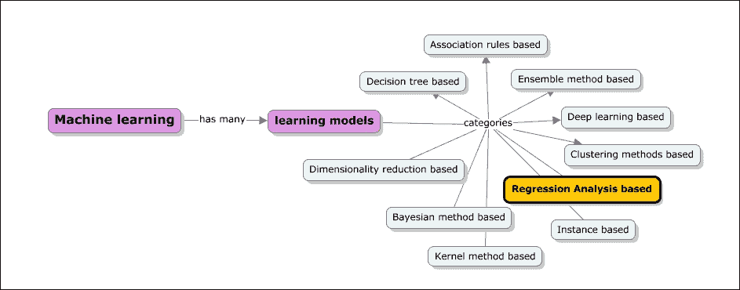

本章将深入探讨以下主题：

+   介绍相关性和回归分析；复习额外的统计概念，如协方差和相关系数。我们将涵盖回归模型和方差分析模型中期望、方差和协方差的性质。

+   您将学习简单线性回归、多元线性回归：线性关系、线性模型、基本假设（正态性、同方差性、线性性和独立性）以及最小二乘估计。总体而言，您将学习模型诊断和选择。

+   您将了解广义线性模型（GLMs）的概述以及 GLM 下的回归算法列表。此外，还将介绍混杂和效应修饰的现象，以及相应的实现和调整。

+   逻辑回归简介，理解赔率和风险比，构建逻辑回归模型，以及评估模型的内容将得到涵盖。

+   将涵盖使用 Apache Mahout、R、Apache Spark、Julia 和 Python（scikit-learn）库和模块的示例实现。

# 回归分析

在监督学习技术中，归类于统计方法的模型包括基于实例的学习方法、贝叶斯学习方法和回归分析。在本章中，我们将重点关注回归分析和相关的回归模型。回归分析被认为是最重要的统计技术之一。正如所提到的，它是一种统计方法，用于衡量两个或更多变量之间的关系，并检查关系的有效性和强度。

传统上，研究人员、分析师和交易员一直使用回归分析来构建交易策略，以了解投资组合中包含的风险。回归方法用于解决分类和预测问题。

我们在前面章节中介绍了一些关键的统计概念；在本章中，我们将介绍一些与回归分析相关的更多概念。举几个例子，我们有变异性的度量、线性、协方差、系数、标准误差等。

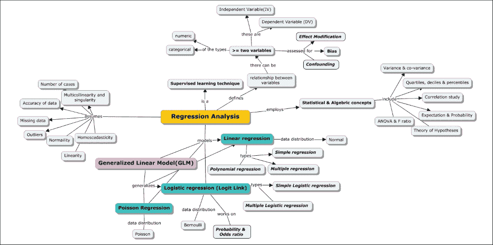

## 回顾统计学

在前面的章节中，我们学习了贝叶斯学习方法，我们覆盖了一些核心的统计量，例如均值、中位数、众数和标准差。现在让我们扩展到更多的度量，例如方差、协方差、相关性和随机变量分布的第一和第二矩。

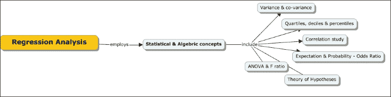

**方差**是标准差的平方。如果你还记得标准差是什么，它是一个平均度量，表示样本中每个测量值与均值偏离的程度。它也被称为均值的方差。我们可以从理论上计算众数和中位数的标准差。

**范围**定义为数据集分布的值域。范围通常表示为最小值和最大值。

四分位数、十分位数和百分位数将测量值分布细分，类似于中位数。众所周知，中位数将分布分为一半，而四分位数、十分位数和百分位数分别将分布分为 1/25、1/10 和 1/100。

**第一四分位数**（标记为 Q1）或下四分位数是第 25 个百分位数。

**第三四分位数**（标记为 Q3）或上四分位数是第 75 个百分位数。

四分位距 = 第三四分位数 - 第一四分位数

**对称**和**偏斜数据**：对称、正偏斜和负偏斜数据的均值、中位数和众数如下所示：

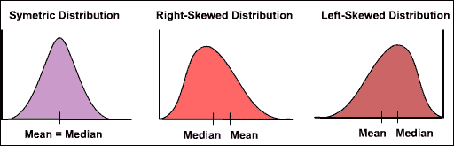

### 注意

对称分布具有相等的均值和中位数值。对于正偏斜分布，中位数大于均值，而对于负偏斜分布，均值值大于中位数值。

异常值是远离数据主要集群的观察值。它可能会以非常显著的方式影响如均值等度量。让我们通过一个例子来更好地理解这一点。我们想要了解五个人群的平均财富。比如说，个人资产估值分别为 100 万美元、120 万美元、90 万美元、110 万美元和 1200 万美元。

1+1.2+0.9+1.1+12=16.2

16.2/5=3.24

最后一个观察值对测量产生了不切实际的影响。现在让我们看看中位数是如何受到影响的。让我们按升序排列资产：900 万美元、1000 万美元、1100 万美元、1200 万美元和 1200 万美元。中位数是 1100 万美元。有两个重要概念我们必须理解。异常值对均值的影响比中位数大。

因此，在选择正确的统计量之前，你应该仔细检查数据。

均值代表变量的平均值，中位数代表平均变量的值。

**协方差**是指有两个或更多感兴趣变量（如公司股票、材料的物理性质等）的情况；了解它们之间是否存在任何关系变得很重要。精确地说，我们想要了解的是，如果一个变量在变化，另一个变量会如何变化。

在统计学中，有两个术语解释了这种行为：

第一个被称为协方差。对于一个包含两个变量 *x* 和 *y* 的 *n* 个数据点的数据集，以下方程描述了协方差的计算：

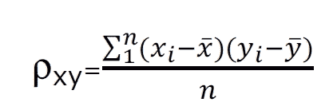

然而，协方差可能是一个非常大的数字。最好将其表示为介于 -1 和 1 之间的归一化数字，以了解这些量之间的关系。这是通过将协方差与两个变量的标准差（*sx* 和 *sy*）进行归一化来实现的。

这被称为 *x* 和 *y* 之间的**相关系数**。

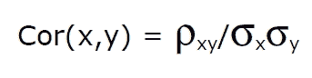

**相关系数**衡量 *X* 和 *Y* 之间线性依赖的强度，介于 -1 和 1 之间。以下图表展示了相关系数如何影响线性依赖的视觉理解：

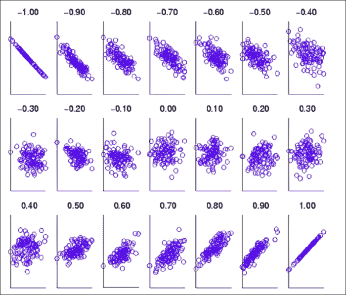

在我们深入研究各种回归模型的具体细节之前，让我们首先看看实现回归模型和分析结果的基本步骤。

均值和方差是随机变量概率分布函数的**第一和第二矩**。它们如下计算：

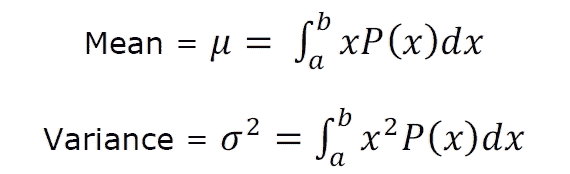

在计算给定随机变量的概率分布之后，我们将通过简单的积分计算均值方差。

让我们用一个现实世界的例子来计算所有这些度量。

以下是在 14 天期间三个公司（公司 A、公司 B 和公司 C）的股价数据。首先，使用以下公式计算回报率：

回报率 = (当天价格-前一天价格)/前一天价格

从这个回报中，计算平均值、中位数和成对相关系数。不要使用内置库。即使使用 Excel，也要使用基本公式。

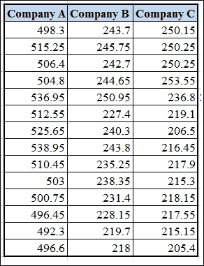

首先，让我们使用之前给出的公式计算回报。

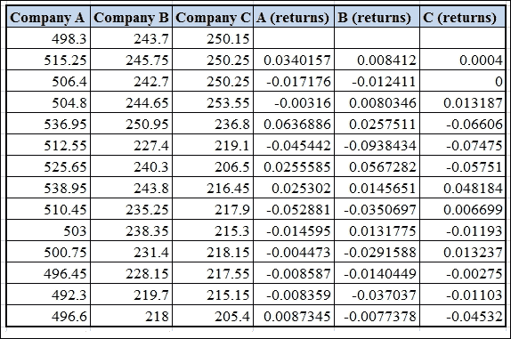

如果我们必须计算平均值，数值如下：

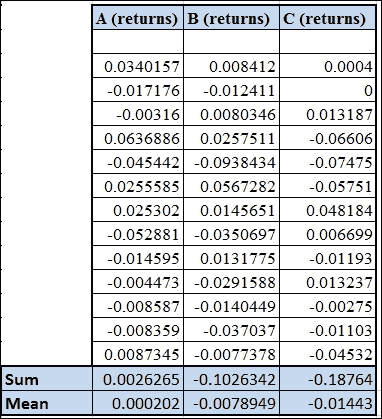

要找到中位数，我们首先将回报值按升序排序，然后标记中间值。

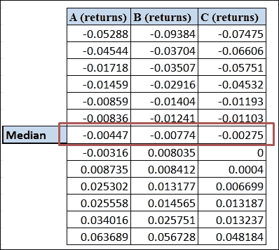

最后，让我们使用之前协方差部分给出的公式计算协方差和相关性。

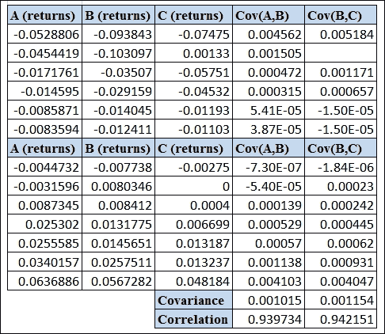

### 期望、方差和协方差的性质

让我们结合前几章和本章的理解，得出结论。

一个变量的这种分布是取特定值的概率。期望是总体均值（这是加权平均的概率）。

我们可以定义均值的方差和标准差。

最后，如果我们观察两个不同的变量，我们可以定义协方差和相关性。现在，让我们了解如何计算两组的期望和方差。这在下一节中特别有用，我们将一起分析两个变量进行线性回归，如下所示：

*E(x+y) = E(x) + E(y)*

*E(x+a) = E(x) + E(a) = a + E(x)*

*E(kx) = kE(x)*

这里有一个非常有趣的规则：

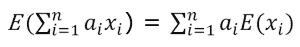

实际上，这个规则表示，如果我们有一个给定比例的财产组合，那么总期望值是单个期望值的加权总和。这是分析组合中的一个关键概念。如果有一个 30%的公司 A、50%的公司 B 和 20%的公司 C 股票的组合，我们组合的预期回报是：

E (组合) = 0.3 E(公司 A) + 0.5 E(公司 B) + 0.2 E (公司 C)

#### 方差的性质

给定*X*，一个随机变量：

*Var(X+Y) = Var(X)+Var(Y)+2Cov(X,Y)*

*V(x+a) = V(x)*（方差在加上常数时不会改变）

*V(ax) = a² V(x)*

让我们证明这一点，因为它并不明显：

例如，*Y= aX*

*E(Y) = an E(X)*（从之前的关系中得出）

*Y-E(Y) = a(X-E(X))* 

对两边平方并取期望：

*E(Y-E(Y))² = a² E(X-E(x))²*

然而，左边是*Y*的方差，右边是*X*的方差：

*Var (Y) = a²Var(X)*

可以从上述内容推导出方差的一些有趣性质。直接得出以下结论：

*Var (-y) = Var (y)*

让我们现在看看投资组合的方差：

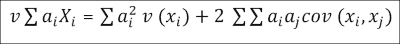

因此，如果你有一个包含三只股票的投资组合，你的投资组合的方差（或其平方根，即标准差）会像之前展示的那样变化。标准差通常被称为投资组合的风险。理想情况下，它需要尽可能低。从前一个公式中，可以通过两种方式实现：

1.  通过选择方差非常低的元素

1.  通过选择相关性非常负的元素

这是成功投资的关键方法。

#### 协方差性质

以下是对协方差的性质：

*cov(X, Y) = E[XY] − E[X]E[Y]*

*cov(x, a) = 0*

*cov(x, x) = var(x)*

*cov(y, x) = cov(x, y)*

*cov(ax, by) =abcov(x, y)*

*cov(X+a, Y+b) = cov (X, Y)*

*cov(aX+bY, cW+dV) = accov(X,W) + adcov(X,V) + bccov(Y,W) + bdcov(Y,V)*

*Cor(X,Y) = E[XY]/σXσY*

现在我们用一个现实世界的例子来展示这一点。

#### 示例

你的两位最好的朋友，安娜和丹尼尔，正在计划投资股票市场。作为你朋友圈中最有经验的投资者，他们向你寻求建议。你知道丹尼尔可以承受 10%的风险，而安娜希望风险尽可能低。显然，你希望最大化他们的回报。他们都希望投资于三项：黄金债券、顶级 IT 公司和顶级银行。

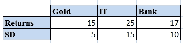

SD—标准差

相关系数可以按照以下方式计算：

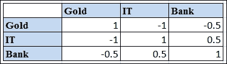

现在，让我们系统地推导出建议。

让我们先创建一个所有可能权重的列表（假设你需要计算到小数点后一位），对于三种资产。大约有 66 个可能的值。这意味着我们的朋友必须从这些选择中挑选一个进行投资。现在，使用以下公式（再次使用你喜欢的任何语言）计算每个可能的投资组合（权重独特组合）的回报：

*投资组合回报 = W*[g] *X R*[g] *+ W*[i] *X R*[i] *+ w*[b] *X R*[b]*W*[g]

*W*[i]*, W*[b] *= 权重* 和

*R*[i]*, R*[g]*, R*[b] *= 回报*

这是因为投资组合的期望是单个投资组合期望的总和，乘以各自的权重。

前五个投资组合的值如下：

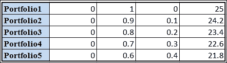

计算所有其他值。

使用以下公式计算每个投资组合的风险：

回报 = Sqrt ((wg*sdg)² + (Wi*sdi)² + (Wb*sdb)² + (2*Wg*sdg*Wi*sdi*rgi)+ (2*Wi*sdi*Wb*sdb*rib) + (2*Wb*sdb*wg*sdg*rbg))

*sdg, sdb, sdi = 风险和 rij = i 和 j 的相关性*

这正是与之前章节中给出的投资组合方差的公式完全相同的公式。

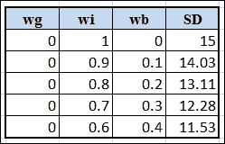

现在，让我们计算所有其他值。

现在，所需做的就是为 Ana 和 Daniel 推荐平衡的投资组合，因为他们的风险偏好您是知道的。由于 Ana 偏好零风险，我们将选择对应于 17.2%回报和 0.87 风险的点。您可以在表中查找并确认这是通过 0.7、0.2 和 0.1（黄金、IT 和银行）的投资组合获得的。由于 Daniel 可以承担 10%的风险，我们将看到对应于 10%风险的投资组合，该组合回报最高。

再次，这可以读作 0.2、0.7 和 0.1。

### ANOVA 和 F 统计量

在双变量和多变量分布的情况下，一个很好的理解量是方差在总体或组内以及组间是如何分布的。这是将数据分组到多个子集的过程。正如您所清楚看到的，在这种情况下，了解方差如何在它们之间分布是非常有帮助的。这种分析称为**方差分析（ANOVA）**。涉及的计算相当直接。

让我们取三个样本，它们有自己的均值和分布，如图所示：

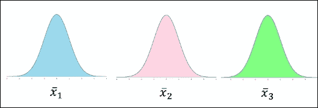

以一个例子来说明，请看以下内容：

*样本 1= {3, 2, 1}*

*样本 2= {5, 3, 4}*

*样本 3= {5, 6, 7}*

*样本 1 的均值 = 2*

*样本 2 的均值 = 4*

*样本 3 的均值 = 6*

*总体大均值 = (3+2+1+5+3+4+5+6+7) / 9 = 4*

总均值（如果组覆盖整个总体，将是总体均值）等于均值均值。

三组均值是否来自同一总体？如果其中一个均值值与其它非常不同或远离其它，这意味着它们不是来自同一总体吗？或者，它们是否距离相等？

所有的前述样本都是关于相对于总体均值的相对距离度量。

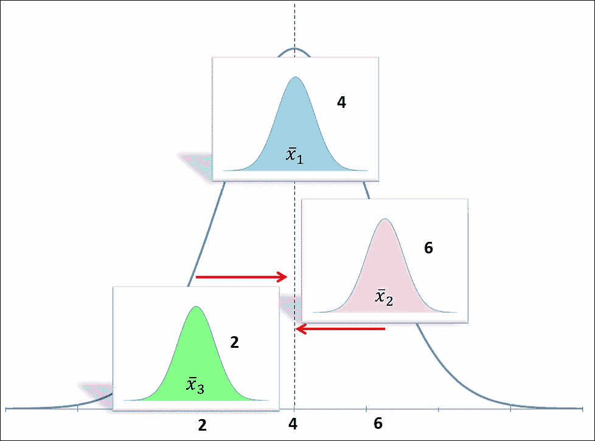

现在，让我们计算整个样本集的平方和：

*(3 − 4)² + (2 − 4)² + … = 30*

我们可以通过将之前提到的量除以自由度 *(n*m-1)* 来计算方差：

*n*—每个样本中的元素数量

*m*—样本数量

我们试图建立的性质不会改变。因此，我们只需坚持使用平方和而不是方差。现在，让我们计算两个量：组的平方和以及组间的平方和。

+   **组的平方和**：让我们以第一个组（3, 2, 和 1）为例，其中均值为 2。组内的变异（我们称之为方差。但，它肯定是一个方差的度量）等于 *(3-2)²+…=2*。同样，组 2 和组 3 内的变异也等于 *2* 和 *2*。因此，组内贡献的总变异是 6。每个组内的自由度总数是 *n-1*。总的自由度是 *(n-1)*m*。在这种情况下是 6。

+   **组间平方和**：这是通过组均值与总体均值之间的距离来衡量的，这个距离乘以组内元素的数量。组 1 的组内均值为 2，总体均值为 4。因此，该组与总体均值之间的变异性为*(2-4)² * 3 = 12*。第二组的变异性为 0，第三组为 12。因此，组间变异性为 24。在这种情况下，自由度为*m-1 = 2*。

因此，让我们记录下来：

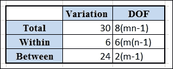

因此，我们看到在总变差 30 中，6 是由组内变差贡献的，而 24 是由组间变差贡献的。所以，很可能将它们分开是有意义的。现在，让我们在这里做一些推断统计。假设这些值是三个辅导中心获得的排名。我们想知道将人们放入辅导中心是否真的会影响他们的最终排名。

让我们从假设论证开始。

**零假设**是辅导中心对排名没有影响。备择假设是辅导中心对排名有影响。

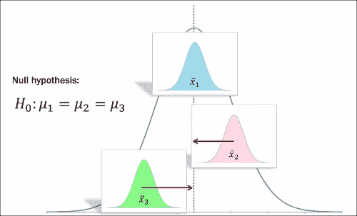

如果我们观察，这个指标并不是关于值是否相等，而是检查样本是否来自同一更大的总体。这个指标被称为样本均值之间的变异性。

简而言之，方差分析（ANOVA）是一个变异性比率，表示如下：

ANOVA = 组间变差 / 组内变差 = 总均值之间的距离 / 内部扩散

总变差 = 组间变差 + 组内变差

将总变差分为两个组成部分的过程称为分解：

+   如果均值之间的变差大于均值内的变差，这意味着变异性比率大于 1。因此，我们可以得出结论，样本不属于同一总体。

+   如果均值之间的变差和均值内的变差相似，那么比率几乎变为 1，这表明有重叠。

+   如果均值之间的变差小于均值内的变差，这意味着样本接近总体均值或分布*melt*在一起。

因此，当我们处理多个变量时，可能会有许多因素影响结果。每个变量都需要评估其对变量之间关系的独立影响。在下一节中，将解释**混杂**和**效应修饰**这两个概念，说明不同类型的影响因素对结果的影响。

## 混杂

我们将通过一个例子开始理解什么是混淆。假设我们正在进行一项研究，我们想确定发展心脏病的风险是否与吸烟有关。当对混合吸烟者和非吸烟者以及那些在一段时间内被检测出患有心脏病的人的样本数据进行研究时，进行了一个关联性测量的指标，如*风险比*，结果为 2.0。这可以解释为吸烟者发展心脏病的风险是非吸烟者的两倍。现在，当我们仔细观察数据时，假设我们发现吸烟者和非吸烟者的年龄分布不同，并且样本中吸烟者的年龄远高于非吸烟者的年龄。如果我们必须将这条信息联系起来，发展心脏病的结局与老年、吸烟还是两者都有关？

测量吸烟对发展心脏病定量效应的理想方式是取一组人，观察他们在一段时间内吸烟，收集心脏病发展的数据，使用同一组人，并在他们不吸烟时回到过去进行相同的评估。这将有助于测量反事实结果。同一组人代表吸烟者和非吸烟者。由于这不可能实现，我们需要假设存在*可交换性*。非吸烟者描述吸烟者如果他们曾经吸烟，反之亦然。换句话说，这意味着两组在所有方面都是可比的。在数据样本不可比的情况下，这种情况被称为混淆，导致这种情况的属性（在这种情况下，年龄）被称为**混杂因素**。如果我们必须用例子来解释这一点，那么所有非吸烟者都较年轻的事实，如果他们不吸烟，非吸烟者将低估老年吸烟者的结果。

这种情况可以表示如下：

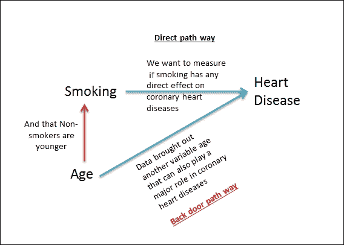

我们观察到存在一个后门路径（通过年龄属性）。因此，混淆可以定义得更加简单，即*存在一个后门路径*。

### 注意

混淆是指暴露和结果之间的效应或关联因另一个变量的存在而被扭曲的情况。

## 效应修饰

效应修饰是指暴露在不同组别中有不同值的情况。当关联性测量的指标，如比值比、率比和风险比值非常接近特定组别估计的加权平均值时，可以观察到这种情况。

效应修饰变量是那个不同地（这可能意味着正面或负面）修改观察到的结果效应的变量。

让我们来看一个例子。乳腺癌可以发生在男性和女性身上；在男性和女性中的比率是相同的，但女性发生乳腺癌的比率是男性的 800 倍，性别因素是一个明显的区分因素。

如果效应修饰因子没有被正确识别，这可能会导致错误的粗略估计，从而错失了解风险因素与结果之间关系的机会。

研究数据效应修饰以分析数据需要遵循以下步骤：

1.  收集有关潜在效应修饰因子的信息。

1.  研究效应修饰因子的效应，测量差异，并保持对匹配值的控制。

1.  根据潜在效应修饰因子对数据进行分层，并计算风险对结果效应的估计。确定是否存在效应修饰。如果存在，可以展示/使用这些估计。

回顾一下，混杂因素会掩盖真实效应，而效应修饰因子意味着不同群体有不同的效应。

# 回归分析方法

正如我们所学的，回归分析使我们能够根据多个自变量来建模两个或更多变量之间的关系，尤其是在预测连续因变量时。回归分析中使用的自变量可以是连续的或二分的。在因变量为二分的情况下，应用逻辑回归。在因变量两个水平之间的分割相等时，则线性回归和逻辑回归都会得到相同的结果。

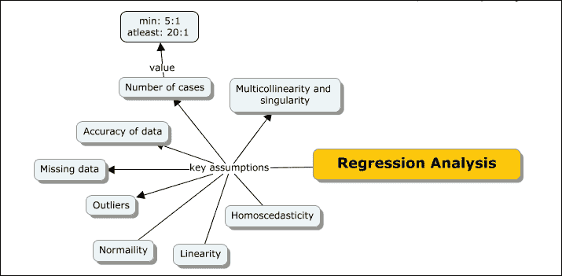

回归分析的假设（大多数适用于线性回归模型家族）

+   **样本案例大小**：为了应用回归模型，案例与自变量（**IVs**）的比例理想情况下应该是 20:1（对于模型中的每个自变量，需要有 20 个案例），至少应该是 5:1（模型中的每个自变量有 5 个案例）。

+   **数据准确性**：回归分析假设数据的基本有效性，并在运行回归方法之前进行基本数据验证。例如，如果一个变量可以具有 1-5 之间的值，那么任何不在该范围内的值都需要进行修正。

+   **异常值**：正如我们所学的，异常值通常是具有极端值的数据点，它们看起来并不自然地属于总体的一部分。回归分析假设异常值已经得到处理。

+   **缺失数据**：寻找缺失数据并解决这些问题很重要。如果一个特定变量有很多缺失值，可能最好删除该变量，除非有太多变量具有许多缺失值。一旦运行了回归过程，没有值的变量可以成为排除的候选者。为了避免通过排除丢失数据的风险，需要应用缺失值技术。

+   **正态分布**：检查数据以确保数据是正态分布的。在直方图上绘制数据是检查数据是否正态分布的一种方法。以下直方图是正态分布的一个例子：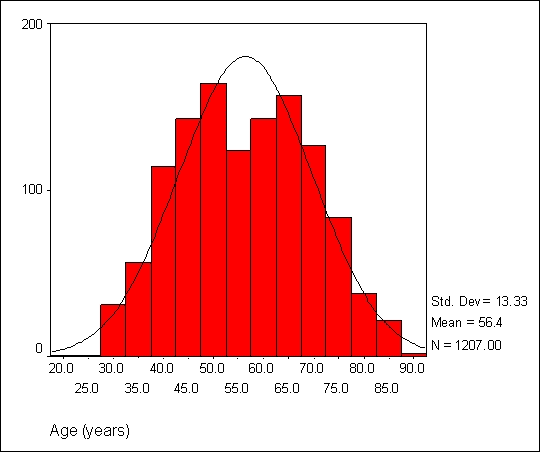

+   **线性行为**：简单来说，线性行为是指因变量和自变量之间存在直线关系。任何非线性关系都会被忽略。使用双变量散点图来检验线性关系。

+   **同方差性**：同方差性是指因变量变化时自变量的恒定变化。以下散点图是同方差数据的例子，我们可以看到绘图集中在中心：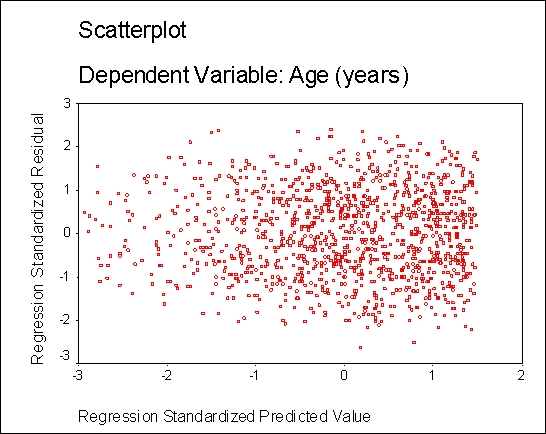

与线性假设类似，违反同方差性假设不会使回归无效，但会削弱它。

+   **多重共线性与奇异性**：多重共线性是指自变量高度相关的情况。在奇异性情况下，自变量完全相关，通常一个自变量是其他一个或多个自变量的组合。多重共线性与奇异性都可以通过自变量之间的相关性轻松识别。

从以下部分开始，我们将深入探讨概念图中列出的每个回归方法：

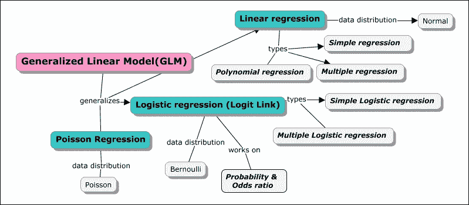

## 简单回归或简单线性回归

在这种情况下，我们将只处理两个变量；一个因变量和一个自变量。简单线性回归就是比较两个模型；一个是没有自变量，最佳拟合线是通过因变量形成的，另一个是使用最佳拟合回归线。现在让我们通过一个例子来了解最佳拟合线和回归线的定义。

我们将从现实世界的例子开始。假设有一个房地产经纪人，每次他完成一笔房地产交易，他都会得到一笔佣金。很明显，佣金金额取决于交易的价值；交易价值越高，佣金就越高。因此，在这种情况下，佣金成为因变量，交易金额成为自变量。为了预测可能的下一笔佣金金额，让我们考虑以下最后六次交易的样本数据：

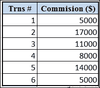

假设我们没有整体交易金额的数据。如果我们想要预测之前数据中给出的下一笔佣金，我们首先将其绘制在图中，如图所示：

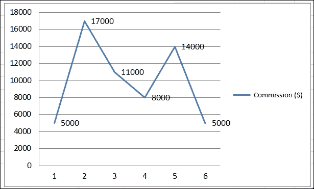

我们用来识别数据中下一个佣金金额的选项之一是计算平均值，这是样本的最佳预测。

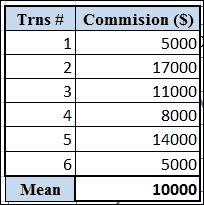

让我们在图上绘制这个点，这将成为*最佳*拟合。在之前的图上绘制平均值：

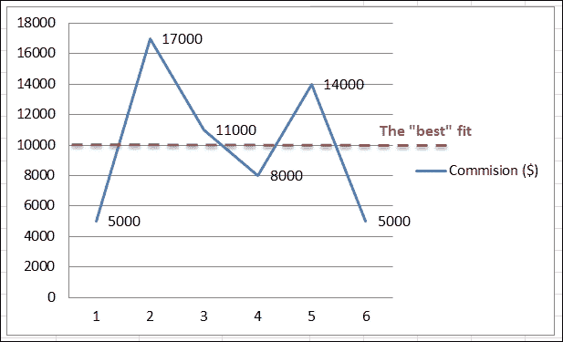

计算每个点到平均值的距离给出了下一图中显示的值。这种距离度量称为误差或残差。所有点的误差总和始终为零，这是拟合优度的度量。

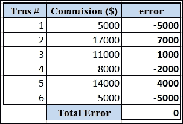

在图上绘制距离。

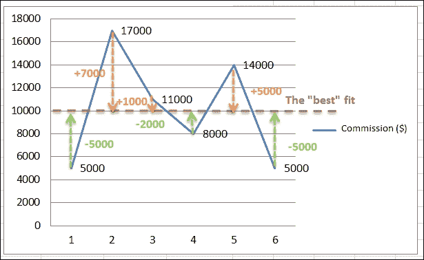

我们在前面章节中学习了关于**SSE**（**平方和误差**）值的内容。误差被平方是因为它使值变为正值，并强调更大的偏差。以下表格显示了为样本数据计算出的 SSE 值：

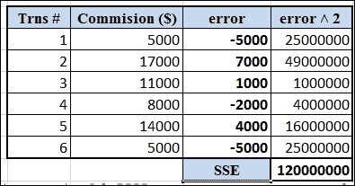

简单线性回归的整体目标是构建一个模型，最大限度地减少 SSE 值。到目前为止，我们已经看到了使用单个变量（即因变量）的最佳拟合。现在，让我们假设我们得到了我们例子中的另一个自变量的数据。实际上，这给我们带来了一条新的回归线，这条线与我们之前得到的最佳拟合线不同。预期新的自变量将显著减少 SSE 值。换句话说，这条新的回归线应该是对给定数据的更好拟合。

如果早期最佳拟合线和回归线之间没有差异，这意味着所确定的独立变量对结果没有影响。总的来说，简单线性回归旨在使用具有最小 SSE 值的数据找到最佳拟合线。

现在我们将独立变量数据添加到我们的分析中——正如表格中所示的不动产交易价值：

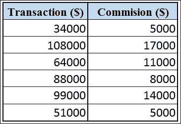

我们将在因变量和自变量之间绘制散点图。

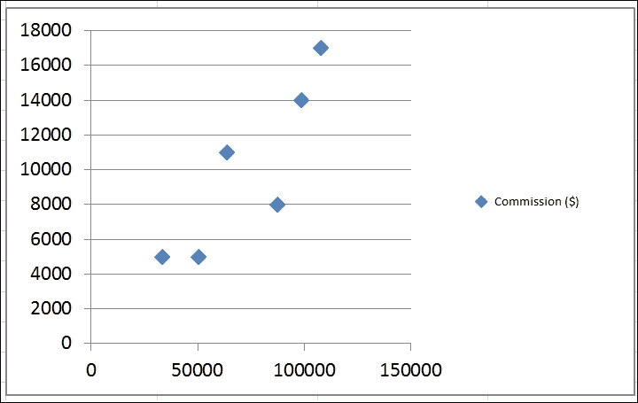

在这种情况下可能有多个线/方程，如下一图所示。如果数据似乎呈线性分布，我们可以继续。如果数据点散布在各个地方，这表明数据中没有线性关系，我们可以选择停止推导回归线。我们可以选择在这里计算相关系数，如下所示：

r = 0.866

这表明两个变量之间的关系很强，我们可以继续构建回归模型。

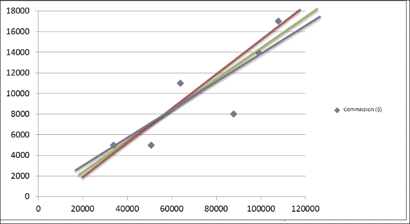

现在计算*x*轴和*y*轴的平均值；以下是这些值：

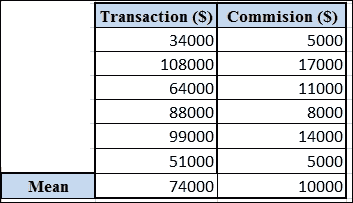

然后将这些平均值绘制为质心到散点图上，如图所示：

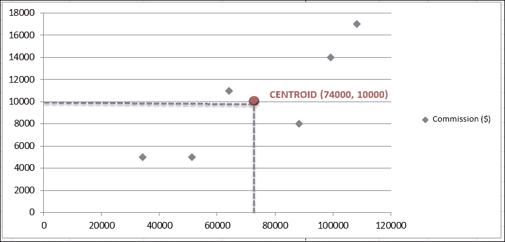

最佳拟合回归线必须通过包含*x*和*y*变量平均值的质心。计算如下：

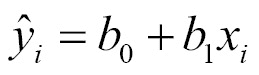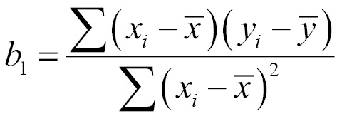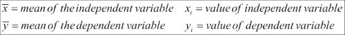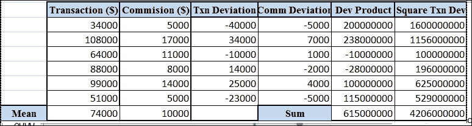

最终的回归线方程看起来是这样的：

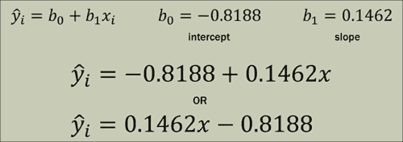

在散点图上绘制前一个方程看起来是这样的：

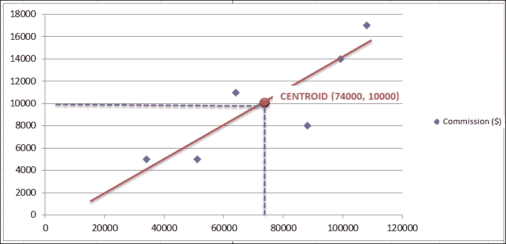

## 多元回归

多元回归是简单线性回归的扩展，有一个重要的区别，即可以使用两个或更多独立变量来预测或解释一个因变量的方差。增加更多的独立变量并不一定使回归更好。可能存在两个潜在问题，其中一个就是过拟合。我们已经在前面的章节中讨论过这个问题。过多的独立变量可能会增加方差，但在现实中，它们对模型没有任何贡献，从而造成过拟合。此外，增加更多的独立变量会增加更多的关系。不仅独立变量可能相关于因变量，而且独立变量之间也可能存在依赖关系。这种情况被称为多重共线性。理想的期望是独立变量与因变量相关，但彼此之间不相关。

由于过拟合和多重共线性问题，在开始进行多元回归分析之前需要进行准备工作。准备工作可能包括计算相关性、绘制散点图映射和运行简单线性回归等。

假设我们有一个因变量和四个自变量，存在多重共线性风险。这意味着四个自变量与一个因变量之间存在四个关系，而在自变量之间，还可能有六个关系。所以，共有 10 个关系需要考虑，如图所示。DV 代表因变量，IV 代表自变量。

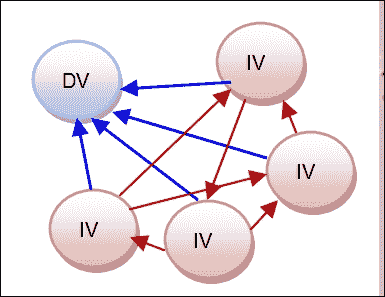

一些独立变量比其他变量更适合预测因变量，而一些可能对预测没有任何贡献。需要决定考虑哪个因变量。

在多元回归中，每个系数被解释为变量变化一个单位时，*y*的估计变化量，同时假设其他变量保持不变。

以下为多元回归方程。

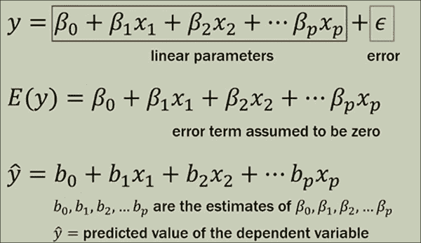

假设我们想将一个独立变量拟合为许多变量（*x*、*y*和*x*²）的函数。我们可以遵循一个简单的程序来获取所有变量的系数。这适用于线性、二次和三次函数。

以下为逐步过程：

1.  将每个变量的所有点按顺序排列在单独的列中。

1.  将所有要表示为矩阵的独立变量列合并。

1.  在矩阵的起始位置添加一列。

1.  将此矩阵命名为 *X* 矩阵。

1.  为所有独立变量制作一个单独的列矩阵，并称其为 *Y* 矩阵。

1.  使用此处提供的公式计算系数（这是最小二乘回归）：

    *B = (X*^T*X)*^(-1)*X*^T*Y*

这是一个矩阵运算，结果向量是系数。

在进行多元回归之前，需要做大量的准备工作。有必要退后一步，对考虑中的变量进行分析。可以绘制一些基本的散点图来检查是否存在任何相关性，并分析因变量之间的关系。可以使用散点图、相关性分析和单个或分组回归等技术。如果有任何定性或分类变量，我们需要使用虚拟变量来构建回归模型。

## 多项式（非线性）回归

虽然线性回归模型 *y = Xβ + ε* 是一个通用模型，可以拟合未知参数 *β* 中的任何线性关系，但在分析师知道真实响应函数中存在曲线效应的情况下，多项式模型适用。多项式模型也被用作未知且可能非常复杂的非线性关系的近似函数。多项式模型是未知函数的泰勒级数展开。

如果两个变量呈线性相关，散点图看起来如下所示：

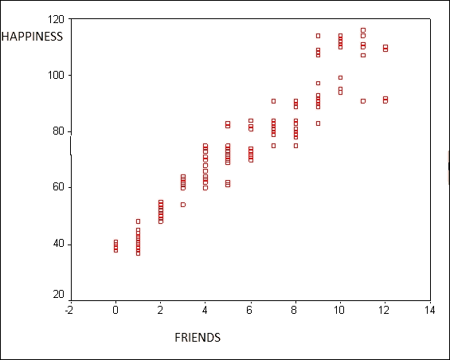

从先前的双变量散点图可以看出，朋友和幸福之间存在线性关系。图表显示“朋友越多，幸福越多”。如果我们谈论变量之间曲线关系，即朋友数量和幸福之间的关系呢？这意味着随着朋友数量的增加，幸福也会增加，但仅限于某个点。以下图表显示了数据中的这种行为：

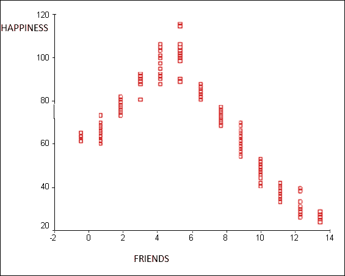

如果数据不是线性的，那么过程就是通过转换自变量或因变量使其之间有线性关系，从而使数据线性化。这种转换并不总是有效，因为数据和行为可能存在真正的非线性。在这种情况下，我们需要在回归中包含独立变量的平方。这也被称为多项式/二次回归。**最小二乘法**用于拟合多项式回归模型，因为它最小化了系数估计中的方差。

## 广义线性模型（GLM）

让我们看看为什么线性回归模型不起作用的原因。

简单线性回归是一个定量变量预测另一个，多重回归。它是扩展的简单线性回归，但具有更多的自变量，最后，非线性或多项式回归是存在两个定量变量但数据是曲线的情况。

现在，以同样的方式运行典型的线性回归，有一些问题。二元数据不具有正态分布。这就是需要其他回归模型的原因。其次，因变量的预测值可能超出 0 和 1，这与概率的概念相悖。最后，概率通常是非线性的，并且在极端情况下可能取到极低或极高的值。

GLM 是线性回归的推广，支持独立变量可以具有除正态分布以外的分布误差模型的情况。GLM 通过允许线性模型通过链接函数与自变量相关联，并允许每个测量的方差程度是其预测值的函数，从而推广了线性回归。

简而言之，GLM（广义线性模型）概括了线性、逻辑和泊松回归模型。

## 逻辑回归（logit 链接）

逻辑回归是线性回归的扩展，其中因变量是一个分类变量，负责对观测值的分类。

例如，如果 *Y* 表示某个客户是否可能购买产品（1）或不太可能购买（0），我们有一个具有两个类别或类（0 和 1）的分类变量。逻辑回归可以解决一个分类问题，其中类别是未知的。这是通过使用预测值来分类一个新观测值，其中类别是未知的，基于变量将其分类到某个类别中。

以下是一些例子：

+   将客户分类为回头客（1）或非回头客（0）

+   根据信用评分预测贷款是否会被批准或拒绝

其中一个重要的用途可以是在预测值之间找到相似性。

在我们开始深入研究逻辑回归之前，让我们回顾一下在早期章节中提到的概率和赔率的概念。

概率 = 关注的结果 / 所有可能的结果。

例如，当掷公平硬币时，*P(正面) = ½ = 0.5*。当掷骰子时，*P(1 或 2) = 2/6 = 1/3 = 0.33*。在一副扑克牌中，*P(方块牌) = 13/52 = ¼ = 0.25*。

比率 = P(某事发生)/P(某事不发生) = p/(1-p)

例如，当掷硬币时，*odds(正面 = 0.5/0.5= 1)*。当掷骰子时，*odds(1 或 2) = 0.333/0.666 = ½ = 0.5*。在一副扑克牌中，*odds(方块牌) = 0.25/0.75 = 1/3 = 0.333*。

比率比是两个概率之比。

例如，当掷硬币时，在公平掷币的情况下：

*P(正面) = ½= 0.5* 且 *odds(正面) = 0.5/0.5 = 1 = 1:1*

在掷出有偏硬币的情况下：

*P(正面) = 0.7 且 odds(正面) = 0.7/0.3 = 2.333*

*比率比 = odds1/odds0 = 2.333/1 = 2.333*

这意味着掷出正面的概率是公平硬币的 2.333 倍。

总体而言，逻辑回归旨在：

+   **模型**事件发生的概率取决于独立变量的值，这些变量可以是分类的或数值的

+   **估计**事件发生与不发生的概率

+   **预测**一组变量对二元响应变量的影响

+   **分类**观察结果属于特定类别，基于概率估计

### 逻辑回归中的比率比

逻辑回归中变量的比率比表示当该变量的单位增加时，该变量的几率如何变化，同时保持其他变量不变。

让我们通过一个例子来理解这一点——体重是否依赖于睡眠呼吸暂停。假设体重变量的比率比为 1.07。这意味着体重增加一磅可能会使患有睡眠呼吸暂停的几率增加 1.07 倍。这可能并不显著。在体重增加 10 磅的情况下，几率增加到 1.98，是患有睡眠呼吸暂停的人的几率的两倍。重要的是我们要区分概率和比率的度量。例如，尽管体重增加 20 磅使患有睡眠呼吸暂停的人的几率增加了 4 倍，但体重可能增加 20 磅的概率可能非常低。

在逻辑回归中，有两个重要的步骤：

1.  找到属于特定类别的概率。因此，如果 *Y = 0* 或 *1*，属于 *类别 1* 的概率是 *P(Y=1)*。

1.  我们需要使用概率的截断值来确保每个案例都进入一个类别。在二元截断的情况下，*P(Y=1) > 0.5* 将被分类为 *1*，而 *P(Y=0) < 0.5* 将被分类为 *0*。

#### 模型

*y*[i] 是正态分布的，对于 *i = 0,1,…,n*，其值为 0 或 1。

*y*[i] 等于 {0, 1}，其中 *P(y*[i]*= 1) = p*，*P(y*[i]*= 0) = 1-p*

*Y = a + bx for P(y*[i]*= 1)*

*p*[i] *= a + bx*[i]

注意，*p*[i] 不会在 (0, 1) 之间取值。这是通过使用预测变量的非线性函数来固定的，例如：

显然，当*x*从-∞变化到∞时，这个值介于 0 和 1 之间。据此，可以得到*a+bx*[i]如下：

下面的曲线显示了函数的变化情况：

## Poisson 回归

在广义线性模型（GLM）的背景下，Poisson 回归是指具有泊松分布的自变量下的数据计数，并且应用了响应的对数链接函数，该函数可以用未知参数的线性组合来建模。

# 实现线性回归和逻辑回归

请参考本章提供的源代码以实现线性回归。（源代码路径`.../chapter10/...`位于每个技术文件夹下）

## 使用 Mahout

请参考文件夹`.../mahout/chapter10/linearregressionexample/`。

请参考文件夹`.../mahout/chapter10/logisticregressionexample/`。

## 使用 R

请参考文件夹`.../r/chapter10/linearregressionexample/`。

请参考文件夹`.../r/chapter10/logisticregressionexample/`。

## 使用 Spark

请参考文件夹`.../spark/chapter10/linearregressionexample/`。

请参考文件夹`.../spark/chapter10/logisticregressionexample/`。

## 使用 scikit-learn

请参考文件夹`.../python-scikit-learn/chapter10/linearregressionexample/`

请参考文件夹`.../python-scikit-learn/chapter10/logisticregressionexample/`

## 使用 Julia

请参考文件夹`.../julia/chapter10/linearregressionexample/`。

请参考文件夹`.../julia/chapter10/logisticregressionexample/`。

# 摘要

在本章中，你学习了基于回归分析的机器学习，特别是如何使用 Mahout、R、Python、Julia 和 Spark 实现线性回归和逻辑回归模型。此外，我们还涵盖了其他相关统计概念，如方差、协方差和方差分析等。我们通过实例深入探讨了回归模型，以了解如何将它们应用于实际问题。在下一章中，我们将介绍深度学习方法。
