# 第十一章 深度学习

到目前为止，我们介绍了一些监督学习、半监督学习、无监督学习和强化学习的技术和算法。在本章中，我们将介绍神经网络及其与深度学习实践的关系。传统的学习方法涉及编写告诉计算机做什么的程序，但神经网络是关于学习和使用观察数据来寻找解决方案，这些数据是输入的主要来源。这种技术的成功取决于神经网络是如何训练的（即观察数据的质量）。深度学习指的是学习先前提到的神经网络的方法。

技术的进步将这些技术提升到了新的高度，在这些技术中，它们展示了卓越的性能，并被用于解决计算机视觉、语音识别和**自然语言处理**（**NLP**）中的一些关键非平凡需求。Facebook 和 Google 等大型公司以及其他许多公司已经在很大程度上采用了深度学习实践。

本章的主要目的是在概念上掌握神经网络和相关深度学习技术。借助一个复杂的模式识别问题，本章涵盖了开发典型神经网络的步骤，这将使你能够使用它来解决类似复杂性的问题。以下表示展示了本书涵盖的所有学习方法，突出了本章学习的主要主题——*深度学习*。

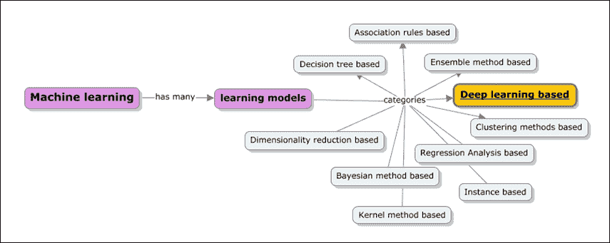

本章深入探讨了以下主题：

+   快速回顾机器学习的目的、学习类型以及深度学习的背景，特别是它解决的一个特定问题。

+   神经网络的概述：

    +   人类大脑作为神经网络的主要灵感来源

    +   神经网络架构的类型和一些神经元的基本模型

    +   一个简单的学习示例（数字识别）

    +   感知器概述，神经网络的第一代及其所能做到的和不能做到的事情

+   线性和逻辑输出神经元的概述。介绍反向传播算法以及应用反向传播算法的导数来解决一些实际问题

+   认知科学的概念、softmax 输出函数以及处理多输出场景

+   应用卷积网络和对象或数字识别的问题

+   **循环神经网络**（**RNN**）和梯度下降法

+   信号处理作为成分分析和自编码器的原理；深度和浅度自编码器的类型

+   使用 Apache Mahout、R、Julia、Python（scikit-learn）和 Apache Spark 进行练习的动手实现

# 背景

让我们先回顾一下机器学习的先决条件，并加强学习方法的宗旨和背景。正如我们所学的，机器学习是通过构建模型来训练机器，使用观察数据，而不是直接编写定义数据模型的特定指令，以解决特定的分类或预测问题。在这个背景下，“模型”这个词不过是一个“系统”。

程序或系统是使用数据构建的，因此看起来与手写的程序非常不同。如果数据发生变化，程序也会适应它以进行新数据的下一级训练。所以它所需要的只是处理大规模数据的能力，而不是让熟练的程序员为所有可能仍然证明是严重错误的条件编写代码。

我们有一个机器学习系统的例子，称为垃圾邮件检测器。这个系统的首要目的是识别哪些邮件是垃圾邮件，哪些不是。在这种情况下，垃圾邮件检测器并没有被编码来处理所有类型的邮件；相反，它是从数据中学习的。因此，这些模型的精确度始终取决于观察数据的好坏。换句话说，从原始数据中提取的特征通常应该覆盖数据模型的所有状态，以便模型准确。特征提取器被构建出来，用于从给定的数据样本中提取标准特征，这些特征被分类器或预测器使用。

一些其他例子包括识别模式，如语音识别、物体识别、人脸检测等。

深度学习是一种机器学习方法，它试图从给定数据中学习显著特征，因此试图减少为每个数据类别（例如，图像、声音等）构建特征提取器的任务。对于人脸检测的需求，深度学习算法记录或学习特征，如鼻子的长度、眼睛之间的距离、眼球的颜色等。这些数据被用来解决分类或预测问题，显然与传统的**浅层学习算法**非常不同。

## 人类大脑

人类大脑被认为是人体中最不可思议的器官之一。大脑本质上是我们人类智能的源泉。它负责根据我们关于触觉、嗅觉、视觉、听觉等方面的体验来构建我们的感知。这些体验被收集并存储为记忆和情感。本质上，大脑是我们智能的来源，没有它，我们可能只是世界上的原始生物。

新生儿的脑部能够解决任何复杂且强大的机器都无法解决的问题。实际上，就在出生后的几天内，婴儿就开始识别他/她父母的脸和声音，并在他们不在时表现出渴望见到他们的表情。在一段时间内，他们开始将声音与物体联系起来，甚至可以在看到物体时识别它。那么他们是如何做到这一点的呢？如果他们遇到一只狗，他们是如何识别它为狗的；他们是否将吠声与之联系起来并模仿同样的声音？

它很简单。每次婴儿遇到一只狗时，他/她的父母都会将其定义为狗，这加强了孩子的模型。如果他们判定孩子是错误的，孩子的模型就会吸收这些信息。因此，狗有长长的耳朵、长长的鼻子、四条腿、长长的尾巴，可以是黑色、白色或棕色等不同颜色，并发出吠声。这些特征是通过婴儿大脑记录的视觉和声音来识别的。因此收集到的观察数据驱动了此后对新物体的识别。

现在，假设婴儿第一次看到狼；他/她会通过观察其特征相似性将狼识别为狗。现在，如果父母在第一次看到时就指出明显的差异，例如，狼发出的声音不同，那么这将成为一种新的体验，并存储在记忆中，用于下一次的观察。随着越来越多此类例子的同化，孩子的模型变得越来越准确；这个过程是非常无意识的。

几年来，我们一直在努力构建具有人类大脑智能的机器。我们谈论的是可以像人类一样行为并能够以类似人类的效率完成特定工作的机器人，例如开车、打扫房子等等。现在，要构建这样的机器人需要什么？我们可能需要构建一些超级复杂的计算系统，这些系统能够迅速解决我们大脑可以解决的问题。这个致力于构建人工智能系统的领域被称为深度学习。

以下是一些深度学习的正式定义：

根据维基百科，深度学习是一组机器学习算法，它试图通过使用由多个非线性变换组成的模型架构来模拟数据中的高级抽象。

根据[`deeplearning.net/`](http://deeplearning.net/)，深度学习是机器学习研究的新领域，其目标是使机器学习更接近其最初目标之一——人工智能。

这个主题已经演变了数年；以下表格列出了这些年的研究领域：

| 研究领域 | 年份 |
| --- | --- |
| 神经网络 | 1960 |
| 多层感知器 | 1985 |
| 限制性玻尔兹曼机 | 1986 |
| 支持向量机 | 1995 |
| 辛顿提出**深度信念网络**（**DBN**）对深度学习和 RBM 的新兴趣，以及最先进的 MNIST | 2005 |
| 深度循环神经网络 | 2009 |
| 卷积深度信念网络 | 2010 |
| 最大池化卷积深度信念网络 | 2011 |

在众多贡献者中，这个领域的几位关键贡献者包括杰弗里·辛顿（Geoffrey Hinton）、杨立昆（Yann LeCun）、洪乐克·李（Honglak Lee）、安德鲁·杨（Andrew Y. Ng）和约书亚·本吉奥（Yoshua Bengio）。

以下的概念模型涵盖了深度学习的不同领域，以及本章涵盖的主题范围：

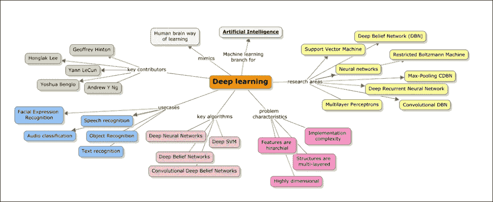

让我们来看一个简单的问题；要求是识别这里给出的手写脚本中的数字：

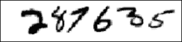

对于人类大脑来说，这非常简单，因为我们能将数字识别为 287635。我们大脑解释数字的简单性是感知的，它削弱了这一过程中涉及的复杂性。由于视觉皮层的存在，我们的大脑被训练成逐步拦截不同的视觉，每个皮层包含超过 1.4 亿个神经元，它们之间有数十亿个连接。简而言之，我们的大脑不亚于一个经过数百万年演化的超级计算机，并且已知能够很好地适应视觉世界。

如果一个计算机程序需要破解数字识别，应该遵循什么规则来识别和区分一个数字与另一个数字？

神经网络是多年来一直在研究的一个领域，并且已知可以解决多层学习的需求。整体的想法是输入大量手写的数字；以下图像展示了这些数据（训练）的一个例子，并且可以从这些例子中学习。这意味着规则是从提供的训练数据中自动推断出来的。因此，训练数据集越大，预测的准确性就越高。如果我们面临一个问题，需要区分数字 1 和数字 7，或者数字 6 和数字 0，就需要学习一些细微的差异。对于一个零，起点和终点之间的距离是最小或没有。

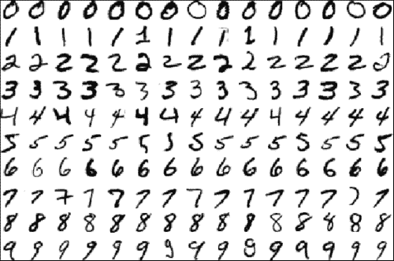

差异基本上是因为这些学习方法的目标是模仿人类大脑。让我们看看是什么使得这个问题难以解决。

总结来说，深度学习作为机器学习的一个子集，我们知道这涉及到提供示例和评估模式以在出错时进行演化的模型。因此，在一段时间内，这个模型将以最佳可能的准确性解决问题。

如果这需要用数学来表示，让我们定义我们的模型为一个函数 *f(x,θ)*。

在这里，*x* 是作为值向量提供的输入，而 *θ* 是模型用来预测或分类 *x* 的参考向量。因此，我们需要将 *θ* 暴露给最大数量的示例，以提高准确性。

让我们举一个例子；如果我们想根据两个因素预测一家餐厅的访客是否会再次光临——一个是账单金额（*x[1]*），另一个是访客的年龄（*x[2]*）。当我们收集一段时间内的数据并分析其输出值时，这个值可以是 1（如果访客回来了）或-1（如果访客没有回来）。当数据被绘制出来时，可以呈现任何形式——从线性关系到任何其他复杂形式，如图所示：

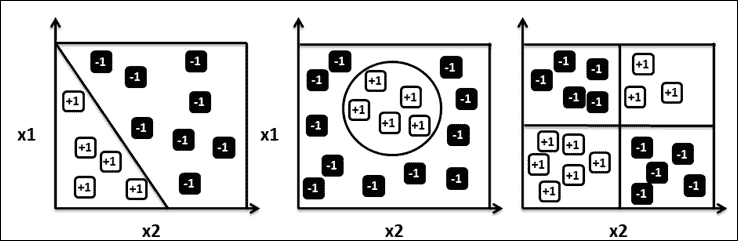

看起来像线性关系的东西看起来很简单，而更复杂的关系则使模型动态复杂化。参数 *θ* 是否真的有一个最优值？我们可能需要应用优化技术，在接下来的章节中，我们将介绍这些技术，例如感知器和梯度下降法等。如果我们想开发一个执行此操作的程序，我们需要知道大脑是如何识别这些数字的，即使我们知道了，这些程序也可能非常复杂。

## 神经网络

神经计算一直是研究的主要兴趣，旨在了解神经元（灵活连接的概念）中的并行计算是如何工作的，以及如何像人类大脑一样解决实际问题。现在让我们看看人类大脑的核心基本单元——*神经元*：

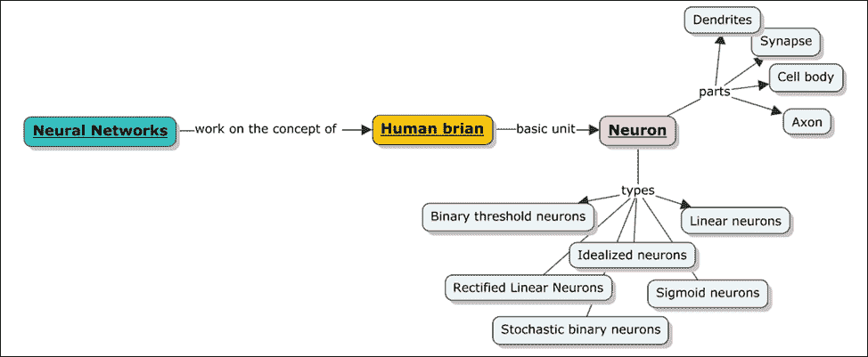

### 神经元

人类大脑就是由神经元和连接组成的。神经元是大脑的最小部分，如果我们取一小块大脑，其大小与一小粒米饭粒相当，已知至少包含 10000 个神经元。平均每个神经元与其他神经元有大约 6000 个连接。如果我们观察神经元的总体结构，它看起来如下。

我们人类经历的所有感觉，无论是思考还是情感，都是因为这些被称为神经元的数百万个细胞在大脑中的活动。这些神经元通过传递信息相互沟通，使人类能够感受、行动和形成感知。此处所示的图解描绘了生物神经结构和其组成部分：

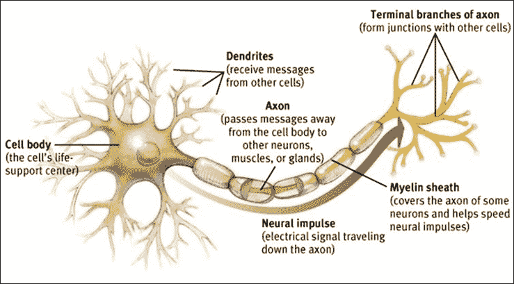

每个神经元都有一个中央细胞体；像任何细胞一样，它有一个负责与其他神经元发送和接收信息的轴突和树突。轴突连接到树突的地方称为突触。突触本身有一个有趣的结构。它们包含触发传递的传递分子，这种传递可以是正的或负的。

神经元的输入被汇总，当它们超过阈值时，就会向下一个神经元传递一个电脉冲。

### 突触

以下图表展示了突触模型，描述了从轴突到树突的消息流动。突触的工作不仅仅是传输消息，实际上，它还会根据信号流动进行适应，并具有从过去活动中学习的能力。

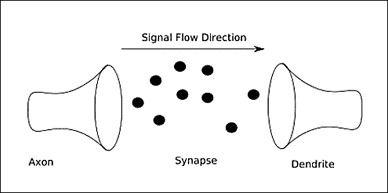

作为机器学习领域的类比，输入连接的强度是根据其被使用的频率来确定的，因此其影响神经元输出的程度也随之确定。这就是人类潜意识中学习新概念的方式。

此外，还可能有外部因素，如药物或身体化学成分，可能会影响这一学习过程。

现在我们将最终通过以下列表总结大脑内部的学习过程：

+   神经元与其他神经元或有时受体进行通信。皮层神经元使用尖峰进行通信。

+   神经元之间的连接强度可以改变。它们可以通过建立和移除神经元之间的连接，或者根据神经元对其他神经元可能产生的影响来加强连接，从而取正值或负值。一个称为**长期增强**（**LTP**）的过程发生，从而产生这种长期影响。

+   大约有 10¹¹ 个神经元，它们的权重使得人类大脑的计算比工作站更有效率。

+   最后，大脑是模块化的；大脑皮层的不同部分负责做不同的事情。某些任务在某个区域比其他区域注入更多的血流，从而确保不同的结果。

在将神经元模型 schematizing 到**人工神经网络**（**ANN**）之前，让我们首先看看神经元的不同类型、类别或方面，特别是人工神经元或感知器，这是生物神经元的深度学习等效物。这种方法已知在我们在上一节中列出的某些用例中产生了极其高效的结果。ANN 也被称为前馈神经网络、**多层感知器**（**MLP**），以及最近，深度网络或学习。其中一个重要特征是需要特征工程，而深度学习则代表需要最少特征工程的应用，学习通过多个学习的神经元层发生。

### 人工神经元或感知器

很明显，人工神经元是从生物神经元那里获得灵感的，正如之前所展示的那样。人工神经元的特点如下：

+   从其他神经元接收一组输入，这些输入激活了神经元

+   有一个输出传输器，用于传输信号或激活其他神经元

+   最后，核心处理单元负责从输入激活中产生输出激活

理想化神经元是一个应用于构建模型的过程。简而言之，它是一个简化过程。一旦简化，就可以应用数学和建立类比。在这种情况下，我们可以轻松地增加复杂性，并在已识别的条件下使模型更加健壮。在简化过程中，需要特别注意不要删除任何显著贡献的方面。

#### 线性神经元

线性神经元是神经元的最简单形式；它们可以表示如下：

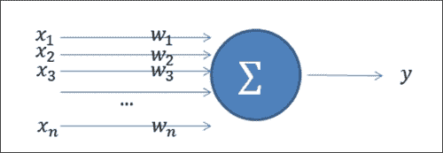

输出 *y* 是输入 *x[i]* 和其权重 *w[i]* 的乘积之和。这可以用以下方式在数学上表示：

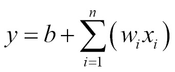

这里，*b* 是偏置。

之前方程的图形表示如下：

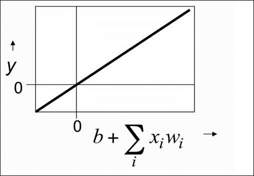

#### 矩形线性神经元/线性阈值神经元

矩形线性神经元与线性神经元类似，如前所述，只是在输出参数值小于（<）零（0）时将其设置为零，而在输出值大于（>）零（0）时，它继续作为输入的线性加权和：

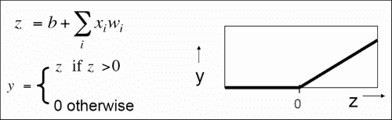

#### 二元阈值神经元

二元阈值神经元由 McCulloch 和 Pitts 于 1943 年引入。这类神经元首先计算输入的加权总和，类似于线性神经元。如果这个值超过一个定义的阈值，就会发送一个固定大小的脉冲到活动状态。这个脉冲被称为命题的*真值*。另一个重要点是输出。在任何给定时间点的输出是二进制的（0 或 1）。

展示这种行为的方程如下：

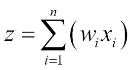

并且

*y = 1* 如果 *z ≥ θ*，

*y = 0* 否则

这里 *θ = -b (偏置)*

（或者）

并且

*y = 1* 如果 *z ≥ 0*，

*y = 0* 否则

此外，之前方程的图形表示如下：

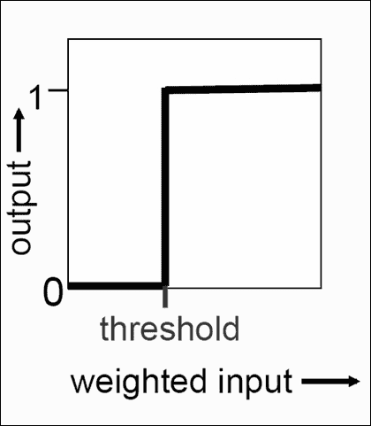

#### Sigmoid 神经元

Sigmoid 神经元在人工神经网络中得到了广泛的应用。这些神经元因其提供平滑、实值输出而闻名，因此是所有输入的有界函数。与迄今为止我们所看到的神经元类型不同，这些神经元使用对数函数。

对数函数因其易于计算的导数而闻名，这使得学习变得容易。这个导数值用于计算权重。以下是 sigmoid 神经元的输出方程：

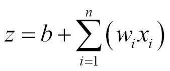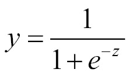

图形表示如下：

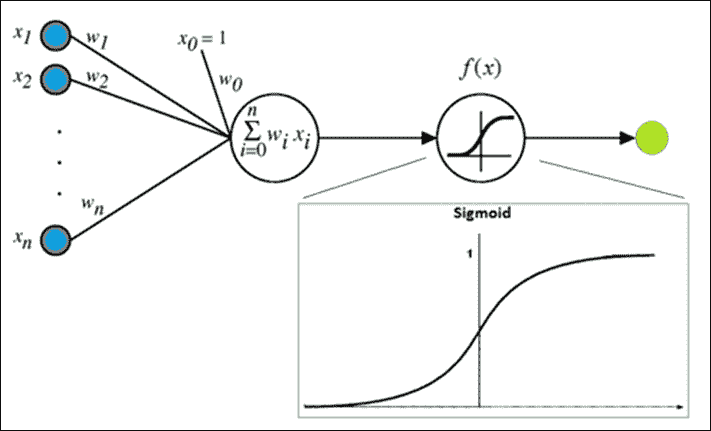

#### 随机二元神经元

随机二进制神经元使用与逻辑单元相同的方程，但有一个重要区别，即输出测量的是概率值，该值衡量在短时间内产生尖峰的概率。因此，方程看起来是这样的：

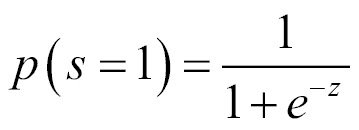

此外，该方程的图形表示如下：

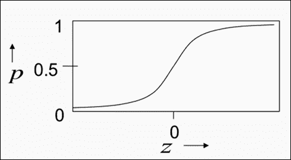

总体而言，我们可以观察到每个神经元接受了一组输入的加权和，并应用了非线性激活函数。对于解决回归问题，通常应用修正线性函数；对于分类问题，应用逻辑函数。这种通用的表示可以如下给出：

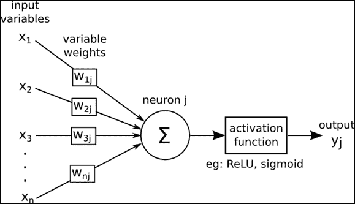

现在，这些输入可以被输入到一系列的神经元层中。让我们看看接下来会发生什么以及它是如何发生的。输入层推动输入值；然后神经元隐藏层将这些值作为输入。在这些隐藏层中可能有多个层，其中一层输出作为下一层的输入。每一层都可以负责专门的学习。此外，最后，隐藏层的最后一个输入到最终输出层。以下图展示了人工神经网络（ANN）的典型结构。下一个图中的每个圆圈代表一个神经元。**信用分配路径**（**CAP**）的概念指的是从输入到输出的路径。在前馈网络中，路径的长度是总隐藏层数量加上输出层。以下图显示了一个具有单个隐藏层和层间连接的前馈神经网络：

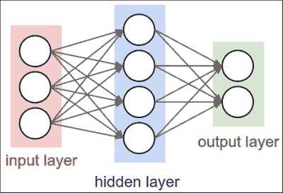

这里展示了具有两个隐藏层的案例：

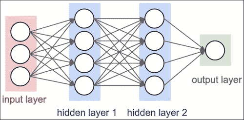

### 神经网络大小

计算神经元或参数的数量如下所示：

+   对于单层网络：

    神经元总数 = 4 + 2 = 6（输入不计入）

    总权重 = [3 x 4] + [4 x 2] = 20

    总偏差 = 4 + 2 = 6，对于 26 个可学习的参数。

+   对于双层网络：

    神经元总数 = 4 + 4 + 1 = 9（输入不计入）

    总权重 = [3 x 4] + [4 x 4] + [4 x 1] = 12 + 16 + 4 = 32

    总偏差 = 4 + 4 + 1 = 9，对于 41 个可学习的参数

那么，神经网络的理想大小是什么？识别每个层的可能大小以及隐藏层的数量非常重要。这些决策决定了网络的能力。更高的值有助于支持更高的能力。

让我们举一个例子，我们将通过获取以下分类器来尝试三种不同大小的隐藏层：

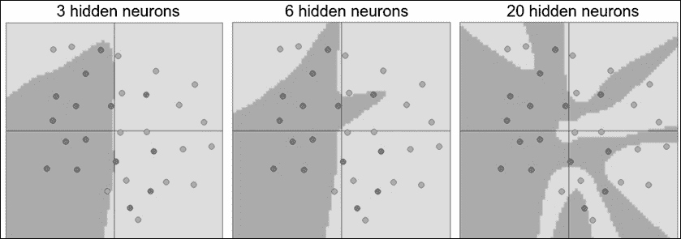

显然，随着神经元数量的增加，可以表达更复杂的函数，这是好事，但我们需要注意过拟合的情况。因此，对于更简单的数据，较小的网络效果较好。随着数据复杂性的增加，需要更大的网络。这种权衡总是在处理模型的复杂性与过拟合之间。深度学习通过应用复杂模型来解决极复杂问题，并通过采取额外措施来处理过拟合。

#### 一个例子

下一个示例展示了使用多层感知器方法进行的人脸识别案例：

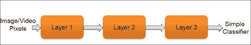

多层将此图像作为输入，最终创建并存储分类器定义。

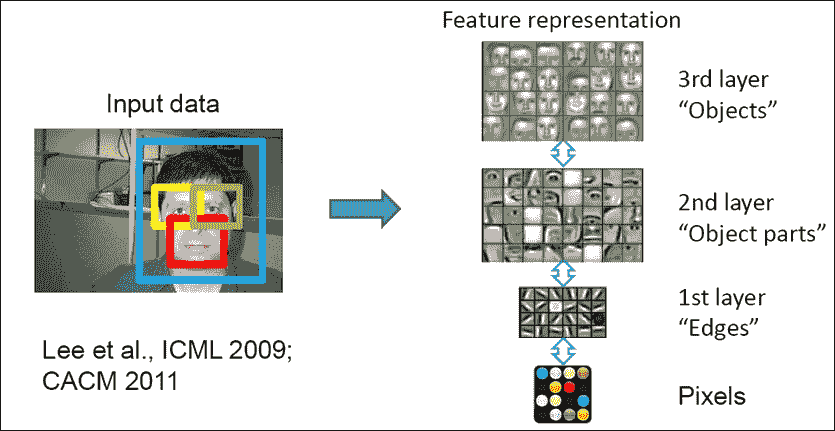

给定一张照片，每一层专注于学习照片的特定部分，最终存储输出像素。

关于权重和误差度量的一些关键点如下：

+   训练数据是学习神经元权重的来源

+   错误度量或损失函数与回归和分类问题不同。对于分类，应用对数函数，而对于回归，使用最小二乘度量。

+   这些方法通过使用凸优化技术（如梯度下降法）更新权重来帮助控制这些误差度量。

### 神经网络类型

在本节中，我们将介绍一些关键类型的神经网络。以下概念图列出了几种主要的神经网络类型：

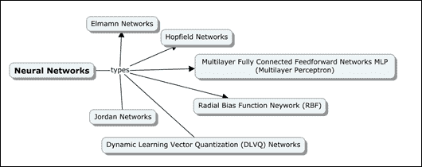

#### 多层全连接前馈网络或多层感知器（MLP）

如神经网络简介部分所述，MLP 有多个层，其中一层的输出作为下一层的输入。多层感知器如图所示：

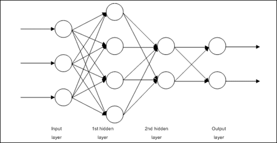

#### Jordan 网络

Jordan 网络是部分循环网络。这些网络是当前的前馈网络，不同之处在于输入层内部有额外的上下文神经元。这些上下文神经元是自我强制的，并使用来自输入神经元的直接反馈创建。在 Jordan 网络中，上下文神经元的数量始终等于输入神经元。以下图显示了输入层的差异：

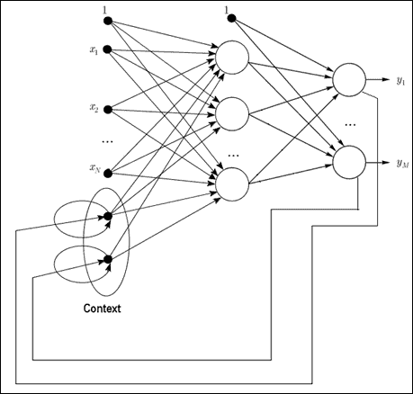

#### Elman 网络

Elman 网络，就像 Jordan 网络一样，是部分递归的前馈网络。这些网络也有上下文神经元，但在这个情况下，主要区别在于上下文神经元接收来自输出神经元的输入，而不是来自隐藏层。上下文神经元的数量与输入神经元的数量之间没有直接关联；相反，上下文神经元的数量与隐藏神经元的数量相同。这反过来使得这个模型更加灵活，就像隐藏神经元的数量在具体情况下一样：

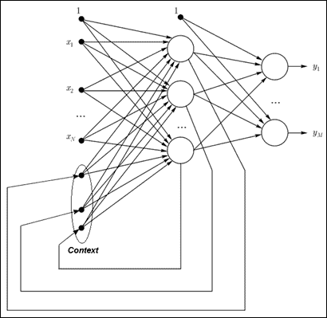

#### 径向偏置函数（RBF）网络

径向偏置函数网络也是前馈神经网络。这些网络有一个特殊的隐藏层，包含称为径向对称神经元的特殊神经元。这些神经元用于使用高斯度量将输入向量与中心之间的距离值进行转换。这个额外层的好处是它提供了确定所需层数的能力，而无需人工干预。线性函数的选择决定了最优输出层。因此，在这些网络中，学习过程相对较快，甚至与反向传播相比也是如此。

这种方法的唯一缺点是处理大型输入向量的能力。下面的图示展示了径向对称神经元的隐藏层。

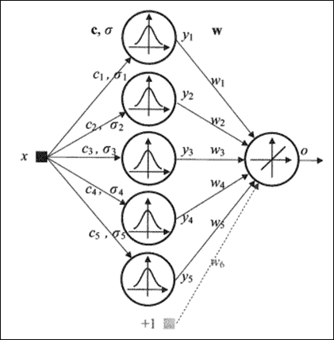

#### 跳时网络

跳时网络围绕一个称为“网络能量”的概念进行工作。这实际上就是网络的最优局部最小值，它定义了功能性的平衡状态。跳时网络的目标是达到这个平衡状态。平衡状态是指某一层的输出等于前一层的输出。以下图示展示了如何在跳时网络中检查和管理输入和输出状态：

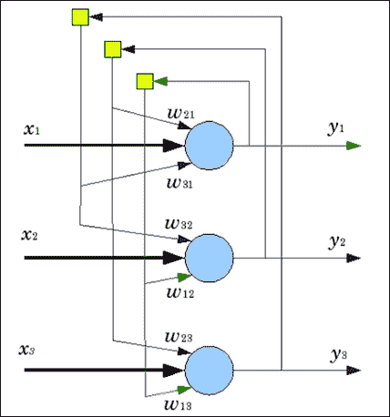

#### 动态学习向量量化（DLVQ）网络

**动态学习向量量化**（**DLVQ**）网络模型是神经网络的一种变体，它从较少的隐藏层开始，并动态生成这些隐藏层。对于属于同一类的模式具有相似性是很重要的；因此，这个算法最适合分类问题，如模式识别、数字识别等。

#### 梯度下降法

在本节中，我们将探讨优化神经网络最流行的一种方法之一，即最小化成本函数、最小化错误并提高神经网络准确性的方法：梯度下降法。这里的图表显示了实际值与预测值之间的差异，以及预测不准确的情况：

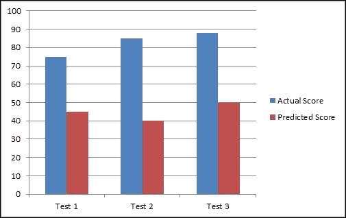

## 反向传播算法

在继续讨论网络训练的话题时，梯度下降算法帮助神经网络学习权重和偏置。此外，为了计算损失函数的梯度，我们使用一个称为反向传播的算法。反向传播首次在 20 世纪 70 年代被讨论，直到 20 世纪 80 年代才在应用方面变得突出。已经证明，当使用反向传播算法时，神经网络学习速度更快。

在本章的早期部分，我们看到了基于矩阵的算法是如何工作的；反向传播算法使用了类似的符号。对于一个给定的权重*w*和偏置*b*，损失函数 C 有两个偏导数，分别是*∂C/∂w*和*∂C/∂b*。

关于反向传播的损失函数的一些关键假设在此处陈述。让我们假设损失函数由以下方程定义：

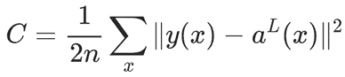

其中，*n* = 训练示例的数量

*x* = 对单个训练集求和

*y* = *y(x)*是期望输出

*L* = 神经网络中的总层数

*a^L* = *a^L(x)*是输出激活向量

假设 1：整体损失函数可以是单个损失函数的平均值。对于*x*个单独的训练集，损失函数现在可以表述如下：

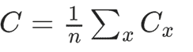

此外，单个训练集的损失函数可以如下所示：

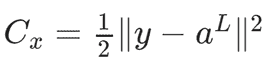

基于这个假设，由于我们可以计算每个训练集*x*的偏导数∂[x]C/∂w 和∂[x]C/∂b，所以整体偏导数函数∂C/∂w 和∂C/∂b 可以是每个训练集偏导数的平均值。

假设 2：这个假设是关于损失函数*C*，即*C*可以是神经网络输出的函数，如图所示：

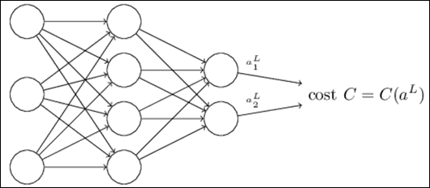

将损失函数的先前方程式扩展，每个训练示例集*x*的二次损失函数现在可以写成如下形式。我们可以看到它如何作为输出激活的函数。

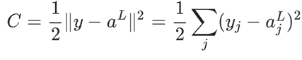

反向传播是关于权重和偏置对整体损失函数值的影响。

首先，我们计算第*l*层的第*j*个神经元的误差*δ^l[j]*，然后使用这个值来计算与这个误差*δ^l[j]*相关的偏导数：

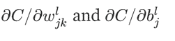

第*l*层的第*j*个神经元的误差函数*δ^l[j]*可以定义为：

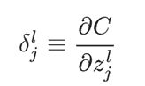

因此，层*L*的误差*δ^L*也可以计算。这反过来又帮助计算损失函数的梯度。

反向传播算法按顺序使用以下方程，如图所示：

方程式 1：给定位置 *j* 的神经元，层 *L* 的计算误差 *δ^L*。

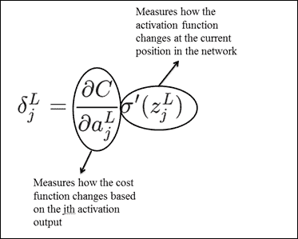

方程式 2：给定下一层的误差 *δ^(L+1)*，层 *L* 的计算误差 *δ^L*。

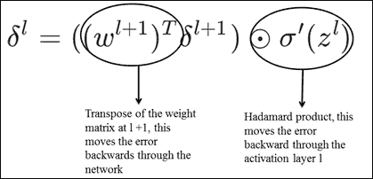

### 注意

Hadamard 积是一种矩阵乘法技术，用于逐元素矩阵乘法，如下所示：

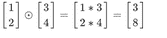

符号  用于表示此方法。

方程式 3：此方程衡量对成本的影响，并给出偏差的变化：

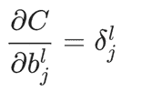

此外，我们还可以从方程式 1 和 2 得到以下内容：

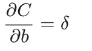

这是因为误差值与偏导数的改变率相同。

方程式 4：此方程用于计算成本变化率与权重的关系。

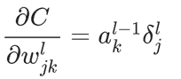

在这些算法的每个阶段，都有某种学习影响网络的总体输出。

这里解释了编译后的最终反向传播算法：

1.  输入层 *x*，对于 *x =1* 设置激活为 *a¹*。

1.  对于其他每一层 *L = 2, 3, 4 … L*，计算激活如下：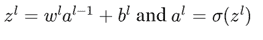

1.  使用方程式 1 和 2 计算误差 *δ^L*。

1.  使用方程式 3 反向传播误差 *l = L-1, L-2, … 2*, 1。

1.  最后，使用方程式 4 计算成本函数的梯度。

如果我们观察算法，错误向量 *δ^l* 是从输出层开始反向计算的。这是事实，因为成本是网络输出的函数。为了理解早期权重对成本的影响，需要应用链式法则，该方法通过所有层反向工作。

## Softmax 回归技术

Softmax 回归也称为多项式逻辑回归。本节不深入探讨逻辑回归的概念，因为它在本书中关于回归的章节中已有涉及。相反，我们将具体探讨如何将这种技术在深度学习用例中的数字识别相关问题上应用。

这种技术是逻辑回归的一个特例，适用于多类别。正如我们所学的，逻辑回归的结果是一个二进制值 *{0,1}*。Softmax 回归便于处理 *y(i)<--{1,…,n}*，其中 *n* 是类别的数量，相对于二进制分类。在 MNIST 数字识别案例中，*n* 的值是 10，代表 10 个不同的类别。例如，在 MNIST 数字识别任务中，我们会遇到 *K=10* 个不同的类别。

由于其处理多个类别的能力，这项技术在基于神经网络的解决问题领域中得到了积极的应用。

# 深度学习分类法

这里展示了深度学习案例的特征学习分类法：

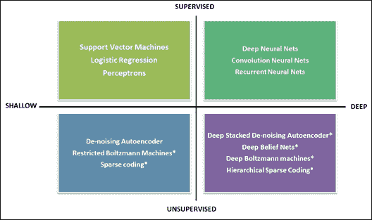

这里列出了用于实现神经网络应用的一些框架：

+   Theano 是一个 Python 库

+   Torch 是 Lua 编程语言

+   Deeplearning4J 是一个开源的基于 Java 的框架，与 Spark 和 Hadoop 一起工作

+   Caffe 是一个基于 C++ 的框架

## 卷积神经网络 (CNN/ConvNets)

CNN，也称为卷积网（ConvNets），是常规神经网络的变体。

让我们回顾一下常规神经网络的函数。常规神经网络有一个基于向量的单个输入，它通过一系列隐藏层进行转换，其中每一层的神经元与其相邻层的神经元相连。这个系列中的最后一层提供输出。这个层被称为输出层。

当神经网络输入是一个图像，并且不仅仅适合单个向量结构时，复杂性会增加。CNN 有这种轻微的变化，其中输入被假定为具有深度（D）、高度（H）和宽度（W）的三维向量。这种假设改变了神经网络的组织方式和功能方式。以下图比较了标准三层神经网络与 CNN。

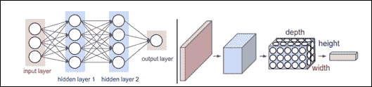

如我们所见，前面展示的卷积网以三维方式排列神经元；网络中的每一层都将这些转换为神经元激活的 3D 输出。

卷积网络架构包含一组用于特定功能的固定层。其中最关键的层如下：

+   **卷积层** (**CONV**)

+   **池化层** (**POOL**)

+   **全连接** (**FC**) 层

在某些情况下，激活函数被写成另一个层（RELU）；全连接层转换可能存在一个独特的归一化层。

### 卷积层 (CONV)

卷积层是卷积网的核心。这个层负责以三维格式保持神经元，因此负责三维输出。以下是一个具有 32 x 32 x 3 维度的输入体积的示例。如图所示，每个神经元都连接到特定的输入区域。在深度方向上可以有多个神经元；在示例中我们可以看到五个神经元。

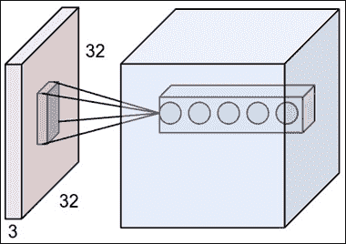

此图展示了网络卷积函数在神经元函数表示中的工作方式：

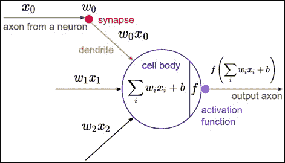

也就是说，神经元的核心理念保持不变，负责计算权重和输入的乘积，然后观察非线性行为。唯一的区别是对局部区域的连接限制。

### 池化层 (POOL)

可以有多个卷积层，在这些卷积层之间，可以有池化层。池化层负责通过减少输入体积的空间大小来降低过拟合的可能性。空间大小的减少意味着减少网络中的参数数量或计算量。MAX 函数有助于减少空间大小。池化层使用 MAX 函数，并在三维表示的每个切片上应用它，切片是按深度进行的。通常，池化层应用 2 X 2 大小的过滤器，沿宽度和高度应用。这可以丢弃大约 75%的激活。

总体来说，池化层具有以下特点：

+   总是考虑一个体积大小为 W1×H1×D1 作为输入

+   应用步长 S 和空间范围 F，生成 W2×H2×D2 输出，其中：

    W2=(W1−F)/S+1

    H2=(H1−F)/S+1

    D2=D1

### 全连接层（FC）

全连接层与常规或传统神经网络非常相似，负责与前一层激活建立广泛的连接。连接激活是通过矩阵乘法技术计算的。更多细节可以参考本章前面的部分。

## 循环神经网络（RNNs）

RNNs 是神经网络的一种特殊情况，已知在记住信息方面非常高效，因为隐藏状态是以分布式方式存储的，因此它可以存储更多关于经验的信息。这些网络还应用非线性函数来更新隐藏状态。以下图表描述了 RNNs 中隐藏状态是如何连接的：

在大多数现实世界的例子中，输入和输出并不是相互独立的。例如，如果我们必须预测下一个单词，那么了解它之前的单词对我们来说很重要。正如其名所示，“循环”神经网络一次又一次地执行相同的任务，其中一次执行的输入是前一次执行的输出。通常，RNNs 只回溯过去的一步或几步，而不是总是通过所有迭代。以下图表描述了 RNNs 的工作原理；它显示了 RNNs 如何在迭代中展开：

在上一个例子中，要求预测下一个单词，如果输入有五个单词，那么 RNN 展开到五层。

## 受限玻尔兹曼机（RBMs）

RBMs 的出现是为了解决训练 RNNs 的困难。受限循环模型的出现简化了问题背景，并且还应用了学习算法来解决问题。Hopfield 神经网络是解决之前描述问题的受限模型的一个例子。

作为第一步，玻尔兹曼机出现了。这些模型是具有随机元素的 Hopfield 神经网络的特例。在这种情况下，神经元分为两类：一类产生可见状态，另一类产生隐藏状态。这也类似于隐藏马尔可夫模型。RBM 是玻尔兹曼机的特例，主要区别在于同一层神经元之间没有连接。因此，对于一组神经元的给定状态，另一组神经元的状态是独立的。以下图展示了典型的 RBN 结构和之前的定义：

进一步从这个定义进行深入解释，一些神经元的可见状态是可观察的，还有一些神经元的隐藏状态是不可见的或不能直接看到。基于可用的可见状态，对隐藏状态做出一些概率推断，这就是训练模型形成的方式。

在 RBM 中，连接是受限的，这反过来又简化了推理和学习。通常只需一步就能达到一个平衡状态，其中可见状态被固定。以下公式显示了在提供可见状态信息的情况下，如何计算隐藏状态的概率：

## 深度玻尔兹曼机 (DBMs)

DBMs 是具有许多缺失连接的传统玻尔兹曼机的特例，并且与顺序随机更新不同，允许并行更新以确保模型效率。

DBMs 限制了隐藏变量之间的连接，主要使用未标记数据来训练模型。标记数据用于微调模型。以下图展示了三层 DBM 的一般结构：

## 自动编码器

在我们了解自动编码器之前，让我们先了解**自联想器**（**AA**）。AA 的目标是以尽可能高的精度接收输入。

AA（自动编码器）的目的是尽可能精确地将输出作为输入图像。AA 分为两大类：一类是生成 AA，另一类是合成 AA。上一节中提到的 RBMs 属于生成 AA，而自动编码器则是合成 AA。

自动编码器是一种具有单个开放层的神经网络。应用反向传播和无监督学习技术，自动编码器从假设目标值等于输入值开始，*y = x*。以下图展示了一个学习函数*h[W,b] (x) ≈ x*的自动编码器：

中间层是开放的，如图中所示，为了获得最佳输出，这个层的神经元数量必须少于输入层的神经元数量。这个模型的目标是学习一个近似于恒等函数的函数，使得**层 L[3]**的值等于**层 L[1]**的值。

数据在通过输入到输出层时被压缩。当将某个像素图像（例如 100 像素，10 X 10 像素）输入到具有 50 个神经元的隐藏层时，网络试图通过保持像素配置不变来压缩图像。这种压缩只有在存在隐藏的互连和其他可以减少输入数据的特征相关性时才可能实现。

自编码器的另一种变体是**降噪自编码器**（**DA**）。这种自编码器变体的不同之处在于它具有额外的能力，可以恢复和恢复受损坏输入数据影响的原始状态。

# 实现 ANN 和深度学习方法

请参考本章提供的源代码来实现本章中涵盖的人工神经网络和其他深度学习方法（源代码路径为`.../chapter11/...`，位于每个技术文件夹下）。

## 使用 Mahout

请参考文件夹`.../mahout/chapter11/annexample/`。

请参考文件夹`.../mahout/chapter11/dlexample/`。

## 使用 R

请参考文件夹`.../r/chapter11/annexample/`。

请参考文件夹`.../r/chapter11/dlexample/`。

## 使用 Spark

请参考文件夹`.../spark/chapter11/annexample/`。

请参考文件夹`.../spark/chapter11/dlexample/`。

## 使用 Python（Scikit-learn）

请参考文件夹`.../python-scikit-learn/chapter11/annexample/`。

请参考文件夹`.../python-scikit-learn/chapter11/dlexample/`。

## 使用 Julia

请参考文件夹`.../julia/chapter11/annexample/`。

请参考文件夹`.../julia/chapter11/dlexample/`。

# 摘要

在本章中，我们介绍了生物神经元的模型以及人工神经元如何与其功能相关。你学习了神经网络的核心概念，以及全连接层是如何工作的。我们还探讨了与矩阵乘法结合使用的一些关键激活函数。
