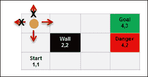
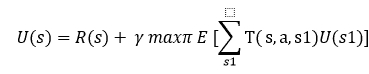

# 第十二章。强化学习

我们在第五章*基于决策树的学习*中深入探讨了监督学习和无监督学习方法，并介绍了各种算法。在本章中，我们将介绍一种不同于监督学习和无监督学习的新学习技术，称为**强化学习**（**RL**）。强化学习是一种特定的机器学习方法，其学习过程由环境的反馈驱动，学习技术是迭代和自适应的。强化学习被认为更接近人类学习。强化学习的主要目标是决策，其核心是**马尔可夫决策过程**（**MDP**）。在本章中，我们将介绍一些基本的强化学习方法，如**时间差分**（**TD**）、确定性等价、策略梯度、动态规划等。以下图展示了本章将涵盖的不同数据架构范例：

本章将深入探讨以下主题：

+   监督学习、半监督学习和无监督学习的回顾，以及强化学习的背景。

+   理解马尔可夫决策过程（MDP）对于强化学习至关重要。关于这一点，本章将涵盖以下主题：

    +   MDP 代表什么，关键属性，状态，奖励，动作和转移（折扣）

    +   MDP 的底层过程以及它如何帮助决策过程

    +   策略和价值函数（也称为效用，如在奖励组中）以及我们如何对无限序列的奖励进行赋值

    +   **贝尔曼方程**——值迭代和政策迭代

+   关于强化学习，我们将涵盖以下内容：

    +   在 MDP 中的规划和学习

    +   强化学习中的连接规划和功能逼近

    +   不同的强化学习方法和对强化学习的不同方法，例如简单的决策理论、**时间差分**（**TD**）、动态规划、策略梯度、确定性等价和资格痕迹

    +   如 Q-learning、Sarsa 等关键算法

    +   强化学习应用

# 强化学习（RL）

让我们回顾一下监督学习、半监督学习和无监督学习，并为强化学习设定背景。在第一章*机器学习简介*中，我们介绍了监督学习、半监督学习和无监督学习的基本定义。归纳学习是一种推理过程，它使用一个实验的结果来运行下一组实验，并从具体信息中迭代地进化模型。

以下图展示了机器学习的各个子领域。这些子领域是机器学习算法分类的一种方式：

监督学习主要涉及根据已知期望进行操作，在这种情况下，需要从定义的数据中进行分析。在此背景下，输入数据集也被称为**标记**数据集。属于这一类别的算法专注于建立输入和输出属性之间的关系，并利用这种关系推测性地为新输入数据点生成输出。在前一节中，为分类问题定义的示例也是监督学习的一个例子。标记数据有助于构建可靠的模型，通常成本高昂且有限。以下图表展示了监督学习的工作流程：

因此，这是一个函数逼近，给定 *x* 和 *y* 对，我们的目标是找到将新的 *x* 映射到适当的 *y* 的函数 *f*：

*y = f(x)*

在一些学习问题中，我们并没有特定的目标来解决；这种学习被称为无监督分析或学习。在这种情况下，目标是解析数据中的结构，而不是在数据的输入和输出属性之间建立映射，实际上，输出属性并未定义。这些学习算法由于这个原因在**无标记**数据集上操作。

因此，给定一系列 *x*，这里的目的是定义一个函数 *f*，它可以对一组 *x* 提供简洁的描述。因此，这被称为聚类：

*f(x)*

半监督学习涉及使用标记和无标记数据来学习更好的模型。对于无标记数据，必须存在适当的假设，因为任何错误的假设都可能使模型无效。半监督学习从人类的学习方式中汲取灵感。

## 强化学习的背景

强化学习关注的是最大化结果带来的奖励。例如，在教导幼儿新习惯时，每次幼儿遵循指示就给予奖励非常有效。事实上，他们发现哪些行为有助于他们获得奖励。这正是强化学习所做的事情，它也被称为信用评估学习。

强化学习最重要的地方在于，模型还需要负责做出决策，而这些决策会收到周期性的奖励。在这种情况下，与监督学习不同，结果不是立即的，可能需要执行一系列步骤才能看到最终结果。理想情况下，算法将生成一系列决策，以帮助实现最高的奖励或效用。

这种学习技术的目标是通过对数据和利用进行探索来有效地衡量权衡。例如，当一个人需要从点 A 到点 B 旅行时，会有许多方式，包括空中、水上、路上或步行，考虑这些选项的权衡数据具有很大的价值。另一个重要方面是，奖励的延迟意味着什么？此外，它会如何影响学习？例如，在象棋等游戏中，奖励识别的任何延迟都可能改变或影响结果。

因此，表示与监督学习非常相似，区别在于输入不是 *x*、*y* 对，而是 *x*、*z* 对。目标是找到一个函数 *f*，给定 *x* 和 *z* 识别一个 *y*。在接下来的章节中，我们将进一步探讨 *z* 是什么。目标函数的定义方程如下：

*y = f(x)* 给定 *z*。

强化学习的一个正式定义如下：

|   | *"强化学习被定义为通过奖励和惩罚来编程代理的方法，而不需要指定如何完成任务。" |   |
| --- | --- | --- |
|   | --*凯尔宾、利特曼、摩尔，96* |

因此，总的来说，强化学习既不是一种神经网络类型，也不是神经网络的替代品，而是一种正交的机器学习方法，重点在于学习反馈，用于评估学习者的表现，没有标准的行为目标来衡量表现，例如学习骑自行车。

让我们现在看看正式或基本的强化学习模型，并了解动作中的不同元素。作为第一步，让我们了解一些基本术语。

+   **代理**：代理是一个既是学习者又是决策者的实体，在这种情况下通常是一个智能程序。

+   **环境**：环境是一个实体，负责在代理执行动作后产生新的情况。它为动作提供奖励或反馈。所以，简而言之，环境是除了代理之外的一切。

+   **状态**：状态是动作使实体所处的情形。

+   **动作**：动作是代理执行的一步，导致状态的变化。

+   **政策**：政策是在特定时间点代理行为的定义。它阐述了状态和动作之间的映射，通常是一个简单的业务规则或函数。

+   **奖励**：奖励规定了动作的短期利益，有助于达到目标。

+   **价值**：在强化学习中还有一个重要的元素，那就是价值函数。虽然奖励函数是关于动作的短期或即时利益，但价值函数是关于长期的好处。这个价值是代理从世界开始时预期获得的奖励的累积。

### 强化学习的例子

理解强化学习的最简单方法之一是看看它的实际和现实世界应用。在本节中，我们将列出并理解其中的一些。

+   **棋类游戏**：在棋类游戏中，玩家进行一步棋；这一步棋是由一个经过信息选择的动作驱动的，该动作伴随着对手玩家的反制动作。玩家的下一步动作取决于对手采取了哪些动作。

+   **电梯调度**：让我们以一栋有许多楼层和许多电梯的建筑为例。这里的关键优化需求是选择哪个电梯应该被派往哪个楼层，这被归类为一个控制问题。这里的输入是一组楼层上（电梯内外）按下的按钮、电梯的位置和一组楼层。在这种情况下，奖励是最少等待时间，即想要使用电梯的人的等待时间。在这里，系统通过在建筑模拟中的学习，再次学习如何控制电梯；通过从过去动作的价值估计中学习。

+   **网络数据包路由**：这是一个为动态变化的网络定义路由策略的案例。Q 学习技术（在本章稍后部分将简要介绍）用于确定数据包应该路由到哪个相邻节点。在这种情况下，每个节点都有一个队列，并且一次只发送一个数据包。

+   **移动机器人行为**：移动机器人需要根据它过去能够多快找到充电点的速度来决定是前往充电点还是下一个垃圾点。

### 评估反馈

强化学习与其他学习类型的关键区别之一在于，它使用信息来评估特定动作的影响，而不是盲目地指示需要采取哪些动作。一方面，评估反馈表明采取的动作有多好，另一方面，指导反馈则表明正确的动作是什么，无论动作是否被采取。尽管这两种机制在方式上有所不同，但在某些情况下，会同时采用一些技术。在本节中，我们将探讨一些评估反馈方法，这将为本章的其余部分奠定基础。

#### n 臂老虎机问题

这个问题的正式定义，与原始的赌徒类比如下：

### 注意

根据维基百科，n 臂老虎机问题是一个“赌徒”决定玩哪个机器、游戏的顺序和持续时间的问题，然后他开始玩并收集奖励，以最大化总奖励的问题。

让我们考虑一个有数千个动作可以采取的情况。每个动作都会获得一个奖励，我们的目标是确保我们以这种方式采取动作，使得在一段时间内奖励的总和最大化。选择特定动作的行为被称为 *play*。

一个解释 n-Armed Bandit 问题类比案例的例子是一位医生需要从一系列选项中选择来治疗严重疾病，其中患者的生存成为选择动作（在这种情况下，治疗）的奖励。在这个问题中，每个动作都与选择动作的预期奖励相关联；这被称为 *价值*。如果我们知道每个动作的价值，解决 n-Armed Bandit 问题就很容易，我们将选择那些具有最大价值的动作。只有可能的是，我们有价值的估计，而不是实际的价值。

现在我们来看一下探索和利用之间的区别。

假设我们保持对价值的估计，如果我们选择具有最大价值的动作（这种动作被称为贪婪动作），这种情况被称为利用，因为我们正在最好地使用手头的当前知识。此外，所有选择任何非贪婪动作的情况，更多的是探索，这有助于提高非贪婪动作的估计。虽然利用有助于最大化预期奖励，但探索有助于在长期内增加总奖励。在探索的情况下，短期奖励较低，而长期总奖励可能会更好。对于每个动作，可以选择探索或利用的方法，而有效的方法是这两种技术的良好平衡。

因此，有了这个，我们现在将探讨一些最佳估计动作值和选择最适合动作的技术。

#### 动作值方法

如果动作 *a* 的值是 *Q*(a)*，那么第 *t* 次游戏的评估值是 *Q*[t]*(a) I*，即在选择了该动作的情况下给出的奖励的平均值，以下方程表示这一点：

*Q*[t]*(a) = (r1+r2+ … r*[ka] *) / ka*，其中 *r* 是奖励，*ka* 是动作 *a* 被选择的次数。这是估计动作值的一种方法，但不一定是最好的方法。让我们接受这一点，现在来看看选择动作的方法。

最简单的动作选择规则是选择一个动作或动作之一，即 *a*，它具有最高的估计动作值。所以，对于给定的游戏 *t*，选择贪婪动作 *a* 可以表示如下：

Qt = max[a] Qt

这种方法根据定义利用了当前的知识，同时稍微关注一下动作是否是一个更好的选择。作为这种方法的替代，我们可以选择大多数时候采取贪婪策略，偶尔选择一个与价值估计无关的动作。以概率 ԑ，这种方法被称为 ԑ**-贪婪方法**。

#### 强化比较方法

在大多数选择方法中，我们看到具有最大奖励的动作比具有较小奖励的动作更有可能被选中。重要的问题是如何判断奖励是大还是小。我们始终需要有一个参考数字来判断奖励是高值还是低值。这个参考值被称为**参考奖励**。首先，参考奖励可以是之前收到的奖励的平均值。使用这个想法的学习方法被称为比较强化方法。这些方法比 actor-value 方法更有效，是我们将在后续章节中讨论的 actor-critic 方法的基础。

### 强化学习问题 – 世界网格示例

我们将尝试使用一个著名的例子来理解强化学习问题：网格世界。这个特定的网格世界是一个 3X4 网格，如下面的截图所示，是对世界复杂性的近似：

这个例子假设世界是一种游戏，你从一个称为起始状态的状态（从位置 *1,1*）开始。让我们假设可以采取四种动作，包括向左、向右、向上和向下移动。目标是确保使用这些动作，我们能够移动到表示在位置 *4,3* 的目标。我们需要避免像下一张图片中显示的那样在位置 *4,2* 显示的红框。

+   **起始状态**：位置 *(1,1) -->* 世界从这里开始。

+   **成功状态**：位置 *(4,3) -->* 世界在这里以成功状态结束。

+   **失败状态**：位置 *(4,2) -->* 世界在这里以失败状态结束。

+   当世界结束时，我们需要重新开始。

+   **墙壁**：在位置 *(2,2)* 显示了一个障碍物或墙壁。这个位置无法通过：

+   要从起点 *(1,1)* 达到目标 *(4,3)*，可以采取以下方向的步骤：

+   每个方向的每一步都会将你从一个位置移动到另一个位置（这里的“位置”只是状态）。例如，从位置 *(1,1)* 向*上*移动将带你到位置 *(1,2)*，依此类推。

+   从一个给定的位置不能采取所有方向。让我们考虑以下截图中的示例。从位置 *(3,2)*，只能采取*上*、*下*和*右*。*左*移动会撞到墙壁，因此不能采取。话虽如此，只有*上*和*下*的移动是有意义的，因为*右*会将你移动到危险位置，导致无法达到目标。

+   类似地，网格边界上的任何位置都将有限制，例如，位置 *(1,3)* 允许 *向右* 和 *向下* 移动，其他任何移动都不会改变位置。

+   现在我们来看从 *起点 (1,1)* 到 *目标 (4,3)* 的最短路径。有两种解决方案：

    +   **解决方案 1**：*向右* --> *向右* --> *向上* --> *向上* --> *向右* (5 步)

    +   **解决方案 2**：*向上* --> *向上* --> *向右* --> *向右* --> *向右* (5 步)

    

+   在现实世界中，并非所有动作都能按预期执行。存在一个可靠性因素，它会影响性能，或者说，存在不确定性。如果我们对示例稍作修改，并说每次从一位置移动到另一位置的动作，移动正确的概率是 0.8。这意味着有 80% 的可能性移动会按预期执行。在这种情况下，如果我们想测量解决方案 1 (*R*-->*R*-->*U*-->*U*-->*R*) 成功的概率：

    行为发生的预期概率 + 行为未按预期发生的概率

    *= 0.8 x 0.8 x 0.8 x 0.8 x 0.8 + 0.1 x 0.1 x 0.1 x 0.1 x 0.8*

    *= 0.32768 + 0.00008 = 0.32776*

+   如我们所见，不确定性的元素确实会改变结果。在下一节中，我们将讨论捕捉这些不确定性的决策过程框架。

### 马尔可夫决策过程 (MDP)

马尔可夫决策过程是做出决策的一个基本框架或过程，我们将在后续的强化学习章节中多次提到它。

**马尔可夫属性**是马尔可夫决策过程的核心，它指出重要的是当前或当前状态，并且情况是稳定的，这意味着规则不会改变。

MDP 尝试捕捉我们在前面章节中讨论的世界，它具有以下特征：

+   **状态**：在前面的例子中，每个网格位置代表一个状态

+   **模型**（转移函数）：转移函数包括三个属性：给定状态、动作和目标状态。它描述了在当前状态 *s* 和动作 *a* 下，结束状态 *s* 的概率：

    T (s, a,s') ~ P(s'/s, a)

+   **动作**：A(s)，A 在前面的例子中，*A (1, 2)* = *向上* 在 *向上*、*向上* *向右*、*向右*、*向右* 解决方案中

+   **奖励**：*R(s)*，*R(s,a)*，*R(s,a,s1)* 奖励告诉我们进入状态的有用性

    *R(s)*：进入状态 *s* 的奖励

    *R(s, a)*：打开状态 *s* 的动作 *a* 的奖励

    *R(s, a,s1)*：在状态 *s* 下执行动作 *a* 打开状态 *s1* 的奖励

+   状态、动作、模型和奖励构成了 MDP 的问题陈述

+   **策略**：它是对问题的解决方案；它说明了在给定状态下应该采取什么行动：

    *π(s)* --> *a*

### 基本强化学习模型 – 代理-环境接口

正如我们所发现的，强化学习问题是一种直接从交互中学习以实现目标的方法。代理是学习者或决策者，它与环境互动，而这个环境中的所有外部因素都会产生奖励。它与交互的事物，包括代理之外的所有事物，被称为环境。环境的完整规范定义为任务——强化学习问题的单个实例。

以下模型描述了代理-环境接口：

在这里，环境模型意味着一个代理使用任何东西来预测给定动作的环境行为的上下文。这个环境模型根据动作和当前状态产生对下一个状态和奖励的预测。如果模型是随机的，则可能存在多个下一个状态奖励。再次强调，这些模型可以是分布式的或基于样本的。分布式模型识别所有潜在的概率，而基于样本的模型在给定样本的情况下产生概率。

最后，强化学习的目标可以定义为以下内容：

+   在一个每个动作都会导致新情况出现的环境中，强化学习（RL）关注的是如何采取行动。以下是一些可能的动作：

    +   定义一个策略，将动作和结果情况映射

    +   确定导致最高奖励的策略

强化学习的步骤如下：

1.  代理观察输入状态。

1.  通过应用策略，这是一个决策函数，可以确定一个动作。

1.  执行动作导致状态变化。

1.  由于这个动作，代理从环境中获得了一个显著的奖励。

1.  根据状态的变化记录奖励的详细信息。

### 延迟奖励

区分强化学习与监督学习的一个方面是*奖励*。在本节中，我们将探讨延迟奖励的含义。正如我们所知，每个导致特定状态变化的动作都会产生奖励。在某些情况下，这种奖励的实现并不是立即的。让我们看看一个棋盘游戏的例子。假设棋盘游戏需要 65 步才能结束，只有在第 65 步或移动结束时，我们才能知道我们是否赢得了游戏或输了。哪一步或移动导致了成功或失败在这里是复杂的。因此，奖励直到游戏结束或动作序列结束时才可知。技术上，我们正在寻找识别哪个动作序列导致了所看到的奖励。这个过程被称为**时间信用分配**。

现在，在这个实现最终奖励（成功+1 或失败-1）的旅程中，每一步或移动或行动都会获得奖励。假设网格世界问题解决方案 1 中的每一步都获得奖励-0.4。导致成功或失败的总奖励将决定长期奖励。

### 策略

最佳策略是一种最大化预期长期奖励的策略或解决方案，可以用以下公式表示：

现在，让我们衡量一个特定状态（*s*）的效用，这取决于策略（*π*）：

进入状态（*s*）的奖励（这是一种即时利益）不等于该状态的效用（这是进入该状态的长远利益）。

现在，我们可以使用状态价值的效用来定义最佳策略：

现在，如果我们必须定义处于状态（*s*）的效用，它等于进入该状态的奖励，减去从该点开始获得的奖励：

这被称为**贝尔曼方程**。

*V* 是策略的价值函数，以下是将最优策略的价值与该状态的最佳预期回报相等的贝尔曼最优方程：

## 强化学习 – 关键特性

强化学习不是一系列技术，而是一系列问题，它关注的是任务本身，而不是如何处理任务。

强化学习被视为一种工具，机器可以通过更多基于试错法的奖励和惩罚来学习。

强化学习采用评估反馈。评估反馈衡量采取的行动的有效性，而不是衡量该行动是否为最佳或最差。（注意，监督学习更侧重于指导性学习，并确定行动的正确性，而不考虑执行的行动。）

强化学习中的任务更多的是相关任务。关联任务依赖于情况，其中识别并执行最适合给定情况的动作。非关联任务是指独立于特定情况的任务，当任务处于静止状态时，学习者找到最佳动作。

# 强化学习解决方案方法

在本节中，我们将详细讨论解决强化学习问题的一些方法。特别是动态规划（DP）、蒙特卡洛方法和时序差分（TD）学习。这些方法也解决了延迟奖励的问题。

## 动态规划（DP）

动态规划（DP）是一组算法，用于在给定环境模型（如马尔可夫决策过程）的情况下计算最优策略。动态规划模型在计算上昂贵，并假设完美模型；因此，它们的采用或效用较低。从概念上讲，DP 是以下章节中使用的许多算法或方法的基础：

1.  **评估策略**：可以通过迭代方式计算策略的价值函数来评估策略。计算策略的价值函数有助于找到更好的策略。

1.  **改进策略**：策略改进是一个使用其价值函数信息计算修订策略的过程。

1.  **值迭代和策略迭代**：策略评估和改进同时推导出值和策略迭代。这些是两种最流行的动态规划方法，用于在完全了解马尔可夫决策过程（MDPs）的情况下计算最优策略和价值函数。

以下算法描述了迭代策略过程：

值迭代结合了坚实的策略改进和过程评估。以下涉及到的步骤：

### 广义策略迭代（GPI）

GPI 是一种对动态规划（DP）方法进行分类的方法。GPI 涉及两个过程之间的交互——一个围绕近似策略，另一个围绕近似价值。

在第一种情况下，过程直接选择策略并执行策略评估以确定与策略相关联的真实或确切的价值函数。另一种过程以价值函数作为输入，并使用它来改变策略，以便改进策略，即其总奖励。如果你观察，每个过程都改变了另一个过程的基础，并且它们协同工作以找到导致最优策略和价值函数的联合解决方案。

## 蒙特卡洛方法

在强化学习中，蒙特卡洛方法通过经验样本学习策略和价值。由于以下原因，蒙特卡洛方法在动态规划方法之上具有额外的优势：

+   直接从与环境交互中学习最优行为，而不需要任何模拟模型动态的模型。

+   这些方法可以用于模拟数据或样本模型；这一特性在现实世界的应用中变得至关重要。

+   使用蒙特卡洛方法，我们可以轻松地关注更小的状态集，并且可以在不必要进入完整状态集的情况下探索感兴趣的区域。

+   蒙特卡洛方法对于任何违反马尔可夫属性的情况影响最小，因为价值的估计不是使用任何后续状态来更新的。这也意味着它们不需要自举。

蒙特卡洛方法是由**广义策略迭代**（**GPI**）方法设计的。这些方法提供了一种评估策略的替代方法。对于每个状态，而不是独立计算价值，取从该状态开始返回的平均值，这可以很好地近似该状态的价值。重点是应用动作值函数来改进策略，因为这不需要环境转换的变化。蒙特卡洛方法混合了策略评估和改进方法，可以逐步实现。

探索多少是足够的？这是蒙特卡洛方法中需要回答的关键问题。仅仅根据价值选择最佳动作是不够的；了解这些动作中有多少有助于结束奖励也很重要。

在这种情况下可以使用两种方法——**在策略**或**离策略**方法。在在策略方法中，智能体负责使用探索技术找到最优策略；而在离策略方法中，智能体的探索不是核心，但与之学习一个确定的最优策略，这个策略不必与遵循的策略相关。简而言之，离策略学习方法都是关于通过行为学习行为。

## 时序差分（TD）学习

TD 学习是强化学习中的独特技术之一。时序差分学习是蒙特卡洛方法和动态规划方法的结合。在强化学习中讨论最多的技术是时序差分（TD）、动态规划（DP）和蒙特卡洛方法之间的关系：

1.  评估一个包含估计给定策略π的价值函数 Vπ的策略。

1.  选择一个最优策略。对于策略选择，所有 DP、TD 和蒙特卡洛方法都使用广义策略迭代（GPI）的变体。因此，这三者之间的区别不过是 GPI 中的这些变体。

TD 方法遵循自举技术来得出估计；它们会回退到后续状态和类似的估计。

现在我们来看看 TD 方法相对于 DP 和蒙特卡洛方法的优点。我们将简要介绍，而不深入复杂性。以下是一些关键好处：

+   TD 方法不需要环境模型以及下一状态和奖励的概率分布

+   TD 方法可以轻松优雅地以在线和增量方式运行

### Sarsa - 在策略 TD

让我们看看如何使用 TD 方法来解决控制问题。我们将继续使用 GPI 技术，但现在结合 TD 方法进行评估和预测。虽然我们需要在探索和利用选项之间保持平衡，但我们有选择在策略或离策略学习方法中的选项。我们将坚持使用在策略方法：

1.  学习与状态值函数相关的动作值函数。我们将为策略 *π* 定义 *Q*^π*(s, a)*：

1.  学习从一个状态-动作对转换到另一个状态-动作对的值。这通过以下方式迭代计算：

这被定义为 Sarsa 预测方法，并且是 on-policy 的，因为智能体使用识别的策略来完成这个任务。

Sarsa 算法表述如下：

## Q-Learning – off-Policy TD

使用离策略学习方法的 Q-Learning 技术是 TD 的突破性策略之一。这种称为 Q-learning 的控制算法（Watkins，1989）以简单形式定义如下：

我们可以看到最优动作值函数 *Q** 是直接使用学习到的动作值函数 *Q* 近似，而不考虑它遵循的策略。这使得它成为一个 off-policy 方法。

由于策略值函数被使用和更新，因此对策略仍有一定的影响。此外，对所有对的勤奋标记标志着收敛。

基于这种理解，Q-learning 算法可以描述如下：

## Actor-critic methods (on-policy)

Actor-critic 方法是时间差分学习方法，它使用单独的记忆结构确保策略和值的独立性。在这种情况下，策略结构被称为 *actor*，值结构被称为 *critic*。名称 critic 来自于它批评策略的价值。由于这个 critic 总是批评策略的价值，它也被称为 TD 错误。以下截图显示了 actor-critic 方法流程：

## R Learning (Off-policy)

R-learning 是一种高级强化学习技术，用于没有折扣且有确定和有限回报的情况。算法如下：

## 实现强化学习算法

请参考本章提供的源代码来实现强化学习算法。（源代码路径 `.../chapter12/...` 在每个技术文件夹下。）

### 使用 Mahout

请参考文件夹 `.../mahout/chapter12/rlexample/`。

### 使用 R

请参考文件夹 `.../r/chapter12/rlexample/`。

### 使用 Spark

请参考文件夹 `.../spark/chapter12/rlexample/`。

### 使用 Python (Scikit-learn)

请参考文件夹 `.../python-scikit-learn/chapter12/rlexample/`。

### 使用 Julia

请参考文件夹 `.../julia/chapter12/rlexample/`。

# 摘要

在本章中，我们探索了一种名为强化学习的新学习技术。我们看到了它与传统的监督学习和无监督学习技术的不同之处。强化学习的目标是决策，其核心是马尔可夫决策过程（MDP）。我们探讨了 MDP 的要素，并通过一个例子来了解它。然后，我们介绍了强化学习的某些基本技术，包括策略学习和非策略学习，其中一些是间接和直接的学习方法。我们涵盖了动态规划（DP）方法、蒙特卡洛方法，以及一些关键的时序差分（TD）方法，如 Q 学习、Sarsa、R 学习和演员-评论家方法。最后，我们使用为本书确定的标准技术栈对这些算法进行了一些实际应用。在下一章中，我们将介绍集成学习方法。
