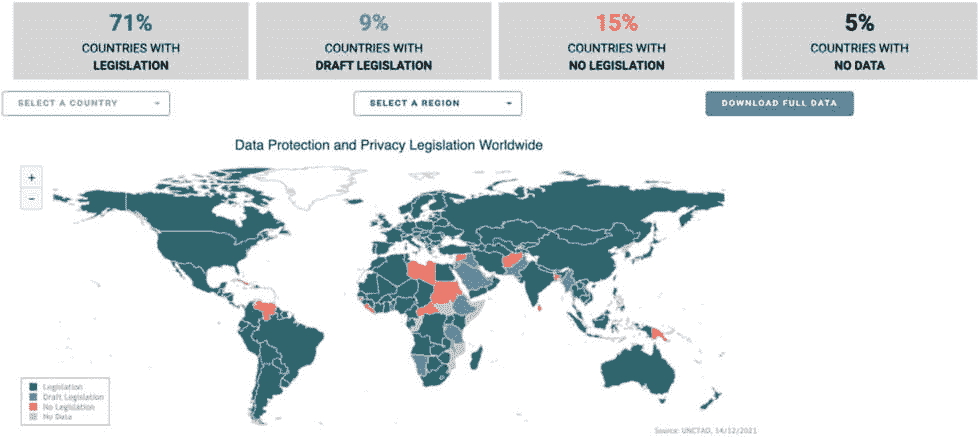
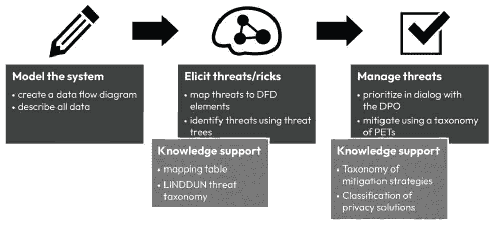
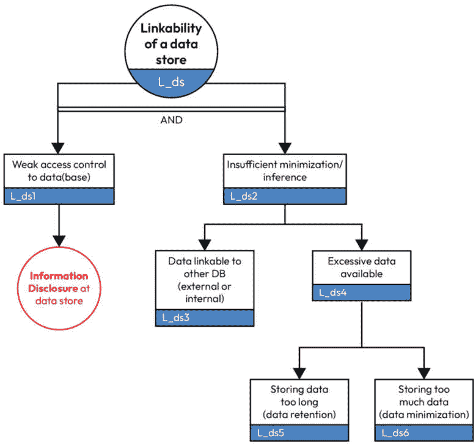
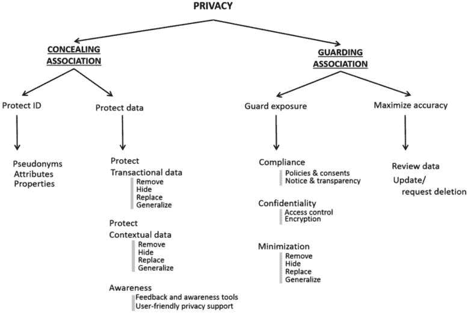

# 1

# 数据隐私、隐私泄露和威胁建模简介

在当今数字时代，隐私保护机器学习（ML）变得越来越重要，因为个人数据在各种行业中无处不在，包括医疗保健、金融和营销。虽然机器学习可以带来许多好处，如提高准确性和效率，但它也引发了关于隐私和安全的重大担忧。许多人越来越关注使用他们个人数据的风险，包括未经授权的访问、滥用和滥用。此外，还有如**通用数据保护条例**（GDPR）和**加州消费者隐私法案**（CCPA）等法规，要求组织在处理个人数据时遵守严格的隐私指南。

本书全面介绍了在有效实现机器学习（ML）的同时保护个人隐私的技术和工具。本书将帮助研究人员、机器学习工程师、软件工程师和从业者理解隐私的重要性以及如何将其融入他们的机器学习算法和数据处理流程中。本书架起了隐私理论基础与隐私保护机器学习技术实际应用之间的桥梁，使得在不妨碍个人隐私的前提下实现数据驱动的决策。

在本章的介绍中，我们将学习关于隐私的知识，包括数据隐私；敏感数据与个人敏感数据的区别；数据隐私法规；**隐私设计**（PbD）概念；以及为什么数据隐私很重要。在讨论了这些概念之后，我们将详细介绍使用 LINDDUN 框架进行隐私威胁建模，并通过示例解释可链接性和可识别性威胁。本章将帮助您更好地理解隐私及其重要性。我们将从高层次讨论关键的隐私法规，如 GDPR 和 CPRA，以及隐私威胁建模。在本章末尾，我们将讨论隐私保护机器学习的必要性以及一个用例。

我们将涵盖以下主要主题：

+   隐私和数据隐私的含义是什么？

+   隐私设计及案例研究

+   隐私泄露

+   隐私威胁建模

+   隐私保护机器学习的必要性

# 隐私和数据隐私的含义是什么？

Alan Westin 的理论将隐私描述为对个人信息处理和传达给他人的控制。Irwin Altman 补充说，隐私包括限制社交互动，并包括调节个人空间和领土。

个人数据包括任何可以单独使用或与其他元素结合使用以识别个人的信息，例如他们的姓名、年龄、性别、个人识别号码、种族、宗教、地址、电子邮件地址、生物识别数据、设备 ID、医疗数据和遗传数据，这些信息基于数据起源国规定的法规。

隐私是指个人保留其信息（无论是个人信息还是非个人信息）的能力，并基于他们的同意共享数据。隐私帮助个人维持对其个人生活的自主权。

数据隐私侧重于个人数据的用途和管理，以及确保数据以适当的方式收集、处理、共享和使用/推断。

## 隐私法规

根据联合国贸易和发展会议（**UNCTAD**）的最新统计数据，71%的国家都有自己的隐私法律，这显示了全球隐私和数据保护的重要性。

大多数隐私法律处理敏感个人数据的收集、数据处理、与其他方共享数据以及数据主体权利。世界上 194 个国家的 137 个国家都有法律立法来保护数据和个人的数据隐私。

图 1.1 – 截至 2021 年 12 月的全球隐私立法

来源：[`unctad.org/page/data-protection-and-privacy-legislation-worldwide`](https://unctad.org/page/data-protection-and-privacy-legislation-worldwide)

在全球范围内的这些隐私法规中，最受欢迎和最广泛实施的是欧洲的**GDPR**和美国 的**CCPA**。

根据**GDPR**，个人数据被定义为如下：

数据主体如果可以通过直接或间接的方式被识别，特别是通过诸如姓名、身份证号码、位置数据、在线标识符或几个特殊特征（这些特征表达了这些自然人的身体、生理、遗传、心理、商业、文化或社会身份）来识别，则被视为可识别的。在实践中，这还包括所有可以以任何方式分配给个人的数据。例如，个人的电话、信用卡或员工编号、账户数据、车牌、外貌、客户编号或地址都是个人数据。

在这个定义中，关键词是个人是否可以通过提及的标识符（如姓名）直接或间接地被识别。我们将了解更多关于间接识别的信息，以及个人如何通过间接标识符被识别，以及他们的隐私在“隐私威胁**建模**”部分是如何被侵犯的。

**GDPR**还定义了敏感个人数据，包括遗传、生物识别和健康数据，以及揭示种族和民族起源、政治观点、宗教或意识形态信念或工会成员资格的个人数据。大多数法规在处理个人数据、非个人数据和敏感个人数据时都有涵盖以下内容的条款/部分：

+   **个人数据的目的、范围和定义**：隐私法的目的，指定其范围，概述受法律保护的数据类型和实体。它明确了法律框架的意图、适用性和术语的定义，如个人数据和敏感个人数据。

+   **隐私执法机构**：法规定义了数据保护机构或监督机构的作用，负责监督法律遵守情况，提供指导，并处理投诉。

+   **罚款和处罚**：大多数法律根据该国隐私违规的性质有不同的罚款/处罚。例如，GDPR 规定罚款为 2000 万欧元，或公司前一年度全球总营业额的 4%，以较高者为准，对于严重违规。

+   **权利**：一些国家将隐私视为该国人民的基本权利。每个个人都有权对自己的数据进行管理，即知情、删除、遗忘和删除数据。

以下表格列出了全球范围内流行隐私法定义的数据主体权利：

| **隐私法** | **数据主体权利** |
| --- | --- |
| GDPR | 知情权 | 访问权 | 纠正权 | 删除/被遗忘权 | 数据可移植权 | 限制数据处理权 | 撤回同意权 | 反对数据处理权 | 反对自动化决策 |
| CCPA | 知情权 | 访问权 | 删除权 | 退出权 | 非歧视权 | 纠正权 | 限制权 |
| LGPD（这是巴西的一般个人数据保护法 – **Lei Geral de Proteção de Dados**（LGPD）） | 知情权 | 访问权 | 纠正权 | 删除权 | 数据可移植权 | 反对数据处理权 | 反对自动化决策 |

表 1.1 – 数据主体权利

我们已经概述了隐私、各国隐私法规以及数据主体请求（个人权利）。

现在我们来了解更多关于 PbD 的信息，它是什么，以及它是如何帮助保护数据隐私的。

# 隐私设计原则与案例研究

PbD 的概念由 Ann Cavoukian 在 20 世纪 90 年代创造，并在她的 2009 年演讲“*隐私设计：终极研讨会*”中提出。正如 Cavoukian 所说，PbD 的概念不仅包括技术。

PbD 是一个框架，它促进了隐私和数据保护原则在系统、产品和服务的开发和设计中的整合。

PbD 框架有七个基础原则。这些原则的目标是确保隐私被嵌入到系统开发的每个阶段，并保护数据主体的隐私权利：

+   **主动而非被动措施**：PbD 要求从系统设计和开发之初就将隐私考虑因素整合进去，而不是作为事后补充。

+   **隐私作为默认设置**：PbD 要求默认将隐私设置设置为最高级别，并且用户必须选择接受更侵入性的设置。

+   **端到端安全**：PbD 要求在整个系统的生命周期中，从设计、开发到部署和退役，将隐私和安全措施整合在一起。我强烈建议采用“从隐私开始”的方法，而不是左移隐私。这样，隐私从软件需求阶段就开始了。

+   **完整功能**：PbD 要求隐私和数据保护措施以不损害系统或产品功能的方式整合。

+   **可见性和透明度**：PbD 要求用户了解与系统或产品相关的隐私风险，并且能够获取有关其数据如何被收集、使用和共享的信息。

+   **尊重用户隐私**：PbD 要求用户对其个人数据拥有控制权，并且其隐私偏好应受到尊重。

+   **全面方法**：PbD 要求将隐私和数据保护考虑整合到系统或产品的所有方面，包括其技术设计、操作程序和商业实践。

近年来，随着数据驱动技术的快速扩张，隐私问题日益突出，PbD 方法的重要性也日益增加。

PbD 现在被广泛认为是处理个人数据的组织的一种最佳实践，并且是数据保护法规（如欧盟的 GDPR）的一个重要组成部分。

总体而言，PbD 是一个旨在确保隐私是任何系统或产品的组成部分，并且数据保护从开发过程的开始就被考虑，而不是事后考虑的全面框架。

让我们通过一个例子来详细了解 PbD。

## 示例 - 社交媒体平台中的隐私设计

PbD 是一个框架，倡导从设计、架构开始将隐私考虑嵌入到系统、产品和服务的各个方面。通过将隐私作为核心组件，组织可以主动解决隐私问题并确保用户数据得到保护。这个案例研究示例说明了社交媒体平台如何实施 PbD 原则。

### 案例研究描述

让我们考虑一个假设的社交媒体平台，名为“MyConnect”，该平台旨在通过在其开发和运营的整个过程中实施 PbD 原则来优先考虑用户隐私和数据保护。我们将逐一探讨其原则。

+   **最小化数据收集**：MyConnect 通过仅收集必要用户数据来遵循以隐私为中心的方法。它只请求与提供平台核心功能直接相关的信息。故意避免不必要的个人信息或侵入性跟踪信息等数据点。

+   **以隐私为导向的默认设置**：MyConnect 默认实施以隐私为导向的设置，通过默认保护用户隐私。例如，它将用户资料设置为私有，限制用户信息仅对批准的连接可见。此外，它还启用了对功能如位置共享的同意选择，确保用户必须主动选择分享他们的位置。

+   **细粒度隐私控制**：MyConnect 提供细粒度隐私控制，赋予用户管理他们的隐私偏好的能力。用户可以控制谁可以查看他们的帖子、访问他们的个人资料信息以及发送连接请求。该平台提供易于使用的隐私设置，允许用户根据他们的偏好自定义隐私级别。

+   **安全数据存储和加密**：MyConnect 通过采用强大的加密机制优先考虑用户数据的安全性。用户数据，包括个人信息和通讯，在静止和传输过程中都得到安全存储和加密。这确保即使发生数据泄露，数据也保持不可读且受保护。

+   **定期安全审计和更新**：MyConnect 定期进行安全审计，以识别潜在漏洞并及时解决。它保持与最新安全措施同步，并修补任何识别出的安全弱点，以确保用户数据的持续保护。

+   **透明度与用户教育**：MyConnect 通过提供清晰简洁的隐私政策和服务条款，与用户保持透明度。它教育用户关于他们的权利、收集的数据及其使用方式。该平台还提供用户友好的指南和资源，教育用户关于隐私最佳实践以及如何保护他们的信息。MyConnect 还通过“隐私数据表”实施了一种新的方式，来分享其平台如何保护数据隐私的细节。

以下映射显示了在社交媒体平台公司中如何实施 PbD 原则：

| 隐私设计原则 | MyConnect 实施 |
| --- | --- |
| 积极而非被动措施 | 最小化数据收集 |
| 隐私为默认设置 | 以隐私为导向的默认设置 |
| 尊重用户隐私 | 细粒度隐私控制 |
| 端到端安全 | 安全数据存储和加密 |
| 全面的方法 | 定期安全审计和更新 |
| 可视性与透明度 | 透明度与用户教育 |

表 1.2 - MyConnect 实施

**效益和成果**

在 MyConnect 中实施 PbD 原则带来几个关键效益：

+   **增强的用户信任**：MyConnect 的用户感到自信，他们的隐私受到尊重，他们的数据得到保护。该平台对隐私的承诺赋予用户参与和分享内容的权利，无需过度担心他们的个人信息被滥用。

+   **遵守隐私法规**：通过整合 PbD 原则，MyConnect 确保符合隐私法规，如 GDPR。这保护了平台免受与隐私泄露相关的法律和声誉风险。

+   **积极的声誉和差异化**：MyConnect 通过将自己宣传为一个注重隐私的社交媒体平台来获得竞争优势。其 PbD 方法可以吸引注重保护个人信息的隐私意识用户。

+   **减少隐私事件和泄露**：PbD 实践减少了隐私事件和数据泄露的可能性。通过在项目开始时就考虑隐私因素，MyConnect 最小化了可能导致未经授权访问或用户数据滥用的潜在漏洞。我们将在下一节中更详细地介绍隐私泄露。

MyConnect 实施 PbD 原则展示了在社交媒体平台的设计和运营中将隐私视为基本组成部分的重要性，通过优先考虑最小化数据收集、以隐私为导向的默认设置、细粒度隐私控制、安全数据存储、定期审计、透明度和用户教育。

# 隐私泄露

什么是隐私泄露？

隐私泄露，也称为数据泄露，是指未经授权的个人或实体在没有适当授权的情况下获取机密或敏感信息的事件。这种隐私泄露可能以各种形式发生，例如黑客攻击、盗窃、意外泄露或数据不当处理。通常涉及未经授权的访问、获取、披露或使用个人信息，这可能包括个人身份信息（PII），如姓名、地址、社会保障号码、财务细节和登录凭证。

隐私泄露对个人、组织甚至社会都可能产生严重后果。它们可能导致身份盗窃、财务欺诈、声誉损害、信任丧失、法律后果和情感压力。保护个人数据和维护隐私对于确保个人安全和维持对数字系统和服务的信任至关重要。

以下是一些隐私泄露的例子：一个涉及一家公司在其产品中使用网络技术，另一个涉及一家公司将**人工智能**（**AI**）和机器学习（ML）集成到其产品和服务中。

## Equifax 隐私泄露事件

Equifax 隐私泄露事件指的是 2017 年发生的一次大规模数据泄露事件，大约有 1.47 亿人的个人信息受到损害。Equifax 是美国最大的消费者信用报告机构之一，此次泄露是历史上最重大的数据泄露事件之一。

破绽发生在黑客利用 Equifax 网站软件中的漏洞时，这使他们能够访问敏感信息，如姓名、社会保障号码、出生日期、地址，在某些情况下还包括驾照号码和信用卡信息。

破绽在几个月内未被察觉，在此期间黑客能够访问并窃取信息。Equifax 的数据泄露事件是一个重大事件，它突显了网络安全的至关重要性以及公司采取主动措施保护客户数据的必要性。

该泄露事件还导致了对 Equifax 的多次调查、诉讼和和解，公司最终同意支付超过 7 亿美元作为赔偿金和罚款。除了财务影响外，该泄露事件对受影响的个人产生了严重后果，他们面临身份盗窃和其他欺诈活动的风险。该泄露事件突显了个人需要警惕监控他们的信用报告、保护个人信息并采取措施保护自己免受身份盗窃的必要性。

攻击者使用了一系列技术，包括 SQL 注入和**跨站脚本**（**XSS**），以获取存储在 Equifax 数据库中的敏感数据。SQL 注入是一种攻击方式，攻击者将恶意代码注入 SQL 语句中，从而允许他们在数据库上执行未经授权的操作。在这种情况下，攻击者使用 SQL 注入绕过 Equifax 的安全控制并获取数百万个人的个人信息。

攻击者还使用了跨站脚本攻击（XSS 攻击），这种攻击涉及向网站注入恶意代码以窃取用户的敏感数据。在这种情况下，攻击者能够将恶意代码注入 Equifax 的网站。一旦攻击者获得了 Equifax 系统的访问权限，他们能够在几个月的时间里提取大量数据而未被察觉。被盗的数据包括姓名、社会保障号码、出生日期、地址、驾照号码和信用卡信息。

Equifax 的数据泄露事件突显了网络安全的至关重要性以及公司采取主动措施保护其系统和数据免受攻击者的必要性。它还强调了持续监控和检测的重要性，以便快速识别和应对潜在的安全威胁。

来源：[`en.wikipedia.org/wiki/2017_Equifax_data_breach`](https://en.wikipedia.org/wiki/2017_Equifax_data_breach)

## Clearview AI 隐私泄露

Clearview AI 是一家开发有争议的面部识别系统的科技公司。该公司的软件旨在将个人图像与公开可用的照片相匹配，从互联网上的各种来源抓取数据，包括社交媒体平台。由于对隐私和伦理影响的担忧，该系统引起了广泛关注。

2020 年初，Clearview AI 发现自己成为了一起重大隐私泄露事件的中心。揭露该公司在不知情或未经相关个人同意的情况下积累了数十亿面部图像的庞大数据库。这些图像来自各种在线平台，包括 Facebook、Instagram 和 X（前身为 Twitter）。

这起泄露事件是由调查报告和研究人员的发现而曝光的，他们发现 Clearview AI 的数据库可以供执法机构和其它组织访问。这引发了关于技术潜在滥用的重大担忧，因为它可能被用于大规模监控、追踪个人或未经个人知晓侵犯他们的隐私。

关于 Clearview AI 实践的主要担忧之一是缺乏透明度和同意。照片被包含在数据库中的个人并未给予他们的许可，甚至都不知道他们的图像正以这种方式被使用。Clearview AI 抓取公开可用的数据绕过了许多社交媒体平台的服务条款，进一步加剧了隐私问题。

这起泄露事件引发了关于面部识别技术使用和需要更强监管的法律和伦理辩论。批评者认为，Clearview AI 的实践侵犯了隐私，因为人们的面孔被用作生物识别标识而没有得到他们的同意。

此外，还担忧系统可能存在种族偏见和歧视，因为面部识别算法已被证明对某些群体不太准确。在隐私泄露事件揭露之后，Clearview AI 遭到了隐私倡导者、技术专家和公众的强烈反对。有几起诉讼针对该公司，指控其违反隐私法律和规定。因此，Clearview AI 受到了多个监管机构的调查。

作为对反作用的回应，Clearview AI 努力改进其做法并解决隐私问题。该公司声称已经实施了更严格的数据访问政策，并为潜在客户建立了一个验证系统。然而，关于这些措施的有效性和公司整体运营的道德性仍然存在怀疑。

Clearview AI 的隐私泄露事件成为了一个关于未经检查的面部识别技术潜在危险和保障个人隐私重要性的警示故事。它引发了关于隐私法律、新兴技术的监管以及大规模监控的伦理影响的讨论。随着辩论的持续，在技术进步和保护个人权利和隐私之间取得平衡仍然至关重要。

# 隐私威胁建模

在日益数字化的世界中，隐私已成为个人、组织和整个社会至关重要的关注点。随着个人数据的广泛收集和处理，评估和有效缓解隐私威胁变得至关重要。

## 隐私威胁建模 – 定义

隐私威胁建模是一个主动的过程，旨在在隐私威胁显现之前识别和理解潜在的隐私威胁。通过检查系统的架构、数据流和交互，隐私威胁建模能够识别可能损害个人隐私的漏洞和风险。它帮助组织在设计和开发阶段预见并解决隐私问题，确保隐私保护从一开始就集成到系统中。

## 隐私威胁建模的重要性

隐私威胁建模提供了几个关键好处，包括以下内容：

+   **风险识别**：通过系统地评估潜在的隐私威胁，组织可以识别和理解他们面临的风险。这种知识使他们能够优先考虑隐私控制并有效分配资源。

+   **隐私设计方法**：隐私威胁建模鼓励在系统设计和开发中采取以隐私为中心的方法。通过在早期整合隐私考虑因素，组织可以节省时间、精力和可能需要用于改造隐私保障的成本。

+   **合规性和问责制**：隐私法规和标准，如 GDPR，要求组织实施隐私措施。隐私威胁建模通过识别和解决潜在的合规差距，帮助组织满足这些要求。

+   **利益相关者信任**：展示对隐私保护的承诺可以增强利益相关者的信任。隐私威胁建模提供了一种系统化的方式来展示组织对保护个人隐私的承诺，从而在使用者（内部和外部）和客户中增加信心。它建立了一种负责任的发展文化。

持续的隐私威胁建模有助于明确隐私要求，并使组织能够朝着构建标准隐私功能和模式迈进。专注于主动问题识别和修复有助于公司建立以隐私为导向的文化。

## 隐私威胁建模与隐私设计原则的契合

隐私威胁建模涉及识别系统内的潜在隐私风险和漏洞。虽然它并不直接涵盖所有隐私设计原则，但它是有效实施这些原则的关键步骤。

下面是隐私威胁建模如何与不同的隐私设计原则相契合的说明：

+   **数据最小化**：有助于识别数据收集可能过度或不必要的地方，从而导致潜在的隐私风险

+   **目的指定**：识别收集的数据可能被用于非预期目的的场景，有助于确保数据使用得到适当指定。

+   **同意机制**：突出显示可能在没有适当用户同意的情况下收集或使用数据的情况，协助设计有效的同意流程。

+   **访问控制**：识别潜在的未经授权的访问点，指导实施访问控制以防止未经授权的数据泄露

+   **数据加密**：揭示可能导致数据泄露的数据存储或传输中的漏洞，告知加密的必要性。

+   **用户赋权**：帮助识别用户可能缺乏对其数据的控制区域，促使实施用户数据管理工具。

+   **安全措施**：识别可能损害用户数据的潜在安全弱点，有助于实施强大的安全措施。

+   **定期审计和评估**：通过识别需要定期监控和评估的潜在漏洞区域，支持持续评估。

虽然隐私威胁建模不是 PbD 原则的直接替代品，但它通过识别潜在风险和漏洞，在塑造设计和开发过程中发挥着关键作用。从威胁建模中获得的认识使组织能够有效地应用 PbD 原则来应对这些风险并增强其系统的整体隐私状况。

## 隐私威胁建模的步骤

进行有效的隐私威胁评估涉及以下步骤：

1.  **定义系统**：明确界定待评估的系统或应用的范围。识别其组件、数据流和与其他系统的接口。

1.  **识别数据类型**：确定系统处理和存储的个人数据类型。根据敏感性和监管要求对数据进行分类。

1.  **识别威胁来源**：列举可能尝试损害系统数据或用户隐私的潜在威胁来源，包括内部和外部来源。

1.  **分析威胁场景**：通过结合威胁来源和系统组件，开发现实可行的威胁场景。考虑可能利用数据处理、存储、传输或用户交互中的漏洞的场景。

1.  **评估影响和可能性**：评估每个威胁场景实现的可能性和潜在影响。考虑对个人的潜在伤害、监管处罚、声誉损害和其他相关因素。

1.  **识别控制措施**：识别并实施适当的隐私控制和安全措施来减轻已识别的威胁。考虑技术、组织和程序措施来解决漏洞并保护隐私。

1.  **文档和沟通**：记录隐私威胁评估过程，包括已识别的威胁、缓解措施和剩余风险。将发现结果传达给利益相关者，如系统设计师、开发者、隐私官和管理层，以确保集体意识和支持。

1.  **审查和更新**：定期审查和更新隐私威胁评估，随着系统的发展或新威胁的出现。

隐私威胁建模是一个迭代的过程，应该整合到组织的持续隐私管理实践中

## 隐私威胁建模框架

可用的隐私威胁建模框架有多种，它们提供了结构化的方法和指南，以有效地评估和减轻隐私风险。让我们来探讨一些广为人知的隐私威胁建模框架：

+   **STRIDE（微软）**：STRIDE 框架最初由微软开发，专注于识别对系统安全和隐私的威胁。它代表以下内容：

    +   **身份欺骗**：未经授权的参与者伪装成合法用户

    +   **篡改数据**：未经授权的数据修改或销毁

    +   **否认**：恶意行为者否认行动或交易

    +   **信息泄露**：未经授权访问敏感信息

    +   **拒绝服务**：系统可用性的中断或退化

    +   **权限提升**：未经授权的权限提升

    STRIDE 框架通过考虑每个威胁类别可能如何影响系统用户和数据隐私，帮助识别潜在的隐私威胁。

+   **LINDDUN**：这是一个隐私威胁建模框架。它提供了一种全面的方法来识别和解决隐私问题。LINDDUN 框架的组成部分如下：

    +   **可链接性**：评估将各种数据点链接起来识别个人的可能性

    +   **可识别性**：评估个人可以从数据中被识别或重新识别的程度

    +   **不可否认性**：确保行动和交易不能被否认

    +   **可检测性**：评估检测隐私泄露或未经授权访问的能力

    +   **数据泄露**：过度收集、存储、处理或共享个人数据

    +   **无意识**：评估用户对数据收集和使用的意识和控制水平

    +   **不合规**：识别违反隐私法规和标准的风险

    LINDDUN 提供了一个对隐私威胁的整体视角，并帮助组织分析这些威胁对个人隐私的影响。

+   **PLOT4AI**：**人工智能威胁隐私库（PLOT4AI**）是一个精心构建的全面资源，旨在解决与人工智能技术交织在一起的复杂隐私问题。目前，该库包含 86 个独特的威胁，细致地分为八个不同的类别：

    +   **技术和流程**：本类别涵盖了可能源自流程或技术操作对个人产生不利影响的潜在弊端。

    +   **可访问性**：这旨在纠正 AI 系统对各种个人在可访问性和用户友好性方面的不足。

    +   **可识别性和可链接性**：这突出了将个人与特定属性或其他个人联系起来所面临的威胁，以及围绕识别的担忧。

    +   **安全性**：这聚焦于由于 AI 系统和程序对安全漏洞防御不足而可能出现的潜在危险。

    +   **安全性**：这集中精力识别危险，保护个人免受可能伤害或危险。

    +   **无意识**：这直面了忽视通知个人的问题，并给予他们干预的机会。

    +   **伦理和人权**：这揭示了可能对个人产生的不良影响，以及由于忽视价值观和原则而造成的伤害。

    +   **不合规**：这关注于由于未能遵守数据保护法和其他相关法规而产生的威胁。

    这个存储库作为一个强大的武器库，旨在赋予 AI 社区和利益相关者权力，保护隐私至高无上的重要性，因为 AI 继续展现其潜力。

    图书馆引入了一种简化的四阶段**开发生命周期**（**DLC**）方法，与 SEMMA、CRISP-DM、ASUM-DM、TDSP 和 MDM 等多种方法相一致。这种简化方法确保了非技术利益相关者的可访问性，同时保持与既定方法的协调一致。

    **数据流图**（**DFDs**）被用作分析中系统的视觉表示。PLOT4AI 强调了彻底的威胁建模的重要性，并建议为不同类别的威胁使用基本和详细的 DFDs。

    威胁以卡片的形式呈现，类似于 LINDDUN GO，按颜色和图标分类，代表威胁类别和 DLC 阶段。某些威胁可能有多个类别图标或 DLC 图标，反映了它们多样化的影响。

    为了实际应用 PLOT4AI，它可以以实体和数字格式作为卡牌游戏使用。会议时间被限制以保持参与度和专注力，涉及多样化的利益相关者和协调者。在会议中，参与者被引导通过每张威胁卡的提问、讨论和潜在建议。

    通过使用 PLOT4AI，组织可以加强其隐私实践，降低风险，简化流程，并在利益相关者之间促进合作。图书馆的输出还可以有助于数据隐私影响评估，并促进合规工作。

    在开发过程中，PLOT4AI 提供了诸如改进流程、减少返工、明确目的和利益相关者之间的一致性等好处。该资源通过隐私威胁建模的视角提供了关于人性化 AI 的宝贵见解。

    公司提供了一款在线评估工具，通过回答其问题，个人可以辨别出与他们负责增强的机器学习系统或产品相关的威胁模型。

    这里是评估工具的链接：[`plot4.ai/assessments/`](https://plot4.ai/assessments/)。

让我们通过一个详细的例子深入探讨 LINDDUN 框架，以更好地了解隐私威胁建模。

# LINDDUN 框架

**LINDDUN**是一种隐私威胁建模方法，它支持分析师在软件架构中系统地识别和缓解隐私威胁。这个框架是由鲁汶大学（KU Leuven）的隐私专家开发的。

LINDDUN 框架由三个主要步骤组成：

1.  建模系统。

1.  识别威胁。

1.  缓解威胁。

图 1.2 – LINDDUN 框架步骤

## 第 1 步 – 建模系统

在这一步，全面了解正在开发中的系统或产品至关重要，包括对数据流的详细知识。这包括理解数据是如何收集、处理、利用、保留和共享的，以及识别系统的用户及其访问方法。此外，了解系统与其他系统如何交互也是必不可少的。为了便于分析隐私威胁，LINDDUN 采用 DFD（数据流图）作为捕捉系统或产品知识的方法，就像 STRIDE（微软的安全威胁建模方法）用于安全威胁建模一样。

## 第 2 步 – 识别和记录威胁

LINDDUN 包含七个不同的威胁类别，通过利用威胁树来识别威胁。该框架提供了以下七个威胁类别的概述：

| **威胁类别** | **隐私** **威胁详情** |
| --- | --- |
| 连接性 | 这个类别涉及将两个或更多公开可用的数据集联系起来以获得见解。通常，数据主体并不了解他们的数据可以与网络上的其他数据集联系起来，从而导致个人信息泄露，例如，将患有类似疾病的人联系起来或联系访问特定商场的个人。 |
| 可识别性 | 可识别性指的是根据其他可用的数据通过其他方式识别特定个人信息的能力，例如，根据交易数据识别消费者或根据特定网站的读者识别个人。 |
| 不可否认性 | 不可否认性确保数据主体不能否认他们在特定行动中的参与。这可以适用于社交媒体评论或帖子，这些评论或帖子可以归因于特定个人。 |
| 可检测性 | 可检测性涉及确定与数据主体相关的特定感兴趣项目是否存在的能力。通常可以根据可用数据推导出新的个人信息，例如，通过分析社交媒体帖子类型来识别作者并提取更多信息。 |
| 信息披露 | 此类别涉及了解关于数据主体的特定感兴趣项目的具体内容的能力。它包括访问和获取有关个人的个人信息。 |
| 无知 | 无知指的是数据主体对其个人数据相关的收集、处理、存储或共享活动（包括相应目的）不知情的情况。例如，未经用户同意收集个人数据、与第三方共享数据或处理数据以生成见解，所有这些活动都在数据主体不知情的情况下进行。 |
| 不合规 | 当系统收集和处理个人数据而不遵守隐私法规时，就会产生不合规问题。这可能包括未经同意收集数据、未经适当加密处理和共享数据，或保留数据时间超过必要期限等行为。这些威胁类别为在 LINDDUN 中分析隐私威胁提供了一个框架，从而全面理解与个人数据相关的潜在风险。 |

表 1.3 – LINDDUN 高级别类别

### 步骤 2a – 将 DFD 元素映射到威胁类别

为系统中的每个 DFD 项目和 LINDDUN 威胁准备映射表：

| **数据** **流** **元素** | **L** | **I** | **N** | **D** | **D** | **U** | **N** |
| --- | --- | --- | --- | --- | --- | --- | --- |
| 实体 | X |  |  |  |  |  |  |
| 数据存储 | X | X |  |  |  | X | X |
| 数据流 |  |  | X |  |  |  |  |
| 流程 | X | X |  | X |  |  |  |

表 1.4 – DFD 和威胁类别之间的映射

在 DFD 元素可能对威胁类别构成潜在隐私威胁的地方打上“X”标记。

### 步骤 2b – 激发和记录威胁

图 1.3 – 威胁文档步骤

使用 LINDDUN 树来激发和记录每个 DFD 类别的威胁。在前面的示例中，**可链接性**类别树包括数据存储链接性的可能隐私树模型。

## 步骤 3 – 缓解威胁

在此步骤中，将适当处理已识别的隐私威胁。

### 步骤 3a – 优先排序威胁

将隐私威胁优先排序为低、中或高风险。

### 步骤 3b – 缓解策略

对于每个已识别的威胁，制定缓解策略。LINDDUN 框架为隐私威胁提供了以下缓解策略的分类法。

图 1.4 – 隐私威胁缓解策略

来源：LINDDUN 缓解策略分类法 ([`www.linddun.org/linddun`](https://www.linddun.org/linddun))

### 步骤 3c – 选择隐私增强解决方案

框架的最后一步涉及为每种威胁缓解策略规划隐私增强解决方案。

让我们考虑一个实际例子来解释 LINDDUN 框架。

#### 示例 – 社交媒体平台（MyConnect）隐私威胁建模

在本例中，我们将使用 LINDDUN 框架来评估本章前面提到的社交媒体平台的隐私威胁。目标是识别可能损害用户隐私的风险和漏洞：

+   **可链接性**：可链接性指的是将不同的数据点链接起来以识别个人的能力。在社交媒体平台的案例中，可链接性威胁可能包括以下内容：

    +   **用户资料链接**：评估用户资料在不同社交媒体平台或服务之间被链接的程度，可能揭示比预期更多的个人信息

    +   **跨设备追踪**：评估追踪用户在多个设备上的活动以创建全面资料和跟踪其在线行为的风险

+   **可识别性**：可识别性关注个人可能从数据中被识别或重新识别的潜力。与可识别性相关的隐私威胁可能包括以下内容：

    +   **去匿名化**：评估对手通过结合和分析各种数据集来去匿名化用户数据的风险

    +   **重新识别攻击**：评估攻击者通过将看似匿名的数据与外部数据集关联起来重新识别用户的可能性

+   **不可否认性**：不可否认性确保了行为和交易不能被否认。在社交媒体平台的背景下，不可否认性威胁可能包括以下内容：

    +   **用户内容篡改**：评估未经授权修改或篡改用户生成内容的风险，可能导致错误归因或否认用户行为

    +   **账户劫持**：评估恶意行为者未经授权访问用户账户并代表合法用户执行操作的可能性，从而导致用户参与的否认

+   **可检测性**：可检测性关注检测隐私泄露或未经授权访问的能力。对于社交媒体平台，此类威胁可能包括以下内容：

    +   **未经授权访问监控**：评估平台检测和应对恶意行为者试图获取用户数据的未经授权访问尝试的能力

    +   **数据泄露监控**：评估平台监控和检测数据泄露事件的能力，例如未经授权将用户数据与第三方共享

+   **无意识**：无意识指的是用户对数据收集和使用的了解和控制程度。与无意识相关的隐私威胁可能包括以下内容：

    +   **数据收集透明度**：评估平台在告知用户收集的数据类型、目的以及与哪些第三方共享数据方面的透明度

    +   **同意管理**：评估平台在获取用户对数据处理活动的明确同意方面的有效性

+   **不合规**：这涉及到识别与隐私法规和标准不符的风险。对于社交媒体平台，潜在的不合规威胁可能包括以下内容：

    +   **隐私政策不充分**：评估平台的隐私政策，以确保其符合适用的隐私法律，并向用户提供关于数据处理实践的信息

    +   **跨司法管辖区数据传输**：评估与数据传输到具有不同隐私法规的司法管辖区相关的风险，并评估跨境数据传输要求的合规性

通过将 LINDDUN 框架应用于社交媒体平台示例，我们可以确定每个类别中的具体威胁和漏洞。这允许平台背后的组织开发适当的隐私控制和保护措施，以减轻已识别的风险，增强用户隐私保护和遵守隐私法规。

在探讨了数据隐私、隐私威胁和威胁建模等概念之后，现在是深入探讨本书的核心焦点：保护隐私的机器学习。在本节中，我们将了解为什么它是必要的，并探索与保护隐私的机器学习相关的各种技术。

# 保护隐私的机器学习的必要性

保护隐私的机器学习（Privacy-preserving ML）作为对人工智能和机器学习中日益增长的数据隐私担忧以及保护敏感信息同时利用机器学习算法能力的回应而出现。你将在下一章中学习关于机器学习和保护隐私的机器学习技术。

以下是一些为什么保护隐私的机器学习是必要的理由：

+   **敏感数据的保护**：保护隐私的机器学习技术使组织能够在不将其暴露于潜在的安全漏洞或未经授权的访问的情况下利用敏感数据。通过实施隐私保护措施，组织可以保护敏感信息，如个人身份信息（PII）、医疗记录、财务数据或专有商业数据。你将在第五章到第八章中了解更多关于如何使用不同的保护隐私技术来保护敏感数据。

+   **遵守隐私法规**：许多司法管辖区已经实施了严格的隐私法规和数据保护法律，例如欧盟的**GDPR**和**CCPA**。保护隐私的机器学习技术通过确保用户数据以隐私意识的方式处理，帮助组织遵守这些法规。

+   **保护用户信任**：隐私泄露和数据滥用事件会严重损害处理个人数据的组织在用户中的信任。通过采用保护隐私的机器学习技术，组织表明了他们保护用户隐私的承诺，从而增强信任并促进与客户或用户的长期关系。

+   **合作与数据共享**：保护隐私的机器学习技术使多个组织之间能够进行安全合作和数据共享。这些技术允许组织在不直接暴露敏感信息的情况下合并他们的数据集，促进联合研究，并在尊重数据隐私的同时实现集体见解。

+   **公平性和偏差缓解**：保护隐私的机器学习还可以有助于解决与机器学习模型中的公平性和偏差相关的问题。通过应用隐私技术，组织可以保护敏感属性，并降低基于种族、性别或民族等因素的歧视风险，从而在机器学习应用中促进公平性。

+   **医疗保健和研究中的机密性**：在医疗保健和研究等领域，保护隐私的机器学习技术对于维护敏感医疗记录和个人健康信息的机密性至关重要。这些技术允许医疗保健提供者和研究人员从汇总数据中提取有价值见解，同时保护患者隐私。您将在*第三章*和*第四章*中了解更多关于汇总数据集、隐私问题和如何保护个人敏感性和隐私的内容。

+   **防范内部威胁**：保护隐私的机器学习技术可以通过降低组织内部人员未经授权访问敏感数据的风险，帮助防范内部威胁。这些技术使组织能够限制对敏感信息的访问，并确保即使在内部员工中也能保持用户或客户的隐私。您将在*第九章*中了解更多关于内部威胁的内容。

保护隐私的机器学习技术对于组织来说至关重要，它们需要在利用数据获取有价值见解的同时，保护个人隐私。

通过采用这些技术，组织可以遵守隐私法规，维护用户信任，促进合作，并在机器学习应用中促进公平性，同时保护敏感信息免受未经授权的访问或滥用。

## 案例研究 – 金融机构中的保护隐私的机器学习

金融机构处理大量敏感客户数据，包括个人和财务信息。随着机器学习技术在金融领域的日益普及，在从这些数据中获取见解的同时保护客户隐私的需求变得至关重要。本案例研究考察了一个现实场景，突出了在金融机构中实施保护隐私的机器学习的必要性。

### 案例研究描述

ARDHA 银行（为说明目的而虚构的银行），一家领先的全球银行，旨在利用机器学习算法来提高其欺诈检测能力。该银行拥有大量的交易数据，包括信用卡交易、账户活动和客户档案。然而，确保客户数据的隐私和机密性是 ARDHA 银行的首要任务。为了解决这一担忧，ARDHA 银行正在探索采用以下保护隐私的机器学习技术：

+   **差分隐私**：ARDHA 银行采用差分隐私技术来保护客户隐私，在训练机器学习模型时。差分隐私通过向数据添加噪声或扰动来确保个人客户信息保持模糊，同时仍然允许准确地进行模型训练和分析。您将在*第三章*至*第五章*中了解更多关于差分隐私的信息。

+   **安全数据聚合**：为了在不暴露个人层面细节的情况下从客户数据中获取洞察，ARDHA 银行采用了安全数据聚合技术。这使得银行能够从数据中提取有意义的统计信息，同时保护客户隐私。聚合数据可用于训练机器学习模型，而无需透露特定客户的敏感信息。您将在*第四章*中了解更多相关信息。

+   **联邦学习**：ARDHA 银行实施了联邦学习，这是一种保护隐私的技术，用于在多个分布式数据源上训练机器学习模型。客户数据保持去中心化和加密，允许在每个数据源上本地训练本地模型，而不必共享原始数据。然后，训练好的模型被结合和汇总，以创建一个全局模型，而不暴露个人数据。您将在*第六章*和*第七章*中了解更多关于联邦学习的信息。

+   **加密推理**：在实时执行欺诈检测或其他机器学习任务时，ARDHA 银行采用加密推理技术。通过使用同态加密或安全多方计算，银行可以在加密的客户数据上执行机器学习模型，而无需解密。这确保了在预测阶段敏感信息得到保护。您将在*第八章*中了解更多相关信息。

### **效益和成果**

ARDHA 银行已实施隐私保护技术以确保客户数据的安全。他们使用差分隐私、安全数据聚合、联邦学习和加密推理等方法，在机器学习过程中保护个人客户信息。尽管重视隐私保护，但银行通过分析汇总和匿名化数据，开发了有效的欺诈检测模型，使其能够在尊重个人隐私的同时识别欺诈模式。这些努力也确保了符合数据保护法规，如 GDPR 和金融行业标准。通过重视客户隐私，ARDHA 银行建立了信任，提升了其声誉，并加强了客户关系。该银行的方法展示了在金融领域利用高级分析同时保护客户数据的重要性。

隐私保护机器学习在其他领域也具有同等的重要性，例如医疗保健、教育和社交网络。

# 摘要

总结来说，我们已经对隐私、数据隐私、PbD 概念和隐私威胁建模有了高层次的理解。此外，我们通过案例研究探讨了隐私保护机器学习的重要性。

展望未来，下一章将简要概述不同类型的机器学习（监督学习和无监督学习）以及机器学习涉及的各个阶段（数据提取、数据准备、模型开发、模型部署和推理）。此外，我们还将检查每个阶段相关的隐私威胁和攻击。
