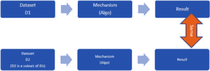
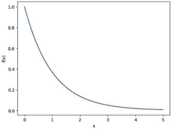
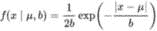
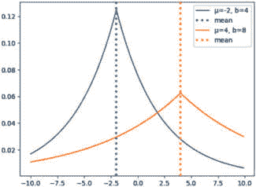
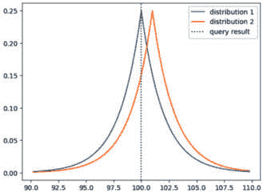
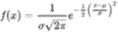
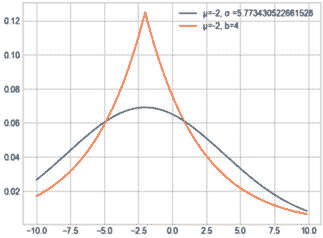
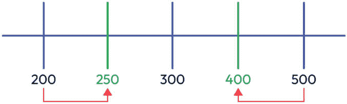
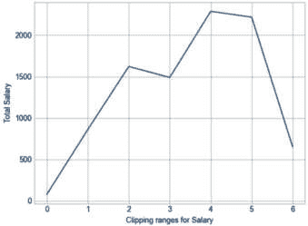

# 4

# 差分隐私算法概述及差分隐私应用

差分隐私的概念在数据隐私领域具有重大意义，随着收集和分析的数据越来越多，其重要性也在持续增长。差分隐私算法提供了一种在保护个人隐私的同时，仍能从这些数据中得出有价值见解的方法。

在本章中，我们将对差分隐私算法有一个概述，并理解在差分隐私背景下敏感性和剪裁等关键概念。此外，我们还将探讨如何通过使用差分隐私生成聚合数据，包括在现实世界中的应用。

本章将涵盖以下主要内容：

+   差分隐私算法：

    +   差分隐私的拉普拉斯算法

    +   差分隐私的高斯算法

    +   使用差分隐私生成聚合数据

+   敏感性及其在差分隐私聚合生成算法中的作用：

    +   使用差分隐私的查询：计数、求和和平均值 计数、求和和平均值

+   剪裁：

    +   理解其在差分隐私领域中的重要性及其示例

+   差分隐私在现实世界中的应用概述

# 差分隐私算法

差分隐私是一个旨在保护个人隐私同时允许对敏感数据进行统计分析的基本概念。它建立了一个数学框架，在数据分析与共享过程中保证了个人隐私的保留。差分隐私算法通过在数据中引入随机噪声，使得识别特定记录变得困难，从而发挥着至关重要的作用。

在上一章中，我们了解到差分隐私的核心思想是在数据分析过程中引入随机噪声。这种噪声使得攻击者难以确定特定个人的数据是否包含在分析中，从而保护隐私。基本概念是任何个人的数据包含或排除不应显著影响分析结果：



图 4.1 – 差分隐私基本概念的说明

差分隐私可以数学定义。对于两个仅在一项记录上有所不同的数据集，*D1* 和 *D2*，应用到 *D1* 的随机算法或机制，*L*（如计数、求和、平均值等），在子集 *S* 中得到结果的概率被ε（*ε*）的指数乘以 *L* 应用到 *D2* 在 S 中得到结果的概率加上δ（*δ*）项所界定。

从数学上讲，这可以表示如下：

P(L[D1] ∈ S) ≤ exp(ε) * P(L[D2] ∈ S) + δ

在此方程中，以下适用：

+   *P* 表示概率。

+   *D1* 和 *D2* 代表两个数据集，它们只相差一条记录。

+   *S* 包含了随机算法或机制的所有子集，*L*。

+   *ε*（epsilon）是一个正实数，它控制着隐私损失，被称为隐私预算。它决定了算法在两个数据库之间可以有多大差异，并量化了算法应用于数据库时产生的隐私损失。如果 ε 为零，查询将产生相似的答案，这在一定程度上牺牲了隐私。

为了确保差分隐私，会在结果中添加随机噪声（以随机数的形式）。这种噪声阻止对手确定返回的结果是真实的还是添加了噪声，以及添加的噪声的大小。添加的噪声保证了数据不能被用来识别个人，同时仍然允许计算有用的统计属性。

随机数分布的选择取决于如何选择正确的随机数。接下来，我们将探讨两种著名的分布，即拉普拉斯分布和高斯分布，以评估它们对隐私参数 ε 的适用性，并保证差分隐私。

## 拉普拉斯分布

拉普拉斯分布，也称为双指数分布，是一种以著名数学家皮埃尔-西蒙·拉普拉斯命名的连续概率分布。它是由合并两个指数分布得来的，一个正的，一个负的。

为了更好地理解拉普拉斯分布，让我们先了解指数分布。指数分布由以下函数定义：

f(x) = e -x

当 x 等于 0 时，f(x) 等于 1，随着 x 的增加，f(x) 逐渐接近 0。

为了观察这种行为，你可以尝试一个简单的 Python 程序来分析指数分布。

尝试一个简单的 Python 程序并测试这种行为：

*源代码*：Exponential_Laplace_Guassian_Clipping.ipynb

```py
%matplotlib inline
import numpy as np
import matplotlib.pyplot as plt
x = np.arange(0,10, 0.25)
# define f(x) = e power (-x)
plt.plot(x, np.exp(-x));
plt.xlabel("x")
plt.ylabel("f(x)")
```

这里是输出结果：



图 4.2 – 指数分布

### 拉普拉斯分布 – 数学定义

拉普拉斯分布的概率密度函数定义如下：



在这里，x 是一个随机变量，μ 是位置参数，它决定了分布的中心，而 b > 0 是尺度参数，它控制着分布的扩散或变异性。

拉普拉斯分布有几个重要的特性。它在均值（μ）周围是对称的，峰值在 μ 处。分布的尾部较重，这意味着与高斯（正态）分布相比，它有更高的概率观察到极端值。这一特性使得拉普拉斯分布适合于建模具有异常值或重尾行为的数据。拉普拉斯分布在统计学、信号处理、图像处理和机器学习等多个领域都有应用。它在需要鲁棒性以抵抗异常值或假设数据具有拉普拉斯噪声的场景中特别有用。

如果 μ 等于 0 且 b 等于 1，那么方程如下：

𝔣(x) = 1 / 2 * e^(-x)

这实际上就是指数分布的一半。让我们用简单的 Python 代码实现拉普拉斯分布，并进一步理解它：

```py
def laplace_dist(x, μ, b):
    return 1 / (2 * b) * np.exp(-np.abs(x - μ) / b)
def plot_laplace_dist(x, μ, b):
    plt.plot(x, laplace_dist(x, μ, b),
    label="μ={}, b={}".format(μ, b))
x = np.arange(-10, 10, 0.1)
plot_laplace_dist(x, -2, 4)
plt.axvline(x=-2, linestyle='dotted', linewidth=3, label='mean')
plot_laplace_dist(x, 4, 8)
plt.axvline(x=4, color='orange', linestyle='dotted', linewidth=3, label='mean')
plt.legend();
```

这是输出结果：



图 4.3 – 不同均值和缩放参数的拉普拉斯分布

从这张图中，我们可以看到，随着拉普拉斯分布中的缩放参数（b）增加，与中心点相比，尾部贡献了更大的比例。这一特性可以通过利用更大的缩放参数来增强隐私。

通过增加缩放参数，拉普拉斯分布的尾部变得更重，导致极端值发生的可能性更高。这种增加的变异性使得对手更难提取敏感信息或准确识别单个数据点。因此，可以使用更大的缩放参数作为隐私增强措施，因为它们有助于分布的更广泛扩散，并提供更高的隐私保护水平。

为什么拉普拉斯分布是差分隐私算法选择之一？

看看下面的例子，它表明拉普拉斯分布是实现差分隐私的正确算法之一：

```py
ε = 0.5
x = np.arange(90.2, 110, 0.20)
query_result=np.average(x)
dist1 = laplace_dist(x, query_result, 1 / ε)
dist2 = laplace_dist(x, query_result + 1, 1 / ε)
plt.plot(x, dist1, label="distribution 1")
plt.plot(x, dist2, label="distribution 2")
plt.axvline(x=query_result, c="black", linestyle='dotted', label="query result")
plt.legend()
```

在这里，我们选取了一个简单的数据集，该数据集包含从 90 到 110 的数字，增量是 0.2。这些数字的平均值接近 100，即查询结果——也就是说，查询找到了这些数字的平均值。

我们使用该数据集的均值作为查询结果，并将缩放因子（b）设置为 2，在这种情况下等于 **1 / ε**，来找到拉普拉斯分布：



图 4.4 – 使用拉普拉斯的分布

查询结果可以来自这些可能的分布中的任何一个。根据差分隐私公式（DP），当比较时，来自一个分布的查询结果应该小于或等于 eε 倍的第二个分布。

在这个特定的情况下，查询结果中的 100 这个值是从分布 1 中得出的。然而，无法完全排除它来自第二个分布的可能性，尤其是如果结果概率小于或等于 eε倍的情况下：

```py
p1 = laplace_dist(query_result, query_result, 1 / ε)
p2 = laplace_dist(query_result, query_result+1, 1 / ε)
print(p1,p2)
```

结果是 *0.25 0.15163266492815836*。

```py
p1, p2 * np.exp(ε)
```

结果是 0.25 0.25。

这证明了拉普拉斯分布可以用作差分隐私的一种机制，并且 b 缩放参数可以设置为 1/ε，即隐私预算。

## 高斯分布

高斯分布，也称为正态分布，是一个连续概率分布，在统计分析中广泛用于模拟现实世界现象。它以其对称于均值值的钟形曲线为特征。

### 高斯分布 – 数学定义

高斯分布也称为正态分布，它是一个连续概率分布。

高斯分布的公式定义如下：



在这里，x 是高斯分布中的随机变量；μ是位置参数，即它是数据的平均值；σ是标准差；σ²是数据的方差。

以下代码是高斯函数的一个实现：

```py
def guissan_dist(x, μ, σ):
    return (1/(σ * np.sqrt(2 * np.pi)) * np.exp(-(x - μ)**2 / (2 * σ**2)))
def plot_guissan(x, μ, σ ):
    plt.plot(x, guissan_dist(x, μ, σ),
    label="μ={}, σ ={}".format(μ, σ ))
x = np.arange(-10, 10, 0.1)
stdv=np.std(x)
plot_guissan(x, -2, stdv)
plot_laplace_dist(x,-2,4)
plt.legend()
```

让我们使用我们创建的随机数据集为高斯分布和拉普拉斯分布生成绘图：



图 4.5 – 不同均值和标准差的高斯分布

根据这个图表，我们可以看到拉普拉斯分布的峰值比高斯分布更尖锐。

现在，让我们确定高斯机制是否符合ε差分隐私：

```py
query_result=100
p1 = guissan_dist(query_result, query_result, 1 / ε)
p2 = guissan_dist(query_result, query_result+1, 1 / ε)
print(p1,p2)
0.19947114020071635 0.17603266338214976
p1, p2 * np.exp(ε)
0.19947114020071635, 0.29022879645614585
```

高斯机制不满足ε差分隐私。让我们通过在这个情况下添加一个δ值来检查它是否满足(ε, δ)差分隐私：

```py
p1, p2 * np.exp(ε)-0.09075
0.19947114020071635, 0.19947879645614586
```

这表明高斯机制支持(ε, δ)差分隐私，由于添加了 delta(δ)，有时也称为近似差分隐私。

## 添加噪声算法以应用差分隐私的比较

以下表格提供了三种噪声添加机制的概要比较：

|  | **指数机制** | **拉普拉斯机制** | **高斯机制** |
| --- | --- | --- | --- |
| 用途 | 主要用于选择特定的记录或选择最佳元素，特别是用于非数值或分类数据 | 由于其在隐私和效用之间的平衡以及其实施的简便性，广泛应用于数值聚合 | 用于处理较小规模的数据，并且需要反复应用差分隐私 |
| 噪声类型 | 指数噪声 | 拉普拉斯（双指数）噪声 | 高斯噪声 |
| 隐私 | 由于输出概率的指数分布，具有高隐私级别 | 随机噪声可能会显著改变结果，损害数据效用 | 实现了 delta 隐私或 epsilon-delta 隐私，这是为了更好的效用而进行的权衡 |
| 实现 | 由于指数分布的特性，实现较为复杂 | 由于拉普拉斯分布的特性，实现相对容易 | 实现较为复杂，但在数据敏感性低时通常适用 |
| 适应性 | 主要用于分类数据 | 主要用于数值数据 | 适用于低敏感度和多查询数据 |

表 4.1 - 三种噪声添加机制的概要比较

## 使用差分隐私生成聚合数据

差分隐私是一种技术，用于在收集和共享数据时保护个人的隐私。差分隐私可以使用的其中一种方式是在生成聚合数据，这些数据是数据的统计摘要，可以在保护个人隐私的同时提供有用的见解。

一旦向数据中添加了噪声，就可以计算并发布统计聚合，而不会损害个人隐私。可以使用差分隐私生成的统计聚合示例包括平均值、中位数和直方图。使用差分隐私生成聚合数据的一个挑战是平衡隐私和准确性。添加到数据中的噪声量将影响生成的统计聚合的准确性。因此，通常在隐私保护和结果准确性之间有一个权衡。总的来说，使用差分隐私生成聚合数据是保护个人隐私的同时仍然允许计算有用统计属性的有力工具。然而，它需要仔细考虑具体用例以及隐私和准确性之间的权衡。

# 敏感性

敏感性在差分隐私领域发挥着至关重要的作用。它指的是当单个个体的数据点被添加到或从数据集中移除时，函数或计算输出的最大变化量。敏感性提供了与在敏感数据上执行计算相关的隐私风险度量。

让我们来看一个现实场景的例子，它说明了使用敏感性分析来衡量更改数据集影响的需求。

### 场景 - 财务风险评估模型

假设一家金融机构开发了一个机器学习模型来评估贷款申请人的信用风险。该模型考虑了各种特征，如收入、信用记录、就业状况和未偿还债务，以预测贷款违约的可能性。该机构希望确保模型是健壮的，并且对数据集中任何个人的存在或不存在不敏感。在这种情况下，敏感性分析可以用来评估更改数据集的影响，特别是通过删除或修改某些个人的数据。该机构希望确定删除或修改特定个人的数据是否会显著改变模型的预测或引入偏差，并衡量与此变化相关的隐私风险。

让我们用数学术语来分解这一点。

例如，如果我们有一个函数 f，它接受一个数据集 D 作为输入并返回一个数值输出，那么函数 f 的敏感性定义为在两个数据集 D 和 D’ 之间，D 和 D’ 通过单个个体的数据点的存在或不存在而不同，f 在这两个数据集上的输出的最大绝对差异。

因此，在这里，函数 f 的敏感性定义为 sensitivity(f) = max_{D, D’} ||f(D) - f(D’)||。

函数的敏感性是差分隐私中的一个基本概念，因为它决定了需要添加到函数输出中的噪声量以保证隐私。自然地，敏感性较高的函数更容易泄露数据集中个人的信息，因此需要向它们的输出中添加更多的噪声以保持隐私。

为了理解敏感性，让我们考虑以下数据集：

X = [ 0, 1,2,3,4,5,6,7,8,9,10,11,…..N]

在这个数据集中定义了两个函数/查询：𝔣1(x) = x 和 f2(x) = x3。

让我们定义另一个函数/查询，它计算以下差异：

∆ f(xa, xb) = | f(xa) − f(xb) |

让我们计算 f1, f2, ∆ f1, ∆ f2 并观察数据：

| X | X0 | X1 | X2 | X3 | X4 | X5 | X6 | X7 | …. |
| --- | --- | --- | --- | --- | --- | --- | --- | --- | --- |
|  | 0 | 1 | 2 | 3 | 4 | 5 | 6 | 7 | … |
| f1(xi)=x | 0 | 1 | 2 | 3 | 4 | 5 | 6 | 7 | … |
| f2(xi)=x3 | 0 | 1 | 8 | 27 | 64 | 125 | 216 | 343 | … |
| |
| ∆f1(xi, xi+1) | 1 | 1 | 1 | 1 | 1 | 1 | 1 | 1 | …. |
| |
| ∆f2(xi, xi+1) | 1 | 7 | 21 | 37 | 61 | 91 | 127 | … | ... |

表 4.2 - 函数/查询在数据集上的敏感性分析

敏感性指的是底层数据集的变化对查询结果的影响。

让 xA, xB 是 X 所有可能的数据集中的一个，这些数据集与 X 的所有可能数据集最多只有一个元素的不同。

因此，敏感性是通过以下方程计算的：

敏感性 = max | f(xa) − f(xb) ||，其中 Xa,Xb ⊆ X

根据这个定义，很明显，f₁(𝑥) = 𝑥 的敏感性为 1，因为最大差异是恒定的。在第二个查询 f₂(𝑥)=𝑥³ 中，差异不是恒定的，它是无界的，根据数据集中的数据元素数量增长。为了计算第二个函数/查询的敏感性，我们需要指定下限和上限 - 例如，从 x⁵ 到 x¹⁰，x⁰ 到 x⁵，等等。

让我们定义另一个查询，该查询在 5 到 10 或 0 到 5 的输入值范围内使用相同的函数进行限制：

f³(𝑥) = 𝑥³，其中 0≤𝑥≤5

Δ𝑓(𝑥𝑎, 𝑥𝑏) = | 𝑓(𝑥𝑎) − 𝑓(𝑥𝑏) |

这里是表格：

| X→ | X₀ | X₁ | X₂ | X₃ | X₄ | X₅ |
| --- | --- | --- | --- | --- | --- | --- |
|  | 0 | 1 | 2 | 3 | 4 | 5 |
| 𝑓𝑥(𝑥𝑖)=𝑥³ | 0 | 1 | 8 | 27 | 64 | 125 |
|  |  |  |  |  |  |  |
| Δ𝑓₂(𝑥𝑖, 𝑥𝑖+1) | 1 | 7 | 21 | 37 | 61 | 91 |
|  |  |  |  |  |  |  |

表 4.3 - 查询在输入值范围内限制的敏感性分析

在这种情况下，敏感性将是最大 | 1+7+21+37+61+91 | = 216：

```py
def f(x):
    return x ** 3
def sensitivity(f, xa, xb):
    sensitivity = abs(f(xa) - f(xb))
    return sensitivity
# Sensitivity calculation for the input range 0 to 6 and summing the sensitivities
total_sensitivity = 0
for x in range(6):
    xa = x
    xb = x + 1
    sensitivity_value = sensitivity(f, xa, xb)
    print(sensitivity_value)
    total_sensitivity += sensitivity_value
print("Total Sensitivity within the range 0 to 6:", total_sensitivity)
```

*输出：*

```py
1
7
19
37
61
91
Total sensitivity within the range 0 to 6: 216
```

查询的敏感性可以根据是否使用通用数据集或局部数据集来计算，进一步分为全局敏感性和局部敏感性。

### 全局敏感性

全局敏感性指的是在考虑所有可能的数据集时查询结果可能的最大变化。它是基于整个群体或通用数据集计算的。全局敏感性提供了潜在隐私风险的界限，并捕捉了最坏情况。

### 局部敏感性

另一方面，局部敏感性关注基于特定局部数据集的查询敏感性。它衡量在从该局部数据集中添加或删除单个数据点时查询结果的最大变化。局部敏感性提供了对隐私风险的更精细和特定于上下文的度量。

基于此，我们可以制定以下方案：

| **查询/函数** | **全局敏感性** | **注释** |
| --- | --- | --- |
| 𝑓(𝑥) = 𝑥 | 1 | 改变 𝑥 的值 1 将导致 𝑓(𝑥) 改变 1 |
| 𝑓(𝑥) = 𝑥² | 无界 | 𝑓(𝑥) 的变化取决于 𝑥 的值 |
| 𝑓(𝑥) = 𝑥 + 𝑥 | 2 | 改变 𝑥 的值 1 将导致 𝑓(𝑥) 改变 2 |
| 𝑓( 𝑥) = 5 × 𝑥 | 5 | 改变 𝑥 的值 1 将导致 𝑓(𝑥) 改变 5 |

表 4.4 - 查询结果局部敏感性分析

通过向查询结果添加噪声来实现差分隐私，从而保证隐私。

在差分隐私中需要添加的噪声量取决于四个关键参数：

+   **隐私参数 (ε)**：隐私参数 ε 控制差分隐私提供的隐私保护水平。ε 的值越小，隐私保证越强，但可能会导致查询结果中添加的噪声更高。

+   **隐私预算 (Δε)**：隐私预算表示在多个查询或操作中可以消耗的总隐私量。它通常在各个查询之间平均分配，以确保整体隐私保证得到维持。

+   **敏感性（Δf）**：敏感性指的是当添加或删除单个数据点时，查询结果可以变化的最高量。它量化了个人数据对查询结果的影响，并有助于确定需要添加的噪声量。

+   **数据大小（N）**：正在分析的数据集的大小也会影响在差分隐私中添加的噪声量。一般来说，较大的数据集允许添加较少的噪声，从而提高准确性，而较小的数据集可能需要添加更多的噪声以保护隐私。

通过仔细选择这些参数的适当值并考虑隐私和准确度之间的权衡，可以调整噪声以提供有效的隐私保护，同时仍然产生有用且可靠的查询结果：


图 4.6 – 影响噪声添加的参数

# 使用差分隐私的查询

使用差分隐私的查询允许分析师和数据科学家从数据集中检索汇总信息，同时确保保护单个数据点的隐私。这些查询旨在向查询结果添加一定量的噪声，使得难以辨别数据集中任何特定个人的贡献。

可以使用差分隐私执行各种类型的查询。以下是一些常用的查询类型：

+   **计数查询**：这些查询旨在确定满足数据集中特定条件记录的数量，同时保护隐私。查询结果通过向真实计数添加噪声而受到干扰，确保个人贡献无法被准确确定。

+   **求和查询**：求和查询涉及在保持隐私的同时计算数据集中特定值的总和 – 例如，计算一组个人的总收入，同时保护个人收入值的机密性。

+   **平均查询**：平均查询计算数据集中特定属性的平均值，同时确保隐私。向计算出的平均值添加噪声以保护个人数据点。

+   **Top-K 查询**：Top-K 查询旨在在保护隐私的同时识别数据集中最大的 K 个值或记录。向查询结果添加噪声以隐藏个人的具体贡献。

+   **范围查询**：范围查询涉及从数据集中检索特定范围内的记录或值，同时保持隐私。向查询结果添加噪声以防止已识别的个人数据点落在该范围内。

为了实现差分隐私，使用了各种机制向查询结果添加噪声。这些机制包括拉普拉斯机制、高斯机制和随机响应等。机制的选择取决于查询的具体要求和所需的隐私保证。

重要的是要注意，差分隐私提供的隐私保护水平可以通过一个称为 epsilon（ε）的隐私参数来量化。ε 的值越小，提供的隐私保证越强，但可能会在查询结果中引入更多的噪声，从而可能降低其准确性。

使用差分隐私的查询在数据实用性和隐私保护之间提供了平衡。它们允许从敏感数据集中提取有意义的分析和见解，同时保护个人信息的机密性。通过将差分隐私技术纳入数据分析过程，组织可以确保遵守隐私法规并与他们的用户或客户建立信任。

让我们逐一深入分析以下数据集中的这些查询：

| **姓名** | **年龄** | **薪水** | **性别** | **职位** |
| --- | --- | --- | --- | --- |
| A | 32 | 200K | M | 工程师 |
| B | 44 | 300K | F | 经理 |
| C | 55 | 400K | F | 主任 |
| D | 66 | 500K | M | 副总裁 |

表 4.6 - 使用提供的数据集进行的差分隐私查询分析

#### 使用差分隐私的计数查询

分析以下查询的结果，并找出敏感性是如何运作的：

+   这个数据集中总共有多少名员工？答案是 4。

+   有多少人薪水低于 300K？答案是 1。

+   有多少男性员工在工作？答案是 2。

为了确保答案包括噪声并保证差分隐私，确定计数查询的敏感性和用于敏感性的适当值是至关重要的。

计数查询的敏感性为 1，这意味着如果添加一条记录，查询结果将增加 1，或者如果删除一行，查询结果将减少 1。通过理解计数查询的敏感性，我们可以在保护隐私的同时准确加入噪声。

我们将利用 NumPy 库为样本计数查询生成差分隐私结果。

NumPy 提供基于给定敏感性、平均值和 epsilon 值的拉普拉斯噪声生成：

```py
import numpy as np
Total_employees = 4
sensitivity = 1
print("sensitivity:",sensitivity )
# epsilon =privacy loss or budget
epsilon= 0.8
noise = np.random.laplace(loc=0, scale=sensitivity/epsilon)
print("noise:",noise)
count_employee_dp = Total_employees + noise
print ("count with DP:", count_employee_dp)
```

输出：

```py
sensitivity: 1
noise: 2.247932787995729
count with DP: 6.24793278799573
```

#### 使用差分隐私的求和查询

让我们分析以下查询并了解在这种情况下敏感性是如何工作的：

+   这个数据集中所有员工的薪水总额是多少？报告的总额为 1,400K（未应用差分隐私）。

+   员工的总年龄是多少？报告的总年龄和为 197（未应用差分隐私）。

为了确保答案包括由保证的差分隐私添加的噪声，重要的是确定求和查询的敏感性并确定用于敏感性的适当值。

与计数查询不同，对于求和查询的敏感性并不直接，因为新增一行会增加输出值。

因此，在这种情况下，敏感性是无界的，因为它取决于要添加的记录的数据。

对于关于一个人年龄的查询，我们可以通过考虑人类历史上所知的最大寿命来估计上限，这个最大寿命大约是 126 岁。因此，我们可以假设这个查询的上限为 126 岁。

然而，确定工资查询的真实上限是具有挑战性的。它可能是 100 万、1000 万、1 亿，甚至更高。因此，在求和查询中，敏感性取决于提供给查询的下限和上限。

为了自动计算下限和上限，可以使用称为裁剪的技术，我们将在下一节中探讨：

```py
Total_salary = 1400
Lower_bound=100
Upper_bound=9999
sensitivity = Upper_bound - Lower_bound
print("sensitivity:",sensitivity )
# epsilon =privacy loss or budget
epsilon= 0.9
noise = np.random.laplace(loc=0, scale=sensitivity/epsilon)
print("noise:",noise)
Total_salary_dp = Total_salary + noise
print ("total salary with DP:",Total_salary_dp)
```

输出：

```py
sensitivity: 9899
noise: 4724.329480136737
total salary with DP: 6124.329480136737
```

差分隐私结果中的准确性和隐私受到其敏感性（由求和查询指定的下限和上限确定）的严重影响。

#### 使用差分隐私的平均查询

分析以下查询，并找出敏感性在这种情况下是如何工作的：

+   平均工资是多少？答案是 35 万。

+   平均年龄是多少？答案是 49.26。

为了确保平均查询的答案包括由保证的差分隐私添加的噪声，重要的是确定这些查询的敏感性，并确定在差分隐私算法中用于敏感性参数的适当值。

考虑平均查询的一种方法是将它们视为两个独立的查询：求和查询和计数查询。可以使用已知方法计算计数查询的敏感性；求和查询的敏感性也可以类似地确定。

通过理解计数查询和求和查询的敏感性，我们可以为平均查询提供差分隐私结果。这涉及到以保留隐私的同时确保平均计算准确性的方式添加噪声。

```py
Average_salary = 350
Total_salary_dp = 6124.329480136737
count_dp = 6.24793278799573
dp_average = (Total_salary_dp)/count_dp
dp_average
980.2169274137402
```

带有差分隐私的噪声平均工资会因为添加的噪声而失真，而没有差分隐私的平均工资保持不变。

现在，让我们使用差分隐私技术，如敏感性、裁剪和噪声，来实现相同的使用案例。我们将使用拉普拉斯机制向平均计算中注入噪声。

虽然当前的讨论旨在提供对基础概念的了解，但重要的是要注意，实现差分隐私的生产级框架会更详细地考虑各种复杂性。这些框架处理诸如在计算过程中处理数字溢出以及采用适当的算法以确保准确性和隐私保护计算等因素。这些框架优先考虑鲁棒性和可靠性，以满足现实场景的需求。

# 裁剪

如前所述，无界查询具有无限大的敏感性值，不能直接用于提供具有差分隐私的结果。解决这一问题的方法之一是通过指定它们的下限和上限将无界查询转换为有界查询。

在差分隐私中，剪辑是一种技术，通过限制函数的输出在特定范围内来绑定函数的敏感性。基本概念是将函数的输出剪辑或限制在预定的范围内，例如 [-c, c]，其中 c 是一个正的常数。之后，向剪辑后的输出引入噪声以确保隐私保证。

剪辑过程涉及两个步骤：

1.  **缩放函数的输出**：函数的输出通过除以缩放因子 s 进行缩放。这种缩放确保缩放输出的绝对值小于或等于剪辑阈值 c。

    从数学上讲，这可以表示为 f’(D) = f(D) / s，其中 |f’(D)| <= c。

1.  **添加噪声**：一旦输出被剪辑，就会引入噪声以维护差分隐私。这种噪声可以来自拉普拉斯或高斯分布，具体参数取决于所需的隐私级别。

剪辑技术旨在限制个别数据点对函数输出的影响，并促进足够噪声的添加以有效保护隐私。通过使用剪辑来限制敏感性，差分隐私机制可以在提供准确结果的同时保持数据机密性。

让我们回顾一下我们之前使用的简单数据集：

| **姓名** | **年龄** | **薪水** | **性别** | **职位** |
| --- | --- | --- | --- | --- |
| A | 32 | 200K | M | 工程师 |
| B | 44 | 300K | F | 经理 |
| C | 55 | 400K | F | 导演 |
| D | 66 | 500K | M | 副总裁 |

表 4.7 - 使用剪辑技术进行敏感性边界分析

给定实际的查询，“这个数据集中所有员工的总薪水是多少？”以及实际的答案，即 1,400K，使用差分隐私提供总薪水需要使用如拉普拉斯或高斯机制之类的噪声机制添加噪声。这种噪声机制依赖于查询的敏感性。

要继续进行，我们必须将下限和上限设定为任意固定值。通过计算下限和上限之间的差值，我们获得查询的敏感性。然而，为了深入了解这个过程，我们将对输入数据应用剪辑函数。

通过应用剪辑函数，我们将输入数据限制在特定范围内，这有助于管理查询的敏感性。这项技术有助于限制个别数据点的影响，并促进以可控方式添加噪声。通过使用剪辑，我们可以在数据隐私和实用性之间取得平衡，确保准确的结果同时保护敏感信息的机密性。

让我们在数据集上玩一下剪辑函数，进一步了解这一点。

### 剪辑示例 1

让我们考虑以下用例示例：一个社交媒体平台希望确定给定帖子的每个用户的平均点赞数。该平台希望在保护用户隐私的同时，仍然获得准确的估计。

这里是一个没有差分隐私的 Python 实现：

*源代码* *DP_End_to_End.ipynb*

```py
import random
# Generate a list of simulated likes per user
likes_per_user = [random.randint(0, 100) for _ in range(1000)]
print(likes_per_user)
# Calculate the average number of likes per user
average_likes = sum(likes_per_user) / len(likes_per_user)
print("Average likes per user (without differential
privacy):", average_likes)
```

*平均每个用户的点赞数（无差分隐私）：51.146*

现在，让我们使用差分隐私技术（如灵敏度、剪切和噪声）实现相同的用例。我们将使用拉普拉斯机制向平均计算中注入噪声：

```py
import random
import numpy as np
# Generate a list of simulated likes per user
likes_per_user = [random.randint(0, 100) for _ in range(1000)]
average_likes = sum(likes_per_user) / len(likes_per_user)
print("Average likes per user (without differential
privacy):", average_likes)
# Set the sensitivity
sensitivity = 1
# Clip the likes per user to a specified range
clipped_likes_per_user = np.clip(likes_per_user, 0, 100)
# Calculate the average number of likes per user
clipped_average_likes = np.mean(clipped_likes_per_user)
# Define the privacy budget and epsilon value
privacy_budget = 1.0
epsilon = 0.1
# Calculate the scale parameter for the Laplace distribution
scale = sensitivity / (privacy_budget * epsilon)
# Inject noise using the Laplace mechanism
noisy_average_likes = clipped_average_likes + np.random.laplace(0, scale)
print("Average likes per user (with differential privacy):", noisy_average_likes)
Average likes per user (without differential privacy): 51.252
Average likes per user (with differential privacy): 41.61714462702061
```

在这个例子中，我们将灵敏度设置为 1，因为平均计算的灵敏度是 1（一个用户的点赞数最多可以影响平均数 1）。然后，我们限制了每个用户的点赞数，以确保它们落在特定的范围内（在这个例子中，是 0 到 100）。

接下来，我们计算了剪切后的平均点赞数，并定义了隐私预算和 epsilon 值。隐私预算代表可用的总隐私保护量，而 epsilon 值控制隐私级别。

最后，我们根据灵敏度、隐私预算和 epsilon 计算了拉普拉斯分布的尺度参数。我们使用拉普拉斯机制对剪切后的平均点赞数添加噪声，考虑到尺度参数。

resulting_noisy_average_likes 值提供了每个用户平均点赞数的估计，同时结合了差分隐私技术来保护用户隐私。

### 剪切示例 2

以下是一个剪切的另一个例子：

*源代码:* *DP_End_to_End.ipynb*

```py
import pandas as pd
data = {'age': [32, 44, 55, 66],
  'salary': [200, 300, 400, 500]}
df = pd.DataFrame(data)
df['salary'].clip(lower=0, upper=999)
```

输出：

```py
0    200
1    300
2    400
3    500
Name: salary, dtype: int64
```

在这种情况下，如果我们使用`Pandas`提供的`clip`函数，范围设置为 0 到 9,999，那么由于`clip`函数中的上下限值，工资不会改变。

### 剪切示例 3

以下是一个剪切的另一个例子：

*源代码* *DP_End_to_End.ipynb*

```py
import pandas as pd
data = {'age': [32, 44, 55, 66], 'salary': [200, 300, 400, 500]}
df = pd.DataFrame(data)
df['salary'].clip(lower=250, upper=400)
```

输出：

```py
0    250
1    300
2    400
3    400
Name: salary, dtype: int64
```

在这种情况下，当我们设置上限为 400，下限为 250 时，剪切函数将超过 400 的工资改为 400，低于 250 的工资改为 250（例如，200 变为 250，500 变为 400）。

pandas 的`clip`函数将强制输入数据在指定的剪切界限内。如果其中一个值太小，它将被转换为下限剪切界限，如果值太大，它将被转换为上限剪切界限。

以下架构说明了这个操作：

剪切（250，200，300，400，500，**400**）



图 4.7 – 说明剪切功能

由于这是一个玩具数据集，我们可以查看数据并为剪切数据提出适当的上下限。

让我们在剪切的输入总和上添加灵敏度（剪切范围差）和 epsilon 的噪声：

```py
def laplace_mech(v, sensitivity, epsilon):
    return v + np.random.laplace(loc=0, scale=sensitivity/epsilon)
epsilon = 0.9
sensitivity=400-100
print(laplace_mech(df['salary'].clip(lower=100, upper=400).sum(),sensitivity,epsilon))
print(laplace_mech(df['salary'].sum(),sensitivity,epsilon))
```

输出：

```py
1693.8114539575836.  (With clipped)
1793.7575175454226.  (without clipping)
```

通过使用适当的上下限，使用差分隐私获得的结果更接近实际值，与使用随机界限相比，提高了准确性。在这个例子中，实际的总薪资是 1,400K，但添加了噪声后，返回的值是 1,693K。

然而，使用特定上下限的一个潜在缺点是，它们可能会无意中泄露数据集中个人的实际薪资，从而损害隐私。

另一种方法是使用零或一个合适的低值初始化下限，并逐渐增加上限。这个过程涉及观察查询结果并监控其何时停止变化或变得稳定。在此点，停止上限的值，确保查询结果不会泄露敏感信息，同时保护隐私。

这种迭代方法允许在准确性和隐私之间取得平衡，因为它根据数据的特征动态确定边界。它有助于防止泄露特定的薪资信息，同时在差分隐私的范围内提供合理准确的结果。

让我们通过玩具数据集来探索这种方法：

*源代码*：DP_End_to_End.ipynb

```py
import pandas as pd
import numpy as np
import matplotlib.pyplot as plt
plt.style.use('seaborn-whitegrid')
data = {'age': [32, 44, 55,66], 'salary': [200, 300, 400, 500]}
df = pd.DataFrame(data)
def laplace_mech(queryresult, sensitivity, epsilon):
    return queryresult + np.random.laplace(loc=0, scale=sensitivity/epsilon)
epsilon = 0.5
plt.plot([laplace_mech(df['salary'].clip(lower=0, upper=i).sum(), i, epsilon) for i in range(100,800,100)])
plt.xlabel('Clipping ranges for salary')
plt.ylabel('Total salary');
```

这是输出结果：



图 4.8 – 薪资与裁剪范围的总薪资对比

由于数据集规模较小，确定查询结果的理想裁剪值相对简单——在这种情况下，薪资总和不会超过 500。然而，对于更大的数据集，噪声有时可能会变得过于突出，以至于无法分析所有不同的敏感度或裁剪值。

# 差分隐私在现实生活中的应用概述

在本节中，我们将对一些利用差分隐私的实际情况进行简要概述。

## 差分隐私在 Uber 的应用

Uber Technologies, Inc. 提供作为服务的移动性——即，叫车服务。它必须保护使用其服务的客户的隐私，同时分析其数据以提供更好的服务。它开发了一个开源框架，通过 SQL 查询实现差分隐私，并将其用于分析和提取见解。所有 SQL 查询都通过 Uber 的差分隐私框架进行转换，该框架执行 SQL 查询并提供具有差分隐私保证的查询结果。

它可以在 GitHub 上找到：[`github.com/uber-archive/sql-differential-privacy`](https://github.com/uber-archive/sql-differential-privacy)。

## 差分隐私在 Apple 的应用

苹果公司在其产品中大规模集成了本地差分隐私技术，旨在理解和提升用户体验。他们采用了私有计数均值草图算法，该算法利用计数、均值、草图和隐私预算（ε）。对于每个关键特征，他们设定了隐私预算和最大记录数（差分隐私记录数），在移除敏感特征（如 IP 地址）后，这些记录可以传输到远程服务器：

| **关键特征** | **ε（epsilon）** | **每天每设备的记录数** |
| --- | --- | --- |
| 表情符号建议 | 4 | 1 |
| 查找提示 | 4 | 2 |
| 快速输入 | 8 | 2 |
| …. |  |  |

表 4.8 - 苹果公司本地差分隐私的实现

它使用哈希函数对输入向量进行编码后注入噪声，并以 1/(1 + 𝑒 𝜀/2)的概率翻转每个向量元素，其中ε是隐私预算。

更多关于此算法的详细信息可以在[`machinelearning.apple.com/research/learning-with-privacy-at-scale`](https://machinelearning.apple.com/research/learning-with-privacy-at-scale)找到。

Jun Tang、Aleksandra Korolova、Xiaolong Bai、Xueqiang Wang、Xiaofeng Wang 等人通过对客户端代码进行调试，对苹果公司的差分隐私实现进行了详细分析，并在 Arxiv 上发表了研究论文。我强烈建议您阅读这篇论文，以更好地理解苹果公司的实现以及考虑到的额外细节：《苹果公司在 MacOS 上实现差分隐私的隐私损失》*10.12* ([`arxiv.org/abs/1709.02753`](https://arxiv.org/abs/1709.02753))。

## 美国人口普查中的差分隐私应用

美国人口普查局使用差分隐私对 2020 年的人口普查数据进行噪声处理，以保护收集和共享的普查数据中受访者的隐私。

更多详细信息可以在[`www.census.gov/data/academy/webinars/2021/disclosure-avoidance-series/differential-privacy-101.html`](https://www.census.gov/data/academy/webinars/2021/disclosure-avoidance-series/differential-privacy-101.html)找到。

## 谷歌的差分隐私

谷歌在其 Chrome 浏览器中使用差分隐私来了解频繁访问的页面；谷歌地图和谷歌助手也具有此功能。它开发的差分隐私系统称为**随机可聚合的隐私保护有序响应**（**RAPPOR**），提供 2 作为下限，8 到 9 作为上限的ε值。

谷歌开源了 RAPPOR 的实现。您可以在[`github.com/google/rappor`](https://github.com/google/rappor)了解更多信息。

# 摘要

在本章中，我们介绍了差分隐私的概念，并探讨了拉普拉斯和高斯机制如何生成噪声以确保隐私，同时生成汇总查询结果。我们讨论了 epsilon、delta 和敏感度等参数的重要性，以及它们如何用于使用拉普拉斯或高斯分布计算噪声。此外，我们还学习了如何使用裁剪技术确定上下限。最后，我们总结了差分隐私在苹果和优步以及美国人口普查局等现实世界应用中的使用情况。

在下一章中，我们将深入探讨差分隐私的开源框架。我们将探索如何使用这些框架开发应用程序，并详细探讨在差分隐私背景下的机器学习领域。这将提供一个全面的理解，了解如何在实际场景中实现差分隐私，以及如何在机器学习应用中利用其优势。
