# 5

# 使用开源框架开发具有差分隐私的应用程序

在本章中，我们将探讨用于开发具有差分隐私能力的机器学习、深度学习和大规模应用程序的开源框架（**PyDP**、**PipelineDP**、**tmlt-analytics**、**PySpark**、**diffprivlib**、**PyTorch** 和 **Opacus**）。

我们将涵盖以下主要主题：

+   实现差分隐私的开源框架：

    +   PyDP 框架及其关键特性的介绍

    +   PyDP 的应用示例和演示

    +   使用 PyDP 开发一个示例银行应用程序，以展示差分隐私技术

+   防止成员推理攻击：

    +   理解成员推理攻击及其潜在风险

    +   在应用差分隐私时，防止成员推理攻击的技术和策略

+   在大型数据集上应用差分隐私以保护敏感数据：

    +   利用开源的 PipelineDP 框架在大型数据集上应用差分隐私

    +   利用开源的 Tumult Analytics 和 PySpark 框架在大型数据集上应用差分隐私

+   带有差分隐私的机器学习：

    +   使用差分隐私在合成数据上运行欺诈检测分类模型

    +   一个聚类示例，应用差分隐私，使用 IBM 的开源 **diffprivlib** 框架

+   带有差分隐私的深度学习：

    +   使用 PyTorch 深度学习框架实现欺诈检测模型

    +   利用开源的 PyTorch 和 Opacus 框架开发具有差分隐私的欺诈检测深度学习模型

+   差分隐私机器学习框架

+   差分隐私的局限性以及一些克服策略

# 实现差分隐私的开源框架

有几个开源框架可用于实现差分隐私。在本节中，我们将详细介绍 PyDP 框架。

## PyDP 框架及其关键特性的介绍

Google 发布了一个名为差分隐私的开源框架，该框架简化了差分隐私的实施。此框架支持 ε- 和 (ε, δ)-差分隐私统计。它包括各种功能，例如使用拉普拉斯和高斯机制引入噪声的能力。此外，该框架还提供了对包括总和、计数、平均值、方差和标准差在内的聚合差分隐私算法的支持。此框架中的库是用 C++、Java 和 Go 语言实现的，并且它还提供了一个 **命令行界面** (**CLI**) 来执行差分隐私 SQL 查询。有关更多信息，您可以访问 GitHub 仓库 [`github.com/google/differential-privacy`](https://github.com/google/differential-privacy)。

PyDP 是由 OpenMined 于 2020 年开发的另一个框架，它实现了 Google 差分隐私工具的 Python 包装函数。虽然 PyDP 不是 Google 差分隐私工具包的完整实现，但它支持 Google 工具包中ε-差分隐私算法的一个子集。这些算法能够生成包含私人或敏感信息的数值数据集的聚合统计信息。您可以在[`github.com/OpenMined/PyDP`](https://github.com/OpenMined/PyDP)找到 PyDP 框架。

## PyDP 的实际应用示例和演示

### PyDP 的安装

PyDP 的安装方式与其他 Python 包的安装方式相同。

对于 Python 3.x 版本，请使用以下命令：

```py
pip3 install python-dp
```

对于 Python 的早期版本，请使用以下行：

```py
pip install python-dp
```

### 使用 PyDP 计算平均值的示例程序

PyDP 支持拉普拉斯噪声机制，并提供了一系列聚合函数，如求和、平均值、计数等。在计算平均值时，PyDP 需要提供以下限和上限值形式表示的界限。为此，PyDP 提供了一个名为`BoundedMean`的类，它提供了以下构造函数：

```py
BoundedMean(epsilon: float, delta: float = 0, lower_bound: int, upper_bound)
BoundedMean(epsilon: float)
```

PyDP 中的`BoundedMean`类用于计算有界数据的差分隐私平均值。它利用 epsilon 和 delta 参数提供隐私保证。此类支持拉普拉斯噪声机制，向平均值计算中添加隐私保护噪声。

下面是演示有界平均值的示例代码：

*源代码*：Sample_Mean_Using_PyDP.ipynb

```py
import pydp as dp
import numpy as np
from pydp.algorithms.laplacian import BoundedMean
#Generate simple data number from 1 to 10 in an array
data = np.arange(1,10,1)
# privacy budget as 0.6, delta as 0 and lower and upper bounds as 1 and 10
x = BoundedMean(0.6,0,1,10)
privacy_mean = x.quick_result(data)
mean = np.mean(data)
print("Data", data)
print("Normal Mean", mean)
print("Mean with differential privacy",privacy_mean )
```

这将产生以下输出：

```py
Data [1 2 3 4 5 6 7 8 9]
Normal Mean 5.0
Mean with differential privacy 6.960764656372703
```

## 使用 PyDP 开发一个示例银行应用程序以展示差分隐私技术

在此应用场景中，我们以一家旨在与商家、公司和其他银行合作开展营销活动同时保护其客户敏感个人信息的金融银行为例。客户在两种不同场景下使用他们的信用卡或借记卡进行购买：在商家网点进行的线下交易，卡被物理刷过（称为卡面交易），以及在线交易，其中输入卡号、姓名、到期日期和 CVV 等卡详情（称为无卡交易）。目标是提供信用卡交易数据以支持活动，同时不泄露个人客户详情。

为了成功启动营销活动或忠诚度计划，银行需要共享某些交易细节，例如购买类型、交易量和与特定位置相关的交易价值。这些信息使银行能够与感兴趣的银行/商家合作，从而促进大规模产品销售并向客户发放福利。

在此背景下，我们将使用预定义的业务规则合成大量交易，并计算每个位置的计数、平均值和总和等统计数据。目的是在不损害客户隐私的情况下，与合作伙伴公司共享这些汇总统计数据。

共有两种方法来共享这些统计数据。第一种方法涉及直接共享汇总数据，这可能会泄露有关个别客户的私人信息。第二种方法利用差分隐私来生成汇总数据，确保在保护隐私的同时不泄露任何敏感客户信息。

通过应用差分隐私技术，银行可以通过向汇总统计数据引入精心校准的噪声来保护客户隐私。这种噪声确保共享的汇总数据不会披露特定个人的详细信息，同时仍为营销活动和忠诚度计划规划提供有价值的见解。

通过采用差分隐私，银行可以在数据效用和隐私保护之间取得平衡，使其能够在与公司和企业合作的同时保持客户信息的机密性。

让我们生成开发此银行应用程序所需的合成数据集。

以下为客户数据：

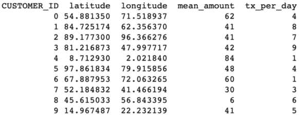

图 5.1 – 客户数据集

在此背景下使用的数据集包括各种属性，包括客户 ID、表示为经纬度坐标的位置、每天的交易次数和平均交易金额。需要注意的是，与每个客户的卡关联的实际信用卡号、**卡验证值**（**CVV**）代码和到期日期保存在单独的表中，并且不在提供的数据集中显示。此外，这些参数在生成统计数据时并未使用。在此特定示例中，生成的交易涉及在各个商家位置发生的卡面交易场景，使用**销售点**（**POS**）终端刷卡。

以下为样本 POS 终端数据：

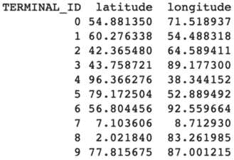

图 5.2 – 终端数据集

在此场景中，假设客户主要访问附近的商家门店进行日常购买，客户位置与商家位置之间的距离通常在约 5 英里范围内。

为了生成交易，计算客户位置与可用商家位置之间的欧几里得距离。使用这些距离信息，从附近的选项中随机选择商家。这种方法确保生成的交易反映了客户在特定距离半径内前往附近商家购买的现实行为。

以下为交易数据：

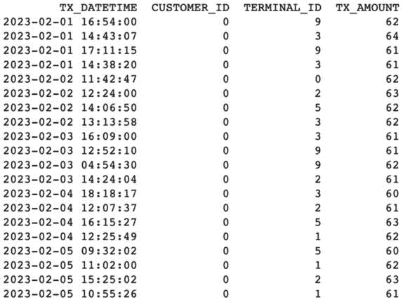

图 5.3 – 交易数据集

让我们使用差分隐私在此数据集上生成聚合数据，以便随后与商家/银行共享，以便设计营销活动和忠诚度计划。

*来源* *代码：Sample_Finance_App_DP.ipynb*

**# 解压 transactions.csv.zip 文件（本书 GitHub 仓库中提供** **作为 transactions.csv）。**

[`github.com/PacktPublishing/Privacy-Preserving-Machine-Learning/blob/main/Chapter%205/transactions.csv.zip`](https://github.com/PacktPublishing/Privacy-Preserving-Machine-Learning/blob/main/Chapter%205/transactions.csv.zip)

数据加载：

```py
import pydp as dp
from pydp.algorithms.laplacian import BoundedSum, BoundedMean, Count, Max
import pandas as pd
url = "transactions.csv"
df_actual = pd.read_csv(url, sep=",")
df = df_actual[['TRANSACTION_ID',
'TX_DATETIME','CUSTOMER_ID','TERMINAL_ID','TX_AMOUNT']]
df.head()
```

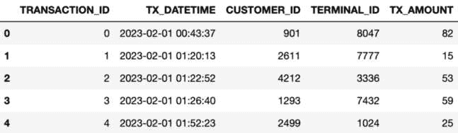

图 5.4 – 示例交易数据

在本节中，我们将为各种场景生成不同的差分隐私聚合数据。重点将放在比较使用传统统计方法获得的结果与通过差分隐私技术实现的结果。以下场景将被探讨：

+   指定终端的平均交易金额

+   终端 ID 1 至 100 的平均交易金额

+   通过终端 1 至 100 购买价值 25 美元或以上的客户数量

+   指定终端的最大交易金额

+   指定日或月每个终端的交易金额总和

### 指定终端的平均交易金额

为了通过特定的 POS 终端计算指定日或月的平均交易金额，我们可以定义以下方法。这些方法将用于比较使用传统统计方法获得的结果与通过差分隐私技术生成的聚合结果：

+   **传统平均计算**：我们将实现一种方法，使用传统统计方法计算特定 POS 终端在指定日或月的平均交易金额。此方法将输入相关的交易数据，例如交易金额和感兴趣的日或月日期。平均将通过将所有交易金额相加并除以所选 POS 终端在指定日或月上的总交易次数来计算。传统的平均数将作为比较的基准。

+   **差分隐私平均计算**：我们将开发一种利用差分隐私技术来计算选定 POS 终端给定一天或一个月的平均交易金额的方法。此方法将采用与传统平均计算方法相同的输入。它将利用差分隐私机制，如向汇总统计数据添加噪声，以保护个人交易的隐私，同时生成平均值。差分隐私平均将提供一种保护隐私的传统平均值的替代方案。通过使用这些方法并比较结果，我们可以评估传统平均计算与通过差分隐私技术生成的平均值的差异。

此分析将展示差分隐私对汇总计算的影响，并强调在特定 POS 终端通过一天或一个月生成平均交易金额时在准确性和隐私保护之间的权衡：

```py
def mean_tx_amount(tid:int) -> float:
    dft = df[df["TERMINAL_ID"] == tid]
    return statistics.mean(list(dft["TX_AMOUNT"]))
mean_tx_amount(1)
56.22097378277154
# calculates mean applying differential privacy
def private_mean_tx_amount(privacy_budget: float, tid:int) -> float:
    x = BoundedMean(privacy_budget,1,1,300)
    dft = df[df["TERMINAL_ID"] == id]
    return x.quick_result(list(dft["TX_AMOUNT"]))
private_mean_tx_amount(0.6,1)
220.98103940917645
```

在先前的计算中，我们可以看到使用传统方法生成的平均值为 56.22，而差分隐私版本为 POS 终端 ID 1 生成平均值为 220.98。这样，私有平均值有助于不泄露实际的平均值。

### 终端 ID 1 到 100 的平均交易金额

让我们生成终端 1 到 100 的平均交易金额，并使用之前定义的私有平均函数：

```py
terminal_mean_vs_privacy_means=[]
for i in range (1, 100):
    mean = mean_tx_amount(i)
    privacy_mean = private_mean_tx_amount(0.9,i)
    terminal_mean_vs_privacy_means.append([i, mean,privacy_mean])
terminal_mean_vs_privacy_means_df =
pd.DataFrame(terminal_mean_vs_privacy_means,
columns=['Terminal Id','Mean','privacy_mean'])
terminal_mean_vs_privacy_means_df.head(10)
```

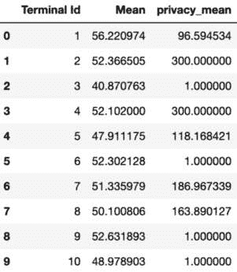

图 5.5 – 实际平均值与隐私平均值

在接下来的章节中，我们还将生成特定 POS 终端在给定一天或一个月的交易金额的计数和总和，并将使用传统统计方法获得的结果与通过差分隐私技术生成的结果进行比较。

### 通过终端 1 到 100 进行购买价值 25 美元或以上的客户数量

接下来，我们将实施一种计算终端 1 到 100 上进行 25 美元或以上购买的客户数量的方法。

此方法将以交易数据作为输入，包括终端号和相应的交易金额。它将遍历每个终端 ID 从 1 到 100 的交易，并计算交易金额超过 25 美元的客户数量。这个计数将提供有关进行了高价值购买的客户基础的指示，有助于分析差分隐私对识别此类客户的影响。通过使用此方法，我们可以比较使用传统统计方法获得的结果与通过差分隐私技术生成的计数。

这项分析将揭示不同方法之间的差异，并展示差分隐私在识别终端 1 到 100 上进行了价值超过 25 美元购买的客户时的有效性，同时保护个人隐私：

```py
def count_tx_amount_above(limit: float,tid) -> int:
    dft = df[df["TERMINAL_ID"] == tid]
    return dft[dft.TX_AMOUNT > limit].count()[0]
count_tx_amount_above(25.0,1)
232
def private_tx_amount_above(privacy_budget: float, limit: float,tid:int) -> float:
    dft = df[df["TERMINAL_ID"] == tid]
    x = Count(privacy_budget, dtype="float")
    return x.quick_result(list(dft[dft.TX_AMOUNT > limit]["TX_AMOUNT"]))
private_tx_amount_above(0.1,25.0,1)
257
terminal_amount_vs_privacy_amont=[]
for i in range (1, 100):
    count = count_tx_amount_above(25.0,i)
    privacy_count = private_tx_amount_above(0.1,25.0,i)
    terminal_amount_vs_privacy_amont.append([i, count,privacy_count])
terminal_amount_vs_privacy_amont_df =
pd.DataFrame(terminal_amount_vs_privacy_amont, columns=['Terminal Id','Count','privacy_count'])
terminal_amount_vs_privacy_amont_df.head(10)
```

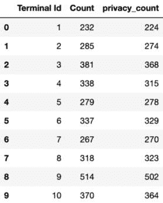

图 5.6 – 实际交易次数与增加的隐私次数对比

通过采用这种方法，我们确保不会泄露或与银行/商家共享实际购买价值超过 25 美元的客户数量。相反，我们向这些方提供差分隐私计数，从而在提供有价值的见解的同时保护个人隐私。这使得银行/商家可以根据差分隐私计数启动忠诚度计划，根据可用数据定制他们的倡议。因此，通过采用差分隐私技术，机构可以在为忠诚度计划提供有用信息和保护单个客户敏感细节之间取得平衡。

### 给定终端的最大交易金额

让我们定义计算最大交易金额和差分隐私金额的函数：

```py
def max_tx_amount(tid:int) -> int:
    dft = df[df["TERMINAL_ID"] == tid]
    return dft.max()["TX_AMOUNT"]
max_tx_amount(1)
87
def private_max_tx_amount(privacy_budget: float,tid:int) -> int:
    dft = df[df["TERMINAL_ID"] == tid]
    x = Max(epsilon = privacy_budget, lower_bound = 100.0, upper_bound = 50000.0, dtype="float"
    return x.quick_result(list(dft["TX_AMOUNT"]))
private_max_tx_amount(0.5,1)
167.51941105013407
```

如前述代码所示，通过采用差分隐私技术，我们可以在保护单个交易隐私的同时，计算给定终端的大致最大交易金额。这些值取决于隐私预算。本例中使用了 0.5 作为隐私预算。这使我们能够在不泄露单个客户敏感细节的情况下，与银行/商家分享有价值的汇总信息。在本例中，实际的最大交易金额为 87。根据隐私预算（即 0.5）添加的噪声，该值变为 167。因此，在效用方面可能不太有用。这说明了隐私与效用之间的权衡。需要通过实验不同的隐私预算来决定最适合用例/应用的方案，决定是更优先考虑隐私和较少的效用，还是更优先考虑效用和较少的隐私。

### 每个终端在给定日期或月份的交易金额总和

让我们定义计算交易金额总和以及差分隐私金额总和的函数：

```py
def sum_tx_amount(tid:int) -> float:
    dft = df[df["TERMINAL_ID"] == tid]
    return dft.sum()["TX_AMOUNT"]
sum_tx_amount(1)
15011
def private_sum_tx_amount(privacy_budget: float, tid:int) -> float:
    dft = df[df["TERMINAL_ID"] == tid]
    x = BoundedSum(epsilon = privacy_budget, delta = 0,
lower_bound= 100.0, upper_bound = 50000.0, dtype="float")
    return x.quick_result(list(dft["TX_AMOUNT"]))
private_sum_tx_amount(0.6,1)
27759.46144104004
```

作为练习，你可以实现所有 POS 终端上的 `count` 和 `sum` 函数，并将使用传统统计方法获得的结果与通过差分隐私技术生成的结果进行比较。

# 防御成员推理攻击

**成员推理攻击**对机器学习系统中个人的隐私构成重大威胁。这些攻击旨在确定特定数据点是否是用于创建机器学习模型的训练数据集的一部分，可能暴露有关个人的敏感信息。为了减轻此类攻击的风险，可以采用差分隐私技术。

为了抵御使用差分隐私的成员推理攻击，可以采用以下几种方法：

+   **噪声添加**：在训练过程中，向计算中添加噪声以引入随机性和掩盖单个数据点。这使得攻击者难以识别特定数据点是否被用于训练。

+   **隐私预算管理**：差分隐私在隐私预算下运行，该预算决定了允许的最大隐私损失量。通过仔细管理和分配隐私预算，可以最大限度地降低成员推断攻击的风险。

+   **泛化和聚合**：应用泛化和聚合技术有助于模糊单个数据点。通过将相似的数据点分组在一起，任何特定个人的信息变得不那么容易区分。

+   **扰动机制**：利用扰动机制，例如向模型的输出或梯度添加噪声，可以增强隐私保护。这些机制使得攻击者更难以准确推断成员资格状态。

+   **对抗训练**：结合对抗训练技术有助于训练对成员推断攻击具有鲁棒性的模型。这涉及到训练模型以对抗一个复杂的攻击者，该攻击者试图区分特定数据点的存在。

通过结合这些策略并采用隐私设计方法，机器学习系统可以更好地保护免受成员推断攻击。需要注意的是，虽然差分隐私提供了强大的隐私保证，但在某些情况下，可能还需要额外的隐私保护技术或后处理来应对特定的攻击场景。

下面是一个示例来演示这一点：

让我们生成两个数据集，它们正好相差一条记录。我们将创建原始数据集的副本，并将其称为**红 acted 数据集**。在红 acted 数据集中，我们将删除一条记录以创建差异。

下面是如何进行操作的说明：

1.  从包含所需记录的原始数据集开始。这个数据集代表基线或完整的记录集。

1.  创建原始数据集的副本并将其标记为**redact_dataset**。这个数据集将非常接近原始数据集，但会删除一条记录。从红 acted 数据集中选择任何记录并将其删除以创建差异。在示例中，第一条记录被删除。

通过将红 acted 数据集作为原始数据集的修改版本创建，特别是通过删除一条记录，我们建立了一个独特的数据集，该数据集与原始数据集的不同之处仅在于那条单一记录。

使用以下源代码创建一个红 acted 版本。

*源代码*：Sample_Finance_App_DP.ipynb

```py
import pandas as pd
url = "2023-07-08.csv"
df = pd.read_csv(url, sep=",")
redact_dataset = df.copy()
redact_dataset = redact_dataset[1:]
df.head()
```

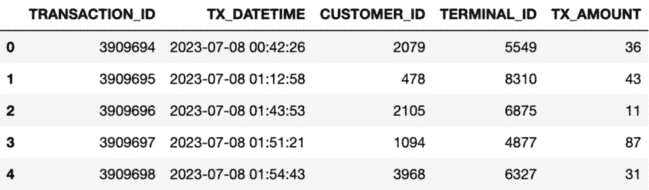

图 5.7 - 示例交易数据集

```py
redact_dataset.head()
```

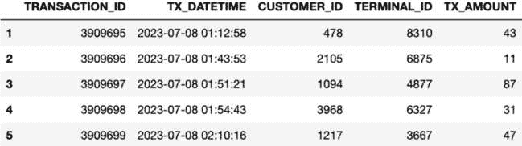

图 5.8 – 红 act 数据集

我们已从原始数据集中删除了一条记录（客户 ID 2079），该客户进行了 36 美元的交易。这是为了形成编辑后数据集。

让我们计算原始数据集和编辑后数据集的交易金额总和，以确定差异。这个差异将对应于客户 ID 2079 实际进行的交易金额：

```py
sum_original_dataset = round(sum(df["TX_AMOUNT"].to_list()), 2)
sum_redact_dataset =
round(sum(redact_dataset["TX_AMOUNT"].to_list()), 2)
tx_amount_2079 = round((sum_original_dataset - sum_redact_dataset), 2)
tx_amount_2079
36
```

让我们应用差分隐私技术来计算原始数据集和编辑后数据集的交易金额总和。这两个总和之间的差异不应揭示客户 ID 2079 实际进行的交易金额。以下是您可以采取的方法：

在原始数据集上使用差分隐私计算的总和：

```py
dp_sum_original_dataset = BoundedSum(
    epsilon=1, lower_bound=1.0, upper_bound=500.0, dtype="float"
)
dp_sum_original_dataset.reset()
dp_sum_original_dataset.add_entries(
    df["TX_AMOUNT"].to_list()
)
dp_sum_og = round(dp_sum_original_dataset.result(), 2)
print(dp_sum_og)
1300958.19
```

在编辑后数据集上使用差分隐私计算的总和：

```py
dp_redact_dataset = BoundedSum(epsilon=1, lower_bound=1.0, upper_bound=500.0, dtype="float")
dp_redact_dataset.add_entries(redact_dataset["TX_AMOUNT"].to_list())
dp_sum_redact = round(dp_redact_dataset.result(), 2)
print(dp_sum_redact)
1302153.33
```

使用差分隐私计算的两个数据集之间的差异：

```py
round(dp_sum_og - dp_sum_redact, 2)
-1195.14
```

在本例中，当使用差分隐私计算原始数据集和编辑后数据集的交易金额总和时，这两个总和之间的差异产生了负数。然而，重要的是要注意，这些负值并不代表客户 ID 2079 实际进行的交易金额。

差分隐私计算过程中引入的固有噪声导致差异值中出现负值。差分隐私技术通过引入随机化来保护个人隐私，而这种随机噪声有时会导致汇总结果中出现负扰动。

因此，正确解释这些负值至关重要。它们不应被视为客户 ID 2079 实际进行的交易金额，而应被视为差分隐私机制成功引入噪声以保护个人隐私并提供了近似汇总结果的指示。

理解这一点至关重要，即差分隐私侧重于保护隐私，而不是计算结果的精确性。负差异值作为差分隐私提供的隐私保证的提醒，确保即使在汇总计算的情况下，个人交易细节也得到了保护。

# 将差分隐私应用于大数据集

在前面的例子中，我们专注于在较小的数据集上计算差分隐私汇总（如计数、总和和平均值），这些数据集涉及单个终端或有限数量的终端。然而，在本节中，我们将探讨如何在包含数百万甚至数十亿条记录的大数据集上生成差分隐私汇总。具体来说，我们将考虑一个涉及约 500 万张信用卡交易数据集的用例，这些交易发生在 1,000 个销售终端和 5,000 名客户之间。

## 用例 - 在大数据集上生成差分隐私汇总

让我们生成包含在 1,000 个 POS 终端上按日记录的信用卡交易的数据库。这些交易涉及总共 5,000 名客户，结果是一个大约 5 百万条记录的庞大集合。

要计算如此大数据集的差异隐私聚合，需要采用专门的技术和框架来处理数据的规模和复杂性。这些技术确保在提供有意义的聚合统计信息的同时保护隐私。

通过在大数据集上利用差异隐私，组织可以在不损害单个客户隐私的情况下提取有价值的见解。生成的差异隐私聚合允许数据驱动的决策和分析，同时保护敏感信息。值得注意的是，用于在大数据集上应用差异隐私的方法和框架可能因具体要求和可用资源而异。数据分区、并行处理和优化算法等技术在大规模数据集上高效计算差异隐私聚合中起着至关重要的作用。

通过了解如何在大数据集上生成差异隐私聚合，组织可以从其数据中提取可操作的见解，同时维护交易涉及的个人的隐私。数据集按特定格式组织，每天的交易存储在包含日期的单独文件中。为了说明，让我们考虑一个示例，其中数据集对应于 2022 年 2 月 1 日的交易。该天的文件使用以下格式：

文件名：`2022-02-01.csv`

文件名由特定日期按`YYYY-MM-DD`格式组成。在这种情况下，`2022-02-01`代表文件中包含的交易日期。

文件的实际内容将是该特定日期的交易数据，包括客户 ID、交易金额、POS 终端 ID 以及其他任何相关信息。

这种文件格式，其中每天的交易存储在单独的文件中，文件名包含日期，有助于按时间顺序组织和管理工作集。

它使得从特定日期检索和分析交易数据变得容易，从而便于基于时间的分析和报告任务：

| **交易 ID** | **交易时间** | **客户 ID** | **终端 ID** | **交易金额** |
| --- | --- | --- | --- | --- |
| 0 | 2023-02-01 00:43:37 | 901 | 8047 | 82 |
| 1 | 2023-02-01 01:20:13 | 2611 | 7777 | 15 |
| 2 | 2023-02-01 01:22:52 | 4212 | 3336 | 53 |
| 3 | 2023-02-01 01:26:40 | 1293 | 7432 | 59 |
| 4 | 2023-02-01 01:52:23 | 2499 | 1024 | 25 |
| 5 | 2023-02-01 02:11:03 | 2718 | 168 | 68 |
| 6 | 2023-02-01 02:11:56 | 2998 | 5513 | 80 |

表 5.1 – 交易数据的前几行

| **交易 ID** | **交易时间** | **客户 ID** | **终端 ID** | **交易金额** |
| --- | --- | --- | --- | --- |
| 24901 | 2023-02-02 01:34:52 | 4999 | 4536 | 43 |
| 24902 | 2023-02-02 01:44:39 | 580 | 3511 | 29 |
| 24903 | 2023-02-02 01:48:04 | 3309 | 7661 | 50 |
| 24904 | 2023-02-02 01:58:12 | 2919 | 5322 | 94 |
| 24905 | 2023-02-02 02:07:07 | 3868 | 3217 | 97 |
| 24906 | 2023-02-02 02:08:43 | 1822 | 489 | 15 |

表 5.2 – 交易数据的最后几行

对于我们的用例场景，核心练习是创建差分隐私聚合，让我们假设系统接收覆盖数月的数据，目标是为每个 POS 终端生成差分隐私聚合的交易数据。

| **POS 终端** | **差分** **隐私聚合** |
| --- | --- |
|  | 计数 | 总和 | 平均值 |
| 1 |  |  |  |
| 2 |  |  |  |
| 3 |  |  |  |
| 4 |  |  |  |
| .. |  |  |  |

表 5.3 – 差分隐私聚合

虽然使用 Pytorch、pandas 和 PyDP 等框架可以有效地生成差分隐私聚合，但确实，仅使用这些方法处理大量数据可能耗时且不可扩展。然而，有其他方法和工具可供选择，以应对这些挑战。

这些方法包括以下内容：

+   **并行处理**：我们可以利用并行处理技术将计算分布在多个处理器或机器上。这可以显著减少处理时间，并在处理大量数据时实现可扩展性。

+   **分布式计算**：我们可以采用 Apache Spark 或 Hadoop 等分布式计算框架来处理大数据。这些框架提供了分布式数据处理能力，允许高效处理大规模数据集。

+   **云计算**：我们可以利用如**亚马逊网络服务**（**AWS**）或**谷歌云平台**（**GCP**）这样的云计算平台来利用可扩展基础设施的力量。这些平台提供如 Amazon EMR、Google Dataproc 或 Azure HDInsight 等服务，可以以成本效益和可扩展的方式处理大规模数据处理。

+   **优化后的差分隐私库**：我们可以探索专门设计的差分隐私库，例如 PipelineDP、TensorFlow Privacy 或 Opacus，这些库旨在提供高效且可扩展的差分隐私算法实现。这些库提供了针对隐私保护计算的优化，使得处理更快、更可扩展。

+   **数据分区和预聚合**：我们可以将数据划分为可管理的分区，并执行预聚合以减少整体计算负载。这种方法通过最小化每一步处理的数据量来提高性能。

通过结合这些方法和工具，可以在生成差分隐私聚合时克服处理大数据集的挑战。这些方法可以显著减少处理时间并提高可扩展性，使组织能够高效地分析和从其数据中提取见解，同时保护隐私。

**以下是一些需要考虑的问题/设计：**

+   你如何在大数据集上解决或生成 DP 聚合？

+   你如何对数据进行分区？（例如，基于日期或基于 POS 终端的分区）

+   你如何在给定的分区内应用 DP？

    +   你如何找出最大和最小值界限来计算（剪辑）函数

    +   我们是否应该在分区中的每个数据值上应用 DP（界限/敏感性）以生成 DP 聚合？或者

    +   我们应该先生成统计聚合，然后再在分区内应用 DP 吗？

## PipelineDP 高级架构

PipelineDP 框架旨在解决在生成大数据集的差分隐私聚合时提到的先前问题和考虑因素。

PipelineDP ([`pipelinedp.io`](https://pipelinedp.io)) 是一个开源框架，它支持使用开源框架（如 Apache Spark 和 Apache Beam）在大数据集上生成差分隐私聚合。PipelineDP 框架由 Google 与 OpenMined 合作开发。截至撰写本书时，PipelineDP 团队声明此框架不建议用于生产部署，但被认为足够用于开发模式和演示目的，以增强你的理解。


图 5.9 – PipelineDP 架构

PipelineDP 提供三种模式的 API（Apache Spark、Apache Beam 和本地模式）以及通过 DP 引擎访问其相应实现的方式。

这里是 PipelineDP 中使用的核心概念：

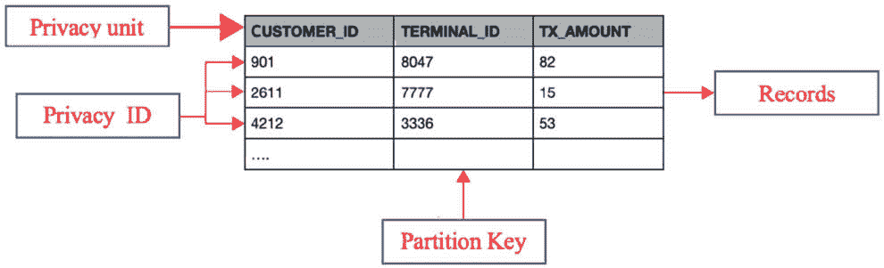

图 5.10 – 示例展示样本数据的隐私单元、隐私-id 和分区键

+   **记录**是 PipelineDP 中输入数据集中的元素。

+   **分区**是数据的一个子集，对应于聚合标准的给定值。在我们的案例中，我们想要每个 POS 终端的结果，因此分区将是**TERMINAL_D**。

+   **分区键**是对应于分区的聚合键。在本例中，TERMINAL_D 是分区键。

+   **隐私单元**是我们想要使用差分隐私保护的实体。

+   **隐私 ID**是隐私单元的标识符。在我们的例子中，CUSTOMER_ID 是隐私 ID。

现在我们已经了解了高级架构和关键概念，让我们使用 PipelineDP 在大数据集上实现差分隐私。

以下代码行安装 PipelineDP 框架。

```py
pip install PipelineDP
```

*源代码：* *Large_Data_Sets-DP_PipelineDP.ipynb*

```py
Import pipeline_dp
Import pandas as pd
Import numpy as np
url ="transactions.csv"
df_actual = pd.read_csv(url, sep=",")
df_transactions = df_actual[['TRANSACTION_ID', 'TX_DATETIME','CUSTOMER_ID','TERMINAL_ID','TX_AMOUNT']]
df_transactions
```

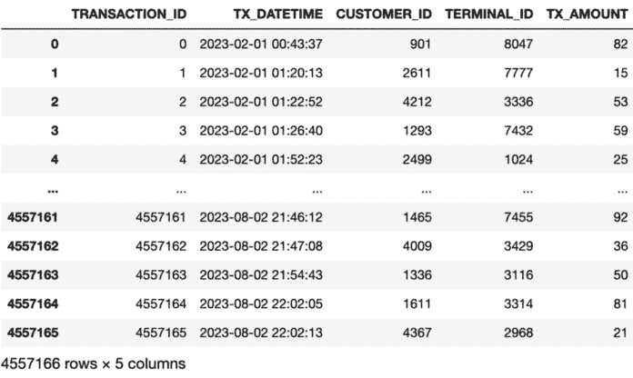

图 5.11 – 交易数据

```py
rows =
[index_row[1] for index_row in transactions_df.iterrows()]
```

以下代码将生成每个终端的不同隐私计数（客户总数）：

```py
#In this example we use a local backend, but Spark and Apache #backends also can be tried in a similar way by making use of the provided classes.
backend = pipeline_dp.LocalBackend()
# Define the total budget.
budget_accountant = pipeline_dp.NaiveBudgetAccountant(total_epsilon=1, total_delta=1e-6)
# Create DPEngine which will execute the logic to generate the aggregates
dp_engine = pipeline_dp.DPEngine(budget_accountant, backend)
# Define privacy ID, partition key, and aggregated value extractors.
# The aggregated value extractor isn't used for Count aggregates, but this is required for SUM, AVERAGE aggregates
data_extractors = pipeline_dp.DataExtractors(
   partition_extractor=lambda row: row.TERMINAL_ID,
   privacy_id_extractor=lambda row: row.CUSTOMER_ID,
   value_extractor=lambda row: 1)
# Configure the aggregation parameters. Number of partitions is 10000 because the number of terminals is 10,000
params = pipeline_dp.AggregateParams(
   noise_kind=pipeline_dp.NoiseKind.LAPLACE,
   metrics=[pipeline_dp.Metrics.COUNT],
   max_partitions_contributed=100,
   max_contributions_per_partition=10)
public_partitions=list(range(1, 10000))
#Create a computational graph for the aggregation.
dp_result = dp_engine.aggregate(rows, params, data_extractors, public_partitions)
#Compute budget per each DP operation.
budget_accountant.compute_budgets()
dp_result = list(dp_result)
dp_dict=dict(dp_result)
myKeys = list(dp_dict.keys())
myKeys.sort()
sorted_dict = {i: dp_dict[i] for I in myKeys}
print(sorted_dict)
dp_count = [0] * 100
for count_sum_per_day in dp_result:
  index =  count_sum_per_day[0] – 1
  dp_count[index] = count_sum_per_day[1][0]
  print(dp_count[index])
```

现在生成实际的计数并与差分隐私计数进行比较：

```py
df_counts = df_transactions.groupby(by='TERMINAL_ID').agg('count')
df_counts
```

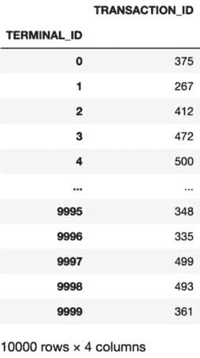

图 5.12 – 交易聚合

通过利用 PipelineDP 框架，我们可以解决生成大型数据集的差分隐私聚合所涉及到的挑战和考虑因素。它提供了一个综合的解决方案，结合了可扩展性、隐私保护和精确聚合，使我们能够有效地利用差分隐私技术进行大规模数据分析。

## Tumult Analytics

Tumult Analytics 是一个功能丰富且健壮的 Python 库，旨在执行表格数据的聚合查询，同时确保差分隐私的原则。该库提供了一个直观的界面，使得熟悉 SQL 或 PySpark 的用户能够使用。它提供了一系列的聚合函数、数据转换操作符和隐私定义，确保在分析任务中的多功能性。由差分隐私领域的专家团队开发和维护，Tumult Analytics 保证可靠性，甚至被像美国人口普查局这样的知名机构在生产环境中使用。由 Spark 驱动，该库展示了卓越的可扩展性，能够高效处理大型数据集。凭借其全面的功能和对隐私保护的重视，Tumult Analytics 是一个专注于维护数据隐私的数据分析的有价值工具。

以下是对 Tumult Analytics 开源框架的引用：

```py
@software{tumultanalyticssoftware,
    author = {Tumult Labs},
    title = {Tumult {{Analytics}}},
    month = dec,
    year = 2022,
    version = {latest},
    url = {https://tmlt.dev}
}
```

### Tumult Analytics 安装

要使用 Tumult Analytics，必须安装 Python，因为该库是用 Python 构建的。它与 Python 版本 3.7 到 3.10 兼容。此外，由于 Tumult Analytics 使用 PySpark 进行计算，因此还需要安装 Java 8 或 11。

以下代码安装 Tumult Analytics 框架。

```py
pip3 install tmlt.analytics
```

### Tumult Analytics 的关键特性

Tumult Analytics 提供了类和方法，用于在大型数据集上使用差分隐私构建聚合。以下是一些高级类：

| **类** | **方法** |
| --- | --- |
| Session(tmlt.analytics.session) | Session 模块提供了一个方便的接口来管理数据源并对它们执行差分隐私查询。创建会话很简单，使用 Session.from_dataframe() 来创建一个涉及单个私有数据源的简单会话，或者使用 Session.Builder 来处理涉及多个数据源的更复杂场景。一旦会话设置完成，就可以使用 Session.evaluate() 在数据上执行查询。当初始化 Session 的实例类型时，指定 PrivcyBudget 以确保在私有数据上执行的查询不超过此分配的预算。默认情况下，Session 实例在行级别强制执行隐私保护。这意味着查询阻止任何潜在的攻击者推断出是否将单个行添加或从私有表中删除。然而，这个隐私保证仅适用于查询本身，并假设私有数据在计算过程中没有在其他地方使用。 |
| PureDPBudget(tmlt.analytics.privacy_budget ) | 提供纯差分隐私的隐私预算。 |
| ApproxDPBudgettmlt.analytics.privacy_budget ) | 提供近似差分隐私的隐私预算。 |
| QueryBuilder(tmlt.analytics.query_builder) | 一个用于指定 DP 查询的高级接口。QueryBuilder 类可以应用转换，如连接或过滤，以及计算包括计数、总和和标准差在内的聚合。 |
| KeySet(tmlt.analytics.keyset) | KeySet 指定一个或多个列的值列表。目前，KeySets 被用作指定 `groupb``y` 转换域的更简单方式。 |

表 5.4 – tmlt.analytics.session 描述

### 使用 Tumult Analytics 的示例应用

让我们使用 tmlt-analytics 在上一节中使用的大型数据集（即我们的交易数据）上生成聚合数据。

*源代码*：DP_Large_Data_Sets_TMLT.ipynb

让我们按照以下方式导入所需的 Python 包：

```py
import os
from pyspark import SparkFiles
from pyspark.sql import SparkSession
from tmlt.analytics.privacy_budget import PureDPBudget
from tmlt.analytics.protected_change import AddOneRow
from tmlt.analytics.query_builder import QueryBuilder
from tmlt.analytics.session import Session
```

接下来，初始化 Spark 会话：

```py
spark = SparkSession.builder.getOrCreate()
```

让我们加载包含信用卡交易信息的数据集。我们从本地目录获取数据并将其加载到 Spark DataFrame 中：

**#创建一个下载目录并解压** **transactions.csv.zip 文件以复制 transactions.csv 文件：**

[`github.com/PacktPublishing/Privacy-Preserving-Machine-Learning/blob/main/Chapter%205/transactions.csv.zip`](https://github.com/PacktPublishing/Privacy-Preserving-Machine-Learning/blob/main/Chapter%205/transactions.csv.zip)

```py
spark.sparkContext.addFile(
    "/downloads/transactions.csv")
trans_df = spark.read.csv(
    SparkFiles.get("/downloads/transactions.csv"), header=True, inferSchema=True
)
trans_df.head(5)
[Row(_c0=0, TRANSACTION_ID=0, TX_DATETIME=datetime.datetime(2023, 2, 1, 0, 43, 37), CUSTOMER_ID=901, TERMINAL_ID=8047, TX_AMOUNT=82, TX_TIME_SECONDS=2617, TX_TIME_DAYS=0),
 Row(_c0=1, TRANSACTION_ID=1, TX_DATETIME=datetime.datetime(2023, 2, 1, 1, 20, 13), CUSTOMER_ID=2611, TERMINAL_ID=7777, TX_AMOUNT=15, TX_TIME_SECONDS=4813, TX_TIME_DAYS=0),
 Row(_c0=2, TRANSACTION_ID=2, TX_DATETIME=datetime.datetime(2023, 2, 1, 1, 22, 52), CUSTOMER_ID=4212, TERMINAL_ID=3336, TX_AMOUNT=53, TX_TIME_SECONDS=4972, TX_TIME_DAYS=0),
 Row(_c0=3, TRANSACTION_ID=3, TX_DATETIME=datetime.datetime(2023, 2, 1, 1, 26, 40), CUSTOMER_ID=1293, TERMINAL_ID=7432, TX_AMOUNT=59, TX_TIME_SECONDS=5200, TX_TIME_DAYS=0),
 Row(_c0=4, TRANSACTION_ID=4, TX_DATETIME=datetime.datetime(2023, 2, 1, 1, 52, 23), CUSTOMER_ID=2499, TERMINAL_ID=1024, TX_AMOUNT=25, TX_TIME_SECONDS=6743, TX_TIME_DAYS=0)]
```

### 启动 tmlt-analytics 会话

```py
Session by wrapping a DataFrame containing private data using the from_dataframe() method:
```

```py
session = Session.from_dataframe(
    privacy_budget=PureDPBudget(3.5),
    source_id="transactions",
    dataframe=trans_df,
    protected_change=AddOneRow(),
)
```

当会话使用有限的隐私预算初始化时，它提供了一个直接的接口承诺：在这个会话上执行的查询，总体上，将产生具有最大 epsilon 值 3.5 的差分隐私结果。Epsilon 是衡量潜在隐私损失的一个指标，较低的 epsilon 表示对隐私损失有更严格的限制，从而提供更高的保护水平。在这种情况下，接口承诺对应于隐私保证，确保对私有数据有最低级别的保护。

除了数据本身之外，还需要一些额外的信息：

+   **隐私预算**参数指定了会话将提供的隐私保证。

+   **source_id**参数作为 DataFrame 的标识符。它将被用来在构建查询时引用这个特定的 DataFrame。

+   **protected_change**参数定义了差分隐私保证应用的数据单元。在这个例子中，**AddOneRow()**用于保护数据集中的单个行。

### 使用 Session 执行 DP 查询

我们第一次查询是在启用 DP 的情况下找到数据中的总交易数量：

```py
count_query = QueryBuilder("transactions").count()
```

要在所需私有数据上执行查询，我们在第一步使用 `QueryBuilder("transactions")`，这表示我们想要查询的特定源数据（数据源），对应于之前指定的 `source_id` 参数。在下一行，使用 `count()` 语句检索数据集中的总记录数。一旦构建了查询，我们就通过使用会话的 `evaluate` 方法在数据上运行它。为此，我们将隐私预算分配给评估过程。在这种情况下，我们使用差分隐私评估查询，将 ε=1 设置为隐私参数：

```py
total_count = session.evaluate(
    count_query,
  privacy_budget=PureDPBudget(epsilon=1)
)
```

查询的结果以 Spark DataFrame 的形式返回。我们可以使用这个 DataFrame 的 `show()` 方法来查看它们。我们为这个查询使用了 3.5 个隐私预算中的 1 个，所以剩余的隐私预算将是 2.5：

```py
total_count.show()
+-------+
|  count|
+-------+
|4557168|
+-------+
```

如果你正在跟随示例并执行代码，你可能会观察到不同的值。这种变化是差分隐私的基本方面，因为它在查询执行期间引入了随机化（称为噪声）。为了展示这一特性，让我们再次评估相同的查询并查看结果。

查询计算中添加的噪声量可能取决于隐私参数、聚合类型和基础数据。然而，在许多情况下，查询结果仍然提供了对原始数据的可靠见解。在这个特定场景中，我们可以通过直接在原始 DataFrame 上执行计数查询来确认这一点，这将产生真实和准确的结果：

```py
total_count = trans_df.count()
print(total_count)
4557166
```

### 玩转隐私预算

描述会话对象以了解其属性和剩余的隐私预算。

```py
session.describe()
The session has a remaining privacy budget of PureDPBudget(epsilon=2.5).
The following private tables are available:
Table 'transactions' (no constraints):
  Columns:
    - '_c0'              INTEGER
    - 'TRANSACTION_ID'   INTEGER
    - 'TX_DATETIME'      TIMESTAMP
    - 'CUSTOMER_ID'      INTEGER
    - 'TERMINAL_ID'      INTEGER
    - 'TX_AMOUNT'        INTEGER
    - 'TX_TIME_SECONDS'  INTEGER
    - 'TX_TIME_DAYS'     INTEGER
```

### 利用隐私预算进行隐私查询

让我们找出购买金额低于 25 美元的客户数量。

此查询消耗了我们的总预算中的 epsilon=1：

```py
low_purchagers= QueryBuilder("transactions").filter("TX_AMOUNT < 25").count()
low_purchagers_count = session.evaluate(
    low_purchagers,
    privacy_budget=PureDPBudget(epsilon=1),
)
low_purchagers_count.show()
+-------+
|  count|
+-------+
|1024844|
+-------+
print(session.remaining_privacy_budget)
PureDPBudget(epsilon=1.5)
```

我们已经使用了剩余总隐私预算中的 1 个单位，所以还剩下 1.5 个单位。让我们尝试另一个查询来消耗另一个 1 个单位的隐私预算：

让我们找出购买金额大于 25 美元但小于 50 美元的客户数量。

```py
med_purchagers= QueryBuilder("transactions").filter("TX_AMOUNT >25 AND TX_AMOUNT <50").count()
med_purchagers_count = session.evaluate(
    med_purchagers,
    privacy_budget=PureDPBudget(epsilon=1),
)
med_purchagers_count.show()
+-------+
|  count|
+-------+
|1165384|
+-------+
print(session.remaining_privacy_budget)
PureDPBudget(epsilon=0.5)
```

我们已经使用了 3 个单位中的 3.5 个单位，所以还剩下 0.5 个单位。让我们尝试另一个查询来消耗 1 个单位的隐私预算（运行查询超过可用预算并观察结果）。

```py
high_purchagers= QueryBuilder("transactions").filter("TX_AMOUNT > 50").count()
high_purchagers_count = session.evaluate(
    high_purchagers,
    privacy_budget=PureDPBudget(epsilon=1),
)
high_purchagers_count.show()
```

它将抛出以下运行时错误：

```py
---------------------------------------------------------------------------
InsufficientBudgetError                   Traceback (most recent call last)
/usr/local/lib/python3.10/dist-packages/tmlt/analytics/session.py in evaluate(self, query_expr, privacy_budget)
   1283             try:
-> 1284                 answers = self._accountant.measure(
   1285                     measurement, d_out=adjusted_budget.value
/usr/local/lib/python3.10/dist-packages/tmlt/core/measurements/interactive_measurements.py in measure(self, measurement, d_out)
   1343         if not self._privacy_budget.can_spend_budget(d_out):
-> 1344             raise InsufficientBudgetError(
   1345                 self.privacy_budget,
InsufficientBudgetError: PrivacyAccountant's remaining privacy budget is 1/2, which is insufficient for this operation that requires privacy loss 1.
RuntimeError: Cannot answer query without exceeding the Session privacy budget.
Requested: ε=1.000
Remaining: ε=0.500
Difference: ε=0.500
```

让我们显示剩余的隐私预算，以便在后续查询中使用。

`print(session.remaining_privacy_budget)`

```py
PureDPBudget(epsilon=0.5)
```

重新编写最后一个查询，使其能够利用剩余的可用预算，以便完全使用隐私预算，而不是浪费未使用的预算。在这种情况下，我们不会指定隐私预算为 1 或 2，而是将使用`Session`类本身的剩余隐私预算：

```py
high_purchagers= QueryBuilder("transactions").filter("TX_AMOUNT > 50").count()
high_purchagers_count = session.evaluate(
    high_purchagers,
    privacy_budget=session.remaining_privacy_budget,
)
high_purchagers_count.show()
+-------+
|  count|
+-------+
|2271804|
+-------+
```

通过应用差分隐私计算的高购买次数总数。

**分组查询**

在 Tumult Analytics 中，KeySet 类被用来定义分组键的列表。它允许我们指定我们打算按哪些列对数据进行分组，以及与这些列关联的潜在值。KeySet 类在 Tumult Analytics 中作为指定分组标准的一种便捷方式。

现在让我们编写一个查询来查找每个终端的平均交易金额（在这个例子中仅取前 10 个终端）。

创建一个隐私预算设置为 2.5 的会话：

```py
budget = PureDPBudget(epsilon=2.5) # maximum budget consumed in the Session
session = Session.from_dataframe(
    privacy_budget=budget,
    source_id="transactions",
    dataframe=trans_df,
    protected_change=AddOneRow(),
)
```

使用`KeySet`类并定义分组列（TERMINAL_ID）或列和值，以进行过滤：

```py
from tmlt.analytics.keyset import KeySet
terminal_ids = KeySet.from_dict({
    "TERMINAL_ID": [
        1,2,3,4,5,6,7,8,9,10
    ]
})
```

执行查询并提供剪裁`TX_AMOUNT`的下限和上限：

```py
average_purchase_query = (
    QueryBuilder("transactions")
    .groupby(terminal_ids)
    .average("TX_AMOUNT", low=5, high=100)
)
average_purchages= session.evaluate(
    average_purchase_query,
    privacy_budget=PureDPBudget(1),
)
average_purchages.show(truncate=False)
+-----------+------------------+
|TERMINAL_ID|TX_AMOUNT_average |
+-----------+------------------+
|1          |55.93609022556391 |
|2          |52.93446601941748 |
|3          |40.95974576271186 |
|4          |52.02414486921529 |
|5          |47.511428571428574|
|6          |52.276595744680854|
|7          |51.566233766233765|
|8          |50.12273641851107 |
|9          |52.88358208955224 |
|10         |48.98945147679325 |
+-----------+------------------+
```

这样，我们可以使用差分隐私生成汇总，确保它们与实际汇总不同。

### 使用隐私 ID 的查询

之前，我们专注于处理每个数据集中的个体都链接到单行表的表格。然而，这并不总是情况。在某些数据集中，同一个人可能出现在多个行中。在这种情况下，通常会给每个人分配一个唯一的标识符（即跨不同行）。目标随后转向隐藏与特定标识符关联的所有行是否都存在于数据中。

Tumult Analytics 将这些标识符称为隐私 ID。每个隐私 ID 与一个人或任何其他需要保护的实体进行一对一映射。目标是通过对数据集中存在的匿名性进行保护来保护个人或实体的隐私。这可以通过使用 `AddRowsWithID` 受保护更改来实现。此受保护更改将防止任意添加和删除许多具有相同 ID 的行。

使用隐私 ID 初始化会话：

```py
from tmlt.analytics.protected_change import AddRowsWithID
budget = PureDPBudget(epsilon=2.5) # maximum budget consumed in the Session
session = Session.from_dataframe(
    privacy_budget=budget,
    source_id="transactions",
    dataframe=trans_df,
    protected_change=AddRowsWithID(id_column="CUSTOMER_ID"),
)
```

使用隐私 ID 执行查询：

```py
keyset = KeySet.from_dataframe(
    trans_df.select("TERMINAL_ID", "TX_AMOUNT")
)
count_query = (
    QueryBuilder("transactions")
    .groupby(keyset)
    .count()
)
result = session.evaluate(count_query, PureDPBudget(1))
```

让我们执行此代码并观察输出：

```py
RuntimeError: A constraint on the number of rows contributed by each ID is needed to perform this query (e.g. MaxRowsPerID).
```

此错误是由于缺少对单个个人可以向数据集贡献的行数的限制。单个客户可能进行许多交易，甚至超过 1,000 行或更多。然而，差分隐私需要通过引入统计噪声来隐藏个人数据的影响。

为了解决这个问题，有必要在执行聚合之前对单个客户对计算统计量的最大影响建立限制。此限制被应用于数据以减轻任何潜在的影响。最直接的约束，称为 `MaxRowsPerID`，限制了每个隐私 ID 贡献的总行数。为了强制执行此约束，我们可以简单地将它作为参数传递给 `enforce()` 操作。对于当前的具体查询，我们将设置每个图书馆成员贡献的最大行数为 100：

```py
from tmlt.analytics.constraints import (
    MaxGroupsPerID,
    MaxRowsPerGroupPerID,
    MaxRowsPerID,
)
keyset = KeySet.from_dataframe(
    trans_df.select("TERMINAL_ID", "TX_AMOUNT")
)
count_query = (
    QueryBuilder("transactions")
    .enforce(MaxRowsPerID(100))
    .groupby(keyset)
    .count()
)
result = session.evaluate(count_query, PureDPBudget(1))
top_five = result.sort("count", ascending=False).limit(5)
top_five.show()
+-----------+---------+-----+
|TERMINAL_ID|TX_AMOUNT|count|
+-----------+---------+-----+
|       3001|       98| 1240|
|       3536|       42| 1217|
|       4359|       71| 1212|
|       9137|       97| 1145|
|       7179|       76| 1143|
+-----------+---------+-----+
result.show()
+-----------+---------+-----+
|TERMINAL_ID|TX_AMOUNT|count|
+-----------+---------+-----+
|          0|        4|  401|
|          0|        7|  224|
|          0|       11|   -7|
|          0|       12|  131|
|          0|       16|  -35|
|          0|       18|  -68|
|          0|       20| -126|
|          0|       24|  -46|
|          0|       26| -162|
|          0|       28|  -30|
|          0|       31|  447|
|          0|       33|   23|
|          0|       35|   20|
|          0|       44|   96|
|          0|       49|  -56|
|          0|       51|  211|
|          0|       58|  -88|
|          0|       59|  -27|
|          0|       60| -254|
|          0|       61|  525|
+-----------+---------+-----+
```

前面的输出仅显示了前 20 行。

Tumult Analytics 提供了数据过滤、连接和转换功能，以执行复杂查询，对大型数据集应用差分隐私，并利用 Spark 分布式处理。我们已经涵盖了基本的关键特性，但基于应用/系统中的用例，还有许多更多特性可以探索。

# 使用差分隐私的机器学习

在本节中，我们的目标是开发一个机器学习分类模型，能够准确地区分欺诈和真实的信用卡交易。为了确保隐私保护，我们还将对模型应用差分隐私技术。分类模型将在包含历史信用卡交易的历史数据集上训练，其中每笔交易都被标记为欺诈或真实。像逻辑回归、决策树或神经网络这样的流行机器学习算法可以应用于构建分类模型，在我们的案例中我们将使用神经网络。

为了引入差分隐私，我们将利用向训练过程添加噪声和使用隐私保护算法等技术。这些技术确保模型的训练过程和随后的预测不会损害单个交易或敏感客户信息的隐私。

通过将差分隐私集成到分类模型中，我们可以在保持识别欺诈交易的高准确性的同时提供强大的隐私保证。这确保了模型可以有效地保护客户的隐私，并防止未经授权访问敏感的财务数据。

在本节中，我们将探讨训练分类模型、评估其性能以及应用差分隐私技术以增强隐私保护的步骤。最终，我们将拥有一个功能强大的模型，能够准确地将信用卡交易分类为欺诈或真实，同时确保涉及个人的隐私。

## 生成合成数据集：引入欺诈交易

我们将使用之前使用的相同交易数据，在数据集中添加一个名为 `TX_FRAUD` 的列，并将任何大于 $75 的交易标记为欺诈。这显然并不反映现实世界，但我们将使用此规则生成我们的示例合成数据。在此数据集中，大约 25% 的数据被标记为欺诈交易，而 75% 的数据是真实的。在现实世界中，欺诈交易在大多数数据集中可能不到 1%，这会导致数据高度不平衡。

*源代码*：Fraud_Transactions_Generator.ipynb

```py
import pandas as pd
import numpy as np
url="transactions.csv"
df_actual = pd.read_csv(url, sep=",")
df_actual.head()
df_transactions = df_actual[['TRANSACTION_ID', 'TX_DATETIME','CUSTOMER_ID','TERMINAL_ID','TX_AMOUNT']]
df_transactions
df_transactions.insert(5, 'TX_FRAUD', 0, True)
df_transactions
```

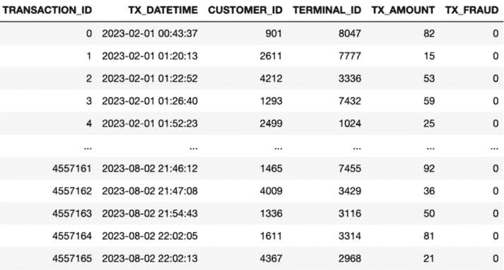

图 5.13 – 交易数据

4557166 行 × 6 列

```py
df_transactions.loc[df_transactions.TX_AMOUNT>75, 'TX_FRAUD']=1
nb_frauds=df_transactions.TX_FRAUD.sum()
print("Number of fraud transaction",nb_frauds)
Number of fraud transaction 1106783
df_transactions.head()
```

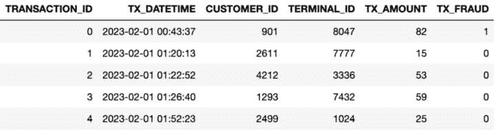

图 5.14 – 交易数据的最初几行

```py
df_transactions.to_csv("fraud_transactions.csv")
```

## 使用 scikit-learn 开发分类模型

以下是为开发分类模型制定的高级步骤：

1.  加载**欺诈交易**数据集。

1.  以 70:30 的比例将数据集分为训练集和测试集。

1.  初始化分类器（来自 sci-kit learn 的逻辑回归）。

1.  使用训练数据（70% 的交易）训练分类器。

1.  使用测试数据集（30% 的交易）找出分类器的准确率。

1.  找出在逻辑回归模型中用于**决策**函数和截距的计算权重/系数。

*源代码*：Noise_Gradient_Final.ipynb

```py
from sklearn.linear_model import LogisticRegression
from sklearn.model_selection import train_test_split
from sklearn.model_selection import cross_val_score
import numpy as np
import pandas as pd
url = "fraud_transactions.csv"
df_actual = pd.read_csv(url, sep=",")
df_transactions =
df_actual[['CUSTOMER_ID','TERMINAL_ID','TX_AMOUNT','TX_FRAUD']]
df_transactions
```

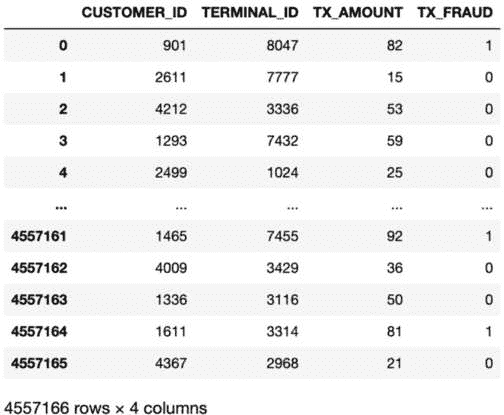

图 5.15 – 欺诈交易数据集

```py
print('No Frauds', round(df_transactions['TX_FRAUD'].value_counts()[0]/len(df_transactions) * 100,2), '% of the dataset')
print('Frauds', round(df_transactions['TX_FRAUD'].value_counts()[1]/len(df_transactions) * 100,2), '% of the dataset')
No Frauds 75.71 % of the dataset
Frauds 24.29 % of the dataset
X = df_transactions.drop('TX_FRAUD', axis=1)
y = df_transactions['TX_FRAUD']
X_train, X_test, y_train, y_test = train_test_split(X, y, test_size=0.3, random_state=42)
# Turn the values into an array for feeding the classification algorithms.
X_train = X_train.values
X_test = X_test.values
y_train = y_train.values
y_test = y_test.values
logreg = LogisticRegression(random_state=0)
logreg.fit(X_train, y_train)
training_score = cross_val_score(logreg, X_train, y_train, cv=2)
print('Logistic Regression Cross Validation Score: ',
round(training_score.mean() * 100, 2).astype(str) + '%')
Logistic Regression Cross Validation Score: 100.0%
np.sum(logreg.predict(X_test) == y_test)/X_test.shape[0]
1.0
logreg.intercept_[0], logreg.coef_[0]
(-1168.308115256604,
 array([-2.47724513e-05, 3.17749573e-06, 1.54748556e+01]))
```

一旦我们知道了分类器的梯度/系数以及截距，那么计算预测值将变得容易。在我们的案例中，我们有三个特征，`CUSTOMER_ID`、`TERMINAL_ID` 和 `TRANSACTON_AMOUNT`。线性方程将包含三个特征：

*y = w1 * x1 + w2 * x2 + w3 * x3 + b*

一旦我们知道了特征值（x1, x2, x3… xn）、权重（w1, w2, w3, …, wn）和 b 值（偏差/截距），我们就可以计算 y-hat 值（预测值）。逻辑回归使用逻辑函数来估计/预测概率。在我们的案例中，它将是以下形式：

y-hat = 1.0 / (1.0 + e – (w1 * x1 + w2 * x2 + w3 * x3 + b))

我们将取一个实际交易并使用从模型获得的权重来计算预测值：

| CUSTOMER_ID | TERMINAL_ID | TX_AMOUNT | TX_FRAUD |
| --- | --- | --- | --- |
| 79 | 3115 | 78 | 1 |

表 5.16 – 对 CUSTOMER_ID 的预测

```py
data=[79,3115,78]
weights = [-2.47724513e-05, 3.17749573e-06, 1.54748556e+01]
intercept = -1168.308115256604
def predict(data,coefficients,intercept):
    yhat = intercept
    for i in range(len(data)):
        yhat += coefficients[i] * data[i]
    return 1.0 / (1.0 + np.exp(-yhat))
yhat = predict(data,weights,intercept)
yhat
1.0
```

逻辑回归在内部使用随机梯度下降算法来计算梯度/系数。

让我们实现自己的随机梯度下降算法来计算权重，而不是使用逻辑回归模型中 scikit-learn 提供的算法。

## SGD 算法的高级实现

实现 SGD 算法的步骤如下：

1.  将初始权重初始化为零（每个特征一个零，偏置/截距也设为零）：初始权重 = [0,0,0] 和截距=0

1.  对训练数据中的每一行执行以下操作：

    1.  根据初始权重和截距计算预测。

    1.  查找实际值和预测值之间的误差：

    *误差 = 实际值 – 预测值*

    1.  根据误差和学习率值更新截距：

    intercept= intercept + l_rate * error * yhat * (1.0 - yhat)

    1.  更新训练集中所有训练数据的权重。

1.  根据 epoch 的数量，重复前面的步骤。

```py
def predict(data,coefficients,intercept):
    yhat = intercept
    for i in range(len(data)):
        yhat += coefficients[i] * data[i]
    return 1.0 / (1.0 + np.exp(-yhat))
def final_gradients(gradients):
    length_grads=len(grads)
    avg_grads=[0,0,0]
    for i in range(0,length_grads):
        avg_grads[0]+=grads[i][0]
        avg_grads[1]+=grads[i][1]
        avg_grads[2]+=grads[i][2]
    avg_grads=[i/length_grads for i in avg_grads]
    return avg_grads
def sgd(train,y_train,l_rate, n_epoch):
    coef = [0,0,0]
    final_grads = [0,0,0]
    intercept = 0
    for epoch in range(n_epoch):
        predictions=[]
        gradients=[]
        sum_error = 0.0
        for i in range(len(train)):
            yhat = predict(train[i], coef,intercept)
            predictions.append(yhat)
            error = y_train[i] - yhat
            sum_error += error**2
            intercept= intercept + l_rate * error * yhat * (1.0 - yhat)
## intercept
            temp=train[i]
            for j in range(3):
                coef[j] = coef[j] + l_rate * error * yhat * (1.0 - yhat) * temp[j]
            gradients.append(coef)
        final_grads = final_gradients(gradients)
        print('>epoch=%d, lrate=%.3f, error=%.3f, intercept=%.3f '% (epoch, l_rate, sum_error,intercept))
    return final_grads
l_rate = 0.24
n_epoch = 4
coef = sgd(X_train[:10],y_train[:10],l_rate, n_epoch)
print(coef)
>epoch=0, lrate=0.240, error=2.250, intercept=-0.030
>epoch=1, lrate=0.240, error=2.000, intercept=-0.030
>epoch=2, lrate=0.240, error=2.000, intercept=-0.030
>epoch=3, lrate=0.240, error=2.000, intercept=-0.030
[-136.44000000000003, -263.88000000000005, -0.5099999999999999]
```

这样，我们可以计算系数。最终系数是所有系数/梯度的平均值。

## 使用机器学习应用差分隐私选项

将差分隐私应用于前面的算法意味着生成具有差分隐私的梯度，这样模型就不会泄露训练示例的细节。当将差分隐私应用于 SGD 时，目标是将隐私保护集成到机器学习模型的训练过程中。这涉及到在 SGD 优化步骤中添加噪声到计算的梯度，以确保训练好的模型不会泄露关于任何单个数据点的具体细节。

在具有差分隐私的 SGD 中添加噪声有助于通过使区分任何特定训练示例对模型更新的影响变得困难来防止潜在的隐私泄露。它确保模型的参数不会记住或过度拟合特定的训练样本，从而为在训练过程中使用的数据的个体提供隐私保证。

## 使用差分隐私生成梯度

在机器学习环境中使用差分隐私生成梯度有两种方法。

**方法 1：**

1.  使用正常 SGD 算法在训练数据上生成最终梯度。

1.  计算从前一个 SGD 步骤获得的梯度的总和。

1.  使用拉普拉斯机制对梯度的总和添加噪声，考虑到所需的敏感性和隐私预算。

**方法 2：**

1.  对每个训练示例或整体训练数据应用剪裁方法。

1.  使用剪裁的训练数据输入生成梯度。

1.  计算上一步获得的梯度的总和。

1.  使用高斯或拉普拉斯机制对梯度总和添加噪声，考虑所需的敏感度和隐私预算。

1.  使用差分隐私计算训练示例的数量，将其视为敏感度设置为 1 的计数查询，并利用所需的隐私预算。

1.  计算噪声梯度总和和噪声计数的平均值，以获得差分隐私梯度平均值。

这两种方法都旨在将差分隐私纳入梯度计算过程，从而在训练机器学习模型的同时保护单个训练示例的隐私。选择这两种方法之间的差异取决于应用的特定要求和期望的隐私保证水平。

通过添加适当的噪声并应用隐私保护机制，这些方法确保用于更新模型参数的梯度不会泄露关于单个训练示例的敏感信息。这使得训练过程能够在提供隐私保证的同时，仍然实现准确和可靠的模式性能。

现在，让我们为我们的欺诈检测示例实现*方法 2*。

如我们所知，裁剪是设置数据上下限的过程，因此实现以下`clip`函数：

```py
def clip(iv, b):
    norm = np.linalg.norm(iv, ord=2)
    if norm > b:
        return b * (iv / norm)
    else:
        return iv
print( clip([[4548, 8796,   17]],5.0) )
[[2.29645183 4.44142267 0.00858392]]
clip(X_train[:5], 5)
array([[1.35772596e+00, 2.62589215e+00, 5.07505304e-03],
       [3.40625619e-01, 2.83605905e-02, 1.55236917e-02],
       [1.41504420e+00, 1.98583840e+00, 1.52251591e-02],
       [1.06964206e+00, 1.67446897e+00, 2.08972772e-02],
       [6.95282267e-01, 2.50737474e+00, 1.19413013e-03]])
def dp_final_gradients(gradients):
    length_grads=len(grads)
    sensitivity = 1
    epsilon= 0.8
    noise = np.random.laplace(loc=0, scale=sensitivity/epsilon)
    noise_lenth = length_grads + noise
    avg_grads=[0,0,0]
    for i in range(0,length_grads):
        avg_grads[0]+=grads[i][0]
        avg_grads[1]+=grads[i][1]
        avg_grads[2]+=grads[i][2]
        avg_grads=[i/noise_lenth for i in avg_grads]
    return avg_grads
def dp_sgd(train,y_train,l_rate, n_epoch):
    train = clip(train, 5)
    coef = [0,0,0]
    final_grads = [0,0,0]
    intercept = 0
    for epoch in range(n_epoch):
        predictions=[]
        gradients=[]
        sum_error = 0.0
        for i in range(len(train)):
            yhat = predict(train[i], coef,intercept)
            predictions.append(yhat)
            error = y_train[i] - yhat
            sum_error += error**2
            intercept= intercept + l_rate * error * yhat * (1.0 - yhat)
## intercept
            temp=train[i]
            for j in range(3):
                coef[j] = coef[j] + l_rate * error * yhat * (1.0 - yhat) * temp[j]
            gradients.append(coef)
        final_grads = dp_final_gradients(gradients)
        print('>epoch=%d, lrate=%.3f, error=%.3f, intercept=%.3f '% (epoch, l_rate, sum_error,intercept))
    return final_grads
l_rate = 0.24
n_epoch = 4
print("Gradients using Normal SGD ")
coef = sgd(X_train[:10],y_train[:10],l_rate, n_epoch)
print("Gradients using Differentially Private SGD ")
coef = dp_sgd(X_train[:10],y_train[:10],l_rate, n_epoch)
print(coef)
Gradients using Normal SGD
>epoch=0, lrate=0.240, error=2.250, intercept=-0.030
>epoch=1, lrate=0.240, error=2.000, intercept=-0.030
>epoch=2, lrate=0.240, error=2.000, intercept=-0.030
>epoch=3, lrate=0.240, error=2.000, intercept=-0.030
[-136.44000000000003, -263.88000000000005, -0.5099999999999999]
Gradients using Differentially Private SGD
>epoch=0, lrate=0.240, error=2.146, intercept=-0.127
>epoch=1, lrate=0.240, error=1.654, intercept=-0.193
>epoch=2, lrate=0.240, error=1.478, intercept=-0.229
>epoch=3, lrate=0.240, error=1.396, intercept=-0.249
[-115.01700212848986, -222.44713076565455, -0.42992283117509383]
```

通过将随机梯度下降（SGD）与差分隐私相结合，正如我们在这里所做的那样，我们可以开发出既提供准确预测又为敏感数据提供隐私保护的机器学习模型。这使组织能够在遵守隐私法规和道德考量的情况下利用大规模数据集。

## 使用差分隐私进行聚类

让我们考虑一个场景，其中我们有一个用户浏览行为的数据库集。在这种情况下，k-means 聚类的目标是识别*k*个点，称为聚类中心，这些点使数据点到其最近聚类中心的平方距离之和最小化。这种分区使我们能够根据用户的浏览模式对用户进行分组。此外，我们还可以根据最近聚类中心将新用户分配到一组。然而，聚类中心的发布可能会泄露关于特定用户的敏感信息。例如，如果某个用户的浏览行为与大多数用户显著不同，标准的 k-means 聚类算法可能会为该用户分配一个特定的聚类中心，从而泄露关于其浏览习惯的敏感细节。为了解决这个隐私问题，我们将实现具有差分隐私的聚类。通过这样做，我们旨在保护单个用户的隐私，同时仍然根据他们的浏览行为提供有意义的聚类结果。

首先，为了说明问题的本质，让我们在不使用差分隐私的情况下生成我们的聚类中心：

*源代码：Clustering_Differential_Privacy_diffprivlib.ipynb*

```py
import numpy as np
from scipy import stats
from sklearn.cluster import KMeans
# Example dataset
data = np.array([[1, 2], [1.5, 1.8], [5, 8], [8, 8], [1, 0.6], [9, 11]])
#apply clustering on this dataset and cluster the data 2 clusters
kmeans = KMeans(n_clusters=2)
kmeans.fit(data)
clusters = kmeans.labels_
original_centroids = kmeans.cluster_centers_
# Print the original data points, clusters and centroids
print("Original Data Points:\n", data)
print("Clusters:\n", clusters)
print("Original Centroids:\n", original_centroids)
Original Data Points:
 [[ 1.   2\. ]
 [ 1.5  1.8]
 [ 5.   8\. ]
 [ 8.   8\. ]
 [ 1.   0.6]
 [ 9.  11\. ]]
Clusters:
 [1 1 0 0 1 0]
Original Centroids:
 [[7.33333333 9.        ]
 [1.16666667 1.46666667]]
```

在前面的示例中，我们有一个包含两个敏感数据属性的合成数据集。我们使用 scikit-learn 中的 KMeans 算法进行聚类，而不包含差分隐私。我们使用`cluster_centers_`属性检索聚类中心。

这种方法的缺点是，代表每个聚类中心的聚类中心可能会泄露关于数据的敏感信息。在这种情况下，聚类中心可能会暴露敏感属性的均值。为了解决这个隐私问题，可以应用差分隐私技术向聚类中心添加噪声，使其更难以推断敏感信息。然而，请注意，在聚类算法中应用差分隐私需要仔细考虑隐私-效用权衡和适当的隐私参数选择。

让我们通过向数据集添加噪声来生成中心点。

按照以下步骤操作：

1.  定义**add_noise**函数，该函数接受原始数据、隐私参数 epsilon 和敏感性作为输入。它生成拉普拉斯分布的噪声并将其添加到数据点。噪声按敏感性比例和隐私参数 epsilon 缩放。

1.  计算敏感性，即由于添加或删除单个数据点而引起的数据点的最大变化。在这种情况下，我们计算任何数据点与数据集均值的最大绝对差异。

1.  指定隐私参数 epsilon，它决定了要添加的噪声量。使用**add_noise**函数向数据点添加噪声。

1.  使用 k-means 聚类对噪声数据进行聚类，使用两个聚类。检索算法分配的聚类标签。打印原始数据点、噪声数据点和分配给每个点的聚类。

```py
def add_noise(data, epsilon, sensitivity):
    beta = sensitivity / epsilon
    laplace_noise = np.random.laplace(0, beta, data.shape)
    noisy_data = data + laplace_noise
    return noisy_data
# Sensitivity is the maximum change in data points due to the
addition or removal of a single data point
sensitivity = np.max(np.abs(data - np.mean(data, axis=0)))
# Privacy parameter epsilon determines the amount of noise to be added
epsilon = 0.1
# Add noise to the data points
noisy_data = add_noise(data, epsilon, sensitivity)
# Perform clustering on the noisy data
kmeans = KMeans(n_clusters=2)
kmeans.fit(noisy_data)
noisy_clusters = kmeans.labels_
noise_centroids = kmeans.cluster_centers_
print("Noisy Data Points:\n", noisy_data)
print("Noisy Clusters:\n", noisy_clusters)
print("Noisy Centroids :\n", noise_centroids)
Noisy Data Points:
 [[ -8.22894996 -25.09225801]
 [ 48.29852161 -93.63432789]
 [  2.61671234  86.87531981]
 [ 10.03114688   7.72529685]
 [-27.57009962  59.88763296]
 [ 16.99705384 -94.28428515]]
Noisy Clusters:
 [1 1 0 0 0 1]
Noisy Centroids :
 [[ -4.97408014  51.49608321]
 [ 19.0222085  -71.00362369]]
```

**使用 IBM 的 diffprivlib 框架生成不同的隐私中心，作为“浏览** **行为场景”相同用例的替代方法**。

diffprivlib 框架是一个 Python 库，提供了执行差分隐私数据分析的工具和算法。`Diffprivlib`由四个主要组件组成，这些组件有助于其功能：

+   **机制**：这些组件是差分隐私的基本构建块，并被用于所有实现差分隐私的模型中。diffprivlib 中的机制是可定制的，旨在供实施自己模型的专家使用。

+   **模型**：此模块包含与差分隐私集成的机器学习模型。**Diffprivlib**提供了多种实现差分隐私的模型，包括聚类、分类、回归、降维和预处理。这些模型旨在在执行各自任务的同时确保隐私。

+   **工具**：**Diffprivlib**提供了一系列通用的工具，旨在用于差分隐私数据分析。这些工具提供了如差分隐私直方图等功能，其格式与 NumPy 的直方图函数相同。它们使用户能够在保护隐私的同时执行各种数据分析任务。

+   **会计**：会计组件包括**BudgetAccountant**类，它通过高级组合技术促进隐私预算的跟踪和计算总隐私损失。这一功能对于管理和控制多个差分隐私操作中的隐私支出至关重要，确保隐私保证得到维持。diffprivlib 中的这些组件共同构成了一个全面的框架，用于在各种数据分析场景中实现差分隐私。它们提供了必要的工具、模型、机制和隐私会计能力，以支持隐私保护的数据分析任务。

让我们使用 diffprivlib 框架生成聚类中心。

使用`pip`安装`diffprivlib`框架：

```py
!pip3 install diffprivlib
```

按照以下步骤操作：

1.  从**diffprivlib.models**导入**KMeans**类。

1.  指定 epsilon 隐私参数=，它决定了隐私保护强度。

1.  创建一个具有**epsilon**参数和所需簇数的 KMeans 实例。

1.  使用**fit**方法将差分隐私 KMeans 模型拟合到数据。

1.  最后，使用 KMeans 模型的**cluster_centers_**属性检索差分隐私聚类中心。

```py
from diffprivlib.models import KMeans
epsilon = 1.0
# Perform clustering with differential privacy
dp_kmeans = KMeans(epsilon=epsilon, n_clusters=2)
dp_kmeans.fit(data)
# Get the differentially private cluster centroids
dp_centroids = dp_kmeans.cluster_centers_
# Print the differentially private cluster centroids
print("Differentially Private Cluster Centroids:\n", dp_centroids)
Differentially Private Cluster Centroids:
 [[8.71915573 9.51643083]
 [5.96366996 3.84980361]]
```

需要注意的是，diffprivlib 中的差分隐私是在假设有一个可信的监管者的前提下运行的，如果监管者正确遵循隐私保护机制，则提供隐私保证。

然而，为了完整实现差分隐私，还需要仔细考虑一些额外的因素，例如选择合适的隐私参数以及数据效用的影响。

# 使用差分隐私的深度学习

在本节中，我们将专注于使用 PyTorch 框架开发一个欺诈检测模型。此外，我们将使用如 PyTorch 和 Opacus 等开源框架，通过差分隐私训练深度学习模型。使用 PyTorch 框架，我们将开发一个专门针对欺诈检测的深度学习模型。PyTorch 是一个流行的开源深度学习库，它提供了一个灵活且高效的平台，用于构建和训练神经网络。其丰富的工具和 API 使其非常适合开发复杂的机器学习模型。

为了将差分隐私纳入训练过程，我们将利用 Opacus 库。Opacus 是一个开源的 PyTorch 扩展，为训练具有差分隐私的深度学习模型提供工具。它提供了梯度裁剪、噪声添加和隐私分析等机制，有助于确保训练的模型保护单个数据点的隐私。

通过结合 PyTorch 和 Opacus，我们可以为欺诈检测训练具有差分隐私的深度学习模型。这种方法使我们能够从深度学习的表达能力中受益，同时遵守隐私法规并保护敏感信息。在本节中，我们将探讨数据预处理、模型架构设计、训练和评估的技术。我们将考虑与欺诈检测相关的独特挑战和考虑因素，例如不平衡数据集、特征工程和性能评估指标。

到本节结束时，你将全面了解如何使用 PyTorch 开发欺诈检测模型，并使用 Opacus 等框架通过差分隐私进行训练。这些知识将使你能够构建用于欺诈检测和类似应用的稳健且保护隐私的机器学习模型。

## 使用 PyTorch 的欺诈检测模型

为了使用 PyTorch 开发深度学习模型，我们可以遵循以下步骤：

1.  **加载交易数据**：首先，将交易数据加载到 pandas DataFrame 对象中。

1.  **分割数据**：将加载的数据分割成训练集和测试集。

1.  **将数据转换为 PyTorch 张量**：为了使用 PyTorch，我们需要将数据转换为 PyTorch 张量。PyTorch 张量是高效的数据结构，允许我们使用 GPU 进行加速训练。我们使用 **torch.tensor** 函数转换数据。

1.  **创建一个简单的线性模型**：使用 PyTorch 的 **nn.Module** 类定义深度学习模型架构。对于简单的线性模型，我们使用 **nn.Linear** 模块创建线性层。为了将交易分类为欺诈或非欺诈，我们在模型末尾添加一个 sigmoid 层，使用 **nn.Sigmoid** 激活函数。

1.  **训练模型**：设置训练循环，遍历训练数据并根据定义的损失函数和优化算法更新模型的参数。使用 PyTorch 的 **nn.CrossEntropyLoss** 作为损失函数，并选择合适的优化器，如 **torch.optim.SGD** 或 **torch.optim.Adam** 来更新模型的参数。

1.  **监控损失**：在训练过程中，跟踪每一步的损失。损失表示模型预测输出与真实标签之间的差异。通过监控损失，你可以评估模型训练的进度，并在必要时进行调整。

通过遵循这些步骤，我们使用 PyTorch 开发了一个用于欺诈检测的深度学习模型。需要注意的是，这是一个简化的概述，你可能需要根据你的欺诈检测任务的具体要求自定义模型架构、集成额外的层或技术，并微调超参数。

*源代码：* *Fraud_Detection_Deep Learning.ipynb*

**# 解压提供的 GitHub 仓库中的 fraud_transactions.csv.zip 文件（作为本书的** **fraud_transactions.csv** **）**

[`github.com/PacktPublishing/Privacy-Preserving-Machine-Learning/blob/main/Chapter%205/fraud_transactions.csv.zip`](https://github.com/PacktPublishing/Privacy-Preserving-Machine-Learning/blob/main/Chapter%205/fraud_transactions.csv.zip)

```py
import pandas as pd
import torch
url ="fraud_transactions.csv"
df_actual = pd.read_csv(url, sep=",")
df_actual.head()
df_transactions = df_actual[['CUSTOMER_ID','TERMINAL_ID','TX_AMOUNT','TX_FRAUD']]
df_transactions=df_transactions.head(50000)
df_transactions
from sklearn.model_selection import train_test_split
from sklearn.model_selection import StratifiedShuffleSplit
print("No of Fraud Transactions:", df_transactions['TX_FRAUD'].value_counts()[0])
print("No of Non Fraud Transactions:", df_transactions['TX_FRAUD'].value_counts()[1])
print('No Frauds', round(df_transactions['TX_FRAUD'].value_counts()[0]/len(df_transactions) * 100,2), '% of the dataset')
print('Frauds', round(df_transactions['TX_FRAUD'].value_counts()[1]/len(df_transactions) * 100,2), '% of the dataset')
No of Fraud Transactions: 37870
No of Non Fraud Transactions: 12130
No Frauds 75.74 % of the dataset
Frauds 24.26 % of the dataset
X = df_transactions.drop('TX_FRAUD', axis=1)
y = df_transactions['TX_FRAUD']
X_train, X_test, y_train, y_test = train_test_split(X, y, test_size=0.3, random_state=42)
# Convert into Pytorch Tensors
x_train = torch.FloatTensor(X_train.values)
x_test = torch.FloatTensor(X_test.values)
y_train = torch.FloatTensor(y_train.values)
y_test = torch.FloatTensor(y_test.values)
if torch.cuda.is_available():
    DEVICE = "cuda"
else:
    DEVICE = "cpu"
print("Selected device is",DEVICE)
class FraudDataset(torch.utils.data.Dataset):
    def __init__(self, x, y):
        'Initialization'
        self.x = x
        self.y = y
    def __len__(self):
        'Returns the total number of samples'
        return len(self.x)
    def __getitem__(self, index):
        'Generates one sample of data'
        # Select sample index
        if self.y is not None:
            return self.x[index].to(DEVICE), self.y[index].to(DEVICE)
        else:
            return self.x[index].to(DEVICE)
train_loader_params = {'batch_size': 64,
          'shuffle': True,
          'num_workers': 0}
test_loader_params = {'batch_size': 64,
          'num_workers': 0}
# Loaders
training_set = FraudDataset(x_train, y_train)
testing_set = FraudDataset(x_test, y_test)
train_loader = torch.utils.data.DataLoader(training_set, **train_loader_params)
test_loader = torch.utils.data.DataLoader(testing_set, **test_loader_params)
class SimpleFraudMLP(torch.nn.Module):
    def __init__(self):
        super().__init__()
        self.first_sec = torch.nn.Sequential(
                           torch.nn.Linear(3, 450),
                           torch.nn.ReLU(),
        )
        self.second_sec = torch.nn.Sequential(
                           torch.nn.Linear(450, 450),
                           torch.nn.ReLU(),
                           torch.nn.Linear(450, 1),
                           torch.nn.Sigmoid(),
        )
    def forward(self, x):
        return self.second_sec(self.first_sec(x))
fraud_nn_model = SimpleFraudMLP().to(DEVICE)
from torch import nn, optim
loss_func = torch.nn.BCELoss().to(DEVICE)
optimizer = torch.optim.SGD(fraud_nn_model.parameters(), lr = 0.07)
def train(fraud_nn_mode,num_epochs):
    fraud_nn_model.train()
    for epoch in range(num_epochs):
          for x_batch, y_batch in train_loader:
            output = fraud_nn_model(x_train)
            print(output.squeeze())
            print(y_train)
            loss = loss_func(output.squeeze(), y_train)
# clear gradients for this training step
            optimizer.zero_grad()
# backpropagation, compute gradients
            loss.backward()
# apply gradients
            optimizer.step()
            print(epoch, loss.item())
    pass
train (fraud_nn_model, 10)
tensor([0., 0., 0.,  ..., 0., 0., 0.], grad_fn=<SqueezeBackward0>)
tensor([1., 1., 1.,  ..., 0., 0., 0.])
0 24.191429138183594
```

## 使用 Opacus 框架实现的具有差分隐私的欺诈检测模型

**Opacus**，一个开源库，是支持差分隐私的 SGD-DP 算法的 PyTorch 实现。Opacus 在限制对最终模型准确率影响的同时，保护了每个训练样本的隐私。这样，异常值的隐私也得到了保护。Opacus 在每次迭代中向梯度添加噪声，以防止模型简单地记住训练示例。Opacus 通过查看梯度的范数来添加适当的噪声尺度（噪声过多会降低准确率，而过少则无法帮助保护隐私）。

更多关于 Opacus 的详细信息可以在 [`opacus.ai/`](https://opacus.ai/) 找到。

安装 Opacus 库的代码如下（我在这个例子中使用了以下版本：`opacus==1.1.2`）：

```py
pip install opacus==1.1.2
```

我们将开发相同的深度学习模型，并使用 PyTorch 的 Opacus 框架进行差分隐私训练。

实施以下步骤：

1.  加载交易数据。

1.  使用 pandas DataFrames 将数据分为训练集和测试集。

1.  将数据转换为 PyTorch 张量。

1.  创建一个简单的线性模型，并在最后使用 sigmoid 层来对交易进行欺诈或非欺诈的分类。

1.  使用 Opacus 提供的 **PrivacyEngine** 实例将模型变为私有（即，将差分隐私应用于模型），以保护训练数据。

1.  训练模型并测量 epsilon（隐私预算）。

*来源：* *Fraud_Detection_DP.ipynb*

```py
import pandas as pd
url=" fraud_transactions.csv"
df_actual = pd.read_csv(url, sep=",")
df_actual.head()
df_transactions = df_actual[['CUSTOMER_ID','TERMINAL_ID','TX_AMOUNT','TX_FRAUD']]
df_transactions=df_transactions.head(50000)
df_transactions
from sklearn.model_selection import train_test_split
from sklearn.model_selection import StratifiedShuffleSplit
print("No of Fraud Transactions:", df_transactions['TX_FRAUD'].value_counts()[0])
print("No of Non Fraud Transactions:", df_transactions['TX_FRAUD'].value_counts()[1])
print('No Frauds', round(df_transactions['TX_FRAUD'].value_counts()[0]/len(df_transactions) * 100,2), '% of the dataset')
print('Frauds', round(df_transactions['TX_FRAUD'].value_counts()[1]/len(df_transactions) * 100,2), '% of the dataset')
X = df_transactions.drop('TX_FRAUD', axis=1)
y = df_transactions['TX_FRAUD']
X_train, X_test, y_train, y_test = train_test_split(X, y, test_size=0.3, random_state=42)
x_train = torch.FloatTensor(X_train.values)
x_test = torch.FloatTensor(X_test.values)
y_train = torch.FloatTensor(y_train.values)
y_test = torch.FloatTensor(y_test.values)
if torch.cuda.is_available():
    DEVICE = "cuda"
else:
    DEVICE = "cpu"
print("Selected device is",DEVICE)
class FraudDataset(torch.utils.data.Dataset):
    def __init__(self, x, y):
        'Initialization'
        self.x = x
        self.y = y
    def __len__(self):
        'Returns the total number of samples'
        return len(self.x)
    def __getitem__(self, index):
        'Generates one sample of data'
        # Select sample index
        if self.y is not None:
            return self.x[index].to(DEVICE), self.y[index].to(DEVICE)
        else:
            return self.x[index].to(DEVICE)
train_loader_params = {'batch_size': 64,
          'shuffle': True,
          'num_workers': 0}
test_loader_params = {'batch_size': 64,
          'num_workers': 0}
# Generators
training_set = FraudDataset(x_train, y_train)
testing_set = FraudDataset(x_test, y_test)
train_loader = torch.utils.data.DataLoader(training_set, **train_loader_params)
test_loader = torch.utils.data.DataLoader(testing_set, **test_loader_params)
fraud_nn_model = SimpleFraudMLP().to(DEVICE)
import warnings
warnings.simplefilter("ignore")
MAX_GRAD_NORM = 1.2
EPSILON = 90.0
DELTA = 1e-5
EPOCHS = 20
LR = 1e-3
from opacus.validators import ModuleValidator
errors = ModuleValidator.validate(fraud_nn_model, strict=False)
errors[-5:]
from torch import nn, optim
#loss_func = nn.CrossEntropyLoss()
loss_func = torch.nn.BCELoss().to(DEVICE)
optimizer = torch.optim.SGD(fraud_nn_model.parameters(), lr = 0.07)
from opacus import PrivacyEngine
fraud_nn_model.train()
privacy_engine = PrivacyEngine()
model, optimizer, train_loader = privacy_engine.make_private_with_epsilon(
    module=fraud_nn_model,
    optimizer=optimizer,
    data_loader=train_loader,
    epochs=EPOCHS,
    target_epsilon=EPSILON,
    target_delta=DELTA,
    max_grad_norm=MAX_GRAD_NORM,
)
print(f"Using sigma={optimizer.noise_multiplier} and C={MAX_GRAD_NORM}")
import numpy as np
import time
n_epochs = 10
#Setting the model in training mode
fraud_nn_model.train()
#Training loop
start_time=time.time()
epochs_train_losses = []
epochs_test_losses = []
for epoch in range(n_epochs):
    train_loss=[]
    train_loss1=0
    for x_batch, y_batch in train_loader:
        fraud_nn_model.train()
        y_pred = fraud_nn_model(x_batch)
        loss = loss_func(y_pred.squeeze(), y_batch)
        optimizer.zero_grad()
        loss.backward()
        optimizer.step()
        train_loss.append(loss.item())
        train_loss1 += loss.item()*x_batch.size(0)
    epsilon = privacy_engine.get_epsilon(DELTA)
    print('ε epsilon{}    : delta:{}'.format(epsilon, DELTA))
    epochs_train_losses.append(np.mean(train_loss))
    print('Epoch {}: train loss: {}'.format(epoch, np.mean(train_loss)))
ε epsilon33.98911164791893    : delta:1e-05
Epoch 0: train loss: 22.66661006201338
ε epsilon38.786904746786384    : delta:1e-05
Epoch 1: train loss: 23.087044257350552
ε epsilon42.819749628256126    : delta:1e-05
Epoch 2: train loss: 23.234367423345226
ε epsilon46.852594509725854    : delta:1e-05
Epoch 3: train loss: 23.257508610022786
ε epsilon50.8854393911956    : delta:1e-05
Epoch 4: train loss: 23.949310037727983
ε epsilon54.91828427266533    : delta:1e-05
Epoch 5: train loss: 22.498504093839657
```

在每个纪元中，训练损失波动，但与此同时，隐私损失（预算）ε 增加。

这样，使用 Opacus 和 PyTorch，可以以最小的代码更改对深度学习模型进行差分隐私训练，并保护训练数据的隐私。

# 差分隐私机器学习框架

以下是一些流行的差分隐私机器学习框架：

| 框架 | 实现 |
| --- | --- |
| Opacus | PyTorch. |
| Tensor Flow Privacy | TensorFlow。 |
| Pyvacy | TensorFlow Privacy，但针对 PyTorch。 |
| JAX(DP) | JAX 是 Autograd 和 XLA 的结合，用于高性能机器学习研究。 |
| Pysyft | `Pysyft` 是一个用于使用联邦学习和差分隐私进行私有、安全机器学习的 Python 库。它允许在多个设备上安全且私有地训练和推理机器学习模型。 |

表 5.17 – DP ML 框架

# 差分隐私的局限性和克服策略

由于差分隐私能够在隐私和效用之间取得平衡，它在学术界和工业界都受到了显著的关注和采用。然而，像任何其他技术一样，差分隐私有其局限性和挑战，需要解决以确保其有效实施。以下是差分隐私的一些主要局限性和克服它们的潜在策略：

+   **噪声与效用权衡**：差分隐私通过向查询响应中添加噪声来实现隐私保护，这引入了隐私与效用之间的权衡。添加的噪声量决定了隐私水平，但过多的噪声会显著降低发布数据的效用。在隐私与效用之间取得平衡是一个挑战。

    +   **克服策略**：缓解这种限制的一种方法是为算法设计更好的算法，以最小化噪声对效用的影响。研究人员正在不断开发先进的机制和技术来优化噪声注入过程，例如自适应噪声校准、通过子采样进行隐私放大或利用机器学习生成更准确且具有隐私保护的响应。

+   **推理攻击**：差分隐私侧重于通过限制单个记录的影响来保护个人隐私。然而，攻击者可能会采用复杂的推理攻击，通过组合多个噪声查询或利用外部辅助信息来获取信息。这些攻击利用数据中存在的模式或相关性来推断敏感细节。

    +   **克服策略**：为了克服推理攻击，可以将额外的隐私保护技术与差分隐私相结合。例如，可以使用安全的**多方计算（MPC）协议**来计算汇总统计信息，而不泄露单个数据点，从而增强隐私保护。

+   **隐私预算耗尽**：差分隐私使用隐私预算，它表示在一系列查询中允许的最大隐私损失。每次查询都会消耗一部分预算，一旦预算耗尽，在保持差分隐私保证的情况下，就不能再进行进一步的查询。这种限制在需要回答大量查询的场景中提出了挑战。

    +   **克服策略**：解决隐私预算耗尽的一种方法是根据数据的敏感性或查询的具体上下文动态分配预算。通过调整预算分配策略，可以优化发布数据的效用，并扩展允许的查询次数，而不会损害隐私。此外，可以采用高级组合技术，如 Rényi 差分隐私，以更有效地管理隐私预算并允许更细粒度的控制。

+   **外部数据和辅助信息**：差分隐私假设发布的数据是攻击者可用的唯一信息来源。然而，攻击者可能利用外部数据源或辅助信息来改进他们的攻击。这些外部来源可能揭示有关个人的额外细节或包含相关数据，这使得保持隐私保证变得具有挑战性。

    +   **克服策略**：为了克服这一限制，仔细分析外部数据源和辅助信息对隐私的潜在影响至关重要。采用数据集成技术，如安全多方计算或加密协议，可以帮助抵御利用外部信息的攻击。此外，采取主动措施，如数据去标识化和最小化数据关联，可以进一步增强对这种威胁的隐私保护。

+   **对复杂数据类型的支持有限**：差分隐私主要关注数值或分类数据，这限制了其在文本、图像或图等更复杂数据类型上的适用性。在这些领域保持隐私同时保持有意义的效用是一个挑战。

    +   **克服策略**：研究人员正在积极探索将差分隐私扩展到复杂数据类型的技术。例如，对于文本数据，正在开发差分隐私文本生成或隐私保护的自然语言处理模型。对于图像，正在研究具有隐私保证的差分隐私深度学习或生成对抗网络。这些进步旨在为更广泛的数据类型提供隐私保证。使用差分隐私训练的 LLMs 也暴露了某些隐私泄露。有关更多信息，我们强烈建议阅读研究论文[`arxiv.org/pdf/2202.05520.pdf`](https://arxiv.org/pdf/2202.05520.pdf)。

+   **对内部攻击的保护有限**：差分隐私主要关注保护数据免受外部对手的攻击。然而，在内部攻击成为关注点的情况下，它可能并不那么有效。能够访问原始数据的内部人员可能会故意修改数据或利用他们的知识来侵犯隐私。

    +   **克服策略**：将差分隐私与额外的安全措施相结合可以帮助减轻内部攻击。例如，可以使用安全区域或安全硬件来保护敏感数据的隐私，即使是有直接访问权限的人也无法获取。采用访问控制、审计日志和严格的数据治理政策也可以威慑内部威胁并确保问责制。我们将在第九章中了解更多关于安全区域的内容。

+   **保护时间隐私的困难**：差分隐私主要设计用于静态数据集，在处理时间数据或时间序列分析时保护隐私可能具有挑战性。数据中的时间相关性可能导致隐私泄露或推理攻击。

    +   **克服策略**：为了解决时间隐私问题，研究人员正在探索个性化差分隐私等技术，其中隐私参数根据个人的数据历史进行调整。另一种方法是在保持隐私的同时，引入考虑连续查询或时间间隔之间相关性的时间一致性机制。这些技术旨在保护动态和不断发展的数据集中的隐私。

+   **对机器学习模型的有限支持**：差分隐私技术在应用于机器学习模型时往往面临挑战，尤其是在深度学习架构中。模型参数或梯度的扰动可能会降低模型性能或引入漏洞。

    +   **克服策略**：为了克服这一限制，研究人员正在开发针对差分隐私的隐私保护机器学习技术。例如，联邦学习技术，在无需共享敏感信息的情况下，在去中心化数据上训练模型，可以确保隐私同时保持效用。此外，隐私保护深度学习算法的进步，如差分隐私随机梯度下降，旨在在模型性能和隐私保证之间取得平衡。我们将在下一章更深入地介绍联邦学习。

+   **缺乏标准化和互操作性**：缺乏标准化框架和互操作性可能会阻碍差分隐私的广泛应用。不同的实现和方案使得比较结果或在不同平台或系统间集成隐私保护技术变得具有挑战性。

    +   **克服策略**：建立标准化的指南和框架可以帮助解决互操作性挑战。组织和企业联盟可以合作开发差分隐私的通用 API、协议和评估指标。开源库和工具的努力，以及社区驱动的倡议，可以促进知识共享，并使差分隐私技术能够无缝集成到现有系统和工作流程中。

总体来说，虽然微分算法有很多优点，但它们并不是万能的解决方案，在实际应用中使用它们时必须仔细考虑。

# 摘要

总结来说，在本章中，我们探讨了包括 PyDP、PipelineDP、Tumult Analytics 和 PySpark 在内的开源框架，以实现差分隐私。我们通过开发一个私有的随机梯度下降算法，实现了带有和没有差分隐私的欺诈检测机器学习模型。我们还实现了深度学习模型，并使用基于 PyTorch 的 Opacus 框架，通过差分隐私训练了这些模型。最后，我们讨论了差分隐私的局限性以及克服这些局限性的策略。

在下一章中，我们将深入了解联邦学习的必要性，包括使用的算法和支撑联邦学习的框架，并探讨使用联邦学习实现欺诈检测用例的端到端实现。
