# 6

# 联邦学习与使用开源框架实现 FL

在本章中，您将了解**联邦学习**（**FL**）以及如何使用开源框架实现它。我们将涵盖为什么需要它以及如何保护数据隐私。我们还将探讨 FL 的定义、其特性和涉及的步骤。

我们将涵盖以下主要主题：

+   FL

+   FL 算法

+   实现 FL 涉及的步骤

+   实现 FL 的开源框架

+   使用 FL 实现欺诈检测的端到端用例

+   带有差分隐私的 FL

通过探讨这些主题，您将全面了解 FL 的需求以及实现 FL 的开源框架。

# 联邦学习

FL 已成为解决在数据隐私和数据本地性至关重要的场景中传统集中式**机器学习**（**ML**）方法挑战的解决方案。

我们需要 FL 的关键原因如下：

+   **保护数据隐私**：在许多情况下，数据是敏感的，由于法律、伦理或隐私问题无法共享。FL 允许您在分布式数据源上直接训练模型，而不共享原始数据，确保隐私保护。通过保持数据本地化并在本地执行模型更新，FL 最大限度地降低了暴露敏感信息的风险。

+   **数据本地化和法规遵从性**：FL 允许组织遵守数据本地化要求和法规。无需将数据传输到中央服务器，数据保持在生成或收集数据的管辖范围内，解决了与跨境数据传输相关的担忧。

+   **可扩展性和效率**：集中式机器学习方法在处理大量数据时往往面临挑战，因为从各种来源汇总和处理数据可能耗时且资源密集。FL 将训练过程分散化，允许数据保持去中心化，同时从所有参与设备或数据源的集体智慧中受益。这种去中心化方法提高了可扩展性和计算效率。

+   **访问多样化的数据**：FL 促进了来自多个来源的数据汇集，使模型能够在不直接共享数据的情况下从多样化的数据集中学习。这在数据来源具有不同特征的情况下特别有益，例如不同的人口统计、地理区域或用户偏好。访问多样化的数据范围增强了机器学习模型的泛化能力和鲁棒性。

+   **增强的安全性和弹性**：使用 FL，数据分布在设备或边缘节点上，降低了单点故障或漏洞的风险。这种分布式特性增强了整个系统的安全性和弹性，使其对攻击或入侵的抵抗力降低。

+   **用户赋权和包容性**：联邦学习（FL）为用户参与和控制他们的数据提供了机会。用户不必将数据所有权和控制权交给中央权威机构，他们可以在保留对个人信息的控制的同时积极参与学习过程。这赋予了个人权力，并促进了包容性和透明度。

需要联邦学习（FL）的原因在于保护数据隐私、遵守监管框架、实现可扩展性和效率、访问多样化的数据源、确保安全以及赋予用户权力等关键要求。

通过利用联邦学习（FL），组织可以克服集中式方法的局限性，并释放分布式数据用于训练强大且保护隐私的机器学习模型。

## 保护隐私

让我们考虑 ARDHA 银行（仅用于说明目的的虚构银行）的案例。ARDHA 银行是一家在美国运营多年的金融机构，遵守特定国家的法规。该银行向客户提供一系列服务，包括欺诈预防、忠诚度计划和数字支付。最初，ARDHA 银行采用基于静态规则的系统来检测和预防欺诈活动。然而，意识到需要更先进的方法，他们转向利用机器学习算法来增强欺诈检测和预防。

通过访问包含历史和当前交易数据的综合数据集，ARDHA 银行开发了针对其运营的机器学习和**深度学习**（**DL**）算法。这些算法在这个广泛的数据集上进行了训练，使银行能够以极高的准确性有效地识别和预防金融欺诈。通过利用机器学习和深度学习技术的力量，ARDHA 银行显著提高了其检测和减轻欺诈性数字交易的能力，从而保护了客户的财务利益。

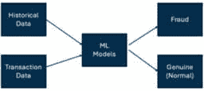

图 6.1 – 金融银行中的简单机器学习模型

ARDHA 银行在**美国**取得了成功之后，做出了战略决策，扩大其业务并在两个额外的国家设立分支机构——法国（针对欧洲）和印度。随着扩张，ARDHA 银行旨在为其两个地区的客户提供相同的服务套件。为了在法国和印度提供数字支付服务，ARDHA 银行考虑的一个选项是将两个国家的定期交易数据传输到其美国服务器。然后，美国服务器将作为运行机器学习模型的中央位置。在结合所有地区的综合数据上训练机器学习模型后，训练好的模型将被部署到法国和印度的区域服务器上。通过采用这种方法，ARDHA 银行旨在利用其美国服务器的基础设施来高效地处理和分析交易数据。集中训练机器学习模型允许采取统一的方法进行欺诈检测和预防，确保在不同地区的一致性和准确性。这一策略使 ARDHA 银行能够在欧洲和印度提供可靠有效的数字支付服务，同时保持数据安全和隐私。通过利用区域服务器并在本地部署训练好的机器学习模型，银行确保了快速和本地化的决策制定，满足每个地区的特定需求和监管要求。

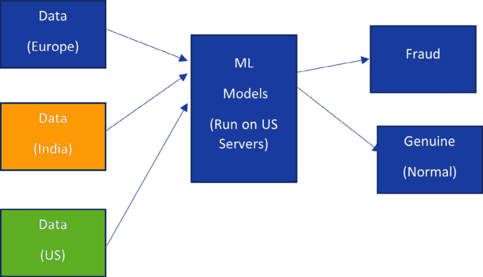

图 6.2 – 在三个地点的金融银行中的简单机器学习模型

所提出的解决方案，涉及将数据传输到中央服务器并在该数据上运行机器学习模型，由于欧洲和印度的隐私法规和数据本地化法律而面临挑战。这些法规，如欧洲的**通用数据保护条例**（**GDPR**）和印度的数据本地化要求，规定在这些国家生成的数据必须存储在本地的数据中心。数据必须保持在创建它的国家境内。

考虑到这些隐私和本地化限制，需要一种替代方法。一个可能的替代方案是在银行的每个分支或地点本地运行机器学习（ML）模型。这种方法包括部署利用每个地点可用的本地数据的客户端模型。本地模型将在各自国家的边界内处理数据，确保符合隐私法规。为了实施这种替代方案，只有模型权重和参数，而不是客户使用的交易数据，会与中央服务器共享。任何国家的中央服务器将负责运行一个全局模型，使用来自每个位置的聚合模型权重和参数。然后，生成的全局模型可以定期分发给每个国家的本地客户端。这种方法使银行能够利用机器学习模型的好处，同时遵守隐私法规和数据本地化法律。通过在本地进行机器学习计算并仅共享模型相关信息，银行确保了合规性、数据安全和隐私。此外，这种分布式方法允许进行本地适应和定制，同时仍然受益于全局模型获得的见解。

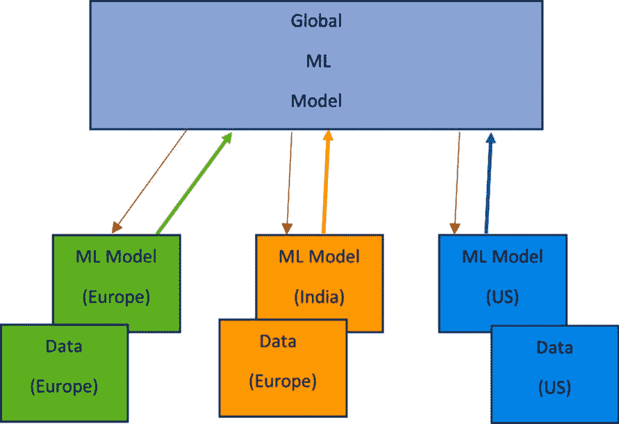

图 6.3 – 本地模型与全局模型的交互

这种方法被称为**联邦机器学习**，或 FL。在 FL 中，将数据移动到中央位置的传统范式被颠倒。相反，模型和计算被带到数据那里。

在联邦学习中，机器学习（ML）模型直接部署并在数据所在的本地区域或设备上执行。这消除了将原始数据传输到中央服务器的需求，解决了隐私问题和监管要求。模型使用每个设备上的数据进行本地训练，并且只有模型更新，如梯度或权重，才会安全地传输到中央聚合器。

通过保持数据去中心化和本地执行计算，联邦学习（FL）确保了数据隐私并减少了与数据传输相关的风险。它允许组织利用分布式数据源的知识和洞察力，同时不损害个人数据隐私。这种方法在数据因法律、监管或隐私限制而难以共享的场景中尤其有益。

联邦学习代表了机器学习（ML）的一个范式转变，它实现了协作和隐私保护模型训练。它促进了一种分布式方法，其中数据保持在数据所有者的控制之下，同时为共享模型做出贡献。这种去中心化和注重隐私的框架为利用大规模数据的力量打开了可能性，同时不牺牲隐私和安全。

## FL 定义

以下是根据在 arxiv/1912.04977 发表的 *Federated Learning 的进展和开放问题* 论文提出的 FL 的正式定义：

“联邦学习是一种机器学习设置，其中多个实体（客户端）在中央服务器或服务提供商的协调下协作解决机器学习问题。每个客户端的原始数据都存储在本地，不进行交换或传输；相反，用于立即聚合的聚焦更新用于实现学习目标”

根据这个定义，以下是 FL 的特点：

+   多个客户端（实体）协作解决机器学习问题。

+   服务提供商或中央服务器与这些实体协调。

+   原始数据（带有样本的数据）存储在每个客户端位置，并且不会传输到服务器。

+   定义了学习目标（或损失函数）。为了最小化损失（预测与实际之间的差异），客户端将聚焦更新（权重和偏差）发送到服务器，在服务器上进行权重的聚合（平均或动态聚合），然后将这些更新发送回客户端。

让我们进一步详细探讨每一个，以更好地理解它们。

## FL 的特点

以下小节将深入探讨 FL 的特点。

### 多个客户端（实体）协作解决机器学习问题

在 FL 中，参与要求通常涉及至少两个客户端，而客户端的最大数量可以根据特定的用例和客户端类型而变化。

参与 FL 的客户端可以大致分为两类 – 跨设备和跨数据存储库：

+   **跨设备**客户端是个人设备，如智能手机、笔记本电脑或物联网设备，它们为模型训练贡献本地数据。这些设备在 FL 框架中作为客户端，允许其数据被利用同时保护隐私。

+   **跨数据存储库**客户端，另一方面，代表分布在不同的组织数据存储库或实体中的数据源。这些数据存储库可以是组织内部的不同部门，独立的机构，甚至是不同的地理区域。每个数据存储库作为客户端，为其协作模型训练贡献本地数据。

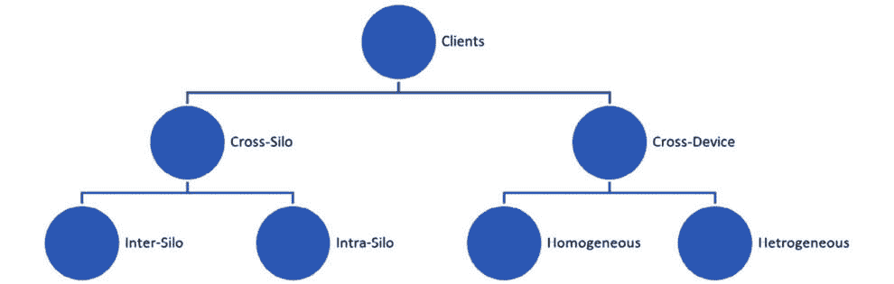

图 6.4 – FL 客户端的分类

FL 设置中客户端的最大数量取决于特定的用例和分布式数据源的规模。例如，在多个组织协作构建全球模型同时保持数据隐私的场景中，参与客户端的数量可能很大。另一方面，在更专注或本地化的用例中，客户端的数量可能限制在一个较小的群体。

#### 跨数据存储库 FL 客户端

跨部门客户端包括金融机构、机构、医院和制药公司等实体。这些客户端可以进一步分为两组：

+   **同一机构内的不同客户端**：这包括同一银行的分支机构、医院网络内的不同分支机构，以及类似设置，其中多个分支机构或一个机构的多个部门参与联邦学习。

+   **不同机构间的不同客户端**：这涉及不同组织，如不同银行或医院，进行合作并向联邦学习过程贡献数据。这些客户端代表机构间的合作。

跨部门类别中的最大客户端数量可以根据具体用例而变化，但通常在数十到数百之间。由于合作性质和参与机构的规模，参与客户端的数量通常受到限制。

#### 跨设备联邦学习客户端

相反，跨设备客户端包括作为联邦学习中的客户端或节点的各种设备。这些设备可以是同质或异质的，例如苹果 iPhone、谷歌手机和 Brave 浏览器等设备。

在跨设备联邦学习客户端的情况下，每个设备都根据该特定设备上可用的本地数据运行自己的机器学习模型。仅根据设备条件和其他配置设置将模型权重和偏差传输到服务器。

在这种情况下，客户端的最大数量可以达到数千甚至数百万，因为它涵盖了不同地点和用户基础中参与联邦学习的广泛设备。

通过同时容纳跨部门和跨设备客户端，联邦学习实现了协作和知识共享，同时尊重数据隐私并确保机构间和设备间的可扩展参与。

### 服务提供商或中央服务器与这些实体进行协调

在联邦学习中，服务器根据参与客户端的网络拓扑和参与过程的总客户端数量做出决策。服务器确定何时向客户端分发初始模型或更新模型，考虑因素包括网络结构和具体参与客户端的数量。它根据学习任务的要求，决定是否向所有客户端或仅向其中一部分发送模型更新。

客户端接收到模型后，根据其本地数据计算并更新权重和偏差。然后，客户端将这些更新的权重和偏差发送回服务器。服务器汇总接收到的数据，并使用目标函数进行计算，以最小化损失或优化学习目标。

根据汇总信息，服务器生成一个更新的模型。它决定哪些客户端需要更新为新模型，哪些客户端可以继续运行现有模型而不做任何更改。这个决定基于学习进度、更新的需要或客户端与更新模型的兼容性等因素。

通过精心安排这些步骤，服务器管理模型的分布，收集客户端更新，汇总数据，并最终将更新的模型发送回适当的客户端。在联邦学习（FL）中，这个迭代过程确保了协作模型改进，同时考虑到参与客户端的个别需求和能力。

### 原始数据（带有样本的数据）在每个客户端位置本地存储，并且不会传输到服务器。

在 FL 中，原始数据在每个客户端位置本地存储，而不是集中存储在单个服务器上。这种去中心化的方法确保数据始终处于各自客户端的控制和所有权之下，保护隐私并符合数据法规。

每个客户端位置的数据都表现出特定的分布，这种分布可能在不同客户端之间有所不同。数据的分布指的是数据集中存在的统计特性和模式。客户端数据集中的数据样本可能相互独立，这意味着它们之间没有关系或它们的价值或属性不依赖于彼此。或者，数据样本可能是相关的，表明它们之间存在某种形式的关联或关系。

此外，数据分布可以在客户端之间是相同的或不同的。相同的数据分布意味着不同客户端的数据集的统计特性是相同的。另一方面，不同的数据分布表明数据集在统计特性上存在差异，例如均值、方差或其他相关参数。

独立或相关、相同或不同的数据分布的存在，在 FL 中引入了挑战和复杂性。尽管如此，FL 方法被设计来处理这些变化，并使跨去中心化数据源进行协作模型训练成为可能，同时利用集体知识，尊重数据隐私和分布特性。

#### 具有独立同分布（IID）和非独立同分布（non-IID）数据的集合

独立同分布（IID）数据指的是数据样本之间相互独立，且所有样本的数据分布相同的数据集。在这种情况下，每个数据样本的结果不依赖于先前样本，数据的统计特性保持一致。

例如，考虑一个数据集，其中抛掷硬币五次并记录出现正面的次数。在这种情况下，每次抛掷硬币都是独立的，每次抛掷出现正面的概率是相同的。这导致了一个 IID 数据集，其中每次抛掷硬币的结果分布是相同的。

在 FL 中，不同客户端之间的数据可能表现出**非-IID**特征。这意味着数据样本不是同质分布的，它们也可能相互依赖。各种因素可能导致非-IID 数据，例如标签数据的数量变化、样本中存在的特征差异、数据漂移、概念漂移或不平衡数据。

例如，在公司内部的跨部门实体中，每个客户端可能具有相同的特征和标签用于分类。然而，每个位置的数据样本数量可能不同，导致数据不平衡。此外，每个位置可能没有所有类别的数据，或者表现出不同的实例分布。

#### FL 中跨部门实体的原始数据

在处理 FL 中的跨部门实体时，原始数据表现出某些特征。具体来说，在内部公司场景中，可以观察到以下情况：

+   跨部门实体中的每个客户端都将拥有相同类型的特征。这意味着可用于分析的数据属性或变量的类型将在所有客户端中保持一致。

+   用于分类任务的标签或类别在客户端之间也将是相同的。这确保了参与实体中的分类目标类别或结果的一致性。

+   每个客户端位置的数据样本数量可能不同。这意味着可用的数据量可能在不同的位置或同一公司内的不同分支之间有所不同。一些客户端可能有更广泛的数据集，而其他客户端可能有较少的样本。

+   并非所有类别或类别可能在每个客户端的数据中都有表示。这导致数据不平衡，某些类别可能相对于其他类别被过度或不足表示。这种不平衡可能会对模型训练和评估造成挑战。

+   实例的分布可能不会在所有客户端中相同。这意味着统计特征，如均值、方差或其他属性，可能在不同的客户端位置之间有所不同。每个客户端的数据可能表现出独特的分布模式，这些模式需要在 FL 过程中予以考虑。

考虑到这些特征，FL 技术必须解决数据样本的变异性、类别分布的不平衡以及跨部门实体间的数据分布差异。

在我们讨论的银行示例的背景下，由于它是同一银行在不同国家运营，因此特征（如客户 ID、金额、交易日期、源账户、目标账户和地址）和标签（*欺诈*或*非欺诈*）将是相同的。然而，数据样本和标签的分布可能因每个位置的客户数量和交易类型等因素而异。这给数据引入了非独立同分布（non-IID）的特性，需要在联邦学习方法中谨慎处理。

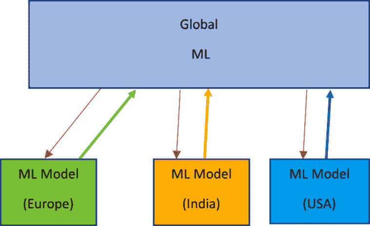

图 6.5 – 三地金融银行中的机器学习模型

数据以以下方式分配给每个客户端。标签数据存在偏斜，但每个位置/客户端/实体中均存在具有所有特征的样本。

| 不同客户端的数据 | 特征 X={ X1, X2, X3, …Xn} | 标签 y = { y1, y2…, ym} |
| --- | --- | --- |
| X1 | X2 | X3 | X4 | 欺诈数据标签计数 |
| 欧洲（客户端 1） | 是 | 是 | 是 | 是 | 欺诈计数 = N，非欺诈 = 0 |
| 美国（客户端 2） | 是 | 是 | 是 | 是 | 欺诈计数 = 0，非欺诈 = N |
| 印度（客户端 3） | 是 | 是 | 是 | 是 | 欺诈计数 = N/2，非欺诈 = N/4 |

表 6.1 – 标签数据偏斜

在机构内部的情况下，即同一行业内不同机构参与联邦学习（FL）以提供类似的机器学习（ML）服务时，数据可能表现出以下特征：

+   每个客户端，代表不同的机构，可能具有或不具有相同类型的特征。这意味着根据它们的具体背景或数据收集实践，不同机构之间可用的数据属性或变量可能不同。

+   每个客户端位置的数据样本数量可能不同。这表明不同机构可用于分析的数据量可能不同。一些机构可能拥有更大的数据集，而其他机构可能拥有相对较小的数据集。

+   并非所有类别或类别都可能在每个客户端的数据中存在。这可能导致数据不平衡，某些类别可能在某些机构的数据集中代表性不足或完全缺失。在联邦学习过程中处理不平衡数据是一个重要的考虑因素。

+   参与机构之间的示例分布也可能不同。每个机构的数据可能具有其独特的分布模式，包括均值、方差或其他统计特性的变化。这些差异需要在协作模型训练过程中予以考虑。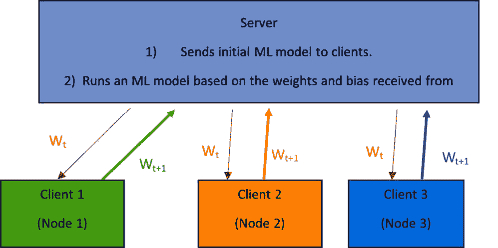

图 6.6 – FL 客户端和服务器通信（发送和接收）模型参数

数据以以下方式分配给每个客户端。在此场景中，特征和标签数据存在偏斜。

| 不同客户端的数据 | 特征 X={ X1, X2, X3, …Xn} | 标签 y = { y1, y2…, yn} |
| --- | --- | --- |
| X1 | X2 | X3 | X4 | 欺诈数据标签计数 |
| --- | --- | --- | --- | --- |
| 客户端 1 | 是 |  | 是 |  | 否（非欺诈）= 70% |
| 客户端 2 |  | 是 |  | 是 | 是（欺诈）= 100% |
| 客户端 3 | 是 | 是 | 是 | 是 | 是（欺诈）= 50%，否（非欺诈）=50% |

表 6.2 – 不同客户端的特征和标签数据偏斜

### 学习目标

在 FL 中，中央服务器承担执行学习目标和最小化损失函数的责任。它通过利用从参与客户端接收到的模型权重（*Wt*）和偏差来实现这一点。服务器确定需要从客户端获取的数据轮数以及需要参与的特定客户端。

让我们考虑一个例子，其中涉及三个参与 FL 过程的客户端。每个客户端将其各自的模型权重和偏差发送到中央服务器。然后，服务器执行以下目标或学习函数以最小化损失：

*minimize loss (**Wt, biases)*

服务器的目标是优化由权重（*Wt*）和偏差表示的模型参数，以最小化损失函数。通过利用从参与客户端接收到的权重和偏差，服务器执行迭代更新以细化模型并提高其性能。

学习目标和损失函数的具体细节取决于特定的 ML 算法和手头的任务。中央服务器协调客户端更新的聚合，管理训练过程，并将更新的模型发送回客户端。这种协作方法使客户端能够集体贡献其本地知识，同时从服务器提供的改进的全球模型中受益。

这就是目标函数：

Min f(w) = ∑ i=1 n   £i * Fi(w)

这里，*w* 是模型参数（权重等），*f(w)* 是目标函数，*n* 是参与 FL 的客户端数量。

在下一节中，将使用一些数学术语，包括以下内容。

+   *Wt*: 在通信轮次 *t* 中的模型权重（客户端到服务器）

+   *Wt k*: 在客户端 *k* 的通信轮次中的模型权重

+   *C*: 每轮更新模型和计算权重的参与客户端数量

+   *B*: 本地客户端数据样本的批量大小

+   *Pk*: 客户端 *k* 的数据样本集

+   *nk*: 客户端 *k* 的数据点数量

+   *fi (w)*: *loss L ( xi, yi, w)* – 损失函数

在服务器端，可以根据 FL 过程的特定需求和目标实现各种目标函数。

# FL 算法

FL 算法，如 FedSGD、FedAvg 和自适应联邦优化，在确保隐私和安全的同时，在机器学习模型的分布式训练中发挥着关键作用。在本节中，我们将探讨这些算法及其关键特性。

## FedSGD

**联邦随机梯度下降**（**FedSGD**）是 FL 中使用的根本算法。它将传统的 SGD 优化方法扩展到联邦设置。在 FedSGD 中，每个客户端（实体）在其本地数据上计算梯度，并将它们发送到中央服务器。服务器聚合梯度并相应地更新全局模型参数。FedSGD 适用于大规模分布式训练，但可能受到与非-IID 数据和通信效率相关的问题的影响。

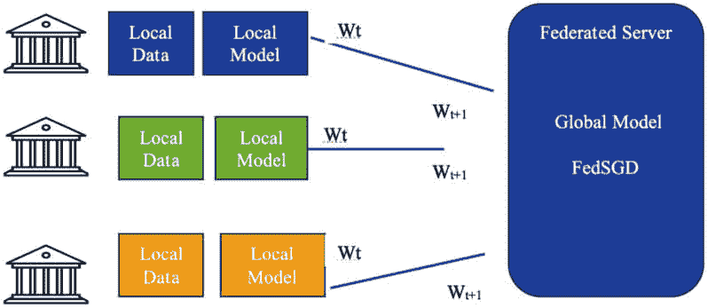

图 6.7 – FedSGD 模型权重与服务器交换

让我们看看 FedSGD 算法：

| **服务器端算法** | **客户端算法** |
| --- | --- |

| 初始化每个轮次 t = 1,2, …m = max (C, K, 1)st = 随机选择的 m 个客户端 for 客户端 k 在 st 中，wt+1 = 客户端函数(k, wt)wt+1 = 权重的平均值 | 客户端函数(k, w):

+   将数据分成*k*个批次，每个批次基于批次大小*B*（完整本地数据集）

+   对于每个批次：

+   fi (w) = 损失 L (xi, yi, w)

+   w = w – 学习率 * 损失

|

表 6.3 - FedSGD 算法

在客户端，每个参与客户端执行以下步骤：

1.  **数据分区**：客户端拥有自己的本地数据集，并将它们分成更小的子集以确保隐私。

1.  **本地模型训练**：每个客户端独立使用其本地数据训练共享模型。这涉及到使用 SGD 或其变体在本地数据集上计算模型参数（权重和偏差）的梯度。

1.  **模型更新**：在本地模型训练后，客户端将计算的梯度发送到服务器进行聚合。

在服务器端，中央服务器执行以下步骤：

1.  **聚合**：服务器从所有参与客户端接收梯度，并使用各种聚合技术（如平均或加权平均）进行聚合。

1.  **模型更新**：聚合的梯度用于更新全局模型参数。服务器将接收到的梯度应用于全局模型，调整其权重和偏差以反映所有客户端的集体知识。

1.  **模型分发**：然后，更新后的全局模型被发送回客户端进行下一轮训练，确保每个客户端都能从集体知识中受益，同时保护数据隐私。

FedSGD 旨在通过仅交换模型梯度而不是原始数据来最小化客户端和服务器之间的通信开销。这允许在保持数据隐私和安全的同时进行分布式模型训练。然而，解决诸如数据异质性和非-IID 数据分布等挑战非常重要，这些挑战可能会影响 FL 过程的收敛性和性能。

总体而言，FedSGD 以去中心化的方式实现了协作模型训练，利用了多个客户端的计算资源，同时保护了数据隐私。它是联邦学习的基础算法，为更高级的技术的开发铺平了道路，以改进分布式机器学习的效率和效果。

## FedAvg

**联邦平均**（**FedAvg**）是一种广泛采用的联邦学习算法，旨在解决非独立同分布数据和非高效通信的挑战。在 FedAvg 中，类似于 FedSGD，每个客户端在其本地数据上计算梯度。然而，FedAvg 不是直接使用单个梯度更新全局模型，而是采用加权平均来组合客户端模型的参数。这种方法可以更好地处理数据异构性，并减少客户端与服务器之间的通信开销。

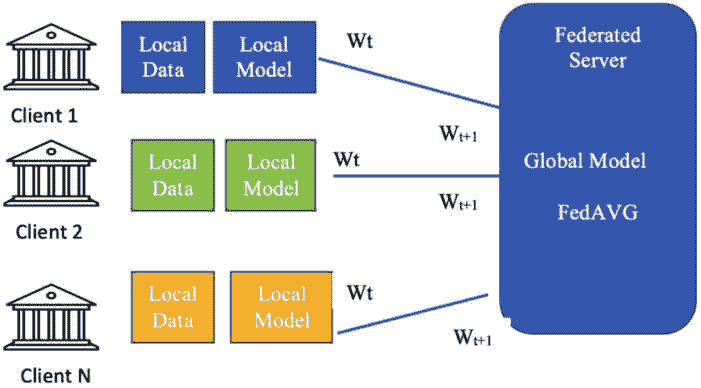

图 6.8 – FedAvg 模型与服务器之间的权重交换

让我们看看 FedAvg 算法：

| **服务器端算法** | **客户端算法** |
| --- | --- |

| 初始化每轮 t = 1,2, …m = max (C, K, 1)的权重(w0)st = 随机选择 m 个客户端 for 客户端 k 在 st 中，wt+1 = 客户端函数(k, wt)wt+1 = 梯度的平均值 | 客户端函数(k, w):

+   将数据分成*k*个批次，每个批次基于批次大小*B*

+   对于训练中的每个 epoch E

+   对于每个批次：

    +   fi (w) = 损失 L (xi, yi, w)

    +   w = w – 学习率 * 损失

|

表 6.4 – FedAVG 算法

FedAvg 利用平均的概念来组合不同客户端的本地训练模型，这有助于减轻数据异构性和非独立同分布数据分布的影响。通过平均模型参数，FedAvg 有效地创建了一个全局模型，该模型捕捉了所有参与客户端的见解，同时保护了个人数据的隐私。FedAvg 的迭代性质允许共享模型在每一轮训练中逐步改进。随着过程的继续，全局模型变得更加精细，代表了所有客户端的集体知识。

总体而言，FedAvg 以保护隐私的方式实现了共享模型的协作训练。它解决了与数据隐私和分布相关的挑战，允许多个客户端在不共享原始数据的情况下为模型改进做出贡献。FedAvg 在联邦学习的领域中发挥了重要作用，使得在各个领域中的应用成为可能，同时保持了数据隐私和安全。

## Fed Adaptative Optimization

在跨设备联邦学习中，众多客户端与一个中央服务器通信，每个客户端拥有独特的数据集。

例如，在手机上的下一个单词预测的背景下，不同用户的手机根据国家、地区和语言等因素包含不同的单词集。然而，当面对来自不同客户端的异构数据时，传统的 FL 算法如 FedSGD 和 FedAvg 可能无法表现最佳。挑战源于客户端之间数据分布和特性的固有差异。异构数据引入的复杂性可能会影响 FL 算法的收敛性和性能。因此，与客户端具有同质数据的情况相比，处理异构数据构成了相当大的障碍。

正在努力解决跨设备联邦学习（FL）中与异构数据相关联的挑战。

为了克服这一点，谷歌的研究人员（Sashank J. Reddi 等人，2021 年）在 arxiv.org/abs/2003.00295 发表的论文中提出了新的自适应优化方法。

这里是详细的算法（图片来源于前面的 URL）：

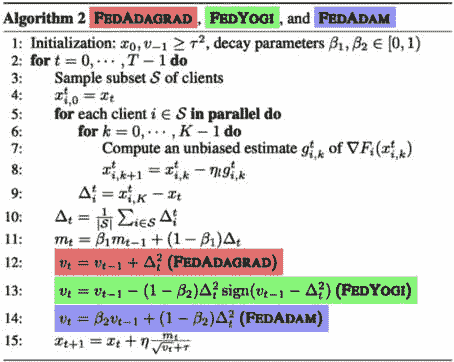

图 6.9 – 谷歌研究人员提出的 Fed Adaptive Optimization 算法

请参阅文章以获取自适应优化算法的详细解释。简而言之，这个想法是优化通信成本，类似于 FEDAVG，并在跨设备环境中工作。

# 实施联邦学习所涉及的步骤

以下通常是实现联邦学习（FL）所遵循的五个步骤。这些步骤可能有替代方案/变化，但最初，这些是需要遵循的步骤：

**服务器端 – 全局模型的初始化**：在这个步骤中，服务器启动并接受客户端请求。在实际启动服务器之前，服务器端的模型将使用模型参数进行初始化。通常，模型参数将初始化为零或从之前的检查点模型中获取。

**服务器将模型参数发送到所有或部分客户端**：在这个步骤中，服务器将初始模型参数发送到所有客户端（对于跨沙盒 FL 客户端，它们将位于同一机构内，可能只有几十个）或部分客户端（在跨设备 FL 的情况下，设备数以百万计，服务器决定只从总数中选择一部分）。每个客户端将使用这些初始模型参数进行模型的本地训练。

**客户端训练模型并将模型权重/参数发送回服务器**：在这个步骤中，每个客户端将使用其本地数据训练模型，一次性使用全部本地数据，将数据分成几个批次，或者随机分割数据并利用不同轮次（客户端和服务器之间多次交换模型参数）的不同分割。客户端只会将模型参数或权重发送到服务器。

**服务器执行一个 FL 算法，更新全局模型，并将更新的权重发送给客户端进行下一轮**：在这一步中，服务器将运行一个 FL 算法，并利用从客户端接收到的权重来更新全局模型。在 FedAvg 的情况下，它将计算从客户端接收到的权重的加权平均值，并将更新的权重发送回客户端进行下一轮。

**根据配置的轮数重复步骤 2 到 4**：对于每一轮重复步骤 2 到 4。如果配置了五轮，那么重复步骤 2 到 4 五次，在最后一轮之后，客户端将利用从服务器接收到的权重来使用最终的机器学习模型。客户端可以在最后一轮结束时或每一轮中使用这些模型权重，并使用测试数据评估模型的准确性。

以下序列图详细展示了这些步骤：

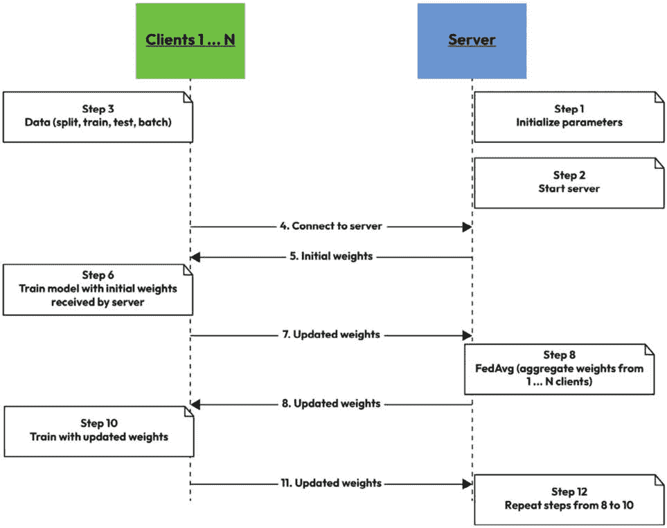

图 6.10 – FL 序列图中的步骤

序列图显示了参与联邦学习（FL）的服务器和客户端之间的详细交互，按照本节所述执行四个高级步骤。

# 实现 FL 的开源框架

有几个开源框架可以用于大规模实现 FL。以下是一些最受欢迎的。

**PySyft**（[`github.com/OpenMined/PySyft`](https://github.com/OpenMined/PySyft)），由 OpenMined 开发，是一个开源栈，它提供了在 Python 中安全且私有的数据科学能力。它引入了私有数据和模型训练之间的分离，使得 FL、差分隐私和加密计算等功能成为可能。最初，PySyft 利用 Opacus 框架来支持差分隐私，如差分隐私章节所述。然而，PySyft 的最新版本集成了自己的差分隐私组件，以提供在执行数据分析任务时保护隐私的同时增强功能和效率。

## TensorFlow Federated

**TensorFlow Federated**（**TFF**）是由谷歌开发的一个库，它通过使用客户端的本地数据来简化跨多个客户端训练共享机器学习模型的过程（[`www.tensorflow.org/federated`](https://www.tensorflow.org/federated)）。TFF 由两层组成——联邦核心 API 和联邦学习 API。

联邦核心 API 提供了低级接口，用于数据序列化、服务器和客户端之间的分布式通信以及 FL 算法的实现。它提供了构建 FL 系统所需的基础组件。

相反，联邦学习 API 提供了一个高级接口，使用户能够轻松构建联邦学习模型或将现有模型包装为联邦学习模型。它提供了一套 API，用于使用联邦计算和数据集进行模型训练和评估。这个高级接口抽象了一些构建和训练联邦学习模型所涉及到的复杂性，使得它对开发者来说更加易于访问和方便。

通过提供这两层，TFF 使研究人员和开发者能够在其项目中利用联邦学习的力量。它简化了在去中心化数据上构建和训练模型的过程，同时确保隐私和数据安全。

## Flower

**Flower** ([`flower.dev/`](https://flower.dev/)) 是一个开源框架，旨在提供用户友好的体验。它支持使用各种框架开发的机器学习和深度学习模型，例如 scikit-learn、TensorFlow、PyTorch、PyTorch Lightning、MXNet 和 JAX。Flower 使得将这些模型转换为联邦学习模型变得容易。

Flower 的一个关键特性是其通信实现，它建立在双向 gRPC 流之上。这允许客户端和服务器之间高效且无缝地交换多个消息，而无需为每个消息请求建立新的连接。

Flower 提供了一系列策略，并在服务器端实现了几个联邦学习算法。这些算法包括 FedAvg、FedSGD、容错 FedAvg、FedProxy 和 FedOptim（包括 FedAdagrad、FedYogi 和 FedAdam）。这些算法在联邦学习场景中提供了不同的模型聚合和训练方法。

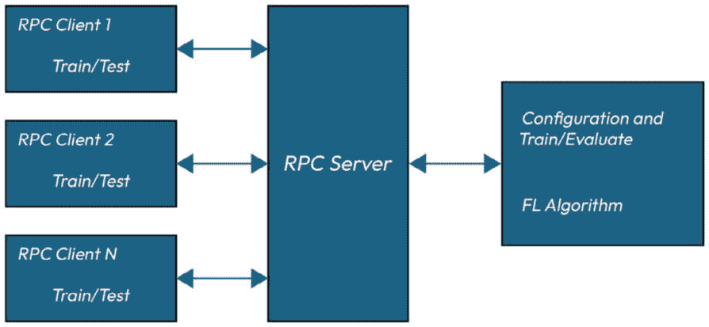

图 6.11 – Flower 框架架构图（简化）

为了验证其性能，Flower 已经进行了广泛的基准测试。该框架已经证明了仅使用两个 GPU 服务器就能扩展到 1500 万客户端的能力。这些实验与另一个联邦学习引擎和基准测试套件 FedScale 进行了比较，以评估 Flower 在大型联邦学习环境中的性能和效率。

# 使用联邦学习实现欺诈检测的端到端用例

欺诈检测对许多行业，包括金融、电子商务和医疗保健，都是一个关键任务。传统的欺诈检测方法通常依赖于集中式数据收集，其中敏感的客户信息在单一地点收集和分析。然而，这种方法引发了关于数据隐私和安全以及遵守 GDPR 等法规的担忧。

FL 为解决这些挑战提供了一个有希望的解决方案。通过利用分布式计算和协作学习的力量，FL 使得欺诈检测模型可以直接在单个机构的设备或本地服务器上训练，无需共享数据。这种去中心化的方法确保敏感客户数据保持私密和安全，因为它从未离开本地环境。

使用联邦学习（FL）实现欺诈检测涉及几个关键步骤。首先，由银行或电子商务平台等机构或组织组成的联盟需要建立一个 FL 框架，使他们能够在保护数据隐私的同时协作进行模型训练。这可能涉及采用 FL 库或平台，如 TFF 或 Flower。

接下来，参与机构定义一个共同的欺诈检测目标并开发共享的模型架构。然后，每个机构使用自己的私有数据训练其本地模型，这些数据可能包括交易记录、用户行为模式和其他相关特征。模型在本地进行训练，确保敏感数据始终处于相应机构的控制之下。

为了促进协作学习，机构定期将模型更新与中央服务器共享。这些更新通常包括模型权重和参数，通过联邦平均或其他聚合技术进行汇总，以创建一个全局模型，该模型能够捕捉到所有参与者的洞察，同时保护个人数据的隐私。

负责监督聚合过程的中央服务器确保全局模型基于参与机构的集体知识进行优化。这个过程允许模型从各种欺诈模式中学习，并适应不断发展的欺诈活动，同时保持数据隐私并符合法规。

使用 FL 实现欺诈检测提供了几个优势。它允许机构利用更大、更多样化的数据集，从而提高欺诈检测的准确性。它还降低了数据泄露或未经授权访问的风险，因为敏感数据始终处于相应机构的控制之下。此外，FL 可以实现实时更新和更快的模型部署，使机构能够迅速应对新出现的欺诈模式。

使用 FL 实现欺诈检测为各种行业中的欺诈提供了隐私保护和协作的方法。通过结合分布式计算和共享学习的力量，组织可以增强欺诈检测能力，同时保护敏感客户数据。

让我们使用 Flower 框架和开源数据集来实现这个用例。

## 使用 Flower 框架开发用于欺诈检测的 FL 模型

在本例中，我们将利用 Flower 框架开发用于欺诈检测的 FL 模型。实现将涉及服务器端和客户端组件。为了说明这个过程，我们将设置一个服务器和两个客户端。

服务器和客户端之间的通信将在多个轮次中进行，涉及权重和参数的交换。具体的轮次数量可能因具体场景而异，但通常，通信会持续到权重收敛或达到预定的收敛标准。

在服务器端，我们将实现 FedAvg 算法来聚合从客户端接收到的权重。FedAvg 是 FL 中广泛使用的算法，它结合了多个客户端的知识来创建一个全局模型。

对于欺诈检测任务，我们将使用 scikit-learn 库开发一个实际的线性回归模型。此模型将使用每个客户端可用的数据进行训练，这些数据包括交易记录和相关特征。目标是分类交易是否为欺诈。

客户端实现将涉及使用各自客户端的数据训练本地线性回归模型。然后，客户端将与服务器通信，在预定义的轮次中交换他们的模型权重和参数。这种协作学习过程允许客户端将其本地见解贡献给全局模型，同时保护其数据的隐私。

服务器将从客户端接收模型更新，并使用 FedAvg 算法执行聚合步骤。此聚合过程确保全局模型结合了所有参与客户端学习到的知识，从而增强了欺诈检测能力。

在整个实现过程中，Flower 框架为服务器和客户端之间的通信提供了必要的基础设施。它抽象了分布式计算的底层复杂性，并处理模型更新的同步。通过开发用于欺诈检测的 FL 模型，我们可以利用多个客户端的分布式知识和数据来提高欺诈分类的准确性。联邦方法还通过将敏感的交易数据保留在每个客户端本地来解决隐私问题。

总结来说，这个项目展示了使用 Flower 框架实现 FL 模型的过程。服务器和客户端协作训练一个用于欺诈检测的全局模型，在多个通信轮次中交换模型权重和参数。通过使用 FedAvg 聚合客户端模型，我们可以利用多个参与者的集体智慧，同时确保数据隐私。

### 本例中使用的数据集

*Lopez, Elmir, 和 Axelsson* 开发了一个用于欺诈检测的移动货币数据集，并在 Kaggle 上也有展示（E. A. Lopez-Rojas, A. Elmir, 和 S. Axelsson, *PaySim: A financial mobile money simulator for fraud detection*, 第 28 届欧洲建模与仿真研讨会-EMSS，拉纳卡，塞浦路斯。2016）。

我们将利用此数据集通过 FL 进行欺诈检测，但也可以通过修改模型以适应反洗钱用例，数据集可在[`github.com/EdgarLopezPhD/PaySim`](https://github.com/EdgarLopezPhD/PaySim)找到。

下载此数据集，并将文件保存在*第六章*目录中，文件名为`PS_20174392719_1491204439457_log.csv`。

此数据集包含 630 万条交易记录，具有以下特征：

| **字段** | **数据类型** | **详细信息** |
| --- | --- | --- |
| `Step` | 数值 | 现实世界中的时间单位。一步是 1 小时。 |
| `Type` | 对象 | `CASH-IN`，`CASH-OUT`，`DEBIT`，`PAYMENT`和`TRANSFER`。 |
| `Amount` | 数值 | 交易金额。 |
| `nameOrig` | 对象 | 开始交易的客户。 |
| `nameDest` | 对象 | 交易的接收者 ID。 |
| `oldbalanceOrg` | 数值 | 交易前的初始余额。 |
| `newbalanceOrig` | 数值 | 交易后客户的余额。 |
| `oldbalanceDest` | 数值 | 交易前初始接收者的余额。 |
| `newbalanceDest` | 数值 | 交易后接收者的余额。 |
| `isFraud` | 布尔值 | 识别欺诈（`1`）和非欺诈（`0`）交易。 |
| `isFlaggedFraud` | 布尔值 | 标记非法尝试在单笔交易中转账超过 20 万金额。 |

表 6.5 – 数据集特征

### Flower 的安装

使用`python -m pip install` `flwr`命令安装 Flower。

### 服务器的实现

欺诈检测的 FL 模型的服务器端实现涉及几个高级步骤。我们将利用 Flower 框架提供的示例代码，并将其扩展以适应我们的特定用例。

以下步骤概述了该过程：

1.  **初始化模型参数**：

    1.  将初始模型权重设置为**0**，并将截距初始化为**0**（因为我们正在使用回归模型）。

    1.  确定分类的类别或标签数量。

    1.  确定模型中使用的特征数量。

    1.  确定参与客户端的数量。

1.  **定义支持函数**：开发额外的函数以从客户端加载数据，定义损失函数，并评估模型的性能。这些函数将有助于数据处理，计算训练过程中的损失，并评估模型的准确性。

1.  **选择服务器端策略**：选择 FedAvg 算法作为从客户端接收权重的聚合策略。FedAvg 是结合多个客户端的模型更新并生成更新全局模型的一个流行选择。

1.  **启动** **服务器**：

    1.  启动服务器端组件，该组件将协调 FL 过程。

    1.  服务器将与参与客户端通信，接收他们的模型更新，并使用 FedAvg 算法汇总权重。

    1.  它还将处理客户端之间的模型更新同步，并确保全局模型的收敛。

通过遵循这些步骤，我们可以实现 FL 模型的服务器端功能。模型参数的初始化、支持函数的定义、服务器端策略（FedAvg）的选择以及启动服务器本身对于促进客户端之间的协作训练过程至关重要。通过此实现，服务器将作为中央协调者，接收并汇总来自客户端的模型更新。它在确保模型收敛和生成包含所有参与客户端知识的更新全局模型中发挥着关键作用。

将以下代码保存为`FL_AML_Server.py`：

```py
import pandas as pd
url ="PS_20174392719_1491204439457_log.csv"
df_actual = pd.read_csv(url, sep=",")
df_actual
```

这将产生以下输出：

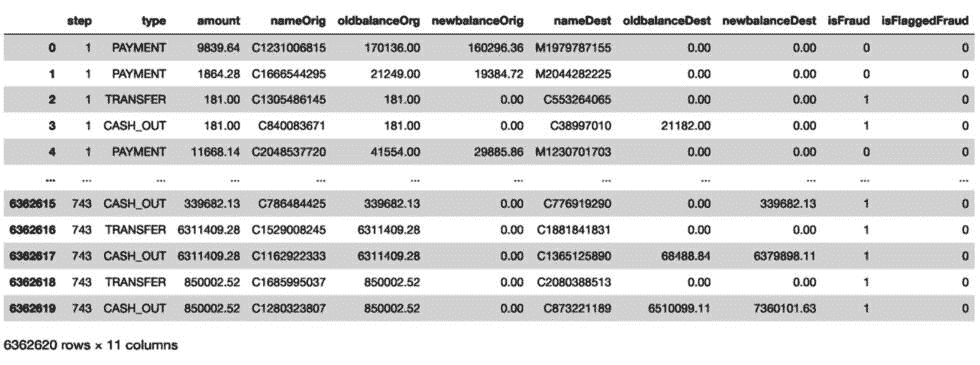

图 6.12 – 少行少列的 dataset 信息

在此示例实现中，我们不会使用全部 600 万条记录，而只会使用前 25,000 条记录：

```py
df_transactions=df_actual.head(25000)
from sklearn.model_selection import train_test_split
from sklearn.model_selection import StratifiedShuffleSplit
print("No of Fraud Transactions:",
df_transactions["isFraud"].value_counts()[0])
print("No of Non Fraud Transactions:",
df_transactions["isFraud"].value_counts()[1])
print('No Frauds',
round(df_transactions['isFraud'].value_counts()[0]/len(df_t
ransactions) * 100,2), '% of the dataset')
print('Frauds',
round(df_transactions['isFraud'].value_counts()[1]/len(df_t
ransactions) * 100,2), '% of the dataset')
```

这将产生以下输出：

```py
No of Fraud Transactions: 24917
No of Non Fraud Transactions: 83
No Frauds 99.67 % of the dataset
Frauds 0.33 % of the dataset
```

让我们找出数据集中每个字段的类型：

```py
df_transactions.dtypes
```

这将产生以下输出：

```py
step                int64
type               object
amount            float64
nameOrig           object
oldbalanceOrg     float64
newbalanceOrig    float64
nameDest           object
oldbalanceDest    float64
newbalanceDest    float64
isFraud             int64
isFlaggedFraud      int64
dtype: object
```

使用`LabelEncoder`将对象数据类型字段编码为标签：

```py
from sklearn.preprocessing import LabelEncoder
encoder = {}
for i in df_transactions.select_dtypes('object').columns:
    encoder[i] = LabelEncoder()
    df_transactions[i] = encoder[i].fit_transform(df_transactions[i])
X = df_transactions.drop('isFraud', axis=1)
y = df_transactions['isFraud'
from typing import Tuple, Union, List
import numpy as np
from sklearn.linear_model import LogisticRegression
XY = Tuple[np.ndarray, np.ndarray]
Dataset = Tuple[XY, XY]
LogRegParams = Union[XY, Tuple[np.ndarray]]
XYList = List[XY]
def get_model_parameters(model: LogisticRegression) -> LogRegParams:
    if model.fit_intercept:
        params = [
            model.coef_,
            model.intercept_,
        ]
    else:
        params = [
            model.coef_,
        ]
    return params
def set_model_params(
    model: LogisticRegression, params: LogRegParams
) -> LogisticRegression:
    model.coef_ = params[0]
    if model.fit_intercept:
        model.intercept_ = params[1]
    return model
def shuffle(X: np.ndarray, y: np.ndarray) -> XY:
    rng = np.random.default_rng()
    idx = rng.permutation(len(X))
    return X[idx], y[idx]
def partition(X: np.ndarray, y: np.ndarray, num_partitions: int) -> XYList:
    return list(
        zip(np.array_split(X, num_partitions), np.array_split(y, num_partitions))
    )
def set_initial_params(model: LogisticRegression):
    n_classes = 2  # Fraud Detection has only  classes
    n_features = 9  # Number of features in dataset
    model.classes_ = np.array([i for i in range(n_classes)])
    model.coef_ = np.zeros((n_classes, n_features))
    if model.fit_intercept:
        model.intercept_ = np.zeros((n_classes,))
import flwr as fl
from sklearn.metrics import log_loss
from sklearn.linear_model import LogisticRegression
from typing import Dict
def fit_round(server_round: int) -> Dict:
    """Send round number to client."""
    return {"server_round": server_round}
def get_evaluate_fn(model: LogisticRegression,X_test,y_test):
# The `evaluate` function will be called after every round
    def evaluate(server_round, parameters: fl.common.NDArrays, config):
        # Update model with the latest parameters
        set_model_params(model, parameters)
        loss = log_loss(y_test, model.predict_proba(X_test))
        accuracy = model.score(X_test, y_test)
        return loss, {"accuracy": accuracy}
    return evaluate
# Start Flower server for five rounds of federated learning
def Server():
    model = LogisticRegression(max_iter=10000)
    set_initial_params(model)
    strategy = fl.server.strategy.FedAvg(
        min_available_clients=2,
        evaluate_fn=get_evaluate_fn(model,X_test,y_test),
        on_fit_config_fn=fit_round,
    )
    fl.server.start_server(
        server_address="0.0.0.0:8080",
        strategy=strategy,
        config=fl.server.ServerConfig(num_rounds=5),
    )
Server()
```

打开终端并运行此程序（`python3 FL_AML_Server.py`）

这将产生以下输出：

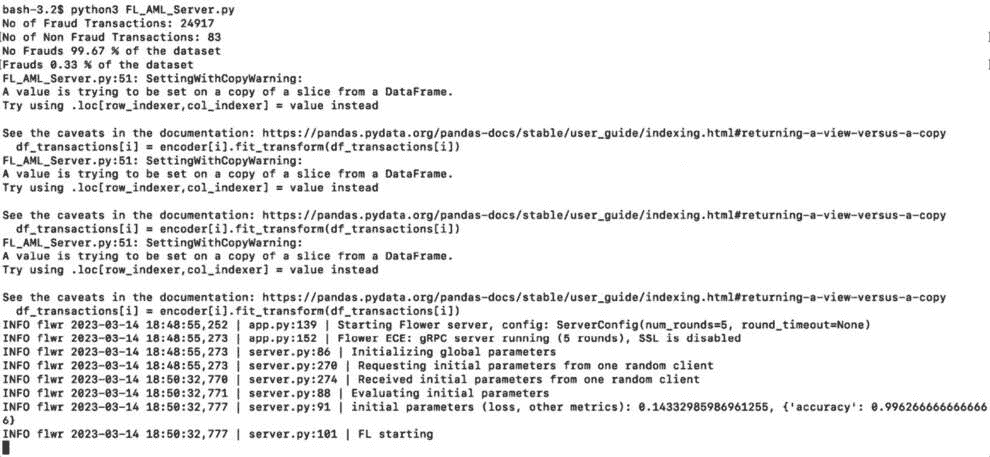

图 6.13 – 服务器启动日志

服务器将运行并等待来自客户端的数据进行处理。

### 客户端的实现

欺诈检测 FL 模型的客户端实现涉及以下步骤。我们将利用 Flower 示例中提供的`NumPyClient`。步骤如下：

1.  **加载** **数据**：

    1.  加载相关数据以训练和测试欺诈检测模型。

    1.  确保数据格式正确且可用于处理。

1.  **分割** **数据**：

    将加载的数据分割成训练集和测试集。这种划分允许你在未见过的数据上评估模型的性能。

1.  **洗牌/分区** **数据**：

    1.  将训练数据洗牌或分区成批次。

    1.  在与服务器通信的每一轮中随机选择一个分区。这确保了在每一轮中使用不同的训练数据子集。

1.  **创建线性** **回归模型**：

    1.  使用所选框架（例如，scikit-learn）开发一个简单的线性回归模型。

    1.  为欺诈检测任务配置模型适当的设置。

1.  **与服务器建立连接**：

    1.  与服务器建立连接以发送和接收模型权重。

    1.  利用提供的通信协议（例如，gRPC）交换信息。

1.  **训练模型**：

    1.  使用从服务器接收的初始权重初始化模型。

    1.  使用客户端的本地数据和服务器在每个轮次更新的权重来训练模型。

    1.  应用适当的优化技术（例如，梯度下降）来更新模型参数。

1.  **测试模型**：

    1.  使用测试数据评估训练模型的性能。

    1.  计算相关指标，如准确率、精确率、召回率或 F1 分数。

    1.  确定模型在检测欺诈交易方面的有效性。

通过遵循这些步骤，我们可以实现 FL 模型的客户端功能。客户端将加载数据并对其进行分区，创建线性回归模型，与服务器建立连接，使用本地数据和更新的权重训练模型，并评估其性能。客户端在贡献本地知识的同时保护数据隐私的作用至关重要。通过在各自本地数据上训练并参与 FL 过程，客户端共同提高全局欺诈检测模型，而不共享敏感信息。

### 创建一个非 IID 数据集

要将数据集转换为非 IID 设置，我们可以采用以下方法：

+   **第一个客户端（**客户端 1**）**：

    +   对欺诈交易应用**合成少数类过采样技术**（**SMOTE**）以增加样本量

    +   这种技术生成少数类（欺诈交易）的合成示例以平衡数据集

    +   因此，客户端 1 将有一个包含 50,000 个样本的训练数据集，其中包括 25,000 个原始交易和 25,000 个使用 SMOTE 创建的合成欺诈示例

    +   欺诈与非欺诈交易的分布将在每个类别中平衡至 50%

+   **第二个客户端（**客户端 2**）**：

    +   不对交易进行任何过采样或修改

    +   客户端 2 将有一个包含最后 25,000 个交易的训练数据集

    +   类别分布将反映原始分布，只有 2%的交易被分类为欺诈

通过采用这种方法，我们在两个客户端之间引入了非相同和不平衡的数据集。客户端 1 将有一个平衡的数据集，欺诈和非欺诈交易的代表性相等，而客户端 2 将有一个与原始分布相似的数据集。

这种非 IID 设置使我们能够模拟现实世界场景，其中不同的客户端可能具有不同的数据分布。通过联邦学习（FL），两个客户端都可以贡献其本地知识，同时在不同的数据集上训练模型，从而最终提高整体欺诈检测模型的性能。

|  | 客户端 1 | 客户端 2 |
| --- | --- | --- |
| 原始交易 | 25,000 | 25,000 |
| 使用 SMOTE 生成的事务 | 25,000 | 0 |
| 总交易数 | 50,000 | 25,000 |
| 欺诈与非欺诈 | 50% 和 50% | 欺诈：2.43%（608）非欺诈：97.57%（24,392） |
| 训练和测试分割 | 70:30 | 70:30 |
| 在每个分区大小相等的情况下，对训练数据进行洗牌后的分区数 | 10 | 10 |

表 6.6 – 客户端侧的非 IID 训练数据分布

这里是客户端 1 的代码。将此代码保存为 `FL_AML_Client1.py`:

```py
import pandas as pd
import torch
url ="PS_20174392719_1491204439457_log.csv"
df_actual = pd.read_csv(url, sep=",")
df_actual
df_transactions=df_actual.head(25000)
from sklearn.model_selection import train_test_split
from sklearn.model_selection import StratifiedShuffleSplit
print("No of Fraud Transactions:", df_transactions["isFraud"].value_counts()[0])
print("No of Non Fraud Transactions:", df_transactions["isFraud"].value_counts()[1])
print('No Frauds', round(df_transactions['isFraud'].value_counts()[0]/len(df_transactions) * 100,2), '% of the dataset')
print('Frauds', round(df_transactions['isFraud'].value_counts()[1]/len(df_transactions) * 100,2), '% of the dataset')
```

这将产生以下输出：

```py
No of Fraud Transactions: 24917
No of Non Fraud Transactions: 83
No Frauds 99.67 % of the dataset
Frauds 0.33 % of the dataset
```

在这个数据集中，欺诈交易占总数据的 0.33%，表明数据集高度不平衡。这种不平衡在现实场景中很典型，欺诈交易比真实（非欺诈）交易少得多。

```py
df_transactions.dtypes
```

这将产生以下输出：

```py
step                int64
type               object
amount            float64
nameOrig           object
oldbalanceOrg     float64
newbalanceOrig    float64
nameDest           object
oldbalanceDest    float64
newbalanceDest    float64
isFraud             int64
isFlaggedFraud      int64
dtype: object
```

使用 sci-kit learn 的 `LabelEncoder` 将对象类型编码为标签：

```py
from sklearn.preprocessing import LabelEncoder
encoder = {}
for i in df_transactions.select_dtypes('object').columns:
    encoder[i] = LabelEncoder()
    df_transactions[i] = encoder[i].fit_transform(df_transactions[i])
X = df_transactions.drop('isFraud', axis=1)
y = df_transactions['isFraud']
```

应用 SMOTE 生成合成数据：

```py
from imblearn.over_sampling import SMOTE
over_sample = SMOTE(random_state=0)
X,y = over_sample.fit_resample(X,y)
y.value_counts()
```

这将产生以下输出：

```py
0    24917
1    24917
Name: isFraud, dtype: int64
X = df_transactions[['step', 'type', 'amount','nameOrig', 'oldbalanceOrg', 'newbalanceOrig','nameDest', 'oldbalanceDest', 'isFlaggedFraud']]
y= df_transactions['isFraud']
X_train, X_test, y_train, y_test = train_test_split(X, y, test_size=0.3, random_state=42)
X_train = X_train.values
X_test = X_test.values
y_train = y_train.values
y_test = y_test.values
from typing import Tuple, Union, List
import numpy as np
from sklearn.linear_model import LogisticRegression
XY = Tuple[np.ndarray, np.ndarray]
Dataset = Tuple[XY, XY]
LogRegParams = Union[XY, Tuple[np.ndarray]]
XYList = List[XY]
def get_model_parameters(model: LogisticRegression) -> LogRegParams:
    if model.fit_intercept:
        params = [
            model.coef_,
            model.intercept_,
        ]
    else:
        params = [
            model.coef_,
        ]
    return params
def set_model_params(
    model: LogisticRegression, params: LogRegParams
) -> LogisticRegression:
    model.coef_ = params[0]
    if model.fit_intercept:
        model.intercept_ = params[1]
    return model
def shuffle(X: np.ndarray, y: np.ndarray) -> XY:
    rng = np.random.default_rng()
    idx = rng.permutation(len(X))
    return X[idx], y[idx]
def partition(X: np.ndarray, y: np.ndarray, num_partitions: int) -> XYList:
    return list(
        zip(np.array_split(X, num_partitions), np.array_split(y, num_partitions))
    )
def set_initial_params(model: LogisticRegression):
    n_classes = 2  # only 2 classes  Fraud or Genuine
    n_features = 9  # Number of features in dataset
    model.classes_ = np.array([i for i in range(n_classes)])
    model.coef_ = np.zeros((n_classes, n_features))
    if model.fit_intercept:
        model.intercept_ = np.zeros((n_classes,))
partition_id = np.random.choice(10)
(X_train, y_train) = partition(X_train, y_train, 10)[partition_id]
from sklearn.linear_model import LogisticRegression
model = LogisticRegression(
        penalty="l2",
        max_iter=1,  # local epoch
        warm_start=True,  # prevent refreshing weights when fitting
    )
model.fit(X_train, y_train)
class AML_Detection_Client(fl.client.NumPyClient):
        def get_parameters(self, config):
            return get_model_parameters(model)
        def fit(self, parameters, config):
            set_model_params(model, parameters)
            with warnings.catch_warnings():
                warnings.simplefilter("ignore")
                model.fit(X_train, y_train)
            print(f"Training finished for round {config['server_round']}")
            return get_model_parameters(model), len(X_train), {}
        def evaluate(self, parameters, config):
            set_model_params(model, parameters)
            loss = log_loss(y_test, model.predict_proba(X_test))
            accuracy = model.score(X_test, y_test)
            print(loss,accuracy)
            return loss, len(X_test), {"accuracy": accuracy}
fl.client.start_numpy_client(server_address="0.0.0.0:8080", client=AML_Detection_Client())
```

打开第二个终端并运行客户端 1 的代码（`python3 FL_AML_Client1.py`）

这将产生以下输出：

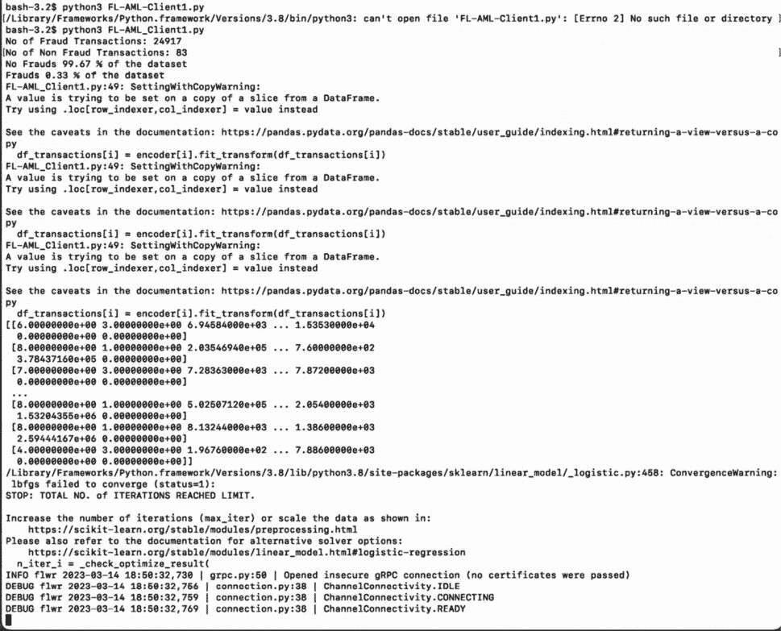

图 6.14 – 客户端 1 的执行及其日志

现在，让我们看看客户端 2 的代码。将此代码保存为 `FL_AML_Client2.py`。客户端 2 的代码将与客户端 1 相同，但不会使用 SMOTE 方法增加欺诈交易。为了全面性，以下是第二个客户端的完整代码：

```py
import pandas as pd
import torch
url ="PS_20174392719_1491204439457_log.csv"
df_actual = pd.read_csv(url, sep=",")
df_actual
df_transactions=df_actual.head(25000)
from sklearn.model_selection import train_test_split
ffrom sklearn.model_selection import StratifiedShuffleSplit
print("No of Fraud Transactions:", df_transactions["isFraud"].value_counts()[0])
print("No of Non Fraud Transactions:", df_transactions["isFraud"].value_counts()[1])
print('No Frauds', round(df_transactions['isFraud'].value_counts()[0]/len(df_transactions) * 100,2), '% of the dataset')
print('Frauds', round(df_transactions['isFraud'].value_counts()[1]/len(df_transactions) * 100,2), '% of the dataset')
```

这将产生以下输出：

```py
No of Fraud Transactions: 24917
No of Non Fraud Transactions: 83
No Frauds 99.67 % of the dataset
Frauds 0.33 % of the dataset
df_transactions.dtypes
step                int64
type               object
amount            float64
nameOrig           object
oldbalanceOrg     float64
newbalanceOrig    float64
nameDest           object
oldbalanceDest    float64
newbalanceDest    float64
isFraud             int64
isFlaggedFraud      int64
dtype: object
```

使用 sci-kit learn 的 `LabelEncoder` 将对象类型编码为标签：

```py
from sklearn.preprocessing import LabelEncoder
encoder = {}
for i in df_transactions.select_dtypes('object').columns:
    encoder[i] = LabelEncoder()
    df_transactions[i] = encoder[i].fit_transform(df_transactions[i])
X = df_transactions.drop('isFraud', axis=1)
y = df_transactions['isFraud']
y.value_counts()
```

这将产生以下输出：

```py
0    24392
1      608
Name: isFraud, dtype: int64
X = df_transactions[['step', 'type', 'amount','nameOrig', 'oldbalanceOrg', 'newbalanceOrig','nameDest', 'oldbalanceDest', 'isFlaggedFraud']]
y= df_transactions['isFraud']
X_train, X_test, y_train, y_test = train_test_split(X, y, test_size=0.3, random_state=42)
X_train = X_train.values
X_test = X_test.values
y_train = y_train.values
y_test = y_test.values
from typing import Tuple, Union, List
import numpy as np
from sklearn.linear_model import LogisticRegression
XY = Tuple[np.ndarray, np.ndarray]
Dataset = Tuple[XY, XY]
LogRegParams = Union[XY, Tuple[np.ndarray]]
XYList = List[XY]
def get_model_parameters(model: LogisticRegression) -> LogRegParams:
    if model.fit_intercept:
        params = [
            model.coef_,
            model.intercept_,
        ]
    else:
        params = [
            model.coef_,
        ]
    return params
def set_model_params(
    model: LogisticRegression, params: LogRegParams
) -> LogisticRegression:
    model.coef_ = params[0]
    if model.fit_intercept:
        model.intercept_ = params[1]
    return model
def shuffle(X: np.ndarray, y: np.ndarray) -> XY:
    rng = np.random.default_rng()
    idx = rng.permutation(len(X))
    return X[idx], y[idx]
def partition(X: np.ndarray, y: np.ndarray, num_partitions: int) -> XYList:
    return list(
        zip(np.array_split(X, num_partitions), np.array_split(y, num_partitions))
    )
def set_initial_params(model: LogisticRegression):
    n_classes = 2  # only 2 classes  Fraud or Geninue
    n_features = 9  # Number of features in dataset
    model.classes_ = np.array([i for i in range(n_classes)])
    model.coef_ = np.zeros((n_classes, n_features))
    if model.fit_intercept:
        model.intercept_ = np.zeros((n_classes,))
partition_id = np.random.choice(10)
(X_train, y_train) = partition(X_train, y_train, 10)[partition_id]
from sklearn.linear_model import LogisticRegression
model = LogisticRegression(
        penalty="l2",
        max_iter=1,  # local epoch
        warm_start=True,  # prevent refreshing weights when fitting
    )
model.fit(X_train, y_train)
class AML_Detection_Client(fl.client.NumPyClient):
        def get_parameters(self, config):
            return get_model_parameters(model)
        def fit(self, parameters, config):
            set_model_params(model, parameters)
            with warnings.catch_warnings():
                warnings.simplefilter("ignore")
                model.fit(X_train, y_train)
            print(f"Training finished for round {config['server_round']}")
            return get_model_parameters(model), len(X_train), {}
        def evaluate(self, parameters, config):
            set_model_params(model, parameters)
            loss = log_loss(y_test, model.predict_proba(X_test))
            accuracy = model.score(X_test, y_test)
            print(loss,accuracy)
            return loss, len(X_test), {"accuracy": accuracy}
fl.client.start_numpy_client(server_address="0.0.0.0:8080", client=AML_Detection_Client())
```

在另一个终端中运行客户端 2 的代码（`python3 FL_AML_Client2.py`）：

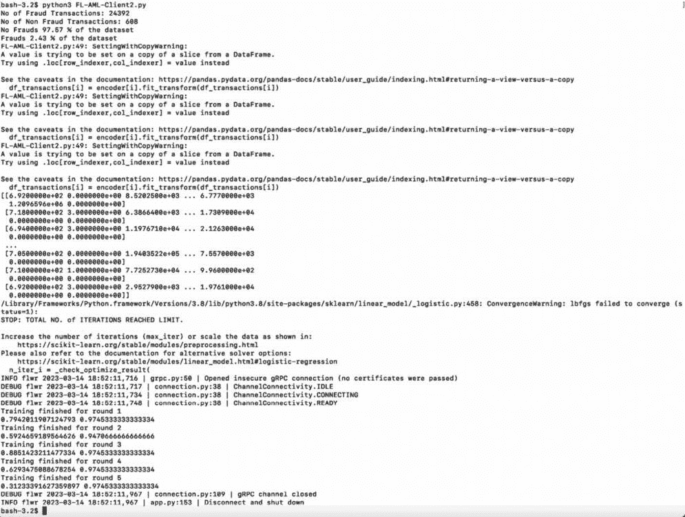

图 6.15 – 运行客户端 2 及其日志

一旦运行客户端 2 的代码，请密切关注服务器端的日志语句。服务器将与两个客户端进行通信，启用初始参数的交换，并在随后的每一轮中更新每个客户端的权重。监控服务器日志将提供关于联邦学习过程进展和客户端与服务器之间共享信息的见解：

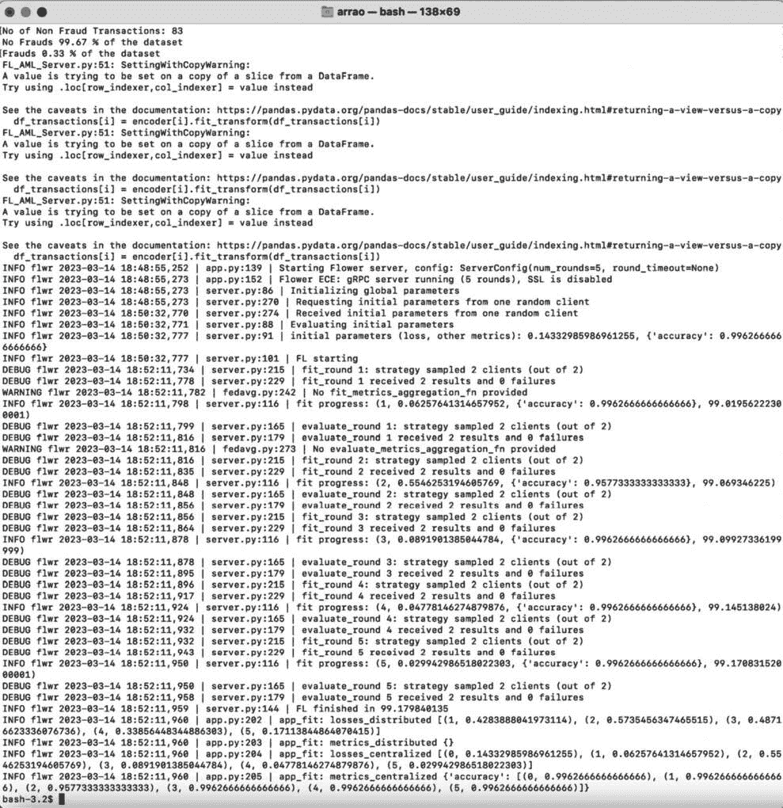

图 6.16 – 服务器端日志

观察客户端和服务器端的日志。这些指标提供了关于每个客户端在联邦学习过程的多个回合中损失（表示模型的性能）和准确度（表示模型的正确性）的概述：

| **服务器** | **客户端 1** | **客户端 2** |
| --- | --- | --- |
| INFO flwr 2023-03-14 17:46:49,202 &#124; app.py:139 &#124; Starting Flower server, config: ServerConfig(num_rounds=5, round_ timeout=None)INFO flwr 2023-03-14 17:51:21,810 &#124; server.py:101 &#124; FL starting |  |  |
|  | DEBUG flwr 2023-03-14 17:51:21,778 &#124; connection.py:38 &#124; ChannelConnectivity.READY |  |
|  |  | ChannelConnectivity. DEBUG flwr 2023-03-14 17:53:46,338 &#124; connection.py:38 &#124; ChannelConnectivity.READY |
| DEBUG flwr 2023-03-14 17:53:46,338 &#124; server.py:215 &#124; fit_round 1: strategy sampled 2 clients (out of 2)DEBUG flwr 2023-03-14 17:53:46,351 &#124; server.py:229 &#124; fit_round 1 received 2 results and 0 failuresWARNING flwr 2023-03-14 17:53:46,354 &#124; fedavg.py:242 &#124; No fit_metrics_aggregation_fn providedINFO flwr 2023-03-14 17:53:46,362 &#124; server.py:116 &#124; fit progress: (1, 0.06756539217831908, {‘accuracy’: 0.9962666666666666}, 144.549737353)DEBUG flwr 2023-03-14 17:53:46,363 &#124; server.py:165 &#124; evaluate_round 1: strategy sampled 2 clients (out of 2)DEBUG flwr 2023-03-14 17:53:46,377 &#124; server.py:179 &#124; evaluate_round 1 received 2 results and 0 failures |  |  |
| INFO flwr 2023-03-14 17:53:46,400 &#124; server.py:116 &#124; fit progress: (2, 0.40485776608772656, {‘accuracy’: 0.9633333333333334}, 144.58791799899996) |  |  |
| INFO flwr 2023-03-14 17:53:46,432 &#124; server.py:116 &#124; fit progress: (3, 0.11833075507570899, {‘accuracy’: 0.9962666666666666}, 144.61946266499996) |  |  |
| INFO flwr 2023-03-14 17:53:46,465 &#124; server.py:116 &#124; fit progress: (4, 0.1145626928425223, {‘accuracy’: 0.9962666666666666}, 144.65267561899998) |  |  |
| INFO flwr 2023-03-14 17:53:46,497 &#124; server.py:116 &#124; fit progress: (5, 0.27867744042157033, {‘accuracy’: 0.9861333333333333}, 144.68508043599996) |  |  |
| INFO flwr 2023-03-14 17:53:46,511 &#124; app.py:202 &#124; app_fit: losses_distributed [(1, 0.4398987330496311), (2, 0.4606742262840271), (3, 0.5105149038136005), (4, 0.5070083439350128), (5, 0.5951354652643204)] |  |  |
|  | 第 1 轮训练完成：0.06756539217831908 0.9962666666666666 第 2 轮训练完成：0.40485776608772656 0.9633333333333334 第 3 轮训练完成：0.11833075507570899 0.9962666666666666 第 4 轮训练完成：0.1145626928425223 0.9962666666666666 第 5 轮训练完成：0.27867744042157033 0.9861333333333333 第 1 轮训练完成：0.8122320748323023 0.9745333333333334 第 2 轮训练完成：0.5164906830160562 0.9541333333333334 第 3 轮训练完成：0.9026990471833415 0.9745333333333334 第 4 轮训练完成：0.8994540131249842 0.9745333333333334 第 5 轮训练完成：0.9115935132282235 0.9736 |
|  | DEBUG flwr 2023-03-14 17:53:46,521 &#124; connection.py:109 &#124; gRPC channel closedINFO flwr 2023-03-14 17:53:46,522 &#124; app.py:153 &#124; Disconnect and shut down | DEBUG flwr 2023-03-14 17:53:46,521 &#124; connection.py:109 &#124; gRPC channel closedINFO flwr 2023-03-14 17:53:46,522 &#124; app.py:153 &#124; Disconnect and shut down |

表 6.8 – 服务器和客户端的日志数据

根据日志，客户端和服务器之间有 5 轮通信，在每一轮中，准确率和损失根据权重变化。

| **客户端 1** | **损失** | **准确率** |
| --- | --- | --- |
| 第一轮 | 0.06756539217831908 | 0.9962666666666666 |
| 第二轮 | 0.40485776608772656 | 0.9633333333333334 |
| 第三轮 | 0.11833075507570899 | 0.9962666666666666 |
| 第四轮 | 0.1145626928425223 | 0.9962666666666666 |
| 第五轮 | 0.27867744042157033 | 0.9861333333333333 |

表 6.9 – 客户端 1 的准确度和损失指标

根据调试日志，客户端 1 的损失和准确度有所变化。让我们也观察一下客户端 2 的损失和准确度结果。

| **客户端 2** | **损失** | **准确度** |
| --- | --- | --- |
| 第一轮 | 0.8122320748323023 | 0.9745333333333334 |
| 第二轮 | 0.5164906830160562 | 0.9541333333333334 |
| 第三轮 | 0.9026990471833415 | 0.9745333333333334 |
| 第四轮 | 0.8994540131249842 | 0.9745333333333334 |
| 第五轮 | 0.9115935132282235 | 0.9736 |

表 6.10 – 客户端 2 的准确度和损失指标

我们已经使用联邦学习实现了一个样本欺诈检测应用，并使用了 Flower 等开源框架。在下一节中，让我们尝试学习和实现使用差分隐私的联邦学习。

# FL 与差分隐私

**联邦学习与差分隐私**（**FL-DP**）是一种结合了 FL 和**差分隐私**（**DP**）原则的方法，以确保分布式机器学习系统中的隐私和安全。FL-DP 旨在保护敏感数据，同时允许在多个设备或实体之间进行协作模型训练。

FL-DP 的目标是在不损害个别数据贡献者隐私的情况下实现准确的模型训练。它解决了在聚合来自不同参与者的模型更新时防止数据泄露的挑战。通过在聚合之前对模型更新或梯度添加噪声或扰动，FL-DP 通过 DP 技术提供了强大的隐私保证。

实现联邦差分隐私（FL-DP）的方法有多种。一种常见的方法是每个客户端使用自己的数据训练一个本地机器学习模型。客户端会对模型的梯度或权重应用剪枝和噪声添加等技术。然后，客户端将更新后的数据发送到服务器。在服务器端，使用诸如安全聚合或隐私保护 FL 算法等技术对更新进行聚合，同时保护隐私。这确保了个人客户端数据保持隐私，同时允许协作模型训练。

FL-DP 算法可能因所使用的特定差分隐私机制而异，例如高斯噪声添加、子采样或如**私有教师集成聚合**（**PATE**）等高级技术。技术选择取决于所需的隐私级别和分布式数据集的特征。

实施 FL-DP 需要对隐私、准确性和计算开销进行仔细考虑。它涉及在保护隐私和保持模型效用之间取得平衡。各种框架和库，如 Flower 和 TensorFlow Privacy，提供了工具和技术，以促进 FL-DP 的实施。

FL-DP 有可能在数据隐私和安全至关重要的场景中释放协作机器学习的优势。通过保护隐私，FL-DP 使组织和个人能够在模型训练中协作，同时保护敏感信息。

FL-DP 提供了一种在 FL 过程中实施隐私保护技术的方法，确保客户端数据保持安全。

在本节中，我们将探讨实现 FL-DP 的两种通用方法，尽管具体的框架和实现可能略有不同。

## 第一种方法

这种方法与谷歌研究团队引入的**差分隐私联邦平均**（**DP-FedAvg**）类似。通过遵循这些方法，FL-DP 允许您在客户端数据上训练机器学习模型，同时通过剪裁和添加噪声等技术来保护隐私。

每个客户端执行以下操作：

1.  使用其本地数据训练机器学习/深度学习模型。

1.  使用标准 SGD 算法计算梯度/权重。

1.  对权重应用剪裁以限制其敏感性。

1.  向权重添加噪声以引入随机性和隐私。

1.  将修改后的权重发送到服务器。

服务器执行以下操作：

1.  计算从每个客户端接收到的权重的平均值。

1.  将更新的权重广播回客户端。

1.  或者，在步骤 1 中，在广播之前对最终权重应用剪裁并添加噪声。

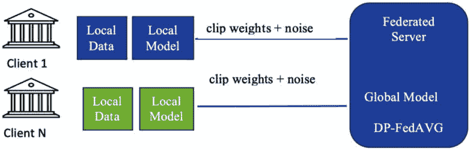

图 6.17 – 与服务器交换的 DP-FedAvg 模型权重

在这种方法中，每个客户端在其本地数据上训练其模型，并处理服务器发送的更新后的平均权重。

## 第二种方法

在这种方法中，每个客户端在其本地数据上训练其模型，并应用隐私保护技术来计算梯度/权重。然后服务器将这些噪声权重合并，并使用 FD-SGD 算法进行聚合，确保在整个 FL 过程中保持隐私。

每个客户端执行以下操作：

1.  使用其本地数据训练机器学习模型。

1.  使用带有噪声的 SGD 或 DP-SGD（DP 随机梯度）算法计算梯度/权重，这些算法在梯度计算过程中引入噪声以保护隐私。

1.  将权重发送到服务器。

服务器执行以下操作：

1.  利用从客户端接收到的噪声权重。

1.  遵循**联邦差分 SGD**（**FD-SGD**）算法，该算法在服务器上的聚合过程中采用了隐私保护技术。

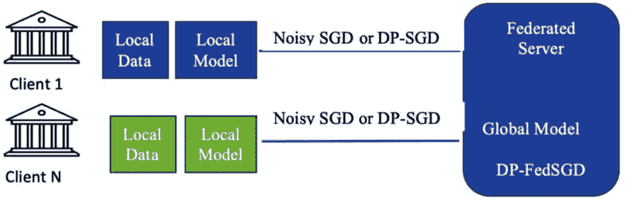

图 6.18 – 与服务器交换的 DP-FedSGD 模型权重

设计了各种不同的差分隐私联邦学习（FL-DP）算法变体，旨在解决不同的场景，如跨设备和跨存储库的 FL，以及同质化和异质化数据。在我们的实现中，我们将应用 FL-DP 到之前相同的示例中，确保在整个 FL 过程中保持隐私保护。

## 一个使用 FL-DP 的示例应用

在撰写本文时，Flower 框架（版本 1.3）目前提供对 FL-DP 的实验性支持。它提供了一个策略类（类似于 FedAvg、FedYogi 等），专门设计来支持 FL-DP。设计来支持这一功能的类名为`DPFedAvg`。

Flower 框架中的`DPFedAvg`类是一个专门设计来支持 FL-DP 的组件。它通过结合差分隐私技术来扩展 FedAvg 算法的功能，以保护在模型聚合过程中个人客户端数据的隐私。

`DPFedAvg`实现了一种隐私保护机制，确保客户端更新的隐私性，同时允许协作模型训练。它通过在聚合到服务器端之前向每个客户端收到的模型更新或梯度添加噪声或扰动来实现这一点。

`DPFedAvg`类的关键特性和功能包括以下内容：

+   **DP**：**DPFedAvg**将差分隐私技术集成到 FL 过程中，确保在模型训练过程中个人客户端数据的隐私得到保护。

+   **噪声添加**：**DPFedAvg**在聚合之前将对每个客户端收到的梯度或模型更新应用噪声。添加的噪声量基于隐私参数和隐私预算分配。

+   **隐私预算管理**：**DPFedAvg**包含管理和有效分配隐私预算的机制，确保在整个训练过程中保持所需的隐私保证。

+   **隐私参数**：**DPFedAvg**允许用户自定义隐私参数，如隐私预算、噪声分布和模型更新的敏感性。这些参数使得对隐私和效用之间的权衡可以进行精细控制。

+   **模型聚合**：**DPFedAvg**使用 DP 平均算法执行客户端更新的聚合。这确保了个人更新的隐私得到保护，同时生成一个更新的全局模型。

+   **与 Flower 框架的兼容性**：**DPFedAvg**被设计成可以无缝集成到 Flower 框架中，使用户能够通过现有的 Flower 基础设施将 DP 纳入他们的 FL 管道。

通过在 Flower 框架中使用`DPFedAvg`类，开发者和机器学习工程师可以简单高效地实现 FL-DP。它提供了一个强大的工具，以确保在分布式机器学习场景中的隐私性，同时保持联邦学习的协作优势。

让我们详细了解一下 Flower 提供的类。

### DPFedAvgFixed 类

这个类是一个包装类，它向权重添加裁剪和高斯噪声。该类的构造函数支持设置服务器端噪声、裁剪范数值和噪声乘数参数。

让我们在服务器端使用这个类。服务器代码如下：

```py
def DP_Fed_Server():
    model = LogisticRegression(max_iter=10000)
    set_initial_params(model)
    strategy = fl.server.strategy.FedAvg(
        min_available_clients=2,
        evaluate_fn=get_evaluate_fn(model,X_test,y_test),
        on_fit_config_fn=fit_round,
    )
dps = DPFedAvgFixed(strategy,
num_sampled_clients=2,
clip_norm=0.03,
noise_multiplier=0.5)
fl.server.start_server(
        server_address="0.0.0.0:8080",
          strategy=dps,
         config=fl.server.ServerConfig(num_rounds=5),
    )
DP_Fed_Server()
```

服务器和客户端的 Jupyter 笔记本源代码位于*第六章*文件夹中：

+   服务器代码：**Fed-DP-AML-Server.ipynb**

+   客户端 1 代码：**DP-FL-AML_Client1.ipynb**

+   客户端 2 代码：**DP-FL-AML-Client2.ipynb**

让我们看看客户端和服务器模型的准确率：

| **客户端 1** | **客户端 2** | **服务器** |
| --- | --- | --- |
| 0.99626666666666660.71626666666666670.98760.93720.7714666666666666 | 0.97453333333333340.59786666666666670.96933333333333340.94480.7708 | 0.99626666666666660.71626666666666670.98760.93720.7714666666666666 |

| 表 6.11 – 服务器和客户端的准确率结果 |

将 DP 应用于 FL 会在计算成本、通信开销以及可能降低模型性能方面引入一些开销。在我们的示例案例中，到第四轮时，准确率为 93%，但在第五轮时，准确率突然下降。这告诉我们，我们需要在训练过程中监控准确率，以帮助我们决定每个客户端需要参与的轮数，并在准确率下降时停止进一步的轮次。

# 摘要

在本章中，我们解释了为什么需要联邦学习（FL），并详细探讨了其定义和特性。我们涵盖了实现 FL 的步骤，讨论了独立同分布（IID）和非独立同分布（non-IID）数据集以及 FL 算法。我们使用开源 FL 框架实现了一个示例应用。最后，我们使用差分隐私（DP）将同一应用进行了转换。

在下一章中，我们将学习 FL 基准测试，并了解正在开发或已经拥有 FL 产品的关键初创公司。
