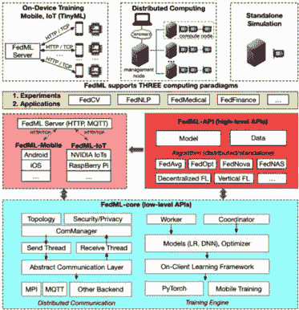
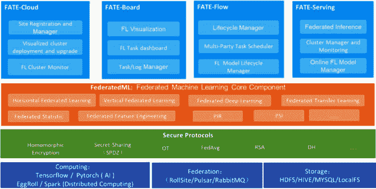
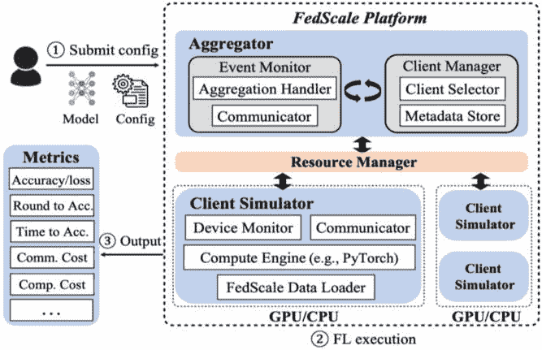
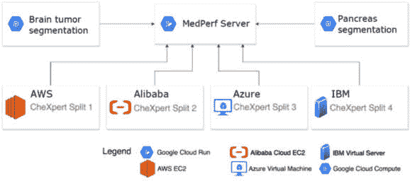

# 7

# 联邦学习基准、初创公司和下一个机会

本章重点介绍了**联邦学习**（**FL**）基准的重要性，并突出了该领域初创公司提供的产品。

我们将涵盖以下主要主题：

+   FL 基准：

    +   FL 基准的介绍，包括其重要性

    +   设计 FL 基准时的考虑因素

    +   FL 数据集概述

    +   各类 FL 基准套件的高级概述

    +   选择适合项目的适当 FL 框架

+   FL 领域的最先进研究

+   FL 的下一个机会和关键初创公司产品

通过探讨这些主题，您将全面了解 FL 基准的需求以及该领域的最新进展。此外，我们将展示与 FL 密切相关的一些初创公司开发的显著产品。

# FL 基准

FL 是一种机器学习技术，允许多个设备/客户端或服务器协作训练模型并保持其数据隐私。对标准化基准的需求不断增加，以评估不同 FL 算法和框架/平台的表现。

IEEE 3652.1-2020 标准，正式名称为*IEEE 关于联邦机器学习架构和应用指南*，是一本综合指南，提供了联邦机器学习（**FML**）的架构框架。有关 IEEE 3652.1-2020 标准的更多详细信息，请参阅[`ieeexplore.ieee.org/document/9382202`](https://ieeexplore.ieee.org/document/9382202)。

FL 基准是用于比较和评估不同 FL 算法和框架/平台性能的数据集和评估指标。这些基准可以帮助工程师和研究人员识别不同算法的优缺点以及不同 FL 框架的利弊。

接下来，我们将讨论 FL 基准的重要性以及设计它们时应考虑的关键因素。

## FL 基准的重要性

FL 基准对于多个原因至关重要。

首先，它们帮助研究人员评估不同 FL 算法在标准公共数据集上的性能，这有助于确定哪些算法对特定用例最有效。比较不同算法的性能可以帮助通过确定需要新算法或现有算法需要改进的领域来推动该领域的进步。

其次，这些基准还有助于比较不同 FL 框架的性能，并确定哪个框架最适合使用 FL 解决业务用例。

最后，基准可以通过提供标准化的指标和评估程序来帮助提高研究结果的再现性。

设计 FL 基准时的关键考虑因素：在设计 FL 基准时，应考虑几个关键因素。以下是一些例子：

+   **数据分布**：联邦学习算法旨在处理分布在多个设备或服务器上的数据。因此，基准测试应包括代表可能在实际使用案例中遇到的数据类型的数据集。

+   **异构性**：联邦学习涉及在不同设备或服务器上训练数据分布的模型，每个设备可能具有不同的硬件能力和网络条件。因此，基准测试应包括多样化的数据集，并反映不同类型的设备和网络条件。

+   **隐私**：联邦学习（FL）的主要优势之一是能够通过在用户设备上保留数据来保护数据的隐私。因此，基准测试应确保用于训练的数据能够代表真实世界的使用案例，同时仍然保护用户的隐私。

+   **评估指标**：基准测试应包括标准指标来评估联邦学习算法的性能。这些指标应经过仔细选择，以确保它们能够准确反映算法的性能并适用于特定的使用案例。

+   **可重现性**：联邦学习基准测试应设计成可重现的，这意味着数据集和评估程序应被明确记录并可供他人使用。

我们已经讨论了设计联邦学习基准测试时的关键考虑因素。接下来，我们将进一步探讨在联邦学习基准测试中需要考虑的数据集。

## 联邦学习数据集

联邦学习的关键方面之一是选择用于训练模型的数据库集。接下来，我们将探讨在选择联邦学习数据集时需要考虑的各种因素：

+   **数据隐私**：在选择联邦学习数据集时，最关键的考虑因素是数据隐私。由于数据存储在每个设备上，因此确保数据不会被任何未经授权的第三方访问至关重要。可以通过使用加密技术或匿名化数据来确保数据隐私。此外，从设备所有者那里获得适当的同意和许可以使用他们的数据用于联邦学习也很重要。还需要考虑对差分隐私的支持，因为仅仅数据匿名化可能不足以保证。

+   **数据多样性**：在为联邦学习选择数据集时，数据多样性是另一个重要的考虑因素。数据集应该足够多样化，以捕捉广泛的数据模式和特征。这对于确保模型不会偏向特定数据集是至关重要的。例如，如果数据集只包括来自特定地区或人口统计数据的数据，那么模型可能无法很好地推广到其他地区或人口统计数据。

+   **数据质量**：在选择联邦学习的数据集时，数据质量也是一个重要的考虑因素。数据集应该是干净的，没有错误或不一致之处。可能需要数据清洗和预处理技术来确保数据适合训练模型。此外，数据应该代表现实世界场景，以确保模型在实际情况下能表现良好。

+   **数据大小**：数据集的大小也是联邦学习的一个重要考虑因素。数据集应该足够大，以便有效地训练模型，但又不能太大，以至于难以处理。需要在数据集的大小和用于训练模型的计算资源之间找到一个良好的平衡。

+   **数据分布**：最后，数据在设备间的分布也是联邦学习的一个重要考虑因素。数据应该以这种方式分布，使得每个设备都能访问到数据的代表性样本。这确保了每个设备都能以有意义的方式为模型的训练做出贡献。此外，数据分布应该是平衡的，以避免任何设备因数据过载而超负荷。

数据集在基准测试联邦学习系统时至关重要。接下来，我们将探讨以下流行的标准数据集，这些数据集被用于基准测试联邦学习系统：

+   FLAIR

+   联邦 EMNIST

+   莎士比亚

+   CIFAR-10

+   OpenStreetMap

+   医学图像分析数据集

### FLAIR

**联邦学习标注图像库**（**FLAIR**）是一个开源项目，旨在为联邦学习提供一个集中式的标注图像存储库。该存储库包含了一系列多样化的图像，包括医学图像、卫星图像和自然图像，以及相应的标注。FLAIR 为研究人员和开发者提供了一个平台，用于评估基于图像的任务上的联邦学习算法，如图像分类和目标检测。该存储库允许您共享和协作标注图像，减少单个组织收集和标注自身数据的需要。FLAIR 中的标注旨在保护隐私，敏感信息被移除或模糊化。隐私保护标注和标准化格式使 FLAIR 成为评估基于图像任务的联邦学习算法的有价值资源，使其能够轻松集成到流行的机器学习框架和工具中。

FLAIR 已成为联邦学习社区中流行的资源，几个联邦学习框架已将其集成到它们的评估流程中。该存储库持续更新，定期添加新的数据集和标注。它由来自 51,000 名 Flickr 用户的 430,000 张图像组成，这些图像映射到 17 个粗粒度标签，如艺术、食物、植物和户外。

欲了解更多信息，请访问以下 GitHub 网址：[`github.com/apple/ml-flair`](https://github.com/apple/ml-flair)。

### 联邦 EMNIST

**联邦扩展 MNIST**（**Federated EMNIST**）是谷歌开发的一个联邦学习基准数据集。它由一组手写数字和字母的图像组成，类似于 MNIST 数据集。该数据集分布在多个设备上，目标是训练一个模型，能够在保持数据隐私的同时正确分类图像。

### 莎士比亚

该数据集包含莎士比亚文本的集合，可用于训练用于文本生成的语言模型。

### CIFAR-10

这是一个广泛使用的计算机视觉任务基准数据集，由 10 个不同类别的 60,000 张彩色图像组成。它用于训练一个模型，以在保持数据隐私的同时正确分类图像。

### OpenStreetMap

这是一个地理数据集，包括地图、卫星图像和 GPS 坐标。该数据集可以在多个设备上分布，目标是训练一个模型，能够在保护数据隐私的同时预测交通模式或其他环境特征。

### 医学图像分析数据集

有几个医学图像数据集可以用于联邦学习，例如**脑肿瘤分割**（**BraTS**）挑战数据集和**前列腺磁共振图像分割**（**PROMISE12**）挑战数据集。这些数据集包含可用于训练诊断和治疗规划模型的医学图像，同时保护患者数据的隐私。

## 联邦学习基准框架

开源社区和商业领域都有几个联邦学习基准框架可用。联邦学习框架提供库/平台，用于基准测试联邦学习系统和应用。

一些最受欢迎的联邦学习系统和基准包括以下内容：

+   LEAF

+   FedML

+   FATE

+   FedScale

+   PySyft

+   MLCommons – MLPerf

+   MedPerf

+   TensorFlow Federated (TFF)

+   花朵（我们在上一章中已经讨论过，所以本章不再详细说明）

我们将在接下来的小节中更详细地探讨这些内容。

### LEAF FL 基准测试套件

LEAF FL 基准测试套件是由卡内基梅隆大学发起的一个项目，旨在为联邦学习算法提供一个标准化的基准测试套件（[`leaf.cmu.edu/`](https://leaf.cmu.edu/))。

LEAF 基准使研究人员和开发者能够评估不同领域和配置下联邦学习算法的性能。LEAF 提供了一套标准化的任务和数据集，用于评估联邦学习算法在各种指标上的性能，包括收敛速度、通信效率和准确性。广泛的任务包括图像分类、文本分类和回归任务。

在基准测试中使用的数据库旨在代表现实世界场景，具有不同的数据分布、数据大小和数据复杂度水平。基准测试在各种设置下进行，例如改变客户端数量、通信轮次以及每个客户端可用的数据量。基准测试还评估算法对对抗攻击和噪声数据的鲁棒性。

LEAF 的核心组件如下：

+   数据集

+   参考实现

+   指标

图 7.1 – LEAF 的核心组件和流程

更多关于 LEAF 基准测试的详细信息可以在 [`arxiv.org/abs/1812.01097`](https://arxiv.org/abs/1812.01097) 获取。

### FedML

FedML ([`github.com/FedML-AI/FedML`](https://github.com/FedML-AI/FedML)) 是一个用于联邦学习的基准套件，包括多个数据集和任务，如图像分类、语言建模和语音识别。FedML 在 **非独立同分布**（**non-iid**）的数据分布、对大数据集的可扩展性和通信效率方面评估联邦学习算法的鲁棒性。

该框架支持各种类型的联邦学习设置，如水平、垂直和联邦迁移学习，以及不同类型的优化算法，包括联邦平均、FedProx 和 FedAdapt。FedML 框架旨在模块化、灵活和可扩展，使用户能够轻松定制和扩展现有算法或开发新算法。它还提供了一套基准数据集和评估指标，以促进不同算法的比较。

FedML 社区积极开发和维护该框架，并组织研讨会和挑战赛，以促进联邦学习的研究和创新。该社区还与行业合作伙伴合作，将联邦学习应用于现实世界的用例，如医疗保健、金融和电信。FedML 是一个重要的倡议，旨在解决联邦学习的挑战和机遇，并使分布式环境中开发安全、隐私保护和高效的机器学习模型成为可能。FedML 支持三种类型的计算平台 – 物联网/移动、分布式计算和独立模拟。

更多详细信息可以在以下参考研究 URL 中找到：[`arxiv.org/abs/2007.13518`](https://arxiv.org/abs/2007.13518)。

图 7.2 – FedML 架构

### FATE

**联邦人工智能技术赋能器**（**FATE**）是一个开源项目，它提供了一种安全且保护隐私的方式来协作开发**人工智能**（**AI**）模型。FATE 旨在实现联邦学习（FL），这是一种分布式机器学习方法，允许多个参与者训练一个共享模型，而无需共享他们的数据。FATE 由腾讯的子公司微众银行 AI 部门开发。[`github.com/FederatedAI/FATE`](https://github.com/FederatedAI/FATE)

FATE 为开发者提供了一个平台，使他们能够在自己的 AI 应用中实现联邦学习技术。它支持不同类型的联邦学习，如横向和纵向，并提供工具来管理不同设备间模型的通信、同步和聚合。FATE 采用多种加密技术来确保联邦学习过程的隐私和安全。例如，FATE 使用差分隐私向训练数据添加噪声，防止泄露关于单个用户的敏感信息。FATE 还使用同态加密来允许对加密数据进行计算，这使得各方可以在不向彼此透露数据的情况下进行协作。我们将在下一章中学习同态加密。

FATE 建立在 Kubernetes 之上，这是一个流行的开源容器编排系统。Kubernetes 为 FATE 提供了管理容器和自动化联邦学习基础设施的部署、扩展和监控的能力。FATE 利用加密技术和 Kubernetes 来确保联邦学习过程的隐私和安全。FATE 为开发者提供了一个基于 Web 的**图形用户界面**（**GUI**），以便与平台交互、监控训练过程和可视化结果。它已被各种公司和组织采用，以构建保护隐私的 AI 应用。例如，腾讯已使用 FATE 为其电商平台开发了一个保护隐私的推荐系统。华为也使用 FATE 为医疗保健行业构建了一个联邦学习平台。随着联邦学习在 AI 行业中的重要性日益增加，FATE 的普及度预计将增长。

#### FATE 的架构

下面的图显示了 FATE 架构：

图 7.3 – FATE 架构

前面的图来源于[`fate.readthedocs.io/en/latest/architecture/`](https://fate.readthedocs.io/en/latest/architecture/)。

### FedScale 基准测试平台

FedScale 基准测试套件包括几个数据集和工作负载，旨在评估联邦学习算法和系统的性能。这些数据集被选中以反映现实世界数据的异构性和非独立同分布（non-IIDness）。工作负载被设计来模拟现实世界联邦学习场景的通信开销和计算复杂性，以及评估这些场景中联邦学习算法和系统的性能。

包含在 FedScale 基准套件中的数据集之一是 Synthetic IID 数据集，它由随机生成并均匀分布在客户端之间的合成数据组成。该数据集旨在评估联邦学习算法和系统的可扩展性和效率。FedScale 基准套件中包含的另一个数据集是异构图像数据集，它由来自不同来源和领域的图像组成。该数据集旨在评估联邦学习算法和系统对异构数据的鲁棒性。

FedScale 基准套件还包括更复杂的工作负载，例如联邦元学习工作负载，涉及客户端从彼此的数据中学习。

图 7.4 – 运行 FL 基准的 FedScale 运行时

前面的图来自 [`github.com/SymbioticLab/FedScale/blob/master/docs/fedscale-sim-mode.png`](https://github.com/SymbioticLab/FedScale/blob/master/docs/fedscale-sim-mode.png)。

### MLCommons

MLCommons 是一个非营利组织，旨在通过为其成员提供一个协作和资源共享的平台来加速机器学习创新和发展。它由机器学习领域的几位领先研究人员、工程师和企业家于 2020 年 6 月成立。

该组织的主要关注点是开发和推广设计及部署机器学习系统的最佳实践，包括硬件和软件框架、数据集、基准和评估指标。MLCommons 的一个关键倡议是 MLPerf 基准套件，该套件旨在衡量机器学习系统在一系列应用中的性能，包括计算机视觉、自然语言处理和推荐系统。这些基准由全球的研究人员和工程师社区开发和维护，并用于评估机器学习硬件和软件平台的性能。MLPerf 已迅速成为衡量机器学习性能的行业标准，并被全球领先的技术公司、研究人员和政府机构所采用。

### MedPerf

MedPerf 是一个用于医疗人工智能的开放基准平台，使用联邦学习。MLCommons 团队与多个机构和大学合作，试点了多个用例，使用 MDPerf 基准运行联邦学习模型。这些用例包括脑肿瘤分割、胰腺分割、手术流程阶段识别和云实验。

图 7.5 – 云实验的 MedPerf 架构

前面的图来自 [`github.com/mlcommons/medperf`](https://github.com/mlcommons/medperf)。

## 选择一个联邦学习框架

选择最佳的联邦学习（FL）框架可能是一项具有挑战性的任务，因为需要考虑多个因素，例如功能、可扩展性、安全性、易用性、文档、支持的学习机器算法（开箱即用）、神经网络支持以及学习曲线。

选择 FL 框架时的一些关键考虑因素如下：

+   **功能**：考虑框架提供的功能很重要。一些需要寻找的关键功能包括支持不同的机器学习算法、分布式训练、数据隐私和数据验证。你应该选择一个具有与你的用例需求相匹配的功能的框架。

+   **可扩展性**：另一个关键考虑因素是可扩展性。框架应该能够处理大量数据集和大量参与者。你还应该考虑框架是否能够进行横向或纵向扩展。在跨设备（移动、网页等）的情况下，框架应该能够处理大量客户端。

+   **安全和隐私**：联邦学习涉及多个方共享数据，因此选择一个提供强大安全功能的框架至关重要。框架应该具备加密和认证功能，以保护数据免受未经授权的访问。你还应该考虑框架是否具有透明的安全模型，允许你审计实施的安全措施。你需要考虑框架是否默认支持隐私保护，例如差分隐私。

+   **易用性**：框架的易用性也是一个关键考虑因素。框架应该拥有直观的用户界面，使其易于设置、配置和使用。你还应该考虑框架是否具有良好的文档和社区支持，因为这可以帮助你解决出现的任何问题。

+   **学习曲线**：你应该考虑框架的学习曲线，包括用户文档、部署设置、编程语言支持、提供的示例和样本等。

+   **兼容性**：最后，你应该考虑框架是否与你的现有技术堆栈和编程语言兼容。例如，如果你正在使用 TensorFlow 进行机器学习，你可能希望选择一个与 TensorFlow 兼容的 FL 框架。

总之，选择最佳框架需要仔细考虑多个因素，包括功能、可扩展性、安全性、隐私、易用性、学习曲线以及与现有技术堆栈的兼容性。通过考虑这些因素，你可以选择一个满足你要求的框架，以使用联邦学习解决业务用例。

## FedScale、FATE、Flower 和 TensorFlow Federated 的比较

FedScale、FATE、Flower、FedML 和 **TensorFlow Federated**（**TFF**）是一些流行的联邦学习框架，它们提供独特的功能和能力。在以下小节中，我们将比较这些功能和能力。

### 功能

FedScale 是一个支持广泛机器学习模型的框架，包括深度神经网络、决策树和**支持向量机**（**SVMs**）。它还支持各种优化算法，如联邦**随机梯度下降**（**SGD**）和联邦近端算法。相反，FATE 提供了一套全面的联邦学习工具，支持各种机器学习算法，包括逻辑回归、决策树和深度学习模型。Flower 是一个轻量级的框架，支持各种机器学习模型，包括神经网络、决策树和逻辑回归。TFF 是一个广泛使用的联邦学习框架，支持基于 TensorFlow 的机器学习模型。

### 可扩展性

FedScale 和 FATE 是为大规模部署设计的，可以处理大量的参与者。Flower 是一个轻量级的框架，非常适合小型到大型规模的联邦学习项目。TFF 是一个可扩展的框架，可以处理大型规模的联邦学习项目，并且可以用于在生产环境中部署联邦学习算法。

### 安全性

所有四个框架都提供强大的安全功能，如加密和身份验证，以保护在联邦学习过程中的数据。FATE 有额外的功能，如差分隐私和同态加密，以增强数据隐私。TFF 还提供了安全的**多方计算**（**MPC**）协议，使多个方能够在联邦学习项目中安全地协作。

### 易用性

与 Flower 和 TFF 相比，FedScale 和 FATE 的学习曲线更陡峭，因为它们提供了更复杂的功能和工具。Flower 和 TFF 都易于使用，具有直观的 API 和文档，使得入门变得容易。TFF 还提供了一个高级 API，使用户能够在不要求深入了解底层细节的情况下构建联邦学习算法。

### 社区支持

所有四个框架都有活跃的开源贡献者，提供支持和文档。TFF 由 Google 开发，拥有最大的社区和支持，其次是 Flower、FedScale 和 FATE。

这些框架中的每一个都有其独特的功能和能力，使它们适用于不同的用例。FedScale 和 FATE 适用于大规模的联邦学习部署，而 Flower 和 TFF 更适合小型到中型项目。TFF 拥有最大的社区和支持，是寻找具有广泛支持和资源的联邦学习框架的开发者的绝佳选择。最终，框架的选择将取决于具体的用例、需求和框架的熟悉程度。

### 研究论文

每个框架都在研究期刊中发布了其自己的基准和结果，包括支持的特性和准确度指标。目前，还没有像 [TPC.Org](http://TPC.Org) 或 [SPEC.org](http://SPEC.org) 那样被广泛接受的行业标准基准。

# 联邦学习（FL）的最新研究

FL 是一个快速发展的技术，在这个领域有几种最先进的研究方向。以下是 FL 研究中的一些最新进展。

这里是不同 FL 框架的高级比较：

| **高级功能** | **FATE** | **FedML** | **Flower** | **FedScale** | **TFF** |
| --- | --- | --- | --- | --- | --- |
| 回归模型 | Y | Y | Y | Y | Y |
| 神经网络 | Y | Y | Y | Y | Y |
| 基于树的模型 | Y | N | N | N | N |
| 通信协议 | 定制化 | MPI | gRPC | gRPC | gRPC |
| 支持差分隐私 | N | N | Y | Y | Y |
| 单主机部署 | Y | Y | Y | Y | Y |
| 跨设备部署 | N | Y | Y | Y | N |
| 研究论文 | Y | Y | Y | Y | Y |

表 7.1 – 不同 FL 框架的比较

## 通信高效的 FL

FL 中的一个主要挑战是在设备和中心服务器之间传输模型更新时的高通信成本。最近的研究集中在通过开发新的压缩技术，如量化、稀疏化和差分压缩来降低 FL 中的通信成本。这些技术可以在不牺牲模型准确度的前提下显著降低通信成本。一些研究人员和研究小组正在积极进行**通信高效的 FL（CE-FL**）研究：

+   **谷歌研究**：谷歌研究一直在积极从事 CE-FL 研究，并开发了多种降低 FL 中通信成本的技术。他们最近的一项工作是 *Communication-Efficient Learning of Deep Networks from Decentralized Data*，提出了一种名为**量化随机梯度下降（QSGD**）的新压缩技术，可以显著降低 FL 中的通信成本。这是一个允许在每个节点压缩梯度更新的压缩方案，同时保证在标准假设下的收敛。请参阅 Arxiv 论文[`arxiv.org/abs/1602.05629`](https://arxiv.org/abs/1602.05629)。

+   **联邦学习社区**：联邦学习社区是一个由从事 FL 研究的学者和实践者组成的开放社区。该社区有几个工作组，包括一个专注于开发降低 FL 中通信成本新技术的 CE-FL 工作组。

+   **卡内基梅隆大学**：卡内基梅隆大学的机器学习系有几位研究人员正在从事 CE-FL 研究。他们最近的一项工作是 *Communication-Efficient Distributed Learning with Feature-Selective Sampling*，提出了一种新的采样技术，可以降低 FL 中的通信成本。

+   **IBM 研究院**：IBM 研究员和密歇根大学正在从事 CE-FL 研究工作，他们最新的工作是 *Federated Learning with Matched Averaging*，提出了一种新的聚合技术，可以降低 FL 中的通信成本。请参阅 Arxiv 论文[`arxiv.org/abs/2002.06440`](https://arxiv.org/abs/2002.06440)。

这些只是众多积极从事 CE-FL 研究的研究人员和研究团队中的几个例子。随着 FL 领域的持续发展，预计将有更多的研究人员和研究团队专注于开发新的技术来降低 FL 中的通信成本。

## 隐私保护 FL

隐私在 FL 中是一个关键问题，因为数据分布在多个设备上，每个设备的所有者都希望保护他们的数据隐私。最近的研究主要集中在开发新的隐私保护技术，如差分隐私和安全的多方计算，以在允许协作模型训练的同时保护设备所有者的数据隐私。这些技术可以在保持模型准确性的同时提供强大的隐私保证。一些研究人员和研究团队正在积极从事 **隐私保护 FL** (**PP-FL**) 研究工作。

这里有一些值得注意的例子：

+   **OpenMined**：OpenMined 是一个致力于推进 PP-FL 研究的开源社区。它开发了几个 PP-FL 框架，包括 PySyft，这是一个用于 PP-FL 的 Python 库。

+   **谷歌研究院**：谷歌研究院一直在积极从事 PP-FL 研究工作，并开发了多种保护 FL 中用户隐私的技术。他们最近的一项工作是 *Privacy-Preserving Federated Learning with Byzantine Robust Aggregation*，提出了一种新的聚合技术，可以在存在恶意行为者的情况下保护用户隐私。

+   **卡内基梅隆大学**：卡内基梅隆大学的 CyLab 安全与隐私研究所有多位研究人员正在从事 PP-FL 研究工作。他们最近的一项工作是 *Privacy-Preserving Federated Learning via Randomized Smoothing*，提出了一种新技术，通过向用户数据添加噪声来保护用户隐私。

+   **牛津大学**：牛津大学有几位研究人员正在从事 PP-FL 研究工作。他们最近的一项工作是 *Secure Federated Learning on Curves*，提出了一种新技术，通过使用椭圆曲线加密用户数据来保护用户隐私。

+   **微软研究院**：微软研究院一直在积极从事 PP-FL 研究工作，并开发了多种保护 FL 中用户隐私的技术。他们最近的一项工作是 *Private Federated Learning with Secure Aggregation*，提出了一种新的聚合技术，通过使用同态加密来保护用户隐私。

这些是许多积极从事 PP-FL 研究的研究人员和研究小组的例子。随着 FL 领域的持续演变，预计将有更多研究人员和研究小组专注于开发新的技术来保护 FL 中用户数据的隐私。

## 联邦元学习

**联邦元学习**（**FML**）是一个新的研究方向，它结合了联邦学习和元学习，以从多个数据源和任务中学习同时保护隐私。FML 允许在多个设备和组织之间进行协作模型训练，同时保护设备所有者的数据隐私。最近的研究探索了新的 FML 技术和应用，如个性化医疗和个性化推荐。FML 是 FL 中的一个相对较新的研究方向，只有少数研究小组正在积极从事相关工作。

这里有一些例子：

+   **谷歌研究**：谷歌研究一直在积极从事 FML 研究，并开发了多种从多个客户端的元知识中学习同时保护其隐私的技术。其研究工作之一是*推荐任务的联邦元学习*，该研究提出了一种新的 FML 框架用于推荐任务。

+   **卡内基梅隆大学**：卡内基梅隆大学的机器学习系有多位研究人员正在从事 FML 研究。其最近的一项工作是*联邦元学习在医疗保健中的快速模型自适应*，该研究提出了一种在保护多个医疗保健机构隐私的同时从这些机构学习的新方法。

+   **牛津大学**：牛津大学有多位研究人员正在从事 FML 研究。其最近的一项工作是*具有隐私保护和通信高效的模型聚合的推荐任务联邦元学习*，该研究提出了一种新的 FML 方法用于推荐任务，既保护隐私又降低通信成本。

+   **加州大学伯克利分校**：加州大学伯克利分校的 RISELab 有多位研究人员正在从事 FML 研究。其最近的一项工作是*跨异构设备的少量样本学习联邦元学习*，该研究提出了一种新的 FML 方法，可以从异构设备上的数据中学习。

这些是正在积极从事 FML 研究的几个研究小组的例子。随着 FML 领域的持续发展，预计将有更多研究人员和研究小组专注于开发适用于各种应用的 FML 新技术。

## 自适应 FL

在 FL 中，设备的数据分布可能会随时间变化，导致概念漂移问题，这可能会降低模型的表现。最近的研究集中在开发新的自适应学习技术，这些技术可以在保护隐私的同时有效地更新模型。这些技术可以使模型适应变化的数据分布，并随着时间的推移提高模型的表现。**自适应联邦学习**（**AFL**）是 FL 中的一个新兴研究方向，它侧重于动态调整 FL 系统以适应不断变化的情况。

以下是一些正在积极从事 AFL 研究的知名研究人员和研究团队的例子：

+   **卡内基梅隆大学**：卡内基梅隆大学的机器学习系有几位研究人员正在从事 AFL 研究。他们最近的一项工作是*自适应联邦优化*，该研究提出了一种新的 AFL 框架，该框架根据网络条件调整学习率和聚合策略。

+   **谷歌研究**：谷歌研究一直在积极从事 AFL 研究，并开发了几种技术来适应 FL 系统不断变化的情况。他们最近的一项工作是*具有局部下降的自适应联邦优化*，该研究提出了一种新的 AFL 方法，该方法根据客户端的本地数据分布调整学习率和聚合策略。

+   **南加州大学**：南加州大学的计算机科学系有几位研究人员正在从事 AFL 研究。他们最近的一项工作是*去中心化自适应联邦学习与梯度压缩*，该研究提出了一种新的 AFL 方法，该方法根据网络条件调整学习率和聚合策略，同时压缩梯度以降低通信成本。

+   **清华大学**：清华大学的计算机科学与技术系有几位研究人员正在从事 AFL 研究。他们最近的一项工作是*通过二次信息交换的自适应联邦学习*，该研究提出了一种新的 AFL 方法，该方法基于客户端之间的二次信息交换来调整学习率和聚合策略。

这些只是积极从事 AFL 研究的几个研究团队的例子。随着 AFL 领域的不断发展，预计将有更多研究人员和研究团队专注于开发新技术，以适应不断变化的情况。

## 联邦强化学习

**强化学习**（**RL**）是一种机器学习范式，它使代理能够通过试错来学习。**联邦强化学习**（**FRL**）是一个新的研究方向，它将 FL 和 RL 相结合，以实现决策任务中的隐私保护协作学习。最近的研究探索了新的 FRL 算法和应用，例如自动驾驶和机器人技术。

许多研究人员和组织正在积极研究 FRL，以改进保护用户隐私和数据安全的机器学习技术。

这里有一些例子：

+   Google 的**联邦学习群体**（**FLoC**）团队正在开发 FRL，以创建用于广告定位的隐私保护用户模型。

+   斯坦福大学的研究人员一直在探索使用 FRL 来训练自主机器人。卡内基梅隆大学的研究团队正在研究 FRL 作为提高医疗机器学习模型效率和隐私的方法。

+   OpenMined 项目是一个社区驱动的倡议，旨在创建一个隐私保护机器学习的生态系统，包括联邦学习。

+   微软研究院正在开发用于分布式机器人应用的 FRL 方法。

这些只是许多正在研究 FRL 的研究人员和组织的少数例子，FRL 是一个快速发展的领域，有许多令人兴奋的发展和应用。

**联邦肿瘤分割（FeTs**）是由英特尔和**宾夕法尼亚大学**（**UPenn**）开发的现实世界医疗联邦学习平台。他们使用 OpenFL 作为平台的后端。

# 与联邦学习相关的关键公司产品

正如我们所见，联邦学习是一个快速发展的领域，已经引起了初创公司的广泛关注。以下是一些正在工作或提供联邦学习产品的公司的总结：

+   **DynamoFL**：DynamoFL 是由来自**麻省理工学院**（**MIT**）和哈佛的隐私和机器学习专家构建的，他们在 Google AI 构建了领先的联邦学习解决方案，在微软构建了增强隐私的技术。根据其网站，当前的大规模语言模型（**LLMs**）不是私有的，但 DynamoFL 的 LLMs 是私有的。他们提供个性化的联邦学习，这是另一个关键的研究领域。LLMs 在*隐私保护生成* *AI*部分的*第十章*中有介绍。

+   **NVIDIA FLARE**：NVIDIA 的**联邦学习应用运行环境**（**FLARE**）是一个由 NVIDIA 开源的联邦学习 SDK。FLARE 支持各种联邦学习算法（FedAvg、FedProx、FedOpt 等）、神经网络和机器学习算法。它支持差分隐私和同态加密功能，作为安全和隐私保护堆栈的一部分。该 SDK 还提供了一个模拟器，可用于启动服务器和客户端，并执行联邦学习笔记本和应用程序。

+   **OpenMined**：OpenMined 是一个开源社区，提供了一个隐私保护机器学习的平台，包括联邦学习工具和库，用于安全的聚合和差分隐私。

+   **DataFleets**：DataFleets 提供了一个隐私保护数据访问和分析的平台，包括用于安全数据处理和分析的联邦学习工具。

+   **Scaleout**：Scaleout 提供了一个分布式机器学习的平台，包括用于隐私保护和协作模型训练的联邦学习工具。

+   **Edge Impulse**: Edge Impulse 提供了一个平台，用于在边缘设备上开发和部署机器学习模型，包括用于隐私保护模型训练和推理的联邦学习工具。

+   **去中心化机器学习**: 去中心化机器学习提供了一个平台，用于隐私保护和去中心化机器学习，包括用于安全聚合和差分隐私的联邦学习工具。

+   **PySyft**: PySyft 是一个用于联邦学习和多方安全计算的开放源代码库，它使分布式数据上的隐私保护和协作机器学习成为可能。

+   **Intellegens**: Intellegens 的产品起源于剑桥大学和 Ichnite，是一个可以部署在云端或本地环境的联邦学习平台产品（[`intellegens.com/`](https://intellegens.com/))。

这些公司积极贡献于联邦学习的发展与进步，为分布式数据上的隐私保护和协作机器学习提供工具和平台。随着联邦学习的持续发展，预计将有更多初创公司涌现，为这一领域的发展和创新做出贡献。

# 摘要

在本章中，我们探讨了联邦学习基准、它们的重要性以及如何设计基准，以及其他内容。我们还讨论了各种联邦学习框架，并探讨了在选择框架以实现联邦学习应用时需要考虑的因素。最后，我们介绍了各企业与关键大学合作进行的尖端研究，突出了一些积极工作并提供产品/平台以支持联邦学习的关键公司。

在下一章中，我们将了解同态加密和多方安全计算以及它们如何帮助在机器学习模型中实现隐私。
