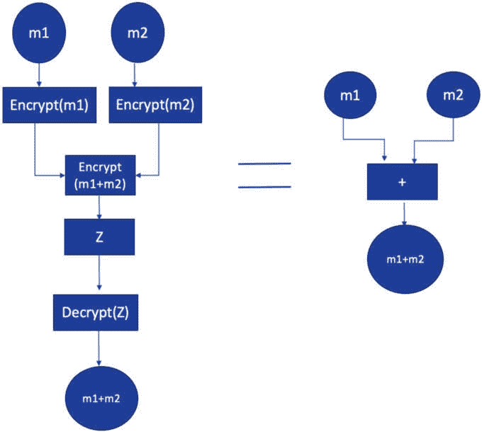
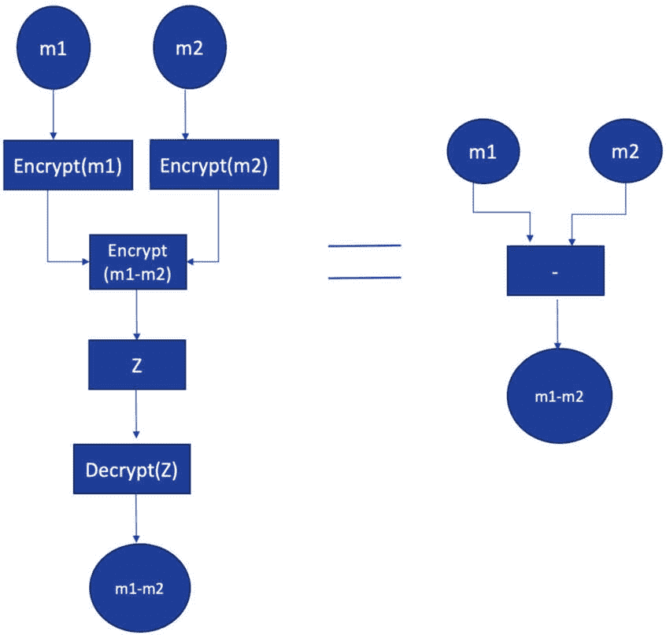
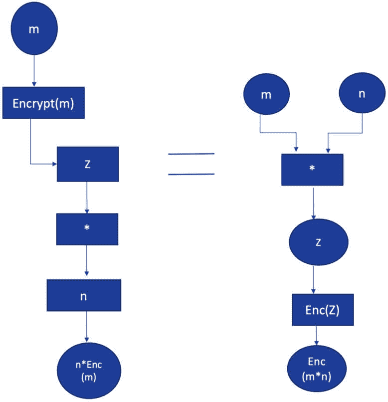
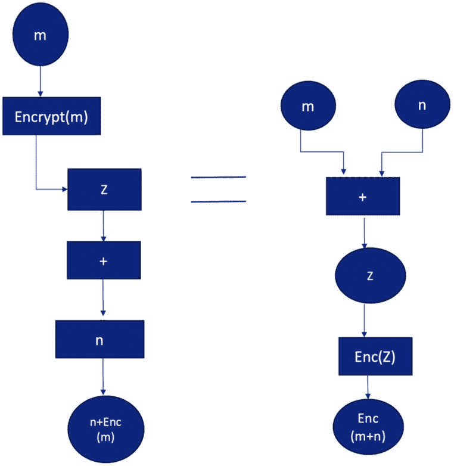
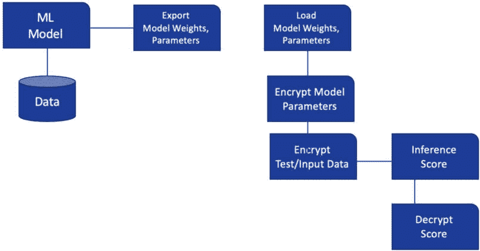
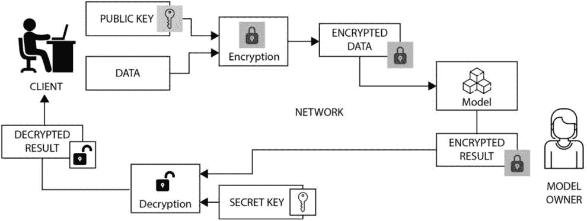
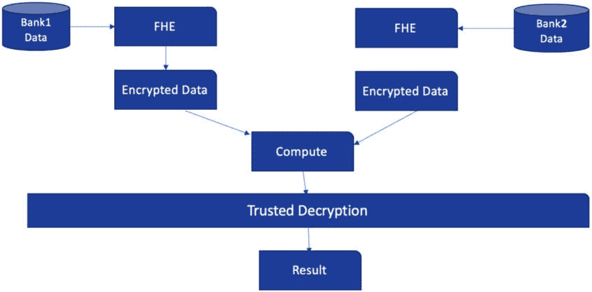

# 8

# 同态加密和安全多方计算

同态加密是一种密码学技术，它允许在加密数据上执行计算，而无需解密它。它有可能彻底改变数据隐私和安全，使得在不泄露数据本身的情况下安全地计算敏感数据。在本章中，你将了解同态加密和安全的多方计算。

本章我们将涵盖以下主要内容：

+   加密、匿名化和去标识化

+   同态加密及其背后的数学

    +   用于同态加密和 Paillier 方案的开放源代码 Python 框架

    +   使用同态加密（HE）进行机器学习

    +   联邦学习与**部分同态**加密**PHE**

    +   同态加密的限制

+   **安全多方计算**（**SMC**）及其用例

+   使用**私有集交互**（**PSI**）SMC 技术的一个用例实现

+   零知识证明的高级概述

# 加密、匿名化和去标识化

加密、匿名化和去标识化都是用于保护敏感数据的技巧，但它们在方法和限制上有所不同。

**加密**

加密是将数据转换为只有有权访问解密密钥的授权方才能读取的形式的过程。加密的目的是确保数据的机密性和完整性。加密数据对于拥有适当解密密钥的人来说仍然是可读的，但对于没有密钥的拦截者来说则是不可理解的。加密被广泛用于保护传输中和静止状态下的敏感数据，如信用卡号、密码和个人可识别信息。

下面是一些简单的 Python 代码，用于实现基本的加密

*源代码*：Encryption_Example.ipynb

开发一个函数，使用基本的加密算法加密给定的文本。

```py
def simple_encryption(text, shift):
    """
    Encrypts the given text using the Caesar Cipher algorithm.
    """
    result = ""
# Loop through each character in the text
    for i in range(len(text)):
        char = text[i]
# If the character is a letter, shift its position in the alphabet
        if char.isalpha():
            if char.isupper():
                result += chr((ord(char) + shift - 65) % 26 + 65)
            else:
                result += chr((ord(char) + shift - 97) % 26 + 97)
        else:
            result += char
    return result
simple_encryption("Privacy Preserved Machine Learning",5)
```

上述代码的输出如下：

```py
'Uwnafhd Uwjxjwaji Rfhmnsj Qjfwsnsl'
```

这个函数接受两个参数：`text`，表示要加密的明文，以及`shift`，表示明文中的每个字母在字母表中应该移动的位置数。该函数返回加密后的文本。

例如，如果你调用 simple_encryption（“Privacy Preserved Machine Learning”，5），那么该函数将返回字符串“Uwnafhd Uwjxjwaji Rfhmnsj Qjfwsnsl”，这是“Privacy Preserved Machine Learning”加密后的版本，移动了 5 个位置。

### 加密算法

今天有许多流行的加密算法用于保护数据和通信。最常见的是以下几种：

+   **高级加密标准**（**AES**）：一种对称密钥加密算法，广泛用于保护传输中和静止状态下的数据

+   **Rivest-Shamir-Adleman**（**RSA**）：一种用于安全通信和数字签名的非对称密钥加密算法

+   **数据加密标准**（**DES**）：一种过去广泛使用的对称密钥加密算法，但现在被认为不够安全

+   **Blowfish**：一种对称密钥加密算法，专为高速和高效加密大量数据而设计

+   **Twofish**：一种对称密钥加密算法，是 Blowfish 的后继，旨在提供更高的安全性和灵活性

+   **ChaCha20**：一种对称密钥加密算法，由于其高安全性和性能而越来越受欢迎

+   **椭圆曲线密码学**（**ECC**）：一种非对称密钥加密算法，使用椭圆曲线而不是素数，从而实现更小的密钥大小和更快的性能

这些只是最受欢迎的加密算法中的一部分。还有很多其他的算法，随着计算能力和安全需求的不断演变，新的算法也在不断被开发。

### 使用 AES 加密的加密示例

*源代码*：Encryption_Example.ipynb

开发一个函数，使用 AES 加密算法加密给定的文本：

```py
from Crypto.Cipher import AES
from Crypto.Random import get_random_bytes
def aes_encrypt(key, plaintext):
# initialization vector to random bytes
    ini_vec = get_random_bytes(AES.block_size)
# Create the AES cipher object with the given key
    aes_ciper = AES.new(key, AES.MODE_CBC, ini_vec)
# Pad the plaintext to a multiple of the block size
    plaintext = pad_plain_text(plaintext, AES.block_size)
# Encrypt the plaintext using the AES cipher object
    ciphertext = aes_ciper.encrypt(plaintext)
    return ini_vec + ciphertext
def aes_decrypt(key, ciphertext):
    ini_vec = ciphertext[:AES.block_size]
    cipher = AES.new(key, AES.MODE_CBC, ini_vec)
    plaintext = cipher.decrypt(ciphertext[AES.block_size:])
    plaintext = unpad_decrypted_text(plaintext, AES.block_size)
    return plaintext.decode('utf-8')
def pad_plain_text(data, block_size):
    padding_length = block_size – (len(data) % block_size)
    padding = bytes([padding_length] * padding_length)
    return data + padding
def unpad_decrypted_text(data, block_size):
    padding_length = data[-1]
    if padding_length < 1 or padding_length > block_size:
        raise ValueError("Padding is not Valid ")
    padding = data[-padding_length:]
    if not all(padding[i] == padding_length for i in range(padding_length)):
        raise ValueError("Padding is not Valid ")
    return data[:-padding_length]
key = b'ThisIsASecretKey'
plaintext = b'Privacy Preserved Machine Learning'
ciphertext = aes_encrypt(key, plaintext)
print('Encrypted message:', ciphertext)
decrypted_plaintext = aes_decrypt(key, ciphertext)
print('Decrypted message:', decrypted_plaintext)
```

这产生了以下输出：

```py
Encrypted message: b'\xe3\x00\xe8\x10\xc6E\x0cn\x1bO,\x89-\x8d\xee\xb3\xc6\x1a\xbf\x95\\l\x0e\x8d\xb0\xaa\x93\xf4_$?h\x1a`O\xf4N\x89!4\xf7(\xd3\x8e\xde\xc7\xf7\xb8\x87\xea\n5W\x8e\xa5D\xec]\x80\xa8+\x92?\xa9'
Decrypted message: Privacy Preserved Machine Learning
```

在这个示例程序中，我们使用了 PyCrypto 库来实现 AES 加密，使用**密码块链接**（**CBC**）模式。

`aes_encrypt`函数接受 128 位密钥和明文消息作为输入，并返回加密的密文。`aes_decrypt`函数接受密钥和密文作为输入，并返回解密后的明文消息。我们使用了 PKCS7 填充方案来将明文填充到块大小的倍数，并在解密后移除填充。它为每次加密操作生成一个随机的初始化向量，以增加额外的安全层。

### 加密的局限性

加密并不提供匿名化或数据去标识化。加密数据可能包含可用于识别个人的敏感信息。加密仅保护数据在传输（数据在运动中）或存储（静止数据，即在持久存储中）时的安全，但它不控制谁有权访问它或解密后如何使用它。

## 数据匿名化

匿名化是从数据中移除可识别信息的过程，这样个人就无法被识别。匿名化的主要目的是在允许数据用于分析或研究用例的同时保护个人的隐私。

下面是一些用于数据匿名化的 Python 代码示例：

*源代码*：Example_Data_annomization.ipynb

```py
import hashlib
import random
# Example dataset
dataset = [
    {"name": "Alice", "age": 23, "email": "alice@example.com"},
    {"name": "Bob", "age": 32, "email": "bob@example.com"},
    {"name": "Gandhi", "age": 55, "email": "gandhi@example.com"},
]
# Create a random salt value for anonymization
salt = str(random.getrandbits(128))
# Loop through the dataset and anonymize each record
for record in dataset:
# Hash the name and email using the salt value name_hash = hashlib.sha256((record['name'] +salt).encode()).hexdigest() email_hash = hashlib.sha256((record['email'] + salt).encode()).hexdigest()
# Replace the original name and email with the hashed values
record['name'] = name_hash
record['email'] = email_hash
print(dataset)
```

这产生了以下输出：

```py
[{'name': 'e807ef3ca985de8ef481ddf8af4d3ac4c34089519cf225a7863306ced0a691fa', 'age': 23, 'email': '474f2b3dce2701b08651d64364ab5e83575e9bd8ff7e0e14d654afbdf19f6683'}, {'name': '36cbc209f7afaba2a3a4d8830c2b85b3813f467f4bf442bb439b3f112be00bd0', 'age': 32, 'email': '6a7b3de0488fc3a81436b5c70e943ca7139c93d1832430db2e6bac3f2c25cce5'}, {'name': '096aca9f2b7872c89b9c71ff1a649e7fe53fc7eb1a04354792ea58aaee3bbecf', 'age': 55, 'email': 'e15e4e48f0161e7a64b8ef604e6d9bd5d9d6f2da3c8d848268aeec0ff5da2ef8'}]
```

在前面的代码中，我们使用了 Python 的`hashlib`库，使用随机盐值对数据集中的每个记录的名称和电子邮件字段进行哈希处理。然后，将这些哈希值存储在原始值的位置。这种技术可以用来保护数据集中敏感信息的隐私。

单独的匿名化是否足以保护敏感数据？简而言之，不够，正如我们将在以下真实案例研究中看到的那样。

### 真实世界的案例研究（Netflix 用户数据匿名化）

我们的 Netflix 数据匿名化案例研究可以追溯到 2006 年，当时 Netflix 推出了 Netflix Prize，这是一项旨在提高公司推荐算法准确性的竞赛。

作为比赛的一部分，Netflix 发布了一个包含 50 万订阅者观看历史的数据集，其中已移除个人可识别信息。该数据集可供研究人员开发更好的算法。2009 年，研究人员发表了一篇论文，表明可以通过使用**互联网电影数据库**（**IMDb**）的信息来重新识别 Netflix 数据集中的个人。研究人员能够将匿名化的观看历史与用户在 IMDb 上发布的评论相匹配，从而以高精度重新识别个人。

在这一发现之后，Netflix 采取了措施改进其匿名化技术，但到了 2010 年，研究人员再次表明，在 Netflix 数据集中重新识别个人是可能的。这一次，研究人员使用了外部数据源，如社交网络和电影评分网站来重新识别个人。

针对这些隐私问题，Netflix 于 2010 年停止向研究人员发布匿名化数据集。相反，公司创建了一个内部研究项目，研究人员可以在不共享任何个人可识别信息的情况下分析 Netflix 数据。然而，到了 2020 年，德克萨斯大学奥斯汀分校和加州大学欧文分校的一组研究人员表明，他们可以通过分析观看历史并将其与公开可用的数据集相关联来重新识别 Netflix 用户。研究人员能够在 Netflix 数据集中没有个人可识别信息的情况下准确重新识别用户。

这些发现表明，仅靠匿名化技术不足以保护用户隐私，因为它们容易受到数据关联攻击的影响，我们在*第一章*中了解到这一点。

### 匿名化的局限性

匿名化可能无法完全消除重新识别的风险。如果数据足够充分，通过将匿名化数据与其他可用信息（如公共数据集）关联，可能识别出个人。

匿名化可能导致数据质量或准确性的损失，因为在过程中可能会删除或掩盖某些数据元素。

## 去标识化

去标识化是去除或掩盖数据中的可识别信息的过程，以便无法用于识别个人。去标识化的目的是在允许数据用于研究、分析或其他应用的同时保护个人隐私。去标识化数据可用于医疗保健研究、市场营销分析、金融用例、物联网用例和其他需要敏感数据的用例。

### 去标识化算法

单向哈希算法可用于对数据进行去标识化处理。单向哈希算法，也称为加密哈希函数，是数学函数，它接受任何长度的输入消息并生成一个固定大小的输出，这被称为哈希或信息摘要。单向哈希算法的关键特性是它们被设计成从哈希值中逆向工程原始输入消息在计算上是不可行的。

有许多不同的哈希算法，并且新的算法正在不断被开发。

以下是一些最广泛使用的哈希算法：

+   **信息摘要 5** (**MD5**): 这是一个广泛使用的哈希算法，它产生一个 128 位的哈希值。由于设计中的漏洞，现在被认为是不安全的。

+   **安全哈希算法 1** (**SHA-1**): 这是另一个广泛使用的哈希算法，它产生一个 160 位的哈希值。现在它被认为是不安全的。

+   **安全哈希算法 2** (**SHA-2**): 这是一个包括 SHA-224、SHA-256、SHA-384 和 SHA-512 的哈希算法系列。这些算法分别产生 224 位、256 位、384 位和 512 位的哈希值。

+   **安全哈希算法 3** (**SHA-3**): 这是一个包括 SHA3-224、SHA3-256、SHA3-384 和 SHA3-512 的哈希算法系列。这些算法被设计为 SHA-2 的替代品，并分别产生 224 位、256 位、384 位和 512 位的哈希值。

+   **BLAKE2**: 这是一个包括 BLAKE2b 和 BLAKE2s 的哈希算法系列。这些算法被设计得比 SHA-3 更快，同时仍然提供强大的安全性。

+   **RACE 完整性原语评估信息摘要** (**RIPEMD**): 这是一个包括 RIPEMD-128、RIPEMD-160、RIPEMD-256 和 RIPEMD-320 的哈希算法系列。这些算法被设计为 MD4 和 MD5 算法的替代品，并分别产生 128 位、160 位、256 位和 320 位的哈希值。

+   **Whirlpool**: 这是一个产生 512 位哈希值的哈希算法。它被设计为 SHA-2 算法系列的替代品。

这些是可用的哈希算法的一些示例。选择使用哪种算法将取决于具体的应用和所需的在安全性、速度和其他因素之间的平衡。

### 用于去标识化数据的示例 Python 代码

如前所述，去标识化是删除或屏蔽数据中的可识别信息的过程，以便无法用它来识别原始数据。在下面的代码中，我们将使用 SHA256 哈希算法对给定的数据（在这种情况下是一个字符串）进行去标识化。

*源代码:* *De-Identify_Exmple.ipynb*

```py
import hashlib
# Define a function to hash a given string using SHA256 Algorithm
def hash_string(s):
    return hashlib.sha256(s.encode()).hexdigest()
# Define a function to de-identify a given input data
def deidentify_data(data):
# Remove leading/trailing whitespace and convert to lowercase
    data = data.strip().lower()
# Hash the name using SHA-256
    hashed_data = hash_string(name)
# Return the hashed data
    return hashed_data
# input
person_name = "Sundar P"
hashed_name = deidentify_data(person_name)
print(hashed_name)
```

这将产生以下输出：

```py
"6cea57c2fb6cbc2a40411135005760f241fffc3e5e67ab99882726431037f908""
```

在此示例中，使用 `hashlib` 库计算给定输入字符串的 SHA-256 哈希。我们定义了一个 `deidentify_data` 函数，该函数接受数据作为输入，删除任何前导/尾随空白，将数据转换为小写，然后使用 `hash_string` 函数对其进行哈希处理。

这确保了相同的输入名称将始终产生相同的输出哈希。请注意，由于单向哈希是一个不可逆的过程，因此无法从哈希值中检索原始名称。

Python 中的 `hashlib` 库提供了一系列哈希算法。`hashlib` 库中可用的方法如下：

+   **hashlib.md5()**: 此方法返回一个 MD5 哈希对象

+   **hashlib.sha1()**: 此方法返回一个 SHA-1 哈希对象

+   **hashlib.sha224()**: 此方法返回一个 SHA-224 哈希对象

+   **hashlib.sha256()**: 此方法返回一个 SHA-256 哈希对象

+   **hashlib.sha384()**: 此方法返回一个 SHA-384 哈希对象

+   **hashlib.sha512()**: 此方法返回一个 SHA-512 哈希对象

+   **hashlib.blake2s()**: 此方法返回一个 BLAKE2s 哈希对象

+   **hashlib.blake2b()**: 此方法返回一个 BLAKE2b 哈希对象

+   **hashlib.sha3_224()**: 此方法返回一个 SHA3-224 哈希对象

+   **hashlib.sha3_256()**: 此方法返回一个 SHA3-256 哈希对象

+   **hashlib.sha3_384()**: 此方法返回一个 SHA3-384 哈希对象

+   **hashlib.sha3_512()**: 此方法返回一个 SHA3-512 哈希对象

去标识化的目的是使个人信息难以或无法识别个人。

### 去标识化的局限性

去标识化可能无法完全消除重新识别的风险。如果数据足够多，可能根据其他可用信息识别个人。去标识化可能导致数据质量或准确性下降，因为在处理过程中可能会删除或掩盖某些数据元素。

总结来说，每种技术都有其自身的优势和局限性，应根据具体的使用场景和需求选择合适的技术。加密是保护数据最安全的方式，但它不提供匿名性或去标识化。匿名化和去标识化都可以提供隐私保护，但在所有情况下可能并不足够，并可能导致数据质量或准确性问题。

# 探索同态加密

**同态加密**（**HE**）是一种加密技术，允许在不解密数据的情况下对加密数据进行计算。换句话说，可以对密文执行操作，生成新的密文，这些密文解密后即为对明文操作的结果。HE 有潜力彻底改变数据隐私和安全，允许在不泄露数据本身的情况下安全地计算敏感数据。HE 基于数学概念，如代数结构、数论和多项式理论。最常见的 HE 类型基于以下代数结构。

## 基于环

在密码学的背景下，代数结构指的是可以在集合的元素上以特定方式执行的一组数学运算。在环的情况下，元素集合在加法和乘法下是封闭的，并且操作满足某些性质，例如结合性、交换性和存在单位元素和逆元素。在 HE 的背景下，代数结构用于在加密数据上执行计算，而无需首先解密它。底层代数结构是一个环，它是一组元素，具有满足某些性质的两个二元运算（加法和乘法）。最广泛使用的基于环的 HE 是**Brakerski-Gentry-Vaikuntanathan**（**BGV**）方案。

BGV 方案是基于**学习错误**（**LWE**）问题的**全同态加密**（**FHE**）方案。

现在我们来考察该方案的数学描述。

### 密钥生成

为了生成公钥，执行以下步骤：

+   选择两个整数 n 和 q，其中 q 是素数。

+   生成一个具有整数项且在范围[-q/2, q/2]内的随机矩阵 A。

+   生成一个具有整数项且在范围[-q/2, q/2]内的随机向量。

+   计算向量 b = As + e，其中 e 是具有范围[-B/2, B/2]的随机向量，B 是某个整数。

+   将公钥设置为(A, b)。

为了生成私钥，选择一个具有整数项且在范围[-q/2, q/2]内的随机向量 s。

### 加密

要加密消息 m，执行以下步骤：

+   将消息 m 表示为具有模 q 整数系数的多项式 m(x)。

+   选择一个具有模 q 整数系数的随机多项式 r(x)。

+   计算 c = (A*r + b + m(x)*t)/q，其中 t 是控制密文噪声的缩放因子。

生成的密文 c 由一个矩阵和一个多项式组成。

### 解密

要解密密文 c，执行以下步骤：

+   计算新的 c’ = c*s/q。

+   将 c’的每个条目四舍五入到最接近的整数。

+   通过从 c’中减去 A*r 来恢复多项式 m(x)。

### 同态操作

BGV 方案允许在密文上执行同态加法和乘法。这些操作如下所示：

同态加法：为了将两个密文 c1 和 c2 相加，将它们对应的多项式在模 q 下相加，并逐元素地将它们的矩阵相加，模 q。

同态乘法：为了将两个密文 c1 和 c2 相乘，使用多项式乘法算法计算它们在模 q 下的乘积，并使用模 q 的矩阵乘法来乘以它们的矩阵。

### 自举

要执行多个同态乘法，BGV 方案使用一种称为引导（bootstrapping）的技术来“刷新”密文。引导过程包括解码密文，执行同态运算，然后使用一组新密钥重新加密结果。引导过程允许在保持方案安全性的同时，在密文中执行任意数量的同态运算。

## 基于格的

基于格的 HE 使用数学概念格，这是高维空间中的几何结构，允许高效地计算某些类型的问题。最广泛使用的基于格的 HE 是 FHE 方案。

## 基于椭圆曲线的

基于椭圆曲线的 HE 使用有限域上的椭圆曲线来创建加密方案。这种类型的 HE 相对较新，不如其他两种类型广泛使用。

# 探索 HE 背后的数学

HE 背后的数学基于两个主要概念：加密和同态。

## 加密

加密是将明文通过加密算法和密钥转换成密文的过程。密文可以在网络上传输或存储在数据库中，而不用担心未授权的访问。要解密密文并获取明文，接收者必须拥有用于加密数据的密钥。

## 同态

同态是一种数学属性，允许在密文中执行运算，生成一个新的密文，它是明文运算的结果。这意味着如果我们有两个明文 x 和 y，以及它们各自的密文 C(x)和 C(y)，我们可以在 C(x)和 C(y)上执行一个运算，以获得一个新的密文 C(x+y)，该密文可以解密以获得 x 和 y 运算的结果。

最常用的同态运算是加法和乘法，但也可以执行减法和除法等其他运算。同态运算的水平决定了在加密过程中引入的噪声变得过高，密文变得无法使用之前，可以在密文中执行多少操作。

HE 基于向密文中添加噪声的概念，使得没有密钥就无法恢复明文。噪声以这种方式添加，使得可以在不泄露明文的情况下对密文执行同态运算。添加的噪声量决定了加密的安全性级别。噪声也是同态运算水平受限的原因，因为过多的同态运算会导致噪声过高，使得密文无法使用。

# HE 的类型

HE 有三种实现类型。现在让我们来探讨它们。

## 完全同态加密（FHE）

FHE 是一种允许在加密数据上执行计算而不解密的加密类型。这意味着密文可以用作计算的输入，计算结果也将是密文，该密文可以被解密以获取计算结果。FHE 是一种强大的工具，可用于各种应用，如云计算、机器学习和安全外包。FHE 的主要挑战之一是其计算复杂性，这使得它在许多应用中不切实际。然而，FHE 的近期进展导致了更高效算法的发展，这些算法降低了 FHE 的计算开销。

Gentry 方案是早期且最著名的 FHE 方案之一，但它具有很高的计算成本。更近期的方案，如 CKKS 方案和 BFV 方案，提供了更高效的 FHE 算法，适用于实际应用。

## 部分同态加密（SHE）

SHE 是一种允许在加密数据上执行有限计算的加密类型。与 FHE 不同，SHE 不能在加密数据上执行任意计算。相反，它只能在加密数据上执行有限的操作集，例如加法和乘法。虽然 SHE 在功能上不如 FHE 强大，但它仍然在许多应用中很有用，例如安全投票、安全消息传递和安全数据库查询。SHE 的计算复杂度低于 FHE，这使得它在某些应用中更加实用。

## 部分同态加密（PHE）

PHE 是一种允许对加密数据进行计算的加密类型，但仅限于一种操作，要么是加法要么是乘法。PHE 在功能上不如 FHE 和 SHE 强大，但在某些应用中仍然有用，例如安全密钥生成、安全函数评估和安全标量积计算。PHE 的计算复杂度低于 FHE 和 SHE，这使得它在某些应用中更加实用。然而，其有限的功能意味着它不如 FHE 和 SHE 灵活，并且不能用于那么多的应用。

FHE、SHE 和 PHE 是三种相关的加密方案，提供了不同层次的功能和计算复杂性。FHE 功能最强大，但计算复杂度也最高，而 PHE 功能最弱，但计算复杂度也最低。SHE 在功能和计算复杂性方面介于 FHE 和 PHE 之间。

## Paillier 方案

Paillier 方案是一种用于数据加密和解密的公钥密码系统。它基于数学假设，即**决策复合剩余性假设**（**DCRA**），这是一个计算难题。该方案以它的创造者 Pascal Paillier 的名字命名，他在 1999 年引入了它。

Paillier 方案是一种非对称加密算法，这意味着它使用两个不同的密钥：一个公钥用于加密，一个私钥用于解密。该方案被设计为概率性的，这意味着对给定明文的每次加密都会产生不同的密文。该方案也是同态的，这意味着它支持对加密数据执行某些类型的操作。

### 密钥生成

要使用 Paillier 方案，用户首先生成一个公钥和一个相应的私钥。公钥由两个大素数 p 和 q 组成，这些数是保密的。然后，用户计算 n = p * q 和 lambda = LCM(p - 1, q - 1)，其中 LCM 是最小公倍数函数。lambda 的值用于生成私钥。

### 加密

要加密消息，发送者使用接收者的公钥。明文消息表示为一个整数 m，其中 0 <= m < n。然后，发送者选择一个随机数 r，其中 0 <= r < n，并计算 c = g^m * r^n mod n²，其中 g 是 n² 模下的随机生成器。然后，将密文 c 发送给接收者。

### 解密

要解密密文，接收者使用他们的私钥。接收者首先计算以下值

**mu = (L(g^lambda mod n²)^-1 mod n)^(lambda^-1** **mod n)**

其中

**L(x) = (x - 1) / n**

使用 mu 值来计算明文消息 m，如下所示：

**m = L(c^lambda mod n²) * mu** **mod n**

然后，接收者可以从 m 中恢复原始消息。

### 同态属性

Paillier 方案支持两种同态属性：加法和乘法。

加法属性允许接收者对加密数据进行加法操作。给定两个对应于明文消息 m1 和 m2 的密文 c1 和 c2，接收者可以通过将 c1 * c2 模 n² 来计算一个新的密文 c3，该密文对应于 m1 和 m2 的和。

乘法属性允许接收者对加密数据进行乘法操作。给定一个对应于明文消息 m 的密文 c，接收者可以通过将 c 提升到 k 次幂并取模 n² 来计算一个新的密文 c'，该密文对应于 m 和常数 k 的乘积。

### 安全性

Paillier 方案也抵抗已知的明文攻击和选择明文攻击。该方案被用于各种应用中，包括电子投票、隐私保护数据挖掘和安全的多方计算。

在下一节中，我们将介绍用于实现 HE 的 Python 框架。我们将详细实现一些示例，以便更好地理解同态操作。

## Pyfhel

Pyfhel 是一个用于 FHE 的 Python 库。它提供了一个易于使用的接口，用于在加密数据上执行 FHE 操作。

URL: [`pyfhel.readthedocs.io/en/latest/`](https://pyfhel.readthedocs.io/en/latest/)

## SEAL Python

SEAL Python 是一个用于 **Simple Encrypted Arithmetic Library** (**SEAL**) C++ 库的 Python 封装。SEAL Python 提供了一个高级接口，用于使用 Brakerski/Fan-Vercauteren (BFV) 和 Cheon-Kim-Kim-Song (CKKS) 方案在数据上执行同态加密和解密操作。

URL: [`github.com/Huelse/SEAL-Python`](https://github.com/Huelse/SEAL-Python)

## TenSEAL

TenSEAL 是一个在 *n* 张张量上执行同态加密的 Python 库，基于 Microsoft SEAL 并使用 CKKS 方案。它提供了一个易于使用的接口，用于在加密数据上执行 FHE 操作，并支持批处理和批处理旋转。

TenSEAL 提供的主要功能如下：

+   使用 BFV 对整数向量进行加密/解密

+   使用 CKKS 对实数向量进行加密/解密

+   加密-加密向量和加密-明文向量逐元素加法、减法和乘法

+   点积和向量-矩阵乘法

URL: [`github.com/OpenMined/TenSEAL`](https://github.com/OpenMined/TenSEAL)

## phe

phe 是一个使用 Paillier 方案进行 **部分同态加密** (**PHE**) 的 Python 库。它提供了一个 API，用于在加密数据上执行 PHE 操作。

它是一个简单易用的库。它只支持四个操作中的三个（加法、减法和标量乘法）在 HE 上。

URL: [`pypi.org/project/phe/`](https://pypi.org/project/phe/)

Paillier 密码系统的同态属性工作如下。

加密的数字可以相加：

Enc(m1)+Enc(m2)≡Enc(m1+m2)



图 8.1 – 同态加法

加密的数字可以相互减去：

Enc(m1)-Enc(m2)≡Enc(m1-m2)



图 8.2 – 同态减法

加密的数字可以乘以一个非加密标量：

n⋅Enc(m) ≡ Enc(n*m)



图 8.3 – 同态加密的数字乘以非加密标量

加密的数字可以加到非加密标量上：

n+Enc(m) ≡ Enc(n+m)



图 8.4 – 同态加密的数字加到非加密标量上

# 实现 HE

要实现 HE，从之前概述的库中选择一个合适的 HE 库。确保你的选择基于你的特定用例，然后执行以下步骤：

1.  生成加密方案所需的公钥和私钥。

1.  将需要加密的明文数据转换为加密方案所需的合适格式，例如多项式。

1.  使用在 *步骤 2* 中生成的公钥加密明文数据。

1.  在密文数据上执行同态操作，而不进行解密。

1.  使用在 *步骤 2* 中生成的私钥解密生成的密文数据，以获得对明文数据进行同态运算的结果。

实现 HE 可能很复杂，需要密码学和数学方面的专业知识。确保实现既安全又高效很重要，因为 HE 可能计算密集。

## 实现 PHE

我们将使用开源的 `phe` Python 库实现 Paillier PHE 的一个示例。

首先，我们按照以下方式安装 `phe` 库：

```py
pip3 install phe
```

然后我们执行以下步骤：

+   使用 **phe.paillier** 类中的 **generate_paillier_keypair** 方法生成公钥和私钥。

+   使用 **encrypt** 方法加密明文数据（本例中为 15）。

+   对密文数据进行同态运算：

    +   ciphertext1 = ciphertext * 3 // 加密数字乘以一个标量

    +   ciphertext2 = ciphertext + ciphertext1 // 两个加密数字相加

    +   ciphertext3 = ciphertext1 + 250 // 将标量加到一个加密数字上

    +   ciphertext4 = ciphertext3 - ciphertext2

+   最后，使用 **decrypt** 方法解密生成的密文数据，并打印解密结果。

*源代码*：FHE-Example.ipynb

```py
import phe as paillier
pubkey, privkey = paillier.generate_paillier_keypair(n_length=1024)
print("public key",pubkey)
print("private key", privkey)
public key <PaillierPublicKey 18dced683d>
private key <PaillierPrivateKey for <PaillierPublicKey 18dced683d>>
plaintext = 15
ciphertext = pubkey.encrypt(plaintext)
# Perform homomorphic operations on the ciphertext data
ciphertext1 = ciphertext * 3
ciphertext2 = ciphertext + ciphertext1
ciphertext3 = ciphertext1 + 250
ciphertext4 = ciphertext3 - ciphertext2
# Decrypt the resulting ciphertext data
decrypted1 = privkey.decrypt(ciphertext1)
decrypted2 = privkey.decrypt(ciphertext2)
decrypted3 = privkey.decrypt(ciphertext3)
decrypted4 = privkey.decrypt(ciphertext4)
# Print the decrypted results
print("ciphertext1 decrypted: ", decrypted1)
print("ciphertext2 decrypted: ", decrypted2)
print("ciphertext3 decrypted: ", decrypted3)
print("ciphertext4 decrypted: ", decrypted4)
ciphertext1 decrypted:  45
ciphertext2 decrypted:  60
ciphertext3 decrypted:  295
ciphertext3 decrypted:  235
ciphertext1 : <phe.paillier.EncryptedNumber object at 0x7fd51856afa0>
ciphertext2 : <phe.paillier.EncryptedNumber object at 0x7fd5185c3580>
ciphertext3 : <phe.paillier.EncryptedNumber object at 0x7fd51856ac70>
ciphertext4 : <phe.paillier.EncryptedNumber object at 0x7fd5185c3460>
```

用一个加密数字乘以另一个加密数字怎么样？

以下操作与 PHE 是否兼容？

Enc(m1) * Enc(m2)≡Enc(m1 * m2)

让我们试试这个，看看结果如何：

```py
m1=15
m2=20
pubkey.encrypt(m1) * pubkey.encrypt(m2)
File ~/Library/Python/3.8/lib/python/site-packages/phe/paillier.py:508, in EncryptedNumber.__mul__(self, other)
    506 """Multiply by an int, float, or EncodedNumber."""
    507 if isinstance(other, EncryptedNumber):
--> 508 raise NotImplementedError('Good luck with that...')
    510 if isinstance(other, EncodedNumber):
    511     encoding = other
NotImplementedError: Good luck with that...
```

它抛出 *NotImplementedError*，这基本上意味着 phe 不支持这个（将一个加密数字与另一个加密数字相乘）HE 属性。

当你的需求需要开发涉及张量、矩阵、数组以及所有同态运算的应用程序时，TenSEAL 是最佳框架。

## 使用 TenSEAL 库实现 HE

我们将使用开源的 TenSEAL Python 库实现 HE 的一个示例。

首先，我们按照以下方式安装 TenSEAL 库：

```py
pip3 install tenseal
```

*源代码*：TenSeal_Example.ipynb

按照以下方式开发示例应用程序。

```py
import tenseal as ts
# Step 1: Create context
context = ts.context(
              ts.SCHEME_TYPE.CKKS,
              poly_modulus_degree=8192,
              coeff_mod_bit_sizes=[60, 40, 40, 60]
        )
context.generate_galois_keys()
context.global_scale = 2**40
# Step 2: Create and encrypt data
data1 = [1.0, 2.0, 3.0, 4.0]
data2 = [5.0, 6.0, 7.0, 8.0]
encrypted_data1 = ts.ckks_vector(context, data1)
encrypted_data2 = ts.ckks_vector(context, data2)
# Step 3: Perform operations on encrypted data
encrypted_sum = encrypted_data1 + encrypted_data2
encrypted_product = encrypted_data1 * encrypted_data2
encrypted_dot_product = encrypted_data1.dot(encrypted_data2)
matrix_a = [[73],[69],[87],[45],]
mat_product = encrypted_data1.matmul(matrix_a)
# Step 4: Decrypt result
sum_result = encrypted_sum.decrypt()
product_result = encrypted_product.decrypt()
dot_product_result = encrypted_dot_product.decrypt()
mat_result = mat_product.decrypt()
print("Sum: ", sum_result)
print("Product: ", product_result)
print("Dot product: ", dot_product_result)
print("Matrix Multiplication : ", mat_result)
Sum: [6.000000000650802, 8.000000001433328, 10.0000000008995, 12.000000000314097]
Product: [5.000000671234171, 12.000001615240716, 21.000002823083314, 32.000004292130704]
Dot product: [70.00000937472286]
Matrix Multiplication : [652.000087556169]
```

在前面的示例代码中，我们首先使用 CKKS 方案创建一个上下文，其多项式模数度为 8,192，四个系数模数位大小为 60、40、40 和 60。然后，我们创建两个 CKKS 向量并加密我们的数据。接下来，我们在加密数据上执行两个操作：加法和乘法。最后，我们解密这些操作的成果并打印出来。

此库还支持使用 BFV 方案创建上下文，以及以相同方式使用 BFV 方案进行同态运算。

这是一个简单的示例，在实践中，HE 可能计算密集，需要专用硬件或云资源。同时，确保实现的安全性也很重要，以防止在计算过程中加密数据泄露。

# HE 框架的比较

让我们回顾一下 Python 中一些最受欢迎的 HE 框架的比较。

## Pyfhel

Pyfhel 是一个基于 Python 的完全 HE 库，支持在加密整数和向量上执行操作。它建立在 HElib C++ 库之上，并为 Python 开发者提供了简化的接口。Pyfhel 具有良好的性能，可以高效地处理大整数和向量。然而，它目前还不支持浮点数的操作。

## TenSEAL

TenSEAL 是一个基于 Python 的 HE 库，支持 FHE 和 PHE。它使用 CKKS 和 BFV 加密方案，并提供加密浮点数和矩阵操作的 API。TenSEAL 设计得易于使用，与一些其他 HE 库相比，API 更简单。它在加密浮点数操作方面具有相对较高的性能。

## PALISADE

PALISADE 是一个具有 Python 绑定的 C++ HE 库。它支持 FHE 和 PHE，并提供包括 CKKS、BFV 和 GSW 在内的广泛加密方案。PALISADE 设计用于性能，可以高效地处理大明文和大密文。Python 绑定相对较新，API 相比其他基于 Python 的 HE 库可能更复杂。

## PySEAL

PySEAL 是一个基于 Python 的 HE 库，支持在加密整数和向量上执行 FHE 操作。它建立在 SEAL C++ 库之上，并为 Python 提供了简化的接口。PySEAL 在整数和向量操作方面具有良好的性能，可以处理大明文和大密文。然而，它目前还不支持浮点数的操作。

## TFHE

TFHE 是一个具有 Python 绑定的 C++ HE 库。它支持在加密整数和布尔值上执行 PHE 操作，并设计用于高性能。TFHE 可以高效地处理大密文，并且具有相对简单的 API。Python 绑定相对较新，文档可能有限。

下表提供了一个关于前面 HE 库之间比较的高级概述：

| 操作 | PySEAL | TenSEAL | Paillier | Pyfhel |
| --- | --- | --- | --- | --- |
| 加法 | 是 | 是 | 是 | 是 |
| 减法 | 是 | 是 | 是 | 否 |
| 乘法 | 是 | 是 | 否 | 是 |
| 除法 | 否 | 否 | 否 | 否 |
| 比较运算（<, >, <=, >=, 和 ==） | 否 | 否 | 否 | 否 |
| 支持向量操作（加法、点积等） | 是 | 是 | 否 | 否 |
| 矩阵操作 | 是 | 是 | 否 | 否 |
| 加密数与标量（非加密数）相加 | 是 | 是 | 是 | 是 |
| 加密数与标量（非加密数）相乘 | 是 | 是 | 是 | 是 |

表 8.1 – HE 框架的高级比较

每个 HE 框架都有其自身的优点和缺点，最佳选择将取决于您的具体用例和需求。Pyfhel 和 PySEAL 是用于整数和向量 FHE 操作的不错选择，而 TenSEAL 是用于浮点数和矩阵 FHE 操作的不错选择。PALISADE 提供了广泛的加密方案，并针对性能设计，而 TFHE 是用于整数和布尔值 PHE 操作的不错选择。

# 使用 HE 进行机器学习

HE 可用于**机器学习**（**ML**）模型，以加密训练数据、测试数据，甚至整个模型本身，以实现模型安全。

以下是一些实现使用 HE 的 ML 模型选项：

+   加密权重（模型参数）和截距，并利用它们来计算测试数据上模型的准确率。

+   加密测试数据，并使用加密模型和加密数据来找出准确率。

+   使用加密的训练数据构建模型，并计算明文模型以及加密训练数据模型的准确率。

+   加密训练数据，在加密数据上训练模型，然后运行推理并解密结果。

在本例中，我们将加密模型参数并执行以下操作：

+   使用欺诈检测模型示例：

    +   加载欺诈交易数据

    +   将数据分为训练集和测试集

    +   使用逻辑回归模型训练数据

    +   从模型中找出截距和系数（权重）

+   使用 Paillier PHE 库，执行以下操作：

    +   使用公钥对模型参数（即截距值和模型权重）进行 HE 操作

    +   使用加密的截距和加密模型权重找出预测：

        +   通过同态操作（加密权重乘以测试特征数据并添加加密数字）计算分数

        +   使用同态解密解密计算出的分数，并找出错误/准确率



图 8.5 – 使用 HE 加密模型参数

*来源* *代码: FHE_Logistic.ipynb*

以下代码实现了上述步骤。

```py
from sklearn.linear_model import LogisticRegression
from sklearn.model_selection import train_test_split
url="fraud_transactions.csv"
df_actual = pd.read_csv(url, sep=",")
df_actual.head()
df_transactions = df_actual[['CUSTOMER_ID','TERMINAL_ID','TX_AMOUNT','TX_FRAUD']]
df_transactions
from sklearn.model_selection import train_test_split
from sklearn.model_selection import StratifiedShuffleSplit
X = df_transactions.drop('TX_FRAUD', axis=1)
y = df_transactions['TX_FRAUD']
X_train, X_test, y_train, y_test = train_test_split(X, y, test_size=0.3, random_state=42)
X_train = X_train.values
X_test = X_test.values
y_train = y_train.values
y_test = y_test.values
from sklearn.model_selection import cross_val_score
logreg = LogisticRegression(random_state=0)
logreg.fit(X_train, y_train)
training_score = cross_val_score(logreg, X_train, y_train, cv=2)
print('Logistic Regression Cross Validation Score: ', round(training_score.mean() * 100, 2).astype(str) + '%')
import numpy as np
np.sum(logreg.predict(X_test) == y_test)/X_test.shape[0]
logreg.intercept_[0], logreg.coef_[0]
```

这将产生以下输出：

```py
(-1168.308115256604,
 array([-2.47724513e-05, 3.17749573e-06, 1.54748556e+01]))
### Encrypt the Weights and Bias ( intercept) using paillier encryption
import phe as paillier
pubkey, privkey = paillier.generate_paillier_keypair(n_length=1024)
coef = logreg.coef_[0, :]
encrypted_weights = [pubkey.encrypt(coef[i]) for i in range(coef.shape[0])]
encrypted_intercept =pubkey.encrypt(logreg.intercept_[0])
print(encrypted_weights)
[<phe.paillier.EncryptedNumber object at 0x7ff005a9c9d0>, <phe.paillier.EncryptedNumber object at 0x7fefe3b2c520>, <phe.paillier.EncryptedNumber object at 0x7ff010760cd0>]
print(encrypted_intercept)
<phe.paillier.EncryptedNumber at 0x7fefb812f100>
### calculate score using encrypted weights for the 100 sample in the tests data and calculate the accuracy
y=np.zeros(100)
for i in range(1,100):
    c1 = X_test[i][0]
    c2 = X_test[i][1]
    c3 = X_test[i][2]
    score = encrypted_intercept
    score += c1 * encrypted_weights[0] + c2 * encrypted_weights[1] + c3 * encrypted_weights[2]
    dscore = privkey.decrypt(score)
    y[i] = dscore
print(y[0],y_test[0])
error = np.mean(np.sign(y) != y_test[1:100])
print(error)
Output:
0.0 0
1.0
```

这样，ML 工程师能够在保持其 ML 模型安全性的同时，与他人共享使用 HE 生成的公钥以及加密的模型权重。

# 加密评估 ML 模型和推理

为了执行加密评估和推理，请遵循以下步骤：

+   使用公钥（即 HE 密钥）加密训练数据。

+   使用加密数据训练模型。

+   获取加密结果。

+   使用密钥（即私钥）解密结果。



图 8.6 – 加密评估 ML 模型和推理

# HE 的局限性

HE 是一种强大的密码学技术，允许在加密数据上执行计算，而无需解密。虽然 HE 有多个优点，但它也有一些限制，我们现在将探讨这些限制：

+   **性能**：HE 计算密集，可能运行缓慢，尤其是在处理大量数据时。与加密和解密相关的开销可能会显著影响系统的性能。

+   **功能有限**：HE 仍然是一个发展中的领域，当前的实现具有有限的功能。复杂的计算通常难以使用 HE 执行，并且并非所有类型的计算都可以使用当前的 HE 技术执行。

+   **密钥管理**：HE 需要管理大量的加密密钥，这可能具有挑战性，尤其是在分布式系统中。随着参与计算各方数量的增加，密钥管理问题变得更加复杂。

+   **安全假设**：HE 基于某些安全假设，如果这些假设被违反，系统的安全性可能会受到损害。例如，如果攻击者可以访问密钥或加密数据泄露，系统的安全性可能会受到损害。

+   **存储需求**：HE 可能导致大的密文，需要比明文更多的存储空间。在存储空间有限的情况下，这可能是一个挑战。

在考虑在系统中使用 HE（同态加密）时，需要考虑上述限制。虽然 HE 有潜力提供一种安全和隐私保护解决方案，但在将其用于现实世界系统之前，仔细评估其限制和权衡是至关重要的。

# 安全多方计算

**安全多方计算**（**SMC**）是一种密码学技术，它允许两个或多个各方在他们的私有数据上共同计算一个函数，而无需向彼此透露他们的数据。

SMC（安全多方计算）是隐私保护计算中的一个重要工具，在这种计算中，各方可能不信任彼此或中心权威机构，并且可能拥有他们不想与其他方共享的敏感数据。

在本节中，我们将了解 SMC 的基本原则、其应用以及用于 SMC 的一些技术。

## SMC 的基本原则

SMC 的基本原则是，每个方都有他们希望保密的私有数据，但他们希望对共同联合数据上的函数进行计算。SMC 通过将计算划分为更小、更不敏感的子计算，并在每个方的私有数据上本地执行这些子计算，使多个方能够安全地这样做。然后，各方相互沟通，仅揭示计算的最终输出。

SMC 确保没有任何一方能够了解其他各方数据的任何信息，除非是计算最终输出所必需的。在 SMC 中进行的计算设计得使得任何一方都无法通过分析计算过程中发送的消息来了解其他各方的数据。

SMC 的安全性依赖于诸如秘密共享、HE 和 oblivious transfer 等密码学技术。这些技术确保每个方只能看到输入数据的一小部分，并且输出是以一种方式计算的，使得任何一方都无法确定其他各方的输入数据。

## SMC 的应用

SMC 在各个领域都有多个应用，包括医疗保健、金融和数据隐私。现在我们将更详细地探讨这些应用：

+   **数据分析**：在许多情况下，数据分布在不同的各方之间，不可能或不需要将数据集中在一个位置。SMC 可以用来使各方能够在不向彼此泄露数据的情况下对其私有数据进行计算。

+   **ML**：SMC 可以用来使多个各方能够在他们的私有数据上联合训练 ML 模型，而无需相互共享他们的数据。这在数据隐私是关注点的情况下非常有用，例如在医疗保健或金融服务中。

+   **隐私保护** **认证**：SMC 可以用来使多个各方能够在不向彼此泄露身份的情况下进行认证。例如，一组用户可以使用 SMC 与服务提供商进行认证，而不向彼此泄露他们的身份。

+   **欺诈检测**：SMC 可以用来使不同的各方能够检测欺诈活动，而不泄露任何敏感信息。例如，多个银行可以使用 SMC 来计算它们的交易列表的交集，以检测欺诈交易，而不泄露任何客户数据。我们已经讨论了使用带有差分隐私的联邦学习，但同样的用例，即检测欺诈交易，也可以使用 SMC 来实现。

## SMC 使用的技巧

SMC 可以使用各种技巧进行，包括秘密共享、HE 和 oblivious transfer。现在让我们回顾这些技巧：

+   **秘密共享**：这是一种密码学技术，将秘密分成多个份额，每个份额分配给不同的方。只有当足够数量的份额结合在一起时，才能恢复秘密。在 SMC 中，秘密共享可以用来将输入数据分成多个份额，然后用于在每个方的数据上本地执行计算。

+   **HE**：这是一种允许在密文上执行计算而不需要解密的加密类型。在 SMC 中，HE 可以用来计算计算的中间值，而不泄露各方的数据。HE 计算成本高昂，因此不适合所有 SMC 应用。

+   ** oblivious transfer**：这是一种加密协议，其中发送者有多条消息，接收者选择其中一条消息，而不泄露其他消息。

## 实施 SMC – 高级步骤

以下是实现 SMC 所需步骤的高级概述：

1.  **定义计算**：实施 SMC 的第一步是定义需要在私有数据上执行的计算。这个计算应该被分成更小的子计算，每个子计算都可以在每个参与方的私有数据上本地执行。

1.  **安全通信**：参与 SMC 计算的各方需要通过安全通信协议（如 SSL 或 TLS）相互安全通信，以交换消息而不泄露他们的私有数据。

1.  **秘密共享**：输入数据需要分成份额，这些份额被分配给各方。每个参与方持有输入数据的一个份额，计算是在每个参与方的份额上本地执行的。秘密共享可以使用如 Shamir 秘密共享方案之类的密码学技术实现。

1.  **计算**：一旦输入数据在各方之间共享，就可以在每个参与方数据的份额上本地执行计算。计算的中间值需要使用 HE 进行加密，以防止任何一方了解其他方的数据。

1.  **揭示输出**：计算完成后，各方只向彼此揭示计算的最终输出。输出可以通过组合各方持有的输出份额来重建。

SMC 需要密码学、编程和网络安全的专长。这是一个复杂的过程，需要仔细设计和实施，以确保参与方的安全和隐私。

## 可以用于实现 SMC 的 Python 框架

以下是可以用于实现 SMC 的几个 Python 框架：

+   **PySyft** 是一个用于 SMC 和联邦学习的开源框架。它提供了用于安全多方计算、差分隐私和同态加密的工具。它建立在 PyTorch 之上，提供了一个简单且易于使用的接口来实施 SMC。

+   **Obliv-C** 是一个用于在 C 和 Python 中实现 SMC 的语言和框架。它提供了一个高级编程接口来实施 SMC，以及用于构建自定义协议的低级原语。

+   **Charm** 是一个提供 SMC、HE 和其他密码学原语支持的 Python 库。它提供了一个高级编程接口来实施 SMC，以及用于构建自定义协议的低级原语。

+   **MPyC** 是一个用于 SMC 的 Python 库，它提供了一个高级编程接口来实施安全计算。它建立在 **asyncio** 库之上，该库提供了对异步编程的支持。

+   **SecureML** 是一个用于实现 SMC 和其他隐私保护机器学习技术的 Python 库。它提供了一个高级编程接口来实现 SMC，以及支持差分隐私和联邦学习等其他隐私保护技术。

## 实施私有集合交互（PSI）SMC – 案例研究

**私有集合交集**（**PSI**）是一种密码学技术，它允许两个或多个参与方在不泄露其集合中任何其他信息的情况下安全地计算其私有集合的交集。PSI 可用于各种金融科技应用，在这些应用中，需要在各方之间共享敏感的财务数据，同时保护隐私。

现在我们来分析一个关于在金融科技领域实施 PSI SMC 用于欺诈检测的案例研究。

**欺诈检测**：在金融科技行业，欺诈检测是一项关键任务，需要银行、金融机构和支付处理器之间共享信息以识别欺诈交易。然而，在这些实体之间共享客户数据可能会侵犯其客户的隐私。为了克服这个问题，PSI 可以用来实现不同实体之间安全的数据共享，而不泄露任何敏感信息。

例如，假设一家银行想要与另一家银行共享其可疑交易列表，而不透露交易或涉及的客户的详细信息。PSI 可以用于计算两家银行交易列表的交集。银行的交易列表将形成一个子集，另一家银行的交易列表将形成另一个子集。通过使用 PSI，两家银行可以安全地计算其交易列表的交集，而不透露任何关于其交易或客户的敏感信息。

要在此用例中实施 PSI SMC，可以使用 SMC 技术。SMC 确保参与方可以共同计算其数据集的交集，而不泄露关于其数据集的任何其他信息。计算可以使用诸如 **隐写传输**（**OT**）或 **乱码电路**（**GC**）等技术进行，以确保计算的隐私和安全。



图 8.7 – 使用共享密钥的保密多方计算示例

*源代码：PSI-SMC_Example.ipynb*

让我们实现一个简单的 SMC 示例，以了解步骤：

```py
import random
# Define two parties
Bank1_data = [0.1, 0.2, 0.3]
Bank2_data = [0.5, 0.6, 0.7]
# Define the computation
def compute(x, y):
# Multiply the input data element-wise
    z = [x[i] * y[i] for i in range(len(x))]
# Sum the result
    result = sum(z)
    return result
# Randomly generate private keys for the parties
Bank1_key = random.randint(0, 1000)
Bank2_key = random.randint(0, 1000)
# Bank1 encrypts their data using Bank1 private key
Bank1_encrypted_data = [x + Bank1_key for x in Bank1_data]
# Bank2 encrypts their data using Bank2 private key
Bank2_encrypted_data = [x + Bank2_key for x in Bank2_data]
# The parties send their encrypted data to each other
Bank1_received_data = Bank2_encrypted_data
Bank2_received_data = Bank1_encrypted_data
# The parties compute the multiplication of their data
Bank1_result = compute(Bank1_data, Bank2_received_data)
print(Bank1_result)
Bank2_result = compute(Bank2_data, Bank1_received_data)
print(Bank2_result)
# The parties add their private keys to the result
final_result = Bank1_result + Bank1_key + Bank2_result + Bank2_key
print("Result:", final_result)
output this program as follows :
31.34
1669.6999999999998
Result: 2680.04
```

# 零知识证明

**零知识证明**（**ZKPs**）是一种加密协议，允许一方（证明者）向另一方（验证者）证明他们知道特定信息，而不透露关于该知识的任何其他信息。零知识的概念最早由 Goldwasser、Micali 和 Rackoff 于 1985 年提出。从那时起，零知识协议在密码学中得到了广泛的应用，尤其是在保护隐私的协议中。

## 基本概念

零知识的概念基于交互式证明系统的理念。在交互式证明系统中，证明者通过向验证者发送一系列消息来试图说服验证者一个陈述是真实的。验证者检查每条消息，并接受或拒绝该陈述。在零知识证明中，证明者可以在不透露任何其他信息（除了他们知道该陈述是真实的事实之外）的情况下，说服验证者该陈述的真实性。ZKPs 背后的核心思想是展示证明者知道一些秘密信息，而不透露关于该信息的任何细节。

例如，想象一下，Alice 想要向 Bob 证明她知道一个秘密数字 x 的值，而不透露 x 本身的值。使用 ZKP，Alice 可以通过与 Bob 的互动来证明她知道 x 的值，使他确信她知道 x 的值，但不会了解到其他任何信息。

## ZKPs 的类型

ZPKs 主要有三种类型：

+   **零知识证明知识**（**ZKPK**）：在 ZKPK 中，证明者向验证者证明他们知道某个秘密，而不透露关于该秘密的任何信息。例如，证明你知道某个账户的密码，而不透露密码本身。

+   **零知识证明拥有**（**ZKPP**）：在零知识证明中，证明者向验证者证明他们拥有某个特定物品，而不透露任何关于该物品的信息。例如，证明你有有效的驾照，而不透露驾照上未打印的任何个人信息。

+   **零知识证明身份**（**ZKPI**）：在 ZKPI 中，证明者向验证者证明他们是之前已识别的同一人或实体，而不透露关于他们自己的任何其他信息。例如，证明你是之前注册过在线服务的同一人，而不透露任何其他个人信息。

## ZKPs 的应用

ZKPs 在密码学中有许多应用，包括以下内容：

+   **保护隐私的认证**：ZKPs 可以用来认证用户，而不透露他们的身份或任何其他个人信息。

+   **安全消息传递**：零知识证明可以用来确保两个当事人之间交换的消息的机密性和完整性，而不透露消息的内容。

+   **安全计算**：ZKPs 可以用来证明计算的正确性，而不泄露关于计算或输入的任何细节。

+   **加密货币**：ZKPs 被用于某些加密货币（如 Zcash）中，以确保交易的隐私和匿名性。

ZKPs 是密码学中的一个强大工具，它允许安全且私密的通信和计算。它们在金融、医疗保健和在线身份验证等众多领域都有广泛应用。随着技术的不断进步，ZKPs 的使用可能会变得更加普遍，有助于保护个人和组织双方的隐私和安全。

以下是一个示例 Python 程序，它实现了一个 ZKPK，用于简单场景，其中证明者想要向验证者证明他们知道一个秘密数字的值：

*源代码*：ZNP_Example.ipynb

```py
import random
# Set up the scenario
secret_number = 42 # The secret number the Prover wants to prove knowledge of
upper_bound = 100  # The upper bound of the possible values for the secret number
# Generate random values for the parameters used in the ZKPK
a = random.randint(1, upper_bound)  # Random value for the first parameter
b = random.randint(1, upper_bound)  # Random value for the second parameter
r = random.randint(1, upper_bound)  # Random value for the blinding factor
# Calculate the commitments
commitment_x = (a * secret_number + b) % upper_bound
commitment_r = (a * r + b) % upper_bound
# Send the commitments to the Verifier
print("Prover sends commitments: ", commitment_x, commitment_r)
# Verifier sends a random challenge value to the Prover
challenge = random.randint(0, 1)
# Prover responds with the value of the secret number or the blinding factor, depending on the challeng
if challenge == 0:
    response = secret_number
else:
    response = r
# Verifier checks the response against the commitments
if challenge == 0:
    if (a * response + b) % upper_bound == commitment_x:
        print("Prover has proven knowledge of the secret number!")
    else:
        print("Prover has failed to prove knowledge of the secret number.")
else:
    if (a * response + b) % upper_bound == commitment_r:
        print("Prover has proven knowledge of the blinding factor!")
    else:
        print("Prover has failed to prove knowledge of the blinding factor.")
Prover sends commitments: 39 94
Prover has proven knowledge of the blinding factor!
```

在前面的示例中，证明者基于秘密数字和一个随机盲化因子生成两个承诺，并将它们发送给验证者。验证者随后向证明者发送一个随机挑战值，证明者则根据挑战值回应秘密数字或盲化因子。验证者将回应与承诺进行核对，以确定证明者是否成功证明了其对秘密数字的了解。

以下是一些流行的用于 ZKPs 的 Python 框架：

+   **PyZPK**：一个用于构建和验证**零知识简洁非交互式知识论证**（zk-SNARKs）方案的 Python 库。它提供了一个简单直观的接口来构建 ZKPs，并设计得与 NumPy 和 SciPy 等其他 Python 库良好协作。

+   **Bulletproofs-Builder**：一个用于构建和验证 bulletproofs 的 Python 库。它提供了一个高级接口来创建范围证明和其他类型的 ZKPs。它设计得易于使用，并且可以轻松集成到其他 Python 库中。

+   **starkware-libs**：一组用于构建和验证可扩展透明知识论证（STARKs）的 Python 库。它包括构建 STARK 友好哈希函数、构建约束系统以及执行**快速傅里叶变换**（FFT）操作的库。

# 总结

总结来说，在本章中，我们详细介绍了加密、匿名化和去标识化技术，以及一些 Python 实现示例和它们局限性的讨论。我们学习了 HE 和安全的多方计算的基础和类型，并了解了它们如何帮助在处理 ML 模型时实现隐私（包括加密训练数据、测试数据、模型、模型参数和推理结果等应用）。

在下一章中，我们将学习更多关于机密计算的知识，了解为什么它必不可少，以及它是如何帮助我们抵御内存中数据所面临的隐私威胁的。我们还将学习如何通过可信执行环境来确保机器学习模型的安全。
