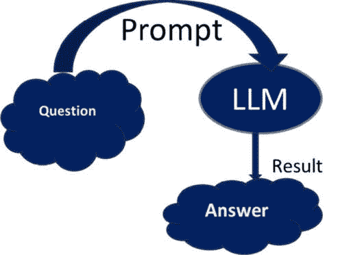
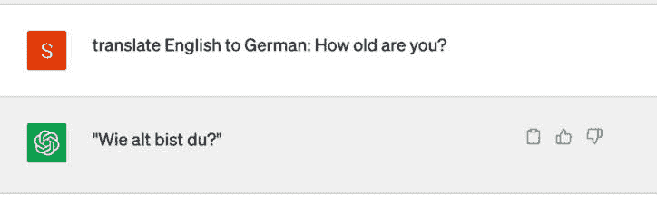
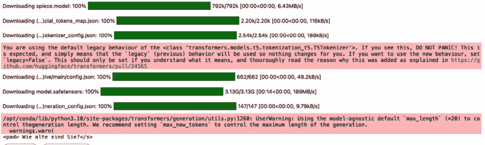
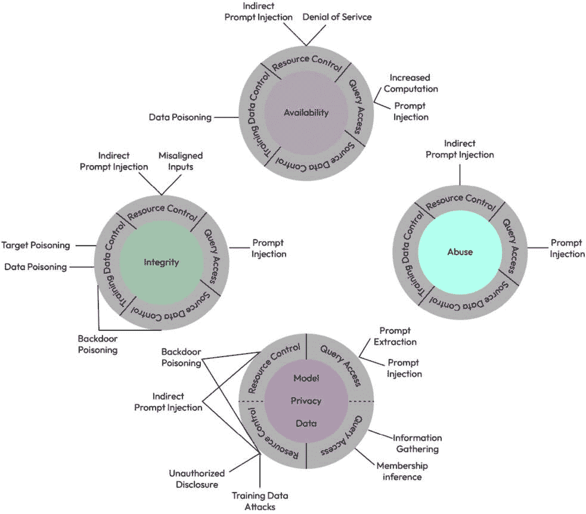
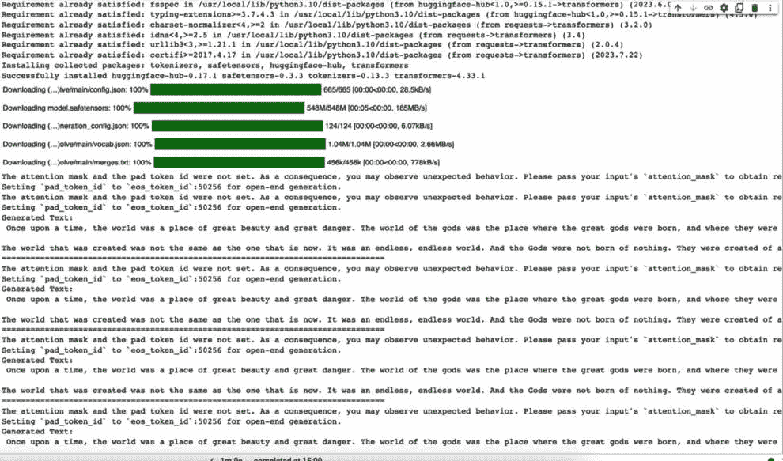
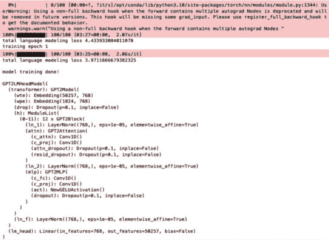

# 10

# 在大型语言模型中保护隐私

**大型语言模型**（**LLMs**）已成为人工智能（AI）领域的一项变革性技术，它使高级自然语言处理（NLP）任务和生成能力成为可能。这些模型，如 OpenAI 的 GPT-3.5 和 Meta 的 Llama 2，在生成类似人类的文本和展示对语言模式深入理解方面表现出卓越的技能。在本章中，你将从高层次上了解封闭源和开源 LLMs，以及这些 LLMs 的隐私问题，以及 LLMs 隐私保护技术的**最先进**（**SOTA**）研究。

我们将涵盖以下主要主题：

+   LLMs 中使用的关键概念/术语

    +   提示工程：使用 ChatGPT（封闭源 LLM）以及开源 LLM 进行句子翻译

    +   开源 LLM 和封闭源 LLM 的比较

+   AI 标准和攻击术语

    +   **国家标准与技术研究院**（**NIST**）的可信和负责任的 AI

    +   **开放式全球应用安全项目**（**OWASP**）的 Top 10 LLMs

+   对 LLMs 的隐私攻击

    +   LLMs 中隐私泄露的真实世界事件

    +   对生成模型进行的成员推理攻击

    +   从 LLMs 中提取训练数据

    +   提示注入攻击

+   LLMs 的隐私保护技术

    +   对机器学习（ML）和生成式 AI（GenAI）的文本攻击

    +   使用私有 transformer 进行差分隐私训练 LLMs

    +   隐私保护 LLMs 的 SOTA 研究

# LLMs 中使用的关键概念/术语

LLMs 是自然语言处理（NLP）的一个复杂领域，与之相关的术语有几个。

在 LLMs 的背景下使用的一些关键术语和概念如下：

+   **Transformer 架构**：大多数 LLMs 的基础架构，以其自注意力机制而闻名，这使得模型能够在句子中权衡不同单词的重要性。

+   **预训练**：LLM 在从互联网上的大量文本数据语料库中训练的初始阶段，以学习语言模式和上下文。这个预训练模型通常被称为“基础模型”。

+   **微调**：随后的阶段，预训练模型被调整以执行特定的 NLP 任务，如文本分类、翻译、摘要或问答。微调有助于模型在这些任务上专业化。

+   **参数**：这些是 LLM 的可训练组件，由数值表示。参数的数量是确定 LLM 大小和能力的关键因素。

+   **注意力机制**：变压器架构的核心组件，它使模型在处理输入序列时能够关注不同的部分，从而提高上下文理解。

+   **自注意力**: 一种特定的注意力机制，模型根据句子中不同单词之间的相关性为它们分配权重，使其能够捕捉单词之间的依赖关系。大多数 transformer 都是基于谷歌的研究论文《Attention Is All You Need》构建的（[`arxiv.org/abs/1706.03762`](https://arxiv.org/abs/1706.03762))。

+   **嵌入**: 词嵌入或 token 嵌入是单词或 token 在连续空间中的向量表示。这些嵌入捕捉了单词之间的语义关系。

+   **上下文嵌入**: 与静态词嵌入不同，这些嵌入根据句子的上下文而变化，使 LLM 能够理解不同上下文中单词的含义。位置嵌入和旋转位置嵌入属于上下文嵌入的范畴。

+   **分词**: 将文本分解成单个 token（单词或子词）以输入到模型中的过程。LLM 使用分词器来完成这项任务。

+   **解码**: 将模型生成的表示（通常是 logits 或 token ID）转换为人类可读文本的过程。解码是生成最终输出的必要步骤。

+   **迁移学习（TL）**: 将从一个任务或领域获得的知识转移到另一个任务或领域上的概念。LLM 通常从 TL 中受益，因为它们在微调特定任务之前已经在广泛的文本上进行了预训练。

+   **提示工程**: 设计输入提示或指令的过程，以引导 LLM 生成所需的输出。制作有效的提示对于控制模型的行为至关重要：



图 10.1 – 简单提示流程

+   **零样本学习**: 一种迁移学习类型，其中模型被要求执行它没有明确微调的任务。LLM 在一定程度上具有零样本学习能力。

+   **少样本学习**: 与零样本学习类似，但在微调新任务时，模型提供了有限数量的示例。

+   **思维链（CoT）**: CoT 提示是一种技术，指导 LLM 在处理难题时遵循推理过程。这是通过向模型展示一些逐步推理清晰展示的例子来实现的。

+   **思维树（ToT）**: ToT 提示将问题分解为一系列较小的步骤——或称为“思维”——这些步骤分别解决。这种方法并不限制模型一次性输出所有这些步骤。相反，每个思维都是独立生成或解决的，然后传递给下一个步骤以解决问题。

+   **思维图（GoT）**: 将 LLM 生成的数据概念化为一个图，其中每个节点代表一个信息单元，通常称为“LLM 思维”。这些节点之间的连接代表了不同思维单元之间的依赖关系或关联。

## 使用 ChatGPT（闭源 LLM）的提示示例

让我们用一个例子来试试 ChatGPT ([`chat.openai.com/`](https://chat.openai.com/))，并提问将一句话从英语翻译成德语。

在这种情况下，问题被称为提示，ChatGPT（LLM）的响应被称为完成/结果：



图 10.2 – 简单的提示请求和完成

## 使用开源 LLM 的提示示例

让我们尝试使用 Python 程序化地使用开源 LLM 的例子。

```py
Transformers library, specifically the T5Tokenizer and T5ForConditionalGeneration classes.
```

确保你已经安装了 Hugging Face Transformers 库，并且你有权限使用`"google/flan-t5-large"`模型，以便此代码能够成功运行。按照以下步骤实现此示例：

1.  使用以下命令安装库：

    ```py
    pip install transformers
    ```

1.  此外，如果你还没有下载模型，你需要使用**transformers.AutoModel.from_pretrained("google/flan-t5-large")**来下载模型。

1.  从 Transformers 库中导入必要的类，即**T5Tokenizer**和**T5ForConditionalGeneration**。

1.  使用预训练的**"google/flan-t5-large"**模型初始化 T5 分词器和模型。此模型是为翻译任务设计的。

1.  定义你想要从英语翻译成德语的输入文本，即**"translate English to German: How old are you?"**。

1.  使用分词器对输入文本进行分词，并将其转换为 PyTorch 张量。这一步为将文本输入到模型中做准备。

1.  通过将分词后的输入传递给模型的**generate**方法，使用 T5 模型生成翻译。翻译输出存储在**outputs**变量中。

1.  使用分词器的**decode**方法解码生成的输出，并打印翻译后的文本，这将是对输入文本的德语翻译。

*源代码：Ex_LLM_Opensource.ipynb*以下是一个示例的详细源代码：

```py
!pip install transformers
from transformers import T5Tokenizer,
T5ForConditionalGeneration
tokenizer = T5Tokenizer.from_pretrained("google/flan-t5-large")
model =
T5ForConditionalGeneration.from_pretrained("google/flan-t5-large")
input_text = "translate English to German: How old are you?"
input_ids = tokenizer(input_text, return_tensors="pt").input_ids
outputs = model.generate(input_ids)
print(tokenizer.decode(outputs[0]))
```



图 10.3 – T5 模型权重、分词器和配置下载

```py
input_text = "Who is the prime minister of India?"
input_ids = tokenizer(input_text, return_tensors="pt").input_ids
outputs = model.generate(input_ids)
print(tokenizer.decode(outputs[0]))
```

这将产生以下输出

```py
<pad> narendra modi</s>
```

## 开源 LLM 和闭源 LLM 的比较

开源和闭源 LLM 代表了 LLM 开发和可用性的两种不同方法。

### 开源 LLM

让我们看看一些开源 LLM 的属性：

+   **可访问性**：开源 LLM 是公开可访问的，它们的架构和参数可以被社区检查、修改和共享。这种透明度促进了合作和创新。

+   **社区贡献**：它们经常从来自不同研究者和开发者的贡献和改进中受益，从而实现快速改进并解决潜在的偏差。

+   **定制**：用户有自由对开源 LLM 进行微调和适应特定任务、语言或领域，使它们高度灵活和多功能。

+   **成本效益**：通常，开源大型语言模型是免费使用的，这对于研究人员、初创公司和开发者来说特别有利。

+   **硬件基础设施**：开源模型需要托管在 GPU 上进行推理，并且相关的成本需要自行承担。

+   **安全**：开源大型语言模型可能存在安全漏洞或底层软件版本问题，因此需要单独管理这些安全漏洞（通用漏洞和暴露，或 CVE）。

*示例*：Google 的 FLAN-T5、Meta 的 Llama 模型、GPT-3 以及 Hugging Face 的转换器都是开源的，并且广泛可访问。

### 闭源大型语言模型

现在，让我们将注意力转向闭源大型语言模型的属性：

+   **专有**：闭源大型语言模型由组织或公司开发和拥有，其架构和参数不公开披露。

+   **控制**：闭源大型语言模型的开发者保留对其模型、算法和**知识产权**（IP）的控制权，使他们能够保护其创新。

+   **有限的定制**：闭源大型语言模型的用户可能对微调或调整模型以满足特定需求的选择有限，因为源代码不可公开获取。

+   **成本**：闭源大型语言模型通常附带许可费或使用费，这可能对某些用户或组织是一个重要因素。

+   **硬件基础设施**：闭源模型由供应商在 GPU 上部署，并提供通过 REST 或 gRPC 访问的 API，因此基础设施成本由供应商承担（在 GPT-4 或 GPT-3.x 的情况下，OpenAI 和微软将拥有托管版本）。

+   **安全**：闭源大型语言模型可能在底层软件版本中存在安全漏洞，因此大型语言模型提供商将解决这些安全漏洞（CVE），而对于使用这些模型的用户来说，这是一个黑盒。

*示例*：商业语言模型如 GPT-3.5 或 GPT-4 模型以及科技公司使用的专有模型可能是闭源的。

开源和闭源大型语言模型之间的选择取决于预算、数据隐私担忧、定制需求以及所需的控制水平。

开源大型语言模型提供可访问性、协作和成本节约，但可能需要更多的技术专业知识进行定制。闭源大型语言模型提供知识产权保护，可能附带专业支持和功能，但代价是有限的透明度和可能的许可费。

组织和开发者在选择这两种方法之间应仔细考虑其具体需求。

# 人工智能标准和攻击术语

在下一节中，我们将探讨一些人工智能标准和攻击术语。

## NIST

*NIST 可信和负责任的人工智能*发布了一篇关于攻击和缓解中使用的分类和术语的论文。它涵盖了预测性人工智能（传统机器学习）和生成人工智能。



图 10.4 – 对生成式 AI 系统攻击的分类

*图片来源：“*对抗性机器学习：攻击和缓解的分类与术语*”论文，来自*NIST.* [`doi.org/10.6028/NIST.AI.100-2e2023`](https://doi.org/10.6028/NIST.AI.100-2e2023)

## OWASP Top 10 for LLM applications

*OWASP Top 10 for Large Language Model Applications* 项目旨在教育开发者、设计师、架构师、经理和组织了解在部署和管理 LLMs 时可能存在的安全风险。LLM 应用的 OWASP Top 10 如下。

+   *LLM01：* *提示注入*

+   *LLM02：不安全的* *输出处理*

+   *LLM03：训练* *数据中毒*

+   *LLM04：模型拒绝* *服务*

+   *LLM05：供应链漏洞*

+   *LLM06：敏感* *信息泄露*

+   *LLM07：不安全的* *插件设计*

+   *LLM08：过度的* *代理权*

+   *LLM09：过度依赖*

+   *LLM10：模型盗窃*

详细的安全漏洞、如何检测每个漏洞以及可能的解决方案已在[`owasp.org/www-project-top-10-for-large-language-model-applications/assets/PDF/OWASP-Top-10-for-LLMs-2023-v1_1.pdf`](https://owasp.org/www-project-top-10-for-large-language-model-applications/assets/PDF/OWASP-Top-10-for-LLMs-2023-v1_1.pdf)中记录。

在下一节中，我们将更详细地介绍 LLMs/GenAI 的隐私攻击。

# LLMs 的隐私攻击

近年来，LLMs 已经彻底改变了**自然语言理解**（NLU）和**自然语言生成**（NLG），为从聊天机器人、虚拟助手到内容推荐系统和语言翻译服务等各种应用提供了动力。然而，这些模型快速发展的同时也引发了关于隐私和安全的重大担忧。LLM 应用有可能通过其输出暴露敏感数据、专有算法或其他机密信息。这可能导致对敏感数据、知识产权、隐私侵犯和其他安全违规行为的未授权访问。随着 LLMs 在我们数字景观中的日益普及，迫切需要有效的策略来保护敏感信息和维护用户隐私。

如前几章所述，机器学习模型容易受到隐私攻击，生成式 AI 模型（LLMs）也不例外。

以下两篇最近的文章提供了关于企业中 GenAI 隐私问题的详细信息：

**Cyberhaven 的调查**：根据 Cyberhaven 的文章([`www.cyberhaven.com/blog/4-2-of-workers-have-pasted-company-data-into-ChatGPT/`](https://www.cyberhaven.com/blog/4-2-of-workers-have-pasted-company-data-into-ChatGPT/))，当员工将公司数据粘贴到聊天机器人（如 OpenAI 的 GPT-3）时，数据泄露的潜在风险。该公司对美国和英国的 2,000 名员工进行了调查，发现其中 4.2%的人将公司数据粘贴到了聊天机器人中。尽管像 GPT-3 这样的聊天机器人在对话结束后会忘记信息，但风险在于这些聊天机器人在对话过程中可能会记住并复制敏感信息。文章还提到，如果黑客在对话期间控制了聊天机器人，他们可以访问敏感数据。文章强调，公司需要制定明确的数据共享政策，并教育员工关于潜在风险。它还建议公司实施**数据丢失预防**（**DLP**）解决方案，以自动阻止敏感数据与聊天机器人共享。文章最后指出，尽管 AI 聊天机器人有许多好处，但公司需要意识到潜在的安全和隐私风险，并采取适当的措施来保护敏感数据。

**三星的知识产权泄露**：根据[`techcrunch.com/2023/05/02/samsung-bans-use-of-generative-ai-tools-like-ChatGPT-after-april-internal-data-leak/`](https://techcrunch.com/2023/05/02/samsung-bans-use-of-generative-ai-tools-like-ChatGPT-after-april-internal-data-leak/)上的文章，三星员工在用 ChatGPT 处理工作相关任务时无意中泄露了机密信息，突显了潜在的隐私和安全风险。三星半导体部门允许工程师使用 ChatGPT 进行源代码检查和其他任务。然而，韩国的《经济学人》报道了三起敏感数据意外暴露给 ChatGPT 的事件。

在一个事件中，一名员工将机密源代码复制到聊天中，以识别错误。另一名员工分享了代码并请求优化。第三名员工分享了会议录音，以便转录成演示文稿笔记。这些数据现在可以通过 ChatGPT 访问。

三星公司迅速作出反应，通过限制每个用户上传容量为 1,024 字节并启动对数据泄露负责人员的调查来应对 ChatGPT 的问题。此外，三星正在考虑开发内部 AI 聊天机器人，以加强未来的数据安全和隐私保护。然而，由于 ChatGPT 的数据政策，除非用户明确退出，否则将用于模型训练，因此三星不太可能恢复泄露的数据。ChatGPT 使用指南明确警告在对话中不要分享敏感信息。

这些事件说明了隐私专家长期以来一直警惕的现实世界场景，例如为了文本分析或摘要而共享机密法律或医疗文件，这些文件可能被用来改进模型。隐私专家警告，这可能会违反**通用数据保护条例**（**GDPR**）的合规性，从而导致监管后果。

## 对生成模型的成员身份推断攻击

我们在*第四章*中学习了关于机器学习模型上的成员身份推断攻击。生成 AI 模型也容易受到类似成员身份推断攻击的影响：

+   生成模型旨在估计数据集的基本分布，从而可以根据该分布创建逼真的样本。

+   当面对一个数据点时，攻击者会判断它是否被用于训练模型。

+   这些攻击基于对目标模型的白盒和黑盒访问，针对多个 SOTA 生成模型

让我们通过一个例子来了解。

此示例提供了一个使用 PyTorch 对生成模型进行基本成员身份推断攻击的例子。攻击旨在确定特定数据点是否是生成模型训练数据集的一部分。它包括以下组件：

使用**变分****自动编码器**（**VAE**）的样本生成 AI 模型：

+   **VAE**：使用一个简单的 VAE 作为生成模型。VAE 能够编码和解码二进制数据点。

+   **攻击模型**：攻击模型被实现为两层

+   **前馈神经网络**（**FNN**）：此模型经过训练，用于预测给定数据点是否是训练数据集的成员。

+   **合成数据**：为了演示目的，生成了合成二进制数据。在实际应用中，您应将其替换为您的实际数据集。

+   **训练过程**：VAE 和攻击模型独立训练。VAE 学习编码和解码数据，而攻击模型学习预测成员身份。

+   **成员身份推断攻击**：成员身份推断攻击函数接受一个目标数据点，使用 VAE 对其进行编码，然后使用攻击模型预测目标数据点是否是训练数据集的成员或非成员。

源代码组件：

+   **SampleGenModel 类**：定义 VAE 的架构

+   **攻击类**：定义攻击模型的架构

+   **数据生成**：生成用于训练和测试的合成二进制数据

+   **训练**：基于 VAE 的**SampleGenModel**类和攻击模型的训练循环

+   **成员身份推断攻击**：进行成员身份推断攻击的函数

+   **主要执行**：初始化 VAE 和攻击模型，并对目标数据点进行攻击

*源代码*：MemberShipInference_LLM.ipynb

```py
import torch
import torch.nn as nn
import torch.optim as optim
import numpy as np
# Define a simple  generative model
class SampleGenModel(nn.Module):
    def __init__(self, input_dim, hidden_dim, latent_dim):
        super(SampleGenModel, self).__init__()
        self.encoder = nn.Sequential(
            nn.Linear(input_dim, hidden_dim),
            nn.ReLU(),
            nn.Linear(hidden_dim, latent_dim * 2)
# Two times latent_dim for mean and log-variance
        )
        self.decoder = nn.Sequential(
            nn.Linear(latent_dim, hidden_dim),
            nn.ReLU(),
            nn.Linear(hidden_dim, input_dim),
            nn.Sigmoid()
        )
    def reparameterize(self, mu, log_var):
        std = torch.exp(0.5 * log_var)
        eps = torch.randn_like(std)
        return mu + eps * std
    def forward(self, x):
        x = self.encoder(x)
        mu, log_var = x[:, :latent_dim], x[:, latent_dim:]
        z = self.reparameterize(mu, log_var)
        reconstructed = self.decoder(z)
        return reconstructed, mu, log_var
# Generate synthetic data for demonstration
num_samples = 1000
data_dim = 20
data = torch.tensor(np.random.randint(2, size=(num_samples, data_dim)), dtype=torch.float32)
print(data)
# Initialize the SampleGenModel
input_dim = data_dim
hidden_dim = 64
latent_dim = 16
vae = SampleGenModel(input_dim, hidden_dim, latent_dim)
# Define an adversary model (a simple feedforward neural network)
class Adversary(nn.Module):
    def __init__(self, input_dim):
        super(Adversary, self).__init__()
        self.fc = nn.Sequential(
            nn.Linear(input_dim, 32),
            nn.ReLU(),
            nn.Linear(32, 1),
            nn.Sigmoid()
        )
    def forward(self, x):
        return self.fc(x)
# Train the SampleGenModel
# Train the adversary model
adversary = Adversary(latent_dim)
optimizer = optim.Adam(adversary.parameters(), lr=0.001)
criterion = nn.BCELoss()
# Prepare target data for the membership inference attack
target_data_point = torch.tensor(np.random.randint(2, size=data_dim), dtype=torch.float32)
# Membership inference attack function
def membership_inference_attack(vae, adversary, target_data_point):
# Encode the target data point using the VAE
    with torch.no_grad():
        target_data_point = target_data_point.unsqueeze(0)  # Add batch dimension
        reconstructed, mu, log_var = vae(target_data_point)
# Use the adversary to predict membership
    prediction = adversary(mu)
# If the prediction is close to 1, the target data point is likely a member
    if prediction.item() > 0.5:
        return "Member"
    else:
        return "Non-Member"
# Perform the membership inference attack
result = membership_inference_attack(vae, adversary, target_data_point)
# Output the result
print("Membership Inference Result:", result)
```

这导致以下输出：

```py
tensor([[0., 0., 1.,  ..., 1., 0., 1.],
        [0., 1., 1.,  ..., 0., 0., 1.],
        [1., 0., 1.,  ..., 1., 0., 1.],
        ...,
        [0., 0., 0.,  ..., 1., 0., 0.],
        [0., 1., 0.,  ..., 0., 1., 1.],
        [1., 0., 1.,  ..., 0., 0., 0.]])
Membership Inference Result: Member
```

成员身份推断攻击在实践中更为复杂，此代码仅作为基本演示。在部署生成模型时，请实施隐私和安全措施以防止此类攻击。我们将在下一节详细介绍如何以隐私保护的方式保护 GenAI 模型。

## 从生成模型中提取训练数据攻击

从 LLM（大型语言模型）中提取训练数据可能是一项具有挑战性的任务，因为训练数据通常无法直接从模型中获取。相反，LLM 是在互联网上的大量数据集上预训练的。如果我们有特定的 LLM 并希望提取与其相关的训练数据，我们可能需要访问用于预训练的原始数据源，这些数据源可能并非公开可用。

这里有一个 Python 代码片段示例，展示了我们如何从预训练的 Hugging Face Transformers 模型（如 GPT-2）中提取文本数据。请注意，此代码仅用于说明目的，不会检索实际训练数据，而是从模型中生成文本样本：

在此代码中，我们执行以下操作：

+   我们从 Hugging Face Transformers 库中加载了一个预训练的 GPT-2 模型和分词器。您可以根据需求选择其他模型。

+   我们定义一个提示，它作为生成文本的起点。您可以根据需要更改提示。

+   我们指定从模型中生成文本样本的数量（**num_samples**）。

+   在循环内部，我们使用分词器对提示进行编码，并使用模型生成文本序列。我们将输出解码以获得可读性强的文本。

请注意，生成的文本不是用于模型的实际训练数据，而是基于提供的提示由模型产生的合成文本。要访问用于训练 LLM 的实际训练数据，您需要访问原始数据源，这些数据源通常是大型且多样化的网络语料库。

*源代码*：`Training_Data_Extraction_Gen_AI.ipynb`

```py
!pip install torch
!pip install transformers
import torch
from transformers import GPT2LMHeadModel, GPT2Tokenizer
# Load a pretrained GPT-2 model and tokenizer
model_name = "gpt2"
# You can choose other pretrained models as well
model = GPT2LMHeadModel.from_pretrained(model_name)
tokenizer = GPT2Tokenizer.from_pretrained(model_name)
# Generate text samples from the model
prompt = "Once upon a time"
num_samples = 5
for _ in range(num_samples):
    input_ids = tokenizer.encode(prompt, return_tensors="pt")
    output = model.generate(input_ids, max_length=100, num_return_sequences=1, no_repeat_ngram_size=2)
    generated_text = tokenizer.decode(output[0], skip_special_tokens=True)
    print("Generated Text:\n", generated_text)
    print("="*80)
```



图 10.5 – GPT2 模型权重、分词器和配置下载

来自谷歌、苹果、OpenAI、哈佛大学、加州大学伯克利分校、东北大学和斯坦福大学的研究人员演示了对 GPT-2 的攻击，GPT-2 是一个基于公共互联网抓取数据的语言模型，他们能够从模型的训练数据中提取出数百个逐字逐句的文本序列。这些提取的示例包括（公开的）**个人可识别信息**或**PII**（姓名、电话号码和电子邮件地址）：[`arxiv.org/pdf/2012.07805.pdf`](https://arxiv.org/pdf/2012.07805.pdf)。

## 提示注入攻击

提示注入攻击，也称为数据或命令注入，是一种安全漏洞，当攻击者可以影响发送到数据处理系统（如 LLM）的提示或命令时发生。这些攻击可能允许攻击者操纵系统的行为或提取敏感或私人数据。

在 LLM 的背景下，提示注入攻击可能涉及攻击者提供一个精心设计的输入，以欺骗模型提供其训练过的信息，如果训练数据没有正确匿名化或清理，这可能包括敏感或机密信息。此外，攻击者可以注入恶意提示，使模型产生有害的输出，例如生成攻击性、诽谤性或非法内容。这可以用于针对性钓鱼、散布虚假信息、诽谤个人或实体，以及许多其他恶意目的。

LangChain ([`www.langchain.com/`](https://www.langchain.com/)) 是提供构建 LLM 应用程序工具的开源框架之一。2023 年 8 月，NVIDIA AI Red Team 在 LangChain 中发现了三个通过提示注入的漏洞；它们如下列出：

+   *CVE-2023-29374*: 在 LangChain 0.0.131 版本中，**LLMMathChain**链允许通过 Python **exec**方法执行任意代码的提示注入攻击。

+   *CVE-2023-32786*: 在 Langchain 0.0.155 版本中，提示注入允许攻击者强制服务从任意 URL 检索数据，本质上提供了**服务器端请求伪造**（**SSRF**）并可能将内容注入到下游任务中。

+   *CVE-2023-36189*: 在 LangChain v0.0.247 之前的 SQL 注入漏洞允许远程攻击者通过**SQLDatabaseChain**组件获取敏感信息。

目前，LLM 对这些攻击的受影响程度尚未完全了解。还值得一提的是，这些模型的设计目的是不直接回忆任何关于其训练数据的详细信息，包括它们训练过的文档或来源，并且它们通常没有访问或检索个人数据的能力，除非它们被明确编程这样做，或者它们是在包含敏感个人信息的训练数据上训练的。尽管如此，始终以强大的安全措施和对潜在风险的了解来使用 LLM 或任何 AI 系统，这一点至关重要。

*示例: PromptInjection.ipynb*

```py
class SimpleModel:
    def __init__(self):
        self.data={
            'Unique ID':'123-45-6789',
            'email':'example@example.com',
            'password':'mypassword'
        }
    def generate_text(self,prompt):
        return self.data.get(prompt,'Sorry,I don\'t have the data')
model=SimpleModel()
## Normal Request
print(model.generate_text('favorite_color'))
## Malicious request , simulating an attempt to a prompt injection attack
print(model.generate_text('Unique ID'))
```

`这导致以下输出。`

```py
Sorry,I don't have the data
123-45-6789
```

# LLM 的隐私保护技术

差分隐私是可用于 LLM 的隐私保护技术之一。

## 对 ML 模型和 LLM 的文本攻击

TextAttack 是一个 Python 框架，旨在在 NLP 领域进行对抗攻击、对抗训练和数据增强。这个多功能的工具简化了探索 NLP 模型鲁棒性的过程，提供了一个无缝、快速且用户友好的体验。此外，它在 NLP 模型训练、对抗训练和数据增强方面非常有价值。TextAttack 提供了针对典型 NLP 任务的各个组件，包括句子编码、语法检查和词替换，这些也可以独立使用。

如何安装 TextAttack 包的说明可以在以下 GitHub URL 找到：[`github.com/QData/TextAttack`](https://github.com/QData/TextAttack)。

使用以下方式通过`pip install`安装 TextAttack 框架：

```py
!pip install textattack
```

TextAttack 提供了各种配方来攻击 NLP 模块。以下示例利用各种库和组件，使用 TextAttack 框架对 NLP 模型进行对抗攻击。

下面是实现此示例的高级步骤：

1.  **导入库**: 导入必要的库，包括来自 Hugging Face 的**transformers**，PyTorch 的**torch**，**math**，**textattack**和**random**。

1.  **环境设置**: 将**CUDA_VISIBLE_DEVICES**环境变量设置为空字符串，实际上禁用了 GPU 的使用。它指定用于 PyTorch 操作的设备为**"cpu"**。

1.  **模型定义**: 定义一个名为**Model**的自定义 PyTorch 模型。该模型使用**Bidirectional Encoder Representations from Transformers**（**BERT**）进行 NLP 任务。模型从 Hugging Face 的 Transformers 库中加载预训练的**'bert-base-uncased'** BERT 模型。它包括一个 dropout 层和一个线性层用于分类。

1.  模型和分词的初始化：

    +   **模型初始化**: 创建**Model**类的一个实例，并将其移动到 CPU 上进行评估。使用**model.eval()**将模型设置为评估模式。

    +   **分词器初始化**: 初始化一个 BERT 分词器（**BertTokenizer**）用于对文本进行分词。

1.  **自定义模型包装器**: 定义一个名为**CustomWrapper**的自定义模型包装器类，该类包装了 PyTorch 模型。这个包装器允许模型与**TextAttack**库一起使用。

1.  使用 TextAttack 库，通过**TextFoolerJin2019**配方构建攻击。将**CustomWrapper**实例传递给攻击：

    +   **数据集**: 定义一个名为**dataset**的列表，包含文本样本和相应的标签。这些样本是执行对抗攻击的示例。

    +   **攻击执行**: 创建一个**Attacker**实例，指定攻击、数据集和其他攻击参数。最后，在攻击者上调用**attack_dataset()**方法对数据集进行对抗攻击。

总体而言，此代码设置了一个 PyTorch 模型，使用 TextAttack 库初始化攻击，然后将此攻击应用于文本样本数据集，以评估 NLP 模型的鲁棒性。

*源代码*：Privacy_attacks_LLMs.ipynb

```py
import pandas as pd
import os
from transformers import BertTokenizer, BertModel
from torch import nn
import torch
import math
import textattack
import random
#from train_bert import Model
os.environ["CUDA_VISIBLE_DEVICES"] = ""
#torch.cuda.is_available = lambda : False
textattack.shared.utils.device = "cpu"
class Model(torch.nn.Module):
    def __init__(self):
        super(Model, self).__init__()
        self.bert_model = BertModel.from_pretrained('bert-base-uncased')
        #self.bert_model.parallelize()
        self.drop = torch.nn.Dropout(p=0.1)
        self.l1 = torch.nn.Linear(768,2)
    def forward(self, text):
        tokenized_text = tokenizer(text , max_length=512, truncation=True, return_tensors='pt').input_ids#.to('cuda:3')
        text_rep = self.drop(self.bert_model(tokenized_text).pooler_output)
        out = self.l1(text_rep)
        print(out)
        return out.squeeze().tolist()
model = Model()
model.load_state_dict(torch.load('bert-base-uncased'))
model = model.to('cpu')
model.eval()
tokenizer = BertTokenizer.from_pretrained('bert-base-uncased')
class CustomWrapper(textattack.models.wrappers.ModelWrapper):
    def __init__(self, model):
        self.model = model#.to('cuda:3')
        self.model.eval()
    def __call__(self, list_of_texts):
        results = []
        self.model.requires_grad = False
        for text in list_of_texts:
          results.append(self.model(text))
        return results
class_model = CustomWrapper(model)
from textattack.datasets import Dataset
from textattack.attack_recipes.textfooler_jin_2019 import TextFoolerJin2019
from textattack import Attacker, AttackArgs
attack = TextFoolerJin2019.build(class_model)
attack#.cuda_()
dataset = [
    ["This film is a masterpiece! The story is incredibly moving, and the performances are outstanding. It's a true classic.", 1],
    ["The Godfather is a cinematic gem. The storytelling and performances are top-notch. A true classic in every sense.", 1],
    ["The Emoji Movie is a complete disappointment. The plot is weak, and it feels like one big advertisement. A waste of time.", 0],
    ["Mind-bending and visually stunning! Inception keeps you guessing from start to finish. Christopher Nolan at his best.", 1],
    ["Twilight is a guilty pleasure for some, but the acting and dialogue are cringe-worthy. Not a cinematic masterpiece.", 0],
    ["Forrest Gump is a heartwarming journey through history. Tom Hanks delivers an unforgettable performance.", 1],
    ["Explosions and CGI can't make up for the lackluster story in Transformers: The Last Knight. Disappointing.", 0],
    ["The Dark Knight is a dark and gripping superhero film. Heath Ledger's Joker is iconic. A must-see.", 1],
    ["Avatar is visually breathtaking, but the story is somewhat predictable. Still, it's a cinematic experience.", 1],
    ["The Room is so bad that it's almost good. The unintentional humor makes it a cult classic.", 1]
]
random.shuffle(dataset)
attacker = Attacker(attack, textattack.datasets.Dataset(dataset[:10]), AttackArgs(num_examples=10))
attacker.attack_dataset()
```

这导致以下输出：

```py
+-------------------------------+--------+
| Attack Results                |        |
+-------------------------------+--------+
| Number of successful attacks: | 1      |
| Number of failed attacks:     | 2      |
| Number of skipped attacks:    | 7      |
| Original accuracy:            | 30.0%  |
| Accuracy under attack:        | 20.0%  |
| Attack success rate:          | 33.33% |
| Average perturbed word %:     | 40.91% |
| Average num. words per input: | 17.3   |
| Avg num queries:              | 213.33 |
+-------------------------------+--------+
```

以类似的方式，GPT-2 模型也可以用于 NLP 攻击（对于完整的源代码，请参阅 GitHub 仓库 [`github.com/PacktPublishing/Privacy-Preserving-Machine-Learning/blob/main/Chapter10/Privacy_attacks_LLMs.ipynb`](https://github.com/PacktPublishing/Privacy-Preserving-Machine-Learning/blob/main/Chapter10/Privacy_attacks_LLMs.ipynb)）：

```py
class ClassificationModel(nn.Module):
    def __init__(self, model, pos_prompt, neg_prompt):
        super(ClassificationModel, self).__init__()
        self.tokenizer = GPT2Tokenizer.from_pretrained('gpt2')
        self.model = GPT2LMHeadModel.from_pretrained(model)
        self.model.eval()
        self.pos_prompt = pos_prompt
        self.neg_prompt = neg_prompt
    def score(self, prompt, sentence, model):
        tokenized_prompt = self.tokenizer.encode(prompt , max_length=1024, truncation=True, return_tensors='pt').to('cpu')
        tokenized_all = self.tokenizer.encode(prompt + ' ' + sentence, max_length=1024, truncation=True, return_tensors='pt').to('cpu')
        loss1=model(tokenized_all, labels=tokenized_all).loss
        loss2 = model(tokenized_prompt, labels=tokenized_prompt).loss*len(tokenized_prompt[0])/len(tokenized_all[0])
        loss = loss1-loss2
        return math.exp(loss)
    def forward(self, sentence):
        pos = 0
        neg = 0
        for prompt in self.pos_prompt:
             pos += self.score(prompt, sentence, self.model)#.cpu()
        for prompt in self.neg_prompt:
             neg += self.score(prompt, sentence, self.model)#.cpu()
        result = torch.FloatTensor([5000-neg/10.0e+52, 5000-pos/10.0e+52])
        result = torch.softmax(result, 0)
        if abs(result[0].item()+result[1].item()-1) >= 1e-6:
            print('detected something')
            result = torch.FloatTensor([1,0])
        return torch.softmax(result, 0)
model = ClassificationModel('gpt2', ['Positive:'], ['Negative:'])
class_model = CustomWrapper(model)
attacker = Attacker(attack, textattack.datasets.Dataset(dataset[:10]), AttackArgs(num_examples=10))
```

`attacker.attack_dataset()`

这导致以下输出：

```py
-------------------------------+-------+
| Attack Results                |       |
+-------------------------------+-------+
| Number of successful attacks: | 0     |
| Number of failed attacks:     | 3     |
| Number of skipped attacks:    | 7     |
| Original accuracy:            | 30.0% |
| Accuracy under attack:        | 30.0% |
| Attack success rate:          | 0.0%  |
| Average perturbed word %:     | nan%  |
| Average num. words per input: | 17.3  |
| Avg num queries:              | 250.0 |
+-------------------------------+-------+
```

## 私有变压器 – 使用差分隐私训练 LLMs

本节的完整源代码可在 [`github.com/lxuechen/private-transformers`](https://github.com/lxuechen/private-transformers) 找到。

Xuechen Li, Florian Tramer, Percy Liang, Tatsunori Hashimoto 等人提供了使用差分隐私训练 LLMs 的私有变压器。

他们修改了 Opacus 框架，将其与 Hugging Face 的 `transformers` 库集成，并提供了一个 **隐私引擎** 以隐私保护的方式训练 LLMs。使用此代码库，他们成功地对异常大的预训练模型进行了微调，实现了迄今为止一些最令人印象深刻的差分隐私 NLP 结果。事实上，某些模型的表现与鲁棒的私有基线方法相当。这为高度有效的差分隐私 NLP 模型甚至可以构建于相对较小的数据集上提供了令人信服的经验支持。此外，对 ghost-clipping 技术的支持使得可以以显著降低的内存需求私密地训练大型变压器。在许多情况下，内存占用几乎与私有训练一样轻量，仅略微增加了运行时开销。目前，私有变压器仅支持以下 LLMs：

+   **OpenAIGPTLMHeadModel**

+   **OpenAIGPTDoubleHeadsModel**

+   **GPT2LMHeadModel**

+   **GPT2DoubleHeadsModel**

+   **BertForSequenceClassification**

+   **RobertaForSequenceClassification**

+   **AlbertForSequenceClassification**

+   **BartForConditionalGeneration**

+   **T5ForConditionalGeneration**

+   **OPTForCausalLM**

+   **ViTForImageClassification**

+   **DeiTForImageClassification**

+   **BeitForImageClassification**

私密训练 Hugging Face 变压器简单分为四个步骤：

1.  创建您喜欢的变压器模型和优化器；将此优化器附加到 **PrivacyEngine** 实例。

1.  为数据的小批量计算每个示例的损失（1-D 张量）。

1.  将损失传递给 **optimizer.step** 或 **optimizer.virtual_step** 作为关键字参数。

1.  从 *步骤 2* 重复。

*示例*

下面的代码是为了训练具有隐私保护功能的语言模型而设计的。它利用了 Hugging Face Transformers 库和 PyTorch。以下是实现这些详细步骤的步骤。

下一步骤中涵盖了以下内容：

+   库和导入

+   Dataset 类

+   从文本文件加载数据

+   前向步骤

+   训练函数

+   运行训练

1.  导入必要的库和模块。以下是一些例子：

    +   **tqdm**: 一个在训练期间显示进度条的库。

    +   **transformers**: 用于处理基于 transformer 的模型的库。

    +   **torch**: 用于**深度学习**（**DL**）的 PyTorch 库。

    +   **transformers**中的**GPT2Tokenizer**和**GPT2LMHeadModel**: 这些类提供了访问 GPT-2 模型和分词器的接口。

    +   **private_transformers**中的**PrivacyEngine**: 用于在隐私约束下训练模型的自定义隐私引擎。

1.  **Dataset 类**: 定义了一个自定义的**Dataset**类来处理训练数据。该类具有以下方法：

    +   **__init__(self, texts, labels, eos_token)**: 使用文本、标签和一个**序列结束**（**EOS**）标记（**eos_token**）初始化数据集。

    +   **__len__(self)**: 返回数据集的长度。

    +   **__getitem__(self, index)**: 在指定索引处检索特定的文本及其对应的标签。

1.  **从文本文件加载数据**: 使用**get_data_from_txt(path)**函数从文本文件中加载数据和标签。文件中的每一行包含一个标签后跟一个文本。此函数读取文件，提取标签和文本，并将它们作为列表返回。

1.  **前向步骤**: **forward_step(correct_texts, wrong_texts, tokenizer, model, mismatch_loss, mismatch_weight)** 函数在训练期间执行前向步骤。它接受正确和错误文本的列表、分词器、模型以及不匹配损失和不匹配权重的参数。它对文本进行分词，计算语言模型损失，并在指定的情况下应用不匹配损失。结果是损失张量。

1.  **训练函数**: **train_llm(args_model_out, return_results, train_data, train_loader)** 函数用于训练语言模型。它初始化 GPT-2 模型、分词器、优化器和隐私引擎。本例中使用了一个隐私预算（epsilon）值为**0.5**，但可以更改为所需的隐私预算。然后它遍历训练的各个 epoch，批量处理数据并计算损失。在每个 epoch 结束时保存模型。

1.  **运行训练**: 在代码的末尾，使用**train_llm()**函数从一个文本文件中加载样本数据集，并开始训练过程。该函数接受诸如保存模型的输出路径、是否返回结果、训练数据和数据加载器等参数。

所有的前六个步骤在以下代码片段中实现：

*源代码: Privacy_Transformer.ipynb*

```py
!pip install transformers
!pip install git+https://github.com/lxuechen/private-transformers.git
!pip install tqdm
from tqdm import tqdm
import transformers
import torch
from transformers import GPT2Tokenizer, GPT2LMHeadModel
from private_transformers import PrivacyEngine
class Dataset(torch.utils.data.Dataset):
    def __init__(self, texts, labels, eos_token):
       self.texts = texts
       self.y = labels
       self.eos_token = eos_token
    def __len__(self):
        return len(self.texts)
    def __getitem__(self, index):
        text = self.texts[index] + ' ' + self.eos_token
        label = self.y[index]
        return text, label
def get_data_from_txt(path: str):
    texts = []
    labels = []
    with open(path, 'r') as f:
        for line in f:
            texts.append(' '.join(line.split(' ')[1:]).replace('\n', ''))
            labels.append(int(line.split(' ')[0]))
    return texts, labels
def forward_step(texts,tokenizer, model):
    tokenized_texts = tokenizer(texts, truncation=True, max_length=500, return_tensors='pt', padding=True).input_ids.to('cpu')
    lm_loss = model(tokenized_texts, labels=tokenized_texts).loss.unsqueeze(dim=0)
    return lm_loss
def train_llm(train_data, train_loader, ):
    model = GPT2LMHeadModel.from_pretrained("gpt2")
    #model.parallelize()
    model.train()
    tokenizer = GPT2Tokenizer.from_pretrained("gpt2")
    tokenizer.pad_token = tokenizer.eos_token
    optimizer = torch.optim.Adam(model.parameters(),lr = 8e-6)
    args_epochs=2
    print(args_epochs)
    epsilon=0.5
    privacy_engine = PrivacyEngine(
            model,
            batch_size=1,
            sample_size=10,
            epochs=args_epochs,
            max_grad_norm=0.1,
            target_epsilon=epsilon,
        )
    privacy_engine.attach(optimizer)
    for epoch in range(args_epochs):
        total_loss = 0
        for texts, labels in tqdm(train_loader):
            lm_loss = forward_step(texts,tokenizer, model)
            optimizer.step(loss=lm_loss)
            total_loss += lm_loss.item()
    return model
train_texts, train_labels = get_data_from_txt('imdb_train.txt')
train_texts = train_texts[0:100]
train_labels =train_labels[0:100]
train_data = Dataset(train_texts, train_labels, '<|endoftext|>')
train_loader = torch.utils.data.DataLoader(train_data, shuffle=False, batch_size=1)
pmodel = train_llm(train_data,train_loader)
print(pmodel)
Output of this program as follows:
2
0.5
training epoch 0
```



图 10.6 训练损失和模型参数

## STOA – LLM 的隐私保护技术

以下部分提供了关于 LLM 隐私保护技术的 SOTA 研究工作的高级概述。这不是一个详尽的列表，但详细介绍了当前的研究趋势。

### 提示 – 隐私：“随机鹦鹉群：大型语言模型差分隐私提示学习” *研究论文*：[`arxiv.org/pdf/2305.15594.pdf`](https://arxiv.org/pdf/2305.15594.pdf)

大型语言模型（LLM）擅长理解上下文信息；然而，关于提示中包含的数据的隐私影响引起了担忧。这项研究通过展示对 LLM 提示所使用数据的简单但非常有效的成员身份推断攻击来验证这些担忧。为了解决这种漏洞，一个选择是放弃提示，转而专注于使用私有无梯度下降算法对 LLM 进行微调。然而，这种方法牺牲了提示方法提供的实用性和效率。因此，作者提出了一个新的解决方案：隐私提示学习。他们首先展示了通过下游数据的梯度下降获得软提示的可行性。然而，挑战在于处理离散提示。为了克服这一点，设计了一个过程，其中一组 LLM 与各种提示互动，类似于一群多样化的鹦鹉。这些 LLM 之间的噪声投票将整个集体的知识私下转移到单个公共提示中。他们的结果表明，使用他们的私有算法提示的 LLM 在性能上接近其非隐私的对应物。例如，当使用 GPT-3 作为基础模型时，他们在 sst2 数据集上实现了 92.7%的下游准确率，具有（ε = 0.147，δ = 10^-6）差分隐私，而基线非隐私的准确率为 95.2%。

### 提示 – 隐私：LLM 可以理解加密提示：面向隐私计算友好的 Transformer

*研究论文*：[`arxiv.org/abs/2305.18396`](https://arxiv.org/abs/2305.18396)

在这项研究中，学者们说明了通过在 transformer 框架内用隐私计算兼容的近似值替换计算和通信密集型函数，显著降低了与隐私推理相关的成本，同时对模型的有效性影响很小。与最先进的 Iron 框架（*NeurIPS 2022*）相比，他们为隐私计算量身定制的模型推理过程在计算速度上提高了五倍，在通信开销上减少了 80%，同时保持了几乎相同的准确率水平。

### 差分隐私注意力计算

### *研究论文*：[`arxiv.org/abs/2305.04701`](https://arxiv.org/abs/2305.04701)

注意力机制在大型语言模型（LLMs）中起着至关重要的作用，使它们能够选择性地关注输入文本的各个部分。计算注意力矩阵是 LLM 计算过程中的一个公认且重要的任务。因此，确定如何为注意力矩阵的计算提供可验证的隐私保证是一个重要的研究方向。在理论计算机科学研究生教科书中发现的一个自然数学概念，用于量化隐私，是差分隐私。

在这项研究中，受 Vyas、Kakade 和 Barak（2023）的工作启发，研究人员提出了一种可证明的结果，展示了如何差分隐私地近似注意力矩阵。从技术角度来看，这些结果借鉴了 Alabi、Kothari、Tankala、Venkat 和 Zhang（2022）在差分隐私领域的开创性研究。

### LLMs 中的差分隐私解码

研究论文：[`arxiv.org/abs/2205.13621`](https://arxiv.org/abs/2205.13621)

研究人员提出了一种简单、易于解释且计算效率高的扰动技术，旨在在预训练模型的解码阶段实施。这种扰动机制是模型无关的，并且与任何 LLM 兼容。他们的工作包括对所提出机制差分隐私属性的理论分析，以及说明隐私与效用之间权衡的实验结果。

### 差分隐私模型压缩

*研究* *论文*：[`arxiv.org/abs/2206.01838`](https://arxiv.org/abs/2206.01838)

大型预训练 LLMs 已经证明了在私有数据上进行微调的能力，在众多下游自然语言处理（NLP）任务中实现了与无隐私模型相当的性能水平，同时确保了差分隐私。然而，这些包含数亿个参数的模型通常会产生过高的推理成本。因此，在实际应用中，LLMs 在部署前通常需要进行压缩。研究人员开始探索差分隐私模型压缩，并提出能够实现 50%稀疏度水平同时保留几乎全部性能的框架。他们的研究包括使用 BERT 模型进行标准**通用语言理解评估（GLUE**）基准的实践演示，从而为该领域的未来研究建立了基准。

# 摘要

总之，本章深入探讨了语言模型（LLMs）的世界及其使用过程中的关键考虑因素，特别是隐私和安全方面。我们涵盖了诸如提示工程等关键概念，并比较了开源与闭源 LLMs。此外，我们还探讨了 AI 标准和攻击术语，强调了 NIST 的指南和 OWASP Top 10 LLMs 漏洞。

此外，我们讨论了针对 LLMs 的各种隐私攻击，包括现实中的隐私泄露事件、成员推断攻击和提示注入攻击。这些例子强调了在 LLMs 中采用稳健的隐私保护技术的重要性。我们探讨了使用带有私有 Transformer 的差分隐私来训练 LLMs 的技术，以减轻隐私风险同时保持模型性能。

总体而言，本章旨在赋予读者必要的知识和工具，以便在导航 LLMs 的复杂性时保护用户隐私并确保负责任的 AI 部署。随着该领域的持续发展，保持对 LLMs 中隐私问题的了解和积极应对变得越来越重要。通过理解提示工程、AI 标准、隐私攻击和隐私保护技术的细微差别，利益相关者可以做出明智的决定，以促进 LLMs 在各种应用中的可信和负责任的使用。
