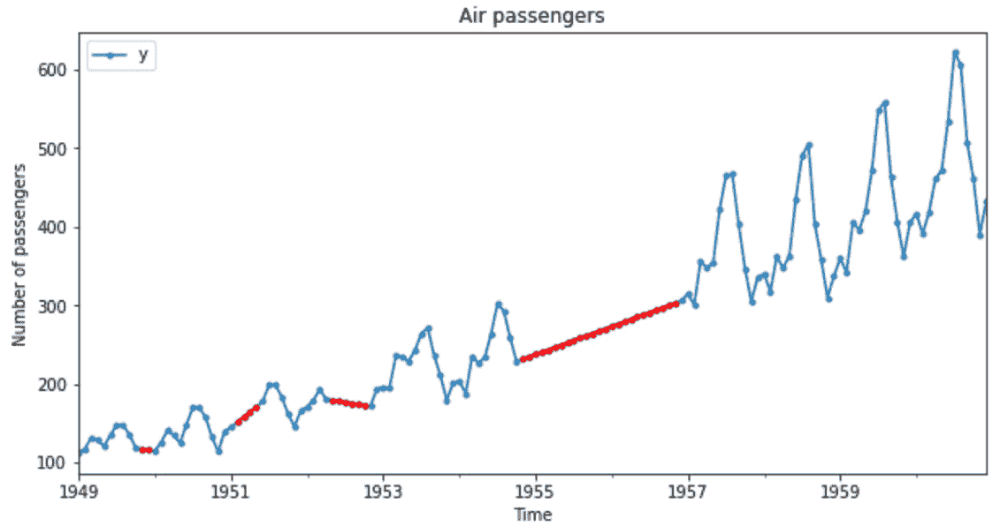

# 1

# 填充缺失数据

缺失数据——即某些观测值的值缺失——是大多数数据源中不可避免的问题。某些机器学习模型的实现可以开箱即用地处理缺失数据。为了训练其他模型，我们必须删除具有缺失数据的观测值或将它们转换为允许的值。

将缺失数据替换为其统计估计的行为称为**填充**。任何填充技术的目标都是生成一个完整的数据集。有多种填充方法。我们根据数据是否随机缺失、缺失值的比例以及我们打算使用的机器学习模型来选择使用哪种方法。在本章中，我们将讨论几种填充方法。

本章将涵盖以下食谱：

+   删除具有缺失数据的观测值

+   执行均值或中位数填充

+   填充分类变量

+   用任意数替换缺失值

+   为填充找到极端值

+   标记填充值

+   实施前向和后向填充

+   执行插值

+   通过链式方程进行多元填充

+   使用最近邻估计缺失数据

# 技术要求

在本章中，我们将使用 Python 库 Matplotlib、pandas、NumPy、scikit-learn 和 Feature-engine。如果您需要安装 Python，免费的 Anaconda Python 发行版([`www.anaconda.com/`](https://www.anaconda.com/))包括了大多数数值计算库。

可以使用以下方式使用`pip`安装`feature-engine`：

```py
pip install feature-engine
```

如果您使用 Anaconda，可以使用`conda`安装`feature-engine`：

```py
conda install -c conda-forge feature_engine
```

注意

本章中的食谱是在出版时使用 Python 库的最新版本创建的。您可以在附带的 GitHub 仓库中的`requirements.txt`文件中检查版本，网址为[`github.com/PacktPublishing/Python-Feature-engineering-Cookbook-Third-Edition/blob/main/requirements.txt`](https://github.com/PacktPublishing/Python-Feature-engineering-Cookbook-Third-Edition/blob/main/requirements.txt)。

我们将使用来自*UCI 机器学习仓库*的**信用批准**数据集([`archive.ics.uci.edu/`](https://archive.ics.uci.edu/))，该数据集根据 CC BY 4.0 创意共享许可：[`creativecommons.org/licenses/by/4.0/legalcode`](https://creativecommons.org/licenses/by/4.0/legalcode)。您可以在以下链接找到数据集：[`archive.ics.uci.edu/dataset/27/credit+approval`](http://archive.ics.uci.edu/dataset/27/credit+approval)。

我下载并修改了如本笔记本所示的数据：[`github.com/PacktPublishing/Python-Feature-engineering-Cookbook-Third-Edition/blob/main/ch01-missing-data-imputation/credit-approval-dataset.ipynb`](https://github.com/PacktPublishing/Python-Feature-engineering-Cookbook-Third-Edition/blob/main/ch01-missing-data-imputation/credit-approval-dataset.ipynb)

我们还将使用位于 Facebook 的 Prophet GitHub 仓库中的**航空乘客**数据集（[`github.com/facebook/prophet/blob/main/examples/example_air_passengers.csv`](https://github.com/facebook/prophet/blob/main/examples/example_air_passengers.csv)），该数据集受 MIT 许可协议保护：[`github.com/facebook/prophet/blob/main/LICENSE`](https://github.com/facebook/prophet/blob/main/LICENSE)

我已经在这个笔记本中修改了数据，如所示：[`github.com/PacktPublishing/Python-Feature-engineering-Cookbook-Third-Edition/blob/main/ch01-missing-data-imputation/air-passengers-dataset.ipynb`](https://github.com/PacktPublishing/Python-Feature-engineering-Cookbook-Third-Edition/blob/main/ch01-missing-data-imputation/air-passengers-dataset.ipynb)

你可以在附带的 GitHub 仓库中找到修改后的数据集副本：[`github.com/PacktPublishing/Python-Feature-engineering-Cookbook-Third-Edition/blob/main/ch01-missing-data-imputation/`](https://github.com/PacktPublishing/Python-Feature-engineering-Cookbook-Third-Edition/blob/main/ch01-missing-data-imputation/)

# 删除含有缺失数据的观测值

**完全案例分析**（**CCA**），也称为案例的逐行删除，包括丢弃含有缺失数据的观测值。CCA 可以应用于分类和数值变量。在使用 CCA 的情况下，如果数据是随机缺失且仅在一小部分观测值中缺失，我们可以在插补后保留变量的分布。然而，如果数据在许多变量中缺失，CCA 可能会导致大量数据集的删除。

注意

只有在观测值缺失数量很少，并且你有充分的理由相信它们对你的模型不重要时，才使用 CCA。

## 如何操作...

让我们先进行一些导入和加载数据集的操作：

1.  让我们导入`pandas`、`matplotlib`以及来自 scikit-learn 的训练/测试分割函数：

    ```py
    import matplotlib.pyplot as plt
    import pandas as pd
    from sklearn.model_selection import train_test_split
    ```

1.  让我们加载并显示在*技术要求*部分描述的数据集：

    ```py
    data = pd.read_csv("credit_approval_uci.csv")
    data.head()
    ```

    在以下图像中，我们可以看到数据的前 5 行：


图 1.1 – 数据集的前 5 行

1.  如果我们正在准备数据以训练机器学习模型，我们会像通常那样继续操作；通过将数据分为训练集和测试集：

    ```py
    X_train, X_test, y_train, y_test = train_test_split(
        data.drop("target", axis=1),
        data["target"],
        test_size=0.30,
        random_state=42,
    )
    ```

1.  现在让我们制作一个条形图，显示训练集和测试集中每个变量的缺失数据比例：

    ```py
    fig, axes = plt.subplots(
        2, 1, figsize=(15, 10), squeeze=False)
    X_train.isnull().mean().plot(
        kind='bar', color='grey', ax=axes[0, 0], title="train")
    X_test.isnull().mean().plot(
        kind='bar', color='black', ax=axes[1, 0], title="test")
    axes[0, 0].set_ylabel('Fraction of NAN')
    axes[1, 0].set_ylabel('Fraction of NAN')
    plt.show()
    ```

    之前的代码块返回以下条形图，显示了训练集（顶部）和测试集（底部）中每个变量的缺失数据比例：


图 1.2 – 每个变量的缺失数据比例

1.  现在，我们将删除任何变量中含有缺失值的观测值：

    ```py
    train_cca = X_train.dropna()
    test_cca = X_test.dropna()
    ```

注意

pandas 的`dropna()`默认会删除任何含有缺失值的观测值。我们可以通过以下方式删除变量子集（如"A3", "A4"）中的缺失数据：`data.dropna(subset=["A3", "A4"])`。

1.  让我们打印并比较原始数据集和完整案例数据集的大小：

    ```py
    print(f"Total observations: {len(X_train)}")
    print(f"Observations without NAN: {len(train_cca)}")
    ```

    我们从训练集中移除了超过 200 个有缺失数据的观测值，如下所示输出：

    ```py
    Total observations: 483
    Observations without NAN: 264
    ```

1.  在从训练集和测试集中移除观测值后，我们需要对齐目标变量：

    ```py
    y_train_cca = y_train.loc[train_cca.index]
    y_test_cca = y_test.loc[test_cca.index]
    ```

    现在，数据集和目标变量包含没有缺失数据的行。

1.  要使用`feature-engine`丢弃有缺失数据的观测值，让我们导入所需的转换器：

    ```py
    from feature_engine.imputation import DropMissingData
    ```

1.  让我们设置填充器以自动找到有缺失数据的变量：

    ```py
    cca = DropMissingData(variables=None, missing_only=True)
    ```

1.  让我们调整 transformer，使其找到有缺失数据的变量：

    ```py
    cca.fit(X_train)
    ```

1.  让我们检查 transformer 找到的含有 NAN 的变量：

    ```py
    cca.variables_
    ```

    前一个命令返回了有缺失数据的变量名称：

    ```py
    ['A1', 'A2', 'A3', 'A4', 'A5', 'A6', 'A7', 'A8', 'A9', 'A10', 'A14']
    ```

1.  让我们移除训练集和测试集中有缺失数据的行：

    ```py
    train_cca = cca.transform(X_train)
    test_cca = cca.transform(X_test)
    ```

    使用`train_cca.isnull().sum()`来证实完整案例数据集中没有缺失数据。

1.  `DropMissingData`可以在从训练集中移除缺失数据后自动调整目标：

    ```py
    train_c, y_train_c = cca.transform_x_y( X_train, y_train)
    test_c, y_test_c = cca.transform_x_y(X_test, y_test)
    ```

前面的代码从训练集和测试集中移除了`nan`行，然后重新对齐了目标变量。

注意

要从变量子集中移除有缺失数据的观测值，使用`DropMissingData(variables=['A3', 'A4'])`。要移除至少 5%变量中有`nan`的行，使用`DropMissingData(threshold=0.95)`。

## 它是如何工作的...

在这个菜谱中，我们绘制了每个变量中缺失数据的比例，然后移除了所有有缺失值的观测值。

我们使用`pandas`的`isnull()`和`mean()`方法来确定每个变量中缺失观测值的比例。`isnull()`方法为每个变量创建了一个布尔向量，其中`True`和`False`值表示值是否缺失。`mean()`方法取这些值的平均值，并返回缺失数据的比例。

我们使用`pandas`的`plot.bar()`创建每个变量的缺失数据分数的条形图。在*图 1*.2 中，我们看到了训练集和测试集中每个变量的`nan`分数。

要移除任何变量中的缺失值观测，我们使用了 pandas 的`dropna()`，从而获得了一个完整案例数据集。

最后，我们使用 Feature-engine 的`DropMissingData()`移除了缺失数据。这个填充器在调用`fit()`方法时自动识别并存储了训练集中的缺失数据变量。使用`transform()`方法，填充器移除了那些变量中的`nan`观测值。使用`transform_x_y()`，填充器从数据集中移除了`nan`行，然后重新对齐了目标变量。

## 参见

如果你想在管道中使用`DropMissingData()`与其他 Feature-engine 或 scikit-learn 转换器一起使用，请查看 Feature-engine 的`Pipeline`：[`Feature-engine.trainindata.com/en/latest/user_guide/pipeline/Pipeline.html`](https://Feature-engine.trainindata.com/en/latest/user_guide/pipeline/Pipeline.html)。此管道在删除行后可以与训练集和测试集对齐目标。

# 执行均值或中值插补

均值或中值插补包括用变量的均值或中值值替换缺失数据。为了避免数据泄露，我们使用训练集来确定均值或中值，然后使用这些值来插补训练集、测试集以及所有未来的数据。

Scikit-learn 和 Feature-engine 从训练集中学习均值或中值，并存储这些参数以供将来使用。默认情况下。

在这个菜谱中，我们将使用`pandas`、`scikit-learn`和`feature-engine`执行均值和中值插补。

注意

如果变量呈正态分布，则使用均值插补；否则使用中值插补。如果缺失数据比例较高，均值和中值插补可能会扭曲变量分布。

## 如何做到这一点...

让我们开始这个菜谱：

1.  首先，我们将导入`pandas`以及从`scikit-learn`和`feature-engine`中所需的函数和类。

    ```py
    import pandas as pd
    from sklearn.model_selection import train_test_split
    from sklearn.impute import SimpleImputer
    from sklearn.compose import ColumnTransformer
    from feature_engine.imputation import MeanMedianImputer
    ```

1.  让我们加载我们在*技术要求*部分准备的数据集：

    ```py
    data = pd.read_csv("credit_approval_uci.csv")
    ```

1.  让我们将数据分割成训练集和测试集及其相应的目标：

    ```py
    X_train, X_test, y_train, y_test = train_test_split(
        data.drop("target", axis=1),
        data["target"],
        test_size=0.3,
        random_state=0,
    )
    ```

1.  让我们通过排除对象类型的变量来创建一个数值变量的列表：

    ```py
    numeric_vars = X_train.select_dtypes(
        exclude="O").columns.to_list()
    ```

    如果你执行`numeric_vars`，你将看到数值变量的名称：`['A2', 'A3', 'A8', 'A11', 'A14', 'A15']`。

1.  让我们在字典中捕获变量的中值：

    ```py
    median_values = X_train[
        numeric_vars].median().to_dict()
    ```

小贴士

注意我们如何使用训练集计算中值。我们将使用这些值来替换训练集和测试集中的缺失数据。要计算均值，请使用 pandas 的`mean()`而不是`median()`。

如果你执行`median_values`，你将看到一个包含每个变量的中值字典：`{'A2': 28.835, 'A3': 2.75, 'A8': 1.0, 'A11': 0.0, 'A14': 160.0, 'A15': 6.0}`。

1.  让我们用中值替换缺失数据：

    ```py
    X_train_t = X_train.fillna(value=median_values)
    X_test_t = X_test.fillna(value=median_values)
    ```

    在插补后，如果你执行`X_train_t[numeric_vars].isnull().sum()`，数值变量中的缺失值数量应该是`0`。

注意

`pandas fillna()`默认返回一个包含插补值的新数据集。要替换原始 DataFrame 中的缺失数据，请将`inplace`参数设置为`True`：`X_train.fillna(value=median_values, inplace=True)`。

现在，让我们使用`scikit-learn`用中值插补缺失值。

1.  让我们设置插补器，用中值替换缺失数据：

    ```py
    imputer = SimpleImputer(strategy="median")
    ```

注意

要执行均值插补，请按以下方式设置`SimpleImputer()`：`imputer = SimpleImputer(strategy = "mean")`。

1.  我们通过使用`ColumnTransformer()`来限制插补仅应用于数值变量：

    ```py
    ct = ColumnTransformer(
        [("imputer", imputer, numeric_vars)],
        remainder="passthrough",
        force_int_remainder_cols=False,
    ).set_output(transform="pandas")
    ```

注意

根据我们如何设置转换输出，Scikit-learn 可以返回`numpy`数组、`pandas` DataFrame 或`polar`框架。默认情况下，它返回`numpy`数组。

1.  让我们将填充器拟合到训练集，以便它学习中值：

    ```py
    ct.fit(X_train)
    ```

1.  让我们检查学习到的中值：

    ```py
    ct.named_transformers_.imputer.statistics_
    ```

    之前的命令返回了每个变量的中值：

    ```py
    array([ 28.835,   2.75,   1.,   0., 160.,   6.])
    ```

1.  让我们用中值替换缺失值：

    ```py
    X_train_t = ct.transform(X_train)
    X_test_t = ct.transform(X_test)
    ```

1.  让我们显示结果训练集：

    ```py
    print(X_train_t.head())
    ```

    在以下图像中，我们可以看到结果 DataFrame：


图 1.3 – 填充后的训练集。填充的变量由填充器前缀标记；未转换的变量显示前缀余数

最后，让我们使用`feature-engine`执行中值填充：

1.  让我们设置填充器，用中值替换数值变量中的缺失值：

    ```py
    imputer = MeanMedianImputer(
        imputation_method="median",
        variables=numeric_vars,
    )
    ```

注意

要执行均值填充，将`imputation_method`更改为`"mean"`。默认情况下，`MeanMedianImputer()`将填充 DataFrame 中的所有数值变量，忽略分类变量。使用`variables`参数限制填充到数值变量的子集。

1.  将填充器拟合以学习中值：

    ```py
    imputer.fit(X_train)
    ```

1.  检查学习到的中值：

    ```py
    imputer.imputer_dict_
    ```

    之前的命令返回了字典中的中值：

    ```py
    {'A2': 28.835, 'A3': 2.75, 'A8': 1.0, 'A11': 0.0, 'A14': 160.0, 'A15': 6.0}
    ```

1.  最后，让我们用中值替换缺失值：

    ```py
    X_train = imputer.transform(X_train)
    X_test = imputer.transform(X_test)
    ```

Feature-engine 的`MeanMedianImputer()`返回一个`DataFrame`。您可以使用`X_train[numeric_vars].isnull().mean()`检查填充的变量是否不包含缺失值。

## 它是如何工作的...

在这个菜谱中，我们使用`pandas`、`scikit-learn`和`feature-engine`替换了缺失数据，用变量的中值。

我们使用 scikit-learn 的`train_test_split()`函数将数据集分为训练集和测试集。该函数接受预测变量、目标、测试集中要保留的观测值比例以及用于可重复性的`random_state`值作为参数。它返回一个包含原始观测值 70%的训练集和一个包含原始观测值 30%的测试集。70:30 的分割是随机的。

要使用 pandas 进行缺失数据填充，在*步骤 5*中，我们创建了一个字典，其中数值变量名作为键，它们的平均值作为值。中值是从训练集中学习的，以避免数据泄露。为了替换缺失数据，我们对训练集和测试集应用了`pandas`的`fillna()`，并将每个变量的中值字典作为参数传递。

要使用 `scikit-learn` 将缺失值替换为中位数，我们使用了 `strategy` 设置为 `"median"` 的 `SimpleImputer()`。为了限制推断仅限于数值变量，我们使用了 `ColumnTransformer()`。通过将 `remainder` 参数设置为 `passthrough`，我们使 `ColumnTransformer()` 在转换后的输出中返回训练集中看到的所有变量；推断的变量随后是未转换的变量。

注意

`ColumnTransformer()` 改变了输出中变量的名称。转换后的变量显示前缀 `imputer`，而未更改的变量显示前缀 `remainder`。

在 *步骤 8* 中，我们将列转换器的输出设置为 `pandas` 以获得一个 DataFrame 作为结果。默认情况下，`ColumnTransformer()` 返回 `numpy` 数组。

注意

从版本 1.4.0 开始，`scikit-learn` 转换器可以通过 `transform()` 方法返回 `numpy` 数组、`pandas` DataFrame 或 `polar` 帧。

通过 `fit()`，`SimpleImputer()` 学习了训练集中每个数值变量的中位数，并将它们存储在其 `statistics_` 属性中。通过 `transform()`，它用中位数替换了缺失值。

要使用 Feature-engine 将缺失值替换为中位数，我们使用了 `imputation_method` 设置为 `median` 的 `MeanMedianImputer()`。为了限制推断仅限于变量子集，我们将变量名称列表传递给 `variables` 参数。通过 `fit()`，转换器学习并存储了每个变量的中位数值，并将其存储在其 `imputer_dict_` 属性中的字典中。通过 `transform()`，它替换了缺失值，返回一个 pandas DataFrame。

# 推断分类变量

我们通常使用最频繁的类别或特定的字符串来推断分类变量。为了避免数据泄露，我们从训练集中找到频繁的类别。然后，我们使用这些值来推断训练集、测试集和未来的数据集。`scikit-learn` 和 `feature-engine` 可以直接找到并存储用于推断的频繁类别。

在这个菜谱中，我们将用最频繁的类别或任意字符串替换分类变量中的缺失数据。

## 如何操作...

首先，让我们进行一些导入并准备数据：

1.  让我们导入 `pandas` 以及从 `scikit-learn` 和 `feature-engine` 中所需的函数和类：

    ```py
    import pandas as pd
    from sklearn.model_selection import train_test_split
    from sklearn.impute import SimpleImputer
    from sklearn.compose import ColumnTransformer
    from feature_engine.imputation import CategoricalImputer
    ```

1.  让我们加载我们在 *技术要求* 部分准备的数据集：

    ```py
    data = pd.read_csv("credit_approval_uci.csv")
    ```

1.  让我们将数据分割成训练集和测试集及其相应的目标：

    ```py
    X_train, X_test, y_train, y_test = train_test_split(
        data.drop("target", axis=1),
        data["target"],
        test_size=0.3,
        random_state=0,
    )
    ```

1.  让我们将分类变量放入一个列表中：

    ```py
    categorical_vars = X_train.select_dtypes(
        include="O").columns.to_list()
    ```

1.  让我们将变量的最频繁类别存储在一个字典中：

    ```py
    frequent_values = X_train[
        categorical_vars].mode().iloc[0].to_dict()
    ```

1.  让我们用频繁的类别替换缺失值：

    ```py
    X_train_t = X_train.fillna(value=frequent_values)
    X_test_t = X_test.fillna(value=frequent_values)
    ```

注意

`fillna()` 默认返回一个包含推断值的新的 DataFrame。我们可以通过执行 `X_train.fillna(value=frequent_values, inplace=True)` 来替换原始 DataFrame 中的缺失数据。

1.  要用特定字符串替换缺失数据，让我们创建一个以分类变量名称为键、任意字符串为值的填充字典：

    ```py
    imputation_dict = {var:
         "no_data" for var in categorical_vars}
    ```

    现在，我们可以使用这个字典和 *步骤 6* 中的代码来替换缺失数据。

注意

使用 `pandas` 的 `value_counts()` 我们可以看到填充中添加的字符串。例如，尝试执行 `X_train["A1"].value_counts()`。

现在，让我们使用 `scikit-learn` 用最频繁的类别来填充缺失值。

1.  让我们设置填充器，为每个变量找到最频繁的类别：

    ```py
    imputer = SimpleImputer(strategy='most_frequent')
    ```

注意

`SimpleImputer()` 将学习数值和分类变量的众数。但在实际操作中，众数填充仅适用于分类变量。

1.  让我们将填充限制在分类变量上：

    ```py
    ct = ColumnTransformer(
        [("imputer",imputer, categorical_vars)],
        remainder="passthrough"
        ).set_output(transform="pandas")
    ```

注意

要用字符串而不是最频繁的类别来填充缺失数据，请按以下方式设置 `SimpleImputer()`：`imputer = SimpleImputer(strategy="constant", fill_value="missing")`。

1.  将填充器拟合到训练集，以便它学习最频繁的值：

    ```py
    ct.fit(X_train)
    ```

1.  让我们看看填充器学习到的最频繁值：

    ```py
    ct.named_transformers_.imputer.statistics_
    ```

    之前的命令返回每个变量的最频繁值：

    ```py
    array(['b', 'u', 'g', 'c', 'v', 't', 'f', 'f', 'g'], dtype=object)
    ```

1.  最后，让我们用频繁类别替换缺失值：

    ```py
    X_train_t = ct.transform(X_train)
    X_test_t = ct.transform(X_test)
    ```

    确保通过执行 `X_train_t.head()` 来检查生成的 DataFrames。

注意

`ColumnTransformer()` 改变了变量的名称。填充的变量显示前缀 `imputer`，未转换的变量显示前缀 `remainder`。

最后，让我们使用 `feature-engine` 来填充缺失值。

1.  让我们设置填充器，用最频繁的值替换分类变量中的缺失数据：

    ```py
    imputer = CategoricalImputer(
        imputation_method="frequent",
        variables=categorical_vars,
    )
    ```

注意

将 `variables` 参数设置为 `None`，`CategoricalImputer()` 将自动填充训练集中找到的所有分类变量。使用此参数将填充限制为分类变量的子集，如 *步骤 13* 所示。

1.  将填充器拟合到训练集，以便它学习最频繁的类别：

    ```py
    imputer.fit(X_train)
    ```

注意

要用特定字符串填充分类变量，将 `imputation_method` 设置为 `missing` 并将 `fill_value` 设置为所需的字符串。

1.  让我们检查学习到的类别：

    ```py
    imputer.imputer_dict_
    ```

    我们可以在以下输出中看到包含最频繁值的字典：

    ```py
    {'A1': 'b',
     'A4': 'u',
     'A5': 'g',
     'A6': 'c',
     'A7': 'v',
     'A9': 't',
     'A10': 'f',
     'A12': 'f',
     'A13': 'g'}
    ```

1.  最后，让我们用频繁类别替换缺失值：

    ```py
    X_train_t = imputer.transform(X_train)
    X_test_t = imputer.transform(X_test)
    ```

    如果你想使用 `CategoricalImputer()` 用字符串或最频繁的值填充数值变量，请将 `ignore_format` 参数设置为 `True`。

`CategoricalImputer()` 返回一个 pandas DataFrame 作为结果。

## 它是如何工作的...

在这个示例中，我们用最频繁的类别或任意字符串替换了分类变量中的缺失值。我们使用了 `pandas`、`scikit-learn` 和 `feature-engine`。

在*步骤 5*中，我们创建了一个字典，变量名作为键，频繁类别作为值。为了捕获频繁类别，我们使用了 pandas 的`mode()`，为了返回一个字典，我们使用了 pandas 的`to_dict()`。由于一个变量中可能有多个众数，所以我们确保只捕获其中一个值，使用了`.iloc[0]`。

要使用`scikit-learn`替换缺失值，我们使用了将`strategy`设置为`most_frequent`的`SimpleImputer()`。为了将填充限制在分类变量上，我们使用了`ColumnTransformer()`。通过将`remainder`设置为`passthrough`，我们使`ColumnTransformer()`在`transform()`方法的结果中返回训练集中存在的所有变量。

注意

`ColumnTransformer()`会更改输出中变量的名称。转换后的变量显示前缀`imputer`，未更改的变量显示前缀`remainder`。

在`fit()`中，`SimpleImputer()`学习了变量的最频繁类别并将它们存储在其`statistics_`属性中。在`transform()`中，它用学习到的参数替换了缺失数据。

`SimpleImputer()`和`ColumnTransformer()`默认返回 NumPy 数组。我们可以通过`set_output()`参数更改此行为。

要使用`feature-engine`替换缺失值，我们使用了将`imputation_method`设置为`frequent`的`CategoricalImputer()`。在`fit()`中，转换器学习并存储了最频繁类别在一个字典中，该字典存储在其`imputer_dict_`属性中。在`transform()`中，它用学习到的参数替换了缺失值。

与`SimpleImputer()`不同，`CategoricalImputer()`只会填充分类变量，除非通过将`ignore_format`参数设置为`True`来明确指示不要这样做。此外，使用`feature-engine`转换器，我们可以通过转换器本身限制转换到变量子集。对于`scikit-learn`转换器，我们需要额外的`ColumnTransformer()`类来将转换应用于变量子集。

# 用任意数字替换缺失值

我们可以用任意值替换缺失数据。常用的值是`999`、`9999`或对于正分布的`-1`。这种方法用于数值变量。对于分类变量，等效的方法是像在*填充分类变量*配方中描述的那样，用任意字符串替换缺失数据。

当用任意数字替换缺失值时，我们需要小心不要选择接近均值、中位数或分布中任何其他常见值的数值。

注意

当数据不是随机缺失时，使用非线性模型，或者当缺失数据的百分比很高时，我们会使用任意数字填充。这种填充技术会扭曲原始变量分布。

在这个菜谱中，我们将使用 `pandas`、`scikit-learn` 和 `feature-engine` 来用任意数字填充缺失数据。

## 如何做...

让我们先导入必要的工具并加载数据：

1.  导入 `pandas` 和所需的函数和类：

    ```py
    import pandas as pd
    from sklearn.model_selection import train_test_split
    from sklearn.impute import SimpleImputer
    from feature_engine.imputation import ArbitraryNumberImputer
    ```

1.  让我们加载 *技术要求* 部分中描述的数据集：

    ```py
    data = pd.read_csv("credit_approval_uci.csv")
    ```

1.  让我们将数据分为训练集和测试集：

    ```py
    X_train, X_test, y_train, y_test = train_test_split(
        data.drop("target", axis=1),
        data["target"],
        test_size=0.3,
        random_state=0,
    )
    ```

    我们将选择大于分布最大值的任意值。

1.  让我们找到四个数值变量的最大值：

    ```py
    X_train[['A2','A3', 'A8', 'A11']].max()
    ```

    之前的命令返回以下输出：

    ```py
    A2     76.750
    A3     26.335
    A8     28.500
    A11    67.000
    99 for the imputation because it is bigger than the maximum values of the numerical variables in *step 4*.
    ```

1.  让我们复制原始的 DataFrames：

    ```py
    X_train_t = X_train.copy()
    X_test_t = X_test.copy()
    ```

1.  现在，我们将缺失值替换为 `99`：

    ```py
    X_train_t[["A2", "A3", "A8", "A11"]] = X_train_t[[
        "A2", "A3", "A8", "A11"]].fillna(99)
    X_test_t[["A2", "A3", "A8", "A11"]] = X_test_t[[
        "A2", "A3", "A8", "A11"]].fillna(99)
    ```

注意

要使用 `pandas` 的 `fillna()` 用不同的值填充不同的变量，请使用如下字典：`imputation_dict = {"A2": -1, "A3": -1, "A8": 999, "``A11": 9999}`。

现在，我们将使用 `scikit-learn` 用任意数字填充缺失值。

1.  让我们设置 `imputer`，将缺失值替换为 `99`：

    ```py
    imputer = SimpleImputer(strategy='constant', fill_value=99)
    ```

`注意`

如果你的数据集包含分类变量，`SimpleImputer()` 也会将这些变量中的任何缺失值添加 `99`。

1.  让我们将 `imputer` 拟合到包含要填充的变量的训练集的一个子集：

    ```py
    vars = ["A2", "A3", "A8", "A11"]
    imputer.fit(X_train[vars])
    ```

1.  在所需的变量中将缺失值替换为 `99`：

    ```py
    X_train_t[vars] = imputer.transform(X_train[vars])
    X_test_t[vars] = imputer.transform(X_test[vars])
    ```

    执行 `X_test_t[["A2", "A3", "``A8", "A11"]].isnull().sum()` 来检查缺失值的缺失情况。

    为了完成，让我们使用 `feature-engine` 填充缺失值。

1.  让我们设置 `imputer`，在 4 个特定变量中将缺失值替换为 `99`：

    ```py
    imputer = ArbitraryNumberImputer(
        arbitrary_number=99,
        variables=["A2", "A3", "A8", "A11"],
    )
    ```

`注意`

如果我们将 `variables` 参数设置为 `None`，`ArbitraryNumberImputer()` 将自动选择训练集中的所有数值变量进行填充。

1.  最后，让我们将缺失值替换为 `99`：

    ```py
    X_train = imputer.fit_transform(X_train)
    X_test = imputer.transform(X_test)
    ```

`注意`

要用不同的数字填充不同的变量，请按以下方式设置 `ArbitraryNumberImputer()`：`ArbitraryNumberImputer(imputer_dict = {"A2": -1, "A3": -1, "A8": 999, "``A11": 9999})`。

我们现在已经使用三个不同的开源库用任意数字替换了缺失数据。

## 它是如何工作的...

在这个菜谱中，我们使用 `pandas`、`scikit-learn` 和 `feature-engine` 用任意数字替换了数值变量中的缺失值。

为了确定使用哪个任意值，我们使用 pandas 的 `max()` 检查了四个数值变量的最大值。我们选择了 `99`，因为它大于所选变量的最大值。在 *步骤 5* 中，我们使用 `pandas` 的 `fillna()` 替换了缺失数据。

要使用 `scikit-learn` 替换缺失值，我们使用了 `SimpleImputer()`，将 `strategy` 设置为 `constant`，并在 `fill_value` 参数中指定了 `99`。接下来，我们将填充器拟合到包含要填充的数值变量的训练集的一个子集。最后，我们使用 `transform()` 替换了缺失值。

要使用`feature-engine`替换缺失值，我们使用了`ArbitraryValueImputer()`，指定值为`99`和要插补的变量作为参数。接下来，我们应用了`fit_transform()`方法来替换训练集中的缺失数据，以及`transform()`方法来替换测试集中的缺失数据。

# 寻找插补的极值

用变量分布的末端值（极值）替换缺失值，就像用任意值替换一样，但不是手动设置任意值，而是自动从变量分布的末端选择值。

我们可以用一个大于变量中大多数值的值来替换缺失数据。为了选择一个较大的值，我们可以使用平均值加上标准差的因子。或者，我们可以将其设置为第 75 百分位数 + IQR × 1.5。**IQR**代表**四分位距**，是第 75 百分位数和第 25 百分位数之间的差。为了用小于剩余值的值替换缺失数据，我们可以使用平均值减去标准差的因子，或者第 25 百分位数 – IQR × 1.5。

注意

尾部插补可能会扭曲原始变量的分布，因此可能不适合线性模型。

在这个菜谱中，我们将使用`pandas`和`feature-engine`实现尾部或极值插补。

## 如何做...

要开始这个菜谱，让我们导入必要的工具并加载数据：

1.  让我们导入`pandas`和所需的函数和类：

    ```py
    import pandas as pd
    from sklearn.model_selection import train_test_split
    from feature_engine.imputation import EndTailImputer
    ```

1.  让我们加载在*技术要求*部分描述的数据集：

    ```py
    data = pd.read_csv("credit_approval_uci.csv")
    ```

1.  让我们将数值变量放入一个列表中，排除目标变量：

    ```py
    numeric_vars = [
        var for var in data.select_dtypes(
            exclude="O").columns.to_list()
        if var !="target"
    ]
    ```

1.  让我们将数据分为训练集和测试集，只保留数值变量：

    ```py
    X_train, X_test, y_train, y_test = train_test_split(
        data[numeric_vars],
        data["target"],
        test_size=0.3,
        random_state=0,
    )
    ```

1.  我们现在将确定 IQR：

    ```py
    IQR = X_train.quantile(0.75) - X_train.quantile(0.25)
    ```

    我们可以通过执行`IQR`或`print(IQR)`来可视化 IQR 值：

    ```py
    A2      16.4200
    A3       6.5825
    A8       2.8350
    A11      3.0000
    A14    212.0000
    A15    450.0000
    dtype: float64
    ```

1.  让我们创建一个包含变量名称和插补值的字典：

    ```py
    imputation_dict = (
        X_train.quantile(0.75) + 1.5 * IQR).to_dict()
    ```

注意

如果我们使用四分位距邻近规则，我们将通过将 1.5 倍的 IQR 加到第 75 百分位数来确定插补值。如果变量呈正态分布，我们可以将插补值计算为平均值加上标准差的因子，`imputation_dict = (X_train.mean() + 3 * X_train.std()).to_dict()`。

1.  最后，让我们替换缺失数据：

    ```py
    X_train_t = X_train.fillna(value=imputation_dict)
    X_test_t = X_test.fillna(value=imputation_dict)
    ```

注意

我们也可以使用分布左尾的值来替换缺失数据，使用`value = X_train[var].quantile(0.25) - 1.5 * IQR`或`value = X_train[var].mean() – 3 * X_train[var].std()`。

最后，让我们使用`feature-engine`来插补缺失值。

1.  让我们设置`imputer`来使用 IQR 邻近规则估计分布右侧的值：

    ```py
    imputer = EndTailImputer(
        imputation_method="iqr",
        tail="right",
        fold=3,
        variables=None,
    )
    ```

注意

要使用平均值和标准差来计算替换值，设置`imputation_method="Gaussian"`。在`tail`参数中使用`left`或`right`来指定在寻找插补值时要考虑分布的哪一侧。

1.  让我们将`EndTailImputer()`拟合到训练集，以便它学习填充的值：

    ```py
    imputer.fit(X_train)
    ```

1.  让我们检查学习到的值：

    ```py
    imputer.imputer_dict_
    ```

    之前的命令返回一个包含用于填充每个变量的值的字典：

    ```py
    {'A2': 88.18,
     'A3': 27.31,
     'A8': 11.504999999999999,
     'A11': 12.0,
     'A14': 908.0,
     'A15': 1800.0}
    ```

1.  最后，让我们替换缺失值：

    ```py
    X_train = imputer.transform(X_train)
    X_test = imputer.transform(X_test)
    ```

记住，你可以使用`X_train[['A2','A3', 'A8', 'A11', '``A14', 'A15']].isnull().mean()`来验证缺失值已被替换。

## 它是如何工作的...

在这个菜谱中，我们使用`pandas`和`feature-engine`将数值变量中的缺失值替换为分布末尾的数字。

我们根据本菜谱引言中描述的公式确定了填充值。我们使用 pandas 的`quantile()`找到特定的分位数值，或使用`pandas`的`mean()`和`std()`来计算均值和标准差。通过 pandas 的`fillna()`我们替换了缺失值。

要使用`feature-engine`中的`EndTailImputer()`替换缺失值，我们将`distribution`设置为`iqr`，根据 IQR 邻近规则计算值。将`tail`设置为`right`，转换器从分布的右侧找到填充值。通过`fit()`，填充器学习并存储在`imputer_dict_`属性中的字典中的填充值。通过`transform()`，我们替换了缺失值，返回 DataFrame。

# 标记填充值

在之前的菜谱中，我们专注于用它们值的估计来替换缺失数据。此外，我们还可以添加缺失指标来*标记*值缺失的观测值。

缺失指标是一个二元变量，它取值为`1`或`True`以指示值是否缺失，否则为`0`或`False`。在将缺失观测值替换为均值、中位数或最频繁的类别的同时，用缺失指标标记这些缺失观测值是一种常见做法。在这个菜谱中，我们将学习如何使用`pandas`、`scikit-learn`和`feature-engine`添加缺失指标。

## 如何操作...

让我们先进行一些导入和加载数据：

1.  让我们导入所需的库、函数和类：

    ```py
    import pandas as pd
    import numpy as np
    from sklearn.model_selection import train_test_split
    from sklearn.impute import SimpleImputer
    from sklearn.compose import ColumnTransformer
    from sklearn.pipeline import Pipeline
    from feature_engine.imputation import(
        AddMissingIndicator,
        CategoricalImputer,
        MeanMedianImputer
    )
    ```

1.  让我们加载并分割*技术要求*部分中描述的数据集：

    ```py
    data = pd.read_csv("credit_approval_uci.csv")
    X_train, X_test, y_train, y_test = train_test_split(
        data.drop("target", axis=1),
        data["target"],
        test_size=0.3,
        random_state=0,
    )
    ```

1.  让我们将变量名捕获到一个列表中：

    ```py
    varnames = ["A1", "A3", "A4", "A5", "A6", "A7", "A8"]
    ```

1.  让我们为缺失指标创建名称并将它们存储在一个列表中：

    ```py
    indicators = [f"{var}_na" for var in varnames]
    ```

    如果我们执行`indicators`，我们将看到用于新变量的名称：`['A1_na', 'A3_na', 'A4_na', 'A5_na', 'A6_na', '``A7_na', 'A8_na']`。

1.  让我们复制原始的 DataFrames：

    ```py
    X_train_t = X_train.copy()
    X_test_t = X_test.copy()
    ```

1.  让我们添加缺失指标：

    ```py
    X_train_t[indicators] =X_train[
        varnames].isna().astype(int)
    X_test_t[indicators] = X_test[
        varnames].isna().astype(int)
    ```

注意

如果你希望指标以`True`和`False`作为值而不是`0`和`1`，请在*步骤 6*中移除`astype(int)`。

1.  让我们检查生成的 DataFrame：

    ```py
    X_train_t.head()
    ```

    我们可以在以下图像的 DataFrame 右侧看到新添加的变量：


图 1.4 – 带有缺失指标的 DataFrame

现在，让我们使用 Feature-engine 添加缺失指示符。

1.  设置缺失值填充器，为每个有缺失数据的变量添加二进制指示符：

    ```py
    imputer = AddMissingIndicator(
        variables=None, missing_only=True
        )
    ```

1.  将填充器拟合到训练集，以便它找到有缺失数据的变量：

    ```py
    imputer.fit(X_train)
    ```

注意

如果我们执行 `imputer.variables_`，我们将找到需要添加缺失指示符的变量。

1.  最后，让我们添加缺失指示符：

    ```py
    X_train_t = imputer.transform(X_train)
    X_test_t = imputer.transform(X_test)
    ```

    到目前为止，我们只是添加了缺失指示符。但我们的变量中仍然有缺失数据。我们需要用数字来替换它们。在本食谱的其余部分，我们将结合使用缺失指示符和均值以及众数填充。

1.  让我们创建一个管道，将缺失指示符添加到分类和数值变量中，然后使用最频繁的类别填充分类变量，使用均值填充数值变量：

    ```py
    pipe = Pipeline([
        ("indicators",
            AddMissingIndicator(missing_only=True)),
        ("categorical", CategoricalImputer(
            imputation_method="frequent")),
        ("numerical", MeanMedianImputer()),
    ])
    ```

注意

`feature-engine` 缺失值填充器会自动识别数值或分类变量。因此，在这种情况下，无需切片数据或传递变量名作为参数给转换器。

1.  让我们添加指示符并填充缺失值：

    ```py
    X_train_t = pipe.fit_transform(X_train)
    X_test_t = pipe.transform(X_test)
    ```

注意

使用 `X_train_t.isnull().sum()` 来证实没有数据缺失。执行 `X_train_t.head()` 来查看结果数据帧。

最后，让我们添加缺失指示符，并使用 scikit-learn 分别用均值和最频繁的类别来填充数值和分类变量。

1.  让我们列出数值变量和分类变量的名称：

    ```py
    numvars = X_train.select_dtypes(
        exclude="O").columns.to_list()
    catvars = X_train.select_dtypes(
        include="O").columns.to_list()
    ```

1.  让我们设置一个管道来执行均值和频繁类别填充，同时标记缺失数据：

    ```py
    pipe = ColumnTransformer([
        ("num_imputer", SimpleImputer(
            strategy="mean",
            add_indicator=True),
        numvars),
        ("cat_imputer", SimpleImputer(
            strategy="most_frequent",
            add_indicator=True),
        catvars),
    ]).set_output(transform="pandas")
    ```

1.  现在，让我们进行填充：

    ```py
    X_train_t = pipe.fit_transform(X_train)
    X_test_t = pipe.transform(X_test)
    ```

确保探索 `X_train_t.head()` 以熟悉管道的输出。

## 它是如何工作的...

要使用 pandas 添加缺失指示符，我们使用了 `isna()`，它创建了一个新向量，如果存在缺失值则分配 `True` 的值，否则分配 `False`。我们使用了 `astype(int)` 将布尔向量转换为具有值 `1` 和 `0` 的二进制向量。

要使用 `feature-engine` 添加缺失指示符，我们使用了 `AddMissingIndicator()`。使用 `fit()` 方法，转换器找到了有缺失数据的变量。使用 `transform()` 方法，它将缺失指示符追加到训练集和测试集的右侧。

为了顺序添加缺失指示符，然后用最频繁的类别或均值替换 `nan` 值，我们在 `pipeline` 中排列了 Feature-engine 的 `AddMissingIndicator()`、`CategoricalImputer()` 和 `MeanMedianImputer()`。`pipeline` 的 `fit()` 方法使转换器找到 `nan` 变量，并计算数值变量的均值和分类变量的众数。`pipeline` 的 `transform()` 方法使转换器添加缺失指示符，然后用估计值替换缺失值。

注意

特征工程转换返回的 DataFrame 保留了变量的原始名称和顺序。另一方面，Scikit-learn 的 `ColumnTransformer()` 会改变结果数据中变量的名称和顺序。

最后，我们添加了缺失指示符，并使用 `scikit-learn` 将缺失数据替换为平均值和最频繁的类别。我们排列了两个 `SimpleImputer()` 实例，第一个用于用平均值插补数据，第二个用于用最频繁的类别插补数据。在这两种情况下，我们将 `add_indicator` 参数设置为 `True` 以添加缺失指示符。我们用 `ColumnTransformer()` 包装 `SimpleImputer()` 以专门修改数值或分类变量。然后我们使用 `pipeline` 中的 `fit()` 和 `transform()` 方法来训练转换器，然后添加指示符并替换缺失数据。

当返回 DataFrame 时，`ColumnTransformer()` 会改变变量的名称和顺序。通过执行 `X_train_t.head()` 来查看 *步骤 15* 的结果。你会看到，将每个步骤的名称添加为前缀到变量中，以标记每个转换器修改了哪个变量。然后，`num_imputer__A2` 由管道的第一个步骤返回，而 `cat_imputer__A12` 由管道的第二个步骤返回。

## 还有更多...

Scikit-learn 包含一个名为 `MissingIndicator()` 的转换器，它仅添加缺失指示符。请在文档中查看相关信息：[`scikit-learn.org/stable/modules/generated/sklearn.impute.MissingIndicator.html`](https://scikit-learn.org/stable/modules/generated/sklearn.impute.MissingIndicator.html)，并在配套的 GitHub 仓库中找到一个示例：[`github.com/PacktPublishing/Python-Feature-engineering-Cookbook-Third-Edition/blob/main/ch01-missing-data-imputation/Recipe-06-Marking-imputed-values.ipynb`](https://github.com/PacktPublishing/Python-Feature-engineering-Cookbook-Third-Edition/blob/main/ch01-missing-data-imputation/Recipe-06-Marking-imputed-values.ipynb)。

# 实现前向和后向填充

时间序列数据也会显示缺失值。要在时间序列中插补缺失数据，我们使用特定的方法。前向填充插补涉及在数据序列中用最接近的前一个非缺失值填充数据集中的缺失值。换句话说，我们将最后看到的值向前传递到下一个有效值。后向填充插补涉及用数据序列中跟随它的下一个非缺失值填充缺失值。换句话说，我们将最后一个有效值向后传递到其前面的有效值。

在这个菜谱中，我们将使用前向和后向填充替换时间序列中的缺失数据。

## 如何实现...

让我们先导入所需的库和时间序列数据集：

1.  让我们导入 `pandas` 和 `matplotlib`：

    ```py
    import matplotlib.pyplot as plt
    import pandas as pd
    ```

1.  让我们加载我们在 *技术要求* 部分描述的航空乘客数据集，并显示时序的前五行：

    ```py
    df = pd.read_csv(
        "air_passengers.csv",
        parse_dates=["ds"],
        index_col=["ds"],
    )
    print(df.head())
    ```

    我们在以下输出中看到时序：

    ```py
                    y
    ds
    1949-01-01  112.0
    1949-02-01  118.0
    1949-03-01  132.0
    1949-04-01  129.0
    1949-05-01  121.0
    ```

注意

你可以通过执行 `df.isnull().mean()` 来确定缺失数据的百分比。

1.  让我们绘制时序图以查找任何明显的数据间隙：

    ```py
    ax = df.plot(marker=".", figsize=[10, 5], legend=None)
    ax.set_title("Air passengers")
    ax.set_ylabel("Number of passengers")
    ax.set_xlabel("Time")
    ```

    之前的代码返回以下图表，其中我们看到数据缺失的时间间隔：


图 1.5 – 显示缺失值的时序数据

1.  让我们通过将任何区间中最后观测到的值携带到下一个有效值来插补缺失数据：

    ```py
    df_imputed = df.ffill()
    ```

    你可以通过执行 `df_imputed.isnull().sum()` 来验证缺失数据的缺失。

1.  现在让我们绘制完整的数据集，并将用于插补的值以虚线形式叠加：

    ```py
    ax = df_imputed.plot(
        linestyle="-", marker=".", figsize=[10, 5])
    df_imputed[df.isnull()].plot(
        ax=ax, legend=None, marker=".", color="r")
    ax.set_title("Air passengers")
    ax.set_ylabel("Number of passengers")
    ax.set_xlabel("Time")
    ```

    之前的代码返回以下图表，其中我们看到用于替换 `nan` 的值作为连续时序线之间的虚线叠加：


图 1.6 – 缺失值被最后观测到的值替换的时序数据（虚线）

1.  或者，我们可以使用后向填充来插补缺失数据：

    ```py
    df_imputed = df.bfill()
    ```

    如果我们绘制插补数据集，并像在 *步骤 5* 中那样叠加插补值，我们将看到以下图表：


图 1.7 – 缺失值被后向填充替换的时序数据（虚线）

注意

用于插补的值的高度在 *图 1.6 和 1.7* 中不同。在 *图 1.6* 中，我们向前携带最后一个值，因此高度较低。在 *图 1.7* 中，我们向后携带下一个值，因此高度较高。

我们现在已经获得了完整的数据集，我们可以用它来进行时序分析和建模。

## 它是如何工作的...

`pandas` 的 `ffill()` 在时序中的任何时间间隙中取最后观测到的值，并将其传播到下一个观测值。因此，在 *图 1*.6 中，我们看到与最后观测值高度对应的插补值虚线叠加。

`pandas` 的 `bfill()` 在时序中的任何时间间隙中取下一个有效值，并将其传播到之前观测到的值。因此，在 *图 1*.7 中，我们看到与间隙中下一个观测值高度对应的插补值虚线叠加。

默认情况下，`ffill()` 和 `bfill()` 将在有效观测值之间插补所有值。我们可以通过设置一个限制，使用两种方法中的 `limit` 参数来限制任何区间内的数据点数量。例如，`ffill(limit=10)` 将只替换任何间隙中的前 10 个数据点。

# 执行插值

我们可以通过在两个非缺失数据点之间进行插值来对时间序列中的缺失数据进行插补。插值是通过函数估计一个或多个值在范围内的方法。在线性插值中，我们在最后一个观测值和下一个有效点之间拟合一个线性函数。在样条插值中，我们在最后一个和下一个观测值之间拟合一个低度多项式。使用插值的想法是获得更好的缺失数据估计。

在这个菜谱中，我们将在一个时间序列中执行线性插值和样条插值。

## 如何做到这一点...

让我们首先导入所需的库和时间序列数据集。

1.  让我们导入 `pandas` 和 `matplotlib`：

    ```py
    import matplotlib.pyplot as plt
    import pandas as pd
    ```

1.  让我们加载在 *技术要求* 部分描述的时间序列数据：

    ```py
    df = pd.read_csv(
        "air_passengers.csv",
        parse_dates=["ds"],
        index_col=["ds"],
    )
    ```

注意

你可以绘制时间序列以找到数据缺口，就像我们在 *实现前向和后向填充* 菜谱的 *步骤 3* 中所做的那样。

1.  让我们通过线性插值来插补缺失数据：

    ```py
    df_imputed = df.interpolate(method="linear")
    ```

注意

如果行之间的时间间隔不均匀，则应将 `method` 设置为 `time` 以实现线性拟合。

你可以通过执行 `df_imputed.isnull().sum()` 来验证缺失数据的缺失。

1.  让我们现在绘制完整数据集，并将用于插补的值作为虚线叠加：

    ```py
    ax = df_imputed.plot(
        linestyle="-", marker=".", figsize=[10, 5])
    df_imputed[df.isnull()].plot(
        ax=ax, legend=None, marker=".", color="r")
    ax.set_title("Air passengers")
    ax.set_ylabel("Number of passengers")
    ax.set_xlabel("Time")
    ```

    之前的代码返回以下图表，其中我们可以看到用于替换 `nan` 的值作为时间序列连续线之间的虚线：



图 1.8 – 通过在最后和下一个有效数据点之间进行线性插值替换缺失值的时间序列数据（虚线）

1.  或者，我们可以通过进行样条插值来插补缺失数据。我们将使用二次多项式：

    ```py
    df_imputed = df.interpolate(method="spline", order=2)
    ```

    如果我们绘制插补数据集，并像在 *步骤 4* 中那样叠加插补值，我们将看到以下图表：


图 1.9 – 通过在最后和下一个有效数据点之间拟合二次多项式替换缺失值的时间序列数据（虚线）

注意

改变用于插值的二次多项式的度数，以查看替换值的变化。

我们现在已经获得了可以用于分析和建模的完整数据集。

## 它是如何工作的...

`pandas` 的 `interpolate()` 方法通过使用插值方法在范围内填充缺失值。当我们设置 `method` 为 `linear` 时，`interpolate()` 将所有数据点视为等距，并在缺失数据的区间内拟合一条线，连接最后一个和下一个有效点。

注意

如果你想要执行线性插值，但你的数据点不是等距的，请将 `method` 设置为 `time`。

然后，我们通过将`method`设置为`spline`和`order`设置为`2`，使用二次多项式进行样条插值。

`pandas`的`interpolate()`在内部使用`scipy.interpolate.interp1d`和`scipy.interpolate.UnivariateSpline`，因此可以实现其他插值方法。有关更多详细信息，请查看 pandas 文档，链接为[`pandas.pydata.org/pandas-docs/stable/reference/api/pandas.DataFrame.interpolate.html`](https://pandas.pydata.org/pandas-docs/stable/reference/api/pandas.DataFrame.interpolate.html)。

## 参见

虽然插值旨在比前向填充和后向填充获得更好的缺失数据估计，但如果时间序列显示出强烈的趋势和季节性，这些估计可能仍然不准确。为了获得这些类型时间序列中缺失数据的更好估计，请查看在[`www.trainindata.com/p/feature-engineering-for-forecasting`](https://www.trainindata.com/p/feature-engineering-for-forecasting)的*时间序列特征工程课程*中关于时间序列分解后插值的说明。

# 通过链式方程进行多变量插补

与单变量插补不同，多变量插补方法使用多个变量来估计缺失值。**链式方程多变量插补**（**MICE**）将每个有缺失值的变量建模为数据集中剩余变量的函数。该函数的输出用于替换缺失数据。

MICE 包括以下步骤：

1.  首先，它对每个有缺失数据的变量执行简单的单变量插补。例如，中位数插补。

1.  接下来，它选择一个特定的变量，比如`var_1`，并将缺失值重新设置为缺失。

1.  它训练一个模型，使用其他变量作为输入特征来预测`var_1`。

1.  最后，它用模型的输出替换`var_1`的缺失值。

MICE 对剩余的每个变量重复*步骤 2*到*4*。

当所有变量都已建模时，一个插补周期结束。MICE 执行多个插补周期，通常是 10 次。也就是说，我们对每个变量重复*步骤 2*到*4*共 10 次。其想法是，到周期结束时，我们应该找到了每个变量的最佳可能缺失数据估计。

注意

多变量插补在不想扭曲变量分布的情况下，可以作为一个有用的替代单变量插补的方法。当我们对拥有良好估计的缺失数据感兴趣时，多变量插补也非常有用。

在这个菜谱中，我们将使用 scikit-learn 实现 MICE。

## 如何操作...

要开始这个菜谱，让我们导入所需的库并加载数据：

1.  让我们导入所需的 Python 库、类和函数：

    ```py
    import pandas as pd
    import matplotlib.pyplot as plt
    from sklearn.model_selection import train_test_split
    from sklearn.linear_model import BayesianRidge
    from sklearn.experimental import (
        enable_iterative_imputer
    )
    from sklearn.impute import (
        IterativeImputer,
        SimpleImputer
    )
    ```

1.  让我们从*技术要求*部分描述的数据集中加载一些数值变量：

    ```py
    variables = [
        "A2", "A3", "A8", "A11", "A14", "A15", "target"]
    data = pd.read_csv(
        "credit_approval_uci.csv",
        usecols=variables)
    ```

1.  让我们将数据分为训练集和测试集：

    ```py
    X_train, X_test, y_train, y_test = train_test_split(
        data.drop("target", axis=1),
        data["target"],
        test_size=0.3,
        random_state=0,
    )
    ```

1.  让我们使用贝叶斯回归创建一个 MICE 填充器，指定迭代周期数，并设置`random_state`以实现可重复性：

    ```py
    imputer = IterativeImputer(
        estimator= BayesianRidge(),
        max_iter=10,
        random_state=0,
    ).set_output(transform="pandas")
    ```

注意

`IterativeImputer()`包含其他有用的参数。例如，我们可以使用`initial_strategy`参数指定第一个填充策略。我们可以从均值、中位数、众数或任意填充中进行选择。我们还可以指定我们想要如何循环变量，是随机循环还是从缺失值最少的变量到缺失值最多的变量。

1.  让我们拟合`IterativeImputer()`，以便它训练估计器来预测每个变量的缺失值：

    ```py
    imputer.fit(X_train)
    ```

注意

我们可以使用任何回归模型，通过`IterativeImputer()`来估计缺失数据。

1.  最后，让我们在训练集和测试集中填充缺失值：

    ```py
    X_train_t = imputer.transform(X_train)
    X_test_t = imputer.transform(X_test)
    ```

注意

为了证实缺失数据的缺乏，我们可以执行`X_train_t.isnull().sum()`。

为了总结这个配方，让我们使用简单的单变量填充方法来填充变量，并比较对变量分布的影响。

1.  让我们设置 scikit-learn 的`SimpleImputer()`以执行均值填充，然后转换数据集：

    ```py
    imputer_simple = SimpleImputer(
        strategy="mean").set_output(transform="pandas")
    X_train_s = imputer_simple.fit_transform(X_train)
    X_test_s = imputer_simple.transform(X_test)
    ```

1.  让我们现在制作 MICE 填充后的`A3`变量的直方图，然后是相同变量均值填充后的直方图：

    ```py
    fig, axes = plt.subplots(
        2, 1, figsize=(10, 10), squeeze=False)
    X_test_t["A3"].hist(
        bins=50, ax=axes[0, 0], color="blue")
    X_test_s["A3"].hist(
        bins=50, ax=axes[1, 0], color="green")
    axes[0, 0].set_ylabel('Number of observations')
    axes[1, 0].set_ylabel('Number of observations')
    axes[0, 0].set_xlabel('A3')
    axes[1, 0].set_xlabel('A3')
    axes[0, 0].set_title('MICE')
    axes[1, 0].set_title('Mean imputation')
    plt.show()
    ```

    在下面的图中，我们可以看到均值填充扭曲了变量分布，更多的观测值趋向于均值值：


图 1.10 – 使用 MICE 填充（顶部）或均值填充（底部）后的变量 A3 的直方图，显示了后者导致的变量分布的扭曲

## 它是如何工作的...

在这个配方中，我们使用`scikit-learn`的`IterativeImputer()`执行了多元填充。当我们拟合模型时，`IterativeImputer()`执行了我们在配方的介绍中描述的步骤。也就是说，它使用均值填充所有变量。然后它选择一个变量，将其缺失值重新设置为缺失。最后，它拟合一个贝叶斯回归器来根据其他变量估计该变量。它对每个变量重复此过程。这是填充的一个周期。我们将它设置为重复此过程 10 次。到这个过程的最后，`IterativeImputer()`已经训练了一个贝叶斯回归器，用于根据数据集中的其他变量预测每个变量的值。通过`transform()`，它使用这些贝叶斯模型的预测来填充缺失数据。

`IterativeImputer()`只能基于数值变量在数值变量中填充缺失数据。如果您想使用分类变量作为输入，您需要先对其进行编码。然而，请注意，它只会执行回归。因此，它不适用于估计离散或分类变量中的缺失数据。

## 参见

要了解更多关于 MICE 的信息，请查看以下资源：

+   一种用于使用一系列回归模型乘性填充缺失值的多变量技术：[`www.researchgate.net/publication/244959137`](https://www.researchgate.net/publication/244959137_A_Multivariate_Technique_for_Multiply_Imputing_Missing_Values_Using_a_Sequence_of_Regression_Models)

+   *链式方程多重填充：它是怎样的，又是如何工作的？*：[`www.jstatsoft.org/article/download/v045i03/550`](https://www.jstatsoft.org/article/download/v045i03/550)

# 使用最近邻估计缺失数据

使用**K-最近邻**（**KNN**）进行填充涉及通过考虑其最近邻的值来估计数据集中的缺失值，其中数据点之间的相似性基于距离度量，例如欧几里得距离。它将缺失值分配给最近邻值的平均值，并按其距离进行加权。

考虑以下包含 4 个变量（列）和 11 个观测值（行）的数据集。我们希望填充第二个变量第五行的缺失值。首先，我们找到该行的 k 个最近邻，在我们的例子中，k=3，它们通过矩形框（中间面板）突出显示。接下来，我们取最近邻变量 2 的平均值。


图 1.11 – 显示待填充值（深色框）、待填充值的三条最近行（方形框）以及用于填充平均值的考虑值

填充的值由（value1 × w1 + value2 × w2 + value3 × w3）/ 3 给出，其中 w1、w2 和 w3 与邻居到要填充的数据的距离成比例。

在本配方中，我们将使用 scikit-learn 执行 KNN 填充。

## 如何操作...

为了继续执行配方，让我们导入所需的库并准备数据：

1.  让我们导入所需的库、类和函数：

    ```py
    import matplotlib.pyplot as plt
    import pandas as pd
    from sklearn.model_selection import train_test_split
    from sklearn.impute import KNNImputer
    ```

1.  让我们加载*技术要求*部分中描述的数据集（仅包含一些数值变量）：

    ```py
    variables = [
        "A2", "A3", "A8", "A11", "A14", "A15", "target"]
    data = pd.read_csv(
        "credit_approval_uci.csv",
        usecols=variables,
    )
    ```

1.  让我们将数据分为训练集和测试集：

    ```py
    X_train, X_test, y_train, y_test = train_test_split(
        data.drop("target", axis=1),
        data["target"],
        test_size=0.3,
        random_state=0,
    )
    ```

1.  让我们设置填充器，用其最近五个邻居的加权平均值替换缺失数据：

    ```py
    imputer = KNNImputer(
        n_neighbors=5, weights="distance",
    ).set_output(transform="pandas")
    ```

注意

替换值可以计算为 k 个最近邻的均匀平均值，通过将`weights`设置为`uniform`，或者如我们在配方中所做的那样，作为加权平均值。权重基于邻居到要填充的观测的距离。最近的邻居权重更大。

1.  查找最近邻：

    ```py
    imputer.fit(X_train)
    ```

1.  用邻居显示的值的加权平均值替换缺失值：

    ```py
    X_train_t = imputer.transform(X_train)
    X_test_t = imputer.transform(X_test)
    ```

结果是一个 pandas DataFrame，其中缺失数据已被替换。

## 它是如何工作的...

在这个方法中，我们用每个观测值的 k 个最近邻的平均值替换了缺失数据。我们设置了`KNNImputer()`来根据欧几里得距离找到每个观测值的五个最近邻。替换值被估计为要插补的变量五个最近邻显示的值的加权平均值。通过`transform()`方法，插补器计算了替换值并替换了缺失数据。
