# 2

# 对分类变量进行编码

`Home owner`变量具有`owner`和`non-owner`的值，是分类变量，同样`Marital status`变量具有`never married`、`married`、`divorced`和`widowed`的值，也是分类变量。在一些分类变量中，标签具有内在顺序；例如，在`Student's grade`变量中，`A`、`B`、`C`和`Fail`的值是有序的，其中`A`是最高等级，`Fail`是最低等级。这些被称为`City`变量，具有`London`、`Manchester`、`Bristol`等值。

分类变量的值通常编码为字符串。为了训练大多数机器学习模型，我们需要将这些字符串转换为数字。用数字替换字符串的行为称为**分类编码**。在本章中，我们将讨论多种分类编码方法。

本章将涵盖以下食谱：

+   通过单热编码创建二进制变量

+   对频繁类别执行单热编码

+   将类别替换为计数或观察频率

+   将类别替换为序数

+   基于目标值进行序数编码

+   实现目标均值编码

+   使用证据权重进行编码

+   对稀有或罕见类别进行分组

+   执行二进制编码

# 技术要求

在本章中，我们将使用`Matplotlib`、`pandas`、`NumPy`、`scikit-learn`、`feature-engine`和 Category Encoders Python 库。如果您需要安装 Python，免费的 Anaconda Python 发行版（[`www.anaconda.com/`](https://www.anaconda.com/））包括大多数数值计算库。

可以使用`pip`安装`feature-engine`：

```py
pip install feature-engine
```

如果您使用 Anaconda，可以使用`conda`安装`feature-engine`：

```py
conda install -c conda-forge feature_engine
```

要安装 Category Encoders，请使用以下`pip`命令：

```py
pip install category_encoders
```

我们将使用来自*UCI 机器学习仓库*的**Credit Approval**数据集（[https://archive.ics.uci.edu/](https://archive.ics.uci.edu/)），该数据集根据 CC BY 4.0 创意共享许可：[`creativecommons.org/licenses/by/4.0/legalcode`](https://creativecommons.org/licenses/by/4.0/legalcode)。您可以在以下链接找到数据集：[`archive.ics.uci.edu/dataset/27/credit+approval`](http://archive.ics.uci.edu/dataset/27/credit+approval)。

我已下载并修改了如本笔记本所示的数据：[`github.com/PacktPublishing/Python-Feature-engineering-Cookbook-Third-Edition/blob/main/ch02-categorical-encoding/credit-approval-dataset.ipynb`](https://github.com/PacktPublishing/Python-Feature-engineering-Cookbook-Third-Edition/blob/main/ch02-categorical-encoding/credit-approval-dataset.ipynb)。

您可以在附带的 GitHub 仓库中找到修改后的数据集副本：[`github.com/PacktPublishing/Python-Feature-engineering-Cookbook-Third-Edition/blob/main/ch02-categorical-encoding/`](https://github.com/PacktPublishing/Python-Feature-engineering-Cookbook-Third-Edition/blob/main/ch02-categorical-encoding/)。

注意

在对分类变量进行编码之前，你可能想要填充它们的缺失数据。查看*第一章*，*填充* *缺失数据*的方法。

# 通过单热编码创建二进制变量

如果类别存在，则为`1`，否则为`0`。

以下表格显示了`Smoker`变量的单热编码表示，其中包含`Smoker`和`Non-Smoker`类别：


图 2.1 – Smoker 变量的单热编码表示

如*图 2**.1 所示，从`Smoker`变量中，我们可以推导出一个二进制变量`Smoker`，对于吸烟者显示值为`1`，或者推导出一个`Non-Smoker`的二进制变量，对于不吸烟者显示值为`1`。

对于具有`red`，`blue`和`green`值的`Color`分类变量，我们可以创建三个变量，分别称为`red`，`blue`和`green`。如果观察结果对应相应的颜色，这些变量将被分配值为`1`，如果不对应，则为`0`。

一个具有*k*个唯一类别的分类变量可以使用*k-1*个二进制变量进行编码。对于`Smoker`变量，*k*是*2*，因为它包含两个标签（`Smoker`和`Non-Smoker`），所以我们只需要一个二进制变量（*k - 1 = 1*）来捕捉所有信息。对于`Color`变量，它有 3 个类别（*k = 3*；`red`，`blue`和`green`），我们需要 2 个（*k - 1 = 2*）二进制变量来捕捉所有信息，以便以下发生：

+   如果观察结果是红色，它将被`red`变量捕获（`red` = `1`，`blue` = `0`）

+   如果观察结果是蓝色，它将被`blue`变量捕获（`red` = `0`，`blue` = `1`）

+   如果观察结果是绿色，它将被`red`和`blue`的组合捕获（`red` = `0`，`blue` = `0`）

将编码到*k-1*个二进制变量非常适合线性模型。在某些情况下，我们可能更喜欢使用*k*个二进制变量对分类变量进行编码：

+   在训练决策树时，因为它们不会同时评估整个特征空间

+   在递归选择特征时

+   在确定变量中每个类别的相对重要性时

在这个菜谱中，我们将比较`pandas`，`scikit-learn`和`feature-engine`的单热编码实现。

## 如何做到...

首先，让我们进行一些导入并准备好数据：

1.  从`scikit-learn`导入`pandas`和`train_test_split`函数：

    ```py
    import pandas as pd
    from sklearn.model_selection import train_test_split
    ```

1.  让我们加载 Credit Approval 数据集：

    ```py
    data = pd.read_csv("credit_approval_uci.csv")
    ```

1.  让我们将数据分为训练集和测试集：

    ```py
    X_train, X_test, y_train, y_test = train_test_split(
        data.drop(labels=["target"], axis=1),
        data["target"],
        test_size=0.3,
        random_state=0,
    )
    ```

1.  让我们检查`A4`变量的唯一类别：

    ```py
    X_train["A4"].unique()
    ```

    我们可以在以下输出中看到`A4`的独特值：

    ```py
    A4 into *k-1* binary variables using pandas and then inspect the first five rows of the resulting DataFrame:

    ```

    dummies = pd.get_dummies(

    X_train["A4"], drop_first=True)

    dummies.head()

    ```py

    ```

注意

使用`pandas`的`get_dummies()`，我们可以通过`dummy_na`参数忽略或编码缺失数据。通过将`dummy_na=True`设置，缺失数据将编码在一个新的二进制变量中。要将变量编码为*k*个虚拟变量，请使用`drop_first=False`。

这里，我们可以看到*步骤 5*的输出，其中每个标签现在都是一个二进制变量：

```py
      Missing        l        u        y
596     False  False   True  False
303     False  False   True  False
204     False  False  False   True
351     False  False  False   True
118     False  False   True  False
```

1.  现在，让我们将所有分类变量编码为*k-1*个二进制变量：

    ```py
    X_train_enc = pd.get_dummies(X_train, drop_first=True)
    X_test_enc = pd.get_dummies(X_test, drop_first=True)
    ```

备注

`pandas`的`get_dummies()`默认情况下将对象、字符串或类别类型的所有变量编码。要编码变量子集，请将变量名列表传递给`columns`参数。

1.  让我们检查结果 DataFrame 的前五行：

    ```py
    X_train_enc.head()
    ```

备注

当编码多个变量时，`get_dummies()`捕获变量名 – 比如，`A1` – 并在类别名前放置一个下划线来标识结果二进制变量。

我们可以在以下输出中看到二进制变量：


图 2.2 – 一个转换后的 DataFrame，显示了数值变量随后是分类变量的独热编码表示

备注

`pandas`的`get_dummies()`将为 DataFrame 中看到的每个类别创建一个二进制变量。因此，如果训练集中的类别比测试集中的多，`get_dummies()`将在转换后的训练集中返回比测试集更多的列，反之亦然。为了避免这种情况，最好使用`scikit-learn`或`feature-engine`进行独热编码。

让我们使用`scikit-learn`进行独热编码。

1.  让我们导入`scikit-learn`中的编码器和`ColumnTransformer`：

    ```py
    from sklearn.preprocessing import OneHotEncoder
    from sklearn.compose import ColumnTransformer
    ```

1.  让我们创建一个包含分类变量名的列表：

    ```py
    cat_vars = X_train.select_dtypes(
        include="O").columns.to_list()
    ```

1.  让我们设置编码器以创建*k-1*个二进制变量：

    ```py
    encoder = OneHotEncoder(drop="first",
        sparse_output=False)
    ```

备注

要将变量编码为*k*个虚拟变量，将`drop`参数设置为`None`。要将仅二进制变量编码为*k-1*，将`drop`参数设置为`if_binary`。后者很有用，因为将二进制变量编码为*k*个虚拟变量是多余的。

1.  让我们将编码限制在分类变量上：

    ```py
    ct = ColumnTransformer(
        [("encoder", encoder, cat_vars)],
        remainder="passthrough",
        force_int_remainder_cols=False,
    ).set_output(transform="pandas")
    ```

1.  让我们调整编码器，使其能够识别要编码的类别：

    ```py
    ct.fit(X_train)
    ```

1.  让我们检查将被二进制变量表示的类别：

    ```py
    ct.named_transformers_["encoder"].categories_
    ```

    变换器将为以下类别添加二进制变量：

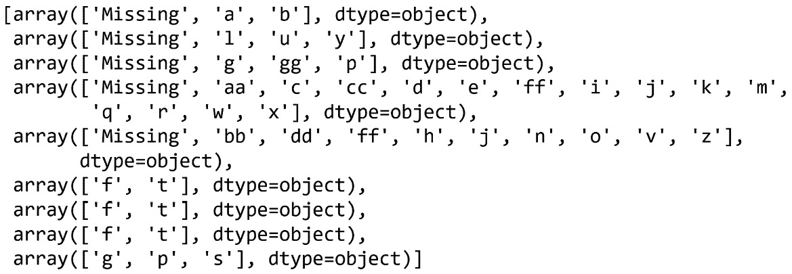

图 2.3 – 将被编码为二进制变量的类别数组（每个变量一个数组）

备注

`scikit-learn`的`OneHotEncoder()`只会对从训练集中学习到的类别进行编码。如果测试集中有新的类别，我们可以通过设置`handle_unknown`参数为`ignore`、`error`或`infrequent_if_exists`来指示编码器忽略它们、返回错误或用不常见的类别替换它们。

1.  让我们编码分类变量：

    ```py
    X_train_enc = ct.transform(X_train)
    X_test_enc = ct.transform(X_test)
    ```

    确保通过执行`X_test_enc.head()`来检查结果。

1.  为了熟悉输出，让我们打印结果 DataFrame 的变量名称：

    ```py
    ct.get_feature_names_out()
    ```

    在以下图像中，我们可以看到转换后的 DataFrame 中的变量名称：

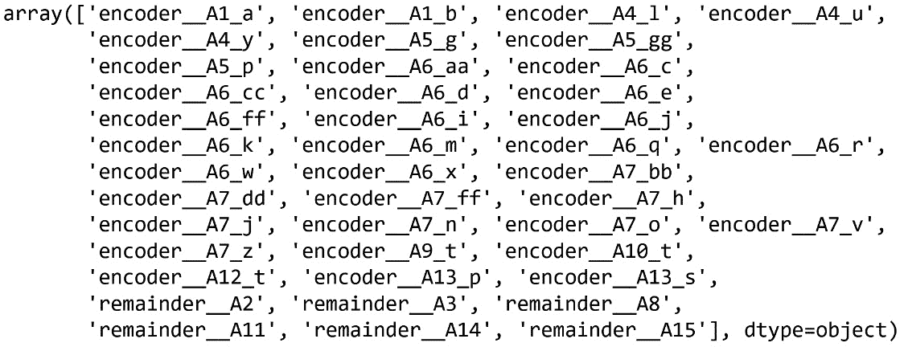

图 2.4 – 结果 DataFrame 中变量的名称数组

注意

`ColumnTransformer()`在转换过程中会更改变量的名称和顺序。如果变量被编码，它将附加`encoder`前缀；如果变量未被修改，它将附加`remainder`前缀。

为了总结这个菜谱，让我们使用`feature-engine`进行 one-hot 编码。

1.  让我们从`f``eature-engine`导入编码器：

    ```py
    from feature_engine.encoding import OneHotEncoder
    ```

1.  让我们设置编码器，使其返回*k-1*个二进制变量：

    ```py
    ohe_enc = OneHotEncoder(drop_last=True)
    ```

注意

`feature-engine`的`OneHotEncoder()`默认编码所有分类变量。要编码变量的子集，请传递变量名称列表：`OneHotEncoder(variables=["A1", "A4"])`。要编码数值变量，将`ignore_format`参数设置为`True`或将变量转换为对象类型。

1.  让我们将编码器拟合到训练集中，以便它学习要编码的类别和变量：

    ```py
    ohe_enc.fit(X_train)
    ```

注意

要将二进制变量编码为*k-1*，并将其他分类变量编码为*k*个虚拟变量，将`drop_last_binary`参数设置为`True`。

1.  让我们探索将要编码的变量：

    ```py
    ohe_enc.variables_
    ```

    转换器找到了并存储了对象或分类类型的变量，如下面的输出所示：

    ```py
    ['A1', 'A4', 'A5', 'A6', 'A7', 'A9', 'A10', 'A12', 'A13']
    ```

1.  让我们探索将创建虚拟变量的类别：

    ```py
    ohe_enc.encoder_dict_
    ```

    以下字典包含将编码到每个变量中的类别：

    ```py
     {'A1': ['a', 'b'],
     'A4': ['u', 'y', 'Missing'],
     'A5': ['g', 'p', 'Missing'],
     'A6': ['c', 'q', 'w', 'ff', 'm', 'i', 'e', 'cc', 'x', 'd', 'k', 'j', 'Missing', 'aa'],
     'A7': ['v', 'ff', 'h', 'dd', 'z', 'bb', 'j', 'Missing', 'n'],
     'A9': ['t'],
     'A10': ['t'],
     'A12': ['t'],
     'A13': ['g', 's']}
    ```

1.  让我们在训练集和测试集中编码分类变量：

    ```py
    X_train_enc = ohe_enc.transform(X_train)
    X_test_enc = ohe_enc.transform(X_test)
    ```

    如果我们执行`X_train_enc.head()`，我们将看到以下 DataFrame：

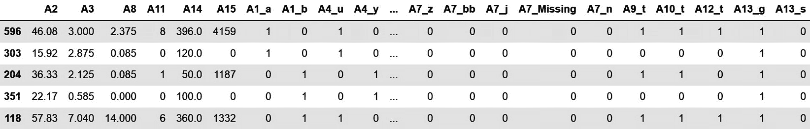

图 2.5 – 转换后的 DataFrame，其中包含数值变量，后面跟着分类变量的 one-hot 编码表示

注意到`A4`分类变量被替换为`A4_u`、`A4_y`等等。

注意

我们可以通过执行`ohe_enc.get_feature_names_out()`来获取转换数据集中所有变量的名称。

## 它是如何工作的...

在这个菜谱中，我们使用`pandas`、`scikit-learn`和`feature-engine`对分类变量进行了 one-hot 编码。

`pandas` 的 `get_dummies()` 将类别变量替换为表示每个类别的二进制变量集合。当在整个数据集上使用时，它返回数值变量，随后是每个变量类型为对象、字符串或类别的每个变量中看到的每个类别的独热编码表示。

注意

`pandas` 会为数据集中出现的每个类别返回二进制变量。在实际应用中，为了避免数据泄露并预测部署情况，我们只想为训练集中出现的类别返回虚拟变量。因此，使用 `scikit-learn` 和 `feature-engine` 更为安全。

`OneHotEncoder()` 从 `scikit-learn` 或 `feature-engine` 中学习，在应用 `fit()` 时从训练集中识别出应该用二进制变量表示的类别。使用 `transform()`，`scikit-learn` 仅返回二进制变量，而 `feature-engine` 则返回数值变量，随后是类别变量的独热编码表示。

`scikit-learn` 的 `OneHotEncoder()` 默认对所有变量进行编码。为了限制编码只针对类别变量，我们使用了 `ColumnTransformer()`。我们将 `transform()` 的输出设置为 `pandas`，以获得结果数据作为 DataFrame。

注意

独热编码适用于线性模型。它还会扩展特征空间。如果你的数据集中包含许多类别变量或高度基数变量，你可以通过仅编码最频繁的类别来限制二进制变量的数量。你可以像我们在 *对频繁类别进行独热编码* 食谱中描述的那样，使用 `scikit-learn` 和 `feature-engine` 自动完成此操作。

## 还有更多...

我们还可以使用 Category Encoders Python 库进行独热编码：[`contrib.scikit-learn.org/category_encoders/onehot.html`](https://contrib.scikit-learn.org/category_encoders/onehot.html)。

为了限制二进制变量的数量，我们可以选择要编码的类别和要忽略的类别；查看以下文章中的 Python 示例：https://www.blog.trainindata.com/one-hot-encoding-categorical-variables/。

# 对频繁类别进行独热编码

独热编码使用二进制变量表示每个变量的类别。因此，对高度基数变量或具有多个类别特征的集合进行独热编码可以显著扩展特征空间。这反过来可能会增加使用机器学习模型的计算成本或降低其性能。为了减少二进制变量的数量，我们可以对最频繁的类别进行独热编码。对顶级类别进行独热编码相当于将剩余的、较少出现的类别视为一个唯一的类别。

在本食谱中，我们将使用 `pandas`、`Scikit-learn` 和 `feature-engine` 实现对最流行类别的独热编码。

## 如何实现...

首先，让我们导入必要的 Python 库并准备好数据集：

1.  导入所需的 Python 库、函数和类：

    ```py
    import pandas as pd
    import numpy as np
    from sklearn.model_selection import train_test_split
    ```

1.  让我们加载信用审批数据集并将其分为训练集和测试集：

    ```py
    data = pd.read_csv("credit_approval_uci.csv")
    X_train, X_test, y_train, y_test = train_test_split(
        data.drop(labels=["target"], axis=1),
        data["target"],
        test_size=0.3,
        random_state=0,
    )
    ```

备注

在训练集中需要确定最频繁的类别。这是为了避免数据泄露。

1.  让我们检查`A6`变量的唯一类别：

    ```py
    X_train["A6"].unique()
    ```

    `A6`的唯一值显示在以下输出中：

    ```py
    A6, sort them in decreasing order, and then display the five most frequent categories:

    ```

    X_train["A6"].value_counts().sort_values(

    ascending=False).head(5)

    ```py

    We can see the five most frequent categories and the number of observations per category in the following output:

    ```

    A6

    c      93

    q      56

    w      48

    i      41

    ff     38

    使用*步骤 4*中的代码通过列表推导式将 A6 放入一个列表中：

    ```py
    top_5 = [x for x in X_train[
    " A6"].value_counts().sort_values(
    ascending=False).head(5).index
    ]
    ```

    ```py

    ```

1.  让我们在训练集和测试集的副本中为每个顶级类别添加一个二元变量：

    ```py
    X_train_enc = X_train.copy()
    X_test_enc = X_test.copy()
    for label in top_5:
        X_train_enc[f"A6_{label}"] = np.where(
            X_train["A6"] == label, 1, 0)
        X_test_enc[f"A6_{label}"] = np.where(
            X_test["A6"] == label, 1, 0)
    ```

1.  让我们在训练集中显示原始变量和编码变量`A6`的前`10`行：

    ```py
    X_train_enc[["A6"] + [f"A6_{
        label}" for label in top_5]].head(10)
    ```

    在第 7 步的输出中，我们可以看到`A6`变量，随后是二元变量：

    ```py
          A6  A6_c  A6_q  A6_w  A6_i  A6_ff
    596   c      1      0      0      0        0
    303   q      0      1      0      0        0
    204   w      0      0      1      0        0
    351  ff      0      0      0      0        1
    118   m      0      0      0      0        0
    247   q      0      1      0      0        0
    652   i      0      0      0      1        0
    513   e      0      0      0      0        0
    230  cc      0      0      0      0        0
    scikit-learn.
    ```

1.  让我们导入编码器：

    ```py
    from sklearn.preprocessing import OneHotEncoder
    ```

1.  让我们设置编码器，以编码至少有`39`个观察值的类别，并将编码的类别数量限制为`5`：

    ```py
    encoder = OneHotEncoder(
        min_frequency=39,
        max_categories=5,
        sparse_output=False,
    ).set_output(transform="pandas")
    ```

1.  最后，让我们将转换器拟合到两个高基数变量，然后转换数据：

    ```py
    X_train_enc = encoder.fit_transform(X_train[
        ['A6', 'A7']])
    X_test_enc = encoder.transform(X_test[['A6', 'A7']])
    ```

    如果您执行`X_train_enc.head()`，您将看到生成的 DataFrame：


图 2.6 – 包含至少有 39 个观察值的类别二元变量以及表示所有剩余类别的额外二元变量的转换 DataFrame

为了总结这个配方，让我们使用`feature-engine`对最频繁的类别进行编码。

1.  让我们设置一热编码器来编码`A6`和`A7`变量中最频繁的五个类别：

    ```py
    From feature_engine.encoding import OneHotEncoder
    ohe_enc = OneHotEncoder(
        top_categories=5,
        variables=["A6", "A7"]
    )
    ```

备注

要编码的频繁类别数量由用户任意确定。

1.  让我们将编码器拟合到训练集，以便它学习并存储`A6`和`A7`变量的最频繁类别：

    ```py
    ohe_enc.fit(X_train)
    ```

1.  最后，让我们在训练集和测试集中对`A6`和`A7`进行编码：

    ```py
    X_train_enc = ohe_enc.transform(X_train)
    X_test_enc = ohe_enc.transform(X_test)
    ```

    您可以通过执行`X_train_enc.head()`来查看转换 DataFrame 中的新二元变量。您还可以通过执行`ohe_enc.encoder_dict_`来找到编码器学习到的前五个类别。

## 它是如何工作的...

在这个配方的第一部分，我们处理了`A6`分类变量。我们使用`pandas`的`unique()`检查其唯一类别。接下来，我们使用`pandas`的`value_counts()`计算每个类别的观测值数量，它返回一个以类别为索引、观测值数量为值的`pandas`系列。然后，我们使用`pandas`的`sort_values()`将类别从观测值最多到最少的顺序排序。我们然后使用`pandas`的`head()`将系列缩减到最流行的五个类别。我们使用这个系列在一个列表推导式中捕获最频繁类别的名称。之后，我们遍历每个类别，并使用 NumPy 的`where()`，如果观测值显示了该类别，则创建值为`1`的二元变量，否则为`0`。

我们在“通过独热编码创建二元变量”的配方中讨论了如何使用`scikit-learn`和`feature-engine`。在这里，我将只强调编码最频繁类别所需的参数。

要使用`scikit-learn`编码频繁类别，我们将`min_frequency`参数设置为`39`。因此，在少于`39`个观测值中出现的类别将被组合成一个额外的二元变量，称为`infrequent_sklearn`。

要使用`feature-engine`编码频繁类别，我们将`top_categories`参数设置为`5`。因此，创建的转换器只为 5 个最频繁的类别创建二元变量。较少见的类别将在所有二元变量中显示为`0`。

## 还有更多...

这个配方基于 2009 年知识发现与数据（**KDD**）挖掘杯的获胜方案，*使用集成选择赢得 KDD Cup Orange 挑战*（http://proceedings.mlr.press/v7/niculescu09/niculescu09.pdf），其中作者将独热编码限制为每个变量的 10 个最频繁类别。

# 用观测值的计数或频率替换类别

在“计数与观测值的计数或频率”或频率编码中，我们将类别替换为显示该类别的观测值的计数或分数。也就是说，如果有 10 个观测值中的 100 个显示`Color`变量的`blue`类别，我们在进行计数编码时将`blue`替换为`10`，或者在执行频率编码时替换为`0.1`。这些编码方法在类别频率与目标之间存在关系时很有用。例如，在销售中，产品的频率可能表明其受欢迎程度。

注意

如果两个不同的类别在相同数量的观测值中出现，它们将被相同的值替换，这可能会导致信息丢失。

在这个配方中，我们将使用`pandas`和`feature-engine`执行计数和频率编码。

## 如何做到这一点...

我们将首先使用`pandas`编码一个变量，然后我们将使用`feature-engine`自动化这个过程：

1.  让我们从导入开始：

    ```py
    import pandas as pd
    from sklearn.model_selection import train_test_split
    from feature_engine.encoding import CountFrequencyEncoder
    ```

1.  让我们加载信用批准数据集并将其分为训练集和测试集：

    ```py
    data = pd.read_csv("credit_approval_uci.csv")
    X_train, X_test, y_train, y_test = train_test_split(
        data.drop(labels=["target"], axis=1),
        data["target"],
        test_size=0.3,
        random_state=0,
    )
    ```

1.  让我们通过计数或观察频率来捕获 `A7` 变量每个类别的观察数量，并将其存储在一个字典中：

    ```py
    counts = X_train["A7"].value_counts().to_dict()
    ```

注意

要找到频率，请执行 `X_train["A7"].value_counts(normalize=True).to_dict()`。

如果我们执行 `print(counts)`，我们将看到 `A7` 每个类别的观察计数：

```py
{'v': 277, 'h': 101, 'ff': 41, 'bb': 39, 'z': 7, 'dd': 5, 'j': 5, 'Missing': 4, 'n': 3, 'o': 1}
```

1.  让我们在数据集的副本中将 `A7` 中的类别替换为计数：

    ```py
    X_train_enc = X_train.copy()
    X_test_enc = X_test.copy()
    X_train_enc["A7"] = X_train_enc["A7"].map(counts)
    X_test_enc["A7"] = X_test_enc["A7"].map(counts)
    ```

    继续执行 `X_train_enc.head()` 来检查类别是否已被替换为计数。

    要将此过程应用于多个变量，我们可以使用 `feature-engine`。

1.  让我们设置编码器，使其使用观察计数来编码所有分类变量：

    ```py
    count_enc = CountFrequencyEncoder(
        encoding_method="count", variables=None,
    )
    ```

注意

`CountFrequencyEncoder()` 将自动找到并编码训练集中的所有分类变量。要仅编码变量子集，请将变量名称列表传递给 `variables` 参数。要使用频率进行编码，请使用 `encoding_method="frequency"`。

1.  让我们将编码器拟合到训练集，以便它存储每个变量每个类别的观察数量：

    ```py
    count_enc.fit(X_train)
    ```

1.  编码器自动找到了分类变量。让我们来看看：

    ```py
    count_enc.variables_
    ```

    之前的命令返回训练集中分类变量的名称：

    ```py
    ['A1', 'A4', 'A5', 'A6', 'A7', 'A9', 'A10', 'A12', 'A13']
    ```

1.  让我们打印每个变量每个类别的观察计数：

    ```py
    count_enc.encoder_dict_
    ```

    之前的属性存储了将用于替换类别的映射：


图 2.7 – 包含每个变量每个类别的观察数量的字典；这些值将用于编码分类变量

1.  最后，让我们在训练和测试集中使用“计数或观察频率”将类别替换为计数：

    ```py
    X_train_enc = count_enc.transform(X_train)
    X_test_enc = count_enc.transform(X_test)
    ```

通过执行 `X_train_enc.head()` 来检查结果。编码器返回 `pandas` DataFrame，其中分类变量的字符串被观察计数替换，使变量准备好在机器学习模型中使用。

## 它是如何工作的...

在这个菜谱中，我们使用 `pandas` 和 `feature-engine` 将类别替换为观察计数。

使用 `pandas` 的 `value_counts()`，我们确定了 `A7` 变量每个类别的观察数量，并通过 `pandas` 的 `to_dict()`，将这些值捕获在“计数或观察频率”字典中，其中每个键是一个唯一的类别，每个值是该类别的观察数量。通过 `pandas` 的 `map()` 和使用此字典，我们在训练和测试集中将类别替换为观察计数。

注意

编码的观测值数量应从训练集中获取，以避免数据泄露。请注意，测试集中的新类别将没有对应的映射，因此将被替换为`nan`。为了避免这种情况，请使用`feature-engine`。或者，您可以将`nan`替换为`0`。

要使用`feature-engine`执行计数编码，我们使用了`CountFrequencyEncoder()`并将`encoding_method`设置为`'count'`。我们将`variables`参数设置为`None`，以便编码器自动找到数据集中的所有分类变量。使用`fit()`，转换器找到了分类变量，并将每个类别的观测值计数存储在`encoder_dict_`属性中。使用`transform()`，转换器用计数替换了类别，返回一个`pandas` DataFrame。

注意

如果测试集中有训练集中不存在的类别，编码器将默认引发错误。您可以使其忽略它们，在这种情况下，它们将显示为`nan`，或者将它们编码为`0`。

## 参见

您还可以使用 Python 库 Category Encoders 执行计数和频率编码：[`contrib.scikit-learn.org/category_encoders/count.html`](https://contrib.scikit-learn.org/category_encoders/count.html)。

要查看计数编码的一些有用应用，请参阅这篇文章：[`letsdatascience.com/frequency-encoding/`](https://letsdatascience.com/frequency-encoding/)。

# 用序数替换类别

序数编码包括用从`1`到`k`（或根据实现从`0`到`k-1`）的数字替换类别，其中`k`是变量的不同类别的数量。这些数字是任意分配的。序数编码更适合非线性机器学习模型，这些模型可以通过任意分配的数字来寻找与目标相关的模式。

在这个菜谱中，我们将使用`pandas`、`scikit-learn`和`feature-engine`执行序数编码。

## 如何操作...

首先，让我们进行导入并准备数据集：

1.  导入`pandas`和数据拆分函数：

    ```py
    import pandas as pd
    from sklearn.model_selection import train_test_split
    ```

1.  让我们加载 Credit Approval 数据集并将其分为训练集和测试集：

    ```py
    data = pd.read_csv("credit_approval_uci.csv")
    X_train, X_test, y_train, y_test = train_test_split(
        data.drop(labels=["target"], axis=1),
        data["target"],
        test_size=0.3,
        random_state=0,
    )
    ```

1.  要编码`A7`变量，让我们创建一个类别到整数的字典：

    ```py
    ordinal_mapping = {k: i for i, k in enumerate(
        X_train["A7"].unique(), 0)
    }
    ```

    如果我们执行`print(ordinal_mapping)`，我们将看到将替换每个类别的数字：

    ```py
    {'v': 0, 'ff': 1, 'h': 2, 'dd': 3, 'z': 4, 'bb': 5, 'j': 6, 'Missing': 7, 'n': 8, 'o': 9}
    ```

1.  现在，让我们在 DataFrame 的副本中替换类别：

    ```py
    X_train_enc = X_train.copy()
    X_test_enc = X_test.copy()
    X_train_enc["A7"] = X_train_enc["A7"].map(ordinal_mapping)
    X_test_enc["A7"] = X_test_enc["A7"].map(ordinal_mapping)
    ```

    执行`print(X_train["A7"].head())`以查看上一操作的结果。

    接下来，我们将使用`scikit-learn`执行序数编码。

1.  让我们导入所需的类：

    ```py
    from sklearn.preprocessing import OrdinalEncoder
    from sklearn.compose import ColumnTransformer
    ```

注意

不要混淆`OrdinalEncoder()`和来自`scikit-learn`的`LabelEncoder()`。前者旨在编码预测特征，而后者旨在修改目标变量。

1.  让我们设置编码器：

    ```py
    enc = OrdinalEncoder()
    ```

1.  让我们创建一个包含需要编码的分类变量的列表：

    ```py
    cat_vars = X_train.select_dtypes(include="O").columns.to_list()
    ```

1.  让我们将编码限制在分类变量上：

    ```py
    ct = ColumnTransformer(
        [("encoder", enc, cat_vars)],
        remainder="passthrough",
        force_int_remainder_cols=False,
    ).set_output(transform="pandas")
    ```

注意

记得将`remainder`设置为`"passthrough"`，以便`ColumnTransformer()`返回未转换的变量。

1.  让我们将编码器拟合到训练集，以便它创建并存储类别到数字的表示：

    ```py
    ct.fit(X_train)
    ```

注意

通过执行`ct.named_transformers_["encoder"].categories_`，您可以可视化每个变量的唯一类别。

1.  现在，让我们对训练集和测试集中的分类变量进行编码：

    ```py
    X_train_enc = ct.transform(X_train)
    X_test_enc = ct.transform(X_test)
    ```

    执行`X_train_enc.head()`来查看生成的 DataFrame。

注意

`ColumnTransformer()`将通过在变量名后附加`encoder`来标记已编码的变量。未修改的变量显示`remainder`前缀。

现在，让我们使用`feature-engine`进行顺序编码。

1.  让我们导入编码器：

    ```py
    from feature_engine.encoding import OrdinalEncoder
    ```

1.  让我们设置编码器，使其在*步骤 7*中指定的分类变量中将类别替换为任意整数：

    ```py
    enc = OrdinalEncoder(
        encoding_method="arbitrary",
        variables=cat_vars,
    )
    ```

注意

如果`variables`参数为`None`，`feature-engine`的`OrdinalEncoder()`将自动查找并编码所有分类变量。或者，它将编码列表中指示的变量。此外，它可以根据目标平均值分配整数（参见*基于目标* *值* 进行顺序编码的配方）。

1.  让我们将编码器拟合到训练集，以便它学习并存储类别到整数的映射：

    ```py
    enc.fit(X_train)
    ```

注意

类别到整数的映射存储在`encoder_dict_`属性中，可以通过执行`enc.encoder_dict_`来访问。

1.  最后，让我们将训练集和测试集中的分类变量进行编码：

    ```py
    X_train_enc = enc.transform(X_train)
    X_test_enc = enc.transform(X_test)
    ```

`feature-engine`返回`pandas` DataFrame，其中原始变量的值被数字替换，使 DataFrame 准备好在机器学习模型中使用。

## 它是如何工作的...

在这个配方中，我们将类别替换为任意分配的整数。

我们使用`pandas`的`unique()`找到`A7`变量的唯一类别。接下来，我们创建了一个类别到整数的字典，并将其传递给`pandas`的`map()`，以将`A7`中的字符串替换为整数。

接下来，我们使用`scikit-learn`的`OrdinalEncoder()`进行了顺序编码，并使用`ColumnTransformer()`将编码限制在分类变量上。通过`fit()`，转换器根据训练集中的类别创建了类别到整数的映射。通过`transform()`，类别被替换为整数。通过将`remainder`参数设置为`passthrough`，我们使`ColumnTransformer()`将未编码的变量连接到编码特征之后。

使用`feature-engine`进行有序编码时，我们使用了`OrdinalEncoder()`，表示整数应通过`encoding_method`任意分配，并通过`variables`参数传递了一个包含要编码的变量的列表。使用`fit()`，编码器将整数分配给每个变量的类别，这些类别存储在`encoder_dict_`属性中。然后，这些映射被`transform()`方法用于替换训练集和测试集中的类别，返回 DataFrames。

注意

当测试集中的类别不在训练集中时，它将没有映射到数字。`scikit-learn`的`OrdinalEncoder()`和`feature-engine`默认会引发错误。然而，它们都有选项用用户定义的值或`-1`替换未看到的类别。

`scikit-learn`的`OrdinalEncoder()`可以限制编码到具有最小频率的类别。`feature-engine`的`OrdinalEncoder()`可以根据目标平均值分配数字，正如我们将在下一个配方中看到的。

## 更多...

您也可以使用`OrdinalEncoder()`从`Category Encoders`进行有序编码。请查看[`contrib.scikit-learn.org/category_encoders/ordinal.html`](http://contrib.scikit-learn.org/category_encoders/ordinal.html)。

# 基于目标值进行有序编码

在前面的配方中，我们用整数替换了类别，这些整数是任意分配的。我们也可以根据目标值给类别分配整数。为此，首先，我们计算每个类别的目标值的平均值。接下来，我们按目标平均值从低到高对类别进行排序。最后，我们将数字分配给有序的类别，从第一个类别开始的*0*到最后一个类别的*k-1*。

这种编码方法在分类变量和响应变量之间创建了一个单调关系，因此使得变量更适合用于线性模型。

在这个配方中，我们将使用`pandas`和`feature-engine`在遵循目标值的同时对类别进行编码。

## 如何操作...

首先，让我们导入必要的 Python 库并准备好数据集：

1.  导入所需的 Python 库、函数和类：

    ```py
    import pandas as pd
    import matplotlib.pyplot as plt
    from sklearn.model_selection import train_test_split
    ```

1.  让我们加载 Credit Approval 数据集并将其分为训练集和测试集：

    ```py
    data = pd.read_csv("credit_approval_uci.csv")
    X_train, X_test, y_train, y_test = train_test_split(
        data.drop(labels=["target"], axis=1),
        data["target"],
        test_size=0.3,
        random_state=0,
    )
    ```

1.  让我们在`A7`中确定每个类别的平均目标值，然后按目标值从低到高排序类别：

    ```py
    y_train.groupby(X_train["A7"]).mean().sort_values()
    ```

    以下是在前面的命令中的输出：

    ```py
    A7
    o          0.000000
    ff         0.146341
    j          0.200000
    dd         0.400000
    v          0.418773
    bb         0.512821
    h          0.603960
    n          0.666667
    z          0.714286
    Missing    1.000000
    Name: target, dtype: float64
    ```

1.  现在，让我们重复第 3 步的计算，但这次，让我们保留有序的类别名称：

    ```py
    ordered_labels = y_train.groupby(
        X_train["A7"]).mean().sort_values().index
    ```

    要显示前面命令的输出，我们可以执行`print(ordered_labels)`：`Index(['o', 'ff', 'j', 'dd', 'v', 'bb', 'h', 'n', 'z', 'Missing'], dtype='object', name='A7')`。

1.  让我们创建一个类别到整数的字典，使用我们在 *步骤 4* 中创建的有序列表：

    ```py
    ordinal_mapping = {
        k: i for i, k in enumerate(ordered_labels, 0)
    }
    ```

    我们可以通过执行 `print(ordinal_mapping)` 来可视化前面代码的结果：

    ```py
    A7 in a copy of the datasets:

    ```

    X_train_enc = X_train.copy()

    X_test_enc = X_test.copy()

    X_train_enc["A7"] = X_train_enc["A7"].map(

    ordinal_mapping)

    X_test_enc["A7"] = X_test_enc["A7"].map(

    ordinal_mapping)

    ```py

    ```

注意

如果测试集包含训练集中不存在的类别，前面的代码将引入 `np.nan`。

为了可视化这种编码的效果，让我们绘制编码前后 `A7` 变量的类别与目标之间的关系。

1.  让我们绘制 `A7` 变量每个类别的目标响应平均值：

    ```py
    y_train.groupby(X_train["A7"]).mean().plot()
    plt.title("Relationship between A7 and the target")
    plt.ylabel("Mean of target")
    plt.show()
    ```

    我们可以在以下图表中看到 `A7` 类别和目标之间的非单调关系：


图 2.8 – 编码前 A7 每个类别的目标值平均值

1.  让我们绘制编码变量中每个类别的目标值平均值：

    ```py
    y_train.groupby(X_train_enc["A7"]).mean().plot()
    plt.title("Relationship between A7 and the target")
    plt.ylabel("Mean of target")
    plt.show()
    ```

    编码后的变量与目标之间存在单调关系 – 目标值平均值越高，分配给类别的数字就越高：

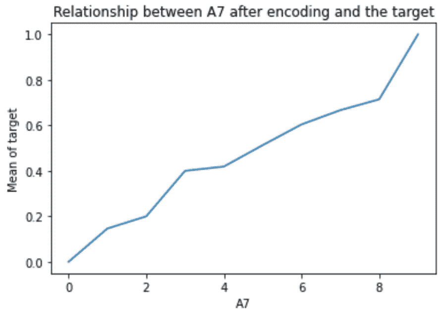

图 2.9 – 编码后 A7 每个类别的目标值平均值

现在，让我们使用 `feature-engine` 执行有序顺序编码。

1.  让我们导入编码器：

    ```py
    from feature_engine.encoding import OrdinalEncoder
    ```

1.  接下来，让我们设置编码器，使其根据目标平均值将整数分配给数据集中的所有分类变量：

    ```py
    ordinal_enc = OrdinalEncoder(
        encoding_method="ordered",
        variables=None)
    ```

注意

`OrdinalEncoder()` 将自动查找并编码所有分类变量。要限制编码到变量的子集，将它们的名称作为列表传递给 `variables` 参数。要编码数值变量，设置 `ignore_format=True`。

1.  让我们将编码器拟合到训练集，以便它找到分类变量，然后存储类别和整数映射：

    ```py
    ordinal_enc.fit(X_train, y_train)
    ```

1.  最后，让我们在训练集和测试集中将类别替换为数字：

    ```py
    X_train_enc = ordinal_enc.transform(X_train)
    X_test_enc = ordinal_enc.transform(X_test)
    ```

注意

你将在 `encoder_dict_` 属性中找到替换每个类别的数字。

通过执行 `X_train_enc.head()` 来查看转换的输出。

## 它是如何工作的...

在这个配方中，我们根据目标平均值将类别替换为整数。

在本食谱的第一部分，我们处理了`A7`分类变量。使用`pandas`的`groupby()`函数，我们根据`A7`的分类对数据进行分组，并使用`pandas`的`mean()`函数确定每个分类的目标均值。接下来，我们使用`pandas`的`sort_values()`函数按目标均值响应从低到高对分类进行排序。这个操作的输出是一个`pandas`系列，其中分类作为索引，目标均值作为值。使用`pandas`的`index`，我们将排序后的分类存储在一个数组中；然后，使用 Python 字典推导式创建了一个分类到整数的字典对。最后，我们使用这个字典通过`pandas`的`map()`函数将分类替换为整数。

注意

为了避免数据泄露，我们从训练集中确定分类到整数的映射。

要使用`feature-engine`执行编码，我们使用了`OrdinalEncoder()`，将`encoding_method`设置为`ordered`。我们将变量参数设置为`None`，以便编码器自动检测数据集中的所有分类变量。使用`fit()`，编码器找到了分类变量，并根据目标均值值分配数字给它们的分类。分类变量的名称和分类到数字对的字典分别存储在`variables_`和`encoder_dict_`属性中。最后，使用`transform()`，我们在训练集和测试集中用数字替换了分类，返回`pandas`数据框。

## 参见

要查看使用分类编码器的本食谱的实现，请访问本书的 GitHub 仓库：[`github.com/PacktPublishing/Python-Feature-engineering-Cookbook-Third-Edition/blob/main/ch02-categorical-encoding/Recipe-05-Ordered-ordinal-encoding.ipynb`](https://github.com/PacktPublishing/Python-Feature-engineering-Cookbook-Third-Edition/blob/main/ch02-categorical-encoding/Recipe-05-Ordered-ordinal-encoding.ipynb)。

# 实现目标均值编码

**均值编码**或**目标编码**将每个分类映射到目标属性的预测概率。如果目标是二元的，数值映射是目标在给定分类值条件下的后验概率。如果目标是连续的，数值表示是给定分类值的目标的期望值。

在其最简单形式中，每个类别的数值表示由特定类别组的目标变量的平均值给出。例如，如果我们有一个`City`变量，类别为`London`、`Manchester`和`Bristol`，我们想要预测违约率（目标取值为`0`和`1`）；如果`London`的违约率是 30%，我们将`London`替换为`0.3`；如果`Manchester`的违约率是 20%，我们将`Manchester`替换为`0.2`；依此类推。如果目标是连续的——比如说我们想要预测收入——那么我们将`London`、`Manchester`和`Bristol`替换为每个城市所赚取的平均收入。

从数学的角度来看，如果目标是二元的，替换值*S*的确定如下：

![<mml:math xmlns:mml="http://www.w3.org/1998/Math/MathML" xmlns:m="http://schemas.openxmlformats.org/officeDocument/2006/math" display="block"><mml:msub><mml:mrow><mml:mi>S</mml:mi></mml:mrow><mml:mrow><mml:mi>i</mml:mi></mml:mrow></mml:msub><mml:mo>=</mml:mo><mml:msub><mml:mrow><mml:mi>n</mml:mi></mml:mrow><mml:mrow><mml:mi>i</mml:mi><mml:mo>(</mml:mo><mml:mi>y</mml:mi><mml:mo>=</mml:mo><mml:mn>1</mml:mn><mml:mo>)</mml:mo></mml:mrow></mml:msub><mml:mo>/</mml:mo><mml:msub><mml:mrow><mml:mi>n</mml:mi></mml:mrow><mml:mrow><mml:mi>i</mml:mi></mml:mrow></mml:msub></mml:math>](img/1.png)

在这里，分子是类别*i*中具有目标值*1*的观测值的数量，分母是具有类别值*i*的观测值的数量。

如果目标是连续的，*S*，则由以下公式确定：

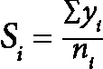

在这里，分子是类别*i*中观测值的总和，而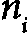是类别*i*中的观测值总数。

这些公式在存在足够多的每个类别值的观测值时提供了对目标估计的良好近似——换句话说，如果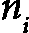很大。然而，在许多数据集中，将存在一些观测值中包含的类别。在这些情况下，从先前的公式中得出的目标估计可能不可靠。

为了减轻对罕见类别返回的估计不佳，目标估计可以确定为两种概率的混合：前一个公式返回的概率和基于整个训练的目标先验概率。这两个概率通过一个权重因子进行混合，该权重因子是类别组大小的函数：


在这个公式中， 是目标取值为 *1* 的总案例数，*N* 是训练集的大小，而 *𝜆* 是权重因子。

当类别组较大时，*𝜆* 趋向于 *1*，因此方程的第一项被赋予更多的权重。当类别组较小时，*𝜆* 趋向于 *0*，因此估计主要由方程的第二项驱动——即目标的先验概率。换句话说，如果组大小较小，知道类别值并不能告诉我们关于目标值的信息。

权重因子，*𝜆*，在不同的开源实现中确定方式不同。在 Category Encoders 中，*𝜆* 是组大小，*k*，以及平滑参数，*f* 的函数，它控制着前一个方程中第一项和第二项之间的转换速率：


在这里，*k* 是我们完全信任方程第一项的最小大小的一半。*f* 参数由用户任意选择或通过优化选择。

在 `scikit-learn` 和 `feature-engine` 中，*𝜆* 是整个数据集和类别内的目标方差的函数，并按以下方式确定：


在这里，*t* 是整个数据集的目标方差，而 *s* 是类别内的目标方差。两种实现方式是等效的，但了解这些方程式很重要，因为它们将帮助你在变压器中设置参数。

注意

平均编码旨在在不扩展特征空间的情况下编码高度基数分类变量。更多详情，请参阅以下文章：Micci-Barreca D. A.，《用于分类和预测问题中高基数分类属性的前处理方案》。ACM SIGKDD Explorations Newsletter，2001。

在这个配方中，我们将使用 `scikit-learn` 和 `feature-engine` 执行平均编码。

## 如何操作...

让我们从这个配方开始：

1.  导入 `pandas` 和数据拆分函数：

    ```py
    import pandas as pd
    from sklearn.model_selection import train_test_split
    ```

1.  让我们加载 Credit Approval 数据集并将其分为训练集和测试集：

    ```py
    data = pd.read_csv("credit_approval_uci.csv")
    X_train, X_test, y_train, y_test = train_test_split(
        data.drop(labels=["target"], axis=1),
        data["target"],
        test_size=0.3,
        random_state=0,
    )
    ```

1.  让我们导入 `scikit-learn` 中的变压器：

    ```py
    from sklearn.preprocessing import TargetEncoder
    from sklearn.compose import ColumnTransformer
    ```

1.  让我们创建一个包含分类变量名称的列表：

    ```py
    cat_vars = X_train.select_dtypes(
        include="O").columns.to_list()
    ```

1.  让我们将编码器设置为使用目标方差来确定权重因子，正如配方开头所述：

    ```py
    enc = TargetEncoder(smooth="auto", random_state=9)
    ```

1.  让我们将插补限制为分类变量：

    ```py
    ct = ColumnTransformer(
        [("encoder", enc, cat_vars)],
        remainder="passthrough",
    ).set_output(transform="pandas")
    ```

1.  让我们拟合编码器并转换数据集：

    ```py
    X_train_enc = ct.fit_transform(X_train, y_train)
    X_test_enc = ct.transform(X_test)
    ```

    通过执行 `X_train_enc.head()` 检查结果。

注意

`scikit-learn` 的 `TargetEncoder()` 的 `fit_transform()` 方法与 `fit().transform()` 的应用不等价。使用 `fit_transform()`，生成的数据集基于交叉验证方案训练折的局部拟合进行编码。这个功能是故意设计的，以防止机器学习模型过度拟合训练集。

现在，让我们使用 `feature-engine` 执行目标编码：

1.  让我们导入编码器：

    ```py
    from feature_engine.encoding import MeanEncoder
    ```

1.  让我们设置目标平均编码器，在应用平滑的同时编码所有分类变量：

    ```py
    mean_enc = MeanEncoder(smoothing="auto",
        variables=None)
    ```

注意

`MeanEncoder()` 默认不应用平滑。确保将其设置为 `auto` 或整数以控制先验和后验目标估计之间的混合。

1.  让我们将变压器拟合到训练集，以便它学习并存储每个变量每个类别的平均目标值：

    ```py
    mean_enc.fit(X_train, y_train)
    ```

1.  最后，让我们对训练集和测试集进行编码：

    ```py
    X_train_enc = mean_enc.transform(X_train)
    X_test_enc = mean_enc.transform(X_test)
    ```

注意

类别到数字对存储在 `encoder_dict_` 属性中的字典字典中。要显示存储的参数，执行 `mean_enc.encoder_dict_`。

## 它是如何工作的...

在这个配方中，我们使用 `scikit-learn` 和 `feature-engine` 将类别替换为平均目标值。

要使用 `scikit-learn` 进行编码，我们使用了 `TargetEncoder()`，将 `smooth` 参数保留为其默认值 `auto`。这样，变压器使用目标方差来确定概率混合的权重因子。使用 `fit()`，变压器学习它应该用来替换类别的值，而使用 `transform()`，它替换了类别。

注意，对于`TargetEncoder()`，`fit()`方法后面跟`transform()`方法并不返回与`fit_transform()`方法相同的数据集。后者基于交叉验证找到的映射来编码训练集。想法是在管道中使用`fit_transform()`，这样机器学习模型就不会过拟合。然而，这里变得有些复杂，存储在`encodings_`属性中的映射在`fit()`和`fit_transform()`之后是相同的，这是故意为之，以便当我们将`transform()`应用于新数据集时，无论我们是否将`fit()`或`fit_transform()`应用于训练集，我们都会获得相同的结果。

注意

未见过类别由`scikit-learn`的`TargetEncoder()`用目标均值进行编码。`feature-engine`的`MeanEncoder()`可以返回错误，用`nan`替换未见过类别，或者用目标均值替换。

使用`feature-engine`进行目标编码时，我们使用了`MeanEncoder()`，并将`smoothing`参数设置为`auto`。通过`fit()`方法，转换器找到了并存储了分类变量以及编码每个类别的值。通过`transform()`方法，它用数字替换了类别，返回`pandas`数据框。

## 还有更多...

如果你想使用`pandas`或类别编码器实现目标编码，请查看随附 GitHub 仓库中的笔记本：[`github.com/PacktPublishing/Python-Feature-engineering-Cookbook-Third-Edition/blob/main/ch02-categorical-encoding/Recipe-06-Target-mean-encoding.ipynb`](https://github.com/PacktPublishing/Python-Feature-engineering-Cookbook-Third-Edition/blob/main/ch02-categorical-encoding/Recipe-06-Target-mean-encoding.ipynb)。

当类别组较小时，有一种替代方法可以返回*更好的*目标估计。每个类别的替换值确定如下：


在这里，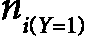 是类别 *i* 的目标均值，而  是具有类别 *i* 的观测数。目标先验由 *pY* 给出，而 *m* 是权重因子。通过这种调整，我们唯一需要设置的参数是权重，*m*。如果 *m* 较大，则更重视目标的先验概率。这种调整会影响所有类别的目标估计，但对于观测数较少的类别影响更大，因为在这些情况下，*m* 可能比公式分母中的 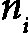 大得多。

注意

这种方法是 Category Encoders 的 `TargetEncoder()` 的良好替代品，因为在 Category Encoders 的目标编码实现中，我们需要优化两个参数而不是一个（正如我们在 `feature-engine` 和 `scikit-learn` 中所做的那样）来控制平滑度。

要了解使用 `MEstimateEncoder()` 实现此编码方法的示例，请访问此书的 GitHub 仓库：[`github.com/PacktPublishing/Python-Feature-engineering-Cookbook-Third-Edition/blob/main/ch02-categorical-encoding/Recipe-06-Target-mean-encoding.ipynb`](https://github.com/PacktPublishing/Python-Feature-engineering-Cookbook-Third-Edition/blob/main/ch02-categorical-encoding/Recipe-06-Target-mean-encoding.ipynb)。

# 使用证据权重进行编码

**证据权重**（**WoE**）主要是在信用和金融行业开发的，旨在促进变量筛选和探索性分析，并构建更预测性的线性模型来评估贷款违约的风险。

WoE 是从基本概率比计算得出的：

![<math xmlns="http://www.w3.org/1998/Math/MathML" display="block"><mrow><mrow><mi>WoE</mi><mo>=</mo><mi>log</mi><mrow><mrow><mo>(</mo><mfrac><mrow><mi>p</mi><mi>r</mi><mi>o</mi><mi>p</mi><mi>o</mi><mi>r</mi><mi>t</mi><mi>i</mi><mi>o</mi><mi>n</mi><mi>p</mi><mi>o</mi><mi>s</mi><mi>i</mi><mi>t</mi><mi>i</mi><mi>v</mi><mi>e</mi><mi>c</mi><mi>a</mi><mi>s</mi><mi>e</mi><mi>s</mi></mrow><mrow><mi>p</mi><mi>r</mi><mi>o</mi><mi>p</mi><mi>o</mi><mi>r</mi><mi>t</mi><mi>i</mi><mi>o</mi><mi>n</mi><mi>n</mi><mi>e</mi><mi>g</mi><mi>a</mi><mi>t</mi><mi>i</mi><mi>v</mi><mi>e</mi><mi>c</mi><mi>a</mi><mi>s</mi><mi>e</mi><mi>s</mi></mrow></mfrac><mo>)</mo></mrow></mrow></mrow></mrow></math>](img/13.png)

在这里，正负分别指目标值的*1*或*0*，每个类别的正例比例是每个类别组正例总和除以训练集中正例总数。每个类别的负例比例是每个类别组负例总和除以训练集中负观察值的总数。

WOE 具有以下特点：

+   当*p(正面)* / *p(负面)* = *1*时，WOE = *0*；也就是说，如果结果是随机的。

+   当*p(正面)* > *p(负面)*时，WOE > *0*。

+   当*p(负面)* > *p(正面)*时，WOE < *0*。

这使我们能够直接可视化变量中类别的预测能力：WOE 越高，事件发生的可能性越大。如果 WOE 为正，则事件很可能发生。

逻辑回归模型基于预测变量*X*的二进制响应*Y*，假设*X*与*Y*的对数优势之间存在线性关系：

![<math xmlns="http://www.w3.org/1998/Math/MathML" display="block"><mrow><mrow><mi>log</mi><mfenced open="(" close=")"><mfrac><mrow><mi>p</mi><mfenced open="(" close=")"><mrow><mi>Y</mi><mo>=</mo><mn>1</mn></mrow></mfenced></mrow><mrow><mi>p</mi><mfenced open="(" close=")"><mrow><mi>Y</mi><mo>=</mo><mn>0</mn></mrow></mfenced></mrow></mfrac></mfenced><mo>=</mo><msub><mi>b</mi><mn>0</mn></msub><mo>+</mo><msub><mi>b</mi><mn>1</mn></msub><msub><mi>X</mi><mn>1</mn></msub><mo>+</mo><msub><mi>b</mi><mn>2</mn></msub><msub><mi>X</mi><mn>2</mn></msub><mo>+</mo><mo>…</mo><mo>+</mo><msub><mi>b</mi><mi>n</mi></msub><msub><mi>X</mi><mi>n</mi></msub></mrow></mrow></math>](img/14.png)

这里，*log (p(Y=1)/p(Y=0))* 是优势比的对数。正如你所见，WOE 将类别编码在相同的尺度上——即优势比的对数——与逻辑回归的结果相同。

因此，通过使用 WOE，预测因子被准备并编码在同一尺度上，逻辑回归模型中的参数——即系数——可以直接比较。

在这个菜谱中，我们将使用`pandas`和`feature-engine`执行 WOE 编码。

## 如何做到这一点...

让我们先进行一些导入和准备数据：

1.  导入所需的库和函数：

    ```py
    import numpy as np
    import pandas as pd
    from sklearn.model_selection import train_test_split
    ```

1.  让我们加载 Credit Approval 数据集并将其分为训练集和测试集：

    ```py
    data = pd.read_csv("credit_approval_uci.csv")
    X_train, X_test, y_train, y_test = train_test_split(
        data.drop(labels=["target"], axis=1),
        data["target"],
        test_size=0.3,
        random_state=0,
    )
    ```

1.  让我们获取目标值的逆，以便能够计算负例：

    ```py
    neg_y_train = pd.Series(
        np.where(y_train == 1, 0, 1),
        index=y_train.index
    )
    ```

1.  让我们确定目标变量取值为`1`或`0`的观测数：

    ```py
    total_pos = y_train.sum()
    total_neg = neg_y_train.sum()
    ```

1.  现在，让我们计算我们之前在本菜谱中讨论的 WOE 公式的分子和分母：

    ```py
    pos = y_train.groupby(
        X_train["A1"]).sum() / total_pos
    neg = neg_y_train.groupby(
        X_train["A1"]).sum() / total_neg
    ```

1.  现在，让我们计算每个类别的 WOE 值：

    ```py
    woe = np.log(pos/neg)
    ```

    我们可以通过执行`print(woe)`来显示具有类别到 WOE 对的序列：

    ```py
    A1
    Missing    0.203599
    a          0.092373
    b         -0.042410
    A1 with the WoE in a copy of the datasets:

    ```

    X_train_enc = X_train.copy()

    X_test_enc = X_test.copy()

    X_train_enc["A1"] = X_train_enc["A1"].map(woe)

    X_test_enc["A1"] = X_test_enc["A1"].map(woe)

    ```py

    You can inspect the encoded variable by executing `X_train_enc["A1"].head()`.Now, let’s perform WoE encoding using `feature-engine`.
    ```

1.  让我们导入编码器：

    ```py
    from feature_engine.encoding import WoEEncoder
    ```

1.  接下来，让我们设置编码器以编码三个分类变量：

    ```py
    woe_enc = WoEEncoder(variables = ["A1", "A9", "A12"])
    ```

注意

对于稀少类别，可能会发生`p(0)=0`或`p(1)=0`的情况，这时除法或对数没有定义。为了避免这种情况，请按照*分组稀少或不常见类别*食谱中的方法将不常见的类别分组。

1.  让我们将转换器拟合到训练集，以便它学习并存储不同类别的 WoE：

    ```py
    woe_enc.fit(X_train, y_train)
    ```

注意

我们可以通过执行`woe_enc.encoder_dict_`来显示具有类别到 WoE 对的字典。

1.  最后，让我们将训练集和测试集中的三个分类变量进行编码：

    ```py
    X_train_enc = woe_enc.transform(X_train)
    X_test_enc = woe_enc.transform(X_test)
    ```

`feature-engine`返回包含编码好的分类变量的`pandas` DataFrame，这些变量可以用于机器学习模型。

## 它是如何工作的...

在这个食谱中，我们使用`pandas`和`feature-engine`对分类变量进行了 WoE 编码。

我们结合了`pandas`的`sum()`和`groupby()`以及`numpy`的`log()`，正如我们在本食谱开头所描述的那样，来确定 WoE。

接下来，我们使用`feature-engine`自动化了该过程。我们使用了`WoEEncoder()`，它使用`fit()`方法学习每个类别的 WoE，然后使用`transform()`将类别替换为相应的数字。

## 参见

要查看使用类别编码器的 WoE 的实现，请访问本书的 GitHub 仓库：[`github.com/PacktPublishing/Python-Feature-engineering-Cookbook-Third-Edition/blob/main/ch02-categorical-encoding/Recipe-07-Weight-of-evidence.ipynb`](https://github.com/PacktPublishing/Python-Feature-engineering-Cookbook-Third-Edition/blob/main/ch02-categorical-encoding/Recipe-07-Weight-of-evidence.ipynb)。

# 分组稀少或不常见的类别

稀少类别是指只存在于观测中一小部分的类别。没有规则可以确定多小可以被认为是小的，但通常，任何低于 5%的值都可以被认为是稀少的。

不常见的标签通常只出现在训练集或测试集中，这使得算法容易过拟合或无法评分观测。此外，当将类别编码为数字时，我们只为在训练集中观察到的类别创建映射，因此我们不知道如何编码新的标签。为了避免这些复杂性，我们可以将不常见的类别组合成一个称为`Rare`或`Other`的单个类别。

在这个食谱中，我们将使用`pandas`和`feature-engine`对不常见的类别进行分组。

## 如何做到这一点...

首先，让我们导入必要的 Python 库并准备好数据集：

1.  导入必要的 Python 库、函数和类：

    ```py
    import numpy as np
    import pandas as pd
    from sklearn.model_selection import train_test_split
    from feature_engine.encoding import RareLabelEncoder
    ```

1.  让我们加载 Credit Approval 数据集并将其分为训练集和测试集：

    ```py
    data = pd.read_csv("credit_approval_uci.csv")
    X_train, X_test, y_train, y_test = train_test_split(
        data.drop(labels=["target"], axis=1),
        data["target"],
        test_size=0.3,
        random_state=0,
    )
    ```

1.  让我们在变量`A7`中捕获每个类别的观测比例：

    ```py
    freqs = X_train["A7"].value_counts(normalize=True)
    ```

    在执行`print(freqs)`后，我们可以看到以下输出中`A7`每个类别的观测百分比，以小数表示：

    ```py
    v 0.573499
    h 0.209110
    ff 0.084886
    bb 0.080745
    z 0.014493
    dd 0.010352
    j 0.010352
    Missing 0.008282
    n 0.006211
    o 0.002070
    z, dd, j, Missing, n, and o are rare categories.
    ```

1.  让我们创建一个包含在超过 5%的观测中存在的类别名称的列表：

    ```py
    frequent_cat = [
        x for x in freqs.loc[freqs > 0.05].index.values]
    ```

    如果我们执行`print(frequent_cat)`，我们将看到`A7`的频繁类别：

    ```py
    Rare string in a copy of the datasets:

    ```

    X_train_enc = X_train.copy()

    X_test_enc = X_test.copy()

    X_train_enc["A7"] = np.where(X_train["A7"].isin(

    frequent_cat), X_train["A7"], "Rare")

    X_test_enc["A7"] = np.where(X_test["A7"].isin(

    frequent_cat), X_test["A7"], "Rare")

    ```py

    ```

1.  让我们确定编码变量中观测值的百分比：

    ```py
    X_train["A7"].value_counts(normalize=True)
    ```

    我们可以看到，不频繁的标签现在已经被重新分组到`Rare`类别中：

    ```py
    v       0.573499
    h       0.209110
    ff      0.084886
    bb      0.080745
    Rare    0.051760
    feature-engine.
    ```

1.  让我们创建一个稀少标签编码器，将少于 5%的观测值中存在的类别分组，前提是分类变量有超过四个不同的值：

    ```py
    rare_encoder = RareLabelEncoder(tol=0.05,
        n_categories=4)
    ```

1.  让我们拟合编码器，以便它找到分类变量，然后学习它们的频繁类别：

    ```py
    rare_encoder.fit(X_train)
    ```

注意

在拟合过程中，转换器将发出警告，表明许多分类变量少于四个类别，因此它们的值将不会被分组。转换器只是让你知道这种情况正在发生。

我们可以通过执行`rare_encoder.encoder_dict_`来显示每个变量的频繁类别，以及执行`rare_encoder.variables_`来显示将被编码的变量。

1.  最后，让我们在训练集和测试集中对稀少标签进行分组：

    ```py
    X_train_enc = rare_encoder.transform(X_train)
    X_test_enc = rare_encoder.transform(X_test)
    ```

现在我们已经分组了稀少标签，我们准备对分类变量进行编码，就像我们在本章前面的食谱中所做的那样。

## 它是如何工作的...

在这个食谱中，我们使用`pandas`和`feature-engine`将不频繁的类别分组。

我们使用`pandas`的`value_counts()`确定了`A7`变量每个类别的观测值比例，通过将`normalize`参数设置为`True`。使用列表推导，我们捕获了在超过 5%的观测值中存在的变量名称。最后，使用 NumPy 的`where()`，我们搜索`A7`的每一行，如果观测值是列表中的频繁类别之一，我们使用`pandas`的`isin()`进行检查，则保留其值；否则，将其替换为`Rare`。

我们使用`feature-engine`的`RareLabelEncoder()`自动化了前面多个分类变量的步骤。通过将`tol`设置为`0.05`，我们保留了在超过 5%的观测值中存在的类别。通过将`n_categories`设置为`4`，我们只对具有超过四个唯一值的变量中的类别进行分组。使用`fit()`，转换器识别了分类变量，然后学习并存储了它们的频繁类别。使用`transform()`，转换器将不频繁的类别替换为`Rare`字符串。

# 执行二进制编码

整数`1`可以用`1-0`的序列表示，整数`2`用`0-1`表示，整数`3`用`1-1`表示，而整数`0`用`0-0`表示。二进制字符串的两个位置的数字成为列，它们是原始变量的编码表示：

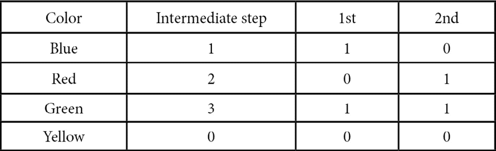

图 2.10 – 显示二进制编码颜色变量的步骤的表格

二进制编码在维度上比独热编码少。在我们的例子中，`Color`变量将通过独热编码编码为*k-1*类别——即三个变量——但使用二进制编码，我们可以只用两个特征来表示变量。更普遍地，我们确定编码一个变量所需的二进制特征数量为*log2(不同类别的数量)*；在我们的例子中，*log2(4) = 2*二进制特征。

二进制编码是一种替代独热编码的方法，在这种方法中我们不会丢失变量的信息，但在编码后我们获得的特征更少。这在处理高度基数变量时尤其有用。例如，如果一个变量包含 128 个独特的类别，使用独热编码，我们需要 127 个特征来编码这个变量，而使用二进制编码，我们只需要*7（log2(128)=7）*。因此，这种编码可以防止特征空间爆炸。此外，二进制编码的特征也适合线性模型。然而，从另一方面来看，派生的二进制特征缺乏人类可解释性，所以如果我们需要解释模型所做的决策，这种编码方法可能不是一个合适的选择。

在这个菜谱中，我们将学习如何使用类别编码器执行二进制编码。

## 如何做到这一点...

首先，让我们导入必要的 Python 库并准备好数据集：

1.  导入所需的 Python 库、函数和类：

    ```py
    import pandas as pd
    from sklearn.model_selection import train_test_split
    from category_encoders.binary import BinaryEncoder
    ```

1.  让我们加载 Credit Approval 数据集并将其分为训练集和测试集：

    ```py
    data = pd.read_csv("credit_approval_uci.csv")
    X_train, X_test, y_train, y_test = train_test_split(
        data.drop(labels=["target"], axis=1),
        data["target"],
        test_size=0.3,
        random_state=0,
    )
    ```

1.  让我们检查`A7`中的唯一类别：

    ```py
    X_train["A7"].unique()
    ```

    在下面的输出中，我们可以看到`A7`有 10 个不同的类别：

    ```py
    A7:

    ```

    encoder = BinaryEncoder(cols=["A7"],

    drop_invariant=True)

    ```py

    ```

注意

`BinaryEncoder()`以及类别编码器包中的其他编码器允许我们选择要编码的变量。我们只需将列名列表传递给`cols`参数。

1.  让我们将转换器拟合到训练集，以便它计算所需的二进制变量数量并创建变量到二进制代码表示：

    ```py
    encoder.fit(X_train)
    ```

1.  最后，让我们在训练集和测试集中对`A7`进行编码：

    ```py
    X_train_enc = encoder.transform(X_train)
    X_test_enc = encoder.transform(X_test)
    ```

    我们可以通过执行`print(X_train_enc.head())`来显示转换后训练集的前几行，它返回以下输出：

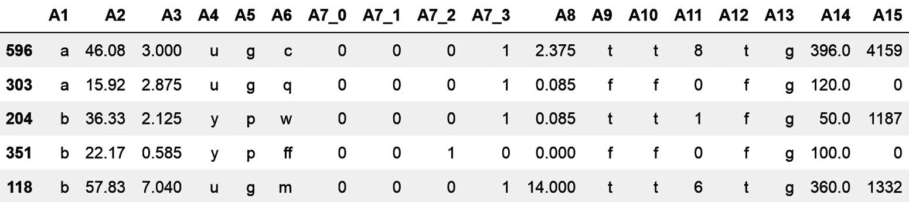

图 2.11 – 二进制编码后的变量 DataFrame

二进制编码为`A7`返回了四个二进制变量，分别是`A7_0`、`A7_1`、`A7_2`和`A7_3`，而不是独热编码会返回的九个。

## 它是如何工作的...

在这个食谱中，我们使用了 Category Encoders 包进行二进制编码。我们用`BinaryEncoder()`来编码`A7`变量。通过`fit()`方法，`BinaryEncoder()`创建了一个从类别到一组二进制列的映射，而通过`transform()`方法，编码器在训练集和测试集中对`A7`变量进行了编码。
