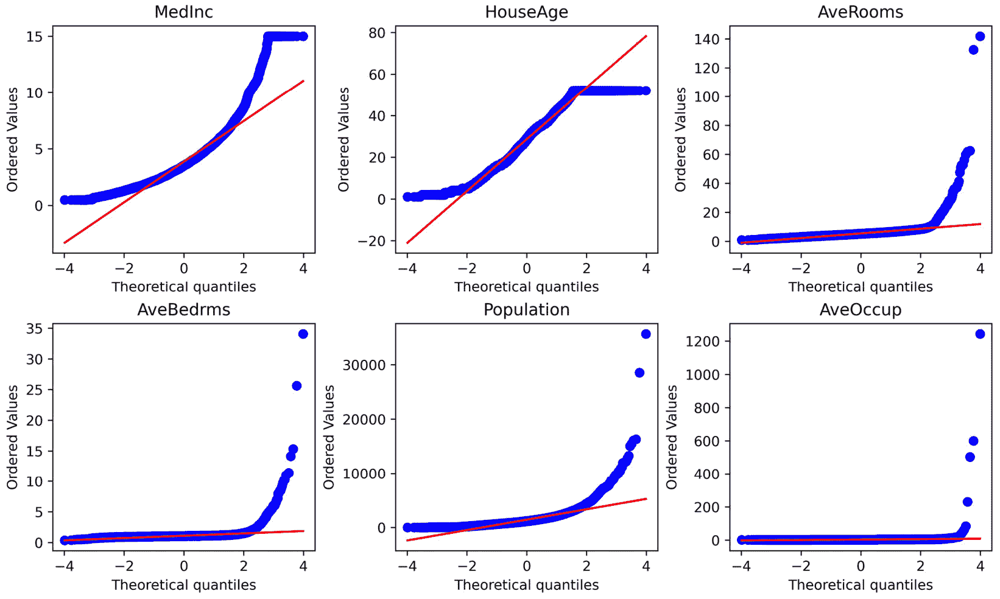

# 第三章：转换数值变量

在数据分析中使用的数据统计方法对数据做出某些假设。例如，在一般线性模型中，假设因变量（目标）的值是独立的，目标变量与自变量（预测变量）之间存在线性关系，以及残差——即预测值与目标真实值之间的差异——是正态分布且中心在`0`。当这些假设不成立时，产生的概率陈述可能不准确。为了纠正假设失败并提高模型性能，我们可以在分析之前对变量进行转换。

当我们转换一个变量时，我们用该变量的函数替换其原始值。使用数学函数转换变量有助于减少变量的偏度，提高值的分布范围，有时可以揭示预测变量与目标之间的线性关系和加性关系。常用的数学转换包括对数、倒数、幂、平方和立方根转换，以及 Box-Cox 和 Yeo-Johnson 转换。这一系列转换通常被称为**方差稳定转换**。方差稳定转换旨在将变量的分布带到更对称——即高斯——的形状。在本章中，我们将讨论何时使用每种转换，然后使用 NumPy、scikit-learn 和 Feature-engine 实现它们。

本章包含以下食谱：

+   使用对数函数转换变量

+   使用倒数函数转换变量

+   使用平方根转换变量

+   使用幂转换

+   执行 Box-Cox 转换

+   执行 Yeo-Johnson 转换

# 使用对数函数转换变量

对数函数是对处理具有右偏分布（观测值在变量的较低值处累积）的正面数据的一种强大转换。一个常见的例子是`收入`变量，其值在较低工资处有大量累积。对数转换对变量分布的形状有强烈的影响。

在本食谱中，我们将使用 NumPy、scikit-learn 和 Feature-engine 执行对数转换。我们还将创建一个诊断图函数来评估转换对变量分布的影响。

## 准备工作

为了评估变量分布并了解变换是否改善了值分布并稳定了方差，我们可以通过直方图和**分位数-分位数**（**Q-Q**）图来直观地检查数据。Q-Q 图帮助我们确定两个变量是否显示出相似的分布。在 Q-Q 图中，我们绘制一个变量的分位数与另一个变量的分位数。如果我们绘制感兴趣变量的分位数与正态分布的预期分位数，那么我们可以确定我们的变量是否也是正态分布的。如果变量是正态分布的，Q-Q 图中的点将沿着 45 度对角线分布。

注意

分位数是分布中低于某个数据点分数的值。因此，第 20 分位数是分布中 20%的观测值低于且 80%高于该值的点。

## 如何做到这一点...

让我们先导入库并准备数据集：

1.  导入所需的 Python 库和数据集：

    ```py
    import numpy as np
    import pandas as pd
    import matplotlib.pyplot as plt
    import scipy.stats as stats
    from sklearn.datasets import fetch_california_housing
    ```

1.  让我们将加利福尼亚住房数据集加载到 pandas DataFrame 中：

    ```py
    X, y = fetch_california_housing(return_X_y=True,
        as_frame=True)
    ```

1.  让我们通过使用 pandas 绘制直方图来探索数据集中所有变量的分布：

    ```py
    X.hist(bins=30, figsize=(12, 12))
    plt.show()
    ```

    在以下输出中，我们可以看到`MedInc`变量显示出轻微的右偏分布，例如`AveRooms`和`Population`这样的变量具有严重的右偏分布，而`HouseAge`变量在其范围内显示出值的均匀分布：

图 3


图 3.1 – 数值变量的直方图分布

1.  为了评估变换对变量分布的影响，我们将创建一个函数，该函数接受 DataFrame 和变量名作为输入，并在直方图旁边绘制 Q-Q 图：

    ```py
    def diagnostic_plots(df, variable):
        plt.figure(figsize=(15,6))
        plt.subplot(1, 2, 1)
        df[variable].hist(bins=30)
        plt.title(f"Histogram of {variable}")
        plt.subplot(1, 2, 2)
        stats.probplot(df[variable], dist="norm",
            plot=plt)
        plt.title(f"Q-Q plot of {variable}")
        plt.show()
    ```

1.  让我们使用第 4 步中的函数绘制`MedInc`变量的分布图：

    ```py
    diagnostic_plots(X, "MedInc")
    ```

    以下输出显示`MedInc`具有右偏分布：


图 3.2 – `MedInc`变量的直方图和 Q-Q 图

现在，让我们使用对数变换数据：

1.  首先，让我们复制原始 DataFrame：

    ```py
    X_tf = X.copy()
    ```

    我们创建了一个副本，这样我们就可以修改副本中的值，而不是原始 DataFrame 中的值，这对于本食谱的其余部分是必要的。

注意

如果我们执行`X_tf = X`而不是使用 pandas 的`copy()`函数，`X_tf`将不是 DataFrame 的副本；相反，它将是相同数据的另一个视图。因此，对`X_tf`所做的更改也将反映在`X`中。

1.  让我们创建一个包含我们想要变换的变量的列表：

    ```py
    vars = ["MedInc", "AveRooms", "AveBedrms",
        "Population"]
    ```

1.  让我们使用 NumPy 对第 7 步中的变量进行对数变换，并将变换后的变量捕获到新的 DataFrame 中：

    ```py
    X_tf[vars] = np.log(X[vars])
    ```

注意

记住，对数变换只能应用于严格正数变量。如果变量有零或负值，有时添加一个常数使这些值变为正数是有用的。我们可以使用`X_tf[vars] = np.log(X[vars] + 1)`添加一个常数值`1`。

1.  让我们使用*步骤 4* 中的诊断函数检查变换后的`MedInc`分布：

    ```py
    diagnostic_plots(X_tf, "MedInc")
    ```

    在以下输出中，我们可以看到对数变换返回了一个分布更均匀的变量，在 Q-Q 图中更好地逼近理论正态分布：


图 3.3 – 对数变换后 MedInc 变量的直方图和 Q-Q 图

继续绘制其他变换后的变量，以便熟悉对数变换对分布的影响。

现在，让我们使用`scikit-learn`应用对数变换。

1.  让我们导入`FunctionTransformer()`：

    ```py
    from sklearn.preprocessing import FunctionTransformer
    ```

    在我们继续之前，我们需要复制原始数据集，就像我们在*步骤 6* 中做的那样。

1.  我们将设置变换器以应用对数变换，并能够将变换后的变量恢复到其原始表示：

    ```py
    transformer = FunctionTransformer(np.log,
        inverse_func=np.exp)
    ```

注意

如果我们使用默认参数`validate=False`设置`FunctionTransformer()`，在变换数据之前不需要拟合变换器。如果我们把`validate`设置为`True`，变换器将检查`fit`方法的数据输入。后者在用 DataFrame 拟合变换器时很有用，以便它学习并存储变量名。

1.  让我们将*步骤 7* 中的正变量进行变换：

    ```py
    X_tf[vars] = transformer.transform(X[vars])
    ```

注意

Scikit-learn 变换器返回 NumPy 数组，并默认变换整个 DataFrame。在这种情况下，我们将数组的输出结果直接赋值给我们的现有 DataFrame。我们可以通过`set_output`方法更改返回的格式，并且我们可以通过`ColumnTransformer()`限制要变换的变量。

使用*步骤 4* 中的诊断函数检查变换的结果。

1.  现在，让我们将变换恢复到原始变量表示：

    ```py
    X_tf[vars] = transformer.inverse_transform(X_tf[vars])
    ```

    如果你通过执行`diagnostic_plots(X_tf, "MedInc")`检查分布，你应该看到一个与*步骤 5* 返回的相同的图。

注意

要给变量添加一个常数，以防它们不是严格正数，可以使用`transformer = FunctionTransformer(lambda x: np.log(x + 1))`。

现在，让我们使用 Feature-engine 应用对数变换。

1.  让我们导入`LogTransformer()`：

    ```py
    from feature_engine.transformation import LogTransformer
    ```

1.  我们将设置变换器以变换*步骤 7* 中的变量，然后拟合变换器到数据集：

    ```py
    lt = LogTransformer(variables = vars)
    lt.fit(X)
    ```

注意

如果`variables`参数留为`None`，`LogTransformer()`将对`fit()`期间找到的所有数值变量应用对数变换。或者，我们可以指定要修改的变量，就像我们在*步骤 15* 中做的那样。

1.  最后，让我们进行数据变换：

    ```py
    X_tf = lt.transform(X)
    ```

    `X_tf`是`X` DataFrame 的一个副本，其中*步骤 7*中的变量通过对数进行了变换。

1.  我们也可以将变换后的变量恢复到其原始表示：

    ```py
    X_tf = lt.inverse_transform(X_tf)
    ```

    如果你检查*步骤 17*之后的变量分布，它们应该与原始数据相同。

注意

Feature-engine 有一个专门的转换器，在应用对数变换之前向变量添加常数值。请在此菜谱的*更多内容…*部分查看更多详细信息。

## 它是如何工作的...

在这个菜谱中，我们使用 NumPy、scikit-learn 和 Feature-engine 对正变量子集应用了对数变换。

为了比较变换对变量分布的影响，我们创建了一个诊断函数，用于在直方图旁边绘制 Q-Q 图。为了创建 Q-Q 图，我们使用了`scipy.stats.probplot()`，它在*y*轴上绘制了感兴趣变量的分位数，与在*x*轴上设置`dist`参数为`norm`的理论正态分布的分位数进行比较。我们使用`matplotlib`通过设置`plot`参数为`plt`来显示图表。

使用`plt.figure()`和`figsize`，我们调整了图表的大小，并使用`plt.subplot()`将两个图表组织在一行两列中——也就是说，一个图表紧挨着另一个图表。`plt.subplot()`中的数字分别表示行数、列数和图表在图中的位置。我们将直方图放在位置 1，将 Q-Q 图放在位置 2——也就是说，左和右，分别。

为了测试函数，我们在变换之前为`MedInc`变量绘制了直方图和 Q-Q 图，观察到`MedInc`并不是正态分布。大多数观测值位于直方图的左侧，并且在分布的两端，Q-Q 图中的值偏离了 45 度线。

接下来，使用`np.log()`，我们对 DataFrame 中四个正变量的一个子集应用了对数变换。为了评估变换的效果，我们绘制了变换后的`MedInc`变量的直方图和 Q-Q 图。我们观察到，在对数变换之后，值在直方图中更加集中，并且在 Q-Q 图中，它们只在分布的两端偏离了 45 度线。

接下来，我们使用了 scikit-learn 的`FunctionTransformer()`，它将任何用户定义的函数应用于数据集。我们将`np.log()`作为参数传递以应用对数变换，并将 NumPy 的`exp()`用于逆变换到`FunctionTransformer()`。使用`transform()`方法，我们通过对数变换对 DataFrame 中正变量的一个子集进行了变换。使用`inverse_transform()`，我们将变量值恢复到其原始表示。

最后，我们使用了 Feature-engine 的 `LogTransformer()` 并使用 `variables` 参数指定要转换的变量列表。使用 `fit()`，转换器检查变量是否为数值且为正，使用 `transform()`，在底层应用 `np.log()` 来转换选定的变量。使用 `inverse_transform()`，我们将转换后的变量恢复到其原始表示。

## 还有更多...

Feature-engine 有一个专门的转换器用于在应用对数之前向不是严格正的变量添加常数：`LogCpTransformer()`。`LogCpTransformer()` 可以：

+   将相同的常数添加到所有变量中

+   自动识别并添加使变量为正所需的最小值

+   将用户定义的不同值添加到不同的变量中。

您可以在本书的 GitHub 仓库中找到 `LogCpTransformer()` 的代码实现：[`github.com/PacktPublishing/Python-Feature-Engineering-Cookbook-Third-Edition/blob/main/ch03-variable-transformation/Recipe-1-logarithmic-transformation.ipynb`](https://github.com/PacktPublishing/Python-Feature-Engineering-Cookbook-Third-Edition/blob/main/ch03-variable-transformation/Recipe-1-logarithmic-transformation.ipynb)

# 使用逆函数变换变量

逆函数定义为 1/x。当我们有比率时，它通常很有用，即两个变量的除法结果。这类例子包括**人口密度**，即每单位面积的人数，以及我们将在本食谱中看到的**房屋占用率**，即每户的人数。

逆变换对于 `0` 值未定义，尽管对于负值是定义的，但它主要用于转换正变量。

在本食谱中，我们将使用 `NumPy`、`scikit-learn` 和 `Feature-engine` 实现逆变换，并使用直方图和 Q-Q 图比较其对变量分布的影响。

## 如何操作...

让我们先导入库并准备数据集：

1.  导入所需的 Python 库和数据：

    ```py
    import numpy as np
    import pandas as pd
    import matplotlib.pyplot as plt
    import scipy.stats as stats
    from sklearn.datasets import fetch_california_housing
    ```

1.  让我们加载加利福尼亚住房数据集：

    ```py
    X, y = fetch_california_housing(return_X_y=True,
        as_frame=True)
    ```

1.  为了评估变量分布，我们将创建一个函数，该函数接受 DataFrame 和变量名作为输入，并在 Q-Q 图旁边绘制直方图：

    ```py
    def diagnostic_plots(df, variable):
        plt.figure(figsize=(15,6))
        plt.subplot(1, 2, 1)
        df[variable].hist(bins=30)
        plt.title(f"Histogram of {variable}")
        plt.subplot(1, 2, 2)
        stats.probplot(df[variable], dist="norm",
            plot=plt)
        plt.title(f"Q-Q plot of {variable}")
        plt.show()
    ```

1.  现在，让我们绘制 `AveOccup` 变量的分布图，该变量指定了房屋的平均占用率：

    ```py
    diagnostic_plots(X, "AveOccup")
    ```

    `AveOccup` 变量显示出非常强的右偏分布，如下面的输出所示：


图 3.4 – AveOccup 变量的直方图和 Q-Q 图

注意

`AveOccup` 变量指的是平均家庭人数——即某区域内人数与房屋数量的比率。这是一个适合倒数转换的有前途的变量。您可以通过执行 `data = fetch_california_housing()` 然后跟 `print(data.DESCR)` 来找到更多关于变量和数据集的详细信息。

现在，让我们使用 NumPy 应用倒数转换。

1.  首先，让我们复制原始 DataFrame，以便我们可以修改副本中的值，而不是原始 DataFrame 中的值，这对于本食谱的其余部分是必需的：

    ```py
    X_tf = X.copy()
    ```

注意

记住，执行 `X_tf = X` 而不是使用 pandas 的 `copy()` 会创建相同数据的额外视图。因此，在 `X_tf` 中所做的更改也会反映在 `X` 中。

1.  让我们将倒数转换应用于 `AveOccup` 变量：

    ```py
    X_tf["AveOccup"] = np.reciprocal(X_tf["AveOccup"])
    ```

1.  让我们使用我们在 *第 3 步* 中创建的诊断函数检查转换后 `AveOccup` 变量的分布：

    ```py
    diagnostic_plots(X_tf, "AveOccup")
    ```

注意

转换后，`AveOccup` 现在是某个区域内房屋数量与人口数量的比率——换句话说，每公民房屋数。

在这里，我们可以看到倒数转换后 `AveOccup` 变量分布的显著变化：


图 3.5 – 倒数转换后 AveOccup 变量的直方图和 Q-Q 图

现在，让我们使用 `scikit-learn` 应用倒数转换。

1.  让我们导入 `FunctionTransformer()`：

    ```py
    from sklearn.preprocessing import FunctionTransformer
    ```

1.  让我们通过传递 `np.reciprocal` 作为参数来设置转换器：

    ```py
    transformer = FunctionTransformer(np.reciprocal)
    ```

注意

默认情况下，`FunctionTransformer()` 在转换数据之前不需要拟合。

1.  现在，让我们复制原始数据集并转换变量：

    ```py
    X_tf = X.copy()
    X_tf["AveOccup"] = transformer.transform(
        X["AveOccup"])
    ```

    您可以使用 *第 3 步* 中的函数来检查转换的效果。

注意

倒数函数的逆变换也是倒数函数。因此，如果您重新对转换后的数据应用 `transform()`，您将将其还原为其原始表示。更好的做法是将 `FunctionTransformer()` 的 `inverse_transform` 参数设置为 `np.reciprocal`。

现在，让我们使用 `feature-engine` 应用倒数转换。

1.  让我们导入 `ReciprocalTransformer()`：

    ```py
    from feature_engine.transformation import ReciprocalTransformer
    ```

1.  让我们设置转换器以修改 `AveOccup` 变量，然后将其拟合到数据集中：

    ```py
    rt = ReciprocalTransformer(variables=»AveOccup»)
    rt.fit(X)
    ```

注意

如果将 `variables` 参数设置为 `None`，则转换器将倒数函数应用于数据集中的 *所有数值变量*。如果某些变量包含 `0` 值，转换器将引发错误。

1.  让我们将数据集中的选定变量进行转换：

    ```py
    X_tf = rt.transform(X)
    ```

    `ReciprocalTransformer()` 将返回一个新的包含原始变量的 pandas DataFrame，其中在第 *12 步* 指示的变量通过倒数函数进行了转换。

## 它是如何工作的...

在本配方中，我们使用 NumPy、scikit-learn 和 Feature-engine 应用了倒数转换。

为了评估变量分布，我们使用了函数来绘制直方图和 Q-Q 图，这些图在我们本章前面关于“使用对数函数转换变量”的*How it works…*部分中进行了描述。

我们绘制了`AveOccup`变量的直方图和 Q-Q 图，这显示了严重的右偏分布；其大部分值位于直方图的左侧，并且在 Q-Q 图中偏离了向右端分布的 45 度线。

为了执行互变转换，我们对变量应用了`np.reciprocal()`。转换后，`AveOccup`的值在值范围内分布得更均匀，并且在 Q-Q 图中更紧密地遵循正态分布的理论分位数。

接下来，我们使用 scikit-learn 的`FunctionTransformer()`与`np.reciprocal()`。`transform()`方法将`np.reciprocal()`应用于数据集。

注意

要将`FunctionTransformer()`的效果限制为一组变量，请使用`ColumnTransformer()`。要将输出更改为 pandas DataFrame，请将转换输出设置为 pandas。

最后，我们使用 Feature-engine 的`ReciprocalTransformer()`专门修改了一个变量。通过`fit()`，转换器检查变量是否为数值型。通过`transform()`，转换器在幕后应用`np.reciprocal()`以转换变量。

Feature-engine 的`ReciprocalTransformer()`通过`inverse_transform()`方法提供将变量恢复到其原始表示的功能。

注意

使用 scikit-learn 或 Feature-engine 的转换器，而不是 NumPy 的`reciprocal()`函数，允许我们在 scikit-learn 的`Pipeline`对象中作为特征工程管道的额外步骤应用倒数函数。

`FunctionTransformer()`与`ReciprocalTransformer()`之间的区别在于，前者可以应用任何用户指定的转换，而后者仅应用倒数函数。scikit-learn 默认返回 NumPy 数组并转换数据集中的所有变量。另一方面，Feature-engine 的转换器返回 pandas DataFrame，并且可以在不使用额外类的情况下修改数据中的变量子集。

# 使用平方根转换变量

平方根转换，**√x**，以及其变体，Anscombe 转换，**√(x+3/8)**，和 Freeman-Tukey 转换，**√x + √(x+1)**，是方差稳定转换，可以将具有泊松分布的变量转换为具有近似标准高斯分布的变量。平方根转换是一种幂转换形式，其指数为**1/2**，并且仅对正值有定义。

泊松分布是一种概率分布，表示事件可能发生的次数。换句话说，它是一种计数分布。它是右偏斜的，其方差等于其均值。可能遵循泊松分布的变量示例包括客户的金融项目数量，例如当前账户或信用卡的数量，车辆上的乘客数量，以及家庭中的居住者数量。

在这个菜谱中，我们将使用 NumPy、scikit-learn 和 Feature-engine 实现平方根变换。

## 如何操作...

我们首先创建一个包含两个变量的数据集，这两个变量的值是从泊松分布中抽取的：

1.  让我们先导入必要的库：

    ```py
    import numpy as np import pandas as pd
    import scipy.stats as stats
    ```

1.  让我们创建一个包含两个变量的 DataFrame，这两个变量分别从均值为 `2` 和 `3` 的泊松分布中抽取，并且有 `10000` 个观测值：

    ```py
    df = pd.DataFrame()
    df["counts1"] = stats.poisson.rvs(mu=3, size=10000)
    df["counts2"] = stats.poisson.rvs(mu=2, size=10000)
    ```

1.  让我们创建一个函数，该函数接受 DataFrame 和变量名作为输入，并在 Q-Q 图旁边绘制每个值的观测数条形图：

    ```py
    def diagnostic_plots(df, variable):
        plt.figure(figsize=(15,6))
        plt.subplot(1, 2, 1)
        df[variable].value_counts().sort_index(). plot.bar()
        plt.title(f"Histogram of {variable}")
        plt.subplot(1, 2, 2)
        stats.probplot(df[variable], dist="norm",
            plot=plt)
        plt.title(f"Q-Q plot of {variable}")
        plt.show()
    ```

1.  让我们使用第 *3* 步中的函数创建一个条形图和 Q-Q 图，用于数据中的一个变量：

    ```py
    diagnostic_plots(df, "counts1")
    ```

    在这里，我们可以看到输出中的泊松分布：


图 3.6 – counts1 变量的条形图和 Q-Q 图

1.  现在，让我们复制数据集：

    ```py
    df_tf = df.copy()
    ```

1.  让我们将平方根变换应用于两个变量：

    ```py
    df_tf[["counts1", "counts2"]] = np.sqrt(
        df[["counts1","counts2"]])
    ```

1.  让我们将值四舍五入到两位小数，以便更好地可视化：

    ```py
    df_tf[["counts1", "counts2"]] = np.round(
        df_tf[["counts1", "counts2"]], 2)
    ```

1.  让我们绘制 `counts1` 变量变换后的分布图：

    ```py
    diagnostic_plots(df_tf, "counts1")
    ```

    我们看到方差更加 **稳定**，因为 Q-Q 图中的点更接近 45 度对角线：


图 3.7 – 平方根变换后 counts1 变量的条形图和 Q-Q 图

现在，让我们使用 `scikit-learn` 应用平方根变换：

1.  让我们导入 `FunctionTransformer()` 并将其设置为执行平方根变换：

    ```py
    from sklearn.preprocessing import FunctionTransformer
    transformer = FunctionTransformer(
        np.sqrt).set_output(transform="pandas")
    ```

注意

如果我们想要像在第 *7* 步中那样四舍五入值，我们可以使用 `transformer = FunctionTransformer(func=lambda x: np.round(np.sqrt(x), 2))` 设置变换器。

1.  让我们复制数据并变换变量：

    ```py
    df_tf = df.copy()
    df_tf = transformer.transform(df)
    ```

    按照我们在 *第 8 步* 中所做的那样，继续检查变换的结果。

    要使用 Feature-engine 应用平方根变换，我们使用指数为 0.5 的 `PowerTransformer()`：

    ```py
    from feature_engine.transformation import PowerTransformer
    root_t = PowerTransformer(exp=1/2)
    ```

1.  接下来，我们将变换器拟合到数据上：

    ```py
    root_t.fit(df)
    ```

注意

变换器自动识别数值变量，我们可以通过执行 `root_t.variables_` 来探索。

1.  最后，让我们对数据进行变换：

    ```py
    df_tf = root_t.transform(df)
    ```

    `PowerTransformer()` 返回一个包含变换变量的 pandas DataFrame。

## 它是如何工作的…

在这个菜谱中，我们使用了 NumPy、scikit-learn 和 Feature-engine 实现了平方根变换。

我们使用 NumPy 的`sqrt()`函数直接或在其内部使用 scikit-learn 的`FunctionTransformer()`来确定变量的平方根。或者，我们使用 Feature-engine 的`PowerTransformer()`，将指数设置为平方根函数的 0.5。NumPy 直接修改了变量。scikit-learn 和 Feature-engine 的转换器在调用`transform()`方法时修改了变量。

# 使用幂变换

幂函数是遵循格式的数学变换，其中 lambda 可以取任何值。平方根和立方根变换是幂变换的特殊情况，其中 lambda 分别为 1/2 和 1/3。挑战在于找到 lambda 参数的值。Box-Cox 变换，作为幂变换的推广，通过最大似然估计找到最优的 lambda 值。我们将在下一个菜谱中讨论 Box-Cox 变换。在实践中，我们将尝试不同的 lambda 值，并通过视觉检查变量分布来确定哪一个提供了最佳的变换。一般来说，如果数据是右偏斜的——也就是说，如果观测值累积在较低值附近——我们使用小于 1 的 lambda 值，而如果数据是左偏斜的——也就是说，在较高值附近的观测值更多——那么我们使用大于 1 的 lambda 值。

在这个菜谱中，我们将使用 NumPy、scikit-learn 和 Feature-engine 执行幂变换。

## 如何做到这一点...

让我们先导入库并准备好数据集：

1.  导入所需的 Python 库和类：

    ```py
    import numpy as np
    import pandas as pd
    from sklearn.datasets import fetch_california_housing
    from sklearn.preprocessing import FunctionTransformer
    from feature_engine.transformation import PowerTransformer
    ```

1.  让我们将加利福尼亚住房数据集加载到一个 pandas DataFrame 中：

    ```py
    X, y = fetch_california_housing(
        return_X_y=True, as_frame=True)
    ```

1.  为了评估变量分布，我们将创建一个函数，该函数接受一个 DataFrame 和一个变量名作为输入，并在 Q-Q 图旁边绘制直方图：

    ```py
    def diagnostic_plots(df, variable):
        plt.figure(figsize=(15,6))
        plt.subplot(1, 2, 1)
        df[variable].hist(bins=30)
        plt.title(f"Histogram of {variable}")
        plt.subplot(1, 2, 2)
        stats.probplot(df[variable], dist="norm",
            plot=plt)
        plt.title(f"Q-Q plot of {variable}")
        plt.show()
    ```

1.  让我们使用之前的功能绘制`Population`变量的分布图：

    ```py
    diagnostic_plots(X, "Population")
    ```

    在前一个命令返回的图表中，我们可以看到`Population`严重向右偏斜：


图 3.8 – `Population`变量的直方图和 Q-Q 图

现在，让我们对`MedInc`和`Population`变量应用幂变换。由于这两个变量都向右偏斜，一个小于*1*的指数可能会使变量值分布得更好。

1.  让我们将要变换的变量捕获到一个列表中：

    ```py
    variables = ["MedInc", "Population"]
    ```

1.  让我们复制 DataFrame，然后对*步骤 5*中的变量应用幂变换，其中指数为`0.3`：

    ```py
    X_tf = X.copy()
    X_tf[variables] = np.power(X[variables], 0.3)
    ```

注意

使用`np.power()`，我们可以通过改变函数第二个位置中的指数值来应用任何幂变换。

1.  让我们检查 `Population` 分布的变化：

    ```py
    diagnostic_plots(X_tf, "Population")
    ```

    如前一个命令返回的图所示，`Population` 现在在值范围内分布得更均匀，并且更接近正态分布的分位数：


Figure 3.9 – 变换后的 Population 变量的直方图和 Q-Q 图

现在，让我们使用 scikit-learn 应用幂变换。

1.  让我们设置 `FunctionTransformer()`，使用指数为 `0.3` 的幂变换：

    ```py
    transformer = FunctionTransformer(
        lambda x: np.power(x,0.3))
    ```

1.  让我们复制 DataFrame 并将 *步骤 5* 中的变量进行转换：

    ```py
    X_tf = X.copy()
    X_tf[variables] = transformer.transform(X[variables])
    ```

    就这样 – 我们现在可以检查变量分布了。最后，让我们使用 Feature-engine 执行指数变换。

1.  让我们设置 `PowerTransformer()`，指数为 `0.3`，以转换 *步骤 5* 中的变量。然后，我们将它拟合到数据中：

    ```py
    power_t = PowerTransformer(variables=variables,
        exp=0.3)
    power_t.fit(X)
    ```

注意

如果我们不定义要转换的变量，`PowerTransformer()` 将选择并转换 DataFrame 中的所有数值变量。

1.  最后，让我们转换这两个变量：

    ```py
    X_tf = power_t.transform(X)
    ```

转换器返回一个包含原始变量的 DataFrame，其中 *步骤 5* 中指定的两个变量使用幂函数进行了转换。

## 它是如何工作的...

在这个配方中，我们使用了 NumPy、scikit-learn 和 Feature-engine 应用了幂变换。

要使用 NumPy 应用幂函数，我们应用了 `power()` 方法到包含要转换的变量的数据集切片。要使用 scikit-learn 应用此转换，我们在 `lambda` 函数中设置了 `FunctionTransformer()`，使用 `np.power()`，并将 `0.3` 作为指数。要使用 Feature-engine 应用幂函数，我们设置了 `PowerTransformer()`，其中包含要转换的变量列表和指数 `0.3`。

当我们调用 `transform()` 方法时，scikit-learn 和 Feature-engine 转换器应用了变换。scikit-learn 的 `FunctionTransformer()` 修改整个数据集，并默认返回 NumPy 数组。要返回 pandas DataFrame，我们需要将转换输出设置为 pandas，并且要应用转换到特定变量，我们可以使用 `ColumnTransformer()`。另一方面，Feature-engine 的 `PowerTransformer()` 可以直接应用于变量子集，并默认返回 pandas DataFrame。

# 执行 Box-Cox 变换

Box-Cox 变换是幂变换家族的推广，定义为如下：


在这里，*y* 是变量，*λ* 是转换参数。它包括变换的重要特殊情况，例如未转换的 *(λ = 1)*，对数 *(λ = 0)*，倒数 *(λ = - 1)*，平方根（当 *λ* *= 0.5* 时，它应用了一个缩放和移动的平方根函数），以及立方根。

Box-Cox 转换使用最大似然估计评估 *λ* 的几个值，并选择返回最佳转换的 *λ* 参数。

在这个菜谱中，我们将使用 scikit-learn 和 Feature-engine 执行 Box-Cox 转换。

注意

Box-Cox 转换只能用于正变量。如果你的变量有负值，尝试使用下一道菜谱中描述的 Yeo-Johnson 转换，即*执行 Yeo-Johnson 转换*。或者，你可以在转换前添加一个常数来改变变量的分布。

## 如何做到这一点...

让我们先导入必要的库并准备好数据集：

1.  导入所需的 Python 库和类：

    ```py
    import numpy as np
    import pandas as pd
    import scipy.stats as stats
    from sklearn.datasets import fetch_california_housing
    from sklearn.preprocessing import PowerTransformer
    from feature_engine.transformation import BoxCoxTransformer
    ```

1.  让我们将加利福尼亚住房数据集加载到 pandas DataFrame 中：

    ```py
    X, y = fetch_california_housing(
        return_X_y=True, as_frame=True)
    ```

1.  让我们删除 `Latitude` 和 `Longitude` 变量：

    ```py
    X.drop(labels=["Latitude", "Longitude"], axis=1,
        inplace=True)
    ```

1.  让我们使用直方图检查变量分布：

    ```py
    X.hist(bins=30, figsize=(12, 12), layout=(3, 3))
    plt.show()
    ```

    在以下输出中，我们可以看到 `MedInc` 变量显示出轻微的右偏分布，例如 `AveRooms` 和 `Population` 这样的变量具有严重的右偏分布，而 `HouseAge` 变量在其范围内显示出值的均匀分布：


图 3.10 – 数值变量的直方图

1.  让我们在下一步中使用这些变量之前，将变量名捕获到一个列表中：

    ```py
    variables = list(X.columns)
    ```

1.  让我们创建一个函数，该函数将为数据中的所有变量绘制 Q-Q 图，每行两个，每个三个：

    ```py
    def make_qqplot(df):
        plt.figure(figsize=(10, 6),
            constrained_layout=True)
        for i in range(6):
            # location in figure
            ax = plt.subplot(2, 3, i + 1)
            # variable to plot
            var = variables[i]
            # q-q plot
            stats.probplot((df[var]), dist="norm",
                plot=plt)
            # add variable name as title
            ax.set_title(var)
        plt.show()
    ```

1.  现在，让我们使用前面的函数显示 Q-Q 图：

    ```py
    make_qqplot(X)
    ```

    通过查看以下图表，我们可以证实变量不是正态分布的：



图 3.11 – 数值变量的 Q-Q 图

接下来，让我们使用 scikit-learn 执行 Box-Cox 转换。

1.  让我们设置 `PowerTransformer()` 以应用 Box-Cox 转换并将其拟合到数据中，以便找到最优的 *λ* 参数：

    ```py
    transformer = PowerTransformer(
        method="box-cox", standardize=False,
    ).set_output(transform="pandas")
    transformer.fit(X)
    ```

注意

为了避免数据泄露，*λ* 参数应该从训练集中学习，然后用于转换训练集和测试集。因此，在拟合 `PowerTransformer()` 之前，请记住将你的数据分成训练集和测试集。

1.  现在，让我们转换数据集：

    ```py
    X_tf = transformer.transform(X)
    ```

注意

scikit-learn 的 `PowerTransformer()` 将学习到的 lambda 值存储在其 `lambdas_` 属性中，你可以通过执行 `transformer.lambdas_` 来显示它。

1.  让我们通过直方图检查变换后数据的分布：

    ```py
    X_tf.hist(bins=30, figsize=(12, 12), layout=(3, 3))
    plt.show()
    ```

    在以下输出中，我们可以看到变量的值在其范围内分布得更均匀：


图 3.12 – 变换后变量的直方图

1.  现在，让我们返回变换后变量的 Q-Q 图：

    ```py
    make_qqplot(X_tf)
    ```

    在以下输出中，我们可以看到，经过变换后，变量更接近理论上的正态分布：


图 3.13 – 变换后变量的 Q-Q 图

现在，让我们使用 Feature-engine 实现 Box-Cox 变换。

1.  让我们设置 `BoxCoxTransformer()` 以转换数据集中的所有变量，并将其拟合到数据：

    ```py
    bct = BoxCoxTransformer()
    bct.fit(X)
    ```

1.  现在，让我们继续变换变量：

    ```py
    X_tf = bct.transform(X)
    ```

    变换返回一个包含修改后变量的 pandas DataFrame。

注意

scikit-learn 的 `PowerTransformer()` 将转换整个数据集。另一方面，Feature-engine 的 `BoxCoxTransformer()` 可以修改变量子集，如果我们设置转换器时将它们的名称列表传递给 `variables` 参数。如果将 `variables` 参数设置为 `None`，转换器将在 `fit()` 期间转换所有遇到的数值变量。

1.  Box-Cox 变换的最佳 lambda 值存储在 `lambda_dict_` 属性中。让我们检查一下：

    ```py
    bct.lambda_dict_
    ```

    上一条命令的输出如下：

    ```py
    {'MedInc': 0.09085449361507383,
    'HouseAge': 0.8093980940712507,
    'AveRooms': -0.2980048976549959,
    'AveBedrms': -1.6290002625859639,
    'Population': 0.23576757812051324,
    'AveOccup': -0.4763032278973292}
    ```

现在你已经知道如何使用两个不同的 Python 库实现 Box-Cox 变换。

## 它是如何工作的...

scikit-learn 的 `PowerTransformer()` 可以应用 Box-Cox 和 Yeo-Johnson 变换，因此我们在设置转换器时通过传递 `box-cox` 字符串指定了转换。接下来，我们将转换器拟合到数据，以便转换器学习每个变量的最佳 lambda 值。学习到的 lambda 值存储在 `lambdas_` 属性中。最后，我们使用 `transform()` 方法转换变量。

注意

记住，要返回 DataFrames 而不是数组，你需要通过 `set_output()` 方法指定转换输出。你可以通过使用 `ColumnTransformer()` 将转换应用于值子集。

最后，我们使用 Feature-engine 应用了 Box-Cox 转换。我们初始化 `BoxCoxTransformer()`，将参数 `variables` 设置为 `None`。因此，转换器在 `fit()` 期间自动找到了数据中的数值变量。我们将转换器拟合到数据中，使其学习每个变量的最佳 λ 值，这些值存储在 `lambda_dict_` 中，并使用 `transform()` 方法转换变量。Feature-engine 的 `BoxCoxTransformer()` 可以接受整个 DataFrame 作为输入，并且只修改选定的变量。

## 还有更多...

我们可以使用 SciPy 库应用 Box-Cox 转换。有关代码实现，请访问本书的 GitHub 仓库：[`github.com/PacktPublishing/Python-Feature-Engineering-Cookbook-Third-Edition/blob/main/ch03-variable-transformation/Recipe-5-Box-Cox-transformation.ipynb`](https://github.com/PacktPublishing/Python-Feature-Engineering-Cookbook-Third-Edition/blob/main/ch03-variable-transformation/Recipe-5-Box-Cox-transformation.ipynb)

# 执行 Yeo-Johnson 转换

Yeo-Johnson 转换是 Box-Cox 转换的扩展，不再受正值约束。换句话说，Yeo-Johnson 转换可以用于具有零和负值的变量，以及正值变量。这些转换如下定义：

+   ; 如果 λ ≠ 0 且 X >= 0

+   ln(X + 1 ); 如果 λ = 0 且 X >= 0

+   ; 如果 λ ≠ 2 且 X < 0

+   -ln(-X + 1); 如果 λ = 2 且 X < 0

当变量只有正值时，Yeo-Johnson 转换类似于变量加一的 Box-Cox 转换。如果变量只有负值，那么 Yeo-Johnson 转换类似于变量负值的 Box-Cox 转换加一，乘以 *2- λ* 的幂。如果变量既有正值又有负值，Yeo-Johnson 转换会对正负值应用不同的幂。

在本配方中，我们将使用 scikit-learn 和 Feature-engine 执行 Yeo-Johnson 转换。

## 如何实现...

让我们先导入必要的库并准备数据集：

1.  导入所需的 Python 库和类：

    ```py
    import numpy as np import pandas as pd
    import scipy.stats as stats
    from sklearn.datasets import fetch_california_housing
    from sklearn.preprocessing import PowerTransformer
    from feature_engine.transformation import YeoJohnsonTransformer
    ```

1.  让我们将加利福尼亚住房数据集加载到 pandas DataFrame 中，然后删除`Latitude`和`Longitude`变量：

    ```py
    X, y = fetch_california_housing(
        return_X_y=True, as_frame=True)
    X.drop(labels=[«Latitude», «Longitude»], axis=1,
        inplace=True)
    ```

注意

我们可以使用直方图和 Q-Q 图评估变量分布，就像我们在*步骤 4*到*7*的*执行 Box-Cox 变换*菜谱中所做的那样。

现在，让我们使用 scikit-learn 应用 Yeo-Johnson 变换。

1.  让我们设置`PowerTransformer()`使用`yeo-johnson`变换：

    ```py
    transformer = PowerTransformer(
        method="yeo-johnson", standardize=False,
    ).set_output(transform="pandas")
    ```

1.  让我们将转换器拟合到数据中：

    ```py
    transformer.fit(X)
    ```

注意

*λ*参数应该从训练集中学习，然后用于变换训练集和测试集。因此，在拟合`PowerTransformer()`之前，请记住将你的数据分为训练集和测试集。

1.  现在，让我们转换数据集：

    ```py
    X_tf = transformer.transform(X)
    ```

注意

`PowerTransformer()`将其学习到的参数存储在其`lambda_`属性中，你可以通过执行`transformer.lambdas_`来返回。

1.  让我们使用直方图检查变换数据的分布：

    ```py
    X_tf.hist(bins=30, figsize=(12, 12), layout=(3, 3))
    plt.show()
    ```

    在以下输出中，我们可以看到变量的值在其范围内分布得更均匀：


图 3.14 – yeo-Johnson 变换后变量的直方图

最后，让我们使用 Feature-engine 实现 Yeo-Johnson 变换。

1.  让我们设置`YeoJohnsonTransformer()`以转换所有数值变量，然后将其拟合到数据中：

    ```py
    yjt = YeoJohnsonTransformer()
    yjt.fit(X)
    ```

注意

如果将`variables`参数设置为`None`，转换器将选择并转换数据集中所有的数值变量。或者，我们可以传递一个包含要修改的变量名称的列表。

与 scikit-learn 的`PowerTransformer()`相比，Feature-engine 的转换器可以将整个 DataFrame 作为`fit()`和`transform()`方法的参数，同时它只会修改选定的变量。

1.  让我们转换变量：

    ```py
    X_tf = yjt.transform(X)
    ```

1.  `YeoJohnsonTransformer()`将其每个变量的最佳参数存储在其`lambda_dict_`属性中，我们可以如下显示：

    ```py
    yjt.lambda_dict_
    ```

    之前的命令返回以下字典：

    ```py
    {'MedInc': -0.1985098937827175,
    'HouseAge': 0.8081480895997063,
    'AveRooms': -0.5536698033957893,
    'AveBedrms': -4.3940822236920365,
    'Population': 0.23352363517075606,
    'AveOccup': -0.9013456270549428}
    ```

现在你已经知道了如何使用两个不同的开源库实现 Yeo-Johnson 变换。

## 它是如何工作的...

在这个菜谱中，我们使用了`scikit-learn`和`Feature-engine`应用了 Yeo-Johnson 变换。

`scikit-learn`的`PowerTransformer()`可以应用 Box-Cox 和 Yeo-Johnson 变换，因此我们使用`yeo-johnson`字符串指定了变换。`standardize`参数允许我们确定是否想要标准化（缩放）变换后的值。接下来，我们将转换器拟合到 DataFrame，以便它为每个变量学习最优的λ值。`PowerTransformer()`将学习到的λ值存储在其`lambdas_`属性中。最后，我们使用`transform()`方法返回变换后的变量。我们将变换输出设置为`pandas`，以便在变换后返回 DataFrame。

之后，我们使用 Feature-engine 应用了 Yeo-Johnson 转换。我们设置了`YeoJohnsonTransformer()`，以便在`fit()`过程中转换所有数值变量。我们将转换器拟合到数据上，以便它学习每个变量的最优 lambda 值，这些值存储在`lambda_dict_`中，并最终使用`transform()`方法转换变量。Feature-engine 的`YeoJohnnsonTransformer()`可以接受整个 DataFrame 作为输入，但它只会转换选定的变量。

## 还有更多……

我们可以使用 SciPy 库应用 Yeo-Johnson 转换。有关代码实现，请访问本书的 GitHub 仓库：[`github.com/PacktPublishing/Python-Feature-Engineering-Cookbook-Second-Edition/blob/main/ch03-variable-transformation/Recipe-6-Yeo-Johnson-transformation.ipynb`](https://github.com/PacktPublishing/Python-Feature-Engineering-Cookbook-Second-Edition/blob/main/ch03-variable-transformation/Recipe-6-Yeo-Johnson-transformation.ipynb)
