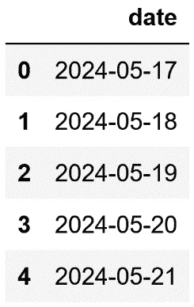
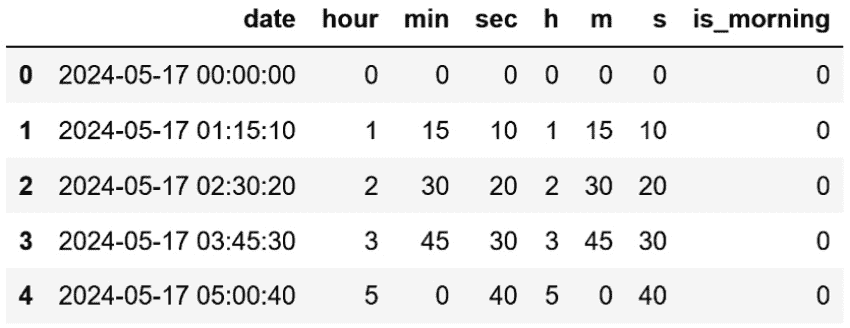
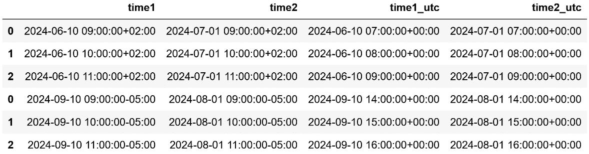
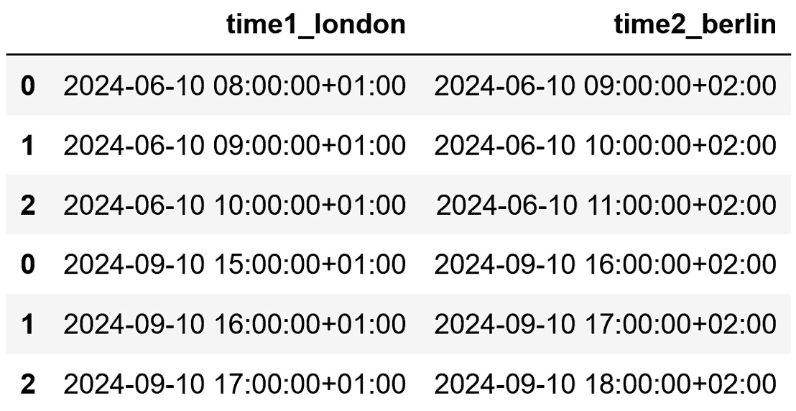
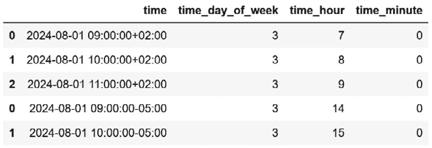

# 6

# 从日期和时间变量中提取特征

日期和时间变量包含有关日期、时间或两者的信息，在编程中，我们将其统称为 `datetime` 特征。出生日期、事件发生的时间以及最后付款的日期和时间都是 `datetime` 变量的例子。

由于其本质，`datetime` 特征通常具有高基数。这意味着它们包含大量唯一的值，每个值对应于特定的日期和/或时间组合。我们通常不会以原始格式使用 `datetime` 变量进行机器学习模型。相反，我们通过从这些变量中提取多个特征来丰富数据集。这些新特征通常具有较低的基数，并允许我们捕捉到有意义的 信息，如趋势、季节性和重要事件和趋势。

在本章中，我们将探讨如何通过利用 `pandas` 的 `dt` 模块来从日期和时间中提取特征，然后使用 `feature-engine` 自动化此过程。

本章将涵盖以下食谱：

+   使用 `pandas` 从日期中提取特征

+   使用 `pandas` 从时间中提取特征

+   捕获 `datetime` 变量之间的经过时间

+   在不同时区使用时间

+   使用 `feature-engine` 自动化 `datetime` 特征提取

# 技术要求

在本章中，我们将使用 `pandas`、`numpy` 和 `feature-engine` Python 库。

# 使用 pandas 从日期中提取特征

`datetime` 变量的值可以是日期、时间或两者兼有。我们将首先关注包含日期的变量。我们很少使用原始日期与机器学习算法结合。相反，我们提取更简单的特征，如年份、月份或星期几，这些特征使我们能够捕捉到季节性、周期性和趋势等洞察。

`pandas` Python 库非常适合处理日期和时间。通过使用 `pandas` 的 `dt` 模块，我们可以访问 `pandas` Series 的 `datetime` 属性以提取许多特征。然而，为了利用此功能，变量需要转换为支持这些操作的数据类型，例如 `datetime` 或 `timedelta`。

注意

当我们从 CSV 文件加载数据时，`datetime` 变量可以转换为对象。为了提取本章中将要讨论的日期和时间特征，有必要将变量重新转换为 `datetime`。

在这个食谱中，我们将学习如何通过使用 `pandas` 来提取日期特征。

## 准备工作

以下是我们可以使用 `pandas` 直接从 `datetime` 变量的 `date` 部分提取的一些特征：

+   `pandas.Series.dt.year`

+   `pandas.Series.dt.quarter`

+   `pandas.Series.dt.month`

+   `pandas.Series.dt.isocalendar().week`

+   `pandas.Series.dt.day`

+   `pandas.Series.dt.day_of_week`

+   `pandas.Series.dt.weekday`

+   `pandas.Series.dt.dayofyear`

+   `pandas.Series.dt.day_of_year`

我们可以使用 `pandas` 获得的特征来创建更多的特征，例如学期或是否是周末。我们将在下一节中学习如何做到这一点。

## 如何做到这一点...

为了继续这个食谱，让我们导入 `pandas` 和 `numpy`，并创建一个样本 DataFrame：

1.  让我们导入库：

    ```py
    import numpy as np
    import pandas as pd
    ```

1.  我们将首先创建从 `2024-05-17` 中午开始，然后每天增加 1 天的 20 个 `datetime` 值。然后，我们将这些值捕获在一个 `DataFrame` 实例中，并显示前五行：

    ```py
    rng_ = pd.date_range(
        "2024-05-17", periods=20, freq="D")
    data = pd.DataFrame({"date": rng_})
    data.head()
    ```

    在下面的输出中，我们可以看到我们在 *步骤 2* 中创建的包含日期的变量：



图 6.1 – 仅包含日期的 datetime 变量的 DataFrame 的顶部行

注意

我们可以通过执行 `data["date"].dtypes` 来检查变量的数据格式。如果变量被转换为对象类型，我们可以通过执行 `data["date_dt"] = pd.to_datetime(data["date"])` 来将其转换为 `datetime` 格式。

1.  让我们将日期的年份部分提取到一个新列中，并显示结果 DataFrame 的前五行：

    ```py
    data["year"] = data["date"].dt.year
    data.head()
    ```

    在下面的输出中，我们可以看到新的 `year` 变量：


图 6.2 – 从日期中提取的年份变量的 DataFrame 的前五行

1.  让我们将日期的季度提取到一个新列中，并显示前五行：

    ```py
    data["quarter"] = data["date"].dt.quarter
    data[["date", "quarter"]].head()
    ```

    在下面的输出中，我们可以看到新的 `quarter` 变量：


图 6.3 – 从日期中提取的季度变量的 DataFrame 的前五行

1.  使用 `quarter`，我们现在可以创建 `semester` 特征：

    ```py
    data["semester"] = np.where(data["quarter"] < 3, 1, 2)
    ```

注意

您可以使用 `pandas` 的 `unique()` 方法来探索新变量的不同值，例如，通过执行 `df["quarter"].unique()` 或 `df["semester"].unique()`。

1.  让我们将日期的 `month` 部分提取到一个新列中，并显示 DataFrame 的前五行：

    ```py
    data["month"] = data["date"].dt.month
    data[["date", "month"]].head()
    ```

    在下面的输出中，我们可以看到新的 `month` 变量：


图 6.4 – 包含新月份变量的 DataFrame 的前五行

1.  让我们将日期的周数（一年有 52 周）提取出来：

    ```py
    data["week"] = data["date"].dt.isocalendar().week
    data[["date", "week"]].head()
    ```

    在下面的输出中，我们可以看到 `week` 变量：


图 6.5 – 包含新周变量的 DataFrame 的前五行

1.  让我们将月份的日期提取出来，它可以取 `1` 到 `31` 之间的值，作为一个新列：

    ```py
    data["day_mo"] = data["date"].dt.day
    data[["date", "day_mo"]].head()
    ```

    在下面的输出中，我们可以看到 `day_mo` 变量：


图 6.6 – DataFrame 顶部行，包含表示月份天数的变量

1.  让我们提取星期几，其值在`0`到`6`之间（从星期一到星期日），在新的列中，然后显示顶部行：

    ```py
    data["day_week"] = data["date"].dt.dayofweek
    data[["date", "day_mo", "day_week"]].head()
    ```

    我们在以下输出中看到`day_week`变量：


图 6.7 – DataFrame 顶部行，包含表示一周天数的变量

1.  使用*步骤 9*中的变量，我们可以创建一个二元变量，表示是否为周末：

    ```py
    data["is_weekend"] = (
        data[«date»].dt.dayofweek > 4).astype(int)
    data[["date", "day_week", "is_weekend"]].head()
    ```

    我们在以下输出中看到新的`is_weekend`变量：


图 6.8 – 包含新变量 is_weekend 的 DataFrame 的前五行

注意

我们可以通过使用`feature-engine`来自动提取所有这些特征。查看本章中的*使用 feature-engine 自动化日期时间特征提取*配方以获取更多详细信息。

通过这样，我们已经使用`pandas`从`datetime`变量的日期部分提取了许多新特征。这些特征对数据分析、可视化和预测建模很有用。

## 它是如何工作的...

在本配方中，我们通过使用`pandas`的`dt`模块从`datetime`变量中提取了许多与日期相关的特征。首先，我们创建了一个包含日期的变量的样本 DataFrame。我们使用`pandas`的`date_range()`从任意日期开始创建一个值范围，并按`1`天的时间间隔增加。通过`periods`参数，我们指明了要创建的值范围的数量——即日期的数量。通过`freq`参数，我们指明了日期之间的步长大小。在我们的例子中，我们使用了`D`代表天数。最后，我们使用`pandas`的`DataFrame()`将日期范围转换为一个 DataFrame。

为了提取日期的不同部分，我们使用了`pandas`的`dt`来访问`pandas` Series 的`datetime`属性，然后利用不同的属性。我们使用`year`、`month`和`quarter`将年份、月份和季度捕获到 DataFrame 的新列中。为了找到学期，我们使用 NumPy 的`where()`结合新创建的`quarter`变量创建了一个布尔值。NumPy 的`where()`扫描`quarter`变量的值；如果它们小于`3`，则返回第一个学期的`1`值；否则，返回第二个学期的`2`值。

为了提取日期和周的不同表示形式，我们使用了`isocalender().week`、`day`和`dayofweek`属性。利用周几，我们进一步创建了一个二元变量来表示是否为周末。我们使用`where()`函数扫描周几，如果值大于`4`，即周六和周日，函数返回`True`，否则返回`False`。最后，我们将这个布尔向量转换为整数，以得到一个由 1 和 0 组成的二元变量。有了这个，我们就从日期中创建了多个特征，这些特征可以用于数据分析与预测建模。

## 还有更多...

使用`pandas`的`dt`模块，我们可以直接从日期中提取更多特征。例如，我们可以提取月份、季度或年份的开始和结束，是否为闰年，以及一个月中的天数。这些函数允许你做到这一点：

+   `pandas.Series.dt.is_month_start`

+   `pandas.Series.dt.is_month_end`

+   `pandas.Series.dt.is_quarter_start`

+   `pandas.Series.dt.is_quarter_end`

+   `pandas.Series.dt.is_year_start`

+   `pandas.Series.dt.is_year_end`

+   `pandas.Series.dt.is_leap_year`

+   `pandas.Series.dt.days_in_month`

我们也可以使用`pd.dt.days_in_month`返回特定月份的天数，以及一年中的某一天（从`1`到`365`）使用`pd.dt.dayofyear`。

想要了解更多详情，请访问`pandas`的`datetime`文档：[`pandas.pydata.org/pandas-docs/stable/user_guide/timeseries.html#time-date-components`](https://pandas.pydata.org/pandas-docs/stable/user_guide/timeseries.html#time-date-components).

## 参考以下内容

想要了解如何使用`pandas`的`date_ranges()`创建不同的`datetime`范围，请访问[`pandas.pydata.org/pandas-docs/stable/user_guide/timeseries.html#offset-aliases`](https://pandas.pydata.org/pandas-docs/stable/user_guide/timeseries.html#offset-aliases).

想要了解更多关于`pandas`的`dt`的信息，请访问[`pandas.pydata.org/pandas-docs/stable/reference/series.html#datetime-properties`](https://pandas.pydata.org/pandas-docs/stable/reference/series.html#datetime-properties).

# 使用 pandas 从时间中提取特征

一些事件在一天中的特定时间发生得更频繁——例如，欺诈活动更有可能在夜间或清晨发生。空气污染物浓度也随着一天中的时间变化，在交通高峰时段达到峰值，此时街道上有更多车辆。因此，从时间中提取特征对于数据分析和预测建模非常有用。在本例中，我们将通过使用`pandas`和 NumPy 来提取`datetime`变量的不同时间部分。

## 准备工作

我们可以使用以下`pandas`的`datetime`属性提取小时、分钟和秒：

+   `pandas.Series.dt.hour`

+   `pandas.Series.dt.minute`

+   `pandas.Series.dt.second`

## 如何做到这一点...

在本例中，我们将提取`time`变量的`hour`、`minute`和`second`部分。让我们首先导入库并创建一个样本数据集：

1.  让我们导入`pandas`和`numpy`：

    ```py
    import numpy as np
    import pandas as pd
    ```

1.  让我们从创建 20 个`datetime`观测值开始，从`2024-05-17`午夜开始，然后以 1 小时、15 分钟和 10 秒的增量增加。接下来，我们将时间范围捕获到 DataFrame 中，并显示前五行：

    ```py
    rng_ = pd.date_range(
        "2024-05-17", periods=20, freq="1h15min10s")
    df = pd.DataFrame({"date": rng_})
    df.head()
    ```

    在以下输出中，我们看到*步骤 2*中的变量，包含日期部分和时间部分，值以 1 小时、15 分钟和 10 秒的间隔增加：


图 6.9 – 包含日期时间变量的样本 DataFrame 的前五行

1.  让我们提取`hour`、`minute`和`second`部分，并将它们捕获到三个新列中，然后显示 DataFrame 的前五行：

    ```py
    df["hour"] = df["date"].dt.hour
    df["min"] = df["date"].dt.minute
    df["sec"] = df["date"].dt.second
    df.head()
    ```

    在以下输出中，我们看到我们在*步骤 3*中提取的三个`time`特征：


图 6.10 – 从时间派生出的 DataFrame 的前五行

注意

记住，`pandas`的`dt`需要一个`datetime`对象来工作。您可以使用`pandas`的`to_datetime()`函数将对象变量的数据类型更改为`datetime`。

1.  让我们执行与*步骤 3*中相同的操作，但现在是在一行代码中：

    ```py
    df[["h", "m", "s"]] = pd.DataFrame(
        [(x.hour, x.minute, x.second) for x in df["date"]]
    )
    df.head()
    ```

    在以下输出中，我们看到新创建的变量：


图 6.11 – 从时间派生出的 DataFrame 的前五行

注意

您可以使用`pandas`的`unique()`检查新变量的唯一值，例如，通过执行`df['hour'].unique()`。

1.  最后，让我们创建一个二进制变量，标记早上 6 点至中午 12 点之间发生的事件：

    ```py
    df["is_morning"] = np.where(
        (df[«hour»] < 12) & (df[«hour»] > 6), 1, 0 )
    df.head()
    ```

    我们在以下输出中看到`is_morning`变量：



图 6.12 – 从时间派生出的新变量的 DataFrame 的前几行

因此，我们从`datetime`变量的时间部分提取了多个特征。这些特征可用于数据分析预测建模。

## 它是如何工作的...

在本配方中，我们创建了捕获时间表示的特征。首先，我们创建了一个包含`datetime`变量的样本 DataFrame。我们使用`pandas`的`date_range()`函数创建了一个从任意日期开始，以 1 小时、15 分钟和 10 秒为间隔的 20 个值的范围。我们使用`1h15min10s`字符串作为`freq`参数的频率项，以指示所需的增量。接下来，我们使用`pandas`的`DataFrame()`将日期范围转换为 DataFrame。

为了提取不同时间部分，我们使用了 `pandas` 的 `dt` 来访问 `hour`、`minute` 和 `second` 时间属性。从 `time` 中提取 `hour` 后，我们使用它通过 NumPy 的 `where()` 创建一个新特征，以表示是否是上午。NumPy 的 `where()` 检查 `hour` 变量；如果其值小于 12 且大于 6，则分配值为 `1`；否则，分配值为 `0`。通过这些操作，我们在 DataFrame 中添加了几个可用于数据分析和训练机器学习模型的特征。

## 更多...

我们还可以使用以下 `pandas` 属性提取微秒和纳秒：

+   `pandas.Series.dt.microsecond`

+   `pandas.Series.dt.nanosecond`

更多详情，请访问 [`pandas.pydata.org/pandas-docs/stable/user_guide/timeseries.html#time-date-components`](https://pandas.pydata.org/pandas-docs/stable/user_guide/timeseries.html#time-date-components)。

# 捕捉 datetime 变量之间的经过时间

我们可以像在前两个菜谱中做的那样，单独从每个 `datetime` 变量中提取强大的特征。我们可以通过组合多个 `datetime` 变量来创建额外的特征。一个常见的例子是通过比较 **出生日期** 和 **事件日期** 来提取事件发生时的 **年龄**。

在本菜谱中，我们将学习如何通过利用 `pandas` 和 `feature-engine` 来捕捉两个 `datetime` 变量之间的时间。

## 如何操作...

为了继续本菜谱，我们将创建一个包含两个 `datatime` 变量的 DataFrame：

1.  让我们从导入 `pandas`、`numpy` 和 `datetime` 开始：

    ```py
    import datetime
    import numpy as np
    import pandas as pd
    ```

1.  我们将首先创建两个具有 20 个值的 `datetime` 变量；第一个变量的值从 `2024-05-17` 开始，以 `1` 小时的间隔增加，第二个变量以 `1` 个月的间隔增加。然后，我们将变量捕捉到 DataFrame 中，添加列名，并显示前几行：

    ```py
    date = "2024-05-17"
    rng_hr = pd.date_range(date, periods=20, freq="h")
    rng_month = pd.date_range(date, periods=20, freq="ME")
    df = pd.DataFrame(
        {"date1": rng_hr, "date2": rng_month})
    df.head()
    ```

    我们在以下输出中看到 *步骤 2* 中的 DataFrame 的前五行：


图 6.13 – 包含两个 datetime 变量的 DataFrame 的前五行

1.  让我们在新特征中捕捉两个变量之间的天数差异，然后显示 DataFrame 的前几行：

    ```py
    df["elapsed_days"] = (
        df["date2"] - df["date1"]).dt.days
    df.head()
    ```

    我们在以下输出中看到天数差异：


图 6.14 – 包含捕捉两个 datetime 特征时间差的新的变量的 DataFrame 的前几行

1.  让我们捕捉两个 `datetime` 变量之间的周数差异，然后显示 DataFrame 的前几行：

    ```py
    df["weeks_passed"] = (
        (df[«date2»] - df[«date1»]) / np.timedelta64(1, "W"))
    df.head()
    ```

    我们在以下屏幕截图中看到变量之间的周数差异：


图 6.15 – 一个 DataFrame，其中包含两个日期时间变量之间的时间差，以天数和周数表示

1.  现在，让我们计算变量之间的时间差（以分钟和秒为单位），然后显示 DataFrame 的前几行：

    ```py
    df["diff_seconds"] = (
        df[«date2»] - df[«date1»])/np.timedelta64(1, «s»)
    df["diff_minutes"] = (
        df[«date2»] - df[«date1»])/ np.timedelta64(1,»m»)
    df.head()
    ```

    我们在以下输出中看到新变量：


图 6.16 – 一个 DataFrame，其中包含两个日期时间变量之间的时间差，以不同的时间单位表示

1.  最后，让我们计算一个变量与当前日期之间的差异，以天数表示，然后显示 DataFrame 的前五行：

    ```py
    df["to_today"] = (
        datetime.datetime.today() - df["date1"])
    df.head()
    ```

    我们可以在以下输出中的 DataFrame 的最后一列找到新变量：


图 6.17 – 一个 DataFrame，其中包含包含 date1 与执行此代码的日期之间差异的新变量

注意

您计算机上的`to_today`变量将与此书中的不同，这是由于当前日期（写作时）与您执行代码时的差异。

那就是全部！我们现在已经通过比较两个`datetime`变量来创建新特征，丰富了我们的数据集。

## 它是如何工作的...

在这个菜谱中，我们捕捉了两个`datetime`变量之间时间差异的不同表示。为了继续这个菜谱，我们创建了一个包含两个变量的样本 DataFrame，每个变量从任意日期开始，有 20 个日期。第一个变量以`1`小时的间隔增加，而第二个变量以`1`个月的间隔增加。我们使用`pandas`的`date_range()`创建了这些变量，我们在本章前两个菜谱中讨论了它。

要确定变量之间的差异——即确定它们之间的时间——我们直接从一个`datetime`变量减去另一个——即从一个`pandas` Series 减去另一个。两个`pandas` Series 之间的差异返回了一个新的`pandas` Series。为了捕获天数差异，我们使用了`pandas`的`dt`，然后是`days`。要将时间差转换为月份，我们使用了 NumPy 的`timedelta()`，表示我们想要以周为单位传递`W`到方法的第二个参数。为了捕获秒和分钟的差异，我们分别传递了`s`和`m`字符串到`timedelta()`。

注意

NumPy 的`timedelta`的参数是一个数字，例如在我们的例子中是`-1`，表示单位数，以及一个`datetime`单位，如天（`D`）、周（`W`）、小时（`h`）、分钟（`m`）或秒（`s`）。

最后，我们捕捉了一个`datetime`变量与今天日期之间的差异。我们通过使用内置的`datetime` Python 库中的`today()`获得了今天（写作时）的日期和时间。

## 还有更多...

我们可以通过使用 `feature-engine` 的转换器 `DatetimeSubstraction()` 自动化创建捕获变量之间时间的特征。

1.  让我们导入 `pandas` 和 `feature-engine` 的转换器：

    ```py
    import pandas as pd
    from feature_engine.datetime import (
        DatetimeSubtraction
    )
    ```

1.  让我们重新创建我们在 *如何做* *it…* 部分的 *步骤 2* 中描述的示例数据集：

    ```py
    date = "2024-05-17"
    rng_hr = pd.date_range(date, periods=20, freq="h")
    rng_month = pd.date_range(date, periods=20, freq="ME")
    df = pd.DataFrame(
        {"date1": rng_hr, "date2": rng_month})
    ```

1.  让我们设置 `DatetimeSubstraction()` 以返回第二个日期和第一个日期之间以天为单位的时间差：

    ```py
    ds = DatetimeSubtraction(
        variables="date2",
        reference="date1",
        output_unit="D",
    )
    ```

注意

我们可以通过在 `variables` 和 `reference` 参数中传递变量列表来获取两个以上变量的差异。

1.  让我们创建并显示新的特征：

    ```py
    dft = ds.fit_transform(df)
    dft.head()
    ```

    在以下输出中，我们看到捕获两个 `datetime` 变量之间时间差的变量：


图 6.18 – 包含两个日期时间变量之间差异的新变量的 DataFrame

更多详情，请查看 [`feature-engine.trainindata.com/en/latest/api_doc/datetime/DatetimeSubtraction.html`](https://feature-engine.trainindata.com/en/latest/api_doc/datetime/DatetimeSubtraction.html)。

## 参见

要了解更多关于 NumPy 的 `timedelta`，请访问 [`numpy.org/devdocs/reference/arrays.datetime.html#datetime-and-timedelta-arithmetic`](https://numpy.org/devdocs/reference/arrays.datetime.html#datetime-and-timedelta-arithmetic)。

# 在不同时区处理时间

一些组织在国际上运营；因此，他们收集关于事件的信息可能记录在事件发生地区的时区旁边。为了能够比较发生在不同时区的事件，我们通常必须将所有变量设置在同一个时区。在本教程中，我们将学习如何统一 `datetime` 变量的时区，以及如何使用 `pandas` 将变量重新分配到不同的时区。

## 如何做...

要继续本教程，我们将创建一个包含两个不同时区变量的样本 DataFrame：

1.  让我们导入 `pandas`：

    ```py
    import pandas as pd
    ```

1.  让我们创建一个包含不同时区值的单个变量的 DataFrame：

    ```py
    df = pd.DataFrame()
    df['time1'] = pd.concat([
        pd.Series(
            pd.date_range(
                start='2024-06-10 09:00',
                freq='h',
                periods=3,
                tz='Europe/Berlin')),
        pd.Series(
            pd.date_range(
                start='2024-09-10 09:00',
                freq='h',
                periods=3,
                tz='US/Central'))
        ], axis=0)
    ```

1.  让我们在 DataFrame 中添加另一个 `datetime` 变量，它也包含不同时区的值：

    ```py
    df['time2'] = pd.concat([
        pd.Series(
            pd.date_range(
                start='2024-07-01 09:00',
                freq='h',
                periods=3,
                tz='Europe/Berlin')),
        pd.Series(
            pd.date_range(
                start='2024-08-01 09:00',
                freq='h',
                periods=3,
                tz='US/Central'))
        ], axis=0)
    ```

    如果我们现在执行 `df`，我们将看到具有不同时区变量的 DataFrame，如下面的输出所示：


图 6.19 – 包含两个不同时区日期时间变量的 DataFrame

注意

时区用 `+02` 和 `-05` 的值表示，分别表示与协调世界时（**UTC**）的时间差。

1.  要处理不同的时区，我们通常将变量设置在同一个时区，在这种情况下，我们选择了 UTC：

    ```py
    df['time1_utc'] = pd.to_datetime(
        df['time1'], utc=True)
    df['time2_utc'] = pd.to_datetime(
        df['time2'], utc=True)
    ```

如果我们现在执行`df`，我们将看到新的变量，它们与 UTC 相比有`00`小时的差异：



图 6.20 – 包含 UTC 中新的变量的 DataFrame

1.  让我们计算变量之间的天数差异，然后显示 DataFrame 的前五行：

    ```py
    df['elapsed_days'] = (
        df[‹time2_utc›] - df[‹time1_utc›]). dt.days
    df['elapsed_days'].head()
    ```

    在以下输出中，我们可以看到变量之间的时间差异：

    ```py
    0    21
    1    21
    2    21
    0   -40
    1   -40
    datetime variables to the London and Berlin time zones, and then display the resulting variables:

    ```

    df['time1_london'] = df[

    ‹time1_utc›].dt.tz_convert('Europe/London')

    df['time2_berlin'] = df[

    ‹time1_utc›].dt.tz_convert('Europe/Berlin')

    df[['time1_london', 'time2_berlin']]

    ```py

    We see the variables in their respective time zones in the following output:
    ```



图 6.21 – 将变量重新格式化为不同的时区

在更改时区时，不仅时区的值会改变——即，如图像中的`+01`和`+02`值——而且小时的值也会改变。

## 它是如何工作的...

在这个示例中，我们更改了时区，并在不同时区的变量之间执行操作。首先，我们创建了一个包含两个变量的 DataFrame，这些变量的值从一个任意日期开始，每小时增加；这些变量设置在不同的时区。为了将不同的时区变量合并到一个 DataFrame 列中，我们利用`pandas`的`concat()`函数连接了`pandas`的`date_range()`返回的序列。我们将`axis`参数设置为`0`，表示我们想要将序列垂直连接到一个列中。我们已经在本章前面的示例中广泛介绍了`pandas`的`date_range()`的参数；有关更多详细信息，请参阅*使用 pandas 从日期中提取特征*和*使用 pandas 从时间中提取特征*的示例。

为了将变量的时区重置为中央时区，我们使用了`pandas`的`to_datetime()`，传递`utc=True`。最后，我们通过从一个序列减去另一个序列并捕获天数差异来确定变量之间的时间差异。为了重新分配不同的时区，我们使用了`pandas`的`tz_convert()`，将新的时区作为参数指定。

## 相关内容

要了解更多关于`pandas`的`to_datetime()`的信息，请访问[`pandas.pydata.org/pandas-docs/stable/reference/api/pandas.to_datetime.html`](https://pandas.pydata.org/pandas-docs/stable/reference/api/pandas.to_datetime.html)。

要了解更多关于`pandas`的`tz_convert()`的信息，请访问[`pandas.pydata.org/pandas-docs/stable/reference/api/pandas.Series.dt.tz_convert.html`](https://pandas.pydata.org/pandas-docs/stable/reference/api/pandas.Series.dt.tz_convert.html)。

# 使用 Feature-engine 自动化日期时间特征提取

`feature-engine`是一个适用于与`pandas` DataFrame 一起工作的特征工程和选择的 Python 库。`DatetimeFeatures()`类可以通过使用`pandas`的`dt`自动从日期和时间中提取特征。`DatetimeFeatures()`允许您提取以下特征：

+   月份

+   季度

+   学期

+   年份

+   周

+   周几

+   月份中的日

+   年份中的日

+   周末

+   月份开始

+   月份结束

+   季度开始

+   季度结束

+   年度开始

+   年度结束

+   闰年

+   一个月中的天数

+   小时

+   分钟

+   秒

在这个菜谱中，我们将通过利用 `feature-engine` 自动从日期和时间创建特征。

## 如何操作...

为了展示 `feature-engine` 的功能，我们将创建一个包含 `datetime` 变量的样本 DataFrame：

1.  让我们先导入 `pandas` 和 `DatetimeFeatures()`：

    ```py
    import pandas as pd
    from feature_engine.datetime import DatetimeFeatures
    ```

1.  让我们创建一个包含 20 个值的 `datetime` 变量，从 `2024-05-17` 凌晨开始，然后以 `1` 天的增量递增。然后，我们将这个变量存储在一个 DataFrame 中：

    ```py
    rng_ = pd.date_range(
        '2024-05-17', periods=20, freq='D')
    data = pd.DataFrame({'date': rng_})
    ```

1.  我们将首先设置转换器以提取所有支持的 `datetime` 特征：

    ```py
    dtfs = DatetimeFeatures(
        variables=None,
        features_to_extract= "all",
    )
    ```

备注

`DatetimeFeatures()` 自动查找 `datetime` 类型的变量，或者当 `variables` 参数设置为 `None` 时可以解析为 `datetime` 的变量。或者，您可以传递一个包含您想要提取 `date` 和 `time` 特征的变量名称的列表。

1.  让我们添加 `date` 和 `time` 特征到数据中：

    ```py
    dft = dtfs.fit_transform(data)
    ```

备注

默认情况下，`DatetimeFeatures()` 从每个 `datetime` 变量中提取以下特征：`month`，`year`，`day_of_week`，`day_of_month`，`hour`，`minute`，和 `second`。我们可以通过 `features_to_extract` 参数修改此行为，就像我们在 *步骤 3* 中所做的那样。

1.  让我们将新变量的名称记录在列表中：

    ```py
    vars_ = [v for v in dft.columns if "date" in v]
    ```

备注

`DatetimeFeatures()` 使用原始变量名称（在这种情况下为 `date`）后跟一个下划线和创建的特征类型来命名新变量，例如，`date_day_of_week` 包含从 `date` 变量中提取的星期几。

如果我们执行 `vars_`，我们将看到创建的特征名称：

```py
['date_month',
 'date_quarter',
 'date_semester',
 'date_year',
 'date_week',
 'date_day_of_week',
 'date_day_of_month',
 'date_day_of_year',
 'date_weekend',
 'date_month_start',
 'date_month_end',
 'date_quarter_start',
 'date_quarter_end',
'date_year_start',
 'date_year_end',
 'date_leap_year',
 'date_days_in_month',
 'date_hour',
 'date_minute',
dft[vars_].head(). We can’t show the resulting DataFrame in the book because it is too big.
Note
We can create specific features by passing their names to the `features_to_extract` parameter.
For example, to extract `week` and `year`, we set the transformer like this: `dtfs = DatetimeFeatures(features_to_extract=["week", "year"])`. We can also extract all supported features by setting the `features_to_extract` parameter to `"all"`.
`DatetimeFeatures()` can also create features from variables in different time zones. Let’s learn how to correctly set up the transformer in this situation.

1.  Let’s create a sample DataFrame with a variable’s values in different time zones:

    ```

    df = pd.DataFrame()

    df["time"] = pd.concat(

    [

    pd.Series(

    pd.date_range(

    start="2024-08-01 09:00",

    freq="h"，

    periods=3,

    tz="Europe/Berlin"

    )

    ),

    pd.Series(

    pd.date_range(

    start="2024-08-01 09:00",

    freq="h",

    periods=3, tz="US/Central"

    )

    ),

    ],

    axis=0,

    )

    ```py

    If we execute `df`, we will see the DataFrame from *Step 6*, as shown in the following output:


Figure 6.22 – A DataFrame with a variable’s values in different time zones

1.  We’ll set the transformer to extract three specific features from this variable after setting it to the UTC:

    ```

    dfts = DatetimeFeatures(

    features_to_extract=

    ["day_of_week", "hour","minute"],

    drop_original=False,

    utc=True,

    )

    ```py

     2.  Let’s create the new features:

    ```

    dft = dfts.fit_transform(df)

    ```py

    `DatetimeFeatures()` will set all variables into UTC before deriving the features. With `dft.head()`, we can see the resulting DataFrame:



Figure 6.23 – A DataFrame with the original and new variables
With that, we’ve created multiple date and time-related features in a few lines of code. `feature-engine` offers a great alternative to manually creating features per feature with `pandas`. In addition, `DatetimeFeatures()` can be integrated into scikit-learn’s `Pipeline` and `GridSearchCV`, among other classes.
How it works...
`DatetimeFeatures()` extracts several date and time features from `datetime` variables automatically by utilizing `pandas`’ `dt` under the hood. It works with variables whose original data types are `datetime`, as well as with object-like and categorical variables, provided that they can be parsed into a `datetime` format.
`DatetimeFeatures()` extracts the following features by default: `month`, `year`, `day_of_week`, `day_of_month`, `hour`, `minute` and `second`. We can make the transformer return all the features it supports by setting the parameter `features_to_extract` to `all`. In addition, we can extract a specific subset of features by passing the feature names in a list, as we did in *Step 7*.
`DatetimeFeatures()` automatically finds `datetime` variables or variables that can be parsed as `datetime` in the DataFrame passed to the `fit()` method. To extract features from a selected variable or group of variables, we can pass their name in a list to the `variables` parameter when we set up the transformer.
With `fit()`, `DatetimeFeatures()` does not learn any parameters; instead, it checks that the variables entered by the user are, or can be, parsed into a `datetime` format. If the user does not indicate variable names, `DatetimeFeatures()` finds the `datetime` variables automatically. With `transform()`, the transformer adds the date and time-derived variables to the DataFrame.

```
