# 7

# 执行特征缩放

许多机器学习算法对变量尺度很敏感。例如，线性模型的系数取决于特征的尺度——也就是说，改变特征尺度将改变系数的值。在线性模型以及依赖于距离计算的算法（如聚类和主成分分析）中，值范围较大的特征往往会支配值范围较小的特征。因此，将特征放在相似的尺度上允许我们比较特征的重要性，并可能帮助算法更快收敛，从而提高性能和训练时间。

通常，缩放技术将变量除以某个常数；因此，重要的是要强调，当我们重新缩放变量时，变量分布的形状不会改变。如果你想改变分布形状，请查看*第三章*，*转换* *数值变量*。

在本章中，我们将描述不同的方法来设置特征在相似的尺度上。

本章将涵盖以下食谱：

+   标准化特征

+   缩放到最大值和最小值

+   使用中位数和分位数进行缩放

+   执行均值归一化

+   实现最大绝对缩放

+   缩放到向量单位长度

# 技术要求

本章中我们使用的库主要有用于缩放的 scikit-learn（`sklearn`），用于处理数据的`pandas`，以及用于绘图的`matplotlib`。

# 标准化特征

标准化是将变量中心在`0`并标准化方差为`1`的过程。为了标准化特征，我们从每个观测值中减去均值，然后将结果除以标准差：


前一个转换的结果被称为**z 分数**，表示给定观测值与平均值相差多少个标准差。

当模型需要变量以零为中心且数据不是稀疏的（稀疏数据的中心化会破坏其稀疏性）时，标准化通常很有用。然而，标准化对异常值敏感，并且如果变量高度偏斜，z 分数不会保持对称属性，正如我们在下一节中讨论的。

## 准备工作

使用标准化，变量分布不会改变；改变的是它们值的幅度，正如我们在以下图中看到的：

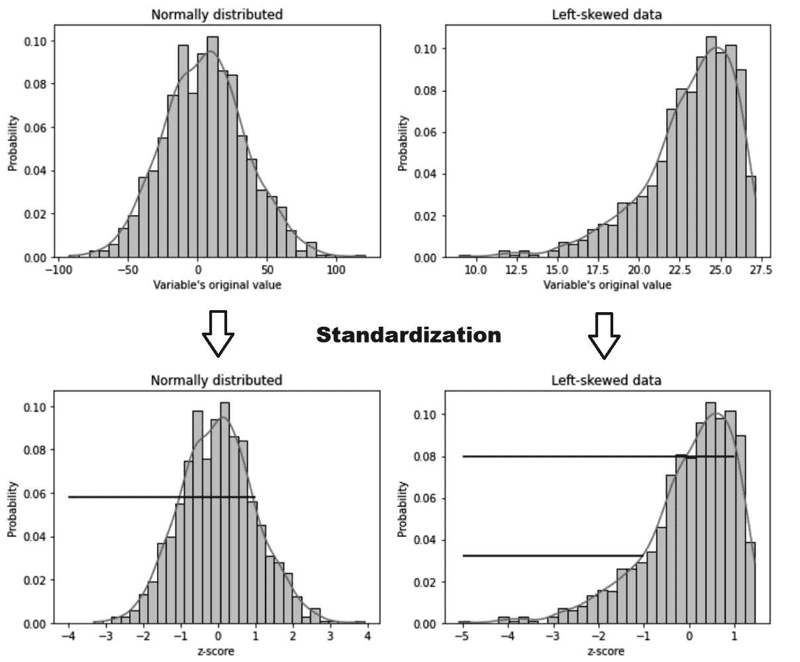

图 7.1 – 标准化前后正态分布和偏态变量的分布。

z 分数（底部面板的*x*轴）表示一个观测值与均值偏离多少个标准差。当 z 分数为`1`时，观测值位于均值右侧 1 个标准差处，而当 z 分数为`-1`时，样本位于均值左侧 1 个标准差处。

在正态分布的变量中，我们可以估计一个值大于或小于给定 z 分数的概率，并且这种概率分布是对称的。观测值小于 z 分数`-1`的概率等同于值大于`1`的概率（底部左面板中的水平线）。这种对称性是许多统计测试的基础。在偏态分布中，这种对称性不成立。如图 7.1 底部右面板所示（水平线），值小于`-1`的概率与大于`1`的概率不同。

注意

均值和标准差对异常值敏感；因此，在使用标准化时，特征可能彼此之间有不同的缩放比例。

在实践中，我们经常在忽略分布形状的情况下应用标准化。然而，请记住，如果您使用的模型或测试对数据的分布有假设，您可能需要在标准化之前转换变量，或者尝试不同的缩放方法。

## 如何实现...

在本食谱中，我们将对加利福尼亚住房数据集的变量应用标准化：

1.  让我们先导入所需的 Python 包、类和函数：

    ```py
    import pandas as pd
    from sklearn.datasets import fetch_california_housing
    from sklearn.model_selection import train_test_split
    from sklearn.preprocessing import StandardScaler
    ```

1.  让我们将加利福尼亚住房数据集从 scikit-learn 加载到 DataFrame 中，并删除`Latitude`和`Longitude`变量：

    ```py
    X, y = fetch_california_housing(
        return_X_y=True, as_frame=True)
    X.drop(labels=["Latitude", "Longitude"], axis=1,
        inplace=True)
    ```

1.  现在，让我们将数据分为训练集和测试集：

    ```py
    X_train, X_test, y_train, y_test = train_test_split(
        X, y, test_size=0.3, random_state=0)
    ```

1.  接下来，我们将设置 scikit-learn 中的`StandardScaler()`函数并将其拟合到训练集中，以便它学习每个变量的均值和标准差：

    ```py
    scaler = StandardScaler().set_output(
        transform="pandas")
    scaler.fit(X_train)
    ```

注意

Scikit-learn 缩放器，就像任何 scikit-learn 转换器一样，默认返回 NumPy 数组。要返回`pandas`或`polars` DataFrame，我们需要使用`set_output()`方法指定输出容器，就像我们在*步骤 4*中所做的那样。

1.  现在，让我们使用训练好的 scaler 对训练集和测试集进行标准化：

    ```py
    X_train_scaled = scaler.transform(X_train)
    X_test_scaled = scaler.transform(X_test)
    ```

    `StandardScaler()`在`fit()`过程中存储从训练集中学习到的均值和标准差。让我们可视化学习到的参数。

1.  首先，我们将打印出由`scaler`学习到的平均值：

    ```py
    scaler.mean_
    ```

    在以下输出中，我们可以看到每个变量的平均值：

    ```py
    scaler:

    ```

    scaler.scale_

    array([1.89109236e+00, 1.25962585e+01, 2.28754018e+00, 4.52736275e-01, 1.14954037e+03, 6.86792905e+00])

    ```py

    Let’s compare the transformed data with the original data to understand the changes.
    ```

1.  让我们打印出测试集中原始变量的描述性统计信息：

    ```py
    X_test.describe()
    ```

    在以下输出中，我们可以看到变量的平均值与零不同，方差各不相同：

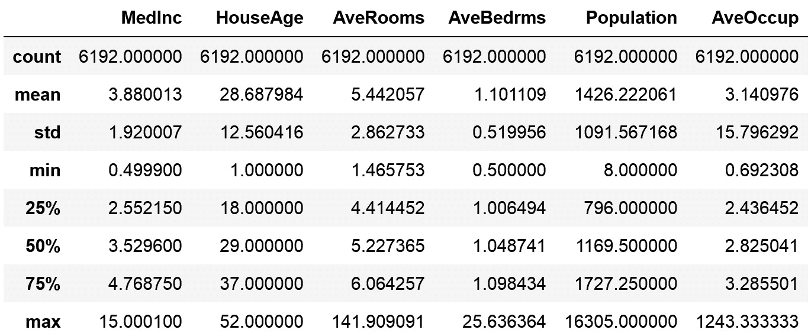

图 7.2 – 缩放前的变量的描述性统计参数

1.  现在我们来打印转换变量的描述性统计值：

    ```py
    X_test_scaled.describe()
    ```

    在以下输出中，我们可以看到变量的均值现在集中在 `0`，方差约为 `1`：

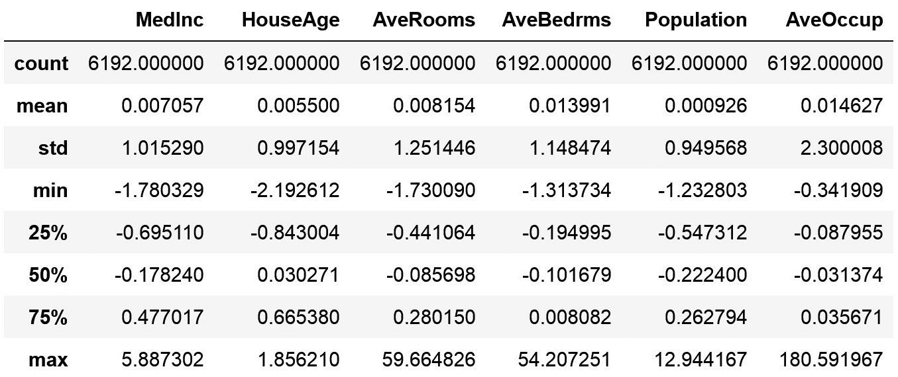

图 7.3 – 缩放变量的描述性统计参数，显示均值为 0 和方差约为 1

注意

`AveRooms`、`AveBedrms` 和 `AveOccup` 变量高度偏斜，这可能导致测试集中的观察值远大于或远小于训练集中的值，因此我们看到方差偏离 `1`。这是可以预料的，因为标准化对异常值和非常偏斜的分布很敏感。

在 *准备就绪* 部分中，我们提到分布的形状不会随着标准化而改变。通过执行 `X_test.hist()` 然后执行 `X_test_scaled.hist()` 来验证这一点，并比较转换前后的变量分布。

## 它是如何工作的...

在这个示例中，我们通过使用 scikit-learn 对加利福尼亚住房数据集的变量进行了标准化。我们将数据分为训练集和测试集，因为标准化的参数应该从训练集中学习。这是为了避免在预处理步骤中将测试集的数据泄露到训练集中，并确保测试集对所有特征转换过程保持无知的。

为了标准化这些特征，我们使用了 scikit-learn 的 `StandardScaler()` 函数，该函数能够学习并存储在转换中使用的参数。使用 `fit()`，缩放器学习每个变量的均值和标准差，并将它们存储在其 `mean_` 和 `scale_` 属性中。使用 `transform()`，缩放器对训练集和测试集中的变量进行了标准化。`StandardScaler()` 的默认输出是 NumPy 数组，但通过 `set_output()` 参数，我们可以将输出容器更改为 `pandas` DataFrame，就像我们在 *步骤 4* 中所做的那样，或者通过设置 `transform="polars"` 来更改为 `polars`。

注意

`StandardScaler()` 默认会减去均值并除以标准差。如果我们只想对分布进行中心化而不进行标准化，我们可以在初始化转换器时设置 `with_std=False`。如果我们想在 *步骤 4* 中将方差设置为 `1`，而不对分布进行中心化，我们可以通过设置 `with_mean=False` 来实现。

# 缩放到最大值和最小值

将变量缩放到最小值和最大值会压缩变量的值在`0`到`1`之间。要实现这种缩放方法，我们从所有观测值中减去最小值，然后将结果除以值范围——即最大值和最小值之间的差值：

![<math xmlns="http://www.w3.org/1998/Math/MathML" display="block"><mrow><mrow><msub><mi>x</mi><mrow><mi>s</mi><mi>c</mi><mi>a</mi><mi>l</mi><mi>e</mi><mi>d</mi></mrow></msub><mo>=</mo><mfrac><mrow><mi>x</mi><mo>−</mo><mi mathvariant="normal">m</mi><mi mathvariant="normal">i</mi><mi mathvariant="normal">n</mi><mo>(</mo><mi>x</mi><mo>)</mo></mrow><mrow><mi>max</mi><mfenced open="(" close=")"><mi>x</mi></mfenced><mo>−</mo><mi mathvariant="normal">m</mi><mi mathvariant="normal">i</mi><mi mathvariant="normal">n</mi><mo>(</mo><mi>x</mi><mo>)</mo></mrow></mfrac></mrow></mrow></math>](img/26.png)

将变量缩放到最小值和最大值适用于标准差非常小的变量，当模型不需要数据中心化到零，以及我们希望在稀疏数据中保留零条目时，例如在独热编码变量。然而，它的缺点是敏感于异常值。

## 准备工作

缩放到最小值和最大值不会改变变量的分布，如下面的图所示：

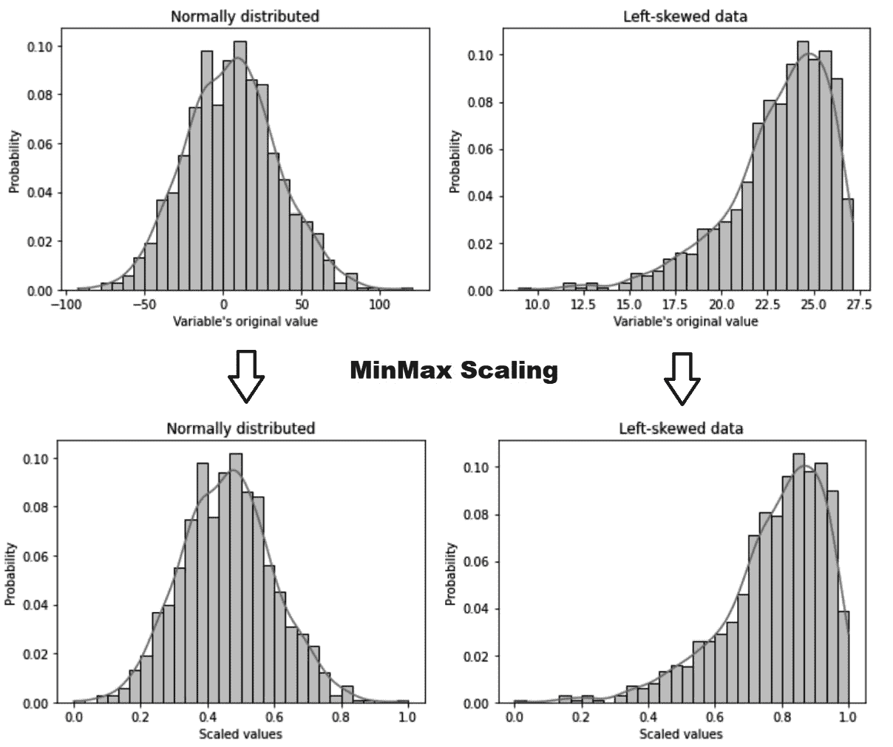

图 7.4 – 缩放到最小值和最大值前后的正态和偏斜变量的分布

这种缩放方法将变量的最大值标准化为单位大小。将变量缩放到最小值和最大值通常是标准化的首选替代方案，适用于标准差非常小的变量，以及我们希望在稀疏数据中保留零条目时，例如在独热编码变量或来自计数的变量（如词袋）中。然而，此过程不会将变量中心化到零，因此如果算法有此要求，这种方法可能不是最佳选择。

注意

将变量缩放到最小值和最大值对异常值敏感。如果训练集中存在异常值，缩放会将值压缩到一端。相反，如果测试集中存在异常值，变量在缩放后将会显示大于`1`或小于`0`的值，具体取决于异常值是在左尾还是右尾。

## 如何操作...

在这个示例中，我们将把加利福尼亚住房数据集的变量缩放到`0`到`1`之间的值：

1.  让我们先导入`pandas`和所需的类和函数：

    ```py
    import pandas as pd
    from sklearn.datasets import fetch_california_housing
    from sklearn.model_selection import train_test_split
    from sklearn.preprocessing import MinMaxScaler
    ```

1.  让我们从 scikit-learn 中加载加利福尼亚住房数据集到一个`pandas` DataFrame 中，并丢弃`Latitude`和`Longitude`变量：

    ```py
    X, y = fetch_california_housing(
        return_X_y=True, as_frame=True)
    X.drop(labels=["Latitude", "Longitude"], axis=1,
        inplace=True)
    ```

1.  让我们将数据分为训练集和测试集：

    ```py
    X_train, X_test, y_train, y_test = train_test_split(
        X, y, test_size=0.3, random_state=0)
    ```

1.  让我们设置缩放器并将其拟合到训练集，以便它学习每个变量的最小值和最大值以及值范围：

    ```py
    scaler = MinMaxScaler().set_output(
        transform="pandas"")
    scaler.fit(X_train)
    ```

1.  最后，让我们使用训练好的缩放器对训练集和测试集中的变量进行缩放：

    ```py
    X_train_scaled = scaler.transform(X_train)
    X_test_scaled = scaler.transform(X_test)
    ```

注意

`MinMaxScaler()`将最大值和最小值以及值范围分别存储在其`data_max_`、`min_`和`data_range_`属性中。

我们可以通过执行`X_test_scaled.min()`来验证变换后变量的最小值，它将返回以下输出：

```py
MedInc           0.000000
HouseAge        0.000000
AveRooms        0.004705
AveBedrms      0.004941
Population     0.000140
AveOccup      -0.000096
X_test_scaled.max(), we see that the maximum values of the variables are around 1:

```

MedInc           1.000000

HouseAge        1.000000

AveRooms        1.071197

AveBedrms      0.750090

Population     0.456907

AveOccup        2.074553

dtype: float64

```py

 Note
If you check the maximum values of the variables in the train set after the transformation, you’ll see that they are exactly `1`. Yet, in the test set, we see values greater and smaller than `1`. This occurs because, in the test set, there are observations with larger or smaller magnitudes than those in the train set. In fact, we see the greatest differences in the variables that deviate the most from the normal distribution (the last four variables in the dataset). This behavior is expected because scaling to the minimum and maximum values is sensitive to outliers and very skewed distributions.
Scaling to the minimum and maximum value does not change the shape of the variable’s distribution. You can corroborate that by displaying the histograms before and after the transformation.
How it works...
In this recipe, we scaled the variables of the California housing dataset to values between `0` and `1`.
`MinMaxScaler()` from scikit-learn learned the minimum and maximum values and the value range of each variable when we called the `fit()` method and stored these parameters in its `data_max_`, `min_`, and `data_range_` attributes. By using `transform()`, we made the scaler remove the minimum value from each variable in the train and test sets and divide the result by the value range.
Note
`MinMaxScaler()` will scale all variables by default. To scale only a subset of the variables in the dataset, you can use `ColumnTransformer()` from scikit-learn or `SklearnTransformerWrapper()` from `Feature-engine`.
`MinMaxScaler()` will scale the variables between `0` and `1` by default. However, we have the option to scale to a different range by adjusting the tuple passed to the `feature_range` parameter.
By default, `MinMaxScaler()` returns NumPy arrays, but we can modify this behavior to return `pandas` DataFrames with the `set_output()` method, as we did in *Step 4*.
Scaling with the median and quantiles
When scaling variables to the median and quantiles, the median value is removed from the observations, and the result is divided by the **Inter-Quartile Range** (**IQR**). The IQR is the difference between the 3rd quartile and the 1st quartile, or, in other words, the difference between the 75th percentile and the 25th percentile:
![<math xmlns="http://www.w3.org/1998/Math/MathML" display="block"><mrow><mrow><mi>x</mi><mo>_</mo><mi>s</mi><mi>c</mi><mi>a</mi><mi>l</mi><mi>e</mi><mi>d</mi><mo>=</mo><mfrac><mrow><mi>x</mi><mo>−</mo><mi>m</mi><mi>e</mi><mi>d</mi><mi>i</mi><mi>a</mi><mi>n</mi><mo>(</mo><mi>x</mi><mo>)</mo></mrow><mrow><mn>3</mn><mi>r</mi><mi>d</mi><mi>q</mi><mi>u</mi><mi>a</mi><mi>r</mi><mi>i</mi><mi>t</mi><mi>l</mi><mi>e</mi><mfenced open="(" close=")"><mi>x</mi></mfenced><mo>−</mo><mn>1</mn><mi>s</mi><mi>t</mi><mi>q</mi><mi>u</mi><mi>a</mi><mi>r</mi><mi>t</mi><mi>i</mi><mi>l</mi><mi>e</mi><mo>(</mo><mi>x</mi><mo>)</mo></mrow></mfrac></mrow></mrow></math>](img/27.png)
This method is known as **robust scaling** because it produces more robust estimates for the center and value range of the variable. Robust scaling is a suitable alternative to standardization when models require the variables to be centered and the data contains outliers. It is worth noting that robust scaling will not change the overall shape of the variable distribution.
How to do it...
In this recipe, we will implement scaling with the median and IQR by utilizing scikit-learn:

1.  Let’s start by importing `pandas` and the required scikit-learn classes and functions:

    ```

    导入 pandas 库作为 pd

    从 sklearn.datasets 导入 fetch_california_housing

    从 sklearn.model_selection 导入 train_test_split

    从 sklearn.preprocessing 导入 RobustScaler

    ```py

     2.  Let’s load the California housing dataset into a `pandas` DataFrame and drop the `Latitude` and `Longitude` variables:

    ```

    X, y = fetch_california_housing(

    return_X_y=True, as_frame=True)

    X.drop(labels=[     "Latitude", "Longitude"], axis=1,

    inplace=True)

    ```py

     3.  Let’s divide the data into train and test sets:

    ```

    X_train, X_test, y_train, y_test = train_test_split(

    X, y, test_size=0.3, random_state=0)

    ```py

     4.  Let’s set up scikit-learn’s `RobustScaler()`and fit it to the train set so that it learns and stores the median and IQR:

    ```

    scaler = RobustScaler().set_output(

    transform="pandas")

    scaler.fit(X_train)

    ```py

     5.  Finally, let’s scale the variables in the train and test sets with the trained scaler:

    ```

    X_train_scaled = scaler.transform(X_train)

    X_test_scaled = scaler.transform(X_test)

    ```py

     6.  Let’s print the variable median values learned by `RobustScaler()`:

    ```

    scaler.center_

    ```py

    We see the parameters learned by `RobustScaler()` in the following output:

    ```

    RobustScaler():

    ```py
    scaler.scale_
    array([2.16550000e+00, 1.90000000e+01, 1.59537022e+00,                 9.41284380e-02, 9.40000000e+02, 8.53176853e-01])
    ```

    这种缩放过程不会改变变量的分布。请使用直方图比较变换前后变量的分布。

    ```py

How it works...
To scale the features using the median and IQR, we created an instance of `RobustScaler()`. With `fit()`, the scaler learned the median and IQR for each variable from the train set. With `transform()`, the scaler subtracted the median from each variable in the train and test sets and divided the result by the IQR.
After the transformation, the median values of the variables were centered at `0`, but the overall shape of the distributions did not change. You can corroborate the effect of the transformation by displaying the histograms of the variables before and after the transformation and by printing out the main statistical parameters through `X_test.describe()` and `X_test_scaled.b()`.
Performing mean normalization
In mean normalization, we center the variable at `0` and rescale the distribution to the value range, so that its values lie between `-1` and `1`. This procedure involves subtracting the mean from each observation and then dividing the result by the difference between the minimum and maximum values, as shown here:
![<math xmlns="http://www.w3.org/1998/Math/MathML" display="block"><mrow><mrow><msub><mi>x</mi><mrow><mi>s</mi><mi>c</mi><mi>a</mi><mi>l</mi><mi>e</mi><mi>d</mi></mrow></msub><mo>=</mo><mfrac><mrow><mi>x</mi><mo>−</mo><mi>m</mi><mi>e</mi><mi>a</mi><mi>n</mi><mo>(</mo><mi>x</mi><mo>)</mo></mrow><mrow><mi>max</mi><mfenced open="(" close=")"><mi>x</mi></mfenced><mo>−</mo><mi mathvariant="normal">m</mi><mi mathvariant="normal">i</mi><mi mathvariant="normal">n</mi><mo>(</mo><mi>x</mi><mo>)</mo></mrow></mfrac></mrow></mrow></math>](img/28.png)
Note
Mean normalization is an alternative to standardization. In both cases, the variables are centered at `0`. In mean normalization, the variance varies, while the values lie between `-1` and `1`. On the other hand, in standardization, the variance is set to `1` and the value range varies.
Mean normalization is a suitable alternative for models that need the variables to be centered at zero. However, it is sensitive to outliers and not a suitable option for sparse data, as it will destroy the sparse nature.
How to do it...
In this recipe, we will implement mean normalization with `pandas`:

1.  Let’s import `pandas` and the required scikit-learn class and function:

    ```

    导入 pandas 库作为 pd

    从 sklearn.datasets 导入 fetch_california_housing

    从 sklearn.model_selection 导入 train_test_split

    ```py

     2.  Let’s load the California housing dataset from scikit-learn into a `pandas` DataFrame, dropping the `Latitude` and `Longitude` variables:

    ```

    X, y = fetch_california_housing(

    return_X_y=True, as_frame=True)

    X.drop(labels=[

    "Latitude", "Longitude"], axis=1, inplace=True)

    ```py

     3.  Let’s divide the data into train and test sets:

    ```

    X_train, X_test, y_train, y_test = train_test_split(

    X, y, test_size=0.3, random_state=0)

    ```py

     4.  Let’s learn the mean values from the variables in the train set:

    ```

    means = X_train.mean(axis=0)

    ```py

Note
We set `axis=0` to take the mean of the rows – that is, of the observations in each variable. If we set `axis=1` instead, `pandas` will calculate the mean value per observation across all the columns.
By executing `print(mean)`, we display the mean values per variable:

```

MedInc           3.866667

HouseAge        28.618702

AveRooms         5.423404

AveBedrms        1.094775

Population    1425.157323

AveOccup         3.040518

dtype: float64

```py

1.  Now, let’s determine the difference between the maximum and minimum values per variable:

    ```

    ranges = X_train.max(axis=0)-X_train.min(axis=0)

    ```py

    By executing `print(ranges)`, we display the value ranges per variable:

    ```

    MedInc           14.500200

    HouseAge         51.000000

    AveRooms        131.687179

    AveBedrms        33.733333

    Population    35679.000000

    AveOccup        598.964286

    dtype: float64

    ```py

Note
The `pandas` `mean()`, `max()`, and `min()` methods return a `pandas` series.

1.  Now, we’ll apply mean normalization to the train and test sets by utilizing the learned parameters:

    ```

    X_train_scaled = (X_train - means) / ranges

    X_test_scaled = (X_test - means) / ranges

    ```py

Note
In order to transform future data, you will need to store these parameters, for example, in a `.txt` or `.``csv` file.
*Step 6* returns `pandas` DataFrames with the transformed train and test sets. Go ahead and compare the variables before and after the transformations. You’ll see that the distributions did not change, but the variables are centered at `0`, and their values lie between `-1` and `1`.
How it works…
To implement mean normalization, we captured the mean values of the numerical variables in the train set using `mean()` from `pandas`. Next, we determined the difference between the maximum and minimum values of the numerical variables in the train set by utilizing `max()` and `min()` from `pandas`. Finally, we used the `pandas` series returned by these functions containing the mean values and the value ranges to normalize the train and test sets. We subtracted the mean from each observation in our train and test sets and divided the result by the value ranges. This returned the normalized variables in a `pandas` DataFrame.
There’s more...
There is no dedicated scikit-learn transformer to implement mean normalization, but we can combine the use of two transformers to do so.
To do this, we need to import `pandas` and load the data, just like we did in *Steps 1* to *3* in the *How to do it...* section of this recipe. Then, follow these steps:

1.  Import the scikit-learn transformers:

    ```

    从 sklearn.preprocessing 导入(

    StandardScaler, RobustScaler

    )

    ```py

     2.  Let’s set up `StandardScaler()` to learn and subtract the mean without dividing the result by the standard deviation:

    ```

    scaler_mean = StandardScaler(

    with_mean=True, with_std=False,

    ).set_output(transform="pandas")

    ```py

     3.  Now, let’s set up `RobustScaler()` so that it does not remove the median from the values but divides them by the value range – that is, the difference between the maximum and minimum values:

    ```

    scaler_minmax = RobustScaler(

    with_centering=False,

    with_scaling=True,

    quantile_range=(0, 100)

    ).设置输出为 transform="pandas"

    ```py

Note
To divide by the difference between the minimum and maximum values, we need to specify `(0, 100)` in the `quantile_range` argument of `RobustScaler()`.

1.  Let’s fit the scalers to the train set so that they learn and store the mean, maximum, and minimum values:

    ```

    scaler_mean.fit(X_train)

    scaler_minmax.fit(X_train)

    ```py

     2.  Finally, let’s apply mean normalization to the train and test sets:

    ```

    X_train_scaled = scaler_minmax.transform(

    scaler_mean.transform(X_train)

    )

    X_test_scaled = scaler_minmax.transform(

    scaler_mean.transform(X_test)

    )

    ```py

We transformed the data with `StandardScaler()` to remove the mean and then transformed the resulting DataFrame with `RobustScaler()` to divide the result by the range between the minimum and maximum values. We described the functionality of `StandardScaler()` in this chapter’s *Standardizing the features* recipe and `RobustScaler()` in the *Scaling with the median and quantiles* recipe of this chapter.
Implementing maximum absolute scaling
Maximum absolute scaling scales the data to its maximum value – that is, it divides every observation by the maximum value of the variable:

As a result, the maximum value of each feature will be `1.0`. Note that maximum absolute scaling does not center the data, and hence, it’s suitable for scaling sparse data. In this recipe, we will implement maximum absolute scaling with scikit-learn.
Note
Scikit-learn recommends using this transformer on data that is centered at `0` or on sparse data.
Getting ready
Maximum absolute scaling was specifically designed to scale sparse data. Thus, we will use a bag-of-words dataset that contains sparse variables for the recipe. In this dataset, the variables are words, the observations are documents, and the values are the number of times each word appears in the document. Most entries in the data are `0`.
We will use a dataset consisting of a bag of words, which is available in the UCI Machine Learning Repository (https://archive.ics.uci.edu/ml/datasets/Bag+of+Words), which is licensed under CC BY 4.0 (https://creativecommons.org/licenses/by/4.0/legalcode).
I downloaded and prepared a small bag of words representing a simplified version of one of those datasets. You will find this dataset in the accompanying GitHub repository: [`github.com/PacktPublishing/Python-Feature-Engineering-Cookbook-Third-Edition/tree/main/ch07-scaling`](https://github.com/PacktPublishing/Python-Feature-Engineering-Cookbook-Third-Edition/tree/main/ch07-scaling).
How to do it...
Let’s begin by importing the required packages and loading the dataset:

1.  Let’s import the required libraries and the scaler:

    ```

    导入 matplotlib.pyplot 库作为 plt

    导入 pandas 库作为 pd

    从 sklearn.preprocessing 导入 MaxAbsScaler

    ```py

     2.  Let’s load the bag-of-words dataset:

    ```

    data = pd.read_csv("bag_of_words.csv")

    ```py

    If we execute `data.head()`, we will see the DataFrame consisting of the words as columns, the documents as rows, and the number of times each word appeared in a document as values:

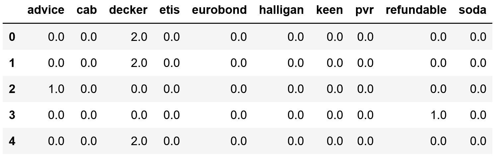

Figure 7.5 – DataFrame with the bag of words
Note
Although we omit this step in the recipe, remember that the maximum absolute values should be learned from a training dataset only. Split the dataset into train and test sets when carrying out your analysis.

1.  Let’s set up `MaxAbsScaler()` and fit it to the data so that it learns the variables’ maximum values:

    ```

    scaler = MaxAbsScaler().set_output(

    transform="pandas")

    scaler.fit(data)

    ```py

     2.  Now, let’s scale the variables by utilizing the trained scaler:

    ```

    data_scaled = scaler.transform(data)

    ```py

Note
`MaxAbsScaler ()` stores the maximum values in its `max_abs_` attribute.

1.  Let’s display the maximum values stored by the scaler:

    ```

    scaler.max_abs_

    array([ 7.,  6.,  2.,  2., 11.,  4.,  3.,  6., 52.,  2.])

    ```py

    To follow up, let’s plot the distributions of the original and scaled variables.

     2.  Let’s make a histogram with the bag of words before the scaling:

    ```

    data.hist(bins=20, figsize=(20, 20))

    plt.show()

    ```py

    In the following output, we see histograms with the number of times each word appears in a document:

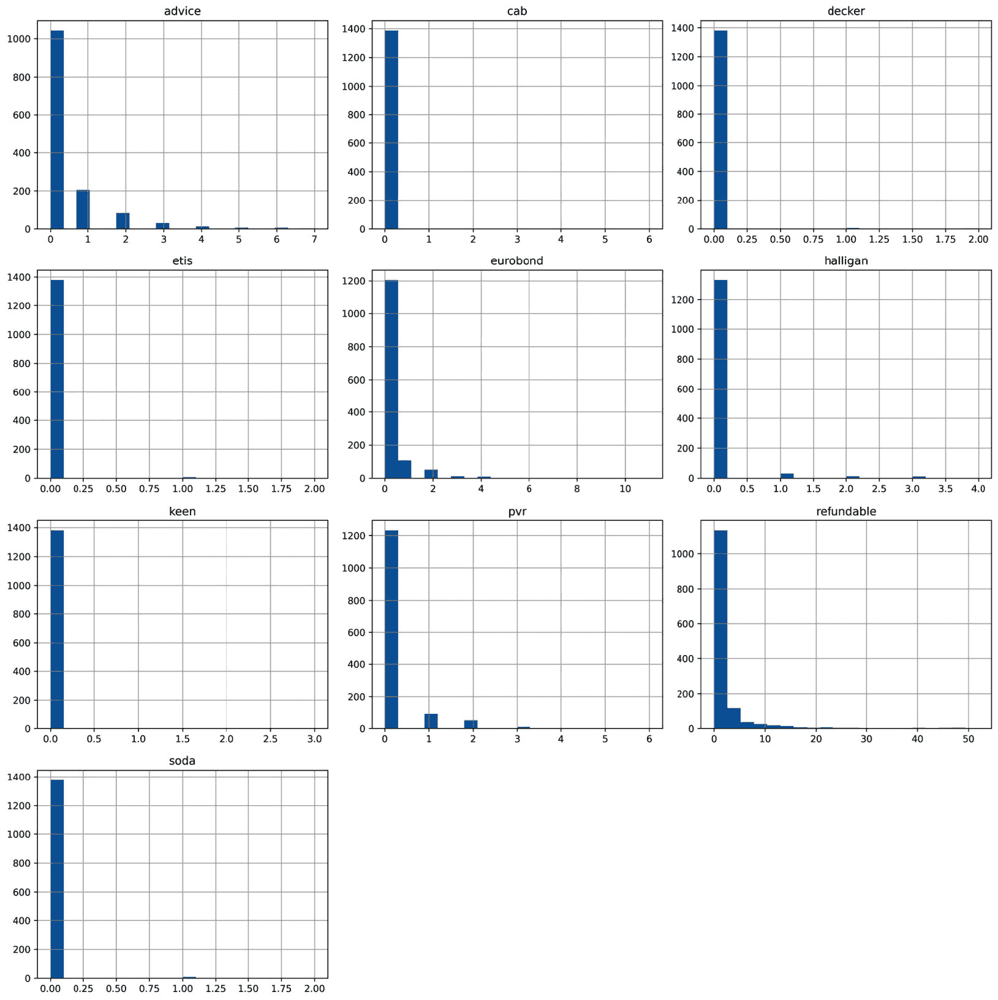

Figure 7.6 – Histograms with different word counts

1.  Now, let’s make a histogram with the scaled variables:

    ```

    data_scaled.hist(bins=20, figsize=(20, 20))

    plt.show()

    ```py

    In the following output, we can corroborate the change of scale of the variables, but their distribution shape remains the same:

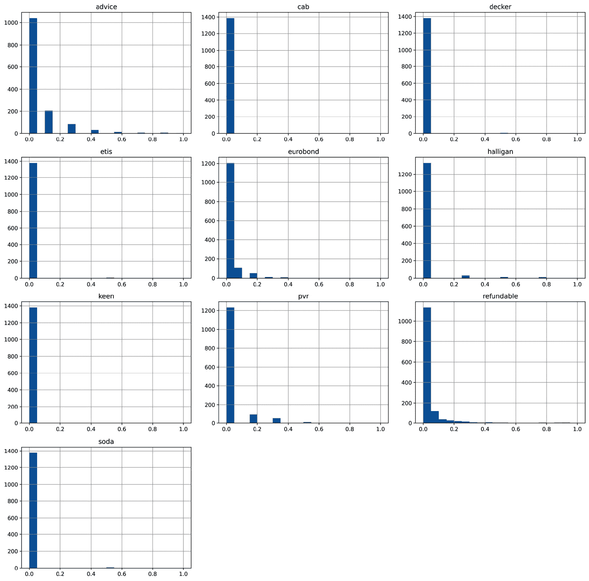

Figure 7.7 – Histograms of the word counts after the scaling
With scaling to the maximum absolute value, we linearly scale down the magnitude of the features.
How it works...
In this recipe, we scaled the sparse variables of a bag of words to their absolute maximum values by using `MaxAbsScaler()`. With `fit()`, the scaler learned the maximum absolute values for each variable and stored them in its `max_abs_` attribute. With `transform()`, the scaler divided the variables by their absolute maximum values, returning a `pandas` DataFrame.
Note
Remember that you can change the output container to a NumPy array or a `polars` DataFrame through the `set_output()` method of the scikit-learn library’s transformers.
There’s more...
If you want to center the variables’ distribution at `0` and then scale them to their absolute maximum, you can do so by combining the use of two scikit-learn transformers within a pipeline:

1.  Let’s import the required libraries, transformers, and functions:

    ```

    import pandas as pd

    from sklearn.datasets import fetch_california_housing

    from sklearn.model_selection import train_test_split

    from sklearn.preprocessing import (

    MaxAbsScaler, StandardScaler)

    from sklearn.pipeline import Pipeline

    ```py

     2.  Let’s load the California housing dataset and split it into train and test sets:

    ```

    X, y = fetch_california_housing(

    return_X_y=True, as_frame=True)

    X.drop( labels=[ "纬度",

    "经度"], axis=1, inplace=True)

    X_train, X_test, y_train, y_test = train_test_split(

    X, y, test_size=0.3, random_state=0)

    ```py

     3.  Let’s set up `StandardScaler()` from scikit-learn so that it learns and subtracts the mean but does not divide the result by the standard deviation:

    ```

    scaler_mean = StandardScaler(

    with_mean=True, with_std=False)

    ```py

     4.  Now, let’s set up `MaxAbsScaler()` with its default parameters:

    ```

    scaler_maxabs = MaxAbsScaler()

    ```py

     5.  Let’s include both scalers within a pipeline that returns pandas DataFrames:

    ```

    scaler = Pipeline([

    ("scaler_mean", scaler_mean),

    ("scaler_max", scaler_maxabs),

    ]).set_output(transform="pandas")

    ```py

     6.  Let’s fit the scalers to the train set so that they learn the required parameters:

    ```

    scaler.fit(X_train)

    ```py

     7.  Finally, let’s transform the train and test sets:

    ```

    X_train_scaled = scaler.transform(X_train)

    X_test_scaled = scaler.transform(X_test)

    ```py

    The pipeline applies `StandardScaler()` and `MaxAbsScaler()` in sequence to first remove the mean and then scale the resulting variables to their maximum values.

Scaling to vector unit length
Scaling to the vector unit length involves scaling individual observations (not features) to have a unit norm. Each sample (that is, each row of the data) is rescaled independently of other samples so that its norm equals one. Each row constitutes a **feature vector** containing the values of every variable for that row. Hence, with this scaling method, we rescale the feature vector.
The norm of a vector is a measure of its magnitude or length in a given space and it can be determined by using the Manhattan (*l1*) or the Euclidean (*l2*) distance. The Manhattan distance is given by the sum of the absolute components of the vector:

The Euclidean distance is given by the square root of the square sum of the component of the vector:

Here, and 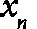are the values of variables *1*, *2*, and *n* for each observation. Scaling to unit norm consists of dividing each feature vector’s value by either *l1* or *l2*, so that after the scaling, the norm of the feature vector is *1*. To be clear, we divide each of 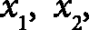and 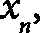by *l1* or *l2*.
This scaling procedure changes the variables’ distribution, as illustrated in the following figure:
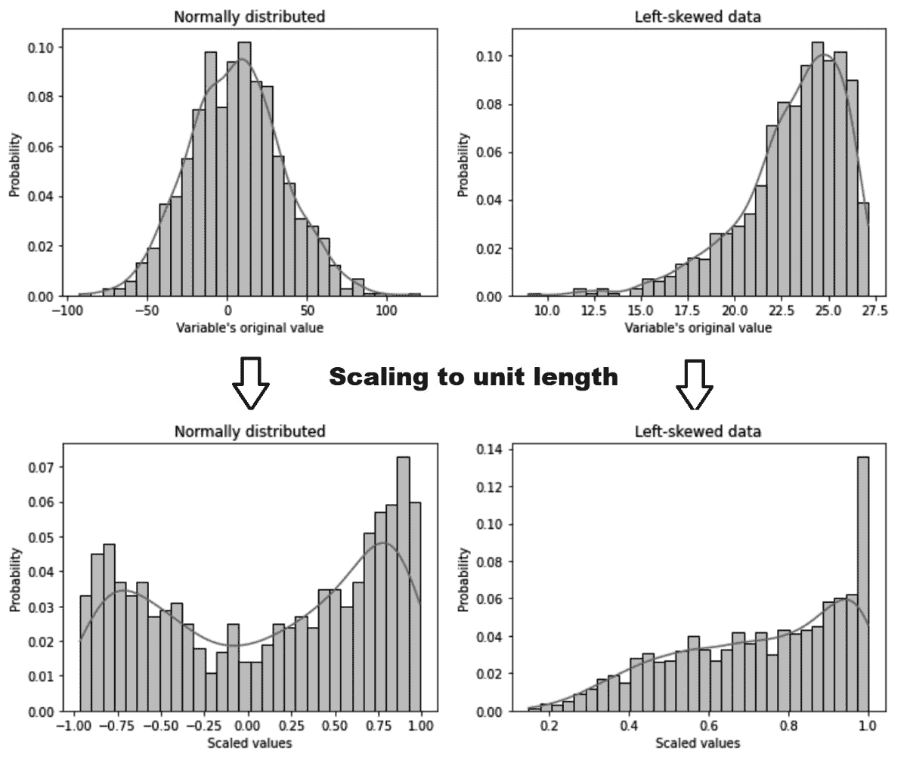

Figure 7.8 – Distribution of a normal and skewed variable before and after scaling each observation’s feature vector to its norm
Note
This scaling technique scales each observation and not each variable. The scaling methods that we discussed so far in this chapter aimed at shifting and resetting the scale of the variables’ distribution. When we scale to the unit length, however, we normalize each observation individually, contemplating their values across all features.
Scaling to the unit norm can be used when utilizing kernels to quantify similarity for text classification and clustering. In this recipe, we will scale each observation’s feature vector to a unit length of `1` using scikit-learn.
How to do it...
To begin, we’ll import the required packages, load the dataset, and prepare the train and test sets:

1.  Let’s import the required Python packages, classes, and functions:

    ```

    import numpy as np

    import pandas as pd

    from sklearn.datasets import fetch_california_housing

    from sklearn.model_selection import train_test_split

    from sklearn.preprocessing import Normalizer

    ```py

     2.  Let’s load the California housing dataset into a `pandas` DataFrame:

    ```

    X, y = fetch_california_housing(

    return_X_y=True, as_frame=True)

    X.drop(labels=[

    "纬度", "经度"], axis=1, inplace=True)

    ```py

     3.  Let’s divide the data into train and test sets:

    ```

    X_train, X_test, y_train, y_test = train_test_split(

    X, y, test_size=0.3, random_state=0)

    ```py

     4.  Let’s set up the scikit-learn library’s `Normalizer()` transformer to scale each observation to the Manhattan distance or `l1`:

    ```

    scaler = Normalizer(norm='l1')

    ```py

Note
To normalize to the Euclidean distance, you need to set the norm to `l2` using `scaler =` `Normalizer(norm='l2')`.

1.  Let’s transform the train and test sets – that is, we’ll divide each observation’s feature vector by its norm:

    ```

    X_train_scaled = scaler.fit_transform(X_train)

    X_test_scaled = scaler.transform(X_test)

    ```py

    We can calculate the length (that is, the Manhattan distance of each observation’s feature vector) using `linalg()` from NumPy.

     2.  Let’s calculate the norm (Manhattan distance) before scaling the variables:

    ```

    np.round(np.linalg.norm(X_train, ord=1, axis=1), 1)

    ```py

    As expected, the norm of each observation varies:

    ```

    array([ 255.3,  889.1, 1421.7, ...,  744.6, 1099.5,

    1048.9])

    ```py

     3.  Let’s now calculate the norm after the scaling:

    ```

    np.round(np.linalg.norm(

    X_train_scaled, ord=1, axis=1), 1)

    ```py

Note
You need to set `ord=1` for the Manhattan distance and `ord=2` for the Euclidean distance as arguments of NumPy’s `linalg()`function, depending on whether you scaled the features to the `l1` or `l2` norm.
We see that the Manhattan distance of each feature vector is `1` after scaling:

```

array([1., 1., 1., ..., 1., 1., 1.])

```py

 Based on the scikit-learn library’s documentation, this scaling method can be useful when using a quadratic form such as the dot-product or any other kernel to quantify the similarity of a pair of samples.
How it works...
In this recipe, we scaled the observations from the California housing dataset to their feature vector unit norm by utilizing the Manhattan or Euclidean distance. To scale the feature vectors, we created an instance of `Normalizer()` from scikit-learn and set the norm to `l1` for the Manhattan distance. For the Euclidean distance, we set the norm to `l2`. Then, we applied the `fit()` method, although there were no parameters to be learned, as this normalization procedure depends exclusively on the values of the features for each observation. Finally, with the `transform()` method, the scaler divided each observation’s feature vector by its norm. This returned a NumPy array with the scaled dataset. After the scaling, we used NumPy’s `linalg.norm` function to calculate the norm (`l1` and `l2`) of each vector to confirm that after the transformation, it was `1`.

```
