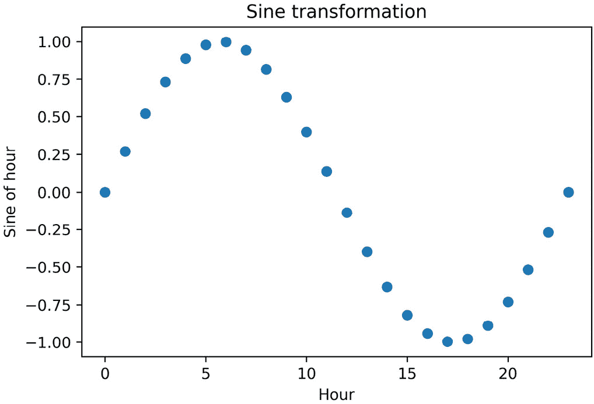
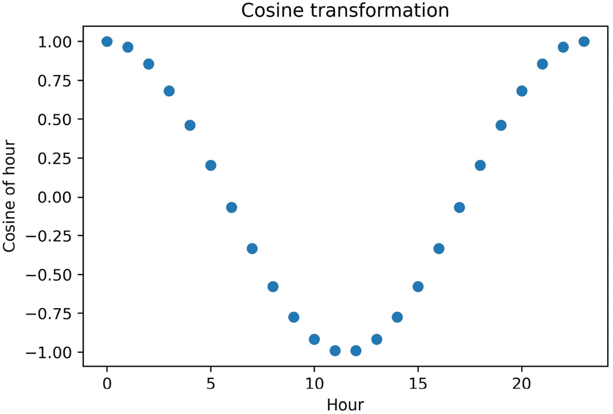
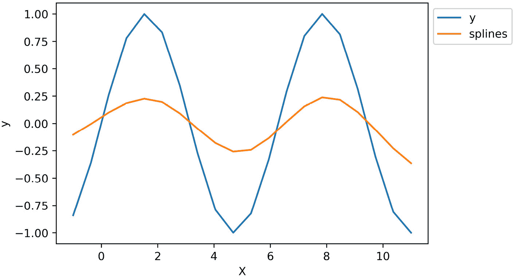

# 8

# 创建新特征

向数据集中添加新特征可以帮助机器学习模型学习数据中的模式和重要细节。例如，在金融领域，**可支配收入**，即任何一个月的*总收入*减去*获得债务*，可能比仅仅的收入或获得债务对信用风险更为相关。同样，一个人在金融产品中的*总获得债务*，如车贷、房贷和信用卡，可能比单独考虑的任何债务对估计信用风险更为重要。在这些例子中，我们使用领域知识来构建新变量，这些变量是通过添加或减去现有特征创建的。

在某些情况下，一个变量可能没有与目标变量呈线性或单调关系，但多项式组合可能存在。例如，如果我们的变量与目标变量呈二次关系，，我们可以通过平方原始变量将其转换为线性关系。我们还可以通过使用样条或决策树来转换预测变量，帮助线性模型更好地理解变量和目标之间的关系。

通过构建额外的特征来训练更简单的模型，例如线性或逻辑回归，其优势在于特征和模型都保持可解释性。我们可以向管理层、客户和监管机构解释驱动模型输出的原因，为我们的机器学习流程增加一层透明度。此外，简单的模型往往训练速度更快，部署和维护也更容易。

在本章中，我们将通过变换或结合变量使用数学函数、样条和决策树来创建新特征。

本章将涵盖以下食谱：

+   使用数学函数组合特征

+   将特征与参考变量进行比较

+   执行多项式展开

+   使用决策树组合特征

+   从周期性变量创建周期特征

+   创建样条特征

# 技术要求

在本章中，我们将使用 `pandas`、`numpy`、`matplotlib`、`scikit-learn` 和 `feature-engine` 这些 Python 库。

# 使用数学函数组合特征

通过结合现有变量和数学及统计函数可以创建新特征。以金融行业为例，我们可以通过汇总个人在单个金融产品中的债务（如车贷、房贷或信用卡债务）来计算一个人的总债务：

*总债务 = 车贷债务 + 信用卡债务 + 房贷债务*

我们还可以使用其他统计操作推导出其他有洞察力的特征。例如，我们可以确定客户在金融产品中的最大债务或用户在网站上的平均停留时间：

*最大债务 = max(车贷余额, 信用卡余额, 按揭余额)*

*网站平均停留时间 = mean(主页停留时间, 关于页面停留时间, FAQ 页面停留时间)*

在原则上，我们可以使用任何数学或统计运算来创建新的特征，例如乘积、平均值、标准差，或者最大或最小值。在这个食谱中，我们将使用 `pandas` 和 `feature-engine` 来实现这些数学运算。

注意

虽然，在食谱中，我们可以向您展示如何使用数学函数组合特征，但我们无法公正地展示在决定应用哪个函数时领域知识的运用，因为每个领域都有所不同。所以，我们将这部分留给你。

## 准备工作

在这个食谱中，我们将使用来自 `scikit-learn` 的乳腺癌数据集。特征是通过乳腺细胞的数字化图像计算得出的，描述了细胞核的平滑度、凹陷度、对称性和紧凑度等特征。每一行包含关于组织样本中细胞核形态的信息。目标变量表示组织样本是否对应于癌细胞。目标是根据细胞核的形态预测组织样本属于良性还是恶性的乳腺细胞。

为了熟悉数据集，请在 Jupyter 笔记本或 Python 控制台中运行以下命令：

```py
from sklearn.datasets import load_breast_cancer
data = load_breast_cancer()
print(data.DESCR)
```

上述代码块应该打印出数据集的描述及其变量的解释。

## 如何做到这一点...

在这个食谱中，我们将通过使用多个数学运算来组合变量来创建新的特征：

1.  让我们先加载必要的库、类和数据：

    ```py
    import pandas as pd
    from feature_engine.creation import MathFeatures
    from sklearn.datasets import load_breast_cancer
    ```

1.  接下来，将乳腺癌数据集加载到 `pandas` DataFrame 中：

    ```py
    data = load_breast_cancer()
    df = pd.DataFrame(data.data,
        columns=data.feature_names)
    ```

    在以下代码行中，我们将通过使用多个数学运算来组合变量创建新的特征。

1.  让我们先创建一个包含我们想要组合的特征子集的列表：

    ```py
    features = [
        «mean smoothness",
        «mean compactness",
        «mean concavity",
        «mean concave points",
        «mean symmetry",
    ]
    ```

    *步骤 3* 中的特征代表了图像中细胞核的平均特征。获取所有检查特征的均值可能是有用的。

1.  让我们计算特征的均值并显示结果特征：

    ```py
    df["mean_features"] = df[features].mean(axis=1)
    df["mean_features"].head()
    ```

    下面的输出显示了 *步骤 3* 中特征的均值：

    ```py
    0    0.21702
    1    0.10033
    2    0.16034
    3    0.20654
    4    0.14326
    Name: mean_features, dtype: float64
    ```

1.  同样，为了捕捉细胞核的一般变异性，让我们确定平均特征的标准差，然后显示结果特征：

    ```py
    df["std_features"] = df[features].std(axis=1)
    df["std_features"].head()
    ```

    下面的输出显示了 *步骤 3* 中特征的标准差：

    ```py
    0    0.080321
    1    0.045671
    2    0.042333
    3    0.078097
    4    0.044402
    Name: std_features, dtype: float64
    ```

注意

当我们根据领域知识构建新的特征时，我们确切地知道我们想要如何组合变量。我们也可以通过多个运算组合特征，然后评估它们是否具有预测性，例如使用特征选择算法或从机器学习模型中推导特征重要性。

1.  让我们创建一个包含我们想要使用的数学函数的列表来组合特征：

    ```py
    math_func = [
        "sum", "prod", "mean", "std", "max", "min"]
    ```

1.  现在，让我们应用 *步骤 6* 中的函数来组合 *步骤 3* 中的特征，将结果变量捕获到一个新的 DataFrame 中：

    ```py
    df_t = df[features].agg(math_func, axis="columns")
    ```

    如果我们执行 `df_t.head()`，我们将看到包含新创建特征的 DataFrame：


图 8.1 – 包含新创建特征的 DataFrame

注意

`pandas` 的 `agg` 函数可以应用多个函数来组合特征。它可以接受一个包含函数名称的字符串列表，就像我们在 *步骤 7* 中做的那样；一个包含 NumPy 函数（如 `np.log`）的列表；以及你创建的 Python 函数。

我们可以使用 `feature-engine` 自动创建与使用 `pandas` 创建的相同特征。

1.  让我们使用输出特征的名称创建一个列表：

    ```py
    new_feature_names = [
        "sum_f", "prod_f", "mean_f",
        „std_f", „max_f", „min_f"]
    ```

1.  让我们设置 `MathFeatures()` 来将 *步骤 6* 中的函数应用于 *步骤 3* 中的特征，使用 *步骤 8* 中的字符串来命名新特征：

    ```py
    create = MathFeatures(
        variables=features,
        func=math_func,
        new_variables_names=new_feature_names,
    )
    ```

1.  让我们将新特征添加到原始 DataFrame 中，将结果捕获到一个新变量中：

    ```py
    df_t = create.fit_transform(df)
    ```

    我们可以通过执行 `df_t[features + new_feature_names].head()` 来显示输入和输出特征：


图 8.2 – 包含输入特征和新创建变量的 DataFrame

虽然 `pandas` 的 `agg` 函数返回一个包含操作结果的 DataFrame，但 `feature-engine` 会更进一步，通过将新特征连接到原始 DataFrame 上。

## 它是如何工作的...

`pandas` 有许多内置操作，可以将数学和统计计算应用于一组变量。为了在数学上组合特征，我们首先创建了一个包含我们想要组合的特征名称的列表。然后，我们使用 `pandas` 的 `mean()` 和 `std()` 函数确定了这些特征的平均值和标准差。我们还可以应用 `sum()`、`prod()`、`max()` 和 `min()` 方法中的任何一个，这些方法分别返回这些特征的总和、乘积、最大值和最小值。为了在列上执行这些操作，我们在方法中添加了 `axis=1` 参数。

使用 pandas 的 `agg()` 函数，我们可以同时应用多个数学函数。它接受一个字符串列表作为参数，对应于要应用的功能和函数应该应用的 `axis`，可以是 `1`（列）或 `0`（行）。因此，pandas 的 `agg()` 函数返回一个应用数学函数到特征组的 `pandas` DataFrame。

最后，我们通过结合变量和使用 `feature-engine` 创建了相同的特征。我们使用了 `MathFeatures()` 转换器，它接受要组合的特征和要应用的功能作为输入；它还提供了指示结果特征名称的选项。当我们使用 `fit()` 时，转换器没有学习参数，而是检查变量确实是数值的。`transform()` 方法触发了底层使用 `pandas.agg`，应用数学函数来创建新的变量。

## 参见

要了解更多关于 `pandas` 支持的数学运算，请访问 [`pandas.pydata.org/pandas-docs/stable/reference/frame.html#computations-descriptive-stats`](https://pandas.pydata.org/pandas-docs/stable/reference/frame.html#computations-descriptive-stats)。

要了解更多关于 `pandas` `aggregate` 的信息，请查看 [`pandas.pydata.org/pandas-docs/stable/reference/api/pandas.DataFrame.aggregate.html`](https://pandas.pydata.org/pandas-docs/stable/reference/api/pandas.DataFrame.aggregate.html)。

# 比较特征与参考变量

在之前的菜谱 *使用数学函数组合特征* 中，我们通过将数学或统计函数（如总和或平均值）应用于一组变量来创建新特征。然而，一些数学运算（如减法或除法）是在特征之间进行的。这些操作对于推导比率（如 *负债收入比*）很有用：

*负债收入比 = 总负债 /* *总收入* 

这些操作也有助于计算差异，例如 *可支配收入*：

*可支配收入 = 收入 - 总负债*

在这个菜谱中，我们将学习如何通过使用 `pandas` 和 `feature-engine` 对变量进行减法或除法来创建新特征。

注意

在这个菜谱中，我们将向您展示如何通过减法和除法创建特征。我们希望这些与金融部门相关的例子能对如何使用领域知识来决定要组合哪些特征以及如何进行一些启发。

## 如何做到这一点...

让我们先加载必要的 Python 库和来自 scikit-learn 的乳腺癌数据集：

1.  加载必要的库、类和数据：

    ```py
    import pandas as pd
    from feature_engine.creation import RelativeFeatures
    from sklearn.datasets import load_breast_cancer
    ```

1.  将乳腺癌数据集加载到 `pandas` DataFrame 中：

    ```py
    data = load_breast_cancer()
    df = pd.DataFrame(data.data,
        columns=data.feature_names)
    ```

    在乳腺癌数据集中，一些特征捕捉了乳腺细胞细胞核的最差和平均特征。例如，对于每个图像（即每行），我们都有观察到的所有核的最差紧密度和所有核的平均紧密度。一个捕捉最差值和平均值之间差异的特征可以预测恶性。

1.  让我们捕捉两个特征之间的差异，即细胞核的 `最差紧密度` 和 `平均紧密度`，并将它们存储在一个新变量中并显示其值：

    ```py
    df["difference"] = df["worst compactness"].sub(
        df["mean compactness"])
    df["difference"].head()
    ```

    在以下输出中，我们可以看到这些特征值之间的差异：

    ```py
    0    0.38800
    1    0.10796
    2    0.26460
    3    0.58240
    4    0.07220
    Name: difference, dtype: float64
    ```

注意

我们可以通过执行 `df["difference"] = df["worst compactness"] - (``df["mean compactness"])` 来进行相同的计算。

同样，细胞核最坏和平均特征之间的比率可能表明恶性。

1.  让我们创建一个新特征，该特征是核的最坏和平均半径之间的比率，然后显示其值：

    ```py
    df["quotient"] = df["worst radius"].div(
        df["mean radius"])
    df["quotient"].head()
    ```

    在以下输出中，我们可以看到特征之间的比率值：

    ```py
    0    1.410784
    1    1.214876
    2    1.197054
    3    1.305604
    4    1.110892
    Name: quotient, dtype: float64
    ```

注意

我们可以通过执行一个替代命令来计算比率，`df["quotient"] = df["worst radius"] / (``df["mean radius"])`。

我们还可以捕获每个核形态特征与核的平均半径或平均面积之间的比率。让我们首先将这些变量的子集捕获到列表中。

1.  让我们列出分子中的特征：

    ```py
    features = [
        "mean smoothness",
        «mean compactness",
        "mean concavity",
        "mean symmetry"
    ]
    ```

1.  让我们列出分母中的特征：

    ```py
    reference = ["mean radius", "mean area"]
    ```

注意

我们可以通过在 `pandas` 中将 *步骤 5* 中的特征除以 *步骤 6* 中的某个特征来创建特征，通过执行 `df[features].div(df["mean radius"])`。对于减法，我们将执行 `df[features].sub(df["mean radius"])`。

1.  让我们设置 `feature-engine` 库的 `RelativeFeatures()`，使其从 *步骤 5* 的每个特征中减去或除以 *步骤 6* 的特征：

    ```py
    creator = RelativeFeatures(
        variables=features,
        reference=reference,
        func=["sub", "div"],
    )
    ```

注意

从 *步骤 5* 和 *步骤 6* 中减去特征在生物学上没有意义，但我们将这样做以演示 `RelativeFeatures()` 转换器的使用。

1.  让我们将新特征添加到 DataFrame 中，并将结果捕获在一个新变量中：

    ```py
    df_t = creator.fit_transform(df)
    ```

1.  让我们将新特征的名称捕获到一个列表中：

    ```py
    all_feat = creator.feature_names_in_
    new_features = [
        f for f in df_t.columns if f not in all_feat]
    ```

注意

`feature_names_in_` 是 `scikit-learn` 和 `feature-engine` 转换器中的一个常见属性，它存储用于拟合转换器的 DataFrame 中的变量名称。换句话说，它存储了输入特征的名称。当使用 `transform()` 时，转换器会检查新输入数据集中的特征是否与训练期间使用的特征匹配。在 *步骤 9* 中，我们利用这个属性来查找在转换后添加到数据中的额外变量。

如果我们执行 `print(new_features)`，我们将看到一个包含由 `ReferenceFeatures()` 创建的特征名称的列表。请注意，这些特征包含数学方程式左侧和右侧的变量，以及应用于它们的函数以创建新特征：

```py
['mean smoothness_sub_mean radius',
'mean compactness_sub_mean radius',
'mean concavity_sub_mean radius',
'mean symmetry_sub_mean radius',
'mean smoothness_sub_mean area',
'mean compactness_sub_mean area',
'mean concavity_sub_mean area',
'mean symmetry_sub_mean area',
'mean smoothness_div_mean radius',
'mean compactness_div_mean radius',
'mean concavity_div_mean radius',
'mean symmetry_div_mean radius',
'mean smoothness_div_mean area',
'mean compactness_div_mean area',
'mean concavity_div_mean area',
'mean symmetry_div_mean area']
```

最后，我们可以通过执行 `df_t[new_features].head()` 来显示结果变量的前五行：


图 8.3 – 包含新创建特征的 DataFrame

`feature-engine` 将新特征作为原始 DataFrame 右侧的列添加，并自动将这些特征的变量名添加到其中。通过这样做，`feature-engine` 自动化了我们本应使用 `pandas` 做的大量手动工作。

## 它是如何工作的...

`pandas`有许多内置操作来比较一个特征或一组特征与一个参考变量。在这个菜谱中，我们使用了 pandas 的`sub()`和`div()`函数来确定两个变量或一组变量与一个参考特征之间的差异或比率。

要从一个变量中减去另一个变量，我们对第一个变量应用了`sub()`函数到一个`pandas`序列上，将第二个变量的`pandas`序列作为参数传递给`sub()`函数。这个操作返回了一个第三个`pandas`序列，包含第一个和第二个变量之间的差值。要除以另一个变量，我们使用了`div()`函数，它的工作方式与`sub()`相同——即，它将左侧的变量除以`div()`函数作为参数传递的变量。

然后，我们通过使用`Feature-engine`的`ReferenceFeatures()`函数，自动将几个变量与两个参考变量通过减法或除法组合起来。`ReferenceFeatures()`转换器接受要组合的变量、参考变量以及用于组合它们的函数。当使用`fit()`时，转换器不会学习参数，而是检查变量是否为数值。执行`transform()`会将新特征添加到 DataFrame 中。

注意

`ReferenceFeatures()`还可以为与第二组参考变量相关的一组变量添加、乘法、取模或求幂。您可以在其文档中了解更多信息：[`feature-engine.readthedocs.io/en/latest/api_doc/creation/RelativeFeatures.html`](https://feature-engine.readthedocs.io/en/latest/api_doc/creation/RelativeFeatures.html)。

## 参见

要了解更多关于`pandas`支持的二进制操作，请访问[`pandas.pydata.org/pandas-docs/stable/reference/frame.html#binary-operator-functions`](https://pandas.pydata.org/pandas-docs/stable/reference/frame.html#binary-operator-functions)。

# 执行多项式展开

简单模型，如线性回归和逻辑回归，如果我们向它们提供正确的特征，可以捕捉到复杂的模式。有时，我们可以通过将数据集中的变量与自身或其他变量组合来创建强大的特征。例如，在下面的图中，我们可以看到目标*y*与变量*x*有二次关系，如图左侧面板所示，线性模型无法准确捕捉这种关系：


图 8.4 – 一个线性模型拟合以预测目标，y，从特征，x，该特征与目标之间存在二次关系，在平方 x 之前和之后。在左侧面板：模型通过使用原始变量提供较差的拟合；在右侧面板，模型基于原始变量的平方提供更好的拟合

此线性模型在平方*x*之前和之后都与目标存在二次关系。然而，如果我们平方*x*，换句话说，如果我们创建特征的二次多项式，线性模型可以准确地从*x*的平方预测目标*y*，正如我们在右侧面板中看到的那样。

另一个经典例子是，一个简单的特征可以使一个简单的模型，如逻辑回归，理解数据中的潜在关系，这就是**XOR**情况。在以下图表的左侧面板中，我们看到目标类别是如何分布在*x1*和*x2*的值上的（类别用不同的颜色阴影突出显示）：


图 8.5 – XOR 关系的插图以及如何通过组合特征实现完整的类别分离

如果两个特征都是正的，或者两个特征都是负的，那么类别是 1，但如果特征具有不同的符号，那么类别是 0（左侧面板）。逻辑回归将无法从每个单独的特征中识别出这种模式，因为我们可以在中间面板中看到，特征值之间存在显著的类别重叠 – 在这种情况下，x1。然而，将 x1 乘以 x2 创建了一个特征，这使得逻辑回归能够准确地预测类别，因为 x3，正如我们在右侧面板中看到的那样，允许类别被清楚地分离。

使用类似的逻辑，相同或不同变量的多项式组合可以返回新的变量，这些变量传达了额外的信息并捕捉了特征交互，从而为线性模型提供了有用的输入。在大型数据集中，分析每个可能的变量组合并不总是可能的。但我们可以使用例如`scikit-learn`自动创建多个多项式变量，并让模型决定哪些变量是有用的。在本菜谱中，我们将学习如何使用 scikit-learn 通过多项式组合创建多个特征。

## 准备就绪

多项式展开用于自动化新特征的创建，捕捉特征交互，以及原始变量与目标之间的潜在非线性关系。要创建多项式特征，我们需要确定哪些特征要组合以及使用哪个多项式度数。

注意

在确定要组合的特征或多项式组合的次数并不容易，记住高次多项式将导致大量新特征的生成，可能会导致过拟合。一般来说，我们保持次数较低，最多为 2 或 3。

`scikit-learn`中的`PolynomialFeatures()`转换器会自动创建特征的多项式组合，其次数小于或等于用户指定的次数。

为了轻松跟进这个配方，让我们首先了解当使用`PolynomialFeatures()`创建三个变量的二次和三次多项式组合时的输出。

三个变量（*a*，*b*，*c*）的二次多项式组合将返回以下新特征：

*1, a, b, c, ab, ac, bc, a2, b2, c2*

从前面的特征来看，*a*，*b*，*c*是原始变量；*ab*，*ac*，*bc*是这些特征的乘积；而*a2*，*b2*，*c2*是原始特征的平方值。`PolynomialFeatures()`还会返回一个偏置项*1*，在创建特征时我们可能不会包含它。

注意

生成特征——*ab*，*ac*，和*bc*——被称为**交互**或**2 度**的特征交互。度数反映了组合的变量数量。结果组合了最多两个变量，因为我们指定了二次多项式为允许的最大组合。

三个变量（*a*，*b*，*c*）的三次多项式组合将返回以下新特征：

*1, a, b, c, ab, ac, bc, abc, a2b, a2c, b2a, b2c, c2a, c2b, a3, b3, c3*

在返回的特征中，除了二次多项式组合返回的特征外，我们现在还有特征自身的三次组合（*a3*，*b3*，和*c3*），每个特征与第二个特征线性组合的平方值（*a2b*，*a2c*，*b2a*，*b2c*，*c2a*，和*c2b*），以及三个特征的乘积（*abc*）。注意我们包含了所有可能的 1 度、2 度和 3 度交互以及偏置项*1*。

现在我们已经了解了`scikit-learn`实现的多项式展开的输出，让我们进入配方。

## 如何做到这一点...

在这个配方中，我们将使用一个玩具数据集通过多项式展开来创建特征，以便熟悉生成的变量。使用真实数据集的多项式展开创建特征与我们在本配方中将要讨论的相同：

1.  让我们导入所需的库、类和数据：

    ```py
    import numpy as np
    import pandas as pd
    import matplotlib.pyplot as plt
    from sklearn import set_config
    from sklearn.preprocessing import PolynomialFeatures
    ```

1.  让我们设置`scikit-learn`库的`set_output` API 全局，以便所有转换器在`transform()`方法的输出结果中返回一个 DataFrame：

    ```py
    set_config(transform_output="pandas")
    ```

1.  让我们创建一个包含一个变量的 DataFrame，其值为 1 到 10：

    ```py
    df = pd.DataFrame(np.linspace(
        0, 10, 11), columns=["var"])
    ```

1.  让我们设置`PolynomialFeatures()`以创建单变量的所有可能组合，直到三次多项式，并从结果中排除偏置项——也就是说，我们将排除值*1*：

    ```py
    poly = PolynomialFeatures(
        degree=3,
        interaction_only=False,
        include_bias=False)
    ```

1.  现在，让我们创建多项式组合：

    ```py
    dft = poly.fit_transform(df)
    ```

    如果我们执行 `dft`，我们将看到一个包含原始特征的 DataFrame，其后是其值的平方，然后是其值的立方：


图 8.6 – 单个变量的三次多项式展开的 DataFrame

如果 `PolynomialFeatures()` 返回一个 NumPy 数组而不是 DataFrame，并且你想获得数组中特征的名称，你可以通过执行 `poly.get_feature_names_out()` 来实现，它返回 `array(['var', 'var²', 'var³'], dtype=object)`。

1.  现在，让我们将新的特征值与原始变量进行绘图：

    ```py
    dft = pd.DataFrame(
        dft, columns=poly.get_feature_names_out())
    plt.plot(df["var"], dft)
    plt.legend(dft.columns)
    plt.xlabel("original variable")
    plt.ylabel("new variables")
    plt.show()
    ```

    在以下图中，我们可以看到多项式特征与原始变量之间的关系：


图 8.7 – 多项式展开产生的特征与原始变量之间的关系

1.  让我们在玩具数据集中添加两个额外的变量，其值从 1 到 10：

    ```py
    df["col"] = np.linspace(0, 5, 11)
    df["feat"] = np.linspace(0, 5, 11)
    ```

1.  接下来，让我们将数据集中的三个特征与多项式展开到二次方，但这次，我们只返回由至少两个不同变量组合产生的特征，即交互特征：

    ```py
    poly = PolynomialFeatures(
        degree=2, interaction_only=True,
        include_bias=False)
    dft = poly.fit_transform(df)
    ```

    如果我们执行 `dft`，我们将看到多项式展开产生的特征，这些特征包含原始特征，以及三个变量的所有可能组合，但没有二次项，因为我们设置转换器只返回特征之间的交互：


图 8.8 – 使用多项式展开创建特征的结果，仅保留变量之间的交互

注意

尝试创建特征的第三次方多项式组合，只返回交互或所有可能特征，以更好地理解 `PolynomialFeatures()` 的输出。

通过这样，我们已经学会了如何通过将现有变量与自身或其他特征结合来创建新特征。使用真实数据集通过多项式展开创建特征在本质上是一致的。

如果你只想组合特征的一个子集，你可以通过使用`ColumnTransformer()`来选择要组合的特征，就像我们在本食谱后面的“还有更多...”部分中将要展示的那样，或者通过使用来自`feature-engine`的`SklearnTransformerWrapper()`，正如你在附带的 GitHub 仓库中可以看到的那样：[`github.com/PacktPublishing/Python-Feature-Engineering-Cookbook-Third-Edition/blob/main/ch08-creation/Recipe3-PolynomialExpansion.ipynb`](https://github.com/PacktPublishing/Python-Feature-Engineering-Cookbook-Third-Edition/blob/main/ch08-creation/Recipe3-PolynomialExpansion.ipynb)。

## 它是如何工作的...

在这个食谱中，我们通过使用特征与其自身或三个变量之间的多项式组合来创建特征。为了创建这些多项式特征，我们使用了`scikit-learn`中的`PolynomialFeatures()`。默认情况下，`PolynomialFeatures()`生成一个新的特征矩阵，该矩阵包含数据中所有特征的所有多项式组合，其度数小于或等于用户指定的`degree`。通过将`degree`设置为`3`，我们创建了所有可能的三次或更小的多项式组合。为了保留特征与其自身的组合，我们将`interaction_only`参数设置为`False`。为了避免返回偏差项，我们将`include_bias`参数设置为`False`。

注意

将`interaction_only`参数设置为`True`仅返回交互项 – 即由两个或更多变量的组合产生的变量。

`fit()`方法根据指定的参数确定了所有可能的特征组合。在这个阶段，转换器没有执行实际的数学计算。`transform()`方法使用特征执行数学计算以创建新的变量。通过`get_feature_names()`方法，我们可以识别展开的项 – 即每个新特征是如何计算的。

在**步骤 2**中，我们将`scikit-learn`库的`set_output` API 的`pandas` DataFrame 设置为`transform()`方法的结果。scikit-learn 转换器默认返回`NumPy`数组。新的`set_output` API 允许我们将结果容器的类型更改为`pandas`或`polars` DataFrame。每次设置转换器时，我们都可以单独设置输出 – 例如，使用`poly = PolynomialFeatures().set_output(transform="pandas")`。或者，就像在这个食谱中做的那样，我们可以设置全局配置，然后每次设置新的转换器时，它将返回一个`pandas` DataFrame。

## 还有更多...

让我们在乳腺癌数据集的变量子集上执行多项式展开来创建特征：

1.  首先，导入必要的库、类和数据：

    ```py
    import pandas as pd
    from sklearn.datasets import load_breast_cancer
    from sklearn.compose import ColumnTransformer
    from sklearn.model_selection import train_test_split
    from sklearn.preprocessing import PolynomialFeatures
    ```

1.  然后，加载数据并将其分为训练集和测试集：

    ```py
    data = load_breast_cancer()
    df = pd.DataFrame(data.data,
        columns=data.feature_names)
    X_train, X_test, y_train, y_test = train_test_split(
        df, data.target, test_size=0.3, random_state=0
    )
    ```

1.  创建一个要组合的特征列表：

    ```py
    features = [
        "mean smoothness",
        "mean compactness",
        "mean concavity"]
    ```

1.  设置`PolynomialFeatures()`以创建所有可能的三次或更小的组合：

    ```py
    poly = PolynomialFeatures(
        degree=3,
        interaction_only=False,
        include_bias=False)
    ```

1.  设置列转换器以仅从*步骤 3*中指定的列创建特征：

    ```py
    ct = ColumnTransformer([("poly", poly, features)])
    ```

1.  创建多项式特征：

    ```py
    train_t = ct.fit_transform(X_train)
    test_t = ct.transform(X_test)
    ```

就这样。通过执行`ct.get_feature_names_out()`，我们获得了新特征的名称。

注意

`ColumnTransformer()`将`poly`这个词添加到结果变量中，这是我们在*步骤 5*中给`ColumnTransformer()`步骤取的名字。我不是特别喜欢这种行为，因为它使得数据分析变得更难，因为你需要跟踪变量名的变化。为了避免变量名变化，你可以使用`feature-engine`的`SklearnTransformerWrapper()`。

# 将特征与决策树相结合

在 2009 年**知识发现与数据挖掘（KDD**）竞赛的获胜方案中，作者通过决策树将两个或多个变量组合起来创建新特征。在检查变量时，他们注意到一些特征与目标有很高的互信息，但相关性较低，这表明与目标的关系不是线性的。虽然这些特征在基于树的算法中使用时是预测性的，但线性模型无法利用它们。因此，为了在线性模型中使用这些特征，他们用训练在单个特征或两个或三个变量组合上的决策树输出的特征替换了这些特征，从而返回了与目标具有单调关系的新的特征。

简而言之，将特征与决策树相结合对于创建与目标具有单调关系的特征是有用的，这对于使用线性模型进行准确预测是有用的。该过程包括使用特征子集训练决策树——通常是每次一个、两个或三个——然后使用树的预测作为新的特征。

注意

你可以在这篇文章中找到关于此过程和 2009 年 KDD 数据竞赛整体获胜解决方案的更多详细信息：[`proceedings.mlr.press/v7/niculescu09/niculescu09.pdf`](http://proceedings.mlr.press/v7/niculescu09/niculescu09.pdf)。

好消息是，我们可以使用`feature-engine`自动化使用树的特性创建，在这个菜谱中，我们将学习如何做到这一点。

## 如何操作...

在这个菜谱中，我们将使用加利福尼亚住房数据集将特征与决策树相结合：

1.  首先，我们导入`pandas`以及所需的函数、类和数据集：

    ```py
    import numpy as np
    import pandas as pd
    import matplotlib.pyplot as plt
    from sklearn.datasets import fetch_california_housing
    from sklearn.model_selection import train_test_split
    from feature_engine.creation, import DecisionTreeFeatures
    ```

1.  让我们将加利福尼亚住房数据集加载到`pandas` DataFrame 中，并删除`Latitude`和`Longitude`变量：

    ```py
    X, y = fetch_california_housing(
        return_X_y=True, as_frame=True)
    X.drop(labels=[
        "Latitude", "Longitude"], axis=1, inplace=True)
    ```

1.  将数据集分为训练集和测试集：

    ```py
    X_train, X_test, y_train, y_test = train_test_split(
        X, y, test_size=0.3, random_state=0)
    ```

1.  检查特征与目标之间的皮尔逊相关系数，这是线性关系的度量：

    ```py
    for var in X_train.columns:
        pearson = np.corrcoef(X_train[var], y_train)[0, 1]
        pearson = np.round(pearson, 2)
        print(
            f"corr {var} vs target: {pearson}")
    ```

    在以下输出中，我们可以看到，除了`MedInc`之外，大多数变量与目标之间没有显示出强烈的线性关系；相关系数小于 0.5：

    ```py
    corr MedInc vs target: 0.69
    corr HouseAge vs target: 0.1
    corr AveRooms vs target: 0.16
    corr AveBedrms vs target: -0.05
    corr Population vs target: -0.03
    feature-engine library’s DecisionTreeFeatures() selects the best tree by using cross-validation.
    ```

1.  创建一个超参数网格以优化每个决策树：

    ```py
    param_grid = {"max_depth": [2, 3, 4, None]}
    ```

    `feature-engine`库的`DecisionTreeFeatures()`允许我们添加由在单个或多个特征上训练的决策树预测出的特征。我们可以以多种方式指导转换器组合特征。我们将从创建两个变量之间的所有可能组合开始。

1.  列出我们想要用作输入的两个功能：

    ```py
    variables = ["AveRooms", "AveBedrms"]
    ```

1.  将`DecisionTreeFeatures()`设置为创建来自*步骤 6*中特征的所有可能组合：

    ```py
    dtf = DecisionTreeFeatures(
        variables=variables,
        features_to_combine=None,
        cv=5,
        param_grid=param_grid,
        scoring="neg_mean_squared_error",
        regression=True,
    )
    ```

注意

我们将`regression`设置为`True`，因为在这个数据集中的目标是连续的。如果你有一个二元目标或正在执行分类，请将其设置为`False`。确保选择一个适合你模型的评估指标（`scoring`）。

1.  拟合转换器，以便它在输入特征上训练决策树：

    ```py
    dtf.fit(X_train, y_train)
    ```

1.  如果你想知道哪些特征被用于训练决策树，你可以像这样检查它们：

    ```py
    dtf.input_features_
    ```

    在以下输出中，我们可以看到`DecisionTreeFeatures()`已经训练了三个决策树——两个使用单个特征`AveRooms`和`AveBedrms`，一个使用这两个特征：

    ```py
    ['AveRooms', 'AveBedrms', ['AveRooms', 'AveBedrms']]
    ```

注意

`DecisionTreeFeatures()`还存储决策树。你可以通过执行`dtf.estimators_`来检查它们。

1.  现在，将这些特征添加到训练和测试集中：

    ```py
    train_t = dtf.transform(X_train)
    test_t = dtf.transform(X_test)
    ```

1.  列出新特征的名称（转换器将单词`tree`附加到特征名称上）：

    ```py
    tree_features = [
        var for var in test_t.columns if "tree" in var ]
    ```

1.  最后，显示添加到测试集中的特征：

    ```py
    test_t[tree_features].head()
    ```

    在以下输出中，我们可以看到由*步骤 8*中训练的决策树产生的新特征的前五行：


图 8.9 – 包含从决策树中派生出的特征的测试集的一部分

1.  为了检查这种转换的力量，计算新特征与目标之间的皮尔逊相关系数：

    ```py
    for var in tree_features:
        pearson = np.corrcoef(test_t[var], y_test)[0, 1]
        pearson = np.round(pearson, 2)
        print(
            f"corr {var} vs target: {pearson}")
    ```

    在以下输出中，我们可以看到新变量与目标之间的相关性大于原始特征显示的相关性（将这些值与*步骤 4*中的值进行比较）：

    ```py
    corr tree(AveRooms) vs target: 0.37
    corr tree(AveBedrms) vs target: 0.12
    corr tree(['AveRooms', 'AveBedrms']) vs target: 0.47
    ```

    如果你想要组合特定的特征而不是获取变量之间的所有可能组合，你可以通过指定元组中的输入特征来实现。

1.  创建一个包含我们想要用作决策树输入的不同特征的元组元组：

    ```py
    features = (('Population'), ('Population','AveOccup'),
        ('Population', 'AveOccup', 'HouseAge'))
    ```

1.  现在，我们需要将这些元组传递给`DecisionTreeFeatures()`的`features_to_combine`参数：

    ```py
    dtf = DecisionTreeFeatures(
        variables=None,
        features_to_combine=features,
        cv=5,
        param_grid=param_grid,
        scoring="neg_mean_squared_error"
    )
    dtf.fit(X_train, y_train)
    ```

1.  我们在上一步骤中拟合了转换器，因此我们可以继续将特征添加到训练和测试集中：

    ```py
    train_t = dtf.transform(X_train)
    test_t = dtf.transform(X_test)
    ```

1.  显示新功能：

    ```py
    tree_features = [
        var for var in test_t.columns if "tree" in var]
    test_t[tree_features].head()
    ```

    在以下输出中，我们可以看到来自测试集中决策树预测的新特征：


图 8.10 – 包含从决策树中提取的特征的测试集的一部分

为了总结这个菜谱，我们将比较使用原始特征训练的 Lasso 线性回归模型和使用从决策树中提取的特征训练的模型的性能。

1.  从`scikit-learn`导入`Lasso`和`cross_validate`函数：

    ```py
    from sklearn.linear_model import Lasso
    from sklearn.model_selection import cross_validate
    ```

1.  设置 Lasso 回归模型：

    ```py
    lasso = Lasso(random_state=0, alpha=0.0001)
    ```

1.  使用交叉验证和原始数据训练和评估模型，然后打印出结果的*r*-squared：

    ```py
    cv_results = cross_validate(lasso, X_train, y_train,
        cv=3)
    mean = cv_results['test_score'].mean()
    std = cv_results['test_score'].std()
    print(f"Results: {mean} +/- {std}")
    ```

    在下面的输出中，我们可以看到使用原始特征训练的 Lasso 回归模型的*r*-square 值：

    ```py
    Results: 0.5480403481478856 +/- 0.004214649109293269
    ```

1.  最后，使用从决策树中提取的特征训练 Lasso 回归模型，并使用交叉验证进行评估：

    ```py
    variables = ["AveRooms", "AveBedrms", "Population"]
    train_t = train_t.drop(variables, axis=1)
    cv_results = cross_validate(lasso, train_t, y_train,
        cv=3)
    mean = cv_results['test_score'].mean()
    std = cv_results['test_score'].std()
    print(f"Results: {mean} +/- {std}")
    ```

    在下面的输出中，我们可以看到基于树衍生特征训练的 Lasso 回归模型的性能更好；其*r*-square 值大于*步骤 20*中的值：

    ```py
    Results: 0.5800993721099441 +/- 0.002845475651622909
    ```

我希望我已经给你展示了结合决策树和特征以及如何使用`feature-engine`做到这一点的力量。

## 它是如何工作的...

在这个菜谱中，我们基于在一个或多个变量上训练的决策树的预测创建了新的特征。我们使用`Feature-engine`中的`DecisionTreeFeatures()`来自动化使用交叉验证和超参数优化训练决策树的过程。

`DecisionTreeFeatures()`在底层使用网格搜索来训练决策树。因此，你可以传递一个超参数网格来优化树，或者转换器将仅优化深度，这在任何情况下都是决策树中最重要的参数。你还可以通过`scoring`参数更改你想要优化的度量，并通过`cv`参数更改你想要使用的交叉验证方案。

`DecisionTreeFeatures()`最令人兴奋的特性是其推断特征组合以创建树衍生特征的能力，这通过`features_to_combine`参数进行调节。如果你向这个参数传递一个整数——比如说，例如`3`，`DecisionTreeFeatures()`将创建所有可能的 1、2 和 3 个特征的组合，并使用这些组合来训练决策树。你也可以传递一个整数的列表——比如说，`[2,3]`——在这种情况下，`DecisionTreeFeatures()`将创建所有可能的 2 和 3 个特征的组合。你还可以通过传递元组中的特征组合来指定你想要组合的特征以及如何组合，就像我们在*步骤 14*中所做的那样。

使用`fit()`，`DecisionTreeFeatures()`找到特征组合并训练决策树。使用`transform()`，`DecisionTreeFeatures()`将决策树产生的特征添加到 DataFrame 中。

注意

如果你正在训练回归或多类分类，新特征将是连续目标的预测或类别。如果你正在训练二元分类模型，新特征将来自类别 1 的概率。

在添加新特征后，我们通过分析皮尔逊相关系数来比较它们与目标之间的关系，该系数返回线性关联的度量。我们发现从树中派生的特征具有更大的相关系数。

## 参见

如果你想了解更多关于互信息是什么以及如何计算它的信息，请查看这篇文章：[`www.blog.trainindata.com/mutual-information-with-python/`](https://www.blog.trainindata.com/mutual-information-with-python/).

# 从周期性变量创建周期性特征

一些特征是周期性的——例如，一天中的小时，一年中的月份，一周中的天数。它们都从一个特定的值（比如说，一月）开始，上升到另一个特定的值（比如说，十二月），然后从头开始。一些特征是数字的，比如小时，而一些可以用数字表示，比如月份，其值为 1 到 12。然而，这种数字表示并没有捕捉到变量的周期性或循环性质。例如，十二月（12）比六月（6）更接近一月（1）；然而，这种关系并没有被特征的数值表示所捕捉。但如果我们用正弦和余弦函数，这两种自然周期函数来转换这些变量，我们就可以改变它。

使用正弦和余弦函数对周期性特征进行编码允许线性模型利用特征的周期性并减少其建模误差。在本食谱中，我们将从捕获时间周期性的周期性变量中创建新特征。

## 准备工作

三角函数，如正弦和余弦，是周期性的，其值在每个 2π周期内循环于-1 和 1 之间，如下所示：


图 8.11 – 正弦和余弦函数

我们可以通过在将变量值归一化到 0 和 2π之间后应用三角变换来捕捉周期性变量的周期性。


将变量的值除以其最大值将使其在 0 和 1 之间归一化（假设最小值为 0），然后乘以 2π将变量重新缩放到 0 和 2π之间。

我们应该使用正弦函数吗？还是应该使用余弦函数？问题是，我们需要两者并用以无歧义地编码变量的所有值。由于正弦和余弦函数在 0 和 1 之间循环，它们将对于多个 x 值取 0。例如，0 的正弦值为 0，π的正弦值也为 0。所以，如果我们只用正弦函数来编码变量，我们就无法再区分 0 和π的值了。然而，由于正弦和余弦函数相位不同，0 的余弦值为 1，而π的余弦值为-1。因此，通过使用两个函数来编码变量，我们现在能够区分 0 和 1，正弦函数和余弦函数分别以(0,1)和(0,-1)作为值。

## 如何做到这一点...

在这个菜谱中，我们将首先使用正弦和余弦将玩具 DataFrame 中的`hour`变量进行变换，以了解新的变量表示。然后，我们将使用`feature-engine`自动化从多个周期性变量中创建特征：

1.  首先导入必要的库：

    ```py
    import numpy as np
    import pandas as pd
    import matplotlib.pyplot as plt
    ```

1.  创建一个包含一个变量 – `hour` – 且值在 0 到 23 之间的玩具 DataFrame：

    ```py
    df = pd.DataFrame([i for i in range(24)],
        columns=["hour"])
    ```

1.  接下来，在将变量值归一化到 0 和 2π之间后，使用正弦和余弦变换创建两个特征：

    ```py
    df["hour_sin"] = np.sin(
        df["hour"] / df["hour"].max() * 2 * np.pi)
    df["hour_cos"] = np.cos(
        df["hour"] / df["hour"].max() * 2 * np.pi)
    ```

    如果我们执行`df.head()`，我们将看到原始特征和新特征：


图 8.12 – 包含小时变量和通过正弦和余弦变换获得的新特征的 DataFrame

1.  在小时和其正弦变换值之间制作散点图：

    ```py
    plt.scatter(df["hour"], df["hour_sin"])
    plt.ylabel("Sine of hour")
    plt.xlabel("Hour")
    plt.title("Sine transformation")
    ```

    在下面的图中，我们可以看到小时值的范围在-1 和 1 之间，就像变换后的正弦函数一样：



图 8.13 – 小时与其正弦变换值的散点图

1.  现在，在小时和其余弦变换之间制作散点图：

    ```py
    plt.scatter(df["hour"], df["hour_cos"])
    plt.ylabel("Cosine of hour")
    plt.xlabel("Hour")
    plt.title("Cosine transformation")
    ```

    在下面的图中，我们可以看到小时值的范围在-1 和 1 之间，就像变换后的余弦函数一样：



图 8.14 – 小时与其余弦变换值的散点图

最后，我们可以重建小时的周期性，现在它被两个新的特征所捕捉。

1.  绘制正弦值与小时余弦值的对比图，并使用颜色图叠加小时的原值：

    ```py
    fig, ax = plt.subplots(figsize=(7, 5))
    sp = ax.scatter(
        df["hour_sin"], df["hour_cos"], c=df["hour"])
    ax.set(
        xlabel="sin(hour)",
        ylabel="cos(hour)",
    )
    _ = fig.colorbar(sp)
    ```

    在下面的图中，我们可以看到小时的两个三角变换如何反映了小时的周期性，在一张让我们想起钟表的图中：


图 8.15 – 小时的三角变换散点图

注意

这个图表的代码实现和思路来源于 scikit-learn 的文档：[`scikit-learn.org/stable/auto_examples/applications/plot_cyclical_feature_engineering.html#trigonometric-features`](https://scikit-learn.org/stable/auto_examples/applications/plot_cyclical_feature_engineering.html#trigonometric-features)。

现在我们已经了解了变换的性质和效果，让我们使用正弦和余弦变换自动从多个变量中创建新特征。我们将使用`feature-engine`库的`CyclicalFeatures()`。

1.  导入`CyclicalFeatures()`：

    ```py
    from feature_engine.creation import CyclicalFeatures
    ```

1.  让我们创建一个包含`hour`、`month`和`week`变量的玩具 DataFrame，这些变量的值分别在 0 到 23、1 到 12 和 0 到 6 之间：

    ```py
    df = pd.DataFrame()
    df["hour"] = pd.Series([i for i in range(24)])
    df["month"] = pd.Series([i for i in range(1, 13)]*2)
    df["week"] = pd.Series([i for i in range(7)]*4)
    ```

    如果我们执行`df.head()`，我们将看到玩具 DataFrame 的前五行：


图 8.16 – 具有三个周期特征的玩具 DataFrame

1.  设置转换器以从这些变量中创建正弦和余弦特征：

    ```py
    cyclic = CyclicalFeatures(
        variables=None,
        drop_original=False,
    )
    ```

注意

通过将`variables`设置为`None`，`CyclicalFeatures()`将从所有数值变量中创建三角特征。要创建变量子集的三角特征，我们可以将变量名列表传递给`variables`参数。在创建周期特征后，我们可以使用`drop_original`参数保留或删除原始变量。

1.  最后，将特征添加到 DataFrame 中，并将结果捕获在新变量中：

    ```py
    dft = cyclic.fit_transform(df)
    ```

    如果我们执行`dft.head()`，我们将看到原始特征和新特征：


图 8.17 – 具有周期特征以及通过正弦和余弦函数创建的特征的 DataFrame

就这样 – 我们通过使用正弦和余弦变换自动从多个变量中创建特征，并将它们直接添加到原始 DataFrame 中。

## 它是如何工作的…

在这个菜谱中，我们使用正弦和余弦函数从变量的归一化值中获取值来编码周期特征。首先，我们将变量值归一化到 0 和 2π之间。为此，我们用`pandas.max()`获取变量最大值，将变量值除以变量最大值，以将变量缩放到 0 和 1 之间。然后，我们使用`numpy.pi`将这些值乘以 2π。最后，我们使用`np.sin`和`np.cos`分别应用正弦和余弦变换。

为了自动化对多个变量的此过程，我们使用了`Feature-engine`库的`CyclicalFeatures()`。通过`fit()`，转换器学习了每个变量的最大值，通过`transform()`，它将正弦和余弦变换产生的特征添加到 DataFrame 中。

注意

理论上，为了应用正弦和余弦变换，我们需要将原始变量缩放到 0 到 1 之间。如果最小值是 0，则除以变量的最大值只会得到这种缩放。scikit-learn 的文档和`Feature-engine`当前的实现将变量除以其最大值（或任意周期），并没有过多关注变量是否从 0 开始。在实践中，如果你将小时特征除以 23 或 24，或者将月份特征除以 12 或 11，你不会在结果变量中看到很大的差异。目前正在讨论是否应该更新 Feature-engine 的实现，因此默认行为可能会在本书出版时发生变化。有关更多详细信息，请参阅文档。

# 创建样条特征

线性模型期望预测变量和目标之间存在线性关系。然而，如果我们首先转换特征，我们可以使用线性模型来模拟非线性效应。在“执行多项式展开”的食谱中，我们看到了如何通过创建多项式函数的特征来揭示线性模式。在本食谱中，我们将讨论样条的使用。

样条用于在数学上再现灵活的形状。它们由分段低次多项式函数组成。要创建样条，我们必须在*x*的几个值上放置节点。这些节点表示函数片段的连接点。然后，我们在两个连续节点之间拟合低次多项式。

有几种样条类型，例如平滑样条、回归样条和 B 样条。scikit-learn 支持使用 B 样条来创建特征。根据多项式度和节点数来拟合样条值，对于特定变量的过程超出了本食谱的范围。有关更多详细信息，请参阅本食谱的“也见”部分中的资源。在本食谱中，我们将了解样条是什么以及我们如何使用它们来提高线性模型的表现。

## 准备工作

让我们了解样条是什么。在下面的图中，左侧我们可以看到一个一阶样条。它由两个线性片段组成 – 一个从 2.5 到 5，另一个从 5 到 7.5。有三个节点 – 2.5，5 和 7.5。在 2.5 和 7.5 之间的区间外，样条取值为 0。这是样条的特征；它们只在某些值之间为非负。在图的右侧面板中，我们可以看到三个一阶样条。我们可以通过引入更多的节点来构建我们想要的任意数量的样条：


图 8.18 – 一阶样条

在下面的图中，左侧我们可以看到一个二次样条，也称为二阶样条。它基于四个相邻的节点 – 0，2.5，5 和 7.5。在图的右侧，我们可以看到几个二阶样条：


图 8.19 – 二次样条

我们可以使用样条来建模非线性函数，我们将在下一节中学习如何做到这一点。

## 如何做到这一点…

在这个菜谱中，我们将使用样条来建模正弦函数。一旦我们了解样条是什么以及我们如何通过线性模型拟合非线性关系，我们将在实际数据集中使用样条进行回归：

注意

将样条建模正弦函数的想法来自 scikit-learn 的文档：[`scikit-learn.org/stable/auto_examples/linear_model/plot_polynomial_interpolation.html`](https://scikit-learn.org/stable/auto_examples/linear_model/plot_polynomial_interpolation.html)。

1.  让我们先导入必要的库和类：

    ```py
    import numpy as np
    import pandas as pd
    import matplotlib.pyplot as plt
    from sklearn.linear_model import Ridge
    from sklearn.preprocessing import SplineTransformer
    ```

1.  创建一个包含-1 和 11 之间 20 个值的训练集`X`，以及目标变量`y`，它是`X`的正弦值：

    ```py
    X = np.linspace(-1, 11, 20)
    y = np.sin(X)
    ```

1.  绘制`X`和`y`之间的关系图：

    ```py
    plt.plot(X, y)
    plt.ylabel("y")
    plt.xlabel("X")
    ```

    在下面的图中，我们可以看到`X`的正弦函数：


图 8.20 – 预测变量和目标变量之间的关系，其中 y = sine(x)

1.  通过使用岭回归预测`y`来自`X`，并获取模型的预测结果：

    ```py
    linmod = Ridge(random_state=10)
    linmod.fit(X.reshape(-1, 1), y)
    pred = linmod.predict(X.reshape(-1, 1))
    ```

1.  现在，绘制`X`和`y`之间的关系图，并叠加预测结果：

    ```py
    plt.plot(X, y)
    plt.plot(X, pred)
    plt.ylabel("y")
    plt.xlabel("X")
    plt.legend(
        ["y", "linear"],
        bbox_to_anchor=(1, 1),
        loc="upper left")
    ```

    在下面的图中，我们可以看到线性模型对`X`和`y`之间的非线性关系拟合得非常差：


图 8.21 – X 和 y 之间的线性拟合

1.  现在，设置`SplineTransformer()`以从`X`中获取样条特征，通过使用`X`值内的三次多项式和五个等距结点：

    ```py
    spl = SplineTransformer(degree=3, n_knots=5)
    ```

1.  获取样条特征，并将 NumPy 数组转换为`pandas`数据框，添加样条基函数的名称：

    ```py
    X_t = spl.fit_transform(X.reshape(-1, 1))
    X_df = pd.DataFrame(
        X_t,
        columns=spl.get_feature_names_out(["var"])
    )
    ```

    通过执行`X_df.head()`，我们可以看到样条特征：


图 8.22 – 包含样条的数据框

注意

`SplineTransformer()`返回一个特征矩阵，由`n_splines = n_knots + degree – 1`组成。

1.  现在，将样条与`X`的值进行绘图：

    ```py
    plt.plot(X, X_t)
    plt.legend(
        spl.get_feature_names_out(["var"]),
        bbox_to_anchor=(1, 1),
        loc="upper left")
    plt.xlabel("X")
    plt.ylabel("Splines values")
    plt.title("Splines")
    plt.show()
    ```

    在下面的图中，我们可以看到不同样条与预测变量`X`的值之间的关系：


图 8.23 – 样条与预测变量 X 的值绘制的图

1.  现在，通过使用从`X`获取的样条特征，利用岭回归拟合线性模型以预测`y`，然后获取模型的预测结果：

    ```py
    linmod = Ridge(random_state=10)
    linmod.fit(X_t, y)
    pred = linmod.predict(X_t)
    ```

1.  现在，绘制`X`和`y`之间的关系图，并叠加预测结果：

    ```py
    plt.plot(X, y)
    plt.plot(X, pred)
    plt.ylabel("y")
    plt.xlabel("X")
    plt.legend(
        ["y", "splines"],
        bbox_to_anchor=(1, 1),
        loc="upper left")
    ```

    在下面的图中，我们可以看到通过利用样条特征作为输入，岭回归可以更好地预测`y`的形状：



图 8.24 – 基于样条覆盖 X 和 y 之间真实关系的线性模型的预测

注意

增加结点的数量或多项式的度数会增加样条曲线的灵活性。尝试从更高次的多项式创建样条，看看岭回归预测如何变化。

现在我们已经了解了样条特征是什么以及我们如何使用它们来预测非线性效应，让我们在一个真实的数据集上尝试一下。

1.  从`scikit-learn`导入一些额外的类和函数：

    ```py
    from sklearn.datasets import fetch_california_housing
    from sklearn.compose import ColumnTransformer
    from sklearn.model_selection import cross_validate
    ```

1.  加载加利福尼亚住房数据集并删除两个变量，我们不会用它们进行建模：

    ```py
    X, y = fetch_california_housing(
        return_X_y=True, as_frame=True)
    X.drop(["Latitude", "Longitude"], axis=1,
        inplace=True)
    ```

1.  首先，我们将拟合一个岭回归来根据现有变量预测房价，通过使用交叉验证，然后获取模型的性能以设置基准：

    ```py
    linmod = Ridge(random_state=10)
    cv = cross_validate(linmod, X, y)
    mean_, std_ = np.mean(
        cv[«test_score"]), np.std(cv["test_score"])
    print(f"Model score: {mean_} +- {std_}")
    ```

    在下面的输出中，我们可以看到模型性能，其中数值是 R 平方：

    ```py
    SplineTransformer() to obtain spline features from four variables by utilizing third-degree polynomials and 50 knots, and then fit the pipeline to the data:

    ```

    spl = SplineTransformer(degree=3, n_knots=50)

    ct = ColumnTransformer(

    [("splines", spl, [

    "平均房间数"、"平均卧室数"、"人口",

    "平均占用人数"

    )],

    remainder="passthrough",

    )

    ct.fit(X, y)

    ```py

    ```

注意

记住，我们需要使用`ColumnTransformer()`来从数据的一组变量中获取特征。通过`remainder=passthrough`，我们确保那些不作为样条模板的变量——即`MedInc`和`HouseAge`——也被返回到结果 DataFrame 中。要检查这一步产生的特征，请执行`ct.get_feature_names_out()`。

1.  现在，拟合一个岭回归来根据`MedInc`、`HouseAge`和样条特征预测房价，使用交叉验证，然后获取模型的性能：

    ```py
    cv = cross_validate(linmod, ct.transform(X), y)
    mean_, std_ = np.mean(
        cv[«test_score"]), np.std(cv["test_score"])
    print(f"Model score: {mean_} +- {std_}")
    ```

    在下面的输出中，我们可以看到模型性能，其中数值是 R 平方：

    ```py
    Model score: 0.5553526813919297 +- 0.02244513992785257
    ```

如我们所见，通过使用样条代替一些原始变量，我们可以提高线性回归模型的性能。

## 它是如何工作的…

在这个菜谱中，我们基于样条创建了新的特征。首先，我们使用一个玩具变量，其值从-1 到 11，然后我们从真实数据集中获取样条。在这两种情况下，过程是相同的——我们使用了`scikit-learn`中的`SplineTransformer()`。`SplineTransformer()`转换器接受多项式的`degree`属性和结点的数量（`n_knots`）作为输入，并返回更好地拟合数据的样条。结点默认放置在`X`的等距值上，但通过`knots`参数，我们可以选择将它们均匀分布到`X`的十分位数上，或者我们可以传递一个包含应用作结点的`X`的特定值的数组。

注意

节点的数量、间距和位置由用户任意设置，这些是影响样条曲线形状的最主要参数。当在回归模型中使用样条曲线时，我们可以通过交叉验证的随机搜索来优化这些参数。

使用 `fit()` 函数，转换器计算样条曲线的节点。使用 `transform()` 函数，它返回 B 样条曲线的数组。转换器返回 `n_splines=n_knots + degree – 1`。

记住，像大多数 scikit-learn 转换器一样，`SplineTransformer()` 现在也有选项返回 `pandas` 和 polars DataFrames，除了 NumPy 数组之外，这种行为可以通过 `set_output()` 方法进行修改。

最后，我们使用 `ColumnTransformer()` 从特征子集中导出样条曲线。因为我们把 `remainder` 设置为 `passthrough`，所以 `ColumnTransformer()` 将未用于获取样条曲线的特征连接到结果矩阵中。通过这种方式，我们使用样条曲线、`MedInc` 和 `HouseAge` 变量拟合了岭回归，并成功提高了线性模型的表现。

## 参见

要了解更多关于 B 样条背后的数学知识，请查看以下文章：

+   Perperoglou 等人. *R 中样条函数过程综述* ([`bmcmedresmethodol.biomedcentral.com/articles/10.1186/s12874-019-0666-3`](https://bmcmedresmethodol.biomedcentral.com/articles/10.1186/s12874-019-0666-3))。BMC Med Res Methodol 19, 46 (2019)。

+   Eilers 和 Marx. *使用 B 样条和惩罚进行灵活平滑* ([`projecteuclid.org/journals/statistical-science/volume-11/issue-2/Flexible-smoothing-with-B-splines-and-penalties/10.1214/ss/1038425655.full`](https://projecteuclid.org/journals/statistical-science/volume-11/issue-2/Flexible-smoothing-with-B-splines-and-penalties/10.1214/ss/1038425655.full))。

+   要了解如何使用 B 样条对时间序列数据进行建模的示例，请查看 `scikit-learn` 库文档中的以下页面：[`scikit-learn.org/stable/auto_examples/applications/plot_cyclical_feature_engineering.html#periodic-spline-features`](https://scikit-learn.org/stable/auto_examples/applications/plot_cyclical_feature_engineering.html#periodic-spline-features)。
