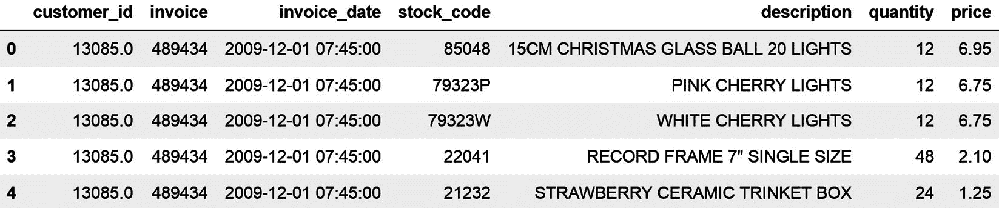
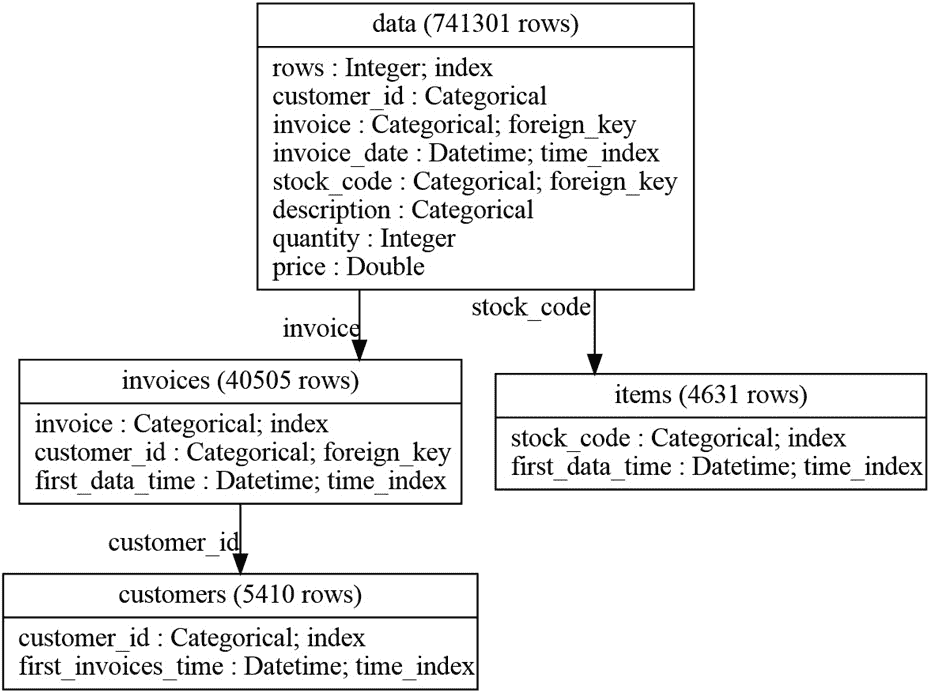
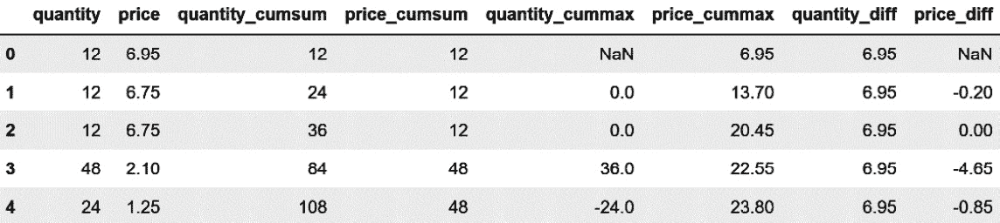
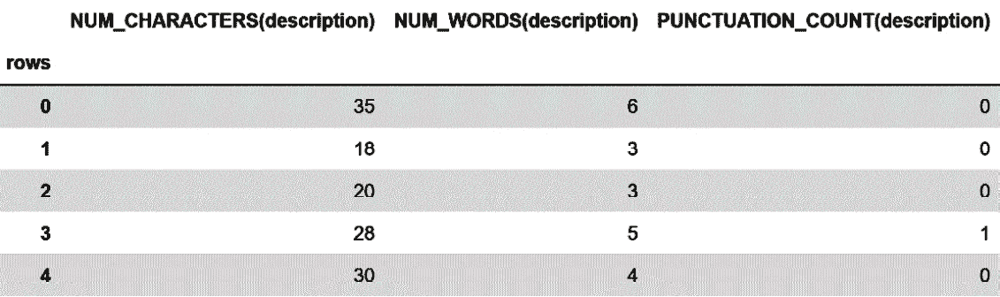

# 第九章：使用 Featuretools 从关系数据中提取特征

在前面的章节中，我们处理了以行和列组织的数据，其中列是变量，行是观察值，每个观察值都是独立的。在本章中，我们将专注于从关系数据集中创建特征。在关系数据集中，数据结构跨越各种表，可以通过唯一标识符进行连接。这些唯一标识符表明不同表之间存在的关系。

关系数据的经典例子是零售公司持有的数据。一张表包含有关客户的信息，例如姓名和地址。第二张表包含有关客户所进行的购买的信息，例如每次购买的物品类型和数量。第三张表包含有关客户与公司网站互动的信息，例如会话持续时间、使用的移动设备和访问的页面。客户、购买和会话通过唯一标识符进行识别。这些唯一标识符使我们能够将这些表放在一起，这样我们就可以获取有关客户购买或会话的信息。

如果我们想了解更多关于我们拥有的客户类型（即客户细分）或者预测他们是否会购买产品，我们可以创建在客户层面跨不同表汇总或总结信息的特征。例如，我们可以创建捕捉客户在购买中花费的最大金额、他们所进行的购买次数、会话之间的时间或平均会话持续时间的特征。我们可以创建的特征数量以及我们可以在表中跨表汇总数据的不同方式是丰富的。在本章中，我们将讨论使用`featuretools` Python 库创建关系数据聚合视图的一些常见方法。我们将从设置各种数据表及其关系并自动创建特征开始，然后我们将详细介绍我们可以创建的不同特征。

在本章中，我们将涵盖以下食谱：

+   设置实体集并自动创建特征

+   使用通用和累积操作创建特征

+   组合数值特征

+   从日期和时间中提取特征

+   从文本中提取特征

+   使用聚合原语创建特征

# 技术要求

在本章中，我们将使用`pandas`、`matplotlib`和`featuretools`开源 Python 库。您可以使用`pip`安装`featuretools`：

```py
pip install featuretools
```

此外，您还可以使用`conda`：

```py
conda install -c conda-forge featuretools
```

这些命令安装了基本的 `featuretools` 功能，但我们可以安装用于使用 `dask` 作为后端而不是 `pandas` 的附加组件。有关如何安装 `featuretools` 附加组件（包括 `graphviz`）的更多信息，请参阅他们的文档：[`docs.featuretools.com/en/v0.16.0/getting_started/install.html`](https://docs.featuretools.com/en/v0.16.0/getting_started/install.html)。

我们将使用来自 UCI 机器学习仓库的 *Online Retail II* 数据集，该数据集可在 [`archive.ics.uci.edu/ml/datasets/Online+Retail+II`](https://archive.ics.uci.edu/ml/datasets/Online+Retail+II) 找到，并受 **Creative Commons Attribution 4.0 国际**（**CC BY 4.0**）许可协议的约束：[`creativecommons.org/licenses/by/4.0/legalcode`](https://creativecommons.org/licenses/by/4.0/legalcode)。该数据的相应引用如下：*Chen, Daqing*（2019）。*Online Retail II*。*UCI Machine Learning Repository* ([`doi.org/10.24432/C5CG6D`](https://doi.org/10.24432/C5CG6D))。

我已下载并修改了如本笔记本所示的数据：[`github.com/PacktPublishing/Python-Feature-engineering-Cookbook-Third-Edition/blob/main/ch09-featuretools/prepare-retail-dataset.ipynb`](https://github.com/PacktPublishing/Python-Feature-engineering-Cookbook-Third-Edition/blob/main/ch09-featuretools/prepare-retail-dataset.ipynb)

你可以在附带的 GitHub 仓库中找到修改后的数据集：[`github.com/PacktPublishing/Python-Feature-engineering-Cookbook-Third-Edition/blob/main/ch09-featuretools/retail.csv`](https://github.com/PacktPublishing/Python-Feature-engineering-Cookbook-Third-Edition/blob/main/ch09-featuretools/retail.csv)

# 设置实体集和自动创建特征

关系型数据集或数据库包含分散在多个表中的数据，表之间的关系由一个唯一标识符决定，它告诉我们如何连接这些表。为了使用 `featuretools` 自动创建特征，我们首先需要输入不同的数据表，并在所谓的 `featuretools` 中建立它们之间的关系，以便库可以自动根据这些关系创建特征。

我们将使用包含客户、发票和产品信息的数据集。首先，我们将设置一个实体集，突出这三个项目之间的关系。这个实体集将是本章剩余菜谱的起点。接下来，我们将通过在客户、发票和产品级别汇总数据，利用 `featuretools` 的默认参数自动创建特征。

在本菜谱中，你将学习如何正确设置实体集并自动为每个实体提取一系列特征。在接下来的菜谱中，我们将深入探讨我们可以使用 `featuretools` 创建的不同类型的特征。

## 准备就绪

在这个食谱中，我们将使用来自 UCI 机器学习仓库的*在线零售 II*数据集。在这个表中，有客户，他们是批量从零售公司购买的企业。客户通过一个唯一的`customer_id`标识符来识别。每位客户进行一次或多次购买，这些购买通过一个唯一的`invoice`标识符标记，包含发票号。在每张发票中，都有客户购买的一个或多个项目。公司销售的每个项目或产品也通过一个唯一的库存代码来识别。

因此，数据有以下关系：


图 9.1 – 显示数据中关系的图

每位客户进行了一次或多次购买，由发票号识别。每张发票包含一个或多个项目，由库存代码识别。每个项目可以被一个或多个客户购买，因此出现在多个发票中。考虑到这些关系，让我们继续进行食谱。

## 如何操作...

在这个食谱中，我们将使用数据设置一个实体集，然后突出显示数据集中的不同关系。最后，我们将通过在客户、发票和产品级别对数据集中的信息进行聚合来创建特征：

1.  让我们导入所需的库：

    ```py
    import pandas as pd
    import featuretools as ft
    from woodwork.logical_types import Categorical
    ```

1.  让我们加载在*准备就绪*部分描述的零售数据集，并显示其前五行：

    ```py
    df = pd.read_csv(
        «retail.csv», parse_dates=[«invoice_date»])
    df.head()
    ```

    在下面的屏幕截图中，我们可以看到客户(`customer_id`)和发票(`invoice`)的唯一标识符，以及关于每张发票购买的项目（如项目的代码`stock_code`）、描述、数量、单价以及发票日期的附加信息：



图 9.2 – 在线零售 II 数据集

注意

使用`pandas`的`unique()`函数来识别唯一的项目、客户和发票的数量——例如，通过执行`df["customer_id"].nunique()`。

1.  让我们用一个任意的名字初始化一个实体集，例如`data`：

    ```py
    es = ft.EntitySet(id="data")
    ```

1.  让我们在实体集中添加一个 DataFrame；我们给 DataFrame 起一个名字（`data`）。我们需要为每一行添加一个唯一标识符，我们称之为`rows`，由于在这个数据集中我们没有唯一的行标识符，我们将通过设置`make_index=True`创建它作为额外的列。最后，我们指出`invoice_date`是`datetime`类型，`customer_id`应被视为`Categorical`：

    ```py
    es = es.add_dataframe(
        dataframe=df,
        dataframe_name=»data»,
        index="rows",
        make_index=True,
        time_index=»invoice_date»,
        logical_types={ «customer_id»: Categorical},
    )
    ```

1.  接下来，我们添加原始`data` DataFrame 和`invoices`之间的关系。为此，我们指出原始或基本 DataFrame，我们在*步骤 4*中将其称为`data`，我们给新的 DataFrame 起一个名字，`invoices`，我们添加发票的唯一标识符，并将包含`customer_id`的列添加到这个 DataFrame 中：

    ```py
    es.normalize_dataframe(
        base_dataframe_name=»data»,
        new_dataframe_name=»invoices»,
        index="invoice",
        copy_columns=[«customer_id»],
    )
    ```

注意

我们将`customer_id`变量复制到`invoices`数据中，因为我们想创建客户和发票之间的后续关系。

1.  现在，我们添加第二个关系，即客户与发票之间的关系。为此，我们指示基础 DataFrame，我们在*步骤 5*中将其命名为`invoices`，然后我们为新 DataFrame 命名，命名为`customers`，并添加唯一的客户标识符：

    ```py
    es.normalize_dataframe(
        base_dataframe_name=»invoices»,
        new_dataframe_name=»customers»,
        index=»customer_id»,
    )
    ```

1.  我们可以在原始数据和产品之间添加第三个关系：

    ```py
    es.normalize_dataframe(
        base_dataframe_name=»data»,
        new_dataframe_name=»items»,
        index=»stock_code»,
    )
    ```

1.  让我们显示实体集中的信息：

    ```py
    es
    ```

    在以下输出中，我们看到实体集包含四个 DataFrame：原始数据、`invoices` DataFrame、`customers` DataFrame 以及产品或`items` DataFrame。实体还包含发票或项目与原始数据之间的关系，以及客户与发票之间的关系：

    ```py
    Entityset: data
      DataFrames:
        data [Rows: 741301, Columns: 8]
        invoices [Rows: 40505, Columns: 3]
        customers [Rows: 5410, Columns: 2]
        items [Rows: 4631, Columns: 2]
      Relationships:
        data.invoice -> invoices.invoice
        invoices.customer_id -> customers.customer_id
    invoices DataFrame:

    ```

    es["invoices"].head()

    ```py

    We see in the following output that `featuretools` automatically created a DataFrame containing the invoice’s unique identifier, followed by the customer’s unique identifier and the first date registered for each invoice:
    ```


图 9.3 – 发票级别的 DataFrame 信息

1.  现在我们显示`customers` DataFrame：

    ```py
    es["customers"].head()
    ```

    在以下输出中，我们可以看到`featuretools`自动创建了一个包含客户唯一标识符的 DataFrame，随后是此客户的第一个发票日期：


图 9.4 – 客户级别的 DataFrame 信息

注意

继续执行`es["items"].head()`来显示包含产品的 DataFrame。您还可以使用`pandas`的`shape`函数评估不同 DataFrame 的大小。您会注意到每个 DataFrame 中的行数与唯一发票、客户和产品的数量相匹配。

1.  我们还可以如下显示这些数据表之间的关系：

    ```py
    es.plot()
    ```

注意

要可视化数据关系，您需要安装`graphviz`。如果没有安装，请按照`featuretools`文档中的说明进行安装：[`featuretools.alteryx.com/en/stable/install.html#installing-graphviz`](https://featuretools.alteryx.com/en/stable/install.html#installing-graphviz)。

在以下输出中，我们可以看到关系数据集及其关系：



图 9.5 – 包含发票、客户和产品的表之间的关系

在输入数据和它们之间的关系后，我们可以开始自动为我们的新 DataFrame（即客户、发票和产品）创建特征，使用`featuretools`的默认参数。

1.  让我们通过在客户级别聚合数据来创建特征。为此，我们设置`featuretools`，将`customers`指定为目标 DataFrame。在创建特征时，我们希望忽略具有唯一标识符的两个列：

    ```py
    feature_matrix, feature_defs = ft.dfs(
        entityset=es,
        target_dataframe_name=»customers»,
        ignore_columns={
            «invoices»:[«invoice»],
            «invoices»:[«customer_id»],
        }
    )
    ```

注意

*步骤 12* 中的命令触发了 114 个具有不同客户级别数据聚合的特征的创建。`feature_matrix` 变量是一个包含特征值的 DataFrame，`feature_defs` 是一个包含新特征名称的列表。继续执行 `feature_defs` 或访问我们的配套 GitHub 仓库 ([`github.com/PacktPublishing/Python-Feature-Engineering-Cookbook-Third-Edition/blob/main/ch09-featuretools/Recipe1-Setting-up-an-entitity-set.ipynb`](https://github.com/PacktPublishing/Python-Feature-Engineering-Cookbook-Third-Edition/blob/main/ch09-featuretools/Recipe1-Setting-up-an-entitity-set.ipynb)) 来检查创建的特征名称。你将在 *如何工作…* 部分找到更多关于这些特征的信息。

1.  由于空间限制，我们无法在书中打印出所有特征，因此，让我们显示五个创建特征的名称：

    ```py
    feature_defs[5:10]
    ```

    在以下输出中，我们看到由 `featuretools` 创建的 114 个特征中的 5 个：

    ```py
    [<Feature: MIN(data.price)>,
    <Feature: MIN(data.quantity)>,
    <Feature: MODE(data.description)>,
    <Feature: MODE(data.stock_code)>,
    <Feature: NUM_UNIQUE(data.description)>]
    ```

注意

`featuretools` 库使用创建它们的函数来命名新特征，然后是用于执行聚合的 DataFrame，最后是聚合变量名称。因此，`MIN(data.quantity)` 等同于 `df.groupby(["customer_id"])["quantity"].min()`，如果你熟悉 `pandas`。我们将在 *如何工作…* 部分提供更多细节。

1.  让我们显示包含五个创建特征的 DataFrame 的前五行：

    ```py
    feature_matrix[feature_matrix.columns[5:10]].head()
    ```

    在以下输出中，我们可以看到包含五个新特征值的前五行：


图 9.6 – 通过聚合客户级别的数据创建的五个特征的 DataFrame

1.  同样，我们可以通过在发票级别聚合信息来自动创建特征：

    ```py
    feature_matrix, feature_defs = ft.dfs(
        entityset=es,
        target_dataframe_name=»invoices»,
        ignore_columns = {«data»: [«customer_id»]},
        max_depth = 1,
    )
    ```

1.  上一步返回了 24 个特征——让我们显示它们的名称：

    ```py
    feature_defs
    ```

    我们可以在以下输出中看到特征的名称：

    ```py
    [<Feature: customer_id>,
    <Feature: COUNT(data)>,
    <Feature: MAX(data.price)>,
    <Feature: MAX(data.quantity)>,
    <Feature: MEAN(data.price)>,
    <Feature: MEAN(data.quantity)>,
    <Feature: MIN(data.price)>,
    <Feature: MIN(data.quantity)>,
    <Feature: MODE(data.description)>,
    <Feature: MODE(data.stock_code)>,
    <Feature: NUM_UNIQUE(data.description)>,
    <Feature: NUM_UNIQUE(data.stock_code)>,
    <Feature: SKEW(data.price)>,
    <Feature: SKEW(data.quantity)>,
    <Feature: STD(data.price)>,
    <Feature: STD(data.quantity)>,
    <Feature: SUM(data.price)>,
    <Feature: SUM(data.quantity)>,
    <Feature: DAY(first_data_time)>,
    <Feature: MONTH(first_data_time)>,
    <Feature: WEEKDAY(first_data_time)>,
    <Feature: YEAR(first_data_time)>]
    ```

注意

继续执行 `feature_matrix.head()` 来显示包含新特征的 DataFrame，或检查我们的配套 GitHub 仓库以查看结果。

总结一下，通过使用 *步骤 16* 中的代码并将目标 DataFrame 名称从 `invoices` 更改为 `items`，继续在产品级别自动创建特征。

## 如何工作...

在这个配方中，我们设置了一个包含数据和某些变量（唯一标识符）之间关系的实体集。之后，我们通过聚合数据集中每个唯一标识符的信息自动创建特征。我们使用了 `featuretools` 的两个主要类，`EntitySet` 和 `dfs`，来创建特征。让我们更详细地讨论这些内容。

`EntitySet` 类存储数据、变量的逻辑类型以及变量之间的关系。变量类型（是否为数值或分类）由 `featuretools` 自动分配。我们也可以在将 DataFrame 添加到实体集时设置特定的变量类型。在 *步骤 4* 中，我们将数据添加到实体集并将 `customer_id` 的逻辑类型设置为 `Categorical`。

注意

要检查 `featuretools` 推断的数据类型，您可以执行 `es["data"].ww`，其中 `es` 是实体集，`data` 是 DataFrame 的名称。

`EntitySet` 类具有 `add_dataframe` 方法，我们在 *步骤 4* 中使用此方法添加新的 DataFrame。在使用此方法时，我们需要指定唯一标识符，如果没有，则需要创建一个，就像我们在 *步骤 4* 中所做的那样，通过将 `make_index` 设置为 `True`。请注意，在 `add_dataframe` 的 `index` 参数中，我们传递了 `"rows"` 字符串。使用此配置，`EntitySet` 将包含每行的唯一标识符的 `rows` 列添加到 DataFrame 中，这是一个从 0 开始的新整数序列。

注意

而不是使用 `add_dataframe` 方法将 DataFrame 添加到实体集中，我们可以通过执行 `es["df_name"]=df` 来添加它，其中 `"df_name"` 是我们想要给 DataFrame 的名称，`df` 是我们想要添加的 DataFrame。

`EntitySet` 类具有 `normalize_dataframe` 方法，该方法用于从现有列的唯一值创建新的 DataFrame 和关系。此方法接受新 DataFrame 将关联的 DataFrame 的名称以及新 DataFrame 的名称。我们还需要在 `index` 参数中指明新 DataFrame 的唯一标识符。默认情况下，此方法创建一个包含唯一标识符的新 DataFrame，后面跟着一个包含每个唯一标识符首次注册的日期的 `datetime` 列。我们可以通过使用 `copy_columns` 参数向此 DataFrame 添加更多列，就像我们在 *步骤 5* 中所做的那样。向新 DataFrame 添加更多列对于如果我们想跟踪与该新 DataFrame 的关系是有用的，就像我们在 *步骤 6* 中所做的那样。

`EntitySet` 类还具有 `plot()` 方法，该方法显示实体集中的现有关系。在 *图 9**.5* 中，我们看到了我们的数据表之间的关系；`invoices` 和 `items`（产品）表与原始数据相关联，而 `customers` 表与 `invoices` 表相关联，而 `invoices` 表又与原始数据相关联。

注意

表之间的关系决定了特征的创建方式。`invoices`和`items`表与原始数据相关。因此，我们只能创建深度为 1 的特征。另一方面，`customers`表与发票相关，而发票又与数据相关。因此，我们可以创建深度为 2 的特征。这意味着新特征将包括整个数据集的聚合或首先对发票进行聚合，然后对客户进行后续聚合。我们可以通过`dfs`中的`max_depth`参数来调节要创建的特征。

在设置好数据和关系后，我们使用了`featuretools`中的`dfs`来自动创建特征。在用`dfs`创建特征时，我们需要设置目标 DataFrame——即应该创建特征的对应数据表。`dfs`类通过所谓的**转换**和**聚合原语**，通过转换和聚合现有变量来创建特征。

转换原语转换变量。例如，使用转换原语，`dfs`可以从日期时间变量中提取`month`、`year`、`day`和`week`值。

聚合原语对唯一标识符的信息进行聚合。它使用诸如平均值、标准差、最大值和最小值、总和以及数值变量的偏度系数等数学运算。对于分类变量，聚合原语使用众数和唯一项目的计数。对于唯一标识符，它们计算出现的次数。

考虑到转换和聚合原语的功能，让我们尝试理解在这个配方中创建的特征。我们使用了`dfs`的默认参数来创建默认特征。

注意

想要了解更多关于`featuretools`返回的默认特征的信息，请访问[`featuretools.alteryx.com/en/stable/generated/featuretools.dfs.html#featuretools.dfs`](https://featuretools.alteryx.com/en/stable/generated/featuretools.dfs.html#featuretools.dfs)。

我们首先为每位客户创建了特征。`featuretools`为每位客户返回了 114 个特征。由于`customers`数据与`invoices`数据相关，而`invoices`数据又与整个数据集相关，因此特征是通过在两个级别上聚合数据来创建的。首先，使用整个数据集对每个客户的数据进行聚合。接下来，首先对每个发票进行聚合，然后对预先聚合的数据再次进行聚合，以创建每个客户的特征。

`featuretools` 库使用用于聚合数据的函数来命名新特征 – 例如，`COUNT`、`MEAN`、`STD` 和 `SKEW` 等。接下来，它使用用于聚合的数据，并跟随聚合的变量。例如，`MEAN(data.quantity)` 特征包含从整个数据集中计算出的客户购买物品的平均数量，这相当于如果你熟悉 `pandas`，则是 `df.groupby("customer_id")["quantity"].mean()`。另一方面，`MEAN(invoices.MEAN(data.quantity))` 特征首先获取每个发票的物品平均数量 – 即 `df.groupby("invoice")["quantity"].mean()` – 然后从生成的序列中获取平均值，考虑特定客户的发票。

对于分类特征，`featuretools` 确定众数和唯一值。例如，从 `description` 变量中，我们得到了 `NUM_UNIQUE(data.description)` 和 `MODE(data.description)` 特征。描述只是物品的名称。因此，这些特征突出了客户购买的独特物品数量以及客户购买次数最多的物品。

注意一些有趣的事情

在对分类特征进行聚合后，`NUM_UNIQUE(data.description)` 和 `MODE(data.description)` 变量是数值型的。`featuretools` 库通过使用这些新创建变量的数值聚合来创建更多特征。这样，`MAX(invoices.NUM_UNIQUE(data.description))` 特征首先找到每个发票的独特物品数量，然后返回特定客户这些值中的最大值，考虑所有客户的发票。

从日期时间特征中，`featuretools` 默认提取日期组件。记住，`customers` DataFrame 包含 `customer_id` 变量和每个客户的第一个发票日期，正如我们在 *步骤 10* 的输出中看到的。从这个日期时间特征中，`featuretools` 创建了包含不同日期部分的 `DAY(first_invoices_time)`、`MONTH(first_invoices_time)`、`WEEKDAY(first_invoices_time)` 和 `YEAR(first_invoices_time)` 特征。

最后，`featuretools` 还返回了每个客户的发票总数（`COUNT(invoices)`) 和每客户的总行数（`COUNT(data)`)。

## 参见

要了解更多关于 `featuretools` 的灵感来源，请查看 Kanter 和 Veeramachaneni 在 [`www.jmaxkanter.com/papers/DSAA_DSM_2015.pdf`](https://www.jmaxkanter.com/papers/DSAA_DSM_2015.pdf) 发表的原始文章 *Deep Feature Synthesis: Towards Automating Data Science Endeavors*。

# 使用通用和累积操作创建特征

`featuretools` 库使用所谓的 **转换原语** 来创建特征。转换原语将一个或多个数据集中的列作为输入，并返回一个或多个列作为输出。它们应用于一个 *单个* DataFrame。

`featuretools`库根据它们执行的操作类型或修改的变量类型将转换原语分为各种类别。例如，**通用转换原语**应用数学运算，如平方根、正弦和余弦。**累积转换原语**通过比较一行值与前一行的值来创建新特征。例如，累积和、累积平均值、累积最小值和最大值以及行值之间的差异属于这一类别。还有一个可以应用于日期时间变量的累积转换，即**自上次以来**转换，它确定两个连续时间戳之间的时间流逝。

在这个配方中，我们将使用`featuretools`中的通用和累积转换原语来创建特征。

## 准备工作

当我们想要改变变量的分布，就像我们在*第三章*中看到的，*转换数值变量*时，变量转换，如平方根或对数是有用的。其他数学推导，如正弦和余弦，有助于捕捉潜在的数据模式，正如我们在*第八章*中描述的*从周期性变量创建周期性特征*配方中所述，*创建新特征*。从那些章节中描述的转换中，`featuretools`支持平方根和对数转换以及正弦和余弦（但不需要在 0 和 2π之间归一化）。

通过累积转换，例如，我们可以通过将发票级别的每一行的项目数量相加来获取每个发票购买的项目总数。为了理解我们将在此配方中创建的特征，让我们首先使用`pandas`创建它们：

1.  让我们导入`pandas`和`numpy`：

    ```py
    import numpy as np
    import pandas as pd
    ```

1.  让我们加载在*技术* *要求*部分中描述的零售数据集：

    ```py
    df = pd.read_csv(
        «retail.csv», parse_dates=[«invoice_date»])
    ```

1.  让我们捕捉两个数值变量，`价格`和`数量`，到一个列表中：

    ```py
    numeric_vars = ["quantity", "price"]
    ```

1.  让我们将累积函数的名称捕捉到一个列表中：

    ```py
    func = ["cumsum", "cummax", "diff"]
    ```

1.  让我们创建一个包含我们将创建的变量新名称的列表：

    ```py
    new_names = [f"{var}_{function}"
        for function in func for var in numeric_vars]
    ```

1.  让我们使用第 4 步中的累积函数，应用于第 3 步中的变量，并添加到 DataFrame 中：

    ```py
    df[new_names] = df.groupby(
        "invoice")[numeric_vars].agg(func)
    ```

    上一步返回了每个发票内的累积和、累积最大值以及行之间的差异。一旦遇到新的发票编号，它就会重新开始。

1.  让我们展示一个特定发票的原有和新特征：

    ```py
    df[df["invoice"] == "489434" ][
        numeric_vars + new_names]
    ```

    在以下输出中，我们可以看到`quantity_cumsum`是数量的累积和，而`price_diff`是逐行后的价格差异：



图 9.7 - 显示对单个实体（发票）中的数值特征应用累积函数的 DataFrame

现在让我们将正弦和余弦转换应用于整个 DataFrame。

1.  让我们创建一个新变量名称的列表：

    ```py
    new_names = [
        f"{var}_{function}"
        for function in ["sin", "cos"]
        for var in numeric_vars]
    ```

1.  让我们使用正弦和余弦函数转换价格和数量：

    ```py
    df[new_names] = df[numeric_vars].agg(
        [np.sin, np.cos])
    ```

    步骤 9 中的转换被应用于整个数据集，无论发票号如何，这是可以的，因为它是从一行映射到同一行，而不是像累积函数那样从一行映射到下一行。您可以通过执行`df[new_names].head()`来检查结果。

现在我们已经了解了我们想要创建的特征类型，让我们使用`featuretools`自动化这个过程。

## 如何做到这一点...

我们将对每个发票应用累积转换，对整个数据集应用通用转换：

1.  首先，我们将导入`pandas`、`featuretools`以及`Categorical`逻辑类型：

    ```py
    import pandas as pd
    import featuretools as ft
    from woodwork.logical_types import Categorical
    ```

1.  让我们加载*技术*要求部分中描述的数据集：

    ```py
    df = pd.read_csv(
        «retail.csv», parse_dates=[«invoice_date»])
    ```

1.  让我们设置一个实体集：

    ```py
    es = ft.EntitySet(id="data")
    ```

1.  让我们将 DataFrame 添加到实体集中：

    ```py
    es = es.add_dataframe(
        dataframe=df,
        dataframe_name=»data»,
        index="rows",
        make_index=True,
        time_index=»invoice_date»,
        logical_types={
            "customer_id": Categorical,
            "invoice": Categorical,
        }
    )
    ```

注意

默认情况下，`featuretools`仅在生成的特征矩阵中保留分类、数值和布尔特征，该矩阵是在创建新特征之后生成的。`invoice`变量的类型没有被准确推断，所以如果我们想让`featuretools`在包含新特征的数据集中保留它，我们需要通过将其逻辑类型设置为我们在步骤 4 中做的那样来强制将其作为分类。要了解`featuretools`推断的数据类型，您可以执行`es["data"].ww`。

1.  让我们创建一个新的与步骤 4 中的 DataFrame 相关联的 DataFrame：

    ```py
    es.normalize_dataframe(
        base_dataframe_name=»data»,
        new_dataframe_name=»invoices»,
        index="invoice",
        copy_columns=[«customer_id»],
    )
    ```

注意

关于步骤 4 和 5 的更多详细信息，请访问*设置实体集和自动创建特征*菜谱。

1.  让我们列出我们将用于创建特征的累积转换：

    ```py
    cum_primitives = [
        "cum_sum",
        "cum_max",
        "diff",
        "time_since_previous"]
    ```

注意

您可以在以下链接找到`featuretools`支持的累积转换：[`featuretools.alteryx.com/en/stable/api_reference.html#cumulative-transform-primitives`](https://featuretools.alteryx.com/en/stable/api_reference.html#cumulative-transform-primitives)

1.  让我们列出要执行的一般转换：

    ```py
    general_primitives = ["sine", " cosine "]
    ```

注意

您可以在以下链接找到`featuretools`支持的通用转换：[`featuretools.alteryx.com/en/stable/api_reference.html#general-transform-primitives`](https://featuretools.alteryx.com/en/stable/api_reference.html#general-transform-primitives)

1.  最后，让我们创建特征。我们使用`dfs`类，将原始 DataFrame 设置为目标 DataFrame——即我们将使用其变量作为新特征模板的那个 DataFrame。注意，我们向`agg_primitives`参数传递一个空列表；这是为了避免返回默认的聚合原语。我们将步骤 7 中的通用原语传递给`trans_primitives`参数，将步骤 6 中的累积原语传递给`groupby_trans_primitives`参数：

    ```py
    feature_matrix, feature_defs = ft.dfs(
        entityset=es,
        target_dataframe_name=»data»,
        agg_primitives=[],
        trans_primitives=general_primitives,
        groupby_trans_primitives = cum_primitives,
        ignore_dataframes = [«invoices»],
    )
    ```

注意

*步骤 8* 触发特征的创建，这可能会根据数据的大小、聚合级别数量以及要创建的特征数量而花费一些时间。你可以在创建它们之前检查输出特征，通过将`features_only`参数设置为`True`。这将仅返回特征名称；你可以检查它们，确保它们显示了你需要的内容，然后通过将参数设置回`False`来触发特征合成。

1.  让我们现在显示创建的特征名称：

    ```py
    feature_defs
    ```

    在以下输出中，我们看到我们创建的特征名称，包括价格和数量的正弦和余弦，以及按发票号分组后的这些变量的累积变换：

    ```py
    [<Feature: customer_id>,
    <Feature: invoice>,
    <Feature: stock_code>,
    <Feature: description>,
    <Feature: quantity>,
    <Feature: price>,
    <Feature: COSINE(price)>,
    <Feature: COSINE(quantity)>,
    <Feature: SINE(price)>,
    <Feature: SINE(quantity)>,
    <Feature: CUM_MAX(price) by invoice>,
    <Feature: CUM_MAX(quantity) by invoice>,
    <Feature: CUM_SUM(price) by invoice>,
    <Feature: CUM_SUM(quantity) by invoice>,
    <Feature: DIFF(price) by invoice>,
    <Feature: DIFF(quantity) by invoice>,
    <Feature: TIME_SINCE_PREVIOUS(invoice_date) by invoice>]
    ```

注意

价格和数量的正弦和余弦变换可能不会增加太多价值，因为这些不是周期性特征。我保留这些变换在配方中，是为了向你展示如何在需要时应用变换原语。

如前所述列表所示，新特征作为新列附加到原始 DataFrame 中。你可以通过执行`feature_matrix.head()`来显示最终的 DataFrame：


图 9.8 – 深度特征合成产生的 DataFrame，包含原始变量和新特征

关于创建的特征的更多详细信息，请查看*它是如何工作的…*部分。

## 它是如何工作的...

要使用`featuretools`创建一般和累积变换的特征，我们首先需要设置一个包含数据的实体集并定义其变量之间的关系。我们在*设置实体集和自动创建特征*配方中描述了如何设置实体集。

要应用累积和一般变换，我们使用了`featuretools`中的`dfs`类。一般变换应用于整个 DataFrame，而不按特定变量分组。要执行一般变换，我们将包含变换名称的字符串列表传递给`dfs`的`trans_primitives`参数。

我们在按`invoice`分组后应用了累积变换。为此，我们将包含累积变换名称的字符串列表传递给`dfs`的`groupby_trans_primitives`参数。`featuretools`库知道应该按发票分组，因为我们通过使用`EntitySet`中的`normalize_dataframe`方法在*步骤 5*中建立了这个唯一标识符。

最后，我们不想从`invoices`DataFrame 中的变量创建特征；因此，我们将`dfs`设置为通过设置`ignore_dataframes = ["``invoices"]`来忽略此 DataFrame。

`dfs`类返回了两个变量，包含原始和新特征的 DataFrame 以及一个包含特征名称的列表。新特征以创建它们的操作命名，例如`SINE`、`COSINE`、`CUM_MAX`或`DIFF`，后跟应用转换的变量，以及当适用时用于分组的变量。

注意，`featuretools`会自动识别并选择应用转换的变量。正弦、余弦、累计总和、最大值和差分被应用于数值变量，而`time_since_previous`转换被应用于日期时间变量。

# 结合数值特征

在*第八章* *创建新特征*中，我们看到了我们可以通过使用数学运算结合变量来创建新特征。`featuretools`库支持多种结合变量的操作，包括加法、除法、取模和乘法。在本食谱中，我们将学习如何使用`featuretools`结合这些特征。

## 如何操作...

让我们从导入库和准备数据集开始：

1.  首先，我们将导入`pandas`、`featuretools`和`Categorical`逻辑类型：

    ```py
    import pandas as pd
    import featuretools as ft
    from woodwork.logical_types import Categorical
    ```

1.  让我们加载在*技术* *要求*部分中描述的数据集：

    ```py
    df = pd.read_csv(
        «retail.csv», parse_dates=[«invoice_date»])
    ```

1.  让我们设置一个实体集：

    ```py
    es = ft.EntitySet(id="data")
    ```

1.  让我们将 DataFrame 添加到实体集中：

    ```py
    es = es.add_dataframe(
        dataframe=df,
        dataframe_name=»data»,
        index="rows",
        make_index=True,
        time_index=»invoice_date»,
        logical_types={«customer_id»: Categorical},
    )
    ```

1.  让我们创建一个与*步骤 4*中的 DataFrame 相关联的新 DataFrame：

    ```py
    es.normalize_dataframe(
        base_dataframe_name=»data»,
        new_dataframe_name=»invoices»,
        index="invoice",
        copy_columns=[«customer_id»],
    )
    ```

注意

关于*步骤 4*和*步骤 5*的更多详细信息，请访问*设置实体集和自动创建特征* *食谱*。

1.  我们将乘以`quantity`和`price`变量，分别反映购买的商品数量和单价，以获得总支付金额：

    ```py
    feature_matrix, feature_defs = ft.dfs(
        entityset=es,
        target_dataframe_name=»data»,
        agg_primitives=[],
        trans_primitives=[«multiply_numeric»],
        primitive_options={
            («multiply_numeric»): {
                ‹include_columns›: {
                    'data': ["quantity", "price"]
                }
            }
        },
        ignore_dataframes=[«invoices»],
    )
    ```

注意

我们将`agg_primitives`设置为空列表，以避免创建默认的原始操作。

1.  现在我们来显示新特征的名称：

    ```py
    feature_defs
    ```

    在以下输出中，我们可以看到特征名称，其中最后一个对应于`price`和`quantity`变量的组合：

    ```py
    [<Feature: customer_id>,
    <Feature: stock_code>,
    <Feature: description>,
    <Feature: quantity>,
    <Feature: price>,
    <Feature: price * quantity>]
    ```

1.  最后，让我们检查在*步骤 6*中创建的新 DataFrame：

    ```py
    feature_matrix.head()
    ```

    在以下输出中，我们可以看到新特征被附加到原始 DataFrame 的右侧：


图 9.9 – 由价格与数量乘积产生的新特征的 DataFrame

与`featuretools`结合特征可能比`df["price"].mul(df["quantity"])`的`pandas`功能要复杂得多。真正的力量在于我们以这种方式创建新特征并随后在发票或客户级别进行聚合时。我们将在*使用聚合* *原始操作*创建特征*的食谱中讨论聚合函数。

## 它是如何工作的...

为了乘法特征，我们使用了来自 `featuretools` 的 `MultiplyNumeric` 原始操作，它可以通过 `dfs` 使用 `multiply_numeric` 字符串访问。我们将前一个字符串传递给 `trans_primitive` 参数，然后使用 `primitive_options` 参数指定要乘法的变量。请注意，此外，我们还向 `agg_primitives` 参数传递了一个空列表，以避免返回默认的聚合原始操作，并且我们忽略了来自 `invoices` DataFrame 的特征。

要查看允许您组合变量的其他函数，请访问 [`featuretools.alteryx.com/en/stable/api_reference.html#binary-transform-primitives`](https://featuretools.alteryx.com/en/stable/api_reference.html#binary-transform-primitives)。在撰写本文时，我注意到 `MultiplyNumeric` 和 `DivideNumeric` 不在文档中。您始终可以通过检查源代码来双检查哪些函数受支持：[`github.com/alteryx/featuretools/tree/main/featuretools/primitives/standard/transform/binary`](https://github.com/alteryx/featuretools/tree/main/featuretools/primitives/standard/transform/binary)。您还可以通过在设置实体集及其关系后运行以下命令来检查您可以在数据上执行哪些操作：`ft.get_valid_primitives(es, target_dataframe_name="data", max_depth=2)`。在这里，`es` 是由 *步骤 5* 得到的实体集。

# 从日期和时间中提取特征

在 *第六章* 中，*从日期和时间变量中提取特征*，我们讨论了如何通过从日期和时间变量的日期和时间部分提取特征来丰富我们的数据集，例如年份、月份、星期几、小时等等。我们可以利用 `featuretools` 自动提取这些特征。

`featuretools` 库支持使用其 **日期时间转换原始操作** 创建来自日期时间变量的各种特征。这些原始操作包括常见的变量，如年份、月份和日期，以及其他特征，如 *是否是午餐时间* 或 *是否是工作日*。此外，我们可以提取表示日期是否为联邦假日或银行假日（如英国所称）的特征，或者确定到特定日期的时间距离的特征。对于零售公司来说，圣诞节、黑色星期五或节礼日等日期的邻近性通常意味着销售额的增加，如果他们正在预测需求，这些将是有用的变量。

注意

有关可以创建的日期时间变量特征的更多详细信息，请访问 [`featuretools.alteryx.com/en/stable/api_reference.html#datetime-transform-primitives`](https://featuretools.alteryx.com/en/stable/api_reference.html#datetime-transform-primitives)。

在这个菜谱中，我们将使用 `featuretools` 自动从日期时间变量创建多个特征。

## 如何做...

让我们从导入库和准备数据集开始：

1.  首先，我们将导入`pandas`、`featuretools`和一些特殊的 datetime 原始函数：

    ```py
    import pandas as pd
    import featuretools as ft
    from featuretools.primitives import (
        IsFederalHoliday, DistanceToHoliday)
    from woodwork.logical_types import Categorical
    ```

1.  让我们加载*技术要求*部分描述的数据集：

    ```py
    df = pd.read_csv(
        «retail.csv», parse_dates=[«invoice_date»])
    ```

1.  让我们设置一个实体集：

    ```py
    es = ft.EntitySet(id="data")
    ```

1.  让我们将 DataFrame 添加到实体集中：

    ```py
    es = es.add_dataframe(
        dataframe=df,
        dataframe_name=»data»,
        index="rows",
        make_index=True,
        time_index=»invoice_date»,
        logical_types={«customer_id»: Categorical},
    )
    ```

1.  让我们创建一个新的 DataFrame，它与*步骤 4*中的 DataFrame 有关联：

    ```py
    es.normalize_dataframe(
        base_dataframe_name=»data»,
        new_dataframe_name=»invoices»,
        index="invoice",
        copy_columns=[«customer_id»],
    )
    ```

注意

更多关于*步骤 4*和*步骤 5*的详细信息，请访问*设置实体集和自动创建特征*配方。

1.  让我们创建一个返回布尔向量的原始函数，指示日期是否与英国的银行假日（即非工作日）相符（即，非工作日）：

    ```py
    is_bank_hol = IsFederalHoliday(country="UK")
    ```

注意

在设置用于确定银行假日的原始函数时，选择正确的国家非常重要。要查看支持的国家列表，请访问[`github.com/dr-prodigy/python-holidays#available-countries`](https://github.com/dr-prodigy/python-holidays#available-countries)。

1.  让我们检查这个原始函数中包含哪些银行假日：

    ```py
    hols = is_bank_hol.holidayUtil.federal_holidays.values()
    available_hols = list(set(hols))
    ```

    如果我们执行`available_hols`，我们将看到支持英国银行假日的列表：

    ```py
    ['May Day',
     'Good Friday',
     'Wedding of William and Catherine',
     'Coronation of Charles III',
     'Christmas Day',
     'Wedding of Charles and Diana',
     'Christmas Day (observed)',
     'State Funeral of Queen Elizabeth II',
     'Silver Jubilee of Elizabeth II',
     'Spring Bank Holiday',
     'Diamond Jubilee of Elizabeth II',
     'Boxing Day (observed)',
     'Platinum Jubilee of Elizabeth II',
     "New Year's Day (observed)",
     'Boxing Day',
     'Golden Jubilee of Elizabeth II',
     'Millennium Celebrations',
     "New Year's Day"]
    ```

1.  让我们创建另一个原始函数，用于确定到特定日期的天数 – 在这种情况下，到节礼日的距离：

    ```py
    days_to_boxing = DistanceToHoliday(
        holiday="Boxing Day", country="UK")
    ```

1.  现在，让我们创建一个包含字符串的列表，这些字符串可以识别从`datetime`中获取的常见特征，并包括*步骤 6*和*步骤 8*中的原始函数：

    ```py
    date_primitives = [
        "day", "year", "month", "weekday",
        "days_in_month", "part_of_day",
        "hour", "minute",
        is_bank_hol,
        days_to_boxing
    ]
    ```

1.  让我们现在根据`invoice_date`日期变量从*步骤 9*创建日期和时间特征：

    ```py
    feature_matrix, feature_defs = ft.dfs(
        entityset=es,
        target_dataframe_name=»invoices»,
        agg_primitives=[],
        trans_primitives=date_primitives,
    )
    ```

注意

在*步骤 4*中，我们将`invoice_date`变量作为时间变量输入。因此，`featuretools`将使用此变量来创建日期和时间相关特征。

1.  让我们显示创建的特征的名称：

    ```py
    feature_defs
    ```

    在以下输出中，我们看到原始特征和时间特征的名字：

    ```py
    [<Feature: customer_id>,
    <Feature: DAY(first_data_time)>,
    <Feature: DAYS_IN_MONTH(first_data_time)>,
    <Feature: DISTANCE_TO_HOLIDAY(
         first_data_time, holiday=Boxing Day, country=UK)>,
    <Feature: HOUR(first_data_time)>,
    <Feature: IS_FEDERAL_HOLIDAY(
         first_data_time, , country=UK)>,
    <Feature: MINUTE(first_data_time)>,
    <Feature: MONTH(first_data_time)>,
    <Feature: PART_OF_DAY(first_data_time)>,
    <Feature: WEEKDAY(first_data_time)>,
    feature_matrix.head() to take a look at the resulting DataFrame with the features created from the invoice date. The DataFrame is quite big, so for reasons of space, we’ll only display a few columns in the book.
    ```

1.  让我们显示包含三个新特征的 DataFrame 的结果：

    ```py
    columns = [
        "DISTANCE_TO_HOLIDAY(first_data_time,
            holiday=Boxing Day, country=UK)",
        "HOUR(first_data_time)",
        "IS_FEDERAL_HOLIDAY(first_data_time,
            country=UK)",
    ]
    feature_matrix[columns].head()
    ```

    在以下输出中，我们看到包含新特征的 DataFrame：


图 9.10 – 从 datetime 派生的一些 DataFrame 特征

注意到一些创建的特征是数值型的，例如`HOUR`或`DAY`，一些是布尔型的，例如`IS_FEDERAL_HOLIDAY`，还有一些是分类型的，例如`PART_OF_DAY`。要查看`PART_OF_DAY`的值，请执行`feature_matrix["PART_OF_DAY(first_data_time)"].unique()`。

## 它是如何工作的...

要从日期时间变量中创建特征，我们使用了 `featuretools` 的日期时间转换原语 ([`featuretools.alteryx.com/en/stable/api_reference.html#datetime-transform-primitives`](https://featuretools.alteryx.com/en/stable/api_reference.html#datetime-transform-primitives))。这些原语可以通过 `dfs` 使用我们在 *步骤 6* 到 *9* 中指定的字符串和函数通过 `trans_primitive` 参数访问。请注意，此外，我们还向 `agg_primitives` 参数传递了一个空列表，以避免返回应用于我们的日期时间特征的默认聚合原语。我们还忽略了来自 `invoices` DataFrame 的特征。

注意

我们将 `agg_primitives` 设置为空列表，并忽略了 `invoices` DataFrame，以保持输出简单并能够专注于日期时间特征。然而，请注意，`featuretools` 的真正威力在于从 `datetime` 创建原语，然后在不同的实体级别进一步聚合它们。

# 从文本中提取特征

在 *第十一章* *从文本变量中提取特征* 中，我们将讨论我们可以利用 `pandas` 和 `scikit-learn` 从文本片段中提取的各种特征。我们还可以通过利用 `featuretools` 自动从文本中提取多个特征。

`featuretools` 库支持创建多个基本特征作为其默认功能的一部分，例如文本中的字符数、单词数、每个单词的平均字符数以及文本片段中的中位词长等。

注意

要查看默认文本原语的全列表，请访问 [`featuretools.alteryx.com/en/stable/api_reference.html#naturallanguage-transform-primitives`](https://featuretools.alteryx.com/en/stable/api_reference.html#naturallanguage-transform-primitives)。

此外，还有一个配套的 Python 库，`nlp_primitives`，其中包含额外的原语，用于基于 NLP 创建更高级的特征。在这些函数中，我们发现了一些用于确定多样性得分、极性得分或停用词计数的原语。

注意

在编写本文档时，没有关于 `nlp_primitives` 库支持的原始语法的文档，因此要了解更多信息，您需要检查源代码：[`github.com/alteryx/nlp_primitives/tree/6243ef2379501bfec2c3f19e35a30b5954605e57/nlp_primitives`](https://github.com/alteryx/nlp_primitives/tree/6243ef2379501bfec2c3f19e35a30b5954605e57/nlp_primitives)。

在这个配方中，我们将首先利用 `featuretools` 的默认功能从文本变量中创建多个特征，然后突出显示如何使用 `nlp_primitives` 库中的原语。

## 准备工作

要跟随这个配方，您需要安装 `nlp_primitives` 库，您可以使用 `pip` 来完成：

```py
pip install nlp_primitives
```

否则，您可以使用 `conda`：

```py
conda install -c conda-forge nlp-primitives
```

注意

更多详情，请访问 `nlp_primitives` GitHub 仓库：[`github.com/alteryx/nlp_primitives`](https://github.com/alteryx/nlp_primitives)

## 如何做到这一点...

让我们先导入库并准备好数据集：

1.  首先，我们将导入 `pandas`、`featuretools` 和逻辑类型：

    ```py
    import pandas as pd
    import featuretools as ft
    from woodwork.logical_types import (
       Categorical, NaturalLanguage)
    ```

1.  让我们将第 *技术* *要求* 部分中描述的数据集加载进来：

    ```py
    df = pd.read_csv(
        «retail.csv», parse_dates=[«invoice_date»])
    ```

1.  让我们设置一个实体集：

    ```py
    es = ft.EntitySet(id="data")
    ```

1.  让我们将 DataFrame 添加到实体集中，并突出显示 `description` 变量是一个文本变量：

    ```py
    es = es.add_dataframe(
        dataframe=df,
        dataframe_name=»data»,
        index="rows",
        make_index=True,
        time_index=»invoice_date»,
        logical_types={
            «customer_id»: Categorical,
            "invoice": Categorical,
            «description»: NaturalLanguage,
        }
    )
    ```

注意

为了使 `featuretools` 库的文本原语正常工作，我们需要通过使用 `NaturalLanguage` 逻辑类型来指示哪些变量是文本。

1.  让我们创建一个新的 DataFrame，它与第 4 步中的 DataFrame 有关系：

    ```py
    es.normalize_dataframe(
        base_dataframe_name=»data»,
        new_dataframe_name=»invoices»,
        index="invoice",
        copy_columns=[«customer_id»],
    )
    ```

注意

更多关于 *步骤 4* 和 *5* 的详情，请访问 *设置实体集和自动创建特征* 的配方。

1.  让我们创建一个字符串列表，对应于我们想要创建的文本特征：

    ```py
    text_primitives = [
        "num_words",
        "num_characters",
        "MeanCharactersPerWord" ,
        "PunctuationCount"]
    ```

1.  现在我们从 `description` 变量中提取文本特征：

    ```py
    feature_matrix, feature_defs = ft.dfs(
        entityset=es,
        target_dataframe_name=»data»,
        agg_primitives=[],
        trans_primitives=text_primitives,
        ignore_dataframes=[«invoices»],
    )
    ```

1.  让我们显示创建的特征的名称：

    ```py
    feature_defs
    ```

    在以下输出中，我们看到原始特征名称，然后是来自 `description` 变量的创建特征：

    ```py
    [<Feature: customer_id>,
    <Feature: invoice>,
    <Feature: stock_code>,
    <Feature: quantity>,
    <Feature: price>,
    <Feature: MEAN_CHARACTERS_PER_WORD(description)>,
    <Feature: NUM_CHARACTERS(description)>,
    <Feature: NUM_WORDS(description)>,
    feature_matrix.head().
    ```

1.  让我们显示包含文本派生特征的 DataFrame 的一个切片：

    ```py
    text_f = [
         "NUM_CHARACTERS(description)",
         "NUM_WORDS(description)",
         "PUNCTUATION_COUNT(description)",
    ]
    feature_matrix[text_f].head()
    ```

    在以下输出中，我们看到一个包含从文本创建的特征的 DataFrame：



图 9.11 – 从文本创建的特征 DataFrame

注意

`featuretools` 库移除了原始文本变量 `description`，并返回了新的特征。

要使用 `nlp_primitives` 包中的原语创建特征，您需要首先导入它们 – 例如，通过执行 `from nlp_primitives import DiversityScore` – 然后将原语添加到我们在第 *6* 步中创建的文本原语列表中。请注意，这些是复杂函数，因此创建特征可能需要一些时间。

## 它是如何工作的...

要从文本变量创建特征，我们使用了 `featuretools` 的默认文本原语。这些原语可以通过 `dfs` 通过传递一个字符串列表来访问，这些字符串对应于原语名称，例如第 *6* 步中的那些，传递给 `trans_primitives` 参数。

对于更高级的原语，您需要从 `nlp_primitives` 库中导入原语函数，然后将它们传递给 `dfs` 的 `trans_primitives` 参数。这样，`dfs` 就可以利用这些原语的功能从文本中创建新的特征。`nlp_primitives` 库在底层使用 `nltk` Python 库。

# 使用聚合原语创建特征

在本章中，我们通过将现有变量映射到新特征中，通过各种函数自动创建了特征。例如，我们从日期时间变量中提取日期和时间部分，计算文本中的单词、字符和标点符号的数量，将数值特征组合成新变量，并使用正弦和余弦等函数转换特征。为了创建这些特征，我们使用了转换原语。

`featuretools` 库也支持与发票相关的 `price`，一个聚合原语将取单个发票的所有价格观测值并返回一个单一值，例如该发票的平均价格或总和（即支付的总金额）。

注意

`featuretools` 的聚合功能相当于 `pandas` 中的 `groupby`，随后是 `pandas` 函数如 `mean`、`sum`、`std` 和 `count` 等。

一些聚合原语与数值变量一起工作，例如平均值、总和、最大值和最小值。其他聚合原语是特定于分类变量的，例如唯一值的数量和最频繁的值（众数）。

注意

要获取支持的聚合原语的完整列表，请访问 [`featuretools.alteryx.com/en/stable/api_reference.html#aggregation-primitives`](https://featuretools.alteryx.com/en/stable/api_reference.html#aggregation-primitives)。

在这个菜谱中，我们首先将通过聚合现有变量来创建多个特征。之后，我们将结合使用转换和聚合原语，以突出 `featuretools` 的真正威力。

## 准备工作

在这个菜谱中，我们将使用来自 UCI 机器学习仓库的 *Online Retail II* 数据集。这个数据集包含有关产品（项目）、发票和客户的信息。为了跟随这个菜谱，了解这些实体的性质及其关系，以及如何正确设置 `featuretools` 的实体集，非常重要，这些我们在 *设置实体集和自动创建特征* 菜谱中已经描述过。在继续下一部分之前，请确保你已经查看了那个菜谱。

## 如何做到这一点...

让我们先导入库并准备数据集：

1.  首先，我们将导入 `pandas`、`featuretools` 和逻辑类型：

    ```py
    import pandas as pd
    import featuretools as ft
    from woodwork.logical_types import (
        Categorical, NaturalLanguage)
    ```

1.  让我们加载 *技术* *要求* 部分中描述的数据集：

    ```py
    df = pd.read_csv(
        «retail.csv», parse_dates=[«invoice_date»])
    ```

1.  让我们设置一个实体集：

    ```py
    es = ft.EntitySet(id="data")
    ```

1.  让我们将 DataFrame 添加到实体集中，并突出显示 `description` 变量是一个文本变量，`customer_id` 是分类变量，而 `invoice_date` 是一个日期时间特征：

    ```py
    es = es.add_dataframe(
        dataframe=df,
        dataframe_name=»data»,
        index="rows",
        make_index=True,
        time_index=»invoice_date»,
        logical_types={
            «customer_id»: Categorical,
            «description»: NaturalLanguage,
        }
    )
    ```

1.  让我们创建一个新的 DataFrame，它与 *步骤 4* 中的 DataFrame 有关系：

    ```py
    es.normalize_dataframe(
        base_dataframe_name=»data»,
        new_dataframe_name=»invoices»,
        index="invoice",
        copy_columns=[«customer_id»],
    )
    ```

1.  现在，我们添加第二个关系，即客户与发票之间的关系。为此，我们指出基础 DataFrame，我们在 *步骤 5* 中将其称为 `invoices`，我们给新的 DataFrame 起个名字，`customers`，并添加一个唯一的客户标识符：

    ```py
    es.normalize_dataframe(
        base_dataframe_name=»invoices»,
        new_dataframe_name=»customers»,
        index=»customer_id»,
    )
    ```

注意

更多关于*步骤 4*到*步骤 5*的详细信息，请访问*设置实体集和自动创建特征*配方。

1.  让我们创建一个字符串名称列表，以标识我们想要使用的聚合原语：

    ```py
    agg_primitives = ["mean", "max", "min", "sum"]
    ```

1.  让我们通过在客户级别聚合数据来创建特征。为此，我们设置`featuretools`中的`dfs`类，将`customers`指定为目标 DataFrame，并将*步骤 7*中的聚合原语传递给`trans_primitives`参数，同时传递一个空列表以防止`dfs`返回默认的转换：

    ```py
    feature_matrix, feature_defs = ft.dfs(
        entityset=es,
        target_dataframe_name=»customers»,
        agg_primitives=agg_primitives,
        trans_primitives=[],
    )
    ```

1.  让我们显示创建的特征名称：

    ```py
    feature_defs
    ```

    在以下输出中，我们可以看到在客户级别聚合的特征名称：

    ```py
    [<Feature: MAX(data.price)>,
    <Feature: MAX(data.quantity)>,
    <Feature: MEAN(data.price)>,
    <Feature: MEAN(data.quantity)>,
    <Feature: MIN(data.price)>,
    <Feature: MIN(data.quantity)>,
    <Feature: SUM(data.price)>,
    <Feature: SUM(data.quantity)>,
    <Feature: MAX(invoices.MEAN(data.price))>,
    <Feature: MAX(invoices.MEAN(data.quantity))>,
    <Feature: MAX(invoices.MIN(data.price))>,
    <Feature: MAX(invoices.MIN(data.quantity))>,
    <Feature: MAX(invoices.SUM(data.price))>,
    <Feature: MAX(invoices.SUM(data.quantity))>,
    <Feature: MEAN(invoices.MAX(data.price))>,
    <Feature: MEAN(invoices.MAX(data.quantity))>,
    <Feature: MEAN(invoices.MEAN(data.price))>,
    <Feature: MEAN(invoices.MEAN(data.quantity))>,
    <Feature: MEAN(invoices.MIN(data.price))>,
    <Feature: MEAN(invoices.MIN(data.quantity))>,
    <Feature: MEAN(invoices.SUM(data.price))>,
    <Feature: MEAN(invoices.SUM(data.quantity))>,
    <Feature: MIN(invoices.MAX(data.price))>,
    <Feature: MIN(invoices.MAX(data.quantity))>,
    <Feature: MIN(invoices.MEAN(data.price))>,
    <Feature: MIN(invoices.MEAN(data.quantity))>,
    <Feature: MIN(invoices.SUM(data.price))>,
    <Feature: MIN(invoices.SUM(data.quantity))>,
    <Feature: SUM(invoices.MAX(data.price))>,
    <Feature: SUM(invoices.MAX(data.quantity))>,
    <Feature: SUM(invoices.MEAN(data.price))>,
    <Feature: SUM(invoices.MEAN(data.quantity))>,
    <Feature: SUM(invoices.MIN(data.price))>,
    <Feature: SUM(invoices.MIN(data.quantity))>]
    ```

注意

请记住，`featuretools`使用创建它们的函数来命名特征，然后是用于计算的 DataFrame，最后是用于计算的变量。因此，`MAX(data.price)`是每个客户在数据集中看到的最高价格。另一方面，`MEAN(invoices.MAX(data.price))`是每个客户在特定发票中观察到的所有最高价格的平均值。也就是说，如果一个客户有六张发票，我们首先找到六张发票中的每张的最高价格，然后取这些值的平均值。

1.  现在让我们显示包含原始数据和新特征的 DataFrame 的结果：

    ```py
    feature_matrix.head()
    ```

    在以下输出中，我们可以看到`dfs`返回的 DataFrame 中的*一些*变量：


图 9.12 – 在客户级别聚合的一些特征结果的 DataFrame

由于空间限制，我们无法显示*步骤 10*的整个输出，所以请确保你在你的电脑上执行它，或者访问我们的配套 GitHub 仓库以获取更多详细信息：[`github.com/PacktPublishing/Python-Feature-Engineering-Cookbook-Third-Edition/blob/main/ch09-featuretools/Recipe6-Creating-features-with-aggregation-primitives.ipynb`](https://github.com/PacktPublishing/Python-Feature-Engineering-Cookbook-Third-Edition/blob/main/ch09-featuretools/Recipe6-Creating-features-with-aggregation-primitives.ipynb).

为了跟进，让我们结合从使用转换原语和本配方中的聚合函数中学习到的内容。首先，我们将从现有的日期时间和文本变量中创建新特征；然后，我们将这些特征与数值变量一起在客户级别进行聚合。

1.  让我们创建日期和文本原语列表：

    ```py
    trans_primitives = ["month", "weekday", "num_words"]
    ```

1.  让我们创建一个包含聚合原语的列表：

    ```py
    agg_primitives = ["mean"]
    ```

1.  现在让我们通过转换和聚合变量来自动创建特征：

    ```py
    feature_matrix, feature_defs = ft.dfs(
        entityset=es,
        target_dataframe_name=»customers»,
        agg_primitives=agg_primitives,
        trans_primitives=trans_primitives,
        max_depth=3,
    )
    ```

    *步骤 13*中的代码触发了特征的创建以及它们在客户级别的后续聚合。

1.  让我们显示新特征的名称：

    ```py
    feature_defs
    ```

    在以下输出中，我们可以看到创建的变量的名称：

    ```py
    [<Feature: MEAN(data.price)>,
    <Feature: MEAN(data.quantity)>,
    <Feature: MONTH(first_invoices_time)>,
    <Feature: WEEKDAY(first_invoices_time)>,
    <Feature: MEAN(invoices.MEAN(data.price))>,
    <Feature: MEAN(invoices.MEAN(data.quantity))>,
    <Feature: MEAN(data.NUM_WORDS(description))>,
    <Feature: MEAN(invoices.MEAN(data.NUM_
        WORDS(description)))>] WORDS(description)))>]
    ```

注意，在我们的配方中，由于空间限制，我们尽量减少特征的创建，但你可以创建尽可能多的特征，并使用 `featuretools` 内置的功能显著丰富你的数据集。

## 它是如何工作的...

在这个配方中，我们将使用转换原语创建特征的方法与使用聚合原语创建特征的方法结合起来，这些方法我们在本章中进行了讨论。

要使用 `featuretools` 自动创建特征，我们首先需要将数据输入到实体集中，并建立数据之间的关系。我们在 *设置实体集和自动创建特征* 的配方中讨论了如何设置实体集。

为了聚合现有特征，我们使用了 `dfs` 类。我们创建了一个包含对应聚合原语字符串的列表，并将其传递给 `dfs` 的 `agg_primitives` 参数。为了聚合现有变量而不创建新特征，我们将一个空列表传递给 `dfs` 的 `trans_primitives` 参数。

`customers` DataFrame 是 `invoice` DataFrame 的子集，而 `invoice` DataFrame 又是原始数据的子集。因此，`dfs` 从原始数据和每个发票的预聚合数据中创建了聚合。因此，`MEAN(data.price)` 特征由客户购买的商品的平均价格组成，这个价格是通过整个数据计算得出的，而 `MEAN(invoices.MEAN(data.price))` 首先计算每个发票的平均价格，然后取这些值的平均值来计算客户的价格。因此，如果一个客户有五张发票，`featuretools` 首先计算每张发票支付的平均价格，然后取这些值的平均值。因此，`MEAN(data.price)` 和 `MEAN(invoices.MEAN(data.price))` 不是同一个特征。

注意

聚合原语对唯一标识符的信息进行聚合。聚合原语使用数学运算，如均值、标准差、最大值和最小值、总和以及数值变量的偏度系数。对于分类变量，聚合原语使用众数和唯一项的计数。对于唯一标识符，聚合原语计算出现的次数。

接下来，我们将新特征的创建与聚合相结合。为此，我们将对应转换原语的字符串列表传递给 `dfs` 的 `trans_primitives` 参数，并将对应聚合原语的字符串列表传递给 `dfs` 的 `agg_primitives` 参数。

*步骤 13* 的一个输出是一个新特性的列表。从这些特性中，我们可以识别出从每个客户的第一个发票日期创建的特性，例如 `MONTH(first_invoices_time)` 和 `WEEKDAY(first_invoices_time)`。我们还可以看到从文本特性中聚合而来的特性，例如 `MEAN(data.NUM_WORDS(description))` 和 `MEAN(invoices.MEAN(data.NUM_WORDS(description)))`。最后，我们还可以看到现有数值变量的聚合，例如 `MEAN(data.price)` 和 `MEAN(invoices.MEAN(data.price))`。

注意

如果你想要将转换和聚合原语应用于特定的变量，你可以通过指定如这里所讨论的原语选项来实现：[`docs.featuretools.com/en/stable/guides/specifying_primitive_options.html`](https://docs.featuretools.com/en/stable/guides/specifying_primitive_options.html)。
