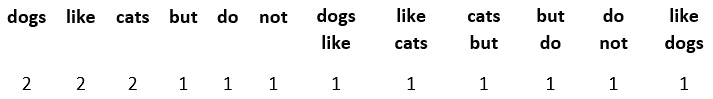

# 11

# 从文本变量中提取特征

文本可以是我们数据集中的一个变量。例如，在保险领域，描述事故情况的详细信息可能来自表单中的自由文本字段。如果一家公司收集客户评价，这些信息将以用户提供的短文本片段的形式收集。文本数据不显示我们在这本书中一直处理的数据集的 **表格** 模式。相反，文本中的信息在长度、内容和写作风格上可能有所不同。我们可以从文本变量中提取大量信息，用作机器学习模型中的预测特征。本章中我们将涵盖的技术属于 **自然语言处理** (**NLP**) 的领域。NLP 是语言学和计算机科学的一个子领域，它关注计算机与人类语言之间的交互，换句话说，就是如何编程计算机理解人类语言。NLP 包括理解文本的句法、语义和语篇的众多技术。因此，要公正地对待这个领域，就需要一本整本书。

在本章中，我们将讨论允许我们快速从短文本片段中提取特征以补充我们的预测模型的方法。具体来说，我们将讨论如何通过查看文本的一些统计参数来捕捉文本的复杂性，例如单词长度和计数、使用的单词和唯一单词的数量、句子的数量等等。我们将使用 `pandas` 和 `scikit-learn` 库，并且我们将对一个非常有用的 Python NLP 工具包进行浅入浅出的探讨，该工具包称为 **自然语言** **工具包** (**NLTK**)。

本章包括以下食谱：

+   计算字符、单词和词汇量

+   通过计算句子来估计文本复杂度

+   使用词袋和 n-gram 创建特征

+   实现词频-逆文档频率

+   清洗和词干提取文本变量

# 技术要求

在本章中，我们将使用 `pandas`、`matplotlib` 和 `scikit-learn` Python 库。我们还将使用 `NLTK`，这是一个全面的 Python NLP 和文本分析库。你可以在 [`www.nltk.org/install.html`](http://www.nltk.org/install.html) 找到安装 `NLTK` 的说明。

如果你使用的是 Python Anaconda 发行版，请按照 [`anaconda.org/anaconda/nltk`](https://anaconda.org/anaconda/nltk) 上的说明安装 `NLTK`。

在你安装了 `NLTK` 之后，打开一个 Python 控制台并执行以下命令：

```py
import nltk
nltk.download('punkt')
nltk.download('stopwords')
```

这些命令将为你下载运行本章中食谱所需的数据。

注意

如果你还没有下载这些或其他必要的 `NLTK` 功能数据源，`NLTK` 将会引发错误。仔细阅读错误信息，因为它会指导你下载运行你试图执行的命令所需的数据。

# 计算字符、单词和词汇量

文本的一个显著特征是其复杂性。长描述比短描述更有可能包含更多信息。包含不同、独特词汇的文本比反复重复相同词汇的文本更可能细节丰富。同样，当我们说话时，我们使用许多短词，如冠词和介词来构建句子结构，而主要概念通常来自我们使用的名词和形容词，这些往往是较长的词。所以，正如你所看到的，即使不阅读文本，我们也可以通过确定单词数量、唯一单词数量（单词的非重复出现）、词汇多样性和这些单词的长度来推断文本提供的信息量。在这个菜谱中，我们将学习如何使用`pandas`从文本变量中提取这些特征。

## 准备工作

我们将使用包含大约 18,000 篇关于 20 个不同主题的新闻的`scikit-learn`。更多关于这个数据集的详细信息可以在以下网站上找到：

+   scikit-learn 数据集网站：[`scikit-learn.org/stable/datasets/real_world.html#newsgroups-dataset`](https://scikit-learn.org/stable/datasets/real_world.html#newsgroups-dataset)

+   20 个新闻组数据集的主页：[`qwone.com/~jason/20Newsgroups/`](http://qwone.com/~jason/20Newsgroups/)

在深入菜谱之前，让我们讨论一下我们将从这些文本片段中提取的特征。我们提到，较长的描述、文章中的更多单词、更多唯一词汇和较长的单词往往与文章提供的信息量相关。因此，我们可以通过提取以下关于文本的信息来捕捉文本复杂性：

+   总字符数

+   总单词数

+   唯一单词的总数

+   词汇多样性（总单词数除以唯一单词数）

+   单词平均长度（字符数除以单词数）

在这个菜谱中，我们将使用`pandas`提取这些数值特征，`pandas`具有广泛的字符串处理功能，可以通过`str`向量化字符串函数访问。

## 如何实现...

让我们先加载`pandas`并准备好数据集：

1.  加载`pandas`和来自`scikit-learn`的数据集：

    ```py
    import pandas as pd
    from sklearn.datasets import fetch_20newsgroups
    ```

1.  让我们将 20 个新闻组数据集的火车集部分加载到一个`pandas` DataFrame 中：

    ```py
    data = fetch_20newsgroups(subset='train')
    df = pd.DataFrame(data.data, columns=['text'])
    ```

小贴士

您可以通过执行`print(df['text'][1])`来打印 DataFrame 中的文本示例。通过更改`[`和`]`之间的数字来显示不同的文本。注意，每个文本描述都是一个由字母、数字、标点和空格组成的单个字符串。您可以通过执行`type(df["text"][1])`来检查数据类型。

现在我们已经将文本变量放入一个`pandas` DataFrame 中，我们准备提取特征。

1.  让我们在新列中捕捉每个文本片段中的字符数：

    ```py
    df['num_char'] = df['text'].str.len()
    ```

小贴士

在计数字符之前，您可以通过在`len()`方法之前添加`strip()`方法来移除字符串末尾的空白字符，包括新行中的空白字符，如下所示：`df['num_char'] = df['text'].str.strip().str.len()`。

1.  让我们在新列中捕捉每个文本中的单词数量：

    ```py
    df['num_words'] = df['text'].str.split().str.len()
    ```

    要计算单词数量，我们使用`pandas`库的`split()`方法，该方法在空白处分割文本。例如，通过执行`df["text"].loc[1].split()`来分离 DataFrame 中第二个文本的单词。

1.  让我们在新列中捕捉每个文本中的*唯一*单词数量：

    ```py
    df['num_vocab']df[
        'text'].str.lower().str.split().apply(
            set).str.len()
    ```

注意

如果一个单词的首字母大写，Python 会将它解释为两个不同的单词。为了避免这种行为，我们可以在`split()`方法之前应用`lower()`方法。

1.  让我们创建一个特征来捕捉词汇多样性 – 即总单词数（*步骤 4*）与唯一单词数（*步骤 5*）的对比：

    ```py
    df['lexical_div'] = df['num_words'] / df['num_vocab']
    ```

1.  让我们通过将字符数（*步骤 3*）除以单词数（*步骤 4*）来计算平均单词长度：

    ```py
    df['ave_word_length'] = df[
        'num_char'] / df['num_words']
    ```

    如果我们执行`df.head()`，我们将看到包含文本和新建特征的前五行数据：


图 11.1 – 包含文本变量和总结文本某些特征的 DataFrame

这样，我们已经提取了五个不同的特征来捕捉文本复杂性，我们可以将这些特征用作机器学习算法的输入。

注意

在这个菜谱中，我们直接从原始数据中创建了新特征，而没有进行任何数据清理、移除标点符号，甚至没有进行词干提取。请注意，这些步骤是在大多数标准 NLP 过程之前执行的。要了解更多信息，请访问本章末尾的*清洗和词干提取文本变量*菜谱。

## 它是如何工作的...

在这个菜谱中，我们通过使用`pandas`的`str`来访问内置的`pandas`字符串功能，创建了五个新特征来捕捉文本复杂性。我们处理了`scikit-learn`附带的数据集`20 Newsgroup`的`train`子集的文本列。这个数据集中的每一行都是一个包含文本的字符串。

我们使用`pandas`的`str`，然后是`len()`，来计算每个字符串中的字符数 – 即字母、数字、符号和空格的总数。我们还结合了`str.len()`和`str.strip()`来移除字符串开头和结尾的空白字符以及在新行中的空白字符，在计数字符之前。

要计算单词数量，我们使用`pandas`的`str`，然后是`split()`，将字符串分割成单词列表。`split()`方法通过在单词之间的空白处断开字符串来创建单词列表。接下来，我们使用`str.len()`来计数这些单词，得到每个字符串的单词数。

注意

我们可以通过传递一个字符串或字符来改变`str.split()`的行为，我们希望用它来分割字符串。例如，`df['text'].str.split(';')`在`;`的每个出现处分割字符串。

要确定唯一单词的数量，我们使用了 pandas 的`str.split()`函数将字符串分割成单词列表。接下来，我们在 pandas 的`apply()`方法中应用了内置的 Python `set()`方法，以返回一个单词集合。记住，集合包含列表中元素的*唯一出现* – 那就是唯一单词。接下来，我们使用 pandas 的`str.len()`函数来计数这些单词，并返回`lower()`函数，在分割字符串和计数唯一单词之前将所有字符设置为小写。

要创建词汇多样性和平均词长特征，我们只是简单地执行了两个`pandas`序列的向量除法。就是这样；我们创建了五个关于文本复杂性的新特征。

## 更多内容...

我们可以通过使用可视化来检查数据集中 20 个不同新闻主题中提取的文本特征的分布。

在运行本食谱中“如何工作...”部分的全部步骤之后，要制作新创建特征的直方图，请遵循以下步骤：

1.  导入`matplotlib`：

    ```py
    import matplotlib.pyplot as plt
    ```

1.  将新闻主题的目标添加到 20 个新闻组 DataFrame 中：

    ```py
    df['target'] = data.target
    ```

1.  创建一个函数，用于显示每个新闻主题中你选择的特征的直方图：

    ```py
    def plot_features(df, text_var):
        nb_rows = 5
        nb_cols = 4
        fig, axs = plt.subplots(
            nb_rows, nb_cols,figsize=(12, 12))
        plt.subplots_adjust(wspace=None, hspace=0.4)
        n = 0
        for i in range(0, nb_rows):
            for j in range(0, nb_cols):
                axs[i, j].hist(
                    df[df.target==n][text_var], bins=30)
                axs[i, j].set_title(
                    text_var + ' | ' + str(n))
                     n += 1
        plt.show()
    ```

1.  运行单词数量特征的函数：

    ```py
    plot_features(df, 'num_words')
    ```

    之前的命令返回以下图表，其中你可以看到 20 个新闻主题中每个主题的单词数量分布，图表标题中从 0 到 19 编号：


图 11.2 – 每个文本中单词数量的分布直方图，按每个文本中讨论的主题进行细分

单词数量在不同新闻主题中显示出不同的分布。因此，这个特征可能在分类算法中预测文本主题时很有用。

## 参见

要了解更多关于 pandas 内置字符串处理功能的信息，请访问[`pandas.pydata.org/pandas-docs/stable/user_guide/text.html#method-summary`](https://pandas.pydata.org/pandas-docs/stable/user_guide/text.html#method-summary)。

# 通过计算句子来估计文本复杂性

我们可以在特征中捕捉到的一篇文本的一个方面是其复杂性。通常，包含多个句子并分布在几个段落中的较长的描述，比包含非常少句子的描述提供的信息更多。因此，捕捉句子的数量可能有助于了解文本提供的信息量。这个过程被称为`NLTK` Python 库，它提供了这个功能。

## 准备工作

在这个菜谱中，我们将使用`NLTK` Python 库。有关如何安装`NLTK`的指南，请参阅本章的*技术要求*部分。

## 如何做到...

让我们先导入所需的库和数据集：

1.  让我们加载`pandas`、`NLTK`中的句子分词器和`scikit-learn`中的数据集：

    ```py
    import pandas as pd
    from nltk.tokenize import sent_tokenize
    from sklearn.datasets import fetch_20newsgroups
    ```

1.  为了理解`NLTK`中的句子分词器的功能，让我们创建一个包含多个句子的字符串变量：

    ```py
    text = """
    The alarm rang at 7 in the morning as it usually did on Tuesdays. She rolled over, stretched her arm, and stumbled to the button till she finally managed to switch it off. Reluctantly, she got up and went for a shower. The water was cold as the day before the engineers did not manage to get the boiler working. Good thing it was still summer.
    Upstairs, her cat waited eagerly for his morning snack. Miaow! He voiced with excitement as he saw her climb the stairs.
    """
    ```

1.  现在，让我们使用`NLTK`库的句子分词器将步骤 2 中的字符串拆分为句子：

    ```py
    sent_tokenize(text)
    ```

小贴士

如果你在步骤 3 中遇到错误，请仔细阅读错误消息并下载`NLTK`所需的数据源，如错误消息中所述。更多详情，请参阅*技术* *要求*部分。

句子分词器返回以下输出中显示的句子列表：

```py
['\nThe alarm rang at 7 in the morning as it usually did on Tuesdays.',
 'She rolled over,\nstretched her arm, and stumbled to the button till she finally managed to switch it off.',
 'Reluctantly, she got up and went for a shower.',
 'The water was cold as the day before the engineers\ndid not manage to get the boiler working.',
 'Good thing it was still summer.',
 'Upstairs, her cat waited eagerly for his morning snack.',
 'Miaow!',
 'He voiced with excitement\nas he saw her climb the stairs.']
```

注意

后跟字母的转义字符`\n`表示新的一行。

1.  让我们计算`text`变量中的句子数：

    ```py
    len(sent_tokenize(text))
    ```

    之前的命令返回`8`，这是我们的`text`变量中的句子数。现在，让我们确定整个 DataFrame 中的句子数。

1.  让我们将 20 个新闻组数据集的`train`子集加载到`pandas` DataFrame 中：

    ```py
    data = fetch_20newsgroups(subset='train')
    df = pd.DataFrame(data.data, columns=['text'])
    ```

1.  为了加快以下步骤，我们只处理 DataFrame 的前`10`行：

    ```py
    df = df.loc[1:10]
    ```

1.  让我们也移除文本的第一部分，这部分包含关于电子邮件发送者、主题和其他我们不感兴趣的信息。大部分这些信息都在`Lines`这个词之后，跟着一个冒号`:`，所以让我们在`Lines:`处拆分字符串并捕获字符串的第二部分：

    ```py
    df['text'] = df['text'].str.split('Lines:').apply(
        lambda x: x[1])
    ```

1.  最后，让我们创建一个包含每`text`中句子数的变量：

    ```py
    df['num_sent'] = df['text'].apply(
        sent_tokenize).apply(len)
    ```

    使用`df`命令，你可以通过`text`变量和新特性（包含每段文本的句子数）显示整个 DataFrame：


图 11.3 – 包含文本变量和每段文本句子数的 DataFrame

现在，我们可以使用这个新特性作为机器学习算法的输入。

## 它是如何工作的...

在这个菜谱中，我们使用`NLTK`库的`sent_tokenizer`将包含文本的字符串拆分为句子。`sent_tokenizer`已经预先训练以识别大写字母和不同类型的标点符号，这些标点符号标志着句子的开始和结束。

首先，我们手动创建一个字符串并应用`sent_tokenizer`以熟悉其功能。分词器将文本分为一个包含八个句子的列表。我们将分词器与内置的 Python `len()`方法结合使用，以计算字符串中的句子数。

接下来，我们加载了一个包含文本的数据集，为了加快计算速度，我们只使用 pandas 的`loc[]`函数保留了 DataFrame 的前 10 行。接下来，我们移除了文本的前一部分，这部分包含了关于电子邮件发送者和主题的信息。为此，我们使用 pandas 的`str.split("Lines:")`函数在`Lines:`处分割字符串，该函数返回一个包含两个元素的列表：`Lines:`之前的字符串和之后的字符串。利用`apply()`中的 lambda 函数，我们保留了文本的第二部分，即`split()`返回的列表中的第二个字符串。

最后，我们使用 pandas 的`apply()`方法将`sent_tokenizer`应用于 DataFrame 中的每一行，将字符串分割成句子，然后使用内置的 Python `len()`方法应用于句子列表，以返回每个字符串的句子数。这样，我们创建了一个包含每个文本的句子数的新特征。

## 更多内容...

`NLTK`除了其他有用功能外，还具有单词分词功能，我们可以用`NLTK`代替`pandas`来计数并返回单词数。你可以在这里了解更多关于`NLTK`功能的信息：

+   *《使用 NLTK 3 进行 Python 3 文本处理食谱》*，作者：雅各布·珀金斯，Packt 出版社

+   [`www.nltk.org/`](http://www.nltk.org/)上的`NLTK`文档。

# 使用词袋模型和 n-gram 创建特征

**词袋模型**（**Bag-of-Words**，**BoW**）是对文本的一种简化表示，它捕捉了文本中出现的单词以及每个单词在文本中出现的次数。因此，对于文本字符串 *Dogs like cats, but cats do not like dogs*，得到的 BoW 如下：


图 11.4 – 从句子 Dogs like cats, but cats do not like dogs 导出的 BoW

在这里，每个单词成为一个变量，变量的值表示单词在字符串中出现的次数。正如你所见，BoW 捕捉了多重性，但没有保留单词顺序或语法。这就是为什么它是一种简单而有用的方式来提取特征并捕捉我们正在处理的文本的一些信息。

为了捕捉一些语法，BoW 可以与**n-gram**一起使用。n-gram 是在给定文本中连续的*n*个项的序列。继续使用句子 *Dogs like cats, but cats do not like dogs*，得到的 2-gram 如下： 

+   狗喜欢

+   喜欢猫

+   猫和

+   但是

+   不

+   像狗一样

我们可以创建一个与 BoW 一起的 n-gram 袋，其中额外的变量由 2-gram 给出，每个 2-gram 的值是它们在每个字符串中出现的次数；对于这个例子，值是 1。因此，我们的最终包含 2-gram 的 BoW 看起来如下：



图 11.5 – 包含 2-gram 的 BoW

在这个菜谱中，我们将学习如何使用`scikit-learn`创建带有或不带有 n-gram 的 BoW。

## 准备工作

在深入这个菜谱之前，让我们熟悉一下 BoW 的一些参数，我们可以调整这些参数以使 BoW 更全面。在创建多个文本片段的 BoW 时，对于我们在分析的文本片段中至少出现一次的每个唯一单词，都会创建一个新特征。如果单词只在一个文本片段中出现，它将为该特定文本显示 1 的值，而为其他所有文本显示 0。因此，BoWs 往往是稀疏矩阵，其中大部分值都是零。

如果我们处理大量的文本语料库，BoW 中的列数（即单词数）可以相当大，如果我们还包括 n-gram，则更大。为了限制列数和返回矩阵的稀疏性，我们可以保留在多个文本中出现的单词；或者换句话说，我们可以保留至少在某个百分比文本中出现的单词。

为了减少列数和 BoW 的稀疏性，我们还应该处理与 Python 识别单词时相同大小写的单词——例如，小写。我们还可以通过移除**停用词**来减少列数和稀疏性。停用词是非常常用的单词，使句子流畅，但本身并不携带任何有用的信息。停用词的例子包括代词，如我、你和他，以及介词和冠词。

在这个菜谱中，我们将学习如何将单词转换为小写，移除停用词，保留具有最低可接受频率的单词，并使用`scikit-learn`的单个转换器`CountVectorizer()`一起捕获 n-gram：

## 如何操作...

让我们先加载必要的库并准备好数据集：

1.  加载`pandas`、`CountVectorizer`以及从`scikit-learn`的 dataset：

    ```py
    import pandas as pd
    from sklearn.datasets import fetch_20newsgroups
    from sklearn.feature_extraction.text import (
        CountVectorizer
    )
    ```

1.  让我们将 20 个新闻组数据集的训练集部分加载到 pandas DataFrame 中：

    ```py
    data = fetch_20newsgroups(subset='train')
    df = pd.DataFrame(data.data, columns=['text'])
    ```

1.  为了使结果更容易解释，让我们从文本变量中移除标点符号和数字：

    ```py
    df['text'] = df['text'].str.replace(
        ‹[^\w\s]›,››, regex=True).str.replace(
        ‹\d+›,››, regex=True)
    ```

注意

要了解更多关于 Python 中的正则表达式，请点击此链接：[`docs.python.org/3/howto/regex.html`](https://docs.python.org/3/howto/regex.html)

1.  现在，让我们设置`CountVectorizer()`，使其在创建 BoW 之前将文本转换为小写，移除停用词，并保留至少在 5%的文本片段中出现的单词：

    ```py
    vectorizer = CountVectorizer(
        lowercase=True,
        stop_words='english',
        ngram_range=(1, 1),
        min_df=0.05)
    ```

注意

要将 n-gram 作为返回列的一部分引入，我们可以将`ngrams_range`的值更改为，例如`(1,2)`。这个元组提供了不同 n-gram 的 n 值范围的上下边界。在`(1,2)`的情况下，`CountVectorizer()`将返回单个单词和两个连续单词的数组。

1.  让我们调整`CountVectorizer()`，使其学习在 BoW 中应使用哪些单词：

    ```py
    vectorizer.fit(df['text'])
    ```

1.  现在，让我们创建 BoW：

    ```py
    X = vectorizer.transform(df['text'])
    ```

1.  最后，让我们将相应的特征名称与 BoW 一起捕获到 DataFrame 中：

    ```py
    bagofwords = pd.DataFrame(
        X.toarray(),
        columns = vectorizer.get_feature_names_out()
    )
    ```

    通过这样，我们创建了一个包含单词作为列和每个文本中它们出现的次数作为值的`pandas` DataFrame。你可以通过执行`bagofwords.head()`来检查结果：


图 11.6 – 由 20 个新闻组数据集生成的 BoW DataFrame

我们可以将这个 BoW 作为机器学习模型的输入。

## 它是如何工作的...

scikit-learn 的`CountVectorizer()`将一组文本文档转换为标记计数的矩阵。这些标记可以是单个单词或两个或更多连续单词的数组——即 n-gram。在这个菜谱中，我们从 DataFrame 中的文本变量创建了一个 BoW。

我们从`scikit-learn`加载了 20 个新闻组文本数据集，并使用 pandas 的`replace()`函数从文本行中移除了标点符号和数字，该函数可以通过 pandas 的`str`模块访问，用空字符串`''`替换数字`'\d+'`或符号`'[^\w\s]'`。然后，我们使用`CountVectorizer()`创建 BoW。我们将`lowercase`参数设置为`True`，在提取 BoW 之前将单词转换为小写。我们将`stop_words`参数设置为`english`以忽略停用词——也就是说，避免 BoW 中的停用词。我们将`ngram_range`设置为`(1,1)`元组，以仅返回作为列的单个单词。最后，我们将`min_df`设置为`0.05`，以返回至少出现在 5%的文本中的单词，换句话说，在 DataFrame 的 5%的行中。

在设置好转换器之后，我们使用了`fit()`方法让转换器找到满足先前标准的单词。最后，使用`transform()`方法，转换器返回一个包含 BoW 及其特征名称的对象，我们将它捕获在一个`pandas` DataFrame 中。

## 参见

更多关于`CountVectorizer()`的详细信息，请访问`scikit-learn`库的文档[`scikit-learn.org/stable/modules/generated/sklearn.feature_extraction.text.CountVectorizer.html`](https://scikit-learn.org/stable/modules/generated/sklearn.feature_extraction.text.CountVectorizer.html)。

# 实现词频-逆文档频率

**词频-逆文档频率**（**TF-IDF**）是一个数值统计量，它捕捉了单词在考虑整个文档集合的情况下在文档中的相关性。这意味着什么？一些单词在文本文档中以及跨文档中都会出现很多次，例如，英语单词 *the*、*a* 和 *is* 等。这些单词通常对文档的实际内容传达很少信息，并且不会使文本脱颖而出。TF-IDF 通过考虑单词在文档中出现的次数与在文档中出现的频率之间的关系来提供衡量单词重要性的方法。因此，常见的单词如 *the*、*a* 或 *is* 将具有较低的权重，而更具体于某个主题的单词，如 *leopard*，将具有更高的权重。

TF-IDF 是两个统计量的乘积：**词频**（**tf**）和**逆文档频率**（**idf**），表示如下：**tf-idf = tf × idf**。tf 在其最简单形式中，是单个文本中单词的计数。因此，对于术语 *t*，tf 的计算为 *tf(t) = count(t)*，并且基于文本进行确定。idf 是衡量单词在 *所有* 文档中普遍程度的一个指标，通常在对数尺度上计算。一个常见的实现如下：


在这里，*n* 是文档的总数，*df(t)* 是包含术语 *t* 的文档数。*df(t)* 的值越大，该术语的权重越低。如果一个单词在文本中出现的次数很多（高 *tf*）或在文本中出现的次数很少（高 *idf*），则该单词的重要性会很高。

注意

TF-IDF 可以与 n-gram 结合使用。同样，为了权衡 n-gram，我们将某个文档中 n-gram 的频率与跨文档中 n-gram 的频率相乘。

在这个菜谱中，我们将学习如何使用 `scikit-learn` 通过 n-gram 或不使用 n-gram 提取 TF-IDF 特征。

## 准备工作

`scikit-learn` 使用一种稍微不同的方式来计算 IDF 统计量：

![<mml:math xmlns:mml="http://www.w3.org/1998/Math/MathML" xmlns:m="http://schemas.openxmlformats.org/officeDocument/2006/math" display="block"><mml:mi>i</mml:mi><mml:mi>d</mml:mi><mml:mi>f</mml:mi><mml:mfenced separators="|"><mml:mrow><mml:mi>t</mml:mi></mml:mrow></mml:mfenced><mml:mo>=</mml:mo><mml:mrow><mml:mrow><mml:mi mathvariant="normal">log</mml:mi></mml:mrow><mml:mo>⁡</mml:mo><mml:mrow><mml:mfenced separators="|"><mml:mrow><mml:mfrac><mml:mrow><mml:mn>1</mml:mn><mml:mo>+</mml:mo><mml:mi>n</mml:mi></mml:mrow><mml:mrow><mml:mn>1</mml:mn><mml:mo>+</mml:mo><mml:mi>d</mml:mi><mml:mi>f</mml:mi><mml:mo>(</mml:mo><mml:mi>t</mml:mi><mml:mo>)</mml:mo></mml:mrow></mml:mfrac></mml:mrow></mml:mfenced></mml:mrow></mml:mrow><mml:mo>+</mml:mo><mml:mn>1</mml:mn></mml:math>](img/49.png)

这种公式确保了出现在所有文本中的单词获得最低权重 1。此外，在计算每个单词的 TF-IDF 之后，`scikit-learn`将特征向量（包含所有单词的向量）归一化到其欧几里得范数。有关确切公式的更多详细信息，请访问[`scikit-learn.org/stable/modules/feature_extraction.html#tfidf-term-weighting`](https://scikit-learn.org/stable/modules/feature_extraction.html#tfidf-term-weighting)的`scikit-learn`文档。

TF-IDF 在创建术语矩阵时具有与 BoW 相同的特征——即高特征空间和稀疏性。为了减少特征数量和稀疏性，我们可以移除停用词，将字符转换为小写，并保留在最小百分比观察中出现过的单词。如果您不熟悉这些术语，请访问本章中的*使用词袋和 n-gram 创建特征*菜谱进行复习。

在这个菜谱中，我们将学习如何将单词转换为小写，移除停用词，保留具有最低可接受频率的单词，捕获 n-gram，然后使用 scikit-learn 的单个转换器`TfidfVectorizer()`返回单词的 TF-IDF 统计量。

## 如何做到这一点...

让我们先加载必要的库并准备数据集：

1.  加载`pandas`、`TfidfVectorizer()`以及从`scikit-learn`中的数据集：

    ```py
    import pandas as pd
    from sklearn.datasets import fetch_20newsgroups
    from sklearn.feature_extraction.text import (
        TfidfVectorizer
    )
    ```

1.  让我们将 20 个新闻组数据集的火车集部分加载到一个 pandas DataFrame 中：

    ```py
    data = fetch_20newsgroups(subset='train')
    df = pd.DataFrame(data.data, columns=['text'])
    ```

1.  为了使结果更容易解释，让我们从文本变量中移除标点符号和数字：

    ```py
    df['text'] = df['text'].str.replace(
        ‹[^\w\s]›,››, regex=True).str.replace(
        '\d+','', regex=True)
    ```

1.  现在，让我们设置`scikit-learn`中的`TfidfVectorizer()`，以便在创建 TF-IDF 度量之前，将所有文本转换为小写，移除停用词，并保留至少在 5%的文本片段中出现的单词：

    ```py
    vectorizer = TfidfVectorizer(
        lowercase=True,
        stop_words='english',
        ngram_range=(1, 1),
        min_df=0.05)
    ```

注意

为了将 n-gram 作为返回列的一部分引入，我们可以将`ngrams_range`的值更改为，例如`(1,2)`。这个元组提供了不同 n-gram 的 n 值范围的上下界。在`(1,2)`的情况下，`TfidfVectorizer()`将返回单个单词和两个连续单词的数组作为列。

1.  让我们拟合`TfidfVectorizer()`，以便它学习哪些单词应该作为 TF-IDF 矩阵的列引入，并确定单词的`idf`：

    ```py
    vectorizer.fit(df['text'])
    ```

1.  现在，让我们创建 TF-IDF 矩阵：

    ```py
    X = vectorizer.transform(df['text'])
    ```

1.  最后，让我们将 TF-IDF 矩阵捕获到一个具有相应特征名称的 DataFrame 中：

    ```py
    tfidf = pd.DataFrame(
        X.toarray(),
        columns = vectorizer.get_feature_names_out()
    )
    ```

    通过这样，我们创建了一个包含单词作为列和 TF-IDF 作为值的`pandas` DataFrame。您可以通过执行`tfidf.head()`来检查结果：


图 11.7 – 由 TF-IDF 产生的特征 DataFrame

现在，我们可以使用这个词频 DataFrame 来训练机器学习模型。

## 它是如何工作的...

在这个菜谱中，我们通过使用 scikit-learn 的`TfidfVectorizer()`提取了至少存在于 5%的文档中的单词的 TF-IDF 值。

我们从`scikit-learn`加载了 20 个新闻组文本数据集，然后使用 pandas 的`replace()`从文本行中删除了标点符号和数字，这可以通过 pandas 的`str`访问，用空字符串`''`替换数字`'\d+'`或符号`'[^\w\s]'`。然后，我们使用`TfidfVectorizer()`为单词创建 TF-IDF 统计信息。我们将`lowercase`参数设置为`True`，在计算之前将单词转换为小写。我们将`stop_words`参数设置为`english`，以避免返回矩阵中的停用词。我们将`ngram_range`设置为`(1,1)`元组，以返回单个单词作为特征。最后，我们将`min_df`参数设置为`0.05`，以返回至少出现在 5%的文本或换句话说，在 5%的行中的单词。

在设置完转换器后，我们应用了`fit()`方法，让转换器找到最终项矩阵中需要保留的单词。使用`transform()`方法，转换器返回了一个包含单词及其 TF-IDF 值的对象，然后我们将其捕获到一个具有适当特征名称的 pandas DataFrame 中。现在，我们可以将这些特征用于机器学习算法。

## 另请参阅

有关`TfidfVectorizer()`的更多详细信息，请访问 scikit-learn 的文档：[`scikit-learn.org/stable/modules/generated/sklearn.feature_extraction.text.TfidfVectorizer.html`](https://scikit-learn.org/stable/modules/generated/sklearn.feature_extraction.text.TfidfVectorizer.html)

# 清洗和词干化文本变量

我们数据集中的某些变量来自自由文本字段，这些字段由用户手动填写。人们有不同的写作风格，我们使用各种标点符号、大写模式、动词变位来传达内容以及与之相关的情感。我们可以通过创建总结文本复杂度、关键词和文档中单词相关性的统计参数来从文本中提取（一些）信息，而无需费心阅读它。我们已在本章前面的菜谱中讨论了这些方法。然而，为了推导这些统计信息和聚合特征，我们首先应该清理文本变量。

文本清理或预处理包括标点符号删除、停用词消除、字符大小写设置和词干提取。标点符号删除包括删除不是字母、数字或空格的字符；在某些情况下，我们也会删除数字。停用词消除是指删除在我们语言中用于允许句子结构和流畅性的常见单词，但它们各自传达的信息很少或没有。例如，英语中的停用词包括诸如*the*和*a*之类的冠词，以及诸如*I*、*you*和*they*之类的代词，以及各种变形中常用的动词，如*to be*和*to have*，以及诸如*would*和*do*之类的助动词。

为了让计算机正确识别单词，还需要将所有单词设置为相同的格式，因为由于第一个单词中的大写*T*，计算机会将*Toy*和*toy*识别为不同的单词。

最后，为了专注于文本的*信息*，我们不希望计算机在单词不同变形的情况下将单词视为不同。因此，我们将使用词干提取作为预处理流程的一部分。词干提取是指将每个单词还原为其词根或基础，使得单词*playing*、*plays*和*played*变为*play*，本质上传达的是相同或非常相似的意义。

在本食谱中，我们将学习如何使用 pandas 和`NLTK`删除标点符号、停用词，将单词转换为小写，并执行词干提取。

## 准备工作

我们将使用`NLTK`的词干提取包来执行词干提取，该包包含不同的算法，可以从英语和其他语言中提取单词。每种方法在寻找单词的*根*时使用的算法不同，因此它们可能会输出略微不同的结果。我建议您了解更多相关信息，尝试不同的方法，并选择适合您正在工作的项目的那个。

更多关于 NLTK 词干提取器的信息可以在[`www.nltk.org/api/nltk.stem.html`](https://www.nltk.org/api/nltk.stem.html)找到。

## 如何操作...

让我们先加载必要的库并准备数据集：

1.  从`NLTK`加载`pandas`、`stopwords`和`SnowballStemmer`，以及从`scikit-learn`加载数据集：

    ```py
    import pandas as pd
    from nltk.corpus import stopwords
    from nltk.stem.snowball import SnowballStemmer
    from sklearn.datasets import fetch_20newsgroups
    ```

1.  让我们先将 20 个新闻组数据集的训练集部分加载到 pandas DataFrame 中：

    ```py
    data = fetch_20newsgroups(subset='train')
    df = pd.DataFrame(data.data, columns=['text'])
    ```

    现在，让我们开始文本清理。

注意

在执行本食谱中的每个命令后，通过执行例如`print(df['text'][10])`之类的命令来打印一些示例文本，以便您可以可视化对文本引入的变化。现在就做吧，然后在每个步骤之后重复该命令。

1.  让我们先删除标点符号：

    ```py
    df["text"] = df['text'].str.replace('[^\w\s]','')
    ```

小贴士

您还可以使用 Python 内置的`string`模块来删除标点符号。首先，通过执行`import string`来导入模块，然后执行`df['text'] = df['text'].str.replace('[{}]'.format(string.punctuation), '')`。

1.  我们也可以移除数字字符，只留下字母，如下所示：

    ```py
    df['text'] = df['text'].str.replace(
        '\d+', '', regex=True)
    ```

1.  现在，让我们将所有单词转换为小写：

    ```py
    df['text'] = df['text'].str.lower()
    ```

    现在，让我们开始移除停用词的过程。

注意

如果你没有下载`NLTK`库的`stopwords`，*步骤 6*可能会失败。请访问本章的*技术要求*部分以获取更多详细信息。

1.  让我们创建一个函数，该函数可以将字符串分割成单词列表，移除停用词，并将剩余的单词重新连接成字符串：

    ```py
    def remove_stopwords(text):
        stop = set(stopwords.words('english'))
        text = [word
        for word in text.split() if word not in stop]
        text = ‹ ‹.join(x for x in text)
        return text
    ```

注意

为了能够使用`scikit-learn`库的`CountVectorizer()`或`TfidfVectorizer()`处理数据，我们需要文本以字符串格式存在。因此，在移除停用词后，我们需要将单词作为单个字符串返回。我们已经将 NLTK 库的停用词列表转换为一个集合，因为集合比列表扫描更快，这提高了计算时间。

1.  现在，让我们使用第*6 步*中的函数从`text`变量中移除停用词：

    ```py
    df['text'] = df['text'].apply(remove_stopwords)
    ```

    如果你想知道哪些单词是停用词，请执行`stopwords.words('english')`。

    最后，让我们使用`NLTK`的`SnowballStemer`来提取我们数据中的词干。

1.  让我们为英语语言创建一个`SnowballStemer`实例：

    ```py
    stemmer = SnowballStemmer("english")
    ```

小贴士

尝试在单个单词上使用词干提取器以查看其工作方式；例如，运行`stemmer.stem('running')`。你应该看到`run`作为该命令的结果。尝试不同的单词！

1.  让我们创建一个函数，该函数可以将字符串分割成单词列表，对每个单词应用`stemmer`，并将词干列表重新连接成字符串：

    ```py
    def stemm_words(text):
        text = [
            stemmer.stem(word) for word in text.split()
        ]
        text = ‹ ‹.join(x for x in text)
        return text
    ```

1.  让我们使用第*9 步*中的函数来对数据中的单词进行词干提取：

    ```py
    df['text'] = df['text'].apply(stemm_words)
    ```

    现在，我们的文本已经准备好根据字符和单词计数创建特征，以及创建 BoWs 或 TF-IDF 矩阵，正如本章前面的食谱所描述的。

    如果我们执行`print(df['text'][10])`，我们将在清理后看到一个文本示例：

    ```py
    irwincmptrclonestarorg irwin arnstein subject recommend duc summari what worth distribut usa expir sat may gmt organ computrac inc richardson tx keyword ducati gts much line line ducati gts model k clock run well paint bronzebrownorang fade leak bit oil pop st hard accel shop fix tran oil leak sold bike owner want think like k opinion pleas email thank would nice stabl mate beemer ill get jap bike call axi motor tuba irwin honk therefor computracrichardsontx irwincmptrclonestarorg dod r
    ```

注意

如果你正在计算句子数，你需要在移除标点符号之前这样做，因为标点和大小写是定义每个句子边界的必要条件。

## 它是如何工作的...

在这个食谱中，我们从文本变量中移除了标点符号、数字和停用词，将单词转换为小写，并最终将单词还原到词根。我们使用 pandas 的`replace()`函数从文本变量中移除标点符号和数字，该函数可以通过 pandas 的`str`访问，用空字符串`''`替换数字`'\d+'`或符号`'[^\w\s]'`。或者，我们可以使用内置`string`包中的`punctuation`模块。

小贴士

在导入`string`后，在 Python 控制台中运行`string.punctuation`以查看将被替换为空字符串的符号。

接下来，通过 pandas 的字符串处理功能`str`，我们使用`lower()`方法将所有单词转换为小写。为了从文本中移除停用词，我们使用了`NLTK`中的`stopwords`模块，该模块包含了一组频繁出现的单词列表——即停用词。我们创建了一个函数，该函数接受一个字符串并使用 pandas 的`str.split()`将其拆分为单词列表，然后使用列表推导，我们遍历列表中的单词并保留非停用词。最后，使用`join()`方法，我们将保留的单词重新连接成字符串。我们使用 Python 内置的`set()`方法在`NLTK`停用词列表上提高计算效率，因为遍历集合比遍历列表要快。最后，通过 pandas 的`apply()`，我们将该函数应用于文本数据的每一行。

小贴士

在从`NLTK`导入`stopwords`后，在 Python 控制台中运行`stopwords.words('english')`以可视化将要被移除的停用词列表。

最后，我们使用`NLTK`中的`SnowballStemmer`对单词进行了词干提取。`SnowballStemmer`一次处理一个单词。因此，我们创建了一个函数，该函数接受一个字符串并使用 pandas 的`str.split()`将其拆分为单词列表。在列表推导中，我们逐个单词应用`SnowballStemmer`，然后使用`join()`方法将提取的词干单词列表重新连接成字符串。通过 pandas 的`apply()`，我们将该函数应用于 DataFrame 的每一行以提取词干。

在本食谱中我们执行的清洗步骤产生了包含原始文本的字符串，没有标点符号或数字，全部小写，没有常用词汇，并且使用词根而不是其变形。返回的数据可以用来推导特征，如*计数字符、单词和词汇*食谱中所述，或者创建 BoWs 和 TI-IDF 矩阵，如*使用词袋和 n-gram 创建特征*和*实现词频-逆文档频率*食谱中所述。

如本食谱所示，清洗文本可能会根据文本的特征导致数据丢失，如果我们希望在创建 BoW 或 TF-IDF 矩阵后解释模型，理解词干的重要性可能并不那么直接。
