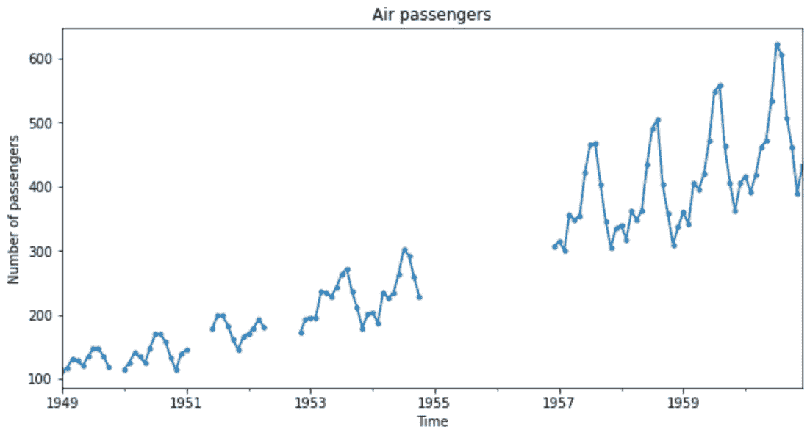

# 第二章：填充缺失数据

缺失数据——即某些观测值的值缺失——是大多数数据源中不可避免的问题。一些机器学习模型的实现可以开箱即用处理缺失数据。为了训练其他模型，我们必须移除带有缺失数据的观测值或将它们转换为允许的值。

用统计估计替换缺失数据的行为称为**填充**。任何填充技术的目标都是生成一个完整的数据集。有多种填充方法。我们根据数据是否随机缺失、缺失值的比例以及我们打算使用的机器学习模型来选择使用哪种方法。在本章中，我们将讨论几种填充方法。

本章将涵盖以下食谱：

+   移除带有缺失数据的观测值

+   执行均值或中位数填充

+   填充分类变量

+   用任意数字替换缺失值

+   为填充寻找极端值

+   标记填充值

+   实施前向和后向填充

+   执行插值

+   通过链式方程进行多元填充

+   使用最近邻估计缺失数据

# 技术要求

在本章中，我们将使用 Python 库 Matplotlib、pandas、NumPy、scikit-learn 和 Feature-engine。如果你需要安装 Python，免费的 Anaconda Python 发行版（[<st c="1397">https://www.anaconda.com/</st>](https://www.anaconda.com/)）包括大多数数值计算库。

`<st c="1470">feature-engine</st>`可以使用`pip`安装，如下所示：

```py
 pip install feature-engine
```

如果你使用 Anaconda，你可以使用`conda`安装`<st c="1588">feature-engine</st>`：

```py
 conda install -c conda-forge feature_engine
```

注意

本章中的食谱是在出版时使用的 Python 库的最新版本中创建的。<st c="1664">您可以在随附的 GitHub 仓库中的</st> `<st c="1819">requirements.txt</st>` <st c="1835">文件中检查版本，</st> <st c="1880">网址为</st> [<st c="1883">https://github.com/PacktPublishing/Python-Feature-engineering-Cookbook-Third-Edition/blob/main/requirements.txt</st>](https://github.com/PacktPublishing/Python-Feature-engineering-Cookbook-Third-Edition/blob/main/requirements.txt)<st c="1994">。</st>

我们将使用**<st c="2012">信用审批</st>** <st c="2027">数据集，该数据集来自*<st c="2045">UCI 机器学习仓库</st>* <st c="2076">（</st>[<st c="2078">https://archive.ics.uci.edu/</st>](https://archive.ics.uci.edu/)<st c="2106">），许可协议为 CC BY 4.0 创意共享：</st> [<st c="2169">https://creativecommons.org/licenses/by/4.0/legalcode</st>](https://creativecommons.org/licenses/by/4.0/legalcode)<st c="2222">。您可以在以下链接找到数据集：</st> [<st c="2262">http://archive.ics.uci.edu/dataset/27/credit+approval</st>](http://archive.ics.uci.edu/dataset/27/credit+approval)<st c="2315">。</st>

我已下载并修改了如下笔记本中的数据：<st c="2316">[此笔记本](https://github.com/PacktPublishing/Python-Feature-engineering-Cookbook-Third-Edition/blob/main/ch01-missing-data-imputation/credit-approval-dataset.ipynb)</st>。

我们还将使用位于 Facebook 的 Prophet GitHub 仓库中的**<st c="2554">航空乘客</st>** <st c="2567">数据集（</st>[<st c="2625">https://github.com/facebook/prophet/blob/main/examples/example_air_passengers.csv</st>](https://github.com/facebook/prophet/blob/main/examples/example_air_passengers.csv)<st c="2707">），许可协议为 MIT：</st> [<st c="2743">https://github.com/facebook/prophet/blob/main/LICENSE</st>](https://github.com/facebook/prophet/blob/main/LICENSE)。

我已修改了如下笔记本中的数据：<st c="2796">[此笔记本](https://github.com/PacktPublishing/Python-Feature-engineering-Cookbook-Third-Edition/blob/main/ch01-missing-data-imputation/air-passengers-dataset.ipynb)</st>。

<st c="2996">你可以在附带的 GitHub 存储库中找到修改后的数据集的副本：</st> [<st c="3081">https://github.com/PacktPublishing/Python-Feature-engineering-Cookbook-Third-Edition/blob/main/ch01-missing-data-imputation</st><st c="3203">/</st>](https://github.com/PacktPublishing/Python-Feature-engineering-Cookbook-Third-Edition/blob/main/ch01-missing-data-imputation/)

# <st c="3206">删除具有缺失数据的观察值</st>

**<st c="3245">完整案例分析</st>** <st c="3268">(</st>**<st c="3270">CCA</st>**<st c="3273">**)，也称为案例列表删除，包括丢弃具有缺失数据的观察值。</st> <st c="3328">CCA 可以应用于分类</st> <st c="3375">和数值变量。</st> <st c="3439">使用 CCA，我们可以在插补后保留变量的分布，前提是数据缺失是随机的，并且仅在少量观察值中。</st> <st c="3606">然而，如果数据在许多变量中缺失，CCA 可能会导致大量数据集的删除。</st>

<st c="3719">注</st>

<st c="3724">仅在少量观察值缺失且你有充分的理由相信它们对你的模型不重要时才使用 CCA。</st>

## <st c="3866">如何操作...</st>

<st c="3882">让我们首先进行一些导入并加载数据集：</st> <st c="3930">：</st>

1.  <st c="3942">让我们导入</st> `<st c="3956">pandas</st>`<st c="3962">，`<st c="3964">matplotlib</st>`<st c="3974">，以及来自 scikit-learn 的训练/测试分割函数</st> <st c="4010">：</st>

    ```py
     import matplotlib.pyplot as plt
    import pandas as pd
    from sklearn.model_selection import train_test_split
    ```

1.  <st c="4133">让我们加载并显示在*《技术要求》*部分中描述的数据集：</st>

    ```py
     data = pd.read_csv("credit_approval_uci.csv")
    data.head()
    ```

    <st c="4275">在以下图像中，我们看到了数据的前 5 行</st> <st c="4324">：</st>


<st c="4633">图 1.1 – 数据集的前 5 行</st>

1.  <st c="4673">让我们像通常准备训练机器学习模型数据那样进行操作：</st> <st c="4702">：</st> <st c="4729">通过将数据分为训练集和测试集：</st>

    ```py
     X_train, X_test, y_train, y_test = train_test_split(
        data.drop("target", axis=1),
        data["target"],
        test_size=0.30,
        random_state=42,
    )
    ```

1.  <st c="4959">现在让我们绘制一个条形图，显示训练集和测试集中每个变量的缺失数据比例：</st> <st c="5055">：</st>

    ```py
     fig, axes = plt.subplots(
        2, 1, figsize=(15, 10), squeeze=False)
    X_train.isnull().mean().plot(
        kind='bar', color='grey', ax=axes[0, 0], title="train")
    X_test.isnull().mean().plot(
        kind='bar', color='black', ax=axes[1, 0], title="test")
    axes[0, 0].set_ylabel('Fraction of NAN')
    axes[1, 0].set_ylabel('Fraction of NAN')
    plt.show()
    ```

    <st c="5395">前面的代码块返回以下条形图</st> <st c="5427">，显示了训练集（顶部）和测试集（底部）中每个变量的缺失数据比例：</st>


<st c="5717">图 1.2 – 每个变量的缺失数据比例</st>

1.  <st c="5769">现在</st><st c="5773">，我们将删除任何变量中存在缺失值的观测值：</st>

    ```py
     train_cca = X_train.dropna()
    test_cca = X_test.dropna()
    ```

<st c="5902">注意</st>

<st c="5907">pandas 的</st> `<st c="5916">dropna()</st>`<st c="5924">默认删除任何缺失值的观测值。</st> <st c="5979">我们可以像这样删除变量子集中具有缺失数据的观测值：</st> `<st c="6060">data.dropna(subset=["A3", "A4"])</st>`<st c="6092">。</st>

1.  <st c="6093">让我们打印并比较原始和完整</st> <st c="6156">案例数据集的大小：</st>

    ```py
     print(f"Total observations: {len(X_train)}")
    print(f"Observations without NAN: {len(train_cca)}")
    ```

    <st c="6268">我们从训练集中删除了超过 200 个具有缺失数据的观测值，如下面的输出所示：</st>

    ```py
    <st c="6381">Total observations: 483</st>
    <st c="6405">Observations without NAN: 264</st>
    ```

1.  <st c="6435">从训练集和测试集中删除观测值后，我们需要对齐</st> <st c="6518">目标变量：</st>

    ```py
     y_train_cca = y_train.loc[train_cca.index]
    y_test_cca = y_test.loc[test_cca.index]
    ```

    <st c="6618">现在，数据集和目标变量包含没有</st> <st c="6683">缺失数据的行。</st>

1.  <st c="6696">要使用</st> `<st c="6746">feature-engine</st>`<st c="6760">删除具有缺失数据的观测值，让我们导入所需的变压器：</st>

    ```py
     from feature_engine.imputation import DropMissingData
    ```

1.  <st c="6854">让我们设置填充器以自动</st><st c="6858">找到具有</st> <st c="6888">缺失数据的变量：</st>

    ```py
     cca = DropMissingData(variables=None, missing_only=True)
    ```

1.  <st c="6993">让我们拟合变压器，以便它找到具有</st> <st c="7056">缺失数据的变量：</st>

    ```py
     cca.fit(X_train)
    ```

1.  <st c="7086">让我们检查变压器发现的具有 NAN 的变量：</st>

    ```py
     cca.variables_
    ```

    <st c="7166">之前的命令返回了具有</st> <st c="7228">缺失数据的变量名称：</st>

    ```py
    <st c="7241">['A1', 'A2', 'A3', 'A4', 'A5', 'A6', 'A7', 'A8', 'A9', 'A10', 'A14']</st>
    ```

1.  <st c="7310">让我们删除训练集和</st> <st c="7371">测试集中具有缺失数据的行：</st>

    ```py
     train_cca = cca.transform(X_train)
    test_cca = cca.transform(X_test)
    ```

    <st c="7449">使用</st> `<st c="7454">train_cca.isnull().sum()</st>` <st c="7478">来证实完整</st> <st c="7493">案例数据集中没有缺失数据。</st>

1.  `<st c="7551">DropMissingData</st>` <st c="7567">可以在从训练集中删除缺失数据后自动调整目标：</st>

    ```py
     train_c, y_train_c = cca.transform_x_y( X_train, y_train)
    test_c, y_test_c = cca.transform_x_y(X_test, y_test)
    ```

<st c="7765">之前的代码从训练集和测试集中删除了包含</st> `<st c="7802">nan</st>` <st c="7805">的行，然后重新对齐了</st> <st c="7862">目标变量。</st>

<st c="7879">注意</st>

<st c="7884">要从变量子集中删除具有缺失数据的观测值，请使用</st> `<st c="7956">DropMissingData(variables=['A3', 'A4'])</st>`<st c="7995">。要删除至少 5%的变量中包含</st> `<st c="8017">nan</st>` <st c="8020">的行，请使用</st> `<st c="8058">DropMissingData(threshold=0.95)</st>`<st c="8090">。</st>

## <st c="8091">工作原理</st><st c="8104">...</st>

<st c="8107">在这个菜谱中，</st> <st c="8123">我们绘制了每个变量中缺失数据的比例，然后删除了所有具有</st> <st c="8222">缺失值</st>的观测值。</st>

<st c="8237">我们使用了</st> `<st c="8246">pandas</st>` `<st c="8252">isnull()</st>` <st c="8261">和</st> `<st c="8266">mean()</st>` <st c="8272">方法来确定每个变量中缺失观测值的比例。</st> <st c="8351">`<st c="8355">isnull()</st>` <st c="8363">方法为每个变量创建了一个布尔向量，其中包含</st> `<st c="8414">True</st>` <st c="8418">和</st> `<st c="8423">False</st>` <st c="8428">值，表示值是否缺失。</st> <st c="8476">`<st c="8480">mean()</st>` <st c="8486">方法取这些值的平均值，并返回缺失数据的比例。</st>

<st c="8571">我们使用了</st> `<st c="8580">pandas</st>` `<st c="8586">plot.bar()</st>` <st c="8597">来创建每个变量的缺失数据分数的条形图。</st> <st c="8665">在</st> *<st c="8668">图 1</st>**<st c="8676">.2</st>*<st c="8678">中，我们看到了训练集和测试集中每个变量的</st> `<st c="8703">nan</st>` <st c="8706">分数。</st>

<st c="8750">为了删除任何变量中存在缺失值的观测值，我们使用了 pandas 的</st> `<st c="8827">dropna()</st>`<st c="8835">，从而获得一个完整的</st> <st c="8866">案例数据集。</st>

<st c="8879">最后，我们使用 Feature-engine 的</st> `<st c="8936">DropMissingData()</st>`<st c="8953">删除缺失数据。此填充器在调用</st> `<st c="9074">fit()</st>` <st c="9079">方法时自动识别并存储了训练集中缺失数据的变量。</st> <st c="9088">使用</st> `<st c="9097">transform()</st>` <st c="9108">方法，填充器删除了那些变量中的</st> `<st c="9154">nan</st>` <st c="9158">观测值。</st> <st c="9179">使用</st> `<st c="9184">transform_x_y()</st>`<st c="9199">，填充器从数据集中删除了包含</st> `<st c="9231">nan</st>` <st c="9234">的行，然后重新对齐了</st> <st c="9277">目标变量。</st>

## <st c="9293">另请参阅</st>

<st c="9302">如果您想在管道中使用</st> `<st c="9322">DropMissingData()</st>` <st c="9339">与其他 Feature-engine 或 scikit-learn 转换器一起，请查看 Feature-engine 的</st> `<st c="9450">Pipeline</st>`<st c="9458">:</st> [<st c="9461">https://Feature-engine.trainindata.com/en/latest/user_guide/pipeline/Pipeline.html</st>](https://Feature-engine.trainindata.com/en/latest/user_guide/pipeline/Pipeline.html)<st c="9543">。此管道在删除行后可以将目标与训练集和测试集对齐。</st>

# <st c="9632">执行均值或中位数填充</st><st c="9663"></st>

<st c="9670">均值或中位数插补</st> <st c="9696">包括用变量的均值或中位数值替换缺失数据。</st> <st c="9716">为了避免数据泄露，我们使用训练集来确定均值或中位数，然后使用这些值来插补训练集和测试集，以及所有</st> <st c="9920">未来的数据。</st>

<st c="9932">Scikit-learn 和 Feature-engine 从训练集中学习均值或中位数，并将这些参数存储在</st> <st c="10058">箱外供将来使用。</st>

<st c="10066">在这个菜谱中，我们将使用</st> `<st c="10132">pandas</st>`<st c="10138">，`<st c="10140">scikit</st>`<st c="10146">-</st>`<st c="10148">learn</st>`<st c="10153">，和</st> `<st c="10155">feature-engine</st>`<st c="10173">来执行均值和中位数插补。</st>

<st c="10174">注意</st>

<st c="10179">如果变量呈正态分布，则使用均值插补；否则使用中位数插补。</st> <st c="10271">如果缺失数据比例很高，均值和中位数插补可能会扭曲变量的分布。</st>

## <st c="10382">如何做...</st>

<st c="10399">让我们开始</st> <st c="10412">这个菜谱：</st>

1.  <st c="10425">首先，我们将导入</st> `<st c="10446">pandas</st>` <st c="10452">以及从</st> `<st c="10496">scikit-learn</st>` <st c="10509">和</st> `<st c="10514">feature-engine</st>`<st c="10528">中所需的函数和类：</st>

    ```py
     import pandas as pd
    from sklearn.model_selection import train_test_split
    from sklearn.impute import SimpleImputer
    from sklearn.compose import ColumnTransformer
    from feature_engine.imputation import MeanMedianImputer
    ```

1.  <st c="10746">让我们加载我们在</st> *<st c="10794">技术</st>* *<st c="10804">要求</st>* <st c="10816">部分中准备的数据集：</st>

    ```py
     data = pd.read_csv("credit_approval_uci.csv")
    ```

1.  <st c="10871">让我们将数据分割成训练集和测试集及其</st> <st c="10929">相应的目标：</st>

    ```py
     X_train, X_test, y_train, y_test = train_test_split(
        data.drop("target", axis=1),
        data["target"],
        test_size=0.3,
        random_state=0,
    )
    ```

1.  <st c="11080">让我们通过排除</st> <st c="11103">对象类型的变量来创建一个包含数值变量的列表：</st>

    ```py
     numeric_vars = X_train.select_dtypes(
        exclude="O").columns.to_list()
    ```

    <st c="11235">如果您执行</st> `<st c="11251">numeric_vars</st>`<st c="11263">，您将看到数值变量的名称：</st> `<st c="11316">['A2', 'A3', 'A8', 'A11', '</st>``<st c="11343">A14', 'A15']</st>`<st c="11356">。</st>

1.  <st c="11357">让我们将变量的中位数存储在</st> <st c="11404">一个字典中：</st>

    ```py
     median_values = X_train[
        numeric_vars].median().to_dict()
    ```

<st c="11475">提示</st>

<st c="11479">注意我们如何使用训练集来计算中位数。</st> <st c="11534">我们将使用这些值来替换训练集和测试集中的缺失数据。</st> <st c="11611">要计算均值，请使用 pandas</st> `<st c="11645">mean()</st>` <st c="11651">而不是</st> `<st c="11663">median()</st>`<st c="11671">。</st>

<st c="11672">如果您执行</st> `<st c="11688">median_values</st>`<st c="11701">，您将看到一个包含每个变量的中位数的字典：</st> `<st c="11765">{'A2': 28.835, 'A3': 2.75, 'A8': 1.0, 'A11': 0.0, 'A14': 160.0, '</st>``<st c="11830">A15': 6.0}.</st>`

1.  <st c="11842">让我们用中值替换缺失数据</st> <st c="11875">：</st>

    ```py
     X_train_t = X_train.fillna(value=median_values)
    X_test_t = X_test.fillna(value=median_values)
    ```

    <st c="11980">如果您在填充后执行</st> `<st c="11996">X_train_t[numeric_vars].isnull().sum()</st>` <st c="12034">，数值变量中的缺失值数量应该是</st> <st c="12120">0</st> <st c="12123">。</st>

<st c="12125">注意</st>

`<st c="12130">pandas</st>` `<st c="12137">fillna()</st>` <st c="12146">默认返回一个包含填充值的新的数据集。</st> <st c="12201">要替换原始 DataFrame 中的缺失数据，将</st> `<st c="12260">inplace</st>` <st c="12267">参数设置为</st> `<st c="12281">True</st>`<st c="12285">：</st> `<st c="12288">X_train.fillna(value=median_values, inplace</st><st c="12331">=True)</st>`<st c="12338">。</st>

<st c="12339">现在，让我们使用</st> `<st c="12396">scikit-learn</st>`<st c="12408">用中值填充缺失值</st>。</st>

1.  <st c="12409">让我们设置填充器</st> <st c="12434">以用中值替换缺失数据</st> <st c="12463">：</st>

    ```py
     imputer = SimpleImputer(strategy="median")
    ```

<st c="12518">注意</st>

<st c="12523">要执行均值填充，将</st> `<st c="12556">SimpleImputer()</st>` <st c="12571">设置为以下格式：</st> `<st c="12584">imputer =</st>` `<st c="12593">SimpleImputer(strategy = "</st>``<st c="12620">mean")</st>`<st c="12627">。</st>

1.  <st c="12628">我们通过使用</st> `<st c="12692">ColumnTransformer()</st>`<st c="12711">来限制填充仅限于数值变量：</st>

    ```py
     ct = ColumnTransformer(
        [("imputer", imputer, numeric_vars)],
        remainder="passthrough",
        force_int_remainder_cols=False,
    ).set_output(transform="pandas")
    ```

<st c="12865">注意</st>

<st c="12870">Scikit-learn 可以根据我们设置的转换输出返回</st> `<st c="12895">numpy</st>` <st c="12900">数组，</st> `<st c="12909">pandas</st>` <st c="12915">数据框，或</st> `<st c="12931">极坐标</st>` <st c="12936">框。</st> <st c="12995">默认情况下，它返回</st> `<st c="13018">numpy</st>` <st c="13023">数组。</st>

1.  <st c="13031">让我们将填充器</st> <st c="13053">拟合到训练集，以便它学习中值</st> <st c="13093">值：</st>

    ```py
     ct.fit(X_train)
    ```

1.  <st c="13124">让我们查看学到的</st> <st c="13153">中值：</st>

    ```py
     ct.named_transformers_.imputer.statistics_
    ```

    <st c="13211">前一个命令返回每个变量的中值</st> <st c="13259">：</st>

    ```py
    array([ 28.835,   2.75,   1.,   0., 160.,   6.])
    ```

1.  <st c="13313">让我们用中值替换缺失值</st> <st c="13348">：</st>

    ```py
     X_train_t = ct.transform(X_train)
    X_test_t = ct.transform(X_test)
    ```

1.  <st c="13425">让我们显示生成的</st> <st c="13454">训练集：</st>

    ```py
     print(X_train_t.head())
    ```

    <st c="13491">以下图像显示了生成的 DataFrame：</st>


<st c="14090">图 1.3 – 填充后的训练集。</st> <st c="14138">被填充的变量由填充器前缀标记；未转换的变量显示前缀余数</st>

最后，让我们使用 `<st c="14295">feature-engine</st>`<st c="14309">.</st> 进行中位数插补。

1.  让我们设置插补器，以用中位数替换数值变量中的缺失数据：

    ```py
     imputer = MeanMedianImputer(
        imputation_method="median",
        variables=numeric_vars,
    )
    ```

注意

要执行均值插补，将 `<st c="14523">imputation_method</st>` <st c="14540">改为</st> `<st c="14544">"mean"</st>`<st c="14550">。默认情况下，`<st c="14563">MeanMedianImputer()</st>` <st c="14582">将插补 DataFrame 中的所有数值变量，忽略分类变量。</st> <st c="14669">使用</st> `<st c="14677">variables</st>` <st c="14686">参数将插补限制为数值变量的子集。</st>

1.  将插补器拟合，以便它学习中位数值：

    ```py
     imputer.fit(X_train)
    ```

1.  检查学习到的中位数：

    ```py
     imputer.imputer_dict_
    ```

    前一个命令返回字典中的中位数值：

    ```py
    {<st c="14951">'A2': 28.835, 'A3': 2.75, 'A8': 1.0, 'A11': 0.0, 'A14': 160.0, 'A15': 6.0}</st>
    ```

1.  最后，让我们用中位数替换缺失值：

    ```py
     X_train = imputer.transform(X_train)
    X_test = imputer.transform(X_test)
    ```

`<st c="15156">Feature-engine</st>` 的 `<st c="15174">MeanMedianImputer()</st>` <st c="15193">返回一个 `<st c="15204">DataFrame</st>`<st c="15213">。您可以使用 `<st c="15292">X_train[numeric</st><st c="15307">_vars].isnull().mean()</st>`<st c="15330">` 检查插补变量是否不包含缺失值。</st>

## 如何工作...

在这个配方中，我们使用 `<st c="15429">pandas</st>`<st c="15435">`、`<st c="15437">scikit-learn</st>`<st c="15449">` 和 `<st c="15451">feature-engine</st>`<st c="15469">` 将缺失数据替换为变量的中位数值。

我们使用 scikit-learn 的 `<st c="15540">train_test_split()</st>` <st c="15558">函数将数据集分为训练集和测试集。</st> <st c="15569">该函数接受预测变量、目标、测试集中要保留的观测值比例以及用于可重复性的 `<st c="15687">random_state</st>` <st c="15699">值` 作为参数。</st> <st c="15741">它返回一个包含原始观测值 70% 的训练集和一个包含原始观测值 30% 的测试集。</st> <st c="15857">70:30 的分割是随机进行的。</st>

要使用`pandas`填充缺失数据，在第 5 步中，我们创建了一个字典，其中数值变量名称作为键，它们的平均值作为值。这些平均值是从训练集中学习的，以避免数据泄露。为了替换缺失数据，我们应用了`pandas`的`fillna()`到训练和测试集，传递包含每个变量的中值的字典作为参数。

要使用`scikit-learn`用中位数替换缺失值，我们使用了`SimpleImputer()`，其`strategy`设置为`"median"`。为了限制填充仅限于数值变量，我们使用了`ColumnTransformer()`。将`remainder`参数设置为`passthrough`，我们使`ColumnTransformer()`返回训练集中看到的*所有变量*在转换输出中；填充的变量随后是那些未转换的变量。

注意

`ColumnTransformer()`会更改输出中变量的名称。转换后的变量显示前缀`imputer`，而未更改的变量显示前缀`remainder`。

在第 8 步中，我们将列转换器的输出设置为`pandas`以获得一个 DataFrame 作为结果。默认情况下，`ColumnTransformer()`返回`numpy`数组。

注意

从版本 1.4.0 开始，`scikit-learn`转换器可以返回`numpy`数组、`pandas` DataFrame 或`polar` frames 作为`transform()`方法的输出结果。

使用`fit()`，`SimpleImputer()`学习训练集中每个数值变量的中位数并将它们存储在其`statistics_`属性中。使用`transform()`，它用中位数替换了缺失值。

<st c="17371">要使用 Feature-engine 将缺失值替换为中位数，我们使用了</st> `<st c="17448">MeanMedianImputer()</st>` <st c="17467">，并将</st> `<st c="17477">imputation_method</st>` <st c="17494">设置为</st> `<st c="17502">median</st>`<st c="17508">。要限制插补变量的子集，我们将变量名列表传递给</st> `<st c="17609">variables</st>` <st c="17618">参数。</st> <st c="17630">使用</st> `<st c="17635">fit()</st>`<st c="17640">，转换器学习并存储了每个</st> <st c="17698">变量</st> <st c="17707">的中位数值，存储在其</st> `<st c="17723">imputer_dict_</st>` <st c="17731">属性中的字典中。</st> <st c="17756">使用</st> `<st c="17761">transform()</st>`<st c="17772">，它替换了缺失值，返回一个</st> <st c="17819">pandas DataFrame。</st>

# <st c="17836">插补分类变量</st>

<st c="17867">我们通常用最频繁的类别或一个特定的字符串来插补分类变量。</st> <st c="17909">为了避免数据泄露，我们从训练集中找到频繁的类别。</st> <st c="17970">然后，我们使用这些值来插补训练、测试和未来的数据集。</st> `<st c="18119">scikit-learn</st>` <st c="18131">和</st> `<st c="18136">feature-engine</st>` <st c="18150">会自动找到并存储用于插补的频繁类别。</st>

<st c="18225">在这个配方中，我们将用最频繁的类别</st> <st c="18329">或一个</st> <st c="18340">任意字符串</st>替换分类变量中的缺失数据。

## <st c="18357">如何做到这一点...</st>

<st c="18373">首先，让我们进行一些导入并准备</st> <st c="18421">数据：</st>

1.  <st c="18430">让我们导入</st> `<st c="18444">pandas</st>` <st c="18450">以及从</st> `<st c="18495">scikit-learn</st>` <st c="18507">和</st> `<st c="18512">feature-engine</st>`<st c="18526">中所需的函数和类：</st>

    ```py
     import pandas as pd
    from sklearn.model_selection import train_test_split
    from sklearn.impute import SimpleImputer
    from sklearn.compose import ColumnTransformer
    from feature_engine.imputation import CategoricalImputer
    ```

1.  <st c="18745">让我们加载我们在</st> *<st c="18793">技术</st>* *<st c="18803">要求</st>* <st c="18815">部分中准备的数据集：</st>

    ```py
     data = pd.read_csv("credit_approval_uci.csv")
    ```

1.  <st c="18871">让我们将数据集分割成训练集和测试集及其</st> <st c="18928">相应的目标：</st>

    ```py
     X_train, X_test, y_train, y_test = train_test_split(
        data.drop("target", axis=1),
        data["target"],
        test_size=0.3,
        random_state=0,
    )
    ```

1.  <st c="19078">让我们将分类变量</st> <st c="19122">存储在一个列表中：</st>

    ```py
     categorical_vars = X_train.select_dtypes(
        include="O").columns.to_list()
    ```

1.  <st c="19202">让我们将变量的最频繁类别存储在一个</st> <st c="19258">字典中：</st>

    ```py
     frequent_values = X_train[
        categorical_vars].mode().iloc[0].to_dict()
    ```

1.  <st c="19341">让我们用频繁的类别</st> <st c="19370">替换缺失值：</st>

    ```py
     X_train_t = X_train.fillna(value=frequent_values)
    X_test_t = X_test.fillna(value=frequent_values)
    ```

<st c="19498">注意</st>

`<st c="19503">fillna()</st>` <st c="19512">默认返回一个包含插补值的新的 DataFrame。</st> <st c="19573">我们可以通过执行</st> `<st c="19640">X_train.fillna(value=frequent_valu</st><st c="19674">es, inplace=True)</st>`<st c="19692">来替换原始 DataFrame 中的缺失数据。</st>

1.  <st c="19693">要用特定字符串替换缺失数据，请创建一个包含分类变量名称作为键和任意字符串作为</st> <st c="19855">值的插补字典：</st>

    ```py
     imputation_dict = {var:
         "no_data" for var in categorical_vars}
    ```

    <st c="19929">现在，我们可以使用这个字典和第</st> *<st c="19978">6</st> <st c="19984">步</st> <st c="19996">中的代码</st>来替换缺失数据。</st>

<st c="20009">注意</st>

<st c="20014">使用</st> `<st c="20020">pandas</st>` `<st c="20026">value_counts()</st>` <st c="20041">我们可以看到插补添加的字符串。</st> <st c="20089">例如，尝试执行</st> <st c="20108">以下命令：</st> `<st c="20117">X_train["A1"].value_counts()</st>`<st c="20145">。</st>

<st c="20146">现在，让我们使用</st> `<st c="20218">scikit-learn</st>`<st c="20230">来用最频繁的类别插补缺失值：</st>

1.  <st c="20231">让我们设置插补器以找到每个变量的最频繁类别：</st>

    ```py
     imputer = SimpleImputer(strategy='most_frequent')
    ```

<st c="20355">注意</st>

`<st c="20360">SimpleImputer()</st>` <st c="20376">将为数值和分类变量学习众数。</st> <st c="20444">但在实践中，众数插补仅用于分类</st> <st c="20501">变量。</st>

1.  <st c="20516">让我们将插补限制在</st> <st c="20547">分类变量</st> <st c="20554">：</st>

    ```py
     ct = ColumnTransformer(
        [("imputer",imputer, categorical_vars)],
        remainder="passthrough"
        ).set_output(transform="pandas")
    ```

<st c="20698">注意</st>

<st c="20703">要用字符串而不是最频繁的类别来插补缺失数据，请按以下方式设置</st> `<st c="20784">SimpleImputer()</st>` <st c="20799">：</st> `<st c="20812">imputer =</st>` `<st c="20822">SimpleImputer(strategy="constant",</st> <st c="20857">fill_value="missing")</st>`<st c="20878">.</st>

1.  <st c="20879">将插补器拟合到训练集，以便它学习最频繁的值：</st>

    ```py
     ct.fit(X_train)
    ```

1.  <st c="20972">让我们看看插补器学到的最频繁值：</st> <st c="21030">：</st>

    ```py
     ct.named_transformers_.imputer.statistics_
    ```

    <st c="21085">上一条命令返回每个变量的最频繁值</st> <st c="21140">：</st>

    ```py
    <st c="21153">array(['b', 'u', 'g', 'c', 'v', 't', 'f', 'f', 'g'], dtype=object)</st>
    ```

1.  <st c="21220">最后，让我们用频繁的类别替换缺失值：</st>

    ```py
     X_train_t = ct.transform(X_train)
    X_test_t = ct.transform(X_test)
    ```

    <st c="21354">确保通过</st> <st c="21404">执行</st> `<st c="21414">X_train_t.head()</st>`<st c="21430">.</st>来检查生成的 DataFrames。

<st c="21431">注意</st>

<st c="21436">The</st> `<st c="21441">ColumnTransformer()</st>` <st c="21460">更改了变量的名称。</st> <st c="21497">被插补的变量显示前缀</st> `<st c="21535">imputer</st>` <st c="21542">，而未转换的变量显示前缀</st> `<st c="21579">remainder</st>`<st c="21595">。</st>

<st c="21596">最后，让我们使用</st> `<st c="21641">feature-engine</st>`<st c="21655">来插补缺失值</st><st c="21632">s</st> <st c="21635">：</st>

1.  <st c="21656">让我们设置插补器</st> <st c="21681">以用最频繁的值替换分类变量中的缺失数据：</st>

    ```py
     imputer = CategoricalImputer(
        imputation_method="frequent",
        variables=categorical_vars,
    )
    ```

<st c="21856">注意</st>

将 `<st c="21871">variables</st>` <st c="21880">参数设置为 `<st c="21898">None</st>`<st c="21902">，`<st c="21904">CategoricalImputer()</st>` <st c="21924">将自动填充训练集中找到的所有分类变量。</st> <st c="22001">使用此参数将填充限制为分类变量的子集，如**步骤 13**<st c="22097">所示。</st>

1.  将填充器拟合到训练集，以便它学习最频繁的类别：

    ```py
     imputer.fit(X_train)
    ```

<st c="22207">注意</st>

要使用特定字符串填充分类变量，将 `<st c="22273">imputation_method</st>` 设置为 `<st c="22294">missing</st>`，并将 `<st c="22306">fill_value</st>` 设置为所需的字符串。</st>

1.  让我们检查一下**学习到的类别**：

    ```py
     imputer.imputer_dict_
    ```

    我们可以在以下输出中看到包含最频繁值的字典：

    ```py
    <st c="22482">{'A1': 'b',</st>
     <st c="22494">'A4': 'u',</st>
     <st c="22505">'A5': 'g',</st>
     <st c="22516">'A6': 'c',</st>
     <st c="22527">'A7': 'v',</st>
     <st c="22538">'A9': 't',</st>
     <st c="22549">'A10': 'f',</st>
     <st c="22561">'A12': 'f',</st>
     <st c="22573">'A13': 'g'}</st>
    ```

1.  最后，让我们用频繁类别替换缺失值：

    ```py
     X_train_t = imputer.transform(X_train)
    X_test_t = imputer.transform(X_test)
    ```

    如果你想要使用 `<st c="22819">CategoricalImputer()</st>`<st c="22839">》用字符串或最频繁的值填充数值变量，将 `<st c="22849">ignore_format</st>` 参数设置为 `<st c="22876">True</st>`<st c="22880">。</st>

`<st c="22881">CategoricalImputer()</st>` <st c="22902">返回</st> <st c="22910">一个 pandas DataFrame 作为</st> <st c="22933">结果。</st>

## <st c="22942">工作原理...</st>

在这个菜谱中，我们使用最频繁的类别或任意字符串替换了分类变量中的缺失值。<st c="23085">我们使用了 `<st c="23093">pandas</st>`、`<st c="23099">scikit-learn</st>`、`<st c="23101">feature-engine</st>`。</st>

在**步骤 5**中，我们使用变量名作为键，频繁类别作为值创建了一个字典。<st c="23170">为了捕获频繁类别，我们使用了 pandas 的 `<st c="23292">mode()</st>`，并且为了返回一个字典，我们使用了 pandas 的 `<st c="23343">to_dict()</st>`。为了替换缺失数据，我们使用了 `<st c="23391">pandas</st>` 的 `<st c="23397">fillna()</st>`，传递包含变量及其频繁类别的字典作为参数。</st> <st c="23406">在一个变量中可能存在多个众数，这就是为什么我们确保通过使用 `<st c="23612">.iloc[0]</st>`<st c="23620">.</st> 只捕获其中之一的原因。</st>

为了使用`scikit-learn`替换缺失值，我们使用了`SimpleImputer()`，其`strategy`设置为`most_frequent`。为了将插补限制为分类变量，我们使用了`ColumnTransformer()`。将`remainder`设置为`passthrough`后，`ColumnTransformer()`将返回训练集中所有变量的结果，作为`transform()`方法的输出。

**注意**

`ColumnTransformer()`更改输出中变量的名称。转换后的变量显示前缀`imputer`，而未更改的变量显示前缀`remainder`。

使用`fit()`函数，`SimpleImputer()`学习变量最频繁的类别并将它们存储在其`statistics_`属性中。使用`transform()`函数，它用学习到的参数替换了缺失数据。

`SimpleImputer()`和`ColumnTransformer()`默认返回 NumPy 数组。我们可以通过`set_output()`参数更改此行为。

为了使用`feature-engine`替换缺失值，我们使用了`CategoricalImputer()`，其`imputation_method`设置为`frequent`。使用`fit()`，转换器学习并存储了最频繁的类别在其`imputer_dict_`属性中的字典中。使用`transform()`，它用学习到的参数替换了缺失值。

<st c="24806">与</st> `<st c="24814">SimpleImputer()</st>`<st c="24829">不同，</st> `<st c="24831">CategoricalImputer()</st>` <st c="24851">将仅插补分类变量，除非明确通过设置</st> `<st c="24946">ignore_format</st>` <st c="24959">参数为</st> `<st c="24973">True</st>`<st c="24977">来告知不要这样做。</st> <st c="24997">此外，使用</st> `<st c="24997">feature-engine</st>` <st c="25011">转换器，我们可以通过转换器本身限制转换到变量子集。</st> <st c="25118">对于</st> `<st c="25122">scikit-learn</st>` <st c="25134">转换器，我们需要额外的</st> `<st c="25172">ColumnTransformer()</st>` <st c="25191">类来将转换应用于变量子集。</st>

# <st c="25256">用任意数替换缺失值</st>

<st c="25306">我们可以用任意值替换缺失数据。</st> <st c="25334">常用的值有</st> `<st c="25385">999</st>`<st c="25388">,</st> `<st c="25390">9999</st>`<st c="25394">, 或</st> `<st c="25399">-1</st>` <st c="25401">对于正态分布。</st> <st c="25430">这种方法用于数值变量。</st> <st c="25475">对于分类变量，等效的方法是用任意字符串替换缺失数据，如*<st c="25598">插补分类</st>* *<st c="25619">变量</st>* <st c="25628">配方</st>中所述。</st>

<st c="25636">当用任意数替换缺失值时，我们需要小心不要选择接近均值、中位数或分布的任何其他常见值的数值。</st>

<st c="25812">注意</st>

<st c="25817">当数据不是随机缺失时，我们会使用任意数值插补，使用非线性模型，或者当缺失数据的百分比较高时。</st> <st c="25962">这种插补技术会扭曲原始</st> <st c="26010">变量分布。</st>

<st c="26032">在这个配方中，我们将使用</st> `<st c="26106">pandas</st><st c="26111">s</st>`<st c="26113">,</st> `<st c="26115">scikit-learn</st>`<st c="26127">, 和</st> `<st c="26129">feature-engine</st>`<st c="26147">来用任意数插补缺失数据。</st>

## <st c="26148">如何操作...</st>

<st c="26164">让我们首先导入必要的工具和加载数据：</st>

1.  <st c="26231">导入</st> `<st c="26239">pandas</st>` <st c="26245">和所需的函数</st> <st c="26273">和类：</st>

    ```py
     import pandas as pd
    from sklearn.model_selection import train_test_split
    from sklearn.impute import SimpleImputer
    from feature_engine.imputation import ArbitraryNumberImputer
    ```

1.  <st c="26460">让我们加载在*<st c="26501">技术</st>* *<st c="26511">要求</st>* <st c="26523">部分中描述的数据集：</st>

    ```py
     data = pd.read_csv("credit_approval_uci.csv")
    ```

1.  <st c="26578">让我们将</st> <st c="26593">数据分为训练集和</st> <st c="26618">测试集：</st>

    ```py
     X_train, X_test, y_train, y_test = train_test_split(
        data.drop("target", axis=1),
        data["target"],
        test_size=0.3,
        random_state=0,
    )
    ```

    <st c="26761">我们将选择大于分布最大值的任意值。</st>

1.  <st c="26845">让我们找到四个</st> <st c="26883">数值变量的最大值：</st>

    ```py
     X_train[['A2','A3', 'A8', 'A11']].max()
    ```

    <st c="26943">之前的</st> <st c="26956">命令返回以下输出：</st>

    ```py
    <st c="26994">A2     76.750</st>
    <st c="27004">A3     26.335</st>
    <st c="27014">A8     28.500</st>
    <st c="27024">A11    67.000</st>
    <st c="27061">99</st> for the imputation because it is bigger than the maximum values of the numerical variables in *<st c="27158">step 4</st>*.
    ```

1.  <st c="27165">让我们复制原始的</st> <st c="27191">DataFrame：</st>

    ```py
     X_train_t = X_train.copy()
    X_test_t = X_test.copy()
    ```

1.  <st c="27263">现在，我们将缺失值替换为</st> `<st c="27299">99</st>`<st c="27306">：</st>

    ```py
     X_train_t[["A2", "A3", "A8", "A11"]] = X_train_t[[
        "A2", "A3", "A8", "A11"]].fillna(99)
    X_test_t[["A2", "A3", "A8", "A11"]] = X_test_t[[
        "A2", "A3", "A8", "A11"]].fillna(99)
    ```

<st c="27482">注意</st>

<st c="27487">要使用</st> `<st c="27546">pandas</st>` `<st c="27552">fillna()</st>`<st c="27561">函数填充不同变量不同的值，可以使用如下字典：</st> `<st c="27591">imputation_dict = {"A2": -1, "A3": -</st><st c="27627">1, "A8": 999, "</st>``<st c="27643">A11": 9999}</st>`<st c="27655">.</st>

<st c="27656">现在，我们将使用</st> `<st c="27682">scikit-learn</st>`<st c="27714">来填充缺失值，使用任意数：</st>

1.  <st c="27734">让我们设置</st> `<st c="27748">填充器</st>` <st c="27755">以替换缺失值为</st> `<st c="27782">99</st>`<st c="27787">：</st>

    ```py
     imputer = SimpleImputer(strategy='constant', fill_value=99)
    ```

<st c="27851">注意</st>

<st c="27856">如果你的数据集包含分类变量，</st> `<st c="27905">SimpleImputer()</st>` <st c="27920">将在任何缺失值的情况下，也将</st> `<st c="27930">99</st>` <st c="27932">添加到这些变量中。</st>

1.  <st c="27986">让我们将</st> `<st c="27997">填充器</st>` <st c="28004">拟合到包含要填充变量的训练集切片中</st> <st c="28058">：</st>

    ```py
     vars = ["A2", "A3", "A8", "A11"]
    imputer.fit(X_train[vars])
    ```

1.  <st c="28128">在所需变量中将缺失值替换为</st> `<st c="28161">99</st>` <st c="28163">：</st>

    ```py
     X_train_t[vars] = imputer.transform(X_train[vars])
    X_test_t[vars] = imputer.transform(X_test[vars])
    ```

    <st c="28289">继续执行</st> `<st c="28349">X_test_t[["A2", "A3", "</st>``<st c="28372">A8", "A11"]].isnull().sum()</st>`<st c="28400">来检查缺失值的数量。</st>

    <st c="28401">为了完成，让我们使用</st><st c="28429">填充缺失值</st> <st c="28442">功能</st> `<st c="28448">f</st><st c="28449">eature-engine</st>`<st c="28462">.</st>

1.  <st c="28463">让我们设置</st> `<st c="28481">填充器</st>` <st c="28488">以替换</st> `<st c="28499">缺失值</st>` <st c="28514">为</st> `<st c="28520">99</st>` <st c="28522">在 4</st> <st c="28528">个特定变量中：</st>

    ```py
     imputer = ArbitraryNumberImputer(
        arbitrary_number=99,
        variables=["A2", "A3", "A8", "A11"],
    )
    ```

`<st c="28641">注意</st>`

`<st c="28646">ArbitraryNumberImputer()</st>` <st c="28671">将自动选择训练集中的所有数值变量进行填充，如果我们设置</st> `<st c="28768">variables</st>` <st c="28777">参数</st> <st c="28788">为</st> `<st c="28791">None</st>`<st c="28795">。</st>

1.  <st c="28796">最后，让我们将缺失值替换为</st> `<st c="28839">99</st>`<st c="28846">：</st>

    ```py
     X_train = imputer.fit_transform(X_train)
    X_test = imputer.transform(X_test)
    ```

<st c="28924">注意</st>

<st c="28929">为了使用不同的数字来填充不同的变量，请按照以下方式设置</st> `<st c="28991">ArbitraryNumberImputer()</st>` <st c="29015">：</st> `<st c="29028">ArbitraryNumberImputer(imputater_dict = {"A2": -1, "A3": -1, "A8": 999, "</st>``<st c="29101">A11": 9999})</st>`<st c="29114">。</st>

<st c="29115">我们现在已经使用三个不同的开源库将缺失数据替换为任意数字。</st>

## <st c="29218">它是如何工作的...</st>

<st c="29234">在这个配方中，我们使用</st> `<st c="29332">pandas</st>`<st c="29338">，</st> `<st c="29340">sc</st><st c="29342">ikit-learn</st>`<st c="29353">，和</st> `<st c="29355">featur</st><st c="29365">e-engine</st>`<st c="29374">替换了数值变量中的缺失值。</st>

<st c="29375">为了确定使用哪个任意值，我们使用 pandas 的</st> `<st c="29493">max()</st>`<st c="29498">检查了四个数值变量的最大值。我们选择了</st> `<st c="29509">99</st>` <st c="29511">，因为它大于所选变量的最大值。</st> <st c="29586">在</st> *<st c="29589">步骤 5</st>*<st c="29595">中，我们使用了</st> `<st c="29605">pandas</st>` `<st c="29611">fillna()</st>` <st c="29620">来替换缺失数据。</st>

<st c="29649">要使用</st> `<st c="29682">scikit-learn</st>`<st c="29694">替换缺失值，我们使用了</st> `<st c="29708">SimpleImputer()</st>`<st c="29723">，将</st> `<st c="29734">策略</st>` <st c="29742">设置为</st> `<st c="29750">constant</st>`<st c="29758">，并在</st> `<st c="29784">fill_value</st>` <st c="29794">参数中指定了</st> `<st c="29774">99</st>` <st c="29776">。</st> <st c="29805">接下来，我们将填充器拟合到训练集中需要填充数值变量的一个子集。</st> <st c="29901">最后，我们使用</st> `<st c="29937">transform()</st>`<st c="29954">替换了缺失值。</st>

<st c="29955">要使用</st> `<st c="29987">feature-engine</st>` <st c="30001">替换缺失值，我们使用了</st> `<st c="30010">ArbitraryValueImputer()</st>`<st c="30033">，指定了值</st> `<st c="30056">99</st>` <st c="30058">以及要填充的变量作为参数。</st> <st c="30102">接下来，我们将</st> `<st c="30123">fit_transform()</st>` <st c="30138">方法应用于替换训练集中的缺失数据，并使用</st> `<st c="30195">transform()</st>` <st c="30206">方法替换测试集中的缺失数据。</st>

# <st c="30255">为填充确定极端值</st>

<st c="30293">用变量分布末尾的值（极端值）替换缺失值，就像用任意值替换它们一样，但不是手动设置任意值，而是从变量分布的末尾自动选择这些值。</st>

<st c="30572">我们可以用比变量中大多数值大或小的值来替换缺失数据。</st> <st c="30675">为了选择一个比平均值大的值，我们可以使用平均值加上标准差的因子。</st> <st c="30771">或者，我们可以将其设置为 75 分位数 + 四分位数间距 × 1.5。</st> **<st c="30834">四分位数间距</st>** <st c="30837">代表</st> **<st c="30849">四分位数范围</st>** <st c="30869">，是第 75 分位数和第 25 分位数之间的差。</st> <st c="30928">为了用比剩余值小的值替换缺失数据，我们可以使用平均值减去标准差的因子，或者第 25 分位数 – 四分位数间距 ×</st> <st c="31099">1.5。</st>

<st c="31103">注意</st>

<st c="31108">尾部插补可能会扭曲原始变量的分布，因此可能不适合</st> <st c="31218">线性模型。</st>

<st c="31232">在这个菜谱中，我们将使用</st> `<st c="31314">pandas</st>` <st c="31320">和</st> `<st c="31325">feature-engine</st>`<st c="31339">来实现尾部或极端值插补。</st>

## <st c="31340">如何做...</st>

<st c="31356">为了开始这个</st> <st c="31370">菜谱，让我们导入必要的工具</st> <st c="31411">并加载</st> <st c="31421">数据：</st>

1.  <st c="31430">让我们导入</st> `<st c="31444">pandas</st>` <st c="31450">和所需的功能</st> <st c="31477">和类：</st>

    ```py
     import pandas as pd
    from sklearn.model_selection import train_test_split
    from feature_engine.imputation import EndTailImputer
    ```

1.  <st c="31613">让我们加载我们在</st> *<st c="31657">技术</st>* *<st c="31667">要求</st>* <st c="31679">部分</st>中描述的数据集：</st>

    ```py
     data = pd.read_csv("credit_approval_uci.csv")
    ```

1.  <st c="31734">让我们将数值变量捕获到一个列表中，排除</st> <st c="31794">目标：</st>

    ```py
     numeric_vars = [
        var for var in data.select_dtypes(
            exclude="O").columns.to_list()
        if var !="target"
    ]
    ```

1.  <st c="31908">让我们将数据分为训练集和测试集，只保留</st> <st c="31973">数值变量：</st>

    ```py
     X_train, X_test, y_train, y_test = train_test_split(
        data[numeric_vars],
        data["target"],
        test_size=0.3,
        random_state=0,
    )
    ```

1.  <st c="32116">我们现在将确定</st> <st c="32137">四分位数间距：</st>

    ```py
     IQR = X_train.quantile(0.75) - X_train.quantile(0.25)
    ```

    <st c="32199">我们可以通过执行</st> `<st c="32245">IQR</st>` <st c="32248">或</st> `<st c="32252">print(IQR)</st>`<st c="32262">来可视化</st> <st c="32231">四分位数间距值：</st>

    ```py
    <st c="32264">A2      16.4200</st>
    <st c="32274">A3</st> <st c="32278">6.5825</st>
    <st c="32284">A8       2.8350</st>
    <st c="32294">A11      3.0000</st>
    <st c="32305">A14    212.0000</st>
    <st c="32318">A15    450.0000</st>
    <st c="32331">dtype: float64</st>
    ```

1.  <st c="32346">让我们创建一个包含变量名称和</st> <st c="32405">插补值</st>的字典：

    ```py
     imputation_dict = (
        X_train.quantile(0.75) + 1.5 * IQR).to_dict()
    ```

<st c="32489">注意</st>

<st c="32494">如果我们使用四分位数范围邻近规则，我们通过将 1.5 倍的四分位数范围（IQR）加到第 75 百分位数来确定插补值。</st> <st c="32631">如果变量呈正态分布，我们可以通过计算平均值加上标准差的因子来计算插补值，</st> `<st c="32762">imputation_dict = (X_train.mean() + 3 * X_train.std()).to_dict()</st>`<st c="32827">.</st>

1.  <st c="32828">最后，让我们替换</st> <st c="32856">缺失的数据：</st>

    ```py
     X_train_t = X_train.fillna(value=imputation_dict)
    X_test_t = X_test.fillna(value=imputation_dict)
    ```

<st c="32967">注意</st>

<st c="32972">我们还可以使用</st> `<st c="33061">value = X_train[var].quantile(0.25) - 1.5 * IQR</st>` <st c="33108">或</st> `<st c="33112">value = X_train[var].mean() – 3 * X_train[var].std()</st>`<st c="33146">来用分布左尾的值替换缺失数据</st> <st c="33164">.</st>

<st c="33165">为了完成，让我们使用</st> <st c="33189">feature-engine</st> <st c="33204">来插补缺失值：</st>

1.  <st c="33226">让我们设置</st> `<st c="33240">imputer</st>` <st c="33247">来使用 IQR 邻近规则估计分布右侧的值：</st>

    ```py
     imputer = EndTailImputer(
        imputation_method="iqr",
        tail="right",
        fold=3,
        variables=None,
    )
    ```

<st c="33421">注意</st>

<st c="33426">要使用平均值和标准差来计算替换值，设置</st> `<st c="33507">imputation_method="Gaussian"</st>`<st c="33535">。使用</st> `<st c="33541">left</st>` <st c="33545">或</st> `<st c="33549">right</st>` <st c="33554">在</st> `<st c="33562">tail</st>` <st c="33566">参数中指定在寻找插补值时要考虑的分布的哪一侧。</st>

1.  <st c="33667">让我们将</st> `<st c="33678">EndTailImputer()</st>` <st c="33694">拟合到训练集，以便它学习插补的值：</st>

    ```py
     imputer.fit(X_train)
    ```

1.  <st c="33781">让我们检查</st> <st c="33800">学习到的值：</st>

    ```py
     imputer.imputer_dict_
    ```

    <st c="33837">之前的命令</st> <st c="33858">返回一个包含用于插补</st> <st c="33895">每个变量的值</st> <st c="33913">的字典：</st>

    ```py
    <st c="33927">{'A2': 88.18,</st>
     <st c="33941">'A3': 27.31,</st>
     <st c="33954">'A8': 11.504999999999999,</st>
     <st c="33980">'A11': 12.0,</st>
     <st c="33993">'A14': 908.0,</st>
     <st c="34007">'A15': 1800.0}</st>
    ```

1.  <st c="34022">最后，让我们替换</st> <st c="34050">缺失的值：</st>

    ```py
     X_train = imputer.transform(X_train)
    X_test = imputer.transform(X_test)
    ```

<st c="34137">记住，你可以使用</st> `<st c="34219">X_train[[</st><st c="34228">'A2','A3', 'A8', 'A11', '</st>``<st c="34254">A14', 'A15']].isnull().mean()</st>`<st c="34284">.</st>

## <st c="34285">它是如何工作的...</st>

<st c="34301">在这个菜谱中，我们使用`pandas`和`feature-engine`在数值变量的分布末端替换了缺失值</st> <st c="34393">。</st>

<st c="34445">我们根据本食谱引言中描述的公式确定了插补值。</st> <st c="34554">我们使用 pandas</st> `<st c="34569">quantile()</st>` <st c="34579">来找到特定的分位数值，或者使用</st> `<st c="34617">pandas</st>` `<st c="34623">mean()</st>` <st c="34630">和</st> `<st c="34635">std()</st>` <st c="34640">来获取平均值和标准差。</st> <st c="34678">使用 pandas</st> `<st c="34690">fillna()</st>` <st c="34698">我们替换了缺失值。</st>

<st c="34730">使用</st> `<st c="34762">EndTailImputer()</st>` <st c="34778">从</st> `<st c="34784">feature-engine</st>`<st c="34798">替换缺失值，我们将</st> `<st c="34807">distribution</st>` <st c="34819">设置为</st> `<st c="34823">iqr</st>` <st c="34826">以根据 IQR 邻近规则计算值。</st> <st c="34884">将</st> `<st c="34889">tail</st>` <st c="34893">设置为</st> `<st c="34901">right</st>` <st c="34906">后，转换器从分布的右侧找到了插补值。</st> <st c="34987">使用</st> `<st c="34992">fit()</st>`<st c="34997">，插补器学习并存储了在</st> `<st c="35083">imputer_dict_</st>` <st c="35096">属性中的插补值。</st> <st c="35108">使用</st> `<st c="35113">transform()</st>`<st c="35124">，我们替换了缺失的</st> <st c="35137">值，返回 DataFrames。</st>

# <st c="35179">标记插补值</st>

<st c="35202">在前面的食谱中，我们专注于使用它们值的估计来替换缺失数据。</st> <st c="35239">此外，我们还可以向*<st c="35343">标记</st>* <st c="35347">缺失值的观测值添加缺失指示符。</st>

<st c="35387">缺失指示符是一个二元变量，它取值为</st> `<st c="35451">1</st>` <st c="35452">或</st> `<st c="35456">True</st>` <st c="35460">以指示值是否缺失，否则取值为</st> `<st c="35506">0</st>` <st c="35507">或</st> `<st c="35511">False</st>` <st c="35516">。</st> <st c="35528">在同时用缺失指示符标记缺失观测值的同时，用平均值、中位数或最频繁的类别替换缺失观测值是一种常见的做法。</st> <st c="35712">在本食谱中，我们将学习如何使用</st> `<st c="35778">pandas</st>`<st c="35784">、</st> `<st c="35786">scikit-learn</st>`<st c="35798">、</st> `<st c="35800">和</st> `<st c="35804">feature-engine</st>`<st c="35818">添加缺失指示符。</st>

## <st c="35819">如何操作...</st>

<st c="35835">让我们先进行一些导入并加载数据：</st>

1.  <st c="35892">让我们导入所需的库、函数和类：</st>

    ```py
     import pandas as pd
    import numpy as np
    from sklearn.model_selection import train_test_split
    from sklearn.impute import SimpleImputer
    from sklearn.compose import ColumnTransformer
    from sklearn.pipeline import Pipeline
    from feature_engine.imputation import(
        AddMissingIndicator, CategoricalImputer,
        MeanMedianImputer
    )
    ```

1.  <st c="36270">让我们加载并分割</st> <st c="36303">在</st> *<st c="36321">技术</st> * *<st c="36331">要求</st> * <st c="36343">部分中描述的</st> 数据集：</st>

    ```py
     data = pd.read_csv("credit_approval_uci.csv")
    X_train, X_test, y_train, y_test = train_test_split(
        data.drop("target", axis=1),
        data["target"],
        test_size=0.3,
        random_state=0,
    )
    ```

1.  <st c="36529">让我们将变量名捕获到一个</st> <st c="36566">列表中：</st>

    ```py
     varnames = ["A1", "A3", "A4", "A5", "A6", "A7", "A8"]
    ```

1.  <st c="36627">让我们为缺失指示器创建名称并将它们存储到一个</st> <st c="36692">列表中：</st>

    ```py
     indicators = [f"{var}_na" for var in varnames]
    ```

    <st c="36746">如果我们执行</st> `<st c="36761">indicators</st>`<st c="36771">，我们将看到我们将用于新变量的名称：</st> `<st c="36830">['A1_na', 'A3_na', 'A4_na', 'A5_na', 'A6_na', '</st>``<st c="36877">A7_na', 'A8_na']</st>`<st c="36894">。</st>

1.  <st c="36895">让我们复制原始的</st> <st c="36921">DataFrame：</st>

    ```py
     X_train_t = X_train.copy()
    X_test_t = X_test.copy()
    ```

1.  <st c="36994">让我们添加</st> <st c="37009">缺失指示器：</st>

    ```py
     X_train_t[indicators] =X_train[
        varnames].isna().astype(int)
    X_test_t[indicators] = X_test[
        varnames].isna().astype(int)
    ```

<st c="37149">注意</st>

<st c="38283">如果您希望指示器具有</st> `<st c="37190">True</st>` <st c="37194">和</st> `<st c="37199">False</st>` <st c="37204">作为值，而不是</st> `<st c="37226">0</st>` <st c="37227">和</st> `<st c="37232">1</st>`<st c="37233">，请在</st> `<st c="37242">astype(int)</st>` <st c="37253">中移除</st> *<st c="37257">步骤 6</st>*<st c="37263">。</st>

1.  <st c="37264">让我们检查</st> <st c="37283">结果</st> <st c="37292">DataFrame：</st>

    ```py
     X_train_t.head()
    ```

    <st c="37320">我们可以在以下图像的 DataFrame 右侧看到新添加的变量：</st> <st c="37396">（图像）</st>


<st c="37815">图 1.4 – 带有缺失指示器的 DataFrame</st>

<st c="37865">现在，让我们使用</st> <st c="37906">Feature-engine 添加缺失指示器。</st>

1.  <st c="37929">设置插补器，为每个具有</st> <st c="37997">缺失数据的变量添加二进制指示器：</st>

    ```py
     imputer = AddMissingIndicator(
        variables=None, missing_only=True
        )
    ```

1.  <st c="38078">将插补器拟合到训练集，以便它找到具有</st> <st c="38148">缺失数据的变量：</st>

    ```py
     imputer.fit(X_train)
    ```

<st c="38182">注意</st>

<st c="38187">如果我们执行</st> `<st c="38202">imputer.variables_</st>`<st c="38220">，我们会找到将添加缺失指示器的变量。</st>

1.  <st c="38292">最后，让我们添加</st> <st c="38316">缺失指示器：</st>

    ```py
     X_train_t = imputer.transform(X_train)
    X_test_t = imputer.transform(X_test)
    ```

    <st c="38411">到目前为止，我们只是添加了缺失指示器。</st> <st c="38454">但我们变量中仍然有缺失数据。</st> <st c="38507">我们需要用数字来替换它们。</st> <st c="38545">在本教程的剩余部分，我们将结合使用缺失指示器与均值和</st> <st c="38633">众数插补。</st>

1.  <st c="38649">让我们创建一个</st> <st c="38673">管道，将缺失指示器添加到分类和数值变量中，然后使用最频繁的类别对分类变量进行插补，使用均值对数值变量进行插补：</st>

    ```py
     pipe = Pipeline([
        ("indicators",
            AddMissingIndicator(missing_only=True)),
        ("categorical", CategoricalImputer(
            imputation_method="frequent")),
        ("numerical", MeanMedianImputer()),
    ])
    ```

<st c="39026">注意</st>

`<st c="39031">feature-engine</st>` `<st c="39046">填充器会自动识别数值或类别变量。</st>` `<st c="39115">因此在这种情况下不需要切片数据或传递变量名作为参数到</st>` `<st c="39172">这个转换器的参数中。</st>`

1.  `<st c="39227">让我们添加指示器并填充</st>` `<st c="39264">缺失值：</st>`

    ```py
     X_train_t = pipe.fit_transform(X_train)
    X_test_t = pipe.transform(X_test)
    ```

`<st c="39353">注意</st>`

使用 `<st c="39358">Use</st>` `<st c="39363">X_train_t.isnull().sum()</st>` `<st c="39387">来验证没有数据缺失。</st>` `<st c="39434">执行</st>` `<st c="39442">X_train_t.head()</st>` `<st c="39458">以查看</st>` `<st c="39480">结果数据集。</st>`

`<st c="39499">最后，让我们添加缺失指示器，并利用 scikit-learn 同时用均值和最频繁的类别分别填充数值和类别变量，</st>` `<st c="39657">实现填充：</st>`

1.  `<st c="39680">让我们创建一个包含</st>` `<st c="39713">数值和</st>` `<st c="39735">类别变量</st>` `<st c="39735">名称的列表：</st>`

    ```py
     numvars = X_train.select_dtypes(
        exclude="O").columns.to_list()
    catvars = X_train.select_dtypes(
        include="O").columns.to_list()
    ```

1.  `<st c="39885">让我们设置一个管道来执行均值和频繁类别填充，同时标记</st>` `<st c="39977">缺失数据：</st>`

    ```py
     pipe = ColumnTransformer([
        ("num_imputer", SimpleImputer(
            strategy="mean",
            add_indicator=True),
        numvars),
        ("cat_imputer", SimpleImputer(
            strategy="most_frequent",
            add_indicator=True),
        catvars),
    ]).set_output(transform="pandas")
    ```

1.  `<st c="40218">现在，让我们执行</st>` `<st c="40240">填充：</st>`

    ```py
     X_train_t = pipe.fit_transform(X_train)
    X_test_t = pipe.transform(X_test)
    ```

`<st c="40329">确保探索</st>` `<st c="40350">X_train_t.head()</st>` `<st c="40367">以熟悉</st>` `<st c="40393">管道的输出。</st>`

## `<st c="40411">它是如何工作的...</st>`

`<st c="40427">要使用 pandas 添加缺失</st>` `<st c="40442">指示器</st>` `<st c="40453">，我们使用了</st>` `<st c="40476">isna()</st>` `<st c="40482">，它创建了一个新向量，如果存在缺失值则分配值为</st>` `<st c="40534">True</st>` `<st c="40538">，否则为</st>` `<st c="40571">False</st>` `<st c="40576">。</st>` `<st c="40588">我们使用了</st>` `<st c="40596">astype(int)</st>` `<st c="40607">将布尔向量转换为具有值</st>` `<st c="40671">1</st>` `<st c="40672">和</st>` `<st c="40676">0</st>` `<st c="40677">的二进制向量。</st>`

`<st c="40678">要使用</st>` `<st c="40711">feature-engine</st>` `<st c="40725">添加缺失指示器，我们使用了</st>` `<st c="40735">AddMissingIndicator()</st>` `<st c="40756">。使用</st>` `<st c="40763">fit()</st>` `<st c="40768">转换器找到了具有缺失数据的变量。</st>` `<st c="40824">使用</st>` `<st c="40829">transform()</st>` `<st c="40840">它将缺失指示器添加到训练集和测试集的右侧。</st>`

<st c="40916">为了依次添加缺失指标然后替换</st> `<st c="40977">nan</st>` <st c="40980">值，我们将 Feature-engine 的</st> `<st c="41062">AddMissingIndicator()</st>`<st c="41083">,</st> `<st c="41085">CategoricalImputer()</st>`<st c="41105">, 和</st> `<st c="41111">MeanMedianImputer()</st>` <st c="41130">集成在一个</st> `<st c="41140">pipeline</st>`<st c="41148">中。`<st c="41154">fit()</st>` <st c="41159">方法从`<st c="41176">pipeline</st>` <st c="41184">中使转换器找到包含`<st c="41231">nan</st>` <st c="41234">的变量，并计算数值变量的平均值和分类变量的众数。</st> `<st c="41328">transform()</st>` <st c="41343">方法从`<st c="41360">pipeline</st>` <st c="41368">中使转换器添加缺失指标，然后用它们的估计值替换缺失值。</st>

<st c="41475">注意</st>

<st c="41480">Feature-engine 转换返回的 DataFrames 保留了变量的原始名称和顺序。</st> `<st c="41588">Scikit-learn 的`<st c="41603">ColumnTransformer()</st>`<st c="41622">，另一方面，会改变结果数据中变量的名称和顺序。</st>

<st c="41704">最后，我们使用`<st c="41815">scikit-learn</st>`<st c="41827">添加缺失指标并用平均值和最频繁的类别替换缺失数据。我们排列了两个`<st c="41858">SimpleImputer()</st>`<st c="41873">实例，第一个用平均值填充数据，第二个用最频繁的类别填充数据。</st> `<st c="41977">在两种情况下，我们将`<st c="42003">add_indicator</st>` <st c="42016">参数设置为`<st c="42030">True</st>` <st c="42034">以添加缺失指标。</st> `<st c="42066">我们将`<st c="42077">SimpleImputer()</st>` <st c="42092">包装在`<st c="42098">ColumnTransformer()</st>` <st c="42117">中，以专门修改数值或分类变量。</st> `<st c="42177">然后我们使用`<st c="42194">fit()</st>` <st c="42199">和`<st c="42204">transform()</st>` <st c="42215">方法从`<st c="42233">pipeline</st>` <st c="42241">中训练转换器，然后添加指标并替换缺失数据。</st>

<st c="42325">当返回 DataFrames 时，<st c="42353">ColumnTransformer()</st> <st c="42372">会更改变量的名称及其顺序。</st> <st c="42425">查看通过执行</st> *<st c="42456">步骤 15</st>* <st c="42463">的结果</st> `<st c="42477">X_train_t.head()</st>`<st c="42493">。你会看到每个步骤的名称被添加为变量的前缀，以标记每个变量被哪个转换器修改。</st> <st c="42652">然后，</st> `<st c="42658">num_imputer__A2</st>` <st c="42673">由管道的第一步返回，而</st> `<st c="42728">cat_imputer__A12</st>` <st c="42744">由管道的第二步返回</st> <st c="42757">。</st>

## <st c="42793">还有更多...</st>

<st c="42807">Scikit-learn 有</st> <st c="42824">一个</st> `<st c="42829">MissingIndicator()</st>` <st c="42847">转换器，它只是添加缺失指示器。</st> <st c="42895">在文档中查看它：</st> [<st c="42930">https://scikit-learn.org/stable/modules/generated/sklearn.impute.MissingIndicator.html</st>](https://scikit-learn.org/stable/modules/generated/sklearn.impute.MissingIndicator.html) <st c="43016">并在相关的 GitHub 仓库中找到一个示例</st> <st c="43075">在</st> [<st c="43078">https://github.com/PacktPublishing/Python-Feature-engineering-Cookbook-Third-Edition/blob/main/ch01</st><st c="43177">-missing-data-imputation/Recipe-06-Marking-imputed-values.ipynb</st>](https://github.com/PacktPublishing/Python-Feature-engineering-Cookbook-Third-Edition/blob/main/ch01-missing-data-imputation/Recipe-06-Marking-imputed-values.ipynb)<st c="43241">。</st>

# <st c="43242">实现前向和后向填充</st>

<st c="43281">时间序列数据也显示缺失值。</st> <st c="43325">为了在时间序列中插补缺失数据，我们使用特定的方法。</st> <st c="43389">前向填充插补涉及在数据序列中用最接近的前一个非缺失值填充数据集中的缺失值。</st> <st c="43536">换句话说，我们将最后一个观察到的值向前传递到下一个有效值。</st> <st c="43614">后向填充插补涉及用数据序列中跟随它的下一个非缺失值填充缺失值。</st> <st c="43741">换句话说，我们将最后一个有效值向后传递到其前面的</st> <st c="43813">有效值。</st>

<st c="43825">在这个菜谱中，我们将使用前向和后向填充替换时间序列中的缺失数据。</st>

## <st c="43920">如何操作...</st>

<st c="43936">让我们首先导入所需的</st> <st c="43974">库和时间</st> <st c="43994">序列数据集：</st>

1.  <st c="44009">让我们导入</st> `<st c="44023">pandas</st>` <st c="44029">和</st> `<st c="44034">matplotlib</st>`<st c="44044">:</st>

    ```py
     import matplotlib.pyplot as plt
    import pandas as pd
    ```

1.  <st c="44098">让我们加载我们在</st> *<st c="44162">技术要求</st> <st c="44184">部分中描述的航空乘客数据集，并显示时序的前五行：</st>

    ```py
     df = pd.read_csv(
        "air_passengers.csv",
        parse_dates=["ds"],
        index_col=["ds"],
    )
    print(df.head())
    ```

    <st c="44341">我们在以下输出中看到时序数据：</st> <st c="44372">：</st>

    ```py
     <st c="44389">y</st>
    <st c="44391">ds</st>
    <st c="44393">1949-01-01  112.0</st>
    <st c="44410">1949-02-01  118.0</st>
    <st c="44427">1949-03-01</st> <st c="44438">132.0</st>
    <st c="44444">1949-04-01  129.0</st>
    <st c="44461">1949-05-01  121.0</st>
    ```

<st c="44478">注意</st>

<st c="44483">您可以通过执行</st> <st c="44536">df.isnull().mean()</st> <st c="44564">来</st> <st c="44536">确定缺失数据的百分比。</st>

1.  <st c="44565">让我们绘制时序图以查找任何明显</st> <st c="44613">的数据间隙：</st>

    ```py
     ax = df.plot(marker=".", figsize=[10, 5], legend=None)
    ax.set_title("Air passengers")
    ax.set_ylabel("Number of passengers")
    ax.set_xlabel("Time")
    ```

    <st c="44769">前面的代码返回以下图表，其中我们看到了数据缺失的时间间隔：</st>



<st c="44967">图 1.5 – 显示缺失值的时序数据</st>

1.  <st c="45019">让我们通过将任何区间内最后观察到的值携带到下一个有效值来填充缺失数据：</st> <st c="45110">：</st>

    ```py
     df_imputed = df.ffill()
    ```

    <st c="45146">您可以通过执行</st> <st c="45193">df_imputed.isnull().sum()</st> <st c="45228">来验证缺失数据的缺失：</st>

1.  <st c="45229">现在让我们绘制完整的数据集，并将用于</st> <st c="45315">插补的值叠加为虚线：</st>

    ```py
     ax = df_imputed.plot(
        linestyle="-", marker=".", figsize=[10, 5])
    df_imputed[df.isnull()].plot(
        ax=ax, legend=None, marker=".", color="r")
    ax.set_title("Air passengers")
    ax.set_ylabel("Number of passengers")
    ax.set_xlabel("Time")
    ```

    <st c="45560">前面的代码返回以下图表，其中我们看到了用于替换</st> `<st c="45647">nan</st>` <st c="45650">的值，并以虚线形式叠加在连续时间序列线之间</st> <st c="45707">：</st>


<st c="45819">图 1.6 – 使用最后观察到的值（虚线）替换缺失值的时序数据</st>

1.  <st c="45927">或者，我们可以使用</st> <st c="45976">后向填充</st>来填充缺失数据：

    ```py
     df_imputed = df.bfill()
    ```

    <st c="46014">如果我们绘制插补数据集，并将插补值叠加到我们</st> *<st c="46093">在第 5 步</st>* <st c="46099">所做的那样，我们将看到以下图表：</st>


<st c="46225">图 1.7 – 使用后向填充（虚线）替换缺失值的时序数据</st>

<st c="46320">注意</st>

<st c="46325">用于插补的值的高度在</st> *<st c="46392">图 1.6 和 1.7</st>* <st c="46411">中不同。在</st> *<st c="46416">图 1</st>**<st c="46424">.6</st>* <st c="46426">中，我们向前携带最后一个值，因此高度较低。</st> <st c="46488">在</st> *<st c="46491">图 1</st>**<st c="46499">.7</st>* <st c="46501">中，我们向后携带下一个值，因此高度</st> <st c="46554">较高。</st>

<st c="46564">我们现在已经获得了完整的</st> <st c="46592">数据集，我们可以使用它进行时间序列分析和建模。</st>

## <st c="46656">它是如何工作的...</st>

`<st c="46672">pandas</st>` `<st c="46679">ffill()</st>` <st c="46687">在时间序列中的任何时间间隔中取最后一个观测到的值，并将其传播到下一个观测值。</st> <st c="46805">因此，在</st> *<st c="46815">图 1</st>**<st c="46823">.6</st>* <st c="46825">中，我们看到对应于最后一个观测高度缺失值的高度虚线覆盖。</st>

`<st c="46934">pandas</st>` `<st c="46941">bfill()</st>` <st c="46949">在时间序列中的任何时间间隔中取下一个有效值，并将其传播到之前观测到的值。</st> <st c="47075">因此，在</st> *<st c="47085">图 1</st>**<st c="47093">.7</st>* <st c="47095">中，我们看到对应于下一个观测高度缺失值的高度虚线覆盖。</st>

<st c="47210">默认情况下，</st> `<st c="47223">ffill()</st>` <st c="47230">和</st> `<st c="47235">bfill()</st>` <st c="47242">将插补所有有效观测值之间的值。</st> <st c="47294">我们可以通过设置限制，使用两种方法中的`<st c="47406">limit</st>` `<st c="47411">参数`来限制插补到任何间隔中的最大数据点数。</st> <st c="47439">例如，</st> `<st c="47452">ffill(limit=10)</st>` <st c="47467">将只替换任何间隔中的前 10 个数据点。</st>

# <st c="47522">执行插值</st>

<st c="47549">我们可以通过在两个非缺失数据点之间进行插值来对时间序列中的缺失数据进行插补。</st> <st c="47571">插值是通过函数估计一个或多个值的方法。</st> <st c="47652">在线性插值中，我们在最后一个观测值和下一个有效点之间拟合一个线性函数。</st> <st c="47741">在样条插值中，我们在最后一个和下一个观测值之间拟合一个低阶多项式。</st> <st c="47849">使用插值的想法是获得对缺失数据的更好估计。</st> <st c="48017">的缺失数据。</st>

<st c="48030">在这个菜谱中，我们将在一个时间序列中执行线性插值和样条插值。</st>

## <st c="48112">如何做...</st>

<st c="48128">让我们首先导入所需的库和时间序列数据集。</st> <st c="48186">系列数据集。</st>

1.  <st c="48201">让我们导入</st> `<st c="48215">pandas</st>` <st c="48221">和</st> `<st c="48226">matplotlib</st>`<st c="48236">:</st>

    ```py
     import matplotlib.pyplot as plt
    import pandas as pd
    ```

1.  <st c="48290">让我们加载在*<st c="48340">技术</st>* *<st c="48350">要求</st>* <st c="48362">部分中描述的时间序列数据：</st>

    ```py
     df = pd.read_csv(
        "air_passengers.csv",
        parse_dates=["ds"],
        index_col=["ds"],
    )
    ```

<st c="48451">注意</st>

<st c="48456">您可以通过绘制时间序列来查找数据缺口，就像我们在</st> *<st c="48517">步骤 3</st>* <st c="48523">中的 *<st c="48531">实现向前和向后填充</st>* *<st c="48565">食谱</st>中所做的那样。</st>

1.  <st c="48577">让我们通过</st> <st c="48602">线性插值来插补缺失数据：</st>

    ```py
     df_imputed = df.interpolate(method="linear")
    ```

<st c="48677">注意</st>

<st c="48682">如果行之间的时间间隔不均匀，则应将</st> `<st c="48743">方法</st>` <st c="48749">设置为</st> `<st c="48767">时间</st>` <st c="48771">以实现线性拟合。</st>

<st c="48796">您可以通过</st> <st c="48843">执行</st> `<st c="48853">df_imputed.isnull().sum()</st>`<st c="48878">来验证缺失数据的缺失。</st>

1.  <st c="48879">现在让我们绘制完整的数据集，并将用于</st> <st c="48965">插补的值以虚线形式叠加：</st>

    ```py
     ax = df_imputed.plot(
        linestyle="-", marker=".", figsize=[10, 5])
    df_imputed[df.isnull()].plot(
        ax=ax, legend=None, marker=".", color="r")
    ax.set_title("Air passengers")
    ax.set_ylabel("Number of passengers")
    ax.set_xlabel("Time")
    ```

    <st c="49210">前面的代码返回以下图表，其中我们看到了用于替换</st> `<st c="49297">nan</st>` <st c="49300">的值，并以虚线形式绘制在时间序列的连续线之间：</st>


<st c="49462">图 1.8 – 时间序列数据，其中缺失值通过在最后和下一个有效数据点之间进行线性插值来替换（虚线）</st>

1.  <st c="49608">或者，我们可以通过进行样条插值来插补缺失数据。</st> <st c="49637">我们将使用二次多项式：</st>

    ```py
     df_imputed = df.interpolate(method="spline", order=2)
    ```

    <st c="49780">如果我们绘制插补数据集，并将插补值叠加，就像我们在</st> *<st c="49859">步骤 4</st>*<st c="49865">中所做的那样，我们将看到以下图表：</st>


<st c="49997">图 1.9 – 时间序列数据，其中缺失值通过在最后和下一个有效数据点之间拟合二次多项式来替换（虚线）</st>

<st c="50157">注意</st>

<st c="50162">更改插值中使用的多项式的次数，以查看替换值如何变化。</st>

<st c="50264">我们现在已经获得了完整的</st> <st c="50292">数据集，我们可以用于分析和建模。</st>

## <st c="50344">它是如何工作的...</st>

`<st c="50360">pandas</st>` `<st c="50367">interpolate()</st>` <st c="50381">通过使用插值方法填充范围内的缺失值。</st> <st c="50448">当我们设置</st> `<st c="50464">method</st>` <st c="50470">为</st> `<st c="50474">linear</st>`<st c="50480">时，</st> `<st c="50482">interpolate()</st>` <st c="50495">将所有数据点视为等距，并在存在缺失数据的区间内使用线性拟合连接最后和下一个有效点。</st> <st c="50609"></st>

<st c="50622">注意</st>

<st c="50627">如果你想要执行线性插值，但你的数据点不是等距的，将</st> `<st c="50725">method</st>` <st c="50731">设置为</st> `<st c="50735">time</st>`<st c="50739">。</st>

<st c="50740">然后我们通过将</st> `<st c="50823">method</st>` <st c="50829">设置为</st> `<st c="50833">spline</st>` <st c="50839">和</st> `<st c="50844">order</st>` <st c="50849">设置为</st> `<st c="50853">2</st>`<st c="50854">来执行二次多项式样条插值。</st>

`<st c="50855">pandas</st>` `<st c="50862">interpolate()</st>` <st c="50876">使用</st> `<st c="50882">scipy.interpolate.interp1d</st>` <st c="50908">和</st> `<st c="50913">scipy.interpolate.UnivariateSpline</st>` <st c="50947">在内部实现，因此可以实现其他插值</st> <st c="51011">方法。</st> <st c="51021">有关更多详细信息，请查看 pandas</st> <st c="51037">文档</st> <st c="51069">，网址为</st> [<st c="51072">https://pandas.pydata.org/pandas-docs/stable/reference/api/pandas.DataFrame.interpolate.html</st>](https://pandas.pydata.org/pandas-docs/stable/reference/api/pandas.DataFrame.interpolate.html)<st c="51164">。</st>

## <st c="51165">另请参阅</st>

<st c="51174">虽然插值旨在比前向填充和后向填充获得更好的缺失数据估计，但如果时间序列显示出强烈的趋势和季节性，这些估计可能仍然不准确。</st> <st c="51380">为了获得这些类型时间序列中缺失数据的更好估计，请查看在*《<st c="51527">时间序列特征工程课程</st>》* <st c="51569">中跟随时间序列分解后插值的</st> [<st c="51573">https://www.trainindata.com/p/feature-engineering-for-forecasting</st>](https://www.trainindata.com/p/feature-engineering-for-forecasting)<st c="51638">。</st>

# <st c="51639">通过链式方程执行多元插补</st>

<st c="51695">多元插补方法，与单变量插补相反，使用多个变量来估计缺失值。</st> **<st c="51822">链式方程多元插补</st>** <st c="51866">(**<st c="51868">MICE</st>**) 将数据集中每个具有缺失值的变量建模为剩余变量的函数。</st> <st c="51973">该函数的输出用于替换缺失数据。</st>

<st c="52033">MICE 包括以下步骤：</st>

1.  <st c="52068">首先，它对每个有缺失数据的变量执行简单的单变量插补。</st> <st c="52156">例如，</st> <st c="52169">中位数插补。</st>

1.  <st c="52187">接下来，它选择一个特定的变量，比如，</st> `<st c="52233">var_1</st>`<st c="52238">，并将缺失值重新设置为缺失。</st>

1.  <st c="52284">它训练一个模型来预测</st> `<st c="52314">var_1</st>` <st c="52319">，使用其他变量作为</st> <st c="52349">输入特征。</st>

1.  <st c="52364">最后，它用模型的输出替换</st> `<st c="52408">var_1</st>` <st c="52413">的缺失值。</st>

<st c="52443">MICE 重复</st> *<st c="52457">步骤 2</st>* <st c="52464">到</st> *<st c="52468">4</st>* <st c="52469">，对于剩余的每个变量。</st>

<st c="52506">一个插补周期</st> <st c="52526">一旦所有变量都被建模就结束。</st> <st c="52559">MICE 执行多个插补周期，通常是 10 个。</st> <st c="52579">这意味着我们重复</st> *<st c="52657">步骤 2</st>* <st c="52664">到</st> *<st c="52668">4</st>* <st c="52669">，对于每个变量重复 10 次。</st> <st c="52698">想法是，到周期结束时，我们应该找到了每个变量的缺失数据的最佳可能估计。</st>

<st c="52829">注意</st>

<st c="52834">多元插补</st> <st c="52858">可以在我们不想扭曲变量分布的情况下，作为单变量插补的有用替代方案。</st> <st c="52985">当我们对获得缺失数据的良好估计感兴趣时，多元插补也非常有用。</st>

<st c="53093">在这个配方中，我们将使用 scikit-learn 实现 MICE。</st>

## <st c="53153">如何做...</st>

<st c="53169">为了开始这个配方，让我们导入所需的库并加载数据：</st>

1.  <st c="53245">让我们导入所需的 Python 库、类、</st> <st c="53299">和函数：</st>

    ```py
     import pandas as pd
    import matplotlib.pyplot as plt
    from sklearn.model_selection import train_test_split
    from sklearn.linear_model import BayesianRidge
    from sklearn.experimental import (
        enable_iterative_imputer
    )
    from sklearn.impute import (
        IterativeImputer,
        SimpleImputer
    )
    ```

1.  <st c="53590">让我们从描述在</st> *<st c="53661">技术</st> * *<st c="53671">要求</st> * <st c="53683">部分的</st>数据集中加载一些数值变量：</st>

    ```py
     variables = [
        "A2", "A3", "A8", "A11", "A14", "A15", "target"]
    data = pd.read_csv(
        "credit_approval_uci.csv",
        usecols=variables)
    ```

1.  <st c="53821">让我们将数据分为训练集和</st> <st c="53859">测试集：</st>

    ```py
     X_train, X_test, y_train, y_test = train_test_split(
        data.drop("target", axis=1),
        data["target"],
        test_size=0.3,
        random_state=0,
    )
    ```

1.  <st c="54001">让我们使用贝叶斯回归创建一个 MICE 插补器，指定迭代周期数并设置</st> `<st c="54108">random_state</st>` <st c="54120">以实现可重复性：</st>

    ```py
     imputer = IterativeImputer(
        estimator= BayesianRidge(),
        max_iter=10,
        random_state=0,
    ).set_output(transform="pandas")
    ```

<st c="54259">注意</st>

`<st c="54264">IterativeImputer()</st>` <st c="54283">包含其他有用的参数。</st> <st c="54317">例如，我们可以使用</st> `<st c="54385">initial_strategy</st>` <st c="54401">参数指定第一个插补策略。</st> <st c="54413">我们可以从均值、中位数、众数或任意插补中进行选择。</st> <st c="54481">我们还可以指定我们想要如何遍历变量，是随机遍历还是从缺失值最少的变量遍历到缺失值最多的变量。</st>

1.  <st c="54630">让我们拟合</st> `<st c="54641">IterativeImputer()</st>` <st c="54659">，以便它训练</st> <st c="54677">估计器</st> <st c="54692">来预测每个变量中的缺失值：</st>

    ```py
     imputer.fit(X_train)
    ```

<st c="54761">注意</st>

<st c="54766">我们可以使用任何回归模型来估计缺失数据</st> <st c="54828">，使用</st> `<st c="54833">IterativeImputer()</st>`<st c="54851">。</st>

1.  <st c="54852">最后，让我们在训练集和</st> <st c="54917">测试集中填充缺失值：</st>

    ```py
     X_train_t = imputer.transform(X_train)
    X_test_t = imputer.transform(X_test)
    ```

<st c="55003">注意</st>

<st c="55008">为了证实缺失数据的缺乏，我们可以</st> <st c="55057">执行</st> `<st c="55065">X_train_t.isnull().sum()</st>`<st c="55089">。</st>

<st c="55090">为了总结这个方法，让我们使用简单的单变量插补方法来插补变量，并比较其对</st> <st c="55214">变量分布的影响。</st>

1.  <st c="55238">让我们设置 scikit-learn 的</st> `<st c="55267">SimpleImputer()</st>` <st c="55282">以执行均值插补，然后转换</st> <st c="55330">数据集：</st>

    ```py
     imputer_simple = SimpleImputer(
        strategy="mean").set_output(transform="pandas")
    X_train_s = imputer_simple.fit_transform(X_train)
    X_test_s = imputer_simple.transform(X_test)
    ```

1.  <st c="55517">现在让我们绘制</st> <st c="55544">变量</st> `<st c="55552">A3</st>` <st c="55554">在 MICE 插补后的直方图，然后是相同变量在</st> <st c="55638">均值插补后的直方图：</st>

    ```py
     fig, axes = plt.subplots(
        2, 1, figsize=(10, 10), squeeze=False)
    X_test_t["A3"].hist(
        bins=50, ax=axes[0, 0], color="blue")
    X_test_s["A3"].hist(
        bins=50, ax=axes[1, 0], color="green")
    axes[0, 0].set_ylabel('Number of observations')
    axes[1, 0].set_ylabel('Number of observations')
    axes[0, 0].set_xlabel('A3')
    axes[1, 0].set_xlabel('A3')
    axes[0, 0].set_title('MICE')
    axes[1, 0].set_title('Mean imputation')
    plt.show()
    ```

    <st c="56070">在下面的图中，我们可以看到均值插补扭曲了变量分布，更多的观测值趋向于</st> <st c="56192">平均值：</st>


<st c="56285">图 1.10 – 变量 A3 在老鼠插补（顶部）或均值插补（底部）后的直方图，显示了后者导致的变量分布扭曲</st>

## <st c="56453">它是如何工作的...</st>

在这个菜谱中，我们使用 `<st c="56529">IterativeImputer()</st>` 从 `<st c="56553">scikit-learn</st>` 进行多元插补。当我们拟合模型时，`<st c="56590">IterativeImputer()</st>` 执行了我们在菜谱介绍中描述的步骤。也就是说，它使用均值对所有变量进行插补。然后它选择一个变量，将其缺失值重新设置为缺失。最后，它拟合一个贝叶斯回归器来根据其他变量估计该变量。它对每个变量重复此过程。这是插补的一个周期。我们将它设置为重复此过程 10 次。到这个过程的最后，`<st c="57048">IterativeImputer()</st>` 训练了一个贝叶斯回归器，用于根据数据集中的其他变量预测每个变量的值。使用 `<st c="57188">transform()</st>`，它使用这些贝叶斯模型的预测来插补缺失数据。

`<st c="57275">Iter</st><st c="57280">ativeImputer()</st>` 只能基于数值变量对数值变量中的缺失数据进行插补。如果你想使用分类变量作为输入，你需要先对它们进行编码。然而，请注意，它只会执行回归。因此，它不适合估计离散或分类变量中的缺失数据。

## 参见

要了解更多关于 MICE 的信息，请查看以下资源：

+   使用一系列回归模型进行多重插补缺失值的多元技术：[`www.researchgate.net/publication/244959137`](https://www.researchgate.net/publication/244959137_A_Multivariate_Technique_for_Multiply_Imputing_Missing_Values_Using_a_Sequence_of_Regression_Models)

+   *<st c="57839">链式方程多重插补：是什么以及它是如何工作的？*<st c="57915">：</st>[`www.jstatsoft.org/article/download/v045i03/550`](https://www.jstatsoft.org/article/download/v045i03/550)

# 使用最近邻估计缺失数据

<st c="58019">使用</st> **<st c="58036">K-Nearest Neighbors</st>** <st c="58055">(</st>**<st c="58057">KNN</st>**<st c="58060">) 进行缺失值填充涉及通过考虑</st> <st c="58097">其最近邻的值来估计数据集中的缺失值，其中数据点之间的相似性基于距离度量，例如欧几里得距离。</st> <st c="58276">它将缺失值分配给最近邻值的平均值，并按</st> <st c="58363">它们的距离进行加权。</st>

<st c="58378">考虑以下包含 4 个变量（列）和 11 个观测值（行）的数据集。</st> <st c="58472">我们想要填充第二个变量第五行的暗值。</st> <st c="58546">首先，我们找到该行的 k 个最近邻，其中</st> *<st c="58598">k=3</st>* <st c="58601">在我们的例子中，并且它们通过矩形框（中间面板）突出显示。</st> <st c="58684">接下来，我们取最接近的邻居显示的平均值，用于</st> <st c="58751">变量 2。</st>


<st c="58870">图 1.11 – 显示要填充的值（深色框）、要填充的值的三条最近行（正方形框）以及用于填充的平均值考虑的值的图</st>

<st c="59056">缺失值填充的值由 (value1 × w1 + value2 × w2 + value3 × w3) / 3 给出，其中 w1、w2 和 w3 与数据到要填充的数据点的距离成比例</st> <st c="59198">的邻居距离</st><st c="59213">到要填充的数据</st> <st c="59228">点的距离</st>

<st c="59238">在这个菜谱中，我们将使用 scikit-learn 执行 KNN 缺失值填充</st> <st c="59286">。</st>

## <st c="59305">如何做到这一点...</st>

<st c="59321">为了进行菜谱，让我们导入所需的库并准备</st> <st c="59398">数据：</st>

1.  <st c="59407">让我们导入所需的库、类、</st> <st c="59454">和函数：</st>

    ```py
     import matplotlib.pyplot as plt
    import pandas as pd
    from sklearn.model_selection import train_test_split
    from sklearn.impute import KNNImputer
    ```

1.  <st c="59611">让我们加载在</st> *<st c="59652">技术要求</st>* <st c="59674">部分中描述的数据集（仅一些</st> <st c="59694">数值变量）：</st>

    ```py
     variables = [
        "A2", "A3", "A8", "A11", "A14", "A15", "target"]
    data = pd.read_csv(
        "credit_approval_uci.csv",
        usecols=variables,
    )
    ```

1.  <st c="59847">让我们将数据分为训练集和</st> <st c="59885">测试集：</st>

    ```py
     X_train, X_test, y_train, y_test = train_test_split(
        data.drop("target", axis=1),
        data["target"],
        test_size=0.3,
        random_state=0,
    )
    ```

1.  <st c="60026">让我们设置缺失值填充器</st> <st c="60051">以用其最近五个邻居的加权平均值替换缺失数据</st> <st c="60075">：</st>

    ```py
     imputer = KNNImputer(
        n_neighbors=5, weights="distance",
    ).set_output(transform="pandas")
    ```

<st c="60219">注意</st>

<st c="60224">替换值可以计算为 k 近邻的均匀平均值，通过设置<st c="60325">权重</st> <st c="60332">为<st c="60336">均匀</st> <st c="60343">，或者像我们在食谱中做的那样，计算加权平均值。</st> <st c="60396">权重基于邻居到要插补的观测值的距离。</st> <st c="60478">最近邻的权重更大。</st>

1.  <st c="60518">找到</st> <st c="60528">最近邻：</st>

    ```py
     imputer.fit(X_train)
    ```

1.  <st c="60567">用邻居显示的值的加权平均值替换缺失值：</st>

    ```py
     X_train_t = imputer.transform(X_train)
    X_test_t = imputer.transform(X_test)
    ```

<st c="60733">结果是包含缺失数据已被替换的<st c="60749">pandas DataFrame。</st>

## <st c="60798">它是如何工作的...</st>

在这个方法中，我们用每个观测值的 k 近邻的平均值替换了<st c="60814">缺失数据</st> <st c="60842">。<st c="60872"></st> <st c="60928">我们设置了</st> `<st c="60938">KNNImputer()</st>` <st c="60950">来根据欧几里得距离找到每个观测值的五个最近邻。</st> <st c="61034">替换值被估计为要插补变量的五个最近邻显示值的加权平均值。</st> <st c="61174">使用</st> `<st c="61179">transform()</st>`<st c="61190">，插补器计算了替换值并替换了</st> <st c="61254">缺失数据。</st>
