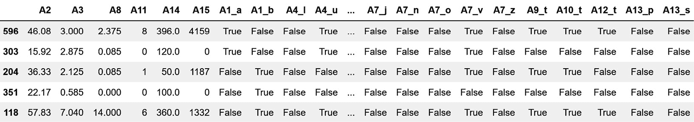
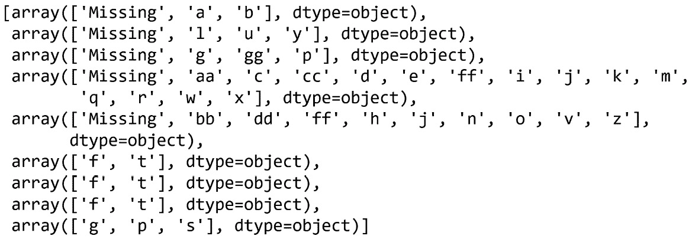
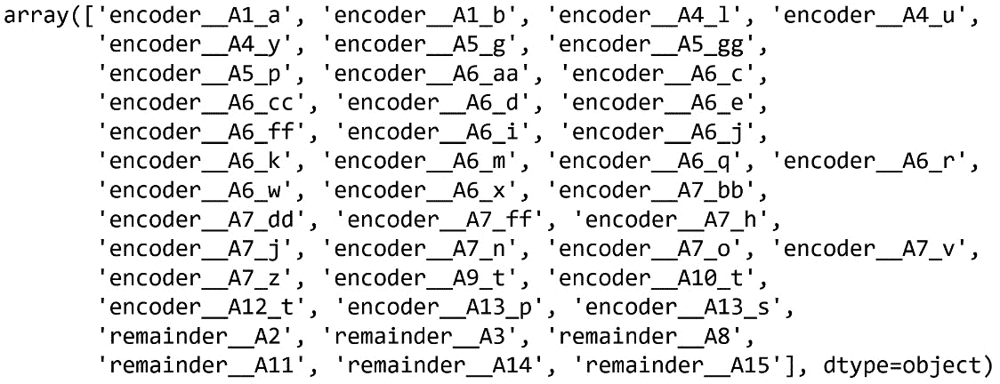
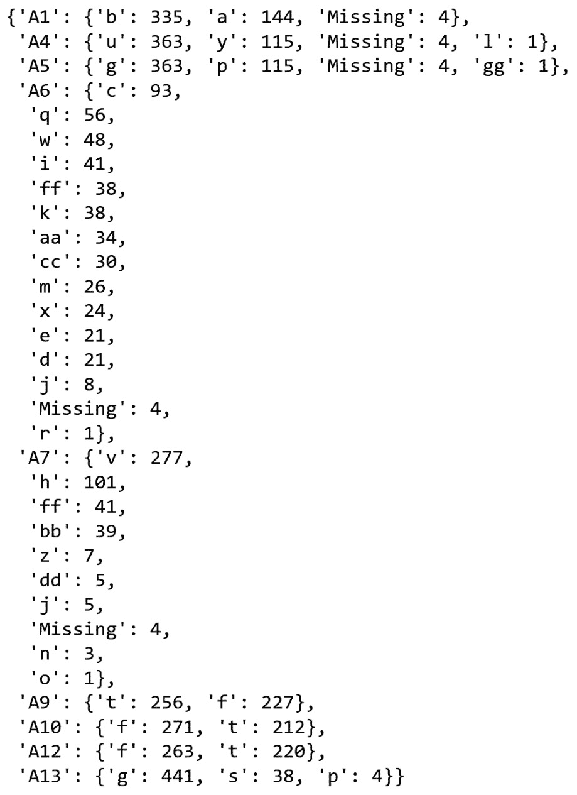
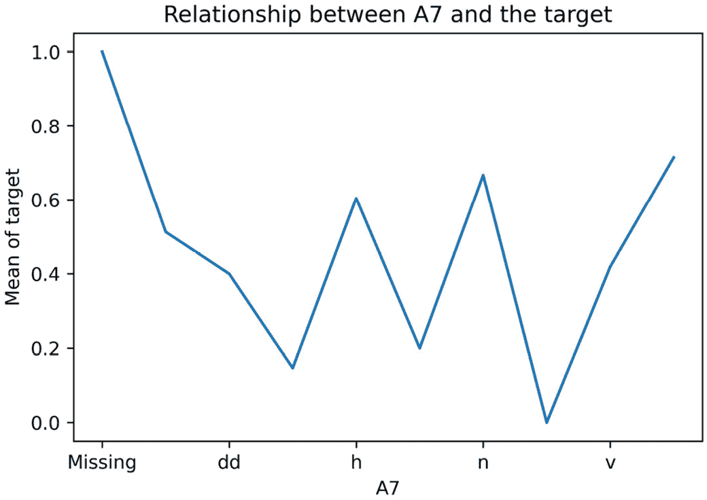
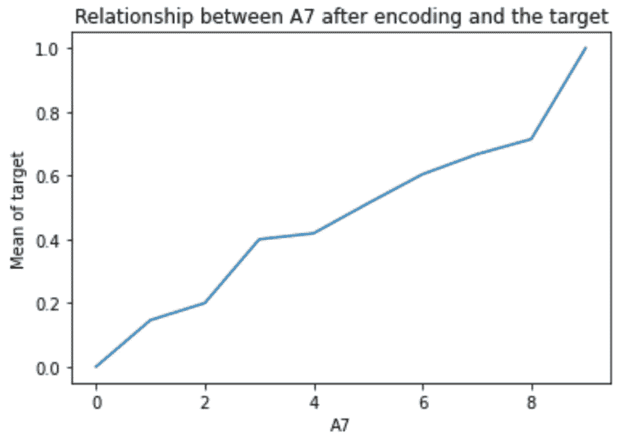
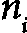
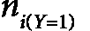
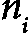
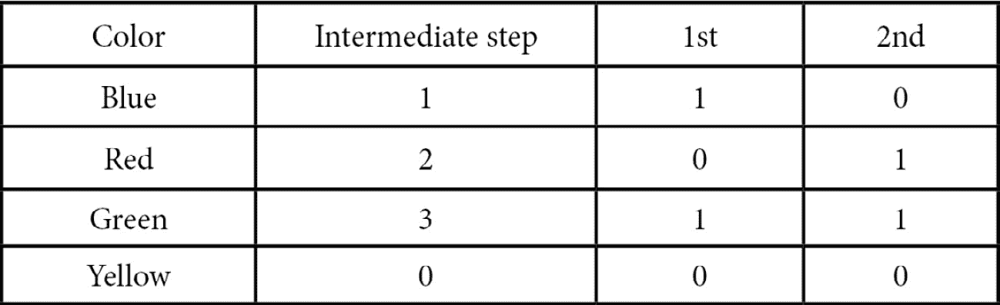

# 第三章：**0** **2**

# **编码分类变量**

`<st c="146">业主</st>` <st c="156">变量`<st c="185">owner</st>`和`<st c="190">非业主</st>` <st c="195">是分类变量，同样，`<st c="235">婚姻状况</st>` <st c="249">变量`<st c="278">从未结婚</st>`<st c="291">、`<st c="293">已婚</st>`<st c="300">、`<st c="302">离婚</st>`<st c="310">和`<st c="316">丧偶</st>`<st c="323">也是分类变量。在一些分类变量中，标签具有内在顺序；例如，在`<st c="412">学生成绩</st>` <st c="427">变量中，`<st c="452">A</st>`<st c="453">、`<st c="455">B</st>`<st c="456">、`<st c="458">C</st>`<st c="459">和`<st c="465">Fail</st>` <st c="469">是按顺序排列的，其中`<st c="488">A</st>` <st c="489">是最高等级，而`<st c="518">Fail</st>` <st c="522">是最低等级。</st>` <st c="541">这些被称为`<st c="708">城市</st>` <st c="712">变量，其值为`<st c="742">伦敦</st>`<st c="748">、`<st c="750">曼彻斯特</st>`<st c="760">、`<st c="762">布里斯托尔</st>`<st c="769">等。</st>`

分类变量的值通常编码为字符串。为了训练大多数机器学习模型，我们需要将这些字符串转换为数字。将字符串替换为数字的行为称为**<st c="988">分类编码</st>**。在本章中，我们将讨论多种分类**编码方法**。

本章将涵盖以下**食谱**：

+   通过**独热编码**创建二进制变量

+   对频繁类别进行**独热编码**

+   用计数或观察值的**频率**替换类别

+   用**序数**替换类别

+   根据目标值进行**序数编码**

+   实现目标**均值编码**

+   使用**证据权重**进行编码

+   对稀有或**不频繁类别**进行分组

+   进行**二元编码**

# **技术要求**

<st c="1553">在本章中，我们将使用</st> `<st c="1587">Matplotlib</st>`<st c="1597">,</st> `<st c="1599">pandas</st>`<st c="1605">,</st> `<st c="1607">NumPy</st>`<st c="1612">,</st> `<st c="1614">scikit-learn</st>`<st c="1626">,</st> `<st c="1628">feature-engine</st>`<st c="1642">，以及 Category Encoders Python 库。</st> <st c="1684">如果你需要安装 Python，免费的 Anaconda Python 发行版（</st>[<st c="1754">https://www.anaconda.com/</st>](https://www.anaconda.com/)<st c="1780">）包括了大多数数值</st> <st c="1807">计算库</st>。</st>

`<st c="1827">feature-engine</st>` <st c="1842">可以使用</st> `<st c="1865">pip</st>`<st c="1868">安装：</st>

```py
 pip install feature-engine
```

<st c="1897">如果你使用 Anaconda，你可以使用</st> `<st c="1935">feature-engine</st>` <st c="1949">和</st> `<st c="1955">conda</st>`<st c="1960">安装：</st>

```py
 conda install -c conda-forge feature_engine
```

<st c="2006">要安装 Category Encoders，请使用以下</st> `<st c="2041">pip</st>` <st c="2044">命令：</st>

```py
 pip install category_encoders
```

<st c="2086">我们将使用来自</st> **<st c="2103">UCI 机器学习仓库</st>** <st c="2136">的</st> *<st c="2136">信用审批</st>** <st c="2118">数据集</st> <st c="2167">(</st>[<st c="2169">https://archive.ics.uci.edu/</st>](https://archive.ics.uci.edu/)<st c="2197">)，该数据集受 CC BY 4.0 创意共享许可协议保护：</st> [<st c="2260">https://creativecommons.org/licenses/by/4.0/legalcode</st>](https://creativecommons.org/licenses/by/4.0/legalcode)<st c="2313">。你可以在以下链接找到数据集：</st> [<st c="2347">http://archive.ics.uci.edu/dataset/27/credit+approval</st>](http://archive.ics.uci.edu/dataset/27/credit+approval)<st c="2406">。</st>

<st c="2407">我下载并修改了如本</st> <st c="2460">笔记本</st> <st c="2470">https://github.com/PacktPublishing/Python-Feature-engineering-Cookbook-Third-Edition/blob/main/ch02-categorical-encoding/credit-approval-dataset.ipynb</st>](https://github.com/PacktPublishing/Python-Feature-engineering-Cookbook-Third-Edition/blob/main/ch02-categorical-encoding/credit-approval-dataset.ipynb)<st c="2620">所示的数据。</st>

<st c="2621">你可以在附带的 GitHub</st> <st c="2693">仓库中找到修改后的数据集：</st> [<st c="2705">https://github.com/PacktPublishing/Python-Feature-engineering-Cookbook-Third-Edition/blob/main/ch02-categorical-encoding/</st>](https://github.com/PacktPublishing/Python-Feature-engineering-Cookbook-Third-Edition/blob/main/ch02-categorical-encoding/)<st c="2826">。</st>

<st c="2827">注意</st>

在编码分类变量之前，你可能想要填充它们的缺失数据。<st c="2917">查看</st> *<st c="2979">第一章</st>*<st c="2988">中关于分类变量填充方法的内容</st> *<st c="2990">填充</st> *<st c="2999">缺失</st> <st c="3007">数据</st>*<st c="3011">。</st>

# 通过独热编码创建二进制变量

`<st c="3223">1</st>` <st c="3224">如果类别存在，否则</st> `<st c="3256">0</st>` <st c="3257">。</st>

<st c="3268">以下</st> <st c="3282">表格显示了</st> `<st c="3337">Smoker</st>` <st c="3343">变量的一热编码表示，其类别为</st> `<st c="3376">Smoker</st>` <st c="3382">和</st> `<st c="3387">Non-Smoker</st>`<st c="3397">：</st>


<st c="3475">图 2.1 – Smoker 变量的一热编码表示</st>

<st c="3541">如图</st> *<st c="3554">图 2.1</st>**<st c="3562">.1</st>*<st c="3564">所示，从</st> `<st c="3575">Smoker</st>` <st c="3581">变量中，我们可以导出一个用于</st> `<st c="3628">Smoker</st>`<st c="3634">的二进制变量，该变量显示吸烟者的值为</st> `<st c="3661">1</st>` <st c="3662">，或者对于不吸烟者，导出一个</st> `<st c="3703">Non-Smoker</st>`<st c="3713">的二进制变量，该变量取值为</st> `<st c="3740">1</st>` <st c="3741">。</st>

<st c="3769">对于具有</st> `<st c="3778">Color</st>` <st c="3783">值的分类变量</st> `<st c="3824">red</st>`<st c="3827">，</st> `<st c="3829">blue</st>`<st c="3833">，和</st> `<st c="3839">green</st>`<st c="3844">，我们可以创建三个变量，分别称为</st> `<st c="3883">red</st>`<st c="3886">，</st> `<st c="3888">blue</st>`<st c="3892">，和</st> `<st c="3898">green</st>`<st c="3903">。这些变量将在观察值对应相应颜色时赋予值为</st> `<st c="3949">1</st>` <st c="3950">，如果不对应，则赋予值为</st> `<st c="4011">0</st>` <st c="4012">。</st>

<st c="4028">具有</st> *<st c="4057">k</st>* <st c="4058">个唯一类别的分类变量可以使用</st> *<st c="4098">k-1</st>* <st c="4101">个二进制变量进行编码。</st> <st c="4120">对于</st> `<st c="4124">Smoker</st>`<st c="4130">，</st> *<st c="4132">k</st>* <st c="4134">是</st> *<st c="4137">2</st>* <st c="4138">，因为它包含两个标签（</st>`<st c="4166">Smoker</st>` <st c="4173">和</st> `<st c="4178">Non-Smoker</st>`<st c="4188">），所以我们只需要一个二进制变量（</st>*<st c="4229">k - 1 = 1</st>*<st c="4239">）来捕捉所有信息。</st> <st c="4274">对于</st> `<st c="4282">Color</st>` <st c="4287">变量，它有 3 个类别（</st>*<st c="4322">k = 3</st>*<st c="4328">；</st> `<st c="4331">red</st>`<st c="4334">，</st> `<st c="4336">blue</st>`<st c="4340">，和</st> `<st c="4346">green</st>`<st c="4351">），我们需要 2 个（</st>*<st c="4366">k - 1 = 2</st>*<st c="4376">）二进制</st> <st c="4386">变量来捕捉所有信息，以便以下情况发生：</st>

+   <st c="4456">如果观察结果是红色，它将被</st> `<st c="4511">红色</st>` <st c="4514">变量捕获（</st>`<st c="4525">红色</st>` <st c="4529">=</st> `<st c="4532">1</st>`<st c="4533">,</st> `<st c="4535">蓝色</st>` <st c="4539">=</st> `<st c="4542">0</st>`<st c="4543">）</st>

+   <st c="4544">如果观察结果是蓝色，它将被</st> `<st c="4599">蓝色</st>` <st c="4603">变量捕获（</st>`<st c="4614">红色</st>` <st c="4618">=</st> `<st c="4621">0</st>`<st c="4622">,</st> `<st c="4624">蓝色</st>` <st c="4628">=</st> `<st c="4631">1</st>`<st c="4632">）</st>

+   <st c="4633">如果观察结果是绿色，它将被</st> `<st c="4704">红色</st>` <st c="4707">和</st> `<st c="4712">蓝色</st>` <st c="4716">(</st>`<st c="4718">红色</st>` <st c="4721">=</st> `<st c="4724">0</st>`<st c="4725">,</st> `<st c="4727">蓝色</st>` <st c="4731">=</st> `<st c="4734">0</st>`<st c="4735">)</st>

<st c="4736">编码</st> <st c="4744">为</st> *<st c="4750">k-1</st>* <st c="4753">二进制变量非常适合线性模型。</st> <st c="4805">在某些情况下，我们可能更喜欢使用</st> *<st c="4895">k</st>* <st c="4896">二进制变量来编码分类变量：</st>

+   <st c="4913">在训练决策树时，由于它们不会同时评估整个特征空间</st> <st c="5003">，</st>

+   <st c="5012">当递归选择特征时</st>

+   <st c="5048">当确定变量中每个类别的</st> <st c="5105">重要性时</st>

<st c="5115">在这个菜谱中，我们将比较</st> `<st c="5188">pandas</st>`<st c="5194">、</st> `<st c="5196">scikit-learn</st>`<st c="5208">和</st> `<st c="5210">featur</st><st c="5220">e-engine</st>`<st c="5229">的 one-hot 编码实现。</st>

## <st c="5230">如何做到这一点...</st>

<st c="5246">首先，让我们做一些导入并</st><st c="5282">准备数据：</st>

1.  <st c="5304">导入</st> `<st c="5312">pandas</st>` <st c="5318">和</st> `<st c="5327">train_test_split</st>` <st c="5343">函数</st> <st c="5353">从</st> `<st c="5358">scikit-learn</st>`<st c="5370">：</st>

    ```py
     import pandas as pd
    from sklearn.model_selection import train_test_split
    ```

1.  <st c="5445">让我们加载信用</st> <st c="5468">批准数据集：</st>

    ```py
     data = pd.read_csv("credit_approval_uci.csv")
    ```

1.  <st c="5531">让我们将数据分为训练集和</st> <st c="5571">测试集：</st>

    ```py
     X_train, X_test, y_train, y_test = train_test_split(
        data.drop(labels=["target"], axis=1),
        data["target"],
        test_size=0.3,
        random_state=0,
    )
    ```

1.  <st c="5721">让我们</st> <st c="5728">检查</st> `<st c="5765">A4</st>` <st c="5767">变量的</st> <st c="5757">唯一类别：</st>

    ```py
     X_train["A4"].unique()
    ```

    <st c="5800">我们可以在以下输出中看到</st> `<st c="5833">A4</st>` <st c="5835">的独特值：</st>

    ```py
    <st c="5923">A4</st> into *<st c="5930">k-1</st>* binary variables using <st c="5958">pandas</st> and then inspect the first five rows of the resulting DataFrame:

    ```

    dummies = pd.get_dummies(

        X_train["A4"], drop_first=True)

    dummies.head()

    ```py

    ```

<st c="6102">注意</st>

<st c="6107">使用`<st c="6113">pandas</st>`<st c="6119">’</st> `<st c="6122">get_dummies()</st>`<st c="6135">，我们可以通过`<st c="6193">dummy_na</st>` <st c="6201">参数忽略或编码缺失数据。</st> <st c="6213">通过设置`<st c="6224">dummy_na=True</st>`<st c="6237">，缺失数据将被编码到一个新的二进制变量中。</st> <st c="6294">要将变量编码为</st> *<st c="6322">k</st>* <st c="6323">个虚拟变量，请使用`<st c="6337">drop_first=False</st>` <st c="6353">。</st>

<st c="6362">在这里，我们可以看到</st> *<st c="6394">步骤 5</st>*<st c="6400">的输出，其中每个标签现在都是一个</st> <st c="6428">二进制变量：</st>

```py
 <st c="6444">Missing        l        u        y</st>
<st c="6458">596     False</st> <st c="6468">False   True  False</st>
<st c="6485">303     False  False   True  False</st>
<st c="6512">204     False  False</st> <st c="6529">False   True</st>
<st c="6539">351     False  False  False   True</st>
<st c="6566">118     False  False   True  False</st>
```

1.  <st c="6593">现在，让我们</st> <st c="6605">将所有分类变量编码为</st> *<st c="6647">k-1</st>* <st c="6650">二进制值：</st>

    ```py
     X_train_enc = pd.get_dummies(X_train, drop_first=True)
    X_test_enc = pd.get_dummies(X_test, drop_first=True)
    ```

<st c="6768">注意</st>

`<st c="6773">pandas</st>`<st c="6780">’</st> `<st c="6783">get_dummies()</st>`<st c="6796">默认情况下将编码对象、字符串或类别类型的所有变量。</st> <st c="6875">要编码变量的子集，请将变量名列表传递给`<st c="6953">columns</st>` <st c="6960">参数。</st>

1.  <st c="6972">让我们检查一下生成的 DataFrame 的前五行：</st> <st c="6996">resulting DataFrame:</st>

    ```py
     X_train_enc.head()
    ```

<st c="7053">注意</st>

<st c="7058">当编码多个变量时，`<st c="7097">get_dummies()</st>` <st c="7110">会捕获变量名 – 比如，`<st c="7145">A1</st>` <st c="7147"> – 并在类别名称前加上下划线来标识生成的</st> <st c="7231">二进制变量。</st>

<st c="7248">我们可以在以下输出中看到二进制变量：</st> <st c="7288">follo</st><st c="7293">wing output:</st>



<st c="7967">图 2.2 – 一个转换后的 DataFrame，显示了数值变量后跟分类变量的独热编码表示</st>

<st c="8111">注意</st>

`<st c="8116">pandas</st>`<st c="8123">’</st> `<st c="8126">get_dummies()</st>`<st c="8139">将为 DataFrame 中看到的每个类别创建一个二进制变量。</st> <st c="8206">因此，如果训练集中比测试集中有更多类别，`<st c="8281">get_dummies()</st>` <st c="8294">将在转换后的训练集中返回比转换后的测试集更多的列，反之亦然。</st> <st c="8399">为了避免这种情况，最好使用`<st c="8462">scikit-learn</st>` <st c="8474">或`<st c="8478">feature-engine</st>`<st c="8492">进行独热编码。</st>

<st c="8493">让我们使用`<st c="8526">scikit-learn</st>` <st c="8538">来进行独热编码。</st>

1.  <st c="8547">让我们</st> <st c="8554">从</st> `<st c="8600">scikit-learn</st>`<st c="8612">导入编码器</st> <st c="8572">和</st> `<st c="8577">ColumnTransformer</st>` <st c="8594">：</st>

    ```py
     from sklearn.preprocessing import OneHotEncoder
    from sklearn.compose import ColumnTransformer
    ```

1.  <st c="8708">让我们创建一个包含分类变量名称的列表：</st>

    ```py
     cat_vars = X_train.select_dtypes(
        include="O").columns.to_list()
    ```

1.  <st c="8838">让我们设置编码器以创建</st> *<st c="8874">k-1</st>* <st c="8877">个二进制变量：</st>

    ```py
     encoder = OneHotEncoder(drop="first",
        sparse_output=False)
    ```

<st c="8954">注意</st>

<st c="8959">要将变量编码为</st> *<st c="8985">k</st> * <st c="8986">个虚拟变量，将</st> `<st c="9004">drop</st>` <st c="9008">参数设置为</st> `<st c="9022">None</st>`<st c="9026">。要将仅二进制变量编码为</st> *<st c="9065">k-1</st>*<st c="9068">，将</st> `<st c="9078">drop</st>` <st c="9082">参数设置为</st> `<st c="9096">if_binary</st>`<st c="9105">。后者是有用的，因为将二进制变量编码为</st> *<st c="9167">k</st>* <st c="9168">个虚拟变量</st> <st c="9177">是多余的。</st>

1.  <st c="9190">让我们</st> <st c="9197">将编码限制在</st> <st c="9226">分类变量</st>：

    ```py
     ct = ColumnTransformer(
        [("encoder", encoder, cat_vars)],
        remainder="passthrough",
        force_int_remainder_cols=False,
    ).set_output(transform="pandas")
    ```

1.  <st c="9396">让我们拟合编码器，使其识别要编码的类别：</st>

    ```py
     ct.fit(X_train)
    ```

1.  <st c="9482">让我们检查将用二进制变量表示的类别：</st>

    ```py
     ct.named_transformers_["encoder"].categories_
    ```

    <st c="9605">该转换器将为以下类别添加二进制变量：</st>



<st c="10132">图 2.3 – 将编码为二进制变量的类别数组（每个变量一个数组）</st>

<st c="10239">注意</st>

`<st c="10244">scikit-learn</st>`<st c="10257">的</st> `<st c="10261">OneHotEncoder()</st>` <st c="10276">将仅编码从训练集中学习到的类别。</st> <st c="10337">如果测试集中有新的类别，我们可以指示编码器忽略它们、返回错误或将它们替换为不常见的类别，通过将</st> `<st c="10503">handle_unknown</st>` <st c="10517">参数设置为</st> `<st c="10531">ignore</st>`<st c="10537">、`<st c="10539">error</st>`<st c="10544">、`<st c="10546">或</st> `<st c="10549">infrequent_if</st><st c="10562">_exists</st>`<st c="10570">。</st>

1.  <st c="10571">让我们</st> <st c="10578">编码分类变量：</st>

    ```py
     X_train_enc = ct.transform(X_train)
    X_test_enc = ct.transform(X_test)
    ```

    <st c="10681">确保通过执行</st> <st c="10717">`<st c="10727">X_test_enc.head()</st>`</st> <st c="10744">来检查结果。</st>

1.  <st c="10745">为了熟悉输出，让我们打印结果 DataFrame 的变量名称：</st>

    ```py
     ct.get_feature_names_out()
    ```

    <st c="10864">在以下图像中，我们看到转换后的 DataFrame 中的变量名称：</st>



<st c="11696">图 2.4 – 结果 DataFrame 中变量的名称数组</st>

<st c="11774">注意</st>

`<st c="11779">ColumnTransformer()</st>` <st c="11799">在转换过程中更改变量的名称和顺序。</st> <st c="11871">如果变量已被编码，它将附加`<st c="11919">encoder</st>` <st c="11926">前缀；如果变量未被修改，它将附加`<st c="11991">remainder</st>` <st c="12000">前缀。</st>

<st c="12008">为了总结这个配方，让我们使用`<st c="12063">featu</st><st c="12068">re-engine</st>`<st c="12083">`进行独热编码：</st>

1.  <st c="12084">让我们</st> <st c="12090">导入</st> <st c="12098">编码器</st> <st c="12110">来自</st> `<st c="12115">f</st>``<st c="12116">eature-engine</st>`<st c="12129">:</st>

    ```py
     from feature_engine.encoding import OneHotEncoder
    ```

1.  <st c="12182">让我们设置编码器，使其返回`*<st c="12227">k-1</st>`* <st c="12230">二元变量：</st>

    ```py
     ohe_enc = OneHotEncoder(drop_last=True)
    ```

<st c="12288">注意</st>

`<st c="12293">feature-engine</st>`<st c="12308">`的`<st c="12312">OneHotEncoder()</st>` <st c="12327">默认情况下编码所有分类变量。</st> <st c="12374">要编码变量的子集，请传递变量名称列表：</st> `<st c="12446">OneHotEncoder(variables=["A1", "A4"]</st>`<st c="12482">)。</st> <st c="12486">要编码数值变量，将`<st c="12525">ignore_format</st>` <st c="12538">参数设置为`<st c="12552">True</st>` <st c="12556">或将变量转换为对象。</st>

1.  <st c="12590">让我们将编码器拟合到训练集，以便它学习要编码的类别和变量：</st> <st c="12677">要编码的：</st>

    ```py
     ohe_enc.fit(X_train)
    ```

<st c="12708">注意</st>

<st c="12713">要将二元变量编码为`*<st c="12746">k-1</st>`*<st c="12749">，并将其他分类变量编码为`*<st c="12788">k</st>` <st c="12789">虚变量，将`<st c="12807">drop_last_binary</st>` <st c="12823">参数设置为`<st c="12837">True</st>`<st c="12841">。</st>

1.  <st c="12842">让我们探索将要</st> <st c="12881">编码的变量：</st>

    ```py
     ohe_enc.variables_
    ```

    <st c="12911">Transformer 找到了并存储了对象或分类类型的变量，如下面的输出所示：</st> <st c="13010">以下输出：</st>

    ```py
    ['A1', 'A4', 'A5', 'A6', 'A7', 'A9', 'A10', 'A12', 'A13']
    ```

1.  <st c="13086">让我们</st> <st c="13092">探索将创建虚变量的类别：</st>

    ```py
     ohe_enc.encoder_dict_
    ```

    <st c="13181">以下</st> <st c="13185">字典包含将在每个变量中编码的类别：</st>

    ```py
     <st c="13269">{'A1': ['a', 'b'],</st>
     <st c="13288">'A4': ['u', 'y', 'Missing'],</st>
     <st c="13317">'A5': ['g', 'p', 'Missing'],</st>
     <st c="13346">'A6': ['c', 'q', 'w', 'ff', 'm', 'i', 'e', 'cc', 'x', 'd', 'k', 'j', 'Missing', 'aa'],</st>
     <st c="13433">'A7': ['v', 'ff', 'h', 'dd', 'z', 'bb', 'j', 'Missing', 'n'],</st>
     <st c="13495">'A9': ['t'],</st>
     <st c="13508">'A10': ['t'],</st>
     <st c="13522">'A12': ['t'],</st>
     <st c="13536">'A13': ['g', 's']}</st>
    ```

1.  <st c="13555">让我们在训练集和测试集中编码分类变量：</st>

    ```py
     X_train_enc = ohe_enc.transform(X_train)
    X_test_enc = ohe_enc.transform(X_test)
    ```

    <st c="13698">如果我们执行</st> `<st c="13713">X_train_enc.head()</st>`<st c="13731">，我们将看到以下 DataFrame：</st>


<st c="14176">图 2.5 – 转换后的 DataFrame，数值变量之后跟着分类变量的独热编码表示</st>

<st c="14311">注意</st> <st c="14317">如何</st> `<st c="14325">A4</st>` <st c="14327">分类</st><st c="14332">变量</st> <st c="14341">被替换为</st> `<st c="14368">A4_u</st>`<st c="14372">，`<st c="14374">A4_y</st>`<st c="14378">，以及</st> <st c="14384">等等。</st>

<st c="14390">注意</st>

<st c="14395">我们可以通过执行</st> `<st c="14468">ohe_enc.get</st><st c="14489">_feature_names_out()</st>`<st c="14510">来获取转换后的数据集中所有变量的名称。</st>

## <st c="14511">它的工作原理...</st>

<st c="14527">在这个菜谱中，我们使用</st> `<st c="14607">pandas</st>`<st c="14613">，`<st c="14615">scikit-learn</st>`<st c="14627">，和</st> `<st c="14629">feature-engine</st>`<st c="14647">对分类变量进行了独热编码。</st>

`<st c="14648">pandas</st>`<st c="14655">’</st> `<st c="14658">get_dummies()</st>` <st c="14671">将分类变量替换为表示每个类别的二进制变量集。</st> <st c="14775">当用于整个数据集时，它返回数值变量，然后是每个变量中看到的每个类别的独热编码表示，变量类型为对象、字符串，</st> <st c="14956">或分类。</st>

<st c="14971">注意</st>

`<st c="14976">pandas</st>` <st c="14983">将为数据集中看到的每个类别返回二进制变量。</st> <st c="15051">在实际应用中，为了避免数据泄露并预测部署情况，我们只想为训练集中看到的类别返回虚拟变量。</st> <st c="15205">因此，使用</st> `<st c="15228">scikit-learn</st>` <st c="15240">和</st> `<st c="15245">feature-engine</st>`<st c="15259">更安全。</st>

`<st c="15260">OneHotEncoder()</st>` <st c="15276">从</st> `<st c="15282">scikit-learn</st>` <st c="15294">或</st> `<st c="15298">feature-engine</st>` <st c="15312">学习了我们应用</st> `<st c="15418">fit()</st>`<st c="15423">时应该用二进制变量表示的类别。使用</st> `<st c="15430">transform()</st>`<st c="15441">，`<st c="15443">scikit-learn</st>` <st c="15455">仅返回二进制变量，而</st> `<st c="15500">feature-engine</st>` <st c="15514">返回数值变量，然后是分类变量的独热编码表示。</st>

`<st c="15619">scikit-learn</st>` `<st c="15632">’s</st>` `<st c="15636">OneHotEncoder()</st>` `<st c="15651">默认情况下编码所有变量。</st>` `<st c="15686">要限制编码为</st>` `<st c="15714">分类变量，我们</st>` `<st c="15740">使用了</st>` `<st c="15745">ColumnTransformer()</st>` `<st c="15764">。我们将</st>` `<st c="15787">transform()</st>` `<st c="15798">的输出</st>` `<st c="15802">设置为</st>` `<st c="15808">pandas</st>` `<st c="15841">，以获得结果数据作为</st>` `<st c="15841">DataFrame。</st>`

`<st c="15853">注意</st>`

`<st c="15858">One-hot 编码适用于线性模型。</st>` `<st c="15907">它还扩展了特征空间。</st>` `<st c="15942">如果你的数据集包含许多分类变量或高度基数变量，你可以通过仅编码最频繁的类别来限制二进制变量的数量。</st>` `<st c="16119">你可以使用</st>` `<st c="16159">scikit-learn</st>` `<st c="16171">和</st>` `<st c="16176">feature-engine</st>` `<st c="16190">自动完成此操作，正如我们在</st>` `<st c="16213">Performing one-hot encoding of freq</st><st c="16248">uent</st>` `<st c="16254">categories</st>` `<st c="16264">recipe.</st>` `<st c="16213">执行频繁类别 one-hot 编码</st>` `<st c="16254">recipe.</st>` `<st c="16264">配方</st>` `<st c="16213">中描述的。</st>`

## `<st c="16272">还有更多...</st>`

`<st c="16288">我们还可以使用 Category Encoders Python</st>` `<st c="16361">库</st>` `<st c="16370">https://</st><st c="16378">contrib.scikit-learn.org/category_encoders/onehot.html</st>` `<st c="16433">。</st>`

`<st c="16434">为了限制二进制变量的数量，我们可以选择要编码的类别和要忽略的类别；查看以下</st>` `<st c="16579">文章</st>` `<st c="16588">https://www.blog.trainindata.com/one-hot-encoding-</st><st c="16638">categorical-variables</st><st c="16660">/</st><st c="16662">。</st>`

# `<st c="16663">执行频繁类别 one-hot 编码</st>`

`<st c="16714">One-hot 编码</st>` `<st c="16732">使用二进制变量表示每个变量的类别。</st>` `<st c="16791">因此，高度基数变量或具有多个分类特征的数据集的 one-hot 编码可以显著扩展特征空间。</st>` `<st c="16935">这反过来可能会增加使用机器学习模型的计算成本或降低其性能。</st>` `<st c="17053">为了减少二进制变量的数量，我们可以对最频繁的类别执行 one-hot 编码。</st>` `<st c="17160">对顶级类别进行 one-hot 编码</st>` `<st c="17177">相当于将剩余的、较少出现的类别视为一个单一的、独特的类别。</st>`

在这个示例中，我们将使用 `<st c="17291">pandas</st>`、`<st c="17380">Scikit-l</st><st c="17396">earn</st>`、`<st c="17403">和</st>` `<st c="17407">feature-engine</st>` `<st c="17421">` 来实现最流行类别的 one-hot 编码。

## <st c="17422">如何操作...</st>

<st c="17438">首先，让我们导入</st> <st c="17459">必要的</st> <st c="17473">Python 库并准备好</st> <st c="17502">数据集：</st>

1.  <st c="17516">导入所需的 Python 库、函数、</st> <st c="17566">和类：</st>

    ```py
     import pandas as pd
    import numpy as np
    from sklearn.model_selection import train_test_split
    ```

1.  <st c="17670">让我们加载 Credit Approval 数据集并将其分为训练集和</st> <st c="17739">测试集：</st>

    ```py
     data = pd.read_csv("credit_approval_uci.csv")
    X_train, X_test, y_train, y_test = train_test_split(
        data.drop(labels=["target"], axis=1),
        data["target"],
        test_size=0.3,
        random_state=0,
    )
    ```

<st c="17935">注意</st>

<st c="17940">需要在训练集中确定最频繁的类别。</st> <st c="18010">这是为了避免</st> <st c="18027">数据泄露。</st>

1.  <st c="18040">让我们检查</st> `<st c="18084">A6</st>` <st c="18086">变量的唯一类别：</st>

    ```py
     X_train["A6"].unique()
    ```

    <st c="18119">以下输出显示了</st> `<st c="18141">A6</st>` <st c="18143">的唯一值：</st>

    ```py
    <st c="18343">A6</st>, sort them in decreasing order, and then display the five most frequent categories:

    ```

    X_train["A6"].value_counts().sort_values(

        ascending=False).head(5)

    ```py

    <st c="18496">We can</st> <st c="18503">see the five most frequent categories and the number of observations per category in the</st> <st c="18593">following output:</st>

    ```

    <st c="18610">A6</st>

    <st c="18613">c      93</st>

    <st c="18618">q      56</st>

    <st c="18623">w      48</st>

    <st c="18628">i      41</st>

    <st c="18633">ff     38</st>

    <st c="18717">使用</st> *<st c="18751">步骤 4</st>* <st c="18719">中的代码在一个列表推导式中将</st> `<st c="18717">A6</st>` <st c="18721">放入一个列表中：</st>

    ```py
     top_5 = [x for x in X_train[ <st c="18816">" A6"].value_counts().sort_values(</st> **<st c="18851">ascending=False).head(5).index
    ]</st>**
    ```

    ```py

    ```

*****   <st c="18883">让我们为每个顶级类别向训练集和</st> <st c="18956">测试集的副本添加一个二元变量：</st>

    ```py
     X_train_enc = X_train.copy()
    X_test_enc = X_test.copy()
    for label in top_5:
        X_train_enc[f"A6_{label}"] = np.where(
            X_train["A6"] == label, 1, 0)
        X_test_enc[f"A6_{label}"] = np.where(
            X_test["A6"] == label, 1, 0)
    ```

    +   <st c="19178">让我们显示</st> <st c="19192">原始和编码变量</st> `<st c="19203">A6</st>`<st c="19249">，在</st> <st c="19258">训练集</st>中的</st> `<st c="19201">前 10</st>` <st c="19209">行：</st>

    ```py
     X_train_enc[["A6"] + [f"A6_{
        label}" for label in top_5]].head(10)
    ```

    <st c="19335">在</st> *<st c="19353">步骤 7</st>*<st c="19359">的输出中，我们可以看到</st> `<st c="19376">A6</st>` <st c="19378">变量，后面跟着</st> <st c="19405">二元变量：</st>

    ```py
     <st c="19422">A6  A6_c  A6_q</st> <st c="19436">A6_w  A6_i  A6_ff</st>
    <st c="19451">596   c      1      0      0      0        0</st>
    <st c="19467">303   q</st> <st c="19474">0      1      0      0        0</st>
    <st c="19483">204   w      0      0      1      0</st> <st c="19498">0</st>
    <st c="19499">351  ff      0      0      0      0        1</st>
    <st c="19515">118   m      0</st> <st c="19524">0      0      0        0</st>
    <st c="19531">247   q      0      1      0      0        0</st>
    <st c="19547">652</st> <st c="19551">i      0      0      0      1        0</st>
    <st c="19563">513   e      0      0</st> <st c="19574">0      0        0</st>
    <st c="19579">230  cc      0      0      0      0        0</st>
    <st c="19677">scikit-learn</st>.
    ```

    +   <st c="19690">让我们导入</st> <st c="19704">编码器：</st>

    ```py
     from sklearn.preprocessing import OneHotEncoder
    ```

    +   <st c="19764">让我们设置</st> <st c="19775">编码器以编码至少</st> `<st c="19829">39</st>` <st c="19831">个观察值中显示的类别，并将编码的类别数量限制为</st> `<st c="19890">5</st>`<st c="19894">：</st>

    ```py
     encoder = OneHotEncoder(
        min_frequency=39,
        max_categories=5,
        sparse_output=False,
    ).set_output(transform="pandas")
    ```

    +   <st c="20010">最后，让我们</st> <st c="20025">将转换器拟合到两个高基数变量，然后转换</st> <st c="20100">数据：</st>

    ```py
     X_train_enc = encoder.fit_transform(X_train[
        ['A6', 'A7']])
    X_test_enc = encoder.transform(X_test[['A6', 'A7']])
    ```

    <st c="20222">如果你执行</st> `<st c="20238">X_train_enc.head()</st>` <st c="20256">，你会看到</st> <st c="20272">生成的 DataFrame：</st>****

****

<st c="20596">图 2.6 – 包含至少 39 个观察值的类别二元变量以及表示所有剩余类别的额外二元变量的转换 DataFrame</st>

<st c="20772">为了总结这个方法，让我们使用</st> `<st c="20843">feature-engine</st>`<st c="20857">.</st> <st c="20838">来编码最频繁的类别</st>

1.  <st c="20858">让我们设置</st> <st c="20871">单热编码器，以对</st> `<st c="20943">A6</st>` <st c="20945">和</st> `<st c="20950">A7</st>` <st c="20952">变量的前五个最频繁类别进行编码：</st>

    ```py
     From feature_engine.encoding import OneHotEncoder
    ohe_enc = OneHotEncoder(
        top_categories=5,
        variables=["A6", "A7"]
    )
    ```

<st c="21081">注意</st>

<st c="21086">要编码的频繁类别数量由</st><st c="21150">用户</st><st c="21161">任意确定。</st>

1.  <st c="21170">让我们将编码器拟合到训练集，以便它学习并存储</st> `<st c="21271">A6</st>` <st c="21273">和</st> `<st c="21278">A7</st>`<st c="21280">的最频繁类别：</st>

    ```py
     ohe_enc.fit(X_train)
    ```

1.  <st c="21303">最后，让我们在训练集和测试集中对</st> `<st c="21326">A6</st>` <st c="21328">和</st> `<st c="21333">A7</st>` <st c="21335">进行编码：</st>

    ```py
     X_train_enc = ohe_enc.transform(X_train)
    X_test_enc = ohe_enc.transform(X_test)
    ```

    <st c="21443">您可以通过执行</st> `<st c="21524">X_train_enc.head()</st>`<st c="21542">来查看转换后的 DataFrame 中的新二进制变量。您还可以通过执行</st> `<st c="21623">ohe_enc.encoder_dict_</st>`<st c="21644">来找到编码器学习到的前五个类别。</st>

## <st c="21645">它是如何工作的...</st>

<st c="21661">在这个菜谱的第一部分，我们处理了</st> `<st c="21715">A6</st>` <st c="21717">分类变量。</st> <st c="21740">我们使用</st> `<st c="21780">pandas</st>`<st c="21786">的</st> `<st c="21789">unique()</st>`<st c="21797">检查其独特的类别。接下来，我们使用</st> `<st c="21862">pandas</st>`<st c="21868">的</st> `<st c="21871">value_counts()</st>`<st c="21885">计算每个类别的观测数，它返回了一个以类别为索引、观测数为值的</st> `<st c="21904">pandas</st>` <st c="21910">系列。</st> <st c="21993">接下来，我们使用</st> `<st c="22096">pandas</st>`<st c="22102">的</st> `<st c="22104">sort_values()</st>`<st c="22117">将类别从观测数最多的到最少的进行排序。然后，我们使用</st> `<st c="22191">pandas</st>`<st c="22197">的</st> `<st c="22200">head()</st>`<st c="22206">将系列缩减到最流行的五个类别。我们使用列表推导式来捕获最频繁类别的名称。</st> <st c="22306">之后，我们对每个类别进行循环，并使用 NumPy 的</st> `<st c="22365">where()</st>`<st c="22372">创建二进制变量，如果观测显示该类别，则放置值为</st> `<st c="22424">1</st>` <st c="22425">，否则为</st> `<st c="22469">0</st>` <st c="22470">。</st>

`<st c="22481">我们在</st>` `<st c="22506">scikit-learn</st>` `<st c="22521">和</st>` `<st c="22527">scikit-learn</st>` `<st c="22539">中的</st>` `<st c="22544">feature-engine</st>` `<st c="22558">的</st>` `<st c="22566">通过单热编码创建二元变量</st>` `<st c="22616">食谱中讨论了如何使用</st>` `<st c="22625">这里，我将只强调编码最频繁类别所需的参数。</st>`

`<st c="22714">使用</st>` `<st c="22724">scikit-learn</st>` `<st c="22750">来编码频繁类别，我们将</st>` `<st c="22775">min_frequency</st>` `<st c="22788">参数设置为</st>` `<st c="22802">39</st>` `<st c="22804">。因此，在少于</st>` `<st c="22843">39</st>` `<st c="22845">个观测值中显示的类别将被组合成一个额外的二元变量</st>` `<st c="22907">，称为</st>` `<st c="22914">infrequent_sklearn</st>` `<st c="22932">。</st>`

使用`<st c="22933">特征工程</st>` `<st c="22969">feature-engine</st>` `<st c="22983">，我们将</st>` `<st c="22996">top_categories</st>` `<st c="23010">参数设置为</st>` `<st c="23024">5</st>` `<st c="23025">。因此，该转换器只为 5 个最频繁的类别创建了二元变量。</st>` `<st c="23116">较少出现的类别将在所有</st>` `<st c="23147">二元变量中显示为</st>` `<st c="23154">0</st>` `<st c="23155">。</st>`

## `<st c="23184">还有更多...</st>`

`<st c="23200">这个食谱基于 2009 年知识发现与数据挖掘杯赛（</st>` **`<st c="23253">知识发现与数据挖掘</st>`** `<st c="23282">(</st>` **`<st c="23283">KDD</st>`** `<st c="23286">)` `<st c="23282">）的获奖解决方案，</st>` `<st c="23306">Winning the KDD Cup Orange Challenge with Ensemble Selection</st>` `<st c="23366">(http://proceedings.mlr.press/v7/niculescu09/niculescu09.pdf)，其中作者将单热编码限制为每个变量的 10 个最频繁类别。</st>`

# `<st c="23527">用计数或观测值的频率替换类别</st>`

与“计数”或“观测值的计数或频率”编码相比，我们用该类别的计数或观测值中显示该类别的比例来替换类别。</st>` `<st c="23642">也就是说，如果有 10 个观测值中的 100 个显示</st>` `<st c="23814">蓝色</st>` `<st c="23818">类别对于</st>` `<st c="23836">颜色</st>` `<st c="23841">变量，我们在进行计数编码时将用</st>` `<st c="23869">蓝色</st>` `<st c="23873">替换为</st>` `<st c="23879">10</st>` `<st c="23881">，或者在进行频率编码时用</st>` `<st c="23917">0.1</st>` `<st c="23920">。</st>` `<st c="23955">这些编码方法在类别频率与目标之间存在关系时很有用。</st>` `<st c="24065">例如，在销售中，产品的频率可能表明</st>` `<st c="24128">其受欢迎程度。</st>`

`<st c="24143">注意</st>`

<st c="24148">如果两个不同的类别在相同的观测数中存在，它们将被相同的值替换，这可能会导致</st> `<st c="24284">信息丢失</st>`。</st>

<st c="24301">在这个菜谱中，我们将使用</st> `<st c="24370">pandas</st>` `<st c="24376">和</st> `<st c="24381">feature-engine</st>` `<st c="24395">执行计数和频率编码。</st>

## <st c="24396">如何做到这一点...</st>

<st c="24412">我们将使用</st> `<st c="24455">pandas</st>` <st c="24461">对一个变量进行编码，然后我们将使用</st> `<st c="24498">feature-engine</st>`<st c="24517">来自动化这个过程：</st>

1.  <st c="24519">让我们从</st> `<st c="24536">进口</st>`开始：</st>

    ```py
     import pandas as pd
    from sklearn.model_selection import train_test_split
    from feature_engine.encoding import CountFrequencyEncoder
    ```

1.  <st c="24679">让我们加载信用批准数据集并将其分为训练集和</st> `<st c="24748">测试集</st>`：</st>

    ```py
     data = pd.read_csv("credit_approval_uci.csv")
    X_train, X_test, y_train, y_test = train_test_split(
        data.drop(labels=["target"], axis=1),
        data["target"],
        test_size=0.3,
        random_state=0,
    )
    ```

1.  <st c="24944">让我们</st> `<st c="24951">使用计数或观测频率”来捕获</st> `<st c="25048">A7</st>` <st c="25050">变量</st> `<st c="25063">的每个类别的观测数</st>，并在一个字典中：</st>

    ```py
     counts = X_train["A7"].value_counts().to_dict()
    ```

<st c="25124">注意</st>

<st c="25129">要找到频率而不是计数，</st> `<st c="25161">执行</st>` `<st c="25169">X_train["A7"].value_counts(normalize=True).to_dict()</st>`<st c="25221">。</st>

<st c="25222">如果我们执行</st> `<st c="25237">print(counts)</st>`<st c="25250">，我们将看到</st> `<st c="25304">A7</st>`<st c="25306">的每个类别的观测计数：</st>

```py
<st c="25308">{'v': 277, 'h': 101, 'ff': 41, 'bb': 39, 'z': 7, 'dd': 5, 'j': 5, 'Missing': 4, 'n': 3, 'o': 1}</st>
```

1.  <st c="25403">让我们用</st> `<st c="25436">A7</st>` <st c="25438">中的计数来替换</st> `<st c="25472">数据集</st>`中的类别：</st>

    ```py
     X_train_enc = X_train.copy()
    X_test_enc = X_test.copy()
    X_train_enc["A7"] = X_train_enc["A7"].map(counts)
    X_test_enc["A7"] = X_test_enc["A7"].map(counts)
    ```

    <st c="25636">继续执行</st> `<st c="25680">X_train_enc.head()</st>` <st c="25698">来验证类别已经被计数所替换：</st>

    <st c="25767">要将此过程应用于多个变量，我们可以</st> `<st c="25822">使用</st>` `<st c="25826">feature-engine</st>`<st c="25840">。</st>

1.  <st c="25841">让我们设置编码器，使其使用观测计数来编码所有分类变量：</st>

    ```py
     count_enc = CountFrequencyEncoder(
        encoding_method="count", variables=None,
    )
    ```

<st c="26021">注意</st>

`<st c="26026">CountFrequencyEncoder()</st>` `<st c="26050">将自动找到并编码训练集中的所有分类变量。</st> `<st c="26130">要仅编码变量子集，请将变量名列表传递给</st>` `<st c="26213">variables</st>` `<st c="26222">参数。</st> `<st c="26233">要使用频率进行编码，请使用</st>` `<st c="26271">encoding_method="frequency"</st>` `<st c="26302">。</st>

1.  <st c="26303">让我们将编码器拟合到训练集，以便它存储每个变量每个类别的观测数：</st>

    ```py
     count_enc.fit(X_train)
    ```

1.  <st c="26437">编码器自动找到了分类变量。</st> `<st c="26497">让我们检查</st>` `<st c="26509">它们：</st>

    ```py
     count_enc.variables_
    ```

    `<st c="26539">之前的命令返回了训练集中分类变量的名称：</st>`

    ```py
    <st c="26625">['A1', 'A4', 'A5', 'A6', 'A7', 'A9', 'A10', 'A12', 'A13']</st>
    ```

1.  `<st c="26683">让我们按变量打印每个类别的观测数：</st>`

    ```py
    <st c="26748">count_enc.encoder_dict_</st>
    ```

    `<st c="26772">之前的属性存储了将要用于替换类别的映射：</st>`



`<st c="27366">图 2.7 – 包含每个变量的每个类别的观测数字典；这些值将用于编码分类变量</st>`

1.  `<st c="27522">最后，让我们用“每个类别的观测数或频率”替换训练集和测试集中的类别：</st>`

    ```py
     X_train_enc = count_enc.transform(X_train)
    X_test_enc = count_enc.transform(X_test)
    ```

`<st c="27726">通过执行 `<st c="27761">X_train_enc.head()</st>`<st c="27779"> 来查看结果。编码器返回了 `<st c="27801">pandas</st>` 数据框，其中分类变量的字符串被替换为观测数的计数，使得变量准备好在机器学习模型中使用。</st>`

## `<st c="27970">工作原理...</st>`

`<st c="27986">在这个配方中，我们使用 `<st c="28063">pandas</st>` 和 `<st c="28074">feature-engine</st>` 将类别替换为观测数。</st>`

使用 `<st c="28089">pandas</st>` 的 `<st c="28105">value_counts()</st>`，我们确定了变量 `<st c="28182">A7</st>` 的每个类别的观测数，并且使用 `<st c="28204">pandas</st>` 的 `<st c="28213">to_dict()</st>`，我们将这些值捕获在一个“每个类别的观测数或频率”的字典中，其中每个键是一个唯一的类别，每个值是该类别的观测数。</st> 使用 `<st c="28412">pandas</st>` 的 `<st c="28421">map()</st>` 和这个字典，我们在训练集和测试集中将类别替换为观测数。

`<st c="28541">注意</st>`

`<st c="28546">编码的观测数应该从训练集中获得，以避免数据泄露。</st> 注意，测试集中的新类别将没有相应的映射，因此将被替换为 `<st c="28760">nan</st>`<st c="28763">。为了避免这种情况，请使用 `<st c="28785">feature-engine</st>`<st c="28799">。或者，您可以将 `<st c="28836">nan</st>` <st c="28839">替换为 `<st c="28845">0</st>`<st c="28846">。</st>`

使用 `<st c="28879">feature-engine</st>` 进行计数编码时，我们使用了 `<st c="28903">CountFrequencyEncoder()</st>` 并将 `<st c="28935">encoding_method</st>` 设置为 `<st c="28954">'count'</st>`。我们将 `<st c="28975">variables</st>` 参数设置为 `<st c="29001">None</st>`，以便编码器自动找到数据集中的所有类别变量。使用 `<st c="29097">fit()</st>`，转换器找到了类别变量，并将每个类别的观测计数存储在 `<st c="29206">encoder_dict_</st>` 属性中。使用 `<st c="29236">transform()</st>`，转换器将类别替换为计数，返回一个 `<st c="29318">pandas</st>` `<st c="29324">DataFrame</st>`。

注意

如果测试集中有在训练集中不存在的类别，编码器默认会引发错误。您可以使其忽略它们，在这种情况下，它们将显示为 `<st c="29528">nan</st>`，或者将它们编码为 `<st c="29551">0</st>`。

## 参见

您还可以使用 Python 库 Category Encoders 执行计数和频率编码：[`contrib.scikit-learn.org/category_encoders/count.html`](https://contrib.scikit-learn.org/category_encoders/count.html)。

要查看计数编码的一些有用应用，请参阅这篇文章：[https://](https://letsdatascience.com/frequency-encoding/)。

# 替换类别为序数

序数编码包括将类别替换为从 *<st c="29956">1</st>* 到 *<st c="29961">k</st>* 的数字（或 *<st c="29967">0</st>* 到 *<st c="29972">k-1</st>*，具体取决于实现），其中 *<st c="30017">k</st>* 是变量的不同类别数量。这些数字是任意分配的。序数编码更适合非线性机器学习模型，这些模型可以通过任意分配的数字来寻找与目标相关的模式。

在这个菜谱中，我们将使用 `<st c="30339">pandas</st>`、`<st c="30348">scikit-learn</st>`、`<st c="30360">and</st>` `<st c="30366">feature-engine</st>` 进行序数编码。

## 如何做到这一点...

<st c="30397">首先，让我们导入并准备</st> <st c="30439">数据集：</st>

1.  <st c="30451">导入</st> `<st c="30459">pandas</st>` <st c="30465">和数据</st> <st c="30479">分割函数：</st>

    ```py
     import pandas as pd
    from sklearn.model_selection import train_test_split
    ```

1.  <st c="30567">让我们加载 Credit Approval 数据集并将其分为训练集和</st> <st c="30636">测试集：</st>

    ```py
     data = pd.read_csv("credit_approval_uci.csv")
    X_train, X_test, y_train, y_test = train_test_split(
        data.drop(labels=["target"], axis=1),
        data["target"],
        test_size=0.3,
        random_state=0,
    )
    ```

1.  <st c="30832">为了</st> <st c="30836">编码</st> `<st c="30847">A7</st>` <st c="30849">变量，让我们创建一个类别到整数的字典对：</st> <st c="30887">：</st>

    ```py
     ordinal_mapping = {k: i for i, k in enumerate(
        X_train["A7"].unique(), 0)
    }
    ```

    <st c="30989">如果我们执行</st> `<st c="31004">print(ordinal_mapping)</st>`<st c="31026">，我们将看到将替换每个类别的数字：</st>

    ```py
    <st c="31083">{'v': 0, 'ff': 1, 'h': 2, 'dd': 3, 'z': 4, 'bb': 5, 'j': 6, 'Missing': 7, 'n': 8, 'o': 9}</st>
    ```

1.  <st c="31173">现在，让我们在 DataFrame 的副本中替换类别：</st> <st c="31221">：</st>

    ```py
     X_train_enc = X_train.copy()
    X_test_enc = X_test.copy()
    X_train_enc["A7"] = X_train_enc["A7"].map(ordinal_mapping)
    X_test_enc["A7"] = X_test_enc["A7"].map(ordinal_mapping)
    ```

    <st c="31408">执行</st> `<st c="31430">print(X_train["A7"].head())</st>` <st c="31457">以查看上一操作的</st> <st c="31483">结果。</st>

    <st c="31502">接下来，我们将使用</st> <st c="31542">scikit-learn</st>`<st c="31560">执行顺序编码：</st>

1.  <st c="31561">让我们导入所需的</st> <st c="31579">类：</st>

    ```py
     from sklearn.preprocessing import OrdinalEncoder
    from sklearn.compose import ColumnTransformer
    ```

<st c="31691">注意</st>

<st c="31696">不要将</st> `<st c="31712">OrdinalEncoder()</st>` <st c="31728">与</st> `<st c="31734">LabelEncoder()</st>` <st c="31748">从</st> `<st c="31754">scikit-learn</st>`<st c="31766">混淆。前者旨在编码预测特征，而后者旨在修改</st> <st c="31867">目标变量。</st>

1.  <st c="31883">让我们设置</st> <st c="31893">编码器：</st>

    ```py
     enc = OrdinalEncoder()
    ```

1.  <st c="31932">让我们创建一个包含要编码的分类变量的列表：</st> <st c="31988">：</st>

    ```py
     cat_vars = X_train.select_dtypes(include="O").columns.to_list()
    ```

1.  <st c="32062">让我们将编码限制在</st> <st c="32078">分类变量</st> <st c="32098">上：</st>

    ```py
     ct = ColumnTransformer(
        [("encoder", enc, cat_vars)],
        remainder="passthrough",
        force_int_remainder_cols=False,
    ).set_output(transform="pandas")
    ```

<st c="32264">注意</st>

<st c="32269">请记住将</st> `<st c="32286">remainder</st>` <st c="32295">设置为</st> `<st c="32299">"passthrough"</st>` <st c="32312">，以便</st> `<st c="32325">ColumnTransformer()</st>` <st c="32344">返回未转换的变量。</st>

1.  <st c="32389">让我们将编码器拟合到训练集，以便它创建并存储类别到数字的表示：</st> <st c="32489">：</st>

    ```py
     ct.fit(X_train)
    ```

<st c="32515">注意</st>

<st c="32520">通过执行</st> `<st c="32534">ct.named_transformers_["encoder"].categories_</st>`<st c="32579">，您可以可视化每个变量的唯一类别。</st>

1.  <st c="32634">现在，让我们对训练集和</st> <st c="32696">测试集中的分类变量进行编码：</st>

    ```py
     X_train_enc = ct.transform(X_train)
    X_test_enc = ct.transform(X_test)
    ```

    <st c="32776">执行</st> `<st c="32798">X_train_enc.head()</st>` <st c="32816">以检查生成的</st> <st c="32834">DataFrame。</st>

<st c="32854">注意</st>

`<st c="32859">ColumnTransformer()</st>` <st c="32879">将通过在变量名后附加`<st c="32925">encoder</st>` <st c="32932">来标记编码变量。</st> <st c="32955">未修改的变量显示`<st c="33001">remainder</st>` <st c="33010">前缀。</st>

现在，让我们使用`<st c="33018">。</st> <st c="33032">ordinal encoding</st>` <st c="33050">与`<st c="33055">feature-engine</st>`<st c="33069">。</st>

1.  让我们导入编码器：<st c="33070">。</st> <st c="33084">。</st>

    ```py
     from feature_engine.encoding import OrdinalEncoder
    ```

1.  让我们设置编码器，使其在*<st c="33270">步骤 7</st>*<st c="33276">中指定的分类变量中用任意整数替换类别：<st c="33147">。</st>

    ```py
     enc = OrdinalEncoder(
        encoding_method="arbitrary",
        variables=cat_vars,
    )
    ```

<st c="33351">注意</st>

`<st c="33356">feature-engine</st>`<st c="33371">’s</st> `<st c="33375">OrdinalEncoder()</st>` <st c="33391">会自动找到并编码所有分类变量，如果<st c="33457">变量</st> <st c="33466">参数是`<st c="33480">None</st>`<st c="33484">。或者，它将编码列表中指定的变量。</st> <st c="33553">此外，它可以根据目标均值值分配整数（参见*<st c="33637">基于目标值进行序数编码</st>* *<st c="33685">的配方）。</st>

1.  让我们将编码器拟合到训练集中，以便它学习并存储类别到整数的映射：<st c="33699">。</st> <st c="33713">。</st> <st c="33742">。</st> <st c="33772">。</st>

    ```py
     enc.fit(X_train)
    ```

`<st c="33818">注意</st>`

分类到整数的映射存储在`<st c="33875">encoder_dict_</st>` <st c="33888">属性中，可以通过执行`<st c="33922">enc.encoder_dict_</st>`<st c="33949">来访问。</st>

1.  最后，让我们将训练集和测试集中的分类变量进行编码：<st c="33950">。</st> <st c="34016">。</st>

    ```py
     X_train_enc = enc.transform(X_train)
    X_test_enc = enc.transform(X_test)
    ```

`<st c="34098">feature-engine</st>` <st c="34113">返回`<st c="34122">pandas</st>` <st c="34128">DataFrames，其中原始变量的值被数字替换，使 DataFrame 准备好在机器学习模型中使用。</st>

## <st c="34272">它是如何工作的...</st>

在这个方法中，我们将类别替换为任意分配的整数<st c="34288">。</st> <st c="34342">。</st>

我们使用了<st c="34363">。</st> `<st c="34372">pandas</st>`<st c="34378">’</st> `<st c="34381">unique()</st>` <st c="34389">来找到变量<st c="34427">A7</st> <st c="34429">的唯一类别。</st> <st c="34440">接下来，我们创建了一个类别到整数的字典，并将其传递给<st c="34510">pandas</st>`<st c="34516">’</st> `<st c="34519">map()</st>` <st c="34524">，以将<st c="34551">A7</st> <st c="34553">中的字符串替换为整数。</st>

`<st c="34572">接下来，我们使用</st>` `<st c="34617">scikit-learn</st>` `<st c="34629">的</st>` `<st c="34633">OrdinalEncoder()</st>` `<st c="34650">进行了序数编码，并使用</st>` `<st c="34659">ColumnTransformer()</st>` `<st c="34678">将编码限制为分类变量。</st>` `<st c="34730">使用</st>` `<st c="34735">fit()</st>` `<st c="34740">，转换器根据训练集中的类别创建了类别到整数的映射。</st>` `<st c="34841">使用</st>` `<st c="34846">transform()</st>` `<st c="34857">，类别被替换为整数。</st>` `<st c="34903">通过将</st>` `<st c="34918">remainder</st>` `<st c="34927">参数设置为</st>` `<st c="34941">passthrough</st>` `<st c="34952">，我们使</st>` `<st c="34962">ColumnTransformer()</st>` `<st c="34981">将未编码的变量连接到编码特征之后。</st>`

使用`<st c="35065">feature-engine</st>`进行序数编码时，我们使用了`<st c="35123">OrdinalEncoder()</st>`，表示整数应通过`<st c="35209">encoding_method</st>`任意分配，并在`<st c="35280">variables</st>` `<st c="35289">参数</st>`中传递一个包含要编码变量的列表。<st c="35300">使用</st> `<st c="35305">fit()</st>`<st c="35310">，编码器将整数分配给每个变量的类别，这些类别存储在`<st c="35398">encoder_dict_</st>` `<st c="35411">属性</st>`中。<st c="35423">这些</st> `<st c="35428">映射</st>`随后被`<st c="35460">transform()</st>` `<st c="35471">方法</st>`使用，以替换训练集和测试集中的类别，并返回 DataFrames。

`<st c="35554">注意</st>`

`<st c="35559">当测试集中的类别不在训练集中时，它将没有映射到数字。</st>` `<st c="35667">OrdinalEncoder()</st>` `<st c="35683">来自</st>` `<st c="35689">scikit-learn</st>` `<st c="35701">和</st>` `<st c="35706">feature-engine</st>` `<st c="35720">默认情况下会引发错误。</st>` `<st c="35753">然而，它们可以选择用用户定义的值或`<st c="35841">-</st>` `<st c="35842">1</st>` `<st c="35843">分别替换未看到的类别。</st>`

`<st c="35858">scikit-learn</st>` `<st c="35871">的</st>` `<st c="35875">OrdinalEncoder()</st>` `<st c="35891">可以限制编码到具有最小频率的类别。</st>` `<st c="35964">feature-engine</st>` `<st c="35978">的</st>` `<st c="35982">OrdinalEncoder()</st>` `<st c="35998">可以根据目标`<st c="36041">平均值</st>`分配数字，正如我们将在下面的食谱中看到的那样。

## `<st c="36093">还有更多...</st>`

您还可以使用来自 Category Encoders 的 `<st c="36155">OrdinalEncoder()</st>` <st c="36171">执行序数编码。查看[这里](http://contrib.scikit-learn.org/category_encoders/ordinal.html)<st c="36276">。</st>

# 基于目标值执行序数编码

在上一个<st c="36331">配方中，我们将类别替换为任意分配的整数。我们也可以根据目标值给类别分配整数。为了做到这一点，首先，我们计算每个类别的目标平均值。接下来，我们按从最低到最高的目标平均值对类别进行排序。最后，我们将数字分配给有序的类别，从*<st c="36746">0</st>* <st c="36747">到第一个类别，到*<st c="36776">k-1</st>* <st c="36779">到最后一个类别，其中*<st c="36808">k</st>* <st c="36809">是不同类别的数量。</st>

这种编码方法在分类变量和响应之间创建了一个单调关系，因此使变量更适合用于线性模型。

在这个配方中，我们将使用 `<st c="37108">pandas</st>` <st c="37114">和</st> `<st c="37119">feature-engine</st>`<st c="37133">来编码类别，同时遵循目标值。

## 如何做到这一点...

首先，让我们导入必要的 Python 库并准备好数据集：

1.  导入所需的 Python 库、函数和类：

    ```py
     import pandas as pd
    import matplotlib.pyplot as plt
    from sklearn.model_selection import train_test_split
    ```

1.  让我们加载 Credit Approval 数据集并将其分为训练集和测试集：

    ```py
     data = pd.read_csv("credit_approval_uci.csv")
    X_train, X_test, y_train, y_test = train_test_split(
        data.drop(labels=["target"], axis=1),
        data["target"],
        test_size=0.3,
        random_state=0,
    )
    ```

1.  让我们在 `<st c="37715">A7</st>`<st c="37717">中确定每个类别的平均目标值，然后按从最低到最高的目标值对类别进行排序：

    ```py
     y_train.groupby(X_train["A7"]).mean().sort_values()
    ```

    以下是在先前的命令的输出：

    ```py
    <st c="37914">A7</st>
    <st c="37917">o          0.000000</st>
    <st c="37928">ff         0.146341</st>
    <st c="37940">j          0.200000</st>
    <st c="37951">dd         0.400000</st>
    <st c="37963">v          0.418773</st>
    <st c="37974">bb         0.512821</st>
    <st c="37986">h          0.603960</st>
    <st c="37997">n          0.666667</st>
    <st c="38008">z          0.714286</st>
    <st c="38019">Missing    1.000000</st>
    <st c="38036">Name: target, dtype: float64</st>
    ```

1.  现在，让我们重复在*<st c="38103">步骤 3</st>*<st c="38109">中的计算，但这次，让我们保留有序的<st c="38151">类别名称：</st>

    ```py
     ordered_labels = y_train.groupby(
        X_train["A7"]).mean().sort_values().index
    ```

    要显示先前的命令的输出，我们可以执行 `<st c="38306">print(ordered_labels)</st>`<st c="38327">：</st> `<st c="38330">Index(['o', 'ff', 'j', 'dd', 'v', 'bb', 'h', 'n', 'z', 'Missing'],</st>` `<st c="38397">dtype='object', name='A7')</st>`<st c="38423">。</st>

1.  <st c="38424">让我们创建一个类别到整数的字典，使用我们在*<st c="38518">步骤 4</st>*<st c="38524">中创建的有序列表：</st>

    ```py
     ordinal_mapping = {
        k: i for i, k in enumerate(ordered_labels, 0)
    }
    ```

    <st c="38594">我们可以通过执行</st> <st c="38648">print(ordinal_mapping)</st>`<st c="38680">来可视化前面代码的结果：</st>

    ```py
    <st c="38847">A7</st> in a copy of the datasets:

    ```

    X_train_enc = X_train.copy()

    X_test_enc = X_test.copy()

    X_train_enc["A7"] = X_train_enc["A7"].map(

        ordinal_mapping)

    X_test_enc["A7"] = X_test_enc["A7"].map(

        ordinal_mapping)

    ```py

    ```

<st c="39050">注意</st>

<st c="39055">如果测试集包含训练集中不存在的类别，前面的代码将</st> <st c="39154">引入</st> `<st c="39164">np.nan</st>`<st c="39170">。</st>

<st c="39171">为了可视化这种编码的效果，让我们绘制编码前后</st> `<st c="39267">A7</st>` <st c="39269">变量类别与目标之间的关系。</st>

1.  <st c="39325">让我们绘制</st> `<st c="39382">A7</st>` <st c="39384">变量每个类别的均值目标响应：</st>

    ```py
     y_train.groupby(X_train["A7"]).mean().plot()
    plt.title("Relationship between A7 and the target")
    plt.ylabel("Mean of target")
    plt.show()
    ```

    <st c="39531">我们可以从以下图中看到</st> `<st c="39596">A7</st>` <st c="39598">类别与目标之间的非单调关系：</st>



<st c="39747">图 2.8 – 编码前 A7 类别每类的均值目标值。</st>

1.  <st c="39816">让我们绘制编码变量中每个类别的均值目标值：</st>

    ```py
     y_train.groupby(X_train_enc["A7"]).mean().plot()
    plt.title("Relationship between A7 and the target")
    plt.ylabel("Mean of target")
    plt.show()
    ```

    <st c="40028">编码变量与目标之间存在单调关系——目标均值目标值越高，分配给</st><st c="40124">的类别</st> <st c="40167">的数字就越高：</st>



<st c="40273">图 2.9 – 编码后 A7 类别每类的均值目标值。</st>

<st c="40342">现在，让我们</st> <st c="40354">使用</st> `<st c="40393">feature-engine</st>`<st c="40407">执行有序顺序编码。</st>

1.  <st c="40408">让我们导入</st> <st c="40422">编码器：</st>

    ```py
     from feature_engine.encoding import OrdinalEncoder
    ```

1.  <st c="40486">接下来，让我们设置编码器，使其根据目标均值值将整数分配给数据集中所有分类变量：</st> <st c="40609"></st>

    ```py
     ordinal_enc = OrdinalEncoder(
        encoding_method="ordered",
        variables=None)
    ```

<st c="40694">注意</st>

`<st c="40699">OrdinalEncoder()</st>` <st c="40716">将自动查找并编码所有分类变量。</st> <st c="40779">要限制编码到变量的子集，将它们的名称作为列表传递给</st> `<st c="40864">variables</st>` <st c="40873">参数。</st> <st c="40884">要编码数值变量，</st> <st c="40915">设置</st> `<st c="40919">ignore_format=True</st>`<st c="40937">。</st>

1.  <st c="40938">让我们将编码器拟合到训练集，以便它找到类别变量，然后存储</st><st c="41042">类别和</st><st c="41055">整数映射：</st>

    ```py
     ordinal_enc.fit(X_train, y_train)
    ```

1.  <st c="41107">最后，让我们在训练集和</st><st c="41176">测试集中将类别替换为数字：</st>

    ```py
     X_train_enc = ordinal_enc.transform(X_train)
    X_test_enc = ordinal_enc.transform(X_test)
    ```

<st c="41274">注意</st>

<st c="41279">你将在</st><st c="41342">encoder_dict_</st><st c="41355">属性中找到替换每个类别的数字。

<st c="41366">检查通过执行</st><st c="41385">X_train_enc.head()</st><st c="41442">.</st> 变换的输出。

## <st c="41443">它是如何工作的...</st>

<st c="41459">在这个菜谱中，我们根据</st><st c="41534">目标均值</st><st c="41546">将类别替换为整数。</st>

<st c="41546">在这个菜谱的第一部分，我们处理了</st><st c="41600">A7</st><st c="41602">类别变量。</st> <st c="41625">使用</st><st c="41630">pandas</st><st c="41636">’</st><st c="41639">groupby()</st><st c="41648">，我们根据</st><st c="41697">A7</st><st c="41699">的类别对数据进行分组，并使用</st><st c="41710">pandas</st><st c="41716">’</st><st c="41719">mean()</st><st c="41725">，我们确定了每个类别的目标均值。</st> <st c="41800">接下来，我们使用</st><st c="41837">pandas</st><st c="41843">’</st><st c="41846">sort_values()</st><st c="41859">对类别进行排序，从目标均值响应最低的类别到最高的类别。</st> <st c="41941">这个操作的输出是一个</st><st c="41976">pandas</st><st c="41982">序列，类别作为索引，目标均值作为值。</st> <st c="42053">使用</st><st c="42058">pandas</st><st c="42064">’</st><st c="42067">index</st><st c="42072">，我们将排序后的类别存储在一个数组中；然后，使用 Python 字典推导式，我们创建了一个类别到整数的字典。</st> <st c="42220">最后，我们使用这个字典通过</st><st c="42297">pandas</st><st c="42303">’</st><st c="42306">map()</st><st c="42311">将类别替换为整数。

<st c="42312">注意</st>

<st c="42317">为了避免数据泄露，我们从</st><st c="42360">训练集</st><st c="42397">确定类别到整数的映射。

[使用`feature-engine`进行编码时，我们使用了`OrdinalEncoder()`，将`encoding_method`设置为`ordered`。我们将参数变量设置为`None`，以便编码器自动检测数据集中的所有分类变量。</st> [使用`fit()`，编码器找到了分类变量，并根据目标均值值将数字分配给它们的类别。</st> [分类变量的名称和类别到数字对的字典分别存储在`variables_`和`encoder_dict_`属性中。</st> [最后，使用`transform()`，我们在训练集和测试集中将类别替换为数字，返回`pandas` DataFrame。</st>]

## [另请参阅](https://wiki.example.org/see_also)

[要使用 Category Encoders 实现此菜谱，请访问本书的 GitHub 仓库：](https://github.com/PacktPublishing/Python-Feature-engineering-Cookbook-Third-Edition/blob/main/ch02-categorical-encoding/Recipe-05-Ordered-ordinal-encoding.ipynb) [<st c="43163">https://github.com/PacktPublishing/Python-Feature-engineering-Cookbook-Third-Edition/blob/main/ch02-categorical-encoding/Recipe-05-Ordered-ordinal-encoding.ipynb</st><st c="43267">](https://github.com/PacktPublishing/Python-Feature-engineering-Cookbook-Third-Edition/blob/main/ch02-categorical-encoding/Recipe-05-Ordered-ordinal-encoding.ipynb).

# [实现目标均值编码](https://wiki.example.org/implementing_target_mean_encoding)

**[均值编码**](https://wiki.example.org/mean_encoding) 或 **[目标编码**](https://wiki.example.org/target_encoding) 将每个类别映射到目标属性的概率估计值。如果目标是二进制，则数值映射是目标在给定类别值条件下的后验概率。如果目标是连续的，则数值表示是给定类别值的目标的期望值。]

在其最简单形式中，每个类别的数值表示是通过特定类别组的目标变量的平均值给出的。<st c="43760">例如，如果我们有一个</st> `<st c="43913">城市</st>` <st c="43917">变量，其类别为</st> `<st c="43951">伦敦</st>`<st c="43957">、</st> `<st c="43959">曼彻斯特</st>`<st c="43969">和</st> `<st c="43975">布里斯托尔</st>`<st c="43982">，并且我们想要预测违约率（目标取值为</st> `<st c="44052">0</st>` <st c="44053">和</st> `<st c="44058">1</st>`<st c="44059">）；如果伦敦的违约率为 30%，我们将</st> `<st c="44086">伦敦</st>` <st c="44092">替换为</st> `<st c="44112">0.3</st>`<st c="44127">；如果曼彻斯特的违约率为 20%，我们将</st> `<st c="44154">曼彻斯特</st>` <st c="44164">替换为</st> `<st c="44184">0.2</st>`<st c="44200">；依此类推。</st> <st c="44217">如果目标是连续的——比如说我们想要预测收入——那么我们将</st> `<st c="44301">伦敦</st>`<st c="44307">、</st> `<st c="44309">曼彻斯特</st>`<st c="44319">和</st> `<st c="44325">布里斯托尔</st>` <st c="44332">替换为每个城市所赚取的平均收入。</st>

在数学术语中，如果目标是二进制，则替换值，*<st c="44446">S</st>*，是这样确定的：

![<mml:math xmlns:mml="http://www.w3.org/1998/Math/MathML" xmlns:m="http://schemas.openxmlformats.org/officeDocument/2006/math" display="block"><mml:msub><mml:mrow><mml:mi>S</mml:mi></mml:mrow><mml:mrow><mml:mi>i</mml:mi></mml:mrow></mml:msub><mml:mo>=</mml:mo><mml:msub><mml:mrow><mml:mi>n</mml:mi></mml:mrow><mml:mrow><mml:mi>i</mml:mi><mml:mo>(</mml:mo><mml:mi>y</mml:mi><mml:mo>=</mml:mo><mml:mn>1</mml:mn><mml:mo>)</mml:mo></mml:mrow></mml:msub><mml:mo>/</mml:mo><mml:msub><mml:mrow><mml:mi>n</mml:mi></mml:mrow><mml:mrow><mml:mi>i</mml:mi></mml:mrow></mml:msub></mml:math>](img/1.png)

<st c="44480">在这里，分子是具有类别值</st> *<st c="44553">1</st>* <st c="44554">的观测值的数量，对于类别</st> *<st c="44568">i</st>* <st c="44569">，分母是具有类别值</st> <st c="44642">的观测值的数量</st> *<st c="44645">i</st>*<st c="44646">。</st>

<st c="44647">如果目标是连续的，</st> *<st c="44677">S</st>*<st c="44678">，这是通过以下公式确定的：


<st c="44764">在这里，分子是类别</st> *<st c="44841">i</st>* <st c="44842">中观察到的目标值的总和</st>  <st c="44847"><st c="44848">是类别</st> *<st c="44888">i</st>*<st c="44898">中的观察总数。</st>

<st c="44899">如果每个类别值有足够多的观察值，这些公式提供了对目标估计的良好近似——换句话说，如果</st>  <st c="45069"><st c="45080">很大。</st> <st c="45090">然而，在许多数据集中，将存在一些观察值中出现的类别。</st> <st c="45173">在这些情况下，从前述公式推导出的目标估计可能</st> <st c="45246">不可靠。</st>

<st c="45260">为了减轻对罕见类别返回的估计值不准确的问题，目标估计值可以确定为两个概率的混合：前述公式返回的概率和基于整个训练集的目标先验概率。</st> <st c="45503">这两个概率通过一个加权因子进行*混合*，该加权因子是类别组大小的函数：</st>


<st c="45633">在这个公式中，</st>  <st c="45650"><st c="45675">是目标取值为*1*的总案例数，*N*是训练集的大小，而*𝜆*是加权因子。</st>

当类别组较大时，*<st c="45839">𝜆</st>* <st c="45841">趋向于*<st c="45851">1</st>*<st c="45852">，因此方程的第一个项被赋予更多的权重。当类别组大小较小时，则*<st c="45957">𝜆</st>* <st c="45959">趋向于*<st c="45969">0</st>*<st c="45970">，因此估计主要由方程的第二个项驱动——即目标的前验概率。换句话说，如果组大小较小，知道类别值并不能告诉我们关于目标值的信息。

权重因子，*<st c="46240">𝜆</st>*<st c="46242">，在不同的开源实现中确定方式不同。在类别编码器中，*<st c="46334">𝜆</st>* <st c="46336">是组大小，*<st c="46370">k</st>*<st c="46371">，以及平滑参数，*<st c="46400">f</st>*<st c="46401">，的函数，它控制着前一个方程的第一个项和第二个项之间的转换速率：


在这里，*<st c="46526">k</st>*是我们可以完全信任方程第一个项的最小大小的一半。*<st c="46569">完全信任</st>* <st c="46580">方程的第一个项</st> <st c="46580">的参数由用户任意选择或通过优化选择。*<st c="46617">f</st>* <st c="46618">参数由用户任意选择或通过优化选择。

在`scikit-learn`和`feature-engine`中，*<st c="46730">𝜆</st>*是一个关于整个数据集和类别内目标方差的函数，并且如下确定：


在这里，*<st c="46867">t</st>* <st c="46868">是整个数据集中的目标方差，*<st c="46918">s</st>* <st c="46919">是类别内的目标方差。两种实现是等效的，但了解这些方程很重要，因为它们将帮助你在转换器中设置参数。

注意

<st c="47117">均值编码旨在在不扩展特征空间的情况下对高度基数分类变量进行编码。</st> <st c="47230">更多详情，请查看以下文章：Micci-Barreca D.</st> <st c="47298">A.</st> *<st c="47302">用于分类和预测问题中高基数分类属性的前处理方案</st>*<st c="47408">. ACM SIGKDD Explorations</st> <st c="47434">通讯，2001。</st>

<st c="47451">在这个菜谱中，我们将使用</st> `<st c="47505">scikit-learn</st>` <st c="47517">和</st> `<st c="47522">feature-engine</st>`<st c="47536">来执行均值编码。</st>

## <st c="47537">如何操作...</st>

<st c="47553">让我们从</st> <st c="47571">这个菜谱</st> 开始：</st>

1.  <st c="47583">导入</st> `<st c="47591">pandas</st>` <st c="47597">以及数据</st> `<st c="47611">分割函数</st>：</st>

    ```py
     import pandas as pd
    from sklearn.model_selection import train_test_split
    ```

1.  <st c="47699">让我们加载 Credit Approval 数据集并将其分为训练集和</st> <st c="47768">测试集：</st>

    ```py
     data = pd.read_csv("credit_approval_uci.csv")
    X_train, X_test, y_train, y_test = train_test_split(
        data.drop(labels=["target"], axis=1),
        data["target"],
        test_size=0.3,
        random_state=0,
    )
    ```

1.  <st c="47964">让我们从`<st c="48000">scikit-learn</st>`<st c="48012">导入转换器</st> <st c="47995">：</st>

    ```py
     from sklearn.preprocessing import TargetEncoder
    from sklearn.compose import ColumnTransformer
    ```

1.  <st c="48108">让我们</st> <st c="48115">创建一个包含分类变量名称的列表：</st>

    ```py
     cat_vars = X_train.select_dtypes(
        include="O").columns.to_list()
    ```

1.  <st c="48236">让我们设置编码器，使其使用目标方差来确定权重因子，正如菜谱开头所述：</st>

    ```py
     enc = TargetEncoder(smooth="auto", random_state=9)
    ```

1.  <st c="48419">让我们将插补限制在</st> <st c="48453">分类变量：</st>

    ```py
     ct = ColumnTransformer(
        [("encoder", enc, cat_vars)],
        remainder="passthrough",
    ).set_output(transform="pandas")
    ```

1.  <st c="48587">让我们拟合编码器并转换</st> <st c="48624">数据集：</st>

    ```py
     X_train_enc = ct.fit_transform(X_train, y_train)
    X_test_enc = ct.transform(X_test)
    ```

    <st c="48720">通过执行</st> <st c="48745">`<st c="48755">X_train_enc.head()</st>`<st c="48773">`</st> 来查看结果。</st>

<st c="48774">注意</st>

<st c="48779">`<st c="48784">fit_transform()</st>` <st c="48799">方法与`<st c="48810">scikit-learn</st>`<st c="48822">的`<st c="48826">TargetEncoder()</st>` <st c="48841">的`<st c="48872">fit().transform()</st>`<st c="48889">应用不等价。使用`<st c="48896">fit_transform()</st>`<st c="48911">，生成的数据集基于交叉验证方案的训练折的局部拟合进行编码。</st> <st c="49022">此功能是故意设计的，以防止机器学习模型过度拟合</st> <st c="49125">训练集。</st>

<st c="49135">现在，让我们使用`<st c="49176">feature-engine</st>`<st c="49190">执行目标编码</st>：</st>

1.  <st c="49192">让我们导入</st> <st c="49204">编码器：</st>

    ```py
     from feature_engine.encoding import MeanEncoder
    ```

1.  <st c="49265">让我们设置目标均值编码器以编码所有分类变量，同时</st> <st c="49345">应用平滑处理：</st>

    ```py
     mean_enc = MeanEncoder(smoothing="auto",
        variables=None)
    ```

<st c="49421">注意</st>

`<st c="49426">MeanEncoder()</st>` <st c="49440">默认情况下不应用平滑。</st> <st c="49478">确保您将其设置为</st> `<st c="49502">auto</st>` <st c="49506">或整数以控制先验和后验</st><st c="49546">目标估计之间的混合 b</st><st c="49574">。</st>

1.  <st c="49591">让我们将变压器拟合到训练集，以便它学习并存储每个类别的平均目标值</st> <st c="49699">每个变量：</st>

    ```py
     mean_enc.fit(X_train, y_train)
    ```

1.  <st c="49743">最后，让我们对训练集和</st> <st c="49780">测试集进行编码：</st>

    ```py
     X_train_enc = mean_enc.transform(X_train)
    X_test_enc = mean_enc.transform(X_test)
    ```

<st c="49872">注意</st>

<st c="49877">类别到数字的配对存储在</st> `<st c="49957">encoder_dict_</st>` <st c="49970">属性中的字典字典中。</st> <st c="49982">要显示存储的参数，</st><st c="49989">执行</st> `<st c="50017">mean_enc.encoder_dict_.</st>`

## <st c="50048">它是如何工作的…</st>

<st c="50062">在这个配方中，我们</st> <st c="50081">使用</st> `<st c="50139">scikit-learn</st>` <st c="50151">和</st> `<st c="50156">feature-engine</st>`<st c="50170">将类别替换为平均目标值。</st>

<st c="50171">要使用</st> `<st c="50187">scikit-learn</st>`<st c="50199">进行编码，我们使用了</st> `<st c="50209">TargetEncoder()</st>`<st c="50224">，将</st> `<st c="50238">smooth</st>` <st c="50244">参数保留为其默认值</st> `<st c="50279">auto</st>`<st c="50283">。就这样，变压器使用了目标方差来确定概率混合的权重因子。</st> <st c="50403">使用</st> `<st c="50408">fit()</st>`<st c="50413">，变压器学习了它应该使用的值来替换类别，并且使用</st> `<st c="50499">transform()</st>`<st c="50510">，它替换了</st> <st c="50524">类别。</st>

<st c="50539">请注意，对于</st> `<st c="50554">TargetEncoder()</st>`<st c="50569">，随后的</st> `<st c="50575">fit()</st>` <st c="50580">方法和</st> `<st c="50600">transform()</st>` <st c="50611">不返回与</st> `<st c="50650">fit_transform()</st>`<st c="50665">方法相同的数据集。</st> <st c="50674">后者的想法是在管道中使用</st> `<st c="50776">fit_transform()</st>` <st c="50791">，这样机器学习模型就不会过拟合。</st> <st c="50859">然而，这里变得有些混乱，存储在</st> `<st c="50932">encodings_</st>` <st c="50942">属性中的映射在</st> `<st c="50972">fit()</st>` <st c="50977">和</st> `<st c="50982">fit_transform()</st>`<st c="50997">之后是相同的，这是故意为之，以便当我们将</st> `<st c="51052">transform()</st>` <st c="51063">应用于新数据集时，无论我们是否将</st> `<st c="51139">fit()</st>` <st c="51144">或</st> `<st c="51148">fit_transform()</st>`<st c="51163">应用于训练集，我们都能获得相同的结果。</st>

<st c="51184">注意</st>

<st c="51189">未看到的类别通过<st c="51244">scikit-learn</st><st c="51256">的</st> <st c="51260">TargetEncoder()</st><st c="51275">进行编码，以目标均值编码。</st> `<st c="51277">feature-engine</st>`<st c="51291">的</st> `<st c="51295">MeanEncoder()</st>`可以返回错误，用<st c="51372">nan</st><st c="51375">替换未看到的类别，或者用目标均值替换。</st>

<st c="51401">要使用<st c="51438">feature-engine</st><st c="51452">执行目标编码，我们使用了</st> `<st c="51462">MeanEncoder(),</st>` <st c="51476">将</st> `<st c="51489">smoothing</st>` <st c="51498">参数设置为</st> `<st c="51512">auto</st>`<st c="51516">。通过</st> `<st c="51523">fit()</st>`<st c="51528">，转换器找到了并存储了分类变量以及编码每个类别的值。</st> <st c="51629">通过</st> `<st c="51634">transform()</st>`<st c="51645">，它将类别替换为数字，返回</st> `<st c="51699">pandas</st>` <st c="51705">数据框。</st>

## <st c="51717">还有更多...</st>

<st c="51731">如果您想使用<st c="51778">pandas</st> <st c="51784">或类别编码器实现目标编码，请查看随附 GitHub</st> <st c="51857">存储库中的笔记本：</st> [<st c="51869">https://github.com/PacktPublishing/Python-Feature-engineering-Cookbook-Third-Edition/blob/main/ch02-categorical-encoding/Recipe-06-Target-mean-encoding.ipynb</st>](https://github.com/PacktPublishing/Python-Feature-engineering-Cookbook-Third-Edition/blob/main/ch02-categorical-encoding/Recipe-06-Target-mean-encoding.ipynb)<st c="52026">。</st>

<st c="52027">当类别分组较小时，有一种替代方法可以返回更准确的**目标估计值**。</st> <st c="52126">每个类别的替换值如下确定：</st>


<st c="52214">这里，</st> <st c="52220"><st c="52227">是类别</st> *<st c="52259">i</st>* <st c="52260">的目标均值，并且</st>  <st c="52265"><st c="52266">是具有类别</st> *<st c="52311">i</st>* <st c="52312">的观测值的数量。目标先验由</st> *<st c="52343">pY</st>* <st c="52345">给出，并且</st> *<st c="52350">m</st>* <st c="52351">是权重因子。</st> <st c="52377">通过这种调整，我们唯一需要设置的参数是权重，</st> *<st c="52453">m</st>* <st c="52454">。如果</st> *<st c="52459">m</st>* <st c="52460">很大，那么就会给予目标先验概率更多的重视。</st> <st c="52536">这种调整会影响所有类别的目标估计，但对于观测值较少的类别影响更大，因为在这种情况下，</st> *<st c="52665">m</st>* <st c="52666">可能比</st>  <st c="52693"><st c="52694">在公式分母中的</st> <st c="52702">数量大得多。</st></st></st>

<st c="52724">注意</st>

<st c="52729">这种方法是 Category Encoders 的`<st c="52786">TargetEncoder()</st>`的一个很好的替代方案，因为，在 Category Encoders 实现的目标编码中，我们需要优化两个参数而不是一个（正如我们在`<st c="52934">feature-engine</st>` `<st c="52948">和</st>` `<st c="52953">scikit-learn</st>` `<st c="52965">`中做的那样），以控制</st> `<st c="52979">平滑度。</st>`

<st c="52993">要使用`<st c="53046">MEstimateEncoder()</st>`实现此编码方法，请访问本书的 GitHub</st> <st c="53091">仓库：</st> [<st c="53103">https://github.com/PacktPublishing/Python-Feature-engineering-Cookbook-Third-Edition/blob/main/ch02-categorical-encoding/Recipe-06-Target-mean-encoding.ipynb</st>](https://github.com/PacktPublishing/Python-Feature-engineering-Cookbook-Third-Edition/blob/main/ch02-categorical-encoding/Recipe-06-Target-mean-encoding.ipynb)<st c="53260">。</st>

# <st c="53261">使用证据权重进行编码</st><st c="53263"></st><st c="53287"></st>

**<st c="53295">证据权重</st>** <st c="53314">(</st>**<st c="53316">WoE</st>**<st c="53319">) 主要是为了信用和金融行业开发的，以促进变量筛选和探索性</st> <st c="53431">分析，并构建更具有预测性的线性模型来评估</st> <st c="53507">贷款违约的风险。</st>

<st c="53521">WoE 是从基本的</st> <st c="53557">优势比</st> 计算得出的：

![<math xmlns="http://www.w3.org/1998/Math/MathML" display="block"><mrow><mrow><mi>WoE</mi><mo>=</mo><mi>log</mi><mrow><mrow><mo>(</mo><mfrac><mrow><mi>p</mi><mi>r</mi><mi>o</mi><mi>p</mi><mi>o</mi><mi>r</mi><mi>t</mi><mi>i</mi><mi>o</mi><mi>n</mi><mi>p</mi><mi>o</mi><mi>s</mi><mi>i</mi><mi>t</mi><mi>i</mi><mi>v</mi><mi>e</mi><mi>c</mi><mi>a</mi><mi>s</mi><mi>e</mi><mi>s</mi></mrow><mrow><mi>p</mi><mi>r</mi><mi>o</mi><mi>p</mi><mi>o</mi><mi>r</mi><mi>t</mi><mi>i</mi><mi>o</mi><mi>n</mi><mi>n</mi><mi>e</mi><mi>g</mi><mi>a</mi><mi>t</mi><mi>i</mi><mi>v</mi><mi>e</mi><mi>c</mi><mi>a</mi><mi>s</mi><mi>e</mi><mi>s</mi></mrow></mfrac><mo>)</mo></mrow></mrow></mrow></mrow></math>](img/13.png)

<st c="53632">在这里，正负分别指目标值的</st> *<st c="53700">1</st>* <st c="53701">或</st> *<st c="53705">0</st>*<st c="53706">。</st> <st c="53722">每个类别的正例比例是每个类别组正例总和除以训练集中正例总数。</st> <st c="53887">每个类别的负例比例是每个类别组负例总和除以训练集中负观察值的总数。</st>

<st c="54068">WoE 具有以下特性：</st>

+   <st c="54107">WoE =</st> *<st c="54114">0</st>* <st c="54115">if</st> *<st c="54119">p(positive)</st>* <st c="54130">/</st> *<st c="54133">p(negative)</st>* <st c="54144">=</st> *<st c="54147">1</st>*<st c="54148">; 即，如果结果</st> <st c="54174">是随机的</st>

+   <st c="54183">WoE ></st> *<st c="54190">0</st>* <st c="54191">if</st> *<st c="54195">p(positive)</st>* <st c="54206">></st> *<st c="54209">p(negative)</st>*

+   <st c="54220">如果</st> *<st c="54227">0</st>* <st c="54228">，则 WoE <</st> *<st c="54232">p(negative)</st>* <st c="54243">></st> *<st c="54246">p(positive)</st>*

<st c="54257">这使我们能够直接可视化变量中类别的预测能力：WoE 越高，事件发生的可能性就越大。</st> <st c="54407">如果 WoE 为正，则事件很可能发生。</st>

<st c="54460">逻辑回归模型基于</st> *<st c="54507">Y</st>*<st c="54508">预测变量，对二元响应进行建模，假设</st> *<st c="54519">X</st>* <st c="54520">与</st> *<st c="54595">X</st>* <st c="54596">的对数几率之间存在线性关系</st> <st c="54617">：</st>

![<math xmlns="http://www.w3.org/1998/Math/MathML" display="block"><mrow><mrow><mi>log</mi><mfenced open="(" close=")"><mfrac><mrow><mi>p</mi><mfenced open="(" close=")"><mrow><mi>Y</mi><mo>=</mo><mn>1</mn></mrow></mfenced></mrow><mrow><mi>p</mi><mfenced open="(" close=")"><mrow><mi>Y</mi><mo>=</mo><mn>0</mn></mrow></mfenced></mrow></mfrac></mfenced><mo>=</mo><msub><mi>b</mi><mn>0</mn></msub><mo>+</mo><msub><mi>b</mi><mn>1</mn></msub><msub><mi>X</mi><mn>1</mn></msub><mo>+</mo><msub><mi>b</mi><mn>2</mn></msub><msub><mi>X</mi><mn>2</mn></msub><mo>+</mo><mo>…</mo><mo>+</mo><msub><mi>b</mi><mi>n</mi></msub><msub><mi>X</mi><mi>n</mi></msub></mrow></mrow></math>](img/14.png)

<st c="54655">在这里，</st> *<st c="54661">log (p(Y=1)/p(Y=0))</st>* <st c="54680">是对数几率。</st> <st c="54701">正如你所见，WOE 将类别编码在对数几率——即逻辑回归的输出——的同一尺度上。</st>

<st c="54837">因此，通过使用 WOE，预测变量被准备并编码在同一尺度上，逻辑回归模型中的参数——即系数——可以</st> <st c="55009">直接比较。</st>

<st c="55027">在这个菜谱中</st><st c="55042">，我们将使用</st> `<st c="55079">pandas</st>` <st c="55085">和</st> `<st c="55090">feature-engine</st>`<st c="55104">执行 WOE 编码。</st>

## <st c="55105">如何操作...</st>

<st c="55121">让我们首先进行一些导入并准备</st> <st c="55171">数据：</st>

1.  <st c="55180">导入所需的库</st> <st c="55211">和函数：</st>

    ```py
     import numpy as np
    import pandas as pd
    from sklearn.model_selection import train_test_split
    ```

1.  <st c="55317">让我们加载</st> <st c="55329">信用批准数据集并将其分为训练集和</st> <st c="55386">测试集：</st>

    ```py
     data = pd.read_csv("credit_approval_uci.csv")
    X_train, X_test, y_train, y_test = train_test_split(
        data.drop(labels=["target"], axis=1),
        data["target"],
        test_size=0.3,
        random_state=0,
    )
    ```

1.  <st c="55582">让我们求出目标值的逆，以便计算</st> <st c="55654">负案例：</st>

    ```py
     neg_y_train = pd.Series(
        np.where(y_train == 1, 0, 1),
        index=y_train.index
    )
    ```

1.  <st c="55746">让我们确定目标变量取值为</st> `<st c="55833">1</st>` <st c="55834">或</st> `<st c="55837">0</st>`<st c="55838">的观测数：</st>

    ```py
     total_pos = y_train.sum()
    total_neg = neg_y_train.sum()
    ```

1.  <st c="55896">现在，让我们计算 WOE 公式的分子和分母，这是我们之前在这个菜谱中讨论过的：</st>

    ```py
     pos = y_train.groupby(
        X_train["A1"]).sum() / total_pos
    neg = neg_y_train.groupby(
        X_train["A1"]).sum() / total_neg
    ```

1.  <st c="56128">现在，让我们</st> <st c="56139">计算每个类别的 WOE：</st>

    ```py
     woe = np.log(pos/neg)
    ```

    <st c="56193">我们可以通过执行</st> <st c="56254">print(woe)</st> <st c="56274">来显示类别与 WOE 对的序列：</st>

    ```py
    <st c="56276">A1</st>
    <st c="56278">Missing    0.203599</st>
    <st c="56295">a          0.092373</st>
    <st c="56306">b         -0.042410</st>
    <st c="56375">A1</st> with the WoE in a copy of the datasets:

    ```

    X_train_enc = X_train.copy()

    X_test_enc = X_test.copy()

    X_train_enc["A1"] = X_train_enc["A1"].map(woe)

    X_test_enc["A1"] = X_test_enc["A1"].map(woe)

    ```py

    <st c="56565">You can inspect the e</st><st c="56587">ncoded variable by</st> <st c="56607">executing</st> `<st c="56617">X_train_enc["A1"].head()</st>`<st c="56641">.</st><st c="56642">Now, let’s perform WoE encoding</st> <st c="56675">using</st> `<st c="56681">feature-engine</st>`<st c="56695">.</st>
    ```

1.  <st c="56696">让我们导入</st> <st c="56710">编码器：</st>

    ```py
    <st c="56722">from feature_engine.encoding import WoEEncoder</st>
    ```

1.  <st c="56769">接下来，让我们设置编码器以编码三个</st> <st c="56817">分类变量：</st>

    ```py
     woe_enc = WoEEncoder(variables = ["A1", "A9", "A12"])
    ```

<st c="56893">注意</st>

对于罕见类别，可能会发生<st c="56898">p(0)=0</st> <st c="56941">或</st> <st c="56951">p(1)=0</st><st c="56957">，此时除法或对数运算未定义。</st> <st c="57014">为了避免这种情况，可以将不常见的类别按以下</st> *<st c="57073">分组罕见或不常见</st>* *<st c="57101">类别</st>* <st c="57111">配方</st>进行分组。

1.  <st c="57119">让我们将</st> <st c="57133">转换器拟合到训练集，以便它学习并存储不同类别的 WoE：</st>

    ```py
     woe_enc.fit(X_train, y_train)
    ```

<st c="57258">注意</st>

<st c="57263">我们可以通过执行</st> <st c="57333">woe_enc.encoder_dict_</st><st c="57364">来显示具有类别到 WoE 对的字典。</st>

1.  <st c="57365">最后，让我们对训练集和</st> <st c="57437">测试集中的三个分类变量进行编码：</st>

    ```py
     X_train_enc = woe_enc.transform(X_train)
    X_test_enc = woe_enc.transform(X_test)
    ```

`<st c="57527">feature-engine</st>` <st c="57542">返回</st> `<st c="57551">pandas</st>` <st c="57557">DataFrames，其中包含可用于机器</st> <st c="57643">学习模型的编码分类变量。</st>

## <st c="57659">它是如何工作的...</st>

<st c="57675">在这个配方中，我们使用</st> `<st c="57744">pandas</st>` <st c="57750">和</st> `<st c="57755">feature-engine</st>`<st c="57769">对分类变量进行了 WoE 编码。</st>

<st c="57770">我们将</st> `<st c="57794">pandas</st>`<st c="57800">的</st> `<st c="57803">sum()</st>` <st c="57808">和</st> `<st c="57813">groupby()</st>` <st c="57822">以及</st> `<st c="57827">numpy</st>`<st c="57832">的</st> `<st c="57836">log()</st>` <st c="57841">结合起来，正如我们在本配方开头所描述的那样，来确定 WoE。</st>

<st c="57911">接下来，我们使用</st> `<st c="57950">feature-engine</st>`<st c="57964">自动化了该过程。我们使用了</st> `<st c="57978">WoEEncoder()</st>`<st c="57990">，它通过</st> `<st c="58036">fit()</st>` <st c="58041">方法学习每个类别的 WoE，然后使用</st> `<st c="58064">tra</st><st c="58067">nsform()</st>` <st c="58076">将类别替换为相应的数字。</st>

## <st c="58134">另请参阅</st>

<st c="58143">有关使用类别编码器实现 WoE 的示例，请访问本书的 GitHub</st> <st c="58222">存储库：</st> [<st c="58234">https://github.com/PacktPublishing/Python-Feature-engineering-Cookbook-Third-Edition/blob/m</st><st c="58325">ain/ch02-categorical-encoding/Recipe-07-Weight-of-evidence.ipynb</st>](https://github.com/PacktPublishing/Python-Feature-engineering-Cookbook-Third-Edition/blob/main/ch02-categorical-encoding/Recipe-07-Weight-of-evidence.ipynb)<st c="58390">。</st>

# <st c="58391">分组罕见或不常见类别</st>

<st c="58430">稀疏类别只出现在观测值的一小部分中。</st> <st c="58457">没有经验法则来确定多小的一小部分，但通常，任何低于 5%的值都可以</st> <st c="58583">被认为是稀疏的。</st>

<st c="58640">不频繁的标签通常</st> <st c="58664">只出现在训练集或测试集中，这使得算法容易过拟合或无法对观测值进行评分。</st> <st c="58808">此外，当将类别编码为数字时，我们只为训练集中观察到的类别创建映射，因此我们不知道如何编码新的标签。</st> <st c="58973">为了避免这些复杂性，我们可以将不频繁的类别组合成一个称为</st> `<st c="59068">Rare</st>` <st c="59072">或</st> `<st c="59076">Other</st>` <st c="59081">的单一类别。</st>

<st c="59082">在这个菜谱中，</st> <st c="59099">我们将使用</st> `<st c="59141">pandas</st>` <st c="59147">和</st> `<st c="59152">feature-engine</st>` <st c="59166">将不频繁的类别进行分组。</st>

## <st c="59167">如何操作...</st>

<st c="59183">首先，让我们导入必要的 Python 库并准备好数据集：</st>

1.  <st c="59261">导入必要的 Python 库、函数和类：</st>

    ```py
     import numpy as np
    import pandas as pd
    from sklearn.model_selection import train_test_split
    from feature_engine.encoding import RareLabelEncoder
    ```

1.  <st c="59469">让我们加载 Credit Approval 数据集并将其分为训练集和</st> <st c="59538">测试集：</st>

    ```py
     data = pd.read_csv("credit_approval_uci.csv")
    X_train, X_test, y_train, y_test = train_test_split(
        data.drop(labels=["target"], axis=1),
        data["target"],
        test_size=0.3,
        random_state=0,
    )
    ```

1.  <st c="59735">让我们</st> <st c="59742">捕获</st> <st c="59795">A7</st> <st c="59797">中每个类别的观测值比例</st> <st c="59801">在一个变量中：</st>

    ```py
     freqs = X_train["A7"].value_counts(normalize=True)
    ```

    <st c="59863">我们可以看到以下输出中</st> <st c="59922">A7</st> <st c="59924">每个类别的观测值比例，以小数表示，在执行</st> `<st c="59989">print(freqs)</st>` <st c="60001">之后：</st>

    ```py
    <st c="60003">v 0.573499</st>
    <st c="60013">h 0.209110</st>
    <st c="60024">ff 0.084886</st>
    <st c="60036">bb 0.080745</st>
    <st c="60048">z 0.014493</st>
    <st c="60059">dd 0.010352</st>
    <st c="60071">j 0.010352</st>
    <st c="60082">Missing 0.008282</st>
    <st c="60099">n 0.006211</st>
    <st c="60110">o 0.002070</st>
    <st c="60234">z</st>, <st c="60237">dd</st>, <st c="60241">j</st>, <st c="60244">Missing</st>, <st c="60253">n</st>, and <st c="60260">o</st> are rare categories.
    ```

1.  <st c="60282">让我们创建一个包含在超过 5%的</st> <st c="60369">观测中存在的类别名称的列表：</st>

    ```py
     frequent_cat = [
        x for x in freqs.loc[freqs > 0.05].index.values]
    ```

    <st c="60452">如果我们执行</st> `<st c="60467">print(frequent_cat)</st>`<st c="60486">，我们将看到</st> <st c="60524">A7</st> <st c="60529">的</st>频繁类别：</st>

    ```py
    <st c="60646">Rare</st> string in a copy of the datasets:

    ```

    X_train_enc = X_train.copy()

    X_test_enc = X_test.copy()

    X_train_enc["A7"] = np.where(X_train["A7"].isin(

        frequent_cat), X_train["A7"], "Rare")

    X_test_enc["A7"] = np.where(X_test["A7"].isin(

        frequent_cat), X_test["A7"], "Rare")

    ```py

    ```

1.  <st c="60911">让我们确定编码变量的观测值百分比：</st>

    ```py
     X_train["A7"].value_counts(normalize=True)
    ```

    <st c="61026">我们可以看到不频繁的标签现在已经被重新组合到</st> `<st c="61099">Rare</st>` <st c="61103">类别中：</st>

    ```py
    <st c="61113">v       0.573499</st>
    <st c="61124">h       0.209110</st>
    <st c="61135">ff      0.084886</st>
    <st c="61147">bb      0.080745</st>
    <st c="61159">Rare    0.051760</st>
    <st c="61236">feature-engine</st>.
    ```

1.  <st c="61251">让我们</st> <st c="61257">创建一个稀疏标签编码器，将出现在观测值不到 5%的类别组合在一起，前提是分类变量有超过四个</st> <st c="61412">不同值：</st>

    ```py
     rare_encoder = RareLabelEncoder(tol=0.05,
        n_categories=4)
    ```

1.  `<st c="61486">让我们拟合编码器，以便它找到分类变量，然后学习它们的最高频率类别：</st>`

    ```py
     rare_encoder.fit(X_train)
    ```

`<st c="61625">注意</st>`

`<st c="61630">在拟合过程中，转换器将发出警告，表明许多分类变量少于四个类别，因此它们的值不会被分组。</st> <st c="61796">转换器只是通知你这种情况正在发生。</st>`

我们可以通过执行`<st c="61920">rare_encoder.encoder_dict_</st>`<st c="61946">来显示每个变量的频繁类别，以及通过执行`<st c="61997">executing</st>` `<st c="62007">rare_encoder.variables_</st>`<st c="62030">`将被编码的变量。</st>

1.  最后，让我们将训练集和测试集中的稀有标签分组：</st> <st c="62082"></st>

    ```py
     X_train_enc = rare_encoder.transform(X_train)
    X_test_enc = rare_encoder.transform(X_test)
    ```

现在我们已经将稀有标签分组，我们准备对分类变量进行编码，就像我们在本章前面的食谱中所做的那样。</st>

## `<st c="62326">它的工作原理...</st>`

`<st c="62342">在这个食谱中，我们使用`<st c="62398">pandas</st>` <st c="62404">和`<st c="62409">feature-engine</st>`<st c="62423">将不频繁的类别分组。</st>`

我们确定了`<st c="62488">A7</st>` <st c="62490">变量每个类别的观测值比例，使用了`<st c="62506">pandas</st>`<st c="62512">’</st> `<st c="62515">value_counts()</st>` <st c="62529">函数，通过将`<st c="62545">normalize</st>` <st c="62554">参数设置为`<st c="62568">True</st>`<st c="62572">。使用列表推导，我们捕获了在超过 5%的观测值中存在的变量名称。</st> <st c="62684">最后，使用 NumPy 的`<st c="62708">where()</st>`<st c="62715">函数，我们搜索了`<st c="62741">A7</st>`<st c="62743">的每一行，如果观测值是列表中的频繁类别之一，我们使用`<st c="62839">pandas</st>`<st c="62845">’</st> `<st c="62848">isin()</st>`<st c="62854">进行检查，则保留其值；否则，将其替换为`<st c="62908">Rare</st>`<st c="62912">。</st>

<st c="62913">我们使用</st> `<st c="62988">feature-engine</st>`<st c="63002">的</st> `<st c="63006">RareLabelEncoder()</st>`<st c="63024">自动化了前面提到的多个分类变量的步骤。通过将</st> `<st c="63037">tol</st>` <st c="63040">设置为</st> `<st c="63044">0.05</st>`<st c="63048">，我们保留了在超过 5%的观测中存在的类别。</st> <st c="63118">通过将</st> `<st c="63129">n_categories</st>` <st c="63141">设置为</st> `<st c="63145">4</st>`<st c="63146">，我们只对具有超过四个唯一值的变量中的类别进行分组。</st> <st c="63223">使用</st> `<st c="63228">fit()</st>`<st c="63233">，转换器识别了分类变量，然后学习并存储了它们的频繁类别。</st> <st c="63343">使用</st> `<st c="63348">transform</st><st c="63357">()</st>`<st c="63360">，转换器将不频繁的类别替换为</st> `<st c="63418">Rare</st>` <st c="63422">字符串。</st>

# <st c="63430">执行二进制编码</st>

`<st c="63808">1</st>` <st c="63809">可以用序列</st> `<st c="63850">1-0</st>`<st c="63853">表示，整数</st> `<st c="63863">2</st>` <st c="63864">可以用</st> `<st c="63870">0-1</st>`<st c="63873">表示，整数</st> `<st c="63883">3</st>` <st c="63884">可以用</st> `<st c="63890">1-1</st>`<st c="63893">表示，整数</st> `<st c="63907">0</st>` <st c="63908">可以用</st> `<st c="63914">0-0</st>`<st c="63917">表示。二进制字符串的两个位置的数字成为</st> <st c="63982">列，这些列是原始变量的编码表示：</st>



<st c="64134">Figure 2.10 – 表格显示对颜色变量进行二进制编码所需的步骤</st>

<st c="64219">二进制编码</st> <st c="64236">比独热编码使用更少的维度。</st> <st c="64296">在我们的例子中，</st> `<st c="64316">颜色</st>` <st c="64321">变量将通过独热编码被编码为</st> *<st c="64353">k-1</st>* <st c="64356">个类别——即三个变量——但使用二进制编码，我们可以只用两个特征来表示该变量。</st> <st c="64497">更一般地，我们确定编码一个变量所需的二进制特征数量为</st> *<st c="64587">log2(不同类别的数量)</st>*<st c="64622">；在我们的例子中，</st> *<st c="64641">log2(4) = 2</st>* <st c="64652">二进制特征。</st>

<st c="64669">二进制编码是 one-hot 编码的替代方法，其中我们不会丢失关于变量的信息，但在编码后我们获得更少的特征。</st> <st c="64833">这在处理高度基数变量时特别有用。</st> <st c="64901">例如，如果一个变量包含 128 个唯一类别，使用 one-hot 编码，我们需要 127 个特征来编码该变量，而使用二进制编码，我们只需要</st> *<st c="65082">7 (log2(128)=7)</st>*<st c="65097">。因此，这种编码防止了特征空间的爆炸。</st> <st c="65162">此外，二进制编码的特征也适合线性模型。</st> <st c="65236">然而，从衍生出的二进制特征中缺乏人类可解释性，因此如果我们需要解释模型所做的决策，这种编码方法可能不是一个</st> <st c="65405">合适的选择。</st>

<st c="65421">在这个例子中，我们将学习如何使用</st> <st c="65490">类别编码器</st> <st c="65433">执行二进制编码。</st>

## <st c="65508">如何做到这一点...</st>

<st c="65524">首先，让我们导入必要的 Python 库并准备好</st> <st c="65588">数据集：</st>

1.  <st c="65602">导入所需的 Python 库、函数、</st> <st c="65652">和类：</st>

    ```py
     import pandas as pd
    from sklearn.model_selection import train_test_split
    from category_encoders.binary import BinaryEncoder
    ```

1.  <st c="65788">让我们加载 Credit Approval 数据集并将其分为训练集和</st> <st c="65857">测试集：</st>

    ```py
     data = pd.read_csv("credit_approval_uci.csv")
    X_train, X_test, y_train, y_test = train_test_split(
        data.drop(labels=["target"], axis=1), data["target"],
        test_size=0.3,
        random_state=0,
    )
    ```

1.  <st c="66053">让我们检查</st> <st c="66067">`A7`</st> <st c="66090">中的唯一类别：</st>

    ```py
     X_train["A7"].unique()
    ```

    <st c="66120">在以下输出中，我们可以看到</st> `<st c="66162">A7</st>` <st c="66164">有 10</st> <st c="66172">个不同的类别：</st>

    ```py
    <st c="66315">A7</st>:

    ```

    encoder = BinaryEncoder(cols=["A7"],

        drop_invariant=True)

    ```py

    ```

<st c="66377">注意</st>

`<st c="66382">BinaryEncoder()</st>`<st c="66398">，以及其他来自类别编码器包的编码器，允许我们选择要编码的变量。</st> <st c="66506">我们只需将列名列表传递给</st> `<st c="66555">cols</st>` <st c="66559">参数。</st>

1.  <st c="66569">让我们将转换器拟合到训练集中，以便它计算所需的二进制变量数量并创建变量到二进制</st> <st c="66705">代码表示：</st>

    ```py
     encoder.fit(X_train)
    ```

1.  <st c="66747">最后，让我们将</st> `<st c="66770">A7</st>` <st c="66772">编码到训练集和测试集中：</st>

    ```py
     X_train_enc = encoder.transform(X_train)
    X_test_enc = encoder.transform(X_test)
    ```

    <st c="66880">我们可以</st> <st c="66887">通过执行</st> `<st c="66951">print(X_train_enc.head())</st>`<st c="66976">来显示转换后的训练集的前几行，它返回以下输出：</st>


<st c="67333">图 2.11 – 二进制编码后的变量 DataFrame</st>

<st c="67397">二进制编码为</st> `<st c="67449">A7</st>`<st c="67451">返回了四个二进制变量，分别是</st> `<st c="67463">A7_0</st>`<st c="67467">,</st> `<st c="67469">A7_1</st>`<st c="67473">,</st> `<st c="67475">A7_2</st>`<st c="67479">，和</st> `<st c="67485">A</st><st c="67486">7_3</st>`<st c="67489">，而不是由 one-hot 编码返回的九个变量。</st>

## <st c="67561">它是如何工作的...</st>

在这个食谱中，我们使用了 Category Encoders 包进行二进制编码。<st c="67660">我们使用了</st> `<st c="67668">BinaryEncoder()</st>` <st c="67683">来编码</st> `<st c="67698">A</st><st c="67699">7</st>` <st c="67700">变量。</st> <st c="67711">使用</st> `<st c="67720">fit()</st>` <st c="67725">方法，</st> `<st c="67734">BinaryEncoder()</st>` <st c="67749">创建了一个从类别到一组二进制列的映射，并且使用</st> `<st c="67825">transform()</st>` <st c="67836">方法，编码器在训练集和</st> <st c="67903">测试集</st> <st c="67905">中对</st> `<st c="67869">A7</st>` <st c="67871">变量进行了编码。</st>****
