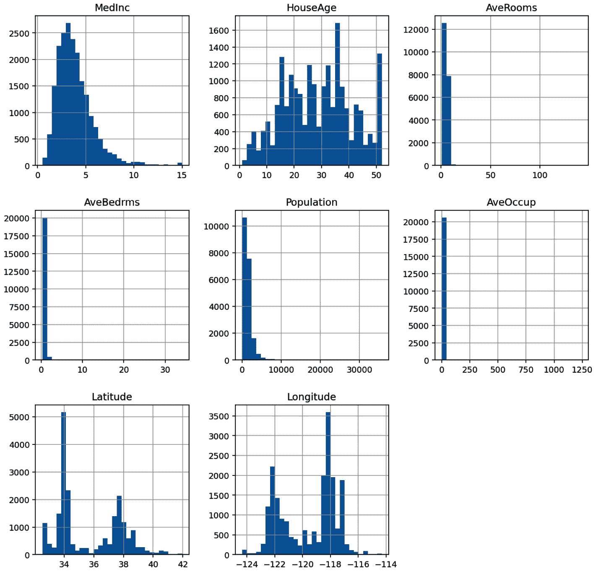
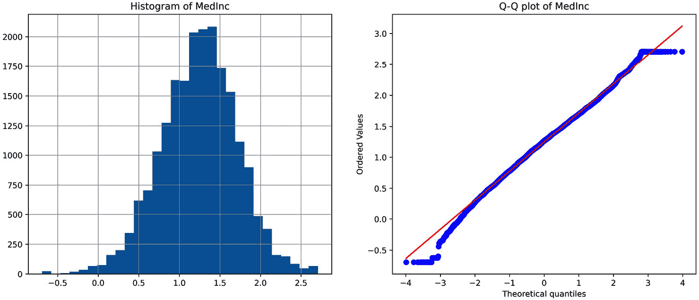
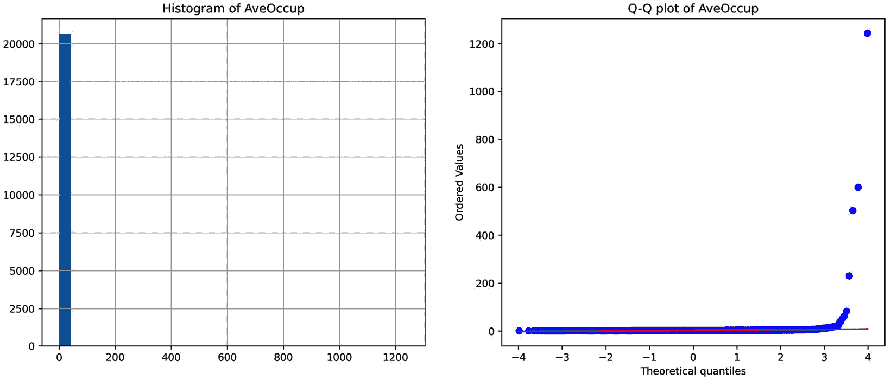
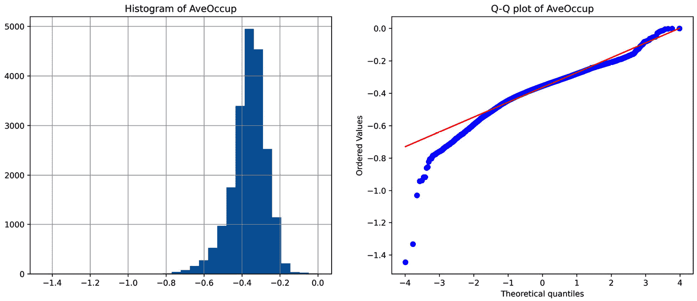
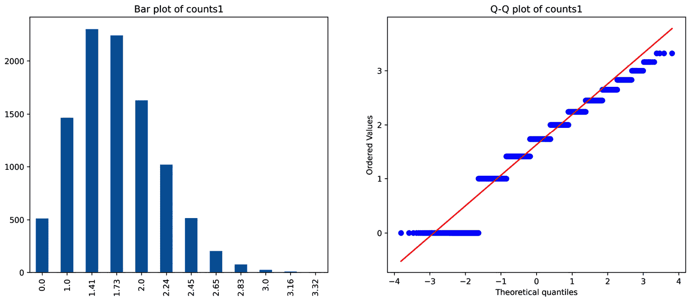
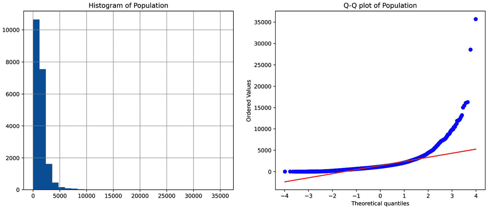
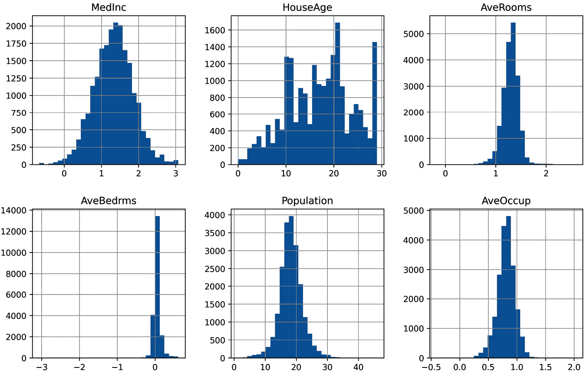

# 第四章：<st c="0">3</st>

# <st c="2">变换数值变量</st>

<st c="34">在数据分析中使用的统计方法对数据做出某些假设。</st> <st c="131">例如，在一般线性模型中，假设因变量（目标）的值是独立的，目标变量与自变量（预测变量）之间存在线性关系，以及残差——即预测值与目标真实值之间的差异——是正态分布且以</st> `<st c="507">0</st>`<st c="508">为中心。当这些假设不成立时，产生的概率陈述可能不准确。</st> <st c="608">为了纠正假设失败并提高模型性能，我们可以在分析之前变换变量。</st> <st c="732">分析</st>

<st c="745">当我们变换一个变量时，我们用该变量的函数来替换其原始值。</st> <st c="841">使用数学函数变换变量有助于减少变量的偏度，提高值的分布范围，有时可以揭示预测变量与目标之间的线性关系和加性关系。</st> <st c="1042">常用的数学变换包括对数、倒数、幂、平方和立方根变换，以及 Box-Cox 和 Yeo-Johnson 变换。</st> <st c="1225">这一系列变换</st> <st c="1253">通常被称为</st> **<st c="1280">方差稳定变换</st>**<st c="1316">。方差稳定变换旨在将变量的分布调整为更对称——即高斯——的形状。</st> <st c="1453">在本章中，我们将讨论何时使用每种变换，然后使用 NumPy、scikit-learn 和 Feature-engine 来实现它们。</st>

<st c="1588">本章包含以下内容：</st> <st c="1615">以下食谱：</st>

+   <st c="1633">使用对数函数变换变量</st>

+   <st c="1684">使用倒数函数变换变量</st>

+   <st c="1736">使用平方根来</st> <st c="1762">变换变量</st>

+   <st c="1781">使用</st> <st c="1788">幂变换</st>

+   <st c="1809">执行</st> <st c="1821">Box-Cox 变换</st><st c="1842">s</st>

+   <st c="1845">执行</st> <st c="1857">Yeo-Johnson 变换</st><st c="1882">s</st>

# <st c="1885">使用对数函数变换变量</st>

<st c="1936">对数函数是处理具有右偏分布（观测值在变量的较低值处累积）的正数据的有力转换。</st> <st c="1964">一个常见的例子是</st> `<st c="2138">收入</st>` <st c="2144">变量，其值在较低工资处有大量累积。</st> <st c="2214">对数转换对变量分布的形状有强烈的影响。</st>

<st c="2305">在这个</st> <st c="2314">菜谱中，我们将使用 NumPy、scikit-learn 和 Feature-engine 执行对数转换。</st> <st c="2412">我们还将创建一个诊断绘图函数来评估转换对变量分布的影响。</st>

## <st c="2534">准备中</st>

<st c="2548">为了评估变量分布并了解转换是否改善了值分布并稳定了方差，我们可以通过直方图和**<st c="2732">分位数-分位数</st>** <st c="2749">(**<st c="2751">Q-Q</st>**<st c="2754">) 图来直观地检查数据。</st> <st c="2764">Q-Q 图帮助我们确定两个</st> <st c="2805">变量是否显示出相似的分布。</st> <st c="2845">在 Q-Q 图中，我们绘制一个变量的分位数与另一个变量的分位数。</st> <st c="2944">如果我们绘制感兴趣变量的分位数与正态分布的预期分位数，那么我们可以确定我们的变量是否也是正态分布的。</st> <st c="3129">如果变量是正态分布的，Q-Q 图中的点将沿着 45 度对角线。</st>

<st c="3234">注意</st>

<st c="3239">分位数是分布中低于某个分数的数据点的值。</st> <st c="3340">因此，第 20 个分位数是分布中 20%的观测值低于且 80%高于该值的点。</st>

## <st c="3467">如何做到这一点...</st>

<st c="3483">让我们首先</st><st c="3491">导入</st> <st c="3496">库并准备好</st> <st c="3518">数据集：</st>

1.  <st c="3555">导入所需的 Python 库</st> <st c="3593">和数据集：</st>

    ```py
     import numpy as np
    import pandas as pd
    import matplotlib.pyplot as plt
    import scipy.stats as stats
    from sklearn.datasets import fetch_california_housing
    ```

1.  <st c="3758">让我们</st> <st c="3764">将加利福尼亚住房数据集加载到一个</st> <st c="3808">pandas DataFrame：</st>

    ```py
     X, y = fetch_california_housing(return_X_y=True,
        as_frame=True)
    ```

1.  <st c="3889">让我们通过绘制直方图来探索数据集中所有变量的分布</st> <st c="3981">使用 pandas:</st>

    ```py
     X.hist(bins=30, figsize=(12, 12))
    plt.show()
    ```

    <st c="4038">在以下输出中，我们可以看到</st> `<st c="4084">MedInc</st>` <st c="4090">变量显示出轻微的右偏斜分布，变量</st><st c="4159">AveRooms</st>` <st c="4167">和</st> `<st c="4172">Population</st>` <st c="4182">严重右偏斜，而</st> `<st c="4217">HouseAge</st>` <st c="4225">变量在其</st> `<st c="4273">范围内</st>` <st c="4277">的值分布得更加均匀：</st>

<st c="4283">图 3</st>



<st c="4684">图 3.1 – 数值变量的分布直方图</st>

1.  <st c="4756">为了</st> <st c="4760">评估</st> <st c="4768">变换对变量分布的影响</st><st c="4830">，我们将创建一个函数，该函数接受 DataFrame 和变量名作为输入，并在 Q-Q 图旁边绘制直方图：</st>

    ```py
     def diagnostic_plots(df, variable):
        plt.figure(figsize=(15,6))
        plt.subplot(1, 2, 1)
        df[variable].hist(bins=30)
        plt.title(f"Histogram of {variable}")
        plt.subplot(1, 2, 2)
        stats.probplot(df[variable], dist="norm",
            plot=plt)
        plt.title(f"Q-Q plot of {variable}")
        plt.show()
    ```

1.  <st c="5221">让我们</st> <st c="5228">用</st> <st c="5236">步骤 4</st> <st c="5302">中的函数绘制</st> `<st c="5257">MedInc</st>` <st c="5263">变量的分布图：</st>

    ```py
     diagnostic_plots(X, "MedInc")
    ```

    <st c="5334">以下输出显示</st> `<st c="5367">MedInc</st>` <st c="5373">具有右偏斜的分布：</st>


<st c="5547">图 3.2 – MedInc 变量的直方图和 Q-Q 图</st>

<st c="5607">现在，让我们使用对数变换来转换数据：</st>

1.  <st c="5657">首先，让我们复制原始 DataFrame：</st>

    ```py
     X_tf = X.copy()
    ```

    <st c="5727">我们已经创建了一个副本，这样我们就可以修改副本中的值，而不是原始 DataFrame 中的值，这对于本食谱的其余部分是必需的。</st>

<st c="5871">注意</st>

<st c="5876">如果我们执行</st> `<st c="5891">X_tf = X</st>` <st c="5899">而不是使用 pandas 的</st> `<st c="5925">copy()</st>`<st c="5931">函数，</st> `<st c="5942">X_tf</st>` <st c="5946">将不会是 DataFrame 的副本；相反，它将是相同数据的另一个视图。</st> <st c="6035">因此，在</st> `<st c="6062">X_tf</st>` <st c="6066">中做出的更改也会反映在</st> `<st c="6088">X</st>` <st c="6089">中。</st>

1.  <st c="6097">让我们</st> <st c="6104">创建一个包含我们想要转换的变量的列表：</st>

    ```py
     vars = ["MedInc", "AveRooms", "AveBedrms",
        "Population"]
    ```

1.  <st c="6219">让我们使用 NumPy 对步骤 7 <st c="6296">中的变量应用对数变换，并将转换后的变量捕获在新 DataFrame 中：</st>

    ```py
     X_tf[vars] = np.log(X[vars])
    ```

<st c="6391">注意</st>

<st c="6396">请记住，对数变换只能应用于严格正变量。</st> <st c="6492">如果变量有零或负值，有时，添加一个常数使这些值变为正是有用的。</st> <st c="6612">我们可以使用</st> `<st c="6645">1</st>` <st c="6647">添加一个常数值，使用</st> `<st c="6653">X_tf[vars] = np.log(X[vars] +</st>` `<st c="6683">1)</st>`<st c="6685">。</st>

1.  <st c="6686">让我们使用</st> *<st c="6785">步骤 4</st>*<st c="6791">中的诊断函数检查变换后</st> `<st c="6719">MedInc</st>` <st c="6725">的分布：</st>

    ```py
     diagnostic_plots(X_tf, "MedInc")
    ```

    <st c="6826">在以下输出中，我们可以看到对数变换返回了一个分布更均匀的变量，在</st> <st c="7011">Q-Q 图</st>中更好地逼近理论正态分布：</st>



<st c="7187">图 3.3 – 对数变换后 MedInc 变量的直方图和 Q-Q 图</st>

<st c="7282">继续</st> <st c="7292">并绘制其他转换变量，以便熟悉对数变换对分布的影响。</st> <st c="7406">。</st>

<st c="7423">现在，让我们</st> <st c="7435">使用</st> `<st c="7477">scikit-learn</st>`<st c="7489">应用对数变换。</st>

1.  <st c="7490">让我们</st> <st c="7497">导入</st> `<st c="7504">FunctionTransformer()</st>`<st c="7525">：</st>

    ```py
     from sklearn.preprocessing import FunctionTransformer
    ```

    <st c="7581">在我们继续之前，我们需要复制原始数据集，就像我们在</st> *<st c="7662">步骤 6</st>*<st c="7668">中所做的那样。</st>

1.  <st c="7669">我们将设置变压器以应用对数并能够将转换后的变量还原到其</st> <st c="7779">原始表示：</st>

    ```py
     transformer = FunctionTransformer(np.log,
        inverse_func=np.exp)
    ```

<st c="7866">注意</st>

<st c="7871">如果我们设置</st> `<st c="7885">FunctionTransformer()</st>` <st c="7906">使用默认参数，</st> `<st c="7935">validate=False</st>`<st c="7949">，我们不需要在转换数据之前拟合变压器。</st> <st c="8018">如果我们设置</st> `<st c="8028">validate</st>` <st c="8036">为</st> `<st c="8040">True</st>`<st c="8044">，变压器将检查输入到</st> `<st c="8095">fit</st>` <st c="8098">方法的</st>数据。</st> <st c="8107">后者在用 DataFrame 拟合变压器时很有用，以便它学习并存储</st> <st c="8207">变量名称。</st>

1.  <st c="8223">让我们将</st><st c="8232">从</st> *<st c="8269">步骤 7</st>*<st c="8275">转换正变量：</st>

    ```py
     X_tf[vars] = transformer.transform(X[vars])
    ```

<st c="8321">注意</st>

<st c="8326">Scikit-learn 转换器返回 NumPy 数组，并默认转换整个 DataFrame。</st> <st c="8420">在这种情况下，我们将数组的输出结果直接赋值给现有的 DataFrame。</st> <st c="8507">我们可以通过</st> `<st c="8553">set_output</st>` <st c="8563">方法更改返回的格式，并且我们可以通过</st> `<st c="8623">ColumnTransformer()</st>`<st c="8642">限制要转换的变量。</st>

<st c="8643">使用</st> *<st c="8718">第 4 步</st>*<st c="8724">中的诊断函数检查转换的结果。</st>

1.  <st c="8725">现在让我们将转换回原始</st> <st c="8778">变量表示：</st>

    ```py
     X_tf[vars] = transformer.inverse_transform(X_tf[vars])
    ```

    <st c="8857">如果你通过执行</st> `<st c="8901">diagnostic_plots(X_tf, "MedInc")</st>`<st c="8933">来检查分布，你应该看到一个与</st> *<st c="8995">第 5 步</st>*<st c="9001">返回的相同的图表。</st>

<st c="9002">注意</st>

<st c="9007">为了给变量添加一个常数值，以防它们不是严格正的，请使用</st> `<st c="9094">transformer = FunctionTransformer(lambda x: np.log(x +</st>` `<st c="9149">1)</st><st c="9151">)</st>`<st c="9153">.</st>

<st c="9154">现在，让我们使用特征-</st><st c="9201">引擎应用对数变换。</st>

1.  <st c="9222">让我们导入</st> <st c="9236">的</st> `<st c="9240">LogTransformer()</st>`<st c="9256">：</st>

    ```py
     from feature_engine.transformation import LogTransformer
    ```

1.  <st c="9315">我们将设置转换器以转换第</st> *<st c="9377">7 步</st>* <st c="9383">的变量，然后拟合转换器到</st> <st c="9416">数据集：</st>

    ```py
     lt = LogTransformer(variables = vars)
    lt.fit(X)
    ```

<st c="9476">注意</st>

<st c="9481">如果</st> `<st c="9489">变量</st>` <st c="9498">参数留为</st> `<st c="9519">None</st>`<st c="9523">，则</st> `<st c="9525">LogTransformer()</st>` <st c="9541">将对在</st> `<st c="9608">fit()</st>`<st c="9613">期间找到的所有数值变量应用对数。或者，我们可以指定要修改的变量，就像我们在</st> *<st c="9686">第 15 步</st>*<st c="9693">中所做的那样。</st>

1.  <st c="9694">最后，让我们</st> <st c="9709">转换</st> <st c="9719">数据：</st>

    ```py
     X_tf = lt.transform(X)
    ```

    `<st c="9752">X_tf</st>` <st c="9757">是</st> `<st c="9775">X</st>` <st c="9776">DataFrame 的一个副本，其中第</st> *<st c="9813">7 步</st>* <st c="9819">的变量已用对数进行转换。</st>

1.  <st c="9855">我们还可以将转换后的变量转换回它们的</st> <st c="9875">原始表示：</st>

    ```py
     X_tf = lt.inverse_transform(X_tf)
    ```

    <st c="9969">如果你检查第</st> *<st c="10023">17 步</st>*<st c="10030">后的变量的分布，它们应该与原始数据的分布相同。</st>

<st c="10087">注意</st>

`<st c="10092">Feature-engine 有一个专门的转换器，在应用对数变换之前向变量添加常数值。</st>` <st c="10229">在本方法的“*<st c="10239">更多内容…</st>*” <st c="10252">部分查看更多详细信息。</st>

## 它是如何工作的<st c="10300">...</st>

在这个方法中，我们使用 NumPy、scikit-learn 和 Feature-engine 对正变量子集应用了对数变换<st c="10316">。</st> <st c="10434">。</st>

为了比较变换对变量分布的影响，我们创建了一个诊断函数来在 Q-Q 图旁边绘制直方图<st c="10453">。</st> <st c="10464">为了创建 Q-Q 图，我们使用了</st> `<st c="10633">scipy.stats.probplot()</st>`<st c="10655">，它绘制了感兴趣变量的分位数在</st> *<st c="10720">y</st>* <st c="10721">轴上与理论正态分布的分位数，我们在</st> *<st c="10850">x</st>* <st c="10851">轴上通过将</st> `<st c="10820">dist</st>` <st c="10824">参数设置为</st> `<st c="10838">norm</st>` <st c="10842">来表示。</st> <st c="10858">我们使用</st> `<st c="10866">matplotlib</st>` <st c="10876">通过将</st> `<st c="10912">plot</st>` <st c="10916">参数设置为</st> `<st c="10927">plt</st>`<st c="10933">来显示图表。</st>

通过使用`<st c="10940">plt.figure()</st>` <st c="10952">和`<st c="10957">figsize</st>`<st c="10964">，我们调整了图表的大小，并通过`<st c="11011">plt.subplot()</st>`<st c="11024">，我们将两个图表组织在</st> `<st c="11056">一</st>` <st c="11059">行</st> `<st c="11069">两</st>` <st c="11072">列中——也就是说，一个图表紧挨着另一个。</st> <st c="11120">`<st c="11139">plt.subplot()</st>` <st c="11152">中的数字分别表示行数、列数和图表在图中的位置。</st> <st c="11261">我们将直方图放在位置 1，将 Q-Q 图放在位置 2——也就是说，左和</st> <st c="11350">右，分别。</st>

为了测试该函数，我们在变换之前为`<st c="11440">MedInc</st>` <st c="11446">变量绘制了直方图和 Q-Q 图，并观察到</st> `<st c="11501">MedInc</st>` <st c="11507">不是正态分布。</st> <st c="11538">大多数观测值位于直方图的左侧，并且在分布两端的 Q-Q 图中，值偏离了 45 度线。</st>

<st c="11687">接下来，使用</st> `<st c="11700">np.log()</st>`<st c="11708">，我们对包含四个正变量的 DataFrame 的一个切片应用了对数。</st> <st c="11793">为了评估变换的效果，我们绘制了变换后</st> `<st c="11894">MedInc</st>` <st c="11900">变量的直方图和 Q-Q 图。</st> <st c="11911">我们观察到，在对数变换后，值在直方图中更加集中，而在 Q-Q 图中，它们仅从 45 度线向分布的末端偏离。</st>

<st c="12118">接下来，我们使用了 scikit-learn 的</st> `<st c="12137">FunctionTransformer()</st>` <st c="12158">，它可以将任何用户定义的函数应用于数据集。</st> <st c="12232">我们将</st> `<st c="12242">np.log()</st>` <st c="12250">作为参数传递以应用对数变换，并使用 NumPy 的</st> `<st c="12316">exp()</st>` <st c="12321">进行逆变换到</st> `<st c="12356">FunctionTransfomer()</st>`<st c="12376">。使用</st> `<st c="12387">transform()</st>` <st c="12398">方法，我们通过对数变换将 DataFrame 中正变量的一个切片进行了变换。</st> <st c="12499">使用</st> `<st c="12504">inverse_transform()</st>`<st c="12523">，我们将变量值还原到它们的</st> <st c="12566">原始表示形式。</st>

<st c="12590">最后，我们使用了 Feature-engine 的</st> `<st c="12625">LogTransformer()</st>` <st c="12641">，并使用</st> `<st c="12703">variables</st>` <st c="12712">参数指定要变换的变量列表。</st> <st c="12723">使用</st> `<st c="12728">fit()</st>`<st c="12733">，变换器检查变量是否为数值且为正，而使用</st> `<st c="12816">transform()</st>`<st c="12827">，它内部应用了</st> `<st c="12840">np.log()</st>` <st c="12848">来变换选定的变量。</st> <st c="12901">使用</st> `<st c="12906">inverse_transform()</st>`<st c="12925">，我们将变换后的变量还原到它们的</st> <st c="12974">原始</st> <st c="12982">表示形式。</st>

## <st c="12999">还有更多……</st>

<st c="13013">Feature-engine 有一个</st> <st c="13034">专门的</st> <st c="13044">变换器，用于在应用对数之前将常数值添加到不是严格正的变量中：</st> `<st c="13161">LogCpTransformer()</st>`<st c="13179">。</st> `<st c="13181">LogCpTransformer()</st>` <st c="13199">可以：</st>

+   <st c="13204">将相同的常数添加到</st> <st c="13230">所有变量</st>

+   <st c="13243">自动识别并添加所需的最小值以使</st> <st c="13314">变量为正</st>

+   <st c="13332">将用户定义的不同值添加到</st> <st c="13377">不同的变量中。</st>

<st c="13397">您可以在本书的 GitHub</st> <st c="13436">仓库中找到</st> `<st c="13436">LogCpTransformer()</st>` <st c="13454">的代码实现：</st> [<st c="13489">https://github.com/PacktPublishing/Python-Feature-Engineering-Cookbook-Third-Edition/blob/main/ch03-variable-transformation/Recipe-1-logarithmic-t</st><st c="13635">ransformation.ipynb</st>](https://github.com/PacktPublishing/Python-Feature-Engineering-Cookbook-Third-Edition/blob/main/ch03-variable-transformation/Recipe-1-logarithmic-transformation.ipynb)

# <st c="13655">使用倒数函数转换变量</st>

<st c="13707">倒数函数</st> <st c="13731">定义为 1/x</st><st c="13749">。当我们有比率时，它通常很有用，即两个变量的除法结果。</st> <st c="13787">这些例子包括</st> **<st c="13876">人口密度</st>** <st c="13894">，即每单位面积的人数，以及我们将在本配方中看到的**<st c="13960">房屋占用率</st>** <st c="13975">，即每户的人数。</st>

<st c="14021">倒数变换在</st> <st c="14036">0</st> <st c="14076">值上未定义，尽管对于负值是定义的，但它主要用于转换</st> <st c="14169">正变量。</st>

<st c="14188">在本配方中，我们将使用</st> `<st c="14259">NumPy</st>`<st c="14264">,</st> `<st c="14266">scikit-learn</st>`<st c="14278">和</st> `<st c="14284">Feature-engine</st>`<st c="14298">来实现倒数变换，并使用其直方图和 Q-Q 图比较其对变量分布的影响。</st>

## <st c="14381">如何操作...</st>

<st c="14397">让我们</st> <st c="14403">首先导入库并准备</st> <st c="14413">数据集：</st>

1.  <st c="14467">导入所需的 Python 库</st> <st c="14505">和数据：</st>

    ```py
     import numpy as np
    import pandas as pd
    import matplotlib.pyplot as plt
    import scipy.stats as stats
    from sklearn.datasets import fetch_california_housing
    ```

1.  <st c="14667">让我们加载</st> <st c="14678">加利福尼亚</st> <st c="14694">住房数据集：</st>

    ```py
     X, y = fetch_california_housing(return_X_y=True,
        as_frame=True)
    ```

1.  <st c="14774">为了评估变量分布，我们将创建一个函数，该函数接受 DataFrame 和变量名作为输入，并在 Q-Q 图旁边绘制直方图：</st>

    ```py
     def diagnostic_plots(df, variable):
        plt.figure(figsize=(15,6))
        plt.subplot(1, 2, 1)
        df[variable].hist(bins=30)
        plt.title(f"Histogram of {variable}")
        plt.subplot(1, 2, 2)
        stats.probplot(df[variable], dist="norm",
            plot=plt)
        plt.title(f"Q-Q plot of {variable}") plt.show()
    ```

1.  <st c="15199">现在，让我们绘制</st> `<st c="15240">AveOccup</st>` <st c="15249">变量的分布，该变量指定了房屋的平均占用情况：</st>

    ```py
     diagnostic_plots(X, "AveOccup")
    ```

    <st c="15343">变量</st> `<st c="15348">AveOccup</st>` <st c="15356">显示了一个非常强的</st> <st c="15385">右偏分布，如下面的输出所示：</st>



<st c="15699">图 3.4 – AveOccup 变量的直方图和 Q-Q 图</st>

<st c="15761">注意</st>

<st c="15766">Th</st><st c="15769">e</st> `<st c="15772">AveOccup</st>` <st c="15780">变量</st> <st c="15789">指的是平均家庭人数 – 也就是说，在某个区域内的人数与房屋数量的比率。</st> <st c="15870">这是一个适合倒数变换的有前途的变量。</st> <st c="15936">您可以通过执行</st> `<st c="16073">data = fetch_california_housing()</st>` <st c="16106">然后</st> <st c="16116">执行</st> `<st c="16119">print(data.DESCR)</st>`<st c="16136">来找到更多关于变量和数据集的详细信息。</st>

<st c="16137">现在，让我们使用 NumPy 应用倒数变换</st> <st c="16185">。</st>

1.  <st c="16196">首先，让我们复制原始 DataFrame，这样我们就可以修改副本中的值，而不是原始数据，这对于接下来的</st> <st c="16283">这个菜谱</st> <st c="16357">是必需的：</st>

    ```py
     X_tf = X.copy()
    ```

<st c="16385">注意</st>

<st c="16390">记住，执行</st> `<st c="16415">X_tf = X</st>` <st c="16423">而不是使用 pandas 的</st> `<st c="16449">copy()</st>` <st c="16455">会创建相同数据的额外视图。</st> <st c="16501">因此，在</st> `<st c="16537">X_tf</st>` <st c="16541">中做出的更改也会反映在</st> `<st c="16564">X</st>` <st c="16565">中</st><st c="16572">。</st>

1.  <st c="16573">让我们</st> <st c="16579">将倒数变换应用到</st> `<st c="16623">AveOccup</st>` <st c="16631">变量上：</st>

    ```py
     X_tf["AveOccup"] = np.reciprocal(X_tf["AveOccup"])
    ```

1.  <st c="16692">让我们使用我们在第 3 步中创建的诊断函数检查变换后的</st> `<st c="16729">AveOccup</st>` <st c="16737">变量分布：</st>

    ```py
     diagnostic_plots(X_tf, "AveOccup")
    ```

<st c="16858">注意</st>

<st c="16863">变换后，</st> `<st c="16890">AveOccup</st>` <st c="16898">现在是某个区域内房屋数量与人口数量的比率 – 也就是说，每</st> <st c="17008">位公民的房屋数量。</st>

<st c="17020">在这里，我们可以看到经过倒数变换后</st> `<st c="17083">AveOccup</st>` <st c="17091">变量分布的显著变化：</st>



<st c="17309">图 3.5 – 经过倒数变换后的 AveOccup 变量的直方图和 Q-Q 图</st><st c="17390">的转换</st><st c="17401"></st>

<st c="17409">现在，让我们使用</st> <st c="17427">scikit-learn</st> <st c="17457">应用倒数变换</st>。

1.  <st c="17475">让我们导入</st> <st c="17489">FunctionTransformer()</st> <st c="17514">：</st>

    ```py
     from sklearn.preprocessing import FunctionTransformer
    ```

1.  <st c="17570">让我们通过传递</st> `<st c="17611">np.reciprocal</st>` <st c="17624">作为参数来设置转换器：</st>

    ```py
     transformer = FunctionTransformer(np.reciprocal)
    ```

<st c="17689">注意</st>

<st c="17694">默认情况下，</st> `<st c="17707">FunctionTransformer()</st>` <st c="17728">在转换数据之前不需要拟合。</st>

1.  <st c="17783">现在，让我们</st> <st c="17795">复制原始数据集并转换变量：</st>

    ```py
     X_tf = X.copy()
    X_tf["AveOccup"] = transformer.transform(
        X["AveOccup"])
    ```

    <st c="17932">您可以使用</st> *<st c="18004">步骤 3</st>*<st c="18010">中的函数来检查转换的效果。</st>

<st c="18011">注意</st>

<st c="18016">倒数函数的逆变换也是倒数函数。</st> <st c="18104">因此，如果您重新应用</st> `<st c="18127">transform()</st>` <st c="18138">到转换后的数据，您将将其还原为其原始表示。</st> <st c="18215">更好的做法是将</st> `<st c="18253">inverse_transform</st>` <st c="18270">参数的</st> `<st c="18288">FunctionTransformer()</st>` <st c="18309">设置为</st> `<st c="18313">np.reciprocal</st>` <st c="18326">。</st>

<st c="18335">现在，让我们使用</st> <st c="18352">倒数转换</st> <st c="18383">和</st> `<st c="18388">feature-engine</st>`<st c="18402">应用。</st>

1.  <st c="18403">让我们导入</st> <st c="18417">的 `<st c="18421">ReciprocalTransformer()</st>`<st c="18444">：</st>

    ```py
     from feature_engine.transformation import ReciprocalTransformer
    ```

1.  <st c="18510">让我们设置转换器以修改</st> `<st c="18554">AveOccup</st>` <st c="18562">变量，并将其拟合到</st> <st c="18591">数据集：</st>

    ```py
     rt = ReciprocalTransformer(variables=»AveOccup»)
    rt.fit(X)
    ```

<st c="18662">注意</st>

<st c="18667">如果将</st> `<st c="18675">变量</st>` <st c="18684">参数设置为</st> `<st c="18704">None</st>`<st c="18708">，转换器将倒数函数应用于数据集中的所有数值变量。</st> <st c="18805">如果某些变量包含一个</st> `<st c="18840">0</st>` <st c="18841">值，转换器将引发一个错误。</st>

1.  <st c="18887">让我们</st> <st c="18893">转换数据集中选择的变量：</st>

    ```py
     X_tf = rt.transform(X)
    ```

    `<st c="18964">ReciprocalTransformer()</st>` <st c="18988">将返回一个包含原始变量的新 pandas DataFrame，其中在</st> *<st c="19091">步骤 12</st>* <st c="19098">中指示的变量通过</st> <st c="19111">以下</st> <st c="19124">倒数函数进行转换。</st>

## <st c="19144">如何工作...</st>

<st c="19160">在这个菜谱中，我们使用了 NumPy、scikit-learn 和 Feature-engine 应用了倒数转换。</st>

<st c="19264">为了评估变量分布，我们使用了函数来绘制一个直方图，旁边是一个 Q-Q 图，这是我们之前在本章的</st> *<st c="19389">如何工作…</st>* <st c="19402">部分中描述的。</st>

<st c="19500">我们绘制了`<st c="19546">AveOccup</st>` <st c="19554">变量的直方图和 Q-Q 图，这显示了严重的右偏分布；其大部分值位于直方图的左侧，并且在 Q-Q 图中偏离了向右端分布的 45 度线。</st>

<st c="19765">为了执行倒数变换，我们将</st> `<st c="19783">np.reciprocal()</st>` <st c="19821">应用于变量。</st> `<st c="19854">变换后，</st>` `<st c="19880">AveOccup</st>`<st c="19888">的值在值范围内分布得更均匀，并且在 Q-Q 图中更接近正态分布的理论分位数。</st>

<st c="20048">接下来，我们使用了</st> `<st c="20063">np.reciprocal()</st>` <st c="20078">与 scikit-learn 的`<st c="20099">FunctionTransformer()</st>`<st c="20120">。`<st c="20126">transform()</st>` <st c="20137">方法将`<st c="20153">np.reciprocal()</st>` <st c="20168">应用于</st> <st c="20172">数据集。</st>

<st c="20184">注意</st>

<st c="20189">为了将</st> `<st c="20216">FunctionTransformer()</st>` <st c="20237">的影响限制在一组变量上，使用</st> `<st c="20271">ColumnTransformer()</st>`<st c="20290">。要将输出更改为 pandas DataFrame，设置转换输出</st> `<st c="20361">为 pandas。</st>

<st c="20371">最后，我们</st> <st c="20383">使用了 Feature-engine 的</st> `<st c="20406">ReciprocalTransformer()</st>` <st c="20429">来特别修改一个变量。</st> <st c="20467">使用</st> `<st c="20472">fit()</st>`<st c="20477">，转换器检查该变量是否为数值型。</st> <st c="20536">使用</st> `<st c="20541">transform()</st>`<st c="20552">，转换器在内部应用了`<st c="20578">np.reciprocal()</st>` <st c="20593">来转换</st> <st c="20622">该变量。</st>

<st c="20635">Feature-engine 的`<st c="20653">ReciprocalTransformer()</st>` <st c="20676">提供了通过`<st c="20777">inverse_transform()</st>` <st c="20796">方法直接将变量恢复到其原始表示的功能。</st>

<st c="20804">注意</st>

<st c="20809">使用 scikit-learn 或 Feature-engine 的转换器，而不是 NumPy 的`<st c="20889">reciprocal()</st>` <st c="20901">函数，允许我们在 scikit-learn 的`<st c="21022">Pipeline</st>` <st c="21030">对象</st> <st c="21038">中应用倒数函数作为特征工程管道的额外步骤。</st>

<st c="21056">`FunctionTransformer()`</st> <st c="21072">和</st> `<st c="21106">ReciprocalTransformer()`</st>` <st c="21129">之间的区别在于，前者可以应用任何用户指定的变换，而后者仅应用倒数函数。</st> `<st c="21254">scikit-learn 默认返回 NumPy 数组，并转换数据集中的所有变量。</st> `<st c="21344">另一方面，Feature-engine 的转换器返回 pandas DataFrame，并且可以在不使用</st> `<st c="21486">额外类</st>` <st c="21471">的情况下修改数据中的变量子集。</st>

# <st c="21505">使用平方根变换变量</st>

<st c="21550">平方根变换，**<st c="21583">√x</st>**<st c="21585">，以及其变体，Anscombe 变换，**<st c="21643">√(x+3/8)</st>**<st c="21651">，以及 Freeman-Tukey 变换，**<st c="21692">√x + √(x+1)</st>**<st c="21703">，都是方差稳定变换，可以将具有泊松分布的变量转换为具有近似标准高斯分布的变量。</st> `<st c="21864">平方根变换是一种幂变换形式，其中指数为</st> **<st c="21951">1/2</st>** <st c="21954">，并且仅对</st> `<st c="21979">正值</st>` <st c="21979">定义。</st>

<st c="21995">泊松分布是一种概率分布，表示事件可能发生的次数。</st> `<st c="22115">换句话说，它是一种计数分布。</st> `<st c="22159">它是右偏斜的，其方差等于其均值。</st> `<st c="22212">可能遵循泊松分布的变量示例包括客户的金融项目数量，例如当前账户或信用卡的数量，车辆中的乘客数量，以及家庭中的居住者数量。</st>

<st c="22462">在这个配方中，我们将使用 NumPy、scikit-learn 和 Feature-engine 实现平方根变换。</st>

## <st c="22572">如何实现...</st>

<st c="22588">我们将</st> <st c="22601">首先创建一个包含两个变量的数据集，这两个变量的值是从</st> `<st c="22672">泊松分布</st>` <st c="22672">中抽取的：</st>

1.  <st c="22693">让我们首先导入必要的库：</st>

    ```py
     import numpy as np import pandas as pd
    import scipy.stats as stats
    ```

1.  <st c="22810">让我们</st> <st c="22817">创建一个包含两个变量的 DataFrame，这两个变量分别从均值为</st> `<st c="22909">2</st>` <st c="22910">和</st> `<st c="22915">3</st>`<st c="22916">的泊松分布中抽取，并且</st> `<st c="22936">10000</st>` <st c="22941">个观测值：</st>

    ```py
     df = pd.DataFrame()
    df["counts1"] = stats.poisson.rvs(mu=3, size=10000)
    df["counts2"] = stats.poisson.rvs(mu=2, size=10000)
    ```

1.  <st c="23079">让我们创建一个函数，它接受一个</st> `<st c="23117">DataFrame</st>` <st c="23139">和一个变量名作为输入，并在 Q-Q 图旁边绘制一个条形图，显示每个值的观测数：</st>

    ```py
     def diagnostic_plots(df, variable):
        plt.figure(figsize=(15,6))
        plt.subplot(1, 2, 1)
        df[variable].value_counts().sort_index(). plot.bar()
        plt.title(f"Histogram of {variable}")
        plt.subplot(1, 2, 2)
        stats.probplot(df[variable], dist="norm",
            plot=plt)
        plt.title(f"Q-Q plot of {variable}")
        plt.show()
    ```

1.  <st c="23537">让我们使用第 3 步中的函数为数据中的一个变量创建条形图和 Q-Q 图：</st>

    ```py
     diagnostic_plots(df, "counts1")
    ```

    <st c="23678">在这里，我们可以看到输出中的泊松分布：</st><st c="23697"></st>


<st c="23866">图 3.6 – counts1 变量的条形图和 Q-Q 图</st><st c="23897"></st>

1.  <st c="23925">现在，让我们</st> `<st c="23937">复制</st>` `<st c="23952">数据集：</st>`

    ```py
     df_tf = df.copy()
    ```

1.  <st c="23982">让我们将平方根转换应用于</st> `<st c="23998">两个变量：</st>`

    ```py
     df_tf[["counts1", "counts2"]] = np.sqrt(
        df[["counts1","counts2"]])
    ```

1.  <st c="24112">让我们将值四舍五入到两位小数，以便更好地可视化：</st>

    ```py
     df_tf[["counts1", "counts2"]] = np.round(
        df_tf[["counts1", "counts2"]], 2)
    ```

1.  <st c="24254">让我们绘制转换后</st> `<st c="24286">counts1</st>` <st c="24293">的分布图：</st>

    ```py
     diagnostic_plots(df_tf, "counts1")
    ```

    <st c="24354">我们看到方差更加</st> **<st c="24369">稳定</st>** <st c="24379">，因为 Q-Q 图中的点更紧密地遵循 45 度对角线：</st>



<st c="24667">图 3.7 – counts1 变量平方根转换后的条形图和 Q-Q 图</st><st c="24734"></st>

<st c="24763">现在，让我们</st> `<st c="24775">应用</st>` `<st c="24796">平方根</st>` `<st c="24812">转换</st>` `<st c="24817">scikit-learn</st>`<st c="24829">。</st>

1.  <st c="24830">让我们导入</st> `<st c="24844">FunctionTransformer()</st>` <st c="24865">并将其设置为执行平方根转换：</st>

    ```py
     from sklearn.preprocessing import FunctionTransformer
    transformer = FunctionTransformer(
        np.sqrt).set_output(transform="pandas")
    ```

<st c="25049">注意</st>

<st c="25054">如果我们想像第 7 步中那样四舍五入值，我们可以使用以下方式设置转换器：</st> `<st c="25145">transformer = FunctionTransformer(func=lambda x:</st>` `<st c="25194">np.round(np.sqrt(x), 2))</st>`<st c="25218">。</st>

1.  <st c="25219">让我们复制数据并转换</st> `<st c="25264">变量：</st>`

    ```py
     df_tf = df.copy()
    df_tf = transformer.transform(df)
    ```

    <st c="25330">像我们在第 8 步中做的那样，检查转换的结果：</st>

    <st c="25403">要使用 Feature-engine 应用平方根，我们使用指数为 0.5 的</st> `<st c="25469">PowerTransformer()</st>` <st c="25487">：</st>

    ```py
    from feature_engine.transformation import PowerTransformer
    root_t = PowerTransformer(exp=1/2)
    ```

1.  <st c="25607">接下来，我们将转换器拟合到</st> `<st c="25640">数据：</st>`

    ```py
     root_t.fit(df)
    ```

<st c="25664">注意</st>

<st c="25669">转换器会自动识别数值变量，我们可以通过执行 `<st c="25770">root_t.variables_</st>`<st c="25787">.</st> 来探索这些变量。</st>

1.  <st c="25788">最后，让我们对数据进行变换：</st> <st c="25814">。</st>

    ```py
     df_tf = root_t.transform(df)
    ```

    `<st c="25852">PowerTransformer()</st>` <st c="25871">返回一个包含变换变量的 panda DataFrame。</st>

## <st c="25931">它是如何工作的…</st>

<st c="25945">在这个步骤中，我们使用了 NumPy、scikit-learn 和 Feature-engine 应用了平方根变换。</st>

<st c="26050">我们使用了 NumPy 的 `<st c="26067">sqrt()</st>` <st c="26073">函数，或者在其内部通过 scikit-learn 的 `<st c="26124">FunctionTransformer()</st>` <st c="26145">来确定变量的平方根。</st> <st c="26187">或者，我们使用了 Feature-engine 的 `<st c="26227">PowerTransformer()</st>`<st c="26245">，将指数设置为 0.5，即平方根函数的指数。</st> <st c="26310">NumPy 直接修改了变量。</st> <st c="26349">scikit-learn 和 Feature-engine 的转换器在调用 `<st c="26442">transform()</st>` <st c="26453">方法时修改了变量。</st>

# <st c="26461">使用幂变换</st>

<st c="26489">幂函数</st> <st c="26506">是遵循以下</st>  <st c="26555"><st c="26562">格式的数学变换，其中 lambda 可以取任何值。</st> <st c="26603">平方和立方根变换是 lambda 分别为 1/2 或 1/3 的幂变换的特殊情况。</st> <st c="26729">挑战在于找到 lambda 参数的值。</st> <st c="26798">Box-Cox 变换，它是幂变换的推广，通过最大似然法找到最优的 lambda 值。</st> <st c="26937">我们将在下面的步骤中讨论 Box-Cox 变换。</st> <st c="27005">在实践中，我们将尝试不同的 lambda 值，并通过视觉检查变量分布来确定哪个提供了最佳的变换。</st> <st c="27156">一般来说，如果数据是右偏斜的——也就是说，如果观测值累积在较低值附近——我们使用小于 1 的 lambda 值，而如果数据是左偏斜的——也就是说，在较高值附近的观测值更多——那么我们使用大于 1 的 lambda 值。</st> <st c="27440">。</st>

<st c="27447">在这个步骤中，我们将使用 NumPy、scikit-learn 和 Feature-engine 执行幂变换。</st>

## <st c="27552">如何操作...</st>

<st c="27568">让我们首先导入</st> <st c="27594">库和准备数据集：</st>

1.  <st c="27638">导入所需的 Python 库和类：</st>

    ```py
     import numpy as np
    import pandas as pd
    from sklearn.datasets import fetch_california_housing
    from sklearn.preprocessing import FunctionTransformer
    from feature_engine.transformation import PowerTransformer
    ```

1.  <st c="27894">让我们将加利福尼亚住房数据集加载到一个</st> <st c="27944">pandas DataFrame 中：</st>

    ```py
     X, y = fetch_california_housing(
        return_X_y=True, as_frame=True)
    ```

1.  <st c="28026">为了评估变量分布，我们将创建一个函数，该函数接受 DataFrame 和变量名作为输入，并在 Q-Q 图旁边绘制直方图：</st> <st c="28115"></st> <st c="28172"></st>

    ```py
     def diagnostic_plots(df, variable):
        plt.figure(figsize=(15,6))
        plt.subplot(1, 2, 1)
        df[variable].hist(bins=30)
        plt.title(f"Histogram of {variable}")
        plt.subplot(1, 2, 2)
        stats.probplot(df[variable], dist="norm",
            plot=plt)
        plt.title(f"Q-Q plot of {variable}")
        plt.show()
    ```

1.  <st c="28451">让我们使用之前的函数绘制</st> `<st c="28487">Population</st>` <st c="28497">变量的分布图：</st>

    ```py
     diagnostic_plots(X, "Population")
    ```

    <st c="28568">在之前命令返回的图表中，我们可以看到</st> `<st c="28633">Population</st>` <st c="28643">严重向右倾斜：</st>



<st c="28903">图 3.8 – 变量 Population 的直方图和</st> <st c="28932">Q-Q 图</st>

<st c="28967">现在，让我们对</st> <st c="28979">MedInc</st> <st c="29015">和</st> `<st c="29026">Population</st>` <st c="29036">变量应用幂变换。</st> <st c="29048">由于两者都向右倾斜，指数小于</st> *<st c="29106">1</st>* <st c="29107">可能会使变量值分布更广。</st>

1.  <st c="29160">让我们将需要变换的变量放入</st> <st c="29205">一个列表中：</st>

    ```py
     variables = ["MedInc", "Population"]
    ```

1.  <st c="29249">让我们复制 DataFrame，然后对从*<st c="29345">步骤 5</st>，* <st c="29352">（其中指数为</st> `<st c="29375">0.3</st>`<st c="29378">）</st>的变量应用幂变换。</st>

    ```py
     X_tf = X.copy()
    X_tf[variables] = np.power(X[variables], 0.3)
    ```

<st c="29442">注意</st>

<st c="29447">使用</st> `<st c="29453">np.power()</st>`<st c="29463">，我们可以通过改变函数第二位指数的值来应用任何幂变换。</st>

1.  <st c="29580">让我们检查</st> `<st c="29629">Population</st>`<st c="29639">的分布变化：</st>

    ```py
     diagnostic_plots(X_tf, "Population")
    ```

    <st c="29678">如之前命令返回的图表所示，</st> `<st c="29735">Population</st>` <st c="29745">现在在值范围内分布更均匀，并且更接近正态分布的量级：</st>


<st c="30015">图 3.9 – 变量 Population 变换后的直方图和 Q-Q 图</st><st c="30069"></st>

<st c="30105">现在，让我们使用 scikit-learn 应用幂变换。</st>

1.  <st c="30164">让我们设置</st> `<st c="30178">FunctionTransformer()</st>` <st c="30199">并使用指数转换，指数为</st> <st c="30245">0.3</st><st c="30251">：</st>

    ```py
     transformer = FunctionTransformer(
        lambda x: np.power(x,0.3))
    ```

1.  <st c="30315">让我们复制 DataFrame 并将变量从</st> *<st c="30384">步骤 5</st>*<st c="30390">转换：</st>

    ```py
     X_tf = X.copy()
    X_tf[variables] = transformer.transform(X[variables])
    ```

    <st c="30462">这就完成了 – 我们现在可以检查变量分布。</st> <st c="30521">最后，让我们使用 Feature-engine 执行指数转换。</st>

1.  <st c="30594">让我们设置</st> `<st c="30608">PowerTransformer()</st>` <st c="30626">并使用指数</st> `<st c="30647">0.3</st>` <st c="30650">来转换变量，从</st> *<st c="30683">步骤 5</st>*<st c="30689">。然后，我们将它拟合到</st> <st c="30713">数据：</st>

    ```py
     power_t = PowerTransformer(variables=variables,
        exp=0.3)
    power_t.fit(X)
    ```

<st c="30794">注意</st>

<st c="30799">如果我们没有定义要转换的变量，</st> `<st c="30847">PowerTransformer()</st>` <st c="30865">将选择并转换 DataFrame 中的所有数值变量。</st>

1.  <st c="30940">最后，让我们转换这些</st> <st c="30972">两个变量：</st>

    ```py
     X_tf = power_t.transform(X)
    ```

<st c="31014">该转换器</st> <st c="31031">返回一个包含原始变量的 DataFrame，其中在</st> *<st c="31122">步骤 5</st>* <st c="31129">中指定的两个变量已使用转换函数进行转换。</st>

## <st c="31171">它是如何工作的...</st>

<st c="31187">在这个菜谱中，我们使用了 NumPy、scikit-learn 和 Feature-engine 来应用幂转换。</st>

<st c="31283">要使用 NumPy 应用幂函数，我们对包含要转换的变量的数据集切片应用了</st> `<st c="31336">power()</st>` <st c="31343">方法。</st> <st c="31418">要使用 scikit-learn 应用此转换，我们设置了</st> `<st c="31480">FunctionTransformer()</st>`<st c="31501">，并在一个</st> `<st c="31527">lambda</st>` <st c="31533">函数中使用</st> `<st c="31550">0.</st><st c="31552">3</st>` <st c="31554">作为指数。</st> <st c="31572">要使用 Feature-engine 应用幂函数，我们设置了</st> `<st c="31632">PowerTransformer()</st>` <st c="31650">，其中包含要转换的变量列表和指数</st> <st c="31709">0.3</st><st c="31715">。</st>

<st c="31716">当我们调用</st> `<st c="31808">transform()</st>` <st c="31819">方法时，scikit-learn 和 Feature-engine 转换器应用了转换。</st> <st c="31828">scikit-learn 的</st> `<st c="31843">FunctionTransformer()</st>` <st c="31864">修改整个数据集，并默认返回 NumPy 数组。</st> <st c="31930">要返回 pandas DataFrames，我们需要将转换输出设置为 pandas，并且要应用转换到特定变量，我们可以使用</st> `<st c="32072">ColumnTransformer()</st>`<st c="32091">。另一方面，Feature-engine 的</st> `<st c="32110">PowerTransformer()</st>`<st c="32128">可以将转换应用于数据集的子集，默认返回 pandas DataFrames</st><st c="32247">。</st>

# <st c="32258">执行 Box-Cox 转换</st>

<st c="32293">Box-Cox 转换</st> <st c="32320">是幂变换家族的推广，定义为以下：</st>


<st c="32450">在这里，</st> *<st c="32456">y</st>* <st c="32457">是变量，</st> *<st c="32478">λ</st>* <st c="32479">是转换参数。</st> <st c="32513">它包括变换的重要特殊情况，例如未转换的</st> *<st c="32591">(λ = 1)</st>*<st c="32598">，对数</st> *<st c="32614">(λ = 0)</st>*<st c="32621">，倒数</st> *<st c="32638">(λ = - 1)</st>*<st c="32647">，平方根（当</st> *<st c="32671">λ</st>* *<st c="32672">= 0.5</st>*<st c="32677">时，它应用了一个缩放和移位的平方根函数版本），以及立方根。</st>

<st c="32767">Box-Cox 转换评估了多个</st> *<st c="32823">λ</st>* <st c="32824">值，使用最大似然估计并选择返回最佳转换的</st> *<st c="32870">λ</st>* <st c="32871">参数。</st>

<st c="32919">在本教程中，我们将使用 scikit-learn 和 Feature-engine 执行 Box-Cox 转换</st> <st c="32998">a</st><st c="32999">nd Feature-engine.</st>

<st c="33017">注意</st>

<st c="33022">Box-Cox 转换只能用于正变量。</st> <st c="33090">如果你的变量有负值，尝试使用下一道菜谱中描述的 Yeo-Johnson 转换，</st> *<st c="33205">执行 Yeo-Johnson 转换</st>*<st c="33242">。或者，你可以在转换之前通过添加一个常数来移动变量的分布。</st>

## <st c="33348">如何做到这一点...</st>

<st c="33364">让我们首先导入必要的库并准备好数据集：</st> <st c="33430">数据集：</st>

1.  <st c="33444">导入所需的 Python 库</st> <st c="33482">和类：</st>

    ```py
     import numpy as np
    import pandas as pd
    import scipy.stats as stats
    from sklearn.datasets import fetch_california_housing
    from sklearn.preprocessing import PowerTransformer
    from feature_engine.transformation import BoxCoxTransformer
    ```

1.  <st c="33726">让我们将加利福尼亚住房数据集加载到一个</st> <st c="33776">pandas DataFrame：</st>

    ```py
     X, y = fetch_california_housing(
        return_X_y=True, as_frame=True)
    ```

1.  <st c="33858">让我们</st> <st c="33864">删除</st> `<st c="33874">纬度</st>` <st c="33882">和</st> `<st c="33887">经度</st>` <st c="33896">变量：</st>

    ```py
     X.drop(labels=["Latitude", "Longitude"], axis=1,
        inplace=True)
    ```

1.  <st c="33970">让我们用直方图检查变量分布：</st> <st c="34012">直方图：</st>

    ```py
     X.hist(bins=30, figsize=(12, 12), layout=(3, 3))
    plt.show()
    ```

    <st c="34088">在以下输出中，我们可以看到</st> `<st c="34134">中位数收入</st>` <st c="34140">变量显示出轻微的右偏分布，</st> `<st c="34208">平均房间数</st>` <st c="34216">和</st> `<st c="34221">人口</st>` <st c="34231">变量严重右偏，而</st> `<st c="34266">房屋年龄</st>` <st c="34274">变量在其范围内显示出值的均匀分布：</st>


<st c="34643">图 3.10 – 数值变量的直方图</st>

1.  <st c="34694">让我们</st> <st c="34700">将变量名捕获到一个列表中，因为我们将在下一步中使用这些变量：</st> <st c="34769">以下步骤：</st>

    ```py
     variables = list(X.columns)
    ```

1.  <st c="34813">让我们创建一个函数，该函数将为数据中的所有变量绘制 Q-Q 图，每行三个图：</st> <st c="34920">每个图：</st>

    ```py
     def make_qqplot(df):
        plt.figure(figsize=(10, 6),
            constrained_layout=True)
        for i in range(6):
            # location in figure
            ax = plt.subplot(2, 3, i + 1)
            # variable to plot
            var = variables[i]
            # q-q plot
            stats.probplot((df[var]), dist="norm",
                plot=plt)
            # add variable name as title
            ax.set_title(var)
        plt.show()
    ```

1.  <st c="35231">现在，让我们使用前面的函数显示 Q-Q 图：</st> <st c="35275">函数：</st>

    ```py
     make_qqplot(X)
    ```

    <st c="35309">通过查看以下图表，我们可以证实变量不是正态分布的：</st>


<st c="35950">图 3.11 – 数值变量的 Q-Q 图</st>

<st c="36000">接下来，让我们使用 scikit-learn 执行 Box-Cox 转换：</st>

1.  <st c="36069">让我们设置</st> `<st c="36083">PowerTransformer()</st>` <st c="36101">以应用 Box-Cox 转换并将其拟合到数据中，以便找到最优的</st> *<st c="36190">λ</st> <st c="36191">参数：</st>

    ```py
     transformer = PowerTransformer(
        method="box-cox", standardize=False,
    ).set_output(transform="pandas")
    transformer.fit(X)
    ```

<st c="36323">注意</st>

<st c="36328">为了避免数据泄露，</st> *<st c="36356">λ</st>* <st c="36357">参数应该从训练集中学习，然后用于转换训练集和测试集。</st> <st c="36457">因此，在拟合 `<st c="36532">PowerTransformer()</st>`<st c="36550">之前，请记住将您的数据分为训练集和测试集。</st>

1.  <st c="36551">现在，让我们转换</st> <st c="36573">数据集：</st>

    ```py
     X_tf = transformer.transform(X)
    ```

<st c="36617">注意</st>

<st c="36622">scikit-learn 的</st> `<st c="36638">PowerTransformer()</st>` <st c="36656">将学习到的 lambda 值存储在其</st> `<st c="36691">lambdas_</st>` <st c="36699">属性中，您可以通过执行</st> `<st c="36736">transformer.lambdas_</st>`<st c="36766">.</st>来显示它。

1.  <st c="36767">让我们使用直方图检查转换数据的分布：</st>

    ```py
     X_tf.hist(bins=30, figsize=(12, 12), layout=(3, 3))
    plt.show()
    ```

    <st c="36903">在以下输出中，我们可以看到变量的</st> <st c="36959">值在其范围内分布得更均匀：</st>



<st c="37302">图 3.12 – 变量变换后的直方图</st>

1.  <st c="37368">现在，让我们返回转换变量的</st> <st c="37387">Q-Q 图：</st>

    ```py
     make_qqplot(X_tf)
    ```

    <st c="37444">在以下输出中，我们可以看到，经过转换后，变量更接近理论正态分布：</st><st c="37532">:</st>


<st c="38093">图 3.13 – 变量变换后的 Q-Q 图</st><st c="38118">:</st>

<st c="38159">现在，让我们使用 Feature-engine 实现 Box-Cox 转换：</st>

1.  <st c="38228">让我们设置</st> `<st c="38242">BoxCoxTransformer()</st>` <st c="38261">以转换数据集中的所有变量，并将其拟合到</st> <st c="38327">数据：</st>

    ```py
     bct = BoxCoxTransformer()
    bct.fit(X)
    ```

1.  <st c="38373">现在，让我们继续转换</st> <st c="38408">变量：</st>

    ```py
     X_tf = bct.transform(X)
    ```

    <st c="38446">转换返回一个包含</st> <st c="38504">修改后的变量</st> <st c="38508">的 pandas DataFrame。</st>

<st c="38527">注意</st>

`<st c="38532">scikit-learn 的 PowerTransformer()</st>` <st c="38551">将转换整个数据集。</st> <st c="38605">另一方面，</st> `<st c="38624">Feature-engine 的 BoxCoxTransformer()</st>` <st c="38643">可以修改数据集的子集，如果我们将其名称列表传递给设置转换器时的</st> `<st c="38742">variables</st>` <st c="38751">参数。</st> <st c="38795">如果将</st> `<st c="38802">variables</st>` <st c="38811">参数设置为</st> `<st c="38832">None</st>`<st c="38836">，转换器将在 `<st c="38898">fit()</st>`<st c="38905">过程中转换所有遇到的数值变量。</st>

1.  <st c="38911">Box-Cox 变换的最优 lambda 值存储在</st> `<st c="38981">lambda_dict_</st>` <st c="38993">属性中。</st> <st c="39005">让我们</st> <st c="39011">检查它们：</st>

    ```py
     bct.lambda_dict_
    ```

    <st c="39041">上一条命令的输出如下：</st> <st c="39080">以下：</st>

    ```py
    <st c="39094">{'MedInc': 0.09085449361507383,</st>
    <st c="39126">'HouseAge': 0.8093980940712507,</st>
    <st c="39158">'AveRooms': -0.2980048976549959,</st>
    <st c="39191">'AveBedrms': -1.6290002625859639,</st>
    <st c="39225">'Population': 0.235767</st><st c="39248">57812051324,</st>
    <st c="39261">'AveOccup': -0.4763032278973292}</st>
    ```

<st c="39294">现在您知道了如何使用两个不同的 Python 库实现 Box-Cox 变换。</st>

## <st c="39389">它是如何工作的...</st>

<st c="39405">scikit-learn 的</st> `<st c="39421">PowerTransformer()</st>` <st c="39439">可以应用 Box-Cox 和 Yeo-Johnson 变换，因此我们在设置变换器时通过传递 b</st>`<st c="39579">ox-cox</st>` <st c="39586">字符串来指定了变换。</st> <st c="39595">接下来，我们将变换器拟合到数据中，以便变换器学习每个变量的最优 lambda 值。</st> <st c="39707">学习到的 lambda 值存储在</st> `<st c="39746">lambdas_</st>` <st c="39754">属性中。</st> <st c="39766">最后，我们使用了</st> `<st c="39787">transform()</st>` <st c="39798">方法来变换</st> <st c="39819">变量。</st>

<st c="39833">注意</st>

<st c="39838">记住，要返回 DataFrames 而不是数组，您需要通过</st> `<st c="39946">set_output()</st>` <st c="39958">方法指定变换输出。</st> <st c="39967">您可以通过使用</st> `<st c="40031">the</st>` <st c="40035">ColumnTransformer()</st>`<st c="40054">将变换应用于值的一个子集。</st>

<st c="40055">最后，我们使用 Feature-engine 应用了 Box-Cox 变换。</st> <st c="40125">我们初始化了</st> `<st c="40140">BoxCoxTransformer()</st>`<st c="40159">，将参数</st> `<st c="40168">variables</st>` <st c="40192">设置为</st> `<st c="40201">None</st>`<st c="40205">。因此，变换器在</st> `<st c="40299">fit()</st>`<st c="40304">过程中自动找到了数据中的数值变量。</st> 我们将变换器拟合到数据中，以便它学习每个变量的最优 lambda 值，这些值存储在</st> `<st c="40415">lambda_dict_</st>`<st c="40427">中，并使用</st> `<st c="40469">transform()</st>` <st c="40480">方法变换变量。</st> <st c="40489">Feature-engine 的</st> `<st c="40506">BoxCoxTransformer()</st>` <st c="40525">可以接受整个 DataFrame 作为输入，并且它只修改了</st> <st c="40557">选定的变量。</st>

## <st c="40613">还有更多...</st>

<st c="40627">我们可以使用 SciPy 库应用 Box-Cox 转换。</st> <st c="40692">有关代码实现，请访问本书的 GitHub</st> <st c="40744">存储库：</st> [<st c="40756">https://github.com/PacktPublishing/Python-Feature-Engineering-Cookbook-Third-Edition/blob/main/ch03-variabl</st><st c="40863">e-transformation/Recipe-5-Box-Cox-transformation.ipynb</st>](https://github.com/PacktPublishing/Python-Feature-Engineering-Cookbook-Third-Edition/blob/main/ch03-variable-transformation/Recipe-5-Box-Cox-transformation.ipynb)

# <st c="40918">执行 Yeo-Johnson 转换</st>

<st c="40957">The</st> <st c="40962">Yeo-Johnson 转换是 Box-Cox 转换的扩展，不再局限于正值。</st> <st c="41085">换句话说，Yeo-Johnson 转换可以用于具有零值和负值的变量，以及正值。</st> <st c="41216">这些转换的定义如下：</st>

+   <st c="41261"><st c="41274">; 如果 λ ≠ 0 且 X >= 0</st></st>

+   <st c="41250">ln(X + 1); 如果 λ = 0 且 X >= 0</st>

+   <st c="41327"><st c="41329">; 如果 λ ≠ 2 且 X < 0</st></st>

+   <st c="41349">-ln(-X + 1); 如果 λ = 2 且 X < 0</st>

<st c="41381">当</st> <st c="41391">变量只有正值时，Yeo-Johnson 转换类似于变量加一的 Box-Cox 转换。</st> <st c="41523">如果变量只有负值，那么 Yeo-Johnson 转换类似于变量负值加一的 Box-Cox 转换，其幂为 *<st c="41694">2- λ</st>*<st c="41698">。如果变量既有正值又有负值，Yeo-Johnson 转换将对正负值应用不同的幂。</st>

<st c="41851">在这个菜谱中，我们将使用 scikit-learn 和 Feature-engine 执行 Yeo-Johnson 转换。</st>

## <st c="41956">如何操作...</st>

<st c="41972">让我们首先</st> <st c="41984">导入必要的库并准备</st> <st c="42038">数据集：</st>

1.  `<st c="42052">导入所需的 Python 库</st>` `<st c="42090">和类：</st>`

    ```py
     import numpy as np import pandas as pd
    import scipy.stats as stats
    from sklearn.datasets import fetch_california_housing
    from sklearn.preprocessing import PowerTransformer
    from feature_engine.transformation import YeoJohnsonTransformer
    ```

1.  `<st c="42338">让我们将加利福尼亚住房数据集加载到 pandas DataFrame 中，然后删除</st>` `<st c="42423">纬度</st>` `<st c="42431">和</st>` `<st c="42436">经度</st>` `<st c="42445">变量：</st>`

    ```py
     X, y = fetch_california_housing(
        return_X_y=True, as_frame=True)
    X.drop(labels=[«Latitude», «Longitude»], axis=1,
        inplace=True)
    ```

`<st c="42584">注意</st>`

`<st c="42589">我们可以使用直方图和 Q-Q 图来评估变量分布，就像我们在</st>` *<st c="42676">步骤 4</st>` `<st c="42683">到</st>` *<st c="42687">步骤 7</st>` `<st c="42688">的</st>` *<st c="42696">执行 Box-Cox 变换</st>` `<st c="42715">食谱</st>` `<st c="42730">中做的那样。</st>`

`<st c="42738">现在，让我们</st>` `<st c="42750">使用 scikit-learn 应用 Yeo-Johnson 变换：</st>`

1.  `<st c="42805">让我们使用</st>` `<st c="42819">PowerTransformer()</st>` `<st c="42837">和</st>` `<st c="42847">yeo-johnson</st>` `<st c="42858">变换</st>` `<st c="42847">设置：</st>`

    ```py
     transformer = PowerTransformer(
        method="yeo-johnson", standardize=False,
    ).set_output(transform="pandas")
    ```

1.  `<st c="42981">让我们</st>` `<st c="42988">将转换器拟合到</st>` `<st c="43011">数据：</st>`

    ```py
     transformer.fit(X)
    ```

`<st c="43039">注意</st>`

`<st c="43044">*<st c="43049">λ</st>* 参数应该从训练集中学习，然后用于转换训练集和测试集。</st>` `<st c="43150">因此，在拟合</st>` `<st c="43227">PowerTransformer()</st>` `<st c="43245">之前，请记住将您的数据分为训练集和测试集。</st>`

1.  `<st c="43246">现在，让我们转换</st>` `<st c="43268">数据集：</st>`

    ```py
     X_tf = transformer.transform(X)
    ```

`<st c="43312">注意</st>`

`<st c="43317">PowerTransformer()</st>` `<st c="43336">将学习到的参数存储在其</st>` `<st c="43374">lambda_</st>` `<st c="43381">属性中，您可以通过执行</st>` `<st c="43417">transformer.lambdas_</st>` `<st c="43447">来返回它。</st>`

1.  `<st c="43448">让我们使用直方图检查转换数据的分布：</st>` `<st c="43505">：</st>`

    ```py
     X_tf.hist(bins=30, figsize=(12, 12), layout=(3, 3))
    plt.show()
    ```

    `<st c="43584">在以下输出中，我们可以看到变量的值在其范围内分布得更均匀：</st>` `<st c="43678">：</st>`


`<st c="43883">图 3.14 – yeo-Johnson 变换后变量的直方图</st>`

`<st c="43961">最后，让我们使用 Feature-engine 实现 Yeo-Johnson 变换：</st>` `<st c="43986">：</st>`

1.  `<st c="44038">让我们设置</st>` `<st c="44043">YeoJohnsonTransformer()</st>` `<st c="44076">来转换所有数值变量，然后将其拟合到</st>` `<st c="44133">数据：</st>`

    ```py
     yjt = YeoJohnsonTransformer()
    yjt.fit(X)
    ```

`<st c="44183">注意</st>`

如果将`<st c="44188">变量</st>` `<st c="44196">参数</st>` `<st c="44205">设置为</st>` `<st c="44230">None</st>` `<st c="44234">，转换器将选择并转换数据集中所有数值变量。</st>` `<st c="44319">或者，我们可以传递一个列表来修改变量的名称。</st>

<st c="44393">与 scikit-learn 中的</st> `<st c="44406">PowerTransformer()</st>` <st c="44424">相比，Feature-engine 的转换器可以将整个 DataFrame 作为</st> `<st c="44525">fit()</st>` <st c="44530">和</st> `<st c="44535">transform()</st>` <st c="44546">方法的参数，并且它只会修改</st> <st c="44588">选定的变量。</st>

1.  <st c="44607">让我们转换</st> <st c="44623">变量：</st>

    ```py
     X_tf = yjt.transform(X)
    ```

1.  `<st c="44662">YeoJohnsonTransformer()</st>` <st c="44686">将每个变量的最佳参数存储在其</st> `<st c="44734">lambda_dict_</st>` <st c="44746">属性中，我们可以如下显示：</st>

    ```py
     yjt.lambda_dict_
    ```

    <st c="44807">前一个命令返回以下字典：</st> <st c="44841">以下字典：</st>

    ```py
    <st c="44862">{'MedInc': -0.1985098937827175,</st>
    <st c="44894">'HouseAge': 0.8081480895997063,</st>
    <st c="44926">'AveRooms': -0.5536698033957893,</st>
    <st c="44959">'AveBedrms': -4.3940822236920365,</st>
    <st c="44993">'Population': 0.2335</st><st c="45014">2363517075606,</st>
    <st c="45029">'AveOccup': -0.9013456270549428}</st>
    ```

<st c="45062">现在你知道了</st> <st c="45075">如何使用两个不同的开源库实现 Yeo-John</st><st c="45105">son 变换。</st>

## <st c="45166">它是如何工作的...</st>

<st c="45182">在这个菜谱中，我们使用了</st> `<st c="45247">scikit-learn</st>` <st c="45259">和</st> `<st c="45264">Feature-engine</st>`<st c="45278">实现了 Yeo-Johnson 变换。</st>

`<st c="45279">scikit-learn</st>`<st c="45292">的</st> `<st c="45296">PowerTransformer()</st>` <st c="45314">可以应用 Box-Cox 和 Yeo-Johnson 变换，因此我们使用</st> `<st c="45415">yeo-johnson</st>` <st c="45426">字符串指定了变换。</st> <st c="45435">标准化的参数允许我们确定是否想要标准化（缩放）变换后的值。</st> <st c="45549">接下来，我们将转换器拟合到 DataFrame 中，以便它学习每个变量的最佳 lambda 值。</st> `<st c="45653">PowerTransformer()</st>` <st c="45671">将学习到的 lambda 值存储在其</st> `<st c="45706">lambdas_</st>` <st c="45714">属性中。</st> <st c="45726">最后，我们使用了</st> `<st c="45747">transform()</st>` <st c="45758">方法来返回变换后的变量。</st> <st c="45803">我们将变换输出设置为</st> `<st c="45834">pandas</st>` <st c="45840">在变换后返回 DataFrames。</st>

之后，我们使用 Feature-engine 应用了 Yeo-Johnson 转换。<st c="45974">我们设置了</st> `<st c="45974">YeoJohnsonTransformer()</st>` <st c="45997">，以便它在`fit()`<st c="46056">过程中转换所有数值变量。</st> 我们将转换器拟合到数据中，使其学习每个变量的最佳 lambda 值，这些值存储在`<st c="46175">lambda_dict_</st>`<st c="46187">中，并最终使用`<st c="46237">transform()</st>` <st c="46248">方法转换变量。</st> `<st c="46257">Feature-engine 的</st>` `<st c="46274">YeoJohnnsonTransformer()</st>` <st c="46298">可以接受整个 DataFrame 作为输入，但它只会转换选定的变量。</st>

## <st c="46390">还有更多...</st>

<st c="46404">我们还可以使用 SciPy 库应用 Yeo-Johnson 转换。</st> <st c="46473">有关代码实现，请访问本书的 GitHub 存储库：</st> [<st c="46537">https://github.com/PacktPublishing/Python-Feature-Engineering-Cookbook-Second-Edition/blob/main/ch03-variable-transformation/Recipe-6-Yeo-Johnson-transformation.ipynb</st>](https://github.com/PacktPublishing/Python-Feature-Engineering-Cookbook-Second-Edition/blob/main/ch03-variable-transformation/Recipe-6-Yeo-Johnson-transformation.ipynb)
