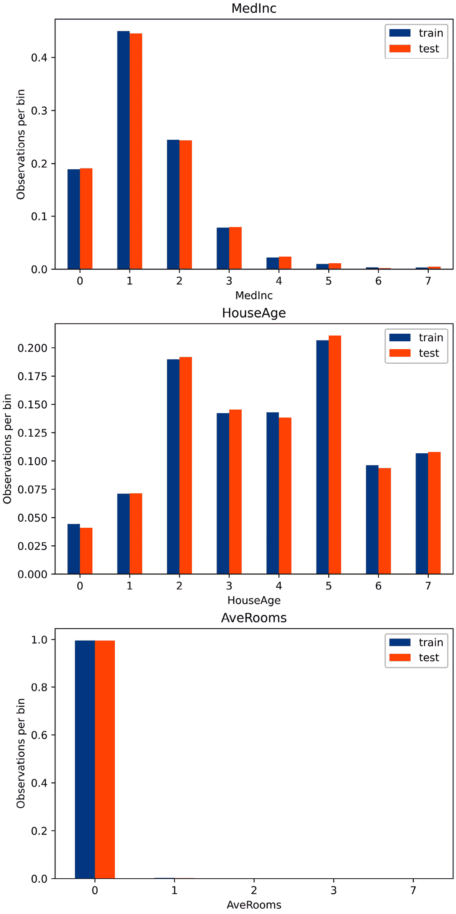

# <st c="0">4</st>

# <st c="2">执行变量离散化</st>

<st c="36">离散化是将</st> <st c="59">通过创建一系列连续的区间将连续变量转换为离散特征的过程，也</st> <st c="175">称为</st> **<st c="182">bins</st>**<st c="186">，这些区间跨越了变量值的范围。</st> <st c="233">随后，这些区间被视为</st> <st c="278">分类数据。</st>

<st c="295">许多机器学习模型，例如决策树和朴素贝叶斯，与离散属性配合工作效果更好。</st> <st c="404">实际上，基于决策树的模型是根据属性上的离散划分来做出决策的。</st> <st c="505">在归纳过程中，决策树评估所有可能的特征值以找到最佳的切割点。</st> <st c="605">因此，特征值越多，树的归纳时间就越长。</st> <st c="695">从这个意义上说，离散化可以减少模型训练所需的时间。</st> <st c="763">模型。</st>

<st c="774">离散化还有额外的优势。</st> <st c="817">数据被减少和简化；离散特征更容易被领域专家理解。</st> <st c="914">离散化可以改变偏斜变量的分布；当按等频对区间内的观测值进行排序时，值在范围内分布得更均匀。</st> <st c="1097">此外，离散化可以通过将异常值放置在较低或较高的区间中，与分布的剩余**<st c="1239">内点</st>** <st c="1245">值一起，最小化它们的影响。</st> <st c="1274">总的来说，离散化减少了数据并简化了数据，使学习过程更快，并可能产生更</st> <st c="1392">准确的结果。</st>

<st c="1409">离散化也可能导致信息丢失，例如，通过将强烈关联不同类别或目标值的值组合到同一个区间中。</st> <st c="1586">因此，离散化算法的目标是找到最小数量的区间，同时不造成显著的信息丢失。</st> <st c="1731">在实践中，许多离散化过程需要用户输入将值排序到的区间数量。</st> <st c="1863">然后，算法的任务是找到这些区间的切割点。</st> <st c="1941">在这些过程中，我们发现最广泛使用的等宽和等频离散化方法。</st> <st c="2050">基于决策树的离散化方法，否则，能够找到最优的分区数量，以及</st> <st c="2175">切割点。</st>

离散化过程可以分为**监督****的**和**非监督**的**。非监督离散化方法仅使用变量的分布来确定连续箱的界限。</st> <st c="2261">另一方面，监督方法使用目标信息来创建**区间**。</st>

在本章中，我们将讨论在成熟的开源库中广泛使用的监督和非监督离散化过程。</st> <st c="2626">在这些过程中，我们将涵盖等宽、等频率、任意、k-means 和基于决策树的离散化。</st> <st c="2743">更详细的方法，如 ChiMerge 和 CAIM，超出了本章的范围，因为它们的实现尚未开源。</st>

本章包含以下**食谱**：

+   执行**等宽离散化**

+   实现等**频率**离散化

+   将变量**离散化**到**任意区间**

+   使用**k-means 聚类**进行离散化

+   实现特征**二值化**

+   使用决策树进行**离散化**

# **技术要求**

在本章中，我们将使用数值计算库**`pandas`**、**`numpy`**、**`matplotlib`**、**`scikit-learn`**和**`feature-engine`**。我们还将使用**`yellowbrick`** Python 开源库，您可以使用**`pip`**安装它：</st>

```py
 pip install yellowbrick
```

更多关于**`yellowbrick`**的详细信息，请访问以下**文档**：

[`www.scikit-yb.org/en/latest/index.html`](https://www.scikit-yb.org/en/latest/index.html)

# 执行**等宽离散化**

**等宽**离散化**包括将变量的观察值范围划分为**k****等宽的区间，其中**k****由用户提供。</st> <st c="3738">变量 X 的区间宽度由以下公式给出：</st> <st c="3815">以下公式：</st><st c="3827">g:</st>

![<math xmlns="http://www.w3.org/1998/Math/MathML" display="block"><mrow><mrow><mi mathvariant="bold-italic">W</mi><mi mathvariant="bold-italic">i</mi><mi mathvariant="bold-italic">d</mi><mi mathvariant="bold-italic">t</mi><mi mathvariant="bold-italic">h</mi><mo>=</mo><mfrac><mrow><mi mathvariant="bold-italic">M</mi><mi mathvariant="bold-italic">a</mi><mi mathvariant="bold-italic">x</mi><mfenced open="(" close=")"><mi mathvariant="bold-italic">X</mi></mfenced><mo>−</mo><mi mathvariant="bold-italic">M</mi><mi mathvariant="bold-italic">i</mi><mi mathvariant="bold-italic">n</mi><mo>(</mo><mi mathvariant="bold-italic">X</mi><mo>)</mo></mrow><mi mathvariant="bold-italic">k</mi></mfrac></mrow></mrow></math>](img/20.png)

<st c="3860">然后，如果变量的值在 0 到 100 之间变化，我们可以创建五个箱子，如下所示：</st> *<st c="3955">宽度 = (100-0) / 5 = 20</st>*<st c="3979">。箱子将是 0-20，20-40，40-60 和 80-100。</st> <st c="4030">第一个和最后一个箱子（0-20 和 80-100）可以通过将限制扩展到负无穷和正无穷来扩展，以容纳小于 0 或大于 100 的值。</st>

<st c="4197">在这个配方中，我们将使用</st> `<st c="4265">pandas</st>`<st c="4271">，`<st c="4273">scikit-learn</st>`<st c="4285">，`<st c="4287">和`<st c="4291">特征工程</st>`<st c="4303">来执行等宽离散化。</st>

## <st c="4307">如何操作...</st>

<st c="4323">首先，让我们导入必要的 Python 库并准备好</st> <st c="4388">数据集：</st>

1.  <st c="4402">让我们导入所需的库和函数：</st>

    ```py
     import numpy as np
    import pandas as pd
    import matplotlib.pyplot as plt
    from sklearn.datasets import fetch_california_housing
    from sklearn.model_selection import train_test_split
    ```

1.  <st c="4622">让我们加载加利福尼亚住房数据集的预测变量和目标变量：</st>

    ```py
     X, y = fetch_california_housing(
        return_X_y=True, as_frame=True)
    ```

<st c="4768">注意</st>

<st c="4773">为了避免数据泄露，我们将使用训练集中的变量来找到区间的限制。</st> <st c="4873">然后，我们将使用这些限制来离散化训练集和</st> <st c="4945">测试集中的变量。</st>

1.  <st c="4955">让我们将数据分为训练集和</st> <st c="4993">测试集：</st>

    ```py
     X_train, X_test, y_train, y_test = train_test_split(
        X, y, test_size=0.3, random_state=0)
    ```

    <st c="5093">接下来，我们将使用</st> `<st c="5172">pandas</st>` <st c="5178">和配方开头描述的公式，将连续的</st> `<st c="5130">HouseAge</st>` <st c="5138">变量分为 10 个区间：</st>

1.  <st c="5236">让我们捕获</st> <st c="5285">HouseAge</st> <st c="5293">的最小值和最大值：</st>

    ```py
     min_value = int(X_train["HouseAge"].min())
    max_value = int(X_train["HouseAge"].max())
    ```

1.  <st c="5381">让我们</st> <st c="5388">确定区间宽度，即变量的值范围除以箱子的数量：</st>

    ```py
     width = int((max_value - min_value) / 10)
    ```

    <st c="4687">如果我们执行</st> `<st c="5541">print(width)</st>`<st c="5553">，我们将获得</st> `<st c="5570">5</st>`<st c="5571">，这是区间的</st> <st c="5594">大小。</st>

1.  <st c="5608">现在</st><st c="5611">我们需要定义区间限制并将它们存储在一个列表中：</st>

    ```py
     interval_limits = [i for i in range(
        min_value, max_value, width)]
    ```

    <st c="5744">如果我们现在执行</st> `<st c="5763">print(interval_limits)</st>`<st c="5785">，我们将看到</st> <st c="5803">区间限制：</st>

    ```py
    <st c="5819">[1, 6, 11, 16, 21, 26, 31, 36, 41, 46, 51]</st>
    ```

1.  <st c="5862">让我们将第一个和最后一个区间的限制范围扩展，以容纳测试集或未来数据源中可能找到的较小或较大的值：</st>

    ```py
     interval_limits[0] = -np.inf
    interval_limits[-1] = np.inf
    ```

1.  <st c="6079">让我们复制一下 DataFrame，这样我们就不会覆盖原始的 DataFrame，我们将在食谱的后续步骤中需要它们：</st> <st c="6195">：</st>

    ```py
     train_t = X_train.copy()
    test_t = X_test.copy()
    ```

1.  <st c="6254">让我们将</st> <st c="6266">HouseAge</st> <st c="6278">变量排序到我们在</st> *<st c="6326">步骤 6</st>*<st c="6332">中定义的区间中：</st>

    ```py
     train_t["HouseAge_disc"] = pd.cut(
        x=X_train["HouseAge"],
        bins=interval_limits,
        include_lowest=True)
    test_t["HouseAge_disc"] = pd.cut(
        x=X_test["HouseAge"],
        bins=interval_limits,
        include_lowest=True)
    ```

<st c="6534">注意</st>

<st c="6539">我们已将</st> `<st c="6552">include_lowest=True</st>` <st c="6571">设置为包含第一个区间的最低值。</st> <st c="6623">请注意，我们使用训练集来找到区间，然后使用这些限制在两个数据集中对变量进行排序。</st>

1.  <st c="6742">让我们打印离散化和原始变量的前</st> `<st c="6763">5</st>` <st c="6764">个观测值：</st>

    ```py
     print(train_t[["HouseAge", "HouseAge_disc"]].head(5))
    ```

    <st c="6874">在以下输出中，我们可以看到</st> `<st c="6921">52</st>` <st c="6923">值被分配到 46-无穷区间，</st> `<st c="6977">43</st>` <st c="6979">值被分配到 41-46 区间，以此类推：</st>

    ```py
     <st c="7033">HouseAge HouseAge_disc</st>
    <st c="7056">1989         52.0   (46.0, inf]</st>
    <st c="7078">256           43.0  (41.0, 46.0]</st>
    <st c="7100">7887         17.0  (16.0, 21.0]</st>
    <st c="7123">4581</st> <st c="7128">17.0  (16.0, 21.0]</st>
    <st c="7146">1993         50.0   (46.0, inf]</st>
    ```

<st c="7168">注意</st>

<st c="7173">区间中的括号和方括号表示一个值是否包含在该区间内。</st> <st c="7281">例如，(41, 46] 区间包含所有大于 41 且小于或等于 46 的值。</st> <st c="7378">。</st>

<st c="7384">等宽离散化将不同数量的观测值分配给每个</st> <st c="7460">区间。</st>

1.  <st c="7475">让我们绘制一个条形图，显示训练集和测试集中</st> `<st c="7558">HouseAge</st>` <st c="7566">区间的观测比例：</st>

    ```py
     t1 = train_t["HouseAge_disc"].value_counts(
        normalize=True, sort=False)
    t2 = test_t["HouseAge_disc"].value_counts(
        normalize=True, sort=False)
    tmp = pd.concat([t1, t2], axis=1)
    tmp.columns = ["train", "test"]
    tmp.plot.bar(figsize=(8, 5))
    plt.xticks(rotation=45)
    plt.ylabel("Number of observations per bin")
    plt.xlabel('Discretized HouseAge')
    plt.title("HouseAge")
    plt.show()
    ```

    <st c="7969">在以下输出中，我们可以看到训练集和测试集中每个区间的观测比例大致相同，但不同</st> <st c="8123">区间之间不同：</st>


<st c="8299">图 4.1 – 离散化后每个区间的观测比例</st>

<st c="8380">使用</st> `<st c="8386">feature-engine</st>`<st c="8400">，我们可以用更少的代码行和更多变量同时进行等宽离散化。</st>

1.  <st c="8500">首先，让我们导入</st> <st c="8521">离散化器：</st>

    ```py
     from feature_engine.discretisation import EqualWidthDiscretiser
    ```

1.  <st c="8601">让我们设置离散化器，将三个连续变量排序到八个区间中：</st>

    ```py
     variables = ['MedInc', 'HouseAge', 'AveRooms']
    disc = EqualWidthDiscretiser(
        bins=8, variables=variables)
    ```

<st c="8793">注意</st>

`<st c="8798">EqualWidthDiscretiser()</st>` <st c="8822">返回一个整数，表示默认情况下值是否被排序到第一个、第二个或第八个箱中。</st> <st c="8854">这相当于顺序编码，我们在</st> *<st c="9003">用顺序数字替换类别</st>* <st c="9044">的</st> *<st c="9055">第二章</st>*<st c="9064">，</st> *<st c="9066">编码分类变量</st>*<st c="9096">中进行了描述。要使用</st> `<st c="9141">feature-engine</st>` <st c="9155">或</st> `<st c="9159">category</st>` `<st c="9167">encoders</st>` <st c="9177">Python 库执行不同的编码，通过将</st> `<st c="9245">return_object</st>` <st c="9258">设置为</st> `<st c="9262">True</st>`<st c="9266">将返回的变量转换为对象。或者，通过将</st> `<st c="9342">return_boundaries</st>` <st c="9359">设置为</st> `<st c="9363">True</st>`<st c="9367">，使转换器返回区间限制。</st>

1.  <st c="9368">让我们将离散化器拟合到训练集，以便它为每个变量学习切分点：</st>

    ```py
     disc.fit(X_train)
    ```

    <st c="9481">拟合后，我们可以通过执行</st> `<st c="9534">binner_dict_</st>` <st c="9546">属性中的</st> `<st c="9560">print(disc.binner_dict_)</st>`<st c="9594">来检查切分点。</st>

<st c="9595">注意</st>

`<st c="9600">feature-engine</st>` <st c="9615">将自动将下限和上限区间的范围扩展到无限大，以适应未来数据中的潜在异常值。</st> <st c="9735">。</st>

1.  <st c="9747">让我们对训练集和测试集中的变量进行离散化：</st>

    ```py
     train_t = disc.transform(X_train)
    test_t = disc.transform(X_test)
    ```

    `<st c="9872">EqualWidthDiscretiser()</st>` <st c="9896">返回一个 DataFrame，其中选定的变量被离散化。</st> <st c="9963">如果我们运行</st> `<st c="9973">test_t.head()</st>`<st c="9986">，</st> <st c="9988">我们将看到以下输出，其中原始值</st> `<st c="10050">MedInc</st>`<st c="10056">，</st> `<st c="10058">HouseAge</st>`<st c="10066">，和</st> `<st c="10072">AveRooms</st>` <st c="10080">被替换为</st> <st c="10101">区间数值：</st>


<st c="10446">图 4.2 – 包含三个离散化变量：HouseAge，MedInc 和 AveRooms 的 DataFrame</st>

1.  <st c="10535">现在，让我们</st> <st c="10546">用每个区间的观测值比例制作条形图，以更好地理解等宽离散化的影响：</st>

    ```py
     plt.figure(figsize=(6, 12), constrained_layout=True)
    for i in range(3):
        # location of plot in figure
        ax = plt.subplot(3, 1, i + 1)
        # the variable to plot
        var = variables[i]
        # determine proportion of observations per bin
        t1 = train_t[var].value_counts(normalize=True,
            sort=False)
        t2 = test_t[var].value_counts(normalize=True,
            sort=False)
        # concatenate proportions
        tmp = pd.concat([t1, t2], axis=1)
        tmp.columns = ['train', 'test']
        # sort the intervals
        tmp.sort_index(inplace=True)
        # make plot
        tmp.plot.bar(ax=ax)
        plt.xticks(rotation=0)
        plt.ylabel('Observations per bin')
        ax.set_title(var)
    plt.show()
    ```

    <st c="11271">区间包含不同数量的观测值，如下面的图表所示：</st>



图 4.3 – 切分后每个区间的观测比例的条形图

现在，让我们使用 scikit-learn 实现等宽切分。

1.  让我们导入来自 scikit-learn 的类。

    ```py
     from sklearn.compose import ColumnTransformer
    from sklearn.preprocessing import kBinsDiscretizer
    ```

1.  让我们通过将其`<st c="12035">strategy</st>`设置为`<st c="12047">uniform</st>`来设置等宽切分器。

    ```py
     disc = KBinsDiscretizer(
        n_bins=8, encode='ordinal', strategy='uniform')
    ```

注意

`<st c="12134">KBinsDiscretiser()</st>`可以通过设置`<st c="12197">encoding</st>`为`<st c="12209">'ordinal'</st>`或通过设置`<st c="12249">encoding</st>`为`<st c="12261">'onehot-dense'</st>`来返回整数形式的区间。

1.  让我们使用`<st c="12287">ColumnTransformer()</st>`将切分限制为从*<st c="12369">步骤 13</st>*选定的变量。

    ```py
    <st c="12378">ct = ColumnTransformer(</st>
     <st c="12401">[("discretizer", disc, variables)],</st>
     <st c="12437">remainder="passthrough",</st>
    <st c="12462">).set_output(transform="pandas")</st>
    ```

注意

当`<st c="12506">remainder</st>`设置为`<st c="12523">passthrough</st>`时，`<st c="12536">ColumnTransformer()</st>`在转换后返回输入 DataFrame 中的所有变量。要仅返回转换后的变量，将`<st c="12677">remainder</st>`设置为`<st c="12690">drop</st>`。

1.  让我们将切分器拟合到训练集，以便它学习区间限制。

    ```py
     ct.fit(X_train)
    ```

1.  最后，让我们在训练集和测试集中对选定的变量进行切分。

    ```py
     train_t = ct.transform(X_train)
    test_t = ct.transform(X_test)
    ```

    我们可以通过执行`ct.named_transformers_["discretizer"].bin_edges_`来检查 transformer 学习到的切分点。

注意

`<st c="13058">ColumnTransformer()</st>`将`<st c="13091">discretize</st>`附加到已切分的变量上，并将`<st c="13145">remainder</st>`附加到未修改的变量上。

我们可以通过执行`<st c="13225">test_</st><st c="13230">t.head()</st>`来检查输出。

## 它是如何工作的……

在这个方法中，我们将变量值排序到等距的区间中。<st c="13329">为了使用</st> `<st c="13360">pandas</st>`<st c="13366">进行离散化，我们首先使用</st> `<st c="13449">max()</st>` <st c="13454">和</st c="13459">min()</st>` <st c="13464">方法找到了</st> `<st c="13421">HouseAge</st>` <st c="13429">变量的最大值和最小值。</st> <st c="13474">然后，我们将值范围除以任意分箱的数量来估计区间宽度。</st> <st c="13573">有了宽度和最小值、最大值，我们确定了区间界限并将它们存储在一个列表中。</st> <st c="13685">我们使用这个列表和 pandas 的</st> `<st c="13715">cut()</st>` <st c="13720">函数将变量值排序到</st> `<st c="13754">区间</st>`中。

<st c="13768">注意</st>

<st c="13773">Pandas 的</st> `<st c="13781">cut()</st>` <st c="13786">函数默认按等大小区间对变量进行排序。</st> <st c="13847">它会在每侧扩展变量范围 0.1%，以包含最小值和最大值。</st> <st c="13944">我们手动生成区间的理由是为了在部署</st> `<st c="14119">我们的模型</st>`时，适应未来数据源中可能出现的比数据集中看到的更小或更大的值。

<st c="14129">离散化后，我们通常将区间视为分类值。</st> <st c="14207">默认情况下，pandas 的</st> `<st c="14226">cut()</st>` <st c="14231">函数返回有序整数作为区间值，这相当于顺序编码。</st> <st c="14326">或者，我们可以通过设置</st> `<st c="14390">labels</st>` <st c="14396">参数为</st> `<st c="14410">None</st>`<st c="14414">来返回区间界限。</st>

<st c="14415">为了显示每个区间的观测数，我们创建了一个条形图。</st> <st c="14431">我们使用 pandas 的 `<st c="14510">value_counts()</st>` <st c="14524">函数来获取每个区间的观测数比例，该函数返回 pandas Series，其中索引是区间，计数是值。</st> <st c="14693">为了绘制这些比例，首先，我们使用 pandas 的 `<st c="14790">concat()</st>`<st c="14798">函数在一个 DataFrame 中连接了训练集和测试集的 Series，然后我们将 `<st c="14849">train</st>` <st c="14854">和 `<st c="14859">test</st>` <st c="14863">列名分配给它。</st> <st c="14884">最后，我们使用 `<st c="14901">plot.bar()</st>` <st c="14911">来显示条形图。</st> <st c="14935">我们使用 Matplotlib 的 `<st c="14975">xticks()</st>`<st c="14983">函数旋转了标签，并使用 `<st c="15028">xlabels()</st>` <st c="15037">和 `<st c="15042">ylabel()</st>`<st c="15050">添加了 *<st c="15008">x</st>* <st c="15009">和 *<st c="15014">y</st>* <st c="15015">图例，以及使用 `<st c="15073">title()</st>`<st c="15078">添加了标题。</st>

<st c="15086">要使用 `<st c="15130">feature-engine</st>`<st c="15144">执行等宽离散化，我们使用了 `<st c="15154">EqualWidth</st>` **<st c="15164">Discretiser()</st>**<st c="15178">，它接受 bin 数和要离散化的变量作为参数。</st> <st c="15257">使用 `<st c="15262">fit()</st>`<st c="15267">，离散化器学习每个变量的区间限制。</st> <st c="15332">使用 `<st c="15337">transform()</st>`<st c="15348">，它将值排序到每个 bin 中。</st>

`<st c="15385">EqualWidthDiscretiser()</st>` <st c="15409">默认情况下返回排序后的整数 bins，这相当于顺序编码。</st> <st c="15503">为了在 `<st c="15586">feature-engine</st>` <st c="15600">或 `<st c="15604">category encoders</st>` <st c="15621">库中跟随任何其他编码过程，我们需要通过将 `<st c="15687">return_object</st>` <st c="15700">设置为 `<st c="15704">True</st>` <st c="15708">来设置转换器时，将 bins 转换为对象。</st>

<st c="15740">注意</st>

`<st c="15745">EqualWidthDiscretiser()</st>` <st c="15769">默认情况下将第一个和最后一个区间的值扩展到负无穷和正无穷，以自动适应训练集中看到的较小和较大的值。</st>

我们在离散化后使用条形图来显示每个转换变量的每个区间的观测值比例。</st> 我们可以看到，如果原始变量是偏斜的，那么条形图也是偏斜的。</st> 注意到 `<st c="16212">MedInc</st>` `<st c="16218">和</st>` `<st c="16223">AveRooms</st>` `<st c="16231">变量</st>` 的某些区间，这些变量具有偏斜分布，包含非常少的观测值。</st> 特别是，尽管我们想要为 `<st c="16370">AveRooms</st>` `<st c="16378">》 创建八个桶，但只有足够的数据创建五个，并且大多数变量的值都被分配到</st>` `<st c="16481">第一个区间</st>`。

最后，我们使用 `<st c="16575">KBinsDiscretizer()</st>` 从 scikit-learn 中将三个连续变量离散化成等宽桶。</st> `<st c="16593">为了创建等宽桶，我们将</st>` `<st c="16652">strategy</st>` `<st c="16660">参数</st>` `<st c="16673">设置为</st>` `<st c="16680">uniform</st>`<st c="16687">。使用</st>` `<st c="16687">fit()</st>`<st c="16692">，转换器学习了区间的极限，并使用</st>` `<st c="16756">transform()</st>`<st c="16767">，将值排序到</st>` `<st c="16795">每个区间</st>`。

我们使用了 `<st c="16809">ColumnTransformer()</st>` 来限制离散化只应用于选定的变量，并将转换输出设置为 pandas，以便在转换后获得一个 DataFrame。</st> `<st c="16987">KBinsDiscretizer()</st>` 可以返回作为序数的区间，正如我们在配方中所做的那样，或者作为 one-hot 编码的变量。</st> `<st c="17115">通过</st>` `<st c="17156">encod</st><st c="17161">e</st>` `<st c="17163">参数</st>` 可以修改这种行为。

## 参见也

为了比较等宽离散化与更复杂的方法，请参阅 Dougherty J, Kohavi R, Sahami M. *<st c="17301">监督和非监督连续特征的离散化</st>*<st c="17366">。在：第 12 届国际机器学习会议论文集。</st> <st c="17442">旧金山：Morgan Kaufma</st><st c="17470">nn; 1995。</st> <st c="17480">p。</st> <st c="17484">194–202。</st>

# 实现等频离散化

等宽离散化 `<st c="17536">是直观且易于计算的。</st>` 然而，如果变量是偏斜的，那么将会有许多空桶或只有少数值的桶，而大多数观测值将被分配到少数几个区间。</st> 这可能会导致信息丢失。</st> 通过自适应地找到区间切点，可以解决这个问题，使得每个区间包含相似比例的观测值。</st>

<st c="17949">等频率离散化</st> <st c="17980">将变量的值划分为具有相同观测值比例的区间。</st> <st c="17980">区间宽度由</st> <st c="18100">**<st c="18115">分位数</st>**<st c="18124">确定。分位数是分割数据为相等部分的值。</st> <st c="18185">例如，中位数是一个将数据分为两半的分位数。</st> <st c="18262">四分位数将数据分为四个相等的部分，而百分位数将数据分为 100 个相等大小的部分。</st> <st c="18377">因此，区间可能具有不同的宽度，但观测值数量相似。</st> <st c="18482">区间的数量由</st> <st c="18520">用户定义。</st>

<st c="18529">在这个菜谱中，我们将使用</st> `<st c="18599">pandas</st>`<st c="18605">,</st> `<st c="18607">scikit-learn</st>`<st c="18619">,</st> <st c="18621">和</st> `<st c="18625">feature-engine</st>`<st c="18639">。</st>进行等频率离散化。

## <st c="18640">如何做到这一点...</st>

<st c="18656">首先，让我们</st> <st c="18669">导入必要的 Python 库并准备好</st> <st c="18720">数据集：</st>

1.  <st c="18734">让我们导入所需的 Python 库</st> <st c="18778">和函数：</st>

    ```py
     import pandas as pd
    import matplotlib.pyplot as plt
    from sklearn.datasets import fetch_california_housing
    from sklearn.model_selection import train_test_split
    ```

1.  <st c="18951">让我们将加利福尼亚住房数据集加载到</st> <st c="18999">DataFrame 中：</st>

    ```py
     X, y = fetch_california_housing(
        return_X_y=True, as_frame=True)
    ```

<st c="19076">注意</st>

为了避免数据泄露，我们将从训练集中确定区间边界或分位数<st c="19081">。</st> <st c="19169">。</st>

1.  <st c="19179">让我们将数据分为训练集和</st> <st c="19217">测试集：</st>

    ```py
     X_train, X_test, y_train, y_test = train_test_split(
        X, y, test_size=0.3, random_state=0)
    ```

1.  <st c="19317">让我们复制</st> <st c="19339">DataFrame：</st>

    ```py
     train_t = X_train.copy()
    test_t = X_test.copy()
    ```

1.  <st c="19402">我们将使用 pandas</st> `<st c="19420">qcut()</st>`<st c="19426">来获取</st> `<st c="19463">HouseAge</st>` <st c="19471">变量的离散化副本，并将其存储为训练集中的新列，以及八个</st> <st c="19563">等频率区间的边界：</st>

    ```py
     train_t["House_disc"], interval_limits = pd.qcut(
        x=X_train["HouseAge"],
        q=8,
        labels=None,
        retbins=True,
    )
    ```

    <st c="19696">如果你执行</st> `<st c="19712">print(interval_limits)</st>`<st c="19734">，你会看到以下区间限制：</st> `<st c="19778">array([ 1., 14., 18., 24., 29., 34., 37.,</st>` `<st c="19820">44., 52.])</st>`<st c="19830">。</st>

1.  <st c="19831">让我们</st> <st c="19838">打印离散化和</st> <st c="19893">原始变量的前五个观测值：</st>

    ```py
     print(train_t[["HouseAge", "House_disc"]].head(5))
    ```

    <st c="19963">在以下输出中，我们看到</st> `<st c="20005">52</st>` <st c="20007">值被分配到 44-52 区间，</st> `<st c="20055">43</st>` <st c="20057">值被分配到 37-44 区间，以此类推：</st>

    ```py
     <st c="20111">HouseAge     House_disc</st>
    <st c="20131">1989       52.0   (44.0, 52.0]</st>
    <st c="20154">256        43.0   (37.0, 44.0]</st>
    <st c="20176">7887       17.0   (14.0, 18.0]</st>
    <st c="20199">4581       17.0   (14.0, 18.0]</st>
    <st c="20268">HouseAge</st> in the test set, using pandas <st c="20307">cut()</st> with the interval limits determined in *<st c="20352">step 5</st>*:

    ```

    test_t["House_disc"] = pd.cut(

        x=X_test["HouseAge"],

        bins=interval_limits,

        include_lowest=True)

    ```py

    ```

1.  <st c="20456">让我们</st> <st c="20463">制作一个条形图，展示训练集和</st> <st c="20545">测试集中每个区间的观测值比例：</st>

    ```py
     # determine proportion of observations per bin
    t1 = train_t["House_disc"].value_counts(
        normalize=True)
    t2 = test_t["House_disc"].value_counts(normalize=True)
    # concatenate proportions
    tmp = pd.concat([t1, t2], axis=1)
    tmp.columns = ["train", "test"]
    tmp.sort_index(inplace=True)
    # plot
    tmp.plot.bar()
    plt.xticks(rotation=45)
    plt.ylabel("Number of observations per bin")
    plt.title("HouseAge")
    plt.show()
    ```

    `<st c="20959">在下面的图表中，我们可以看到每个区间包含相似比例的观测值：</st>` `<st c="21034">。</st>


`<st c="21186">图 4.4 – 在等频率离散化后 HouseAge 每个区间的观测比例。</st>`

`<st c="21291">使用</st>` `<st c="21297">feature-engine</st>` `<st c="21311">，我们可以将等频率离散化应用于</st>` `<st c="21360">多个</st>` `<st c="21369">变量。</st>`

1.  `<st c="21379">让我们</st>` <st c="21386">导入</st> <st c="21393">离散化器：</st>

    ```py
     from feature_engine.discretisation import EqualFrequencyDiscretiser
    ```

1.  `<st c="21477">让我们设置转换器将三个连续变量离散化成</st>` <st c="21553">八个区间：</st>

    ```py
     variables = ['MedInc', 'HouseAge', 'AveRooms']
    disc = EqualFrequencyDiscretiser(
        q=8, variables=variables, return_boundaries=True)
    ```

`<st c="21695">注意</st>`

`<st c="21700">使用</st>` `<st c="21706">return_boundaries=True</st>` `<st c="21728">，转换器将在离散化后返回区间边界。</st>` `<st c="21808">要返回区间编号，将其</st>` `<st c="21846">设置为</st>` `<st c="21849">False</st>` `<st c="21854">。</st>`

1.  `<st c="21855">让我们将</st>` `<st c="21870">离散化器拟合到训练集中，以便它学习区间限制：</st>` `<st c="21921">。</st>

    ```py
    <st c="22048">disc.binner_dict_</st> attribute.
    ```

`<st c="22076">注意</st>`

`<st c="22081">feature-engine</st>` <st c="22096">将自动将下限和上限区间的范围扩展到无限大，以适应未来数据中的潜在异常值。</st> <st c="22216">。</st>

1.  `<st c="22228">让我们将训练集和</st>` <st c="22276">测试集中的变量</st> <st c="22276">进行转换：</st>

    ```py
     train_t = disc.transform(X_train)
    test_t = disc.transform(X_test)
    ```

1.  `<st c="22353">让我们绘制条形图，以观察每个区间的观测值比例，更好地理解等频率离散化的影响：</st>` `<st c="22457">。</st>`

    ```py
     plt.figure(figsize=(6, 12), constrained_layout=True)
    for i in range(3):
        # location of plot in figure
        ax = plt.subplot(3, 1, i + 1)
        # the variable to plot
        var = variables[i]
        # determine proportion of observations per bin
        t1 = train_t[var].value_counts(normalize=True)
        t2 = test_t[var].value_counts(normalize=True)
        # concatenate proportions
        tmp = pd.concat([t1, t2], axis=1)
        tmp.columns = ['train', 'test']
        # sort the intervals
        tmp.sort_index(inplace=True)
        # make plot
        tmp.plot.bar(ax=ax)
        plt.xticks(rotation=45)
        plt.ylabel("Observations per bin")
        # add variable name as title
        ax.set_title(var)
     plt.show()
    ```

    `<st c="23092">在下面的</st>` `<st c="23110">图表中，我们可以看到区间具有相似比例的观测值：</st>` `<st c="23127">。</st>` `<st c="23170">。</st>` `<st c="23174">。</st>


`<st c="23721">图 4.5 – 在三个变量的等频率离散化后每个区间的观测比例。</st><st c="23826">。</st>

`<st c="23835">现在，让我们使用 scikit-learn</st>` `<st c="23853">执行等频率离散化：</st>` `<st c="23888">。</st>

1.  `<st c="23906">让我们导入</st>` `<st c="23920">转换器：</st>`

    ```py
     from sklearn.preprocessing import KBinsDiscretizer
    ```

1.  `<st c="23987">让我们设置离散化器将变量排序成八个</st>` <st c="24046">等频率区间：</st>

    ```py
     disc = KBinsDiscretizer(
        n_bins=8, encode='ordinal', strategy='quantile')
    ```

1.  `<st c="24141">让我们将</st>` `<st c="24156">离散化器拟合到包含来自</st>` `<st c="24226">步骤 10</st>` `<st c="24233">的变量的训练集切片中，以便它学习区间限制：</st>` `<st c="24256">。</st>

    ```py
     disc.fit(X_train[variables])
    ```

`<st c="24301">注意</st>`

<st c="24306">scikit-learn 的</st> `<st c="24322">KBinsDiscretiser()</st>` <st c="24340">将离散化数据集中的所有变量。</st> <st c="24391">要仅离散化子集，我们将转换器应用于包含感兴趣变量的 DataFrame 切片。</st> <st c="24516">或者，我们可以通过使用</st> `<st c="24604">ColumnTransformer()</st>`<st c="24623">来限制离散化到变量的子集，就像我们在</st> *<st c="24642">执行等宽</st>* *<st c="24665">离散化</st>* <st c="24679">食谱中做的那样。</st>

1.  <st c="24687">让我们复制一个 DataFrame，我们将存储</st> <st c="24746">离散化变量：</st>

    ```py
     train_t = X_train.copy()
    test_t = X_test.copy()
    ```

1.  <st c="24816">最后，让我们转换训练集和</st> <st c="24878">测试集中的变量：</st>

    ```py
     train_t[variables] = disc.transform(
        X_train[variables])
    test_t[variables] = disc.transform(X_test[variables])
    ```

<st c="24999">我们可以通过执行</st> <st c="25033">disc.bin_edges_</st>`<st c="25059">来检查切点。</st>

## <st c="25060">它是如何工作的…</st>

<st c="25074">在这个食谱中，我们将变量值排序到具有相似观测比例的区间。</st>

<st c="25178">我们使用了 pandas</st> `<st c="25194">qcut()</st>` <st c="25200">从训练集中识别区间限制，并将</st> `<st c="25279">HouseAge</st>` <st c="25287">变量的值排序到这些区间。</st> <st c="25319">接下来，我们将这些区间限制传递给 pandas</st> `<st c="25367">cut()</st>` <st c="25372">以在测试集中离散化</st> `<st c="25387">HouseAge</st>` <st c="25395">。</st> <st c="25413">请注意，pandas</st> `<st c="25430">qcut()</st>`<st c="25436">，就像 pandas</st> `<st c="25450">cut()</st>`<st c="25455">一样，返回了有序整数作为区间值，这相当于</st> <st c="25534">序数编码</st>，

<st c="25551">注意</st>

<st c="25556">使用等频率离散化，小连续范围内的许多值的出现可能会导致具有非常相似值的观测结果，从而产生不同的区间。</st> <st c="25738">这个问题在于，它可能会在实际上性质相当相似的数据点之间引入人为的区别，从而偏置模型或后续</st> <st c="25901">数据分析。</st>

<st c="25915">使用 Feature-engine 的</st> `<st c="25938">EqualFrequencyDiscretiser()</st>`<st c="25965">，我们将三个变量离散化到八个箱子。</st> <st c="26015">使用</st> `<st c="26020">fit()</st>`<st c="26025">，离散化器学习了区间限制并将它们存储在</st> `<st c="26094">binner_dict_</st>` <st c="26106">属性中。</st> <st c="26118">使用</st> `<st c="26123">transform()</st>`<st c="26134">，观测值被分配到</st> `<st c="26171">箱子中。</st>

<st c="26180">注意</st>

`<st c="26185">EqualFrequencyDiscretiser()</st>` <st c="26213">默认返回一个整数，表示值是否被排序到第一个、第二个或第八个区间。</st> <st c="26323">这相当于顺序编码，我们在</st> *<st c="26393">用顺序数字替换类别</st>* <st c="26434">食谱中进行了描述，该食谱位于</st> *<st c="26445">第二章</st>*<st c="26454">，*<st c="26456">编码</st>* *<st c="26465">分类变量</st>*<st c="26486">。</st>

<st c="26487">为了在离散化之后使用不同类型的编码，我们可以通过将</st> `<st c="26610">return_object</st>` <st c="26623">设置为</st> `<st c="26627">True</st>` <st c="26631">来返回作为对象转换的变量，然后使用任何</st> `<st c="26656">feature-engine</st>` <st c="26670">或</st> `<st c="26674">category encoders</st>` <st c="26691">转换器</st> <st c="26704">。或者，我们可以返回区间限制，就像我们在</st> <st c="26769">这个食谱中所做的那样。</st>

<st c="26781">最后，我们使用</st> `<st c="26854">scikit-learn</st>`<st c="26866">的</st> `<st c="26870">KBinsDiscretizer()</st>`<st c="26888">将变量离散化为八个等频率的区间。通过</st> `<st c="26895">fit()</st>`<st c="26900">，转换器学习到了分割点并将它们存储在其</st> `<st c="26964">bin_edges_</st>` <st c="26974">属性中。</st> <st c="26986">通过</st> `<st c="26991">transform()</st>`<st c="27002">，它将值排序到每个区间。</st> <st c="27045">请注意，与</st> `<st c="27073">EqualFrequencyDiscretiser()</st>`<st c="27100">不同，</st> `<st c="27102">KBinsDiscretizer()</st>` <st c="27120">将转换数据集中的所有变量。</st> <st c="27173">为了避免这种情况，我们只对包含要修改的变量的数据子集应用了离散化器。</st>

<st c="27272">注意</st>

<st c="27277">scikit-learn 的</st> `<st c="27293">KbinsDiscretizer</st>` <st c="27309">有选项返回区间作为顺序数字或独热编码。</st> <st c="27388">可以通过</st> <st c="27424">的</st> `<st c="27429">encode</st>` <st c="27435">参数来修改行为。</st>

# <st c="27446">将变量离散化到任意区间</st><st c="27466">中</st><st c="27487">的</st>

<st c="27499">在各个</st> <st c="27510">行业</st><st c="27521">中，将变量值分组到对业务有意义的段是常见的。</st> <st c="27609">例如，我们可能希望将变量年龄分组到代表儿童、年轻人、中年人和退休人员的区间。</st> <st c="27746">或者，我们可能将评分分组为差、好和优秀。</st> <st c="27815">有时，如果我们知道变量处于某个尺度（例如，对数尺度），我们可能希望在</st> <st c="27962">该尺度内定义区间分割点。</st>

在这个菜谱中，我们将使用 `<st c="27973">pan</st><st c="28058">das</st>` `<st c="28065">和</st>` `<st c="28070">feature-engine</st>`<st c="28084">.</st>` 将一个变量离散化到预定义的用户区间。

## <st c="28085">如何</st><st c="28091">做到这一点...</st>

<st c="28102">首先，让我们</st> <st c="28116">导入必要的 Python 库并</st> <st c="28167">准备好数据集：</st>

1.  <st c="28181">导入 Python 库和类：</st>

    ```py
     import numpy as np
    import pandas as pd
    import matplotlib.pyplot as plt
    from sklearn.datasets import fetch_california_housing
    ```

1.  <st c="28343">让我们</st> <st c="28393">将加利福尼亚住房数据集</st> <st c="28399">加载到一个</st> `<st c="28393">pandas</st>` <st c="28399">DataFrame：</st>

    ```py
     X, y = fetch_california_housing(
        return_X_y=True, as_frame=True)
    ```

1.  <st c="28475">让我们</st> <st c="28488">绘制</st> `<st c="28506">人口</st>` <st c="28516">变量的直方图，以找出其</st> <st c="28542">值范围：</st>

    ```py
     X["Population"].hist(bins=30)
    plt.title("Population")
    plt.ylabel("Number of observations")
    plt.show()
    ```

    <st c="28656">人口</st> <st c="28668">值在 0</st> <st c="28690">和</st> <st c="28694">大约 40,000</st> 之间变化：</st>


<st c="28831">图 4.6 – 人口变量的直方图</st>

1.  <st c="28880">让我们</st> <st c="28890">创建一个包含任意区间极限的列表，将上限设置为无穷大以适应</st> <st c="28985">更大的值：</st>

    ```py
     intervals = [0, 200, 500, 1000, 2000, np.inf]
    ```

1.  <st c="29045">让我们</st> <st c="29091">创建一个包含区间极限的字符串列表：</st>

    ```py
     labels = ["0-200", "200-500", "500-1000", "1000-2000",
        ">2000"]
    ```

1.  <st c="29166">让我们</st> <st c="29177">复制数据集并</st> <st c="29219">将</st> `<st c="29229">人口</st>` <st c="29229">变量离散化到从</st> *<st c="29272">步骤 4</st>*<st c="29278">预定义的极限：</st>

    ```py
     X_t = X.copy()
    X_t[«Population_limits»] = pd.cut(
        X["Population"],
        bins=intervals,
        labels=None,
        include_lowest=True)
    ```

1.  <st c="29397">现在，让我们</st> <st c="29409">将</st> `<st c="29420">人口</st>` <st c="29430">变量离散化到预定义的区间，并使用我们在</st> *<st c="29516">步骤 5</st>* <st c="29522">中定义的标签来命名区间，以便进行比较：</st>

    ```py
     X_t[«Population_range»] = pd.cut(
        X[„Population"],
        bins=intervals,
        labels=labels,
        include_lowest=True)
    ```

1.  <st c="29641">让我们</st> <st c="29648">检查原始和</st> <st c="29696">离散化变量的前五行：</st>

    ```py
     X_t[['Population', 'Population_range',
        'Population_limits']].head()
    ```

    <st c="29786">在 DataFrame 的最后两列中，我们可以看到离散化变量：第一个以我们在</st> *<st c="29917">步骤 5</st>* <st c="29923">中创建的字符串作为值，第二个以</st> `<st c="29963">区间极限</st>`：</st>

    ```py
     <st c="29979">Population Population_range Population_limits</st>
    <st c="30025">0       322.0          200-500    (200.0, 500.0]</st>
    <st c="30056">1      2401.0            >2000     (2000.0, inf]</st>
    <st c="30085">2       496.0          200-500    (200.0, 500.0]</st>
    <st c="30116">3       558.0         500-1000   (500.0, 1000.0]</st>
    <st c="30149">4       565.0         500-1000   (500.0, 1000.0]</st>
    ```

<st c="30182">注意</st>

<st c="30187">我们只需要变量的一个版本，无论是值范围还是区间极限。</st> <st c="30304">在这个菜谱中，我创建了两个，以突出</st> `<st c="30381">pandas</st>`<st c="30387">.</st>` 提供的不同选项。

1.  <st c="30388">最后，我们可以</st> <st c="30401">计算并绘制每个区间内的</st> <st c="30424">观察次数：</st>

    ```py
     X_t['Population_range'
        ].value_counts().sort_index().plot.bar()
    plt.xticks(rotation=0)
    plt.ylabel("Number of observations")
    plt.title("Population")
    plt.show()
    ```

    <st c="30627">在下面的图中，我们可以看到每个区间的观察次数</st><st c="30639">有所变化：</st>


<st c="30824">图 4.7 – 离散化后每个区间的观测比例。</st>

<st c="30906">为了总结</st> <st c="30917">这个方法，让我们使用 `<st c="30977">feature-engine</st>`<st c="30991">`<st c="30966">来离散化多个变量</st> <st c="30968">utilizing</st>：

1.  <st c="30993">让我们</st> <st c="30998">导入</st> <st c="31006">转换器：</st>

    ```py
     from feature_engine.discretisation import
        ArbitraryDiscretiser
    ```

1.  <st c="31085">让我们创建一个字典，将变量作为键，将区间极限作为值：</st>

    ```py
     intervals = {
        "Population": [0, 200, 500, 1000, 2000, np.inf],
        "MedInc": [0, 2, 4, 6, np.inf]}
    ```

1.  <st c="31269">让我们使用从</st> *<st c="31320">步骤 11</st>*<st c="31327">的极限来设置离散化器：</st>

    ```py
     discretizer = ArbitraryDiscretiser(
        binning_dict=intervals, return_boundaries=True)
    ```

1.  <st c="31413">现在，我们可以继续对变量进行离散化</st> <st c="31450">处理：</st>

    ```py
     X_t = discretizer.fit_transform(X)
    ```

    <st c="31499">如果我们执行</st> `<st c="31514">X_t.head()</st>`<st c="31524">`，我们将看到以下输出，其中</st> `<st c="31570">人口</st>` <st c="31580">和</st> `<st c="31585">中位收入</st>` <st c="31591">变量已经被离散化：</st>


<st c="32062">图 4.8 – 包含离散化变量的 DataFrame</st>

<st c="32123">使用 `<st c="32147">feature-engine</st>` <st c="32161">的优势在于我们可以同时离散化多个变量，并将任意离散化作为 scikit-learn `<st c="32286">Pipeline</st>`<st c="32294">的一部分。</st>

## <st c="32295">它是如何工作的...</st>

在这个方法中，我们将一个变量的值排序到用户定义的区间中。首先，我们绘制了`<st c="32430">Population</st>`变量的直方图，以了解其值范围。接下来，我们任意确定了区间的限制，并将它们捕获在一个列表中。我们创建了包含 0-200、200-500、500-1000、1000-2000 以及超过 2,000 的区间，通过将上限设置为`<st c="32711">np.inf</st>`来设置。接下来，我们创建了一个包含区间名称的字符串列表。使用 pandas 的`<st c="32792">cut()</st>`，并传递包含区间限制的列表，我们将变量值排序到预定义的箱中。我们执行了两次命令；在第一次运行中，我们将`<st c="32962">labels</st>`参数设置为`<st c="32981">None</st>`，返回结果为区间限制。在第二次运行中，我们将`<st c="33060">labels</st>`参数设置为字符串列表。我们将返回的输出捕获在两个变量中：第一个变量显示区间限制作为值，第二个变量具有字符串作为值。最后，我们使用 pandas 的`<st c="33311">value_counts()</st>`对每个变量进行了观测次数的计数。

最后，我们使用`<st c="33375">feature-engine</st>`的`<st c="33393">ArbitraryDiscretiser()</st>`函数自动化了该过程。这个转换器接受一个字典作为键，其中包含要离散化的变量，以及作为值的列表，其中包含区间限制，然后使用 pandas 的`<st c="33560">cut()</st>`在底层对变量进行离散化。使用`<st c="33615">fit()</st>`，转换器不会学习任何参数，而是检查变量是否为数值型。使用`<st c="33718">transform()</st>`，它将变量进行离散化。

# 使用 k-means 聚类进行离散化

离散化过程的目标是找到一组切割点，将变量划分为几个具有良好类别一致性的小区间。为了创建将相似观测值分组在一起的分区，我们可以使用 k-means 等聚类算法。

在使用 k-means 聚类进行离散化时，分区是由 k-means 算法识别的聚类。<st c="34075">聚类算法有两个主要步骤。</st> <st c="34189">在初始化步骤中，<st c="34242">k</st> <st c="34270">个观测值被随机选择作为 <st c="34271">k</st> <st c="34335">个聚类的初始中心，其余数据点被分配到最近的聚类。</st> <st c="34414">聚类之间的接近程度是通过距离度量来衡量的，例如欧几里得距离。</st> <st c="34510">在迭代步骤中，聚类的中心被重新计算为聚类内所有观测值的平均值，观测值被重新分配到新创建的最近聚类。</st> <st c="34713">迭代步骤会继续进行，直到找到最佳 <st c="34760">k</st> <st c="34761">中心</st> <st c="34770">。</st>

使用 k-means 进行离散化需要一个参数，即 <st c="34842">k</st> <st c="34843">，聚类的数量。<st c="34869">有一些方法可以确定最佳聚类数量。</st> <st c="34938">其中之一是肘部方法，我们将在本菜谱中使用。</st> <st c="35005">这种方法包括使用不同的 <st c="35107">k</st> <st c="35108">值在数据上训练多个 k-means 算法，然后确定聚类返回的解释变异。</st> <st c="35183">在下一步中，我们将解释变异作为聚类数量 <st c="35274">k</st> <st c="35275">的函数进行绘图，并选择曲线的 <st c="35290">肘部</st> <st c="35295">作为要使用的聚类数量。</st> <st c="35343">肘部是拐点，表明增加 <st c="35422">k</st> <st c="35423">的数量不会显著增加模型解释的方差。</st> <st c="35501">有几种不同的指标可以量化解释变异。</st> <st c="35566">我们将使用每个点到其分配中心的平方距离之和。</st>

在这个菜谱中，我们将使用 Python 库 `<st c="35649">yellowbrick</st>` `<st c="35697">来决定最佳聚类数量，然后使用 scikit-learn 执行 k-means `<st c="35779">离散化</st>` `<st c="35795">。</st>`

## <st c="35813">如何操作...</st>

<st c="35829">让我们首先导入必要的 Python 库，并准备好数据集：</st>

1.  <st c="35912">导入所需的 Python 库</st> <st c="35920">和类：</st>

    ```py
     import pandas as pd
    from sklearn.cluster import KMeans
    from sklearn.datasets import fetch_california_housing
    from sklearn.model_selection import train_test_split
    from sklearn.preprocessing import KBinsDiscretizer
    from yellowbrick.cluster import KElbowVisualizer
    ```

1.  <st c="36224">让我们将加利福尼亚住房数据集加载到一个 <st c="36274">pandas</st> <st c="36280">DataFrame</st>：</st>

    ```py
     X, y = fetch_california_housing(
        return_X_y=True, as_frame=True)
    ```

1.  <st c="36358">k-means 最佳簇应该使用训练集来确定，因此让我们将数据分为训练集和</st> <st c="36470">测试集：</st>

    ```py
     X_train, X_test, y_train, y_test = train_test_split(
        X, y, test_size=0.3, random_state=0)
    ```

1.  <st c="36570">让我们创建一个包含要转换的变量的列表：</st> <st c="36608">：</st>

    ```py
     variables = ['MedInc', 'HouseAge', 'AveRooms']
    ```

1.  <st c="36668">让我们设置一个 k-means</st> <st c="36692">聚类算法：</st>

    ```py
     k_means = KMeans(random_state=10)
    ```

1.  <st c="36747">现在，使用 Yellowbrick 的可视化器和肘部方法，让我们找到每个变量的最佳簇数量：</st> <st c="36852">：</st>

    ```py
     for variable in variables:
        # set up a visualizer
        visualizer = KElbowVisualizer(
            k_means, k=(4,12),
            metric='distortion',
            timings=False)
        visualizer.fit(X_train[variable].to_frame())
        visualizer.show()
    ```

    <st c="37066">在</st> <st c="37074">以下</st> <st c="37084">图表中，我们看到前两个变量的最佳簇数量是六个，第三个是七个：</st>


<st c="37557">图 4.9 – MedInc、HouseAge 和 AveRooms 变量中簇的数量与解释变异的关系，从上到下</st>

1.  <st c="37692">让我们设置一个使用 k-means 聚类创建六个分区并将簇作为</st> <st c="37724">one-hot 编码变量返回的离散化器：</st> <st c="37802">：</st>

    ```py
     disc = KBinsDiscretizer(
        n_bins=6,
        encode="onehot-dense",
        strategy="kmeans",
        subsample=None,
    ).set_output(transform="pandas")
    ```

1.  <st c="37954">让我们将离散化器拟合到包含要离散化变量的 DataFrame 切片中，以便它为每个变量找到簇：</st> <st c="38087">：</st>

    ```py
     disc.fit(X_train[variables])
    ```

<st c="38130">注意</st>

<st c="38135">在这个菜谱中，我们将所有三个变量的值排序到六个簇中。</st> <st c="38220">要将</st> `<st c="38234">MedInc</st>` <st c="38240">和</st> `<st c="38245">HouseAge</st>` <st c="38253">离散化到六个分区，并将</st> `<st c="38278">AveRooms</st>` <st c="38286">离散化到七个，我们需要为每个变量组设置一个离散化器实例，并使用</st> `<st c="38383">ColumnTransformer()</st>` <st c="38402">将离散化限制在每个组中：</st>

1.  <st c="38448">让我们检查</st> <st c="38467">切割点：</st>

    ```py
     disc.bin_edges_
    ```

    <st c="38494">每个数组包含</st> `<st c="38555">MedInc</st>`<st c="38561">、</st> `<st c="38563">HouseAge</st>`<st c="38571">、</st> <st c="38573">和</st> `<st c="38577">AveRooms</st>`<st c="38585">的六个簇的切割点：</st>

    ```py
    <st c="38587">array([array([0.4999, 2.49587954, 3.66599029, 4.95730115, 6.67700141, 9.67326677, 15.0001]),</st>
    <st c="38679">array([1., 11.7038878, 19.88430419, 27.81472503, 35.39424098, 43.90930314, 52.]),</st>
    <st c="38761">array([0.84615385, 4.84568771, 6.62222005, 15.24138445, 37.60664483, 92.4473438, 132.53333333])], dtype=object)</st>
    ```

1.  <st c="38873">让我们获取训练集测试集中变量的离散化形式：</st> <st c="38938">：</st>

    ```py
     train_features = disc.transform(X_train[variables])
    test_features = disc.transform(X_test[variables])
    ```

    <st c="39050">使用</st> `<st c="39056">print(test_features)</st>`<st c="39076">，我们可以</st> <st c="39085">检查离散化器返回的 DataFrame。</st> <st c="39144">它包含 18 个二元变量，对应于每个三个数值变量返回的六个簇的 one-hot 编码转换：</st> <st c="39186">：</st> <st c="39214">转换</st> <st c="39229">：</st> <st c="39280">：</st>

    ```py
     <st c="39300">MedInc_0.0  MedInc_1.0  MedInc_2.0  MedInc_3.0  MedInc_4.0  MedInc_5.0  \</st>
    <st c="39368">14740            0.0            0.0</st> <st c="39383">1.0            0.0            0.0            0.0</st>
    <st c="39398">10101            0.0            0.0            0.0            1.0            0.0</st> <st c="39425">0.0</st>
    <st c="39428">20566            0.0            0.0            1.0            0.0            0.0            0.0</st>
    <st c="39458">2670              1.0</st> <st c="39468">0.0            0.0            0.0            0.0            0.0</st>
    <st c="39487">15709            0.0            0.0            0.0            1.0</st> <st c="39510">0.0            0.0</st>
     <st c="39517">HouseAge_0.0  HouseAge_1.0  HouseAge_2.0  HouseAge_3.0  HouseAge_4.0  \</st>
    <st c="39584">14740               0.0</st> <st c="39594">0.0               1.0               0.0               0.0</st>
    <st c="39610">10101               0.0               0.0               0.0               1.0               0.0</st>
    <st c="39636">20566               0.0               0.0               0.0               1.0               0.0</st>
    <st c="39662">2670                 0.0               0.0               0.0</st> <st c="39679">0.0               1.0</st>
    <st c="39687">15709               0.0               0.0               1.0               0.0               0.0</st>
     <st c="39713">HouseAge_5.0</st> <st c="39726">AveRooms_0.0  AveRooms_1.0  AveRooms_2.0  AveRooms_3.0  \</st>
    <st c="39780">14740               0.0               0.0               1.0               0.0</st> <st c="39803">0.0</st>
    <st c="39806">10101               0.0               0.0               1.0               0.0               0.0</st>
    <st c="39832">20566               0.0               0.0</st> <st c="39847">1.0               0.0               0.0</st>
    <st c="39858">2670                 0.0               0.0               1.0               0.0               0.0</st>
    <st c="39883">15709</st> <st c="39890">0.0               1.0               0.0               0.0               0.0</st>
     <st c="39909">AveRooms_4.0  AveRooms_5.0</st>
    <st c="39935">14740               0.0</st> <st c="39946">0.0</st>
    <st c="39949">10101               0.0               0.0</st>
    <st c="39963">20566               0.0               0.0</st>
    <st c="39977">2670                 0.0               0.0</st>
    <st c="39990">15709               0.0               0.0</st>
    ```

<st c="40004">您</st> <st c="40008">可以使用</st> `<st c="40013">pandas</st>` <st c="40074">将结果连接到原始 DataFrame，然后删除原始数值变量。</st> <st c="40123">或者，使用</st> `<st c="40146">ColumnTransformer()</st>` <st c="40165">类将离散化限制在所选变量上，并通过将</st><st c="40253">`remainder`</st> <st c="40272">设置为</st> `<st c="40285">"passthrough"</st>`<st c="40298">将结果添加到数据中。</st>

## <st c="40299">它是如何工作的...</st>

<st c="40315">在这个配方中，我们使用 k-means 聚类进行了离散化。</st> <st c="40359">首先</st><st c="40385">，我们使用 Yellowbrick 的</st> `<st c="40473">KElbowVisualizer()</st>`<st c="40505">通过肘部方法确定了最佳聚类数量。</st>

<st c="40506">为了执行 k-means</st> <st c="40525">离散化，我们使用了 scikit-learn 的</st> `<st c="40565">KBinsDiscretizer()</st>`<st c="40583">，将</st> `<st c="40593">strategy</st>` <st c="40601">设置为</st> `<st c="40605">kmeans</st>` <st c="40611">，并在</st> `<st c="40653">n_bins</st>` <st c="40659">参数中将聚类数量设置为六个。</st> <st c="40670">使用</st> `<st c="40675">fit()</st>`<st c="40680">，转换器通过 k-means 算法学习了聚类边界。</st> <st c="40758">使用</st> `<st c="40763">transform()</st>`<st c="40774">，它将变量值排序到相应的聚类。</st> <st c="40838">我们将</st> `<st c="40845">encode</st>` <st c="40851">设置为</st> `<st c="40855">"onehot-dense"</st>`<st c="40869">；因此，在离散化之后，转换器对聚类应用了独热编码。</st> <st c="40963">我们还设置了离散化器的输出为</st> `<st c="41008">pandas</st>`<st c="41014">，因此，转换器返回了作为 DataFrame 的聚类变量的独热编码版本。</st>

## <st c="41127">另请参阅</st>

+   <st c="41136">k-means 离散化在</st> *<st c="41202">Palaniappan 和 Hong，OLAP 数据立方体中连续值维度的离散化</st>*<st c="41288">文章中有描述。</st> <st c="41292">国际计算机科学和网络安全杂志，第 8 卷第 11 期，2008 年 11 月。</st> [<st c="41384">http://paper.i</st><st c="41398">jcsns.org/07_book/200811/20081117.pdf</st>](http://paper.ijcsns.org/07_book/200811/20081117.pdf)<st c="41436">。</st>

+   <st c="41437">要了解更多关于肘部方法的信息，请访问 Yellowbrick 的文档和参考资料</st> <st c="41525">在</st> [<st c="41528">https://www.scikit-yb.org/en/latest/api/cluster/elbow.html</st>](https://www.scikit-yb.org/en/latest/api/cluster/elbow.html)<st c="41586">。</st>

+   <st c="41587">要确定 k-means 聚类分析的拟合度，请查看 Yellowbrick 的其他可视化工具</st> <st c="41701">在</st> [<st c="41704">https://www.</st><st c="41716">scikit-yb.org/en/latest/api/cluster/index.html</st>](https://www.scikit-yb.org/en/latest/api/cluster/index.html)<st c="41763">。</st>

# <st c="41764">实现特征二值化</st>

<st c="41798">一些数据集</st> <st c="41812">包含稀疏变量。</st> <st c="41839">稀疏变量是指大多数值都是 0 的变量。</st> <st c="41906">稀疏变量的一个经典例子是通过词袋模型从文本数据中得到的，其中每个变量是一个单词，每个值代表该单词在某个文档中出现的次数。</st> <st c="42130">由于一个文档包含有限数量的单词，而特征空间包含所有文档中出现的单词，因此大多数文档，即大多数行，对于大多数列将显示值为 0。</st> <st c="42344">然而，单词并不是</st> <st c="42371">唯一的例子。</st> <st c="42385">如果我们考虑房屋细节数据，*<st c="42427">桑拿数量</st>* <st c="42443">变量对于大多数房屋也将是 0。</st> <st c="42485">总之，一些变量具有非常偏斜的分布，其中大多数观测值显示相同的值，通常是 0，而只有少数观测值显示不同的值，通常是</st> <st c="42652">更高的值。</st>

为了更简单地表示这些稀疏或高度偏斜的变量，我们可以通过将所有大于 1 的值裁剪为 1 来对它们进行二值化。<st c="42806">实际上，二值化通常在文本计数数据上执行，我们考虑的是特征的呈现或缺失，而不是单词出现的量化次数。</st> <st c="42975">一个单词。</st>

<st c="42982">在这个菜谱中，</st> <st c="42998">我们将使用</st> `<st c="43035">scikit-learn</st>`<st c="43047">.</st> 进行二值化。

## <st c="43048">准备工作</st>

我们将使用一个包含词袋的语料库，它可在 UCI 机器学习仓库（https://archive.ics.uci.edu/ml/datasets/Bag+of+Words）找到。<st c="43229">该数据集遵循 CC BY</st> <st c="43256">4.0</st> <st c="43261">（</st>[<st c="43261">https://creativecommons.org/licenses/by/4.0/legalcode</st>](https://creativecommons.org/licenses/by/4.0/legalcode)<st c="43315">）许可协议。</st>

我下载并准备了一个小词袋，它代表了一个数据集的简化版本。<st c="43318">您可以在附带的</st> <st c="43426">GitHub 仓库中找到这个数据集：</st>

<st c="43491">https://github.com/PacktPublishing/Python-Feature-Engineering-Cookbook-Third-Edition/tr</st><st c="43557">ee/main/ch04-discretization</st>

## <st c="43608">如何实现...</st>

<st c="43624">让我们首先导入库并加载数据：</st> <st c="43676">：</st>

1.  <st c="43685">让我们导入所需的 Python 库、类和</st> <st c="43739">数据集：</st>

    ```py
     import pandas as pd
    import matplotlib.pyplot as plt
    from sklearn.model_selection import train_test_split
    from sklearn.preprocessing import Binarizer
    ```

1.  <st c="43901">让我们加载包含单词作为列和不同文本作为行的词袋数据集：</st> <st c="43991">：</st>

    ```py
     data = pd.read_csv("bag_of_words.csv")
    ```

1.  <st c="44038">让我们</st> <st c="44044">显示直方图以可视化变量的稀疏性：</st>

    ```py
     data.hist(bins=30, figsize=(20, 20), layout=(3,4))
    plt.show()
    ```

    <st c="44169">在以下直方图中，我们可以看到不同的单词在</st><st c="44222">大多数文档中</st> <st c="44257">没有出现：</st>


<st c="44633">图 4.10 – 表示每个单词在文档中出现的次数的直方图</st>

1.  <st c="44723">让我们</st> <st c="44730">设置</st> `<st c="44737">binarizer</st>` <st c="44746">将所有大于 1 的值裁剪为 1，并返回结果为</st> <st c="44811">DataFrame：</st>

    ```py
     binarizer = Binarizer(threshold = 0) .set_output(transform="pandas")
    ```

1.  <st c="44890">让我们二进制化</st> <st c="44906">变量：</st>

    ```py
     data_t = binarizer.fit_transform(data)
    ```

    <st c="44959">现在我们可以通过显示直方图，如</st> <st c="45055">第 3 步</st><st c="45064">中所示，或者更好的方法，通过创建</st> <st c="45089">条形图来探索二进制变量的分布。</st>

1.  <st c="45099">让我们</st> <st c="45105">创建一个条形图，显示每个变量中每个箱的观测数</st> <st c="45164">：</st>

    ```py
     variables = data_t.columns.to_list()
    plt.figure(figsize=(20, 20), constrained_layout=True)
    for i in range(10):
        ax = plt.subplot(3, 4, i + 1)
        var = variables[i]
        t = data_t[var].value_counts(normalize=True)
        t.plot.bar(ax=ax)
        plt.xticks(rotation=0)
        plt.ylabel("Observations per bin")
        ax.set_title(var)
    plt.show()
    ```

    <st c="45487">在下面的图中，我们可以看到二进制变量，其中大多数出现显示的是</st> `<st c="45580">0</st>` <st c="45581">值：</st>


<st c="46228">图 4.11 – 包含显示或未显示每个单词的文档数量的条形图</st><st c="46297">（部分显示）</st>

<st c="46333">这就完成了；</st> <st c="46344">现在</st> <st c="46348">我们有了数据的更简单表示。</st>

## <st c="46394">它是如何工作的…</st>

<st c="46408">在这个配方中，我们将稀疏变量的表示方式改为考虑出现与否，在我们的案例中，是一个单词。</st> <st c="46560">数据由一个词袋组成，其中每个变量（列）是一个单词，每行是一个文档，值表示单词在文档中出现的次数。</st> <st c="46740">大多数单词没有出现在</st> <st c="46767">大多数文档中；因此，数据中的大多数值是 0。</st> <st c="46826">我们通过直方图证实了数据的稀疏性。</st>

<st c="46883">scikit-learn 的</st> `<st c="46899">Binarizer()</st>` <st c="46910">将大于阈值的值映射到</st> `<st c="46987">1</st>` <st c="46988">值，而小于或等于阈值的值被映射到 0。</st> `<st c="47063">Binarizer()</st>` <st c="47074">具有</st> `<st c="47083">fit()</st>` <st c="47088">和</st> `<st c="47093">transform()</st>` <st c="47104">方法，其中</st> `<st c="47120">fit()</st>` <st c="47125">不执行任何操作，而</st> `<st c="47151">transform()</st>` <st c="47162">将变量二值化。</st>

`<st c="47187">Binarizer()</st>` <st c="47199">通过默认返回 NumPy 数组来修改数据集中的所有变量。</st> <st c="47271">要返回</st> `<st c="47281">pandas</st>` <st c="47287">DataFrame</st><st c="47294">，我们将转换输出设置为</st> `<st c="47337">pandas</st>`<st c="47346">。</st>

# <st c="47347">使用决策树进行离散化</st>

<st c="47387">在本章的所有先前</st> <st c="47403">食谱中，我们任意确定区间的数量，然后离散化算法会以某种方式找到区间限制。</st> <st c="47569">决策树可以自动找到区间限制和最优的箱数。</st>

<st c="47660">决策树方法在学习过程中将连续属性离散化。</st> <st c="47745">在每个节点，决策树评估一个特征的所有可能值，并选择最大化类别分离或样本一致性的切割点，这通过使用性能指标如熵或基尼不纯度进行分类，或平方误差或绝对误差进行回归来实现。</st> <st c="48038">因此，观察结果根据其特征值是否大于或小于某些</st> <st c="48167">切割点而最终落在某些叶子节点。</st>

<st c="48178">在下面的图中，我们可以看到训练用于根据房产平均房间数预测房价的决策树图：</st> <st c="48325">:</st>


<st c="48749">图 4.12 – 基于房产平均房间数的房价预测决策树图</st>

<st c="48870">根据这个决策树，平均房间数小于 5.5 的房屋将进入第一个叶子节点，平均房间数在 5.5 到 6.37 之间的房屋将进入第二个叶子节点，平均房间数在 6.37 到 10.77 之间的房屋将进入第三个叶子节点，而</st> <st c="49149">平均房间数大于 10.77 的房屋将落在</st> <st c="49209">第四个叶子节点。</st>

<st c="49221">如您所见，按照设计，决策树可以找到一组分割变量的切点，将变量分割成具有良好</st> <st c="49259">类别一致性</st>的区间。</st>

<st c="49358">在这个菜谱中，</st> <st c="49375">我们将使用 Feature-engine 执行基于决策树的离散化：</st>

## <st c="49448">如何做到这一点...</st>

<st c="49464">让我们首先导入一些库并加载数据：</st> <st c="49517">数据：</st>

1.  <st c="49526">让我们导入所需的 Python 库、类和数据集：</st>

    ```py
     import pandas as pd
    import matplotlib.pyplot as plt
    from sklearn.datasets import fetch_california_housing
    from sklearn.model_selection import train_test_split
    from sklearn.tree import plot_tree
    from feature_engine.discretisation import DecisionTreeDiscretiser
    ```

1.  <st c="49853">让我们将加利福尼亚住房数据集加载到一个</st> `<st c="49903">pandas</st>` <st c="49909">DataFrame 中，并将其分为训练集和</st> <st c="49953">测试集：</st>

    ```py
     X, y = fetch_california_housing(return_X_y=True,
        as_frame=True)
    X_train, X_test, y_train, y_test = train_test_split(
        X, y, test_size=0.3, random_state=0)
    ```

1.  <st c="50117">让我们创建一个包含要离散化变量名称的列表：</st>

    ```py
     variables = list(X.columns)[:-2]
    ```

    <st c="50215">如果我们执行</st> `<st c="50230">print(variables)</st>`<st c="50246">，我们将看到以下变量名称：</st> `<st c="50288">['MedInc'</st>`<st c="50297">,</st> `<st c="50299">'HouseAge'</st>`<st c="50309">,</st> `<st c="50311">'AveRooms'</st>`<st c="50321">,</st> `<st c="50323">'AveBedrms'</st>`<st c="50334">,</st> `<st c="50336">'</st>``<st c="50337">Population'</st>`<st c="50348">,</st> `<st c="50350">'AveOccup']</st>`<st c="50361">.</st>

1.  <st c="50362">让我们设置</st> <st c="50373">转换器以离散化</st> <st c="50405">从</st> *<st c="50425">步骤 3</st>*<st c="50431">中的变量。我们希望转换器根据三折交叉验证的负均方误差指标优化每个树的超参数的最大深度和每个叶子的最小样本数。我们希望离散化的输出是区间的范围：</st> <st c="50628">作为离散化的输出，我们希望得到区间的范围：</st>

    ```py
     disc = DecisionTreeDiscretiser(
        bin_output="boundaries",
        precision=3,
        cv=3,
        scoring="neg_mean_squared_error",
        variables=variables,
        regression=True,
        param_grid={
            "max_depth": [1, 2, 3],
            "min_samples_leaf": [10, 20, 50]},
    )
    ```

1.  <st c="50923">让我们使用训练集来拟合离散化器，以便它为每个变量找到最佳的决策树：</st>

    ```py
     disc.fit(X_train, y_train)
    ```

<st c="51064">注意</st>

<st c="51069">您可以通过执行</st> `<st c="51181">disc.binner_dict_</st>`<st c="51198">来检查每个变量在</st> `<st c="51145">binner_dict_</st>` <st c="51157">属性中找到的区间的范围。注意离散化器如何将负无穷和正无穷添加到极限中，以适应训练集中观察到的较小和较大的值：</st> <st c="51341">训练集：</st>

1.  <st c="51354">让我们对变量进行离散化，然后显示转换后训练集的前五行：</st>

    ```py
     train_t = disc.transform(X_train)
    test_t = disc.transform(X_test)
    train_t[variables].head()
    ```

    <st c="51547">在以下</st> <st c="51564">输出中，我们可以看到每个观测值被分配到的区间的范围：</st>


<st c="52162">图 4.13 – 包含离散化变量的转换后训练集的前五行</st>

<st c="52264">注意</st>

<st c="52269">如果你选择返回区间限制并希望使用这些数据集来训练机器学习模型，你需要对离散化进行后续的一热编码或顺序编码。</st> <st c="52468">有关更多详细信息，请参阅</st> *<st c="52489">第二章</st>*<st c="52498">，</st> *<st c="52500">编码分类变量</st>*<st c="52530">。</st>

1.  <st c="52549">我们不是返回区间限制，而是可以通过设置</st> <st c="52634">将每个观测值分配到相应区间的转换器</st> <st c="52675">来返回区间编号：</st>

    ```py
     disc = DecisionTreeDiscretiser(
        bin_output="bin_number",
        cv=3,
        scoring="neg_mean_squared_error",
        variables=variables,
        regression=True,
        param_grid={
            "max_depth": [1, 2, 3],
            "min_samples_leaf": [10, 20, 50]})
    ```

1.  <st c="52912">我们现在可以拟合并转换训练集和</st> <st c="52964">测试集：</st>

    ```py
     train_t = disc.fit_transform(X_train, y_train)
    test_t = disc.transform(X_test)
    ```

    <st c="53056">如果你现在执行</st> `<st c="53076">train_t[variables].head()</st>`<st c="53101">，你将看到整数结果而不是区间限制：</st>


<st c="53292">图 4.14 – 包含离散化变量的转换训练集的前五行</st>

<st c="53394">为了总结这个配方，我们将使离散化器返回树的预测值作为离散化变量的替换值：</st>

1.  <st c="53535">让我们设置</st> <st c="53548">转换器以返回</st> <st c="53579">预测值，然后将其拟合到训练集，最后转换</st> <st c="53647">这两个数据集：</st>

    ```py
     disc = DecisionTreeDiscretiser(
        bin_output="prediction",
        precision=1,
        cv=3,
        scoring="neg_mean_squared_error",
        variables=variables,
        regression=True,
        param_grid=
            {"max_depth": [1, 2, 3],
                "min_samples_leaf": [10, 20, 50]},
    )
    train_t = disc.fit_transform(X_train, y_train)
    test_t = disc.transform(X_test)
    ```

1.  <st c="53962">让我们探索在离散化前后</st> `<st c="54012">AveRooms</st>` <st c="54020">变量的唯一值数量：</st>

    ```py
     X_test["AveRooms"].nunique(), test_t["AveRooms"].nunique()
    ```

    <st c="54125">在以下输出中，我们可以看到决策树的预测值也是离散的或有限的，因为树包含有限数量的末端叶子节点；</st> `<st c="54290">7</st>`<st c="54291">，而原始</st> <st c="54311">变量</st> <st c="54321">包含超过 6000</st> <st c="54346">个不同的值：</st>

    ```py
    (6034, 7)
    ```

1.  <st c="54373">为了更好地理解树的结构，我们可以将其捕获到一个</st> <st c="54445">变量</st>中：</st>

    ```py
     tree = disc.binner_dict_["AveRooms"].best_estimator_
    ```

<st c="54509">注意</st>

<st c="54514">当我们设置转换器返回整数或箱限值时，我们将在</st> `<st c="54614">binner_dict_</st>` <st c="54626">属性中获得箱限值。</st> <st c="54638">如果我们设置转换器返回树预测值，</st> `<st c="54696">binner_dict_</st>` <st c="54708">将包含每个变量的训练树。</st>

1.  <st c="54757">现在，我们可以显示</st> <st c="54782">树结构：</st>

    ```py
     fig = plt.figure(figsize=(20, 6))
    plot_tree(tree, fontsize=10, proportion=True)
    plt.show()
    ```

1.  <st c="54888">在下面的图中，我们可以看到树根据房间数量的平均值将样本分配到不同的末端叶子节点所使用的值：</st>


图 4.15 – 训练用于离散化 AveRooms 的决策树结构

1.  为了总结这个方法，我们可以绘制三个变量每个区间的观测数：

    ```py
     plt.figure(figsize=(6, 12), constrained_layout=True)
    for i in range(3):
        ax = plt.subplot(3, 1, i + 1)
        var = variables[i]
        t1 = train_t[var].value_counts(normalize=True)
        t2 = test_t[var].value_counts(normalize=True)
        tmp = pd.concat([t1, t2], axis=1)
        tmp.columns = ["train", "test"]
        tmp.sort_index(inplace=True)
        tmp.plot.bar(ax=ax)
        plt.xticks(rotation=0)
        plt.ylabel("Observations per bin")
        ax.set_title(var)
    plt.show()
    ```

    我们可以在以下输出中看到每个区间的观测数：


图 4.16 – 使用决策树对变量进行离散化后的观测比例

如图中所示，使用决策树进行离散化在每个节点或区间返回不同比例的观测值。

## 它是如何工作的...

为了执行使用决策树的离散化，我们使用了`feature-engine`的`DecisionTreeDiscretiser()`。这个转换器使用每个变量作为输入来拟合决策树，并优化模型的超参数以找到基于性能指标的最佳分区。它自动找到最佳区间数量及其限制，返回结果可以是限制、区间编号或预测。

## 还有更多...

`<feature-engine>`的实现灵感来源于 KDD 2009 数据科学竞赛的获胜方案。获胜者通过基于连续特征的决策树预测创建了新特征。你可以在文章系列的第 27 页找到更多细节，文章标题为《用集成选择赢得 KDD Cup Orange 挑战》[*Winning the KDD Cup Orange Challenge with Ensemble Selection*](http://www.mtome.com/Publications/CiML/CiML-v3-book.pdf)。

对于离散化技术的回顾，你可能觉得以下文章有用：

+   Dougherty 等人，*《监督和非监督连续特征离散化，机器学习：第 12 届国际会议论文集》，1995 年，(*[`ai.stanford.edu/~ronnyk/disc.pdf`](https://ai.stanford.edu/~ronnyk/disc.pdf)*)。*

+   <st c="58251">卢等人</st> *<st c="58262">《离散化：一种使能技术，数据挖掘与知识发现》</st>*<st c="58337">，第 6 卷，第 393–423 页，</st> <st c="58351">2002 年，(</st>[<st c="58358">https://www.researchgate.net/publication/220451974_Discretization_An_Enabling_Technique</st>](https://www.researchgate.net/publication/220451974_Discretization_An_Enabling_Technique)<st c="58446">).</st>

+   <st c="58449">加西亚等人</st> *<st c="58464">《离散化技术综述：监督学习中的分类和实证分析，IEEE 知识数据工程杂志》</st> <st c="58597">第 25 卷第 4 期</st>*<st c="58616">,</st> <st c="58618">2013 年，(</st>[<st c="58625">https://ieeexplore.ieee.org/document/6152258</st>](https://ieeexplore.ieee.org/document/6152258)<st c="58670">).</st>
