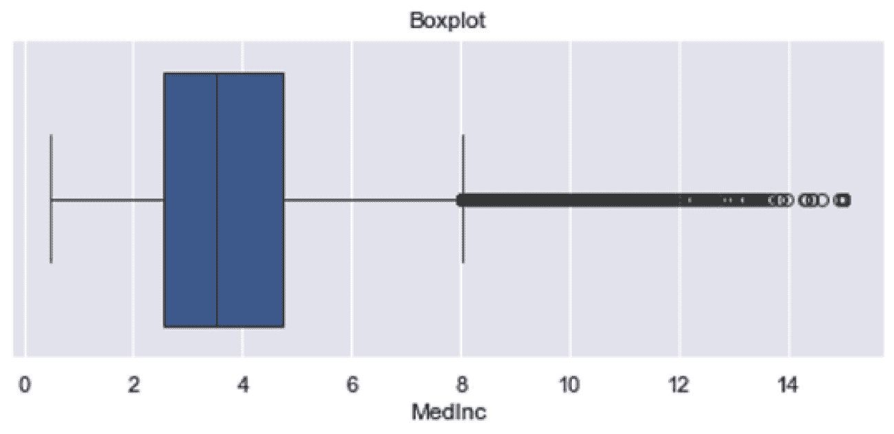
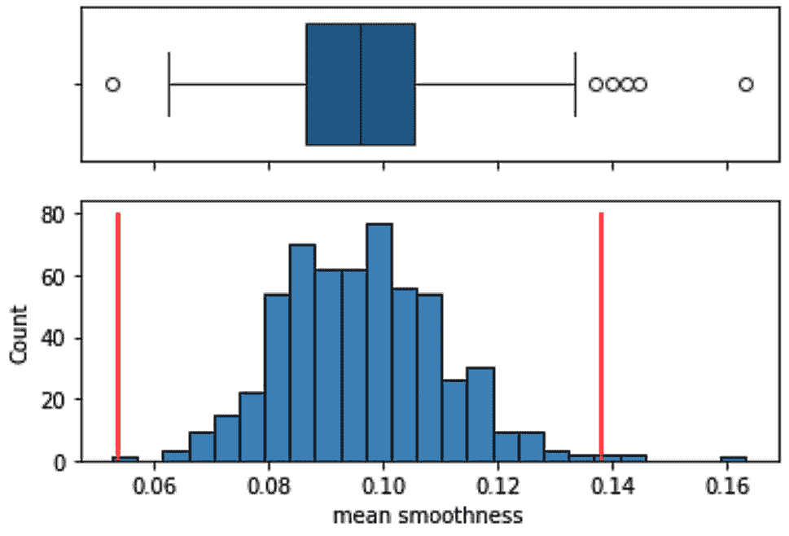

# 第六章：<st c="0">5</st>

# <st c="2">处理异常值</st>

<st c="23">异常值</st> <st c="34">是指一个数据点在变量中的其他值中显著偏离。</st> <st c="110">异常值可能源于特征本身的固有变异性，表现为在分布中不常出现的极端值（通常出现在分布的尾部）。</st> <st c="291">它们可能是实验误差或数据收集过程中的不准确性的结果，或者它们可能表明重要事件。</st> <st c="420">例如，信用卡交易中异常高的费用可能表明欺诈活动，需要标记并可能阻止卡片以保护客户。</st> <st c="594">同样，异常明显的肿瘤形态可能表明恶性，需要进一步检查。</st>

<st c="697">异常值可以对统计分析产生不成比例的大影响。</st> <st c="778">例如，少数异常值可以改变测试的统计显著性，无论是正向还是负向（想想 A/B 测试），或者直接影响统计模型参数的估计（想想系数）。</st> <st c="1011">一些机器学习模型因其对异常值的敏感性而闻名，如线性回归。</st> <st c="1117">其他模型因其对异常值的鲁棒性而闻名，如基于决策树的模型。</st> <st c="1206">AdaBoost 据说对目标变量的异常值敏感，原则上，基于距离的模型，如 PCA 和 KNN，也可能受到异常值的存在的影响。</st> <st c="1376">的影响。</st>

<st c="1388">没有严格的数学定义来界定什么算是异常值，也没有关于如何在统计或机器学习模型中处理异常值的共识。</st> <st c="1568">如果异常值源于数据收集的缺陷，丢弃它们似乎是一个安全的选择。</st> <st c="1656">然而，在许多数据集中，确定异常值的准确性质是具有挑战性的。</st> <st c="1740">最终，检测和处理异常值仍然是一项主观的练习，依赖于领域知识和对它们对模型潜在影响的了解。</st> <st c="1890">。</st>

<st c="1900">在本章中，我们将首先讨论识别潜在异常值的方法，或者更精确地说，识别那些显著偏离其他观察值的观察值。</st> <st c="2060">然后，我们将在假设这些观察值对分析不相关的情况下继续，并展示如何通过截断来移除它们或减少它们对模型的影响。</st> <st c="2228">。</st>

<st c="2247">本章包含以下内容</st> <st c="2274">以下菜谱：</st>

+   <st c="2292">使用箱线图和四分位数间距规则可视化异常值</st> <st c="2351">。</st>

+   <st c="2365">使用均值和</st> <st c="2402">标准差</st>

+   <st c="2420">使用中位数绝对偏差来</st> <st c="2460">查找异常值</st>

+   <st c="2473">移除异常值</st>

+   <st c="2491">将异常值带回</st> <st c="2522">可接受的范围</st>

+   <st c="2539">应用 Winsorization</st>

# <st c="2562">技术要求</st>

<st c="2585">在本章中，我们将使用 Python</st> `<st c="2626">numpy</st>`<st c="2631">,</st> `<st c="2633">pandas</st>`<st c="2639">,</st> `<st c="2641">matplotlib</st>`<st c="2651">,</st> `<st c="2653">seaborn</st>`<st c="2660">, 以及</st> `<st c="2666">feature-engine</st>` <st c="2680">库。</st>

# <st c="2691">使用箱线图和四分位距规则可视化异常值</st>

<st c="2764">一种常见的可视化异常值的方法是使用</st><st c="2810">箱线图。</st> <st c="2823">箱线图</st> <st c="2832">基于四分位数提供了一个变量的分布的标准化显示。</st> <st c="2914">箱体包含第一和第三四分位数内的观测值，被称为</st> **<st c="2999">四分位距</st>**<st c="3019">(</st>**<st c="3021">IQR</st>**<st c="3024">)。</st> <st c="3028">第一四分位数是低于该值的观测值占 25%（相当于 25 百分位数），而第三四分位数是低于该值的观测值占 75%（相当于 75 百分位数）。</st> <st c="3252">四分位距的计算</st> <st c="3274">如下：</st>

![<mml:math xmlns:mml="http://www.w3.org/1998/Math/MathML" xmlns:m="http://schemas.openxmlformats.org/officeDocument/2006/math" display="block"><mml:mi>I</mml:mi><mml:mi>Q</mml:mi><mml:mi>R</mml:mi><mml:mo>=</mml:mo><mml:mn>3</mml:mn><mml:mi>r</mml:mi><mml:mi>d</mml:mi><mml:mo> </mml:mo><mml:mi>q</mml:mi><mml:mi>u</mml:mi><mml:mi>a</mml:mi><mml:mi>r</mml:mi><mml:mi>i</mml:mi><mml:mi>l</mml:mi><mml:mi>e</mml:mi><mml:mo>−</mml:mo><mml:mn>1</mml:mn><mml:mi>s</mml:mi><mml:mi>t</mml:mi><mml:mo> </mml:mo><mml:mi>q</mml:mi><mml:mi>u</mml:mi><mml:mi>a</mml:mi><mml:mi>r</mml:mi><mml:mi>i</mml:mi><mml:mi>l</mml:mi><mml:mi>e</mml:mi></mml:math>](img/21.png)

<st c="3320">箱线图还</st> <st c="3334">显示触须，这些是从小箱体两端向外延伸到最小值和最大值的线条，并延伸到一个极限。</st> <st c="3464">这些极限由分布的最小值或最大值给出，或者在存在极端值的情况下，由以下方程给出：</st>


<st c="3684">根据</st> **<st c="3701">IQR 接近规则</st>**<st c="3719">，如果我们</st> <st c="3723">的值落在由前述方程确定的触须限制之外，我们可以将其视为</st> <st c="3747">异常值。</st> <st c="3832">在箱线图中，异常值用点表示。</st>

<st c="3876">注意</st>

<st c="3881">如果变量具有正态分布，大约 99%的观测值将位于触须限定的区间内。</st> <st c="4018">因此，我们可以将超出触须的值视为异常值。</st> <st c="4078">然而，箱线图是非参数的，这就是为什么我们也使用它们来可视化</st> <st c="4172">偏斜变量中的异常值。</st>

<st c="4189">在这个</st> <st c="4198">菜谱中，我们将首先通过箱线图可视化变量分布，然后我们将手动计算触须的限制以确定哪些点可以被视为</st> <st c="4394">异常值。</st>

## <st c="4406">如何做到这一点...</st>

<st c="4422">我们将使用</st> `<st c="4461">seaborn</st>` <st c="4468">库创建箱线图。</st> <st c="4476">让我们首先导入 Python 库并加载数据集：</st>

1.  <st c="4548">让我们导入 Python 库和</st> <st c="4587">数据集：</st>

    ```py
     import matplotlib.pyplot as plt
    import seaborn as sns
    from sklearn.datasets import fetch_california_housing
    ```

1.  <st c="4707">将默认背景从</st> `<st c="4743">seaborn</st>` <st c="4750">(它使图表更美观，但这很主观，</st> <st c="4800">当然)：</st>

    ```py
     sns.set(style="darkgrid")
    ```

1.  <st c="4837">从 scikit-learn 加载加利福尼亚房价数据集</st> <st c="4879">：</st>

    ```py
     X, y = fetch_california_housing(
        return_X_y=True, as_frame=True)
    ```

1.  <st c="4962">绘制</st> `<st c="4985">MedInc</st>` <st c="4991">变量的箱线图以可视化其分布：</st>

    ```py
     plt.figure(figsize=(8, 3))
    sns.boxplot(data=X["MedInc"], orient="y")
    plt.title("Boxplot")
    plt.show()
    ```

    <st c="5132">在下面的箱线图中，我们识别出包含在四分位数范围（IQR）内的箱子，即第一和第三四分位数之间的观测值。</st> <st c="5288">我们还可以看到触须。</st> <st c="5314">在左边，触须延伸到</st> `<st c="5371">MedInc</st>`<st c="5377">的最小值；在右边，触须延伸到第三四分位数加上 1.5 倍的四分位数范围。</st> <st c="5460">超出右触须的值用点表示，可能</st> <st c="5526">构成异常值：</st>



<st c="5569">图 5.1 – MedInc 变量的箱线图，突出显示了分布右尾的潜在异常值</st>

<st c="5682">注意</st>

<st c="5687">如图**<st c="5700">图 5</st>**<st c="5708">.1</st>*<st c="5710">所示，箱线图返回不对称的边界，由左尾和右尾的长度变化表示。</st> <st c="5817">这使得箱线图成为识别高度偏斜分布中异常值的一种合适方法。</st> <st c="5912">正如我们将在接下来的菜谱中看到的那样，识别异常值的替代方法会在分布中心周围创建对称边界，这可能不是处理不对称分布的最佳选择。</st>

1.  <st c="6118">现在让我们创建一个函数来</st> <st c="6149">在直方图旁边绘制箱线图：</st>

    ```py
     def plot_boxplot_and_hist(data, variable):
        f, (ax_box, ax_hist) = plt.subplots(
            2, sharex=True,
            gridspec_kw={"height_ratios": (0.50, 0.85)})
        sns.boxplot(x=data[variable], ax=ax_box)
        sns.histplot(data=data, x=variable, ax=ax_hist)
        plt.show()
    ```

1.  <st c="6427">让我们使用</st> <st c="6437">前面的</st> <st c="6450">函数来创建</st> `<st c="6487">MedInc</st>` <st c="6493">变量的</st>绘图：</st>

    ```py
     plot_boxplot_and_hist(X, "MedInc")
    ```

    <st c="6538">在下面的图中，我们可以看到箱线图与直方图中显示的变量分布之间的关系。</st> <st c="6668">注意大多数`<st c="6685">MedInc</st>`<st c="6691">`的观测值都位于 IQR 框内。</st> `<st c="6740">MedInc</st>`<st c="6746">`的潜在异常值位于右尾，对应于收入异常高的个人：</st>


<st c="6920">图 5.2 – 箱线图和直方图 – 显示变量分布的两种方式</st>

<st c="7005">现在我们已经看到了如何可视化异常值，让我们看看如何计算分布每侧的异常值所在的极限：</st>

1.  <st c="7158">让我们创建一个函数，该函数根据 IQR 接近规则返回限制：</st>

    ```py
     def find_limits(df, variable, fold):
        q1 = df[variable].quantile(0.25)
        q3 = df[variable].quantile(0.75)
        IQR = q3 - q1
        lower_limit = q1 - (IQR * fold)
        upper_limit = q3 + (IQR * fold)
        return lower_limit, upper_limit
    ```

<st c="7452">注意</st>

<st c="7457">请记住，第一四分位数和第三四分位数等同于 25%和 75%的分位数。</st> <st c="7551">这就是为什么我们使用 pandas 的`<st c="7577">quantile</st>` <st c="7585">来确定这些值的原因。</st>

1.  <st c="7612">使用*<st c="7636">步骤 7</st>*<st c="7642">中的函数，我们将计算`<st c="7683">MedInc</st>`<st c="7689">`的极端限制：</st>

    ```py
     lower_limit, upper_limit = find_limits(
        X, "MedInc", 1.5)
    ```

    <st c="7749">如果我们现在执行</st> `<st c="7768">lower_limit</st>` <st c="7779">和</st> `<st c="7784">upper_limit</st>`<st c="7795">，我们将看到值</st> `<st c="7820">-0.7063</st>` <st c="7827">和</st> `<st c="7832">8.013</st>`<st c="7837">。下限超出了</st> `<st c="7865">MedInc</st>`<st c="7871">的最小值，因此</st> <st c="7899">在箱线图中，触须只延伸到最小值。</st> <st c="7959">另一方面，上限与右侧</st> <st c="8020">触须的界限相一致。</st>

<st c="8036">注意</st>

<st c="8041">乘以 IQR 的常见值是</st> `<st c="8080">1.5</st>`<st c="8083">，这是箱线图中的默认值，或者</st> `<st c="8128">3</st>` <st c="8130">如果我们想更保守的话。</st>

1.  <st c="8165">让我们显示</st> `<st c="8215">HouseAge</st>` <st c="8223">变量的</st>箱线图和直方图：</st>

    ```py
     plot_boxplot_and_hist(X, "HouseAge")
    ```

    <st c="8270">我们可以看到这个变量似乎不包含异常值，因此箱线图中的触须延伸到最小值和</st> <st c="8401">最大值：</st>


<st c="8438">图 5.3 – HouseAge 变量的箱线图和直方图</st>

1.  <st c="8497">让我们</st> <st c="8503">根据 IQR</st> <st c="8552">邻近规则找到变量的界限：</st>

    ```py
     lower_limit, upper_limit = find_limits(
        X, "HouseAge", 1.5)
    ```

<st c="8627">如果我们执行</st> `<st c="8642">lower_limit</st>` <st c="8653">和</st> `<st c="8658">upper_limit</st>`<st c="8669">，我们将看到值</st> `<st c="8694">-10.5</st>` <st c="8699">和</st> `<st c="8704">65.5</st>`<st c="8708">，这些值超出了图表的边缘，因此我们看不到</st> <st c="8774">任何</st> <st c="8778">异常值</st>。

## <st c="8787">它是如何工作的</st><st c="8800">…</st>

<st c="8801">在这个方法中，我们使用了</st> `<st c="8829">boxplot</st>` <st c="8836">方法从 Seaborn 创建箱线图，然后我们根据 IQR</st> <st c="8983">邻近规则计算一个值被认为是异常值的界限。</st>

<st c="8998">在</st><st c="9002">图 5</st><st c="9010">.2</st><st c="9012">中，我们看到</st><st c="9053">MedInc</st><st c="9059">的箱线图的箱子从大约 2 延伸到 5，对应于第一和第三分位数（你可以通过执行</st><st c="9198">X[</st><st c="9200">“</st><st c="9202">MedInc</st><st c="9208">”</st><st c="9210">].quantile(0.25)</st><st c="9226">和</st><st c="9231">X[</st><st c="9233">“</st><st c="9235">MedInc</st><st c="9241">”</st><st c="9243">].quantile(0.75)</st><st c="9259">）来确定这些值）。</st><st c="9263">我们还看到触须从左边的</st><st c="9302">MedInc</st><st c="9308">的最小值开始，延伸到右边的</st><st c="9349">8.013</st><st c="9354">（我们知道这个值，因为我们已经在</st><st c="9424">步骤 8</st><st c="9430">中计算了它）。</st><st c="9434">MedInc</st><st c="9440">显示了大于</st><st c="9468">8.013</st><st c="9473">的值，这些值在箱线图中以点表示。</st><st c="9520">这些是可以</st><st c="9555">被认为是异常值的值。</st>

<st c="9575">在</st><st c="9579">图 5</st><st c="9587">.3</st><st c="9589">中，我们展示了</st><st c="9624">HouseAge</st><st c="9632">变量的箱线图。</st><st c="9643">箱子包含了从大约 18 到 35 的值（你可以通过执行</st><st c="9754">X[</st><st c="9756">“</st><st c="9758">HouseAge</st><st c="9766">”</st><st c="9768">].quantile(0.25)</st><st c="9784">和</st><st c="9789">X[</st><st c="9791">“</st><st c="9793">HouseAge</st><st c="9801">”</st><st c="9803">].quantile(0.75)</st><st c="9819">）来确定精确值）。</st><st c="9823">触须延伸到分布的最小值和最大值。</st><st c="9900">图中触须的极限与基于 IQR 接近规则（我们在</st><st c="10023">步骤 10</st><st c="10030">中计算）的极限不一致，因为这些极限远远超出了</st><st c="10099">这个</st><st c="10103">变量观察到的值范围。</st>

# <st c="10113">使用均值和标准差查找异常值</st>

<st c="10168">正态分布的变量</st><st c="10170">，大约有</st><st c="10172">99.8%的观测值</st><st c="10296">落在</st><st c="10299">均值</st><st c="10326">加减</st><st c="10334">三倍</st><st c="10400">标准差</st><st c="10400">的区间内。</st><st c="10400">因此，超出这些限制的值可以被认为是异常值；它们</st><st c="10400">是罕见的。</st>

<st c="10409">注意</st>

<st c="10414">使用均值和标准差来检测异常值有一些缺点。</st> <st c="10492">首先，它假设包括异常值在内的正态分布。</st> <st c="10555">其次，异常值强烈影响均值和标准差。</st> <st c="10626">因此，一个推荐的替代方案是</st> **<st c="10670">中位数绝对偏差</st>** <st c="10695">(</st>**<st c="10697">MAD</st>**<st c="10700">)，我们将在下一道菜谱中讨论。</st>

<st c="10743">在这个菜谱中，我们将异常值定义为那些位于均值加减三倍标准差区间之外的观测值。</st> <st c="10891">标准</st><st c="10897">偏差。</st>

## <st c="10911">如何操作...</st>

<st c="10927">让我们从导入 Python 库和加载数据集开始这道菜谱：</st> <st c="10997">:</st>

1.  <st c="11009">让我们导入 Python 库</st> <st c="11044">和数据集：</st>

    ```py
     import numpy as np
    import matplotlib.pyplot as plt
    import seaborn as sns
    from sklearn.datasets import load_breast_cancer
    ```

1.  <st c="11177">从 scikit-learn 加载乳腺癌数据集：</st> <st c="11209">:</st>

    ```py
     X, y = load_breast_cancer(
        return_X_y=True, as_frame=True)
    ```

1.  <st c="11286">创建一个函数来绘制</st> <st c="11294">一个箱线图并放在</st> <st c="11315">直方图旁边：</st>

    ```py
     def plot_boxplot_and_hist(data, variable):
        f, (ax_box, ax_hist) = plt.subplots(
            2, sharex=True,
            gridspec_kw={"height_ratios": (0.50, 0.85)})
        sns.boxplot(x=data[variable], ax=ax_box)
        sns.histplot(data=data, x=variable, ax=ax_hist)
        plt.show()
    ```

<st c="11584">注意</st>

<st c="11589">我们在上一道菜谱的</st> *<st c="11621">步骤 3</st>* <st c="11627">中讨论了该函数，</st> *<st c="11652">使用箱线图和四分位距规则可视化异常值</st>* <st c="11710">。</st>

1.  <st c="11725">让我们绘制</st> `<st c="11761">均值</st>` `<st c="11766">平滑度</st>` <st c="11776">变量的分布：</st>

    ```py
     plot_boxplot_and_hist(X, "mean smoothness")
    ```

    <st c="11830">在下面的箱线图中，我们看到变量的值显示出类似于</st> <st c="11919">正态分布的分布，并且它有六个异常值 – 一个在左侧，五个在</st> <st c="11999">右侧尾部：</st>


<st c="12063">图 5.4 – 变量均值平滑度的箱线图和直方图</st>

1.  <st c="12129">创建一个函数，该函数返回均值加减</st> `<st c="12185">倍数</st>` <st c="12189">的标准差，其中</st> `<st c="12226">倍数</st>` <st c="12230">是函数的参数：</st>

    ```py
     def find_limits(df, variable, fold):
        var_mean = df[variable].mean()
        var_std = df[variable].std()
        lower_limit = var_mean - fold * var_std
        upper_limit = var_mean + fold * var_std
        return lower_limit, upper_limit
    ```

1.  <st c="12471">使用该函数来识别</st> `<st c="12527">均值</st>` `<st c="12532">平滑度</st>` <st c="12542">变量的极端极限：</st>

    ```py
     lower_limit, upper_limit = find_limits(
        X, "mean smoothness", 3)
    ```

    <st c="12618">如果我们现在执行</st> `<st c="12637">lower_limit</st>` <st c="12648">或</st> `<st c="12652">upper_limit</st>`<st c="12663">，我们将看到值</st> `<st c="12688">0.0541</st>` <st c="12694">和</st> `<st c="12699">0.13855</st>`<st c="12703">，对应于我们可以考虑一个值</st> <st c="12775">为异常值的极限。</st>

<st c="12786">注意</st>

<st c="12791">如果变量呈正态分布，则均值加减三倍标准差之间的区间包含 99.87% 的观测值。</st> <st c="12949">对于不太保守的限制，我们可以将标准差乘以 2 或 2.5，这将产生包含 95.4% 和 97.6% 的</st> <st c="13099">观测值的区间。</st>

1.  <st c="13126">创建</st> <st c="13134">一个布尔向量，用于标记超出在</st> *<st c="13219">步骤 6</st>*<st c="13225">中确定的限制值的观测值</st>

    ```py
     outliers = np.where(
        (X[«mean smoothness»] > upper_limit) |
        (X[«mean smoothness»] < lower_limit),
        True,
        False
    )
    ```

    <st c="13339">如果我们现在执行</st> `<st c="13358">outliers.sum()</st>`<st c="13372">，我们将看到值</st> `<st c="13396">5</st>`<st c="13397">，表示有五个异常值或观测值小于或大于使用均值和标准差找到的极端值。</st> <st c="13555">根据这些限制，我们将比 IQR 规则少识别一个异常值。</st>

1.  <st c="13638">让我们从</st> *<st c="13690">步骤 3</st>* <st c="13696">开始，在直方图中添加红色垂直线，以突出显示由</st> <st c="13731">使用均值和标准差</st> <st c="13758">确定的限制值：</st>

    ```py
     def plot_boxplot_and_hist(data, variable):
        f, (ax_box, ax_hist) = plt.subplots(
            2, sharex=True,
            gridspec_kw={"height_ratios": (0.50, 0.85)})
        sns.boxplot(x=data[variable], ax=ax_box)
        sns.histplot(data=data, x=variable, ax=ax_hist)
        plt.vlines(
            x=lower_limit, ymin=0, ymax=80, color='r')
        plt.vlines(
            x=upper_limit, ymin=0, ymax=80, color='r')
         plt.show()
    ```

1.  <st c="14128">现在</st> <st c="14133">让我们制作</st> <st c="14148">这些图表：</st>

    ```py
     plot_boxplot_and_hist(X, "mean smoothness")
    ```

    <st c="14202">在下面的图中，我们可以看到箱线图中 IQR 邻近规则观察到的限制值比均值和标准差确定的限制值更保守。</st> <st c="14384">这就是为什么我们在箱线图中观察到六个潜在的异常值，但基于均值和标准差计算只有五个：</st>


<st c="14560">图 5.5 – 比较箱线图中触须与使用均值和标准差确定的限制值（直方图中的垂直线）</st>

<st c="14733">从</st> <st c="14738">均值和标准差推导出的</st> <st c="14766">边界是对称的。</st> <st c="14809">它们从分布的中心等距离地向两端延伸。</st> <st c="14890">如前所述，这些边界仅适用于正态</st> <st c="14962">分布的变量。</st>

## <st c="14985">它是如何工作的…</st>

<st c="14999">使用 pandas 的</st> `<st c="15013">mean()</st>` <st c="15019">和</st> `<st c="15024">std()</st>`<st c="15029">，我们捕获了变量的平均值和标准差。</st> <st c="15092">我们将界限设定为平均值加减三倍标准差。</st> <st c="15180">为了突出显示异常值，我们使用了 NumPy 的</st> `<st c="15223">where()</st>`<st c="15230">。该</st> `<st c="15236">where()</st>` <st c="15243">函数扫描变量的行，如果值大于上限或小于下限，则被分配</st> `<st c="15387">True</st>`<st c="15391">，否则分配</st> `<st c="15411">False</st>`<st c="15416">。最后，我们使用 pandas 的</st> `<st c="15443">sum()</st>` <st c="15448">对这个布尔向量求和，以计算异常值的总数。</st>

最后，我们比较了边界以确定由 IQR 邻近规则返回的异常值，我们在之前的菜谱中讨论了该规则，*<st c="15654">使用箱线图和四分位数邻近规则可视化异常值</st>*<st c="15726">，以及平均值和标准差。</st> <st c="15769">我们观察到 IQR 规则的界限不太保守。</st> <st c="15836">这意味着使用 IQR 规则，我们会在这个特定变量中标记出更多的异常值。</st>

# 使用中位数绝对偏差来寻找异常值

<st c="15976">平均值</st> <st c="15986">和标准差会受到异常值的影响很大。</st> <st c="16047">因此，使用这些参数来识别异常值可能会适得其反。</st> <st c="16122">识别异常值的一个更好的方法是</st> <st c="16159">使用 MAD。</st> <st c="16173">MAD 是每个观测值与变量中位数绝对偏差的中位数：</st>


<st c="16314">在之前的方程中，</st> `<st c="16340">xi</st>` <st c="16342">是变量</st> `<st c="16370">X</st>` <st c="16371">中的每个观测值。</st> <st c="16382">MAD 的美丽之处在于它使用中位数而不是平均值，这使得它对异常值具有鲁棒性。</st> <st c="16477">常数</st> `<st c="16481">b</st>` <st c="16482">用于从 MAD 估计标准差，如果我们假设正态分布，那么</st> `<st c="16578">b =</st>` `<st c="16582">1.4826</st>`<st c="16588">。</st>

<st c="16589">注意</st>

<st c="16594">如果假设变量具有不同的分布，</st> `<st c="16656">b</st>` <st c="16657">随后计算为 75 百分位数的倒数。</st> <st c="16714">在正态分布的情况下，1/75 百分位数=</st> <st c="16760">1.4826。</st>

<st c="16767">在计算 MAD 之后，我们使用中位数和 MAD 来建立分布限制，将超出这些限制的值指定为异常值。</st> <st c="16901">限制设置为中位数加减 MAD 的倍数，通常范围在 2 到 3.5 之间。</st> <st c="17001">我们选择的乘数因子反映了我们希望有多严格（越高，越保守）。</st> <st c="17111">在这个菜谱中，我们将使用 MAD 来识别异常值。</st>

## <st c="17163">如何操作...</st>

<st c="17179">让我们从导入 Python 库和加载数据集开始</st> <st c="17249">：</st>

1.  <st c="17261">让我们导入 Python 库</st> <st c="17296">和数据集：</st>

    ```py
     import numpy as np
    import matplotlib.pyplot as plt
    import seaborn as sns
    from sklearn.datasets import load_breast_cancer
    ```

1.  <st c="17429">从 scikit-learn 加载</st> <st c="17439">乳腺癌数据集</st> <st c="17461">：</st>

    ```py
     X, y = load_breast_cancer(
        return_X_y=True, as_frame=True)
    ```

1.  <st c="17538">创建一个</st> <st c="17548">基于 MAD 返回限制的函数</st> <st c="17587">：</st>

    ```py
     def find_limits(df, variable, fold):
        median = df[variable].median()
        center = df[variable] - median
        MAD = center.abs().median() * 1.4826
        lower_limit = median - fold * MAD
        upper_limit = median + fold * MAD
        return lower_limit, upper_limit
    ```

1.  <st c="17830">让我们使用这个函数来捕捉</st> `<st c="17891">均值</st>` `<st c="17896">平滑度</st>` <st c="17906">变量的极端限制：</st>

    ```py
     lower_limit, upper_limit = find_limits(
        X, "mean smoothness", 3)
    ```

    <st c="17981">如果我们执行</st> `<st c="17996">lower_limit</st>` <st c="18007">或</st> `<st c="18011">upper_limit</st>`<st c="18022">，我们将看到值</st> `<st c="18047">0.0536</st>` <st c="18053">和</st> `<st c="18058">0.13812</st>`<st c="18065">，对应于我们可以考虑一个值</st> <st c="18132">为异常值的限制。</st>

1.  <st c="18143">让我们创建一个布尔向量，标记超出</st> <st c="18217">限制的观测值：</st>

    ```py
     outliers = np.where(
        (X[«mean smoothness»] > upper_limit) |
        (X[«mean smoothness»] < lower_limit),
        True,
        False
    )
    ```

    <st c="18340">如果我们</st> <st c="18347">现在执行</st> `<st c="18359">outliers.sum()</st>`<st c="18373">，我们将看到值</st> `<st c="18397">5</st>`<st c="18398">，表示有五个异常值或观测值小于或大于 MAD 找到的极端值。</st>

1.  <st c="18523">让我们</st> <st c="18530">编写一个函数，在变量的直方图旁边绘制箱线图，突出显示在直方图中计算的</st> *<st c="18654">步骤 4</st>*<st c="18660">中的限制：</st>

    ```py
     def plot_boxplot_and_hist(data, variable):
        f, (ax_box, ax_hist) = plt.subplots(
            2, sharex=True,
            gridspec_kw={"height_ratios": (0.50, 0.85)})
        sns.boxplot(x=data[variable], ax=ax_box)
        sns.histplot(data=data, x=variable, ax=ax_hist)
        plt.vlines(
            x=lower_limit, ymin=0, ymax=80, color='r')
        plt.vlines(
            x=upper_limit, ymin=0, ymax=80, color='r')
        plt.show()
    ```

1.  <st c="19013">现在让我们制作</st> <st c="19033">图表：</st>

    ```py
     plot_boxplot_and_hist(X, "mean smoothness")
    ```

    <st c="19087">在下面的图中，我们可以看到箱线图中 IQR 接近规则观察到的限制比使用 MAD 确定的限制更为保守。</st> <st c="19243">MAD 返回</st> <st c="19255">对称边界，而箱线图生成非对称边界，这对于高度</st> <st c="19338">偏斜的分布</st> <st c="19363">更为合适：</st>



<st c="19416">图 5.6 – 箱线图中触须的极限与使用 MAD 确定的极限的比较</st>

<st c="19523">注意</st>

<st c="19528">使用中位数绝对偏差（MAD）检测异常值需要变量具有一定的变异性。</st> <st c="19609">如果一个变量的超过 50%的值是相同的，则中位数与最频繁出现的值相同，MAD=0。</st> <st c="19731">这意味着所有与中位数不同的值都将被标记为异常值。</st> <st c="19813">这构成了使用 MAD 进行异常值检测的另一个局限性。</st> <st c="19865">异常值检测。</st>

<st c="19883">就是这样！</st> <st c="19895">你现在知道如何使用中位数</st> <st c="19950">和中位数绝对偏差（MAD）来识别异常值。</st>

## <st c="19958">它是如何工作的…</st>

<st c="19972">我们</st> <st c="19976">使用 pandas 的</st> `<st c="20011">median()</st>` <st c="20019">和 pandas 的</st> `<st c="20061">abs()</st>`<st c="20066">计算绝对差异。</st> <st c="20092">接下来，我们使用 NumPy 的</st> `<st c="20092">where()</st>` <st c="20099">函数创建一个布尔向量，如果值大于上限或小于下限，则为</st> `<st c="20141">True</st>` <st c="20145">，否则为</st> `<st c="20233">False</st>`<st c="20238">。</st> <st c="20265">最后，我们使用 pandas 的</st> `<st c="20265">sum()</st>` <st c="20270">计算布尔向量的总数</st> <st c="20326">，以确定异常值的总数。</st>

<st c="20338">最后，我们</st> <st c="20351">比较了边界以确定 IQR 邻近规则返回的异常值，我们在</st> *<st c="20459">使用箱线图和四分位数范围邻近规则可视化异常值</st> * <st c="20537">菜谱中讨论了这一点，以及使用 MAD 返回的异常值。</st> <st c="20579">IQR 规则返回的边界不太保守。</st> <st c="20639">可以通过将 IQR 乘以 3 而不是默认的 1.5 来改变这种行为，这是箱线图中的默认值。</st> <st c="20752">此外，我们注意到 MAD 返回对称边界，而箱线图提供的是不对称的极限，这可能更适合</st> <st c="20894">不对称分布。</st>

### <st c="20919">另请参阅</st>

<st c="20928">为了全面讨论检测异常值的不同方法的优缺点，请参阅以下资源：</st> <st c="21048">以下资源：</st>

+   <st c="21068">Rousseeuw PJ, Croux C.</st> *<st c="21092">中位数绝对偏差的替代方案</st>*<st c="21137">. 美国统计学会杂志，</st> <st c="21188">1993。</st> [<st c="21194">http://www.jstor.org/stable/2291267</st>](https://www.jstor.org/stable/2291267)<st c="21229">。</st>

+   <st c="21230">Leys C, et.</st> <st c="21243">al.</st> *<st c="21247">检测异常值：不要使用均值周围的标准差，而要使用中位数周围的绝对偏差</st>*<st c="21354">. 实验社会心理学杂志，</st> <st c="21399">2013。</st> <st c="21405">http://dx.doi.org/10.1016/j.jesp.2013.03.013</st><st c="21449">。</st>

+   <st c="21450">Thériault R, et.</st> <st c="21468">al.</st> *<st c="21472">检查你的异常值</st>**<st c="21491">！使用 easystats 在 R 中识别统计异常值入门</st>*<st c="21564">. 行为研究方法，</st> <st c="21593">2024。</st> [<st c="21599">https://doi.</st><st c="21611">org/10.3758/s13428-024-02356-w</st>](https://link.springer.com/article/10.3758/s13428-024-02356-w)<st c="21642">。</st>

# <st c="21643">移除异常值</st>

<st c="21661">最近</st> <st c="21669">的研究区分了三种类型的异常值：错误异常值、有趣异常值和随机异常值。</st> <st c="21773">错误异常值可能是由于人为或方法错误造成的，应该纠正或从数据分析中移除。</st> <st c="21903">在这个食谱中，我们假设异常值是错误（您不想移除有趣或随机异常值），并从</st> <st c="22011">数据集中移除</st> <st c="22032">它们。</st>

## <st c="22044">如何操作...</st>

<st c="22060">我们将使用四分位数间距规则来查找异常值，然后使用 pandas 和 Feature-engine 从数据中移除它们</st> <st c="22163">和特征工程：</st>

1.  <st c="22182">让我们导入 Python 库、函数、</st> <st c="22229">和类：</st>

    ```py
     import matplotlib.pyplot as plt
    import seaborn as sns
    from sklearn.datasets import fetch_california_housing
    from sklearn.model_selection import train_test_split
    from feature_engine.outliers import OutlierTrimmer
    ```

1.  <st c="22454">从 scikit-learn 加载加利福尼亚住房数据集，并将其分为训练集和</st> <st c="22540">测试集：</st>

    ```py
     X, y = fetch_california_housing(
        return_X_y=True, as_frame=True)
    X_train, X_test, y_train, y_test = train_test_split(
        X, y, test_size=0.3, random_state=0)
    ```

1.  <st c="22705">让我们创建一个函数，使用四分位数间距规则来确定我们将视为异常值的范围：</st> <st c="22815">接近规则：</st>

    ```py
     def find_limits(df, variable, fold):
        q1 = df[variable].quantile(0.25)
        q3 = df[variable].quantile(0.75)
        IQR = q3 - q1
        lower_limit = q1 - (IQR * fold)
        upper_limit = q3 + (IQR * fold)
        return lower_limit, upper_limit
    ```

<st c="23043">注意</st>

<st c="23048">在</st> *<st c="23052">步骤 3</st>*<st c="23058">中，我们使用四分位数间距规则来确定数据点超出范围时的限制，我们已在</st> *<st c="23189">使用箱线图和四分位数间距规则可视化异常值</st>* <st c="23261">食谱中讨论过。</st> <st c="23270">或者，您可以使用均值和标准差或 MAD 来识别异常值，正如我们在</st> *<st c="23381">使用均值和标准差查找异常值</st>* <st c="23435">和</st> *<st c="23440">使用中位数绝对偏差查找</st>* *<st c="23484">异常值</st>* <st c="23492">食谱中所述。</st>

1.  <st c="23501">使用</st> <st c="23511">步骤 3</st> <st c="23526">中的</st> *<st c="23532">变量</st> `<st c="23568">MedInc</st>` <st c="23574">的</st>限制：</st>

    ```py
     lower, upper = find_limits(X_train, "MedInc", 3)
    ```

    <st c="23633">如果您执行</st> `<st c="23649">print(lower_limit, upper_limit)</st>`<st c="23680">，您将看到上一个命令的结果：</st> `<st c="23729">(-</st>``<st c="23731">3.925900000000002, 11.232600000000001)</st>`<st c="23770">。</st>

1.  <st c="23771">让我们保留训练集和测试集中那些值大于或等于（</st>`<st c="23872">ge</st>`<st c="23875">）下限的观测值：</st> <st c="23882">：</st>

    ```py
     inliers = X_train["MedInc"].ge(lower)
    train_t = X_train.loc[inliers]
    inliers = X_test["MedInc"].ge(lower)
    test_t = X_test.loc[inliers]
    ```

1.  <st c="24029">让我们保留那些值低于或等于（</st>`<st c="24101">le</st>`<st c="24104">）上限的观测值：</st>

    ```py
     inliers = X_train["MedInc"].le(upper)
    train_t = X_train.loc[inliers]
    inliers = X_test["MedInc"].le(upper)
    test_t = X_test.loc[inliers]
    ```

    <st c="24258">继续执行</st> <st c="24262">，然后执行</st> `<st c="24280">X_train.shape</st>` <st c="24293">，接着执行</st> `<st c="24306">train_t.shape</st>` <st c="24319">，以证实转换后的 DataFrame 在移除异常值后比原始 DataFrame 包含的观测值更少。</st>

    <st c="24444">我们可以使用</st> `<st c="24514">feature-engine</st>`<st c="24528">同时从多个变量中移除异常值。</st>

1.  <st c="24529">设置一个转换器，使用 IQR 规则识别三个变量中的异常值：</st>

    ```py
     trimmer = OutlierTrimmer(
        variables = [«MedInc", "HouseAge", "Population"],
        capping_method="iqr",
        tail="both",
        fold=1.5,
    )
    ```

<st c="24736">注意：</st>

`<st c="24741">OutlierTrimmer</st>` <st c="24756">可以使用 IQR 识别边界，正如我们在本食谱中所示，以及通过使用平均值和标准差，或 MAD。</st> <st c="24884">您需要将</st> `<st c="24903">capping_method</st>` <st c="24917">更改为</st> `<st c="24921">gaussian</st>` <st c="24929">或</st> `<st c="24933">mad</st>`<st c="24936">，分别。</st>

1.  <st c="24951">将转换器拟合到训练集，以便它学习这些限制：</st>

    ```py
     trimmer.fit(X_train)
    ```

<st c="25044">注意：</st>

<st c="25049">通过执行</st> `<st c="25063">trimmer.left_tail_caps_</st>`<st c="25086">，我们可以可视化三个变量的下限：</st> `<st c="25147">{'MedInc': -0.6776500000000012, 'HouseAge': -10.5, 'Population': -626.0}</st>`<st c="25219">。通过执行</st> `<st c="25234">trimmer.right_tail_caps_</st>`<st c="25258">，我们可以看到变量的上限：</st> `<st c="25300">{'MedInc': 7.984350000000001, 'HouseAge': 65.5, '</st>``<st c="25349">Population': 3134.0}</st>`<st c="25370">。</st>

1.  <st c="25371">最后，让我们从训练集和测试集中移除异常值：</st> <st c="25422">：</st>

    ```py
     X_train_t = trimmer.transform(X_train)
    X_test_t = trimmer.transform(X_test)
    ```

    <st c="25509">为了完成这个食谱，让我们比较移除异常值前后变量的分布。</st>

1.  <st c="25617">让我们创建</st> <st c="25630">一个函数来在直方图上显示箱线图：</st>

    ```py
     def plot_boxplot_and_hist(data, variable):
        f, (ax_box, ax_hist) = plt.subplots(
            2, sharex=True,
            gridspec_kw={"height_ratios": (0.50, 0.85)}
        )
        sns.boxplot(x=data[variable], ax=ax_box)
        sns.histplot(data=data, x=variable, ax=ax_hist)
        plt.show()
    ```

<st c="25927">注意：</st>

<st c="25932">我们之前在本章中较早的*<st c="25958">步骤 10</st>* <st c="25965">的*<st c="25973">使用箱线图可视化异常值</st>* <st c="26007">食谱中讨论了代码。</st>

1.  <st c="26039">让我们在移除</st> `<st c="26071">MedInc</st>` <st c="26077">的异常值之前绘制其分布图：</st>

    ```py
     plot_boxplot_and_hist(X_train, "MedInc")
    ```

    <st c="26148">在下面的图中，我们可以看到</st> `<st c="26184">MedInc</st>` <st c="26190">是偏斜的，并且大于 8 的观测值被标记为异常值：</st>


<st c="26277">图 5.7–移除异常值前 MedInc 的箱线图和直方图。</st>

1.  <st c="26350">最后，让我们绘制移除</st> `<st c="26371">MedInc</st>` <st c="26397">的异常值之后的分布图：</st>

    ```py
     plot_boxplot_and_hist(train_t, "MedInc")
    ```

    <st c="26467">移除异常值后，</st> `<st c="26493">MedInc</st>` <st c="26499">似乎不那么偏斜，其值分布更</st> <st c="26523">均匀：</st>


<st c="26577">图 5.8 – 移除异常值后 MedInc 的箱线图和直方图</st>

<st c="26649">注意</st>

<st c="26654">使用 IQR 规则对转换变量进行分析会揭示新的异常值。</st> <st c="26726">这并不奇怪；移除分布两端的观测值会改变参数，如中位数和四分位数，这些参数反过来又决定了触须的长度，从而可能将更多的观测值识别为异常值。</st> <st c="26979">我们用来识别异常值的工具只是工具。</st> <st c="27044">为了明确地识别异常值，我们需要用额外的</st> <st c="27127">数据分析来支持这些工具。</st>

<st c="27141">如果您想从数据集中移除错误异常值，请确保比较并报告有异常值和无异常值的结果，以了解其对模型的影响程度。</st>

## <st c="27319">它的工作原理...</st>

<st c="27335">The</st> `<st c="27340">ge()</st>` <st c="27344">和</st> `<st c="27349">le()</st>` <st c="27353">方法</st> <st c="27362">来自 pandas，创建了布尔向量，用于识别超过或低于由 IQR 邻近规则设定的阈值的观测值。</st> <st c="27492">我们使用这些向量与 pandas</st> `<st c="27526">loc</st>` <st c="27529">一起使用，以保留在 IQR 定义的区间内的观测值。</st>

<st c="27592">The</st> `<st c="27597">feature-engine</st>` <st c="27611">库的</st> `<st c="27622">OutlierTrimmer()</st>` <st c="27638">自动化了为多个变量移除异常值的程序。</st> `<st c="27708">OutlierTrimmer()</st>` <st c="27724">可以根据均值和标准差、IQR 邻近规则、MAD 或分位数来识别异常值。</st> <st c="27828">我们可以通过</st> `<st c="27868">capping_method</st>` <st c="27882">参数来修改这种行为。</st>

通过改变我们乘以四分位距（IQR）、标准差或 MAD 的系数，可以使得识别异常值的方法更加或更加保守。使用 `<st c="28055">OutlierTrimmer()</st>`，我们可以通过 `<st c="28128">fold</st>` 参数来控制方法的强度。

将 `<st c="28149">tails</st>` 设置为 `<st c="28162">"both"</st>`，`<st c="28170">OutlierTrimmer()</st>` 找到并移除了变量分布两端的异常值。要仅移除一端的异常值，我们可以将 `<st c="28316">"left"</st>` 或 `<st c="28322">"right"</st>` 传递给 `<st c="28341">tails</st>` 参数。

`<st c="28357">OutlierTrimmer()</st>` 采用 scikit-learn 功能，使用 `<st c="28422">fit()</st>` 方法来学习参数，以及 `<st c="28461">transform()</st>` 来修改数据集。使用 `<st c="28501">fit()</st>`，转换器学习并存储了每个变量的界限。使用 `<st c="28578">transform()</st>`，它从数据中移除了异常值，返回 `<st c="28640">pandas</st>` 数据框。

## 参见

这是之前提到的研究，它将异常值分类为错误；有趣且随机：Leys C, et.al. 2019. *如何分类、检测和管理单变量和多变量异常值，重点在于预注册*。国际社会心理学评论。[`doi.org/10.5334/irsp.289`](https://rips-irsp.com/articles/10.5334/irsp.289)

# 将异常值带回可接受范围内

移除错误异常值可能是一个有效的策略。然而，这种方法可能会降低统计功效，特别是在许多变量都有异常值的情况下，因为我们最终移除了数据集的大部分内容。处理错误异常值的另一种方法是将其带回可接受范围内。在实践中，这意味着用四分位距（IQR）邻近规则、均值和标准差或 MAD 确定的某些阈值来替换异常值。在本食谱中，我们将使用 `<st c="29572">pandas</st>` 和 `<st c="29583">feature-engine</st>` 来替换异常值。

## 如何做...

我们将使用均值和标准差来查找异常值，然后使用 `<st c="29711">pandas</st>` 和 `<st c="29722">feature-engine</st>` 替换它们的值：

1.  让我们导入所需的 Python 库和函数：

    ```py
     from sklearn.datasets import load_breast_cancer
    from sklearn.model_selection import train_test_split
    from feature_engine.outliers import Winsorizer
    ```

1.  从 scikit-learn 加载乳腺癌数据集并将其分为训练集和测试集：

    ```py
     X, y = load_breast_cancer(
        return_X_y=True, as_frame=True)
    X_train, X_test, y_train, y_test = train_test_split(
        X, y, test_size=0.3, random_state=0)
    ```

1.  让我们创建一个函数来使用均值和标准差查找异常值：

    ```py
     def find_limits(df, variable, fold):
        var_mean = df[variable].mean()
        var_std = df[variable].std()
        lower_limit = var_mean - fold * var_std
        upper_limit = var_mean + fold * var_std
        return lower_limit, upper_limit
    ```

注意

在 *<st c="30481">步骤 3</st>* 中，我们使用均值和标准差来查找数据点被认为是异常值的极限，如 *<st c="30621">使用均值和标准差查找异常值</st>* 菜谱中所述。或者，您可以使用 IQR 规则或 MAD 识别异常值，正如我们在 *<st c="30772">使用箱线图和四分位数间距规则可视化异常值</st>* 和 *<st c="30849">使用中位数绝对偏差查找异常值</st>* 菜谱中所述。

1.  使用来自 *<st c="30935">步骤 3</st>* 的函数，让我们确定 `<st c="30977">平均平滑度</st>` 变量的极限，该变量大约遵循高斯分布：

    ```py
     var = "worst smoothness"
    lower_limit, upper_limit = find_limits(
        X_train, var, 3)
    ```

1.  让我们复制原始数据集：

    ```py
     train_t = X_train.copy()
    test_t = X_test.copy()
    ```

1.  现在，在新数据框中使用 *<st c="31288">步骤 4</st>* 中的下限或上限替换异常值：

    ```py
     train_t[var] = train_t[var].clip(
        lower=lower_limit, upper=upper_limit)
    test_t[var] = test_t[var].clip(
        lower=lower_limit, upper=upper_limit)
    ```

    为了证实异常值已被替换为在 *<st c="31537">步骤 4</st>* 中确定的值，执行 `<st c="31553">train_t["worst smoothness"].agg(["min", "max"])</st>` 以获得新的最大和最小值。它们应该与变量的最小和最大值一致，或者与 *<st c="31747">步骤 4</st>* 中返回的极限一致。

    我们可以通过利用 `<st c="31829">feature-engine</st>` 同时替换多个变量中的异常值。

1.  让我们设置一个转换器来替换两个变量中的异常值，使用由均值和 `<st c="31952">标准差</st>` 确定的极限：

    ```py
     capper = Winsorizer(
        variables=[«worst smoothness», «worst texture»],
        capping_method="gaussian",
        tail="both",
        fold=3,
    )
    ```

注意

`<st c="32096">Winsorizer</st>` <st c="32107">可以</st> <st c="32111">使用均值和标准差来识别边界，正如我们在本食谱中所示，以及 IQR 邻近规则和 MAD。</st> <st c="32241">您需要将</st> `<st c="32260">capping_meth</st><st c="32272">od</st>` <st c="32275">更改为</st> `<st c="32279">iqr</st>` <st c="32282">或</st> `<st c="32286">mad</st>`<st c="32289">，分别。</st>

1.  <st c="32304">让我们将变压器拟合到数据中，以便它学习</st> <st c="32361">这些限制：</st>

    ```py
     capper.fit(X_train)
    ```

    <st c="32394">通过执行</st> `<st c="32408">capper.left_tail</st><st c="32424">_caps_</st>`<st c="32431">，我们可以可视化两个变量的下限：</st> `<st c="32490">{'worst smoothness': 0.06364743973736293, 'worst texture': 7.115307053129349}</st>`<st c="32567">。通过执行</st> `<st c="32582">capper.right_tail_caps_</st>`<st c="32605">，我们可以看到变量的上限：</st> `<st c="32647">{'worst smoothness': 0.20149734880520967, 'worst</st>` `<st c="32696">texture': 43.97692158753917}</st>`<st c="32724">。</st>

1.  <st c="32725">最后，让我们用第</st> *<st c="32783">8 步</st>*<st c="32789">中的限制来替换异常值：</st>

    ```py
     X_train = capper.transform(X_train)
    X_test = capper.transform(X_test)
    ```

    <st c="32861">如果我们现在执行</st> `<st c="32880">train_t[capper.variables_].agg(["min", "max"])</st>`<st c="32926">，我们将看到转换后的 DataFrame 的最大值和最小值与变量的最大值和最小值或识别到的限制值相匹配，以先到者为准：</st>

    ```py
     worst smoothness  worst texture
    min              0.071170        12.020000
    max              0.201411        43.953738
    ```

    <st c="33196">如果您计划限制变量，确保在替换异常值前后比较您模型的性能或分析结果。</st>

## <st c="33357">它是如何工作的...</st>

<st c="33373">The</st> `<st c="33378">clip()</st>` <st c="33384">函数来自</st> <st c="33398">pandas</st>，用于将值限制在指定的上下限。</st> <st c="33464">在本食谱中，我们使用均值和标准差找到了这些限制，然后剪裁了变量，使得所有观测值都位于这些限制之内。</st> <st c="33629">`worst smoothness` <st c="33654">变量的最小值实际上大于我们在</st> *<st c="33734">第 4 步</st>*<st c="33740">中找到的下限，因此其分布左侧没有值被替换。</st> <st c="33802">然而，有一些值大于第</st> *<st c="33863">4 步</st>*<st c="33869">中的上限，这些值被替换为限制值。</st> <st c="33911">这意味着转换变量的最小值与原始变量的最小值相同，但最大值</st> <st c="34032">则不同。</st>

<st c="34039">我们使用了</st> `<st c="34048">feature-engine</st>` <st c="34062">来同时替换多个变量的异常值。</st> `<st c="34121">Winsorizer()</st>` <st c="34133">可以根据均值和标准差、IQR 邻近规则、MAD 或使用百分位数来识别异常值。</st> <st c="34252">我们可以通过</st> `<st c="34292">capping_method</st>` <st c="34306">参数来修改这种行为。</st>

<st c="34317">通过改变我们乘以 IQR、标准差或 MAD 的系数，可以使得识别异常值的方法更加或更保守。</st> <st c="34474">使用</st> `<st c="34479">Winsorizer()</st>`<st c="34491">，我们可以通过</st> `<st c="34548">fold</st>` <st c="34552">参数来控制方法的强度。</st>

<st c="34563">设置</st> `<st c="34569">tails</st>` <st c="34574">为</st> `<st c="34582">"both"</st>`<st c="34588">，</st> `<st c="34590">Winsorizer()</st>` <st c="34602">在变量的分布两端找到了并替换了异常值。</st> <st c="34676">要替换任一端的异常值，我们可以将</st> `<st c="34723">"left"</st>` <st c="34729">或</st> `<st c="34733">"right"</st>` <st c="34740">传递给</st> `<st c="34748">tails</st>` <st c="34753">参数。</st>

`<st c="34764">Winsorizer()</st>` <st c="34777">采用 scikit-learn 的功能，使用</st> `<st c="34825">fit()</st>` <st c="34830">方法来学习参数，以及</st> `<st c="34864">transform()</st>` <st c="34875">方法来修改数据集。</st> <st c="34899">使用</st> `<st c="34904">fit()</st>`<st c="34909">，转换器学习并存储了每个变量的界限。</st> <st c="34976">使用</st> `<st c="34981">transform()</st>`<st c="34992">，它替换了异常值，返回</st> <st c="35045">pandas DataFrames。</st>

## <st c="35063">另请参阅</st>

`<st c="35072">feature-engine</st>` <st c="35087">具有</st> `<st c="35092">ArbitraryOutlierCapper()</st>`<st c="35116">，它可以将变量限制在任意最小和最大</st> <st c="35172">值：</st> [<st c="35180">https://feature-engine.readthedocs.io/en/latest/api_doc/outliers/ArbitraryOutlierCapper.html</st>](https://feature-engine.readthedocs.io/en/latest/api_doc/outliers/ArbitraryOutlierCapper.html)<st c="35272">。</st>

# <st c="35273">应用 Winsorizer</st>

<st c="35296">截尾处理，或称为截尾化，包括</st> <st c="35336">替换极端、不太知名的</st> <st c="35372">观测值，即异常值，用下一个最大（或最小）观测值的幅度。</st> <st c="35471">这与前一个菜谱中描述的</st> *<st c="35535">将异常值拉回到可接受范围内</st>*<st c="35582">的过程类似，但并不完全相同。</st> <st c="35610">截尾处理涉及在分布的两端替换</st> *<st c="35647">相同数量的异常值</st>* <st c="35670">，这使得截尾处理成为一个对称过程。</st> <st c="35752">这保证了</st> **<st c="35777">截尾均值</st>**<st c="35792">，即替换异常值后的估计均值，仍然是变量中心趋势的稳健估计量。</st>

<st c="35915">在实践中，为了</st> <st c="35931">在两端去除相似数量的观测值，我们会使用百分位数。</st> <st c="36009">例如，第 5 百分位数是低于该值的观测值占总观测值的 5%，而第 95 百分位数是高于该值的观测值占总观测值的 5%。</st> <st c="36171">使用这些值作为替换可能会在两端替换相似数量的观测值，但这并不保证。</st> <st c="36305">如果数据集包含重复值，获得可靠的百分位数具有挑战性，并且可能导致每个尾部的值替换不均匀。</st> <st c="36454">如果发生这种情况，那么截尾均值就不是中心趋势的良好估计量。</st> <st c="36541">在本菜谱中，我们将</st> <st c="36546">应用截尾处理。</st> <st c="36570">应用截尾处理。</st>

## <st c="36590">如何做到这一点...</st>

<st c="36606">我们将把乳腺癌数据集的所有变量限制在其第 5 和第</st> <st c="36679">95 百分位数：</st>

1.  <st c="36696">让我们导入所需的 Python 库</st> <st c="36740">和函数：</st>

    ```py
     import matplotlib.pyplot as plt
    import seaborn as sns
    from sklearn.datasets import load_breast_cancer
    from sklearn.model_selection import train_test_split
    ```

1.  <st c="36909">从 scikit-learn 加载乳腺癌数据集</st> <st c="36941">：</st>

    ```py
     X, y = load_breast_cancer(
        return_X_y=True, as_frame=True)
    ```

1.  <st c="37018">将数据</st> <st c="37027">分离为训练集和</st> <st c="37054">测试集：</st>

    ```py
     X_train, X_test, y_train, y_test = train_test_split(
        X,
        y,
        test_size=0.3,
        random_state=0,
    )
    ```

1.  <st c="37156">在字典中捕获每个变量的第 5 和第 95 百分位数</st> <st c="37211">：</st>

    ```py
     q05 = X_train.quantile(0.05).to_dict()
    q95 = X_train.quantile(0.95).to_dict()
    ```

1.  <st c="37305">现在让我们一次性将所有变量的值替换为相应的百分位数</st> <st c="37406">超过这些百分位数：</st>

    ```py
     train_t = X_train.clip(lower=q05, upper=q95)
    test_t = X_test.clip(lower=q05, upper=q95)
    ```

1.  <st c="37502">让我们显示在截尾处理之前一个变量的最小值、最大值和平均值：</st>

    ```py
     var = 'worst smoothness'
    X_train[var].agg(["min", "max", "mean"])
    ```

    <st c="37658">我们可以在以下输出中看到值：</st>

    ```py
    <st c="37705">min      0.071170</st>
    <st c="37718">max      0.222600</st>
    <st c="37731">mean     0.132529</st>
    <st c="37745">Name: worst smoothness, dtype: float64</st>
    ```

1.  <st c="37784">显示截尾处理后的同一变量的最小值、最大值和平均值</st> <st c="37831">：</st>

    ```py
     train_t[var].agg([„min", „max"])
    ```

    <st c="37905">在以下输出中，我们可以看到最小值和最大值对应于百分位数。</st> <st c="38009">然而，平均值与变量的原始平均值</st> <st c="38068">非常相似：</st>

    ```py
    <st c="38081">min      0.096053</st>
    <st c="38094">max      0.173215</st>
    <st c="38107">mean     0.132063</st>
    <st c="38121">Name: worst smoothness, dtype: float64</st>
    ```

<st c="38160">注意</st>

<st c="38165">如果您想将 Winsorization 作为 scikit-learn 管道的一部分使用，您可以使用</st> `<st c="38251">feature-engine</st>` <st c="38265">库的</st> `<st c="38276">Winsorizer()</st>`<st c="38288">，通过以下方式设置：</st> <st c="38307">设置如下：</st>

`<st c="38318">capper =</st>` `<st c="38328">Winsorizer(</st>`

`**<st c="38339">capping_method="quantiles",</st>**`

**`**<st c="38367">tail="both",</st>**`

**`**<st c="38380">fold=0.05,</st>**`

**`<st c="38391">)</st>`

<st c="38393">在此之后，按照</st> `<st c="38422">fit()</st>` <st c="38427">和</st> `<st c="38432">transform()</st>` <st c="38443">方法进行操作，这些方法在</st> *<st c="38472">将异常值拉回到可接受</st>* *<st c="38513">范围内</st>* <st c="38519">的食谱</st>中有所描述。

<st c="38527">值得注意的是，尽管使用了百分位数，但该过程并没有精确地替换分布两边的相同数量的观测值。</st> <st c="38688">如果您打算对变量进行 Winsorization，请在 Winsorization 之前和之后比较分析结果。</st>

## <st c="38801">它是如何工作的...</st>

<st c="38817">我们使用了 pandas 的</st> `<st c="38834">quantiles()</st>` <st c="38845">来获取数据集中所有变量的第 5 和第 95 个百分位数，并将其与</st> `<st c="38943">to_dict()</st>` <st c="38952">结合使用，以保留这些百分位数在字典中，其中键是变量，值是百分位数。</st> <st c="39069">然后我们将这些字典传递给 pandas 的</st> `<st c="39114">clip()</st>` <st c="39120">，以将这些百分位数之外的值替换为百分位数。</st> <st c="39200">通过使用字典，我们一次将多个变量</st> <st c="39252">进行了上限处理。</st>

## <st c="39260">另请参阅</st>

<st c="39269">有关 Winsorization 如何影响对称和不对称替换中的均值和标准差的更多详细信息，请查看</st> <st c="39407">原始文章：</st>

<st c="39424">Dixon W.</st> *<st c="39434">Simplified Estimation from Censored Normal Samples.</st> <st c="39486">The Annals of Mathematica</st><st c="39511">l Statistics</st>*<st c="39524">,</st> <st c="39526">1960\.</st> [<st c="39532">http://www.jstor.org/stable/2237953</st>](https://www.jstor.org/stable/2237953)******
