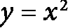
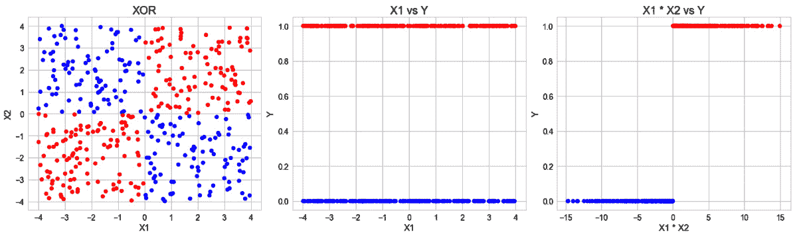
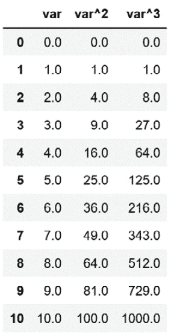
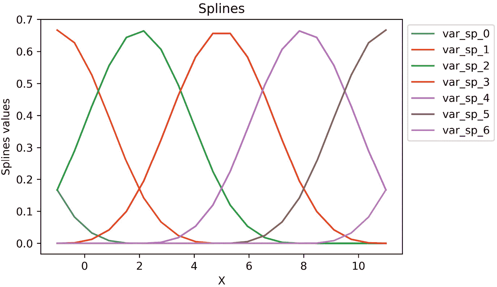

# <st c="0">8</st>

# <st c="2">创建新特征</st>

<st c="23">向数据集中添加新特征可以帮助机器学习模型学习数据中的模式和重要细节。</st> <st c="140">例如，在金融领域，**<st c="169">可支配收入</st>**<st c="186">，即</st> *<st c="201">总收入</st>** <st c="213">减去</st> *<st c="224">已获债务</st>** <st c="237">的任何</st> <st c="245">一个月，可能比仅仅的收入或已获债务更能反映信用风险。</st> <st c="339">同样，一个人在金融产品（如汽车贷款、抵押贷款和信用卡）中的**<st c="354">总已获债务</st>** <st c="373">可能比单独考虑的任何债务更能重要地估计信用风险。</st> <st c="554">在这些例子中，我们使用领域知识来创建新变量，这些变量是通过添加或减去</st> <st c="678">现有特征</st>来创建的。

<st c="696">在某些情况下，一个变量可能与目标没有线性或单调关系，但多项式组合可能会有。</st> <st c="824">例如，如果我们的变量与目标有二次关系，</st> <st c="899"><st c="900">，我们可以通过平方原始变量将其转换为线性关系。</st> <st c="984">我们还可以通过使用样条函数或决策树来转换预测变量，从而帮助线性模型更好地理解变量和目标之间的关系。</st>

<st c="1156">为训练简单的模型（如线性或逻辑回归）创建额外特征的优势在于，特征和模型都保持可解释性。</st> <st c="1330">我们可以向管理层、客户和监管机构解释驱动模型输出的原因，为我们的机器学习管道增加一层透明度。</st> <st c="1488">此外，简单的模型通常训练速度更快，部署和维护也更容易。</st>

<st c="1577">在本章中，我们将通过变换或结合变量与数学函数、样条和决策树来创建新特征。</st>

<st c="1719">本章将涵盖以下配方：</st> <st c="1748">以下内容：</st>

+   <st c="1766">将特征与</st> <st c="1791">数学函数</st>结合

+   <st c="1813">比较特征与</st> <st c="1836">参考变量</st>

+   <st c="1855">执行</st> <st c="1867">多项式展开</st>

+   <st c="1887">将特征与</st> <st c="1912">决策树</st>结合

+   从<st c="1926">周期性变量</st>创建周期性特征

+   <st c="1977">创建</st> <st c="1987">样条特征</st>

# <st c="2002">技术要求</st>

<st c="2025">在本章中，我们将使用</st> `<st c="2059">pandas</st>`<st c="2065">,</st> `<st c="2067">numpy</st>`<st c="2072">,</st> `<st c="2074">matplotlib</st>`<st c="2084">,</st> `<st c="2086">scikit-learn</st>`<st c="2098">, 和</st> `<st c="2104">feature-engine</st>` <st c="2118">Python 库。</st>

# <st c="2136">使用数学函数组合特征</st>

<st c="2183">新特征</st> <st c="2196">可以通过将现有变量与数学和统计函数相结合来创建。</st> <st c="2289">以金融行业为例，我们可以通过将个人金融产品（如汽车贷款、抵押贷款或信用卡债务）的债务总额加起来来计算一个人的总债务：</st> <st c="2348">例如，通过将个人金融产品（如汽车贷款、抵押贷款或信用卡债务）的债务总额加起来来计算一个人的总债务：</st> <st c="2480">总债务 = 汽车贷款债务 + 信用卡债务 + 抵押贷款债务</st>

*<st c="2490">总债务 = 汽车贷款债务 + 信用卡债务 +</st>* *<st c="2539">抵押贷款债务</st>*

<st c="2552">我们还可以使用其他统计运算推导出其他有洞察力的特征。</st> <st c="2640">例如，我们可以确定客户在金融产品中的最大债务或用户在网站上的平均停留时间：</st>

*<st c="2774">最大债务 = max(汽车贷款余额, 信用卡余额,</st>* *<st c="2833">抵押贷款余额)</st>*

*<st c="2850">网站平均停留时间 = mean(在主页上花费的时间, 在关于页面上花费的时间, 在</st>* *<st c="2946">常见问题解答页面上花费的时间)</st>*

<st c="2955">原则上，我们可以使用任何数学或统计运算来创建新特征，例如乘积、平均值、标准差，或最大或最小值。</st> <st c="3125">在本配方中，我们将使用</st> `<st c="3195">pandas</st>` <st c="3201">和</st> `<st c="3206">feature-engine</st>`<st c="3220">来实现这些数学运算。</st>

<st c="3221">注意</st>

<st c="3226">虽然，在配方中，我们可以向您展示如何使用数学函数组合特征，但我们无法公正地展示在决定应用哪个函数时使用领域知识的用法，因为那会随着每个领域而变化。</st> <st c="3440">因此，我们将把这个</st> <st c="3463">留给您。</st>

## <st c="3473">准备中</st>

<st c="3487">在本配方中，我们将使用来自</st> `<st c="3547">scikit-learn</st>`<st c="3559">的乳腺癌数据集。这些特征是从乳腺细胞的数字化图像中计算得出的，并描述了它们的细胞核特征，包括平滑度、凹凸度、对称性和紧凑性等。</st> <st c="3612">每一行都包含有关组织样本中细胞核形态的信息。</st> <st c="3756">目标变量表示组织样本是否对应于癌细胞。</st> <st c="3842">目标是根据细胞核形态预测组织样本是否属于良性或恶性的乳腺细胞。</st>

<st c="4062">为了熟悉数据集，请在 Jupyter 笔记本或</st> <st c="4152">Python 控制台中运行以下命令：</st> <st c="4062">为了熟悉数据集，请在 Jupyter 笔记本或 Python 控制台中运行以下命令：</st>

```py
 from sklearn.datasets import load_breast_cancer
data = load_breast_cancer()
print(data.DESCR)
```

<st c="4261">前面的代码块应该会打印出数据集的描述以及其</st> <st c="4358">变量的</st><st c="4368">解释。</st> <st c="4261">前面的代码块应该会打印出数据集的描述以及其变量的解释。</st>

## <st c="4373">如何操作...</st>

在这个菜谱中，我们将通过使用多种数学运算来组合变量来创建新的特征：<st c="4389">In</st> <st c="4393">这个菜谱中，我们将通过使用多种数学运算来组合变量来创建新的特征：</st> <st c="4472">使用以下多种数学运算来组合变量：</st>

1.  <st c="4496">让我们首先加载必要的库、类和</st> <st c="4554">数据：</st> <st c="4496">让我们首先加载必要的库、类和数据：</st>

    ```py
     import pandas as pd
    from feature_engine.creation import MathFeatures
    from sklearn.datasets import load_breast_cancer
    ```

1.  <st c="4680">接下来，将乳腺癌数据集加载到一个</st> `<st c="4725">pandas</st>` <st c="4731">DataFrame：</st> <st c="4680">接下来，将乳腺癌数据集加载到一个 pandas DataFrame：</st>

    ```py
     data = load_breast_cancer()
    df = pd.DataFrame(data.data,
        columns=data.feature_names)
    ```

    <st c="4827">在以下代码行中，我们将通过使用多种数学运算来组合变量来创建新的特征：</st> <st c="4827">在以下代码行中，我们将通过使用多种数学运算来组合变量来创建新的特征：</st>

1.  <st c="4947">Let’s</st> <st c="4953">begin</st> <st c="4959">by creating a list with the subset of the features that we want</st> <st c="5024">to combine:</st> <st c="4947">让我们首先创建一个列表，包含我们想要组合的特征子集：</st>

    ```py
     features = [
        «mean smoothness",
        «mean compactness",
        «mean concavity",
        «mean concave points",
        «mean symmetry",
    ]
    ```

    <st c="5147">*步骤 3*中的特征代表了图像中细胞核的平均特征。</st> <st c="5164">可能需要获取所有</st> <st c="5170">检查特征的平均值。</st> <st c="5147">*步骤 3*中的特征代表了图像中细胞核的平均特征。</st> <st c="5164">可能需要获取所有检查特征的平均值。</st> <st c="5170">It might be useful to obtain the mean across all</st> <st c="5285">examined characteristics.</st>

1.  <st c="5310">让我们计算特征的均值，然后显示</st> <st c="5314">结果特征：</st> <st c="5374">然后显示计算得到的特征均值：</st>

    ```py
     df["mean_features"] = df[features].mean(axis=1)
    df["mean_features"].head()
    ```

    <st c="5467">以下输出显示了从</st> *<st c="5531">步骤 3</st>*<st c="5537">中得到的特征的均值：</st> <st c="5467">以下输出显示了从*步骤 3*中得到的特征的均值：</st>

    ```py
    <st c="5539">0    0.21702</st>
    <st c="5548">1    0.10033</st>
    <st c="5558">2    0.16034</st>
    <st c="5568">3    0.20654</st>
    <st c="5578">4    0.14326</st>
    <st c="5588">Name: mean_features, dtype: float64</st>
    ```

1.  <st c="5624">同样，为了捕捉细胞核的一般</st> <st c="5638">可变性，让我们确定平均特征的标准差，然后显示</st> <st c="5780">结果特征：</st> <st c="5624">同样，为了捕捉细胞核的一般可变性，让我们确定平均特征的标准差，然后显示结果特征：</st>

    ```py
     df["std_features"] = df[features].std(axis=1)
    df["std_features"].head()
    ```

    <st c="5870">以下输出显示了从</st> <st c="5942">步骤 3</st>中得到的特征的标准差：</st>

    ```py
    <st c="5949">0    0.080321</st>
    <st c="5960">1    0.045671</st>
    <st c="5971">2    0.042333</st>
    <st c="5982">3    0.078097</st>
    <st c="5993">4    0.044402</st>
    <st c="6004">Name: std_features, dtype: float64</st>
    ```

<st c="6039">注意</st>

<st c="6044">当我们根据领域知识构建新的特征时，我们确切地知道我们想要如何组合变量。</st> <st c="6153">我们也可以通过多个操作组合特征，然后使用，例如，特征选择算法或从机器</st> <st c="6354">学习模型中推导特征重要性来评估它们是否具有预测性。</st> <st c="6044">当我们根据领域知识构建新的特征时，我们确切地知道我们想要如何组合变量。</st> <st c="6153">我们也可以通过多个操作组合特征，然后使用，例如，特征选择算法或从机器学习模型中推导特征重要性来评估它们是否具有预测性。</st>

1.  <st c="6369">Le</st><st c="6372">t’s make a list containing mathematical functions that we want to use to combine</st> <st c="6454">the features:</st> <st c="6369">让我们创建一个包含我们想要用于组合特征的数学函数的列表：</st>

    ```py
     math_func = [
        "sum", "prod", "mean", "std", "max", "min"]
    ```

1.  <st c="6525">现在，让我们应用</st> *<st c="6562">步骤 6</st>* <st c="6568">中的函数来组合</st> *<st c="6598">步骤 3</st>*<st c="6604">中的特征，并将结果变量存储在一个新的 DataFrame 中：</st> <st c="6525">现在，让我们应用*步骤 6*中的函数来组合*步骤 3*中的特征，并将结果变量存储在一个新的 DataFrame 中：</st>

    ```py
     df_t = df[features].agg(math_func, axis="columns")
    ```

    <st c="6710">如果我们</st> <st c="6716">执行</st> `<st c="6725">df_t.head()</st>`<st c="6736">`，我们将看到包含新</st> <st c="6779">创建的特征的 DataFrame：</st> <st c="6710">如果我们执行`df_t.head()`，我们将看到包含新创建的特征的 DataFrame：</st>


<st c="7074">图 8.1 – 包含新创建特性的 DataFrame</st>

<st c="7130">注意</st>

`<st c="7135">pandas</st>` `<st c="7142">agg</st>` <st c="7146">可以应用多个函数来组合特性。</st> <st c="7197">它可以接受一个包含函数名称的字符串列表，就像我们在第</st> *<st c="7265">7</st>* <st c="7271">步</st>中做的那样；一个包含 NumPy 函数的列表，例如</st> `<st c="7309">np.log</st>`<st c="7315">；以及你创建的 Python 函数。</st>

<st c="7356">我们可以通过使用</st> `<st c="7440">feature-engine</st>`<st c="7454">来创建与使用</st> `<st c="7410">pandas</st>` <st c="7416">自动创建的相同特性。</st>

1.  <st c="7455">让我们使用输出特性的名称创建一个列表：</st>

    ```py
     new_feature_names = [
        "sum_f", "prod_f", "mean_f",
        „std_f", „max_f", „min_f"]
    ```

1.  <st c="7595">让我们设置</st> `<st c="7609">MathFeatures()</st>` <st c="7623">以将第</st> *<st c="7650">6</st>* <st c="7656">步</st> *<st c="7678">中的</st>* <st c="7684">特性</st> *<st c="7732">应用于第</st>* <st c="7738">8</st>* <st c="7738">步</st>中的字符串，并将新特性命名为第</st> *<st c="7732">8</st>* <st c="7738">步</st>中的字符串：</st>

    ```py
     create = MathFeatures(
        variables=features,
        func=math_func,
        new_variables_names=new_feature_names,
    )
    ```

1.  <st c="7840">让我们将</st> <st c="7851">新特性</st> <st c="7867">添加到原始 DataFrame 中，并将结果保存在一个</st> <st c="7921">新变量</st>中：</st>

    ```py
     df_t = create.fit_transform(df)
    ```

    <st c="7966">我们可以通过执行</st> `<st c="8025">df_t[features +</st>` `<st c="8041">new_feature_name</st><st c="8057">s].head()</st>`<st c="8067">来显示输入和输出特性</st>：


<st c="8621">图 8.2 – 包含输入特性和新创建变量的 DataFrame</st>

<st c="8699">当</st> `<st c="8706">pandas</st>` `<st c="8712">agg</st>` <st c="8716">返回一个包含操作结果的特性 DataFrame 时，</st> `<st c="8785">feature-engine</st>` <st c="8799">会进一步操作，通过将新特性连接到</st> <st c="8864">原始</st> <st c="8873">DataFrame</st>上。</st>

## <st c="8883">它是如何工作的...</st>

`<st c="8899">pandas</st>` <st c="8906">有许多内置操作，可以将数学和统计计算应用于一组变量。</st> <st c="9012">为了在数学上组合特征，我们首先创建了一个包含我们想要组合的特征名称的列表。</st> <st c="9128">然后，我们使用 <st c="9207">pandas</st> `<st c="9213">mean()</st>` <st c="9220">和 <st c="9225">std()</st> <st c="9230">来确定这些特征的均值和标准差。</st> 我们还可以应用任何 <st c="9263">sum()</st> <st c="9268">、<st c="9270">prod()</st> <st c="9276">、<st c="9278">max()</st> <st c="9283">和 <st c="9289">min()</st> <st c="9294">方法，分别返回这些特征的求和、乘积、最大值和最小值。</st> <st c="9396">为了在列上执行这些操作，我们在方法中添加了 <st c="9457">axis=1</st> <st c="9463">参数。</st>

<st c="9492">使用 pandas `<st c="9505">agg()</st>` <st c="9510">，我们同时应用了几个数学函数。</st> 它接受一个字符串列表作为参数，对应要应用的功能和应该应用功能的 <st c="9659">axis</st> <st c="9663">，可以是 <st c="9725">1</st> <st c="9726">（列）或 <st c="9742">0</st> <st c="9743">（行）。</st> <st c="9754">因此，pandas `<st c="9774">agg()</st>` <st c="9779">返回了一个 <st c="9791">pandas</st> <st c="9797">DataFrame，它是通过将数学函数应用于特征组 <st c="9874">而得到的。</st>

<st c="9886">最后，</st> <st c="9895">我们</st> <st c="9899">通过将变量与</st> `<st c="9953">特征工程</st>`<st c="9967">结合</st> <st c="9981">创建了相同的特征。</st> 我们使用了 <st c="9981">MathFeatures()</st> <st c="9995">转换器，它接受要组合的特征和要应用的功能作为输入；它还可以选择指示结果的特征的名称。</st> <st c="10154">当我们使用 <st c="10167">fit()</st> <st c="10172">时，转换器没有学习参数，而是检查变量确实是数值的。</st> <st c="10269">`<st c="10273">transform()</st>` <st c="10284">方法触发了在底层使用 `<st c="10313">pandas.agg</st>` <st c="10323">，应用数学函数来创建新的变量。</st>

## <st c="10405">另请参阅</st>

<st c="10414">要了解更多关于 `<st c="10479">pandas</st>` <st c="10485">支持的数学运算，请访问</st> [<st c="10493">https://pandas.pydata.org/pandas-docs/stable/reference/frame.html#computations-descriptive-stats</st>](https://pandas.pydata.org/pandas-docs/stable/reference/frame.html#computations-descriptive-stats)<st c="10589">。</st>

[了解更多关于](https://pandas.pydata.org/pandas-docs/stable/reference/api/pandas.DataFrame.agg<st c="10718">regate.html</st>) `<st c="10611">pandas</st>` `<st c="10617">聚合</st>` 的信息。

# <st c="10731">比较特征与参考变量</st>

<st c="10774">在</st> <st c="10782">之前的配方中</st>，*<st c="10799">通过数学函数组合特征</st>*<st c="10845">，我们通过应用数学</st> <st c="10895">或统计函数，如总和或平均值，到一组变量上，创建了新的特征。</st> <st c="10976">然而，一些数学运算，例如减法或除法，是在</st> *<st c="11062">特征之间</st>* <st c="11069">执行的。</st> <st c="11080">这些操作对于推导比率，如</st> *<st c="11139">债务收入比</st>*<st c="11159">，很有用：</st>

*<st c="11161">债务收入比 = 总债务 /</st>* *<st c="11197">总收入</st>*

<st c="11209">这些操作</st> <st c="11227">也很有用，可以计算差异，例如</st> *<st c="11279">可支配收入</st>*<st c="11296">：</st>

*<st c="11298">可支配收入 = 收入 -</st>* *<st c="11327">总债务</st>*

<st c="11337">在本配方中，我们将学习如何通过使用</st> `<st c="11437">pandas</st>` <st c="11443">和</st> `<st c="11448">feature-engine</st>`<st c="11462">来减法或除法变量创建新的特征。</st>

<st c="11463">注意</st>

<st c="11468">在配方中，我们将向您展示如何通过减法和除法创建特征。</st> <st c="11555">我们希望这些与金融部门相关的示例能阐明如何使用领域知识来决定哪些特征需要</st> <st c="11691">组合</st> <st c="11699">以及如何组合。</st>

## <st c="11707">如何做</st> <st c="11717">它…</st>

<st c="11721">让我们首先加载必要的 Python 库和来自 scikit-learn 的乳腺癌数据集</st> <st c="11806">：</st>

1.  <st c="11824">加载必要的库、类和数据：</st>

    ```py
     import pandas as pd
    from feature_engine.creation import RelativeFeatures
    from sklearn.datasets import load_breast_cancer
    ```

1.  <st c="11994">将乳腺癌数据集加载到一个</st> `<st c="12033">pandas</st>` <st c="12039">DataFrame：</st>

    ```py
     data = load_breast_cancer()
    df = pd.DataFrame(data.data,
        columns=data.feature_names)
    ```

    <st c="12135">在乳腺癌数据集中，一些特征捕捉了乳腺细胞细胞核的最坏和平均特征。</st> <st c="12263">例如，对于每个图像（即每行），我们都有所有核中最差的紧密度和所有核的平均紧密度。</st> <st c="12409">一个捕捉最坏值和平均值之间差异的特征</st> <st c="12484">可以预测恶性。</st>

1.  <st c="12510">让我们捕捉两个特征之间的差异，即</st> `<st c="12566">最差紧密度</st>` <st c="12583">和</st> `<st c="12588">平均紧密度</st>` <st c="12604">的细胞核，在一个新的变量中，并显示其值：</st> <st c="12652">其值：</st>

    ```py
     df["difference"] = df["worst compactness"].sub(
        df["mean compactness"])
    df["difference"].head()
    ```

    <st c="12760">在以下输出中，我们可以看到这些特征值之间的差异：</st>

    ```py
    <st c="12841">0    0.38800</st>
    <st c="12851">1    0.10796</st>
    <st c="12861">2    0.26460</st>
    <st c="12871">3    0.58240</st>
    <st c="12881">4    0.07220</st>
    <st c="12891">Name: difference, dtype: float64</st>
    ```

<st c="12924">注意</st>

<st c="12929">我们可以通过执行</st> `<st c="12979">df["difference"] = df["worst compactness"] - (</st>```<st c="13025">df["mean compactness"])</st>`<st c="13049">来执行相同的计算。</st>

<st c="13050">同样，细胞核最差特征与平均特征之间的比率可能表明恶性。</st> <st c="13160">恶性。</st>

1.  <st c="13174">让我们创建一个新特征，该特征包含核最差半径与平均半径之间的比率，然后显示其值：</st> <st c="13283">其值：</st>

    ```py
     df["quotient"] = df["worst radius"].div(
        df["mean radius"])
    df["quotient"].head()
    ```

    <st c="13376">在以下输出中，我们可以看到与特征之间的比率对应的值：</st> <st c="13417">以下输出中，我们可以看到这些特征值之间的差异：</st>

    ```py
    <st c="13472">0    1.410784</st>
    <st c="13483">1    1.214876</st>
    <st c="13494">2    1.197054</st>
    <st c="13505">3    1.305604</st>
    <st c="13516">4    1.110892</st>
    <st c="13527">Name: quotient, dtype: float64</st>
    ```

<st c="13558">注意</st>

<st c="13563">我们可以通过执行一个替代命令来计算比率，</st> `<st c="13628">df["quotient"] = df["worst radius"] / (</st>```<st c="13667">df["me</st><st c="13674">an radius"])</st>`<st c="13687">。</st>

<st c="13688">我们还可以捕捉每个核形态特征与核的平均半径或平均面积之间的比率和差异。</st> <st c="13829">让我们首先将这些变量的子集</st> <st c="13881">捕获到列表中。</st>

1.  <st c="13892">让我们列出分子中的特征：</st> <st c="13930">分子：</st>

    ```py
     features = [
        "mean smoothness",
        «mean compactness",
        "mean concavity",
        "mean symmetry"
    ]
    ```

1.  <st c="14032">让我们列出分母中的特征：</st> <st c="14070">分母：</st>

    ```py
     reference = ["mean radius", "mean area"]
    ```

<st c="14127">注意</st>

<st c="14132">我们可以通过将步骤 5 中的特征除以步骤 6 中的特征之一来创建特征，通过执行</st> `<st c="14250">df[features].div(df["mean radius"])</st>`<st c="14285">。对于减法，我们将执行</st> `<st c="14317">df[features].sub(df["mean radius"])</st>`<st c="14352">。</st>

1.  <st c="14353">让我们设置</st> <st c="14364">`feature-engine`</st> <st c="14371">库的</st> `<st c="14396">RelativeFeatures()</st>` <st c="14414">，以便它从步骤 5 中的每个特征中减去或除以步骤 6 中的特征：</st> <st c="14513">：</st>

    ```py
     creator = RelativeFeatures(
        variables=features,
        reference=reference,
        func=["sub", "div"],
    )
    ```

<st c="14607">注意</st>

<st c="14612">从步骤 5 和步骤 6 中减去特征没有生物学意义，但我们将这样做以演示使用</st> `<st c="14748">RelativeFeatures()</st>` <st c="14766">转换器。</st>

1.  <st c="14779">让我们将新特征添加到 DataFrame 中，并将结果保存在一个</st> <st c="14852">新变量</st>中：

    ```py
     df_t = creator.fit_transform(df)
    ```

1.  <st c="14898">让我们将新特征的名称保存在</st> <st c="14946">一个列表</st>中：

    ```py
     all_feat = creator.feature_names_in_
    new_features = [
        f for f in df_t.columns if f not in all_feat]
    ```

<st c="15053">注意</st>

`<st c="15058">feature_names_in_</st>` <st c="15076">是</st> <st c="15082">scikit-learn</st> <st c="15102">和</st> `<st c="15119">feature-engine</st>` <st c="15133">转换器中的一个常见属性，它存储了用于拟合转换器的 DataFrame 中的变量名称。</st> <st c="15232">换句话说，它存储了输入特征的名称。</st> <st c="15291">当使用</st> `<st c="15302">transform()</st>`<st c="15313">时，转换器会检查新输入数据集中的特征是否与训练期间使用的特征匹配。</st> <st c="15417">在</st> *<st c="15420">步骤 9</st>*<st c="15426">中，我们利用这个属性来查找在转换后添加到数据中的额外变量。</st>

<st c="15531">如果我们</st> <st c="15537">执行</st> `<st c="15546">print(new_features)</st>`<st c="15565">，我们将看到一个包含由</st> `<st c="15628">ReferenceFeatures()</st>`<st c="15647">创建的特征名称的列表。</st> <st c="15654">注意</st> <st c="15654">，这些特征包含数学方程式左侧和右侧的变量，以及应用于它们的函数以创建</st> <st c="15815">新特征：</st>

```py
 ['mean smoothness_sub_mean radius',
'mean compactness_sub_mean radius',
'mean concavity_sub_mean radius',
'mean symmetry_sub_mean radius',
'mean smoothness_sub_mean area',
'mean compactness_sub_mean area',
'mean concavity_sub_mean area',
'mean symmetry_sub_mean area',
'mean smoothness_div_mean radius',
'mean compactness_div_mean radius',
'mean concavity_div_mean radius',
'mean symmetry_div_mean radius',
'mean smoothness_div_mean area',
'mean compactness_div_mean area',
'mean concavity_div_mean area',
'mean symmetry_div_mean area']
```

<st c="16364">最后，我们可以通过</st> <st c="16439">执行</st> `<st c="16449">df</st><st c="16451">_t[new_features].head()</st>`<st c="16475">:</st>


<st c="16983">图 8.3 – 包含新创建特征的 DataFrame</st>

`<st c="17039">feature-engine</st>` <st c="17054">将</st> <st c="17060">新特征作为列</st> <st c="17083">添加到原始 DataFrame 的右侧，并自动将这些特征的变量名添加到其中。</st> <st c="17180">通过这样做，</st> `<st c="17193">feature-engine</st>` <st c="17207">自动化了我们本应使用</st><st c="17245">pandas</st> <st c="17271">完成的许多手动工作。</st>

## <st c="17272">它是如何工作的...</st>

`<st c="17288">pandas</st>` <st c="17295">有许多内置操作可以比较一个特征或一组特征与一个参考变量。</st> <st c="17394">在这个配方中，我们使用了 pandas</st> `<st c="17425">sub()</st>` <st c="17430">和</st> `<st c="17435">div()</st>` <st c="17440">来确定两个变量或一组变量与一个</st> <st c="17538">参考特征</st><st c="17542">之间的差异或比率。</st>

为了从一个变量中减去另一个变量，我们对第一个变量应用了`<st c="17608">sub()</st>` `<st c="17613">`到`<st c="17619">pandas</st>` `<st c="17625">`系列，并将第二个变量的`<st c="17670">pandas</st>` `<st c="17676">`系列作为参数传递给`<st c="17727">sub()</st>` `<st c="17732">`。这个操作返回了一个第三个`<st c="17766">pandas</st>` `<st c="17772">`系列，其中包含第一个和第二个变量之间的差值。《st c="17840">要除以另一个变量，我们使用了</st> `<st c="17885">div()</st>` `<st c="17890">`，它的工作方式与`<st c="17919">sub()</st>` `<st c="17924">`相同——也就是说，它将左侧的变量除以作为`<st c="18013">div()</st>` `<st c="18018">`参数传递的变量。

然后，我们通过利用`<st c="18141">ReferenceFeatures()</st>` `<st c="18160">from</st> `<st c="18166">Feature-engine</st>`<st c="18180">`自动将几个变量与两个参考变量通过减法或除法组合起来。`<st c="18186">ReferenceFeatures()</st>` `<st c="18205">transformer`接受要组合的变量、参考变量以及用于组合它们的函数。`<st c="18321">当使用</st> `<st c="18332">fit()</st>`<st c="18337">`时，转换器没有学习参数，而是检查了变量是否为数值型。《st c="18433">执行</st> `<st c="18443">transform()</st>` `<st c="18454">`将新特征添加到`<st c="18481">DataFrame</st>`中。

备注

`<st c="18500">ReferenceFeatures()</st>` `<st c="18520">`还可以对与第二组参考变量相关的一组变量进行加法、乘法、取模或求幂操作。《st c="18653">您可以在其</st> `<st c="18682">文档</st>` `<st c="18697">[`feature-engine.readthedocs.io/en/latest/api_doc/creation/RelativeFeatures.html`](https://feature-engine.readthedocs.io/en/latest/api_doc/creation/RelativeFeatures.html)` `<st c="18783">`中了解更多信息。

## 参见

要了解更多关于`<st c="18849">pandas</st>` `<st c="18855">`支持的二进制操作，请访问[`pandas.pydata.org/pandas-docs/stable/reference/frame.html#binary-operator-functions`](https://pandas.pydata.org/pandas-docs/stable/reference/frame.html#binary-operator-functions)。

# 执行多项式展开

<st c="18987">简单的</st> <st c="18995">模型，例如线性回归和逻辑回归，如果我们向它们提供正确的特征，可以捕捉到复杂的模式。</st> <st c="19108">有时，我们可以通过将数据集中的变量与自身或其他变量组合来创建强大的特征。</st> <st c="19235">例如，在下面的图中，我们可以看到目标，</st> *<st c="19301">y</st>*<st c="19302">，与变量，</st> *<st c="19348">x</st>*<st c="19349">，具有二次关系，并且如图左侧面板所示，线性模型无法准确捕捉这种</st> <st c="19426">关系：</st>


<st c="19506">图 8.4 – 一个线性模型拟合预测目标 y，其中特征 x 与目标具有二次关系，在平方 x 之前和之后。</st> <st c="19660">在左侧面板：模型使用原始变量提供较差的拟合；在右侧面板，模型基于原始变量的平方提供更好的拟合</st><st c="19808">的平方</st>

<st c="19835">这个线性</st> <st c="19848">模型在平方</st> *<st c="19924">x</st>*<st c="19925">之前和之后都与目标具有二次关系。然而，如果我们平方</st> *<st c="19949">x</st>*<st c="19950">，换句话说，如果我们创建特征的二次多项式，线性模型可以准确地从</st> *<st c="20102">x</st>*<st c="20103">的平方预测目标，</st> *<st c="20080">y</st>*<st c="20081">，正如我们在</st> <st c="20122">右侧面板中看到的那样。</st>

<st c="20134">另一个简单的特征可以使简单模型，如逻辑回归，理解数据中潜在关系的经典例子是**<st c="20299">XOR</st>** <st c="20302">情况。</st> <st c="20314">在以下图的左侧面板中，我们看到目标类别是如何分布在</st> *<st c="20422">x1</st>* <st c="20424">和</st> *<st c="20429">x2</st>* <st c="20431">（类别用不同的</st> <st c="20473">颜色阴影突出显示）的值上的：</st>



<st c="20592">图 8.5 – XOR 关系示意图以及如何通过组合特征实现完整的类别分离</st>

<st c="20702">如果两个特征都是正的，或者两个特征都是负的，那么类别是 1，但如果特征具有不同的符号，那么类别是 0（左侧面板）。</st> <st c="20862">逻辑回归无法从每个单独的特征中识别出这种模式，因为，如中间面板所示，特征值之间存在显著的类别重叠 – 在这种情况下，x1。</st> <st c="20998">然而，将 x1 乘以 x2 创建了一个特征，这使得逻辑回归能够准确预测类别，因为 x3，如右面板所示，允许类别被</st> <st c="21268">清楚地分离。</st>

<st c="21286">使用类似的逻辑，相同或不同变量的多项式组合可以返回包含额外信息的新变量，并捕获特征交互，从而为线性模型提供有用的输入。</st> <st c="21512">在大型数据集中，分析每个可能的变量组合并不总是可能的。</st> <st c="21602">但我们可以使用例如</st> `<st c="21684">scikit-learn</st>`<st c="21696">自动创建几个多项式变量，并让模型决定哪些变量是有用的。</st> <st c="21758">在这个菜谱中，我们将学习如何使用 scikit-learn 通过多项式组合创建多个特征。</st>

## <st c="21872">准备就绪</st>

<st c="21886">多项式展开用于自动化新特征的创建，捕获特征交互，以及原始变量和目标之间的潜在非线性关系。</st> <st c="22072">要创建多项式特征，我们需要确定要组合哪些特征以及使用哪个多项式度数</st> <st c="22178">。</st>

<st c="22185">注意</st>

<st c="22190">虽然确定要组合的特征或多项式组合的度数不是一项容易的任务，但请记住，高多项式度数将导致大量新特征的生成，并可能导致过拟合。</st> <st c="22406">一般来说，我们保持度数较低，最多为 2</st> <st c="22460">或 3。</st>

<st c="22465">The</st> `<st c="22470">PolynomialFeatures()</st>` <st c="22490">转换器来自</st> `<st c="22508">scikit-learn</st>` <st c="22520">，它自动创建小于或等于用户指定</st> <st c="22622">度数的特征的多项式组合。</st>

<st c="22644">为了轻松跟进这个菜谱，让我们首先了解当使用</st> `<st c="22720">PolynomialFeatures()</st>` <st c="22740">创建三个变量的二次和三次多项式组合时的输出。</st>

<st c="22830">三个变量的二次多项式组合 –</st> *<st c="22890">a</st>*<st c="22891">,</st> *<st c="22893">b</st>*<st c="22894">, 和</st> *<st c="22900">c</st>* <st c="22901">– 将返回以下</st> <st c="22930">新特征：</st>

*<st c="22943">1, a, b, c, ab, ac, bc, a2,</st>* *<st c="22972">b2, c2</st>*

<st c="22978">从前面的特征中，</st> *<st c="22983">a</st>*<st c="22984">,</st> *<st c="22986">b</st>*<st c="22987">, 和</st> *<st c="22993">c</st>* <st c="22994">是原始变量；</st> *<st c="23023">ab</st>*<st c="23025">,</st> *<st c="23027">ac</st>*<st c="23029">, 和</st> *<st c="23035">bc</st>* <st c="23037">是这些特征的乘积；并且</st> *<st c="23128">a2</st>*<st c="23130">,</st> *<st c="23132">b2</st>*<st c="23134">, 和</st> *<st c="23140">c2</st>* <st c="23142">是原始特征的平方值。</st> `<st c="23166">PolynomialFeatures()</st>` <st c="23186">还返回偏置项</st> *<st c="23214">1</st>*<st c="23215">，在创建特征时我们可能会排除它。</st>

<st c="23272">注意</st>

<st c="23277">结果特征 –</st> *<st c="23303">ab</st>*<st c="23305">,</st> *<st c="23307">ac</st>*<st c="23309">, 和</st> *<st c="23315">bc</st>* <st c="23317">– 被称为</st> <st c="23324">**交互**</st> <st c="23344">或</st> **<st c="23372">二阶</st>**<st c="23380">的特征交互。度数</st> <st c="23392">反映了组合的变量数量。</st> <st c="23435">结果最多组合两个变量，因为我们指定了二次多项式为允许的最大组合。</st>

<st c="23565">三个变量的三次多项式组合 –</st> *<st c="23628">a</st>*<st c="23629">,</st> *<st c="23631">b</st>*<st c="23632">, 和</st> *<st c="23638">c</st>* <st c="23639">– 将返回以下</st> <st c="23668">新特征：</st>

*<st c="23681">1, a, b, c, ab, ac, bc, abc, a2b, a2c, b2a, b2c, c2a, c2b, a3,</st>* *<st c="23745">b3, c3</st>*

在返回的特征中，除了由二次多项式组合返回的特征外，我们现在还有特征与自身进行的三次组合（<st c="23751">a3</st>、<st c="23931">b3</st>、<st c="23934">、<st c="23936">c3</st>），每个特征与第二个特征进行线性组合的平方值（<st c="24027">a2b</st>、<st c="24031">a2c</st>、<st c="24033">b2a</st>、<st c="24043">b2c</st>、<st c="24048">c2a</st>、<st c="24057">c2b</st>），以及三个特征的乘积（<st c="24103">abc</st>）。</st> <st c="24111">注意我们如何包含了所有可能的一、二、三次度的交互以及偏差</st> <st c="24190">项</st> *<st c="24194">1</st>。</st>

<st c="24197">现在我们理解了由`<st c="24275">scikit-lea</st><st c="24285">rn</st>`<st c="24288">`实现的`多项式展开的输出，让我们直接进入</st> <st c="24306">步骤。</st>

## <st c="24317">如何操作...</st>

<st c="24333">在这个</st> <st c="24342">步骤中，我们将使用一个玩具数据集创建具有多项式展开的特征，以便熟悉生成的变量。</st> <st c="24469">创建具有真实数据集多项式展开的特征与我们在</st> <st c="24575">本步骤中讨论的内容相同：</st>

1.  <st c="24587">让我们导入所需的库、类</st> <st c="24634">和数据：</st>

    ```py
     import numpy as np
    import pandas as pd
    import matplotlib.pyplot as plt
    from sklearn import set_config
    from sklearn.preprocessing import PolynomialFeatures
    ```

1.  <st c="24798">让我们设置`<st c="24809">scikit-learn</st>` <st c="24821">库的`<st c="24832">set_output</st>` <st c="24842">API 全局，以便所有转换器在`<st c="24919">transform()</st>` <st c="24930">方法的结果返回一个 DataFrame：</st>

    ```py
     set_config(transform_output="pandas")
    ```

1.  <st c="24976">让我们</st> <st c="24983">创建一个包含一个变量的 DataFrame，其值从 1</st> <st c="25046">到 10：</st>

    ```py
     df = pd.DataFrame(np.linspace(
        0, 10, 11), columns=["var"])
    ```

1.  <st c="25112">让我们设置</st> `<st c="25126">PolynomialFeatures()</st>` <st c="25146">以创建单变量的所有可能的三次多项式组合，并从结果中排除偏差项 – 即，我们将排除</st> <st c="25311">值</st> *<st c="25317">1</st>。</st>

    ```py
     poly = PolynomialFeatures(
        degree=3,
        interaction_only=False,
        include_bias=False)
    ```

1.  <st c="25400">现在，让我们创建</st> <st c="25423">多项式组合：</st>

    ```py
     dft = poly.fit_transform(df)
    ```

    <st c="25476">如果我们执行</st> `<st c="25491">dft</st>`<st c="25494">`，我们将</st> <st c="25502">看到一个包含原始特征、其值的平方以及其值的三次幂的 DataFrame：</st>



<st c="25812">图 8.6 – 一个包含单变量三次多项式展开的 DataFrame</st>

<st c="25907">如果我们</st> <st c="25920">不返回一个 DataFrame，</st> `<st c="25946">PolynomialFeatures()</st>` <st c="25966">返回一个 NumPy 数组，并且你想获取数组中特征的名称，你可以通过执行</st> `<st c="26079">poly.get_feature_names_out()</st>`<st c="26107">来实现，它返回</st> `<st c="26123">array(['var', 'var²', '</st>``<st c="26147">var³'], dtype=object)</st>`<st c="26170">。</st>

1.  <st c="26171">现在，让我们将新的特征值与原始变量进行绘图：</st>

    ```py
     dft = pd.DataFrame(
        dft, columns=poly.get_feature_names_out())
    plt.plot(df["var"], dft)
    plt.legend(dft.columns)
    plt.xlabel("original variable")
    plt.ylabel("new variables")
    plt.show()
    ```

    <st c="26424">在下面的图中，我们可以看到多项式特征与原始变量之间的关系：</st>


<st c="26645">图 8.7 – 多项式展开得到的特征与原始变量的关系</st>

1.  <st c="26757">让我们向我们的玩具数据集添加</st> <st c="26768">两个额外的变量，其值从 1</st> <st c="26832">到 10：</st>

    ```py
     df["col"] = np.linspace(0, 5, 11)
    df["feat"] = np.linspace(0, 5, 11)
    ```

1.  <st c="26907">接下来，让我们将数据集中的三个特征与多项式展开到二次度相结合，但这次，我们只返回由至少两个不同变量组合产生的特征——即，交互特征：</st>

    ```py
     poly = PolynomialFeatures(
        degree=2, interaction_only=True,
        include_bias=False)
    dft = poly.fit_transform(df)
    ```

    <st c="27257">如果我们执行</st> `<st c="27272">dft</st>`<st c="27275">，我们将看到多项式展开得到的所有特征，这些特征包含原始特征，以及三个变量的所有可能的组合，但没有二次项，因为我们设置了转换器只返回</st> <st c="27508">特征的交互</st> <st c="27524">作用：</st>


<st c="27849">图 8.8 – 使用多项式展开创建特征但仅保留变量之间交互作用的 DataFrame</st><st c="27970">。</st>

<st c="27990">注意</st>

<st c="27995">继续创建特征的立方度多项式组合，只返回交互作用或所有可能的特征，以更好地理解</st> <st c="28163">PolynomialFeatures()</st>`<st c="28186">的输出。</st>

<st c="28187">有了这些，我们就</st> <st c="28205">学会了如何通过将现有变量与其自身或其他特征相结合来创建新的特征。</st> <st c="28315">使用真实数据集通过多项式展开创建特征，在本质上，是相同的。</st>

如果您只想组合特征的一个子集，您可以通过使用</st> `<st c="28508">ColumnTransformer()</st>`<st c="28527">来选择要组合的特征，正如我们将在本食谱中的*<st c="28559">更多内容…</st>* <st c="28572">部分中展示的那样，或者使用</st> `<st c="28615">SklearnTransformerWrapper()</st>` <st c="28642">来自</st> `<st c="28648">feature-engine</st>`<st c="28662">，正如您可以在随附的 GitHub</st> <st c="28706">存储库中看到的那样：</st> [<st c="28718">https://github.com/PacktPublishing/Python-Feature-Engineering-Cookbook-Third-Edition/blob/main/ch08-creation/</st><st c="28827">Recipe3-PolynomialExpansion.ipynb</st>](https://github.com/PacktPublishing/Python-Feature-Engineering-Cookbook-Third-Edition/blob/main/ch08-creation/Recipe3-PolynomialExpansion.ipynb)<st c="28861">。</st>

## <st c="28862">它是如何工作的...</st>

在这个方法中，我们通过使用特征与其自身或三个变量之间的多项式组合来创建特征。<st c="28898">为了创建这些多项式特征，我们使用了</st> `<st c="29044">PolynomialFeatures()</st>` <st c="29064">来自</st> `<st c="29070">scikit-learn</st>`<st c="29082">。默认情况下，</st> `<st c="29096">Polynomia</st><st c="29105">lFeatures()</st>` <st c="29117">生成一个新的特征矩阵，其中包含数据中所有特征的所有多项式组合，其次数小于或等于用户指定的</st> `<st c="29275">degree</st>`<st c="29281">。将</st> `<st c="29294">degree</st>` <st c="29300">设置为</st> `<st c="29304">3</st>`<st c="29305">，我们创建了所有可能的三次或更低次数的多项式组合。</st> <st c="29384">为了保留特征与其自身的组合，我们将</st> `<st c="29447">interaction_only</st>` <st c="29463">参数设置为</st> `<st c="29477">False</st>`<st c="29482">。为了避免返回偏差项，我们将</st> `<st c="29529">include_bias</st>` <st c="29541">参数设置为</st> `<st c="29555">False</st>`<st c="29560">。</st>

<st c="29561">注意</st>

<st c="29566">将</st> `<st c="29579">interaction_only</st>` <st c="29595">参数设置为</st> `<st c="29609">True</st>` <st c="29613">仅返回交互项——即由两个或更多变量组合而成的变量。</st>

`<st c="29727">fit()</st>` `<st c="29732">method</st>`根据指定的参数确定了所有可能的特征组合。在这个阶段，转换器没有执行实际的数学计算。`<st c="29917">transform()</st>` `<st c="29928">method</st>`使用特征执行数学计算以创建新的变量。通过`<st c="30032">get_feature_names()</st>` `<st c="30051">method</st>`，我们可以识别展开的项 - 即每个新特征是如何计算的。

在**步骤 2**中，我们设置`<st c="30171">scikit-learn</st>`库的`<st c="30183">library’s</st>` `<st c="30194">set_output</st>` `<st c="30204">API</st>` `<st c="30228">pandas</st>` `<st c="30234">DataFrames</st>`作为`<st c="30265">transform()</st>` `<st c="30276">method</st>`的结果。`<st c="30285">scikit-learn transformers</st>`默认返回`<st c="30318">NumPy</st>` `<st c="30323">arrays</st>`。新的`<st c="30351">set_output</st>` `<st c="30361">API</st>`允许我们将结果的容器更改为`<st c="30419">pandas</st>` `<st c="30425">或</st>` `<st c="30431">polars</st>` `<st c="30437">DataFrame</st>`。每次设置转换器时，我们都可以单独设置输出 - 例如，通过使用`<st c="30543">poly = PolynomialFeatures().set_output(transform="pandas")</st>` `<st c="30601">`。或者，就像在这个食谱中做的那样，我们可以设置全局配置，然后每次设置新的转换器时，`<st c="30729">它将返回一个</st>` `<st c="30747">pandas</st>` `<st c="30753">DataFrame</st>`。

## 更多...

通过对乳腺癌数据集中变量的子集进行多项式展开来创建特征：

1.  首先，导入必要的库、类和数据：

    ```py
     import pandas as pd
    from sklearn.datasets import load_breast_cancer
    from sklearn.compose import ColumnTransformer
    from sklearn.model_selection import train_test_split
    from sklearn.preprocessing import PolynomialFeatures
    ```

1.  然后，加载数据并将其分为训练集和测试集：

    ```py
     data = load_breast_cancer()
    df = pd.DataFrame(data.data,
        columns=data.feature_names)
    X_train, X_test, y_train, y_test = train_test_split(
        df, data.target, test_size=0.3, random_state=0
    )
    ```

1.  创建一个包含要组合的特征的列表：

    ```py
     features = [
        "mean smoothness",
        "mean compactness",
        "mean concavity"]
    ```

1.  将`<st c="31539">PolynomialFeatures()</st>` `<st c="31559">`设置为创建所有可能的三次方组合：

    ```py
     poly = PolynomialFeatures(
        degree=3,
        interaction_only=False,
        include_bias=False)
    ```

1.  设置列转换器以仅从**步骤 3**中指定的特征创建特征：

    ```py
     ct = ColumnTransformer([("poly", poly, features)])
    ```

1.  创建多项式特征：

    ```py
     train_t = ct.fit_transform(X_train)
    test_t = ct.transform(X_test)
    ```

就这样。

注意

`<st c="32039">ColumnTransformer()</st>` <st c="32059">将向结果变量追加单词</st> `<st c="32081">poly</st>` <st c="32085">，这是我们为</st> `<st c="32159">ColumnTransformer()</st>` <st c="32178">中的步骤</st> *<st c="32182">步骤 5</st>*<st c="32188">所赋予的名称。我不是特别喜欢这种行为，因为它使得数据分析变得更加困难，因为你需要跟踪变量名称的变化。</st> <st c="32322">为了避免变量名称的变化，你可以使用</st> `<st c="32366">feature-engine</st>`<st c="32380">的</st> `<st c="32383">SklearnTransformerWrapper()</st>` <st c="32411">代替。</st>

# <st c="32420">将特征与决策树结合</st>

<st c="32459">在 2009 年</st> <st c="32466">知识发现与数据挖掘（</st>**<st c="32491">知识发现和数据挖掘（KDD）**</st>**<st c="32528">KDD</st>**<st c="32532">）竞赛的获奖方案中，作者通过使用决策树结合两个或多个变量来创建新的特征。</st> <st c="32553">在检查变量时，他们注意到一些特征与目标变量具有高度的互信息，但相关性较低，这表明与目标变量的关系不是线性的。</st> <st c="32647">当使用基于树的算法时，这些特征是可预测的，但线性模型无法利用它们。</st> <st c="32850">因此，为了在线性模型中使用这些特征，他们用训练在单个特征或两个或三个变量组合上的决策树输出的特征替换了这些特征，从而得到与目标变量呈单调关系的新的特征。</st> <st c="33217">。</st>

<st c="33228">简而言之，将特征与决策树结合使用对于创建与目标变量呈单调关系的特征是有用的，这对于使用线性模型进行准确预测很有帮助</st> <st c="33409">来说。</st> <st c="33431">该过程包括使用特征子集训练决策树——通常是一次一个、两个或三个——然后使用树的预测作为</st> <st c="33604">新的特征。</st>

<st c="33616">注意</st>

<st c="33621">您可以在本文中找到有关此过程和 2009 年 KDD 数据竞赛整体获奖方案的更多详细信息：</st> <st c="33743">[</st> <st c="33752">http://proceedings.mlr.press/v7/niculescu09/niculescu09.pdf</st>](http://proceedings.mlr.press/v7/niculescu09/niculescu09.pdf)<st c="33811">。</st>

<st c="33812">好消息是，我们可以使用`feature-engine`自动化使用树创建特征，在这个菜谱中，我们将学习如何</st> <st c="33953">做到这一点。</st>

## <st c="33959">如何做到...</st>

<st c="33975">在这个菜谱中，我们将使用加利福尼亚</st> <st c="34057">住房数据集</st>来结合特征与决策树：</st>

1.  <st c="34073">让我们首先导入</st> `<st c="34099">pandas</st>` <st c="34105">和所需的函数、类、</st> <st c="34143">以及数据集：</st>

    ```py
     import numpy as np
    import pandas as pd
    import matplotlib.pyplot as plt
    from sklearn.datasets import fetch_california_housing
    from sklearn.model_selection import train_test_split
    from <st c="34339">feature_engine.creation</st>, import DecisionTreeFeatures
    ```

1.  <st c="34391">让我们将加利福尼亚住房数据集加载到一个</st> `<st c="34441">pandas</st>` <st c="34447">DataFrame 中，并删除</st> `<st c="34473">纬度</st>` <st c="34481">和</st> `<st c="34486">经度</st>` <st c="34495">变量：</st>

    ```py
     X, y = fetch_california_housing(
        return_X_y=True, as_frame=True)
    X.drop(labels=[
        "Latitude", "Longitude"], axis=1, inplace=True)
    ```

1.  <st c="34635">将数据集分为训练集和</st> <st c="34672">测试集：</st>

    ```py
     X_train, X_test, y_train, y_test = train_test_split(
        X, y, test_size=0.3, random_state=0)
    ```

1.  <st c="34772">查看</st> <st c="34783">皮尔逊相关系数</st> <st c="34817">特征与目标之间的相关性，这是一个线性关系的度量：</st>

    ```py
     for var in X_train.columns:
        pearson = np.corrcoef(X_train[var], y_train)[0, 1]
        pearson = np.round(pearson, 2)
        print(
            f"corr {var} vs target: {pearson}")
    ```

    <st c="35051">在以下输出中，我们可以看到，除了</st> `<st c="35105">MedInc</st>`<st c="35111">之外，大多数变量与目标之间没有显示出强烈的线性关系；相关系数小于 0.5：</st>

    ```py
    <st c="35234">corr MedInc vs target: 0.69</st>
    <st c="35262">corr HouseAge vs target: 0.1</st>
    <st c="35291">corr AveRooms vs target: 0.16</st>
    <st c="35321">corr AveBedrms vs target: -0.05</st>
    <st c="35353">corr Population vs target: -0.03</st>
    <st c="35422">feature-engine</st> library’s <st c="35447">DecisionTreeFeatures()</st> selects the best tree by using cross-validation.
    ```

1.  <st c="35518">创建一个超参数网格以优化每个</st> <st c="35569">决策树：</st>

    ```py
     param_grid = {"max_depth": [2, 3, 4, None]}
    ```

    <st c="35627">`<st c="35632">feature-engine</st>` <st c="35646">库的</st> `<st c="35657">DecisionTreeFeatures()</st>` <st c="35679">允许我们添加由一个或多个特征训练的决策树预测产生的特征。</st> <st c="35790">我们可以以多种方式指导转换器组合特征。</st> <st c="35876">我们将从创建两个变量之间所有可能的组合开始。</st>

1.  <st c="35948">制作一个包含我们想要用作输入的</st> <st c="35960">两个特征的列表：</st>

    ```py
     variables = ["AveRooms", "AveBedrms"]
    ```

1.  <st c="36051">将</st> `<st c="36059">DecisionTreeFeatures()</st>` <st c="36081">设置为创建来自</st> *<st c="36144">步骤 6</st>*<st c="36150">的所有可能的特征组合：</st>

    ```py
     dtf = DecisionTreeFeatures(
        variables=variables,
        features_to_combine=None,
        cv=5,
        param_grid=param_grid,
        scoring="neg_mean_squared_error",
        regression=True,
    )
    ```

<st c="34878">注意</st>

<st c="36314">我们将</st> `<st c="36322">回归</st>` <st c="36332">设置为</st> `<st c="36336">True</st>` <st c="36340">，因为在这个数据集中目标值是连续的。</st> <st c="36391">如果你有一个二元目标或正在进行分类，请将其设置为</st> `<st c="36463">False</st>`<st c="36468">。请确保选择一个适合你模型的评估指标（</st>`<st c="36512">scoring</st>`<st c="36520">）。</st>

1.  <st c="36555">调整转换器，使其在输入特征上训练决策树：</st>

    ```py
     dtf.fit(X_train, y_train)
    ```

1.  <st c="36620">如果你想知道</st> <st c="36676">哪些特征被用于训练决策树，你可以这样检查它们</st> <st c="36752">：</st>

    ```py
     dtf.input_features_
    ```

    <st c="36782">在</st> <st c="36789">以下输出中，我们可以看到</st> `<st c="36824">DecisionTreeFeatures()</st>` <st c="36846">已训练了三个决策树 – 两个使用单个特征</st> `<st c="36916">AveRooms</st>` <st c="36924">和</st> `<st c="36929">AveBedrms</st>`<st c="36938">，另一个使用</st> <st c="36957">这两个特征：</st>

    ```py
    <st c="36971">['AveRooms', 'AveBedrms', ['AveRooms', 'AveBedrms']]</st>
    ```

<st c="37024">注意</st>

`<st c="37029">DecisionTreeFeatures()</st>` <st c="37052">也存储决策树。</st> <st c="37085">您可以通过执行</st> `<st c="37121">dtf.estimators_</st>`<st c="37136">来查看它们。</st>

1.  <st c="37137">现在，将特征添加到训练集和</st> <st c="37180">测试集中：</st>

    ```py
     train_t = dtf.transform(X_train)
    test_t = dtf.transform(X_test)
    ```

1.  <st c="37257">创建一个包含新特征名称的列表（转换器将单词</st> `<st c="37338">tree</st>` <st c="37342">添加到</st> `<st c="37350">特征名称</st>）：</st>

    ```py
     tree_features = [
        var for var in test_t.columns if "tree" in var ]
    ```

1.  <st c="37432">最后，显示添加到</st> <st c="37486">测试集</st>中的特征：</st>

    ```py
     test_t[tree_features].head()
    ```

    <st c="37524">在以下输出中，我们可以看到由第 8 步中训练的决策树产生的新的前五个特征，*<st c="37647">步骤 8</st>*<st c="37653">：</st>


<st c="37883">图 8.9 – 包含从决策树中提取的特征的测试集的一部分</st>

1.  <st c="37980">为了检查</st> <st c="37994">这种转换的</st> <st c="38034">能力，计算</st> <st c="38097">新特征与</st> <st c="38097">目标之间的</st> <st c="38097">皮尔逊相关系数：</st>

    ```py
     for var in tree_features:
        pearson = np.corrcoef(test_t[var], y_test)[0, 1]
        pearson = np.round(pearson, 2)
        print(
            f"corr {var} vs target: {pearson}")
    ```

    <st c="38257">在以下输出中，我们可以看到新变量与目标之间的相关性大于原始特征显示的相关性（将这些值与*<st c="38455">步骤 4</st>*<st c="38461">中的值进行比较）：</st>

    ```py
    corr tree(AveRooms) vs target: 0.37
    corr tree(AveBedrms) vs target: 0.12
    corr tree(['AveRooms', 'AveBedrms']) vs target: 0.47
    ```

    <st c="38590">如果您想结合特定的特征而不是获取变量之间所有可能的组合，您可以通过指定</st> <st c="38743">输入特征</st> <st c="38743">为元组来实现。</st>

1.  <st c="38753">创建一个包含我们想要用作决策树输入的不同特征的元组元组：</st>

    ```py
     features = (('Population'), ('Population','AveOccup'),
        ('Population', 'AveOccup', 'HouseAge'))
    ```

1.  <st c="38950">现在，我们需要</st> <st c="38959">将这些元组传递给</st> `<st c="38992">features_to_combine</st>` <st c="39011">参数</st> <st c="39022">的</st> `<st c="39025">DecisionTreeFeatures()</st>`<st c="39047">：</st>

    ```py
     dtf = DecisionTreeFeatures(
        variables=None,
        features_to_combine=features,
        cv=5,
        param_grid=param_grid,
        scoring="neg_mean_squared_error"
    )
    dtf.fit(X_train, y_train)
    ```

1.  <st c="39213">我们在上一步中拟合了转换器，因此我们可以继续将特征添加到训练集和</st> <st c="39318">测试集中：</st>

    ```py
     train_t = dtf.transform(X_train)
    test_t = dtf.transform(X_test)
    ```

1.  <st c="39392">显示</st> <st c="39405">新特征：</st>

    ```py
     tree_features = [
        var for var in test_t.columns if "tree" in var]
    test_t[tree_features].head()
    ```

    <st c="39513">在以下输出中，我们可以看到测试集中决策树的预测结果产生的新特征：</st>


<st c="39886">图 8.10 – 包含从决策树派生出的特征的测试集的一部分</st>

<st c="39984">总结配方</st> <st c="39995">，我们将比较</st> <st c="40022">使用原始特征训练的 Lasso 线性回归模型与使用从</st> <st c="40154">决策树</st>派生出的特征训练的模型的性能。</st>

1.  <st c="40169">导入</st> `<st c="40177">Lasso</st>` <st c="40182">和</st> `<st c="40191">cross_validate</st>` <st c="40205">函数</st> <st c="40215">从</st> `<st c="40220">scikit-learn</st>`<st c="40232">：</st>

    ```py
     from sklearn.linear_model import Lasso
    from sklearn.model_selection import cross_validate
    ```

1.  <st c="40324">设置一个 Lasso</st> <st c="40340">回归模型：</st>

    ```py
     lasso = Lasso(random_state=0, alpha=0.0001)
    ```

1.  <st c="40401">使用原始数据通过交叉验证训练和评估模型，然后打印出</st> <st c="40501">结果</st> *<st c="40511">r</st>*<st c="40512">-squared：</st>

    ```py
     cv_results = cross_validate(lasso, X_train, y_train,
        cv=3)
    mean = cv_results['test_score'].mean()
    std = cv_results['test_score'].std()
    print(f"Results: {mean} +/- {std}")
    ```

    <st c="40692">在以下输出中，我们可以看到使用原始特征训练的 Lasso 回归模型的</st> *<st c="40733">r</st>*<st c="40734">-squared：</st>

    ```py
    <st c="40809">Results: 0.5480403481478856 +/- 0.004214649109293269</st>
    ```

1.  <st c="40862">最后，使用从决策树派生的特征训练 Lasso 回归模型，并使用交叉验证进行评估：</st>

    ```py
     variables = ["AveRooms", "AveBedrms", "Population"]
    train_t = train_t.drop(variables, axis=1)
    cv_results = cross_validate(lasso, train_t, y_train,
        cv=3)
    mean = cv_results['test_score'].mean()
    std = cv_results['test_score'].std()
    print(f"Results: {mean} +/- {std}")
    ```

    <st c="41256">在</st> <st c="41263">以下输出中，我们可以看到基于树派生特征训练的 Lasso 回归模型的性能更好；</st> *<st c="41403">r</st>*<st c="41404">-square 大于</st> *<st c="41438">步骤 20</st>*<st c="41445">的结果：</st>

    ```py
    <st c="41447">Results: 0.5800993721099441 +/- 0.002845475651622909</st>
    ```

<st c="41499">我希望我已经向您展示了结合特征与决策树的力量以及如何使用</st> `<st c="41609">feature-engine</st>`<st c="41623">来做到这一点。</st>

## <st c="41624">它是如何工作的...</st>

<st c="41640">在这个配方中，我们基于在一个或多个变量上训练的决策树的预测创建了新的特征。</st> <st c="41758">我们使用了</st> `<st c="41766">DecisionTreeFeatures()</st>` <st c="41788">从</st> `<st c="41793">Feature-engine</st>` <st c="41808">中</st> <st c="41890">自动化训练决策树的过程，包括交叉验证和</st> <st c="41890">超参数优化。</st>

`<st c="41918">DecisionTreeFeatures()</st>` <st c="41941">在底层使用网格搜索训练决策树。</st> <st c="41998">因此，您可以传递一个超参数网格以优化树，或者转换器将仅优化深度，这在任何情况下都是决策树中最重要的参数。</st> <st c="42187">您还可以通过</st> `<st c="42251">scoring</st>` <st c="42258">参数更改您想要优化的度量标准，并通过</st> `<st c="42329">cv</st>` <st c="42331">参数更改您想要使用的交叉验证方案。</st>

<st c="42342">DecisionTreeFeatures()</st> 的最激动人心的特性是其推断特征组合以创建树派生特征的能力，这一能力通过 <st c="42508">features_to_combine</st> <st c="42527">参数进行调节。</st> <st c="42539">如果你向这个参数传递一个整数——比如说，例如，<st c="42600">3</st>，<st c="42601">，<st c="42603">DecisionTreeFeatures()</st> 将会创建所有可能的 1、2 和 3 个特征的组合，并使用这些组合来训练决策树。</st> <st c="42731">除了整数之外，你也可以传递一个整数的列表——比如说，<st c="42793">[2,3]</st>，<st c="42798">——在这种情况下，<st c="42816">DecisionTreeFeatures()</st> 将会创建所有 2 和 3 个特征的组合。</st> <st c="42898">你也可以通过传递特征组合的元组来指定你想要组合的特征以及如何组合，就像我们在 *<st c="43022">步骤 14</st>*<st c="43029"> 中所做的那样。</st>

<st c="43030">使用 <st c="43036">fit()</st>，<st c="43041">，<st c="43043">DecisionTreeFeatures()</st> 会找到特征组合并训练决策树。</st> <st c="43128">使用 <st c="43133">transform()</st>，<st c="43144">，<st c="43146">DecisionTreeFeatures()</st> 将决策树产生的特征添加到 <st c="43224">DataFrame</st> 中。</st>

<st c="43238">注意</st>

<st c="43243">如果你正在训练回归或多类分类，新特征将是连续目标的预测或类别。</st> <st c="43392">如果你正在训练二元分类模型，新特征将来自类别 1 的概率。</st>

<st c="43504">在添加新特征后，我们通过分析皮尔逊相关系数来比较它们与目标之间的关系，该系数返回线性关联的度量。</st> <st c="43677">我们发现从树中派生的特征具有更大的 <st c="43735">相关系数。</st>

## <st c="43759">另请参阅</st>

<st c="43768">如果你想知道更多信息关于互信息是什么以及如何计算它，请查看这篇 <st c="43867">文章：</st> [<st c="43876">https://www.blog.trainindata.com/mutual-information-with-python/</st>](https://www.blog.trainindata.com/mutual-information-with-python/)<st c="43940">。</st>

# <st c="43941">从周期性变量创建周期性特征</st>

<st c="43992">一些特征</st> <st c="44006">是周期性的</st> – 例如，<st c="44027">一天中的</st> <st c="44039">小时数</st>，<st c="44048">一年中的</st> <st c="44039">月份</st>，以及<st c="44048">一周中的</st> <st c="44039">天数</st>。</st> <st c="44102">它们都从一个特定的值开始（比如说，一月），上升到另一个特定的值（比如说，十二月），然后从头开始。</st> <st c="44240">一些特征是数值型的，例如小时数，而一些可以用数字表示，例如月份，其值为 1 到 12。</st> <st c="44372">然而，这种数值表示并没有捕捉到变量的周期性或循环性质。</st> <st c="44474">例如，十二月（12）比六月（6）更接近一月（1）；然而，这种关系并没有被特征的数值表示所捕捉。</st> <st c="44632">但如果我们用正弦和余弦这两个自然周期函数对这些变量进行变换，我们就可以改变它。</st>

<st c="44748">使用正弦和余弦函数对周期性特征进行编码允许线性模型利用特征的周期性并减少其建模误差。</st> <st c="44758">在本配方中，我们将从</st> <st c="44958">捕捉时间周期性的周期性变量中创建新的特征。</st>

## <st c="45018">准备</st>

<st c="45032">三角函数</st><st c="45056">，例如正弦和余弦函数，是周期性的，其值在每个 2π周期内循环于-1 和 1 之间，如下所示：</st><st c="45106"></st><st c="45155">s</st><st c="45156">hown here:</st>


<st c="45336">图 8.11 – 正弦和余弦函数</st>

<st c="45375">通过在将变量值归一化到 0 和 2π之间后应用三角变换，我们可以捕捉到周期性变量的周期性：</st><st c="45521">:</st>


<st c="45554">将变量的值除以其最大值将使其归一化到 0 和 1 之间（假设最小值为 0），然后乘以 2π将变量重新缩放到 0 和 2π之间。</st>

我们应该使用正弦函数吗？还是应该使用余弦函数？实际上，我们需要两者都使用来无歧义地编码变量的所有值。因为正弦和余弦函数在 0 和 1 之间循环，它们会在多个 x 值上取值为 0。例如，0 的正弦值为 0，π的正弦值也是 0。因此，如果我们只使用正弦函数来编码变量，我们就无法再区分 0 和π的值了。然而，由于正弦和余弦函数的相位差，0 的余弦值为 1，而π的余弦值为-1。因此，通过使用两个函数来编码变量，我们现在能够区分 0 和 1，对于正弦函数，它们将取(0,1)和(0,-1)作为值，而对于余弦函数，则分别取(0,1)和(0,-1)。

## 如何实现...

在这个菜谱中，我们首先将玩具 DataFrame 中的`小时`变量通过正弦和余弦变换来转换，以了解新的变量表示形式。然后，我们将使用`feature-engine`来自动化从多个周期性变量中创建特征：

1.  开始导入必要的库：

    ```py
     import numpy as np
    import pandas as pd
    import matplotlib.pyplot as plt
    ```

1.  创建一个包含一个变量 – `<小时>` – 的玩具 DataFrame，其值在 0 和 23 之间：

    ```py
     df = pd.DataFrame([i for i in range(24)],
        columns=["hour"])
    ```

1.  接下来，创建两个特征，使用正弦和余弦变换，在将变量值归一化到 0 和 2π之间后：

    ```py
     df["hour_sin"] = np.sin(
        df["hour"] / df["hour"].max() * 2 * np.pi)
    df["hour_cos"] = np.cos(
        df["hour"] / df["hour"].max() * 2 * np.pi)
    ```

    如果我们执行`df.head()`，我们将看到原始特征和新特征：


图 8.12 – 包含小时变量和通过正弦和余弦变换获得的新特征的 DataFrame

1.  制作小时与其正弦变换值之间的散点图：

    ```py
     plt.scatter(df["hour"], df["hour_sin"])
    plt.ylabel("Sine of hour")
    plt.xlabel("Hour")
    plt.title("Sine transformation")
    ```

    在下面的图中，我们可以看到在-1 和 1 之间的小时圆的值，就像变换后的正弦函数：


图 8.13 – 小时与其正弦变换值的散点图

1.  <st c="48095">现在，在</st> <st c="48129">小时和其</st> <st c="48146">余弦变换之间</st> <st c="48129">制作一个散点图：</st>

    ```py
     plt.scatter(df["hour"], df["hour_cos"])
    plt.ylabel("Cosine of hour")
    plt.xlabel("Hour")
    plt.title("Cosine transformation")
    ```

    <st c="48291">在下面的图中，我们可以看到小时的值在-1</st> <st c="48371">和 1 之间循环，就像变换后的余弦函数一样：</st>


<st c="48541">图 8.14 – 小时与其余弦变换值的散点图</st>

<st c="48618">最后，我们可以重建小时</st> <st c="48630">的循环性质，现在它被两个</st> <st c="48715">新特征所捕捉：</st>

1.  <st c="48728">绘制正弦值与小时余弦值的</st> <st c="48738">关系图，并使用</st> <st c="48840">颜色图叠加小时的原值：</st>

    ```py
     fig, ax = plt.subplots(figsize=(7, 5))
    sp = ax.scatter(
        df["hour_sin"], df["hour_cos"], c=df["hour"])
    ax.set(
        xlabel="sin(hour)",
        ylabel="cos(hour)",
    )
    _ = fig.colorbar(sp)
    ```

    <st c="49025">在下面的图中，我们可以看到小时的两个三角变换如何反映</st> <st c="49121">其循环性质，在一张让我们想起</st> <st c="49185">钟表的图表中：</st>


<st c="49357">图 8.15 – 小时三角变换的散点图</st>

<st c="49433">注意</st>

<st c="49438">此图的代码实现和思路来自 scikit-learn 的</st> <st c="49517">文档：</st> [<st c="49532">https://scikit-learn.org/stable/auto_examples/applications/plot_cyclical_feature_engineering.html#trigonometric-features</st>](https://scikit-learn.org/stable/auto_examples/applications/plot_cyclical_feature_engineering.html#trigonometric-features)<st c="49652">。</st>

<st c="49653">现在我们了解了变换的性质和效果，让我们使用来自多个变量的正弦和余弦变换自动创建新特征。</st> <st c="49830">我们将使用</st> `<st c="49846">feature-engine</st>` <st c="49860">库的</st> `<st c="49871">CyclicalFeatures()</st>`<st c="49889">。</st>

1.  <st c="49890">导入</st> `<st c="49898">CyclicalFeatures()</st>`<st c="49916">:</st>

    ```py
     from feature_engine.creation import CyclicalFeatures
    ```

1.  <st c="49971">让我们创建</st> <st c="49984">一个包含</st> `<st c="50019">小时</st>`<st c="50023">,</st> `<st c="50025">月份</st>`<st c="50030">, 和</st> `<st c="50036">星期</st>` <st c="50040">变量的玩具数据集，这些变量的</st> <st c="50057">值分别在 0 到 23，1 到 12，和 0 到</st> <st c="50108">6 之间变化：</st>

    ```py
     df = pd.DataFrame()
    df["hour"] = pd.Series([i for i in range(24)])
    df["month"] = pd.Series([i for i in range(1, 13)]*2)
    df["week"] = pd.Series([i for i in range(7)]*4)
    ```

    <st c="50292">如果我们执行</st><st c="50305">e</st> `<st c="50308">df.head()</st>`<st c="50317">，我们将看到</st> <st c="50358">玩具数据集</st><st c="50369">的前五行：</st>


<st c="50390">图 8.16 – 具有三个周期特征的</st> <st c="50407">玩具 DataFrame</st>

1.  <st c="50450">设置转换器以从</st> <st c="50518">以下变量创建正弦和余弦特征：</st>

    ```py
     cyclic = CyclicalFeatures(
        variables=None,
        drop_original=False,
    )
    ```

<st c="50600">注意</st>

<st c="50605">通过将</st> `<st c="50617">变量</st>` <st c="50626">设置为</st> `<st c="50630">None</st>`<st c="50634">，</st> `<st c="50636">CyclicalFeatures()</st>` <st c="50654">将从所有数值变量创建三角函数特征。</st> <st c="50720">要从变量的子集创建三角函数特征，我们可以将变量的名称列表传递给</st> `<st c="50831">变量</st>` <st c="50840">参数。</st> <st c="50852">使用</st> `<st c="50944">drop_original</st>` <st c="50957">参数，在创建周期特征后，我们可以保留或删除原始变量。</st>

1.  <st c="50968">最后，将</st> <st c="50988">特征添加到 DataFrame 中，并将结果捕获在一个</st> <st c="51042">新变量中：</st>

    ```py
     dft = cyclic.fit_transform(df)
    ```

    <st c="51086">如果我们执行</st> <st c="51089">dft.head()</st><st c="51111">，我们将看到原始和</st> <st c="51142">新特征：</st>


<st c="51559">图 8.17 – 带有周期特征的 DataFrame 以及通过正弦和余弦函数创建的特征</st>

<st c="51669">就这样 – 我们已经</st> <st c="51692">通过使用从多个变量自动生成的正弦和余弦变换来创建特征</st><st c="51774">，并将其直接添加到</st> <st c="51823">原始 DataFrame 中。</st>

## <st c="51842">工作原理...</st>

<st c="51856">在这个菜谱中，我们使用正弦和余弦函数从变量的归一化值中获取的值来编码周期特征。</st> <st c="51880">首先，我们将变量值归一化到 0 和 2π之间。</st> <st c="52010">为此，我们用</st> `<st c="52167">pandas.max()</st>`<st c="52179">获取的变量最大值除以变量值，将变量缩放到 0 和 1 之间。</st> <st c="52221">然后，我们使用</st> `<st c="52267">numpy.pi</st>`<st c="52275">将这些值乘以 2π。</st> <st c="52294">最后，我们使用</st> `<st c="52294">np.sin</st>` <st c="52300">和</st> `<st c="52305">np.cos</st>` <st c="52311">分别应用正弦和余弦变换。</st>

<st c="52371">为了自动化多个变量的此过程，我们使用了`<st c="52435">Feature-engine</st>` <st c="52449">库的`<st c="52460">CyclicalFeatures()</st>`<st c="52478">。使用`<st c="52485">fit()</st>`<st c="52490">，转换器学习了每个变量的最大值，而使用`<st c="52562">transform()</st>`<st c="52573">，它将正弦和余弦变换产生的特征添加到`<st c="52621">DataFrame</st>`中。</st>

<st c="52665">注意</st>

<st c="52670">理论上，要应用正弦和余弦变换，我们需要将原始变量缩放到 0 到 1 之间。</st> <st c="52783">除以变量的最大值只会在这种缩放情况下发生，如果最小值是 0。</st> <st c="52883">scikit-learn 的文档和`<st c="52916">Feature-engine</st>`<st c="52930">的当前实现将变量除以其最大值（或任意周期），并没有过多关注变量是否从 0 开始。</st> <st c="53095">在实践中，如果你将小时特征除以 23 或 24，或将月份特征除以 12 或 11，你不会在结果变量中看到很大的差异。</st> <st c="53244">目前正在讨论是否应该更新 Feature-engine 的实现，因此，到这本书出版时，默认行为可能会改变。</st> <st c="53405">查看文档以获取更多详细信息。</st>

# <st c="53450">创建样条特征</st>

<st c="53475">线性模型</st> <st c="53489">期望预测变量和目标之间存在线性关系。</st> <st c="53567">然而，如果我们首先转换特征，我们可以使用线性模型来模拟非线性效应。</st> <st c="53656">在*<st c="53673">执行多项式展开</st>* <st c="53704">食谱中，我们看到了如何通过创建多项式函数的特征来揭示线性模式。</st> <st c="53802">在本食谱中，我们将讨论样条的使用。</st>

<st c="53853">样条用于在数学上再现灵活的形状。</st> <st c="53916">它们由分段低次多项式函数组成。</st> <st c="53975">要创建样条，我们必须在几个值上放置节点。</st> *<st c="54035">x</st>*<st c="54036">。这些节点表示函数各部分连接的位置。</st> <st c="54098">然后，我们在两个连续节点之间拟合低次多项式。</st>

<st c="54176">样条曲线有几种类型，例如平滑样条、回归样条和 B 样条。</st> <st c="54275">scikit-learn 支持使用 B 样条来创建特征。</st> <st c="54338">拟合样条并因此返回基于多项式度数和节点数的样条值的过程超出了本菜谱的范围。</st> <st c="54512">更多详情，请参阅本菜谱的</st> *<st c="54561">参见</st>* <st c="54569">部分。</st> <st c="54594">在这个菜谱中，我们将了解样条曲线是什么</st> <st c="54647">以及我们如何使用它们来提高线性模型的性能。</st>

## <st c="54716">准备工作</st>

<st c="54730">让我们了解样条曲线是什么。</st> <st c="54770">在下面的图中，左侧我们可以看到一个一阶样条曲线。</st> <st c="54848">它由两段线性部分组成 – 一段从 2.5 到 5，另一段从 5 到 7.5。</st> <st c="54930">有三个节点 – 2.5、5 和 7.5。</st> <st c="54971">在 2.5 和 7.5 之间的区间外，样条曲线的值为 0。</st> <st c="55044">这是样条曲线的特点；它们只在某些值之间为非负。</st> <st c="55136">在图的右侧面板中，我们可以看到三个一阶样条曲线。</st> <st c="55186">我们可以通过引入更多的节点来构建我们想要的任意数量的样条曲线：</st>


<st c="55401">图 8.18 – 一阶样条曲线</st>

<st c="55445">在下面的图中，左侧我们可以看到一个二次样条曲线，也称为二阶样条曲线。</st> <st c="55494">它基于四个相邻的节点 – 0、2.5、5 和 7.5。</st> <st c="55558">在图的右侧，我们可以看到几个二阶样条曲线：</st>


<st c="55793">图 8.19 – 二阶样条曲线</st>

<st c="55837">我们可以使用样条曲线来模拟非线性函数，我们将在下一节中学习如何做。</st>

## <st c="55942">如何做…</st>

在这个菜谱中，我们将使用样条曲线来模拟正弦函数。<st c="55956">我们将了解样条曲线是什么，以及我们如何通过线性模型使用它们来拟合非线性关系。</st> <st c="56021">一旦我们有了这些概念，我们将在一个真实的数据集中使用样条曲线进行回归：</st> <st c="56181">真实数据集：</st>

<st c="56194">注意</st>

<st c="56199">将正弦函数用样条建模的想法来自 scikit-learn 的</st> <st c="56279">文档：</st> [<st c="56294">https://scikit-learn.org/stable/auto_</st><st c="56331">examples/linear_model/plot_polynomial_interpolation.html</st>](https://scikit-learn.org/stable/auto_examples/linear_model/plot_polynomial_interpolation.html)<st c="56388">。</st>

1.  <st c="56389">让我们首先导入必要的库和类：</st>

    ```py
     import numpy as np
    import pandas as pd
    import matplotlib.pyplot as plt
    from sklearn.linear_model import Ridge
    from sklearn.preprocessing import SplineTransformer
    ```

1.  <st c="56613">创建一个包含 20 个介于-1 和 11 之间的值的训练集</st> `<st c="56637">X</st>`<st c="56638">，以及目标变量</st> `<st c="56699">y</st>`<st c="56700">，它是</st> `<st c="56720">X</st>`<st c="56723">的</st> `<st c="56724">正弦</st>`<st c="56725">：</st>

    ```py
     X = np.linspace(-1, 11, 20)
    y = np.sin(X)
    ```

1.  <st c="56767">绘制</st> `<st c="56798">X</st>` <st c="56799">和</st> `<st c="56803">y</st>`<st c="56804">之间的关系图：</st>

    ```py
     plt.plot(X, y)
    plt.ylabel("y")
    plt.xlabel("X")
    ```

    <st c="56853">在下面的图中，我们可以看到</st> `<st c="56909">X</st>`<st c="56910">的</st> `<st c="56906">正弦</st>`<st c="56907">函数：</st>


<st c="56980">图 8.20 – 预测变量与目标变量之间的关系，其中 y = sine(x)</st>

1.  <st c="57075">使用 Ridge 回归将线性模型拟合到预测</st> `<st c="57106">y</st>` <st c="57107">来自</st> `<st c="57113">X</st>` <st c="57114">，然后获得模型的预测结果：</st>

    ```py
     linmod = Ridge(random_state=10)
    linmod.fit(X.reshape(-1, 1), y)
    pred = linmod.predict(X.reshape(-1, 1))
    ```

1.  <st c="57297">现在，绘制</st> `<st c="57333">X</st>` <st c="57334">和</st> `<st c="57339">y</st>`<st c="57340">之间的关系图，并叠加</st> <st c="57354">预测结果：</st>

    ```py
     plt.plot(X, y)
    plt.plot(X, pred)
    plt.ylabel("y")
    plt.xlabel("X")
    plt.legend(
        ["y", "linear"],
        bbox_to_anchor=(1, 1),
        loc="upper left")
    ```

    <st c="57505">在下面的图中，我们可以看到线性模型 m 对</st><st c="57565">X</st><st c="57566">和</st><st c="57567">y</st><st c="57568">之间的非线性关系拟合得非常差：</st>


<st c="57716">图 8.21 – X 和 y 之间的线性拟合</st>

1.  <st c="57760">现在，设置</st> `<st c="57769">SplineTransformer()</st>` <st c="57792">以从</st> `<st c="57824">X</st>`<st c="57825">中获取样条特征，通过使用三次多项式和五个等距节点：</st>

    ```py
     spl = SplineTransformer(degree=3, n_knots=5)
    ```

1.  <st c="57970">获取样条特征并将 NumPy 数组转换为</st> `<st c="58033">pandas</st>` <st c="58039">DataFrame，添加样条</st> `<st c="58082">基函数</st>`<st c="58083">的名称：</st>

    ```py
     X_t = spl.fit_transform(X.reshape(-1, 1))
    X_df = pd.DataFrame(
        X_t,
        columns=spl.get_feature_names_out(["var"])
    )
    ```

    <st c="58212">通过执行</st> `<st c="58226">X_df.head()</st>`<st c="58237">，我们可以看到</st> `<st c="58254">样条</st>`<st c="58255">特征：</st>


<st c="58585">图 8.22 – 包含样条的 DataFrame</st>

<st c="58627">注意</st>

`<st c="58632">SplineTransformer()</st>` <st c="58652">返回一个由</st> `<st c="58692">n_splines = n_knots + degree –</st>` `<st c="58723">1</st>`<st c="58724">.</st>

1.  <st c="58725">现在，将样条曲线与</st><st c="58736">的值</st><st c="58767">绘制出来</st><st c="58770">X</st><st c="58771">：</st>

    ```py
     plt.plot(X, X_t)
    plt.legend(
        spl.get_feature_names_out(["var"]),
        bbox_to_anchor=(1, 1),
        loc="upper left")
    plt.xlabel("X")
    plt.ylabel("Splines values")
    plt.title("Splines")
    plt.show()
    ```

    <st c="58955">在下面的图中，我们可以看到不同样条与预测变量</st><st c="59015">的值</st><st c="59072">之间</st><st c="59082">X</st><st c="59083">的关系：</st>



<st c="59216">图 8.23 – 样条曲线与预测变量 X 的值的关系</st>

1.  <st c="59294">现在，拟合一个线性模型来预测</st><st c="59330">y</st><st c="59331">，从</st><st c="59371">X</st><st c="59372">获得的样条特征，通过利用岭回归，然后获得模型的预测：</st>

    ```py
     linmod = Ridge(random_state=10)
    linmod.fit(X_t, y)
    pred = linmod.predict(X_t)
    ```

1.  <st c="59530">现在，绘制 X 和 y 之间的关系图，并叠加预测：</st>

    ```py
     plt.plot(X, y)
    plt.plot(X, pred)
    plt.ylabel("y")
    plt.xlabel("X")
    plt.legend(
        ["y", "splines"],
        bbox_to_anchor=(1, 1),
        loc="upper left")
    ```

    <st c="59739">在下面的图中，我们可以看到通过利用样条特征作为输入，岭回归可以更好地预测 y 的形状</st><st c="59807">：</st>


<st c="59961">图 8.24 – 基于 X 和 y 之间真实关系的样条曲线的线性模型预测</st>

<st c="60078">注意</st>

<st c="60083">增加节点数或多项式的次数会增加样条曲线的灵活性。</st> <st c="60195">尝试从更高次的多项式创建样条，看看岭回归预测会如何变化。</st> <st c="60280">预测。</st>

<st c="60299">现在我们</st><st c="60312">了解了样条特征是什么以及我们如何使用它们来预测非线性效应，让我们在一个</st><st c="60431">真实数据集上尝试一下。</st>

1.  <st c="60444">从`<st c="60495">scikit-learn</st>`<st c="60507">导入一些额外的类和函数：</st>

    ```py
     from sklearn.datasets import fetch_california_housing
    from sklearn.compose import ColumnTransformer
    from sklearn.model_selection import cross_validate
    ```

1.  <st c="60661">加载加利福尼亚住房数据集，并删除两个我们不会用于建模的变量：</st>

    ```py
     X, y = fetch_california_housing(
        return_X_y=True, as_frame=True)
    X.drop(["Latitude", "Longitude"], axis=1,
        inplace=True)
    ```

1.  <st c="60882">首先，我们</st><st c="60893">将</st><st c="60896">拟合岭回归来预测房价，基于现有变量，通过利用交叉验证，然后获得模型的性能以设置</st><st c="61065">基准：</st>

    ```py
     linmod = Ridge(random_state=10)
    cv = cross_validate(linmod, X, y)
    mean_, std_ = np.mean(
        cv[«test_score"]), np.std(cv["test_score"])
    print(f"Model score: {mean_} +- {std_}")
    ```

    <st c="61253">在以下输出中，我们可以看到模型性能，其中值是</st> `<st c="61334">R</st>`<st c="61338">-squared：</st>

    ```py
    <st c="61415">SplineTransformer()</st> to obtain spline features from four variables by utilizing third-degree polynomials and 50 knots, and then fit the pipeline to the data:

    ```

    spl = SplineTransformer(degree=3, n_knots=50)

    ct = ColumnTransformer(

        [("splines", spl, [

            "平均房间数", "平均卧室数", "人口"

            "平均居住人数"]

        )],

        remainder="passthrough",

    )

    ct.fit(X, y)

    ```py

    ```

<st c="61756">注意</st>

<st c="61761">记住，我们需要使用</st> `<st c="61791">ColumnTransformer()</st>` <st c="61810">从数据的一组变量中获取特征。</st> <st c="61870">使用</st> `<st c="61875">remainder=passthrough</st>`<st c="61896">，我们确保那些不作为样条模板的变量 – 即</st> `<st c="61985">MedInc</st>` <st c="61991">和</st> `<st c="61996">HouseAge</st>` <st c="62004"> – 也会在结果 DataFrame 中返回。</st> <st c="62053">要检查此步骤产生的特征，请执行</st> `<st c="62105">ct.get_feature_names_out()</st>`<st c="62139">。</st>

1.  <st c="62140">现在，使用交叉验证将岭回归拟合到基于</st> `<st c="62202">MedInc</st>`<st c="62208">、</st> `<st c="62210">HouseAge</st>`<st c="62218">和样条特征来预测房价，然后获得模型的性能：</st>

    ```py
     cv = cross_validate(linmod, ct.transform(X), y)
    mean_, std_ = np.mean(
        cv[«test_score"]), np.std(cv["test_score"])
    print(f"Model score: {mean_} +- {std_}")
    ```

    <st c="62470">在以下输出中，我们可以看到模型性能，其中值是</st> `<st c="62551">R</st>`<st c="62555">-squared：</st>

    ```py
    <st c="62565">Model score: 0.5553526813919297 +- 0.02244513992785257</st>
    ```

<st c="62620">正如我们所见，通过使用样条函数代替一些原始变量，我们可以提高线性回归模型的性能。</st>

## <st c="62760">它是如何工作的…</st>

<st c="62774">在这个菜谱中，我们基于样条函数创建了新的特征。</st> <st c="62833">首先，我们使用一个玩具变量，其值从 -1 到 11，然后我们从真实数据集中获得了样条函数。</st> <st c="62941">两种情况下的程序都是相同的 – 我们使用了</st> `<st c="62993">SplineTransformer()</st>` <st c="63012">从</st> `<st c="63018">scikit-learn</st>`<st c="63030">。 The</st> `<st c="63036">SplineTransformer()</st>` <st c="63055">转换器接受多项式的</st> `<st c="63078">degree</st>` <st c="63084">属性和节点数（</st>`<st c="63137">n_knots</st>`<st c="63145">）作为输入，并返回更好地拟合数据的样条函数。</st> <st c="63207">节点默认放置在</st> `<st c="63253">X</st>` <st c="63254">的等距值上，但通过</st> `<st c="63283">knots</st>` <st c="63288">参数，我们可以选择将它们均匀分布到</st> `<st c="63363">X</st>` <st c="63364">的百分位数上，或者我们可以传递一个包含</st> `<st c="63426">X</st>` <st c="63427">特定值的数组，这些值应用作节点。</st>

<st c="63457">注意</st>

<st c="63462">节点数量、间距和位置由用户任意设置，这些是影响样条形状的最主要参数。</st> <st c="63615">在使用回归模型中的样条时，我们可以通过交叉验证进行随机搜索</st> <st c="63712">来优化这些参数。</st>

<st c="63734">使用</st> `<st c="63740">fit()</st>`<st c="63745">`，转换器计算样条的节点。</st> <st c="63798">使用</st> `<st c="63803">transform()</st>`<st c="63814">`，它返回 B 样条的数组。</st> <st c="63851">转换器返回</st> `<st c="63875">n_splines=n_knots + degree –</st>` `<st c="63904">1</st>`<st c="63905">。</st>

<st c="63906">记住，像大多数 scikit-learn 转换器一样，`<st c="63959">SplineTransformer()</st>` <st c="63978">现在也有选项返回</st> `<st c="64013">pandas</st>` <st c="64019">和 polars DataFrames，除了 NumPy 数组，这种行为可以通过</st> `<st c="64115">set_output()</st>` <st c="64127">方法进行修改。</st>

<st c="64135">最后，我们使用了</st> `<st c="64153">ColumnTransformer()</st>` <st c="64172">从特征子集中提取样条。</st> <st c="64218">因为我们设置了</st> `<st c="64233">remainder</st>` <st c="64242">为</st> `<st c="64246">passthrough</st>`<st c="64257">`，`<st c="64259">ColumnTransformer</st><st c="64276">()` <st c="64280">将未用于获取样条的特征连接到结果样条矩阵中。</st> <st c="64379">通过这样做，我们使用样条拟合了 Ridge 回归，加上</st> `<st c="64450">MedInc</st>` <st c="64456">和</st> `<st c="64461">Ho</st><st c="64463">useAge</st>` <st c="64470">变量，并成功提高了线性</st> <st c="64516">模型的性能。</st>

## <st c="64536">另请参阅</st>

<st c="64545">要了解更多关于 B 样条背后的数学知识，请查看以下文章：</st>

+   <st c="64633">Perperoglou 等人。</st> *<st c="64654">R 中样条函数过程综述</st>* <st c="64697">(</st>[<st c="64699">https://bmcmedresmethodol.biomedcentral.com/articles/10.1186/s12874-019-0666-3</st>](https://bmcmedresmethodol.biomedcentral.com/articles/10.1186/s12874-019-0666-3)<st c="64777">).</st> <st c="64781">BMC Med Res Methodol 19,</st> <st c="64806">46 (2019).</st>

+   <st c="64816">Eilers 和 Marx.</st> *<st c="64834">使用 B 样条和</st>* *<st c="64872">惩罚</st>* <st c="64881">(</st>[<st c="64883">https://projecteuclid.org/journals/statistical-science/volume-11/issue-2/Flexible-smoothing-with-B-splines-and-penalties/10.1214/ss/1038425655.full</st>](https://projecteuclid.org/journals/statistical-science/volume-11/issue-2/Flexible-smoothing-with-B-splines-and-penalties/10.1214/ss/1038425655.full)<st c="65030">).</st>

+   <st c="65033">以下页面展示了如何使用 B 样条来建模时间序列数据的示例，请查看</st> `<st c="65136">scikit-learn</st>` <st c="65148">库的</st> <st c="65159">文档：</st> [<st c="65174">https://scikit-learn.org/stable/auto_examples/applications/plot_cyclical_feature_engineering.html#periodic-spline-features</st>](https://scikit-learn.org/stable/auto_examples/applications/plot_cyclical_feature_engineering.html#periodic-spline-features)<st c="65296">。</st>
