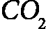
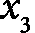
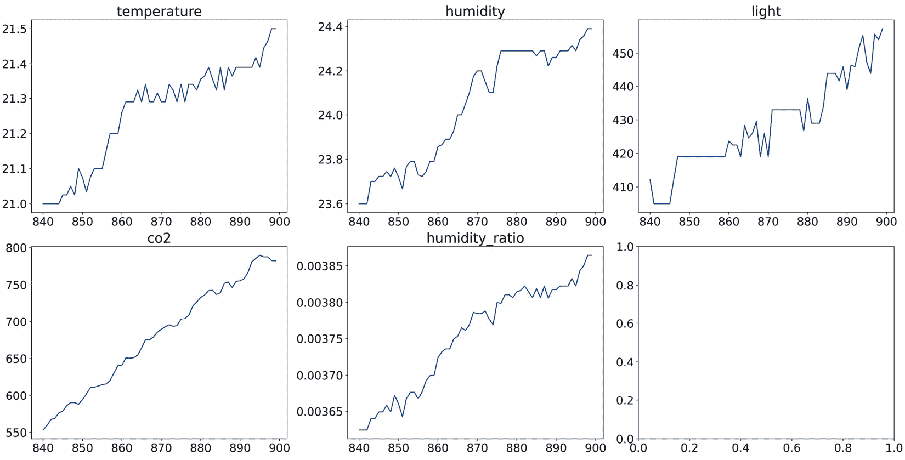

# <st c="0">10</st>

# <st c="3">使用 tsfresh 从时间序列创建特征</st>

<st c="53">在这本书的整个过程中，我们讨论了针对表格和关系数据集定制的特征工程方法和工具。</st> <st c="176">在本章中，我们将把我们的重点转向时间序列数据。</st> <st c="238">时间序列是在时间上按顺序进行观察的一系列数据。</st> <st c="312">例如，包括能源生产和需求、温度、空气污染物浓度、股价和销售收入。</st> <st c="434">这些例子代表了一个变量，并且它们的值随时间变化。</st> <st c="503">。

<st c="513">可负担的传感器的大量可用性，能够测量运动、湿度、葡萄糖和其他参数，显著增加了时间标注数据的数量。</st> <st c="712">这些时间序列可以用于各种分类任务。</st> <st c="779">例如，通过分析在特定时间间隔内家庭的电力使用模式，我们可以推断出是否使用了特定的电器。</st> <st c="937">同样，超声波传感器的信号可以帮助确定（气体）管道故障的概率，而声音波长的特征可以帮助预测听众是否会喜欢一首歌。</st> <st c="1147">时间序列数据对于回归任务也非常有价值。</st> <st c="1203">例如，机械设备传感器的信号可以用来预测设备的剩余使用寿命。</st> <st c="1299">。

<st c="1310">为了使用时间序列与传统的监督机器学习模型，如线性回归、逻辑回归或基于决策树的算法，我们需要将每个时间序列映射到一个定义良好的特征向量，以捕捉其特征。</st> <st c="1560">时间序列模式，包括趋势、季节性和周期性等，可以通过简单和复杂的数学运算的组合来捕捉。</st> <st c="1730">简单的计算包括，例如，计算时间序列的平均值和标准差。</st> <st c="1836">更复杂的方法包括确定相关性或熵，例如。</st> <st c="1914">此外，我们可以应用非线性时间序列分析函数来分解时间序列信号，例如傅里叶变换或小波变换，并使用这些函数的参数作为监督模型的特征。</st> <st c="2129">。

从时间序列创建特征可能非常耗时；我们需要应用各种信号处理和时间序列分析算法来识别和提取有意义的特征。</st> `<st c="2339">tsfresh</st>` <st c="2346">Python 包，代表</st> `<st c="2597">tsfresh</st>` <st c="2604">包括一个特征选择算法，该算法可以识别给定时间序列的最具预测性的特征。</st> `<st c="2714">通过自动化应用复杂的时间序列方法，</st> `<st c="2776">tsfresh</st>` <st c="2783">弥合了信号处理专家和机器学习实践者之间的差距，使得从时间序列数据中提取有价值的特征变得更加容易。</st>

在本章中，我们将学习如何通过利用<st c="3054">tsfresh</st>自动从时间序列数据中创建数百个特征。随后，我们将讨论如何通过选择最相关的特征、从不同的时间序列中提取不同的特征以及将特征创建过程集成到 scikit-learn 管道中来对<st c="3327">时间序列数据</st>进行分类。

在本章中，我们将介绍以下食谱：<st c="3385">以下内容：</st>

+   从<st c="3457">时间序列</st>自动提取数百个特征

+   从<st c="3531">时间序列数据</st>自动创建和选择预测特征

+   从不同的<st c="3593">时间序列</st>中提取不同的特征

+   通过<st c="3604">特征选择</st>创建特征子集

+   将特征创建嵌入到<st c="3706">scikit-learn 管道</st>

# <st c="3727">技术要求</st>

在本章中，我们将使用开源的<st c="3796">tsfresh</st> <st c="3803">Python 库。</st> <st c="3820">您可以通过执行</st> <st c="3836">tsfresh</st> <st c="3843">安装</st> <st c="3849">pip</st> <st c="3852">来安装<st c="3836">tsfresh</st>：</st> <st c="3866">pip</st> <st c="3870">install tsfresh</st><st c="3885">。

<st c="3886">注意</st>

如果您使用的是旧版的 Microsoft 操作系统，您可能需要更新 Microsoft C++构建工具才能继续安装<st c="4012">tsfresh</st> <st c="4019">包。</st> <st c="4044">请按照此线程中的步骤操作：</st> [<st c="4086">https://stackoverflow.com/questions/64261546/how-to-solve-error-microsoft-visual-c-14-0-or-greater-is-required-when-inst</st>](https://stackoverflow.com/questions/64261546/how-to-solve-error-microsoft-visual-c-14-0-or-greater-is-required-when-inst)<st c="4206">。</st>

我们将使用来自 UCI 机器学习仓库的**<st c="4230">占用检测</st>**数据集，该数据集可在[<st c="4313">http://archive.ics.uci.edu/ml/datasets/Occupancy+Detection</st>](http://archive.ics.uci.edu/ml/datasets/Occupancy+Detection)找到，并受 Creative Commons Attribution 4.0 International (CC BY 4.0)许可协议的许可：[<st c="4461">https://creativecommons.org/licenses/by/4.0/legalcode</st>](https://creativecommons.org/licenses/by/4.0/legalcode)。该数据的相应引用如下：

Candanedo, Luis. <st c="4589">(2016). <st c="4597">占用检测.</st> <st c="4618">UCI 机器学习</st> <st c="4639">仓库.</st> [<st c="4651">https://doi.org/10.24432/C5X01N</st>](https://doi.org/10.24432/C5X01N)<st c="4682">.</st>

我下载并修改了如本笔记本所示的数据：[<st c="4746">https://github.com/PacktPublishing/Python-Feature-engineering-Cookbook-Third-Edition/blob/main/ch10-tsfresh/prepare-occupancy-dataset.ipynb</st>](https://github.com/PacktPublishing/Python-Feature-engineering-Cookbook-Third-Edition/blob/main/ch10-tsfresh/prepare-occupancy-dataset.ipynb)

若要获取修改后的数据集和目标变量，请查看以下链接中的文件`<st c="4971">occupancy.csv</st>` <st c="4984">和</st> `<st c="4989">occupancy_target.csv</st>`<st c="5009">，可在以下链接找到：<st c="5038">[`github.com/PacktPublishing/Python-Feature-engineering-Cookbook-Third-Edition/blob/main/ch10-tsfresh`](https://github.com/PacktPublishing/Python-Feature-engineering-Cookbook-Third-Edition/blob/main/ch10-tsfresh)</st>

占用检测数据集包含在 135 小时内每分钟间隔采集的时间序列数据。<st c="5256">变量测量办公室的温度、湿度、</st>  <st c="5305"><st c="5309">水平，以及照明消耗。</st> <st c="5352">使用摄像头录像来确定是否有人在办公室。</st> <st c="5424">目标变量显示办公室是否在任何一小时被占用。</st> <st c="5499">如果目标变量取值为</st> `<st c="5529">1</st>`<st c="5530">，则表示该小时办公室被占用；否则，它取值为</st> `<st c="5612">0</st>`<st c="5618">。</st>

<st c="5620">包含时间序列和目标变量的数据集行数不同。</st> <st c="5720">时间序列数据集包含以一分钟间隔记录的 135 小时记录，即 8,100 行。</st> <st c="5821">目标变量只有 135 行，每行都有一个标签，表示在 135 小时中的每个小时办公室是否被占用。</st>

<st c="5932">注意</st>

<st c="5937">查看本书 GitHub 仓库中的笔记本，以熟悉不同时间序列的绘图：</st> <st c="6061">数据集：</st> [<st c="6070">https://github.com/PacktPublishing/Python-Feature-Engineering-Cookbook-Third-Edition/blob/main/ch10-tsfresh/prepare-occupancy-dataset.ipynb</st>](https://github.com/PacktPublishing/Python-Feature-Engineering-Cookbook-Third-Edition/blob/main/ch10-tsfresh/prepare-occupancy-dataset.ipynb)

# <st c="6209">从时间序列自动提取数百个特征</st>

<st c="6274">时间序列</st> <st c="6287">是</st><st c="6288">按时间顺序索引的数据点</st> <st c="6319">。</st> <st c="6326">分析时间序列序列使我们能够做出各种预测。</st> <st c="6397">例如，传感器数据可以用来预测管道故障，声音数据可以帮助识别音乐类型，健康历史或个人测量，如血糖水平，可以表明一个人是否生病，正如我们将在这个菜谱中展示的，光照模式、湿度和</st>  <st c="6685"><st c="6689">水平可以确定办公室</st> <st c="6728">是否被占用。</st></st>

<st c="6740">为了训练回归和分类模型，使用传统的机器学习算法，如线性回归或随机森林，我们需要一个大小为</st> *<st c="6909">M x N</st>*<st c="6914">的数据集，其中 M 是行数，N 是特征数或列数。</st> <st c="6990">然而，对于时间序列数据，我们拥有的是一系列</st> *<st c="7054">M</st>* <st c="7055">时间序列，每个时间序列都有多个按时间顺序索引的行。</st> <st c="7133">要在监督学习模型中使用时间序列，每个时间序列都需要映射到一个定义良好的特征向量，</st> *<st c="7255">N</st>*<st c="7256">，如图所示</st> <st c="7274">以下</st><st c="7291">：</st>


<st c="7294">图 10.1 – 显示从时间序列创建特征过程（用于分类或回归）的图表</st>

<st c="7407">这些</st><st c="7411">特征向量，表示为</st> <st c="7457"><st c="7458">,</st> <st c="7460"><st c="7461">, 和</st>  <st c="7467"><st c="7468">在</st> *<st c="7472">图 10.1</st>**<st c="7481">.1</st>*<st c="7483">中，应该能够捕捉时间序列的特征。</st> <st c="7540">例如，</st> <st c="7553"><st c="7554">可能是时间序列的均值，</st> <st c="7601"><st c="7602">及其方差。</st> <st c="7616">我们可以创建许多特征来描述时间序列，包括数据点的分布、相关性、平稳性或熵等。</st> <st c="7785">因此，特征向量 N 可以通过应用一系列</st> <st c="7859">**<st c="7862">特征化方法</st>**</st> <st c="7886">t</st><st c="7888">hat</st> <st c="7890">取时间序列作为输入并返回一个或多个标量作为输出。</st> <st c="7962">均值或总和将时间序列序列作为输入，并返回一个标量作为输出，该标量是时间序列的均值或其值的总和。</st> <st c="8128">我们还可以将线性趋势拟合到时间序列序列中，这将返回两个标量——一个表示斜率，另一个表示</st> <st c="8252">截距。</st>

`<st c="8267">tsfresh</st>` <st c="8275">对时间序列应用 63 种特征化方法，每种方法返回一个或多个标量，因此对于任何给定的时间序列，都会产生超过 750 个特征。</st> <st c="8446">在这个菜谱中，我们将使用</st> `<st c="8474">tsfresh</st>` <st c="8481">将时间序列数据转换为 M x N 特征</st> <st c="8534">表，然后</st> <st c="8547">我们将使用它来预测</st> <st c="8575">办公室占用</st><st c="8588">情况。</st>

## <st c="8593">准备就绪</st>

<st c="8607">在这个菜谱中，我们将使用</st><st c="8630">在*《技术要求》</st>* <st c="8686">部分中描述的</st> <st c="8708">占用检测数据集。</st> <st c="8718">该数据集包含在办公室内每分钟间隔测量的温度、湿度、</st>  <st c="8779"><st c="8782">级别和照明消耗。</st> <st c="8855">有 135 小时的测量数据，每小时都有一个唯一的标识符。</st> <st c="8943">还有一个包含目标变量的数据集，该变量指示在 135 小时中的哪个小时办公室被占用。</st> <st c="9058">让我们加载数据并绘制一些图表来理解</st><st c="9096">其模式：</st>

1.  <st c="9126">让我们</st> `<st c="9138">pandas</st>` <st c="9144">和</st> `<st c="9149">matplotlib</st>`<st c="9159">:</st>

    ```py
     import matplotlib.pyplot as plt
    import pandas as pd
    ```

1.  <st c="9213">加载数据集并显示前五行：</st> <st c="9253">:</st>

    ```py
     X = pd.read_csv(
        "occupancy.csv", parse_dates=["date"])
    X.head()
    ```

    <st c="9328">在下面的图中，我们可以看到包含唯一标识符的数据集，随后是测量日期和时间以及五个时间序列的值，这些时间序列捕捉了温度、湿度、照明和</st>  <st c="9536"><st c="9540">办公室的</st> <st c="9550">级别：</st>


<st c="9934">图 10.2 – 包含时间序列数据的 DataFrame</st>

1.  <st c="9983">让我们</st><st c="9995">创建</st> <st c="10000">一个函数来</st> <st c="10011">绘制从</st> *<st c="10038">步骤 2</st>* <st c="10044">在给定小时的时间序列（记录的 135 小时中的每一小时都有一个唯一的标识符`<st c="10066">id</st>` <st c="10068">列）：</st>

    ```py
     def plot_timeseries(n_id):
        fig, axes = plt.subplots(nrows=2, ncols=3,
        figsize=(20, 10))
        X[X[«id»] == n_id]["temperature"].plot(
            ax=axes[0, 0], title="temperature")
        X[X[«id»] == n_id]["humidity"].plot(
            ax=axes[0, 1], title="humidity")
        X[X[«id»] == n_id]["light"].plot(
            ax=axes[0, 2], title="light")
        X[X[«id»] == n_id]["co2"].plot(
        ax=axes[1, 0], title="co2")
        X[X[«id»] == n_id]["humidity_ratio"].plot(
            ax=axes[1,1], title="humidity_ratio")
        plt.show()
    ```

1.  <st c="10587">让我们</st> <st c="10593">绘制办公室未被占用的小时对应的时间序列：</st>

    ```py
     plot_timeseries(2)
    ```

    <st c="10692">在下面的图中，我们可以看到记录的第二个小时的时间序列值，当时办公室</st> <st c="10778">是空的：</st>


<st c="11177">图 10.3 – 数据收集的第二个小时的时间序列值，当时办公室是空的</st><st c="11276">的</st>

<st c="11278">注意灯光是关闭的，这就是为什么我们在右上角的光消耗图中看到 0 处的水平线。</st>

1.  <st c="11408">现在，让我们绘制出办公室被占用的小时对应的时间序列数据：</st>

    ```py
     plot_timeseries(15)
    ```

    <st c="11520">在下面的图中，我们可以看到记录的第十五个小时的时间序列值，当时办公室</st> <st c="11634">被占用：</st>



<st c="12022">图 10.4 – 数据收集的第十五个小时的时间序列值，当时办公室被占用</st>

注意这次灯光是亮着的（</st><st c="12172">右上角面板）。</st>

<st c="12190">在这个菜谱中，我们将从这些时间序列数据的每一小时窗口中提取特征，捕捉</st> <st c="12298">它们的</st> <st c="12324">特征</st><st c="12333">的各个方面。</st> <st c="12342">从这些 60 分钟的时间序列段中，我们将使用</st> `<st c="12453">tsfresh</st>`<st c="12460">自动生成超过 750 个特征，确保对</st> <st c="12509">数据属性</st><st c="12520">的全面表示。</st>

## <st c="12528">如何做到...</st>

<st c="12544">我们将从一条时间序列</st> `<st c="12628">灯光</st>`<st c="12634">中自动创建数百个特征，然后使用这些特征来预测办公室是否在任何</st> <st c="12714">给定的小时被占用：</st>

1.  <st c="12725">让我们导入所需的 Python 库</st> <st c="12769">和函数：</st>

    ```py
     import pandas as pd
    from sklearn.linear_model import LogisticRegression
    from sklearn.metrics import classification_report
    from sklearn.model_selection import train_test_split
    from tsfresh import extract_features
    from tsfresh.utilities.dataframe_functions import (
        impute
    )
    ```

1.  <st c="13056">加载在</st> *<st c="13091">技术</st>* *<st c="13101">要求</st>* <st c="13113">部分中描述的</st>数据集：</st>

    ```py
     X = pd.read_csv("occupancy.csv", parse_dates=["date"])
    ```

1.  <st c="13177">L</st><st c="13179">将目标变量加载到一个</st> `<st c="13210">pandas</st>` <st c="13216">序列中：</st>

    ```py
     y = pd.read_csv("occupancy_target.csv",
        index_col="id")["occupancy"]
    ```

1.  <st c="13293">让我们使用</st> `<st c="13379">tsfresh</st>`<st c="13386">自动为每小时的灯光记录创建数百个特征。要从</st> `<st c="13416">light</st>` <st c="13421">变量中创建特征，我们将包含此变量和每个时间序列的唯一标识符的 DataFrame 传递给</st> `<st c="13533">extract_features</st>` <st c="13549">函数</st> <st c="13559">来自</st> `<st c="13564">tsfresh</st>`<st c="13571">：</st>

    ```py
     features = extract_features(
        X[[«id», «light»]], column_id="id")
    ```

    <st c="13638">如果我们执行</st> `<st c="13653">features.shape</st>`<st c="13667">，我们将获得</st> `<st c="13682">(135, 789)</st>` <st c="13692">，这对应于结果 DataFrame 的大小</st> <st c="13719">，其中每一行代表一个小时的记录，每一列代表由</st> `<st c="13839">tsfresh</st>`<st c="13846">创建的一个特征。有 789 个特征可以描述任何给定小时的光消耗。</st> <st c="13926">继续执行</st> `<st c="13947">features.head()</st>` <st c="13962">以查看结果 DataFrame。</st> <st c="14005">由于篇幅原因，我们无法在书中显示整个 DataFrame。</st> <st c="14075">因此，我们将探索一些</st> <st c="14112">特征。</st>

1.  <st c="14125">让我们将创建的五个特征名称存储在</st> <st c="14185">一个数组中：</st>

    ```py
     feats = features.columns[10:15]
    ```

    <st c="14226">如果我们执行</st> `<st c="14241">feats</st>`<st c="14246">，我们将看到与平均数、长度、标准差、变异系数和光消耗的方差相对应的五个特征名称</st> <st c="14404">每小时：</st>

    ```py
    <st c="14413">Index(['light__mean', 'light__length',</st> <st c="14453">'light__standard_deviation',</st> <st c="14482">'light__variation_coefficient',</st> <st c="14514">'light__variance'], dtype='object')</st>
    ```

1.  <st c="14549">现在，让我们显示从</st> *<st c="14601">步骤 5</st>* <st c="14607">开始的第一个</st> <st c="14622">五个小时</st>的特征值：</st>

    ```py
     features[feats].head()
    ```

    <st c="14656">在以下 DataFrame 中，我们看到从</st> <st c="14749">前五个小时的</st> <st c="14764">光</st> <st c="14770">合</st><st c="14772">消耗</st> <st c="14778">的时间序列中提取的特征：</st>


<st c="15066">图 10.5 – 为每小时的光消耗创建的特征</st>

<st c="15131">查看图 10**<st c="15182">.4</st>**中的光消耗平均值，我们可以看到前一个小时灯光是开启的，然后在接下来的四个小时里关闭了。</st> <st c="15262">时间序列的长度是 60，因为我们每小时有 60 分钟的记录。</st>

<st c="15378">注意</st>

`<st c="15383">tsfresh</st>` <st c="15391">对时间序列应用 63 种特征创建方法。</st> <st c="15446">根据时间序列的特征，如其长度或其变异性，某些方法可能会返回缺失值或无穷大值。</st> <st c="15601">例如，在</st> *<st c="15617">图 10</st>**<st c="15626">.4</st>*<st c="15628">中，我们可以看到在光照消耗恒定的那些小时，无法计算变异系数。</st> <st c="15750">并且在这些情况下，方差也是</st> `<st c="15775">0</st>` <st c="15776">。</st> <st c="15793">实际上，对于我们的数据集，许多生成的特征只包含</st> `<st c="15863">NaN</st>` <st c="15866">值，或者像长度一样是恒定的，因此对于训练机器</st> <st c="15959">学习模型来说没有用。</st>

1.  `<st c="15975">tsfresh</st>` <st c="15983">包含一个用于填充包含</st> `<st c="16048">NaN</st>` <st c="16051">值的特征的填充函数。</st> <st c="16060">让我们继续填充</st> <st c="16086">我们的特征：</st>

    ```py
     impute(features)
    ```

    <st c="16116">The</st> `<st c="16121">impute</st>` <st c="16127">函数来自</st> `<st c="16142">tsfresh</st>` <st c="16149">，它将</st> `<st c="16159">NaN</st>`<st c="16162">、`<st c="16164">-Inf</st>`<st c="16168">和</st> `<st c="16174">Inf</st>` <st c="16177">值分别替换为变量的中位数、最小值或最大值。</st>

    <st c="16254">让我们使用这些特征来训练一个逻辑回归模型，并预测办公室</st> <st c="16348">是否被占用。</st>

1.  <st c="16361">让我们开始</st> <st c="16373">将</st> <st c="16391">数据集</st> <st c="16418">分为训练集和</st> <st c="16435">测试集：</st>

    ```py
     X_train, X_test, y_train, y_test = train_test_split(
        features,
        y,
        test_size=0.1,
        random_state=42,
    )
    ```

1.  <st c="16528">现在，让我们设置并训练一个逻辑回归模型，然后评估</st> <st c="16604">其性能：</st>

    ```py
     cls = LogisticRegression(random_state=10, C=0.01)
    cls.fit(X_train, y_train)
    print(classification_report(
         y_test, cls.predict(X_test)))
    ```

    <st c="16755">在以下输出中，我们看到用于分类分析的常用评估指标的值，这表明创建的特征对于预测</st> <st c="16942">办公室占用情况是有用的：</st>

    ```py
     <st c="16959">precision     recall</st> <st c="16976">f1-score   support</st>
     <st c="16993">0         1.00        1.00        1.00           11</st>
     <st c="17013">1         1.00</st> <st c="17021">1.00        1.00            3</st>
     <st c="17032">accuracy                                       1.00           14</st>
     <st c="17049">macro avg         1.00        1.00        1.00</st> <st c="17074">14</st>
    <st c="17077">weighted avg         1.00        1.00        1.00           14</st>
    ```

<st c="17108">注意</st>

<st c="17113">为了保持方法简单，我没有优化模型超参数或调整概率阈值——这些是我们通常为了确保模型</st> <st c="17273">准确度所做的事情。</st>

1.  <st c="17286">最后，让我们</st> <st c="17297">提取每个时间序列的特征，即</st> `<st c="17358">光照</st>`<st c="17363">、`<st c="17365">温度</st>`<st c="17376">、`<st c="17378">湿度</st>`<st c="17386">和</st> `<st c="17392">二氧化碳</st>`<st c="17395">，这次，我们将在提取后立即填充特征：</st>

    ```py
     features = extract_features(
        X,
        column_id="id",
        impute_function=impute,
        column_sort="date",
    )
    ```

<st c="17561">注意</st>

<st c="17566">在</st> *<st c="17570">步骤 10</st>*<st c="17577">中，我们指出我们想要根据包含测量时间和日期的时间戳对时间序列进行排序，通过将</st> `<st c="17716">date</st>` <st c="17720">变量传递给</st> `<st c="17737">column_sort</st>` <st c="17748">参数。</st> <st c="17760">这在我们的时间序列不是等距或不是按时间顺序排列时很有用。</st> <st c="17848">如果我们将此参数设置为</st> `<st c="17882">None</st>`<st c="17886">，</st> `<st c="17888">tsfresh</st>` <st c="17895">将假设时间序列是有序的且等距的。</st>

<st c="17954">*<st c="17969">步骤 10</st>* <st c="17976">的输出是一个包含 135 行的 DataFrame，包含 3,945 个特征（执行</st> `<st c="18051">features.shape</st>` <st c="18065">以检查这一点），这些特征描述了五个原始时间序列——温度、光照、湿度及其比率，以及</st>  <st c="18183"><st c="18187">办公室。</st> <st c="18202">这些</st> <st c="18207">特征在</st> *<st c="18233">步骤 10</st>*<st c="18240">中被插补，因此您可以继续使用此 DataFrame 来训练另一个逻辑</st> <st c="18311">回归</st> <st c="18321">模型以预测</st> <st c="18339">办公室</st><st c="18340">的占用情况。</st>

## <st c="18356">它是如何工作的...</st>

<st c="18372">在这个菜谱中，我们使用了</st> `<st c="18397">tsfresh</st>` <st c="18404">来自动从五个时间序列中创建数百个特征，然后使用这些特征来训练一个逻辑回归模型以预测办公室</st> <st c="18569">是否被占用。</st>

<st c="18582">注意</st>

<st c="18587">要使用</st> `<st c="18612">tsfresh</st>`<st c="18619">创建特征，我们想要从中提取特征的时序间隔必须用一个</st> `<st c="18700">id</st>` <st c="18755">变量</st c="18757">标记。</st>

<st c="18767">为了从时间序列创建特征，我们使用了</st> `<st c="18817">extract_features</st>` <st c="18833">函数，该函数来自</st> `<st c="18848">tsfresh</st>`<st c="18855">。此函数接受包含时间序列和唯一标识符的 DataFrame 作为输入，并返回一个包含提取特征的 DataFrame 作为输出。</st> <st c="19011">（执行</st> `<st c="18051">features.shape</st>` <st c="18065">以检查这一点）。</st>

`<extract_features>`有三个关键参数：`column_id`、`column_sort`和`impute_function`。`column_id`接收用于提取特征时每个序列的唯一标识符的列名。`column_sort`用于在提取特征之前重新排序时间序列。当`column_sort`被设置为`None`时，`tsfresh`假设数据是按时间顺序排列的，并且时间戳是等距的。在*步骤 10*中，我们传递了`date`变量作为排序变量，这通知`tsfresh`在提取特征之前如何排序数据。

**注意**

在我们的数据集中，将`column_sort`设置为`None`或传递`date`变量没有区别，因为我们的时间序列已经是按时间顺序排列的，并且时间戳是等距的。如果您的时序不是这种情况，请使用此参数正确创建特征。

**最后**，`extract_features`也接受通过`impute_function`参数的`impute`函数，以自动从创建的特征中移除无限和`NaN`值。将在后续菜谱中讨论`extract_features`的附加参数。

**注意**

[更多关于`extract_features`函数的细节](https://tsfresh.readthedocs.io/en/latest/api/tsfresh.feature_extraction.html#module-tsfresh.feature_extraction.extraction)。

`<st c="20313">impute</st>` <st c="20318">函数</st>，它可以独立使用，就像我们在**步骤 7**中做的那样，或者可以在`<st c="20404">extract_features</st>` <st c="20420">函数</st>中使用，就像我们在**步骤 10**中做的那样，用变量的中位数、最小值或最大值分别替换了`<st c="20462">NAN</st>`、`<st c="20465">-Inf</st>`和`<st c="20477">Inf</st>`值。<st c="20480">如果特征只包含</st> `<st c="20587">NaN</st>` <st c="20590">值，它们将被零替换。</st> <st c="20628">插补是在原地发生的——也就是说，在同一个正在被插补的 DataFrame 中。</st>

`<st c="20714">extract_features</st>` <st c="20735">函数返回一个 DataFrame，它包含与数据中唯一标识符一样多的行。</st> <st c="20824">在我们的例子中，它返回了一个包含 135 行的 DataFrame。</st> <st c="20876">生成的 DataFrame 的列对应于应用于每个 135 个 60 分钟时间序列的 63 个表征方法返回的 789 个值。</st>

在**步骤 5**中，我们探索了一些生成的特征，这些特征捕捉了时间序列的均值、方差和变异系数，以及它们的长度。<st c="21201">让我们再探索一些生成的特征。</st>

<st c="21252">其中一些创建的变量是自解释的。</st><st c="21305">例如，</st><st c="21322">'light__skewness'</st><st c="21339">和</st><st c="21344">'light__kurtosis'</st><st c="21361">变量包含偏度和峰度系数，这些系数表征了数据分布。</st><st c="21462">`<st c="21466">'light__has_duplicate_max'</st>`<st c="21492">，`<st c="21494">'light__has_duplicate_min'</st>`<st c="21520">，以及</st><st c="21526">'light__has_duplicate'</st>`<st c="21548">变量指示时间序列在时间间隔内是否有重复值或重复的最小值或最大值。</st><st c="21680">`<st c="21684">'light__quantile__q_0.1'</st>`<st c="21708">，`<st c="21710">'light__quantile__q_0.2'</st>`<st c="21734">，以及</st><st c="21740">'light__quantile__q_0.3'</st>`<st c="21764">变量显示了时间序列的不同分位数。</st><st c="21833">最后，</st><st c="21846">'light__autocorrelation__lag_0'</st>`<st c="21877">，`<st c="21879">'light__autocorrelation__lag_1'</st>`<st c="21910">，以及</st><st c="21916">'light__autocorrelation__lag_2'</st>`<st c="21947">变量显示了时间序列与其过去值的自相关，滞后 0，1 或 2 步——这些信息通常在预测中很有用。</st><st c="22090">i</st><st c="22091">n</st><st c="22092">预测。</st>

<st c="22105">其他特征描述方法返回来自信号处理算法的特征</st><st c="22146">，例如</st><st c="22185">对于 Ricker 小波，它返回</st><st c="22203">以下</st><st c="22206">特征</st>，即`<st c="22281">'light__cwt_coefficients__coeff_0__w_2__widths_(2, 5, 10, 20)'</st>`<st c="22343">，`<st c="22345">'light__cwt_coefficients__coeff_0__w_5__widths_(2, 5, 10, 20)'</st>`<st c="22407">，`<st c="22409">'light__cwt_coefficients__coeff_0__w_10__widths_(2, 5, 10, 20)'</st>`<st c="22472">，以及</st><st c="22478">'light__cwt_coefficients__coeff_0__w_20__widths_(2, 5, 10, 20)'</st>`<st c="22541">等。</st><st c="22552">其中一些。</st>

<st c="22565">注意</st>

<st c="22570">由于方法众多，本书无法详细讨论每种特征描述方法及其输出。</st><st c="22703">您可以在[<st c="22801">https://tsfresh.readthedocs.io/en/latest/api/tsfresh.feature_extraction.html</st>](https://tsfresh.readthedocs.io/en/latest/api/tsfresh.feature_extraction.html)找到有关`<st c="22768">tsfresh</st>`支持的转换及其公式的更多详细信息。</st><st c="22877">。</st>

<st c="22878">由</st> `<st c="22934">tsfresh</st>` <st c="22941">自动创建的一些特征可能对某些时间序列没有意义，甚至无法计算，因为它们需要一定的长度或数据变化性，或者时间序列必须满足某些分布假设。</st> <st c="23137">因此，特征的可适用性将取决于时间序列的性质。</st>

<st c="23225">注意</st>

<st c="23230">您可以根据领域知识决定从您的时序数据中提取哪些特征，或者通过创建所有可能的特征，然后应用特征选择算法或进行数据分析。</st> <st c="23441">实际上，从我们的数据集中，许多生成的特征要么是恒定的，要么只包含缺失数据。</st> <st c="23552">因此，我们可以通过从数据中去除这些特征来减少特征空间到信息特征。</st>

## <st c="23657">另请参阅</st>

<st c="23666">有关</st> <st c="23675">`<st c="23690">tsfresh</st>`</st> <st c="23697">的更多</st> <st c="23705">详细信息，请参阅文章 Christ M.，Braun N.，，Neuffer J.，和 Kempa-Liehr A. (2018)。</st> *<st c="23784">基于可扩展假设检验的时间序列特征提取 (tsfresh – 一个 Python 包)。</st> <st c="23883">神经计算 307 (2018)。</st> <st c="23910">第</st>* *<st c="23916">72-77 页。</st>* [<st c="23922">https://dl.acm.org/doi/10.1</st><st c="23950">016/j.neucom.2018.03.067</st>](https://dl.acm.org/doi/10.1016/j.neucom.2018.03.067)<st c="23975">。</st>

# <st c="23976">自动从时间序列数据中创建和选择预测特征</st>

在上一个<st c="24056">菜谱</st> <st c="24073">中，我们</st> <st c="24084">使用</st> `<st c="24166">tsfresh</st>`<st c="24173">自动从时间序列变量中提取了数百个特征。如果我们有多个时间序列变量，我们很容易得到一个包含数千个特征的数据库。</st> <st c="24292">此外，许多生成的特征只有缺失数据或恒定值，因此对训练机器学习模型没有用。</st><st c="24422">学习</st> <st c="24427">模型。</st>

<st c="24443">当我们创建分类和回归模型来解决现实生活中的问题时，我们通常希望我们的模型只输入少量相关特征以产生可解释的机器学习输出。</st> <st c="24653">简单的模型有很多优点。</st> <st c="24690">首先，它们的输出更容易解释。</st> <st c="24734">其次，简单的模型存储成本低，训练速度快。</st> <st c="24799">它们也能更快地返回输出。</st>

`<st c="24838">tsfresh</st>` 包含一个基于非参数统计假设检验的高度可并行化的特征选择算法，该算法可以在特征创建过程之后执行，以快速去除不相关的特征。特征选择过程利用不同的测试针对不同的特征。

`<st c="25149">tsfresh</st>` 使用以下测试来 `<st c="25186">选择特征</st>`：

+   如果特征和目标 `<st c="25275">都是二进制</st>` 的 `<st c="25202">费舍尔精确检验独立性</st>`，

+   如果特征或目标 `<st c="25347">是二进制</st>` 的 `<st c="25285">科尔莫哥洛夫-斯米尔诺夫检验</st>`，

+   如果特征或目标 `<st c="25414">都不是二进制</st>` 的 `<st c="25356">肯德尔秩次检验</st>`，

这些测试的优势在于它们是非参数的，因此不对被测试变量的潜在分布做出假设。

这些测试的结果是一个衡量每个特征与目标之间关联显著性的 p 值向量。然后根据 `<st c="25756">本雅明-叶库蒂埃</st>` 程序对这些 p 值进行评估，以决定保留哪些特征。

`<st c="25824">注意</st>`

关于 `<st c="25854">tsfresh</st>` 的特征选择过程的更多详细信息，请参阅 Christ, Kempa-Liehr, 和 Feindt 的文章，*<st c="25950">分布式和并行时间序列特征提取用于工业大数据应用</st>*。亚洲机器学习会议 (ACML) 2016，大数据学习研讨会 (WLBD)，汉密尔顿（新西兰），arXiv，[<st c="26163">https://arxiv.org/abs/1610.07717v1</st>](https://arxiv.org/abs/1610.07717v1)。

在这个食谱中，我们将自动从各种时间序列中创建数百个特征，然后通过使用 `<st c="26348">tsfresh</st>` 来选择最相关的特征。

## `<st c="26356">如何做到...</st>`

我们将首先自动从单个时间序列 `<st c="26458">lights</st>` 中创建和选择特征，然后我们将自动化针对多个 `<st c="26519">时间序列</st>` 的过程：

1.  让我们导入所需的 Python 库和函数：

    ```py
     import pandas as pd
    from sklearn.linear_model import LogisticRegression
    from sklearn.metrics import classification_report
    from sklearn.model_selection import train_test_split
    from tsfresh import (
        extract_features,
        extract_relevant_features,
        select_features,
    )
    from tsfresh.utilities.dataframe_functions import impute
    ```

1.  加载在 *<st c="26966">技术</st>* *<st c="26976">要求</st>* 部分中描述的 `<st c="26925">数据集</st>` 和目标变量：

    ```py
     X = pd.read_csv("occupancy.csv", parse_dates=["date"])
    y = pd.read_csv("occupancy_target.csv",
        index_col="id")["occupancy"]
    ```

1.  让我们为每个小时的**使用记录**自动创建数百个特征，并填补结果特征：

    ```py
     features = extract_features(
        X[[«id», «light»]],
        column_id="id",
        impute_function=impute,
    )
    ```

    上一步的输出是一个包含 135 行和 789 列的 DataFrame，对应于从每个小时的**能耗**中创建的特征。

**注意**

关于**步骤 3**或占用检测数据集的更多详细信息，请查看**从时间序列中自动提取数百个特征**的食谱。

1.  现在，让我们根据我们在本食谱介绍中提到的非参数测试来选择特征：

    ```py
     features = select_features(features, y)
    ```

    如果我们执行 `<st c="27818">len(features)</st>`<st c="27831">，我们将看到值 `<st c="27853">135</st>`<st c="27856">，这意味着从**步骤 3**中创建的 789 个特征中，只有 135 个具有统计学意义。继续执行 `<st c="27977">features.head()</st>`<st c="27992">以显示结果 DataFrame 的前五行。

1.  由于空间原因，我们只将显示前**五**个特征：

    ```py
     feats = features.columns[0:5]
    features[feats].head()
    ```

    在以下 DataFrame 中，我们可以看到前五个小时的**能耗**的前五个特征的值：


图 10.6 – 从每个小时的能耗中创建的五个选定特征的 DataFrame

在**如何工作…**部分查看讨论，以获取关于**步骤 4**产生的 DataFrame 的更详细分析。

1.  现在，我们将使用**步骤 4**中的特征来训练一个逻辑回归模型，并预测办公室是否被占用。首先，我们将数据集分为训练集和测试集：

    ```py
     X_train, X_test, y_train, y_test = train_test_split(
        features,
        y,
        test_size=0.1,
        random_state=42,
    )
    ```

1.  让我们设置并训练一个逻辑回归模型，然后评估其性能：

    ```py
     cls = LogisticRegression(
        random_state=10, C=0.1, max_iter=1000)
    cls.fit(X_train, y_train)
    print(classification_report(
        y_test, cls.predict(X_test)))
    ```

    在以下输出中，我们可以看到用于分类分析的常用评估指标值。这些指标表明，所选特征对预测办公室占用情况很有用：

    ```py
     <st c="29491">precision     recall  f1-score   support</st>
     <st c="29525">0</st> <st c="29527">1.00        0.91        0.95           11</st>
     <st c="29545">1         0.75        1.00        0.86            3</st>
    **<st c="29564">accuracy                                       0.93           14</st>**
     **<st c="29581">macro avg         0.88        0.95        0.90           14</st>**
    `<st c="29980">extract_relevant_features</st>`<st c="30005">, and, like this, combine</st> *<st c="30031">steps 3</st>* <st c="30038">and</st> *<st c="30043">4</st>*<st c="30044">. We’ll do that to create and select features automatically for the five time series in</st> <st c="30132">our dataset:</st>

    ```

    features = extract_relevant_features(

        X,

        y,

        column_id="id",

        column_sort="date",

    )

    ```py 
    ```

**注意**

<st c="30231">`extract_relevant_features` 的参数与 `extract_features` 的参数非常相似。</st> <st c="30250">然而，请注意，前者将自动执行插补以能够进行特征选择。</st> <st c="30442">我们在 *<st c="30473">从时间序列中自动提取数百个特征</st> *<st c="30489">食谱</st> 中讨论了 `extract_features` 的参数。</st>

<st c="30567">步骤 8 的</st> *<st c="30582">输出</st>* <st c="30588">由一个包含 135 行和 968 个特征的 DataFrame 组成，这些特征是从默认返回的 3,945 个原始特征中提取的，由 <st c="30701">tsfresh</st> <st c="30708">返回（你可以通过执行 <st c="30746">features.shape</st> <st c="30760">来检查这一点）。</st> <st c="30764">继续使用这个 DataFrame 来训练另一个逻辑回归模型以预测办公室占用率。</st><st c="30831">。</st> <st c="30851">。</st> <st c="30867">。</st>

## <st c="30868">它是如何工作的...</st>

<st c="30884">在这个</st> <st c="30892">食谱</st> 中，我们 <st c="30904">从时间序列中创建了数百个特征，然后根据非参数统计测试选择了最相关的特征。</st> <st c="31040">特征创建和选择过程是通过 <st c="31117">tsfresh</st> <st c="31127">自动执行的。</st>

<st c="31128">为了创建特征，我们使用了 <st c="31161">tsfresh</st> 的 <st c="31168">extract_features</st> <st c="31188">函数，我们在 *<st c="31235">从时间序列中自动提取数百个特征</st> *<st c="31278">食谱</st> 中对其进行了详细描述。</st>

<st c="31308">为了选择特征，我们使用了来自 <st c="31377">tsfresh</st> 的 <st c="31341">select_features</st> <st c="31356">函数。这个函数根据特征的性质和目标应用不同的统计测试。</st> <st c="31492">简而言之，如果特征和目标是二元的，它通过费舍尔精确测试测试它们之间的关系。</st> <st c="31593">如果特征或目标是二元的，而另一个变量是连续的，它通过使用柯尔莫哥洛夫-斯米尔诺夫测试来测试它们之间的关系。</st> <st c="31744">如果特征和目标都不是二元的，它使用肯德尔秩测试。</st>

<st c="31824">这些测试的结果是一个向量，每个特征都有一个 p 值。</st> <st c="31893">接下来，</st> `<st c="31899">tsfresh</st>` <st c="31906">应用 Benjamini-Yekutieli 程序，旨在降低错误发现率，根据 p 值选择要保留的特征。</st> <st c="32053">这种特征选择程序有一些优点，主要优点是统计测试计算速度快，因此选择算法可扩展且可并行化。</st> <st c="32245">另一个优点是测试是非参数的，因此适用于线性和非线性模型。</st>

然而，评估每个特征单独的特征选择方法无法去除冗余特征。<st c="32469">事实上，许多由</st> `<st c="32524">tsfresh</st>` <st c="32531">自动创建的特征将高度相关，例如那些捕捉到不同消费分位数的光照。</st> <st c="32626">因此，它们将显示相似的 p 值并被保留。</st> <st c="32682">但在实践中，我们只需要一个或少数几个来捕捉时间序列的信息。</st> <st c="32780">我建议使用能够识别</st> `<st c="32811">tsfresh</st>` <st c="32818">选择程序中特征交互的替代特征选择方法。</st>

<st c="32928">最后，在</st> *<st c="32941">步骤 8</st>*<st c="32947">中，我们通过使用</st> `<st c="33054">extract_relevant_features</st>` <st c="33079">函数将特征创建步骤（</st>*<st c="32988">步骤 3</st>*<st c="32995">）与特征选择步骤（</st>*<st c="33031">步骤 4</st>*<st c="33038">）结合起来。</st> `<st c="33090">extract_relevant_features</st>` <st c="33115">将</st> `<st c="33128">extract_features</st>` <st c="33144">函数应用于从每个时间序列中创建特征并进行插补。</st> <st c="33217">接下来，它应用</st> `<st c="33238">select_features</st>` <st c="33253">函数以返回一个 DataFrame，其中每行都有一个唯一的标识符，以及为每个时间序列选择的特征。</st> <st c="33385">请注意，不同的特征可以为不同的</st> <st c="33417">时间序列</st> <st c="33421">选择。</st>

## <st c="33456">另请参阅</st>

<st c="33465">`<st c="33495">tsfresh</st>` <st c="33502">的选择算法提供了一个快速的方法来去除无关特征。</st> <st c="33556">然而，它并不能找到分类或回归任务的最佳特征子集。</st> <st c="33649">可以在</st> `<st c="33711">tsfresh</st>`<st c="33718">算法之后应用其他特征选择方法来进一步减少特征</st> <st c="33754">空间。</st>

<st c="33768">有关特征选择算法的更多详细信息，请参阅 Soledad Galli 所著的书籍</st> *<st c="33838">《Python 机器学习中的特征选择》* <st c="33887">在 Leanpub 上的内容：</st> [<st c="33917">https://leanpub.com</st><st c="33936">/feature-selection-in-machine-learning/</st>](https://leanpub.com/feature-selection-in-machine-learning/)<st c="33976">。</st>

# <st c="33977">从不同的时间序列中提取不同的特征</st>

`<st c="34035">tsfresh</st>` <st c="34043">基于时间序列的特征和分布提取许多特征，例如它们的关联属性、平稳性和熵。</st> <st c="34191">它还应用非线性时间序列分析函数，例如通过傅里叶或小波变换分解时间序列信号。</st> <st c="34347">根据时间序列的性质，这些变换中的一些比其他的有意义。</st> <st c="34450">例如，波长分解方法对于由信号或传感器产生的时间序列是有意义的，但并不总是对表示销售或</st> <st c="34625">股价的时间序列有用。</st>

<st c="34638">在这个菜谱中，我们将讨论如何优化特征提取过程以从每个时间序列中提取特定特征，然后使用这些特征来预测</st> <st c="34813">办公室占用率。</st>

## <st c="34830">如何做到这一点...</st>

`<st c="34846">tsfresh</st>` <st c="34854">通过包含方法名称作为键的字典访问将用于创建特征的**方法**，如果它们需要一个参数，它将参数作为值。</st> `<st c="35037">tsfresh</st>` <st c="35044">还包括一些预定义的字典。</st> <st c="35092">我们将首先探索这些预定义的字典，这些字典可以通过</st> `<st c="35177">settings</st>` <st c="35185">模块</st>访问：</st>

1.  <st c="35193">让我们导入所需的 Python 库、函数和</st> `<st c="35259">settings</st>` <st c="35267">模块：</st>

    ```py
     import pandas as pd
    from sklearn.linear_model import LogisticRegression
    from sklearn.metrics import classification_report
    from sklearn.model_selection import train_test_split
    from tsfresh.feature_extraction import (
        extract_features
    )
    from tsfresh.feature_extraction import settings
    ```

1.  <st c="35559">加载文档中描述的**数据集和目标变量**：</st>

    ```py
     X = pd.read_csv("occupancy.csv", parse_dates=["date"])
    y = pd.read_csv("occupancy_target.csv",
        index_col="id")["occupancy"]
    ```

    `<st c="35773">tsfresh</st>` <st c="35781">包括</st> <st c="35791">三个主要字典，这些字典控制特征创建输出：</st> `<st c="35857">settings.ComprehensiveFCParameters</st>`<st c="35891">,</st> `<st c="35893">settings.EfficientFCParameters</st>`<st c="35923">, 和</st> `<st c="35929">settings.MinimalFCParameters</st>`<st c="35957">。在这里，我们将探索返回特征最少的字典。</st> <st c="36028">您可以重复这些步骤来探索</st> <st c="36068">其他字典。</st>

1.  <st c="36092">显示在使用返回最少特征的字典时将应用的特征创建方法：</st> <st c="36194">最少特征：</st>

    ```py
     minimal_feat = settings.MinimalFCParameters()
    minimal_feat.items()
    ```

    <st c="36277">在输出中的 *<st c="36295">步骤 3</st>*<st c="36301">，我们看到一个以特征提取方法名称为键，如果有的话，使用这些方法的参数，作为值的字典：</st> <st c="36423">作为值：</st>

    ```py
    <st c="36433">ItemsView({'sum_values': None, 'median': None, 'mean': None, 'length': None, 'standard_deviation': None, 'variance': None, 'root_mean_square': None, 'maximum': None, 'absolute_maximum': None, 'minimum': None})</st>
    ```

<st c="36643">注意</st>

<st c="36648">继续探索其他两个预定义的字典，</st> `<st c="36709">settings.ComprehensiveFCParameters</st>` <st c="36743">和</st> `<st c="36748">settings.EfficientFCParameters</st>`<st c="36778">，通过调整来自</st> *<st c="36807">步骤 3</st>*<st c="36813">的代码。</st>

1.  <st c="36814">现在，让我们使用来自 *<st c="36850">步骤 3</st>* <st c="36856">的字典来提取仅从</st> `<st c="36897">灯光</st>` <st c="36902">时间</st> <st c="36907">序列中提取的特征，然后显示结果 DataFrame 的形状：</st>

    ```py
     features = extract_features(
        X[[«id», «light»]],
        column_id="id", <st c="37035">default_fc_parameters=minimal_feat,</st> )
    features.shape
    ```

    <st c="37087">*<st c="37102">步骤 4</st>* <st c="37108">的输出是 `<st c="37112">(135, 10)</st>`<st c="37121">，这意味着为 135 个小时的灯光消耗数据中的每一个都创建了 10 个特征。</st>

1.  <st c="37223">让我们显示</st> <st c="37242">结果 DataFrame：</st>

    ```py
     features.head()
    ```

    <st c="37278">我们在以下 DataFrame 中看到前五个小时灯光消耗的结果特征值：</st> <st c="37354">在以下 DataFrame 中：</st>


<st c="37945">图 10.7 – 每小时灯光消耗创建的特征 DataFrame</st>

<st c="38029">现在，我们将使用这些特征来训练一个逻辑回归模型，以预测办公室</st> <st c="38118">是否被占用。</st>

1.  <st c="38142">让我们首先将数据集分为训练集和</st> <st c="38199">测试集：</st>

    ```py
     X_train, X_test, y_train, y_test = train_test_split(
        features,
        y,
        test_size=0.1,
        random_state=42,
    )
    ```

1.  <st c="38309">现在，让我们设置并训练一个逻辑回归模型，然后评估</st> <st c="38385">其性能：</st>

    ```py
     cls = LogisticRegression(random_state=10, C=0.01)
    cls.fit(X_train, y_train)
    print(classification_report(
        y_test, cls.predict(X_test)))
    ```

    <st c="38538">在以下输出中，我们看到用于分类分析的常用评估指标。</st> <st c="38646">这些指标表明所选特征对预测办公室占用是有用的：</st>

    ```py
     <st c="38730">precision     recall  f1-score   support</st>
    **<st c="38764">0         1.00        0.91        0.95           11</st>**
     **<st c="38784">1         0.75        1.00        0.86            3</st>**
     **<st c="38803">accuracy                                       0.93           14</st>**
     **<st c="38820">macro avg         0.88        0.95        0.90           14</st>**
    **<st c="38848">weighted avg         0.95        0.93</st>** **<st c="38871">0.93           14</st>**
    ```

**<st c="38879">注意</st>

<st c="38884">由于灯光消耗是办公室占用非常好的指标，具有非常简单的特征，我们可以获得一个预测逻辑</st> <st c="39020">回归模型。</st>

<st c="39037">现在，让我们</st> <st c="39049">学习如何为不同的时间序列指定不同特征的创建。</st> <st c="39119">时间序列。</st>

1.  <st c="39131">让我们创建一个字典，包含我们想要从</st> `<st c="39236">光</st>` <st c="39241">时间序列</st> <st c="39255">中创建特征的方法的名称。</st> <st c="39255">我们将方法的名称作为键，如果方法需要参数，我们将其作为附加字典传递给相应的键；否则，我们传递</st> `<st c="39413">None</st>` <st c="39417">作为</st> <st c="39421">值：</st>

    ```py
     light_feat = {
        «sum_values": None,
        "median": None,
        «standard_deviation": None,
        "quantile": [{"q": 0.2}, {"q": 0.7}],
    }
    ```

1.  <st c="39552">现在，让我们创建一个字典，包含我们想要从</st> `<st c="39634">co2</st>` <st c="39637">时间序列</st> <st c="39634">中创建的特征：</st>

    ```py
     co2_feat = {
        «root_mean_square": None,
        «number_peaks": [{"n": 1}, {"n": 2}],
    }
    ```

1.  <st c="39729">让我们</st> <st c="39735">将这些字典合并成一个</st> <st c="39770">新的字典：</st>

    ```py
     kind_to_fc_parameters = {
        «light»: light_feat,
        "co2": co2_feat,
    }
    ```

1.  <st c="39851">最后，让我们使用*<st c="39891">步骤 10</st>* <st c="39898">中的字典来创建两个时间序列的特征：</st>

    ```py
     features = extract_features(
        X[[«id», «light», «co2»]],
        column_id="id",
        kind_to_fc_parameters=kind_to_fc_parameters,
    )
    ```

    <st c="40063">*<st c="40078">步骤 11</st>* <st c="40085">的输出由一个包含 135 行和 8 个特征的 DataFrame 组成。</st> <st c="40140">如果我们执行</st> `<st c="40154">features.columns</st>`<st c="40170">，我们将看到创建的特征的名称：</st>

    ```py
    <st c="40218">Index(['light__sum_values', 'light__median',</st>
     <st c="40263">'light__standard_deviation',</st>
     <st c="40292">'light__quantile__q_0.2',</st>
     <st c="40318">'light__quantile__q_0.7',</st>
     <st c="40344">'co2__root_mean_square',</st>
     <st c="40369">'co2__number_peaks__n_1',</st>
     <st c="40395">'co2__numb</st><st c="40406">er_peaks__n_2'],</st>
     <st c="40423">dtype='object')</st>
    ```

<st c="40439">注意在</st> *<st c="40469">步骤 11</st>*<st c="40476">的输出中，已经从每个</st> `<st c="40534">光</st>` <st c="40539">和</st> `<st c="40544">co2</st>` <st c="40547">时间序列</st> <st c="40534">中创建了不同的变量。</st>

## <st c="40560">它是如何工作的...</st>

<st c="40576">在这个</st> <st c="40585">菜谱中，我们从我们的时间序列数据中提取了特定的特征。</st> <st c="40651">首先，我们根据`<st c="40727">tsfresh</st>`<st c="40734">附带的一个预定义字典创建了特征。接下来，我们创建了自己的字典，指定为不同的</st> <st c="40833">时间序列</st> <st c="40833">创建不同的特征。</st>

<st c="40845">`<st c="40850">tsfresh</st>` <st c="40857">包附带一些预定义的字典，可以通过</st> `<st c="40939">settings</st>` <st c="40947">模块</st> <st c="40956">访问。</st> `<st c="40960">MinimalFCParameters</st>` <st c="40979">字典用于根据时间序列分布的基本统计参数（如平均值、中位数、标准差、方差、值的总和、计数（或长度）以及最小值和最大值）创建 10 个简单特征。</st> <st c="41225">在</st> *<st c="41228">步骤 3</st>*<st c="41234">中，我们展示了该字典，方法名称作为键，由于这些方法不需要额外的参数，每个键都有</st> `<st c="41369">None</st>` <st c="41373">作为值。</st>

`<st c="41387">tsfresh</st>` <st c="41395">有两个额外的预定义字典。</st> `<st c="41440">EfficientFCParameters</st>` <st c="41461">用于应用计算快速的算法，而</st> `<st c="41521">ComprehensiveFCParameters</st>` <st c="41546">返回所有可能的特征，并且是`extract_</st><st c="41615">features</st>` <st c="41632">函数默认使用的。</st>

<st c="41642">注意</st>

<st c="41647">有关预定义字典的更多详细信息，请查看`<st c="41710">tsfresh</st>`<st c="41717">的</st> <st c="41721">文档：</st> [<st c="41736">https://tsfresh.readthedocs.io/en/latest</st><st c="41776">/text/feature_extraction_setti</st><st c="41807">ngs.html</st>](https://tsfresh.readthedocs.io/en/latest/text/feature_extraction_settings.html)

<st c="41816">通过在`<st c="41863">default_fc_parameters</st>` <st c="41884">参数中使用这些预定义字典，我们可以从一条或多条时间序列中创建特定的特征，就像我们在</st> *<st c="42011">步骤 4</st>*<st c="42017">中做的那样。请注意，</st> `<st c="42029">default_fc_parameters</st>` <st c="42050">指示</st> `<st c="42061">extract_features</st>` <st c="42077">从</st> *<st c="42111">所有</st>* <st c="42114">时间序列中创建相同的特征。</st> <st c="42132">如果我们想从不同的时间序列中提取不同的特征怎么办呢？</st>

<st c="42205">为了为不同的时间序列创建不同的特征，我们可以使用`<st c="42277">kind_to_fc_parameters</st>` <st c="42298">参数，这是`<st c="42312">tsfresh</st>`<st c="42319">的</st> `<st c="42323">extract_features</st>` <st c="42339">函数的。</st> <st c="42350">此参数接受一个字典的字典，指定应用于每个</st> <st c="42441">时间序列的算法。</st>

在*第 8 步*中，我们创建了一个字典来指定从`<st c="42543">light</st>`时间序列创建特定特征。请注意，`<st c="42576">"sum_values"</st>`和`<st c="42593">"mean"</st>`方法将`<st c="42613">None</st>`作为值，但`<st c="42637">quantile</st>`方法需要额外的参数，这些参数对应于应从时间序列返回的分位数。在*第 9 步*中，我们创建了一个字典来指定从`<st c="42838">co2</st>`时间序列创建特征。在*第 10 步*中，我们将这两个字典合并为一个，以时间序列的名称作为键，特征创建字典作为值。然后，我们将这个字典传递给`<st c="43079">tsfresh</st>`的`<st c="43090">extract_features</st>`函数的`<st c="43044">kind_to_fc_parameters</st>`参数。如果我们使用领域知识来创建特征，或者只创建少量特征，这种方式指定特征是合适的。

如果我们想要为各种时间序列创建多个特征，是否需要手动将每个方法键入字典中？实际上并不需要。在下面的配方中，我们将学习如何根据 Lasso 选择的特征指定要创建哪些特征。

# 通过特征选择创建特征子集

在《*自动从时间序列数据中创建和选择预测特征*》的配方中，我们学习了如何使用`<st c="43720">tsfresh</st>`来选择相关特征。我们还讨论了`<st c="43766">tsfresh</st>`选择程序的局限性，并建议采用替代特征选择方法来识别预测特征，同时避免冗余。

在这个配方中，我们将使用`<st c="43985">tsfresh</st>`创建和选择特征。之后，我们将通过利用 Lasso 正则化进一步减少特征空间。然后，我们将学习如何从选定的特征名称创建字典，以触发仅从未来的时间序列创建这些特征。

## ...如何做到这一点...

<st c="44253">让我们首先导入必要的库并准备</st> <st c="44319">数据集：</st>

1.  <st c="44333">让我们导入</st> <st c="44347">所需的库和函数：</st>

    ```py
     import pandas as pd
    from sklearn.feature_selection import SelectFromModel
    from sklearn.linear_model import LogisticRegression
    from tsfresh import (
        extract_features,
        extract_relevant_features,
    )
    from tsfresh.feature_extraction import settings
    ```

1.  <st c="44627">加载在</st> *<st c="44682">技术</st>* *<st c="44692">要求</st>* <st c="44704">部分中描述的</st> <st c="44627">占用检测数据集：</st>

    ```py
     X = pd.read_csv("occupancy.csv", parse_dates=["date"])
    y = pd.read_csv(
        "occupancy_target.csv",
        index_col="id")["occupancy"]
    ```

1.  <st c="44838">从我们的五个时间序列创建并选择特征，然后显示结果的 DataFrame 的形状：</st>

    ```py
     features = extract_relevant_features(
        X,
        y,
        column_id="id",
        column_sort="date",
    )
    features.shape
    ```

    <st c="45043">步骤 3</st> *<st c="45058">的输出是</st> `<st c="45068">(135, 968)</st>`<st c="45078">，表示从五个原始时间序列中返回了 968 个特征，对于每小时的记录。</st>

<st c="45184">注意</st>

<st c="45189">我们在</st> *<st c="45221">步骤 3</st>* <st c="45227">的 *<st c="45235">自动从时间序列数据创建和选择预测特征</st><st c="45276">食谱</st> *<st c="45310">中讨论了该函数。</st>

<st c="45322">让我们通过选择具有 Lasso 正则化的特征进一步减少特征空间。</st>

1.  <st c="45410">设置具有 Lasso 正则化的逻辑回归，这是</st> `<st c="45478">"l1"</st>` <st c="45482">惩罚。</st> <st c="45492">我还任意设置了</st> <st c="45519">一些额外的参数：</st>

    ```py
     cls = LogisticRegression(
        penalty="l1",
        solver=»liblinear",
        random_state=10,
        C=0.05,
        max_iter=1000,
    )
    ```

1.  <st c="45644">让我们设置一个转换器来保留那些逻辑回归系数</st> <st c="45750">与 0</st> <st c="45754">不同的特征：</st>

    ```py
     selector = SelectFromModel(cls)
    ```

1.  <st c="45789">训练逻辑回归模型并选择</st> <st c="45837">特征：</st>

    ```py
     selector.fit(features, y)
    ```

1.  <st c="45876">现在，将所选特征存储在</st> <st c="45915">一个变量中：</st>

    ```py
     features = selector.get_feature_names_out()
    ```

    <st c="45970">如果我们</st> <st c="45976">执行</st> `<st c="45985">特征</st>`<st c="45993">，我们将</st> <st c="46001">看到所选特征的</st> <st c="46022">名称：</st>

    ```py
    array([
    'light__sum_of_reoccurring_data_points',
    'co2__fft_coefficient__attr_"abs"__coeff_0',
    'co2__spkt_welch_density__coeff_2', 'co2__variance',
    'temperature__c3__lag_1', 'temperature__abs_energy',
    'temperature__c3__lag_2', 'temperature__c3__lag_3',
    'co2__sum_of_reoccurring_data_points',
    'light__spkt_welch_density__coeff_8',
    'light__agg_linear_trend__attr_"intercept"__chunk_len_50__f_agg_"var"',
             'light__agg_linear_trend__attr_"slope"__chunk_len_50__f_agg_"var"',  'light__agg_linear_trend__attr_"intercept"__chunk_len_10__f_agg_"var"'],
    dtype=object)
    ```

1.  <st c="46596">要从时间序列中提取仅来自</st> *<st c="46631">步骤 6</st>* <st c="46637">的特征，我们需要在字典中捕获特征创建方法名称和相应的参数。</st> <st c="46758">我们可以通过使用</st> `<st c="46815">tsfresh</st>`<st c="46822">从特征名称</st> <st c="46810">自动完成此操作：</st>

    ```py
     kind_to_fc_parameters = settings.from_columns(
        selector.get_feature_names_out(),
    )
    ```

    <st c="46907">如果我们执行</st> `<st c="46922">kind_to_fc_parameters</st>`<st c="46943">，我们将看到从</st> <st c="46996">步骤 6</st> <st c="47023">的特征名称</st> *<st c="47029">创建的字典：</st>

    ```py
    {'light':
        {‹sum_of_reoccurring_data_points': None,
        ‹spkt_welch_density': [{'coeff': 8}],
        'variance': None,
        ‹agg_linear_trend': [
            {‹attr': 'slope','chunk_len': 50,
                'f_agg': 'var'},
            {‹attr': 'intercept',
                'chunk_len': 10,'f_agg':'var'}
            ]
        },
    'co2':
        {‹spkt_welch_density': [{'coeff': 2}],
        'variance': None,
        ‹sum_of_reoccurring_data_points': None
        },
        'temperature': {
            'c3': [{'lag': 1}, {'lag': 2}, {'lag':3}],
            'abs_energy': None}
    }
    ```

1.  <st c="47457">现在，我们可以使用</st> <st c="47473">来自</st> *<st c="47494">步骤 8</st>* <st c="47500">的字典以及</st> `<st c="47519">extract_features</st>` <st c="47535">函数来仅从</st> <st c="47580">我们的数据集中创建那些特征：</st>

    ```py
     features = extract_features(
        X,
        column_id="id",
        column_sort="date",
        kind_to_fc_parameters=kind_to_fc_parameters,
    )
    ```

<st c="47707">新的 DataFrame 可以通过执行</st> `<st c="47763">features.head()</st>`<st c="47778">来显示</st><st c="47835">，它只包含由 Las</st><st c="47835">选择的 12 个特征。</st> <st c="47840">请在您的计算机上进一步验证结果。</st>

## <st c="47894">它是如何工作的...</st>

<st c="47910">在这个食谱中，我们</st> <st c="47930">从 5 个时间序列中创建了 968 个特征</st> <st c="47951">。</st> <st c="47971">接下来，我们使用 Lasso 正则化将特征空间减少到 12 个特征。</st> <st c="48052">最后，我们将所选特征的规格捕获到一个字典中，以便在未来的操作中，我们只从我们的</st> <st c="48199">时间序列中创建这些特征。</st>

<st c="48211">要使用</st> `<st c="48261">tsfresh</st>`<st c="48268">自动创建和选择特征，我们使用了</st> `<st c="48282">extract_relevant_features</st>` <st c="48307">函数，我们在</st> *<st c="48354">从时间序列数据自动创建和选择预测特征</st> * *<st c="48428">食谱</st> * <st c="48432">中详细描述了它。</st>

<st c="48440">Lasso 正则化具有将逻辑回归模型的一些系数降低到 0 的内禀能力。</st> <st c="48562">系数为 0 的特征对办公室占用预测的贡献为零，因此可以将其移除。</st> <st c="48694">使用</st> `<st c="48698">SelectFromModel()</st>` <st c="48715">类可以识别并移除这些特征。</st> <st c="48762">我们设置了一个使用 Lasso 正则化的逻辑回归模型的</st> `<st c="48787">SelectFromModel()</st>` <st c="48804">实例来找到模型系数。</st> <st c="48901">通过</st> `<st c="48906">fit()</st>`<st c="48911">，</st> `<st c="48913">SelectFromModel()</st>` <st c="48930">使用我们从时间序列创建的 968 个特征训练了逻辑回归模型，并识别了那些系数与 0 不同的特征。</st> <st c="49084">然后，使用</st> `<st c="49099">get_feature_names_out()</st>` <st c="49122">方法，我们将所选特征的名称捕获到一个</st> <st c="49183">新变量中。</st>

<st c="49196">为了仅创建由 Lasso 正则化选择的 12 个特征，我们使用来自</st> `<st c="49323">from_columns()</st>` <st c="49337">函数的</st> `<st c="49352">tsfresh</st>`<st c="49359">来创建一个字典。此函数返回一个字典，其变量是作为键从其中选择特征的。</st> <st c="49459">值是包含用于创建特征的键的额外字典，以及如果有的话，作为值的参数。</st> <st c="49600">为了创建新特征，我们使用这个</st> <st c="49641">字典</st> <st c="49652">以及</st> `<st c="49670">extract_features</st>` <st c="49686">函数。</st>

<st c="49696">注意</st>

<st c="49701">在*<st c="49705">步骤 9</st>*<st c="49711">中，我们将整个数据集</st> <st c="49742">传递给</st> `<st c="49749">extract_features</st>` <st c="49765">函数。</st> <st c="49776">生成的特征只包含从五个时间序列中的三个提取的特征。</st> <st c="49851">另外两个时间序列</st> <st c="49900">被忽略。</st>

# <st c="49913">将特征创建集成到 scikit-learn 管道中</st>

<st c="49970">在本章中，我们讨论了如何通过利用</st> `<st c="50096">tsfresh</st>`<st c="50103">自动创建和选择时间序列数据中的特征。然后，我们使用这些特征来训练一个分类模型，以预测在任何给定的小时内办公室是否被占用。</st>

`<st c="50226">tsfresh</st>` <st c="50234">包括围绕其主函数的包装类，</st> `<st c="50244">wrapper</st>` <st c="50251">，`<st c="50287">extract_features</st>` <st c="50303">和</st> `<st c="50308">extract_relevant_features</st>`<st c="50333">，以便使特征创建和选择与</st> `<st c="50402">scikit-learn 管道</st>`兼容。

<st c="50424">在这个菜谱中，我们将设置一个 scikit-learn 管道，使用</st> `<st c="50526">tsfresh</st>` <st c="50533">从时间序列中提取特征，然后用这些特征训练一个逻辑回归模型来预测</st> <st c="50610">办公室的占用情况。</st>

## <st c="50627">如何操作...</st>

<st c="50643">让我们首先导入必要的库并准备好数据集：</st>

1.  <st c="50723">让我们导入所需的库</st> <st c="50760">和函数：</st>

    ```py
     import pandas as pd
    from sklearn.pipeline import Pipeline
    from sklearn.linear_model import LogisticRegression
    from sklearn.model_selection import train_test_split
    from sklearn.metrics import classification_report
    from tsfresh.transformers import (
        RelevantFeatureAugmenter)
    ```

1.  <st c="51048">加载在*<st c="51103">技术</st>* *<st c="51113">要求</st>* <st c="51125">部分中描述的占用检测数据集：</st>

    ```py
     X = pd.read_csv("occupancy.csv", parse_dates=["date"])
    y = pd.read_csv(
        "occupancy_target.csv",
        index_col="id")["occupancy"]
    ```

1.  <st c="51259">创建一个空的 DataFrame，其中包含目标变量的索引：</st>

    ```py
     tmp = pd.DataFrame(index=y.index)
    ```

1.  <st c="51367">现在，让我们将</st> <st c="51384">从*<st c="51404">步骤 3</st>* <st c="51410">和目标从*<st c="51431">步骤 2</st>* <st c="51437">分成训练集和</st> <st c="51456">测试集：</st>

    ```py
     X_train, X_test, y_train, y_test = train_test_split(
        tmp, y, random_state=0)
    ```

<st c="51543">注意</st>

`<st c="51548">X_train</st>` <st c="51556">和</st> `<st c="51561">X_test</st>` <st c="51567">将用作容器来存储由</st> `<st c="51628">tsfresh</st>` <st c="51635">创建的特征。它们对于</st> `<st c="51678">RelevantFe</st><st c="51688">atureAugmenter()</st>` <st c="51705">的功能是必需的，我们将在接下来的步骤中讨论。</st>

1.  <st c="51747">让我们创建一个字典，指定从每个时间序列中提取的特征（我任意定义了以下</st> <st c="51856">特征</st>）：

    ```py
     kind_to_fc_parameters = {
        "light": {
            "c3": [{"lag": 3}, {"lag": 2}, {"lag": 1}],
            «abs_energy": None,
            «sum_values": None,
            «fft_coefficient": [
                {«attr": "real", "coeff": 0},
                {«attr": "abs", "coeff": 0}],
            «spkt_welch_density": [
                {«coeff": 2}, {"coeff":5}, {"coeff": 8}
            ],
            «agg_linear_trend": [
                {«attr": "intercept",
                „chunk_len": 50, „f_agg": „var"},
                {"attr": "slope",
                «chunk_len": 50, "f_agg":"var"},
            ],
            «change_quantiles": [
                {«f_agg": "var", "isabs": False,
                «qh": 1.0,"ql": 0.8},
                {«f_agg": "var", "isabs": True,
                «qh": 1.0,"ql": 0.8},
            ],
        },
    "co2": {
        «fft_coefficient": [
            {«attr": "real", "coeff": 0},
            {«attr": "abs", "coeff": 0}],
        "c3": [{"lag": 3}, {"lag": 2}, {"lag": 1}],
        «sum_values": None,
        «abs_energy": None,
        «sum_of_reoccurring_data_points": None,
        «sum_of_reoccurring_values": None,
        },
    "temperature": {"c3": [{"lag": 1},
        {«lag»: 2},{«lag»: 3}], «abs_energy": None},
    }
    ```

    我们在*《从不同时间序列中提取不同特征的方法》*中讨论了该字典的参数。

1.  让我们设置`<st c="52885">RelevantFeatureAugmenter()</st>`，它是对`<st c="52943">extract_relevant_features</st>`函数的包装，以创建在*第 5 步*中指定的特征：

    ```py
     augmenter = RelevantFeatureAugmenter(
        column_id="id",
        column_sort="date",
        kind_to_fc_parameters=kind_to_fc_parameters,
    )
    ```

注意

要创建所有可能的特征，请在*第 6 步*中使用`<st c="53191">FeatureAugmenter()</st>`类。

1.  让我们将*第 6 步*中的特征创建实例与一个逻辑回归模型结合到一个 scikit-learn 流水线中：

    ```py
     pipe = Pipeline(
        [
            ("augmenter", augmenter),
            («classifier», LogisticRegression(
        random_state=10, C=0.01)),
        ]
    )
    ```

1.  现在，让我们告诉`<st c="53479">RelevantFeatureAugmenter()</st>`它需要使用哪个数据集来创建特征：

    ```py
     pipe.set_params(augmenter__timeseries_container=X)
    ```

1.  让我们拟合流水线，这将触发特征创建过程，然后是逻辑回归模型的训练：

    ```py
     pipe.fit(X_train, y_train)
    ```

1.  现在让我们使用测试集中的时间序列来获取预测，并通过以下分类报告来评估模型的性能：

    ```py
     print(classification_report(
        y_test, pipe.predict(X_test)))
    ```

    我们可以看到*第 10 步*的输出如下：

    ```py
     <st c="54007">precision     recall  f1-score   support</st>
     <st c="54041">0         1.00        0.96        0.98</st> <st c="54058">28</st>
     <st c="54061">1         0.86        1.00        0.92            6</st>
     <st c="54080">accuracy                                       0.97           34</st>
    **<st c="54097">macro avg         0.93        0.98        0.95           34</st>**
    **<st c="54125">weighted avg         0.97        0.97        0.97           34</st>**
    ```

**分类报告的值表明，提取的特征适合预测在任何给定小时办公室是否被占用**。

## 它是如何工作的...

在这个方法中，我们将从时间序列中创建特征与`<st c="54398">tsfresh</st>`结合，并在一条流水线上训练来自 scikit-learn 库的机器学习算法。

`<st c="54500">tsfresh</st>`库包括两个包装类，围绕其主函数，以使特征创建过程与 scikit-learn 流水线兼容。在这个方法中，我们使用了`<st c="54679">RelevantFeatureAugmenter()</st>`类，它包装了`<st c="54729">extract_relevant_features</st>`函数，用于从时间序列中创建和选择特征。

`<st c="54818">RelevantFeatureAugmenter()</st>` <st c="54845">的工作原理如下；使用</st> `<st c="54869">fit()</st>`<st c="54874">，它通过使用</st> `<st c="54917">extract_relevant_features</st>`<st c="54942">来创建和选择特征。所选特征的名称随后存储在 transformer 内部。</st> <st c="55026">使用</st> `<st c="55031">transform()</st>`<st c="55042">，</st> `<st c="55044">RelevantFeatureAugmenter()</st>` <st c="55070">从时间序列中创建所选特征。</st>

`<st c="55122">我们通过传递一个包含我们想要创建的特征的字典到其</st> `<st c="55164">RelevantFeatureAugmenter()</st>` <st c="55190">的</st> `<st c="55260">kind_to_fc_parameters</st>` <st c="55281">参数中，覆盖了</st> `<st c="55164">RelevantFeatureAugmenter()</st>` <st c="55190">的默认</st> `<st c="55147">功能</st>`。</st> <st c="55293">因此，使用</st> `<st c="55309">transform()</st>`<st c="55320">，</st> `<st c="55322">RelevantFeatureAugmenter()</st>` <st c="55348">从时间序列中创建了指定的特征。</st>

`<st c="55401">为了从时间序列创建所有特征，</st> `<st c="55447">tsfresh</st>` <st c="55454">包含了</st> `<st c="55468">FeatureAugmenter()</st>` <st c="55486">类，它具有与</st> `<st c="55530">RelevantFeatureAugmenter()</st>`<st c="55556">相同的函数，但没有特征</st> `<st c="55582">选择步骤</st>`。

`<st c="55597">RelevantFeatureAugmenter()</st>` <st c="55603">和</st> `<st c="55629">FeatureAugmenter()</st>` <st c="55634">都需要两个 DataFrame 来工作。</st> <st c="55682">第一个 DataFrame 包含时间序列数据和唯一标识符（我们在</st> *<st c="55788">步骤 2</st>*<st c="55794">中加载了这个 DataFrame）。</st> <st c="55798">第二个 DataFrame 应该是空的，并包含唯一标识符</st> *<st c="55870">在其索引中</st>* <st c="55882">（我们在</st> *<st c="55913">步骤 3</st>*<st c="55919">中创建了此 DataFrame）。</st> <st c="55923">特征是从包含时间序列的第一个 DataFrame 中提取的（在应用</st> `<st c="56011">transform()</st>`<st c="56022">时）并随后添加到第二个 DataFrame 中，然后用于训练逻辑回归或获取</st> `<st c="56135">其预测</st>`。

`<st c="56151">注意</st>`

空 DataFrame 的索引被 `<st c="56201">RelevantFeatureAugmenter()</st>` 和 `<st c="56232">FeatureAugmenter()</st>` 用于识别从中提取特征的时间序列。因此，当传递 `<st c="56356">X_train</st>`<st c="56363"> 并应用 `<st c="56336">fit()</st>` 时，从其 `<st c="56412">id</st>` <st c="56414">值在训练集中的时间序列中提取了特征。之后，通过观察使用测试集做出的预测来评估模型，这触发了从其 `<st c="56596">id</st>` <st c="56598">值在 `<st c="56612">X_test</st>`<st c="56618">》中的时间序列中创建特征的过程。

当我们在管道上使用 `<st c="56633">fit()`</st>` 时，我们从原始时间序列中创建了特征，并使用这些特征训练了一个逻辑回归模型。使用 `<st c="56779">predict()`</st>` 方法，我们从测试集中创建了特征，并基于这些特征获得了逻辑回归的预测结果。

## 参见：

关于本食谱中使用的课程和程序的更多详细信息，请访问以下链接：<st c="56924">[链接](https://example.org) <st c="56960">[链接](https://example.org) <st c="57006">[链接](https://example.org)。

+   `<st c="57027">tsfresh</st>` 文档：[文档](https://tsfresh.readthedocs.io/en/latest/api/tsfresh.transformers.html#tsfresh.transformers.relevant_feature_augmenter.RelevantFeatureAugmenter)。

+   一个包含演示的 Jupyter 笔记本：[演示](https://github.com/blue-yonder/tsfresh/blob/main/notebooks/02%20sklearn%20Pipeline.ipynb)。
