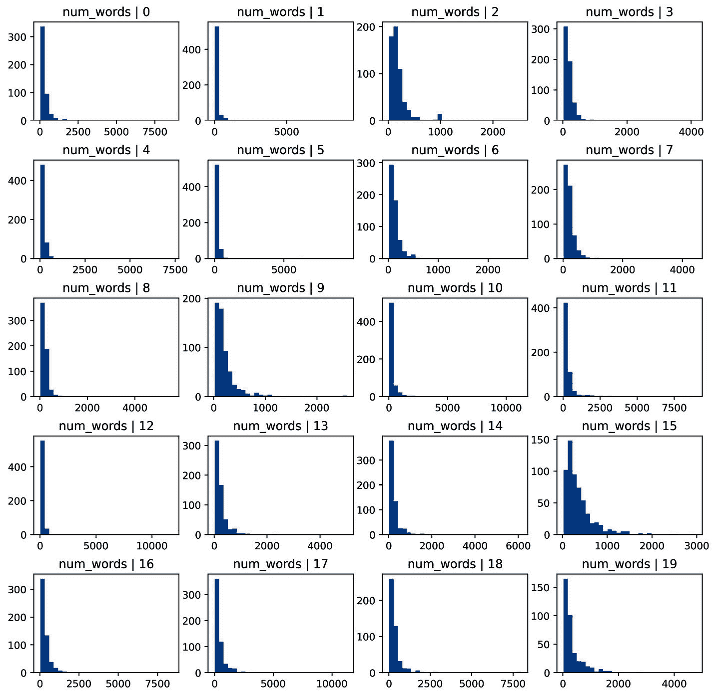
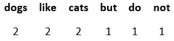
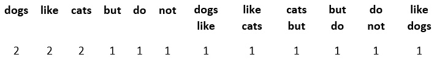
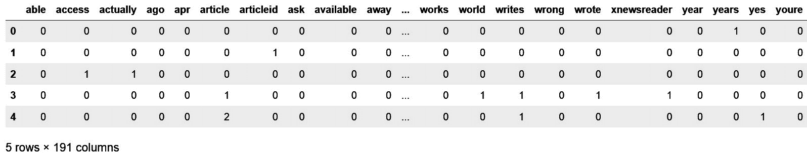
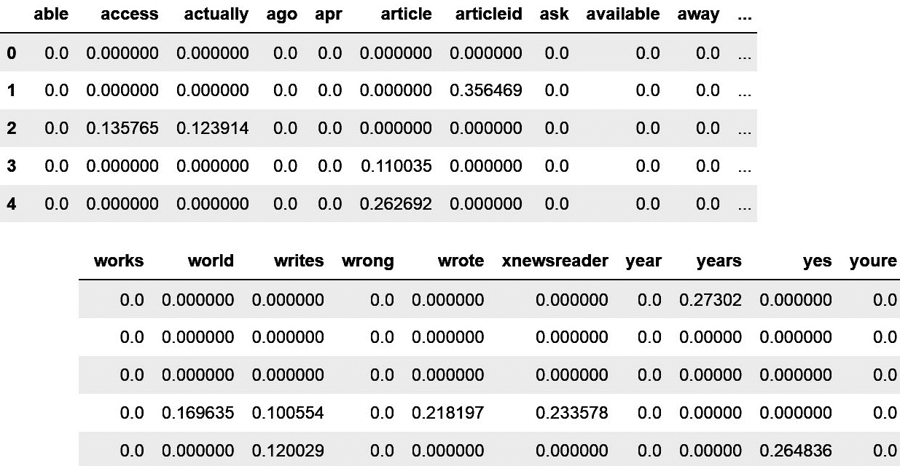

# <st c="0">11</st>

# <st c="3">从文本变量中提取特征</st>

<st c="43">文本可以是我们的数据集中的一个变量。</st> <st c="94">例如，在保险领域，描述事故情况的详细信息可能来自表格中的自由文本字段。</st> <st c="219">如果一家公司收集客户评价，这些信息将以用户提供的短文本片段的形式收集。</st> <st c="340">文本数据不显示</st> <st c="363">的</st> **<st c="368">表格</st>** <st c="375">模式，这是我们在这本书中一直处理的数据集。</st> <st c="447">相反，文本中的信息在长度、内容和写作风格上可能有所不同。</st> <st c="535">我们可以从文本变量中提取大量信息，用作机器学习模型中的预测特征。</st> <st c="649">本章将涵盖的技术属于</st> **<st c="717">自然语言处理</st>** <st c="744">(</st>**<st c="746">NLP</st>**<st c="749">)。</st> <st c="753">自然语言处理是语言学和计算机科学的一个子领域。</st> <st c="808">它关注计算机和人类语言之间的交互，换句话说，就是如何编程让计算机理解人类语言。</st> <st c="958">自然语言处理包括多种技术来理解文本的句法、语义和语篇。</st> <st c="1057">因此，要公正地对待这个领域，就需要一本</st> <st c="1110">完整的书。</st>

<st c="1122">在本章中，我们将讨论允许我们快速从短文本片段中提取特征以补充我们的预测模型的方法。</st> <st c="1278">具体来说，我们将讨论如何通过查看文本的一些统计参数来捕捉文本的复杂性，例如单词长度和计数、使用的单词和唯一单词的数量、句子数量等。</st> <st c="1521">我们将使用</st> `<st c="1537">pandas</st>` <st c="1543">和</st c="1548">scikit-learn</st>` <st c="1560">库，并且我们将简要介绍一个非常有用的 Python NLP 工具包，称为</st> **<st c="1653">自然语言</st>** **<st c="1670">工具包</st>** <st c="1677">(</st>**<st c="1679">NLTK</st>**<st c="1683">)。</st>

<st c="1686">本章包括以下食谱：</st>

+   <st c="1731">统计字符、单词和词汇</st>

+   <st c="1774">通过统计句子来估计文本的复杂性</st>

+   <st c="1823">使用词袋模型和 n-gram 创建特征</st>

+   <st c="1871">实现词频-逆文档频率</st>

+   <st c="1926">清理和词干提取文本变量</st>

# <st c="1964">技术要求</st>

在本章中，我们将使用<st c="2021">pandas</st>、<st c="2029">matplotlib</st>和<st c="2045">scikit-learn</st> Python 库。我们还将使用<st c="2093">NLTK</st>，这是一个用于 NLP 和文本分析的综合性 Python 库。您可以在[<st c="2206">http://www.nltk.org/install.html</st>](http://www.nltk.org/install.html)找到安装<st c="2198">NLTK</st>的说明。

如果您使用的是 Python Anaconda 发行版，请按照说明在[<st c="2334">https://anaconda.org/anaconda/nltk</st>](https://anaconda.org/anaconda/nltk)安装<st c="2326">NLTK</st>。

在您安装了<st c="2369">NLTK</st>之后，打开一个 Python 控制台并执行以下操作：

```py
 import nltk
nltk.download('punkt')
nltk.download('stopwords')
```

这些命令将为您下载运行本章中菜谱所需的数据。

注意

如果您尚未下载这些或其他对<st c="2708">NLTK</st>功能必要的源数据，<st c="2728">NLTK</st>将引发错误。仔细阅读错误消息，因为它将指导您下载运行您尝试执行的命令所需的数据。

# 计算字符、单词和词汇

文本的一个显著特征是其复杂性。长描述比短描述更有可能包含更多信息。包含不同、独特词汇的文本比反复重复相同词汇的文本更可能包含更丰富的细节。同样，当我们说话时，我们使用许多短词，如冠词和介词来构建句子结构，而主要概念通常来自我们使用的名词和形容词，这些往往是较长的词。所以，正如您所看到的，即使不阅读文本，我们也可以通过确定单词数量、唯一单词数量（单词的非重复出现）、词汇多样性和这些单词的长度来开始推断文本提供的信息量。在本菜谱中，我们将学习如何使用<st c="3806">pa</st><st c="3808">ndas</st>从文本变量中提取这些特征。

## 准备工作

<st c="3828">我们将使用</st> <st c="3835">scikit-learn</st><st c="3904">，它包含大约 18,000 篇关于 20 个不同主题的新闻帖子。</st> <st c="3971">有关此数据集的更多详细信息可以在以下网站上找到：</st>

+   <st c="4039">scikit</st><st c="4050">-learn 数据集</st> <st c="4066">网站：</st> [<st c="4075">https://scikit-learn.org/stable/datasets/real_world.html#newsgroups-dataset</st>](https://scikit-learn.org/stable/datasets/real_world.html#newsgroups-dataset)

+   <st c="4150">20 个新闻组数据集的页面：</st> [<st c="4196">http://qwone.com/~jason/20Newsgroups/</st>](http://qwone.com/~jason/20Newsgroups/)

<st c="4233">在深入菜谱之前，让我们讨论一下我们将从这些</st> <st c="4332">文本</st> <st c="4337">片段</st> <st c="4345">中提取的特征。</st> <st c="4345">我们提到，较长的描述、文章中的更多单词、更多唯一单词的多样性以及更长的单词往往与文章提供的信息量相关。</st> <st c="4539">因此，我们可以通过提取以下关于</st> <st c="4623">文本</st> <st c="4623">的信息来捕捉文本复杂性：</st>

+   <st c="4632">字符总数</st>

+   <st c="4663">单词总数</st>

+   <st c="4689">唯一单词的总数</st>

+   <st c="4722">词汇多样性（总单词数除以唯一单词数）</st>

+   <st c="4798">单词平均长度（字符数除以单词数）</st>

<st c="4868">在这个菜谱中，我们将使用</st> `<st c="4932">pandas</st>`<st c="4938">来提取这些数值特征，它具有广泛的字符串处理功能，可以通过</st> `<st c="5023">str</st>` <st c="5026">向量化的字符串函数</st> <st c="5055">来访问</st> <st c="5058">序列。</st>

## <st c="5066">如何做到这一点...</st>

<st c="5082">让我们首先加载</st> `<st c="5106">pandas</st>` <st c="5112">并准备好</st> <st c="5129">数据集：</st>

1.  <st c="5143">Load</st> `<st c="5149">pandas</st>` <st c="5155">and the dataset</st> <st c="5172">from</st> `<st c="5177">scikit-learn</st>`<st c="5189">:</st>

    ```py
     import pandas as pd
    from sklearn.datasets import fetch_20newsgroups
    ```

1.  <st c="5259">L</st><st c="5261">et’s load</st> <st c="5271">the train set part of the 20 Newsgrou</st><st c="5308">p dataset into a</st> `<st c="5326">pandas</st>` <st c="5332">DataFrame：</st>

    ```py
     data = fetch_20newsgroups(subset='train')
    df = pd.DataFrame(data.data, columns=['text'])
    ```

<st c="5432">提示</st>

您可以通过执行`print(df['text'][1])`来打印 DataFrame 中的文本示例。<st c="5524">更改`[` <st c="5552">和</st> `<st c="5553">`]` <st c="5559">之间的数字以显示不同的文本。</st> `<st c="5588">注意，每个文本描述都是一个由字母、数字、标点和空格组成的单个字符串。</st> `<st c="5694">您可以通过执行`type(df["text"][1])`来检查数据类型。</st>

现在我们已经将文本变量放入了一个`pandas` DataFrame 中，我们就可以准备提取特征了。

1.  让我们在新列中捕获每个文本片段中的字符数：

    ```py
     df['num_char'] = df['text'].str.len()
    ```

提示

您可以在计数字符数之前，通过在`len()`方法之前添加`strip()`方法来移除字符串末尾的空白字符，包括换行符，如下所示：`df['num_char'] = df['text'].str.strip().str.len()`。

1.  让我们在新列中捕获每个文本中的单词数：

    ```py
     df['num_words'] = df['text'].str.split().str.len()
    ```

    要计算单词数，我们使用`pandas`库的`split()`方法，该方法在空白处分割文本。<st c="6423">通过执行，例如，`split()`来查看`split()`的输出，`df["text"].loc[1].split()`以分离 DataFrame 中第二个文本的单词。</st>

1.  让我们在新列中捕获每个文本中的*唯一*单词数：

    ```py
     df['num_vocab']df[
        'text'].str.lower().str.split().apply(
            set).str.len()
    ```

注意

如果一个单词有一个大写字母，Python 会将其解释为两个不同的单词。为了避免这种行为，我们可以在`split()`方法之前应用`lower()`方法。

1.  让我们创建一个捕获词汇多样性的特征——也就是说，总单词数（<st c="6982">步骤</st> <st c="6987">4</st>）与唯一单词数（<st c="7032">步骤 5</st>）的比较：

    ```py
     df['lexical_div'] = df['num_words'] / df['num_vocab']
    ```

1.  让我们通过将字符数（<st c="7175">步骤 3</st>）除以单词数（<st c="7209">步骤 4</st>）来计算平均单词长度：

    ```py
     df['ave_word_length'] = df[
        'num_char'] / df['num_words']
    ```

    <st c="7277">如果我们执行</st> `<st c="7292">df.head()</st>`<st c="7301">，我们将看到包含文本和刚刚</st> <st c="7371">创</st><st c="7375">建的特征的</st> <st c="7379">前五行数据：</st>


<st c="7855">图 11.1 – 包含文本变量和总结文本特征的 DataFrame</st>

<st c="7966">有了这些，我们已经提取了五个不同的特征来捕捉文本复杂性，我们可以将这些特征用作</st> <st c="8071">我们的机器</st> <st c="8074">学习</st> <st c="8097">算法的</st> <st c="8106">输入。</st>

<st c="8117">注意</st>

<st c="8122">在这个菜谱中，我们从原始数据中直接创建了新特征，而没有进行任何数据清理、删除标点符号，甚至没有进行词干提取。</st> <st c="8274">请注意，这些是在大多数标准 NLP 程序之前执行的步骤。</st> <st c="8358">要了解更多信息，请访问本章末尾的</st> *<st c="8394">清洗和词干提取文本变量</st>* <st c="8430">菜谱。</st>

## <st c="8465">它是如何工作的...</st>

<st c="8481">在这个菜谱中，我们创建了</st> <st c="8509">五个新的特征，通过利用 pandas 的</st> `<st c="8578">str</st>` <st c="8581">来访问内置的</st> `<st c="8605">pandas</st>` <st c="8611">功能来处理字符串。</st> <st c="8648">我们处理了 20 个新闻组数据集的</st> `<st c="8686">train</st>` <st c="8691">子集的文本列，该数据集包含在</st> `<st c="8743">scikit-learn</st>`<st c="8755">中。</st> <st c="8806">该数据集中的每一行都由一个包含文本的字符串组成。</st>

<st c="8816">我们使用了 pandas 的</st> `<st c="8833">str</st>`<st c="8836">，然后是</st> `<st c="8850">len()</st>`<st c="8855">，来计算每个字符串中的字符数——即字母、数字、符号和空格的总数。</st> <st c="8976">我们还结合了</st> `<st c="8993">str.len()</st>` <st c="9002">和</st> `<st c="9008">str.strip()</st>` <st c="9019">来移除字符串开头和结尾的空白字符以及换行符中的空白字符，在计算字符数之前。</st>

<st c="9150">要计算单词数，我们使用了 pandas 的</st> `<st c="9197">str</st>`<st c="9200">，然后是</st> `<st c="9214">split()</st>`<st c="9221">，将字符串分割成单词列表。</st> <st c="9266">`<st c="9270">split()</st>` <st c="9277">方法通过在单词之间的空白处断开字符串来创建单词列表。</st> <st c="9367">接下来，我们使用</st> `<st c="9401">str.len()</st>`<st c="9410">来计算这些单词，得到每个字符串的单词数。</st>

<st c="9453">注意</st>

<st c="9458">我们可以通过传递一个字符串或字符来改变</st> `<st c="9489">str.split()</st>` <st c="9500">的行为，我们希望用它来分割字符串。</st> <st c="9581">例如，</st> `<st c="9594">df['text'].str.split(';')</st>` <st c="9619">在</st> `<st c="9659">;</st>`<st c="9660">的每个出现处分割字符串。</st>

<st c="9661">为了确定唯一单词的数量，我们使用了 pandas 的</st> `<st c="9719">str.split()</st>` <st c="9730">函数将字符串分割成单词列表。</st> <st c="9783">接下来，我们在 pandas 的</st> `<st c="9848">apply()</st>` <st c="9855">方法中应用了内置的 Python</st> `<st c="9820">set()</st>` <st c="9825">方法，以返回一组单词。</st> <st c="9882">记住，集合包含</st> *<st c="9911">唯一出现</st>* <st c="9929">的元素列表中的元素 – 那就是唯一单词。</st> <st c="9981">接下来，我们使用 pandas 的</st> `<st c="10023">str.len()</st>` <st c="10032">函数来计数这些单词，并返回</st> `<st c="10253">lower()</st>` <st c="10260">函数，在分割字符串并计数唯一单词数量之前将所有字符转换为小写。</st>

<st c="10377">为了创建</st> <st c="10391">词汇</st> <st c="10400">多样性和平均单词长度</st> <st c="10434">特征，</st> <st c="10444">我们</st> <st c="10446">只是</st><st c="10456">执行了两个</st> `<st c="10495">pandas</st>` <st c="10501">序列</st><st c="10503">的向量化除法。</st> <st c="10510">就是这样；我们创建了五个新的特征，其中包含有关文本复杂性的信息。</st>

## <st c="10601">还有更多...</st>

<st c="10617">我们可以通过使用可视化来检查数据集中每个 20 个不同新闻主题中提取的文本特征的分布。</st> <st c="10754">。</st>

<st c="10775">要创建新创建特征的直方图，在运行本食谱中 *<st c="10869">如何工作...</st>* <st c="10884">部分的全部步骤之后，遵循以下步骤：</st>

1.  <st c="10928">导入</st> `<st c="10936">matplotlib</st>`<st c="10946">:</st>

    ```py
     import matplotlib.pyplot as plt
    ```

1.  <st c="10980">将带有新闻主题的目标添加到 20</st> <st c="11027">Newsgroup DataFrame：</st>

    ```py
     df['target'] = data.target
    ```

1.  <st c="11074">创建一个函数，用于显示每个新闻主题所选特征的直方图：</st>

    ```py
     def plot_features(df, text_var):
        nb_rows = 5
        nb_cols = 4
        fig, axs = plt.subplots(
            nb_rows, nb_cols,figsize=(12, 12))
        plt.subplots_adjust(wspace=None, hspace=0.4)
        n = 0
        for i in range(0, nb_rows):
            for j in range(0, nb_cols):
                axs[i, j].hist(
                    df[df.target==n][text_var], bins=30)
                axs[i, j].set_title(
                    text_var + ' | ' + str(n))
                     n += 1
        plt.show()
    ```

1.  <st c="11518">为单词特征运行该函数</st> <st c="11536">的数量</st> <st c="11540">次：</st>

    ```py
     plot_features(df, 'num_words')
    ```

    <st c="11599">前面的命令返回以下图表，其中你可以看到每个 20 个新闻主题中单词数量的分布，编号从 0 到</st> <st c="11757">19，在</st> <st c="11767">图表标题中：</st>



<st c="12760">图 11.2 – 每个文本单词数量的直方图，按每个文本中讨论的主题进行细分</st>

<st c="12885">单词数量</st> <st c="12900">在不同新闻主题中</st> <st c="12905">显示出不同的</st> <st c="12924">分布</st><st c="12969">。因此，这个特征在分类算法中预测文本的主题时可能很有用。</st>

## <st c="13076">另请参阅</st>

<st c="13085">要了解更多关于 pandas 内置字符串处理功能的信息，请访问</st> [<st c="13162">https://pandas.pydata.org/pandas-docs/stable/user_guide/text.html#method-summary</st>](https://pandas.pydata.org/pandas-docs/stable/user_guide/text.html#method-summary)<st c="13242">。</st>

# <st c="13243">通过计算句子数量来估计文本复杂度</st>

<st c="13293">我们可以捕获的文本的一个方面是其复杂性。</st> <st c="13309">通常，包含多个句子并分布在几个段落中的较长的描述，比包含非常少句子的描述提供的信息更多。</st> <st c="13375">因此，捕获句子的数量可能有助于了解文本提供的信息量。</st> <st c="13543">这个过程被称为</st> `<st c="14027">NLTK</st>` <st c="14031">Python 库，它提供了这个功能。</st>

## <st c="14083">准备工作</st>

<st c="14097">在这个示例中，我们将使用</st> `<st c="14130">NLTK</st>` <st c="14134">Python 库。</st> <st c="14151">有关如何安装</st> `<st c="14184">NLTK</st>`<st c="14188">的指南，请参阅本章的</st> *<st c="14204">技术要求</st><st c="14225">部分</st>* <st c="14227">。</st>

## <st c="14252">如何操作...</st>

<st c="14268">让我们首先导入所需的库和数据集：</st> <st c="14317">和</st>

1.  <st c="14329">让我们加载</st> `<st c="14341">pandas</st>`<st c="14347">，从</st> `<st c="14377">NLTK</st>`<st c="14381">中获取句子分词器，以及来自</st> `<st c="14399">scikit-learn</st>`<st c="14404">的数据集</st> <st c="14416">：</st>

    ```py
     import pandas as pd
    from nltk.tokenize import sent_tokenize
    from sklearn.datasets import fetch_20newsgroups
    ```

1.  <st c="14526">为了理解</st> `<st c="14590">NLTK</st>`<st c="14594">中的句子分词器的功能，让我们创建一个包含多个句子的字符串变量：</st>

    ```py
     text = """
    The alarm rang at 7 in the morning as it usually did on Tuesdays. She rolled over, stretched her arm, and stumbled to the button till she finally managed to switch it off. Reluctantly, she got up and went for a shower. The water was cold as the day before the engineers did not manage to get the boiler working. Good thing it was still summer. Upstairs, her cat waited eagerly for his morning snack. Miaow! He voiced with excitement as he saw her climb the stairs. """
    ```

1.  <st c="15148">现在，让我们</st> <st c="15160">使用</st> `<st c="15185">步骤 2</st>` <st c="15191">中的字符串，通过</st> `<st c="15213">NLTK</st>` <st c="15217">库的</st> <st c="15228">句子分词器</st> <st c="15217">将其分割成句子：</st>

    ```py
     sent_tokenize(text)
    ```

<st c="15267">提示</st>

如果你在 `<st c="15301">步骤 3</st>`<st c="15307">中遇到错误，请仔细阅读错误消息，并下载 `<st c="15383">NLTK</st>`<st c="15387">所需的所需数据源，如错误消息中所述。</st> <st c="15424">有关更多详细信息，请查看 *<st c="15456">技术</st>* *<st c="15466">要求</st>* <st c="15478">部分。</st>

句子分词器返回以下输出中显示的句子列表：</st>

```py
<st c="15571">['\nThe alarm rang at 7 in the morning as it usually did on Tuesdays.',</st>
 <st c="15643">'She rolled over,\nstretched her arm, and stumbled to the button till she finally managed to switch it off.',</st>
 <st c="15753">'Reluctantly, she got up and went for a shower.',</st>
 <st c="15803">'The water was cold as the day before the engineers\ndid not manage to get the boiler working.',</st>
 <st c="15900">'Good thing it was still summer.',</st>
 <st c="15935">'Upstairs, her cat waited eagerly for his morning snack.',</st>
 <st c="15994">'Miaow!',</st>
 <st c="16004">'He voiced with excitement\nas he saw her climb the stairs.']</st>
```

`<st c="16066">注意</st>`

跟随字母的转义字符，`<st c="16117">\n</st>`<st c="16119">，表示一个新行。</st>

1.  `<st c="16143">让我们计算文本变量中的句子数量：</st>`

    ```py
     len(sent_tokenize(text))
    ```

    之前的命令返回了 `<st c="16257">8</st>`<st c="16258">，这是我们文本变量中的句子数量。</st> <st c="16315">现在，让我们确定整个 DataFrame 中的句子数量。</st>

1.  `<st c="16383">让我们将 20 个新闻组数据集的 `<st c="16399">训练</st>` <st c="16404">子集加载到 pandas DataFrame 中：</st>`

    ```py
     data = fetch_20newsgroups(subset='train')
    df = pd.DataFrame(data.data, columns=['text'])
    ```

1.  为了加快以下步骤，我们只需处理 DataFrame 的前 `<st c="16620">10</st>` `<st c="16622">行：</st>

    ```py
     df = df.loc[1:10]
    ```

1.  让我们也删除文本的第一部分，这部分包含有关电子邮件发送者、主题和其他我们不感兴趣的信息。</st> <st c="16819">大部分信息都在单词 `<st c="16866">Lines</st>` <st c="16871">之后，后面跟着 `<st c="16884">:</st>`<st c="16885">，所以让我们在 `<st c="16916">Lines:</st>` <st c="16922">处拆分字符串，并捕获字符串的第二部分：</st>

    ```py
     df['text'] = df['text'].str.split('Lines:').apply(
        lambda x: x[1])
    ```

1.  `<st c="17032">最终，让我们创建一个包含每段文本中句子数量的变量：</st>

    ```py
     df['num_sent'] = df['text'].apply(
        sent_tokenize).apply(len)
    ```

    `<st c="17174">使用</st>` `<st c="17184">df</st>` `<st c="17186">命令，您可以显示包含 `<st c="17242">text</st>` `<st c="17246">变量和包含每段文本中句子数量的新特征的整个 DataFrame：</st>`


`<st c="17926">现在，我们可以将这个新功能作为输入提供给</st>` <st c="17947">机器学习算法。</st>

## `<st c="18000">它的工作原理...</st>`

在这个示例中，我们使用 `<st c="18086">sent_tokenizer</st>` 从 `<st c="18110">NLTK</st>` `<st c="18114">库</st>` 中将包含文本的字符串分割成句子。`<st c="18124">sent_tokenizer</st>` 已经预先训练以识别大写字母和不同类型的标点符号，这些符号标志着句子的开始和结束。

首先，我们将 `<st c="18294">sent_tokenizer</st>` 应用到一个手动创建的字符串上，以便熟悉其功能。分词器将文本分割成八个句子的列表。我们结合了分词器和内置的 Python `<st c="18495">len()</st>` 方法来计算字符串中的句子数量。

接下来，我们加载了一个包含文本的数据集，为了加快计算速度，我们只保留了 DataFrame 的前 10 行，使用 pandas 的 `<st c="18692">loc[]</st>` 函数。接下来，我们移除了文本的第一部分，这部分包含了关于电子邮件发送者和主题的信息。为此，我们使用 pandas 的 `<st c="18873">str.split("Lines:")</st>` 函数在 `<st c="18852">Lines:</st>` 处分割字符串，该函数返回一个包含两个元素的列表：`<st c="18973">Lines:</st>` 前后的字符串。通过在 `<st c="19016">apply()</st>` 中使用 lambda 函数，我们保留了文本的第二部分——即列表中由 `<st c="19118">split()</st>` 返回的第二个字符串。

最后，我们使用 pandas 的 `<st c="19207">apply()</st>` 方法将 `<st c="19126">sent_tokenizer</st>` 应用到 DataFrame 的每一行上，将字符串分割成句子，然后使用内置的 Python `<st c="19300">len()</st>` 方法对句子列表进行操作，以返回每个字符串的句子数量。这样，我们创建了一个包含每个文本句子数量的新特征。

## <st c="19468">There’s mo</st><st c="19479">re...</st>

`<st c="19485">NLTK</st>` `<st c="19490">具有单词分词等有用功能，我们可以使用这些功能而不是 `<st c="19590">pandas</st>` 来计数和返回单词数量。</st> `<st c="19638">您可以在以下链接中了解更多关于 `<st c="19666">NLTK</st>` `<st c="19670">功能的信息：</st>`

+   *《Python 3 Text Processing with NLTK 3 Cookbook》*，作者 Jacob Perkkins，Packt Publishing

+   <st c="19776">The</st> `<st c="19781">NLTK</st>` <st c="19785">文档</st><st c="19794">在</st> [<st c="19804">http://www.nltk.org/</st>](http://www.nltk.org/)<st c="19824">。</st>

# <st c="19825">使用词袋和 n-gram 创建特征</st>

<st c="19873">A</st> **<st c="19876">词袋</st>** <st c="19888">(</st>**<st c="19890">BoW</st>**<st c="19893">)</st> <st c="19895">是一种简化的文本表示，它捕捉了文本中存在的单词以及每个单词在文本中出现的次数。</st> <st c="19901">所以，对于文本字符串**<st c="20079">Dogs like cats, but cats do not like dogs</st>**<st c="20120">，得到的 BoW 如下：</st> <st c="20141">如下：</st>



<st c="20191">图 11.4 – 从句子“Dogs like cats, but cats do not”派生的 BoW**<st c="20270">like dogs</st>**

<st c="20280">在这里，每个单词都成为一个变量，而这个变量的值表示该单词在字符串中出现的次数。</st> <st c="20296">正如你所看到的，BoW 捕捉了多重性，但并不保留单词顺序或语法。</st> <st c="20412">这就是为什么它是一种简单但有用的提取特征和捕捉我们所处理文本的一些信息的方法。</st> <st c="20501">这就是为什么它是一种简单但有用的提取特征和捕捉我们所处理文本的一些信息的方法。</st>

<st c="20634">为了捕捉一些语法，BoW 可以与**<st c="20689">n-gram</st>**<st c="20696">一起使用。n-gram 是一个在给定文本中连续的*n*<st c="20736">项的序列。</st> <st c="20724">继续使用句子**<st c="20790">Dogs like cats, but cats do not like dogs</st>**<st c="20831">，得到的 2-gram 如下：</st> <st c="20857">如下：</st>

+   <st c="20868">Dogs like</st>

+   <st c="20878">like cats</st>

+   <st c="20888">cats but</st>

+   <st c="20897">但是做</st>

+   <st c="20904">do not</st>

+   <st c="20911">like dogs</st>

<st c="20921">我们可以与一个 BoW（词袋）一起创建一个 n-gram 词袋，其中额外的变量由 2-gram 提供，每个 2-gram 的值是它们在每个字符串中出现的次数；在这个例子中，值是 1。</st> <st c="21149">因此，我们的最终 BoW（词袋）包含 2-gram 将看起来像这样：</st> <st c="21191">如下：</st>



<st c="21305">图 11.5 – 包含 2-gram 的 BoW</st>

<st c="21339">在这个菜谱中，我们将学习如何使用`<st c="21419">scikit-learn</st>`<st c="21424">创建带有或不带 n-gram 的 BoW。</st>

## <st c="21433">准备就绪</st>

<st c="21447">在跳入这个</st> <st c="21472">食谱</st> <st c="21511">之前</st><st c="21535">，让我们熟悉一些 B</st><st c="21535">oW 的参数，以便我们可以调整以使 BoW 更全面。</st> <st c="21589">在创建多个文本的 BoW 时，对于我们在分析的文本片段中至少出现一次的每个独特单词，都会创建一个新特征。</st> <st c="21714">任何</st> <st c="21717">一个</st> <st c="21755">文本片段中出现的单词，如果它只出现在一个文本片段中，那么它在该特定文本中的值将为 1，而在其他所有文本中的值为 0。</st> <st c="21882">因此，BoWs 往往是稀疏矩阵，其中大部分值</st> <st c="21951">都是零。</st>

<st c="21961">如果我们处理的是巨大的文本语料库，那么 BoW 中的列数——即单词数——可能相当大，如果我们还包括 n-gram，那么列数会更大。</st> <st c="22124">为了限制列数和返回矩阵的稀疏性，我们可以保留在多个文本中出现的单词；或者换句话说，我们可以保留至少在某个百分比</st> <st c="22339">的文本中出现的单词。</st>

<st c="22348">为了减少 BoW 的列数和稀疏性，我们还应该使用与单词相同的</st> <st c="22444">大小写</st> <st c="22448">——例如，小写——因为 Python 将不同大小写的单词识别为不同的单词。</st> <st c="22484">我们还可以通过</st> <st c="22605">删除</st> **<st c="22614">停用词</st>**<st c="22624">来减少列数和稀疏性。停用词是使用频率非常高的单词，使句子流畅，但本身并不携带任何有用的信息。</st> <st c="22749">停用词的例子包括代词，如我、你和他，以及介词和冠词。</st>

<st c="22846">在这个食谱中，我们将学习如何设置单词为小写，删除停用词，保留具有最低可接受频率的单词，并使用来自</st> `<st c="23042">scikit-learn</st>`<st c="23054">` 的单个转换器</st> <st c="23057">CountVectorizer()</st> <st c="23074">一起捕获 n-gram：</st>

## <st c="23075">如何做...</st>

<st c="23091">让我们首先加载必要的库并准备好</st> <st c="23155">数据集：</st>

1.  <st c="23169">加载</st> `<st c="23175">pandas</st>`<st c="23181">，`<st c="23183">CountVectorizer</st>`<st c="23198">，以及来自</st> `<st c="23221">scikit-learn</st>`<st c="23233">` 的数据集</st>：

    ```py
     import pandas as pd
    from sklearn.datasets import fetch_20newsgroups
    from sklearn.feature_extraction.text import ( CountVectorizer
    )
    ```

1.  <st c="23368">让我们将 20 个新闻组数据集的</st> <st c="23384">训练集部分</st> <st c="23398">加载到一个</st> <st c="23434">pandas DataFrame</st> 中：</st>

    ```py
     data = fetch_20newsgroups(subset='train')
    df = pd.DataFrame(data.data, columns=['text'])
    ```

1.  <st c="23540">为了使结果更容易解释，让我们从</st> <st c="23628">文本变量</st> 中删除标点符号和数字：</st>

    ```py
     df['text'] = df['text'].str.replace(
        ‹[^\w\s]›,››, regex=True).str.replace(
        ‹\d+›,››, regex=True)
    ```

<st c="23740">注意</st>

<st c="23745">要了解更多关于 Python 中的正则表达式的信息，请点击此</st> <st c="23797">链接：</st> [<st c="23803">https://docs.python.org/3/howto/regex.html</st>](https://docs.python.org/3/howto/regex.html)

1.  <st c="23845">现在，让我们</st> <st c="23857">设置</st> `<st c="23864">CountVectorizer()</st>` <st c="23881">，以便在创建 BoW 之前，它将文本转换为小写，删除停用词，并保留至少出现在 5%的</st> <st c="24021">文本片段中的单词：</st>

    ```py
     vectorizer = CountVectorizer(
        lowercase=True,
        stop_words='english',
        ngram_range=(1, 1),
        min_df=0.05)
    ```

<st c="24134">注意</st>

<st c="24139">为了将 n-gram 作为返回列的一部分引入，我们可以将`<st c="24221">ngrams_range</st>` <st c="24233">的值更改为，例如，`<st c="24251">(1,2)</st>`<st c="24256">。这个元组提供了不同 n-gram 的 n 值范围的上下边界。</st> <st c="24356">在`<st c="24371">(1,2)</st>`<st c="24376">的情况下，`<st c="24378">CountVectorizer()</st>` <st c="24395">将返回单个单词和两个连续单词的数组。</st>

1.  <st c="24457">让我们拟合`<st c="24468">CountVectorizer()</st>` <st c="24485">，以便它学习在 BoW 中应该使用哪些单词：</st>

    ```py
     vectorizer.fit(df['text'])
    ```

1.  <st c="24569">现在，让我们创建</st> <st c="24588">BoW：</st>

    ```py
     X = vectorizer.transform(df['text'])
    ```

1.  <st c="24634">最后，让我们将 BoW</st> <st c="24657">捕获到一个具有相应</st> <st c="24704">特征名称</st> <st c="24704">的 DataFrame 中：</st>

    ```py
     bagofwords = pd.DataFrame(
        X.toarray(),
        columns = vectorizer.get_feature_names_out()
    )
    ```

    <st c="24805">有了</st> <st c="24811">这</st> <st c="24819">，</st> <st c="24824">我们</st> <st c="24833">已经</st> <st c="24835">创建</st> <st c="24841">了一个包含单词作为列和每个文本中它们出现的次数作为值的`<st c="24835">pandas</st>` <st c="24841">DataFrame。</st> <st c="24945">您可以通过执行`<st c="24986">bagofwords.head()</st>`<st c="25003">来查看结果：</st>



<st c="25367">图 11.6 – 由 20 个新闻组数据集生成的 BoW 的 DataFrame</st>

<st c="25445">我们可以使用</st> <st c="25456">这个 BoW 作为机器</st> <st c="25489">学习模型的输入。</st>

## <st c="25504">它是如何工作的...</st>

<st c="25520">scikit-learn 的`<st c="25536">CountVectorizer()</st>` <st c="25553">将一组文本文档转换为标记计数的矩阵。</st> <st c="25625">这些标记可以是单个单词或两个或更多连续单词的数组——即 n-gram。</st> <st c="25725">在这个配方中，我们从一个 DataFrame 中的文本变量创建了一个 BoW。</st>

<st c="25796">我们从`<st c="25843">scikit-l</st><st c="25851">earn</st>` <st c="25856">加载了 20 个新闻组的文本数据集</st>，并使用 pandas 的`<st c="25926">replace()</st>` <st c="25935">函数从文本行中删除了标点符号和数字，该函数可以通过 pandas 的`<st c="25984">str</st>` <st c="25987">模块访问，以替换数字，`<st c="26015">'\d+'</st>`<st c="26020">，或符号，`<st c="26034">'[^\w\s]'</st>`<st c="26043">，为空字符串，`<st c="26065">''</st>`<st c="26067">。然后，我们使用了`<st c="26083">CountVectorizer()</st>` <st c="26100">来创建 BoW。</st> <st c="26120">我们将`<st c="26131">lowercase</st>` <st c="26140">参数设置为`<st c="26154">True</st>` <st c="26158">，在提取 BoW 之前将单词转换为小写。</st> <st c="26216">我们将`<st c="26227">stop_words</st>` <st c="26237">参数设置为`<st c="26250">english</st>` <st c="26257">，以忽略停用词——也就是说，避免 BoW 中的停用词。</st> <st c="26322">我们将`<st c="26329">ngram_range</st>` <st c="26340">设置为`<st c="26348">(1,1)</st>` <st c="26353">元组，以仅返回作为列的单个单词。</st> <st c="26400">最后，我们将`<st c="26416">min_df</st>` <st c="26422">设置为`<st c="26426">0.05</st>` <st c="26430">，以返回至少出现在 5%的文本中的单词，换句话说，在 DataFrame 中的 5%的行中。</st>

<st c="26545">在</st> <st c="26552">设置</st> <st c="26560">变压器</st> <st c="26562">之后</st>，我们使用了`<st c="26592">fit()</st>` <st c="26597">方法来允许变压器找到满足先前标准的单词。</st> <st c="26685">最后，使用`<st c="26704">transform()</st>` <st c="26715">方法，变压器返回了一个包含具有其特征名称的 BoW 的对象，我们将它捕获在一个`<st c="26826">pandas</st>` <st c="26832">DataFrame</st>中。</st>

## <st c="26843">另请参阅</st>

<st c="26852">有关`<st c="26877">CountVectorizer()</st>` <st c="26894">的更多详细信息，请访问</st> `<st c="26906">scikit-learn</st>` <st c="26918">库的文档</st> <st c="26943">在</st> [<st c="26946">https://scikit-learn.org/stable/modules/generated/s</st><st c="26997">klearn.feature_extraction.text.CountVectorizer.html</st>](https://scikit-learn.org/stable/modules/generated/sklearn.feature_extraction.text.CountVectorizer.html)<st c="27049">。</st>

# <st c="27050">实现词频-逆文档频率</st>

**<st c="27105">词频-逆文档频率</st><st c="27142">（TF-IDF）** 是一个数值统计量，它捕捉了在考虑整个文档集合的情况下，一个词在文档中的相关性。这是什么意思？一些词在文本文档中以及跨文档中都会出现很多次，例如英语单词 *<st c="27411">the</st>*<st c="27414">、*<st c="27416">a</st>*<st c="27417"> 和 *<st c="27423">is</st>*<st c="27425">，例如。</st> 这些词通常对文档的实际内容传达的信息很少，并且不会使文本脱颖而出。**<st c="27579">TF-IDF 提供了一种方法**，通过考虑一个词在文档中出现的次数以及它在文档中出现的频率来 *<st c="27604">权衡</st>* 该词的重要性。因此，像 *<st c="27785">the</st>*<st c="27788">、*<st c="27790">a</st>*<st c="27791"> 或 *<st c="27796">is</st>* 这样的常用词将具有较低的权重，而像 *<st c="27876">leopard</st>*<st c="27883"> 这样更具体于某个主题的词将具有更高的权重。

**<st c="27911">TF-IDF 是两个统计量的乘积**：**<st c="27953">词频</st>**（**<st c="27969">tf</st>**）和**<st c="27978">逆文档频率</st>**（**<st c="28004">idf</st>**），表示如下：**<st c="28037">tf-idf = tf × idf</st>**。tf 在其最简单形式中，是一个词在单个文本中的计数。因此，对于术语 *<st c="28143">t</st>*<st c="28144">，tf 的计算为 *<st c="28170">tf(t) = count(t)</st>*，并且基于文本进行确定。idf 是衡量一个词在 *<st c="28284">所有</st>* 文档中的普遍性的度量，通常在对数尺度上计算。以下是一个常见的实现方法：


<st c="28416">在这里，</st> *<st c="28422">n</st>* <st c="28423">是文档的总数，</st> *<st c="28462">df(t)</st>* <st c="28467">是包含术语</st> *<st c="28513">t</st>* <st c="28514">的文档数量。</st> <st c="28524">*<st c="28548">df(t)</st>*<st c="28553">的值越大，该术语的权重越低。</st> <st c="28593">如果一个词在文本中频繁出现（高</st> *<st c="28676">tf</st>*<st c="28678">），或者在不同文本中很少出现（</st><st c="28695">高</st> *<st c="28709">idf</st>*<st c="28718">），那么这个词的重要性就会很高。</st>

<st c="28721">注意</st>

<st c="28726">TF-IDF 可以与 n-gram 一起使用。</st> <st c="28769">同样，为了权衡一个 n-gram，我们将某个文档中的 n-gram 频率与文档间 n-gram 的频率相乘。</st>

<st c="28905">在这个菜谱中，我们将学习如何使用</st><st c="28961">scikit-learn</st> <st c="28998">提取特征，使用或不使用 n-gram。</st>

## <st c="29017">准备就绪</st>

`<st c="29031">scikit-learn</st>` <st c="29044">使用一种稍微不同的方式来计算 IDF 统计量：</st>

![<mml:math xmlns:mml="http://www.w3.org/1998/Math/MathML" xmlns:m="http://schemas.openxmlformats.org/officeDocument/2006/math" display="block"><mml:mi>i</mml:mi><mml:mi>d</mml:mi><mml:mi>f</mml:mi><mml:mfenced separators="|"><mml:mrow><mml:mi>t</mml:mi></mml:mrow></mml:mfenced><mml:mo>=</mml:mo><mml:mrow><mml:mrow><mml:mi mathvariant="normal">log</mml:mi></mml:mrow><mml:mo>⁡</mml:mo><mml:mrow><mml:mfenced separators="|"><mml:mrow><mml:mfrac><mml:mrow><mml:mn>1</mml:mn><mml:mo>+</mml:mo><mml:mi>n</mml:mi></mml:mrow><mml:mrow><mml:mn>1</mml:mn><mml:mo>+</mml:mo><mml:mi>d</mml:mi><mml:mi>f</mml:mi><mml:mo>(</mml:mo><mml:mi>t</mml:mi><mml:mo>)</mml:mo></mml:mrow></mml:mfrac></mml:mrow></mml:mfenced></mml:mrow></mml:mrow><mml:mo>+</mml:mo><mml:mn>1</mml:mn></mml:math>](img/49.png)

<st c="29134">这个公式确保了出现在所有文本中的词都得到最低的权重 1。</st> <st c="29230">此外，在计算每个词的 TF-IDF 之后，</st> `<st c="29288">scikit-learn</st>` <st c="29300">将（包含所有词的）特征向量归一化到其欧几里得范数。</st> <st c="29381">有关确切公式的更多详细信息，请访问</st> `<st c="29430">scikit-learn</st>` <st c="29442">文档</st> <st c="29457">在</st> [<st c="29460">https://scikit-learn.org/stable/modules/feature_extraction.html#tfidf-term-weighting</st>](https://scikit-learn.org/stable/modules/feature_extraction.html#tfidf-term-weighting)<st c="29544">。</st>

<st c="29545">TF-IDF 在创建术语矩阵时具有与 BoW 相同的特征——即，高特征空间和稀疏性。</st> <st c="29661">为了减少特征数量和稀疏性，我们可以删除停用词，将字符转换为小写，并保留在至少</st> <st c="29819">观察值中出现的单词的最低百分比。</st> <st c="29837">如果您不熟悉这些术语，请访问本章中的</st> *<st c="29887">使用词袋和 n-gram 创建特征</st>* <st c="29934">菜谱进行复习。</st>

<st c="29970">在这个菜谱中，我们将学习如何将单词转换为小写，删除停用词，保留具有最低可接受频率的单词，捕获 n-gram，然后使用来自</st> <st c="30179">scikit-learn 的单个转换器</st> <st c="30203">（`<st c="30217">TfidfVectorizer()</st>`<st c="30234">）返回单词的 TF-IDF 统计信息：</st>

## <st c="30235">如何做到这一点...</st>

<st c="30251">让我们首先加载必要的库并准备</st> <st c="30315">数据集：</st>

1.  <st c="30329">加载</st> `<st c="30335">pandas</st>`<st c="30341">，`<st c="30343">TfidfVectorizer()</st>`<st c="30360">和来自</st> `<st c="30378">scikit-learn</st>`<st c="30395">的数据集：</st>

    ```py
     import pandas as pd
    from sklearn.datasets import fetch_20newsgroups
    from sklearn.feature_extraction.text import (
        TfidfVectorizer
    )
    ```

1.  <st c="30530">让我们将 20 个新闻组数据集的训练集部分加载到一个</st> <st c="30596">pandas DataFrame 中：</st>

    ```py
     data = fetch_20newsgroups(subset='train')
    df = pd.DataFrame(data.data, columns=['text'])
    ```

1.  <st c="30702">为了使结果更容易解释，让我们从</st> <st c="30790">文本变量中删除标点符号和数字：</st>

    ```py
     df['text'] = df['text'].str.replace(
        ‹[^\w\s]›,››, regex=True).str.replace(
        '\d+','', regex=True)
    ```

1.  <st c="30902">现在，让我们设置</st> `<st c="30921">TfidfVectorize</st><st c="30935">r()</st>` <st c="30939">从</st> `<st c="30945">scikit-learn</st>` <st c="30957">中，以便在创建 TF-IDF 度量之前，将所有文本转换为小写，删除停用词，并且</st> <st c="31058">保留至少在 5%的</st> <st c="31106">文本片段中出现的单词：</st>

    ```py
     vectorizer = TfidfVectorizer(
        lowercase=True,
        stop_words='english',
        ngram_range=(1, 1),
        min_df=0.05)
    ```

<st c="31219">注意</st>

<st c="31224">为了将 n-gram 作为返回列的一部分引入，我们可以将</st> `<st c="31306">ngrams_range</st>` <st c="31318">的值更改为，例如，</st> `<st c="31336">(1,2)</st>`<st c="31341">。这个元组提供了不同 n-gram 的 n 值范围的上下边界。</st> <st c="31441">在</st> `<st c="31456">(1,2)</st>`<st c="31461">的情况下，</st> `<st c="31463">TfidfVectorizer()</st>` <st c="31480">将返回单个单词和两个连续单词的数组作为列。</st>

1.  <st c="31553">让我们拟合</st> `<st c="31564">TfidfVectorizer()</st>` <st c="31581">，以便它学习哪些单词应该作为 TF-IDF 矩阵的列引入，并确定</st> <st c="31684">单词的</st> `<st c="31691">idf</st>`<st c="31694">：</st>

    ```py
     vectorizer.fit(df['text'])
    ```

1.  <st c="31723">现在，让我们创建</st> <st c="31746">TF-IDF 矩阵：</st>

    ```py
     X = vectorizer.transform(df['text'])
    ```

1.  <st c="31797">最后，让我们将 TF-IDF 矩阵捕获到具有相应</st> <st c="31877">特征名称</st>的 DataFrame 中：</st>

    ```py
     tfidf = pd.DataFrame(
        X.toarray(),
        columns = vectorizer.get_feature_names_out()
    )
    ```

    <st c="31973">有了这个，我们就创建了一个</st> `<st c="32003">pandas</st>` <st c="32009">DataFrame，其中包含单词作为列，TF-IDF 作为值。</st> <st c="32073">您可以通过执行</st> <st c="32108">tfidf.head()</st><st c="32130">来检查结果：</st>



<st c="32918">图 11.7 – 由 TF-IDF 得到的特征 DataFrame</st>

<st c="32979">现在，我们可以使用这个</st><st c="33002">频率 DataFrame 来训练学习模型。</st>

## <st c="33061">它是如何工作的...</st>

<st c="33077">在这个菜谱中，我们通过使用 scikit-learn 的</st> `<st c="33187">TfidfVectorizer()</st>` <st c="33204">提取了至少出现在 5% 的文档中的单词的 TF-IDF 值。</st>

<st c="33223">我们从</st> `<st c="33269">scikit-learn</st>` <st c="33281">加载了 20 个新闻组文本数据集，然后使用 pandas 的</st> `<st c="33356">replace()</st>`<st c="33365">从文本行中删除了标点符号和数字，这可以通过 pandas 的</st> `<st c="33405">str</st>`<st c="33408">访问，以替换数字，</st> `<st c="33429">'\d+'</st>`<st c="33434">，或符号，</st> `<st c="33448">'[^\w\s]'</st>`<st c="33457">，用空字符串，</st> `<st c="33479">''</st>`<st c="33481">替换。</st> <st c="33497">然后，我们使用了</st> `<st c="33497">TfidfVectorizer()</st>` <st c="33514">来为单词创建 TF-IDF 统计数据。</st> <st c="33554">我们将</st> `<st c="33565">lowercase</st>` <st c="33574">参数设置为</st> `<st c="33588">True</st>` <st c="33592">，在计算之前将单词转换为小写。</st> <st c="33653">我们将</st> `<st c="33664">stop_words</st>` <st c="33674">参数设置为</st> `<st c="33687">english</st>` <st c="33694">，以避免返回矩阵中的停用词。</st> <st c="33739">我们将</st> `<st c="33746">ngram_range</st>` <st c="33757">设置为</st> `<st c="33765">(1,1)</st>` <st c="33770">元组，以返回单个单词作为特征。</st> <st c="33813">最后，我们将</st> `<st c="33833">min_df</st>` <st c="33839">参数设置为</st> `<st c="33852">0.05</st>` <st c="33856">，以返回至少出现在 5% 的文本中或换句话说，在 5% 的</st> <st c="33942">行中的单词。</st>

<st c="33951">在设置完转换器后，我们应用了</st> `<st c="34001">fi</st><st c="34003">t()</st>` <st c="34007">方法，让转换器找到最终项矩阵中要保留的单词。</st> <st c="34089">使用</st> `<st c="34098">transform()</st>` <st c="34109">方法，转换器返回了一个包含单词及其 TF-IDF 值的对象，然后我们将其捕获在一个具有适当特征名称的 pandas DataFrame 中。</st> <st c="34274">现在，我们可以在机器</st> <st c="34315">学习算法中使用这些特征。</st>

## <st c="34335">另请参阅</st><st c="34343">。

*<st c="34345">有关</st> `<st c="34365">TfidfVectorizer()</st>` *<st c="34382">的更多详细信息，请访问 scikit-learn 的文档：[<st c="34420">https://scikit-learn.org/stable/modules/gen</st><st c="34463">erated/sklearn.feature_extraction.text.TfidfVectori</st><st c="34515">zer.html</st>](https://scikit-learn.org/stable/modules/generated/sklearn.feature_extraction.text.TfidfVectorizer.html)*

# *<st c="34524">清理和词干提取文本变量</st>*

我们的数据集中的一些变量来自自由文本字段，这些字段是由用户手动 *<st c="34640">完成的</st>*。人们的写作风格不同，我们使用各种标点符号、大小写模式和动词变位来传达内容及其相关的情感。通过创建总结文本复杂度、关键词和文档中单词相关性的统计参数，我们可以从文本中提取（一些）信息，而无需费心阅读它。我们已经在本章前面的食谱中讨论了这些方法。然而，为了得出这些统计和聚合特征，我们首先应该清理文本变量。

*<st c="35224">文本清理或预处理包括标点符号删除、停用词消除、字符大小写设置和词干提取。</st> 标点符号删除包括删除不是字母、数字或空格的字符；在某些情况下，我们也会删除数字。停用词消除是指删除在语言中用于句子结构和流畅性的常用词，但它们单独传达的信息很少或没有。停用词的例子包括英语中的冠词，如 *<st c="35726">the</st>*、*<st c="35729">and</st>* 和 *<st c="35734">a</st>*，以及代词，如 *<st c="35790">I</st>*、*<st c="35791">,</st> *<st c="35793">you</st>*、*<st c="35796">and</st> *<st c="35801">they</st>*，以及各种变位中的常用动词，如动词 *<st c="35880">to be</st>* 和 *<st c="35885">to have</st>*，以及助动词 *<st c="35930">would</st>*、*<st c="35935">and</st> *<st c="35940">do</st>*。</st>

为了让计算机正确识别单词，也需要将所有单词设置为相同的格式，因为单词 *<st c="36068">Toy</st>* 和 *<st c="36076">toy</st>* 由于第一个单词中的大写字母 *<st c="36154">T</st>*，会被计算机识别为不同的单词。

最后，为了专注于文本的 *<st c="36199">信息</st>* <st c="36206">，我们不希望计算机在单词有不同的变形时将单词视为不同。因此，我们将使用词干提取作为预处理流程的一部分。词干提取是指将每个单词缩减到其根或基本形式，以便单词 *<st c="36465">playing</st>*<st c="36472">,</st> *<st c="36474">plays</st>*<st c="36479">, 和 *<st c="36485">played</st>* <st c="36491">变成 *<st c="36499">play</st>*<st c="36503">，本质上传达了相同或非常 <st c="36549">相似的意义。</st>

在这个菜谱中，我们将学习如何使用 pandas 和 `<st c="36704">NLTK</st>`<st c="36708">.</st> 移除标点符号和停用词，将单词转换为小写，并执行词干提取。

## 准备工作

我们将使用 `<st c="36748">NLTK</st>` <st c="36752">词干提取包来执行词干提取，它结合了不同的算法来从英语和其他语言中提取词干。每种方法都使用不同的算法来找到单词的 *<st c="36937">根</st>* <st c="36941">，因此它们可能输出略微不同的结果。我建议您了解更多相关信息，尝试不同的方法，并选择适合您正在工作的项目的那个。</st> <st c="37010">I recommend reading more about it, trying different methods, and</st> <st c="37075">choosing</st> <st c="37084">the</st> <st c="37088">one that serves the project you are</st> <st c="37124">working on.</st>

关于 `<st c="37135">NLTK</st>`<st c="37166">词干提取器</st> 的更多信息可以在 [<st c="37190">https://www.nlt</st><st c="37205">k.org/api/nltk.stem.html</st>](https://www.nltk.org/api/nltk.stem.html)<st c="37230">.</st> 找到。

## 如何做到这一点...

让我们首先加载必要的库并准备好数据集：

1.  加载 `<st c="37331">pandas</st>`<st c="37337">,</st> `<st c="37339">stopwords</st>`<st c="37348">, 和 `<st c="37354">SnowballStemmer</st>` <st c="37369">从 `<st c="37375">NLTK</st>` <st c="37379">以及数据集从 `<st c="37396">scikit-learn</st>`<st c="37413">:</st>

    ```py
     import pandas as pd
    from nltk.corpus import stopwords
    from nltk.stem.snowball import SnowballStemmer
    from sklearn.datasets import fetch_20newsgroups
    ```

1.  让我们将 20 个新闻组数据集的训练集部分加载到一个 pandas DataFrame 中：

    ```py
     data = fetch_20newsgroups(subset='train')
    df = pd.DataFrame(data.data, columns=['text'])
    ```

    现在，让我们开始进行文本清理。

注意

在执行这个菜谱中的每个命令后，通过执行例如 `<st c="37888">print(df['text'][10])</st>` <st c="37909">来打印一些示例文本，以便您可以可视化对文本所做的更改。</st> <st c="37972">Go ahead and do it now, and then repeat the command after</st> <st c="38030">每个步骤。</st>

1.  首先，让我们移除标点符号：

    ```py
     df["text"] = df['text'].str.replace('[^\w\s]','')
    ```

小贴士

<st c="38135">您还可以使用 Python 的内置</st> `<st c="38191">string</st>` <st c="38197">模块来删除标点符号。</st> <st c="38218">首先，通过执行</st> `<st c="38256">import string</st>` <st c="38269">来导入模块，然后执行</st> `<st c="38287">df['text'] =</st>` `<st c="38300">df['text'].str.replace('[{}]</st><st c="38328">'.format(string.punctuation), '')</st>`<st c="38363">。</st>

1.  <st c="38364">我们还可以</st> <st c="38376">删除</st> <st c="38384">数字字符，只留下字母，</st> <st c="38435">如下所示：</st>

    ```py
     df['text'] = df['text'].str.replace(
        '\d+', '', regex=True)
    ```

1.  <st c="38506">现在，让我们将所有单词</st> <st c="38532">转换为小写：</st>

    ```py
     df['text'] = df['text'].str.lower()
    ```

    <st c="38583">现在，让我们开始</st><st c="38606">移除</st> <st c="38626">停用词</st>的过程。

<st c="38637">注意</st>

*<st c="38642">步骤 6</st>* <st c="38649">可能会失败，如果您没有下载 NLTK 库的</st> `<st c="38687">停用词</st>`<st c="38702">。请访问本章中的</st> *<st c="38723">技术要求</st>* <st c="38745">部分以获取更多详细信息。</st>

1.  <st c="38787">让我们创建一个函数，该函数将字符串拆分为单词列表，移除停用词，并将剩余的单词重新连接成一个字符串：</st> <st c="38934">：</st>

    ```py
     def remove_stopwords(text):
        stop = set(stopwords.words('english'))
        text = [word
        for word in text.split() if word not in stop]
        text = ‹ ‹.join(x for x in text)
        return text
    ```

<st c="39114">注意</st>

<st c="39119">为了能够使用</st> `<st c="39160">scikit-learn</st>` <st c="39172">库的</st> `<st c="39179">CountVectorizer()</st>` <st c="39201">或</st> `<st c="39205">TfidfVectorizer()</st>`<st c="39215">，我们需要文本以字符串格式存在。</st> <st c="39266">因此，在移除停用词后，我们需要将单词作为单个字符串返回。</st> <st c="39356">我们将 NLTK 库的停用词列表转换为一个集合，因为集合比列表扫描更快。</st> <st c="39466">这提高了</st> <st c="39484">计算时间。</st>

1.  <st c="39501">现在，让我们使用</st> <st c="39516">步骤 6</st> <st c="39521">中的函数来从</st> `<st c="39572">text</st>` <st c="39576">变量中移除停用词：</st>

    ```py
     df['text'] = df['text'].apply(remove_stopwords)
    ```

    <st c="39634">如果您想知道哪些单词是</st> <st c="39670">停用词</st><st c="39680">s，</st> <st c="39684">执行</st> `<st c="39692">stopwords.words('english')</st>`<st c="39718">。</st>

    <st c="39719">最后，让我们对我们的数据进行词干提取。</st> <st c="39763">我们将使用</st> `<st c="39775">SnowballStemmer</st>` <st c="39790">从</st> `<st c="39796">NLTK</st>` <st c="39800">中</st> <st c="39804">进行此操作。</st>

1.  <st c="39810">让我们为</st> `<st c="39839">SnowballStemer</st>` <st c="39853">创建一个针对</st> <st c="39862">英语语言</st>的实例：</st>

    ```py
     stemmer = SnowballStemmer("english")
    ```

<st c="39916">提示</st>

<st c="39920">尝试在单个单词上使用词干提取器来查看其工作方式；例如，运行</st> `<st c="39992">stemmer.stem('running')</st>`<st c="40015">。你应该看到</st> `<st c="40032">run</st>` <st c="40035">作为该命令的结果。</st> <st c="40067">尝试</st> <st c="40071">不同的单词！</st>

1.  <st c="40087">让我们创建一个函数，该函数将字符串分割成单词列表，将</st> `<st c="40163">stemmer</st>` <st c="40170">应用于每个单词，并将还原的单词列表重新连接成字符串：</st> <st c="40242">一个字符串：</st>

    ```py
     def stemm_words(text):
        text = [
            stemmer.stem(word) for word in text.split()
        ]
        text = ‹ ‹.join(x for x in text)
        return text
    ```

1.  <st c="40374">让我们使用</st> <st c="40384">从</st> <st c="40389">步骤 9</st> <st c="40403">中的函数</st> <st c="40409">来还原我们数据中的单词：</st> <st c="40431">我们的数据：</st>

    ```py
     df['text'] = df['text'].apply(stemm_words)
    ```

    <st c="40483">现在，我们的文本已经准备好根据字符和单词计数创建特征，以及创建 BoWs 或 TF-IDF 矩阵，正如本章前面的食谱中所述。</st> <st c="40645">这一章。</st>

    <st c="40658">如果我们执行</st> `<st c="40673">print(df['text'][10])</st>`<st c="40694">，我们将看到清理后的文本示例：</st> <st c="40723">清理后：</st>

    ```py
    <st c="40738">irwincmptrclonestarorg irwin arnstein subject recommend duc summari what worth distribut usa expir sat may gmt organ computrac inc richardson tx keyword ducati gts much line line ducati gts model k clock run well paint bronzebrownorang fade leak bit oil pop st hard accel shop fix tran oil leak sold bike owner want think like k opinion pleas email thank would nice stabl mate beemer ill get jap bike call axi motor tuba irwin honk therefor computracrichardsontx irwincmptrclonestarorg dod r</st>
    ```

<st c="41230">注意</st>

<st c="41235">如果你正在计算句子数，你需要在移除标点符号之前这样做，因为标点和</st> <st c="41334">大写字母是定义每个句子边界的必要条件。</st>

## <st c="41404">它是如何工作的...</st>

<st c="41420">在这个食谱中，我们从文本变量中移除了标点符号、数字和停用词，将单词转换为小写，最后将单词还原到词根。</st> <st c="41440">我们使用 pandas 的</st> `<st c="41653">replace()</st>`<st c="41662">从文本变量中移除了标点符号和数字，这可以通过 pandas 的</st> `<st c="41702">str</st>`<st c="41705">访问，用于替换数字，</st> `<st c="41726">'\d+'</st>`<st c="41731">，或符号，</st> `<st c="41745">'[^\w\s]'</st>`<st c="41754">，为空字符串，</st> `<st c="41776">''</st>`<st c="41778">。或者，我们可以使用内置的</st> `<st c="41810">punctuation</st>` <st c="41821">模块从内置的</st> `<st c="41847">string</st>` <st c="41853">包中。</st>

<st c="41862">提示</st>

<st c="41866">运行</st> `<st c="41871">string.punctuation</st>` <st c="41889">在导入</st> `<st c="41929">string</st>` <st c="41935">后，在你的 Python 控制台中查看将被替换为空字符串的符号。</st> <st c="41988">空字符串。</st>

<st c="42002">接下来，利用</st> <st c="42018">pandas 的字符串</st> <st c="42034">处理功能通过</st> `<st c="42067">str</st>`<st c="42070">，我们使用</st> `<st c="42118">lower()</st>` <st c="42125">方法将所有单词转换为小写。</st> <st c="42134">为了从文本中移除停用词，我们使用了来自</st> `<st c="42182">stopwords</st>` <st c="42191">模块的</st> `<st c="42204">NLTK</st>`<st c="42208">，其中包含了一组频繁出现的单词列表——即停用词。</st> <st c="42297">我们创建了一个函数，该函数接受一个字符串并将其使用 pandas 的</st> `<st c="42388">str.split()</st>`<st c="42399">分解成单词列表，然后，使用列表推导式，我们遍历列表中的单词并保留非停用词。</st> <st c="42506">最后，使用</st> `<st c="42524">join()</st>` <st c="42530">方法，我们将保留的单词重新连接成一个字符串。</st> <st c="42594">我们使用 Python 内置的</st> `<st c="42622">set()</st>` <st c="42627">方法对</st> `<st c="42644">NLTK</st>` <st c="42648">停用词列表进行操作，以提高计算效率，因为遍历集合比遍历列表要快。</st> <st c="42756">最后，使用 pandas 的</st> `<st c="42778">apply()</st>`<st c="42785">，我们将该函数应用于我们的</st> <st c="42830">文本数据的每一行。</st>

<st c="42840">提示</st>

<st c="42844">在导入</st> `<st c="42849">stopwords.words('english')</st>` <st c="42875">到您的 Python 控制台后运行，</st> `<st c="42915">stopwords</st>` <st c="42924">来自</st> `<st c="42930">NLTK</st>` <st c="42934">，以可视化将要被移除的停用词列表。</st>

<st c="42998">最后，我们使用</st> `<st c="43035">SnowballStemmer</st>` <st c="43050">从</st> `<st c="43056">NLTK</st>`<st c="43060">.</st> `<st c="43062">SnowballStemmer</st>` <st c="43077">逐个单词进行处理。</st> <st c="43104">因此，我们创建了一个函数，该函数接受一个字符串并将其使用 pandas 的</st> `<st c="43206">str.split()</st>`<st c="43217">. 在列表推导式中，我们逐个单词应用</st> `<st c="43255">SnowballStemmer</st>` <st c="43270">，然后将分解后的单词列表重新连接成一个字符串，使用的是</st> `<st c="43362">join()</st>` <st c="43368">方法。</st> <st c="43377">使用 pandas 的</st> `<st c="43390">apply()</st>`<st c="43397">，我们将该函数应用于 DataFrame 的每一行中的单词。</st>

<st c="43466">我们在本食谱中执行的预处理步骤产生了包含原始文本的字符串，没有标点符号或数字，全部小写，没有常用词，并且使用词根而不是其屈折形式。</st> <st c="43695">返回的数据可以用来推导特征，如</st> *<st c="43776">计数字符、单词和词汇</st>* <st c="43818">食谱中所述，或者创建 BoWs 和 TI-IDF 矩阵，如</st> *<st c="43886">使用词袋和 n-gram 创建特征</st><st c="43929">食谱</st> <st c="43934">和</st> *<st c="43939">实现词频-逆文档频率</st> * *<st c="43984">频率</st> * <st c="43993">食谱</st>中所述。

<st c="44002">正如我们在本食谱中所示，清理文本可能会造成数据丢失，这取决于文本的特征，如果我们希望在创建 BoW 或 TF-IDF 矩阵后解释模型，理解词根的重要性可能并不</st> <st c="44256">那么直接。</st>
