# 预测建模

在本章中，我们将介绍以下食谱：

+   使用**支持向量机**（**SVMs**）构建线性分类器

+   使用 SVM 构建非线性分类器

+   解决类别不平衡问题

+   提取置信度测量

+   寻找最优超参数

+   构建事件预测器

+   估计交通流量

+   使用 TensorFlow 简化机器学习工作流程

+   实现堆叠方法

# 技术要求

为了处理本章中的食谱，你需要以下文件（可在 GitHub 上找到）：

+   `svm.py`

+   `data_multivar.txt`

+   `svm_imbalance.py`

+   `data_multivar_imbalance.txt`

+   `svm_confidence.py`

+   `perform_grid_search.py`

+   `building_event_binary.txt`

+   `building_event_multiclass.txt`

+   `` `event.py` ``

+   `traffic_data.txt`

+   `traffic.py`

+   `IrisTensorflow.py`

+   `stacking.py`

# 简介

**预测建模**可能是数据分析中最激动人心的领域之一。近年来，由于许多不同领域中有大量数据可用，它受到了很多关注。它在数据挖掘领域非常常用，用于预测未来的趋势。

预测建模是一种分析技术，用于预测系统的未来行为。它是一系列算法，可以识别独立输入变量与目标响应之间的关系。我们根据观察创建一个数学模型，然后使用这个模型来估计未来会发生什么。

在预测建模中，我们需要收集已知响应的数据来训练我们的模型。一旦我们创建了该模型，我们将使用一些指标来验证它，然后使用它来预测未来的值。我们可以使用许多不同类型的算法来创建预测模型。在本章中，我们将使用 SVM 来构建线性和非线性模型。

预测模型是通过使用可能影响系统行为的多个特征构建的。例如，为了估计天气条件，我们可能使用各种类型的数据，如温度、气压、降水和其他大气过程。同样，当我们处理其他类型的系统时，我们需要决定哪些因素可能影响其行为，并在训练模型之前将它们作为特征向量的一部分包括在内。

# 使用 SVM 构建线性分类器

SVMs（支持向量机）是我们可以用来创建分类器和回归器的监督学习模型。SVM 通过求解一组数学方程式，找到两个点集之间最佳分离边界。让我们看看如何使用 SVM 构建线性分类器。

# 准备工作

让我们可视化我们的数据，以理解当前的问题。我们将使用`svm.py`文件来完成这项工作。在我们构建 SVM 之前，让我们了解我们的数据。我们将使用已经提供给你的`data_multivar.txt`文件。让我们看看如何可视化数据：

1.  创建一个新的 Python 文件，并向其中添加以下行（完整的代码在已经提供给你的`svm.py`文件中）：

```py
import numpy as np 
import matplotlib.pyplot as plt 

import utilities  

# Load input data 
input_file = 'data_multivar.txt' 
X, y = utilities.load_data(input_file) 
```

1.  我们只导入了一些包并命名了输入文件。让我们看看`load_data()`方法：

```py
# Load multivar data in the input file 
def load_data(input_file): 
    X = [] 
    y = [] 
    with open(input_file, 'r') as f: 
        for line in f.readlines(): 
            data = [float(x) for x in line.split(',')] 
            X.append(data[:-1]) 
            y.append(data[-1])  

    X = np.array(X) 
    y = np.array(y) 

    return X, y 
```

1.  我们需要将数据分离成类别，如下所示：

```py
class_0 = np.array([X[i] for i in range(len(X)) if y[i]==0]) 
class_1 = np.array([X[i] for i in range(len(X)) if y[i]==1]) 
```

1.  现在我们已经分离了数据，让我们绘制它：

```py
plt.figure() 
plt.scatter(class_0[:,0], class_0[:,1], facecolors='black', edgecolors='black', marker='s') 
plt.scatter(class_1[:,0], class_1[:,1], facecolors='None', edgecolors='black', marker='s') 
plt.title('Input data') 
plt.show() 
```

如果你运行此代码，你将看到以下内容：

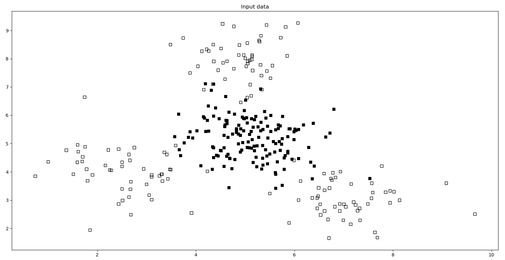

前面包含两种类型的点——**实心方块**和**空心方块**。在机器学习的术语中，我们说我们的数据包含两个类别。我们的目标是构建一个可以将实心方块与空心方块分开的模型。

# 如何做到这一点...

在这个菜谱中，我们将学习如何使用支持向量机（SVMs）构建线性分类器：

1.  我们需要将我们的数据集分成训练集和测试集。向同一 Python 文件中添加以下行：

```py
# Train test split and SVM training 
from sklearn import cross_validation 
from sklearn.svm import SVC 

X_train, X_test, y_train, y_test = cross_validation.train_test_split(X, y, test_size=0.25, random_state=5) 
```

1.  让我们使用`linear`核初始化 SVM 对象。向文件中添加以下行：

```py
params = {'kernel': 'linear'} 
classifier = SVC(**params, gamma='auto') 
```

1.  我们现在准备好训练线性 SVM 分类器：

```py
classifier.fit(X_train, y_train) 
```

1.  我们现在可以看到分类器的表现：

```py
utilities.plot_classifier(classifier, X_train, y_train, 'Training dataset') 
plt.show() 
```

如果你运行此代码，你将得到以下内容：

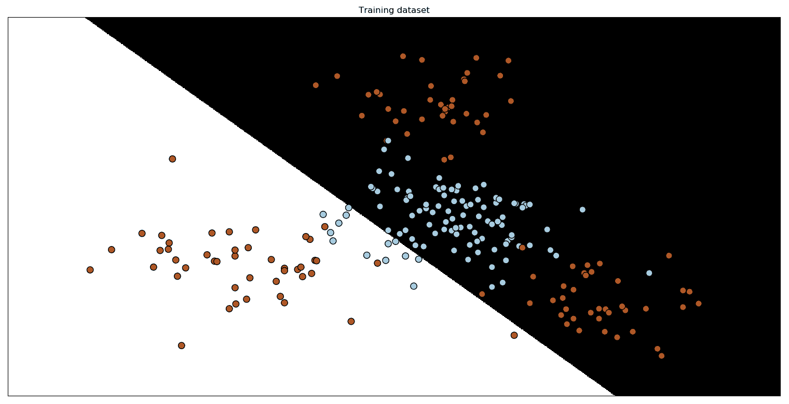

`plot_classifier`函数与我们在第一章，“监督学习领域”中讨论的相同。它有一些小的补充。

你可以查看已经提供给你的`utilities.py`文件以获取更多详细信息。

1.  让我们看看它在测试数据集上的表现。向`svm.py`文件中添加以下行：

```py
y_test_pred = classifier.predict(X_test) 
utilities.plot_classifier(classifier, X_test, y_test, 'Test dataset') 
plt.show()
```

如果你运行此代码，你将看到以下输出：

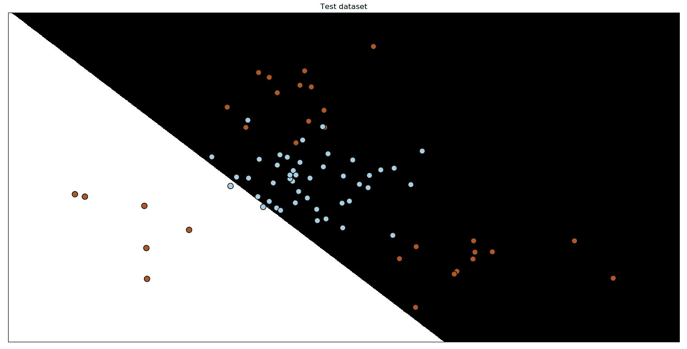

如你所见，分类器在输入数据上的边界被清楚地识别。

1.  让我们计算训练集的准确率。向同一文件中添加以下行：

```py
from sklearn.metrics import classification_report 

target_names = ['Class-' + str(int(i)) for i in set(y)]
print("\n" + "#"*30)
print("\nClassifier performance on training dataset\n")
print(classification_report(y_train, classifier.predict(X_train), target_names=target_names))
print("#"*30 + "\n")
```

如果你运行此代码，你将在你的终端看到以下内容：

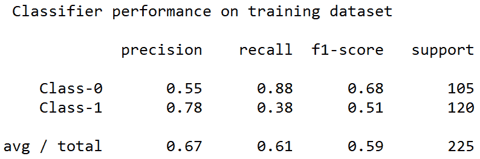

1.  最后，让我们看看测试数据集的分类报告：

```py
print("#"*30)
print("\nClassification report on test dataset\n")
print(classification_report(y_test, y_test_pred, target_names=target_names))
print("#"*30 + "\n")
```

1.  如果你运行此代码，你将在终端看到以下内容：

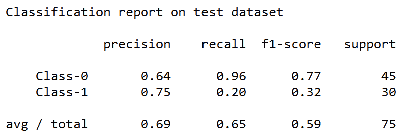

从我们可视化数据的输出截图来看，我们可以看到实心方块被空心方块完全包围。这意味着数据不是线性可分的。我们无法画一条漂亮的直线来分离这两组点！因此，我们需要一个非线性分类器来分离这些数据点。

# 它是如何工作的...

SVMs 是一组监督学习方法，可用于分类和回归。对于两个线性可分的多维模式类别，在所有可能的分离超平面中，SVM 算法确定能够以最大可能间隔分离类别的那个超平面。间隔是训练集中两个类别的点与识别的超平面的最小距离。

边界的最大化与泛化能力相关。如果训练集的模式以大边界被分类，你可以希望即使测试集的模式接近类别之间的边界也能被正确处理。在下面的内容中，你可以看到三条线（**l1**、**l2** 和 **l3**）。线 **l1** 无法分离两个类别，线 **l2** 可以分离它们，但边界较小，而线 **l3** 最大化两个类别之间的距离：

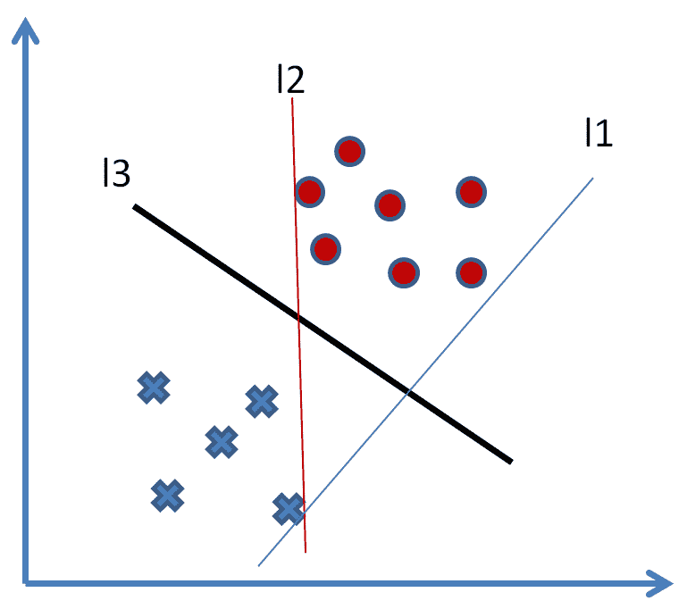

SVMs 可以用来分离那些线性分类器无法分离的类别。对象坐标通过称为**特征函数**的非线性函数映射到一个称为**特征空间**的空间中。这个空间是多维的，在这个空间中，两个类别可以用线性分类器分离。因此，初始空间被重新映射到新空间，此时分类器被识别，然后返回到初始空间。

# 更多内容...

**SVMs** 是文献中最近引入的一类学习机器。SVMs 来自于关于学习统计理论的观念，并具有理论上的泛化特性。SVMs 的功能机制所遵循的理论是由 Vapnik 在 1965 年（统计学习理论）提出的，后来在 1995 年由 Vapnik 本人和其他人进一步完善。SVMs 是模式分类中最广泛使用的工具之一。Vapnik 建议直接解决感兴趣的问题，即确定类别之间的决策表面（分类边界），而不是估计类别的概率密度。

# 参见

+   参考 `sklearn.svm.SVC()` 函数的官方文档：[`scikit-learn.org/stable/modules/generated/sklearn.svm.SVC.html`](https://scikit-learn.org/stable/modules/generated/sklearn.svm.SVC.html)

+   参考 *支持向量机教程*（哥伦比亚大学）：[`www.cs.columbia.edu/~kathy/cs4701/documents/jason_svm_tutorial.pdf`](http://www.cs.columbia.edu/~kathy/cs4701/documents/jason_svm_tutorial.pdf)

+   参考 *支持向量机* - 讲义（由斯坦福大学的 Andrew Ng 提供）：[`cs229.stanford.edu/notes/cs229-notes3.pdf`](http://cs229.stanford.edu/notes/cs229-notes3.pdf)

+   *支持向量机教程*（华盛顿州立大学）：[`course.ccs.neu.edu/cs5100f11/resources/jakkula.pdf`](https://course.ccs.neu.edu/cs5100f11/resources/jakkula.pdf)

+   *SVM 教程*：[`web.mit.edu/zoya/www/SVM.pdf`](http://web.mit.edu/zoya/www/SVM.pdf)

# 使用 SVMs 构建非线性分类器

SVM 提供了多种选项来构建非线性分类器。我们需要使用各种核函数来构建非线性分类器。在这个例子中，让我们考虑两种情况。当我们想要表示两组点之间的曲线边界时，我们可以使用多项式函数或径向基函数来完成。

# 准备工作

在这个菜谱中，我们将使用之前菜谱中使用的相同文件，即*使用 SVM 构建线性分类器*，但在这个情况下，我们将使用不同的核来处理一个明显非线性的问题。

# 如何做...

让我们看看如何使用 SVM 构建非线性分类器：

1.  对于第一种情况，让我们使用多项式核来构建一个非线性分类器。在相同的 Python 文件（`svm.py`）中，查找以下行：

```py
params = {'kernel': 'linear'} 
```

将此行替换为以下内容：

```py
params = {'kernel': 'poly', 'degree': 3} 
```

这意味着我们使用一个`degree`为`3`的多项式函数。如果我们增加度数，这意味着我们允许多项式曲线更弯曲。然而，曲线的弯曲是有代价的，因为这意味着它将花费更多的时间来训练，因为它更昂贵。

1.  如果你现在运行此代码，你将得到以下结果：

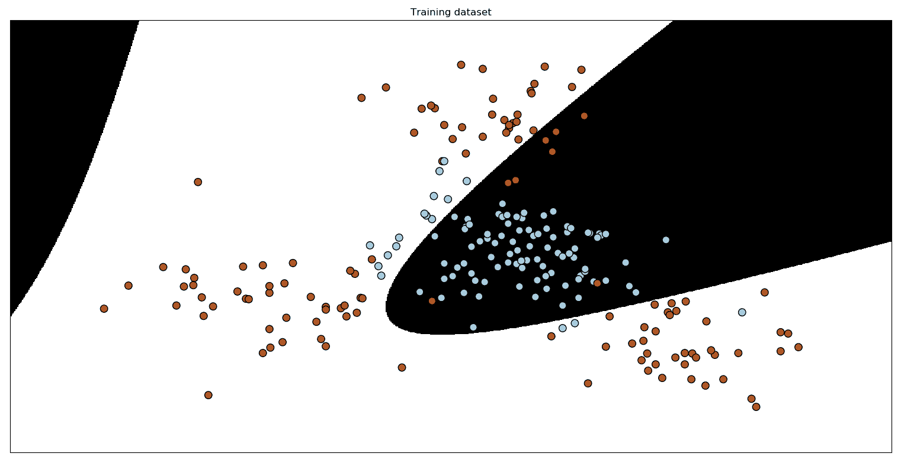

1.  你还将在你的终端上看到以下分类报告：

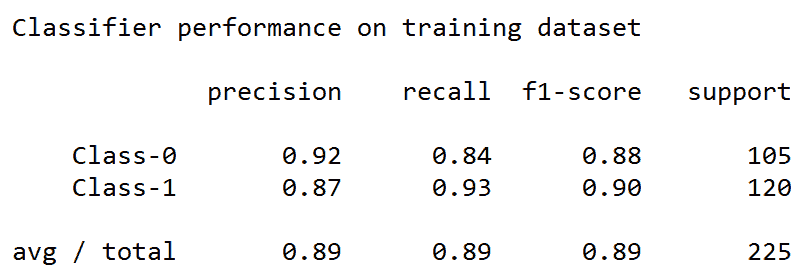

1.  我们还可以使用径向基函数核来构建一个非线性分类器。在相同的 Python 文件中，查找以下行：

```py
params = {'kernel': 'poly', 'degree': 3} 
```

1.  将此行替换为以下一行：

```py
params = {'kernel': 'rbf'} 
```

1.  如果你现在运行此代码，你将得到以下结果：

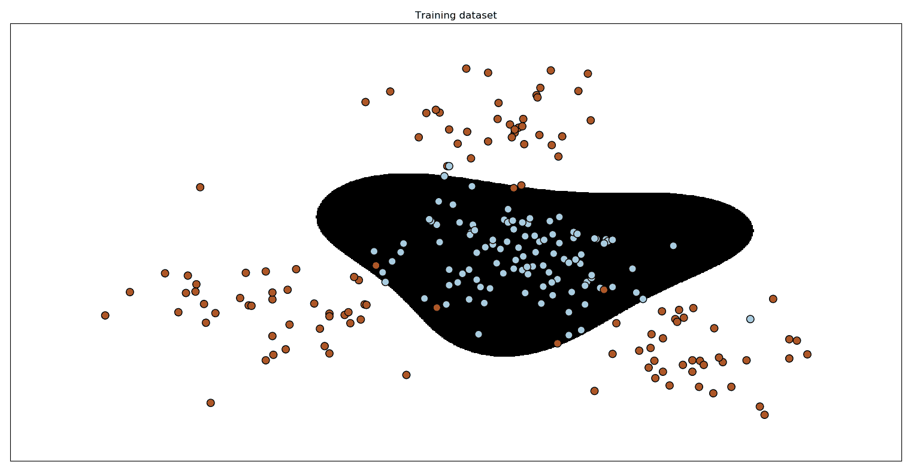

1.  你还将在你的终端上看到以下分类报告：

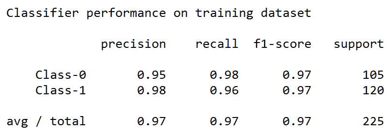

# 它是如何工作的...

在这个菜谱中，我们使用 SVM 分类器通过解决一组数学方程来找到点数据集的最佳分离边界。为了解决非线性问题，我们使用了核方法。核方法因此得名于核函数，这些函数用于在特征空间中操作，而不是通过计算函数空间中所有数据副本的图像之间的内积来计算数据坐标。内积的计算通常比显式计算坐标更便宜。这种方法被称为**核策略**。

# 还有更多...

SVM 的主要观点是，只要仔细选择核及其所有参数，就可以解决任何通用问题——例如，对输入数据集进行完全过拟合。这种方法的问题在于，它与数据集的大小成比例地扩展得相当差，因为它通常归因于 D2 因子，即使在这种情况下，通过优化这一方面可以获得更快的实现。问题在于确定最佳的核并提供最佳的参数。

# 参见

+   *支持向量机和核方法*（来自卡内基梅隆大学计算机科学学院）: [`www.cs.cmu.edu/~ggordon/SVMs/new-svms-and-kernels.pdf`](https://www.cs.cmu.edu/~ggordon/SVMs/new-svms-and-kernels.pdf)

+   *支持向量机和核方法*（来自台湾大学计算机科学系）：[`www.csie.ntu.edu.tw/~cjlin/talks/postech.pdf`](https://www.csie.ntu.edu.tw/~cjlin/talks/postech.pdf)

# 解决类别不平衡问题

到目前为止，我们处理了所有类别中数据点数量相似的问题。在现实世界中，我们可能无法以如此有序的方式获取数据。有时，一个类别的数据点数量可能比其他类别的数据点数量多得多。如果发生这种情况，那么分类器往往会偏向。边界不会反映你数据的真实性质，只是因为两个类别之间数据点的数量存在很大差异。因此，考虑这种差异并中和它是很重要的，这样我们的分类器才能保持公正。

# 准备工作

在这个食谱中，我们将使用一个新的数据集，名为`data_multivar_imbalance.txt`，其中每行有三个值；前两个代表点的坐标，第三个是该点所属的类别。我们的目标是，再次，构建一个分类器，但这次，我们必须面对数据平衡问题。

# 如何做到这一点...

让我们看看如何解决类别不平衡问题：

1.  让我们导入库：

```py
import numpy as np
import matplotlib.pyplot as plt
from sklearn.svm import SVC
import utilities
```

1.  让我们加载数据（`data_multivar_imbalance.txt`）：

```py
input_file = 'data_multivar_imbalance.txt' 
X, y = utilities.load_data(input_file) 

```

1.  让我们可视化数据。可视化代码与之前的食谱中完全相同。你还可以在名为`svm_imbalance.py`的文件中找到它，该文件已经提供给你：

```py
# Separate the data into classes based on 'y'
class_0 = np.array([X[i] for i in range(len(X)) if y[i]==0])
class_1 = np.array([X[i] for i in range(len(X)) if y[i]==1])
# Plot the input data
plt.figure()
plt.scatter(class_0[:,0], class_0[:,1], facecolors='black', edgecolors='black', marker='s')
plt.scatter(class_1[:,0], class_1[:,1], facecolors='None', edgecolors='black', marker='s')
plt.title('Input data')
plt.show()
```

1.  如果你运行它，你会看到以下：

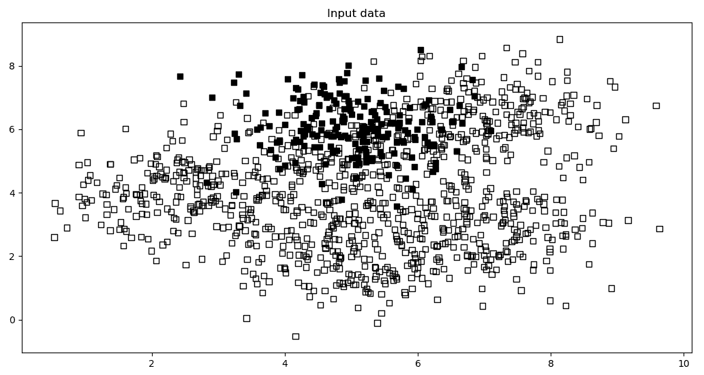

1.  让我们使用线性核构建一个 SVM。代码与之前的食谱中相同，*使用 SVM 构建非线性分类器*：

```py
from sklearn import model_selection
X_train, X_test, y_train, y_test = model_selection.train_test_split(X, y, test_size=0.25, random_state=5)
params = {'kernel': 'linear'}
classifier = SVC(**params, gamma='auto')
classifier.fit(X_train, y_train)
utilities.plot_classifier(classifier, X_train, y_train, 'Training dataset')
plt.show()
```

1.  让我们打印一个分类报告：

```py
from sklearn.metrics import classification_report
target_names = ['Class-' + str(int(i)) for i in set(y)]
print("\n" + "#"*30)
print("\nClassifier performance on training dataset\n")
print(classification_report(y_train, classifier.predict(X_train), target_names=target_names))
print("#"*30 + "\n")
print("#"*30)
print("\nClassification report on test dataset\n")
print(classification_report(y_test, y_test_pred, target_names=target_names))
print("#"*30 + "\n")
```

1.  如果你运行它，你会看到以下：

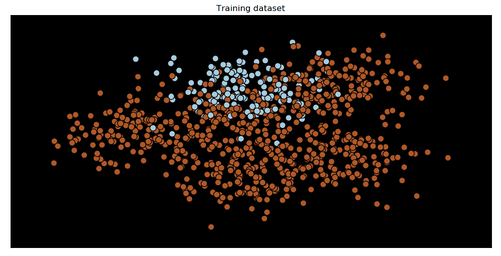

1.  你可能会 wonder 为什么这里没有边界！Well, 这是因为分类器无法将两个类别分开，导致`Class-0`的准确率为 0%。你还会在终端上看到打印出的分类报告，如下截图所示：

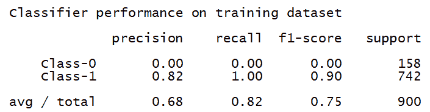

1.  如我们所预期，`Class-0`的精确率为 0%，所以让我们继续解决这个问题！在 Python 文件中，搜索以下行：

```py
params = {'kernel': 'linear'}
```

1.  将前面的行替换为以下内容：

```py
params = {'kernel': 'linear', 'class_weight': 'balanced'}  
```

1.  `class_weight`参数将计算每个类别的数据点数量，以调整权重，使不平衡不会对性能产生不利影响。

1.  运行此代码后，你会得到以下输出：

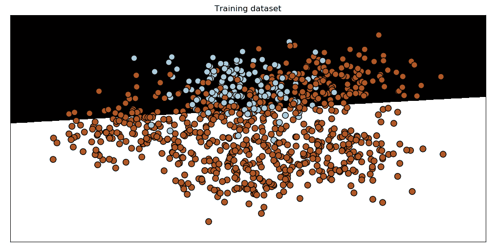

1.  让我们查看分类报告：

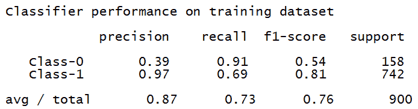

1.  如我们所见，`Class-0`现在以非零百分比准确率被检测到。

# 它是如何工作的...

在这个配方中，我们使用 SVM 分类器来找到点数据集之间的最佳分离边界。为了解决数据平衡问题，我们再次使用了线性核方法，但在 `fit` 方法中实现了一个 `class_weight` 关键字。`class_weight` 变量是一个形式为 `{class_label: value}` 的字典，其中 `value` 是一个大于 0 的浮点数，它修改了类 `(class_label)` 的 *C* 参数，将其设置为通过将旧的 *C* 值与值属性中指定的值相乘得到的新值 (*C * value*)。

# 更多内容...

*C* 是一个超参数，它决定了观察到的错误分类的惩罚。因此，我们使用权重来管理不平衡的类别。这样，我们将为类别分配一个新的 *C* 值，定义如下：

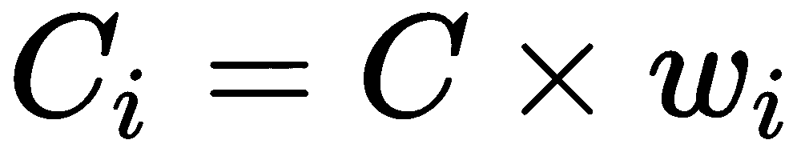

其中 *C* 是惩罚，*w[i]* 是与类别 i 的频率成反比的权重，*C[i]* 是类别 *i* 的 *C* 值。这种方法建议增加对代表性较小的类别的惩罚，以防止它们被代表性最大的类别超越。

在 `scikit-learn` 库中，当使用 SVC 时，我们可以通过设置 `class_weight='balanced'` 来自动设置 *C[i]* 的值。

# 参见

+   *支持向量机*—`scikit-learn` 库的官方文档：[`scikit-learn.org/stable/modules/svm.html`](https://scikit-learn.org/stable/modules/svm.html)

# 提取置信度测量

很好知道我们以多大的置信度对未知数据进行分类。当一个新数据点被分类到已知类别时，我们可以训练 SVM 来计算该输出的置信水平。*置信水平*指的是参数值落在指定值范围内的概率。

# 准备工作

在这个配方中，我们将使用 SVM 分类器来找到点数据集之间的最佳分离边界。此外，我们还将对获得的结果的置信水平进行测量。

# 如何做...

让我们看看如何提取置信度测量：

1.  完整的代码在 `svm_confidence.py` 文件中给出，已经提供给你。我们将在下面讨论这个配方的代码。让我们定义一些输入数据：

```py
import numpy as np
import matplotlib.pyplot as plt
from sklearn.svm import SVC
import utilities

# Load input data
input_file = 'data_multivar.txt'
X, y = utilities.load_data(input_file)
```

1.  在这一点上，我们将数据分为训练集和测试集，然后我们将构建分类器：

```py
from sklearn import model_selection
X_train, X_test, y_train, y_test = model_selection.train_test_split(X, y, test_size=0.25, random_state=5)
params = {'kernel': 'rbf'}
classifier = SVC(**params, gamma='auto')
classifier.fit(X_train, y_train)
```

1.  定义输入数据点：

```py
input_datapoints = np.array([[2, 1.5], [8, 9], [4.8, 5.2], [4, 4], [2.5, 7], [7.6, 2], [5.4, 5.9]])
```

1.  让我们测量边界距离：

```py
print("Distance from the boundary:")
for i in input_datapoints:
    print(i, '-->', classifier.decision_function([i])[0])
```

1.  你将在你的终端上看到以下内容：

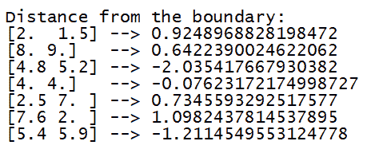

1.  边界距离给我们关于数据点的某些信息，但它并没有确切地告诉我们分类器对输出标签的置信度如何。为了做到这一点，我们需要 **Platt 缩放**。这是一种将距离度量转换为类别之间概率度量的方法。让我们继续使用 Platt 缩放训练一个 SVM：

```py
# Confidence measure 
params = {'kernel': 'rbf', 'probability': True} 
classifier = SVC(**params, gamma='auto') 
```

`probability` 参数告诉 SVM 它应该训练以计算概率。

1.  让我们训练分类器：

```py
classifier.fit(X_train, y_train) 
```

1.  让我们计算这些输入数据点的置信度测量值：

```py
print("Confidence measure:")
for i in input_datapoints:
    print(i, '-->', classifier.predict_proba([i])[0])
```

`predict_proba` 函数测量置信值。

1.  你将在你的终端上看到以下内容：

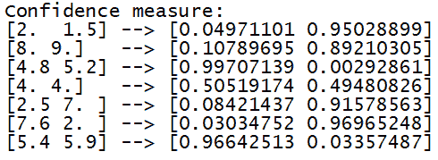

1.  让我们看看点相对于边界的位置：

```py
utilities.plot_classifier(classifier, input_datapoints, [0]*len(input_datapoints), 'Input datapoints', 'True') 
```

1.  如果你运行这个，你将得到以下结果：

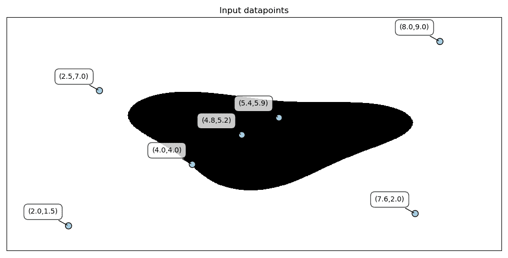

# 工作原理...

在这个菜谱中，我们基于 SVM 构建了一个分类器。一旦获得分类器，我们使用一组点来衡量这些点与边界的距离，然后为这些点中的每一个测量置信水平。在估计参数时，简单地识别一个值通常是不够的。因此，建议在估计参数的同时，给出该参数的合理值范围，这被定义为置信区间。因此，它与一个累积概率值相关联，间接地，从概率的角度来看，它描述了相对于随机变量最大值的幅度，该随机变量衡量的是随机事件落在该区间内的概率，并且等于该区间图形上由随机变量的概率分布曲线所围成的面积。

# 更多内容...

置信区间衡量一个统计量（如民意调查）的可靠性。例如，如果 40%的受访样本表示选择某个产品，那么可以以 99%的置信水平推断，总消费者人口中有 30%到 50%的比例将表示支持该产品。从同一受访样本中，以 90%的置信区间，可以假设该产品受到好评的比例现在在 37%到 43%之间。

# 参见

+   请参考 `sklearn.svm.SVC.decision_` 函数的官方文档：[`scikit-learn.org/stable/modules/generated/sklearn.svm.SVC.html#sklearn.svm.SVC.decision_function`](https://scikit-learn.org/stable/modules/generated/sklearn.svm.SVC.html#sklearn.svm.SVC.decision_function)

+   参考以下内容：*支持向量机概率输出及其与正则化似然方法的比较*：[`www.researchgate.net/publication/2594015_Probabilistic_Outputs_for_Support_Vector_Machines_and_Comparisons_to_Regularized_Likelihood_Methods`](https://www.researchgate.net/publication/2594015_Probabilistic_Outputs_for_Support_Vector_Machines_and_Comparisons_to_Regularized_Likelihood_Methods)

# 寻找最优超参数

如前一章所述，超参数对于确定分类器的性能很重要。让我们看看如何提取 SVM 的最优超参数。

# 准备工作

在机器学习算法中，学习过程中会获得各种参数。相比之下，超参数是在学习过程开始之前设置的。给定这些超参数，训练算法从数据中学习参数。在这个菜谱中，我们将使用网格搜索方法从基于 SVM 算法的模型中提取超参数。

# 如何做...

让我们看看如何找到最佳超参数：

1.  完整的代码在`perform_grid_search.py`文件中给出，该文件已经提供给你。我们开始导入库：

```py
from sklearn import svm
from sklearn import model_selection
from sklearn.model_selection import GridSearchCV
from sklearn.metrics import classification_report
import pandas as pd
import utilities 
```

1.  然后，我们加载数据：

```py
input_file = 'data_multivar.txt'
X, y = utilities.load_data(input_file)
```

1.  我们将数据分为训练集和测试集：

```py
X_train, X_test, y_train, y_test = model_selection.train_test_split(X, y, test_size=0.25, random_state=5)
```

1.  现在，我们将在这里使用交叉验证，这是我们之前菜谱中提到的。一旦你加载数据并将其分为训练集和测试集，请将以下内容添加到文件中：

```py
# Set the parameters by cross-validation
parameter_grid = {"C": [1, 10, 50, 600],
                  'kernel':['linear','poly','rbf'],
                  "gamma": [0.01, 0.001],
                  'degree': [2, 3]}
```

1.  让我们定义我们想要使用的度量标准：

```py
metrics = ['precision'] 
```

1.  让我们开始搜索每个度量指标的最佳超参数：

```py
for metric in metrics:

    print("#### Grid Searching optimal hyperparameters for", metric)

    classifier = GridSearchCV(svm.SVC(C=1), 
            parameter_grid, cv=5,scoring=metric,return_train_score=True) 

    classifier.fit(X_train, y_train)
```

1.  让我们看看分数：

```py
    print("Scores across the parameter grid:")
    GridSCVResults = pd.DataFrame(classifier.cv_results_)
    for i in range(0,len(GridSCVResults)):
        print(GridSCVResults.params[i], '-->', round(GridSCVResults.mean_test_score[i],3))    
```

1.  让我们打印最佳参数集：

```py
    print("Highest scoring parameter set:", classifier.best_params_)
```

1.  如果你运行此代码，你将在你的终端看到以下内容：

```py
#### Grid Searching optimal hyperparameters for precision
Scores across the parameter grid:
{'C': 1, 'degree': 2, 'gamma': 0.01, 'kernel': 'linear'} --> 0.676
{'C': 1, 'degree': 2, 'gamma': 0.01, 'kernel': 'poly'} --> 0.527
{'C': 1, 'degree': 2, 'gamma': 0.01, 'kernel': 'rbf'} --> 0.98
{'C': 1, 'degree': 2, 'gamma': 0.001, 'kernel': 'linear'} --> 0.676
{'C': 1, 'degree': 2, 'gamma': 0.001, 'kernel': 'poly'} --> 0.533
...
...
{'C': 600, 'degree': 2, 'gamma': 0.001, 'kernel': 'linear'} --> 0.676
{'C': 600, 'degree': 2, 'gamma': 0.001, 'kernel': 'poly'} --> 0.9
{'C': 600, 'degree': 2, 'gamma': 0.001, 'kernel': 'rbf'} --> 0.983
{'C': 600, 'degree': 3, 'gamma': 0.01, 'kernel': 'linear'} --> 0.676
{'C': 600, 'degree': 3, 'gamma': 0.01, 'kernel': 'poly'} --> 0.884
{'C': 600, 'degree': 3, 'gamma': 0.01, 'kernel': 'rbf'} --> 0.967
{'C': 600, 'degree': 3, 'gamma': 0.001, 'kernel': 'linear'} --> 0.676
{'C': 600, 'degree': 3, 'gamma': 0.001, 'kernel': 'poly'} --> 0.533
{'C': 600, 'degree': 3, 'gamma': 0.001, 'kernel': 'rbf'} --> 0.983
Highest scoring parameter set: {'C': 10, 'degree': 2, 'gamma': 0.01, 'kernel': 'rbf'}
```

1.  如前所述的输出所示，它搜索所有最佳超参数。在这种情况下，超参数是`kernel`的类型、`C`值和`gamma`。它将尝试这些参数的各种组合以找到最佳参数。让我们在测试数据集上测试它：

```py
    y_true, y_pred = y_test, classifier.predict(X_test)
    print("Full performance report:\n")
    print(classification_report(y_true, y_pred))
```

1.  如果你运行此代码，你将在你的终端看到以下内容：

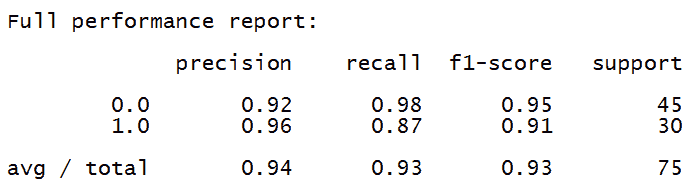

1.  我们之前提到过，优化超参数有不同的技术。我们将应用`RandomizedSearchCV`方法。为此，只需使用相同的数据并更改分类器。在刚刚看到的代码中，我们添加了一个额外的部分：

```py
# Perform a randomized search on hyper parameters
from sklearn.model_selection import RandomizedSearchCV
parameter_rand = {'C': [1, 10, 50, 600],
                  'kernel':['linear','poly','rbf'],
                  'gamma': [0.01, 0.001],
                  'degree': [2, 3]}
metrics = ['precision']
for metric in metrics:
    print("#### Randomized Searching optimal hyperparameters for", metric)
    classifier = RandomizedSearchCV(svm.SVC(C=1), 
             param_distributions=parameter_rand,n_iter=30,           
             cv=5,return_train_score=True)
    classifier.fit(X_train, y_train)
    print("Scores across the parameter grid:")
    RandSCVResults = pd.DataFrame(classifier.cv_results_)
    for i in range(0,len(RandSCVResults)):
         print(RandSCVResults.params[i], '-->', 
                 round(RandSCVResults.mean_test_score[i]
```

1.  如果你运行此代码，你将在你的终端看到以下内容：

```py
#### Randomized Searching optimal hyperparameters for precision
Scores across the parameter grid:
{'kernel': 'rbf', 'gamma': 0.001, 'degree': 2, 'C': 50} --> 0.671
{'kernel': 'rbf', 'gamma': 0.01, 'degree': 3, 'C': 600} --> 0.951
{'kernel': 'linear', 'gamma': 0.01, 'degree': 3, 'C': 50} --> 0.591
{'kernel': 'poly', 'gamma': 0.01, 'degree': 2, 'C': 10} --> 0.804
...
...
{'kernel': 'rbf', 'gamma': 0.01, 'degree': 3, 'C': 10} --> 0.92
{'kernel': 'poly', 'gamma': 0.001, 'degree': 3, 'C': 600} --> 0.533
{'kernel': 'linear', 'gamma': 0.001, 'degree': 2, 'C': 10} --> 0.591
{'kernel': 'poly', 'gamma': 0.01, 'degree': 3, 'C': 50} --> 0.853
{'kernel': 'linear', 'gamma': 0.001, 'degree': 2, 'C': 600} --> 0.591
{'kernel': 'poly', 'gamma': 0.01, 'degree': 3, 'C': 10} --> 0.844
Highest scoring parameter set: {'kernel': 'rbf', 'gamma': 0.01, 'degree': 3, 'C': 600}
```

1.  让我们在测试数据集上测试它：

```py
 print("Highest scoring parameter set:", classifier.best_params_)
 y_true, y_pred = y_test, classifier.predict(X_test)
 print("Full performance report:\n")
 print(classification_report(y_true, y_pred))

```

1.  返回以下结果：

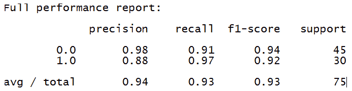

# 它是如何工作的...

在之前的菜谱“使用 SVM 构建非线性分类器”中，我们反复修改 SVM 算法的核以获得数据分类的改进。基于菜谱开头给出的超参数定义，很明显，核代表一个超参数。在这个菜谱中，我们随机设置这个超参数的值并检查结果以找出哪个值决定了最佳性能。然而，随机选择算法参数可能是不够的。

此外，通过随机设置参数来比较不同算法的性能是困难的，因为一个算法可能比另一个算法使用不同的参数集表现更好。而且如果参数改变，算法可能比其他算法有更差的结果。

因此，随机选择参数值不是我们找到模型最佳性能的最佳方法。相反，建议开发一个算法，该算法可以自动找到特定模型的最佳参数。寻找超参数的方法有几种，如下所示：网格搜索、随机搜索和贝叶斯优化。

# 网格搜索算法

**网格搜索**算法通过自动寻找降低模型最佳性能的超参数集来实现这一点。

`sklearn.model_selection.GridSearchCV()`函数对估计器的指定参数值进行穷举搜索。**穷举搜索**（也称为直接搜索或暴力搜索）是对所有可能性的全面检查，因此代表了一种高效的方法，其中每个可能性都被测试以确定它是否是解决方案。

# 随机搜索算法

与`GridSearchCV`方法不同，这种方法并不是测试所有参数值，而是以固定数量对参数设置进行采样。要测试的参数设置是通过`n_iter`属性设置的。如果参数以列表形式呈现，则执行无放回采样。如果至少提供一个参数作为分布，则使用替换采样。

# 贝叶斯优化算法

贝叶斯超参数优化器的目标是构建目标函数的概率模型，并使用它来选择最适合用于真实目标函数的超参数。贝叶斯统计学不仅允许我们预见一个值，还可以预见一个分布，这是这种方法成功的关键。

与已处理的两种方法（网格搜索和随机搜索）相比，贝叶斯方法存储过去评估的结果，并使用这些结果形成一个概率模型，将超参数与目标函数得分的概率相关联。

这个模型被称为目标函数的**代理**，比目标函数本身更容易优化。通过以下程序获得此结果：

1.  构建目标函数的代理概率模型。

1.  在代理上给出最佳结果的超参数被搜索。

1.  这些超参数应用于真实的目标函数。

1.  通过结合新的结果来更新代理模型。

1.  重复步骤 2-4，直到达到预定的迭代次数或最大时间。

以这种方式，在评估目标函数之后，代理概率模型被更新。要使用贝叶斯超参数优化器，有几种库可用：`scikit-optimize`、`spearmint`和`SMAC3`。

# 更多...

通常，超参数是指那些用户可以自由设置的值，并且通常通过适当的研究进行优化，以在验证数据上最大化准确性。甚至选择一种技术而不是另一种技术也可以被视为一个分类超参数，其值与我们可选择的方法的数量一样多。

# 参见

+   `sklearn.model_selection.GridSearchCV()` 函数的官方文档：[`scikit-learn.org/stable/modules/generated/sklearn.model_selection.GridSearchCV.html#sklearn.model_selection.GridSearchCV`](https://scikit-learn.org/stable/modules/generated/sklearn.model_selection.GridSearchCV.html#sklearn.model_selection.GridSearchCV)

+   *超参数优化*（来自维基百科）：[`zh.wikipedia.org/wiki/超参数优化`](https://zh.wikipedia.org/wiki/超参数优化)

+   *Spearmint 贝叶斯优化*（来自 GitHub）：[`github.com/HIPS/Spearmint`](https://github.com/HIPS/Spearmint)

+   SMAC3 官方文档：[`automl.github.io/SMAC3/stable/`](https://automl.github.io/SMAC3/stable/)

+   *机器学习贝叶斯优化的教程*（来自哈佛大学工程与应用科学学院）：[`www.iro.umontreal.ca/~bengioy/cifar/NCAP2014-summerschool/slides/Ryan_adams_140814_bayesopt_ncap.pdf`](https://www.iro.umontreal.ca/~bengioy/cifar/NCAP2014-summerschool/slides/Ryan_adams_140814_bayesopt_ncap.pdf)

# 构建事件预测器

让我们将本章中的所有这些知识应用到现实世界的问题中。我们将构建一个 SVM 来预测进出建筑的人数。数据集可在 [`archive.ics.uci.edu/ml/datasets/CalIt2+Building+People+Counts`](https://archive.ics.uci.edu/ml/datasets/CalIt2+Building+People+Counts) 找到。我们将使用这个数据集的一个略微修改版本，以便更容易分析。修改后的数据可在提供的 `building_event_binary.txt` 和 `building_event_multiclass.txt` 文件中找到。在这个菜谱中，我们将学习如何构建事件预测器。

# 准备中

在我们开始构建模型之前，让我们先了解数据格式。`building_event_binary.txt` 中的每一行都由六个以逗号分隔的字符串组成。这六个字符串的顺序如下：

+   天

+   日期

+   时间

+   离开建筑的人数

+   进入建筑的人数

+   **指示是否为事件的输出**

前五个字符串构成输入数据，我们的任务是预测建筑中是否正在发生事件。

`building_event_multiclass.txt` 中的每一行也由六个以逗号分隔的字符串组成。这个文件比之前的文件更细粒度，因为输出是建筑中正在发生的确切事件类型。这六个字符串的顺序如下：

+   天

+   日期

+   时间

+   离开建筑的人数

+   进入建筑的人数

+   **指示事件类型的输出**

前五个字符串形成输入数据，我们的任务是预测建筑物中正在进行的事件类型。

# 如何操作...

让我们看看如何构建一个事件预测器：

1.  我们将使用已经提供给你的`event.py`作为参考。创建一个新的 Python 文件，并添加以下行：

```py
import numpy as np 
from sklearn import preprocessing 
from sklearn.svm import SVC 

input_file = 'building_event_binary.txt' 

# Reading the data 
X = [] 
count = 0 
with open(input_file, 'r') as f: 
    for line in f.readlines(): 
        data = line[:-1].split(',') 
        X.append([data[0]] + data[2:]) 

X = np.array(X) 
```

我们只是将所有数据加载到了`X`中。

1.  让我们将数据转换为数值形式：

```py
# Convert string data to numerical data 
label_encoder = []  
X_encoded = np.empty(X.shape) 
for i,item in enumerate(X[0]): 
    if item.isdigit(): 
        X_encoded[:, i] = X[:, i] 
    else: 
        label_encoder.append(preprocessing.LabelEncoder()) 
        X_encoded[:, i] = label_encoder[-1].fit_transform(X[:, i]) 

X = X_encoded[:, :-1].astype(int) 
y = X_encoded[:, -1].astype(int) 
```

1.  让我们使用径向基函数、Platt 缩放和类别平衡来训练 SVM：

```py
# Build SVM 
params = {'kernel': 'rbf', 'probability': True, 'class_weight': 'balanced'}  
classifier = SVC(**params, gamma='auto') 
classifier.fit(X, y) 
```

1.  我们现在准备好进行交叉验证：

```py
from sklearn import model_selection

accuracy = model_selection.cross_val_score(classifier, 
        X, y, scoring='accuracy', cv=3)
print("Accuracy of the classifier: " + str(round(100*accuracy.mean(), 2)) + "%")
```

1.  让我们在新的数据点上测试我们的 SVM：

```py
# Testing encoding on single data instance
input_data = ['Tuesday', '12:30:00','21','23']
input_data_encoded = [-1] * len(input_data)
count = 0

for i,item in enumerate(input_data):
    if item.isdigit():
        input_data_encoded[i] = int(input_data[i])
    else:
        input_data_encoded[i] = int(label_encoder[count].transform([input_data[i]]))
        count = count + 1 

input_data_encoded = np.array(input_data_encoded)

# Predict and print(output for a particular datapoint
output_class = classifier.predict([input_data_encoded])
print("Output class:", label_encoder[-1].inverse_transform(output_class)[0])
```

1.  如果你运行此代码，你将在你的终端上看到以下输出：

```py
Accuracy of the classifier: 93.95%
Output class: noevent  
```

1.  如果你使用`building_event_multiclass.txt`文件作为输入数据文件而不是`building_event_binary.txt`，你将在你的终端上看到以下输出：

```py
Accuracy of the classifier: 65.33%
Output class: eventA
```

# 它是如何工作的...

在这个菜谱中，我们使用了在 15 周内，每天 48 个时间间隔观察到的进入和离开建筑物的人的数据。因此，我们构建了一个能够预测建筑物中如会议等事件存在的分类器，这决定了在那个时间段内建筑物内人数的增加。

# 更多内容...

在菜谱的后面，我们在不同的数据库上使用了相同的分类器来预测在建筑物内举行的活动类型。

# 相关内容

+   `sklearn.svm.SVC()` 函数的官方文档：[`scikit-learn.org/stable/modules/generated/sklearn.svm.SVC.html`](https://scikit-learn.org/stable/modules/generated/sklearn.svm.SVC.html)

+   `sklearn.model_selection.cross_validate()` 函数的官方文档：[`scikit-learn.org/stable/modules/generated/sklearn.model_selection.cross_validate.html#sklearn.model_selection.cross_validate`](https://scikit-learn.org/stable/modules/generated/sklearn.model_selection.cross_validate.html#sklearn.model_selection.cross_validate)

# 估算交通流量

SVMs 的一个有趣的应用是预测交通流量，基于相关数据。在之前的菜谱中，我们使用 SVM 作为分类器。在这个菜谱中，我们将使用 SVM 作为回归器来估算交通流量。

# 准备工作

我们将使用在[`archive.ics.uci.edu/ml/datasets/Dodgers+Loop+Sensor`](https://archive.ics.uci.edu/ml/datasets/Dodgers+Loop+Sensor)可用的数据集。这是一个在洛杉矶道奇主场棒球比赛中统计经过的车辆数量的数据集。我们将使用该数据集的略微修改版，以便更容易分析。你可以使用已经提供给你的`traffic_data.txt`文件。该文件中的每一行都包含逗号分隔的字符串，格式如下：

+   日期

+   时间

+   对手队伍

+   是否有棒球比赛正在进行

+   经过的车辆数量

# 如何操作...

让我们看看如何估算交通流量：

1.  让我们看看如何构建 SVM 回归器。我们将使用您已提供的作为参考的 `traffic.py`。创建一个新的 Python 文件，并添加以下行：

```py
# SVM regressor to estimate traffic 

import numpy as np 
from sklearn import preprocessing 
from sklearn.svm import SVR 

input_file = 'traffic_data.txt' 

# Reading the data 
X = [] 
count = 0 
with open(input_file, 'r') as f: 
    for line in f.readlines(): 
        data = line[:-1].split(',') 
        X.append(data) 

X = np.array(X) 
```

我们将所有输入数据加载到 `X` 中。

1.  让我们编码这些数据：

```py
# Convert string data to numerical data 
label_encoder = []  
X_encoded = np.empty(X.shape) 
for i,item in enumerate(X[0]): 
    if item.isdigit(): 
        X_encoded[:, i] = X[:, i] 
    else: 
        label_encoder.append(preprocessing.LabelEncoder()) 
        X_encoded[:, i] = label_encoder[-1].fit_transform(X[:, i]) 

X = X_encoded[:, :-1].astype(int) 
y = X_encoded[:, -1].astype(int) 
```

1.  让我们使用径向基函数构建和训练 SVM 回归器：

```py
# Build SVR 
params = {'kernel': 'rbf', 'C': 10.0, 'epsilon': 0.2}  
regressor = SVR(**params) 
regressor.fit(X, y) 
```

在前面的行中，`C` 参数指定了误分类的惩罚，而 `epsilon` 指定了不应用惩罚的限制范围内。

1.  让我们执行交叉验证以检查回归器的性能：

```py
# Cross validation
import sklearn.metrics as sm

y_pred = regressor.predict(X)
print("Mean absolute error =", round(sm.mean_absolute_error(y, y_pred), 2))
```

1.  让我们在一个数据点上测试它：

```py
# Testing encoding on single data instance
input_data = ['Tuesday', '13:35', 'San Francisco', 'yes']
input_data_encoded = [-1] * len(input_data)
count = 0
for i,item in enumerate(input_data):
    if item.isdigit():
        input_data_encoded[i] = int(input_data[i])
    else:
        input_data_encoded[i] = int(label_encoder[count].transform([input_data[i]]))
        count = count + 1 

input_data_encoded = np.array(input_data_encoded)

# Predict and print output for a particular datapoint
print("Predicted traffic:", int(regressor.predict([input_data_encoded])[0]))
```

1.  如果你运行此代码，你将在你的终端上看到以下输出：

```py
 Mean absolute error = 4.08
    Predicted traffic: 29
```

# 它是如何工作的...

在这个菜谱中，我们使用了在洛杉矶 101 号北高速公路上收集的数据，靠近道奇队比赛的球场。这个位置足够靠近球场，可以检测到比赛期间交通的增加。

观察是在 25 周内进行的，每天有 288 个时间间隔（每 5 分钟一次）。我们基于 SVM 算法构建了一个回归器来预测道奇球场是否有棒球比赛。特别是，我们可以根据以下预测器的值估计通过该位置的汽车数量：日期、时间、对手球队以及是否正在进行棒球比赛。

# 更多...

**支持向量回归**（**SVR**）与 SVMs 的原理相同。事实上，SVR 是从 SVMs 调整而来的，其中因变量是数值而不是分类的。使用 SVR 的主要优点之一是它是一种非参数技术。

# 参见

+   `sklearn.metrics.mean_absolute_error()` 函数的官方文档：[`scikit-learn.org/stable/modules/generated/sklearn.metrics.mean_absolute_error.html`](https://scikit-learn.org/stable/modules/generated/sklearn.metrics.mean_absolute_error.html)

+   *线性回归和支持向量回归*（来自阿德莱德大学）：[`cs.adelaide.edu.au/~chhshen/teaching/ML_SVR.pdf`](https://cs.adelaide.edu.au/~chhshen/teaching/ML_SVR.pdf)

# 使用 TensorFlow 简化机器学习工作流程

**TensorFlow** 是一个开源的数值计算库。该库由谷歌程序员创建。它提供了构建深度学习模型所需的所有工具，并为开发者提供了一个黑盒接口来编程。

# 准备工作

在这个菜谱中，我们将介绍 TensorFlow 框架，使用简单的神经网络来分类 `iris` 物种。我们将使用 `iris` 数据集，该数据集包含以下物种的 50 个样本：

+   爱丽丝·塞托萨

+   爱丽丝·维吉尼卡

+   爱丽丝·维吉尼卡

从每个样本测量了四个特征，即花萼和花瓣的长度和宽度，单位为厘米。

包含以下变量：

+   花萼长度（厘米）

+   花萼宽度（厘米）

+   花瓣长度（厘米）

+   花瓣宽度（厘米）

+   类别：`setosa`、`versicolor` 或 `virginica`

# 如何做...

让我们看看如何使用 TensorFlow 简化机器学习工作流程：

1.  我们像往常一样，首先导入库：

```py
from sklearn import datasets
from sklearn import model_selection
import tensorflow as tf
```

前两个库仅用于加载数据和分割数据。第三个库加载了`tensorflow`库。

1.  加载`iris`数据集：

```py
iris = datasets.load_iris()
```

1.  加载并分割特征和类别：

```py
x_train, x_test, y_train, y_test = model_selection.train_test_split(iris.data, 
                                                                    iris.target, 
                                                                    test_size=0.7, 
                                                                    random_state=1)
```

数据被分为 70%用于训练和 30%用于测试。`random_state=1`参数是随机数生成器使用的种子。

1.  现在，我们将构建一个包含一个隐藏层和 10 个节点的简单神经网络：

```py
feature_columns = tf.contrib.learn.infer_real_valued_columns_from_input(x_train)
classifier_tf = tf.contrib.learn.DNNClassifier(feature_columns=feature_columns, 
                                                 hidden_units=[10], 
                                                 n_classes=3)
```

1.  然后我们调整网络：

```py
classifier_tf.fit(x_train, y_train, steps=5000)
```

1.  然后我们将进行预测：

```py
predictions = list(classifier_tf.predict(x_test, as_iterable=True))
```

1.  最后，我们将计算模型的`accuracy`指标：

```py
n_items = y_test.size
accuracy = (y_test == predictions).sum() / n_items
print("Accuracy :", accuracy)
```

返回以下结果：

```py
Accuracy : 0.9333333333333333
```

# 它是如何工作的...

在这个配方中，我们使用了`tensorflow`库来构建一个简单的神经网络，用于从四个测量的特征中分类鸢尾花种类。这样，我们看到了如何使用`tensorflow`库实现基于机器学习算法的模型是多么简单。关于这个主题，以及一般深度神经网络，将在第十三章，“深度神经网络”中详细分析。

# 更多内容...

TensorFlow 为 Python、C、C++、Java、Go 和 Rust 提供了原生 API。可用的第三方 API 包括 C#、R 和 Scala。自 2017 年 10 月起，它已集成即时执行功能，允许立即执行由 Python 引用的操作。

# 相关内容

+   `tensorflow`库的官方文档：[`www.tensorflow.org/tutorials`](https://www.tensorflow.org/tutorials)

+   *Tensorflow for Deep Learning Research*（来自斯坦福大学）：[`web.stanford.edu/class/cs20si/`](http://web.stanford.edu/class/cs20si/)

# 实现堆叠方法

不同的方法组合可以带来更好的结果：这个说法在我们生活的不同方面都适用，并且也适用于基于机器学习的算法。堆叠是将各种机器学习算法组合的过程。这项技术归功于美国数学家、物理学家和计算机科学家 David H. Wolpert。

在这个配方中，我们将学习如何实现堆叠方法。

# 准备工作

我们将使用`heamy`库来堆叠我们在前一个配方中使用的两个模型。`heamy`库是一套用于竞争性数据科学的有用工具。

# 如何做...

让我们看看如何实现堆叠方法：

1.  我们首先导入库：

```py
from heamy.dataset import Dataset
from heamy.estimator import Regressor
from heamy.pipeline import ModelsPipeline

from sklearn.datasets import load_boston
from sklearn.model_selection import train_test_split
from sklearn.ensemble import RandomForestRegressor
from sklearn.linear_model import LinearRegression
from sklearn.metrics import mean_absolute_error
```

1.  加载`boston`数据集，已在第一章，“监督学习领域”，用于*估算房价*配方：

```py
data = load_boston()
```

1.  分割数据：

```py
X, y = data['data'], data['target']
X_train, X_test, y_train, y_test = train_test_split(X, y, test_size=0.1, random_state=2)
```

1.  让我们创建数据集：

```py
Data = Dataset(X_train,y_train,X_test)
```

1.  现在，我们可以构建在堆叠过程中使用的两个模型：

```py
RfModel = Regressor(dataset=Data, estimator=RandomForestRegressor, parameters={'n_estimators': 50},name='rf')
LRModel = Regressor(dataset=Data, estimator=LinearRegression, parameters={'normalize': True},name='lr')
```

1.  是时候堆叠这些模型了：

```py
Pipeline = ModelsPipeline(RfModel,LRModel)
StackModel = Pipeline.stack(k=10,seed=2)
```

1.  现在，我们将对堆叠数据进行`LinearRegression`模型的训练：

```py
Stacker = Regressor(dataset=StackModel, estimator=LinearRegression)
```

1.  最后，我们将计算结果以验证模型：

```py
Results = Stacker.predict()
Results = Stacker.validate(k=10,scorer=mean_absolute_error)
```

# 它是如何工作的...

堆叠泛化通过推断分类器/回归器相对于提供的训练数据集的偏差来工作。这种推断是通过将原始泛化器的假设推广到第二个空间来实现的，该空间的输入是原始泛化器的假设，输出是正确的假设。当与多个生成器一起使用时，堆叠泛化是交叉验证的替代方案。

# 更多信息...

堆叠泛化试图通过忽略或纠正它们的缺点来利用每个算法的优点。它可以被视为一种纠正你算法中错误的机制。另一个执行堆叠过程的库是 StackNet。

**StackNet** 是一个基于 Wolpert 的多级堆叠泛化的 Java 框架，旨在提高机器学习预测问题中的准确性。StackNet 模型作为一个神经网络运行，其传递函数的形式可以是任何监督机器学习算法。

# 参见

+   `heamy` 库的官方文档：[`heamy.readthedocs.io/en/latest/index.html`](https://heamy.readthedocs.io/en/latest/index.html)

+   `StackNet` 框架的官方文档：[`github.com/kaz-Anova/StackNet`](https://github.com/kaz-Anova/StackNet)

+   David H. Wolpert 的《堆叠泛化》：[`www.machine-learning.martinsewell.com/ensembles/stacking/Wolpert1992.pdf`](http://www.machine-learning.martinsewell.com/ensembles/stacking/Wolpert1992.pdf)
