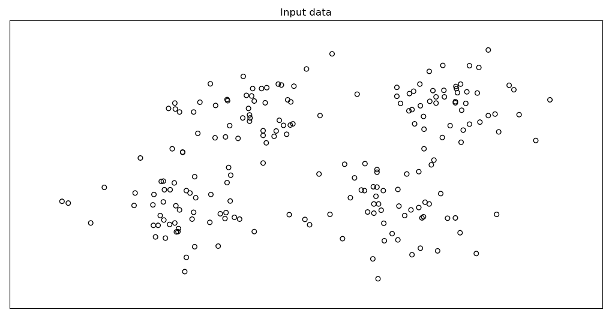
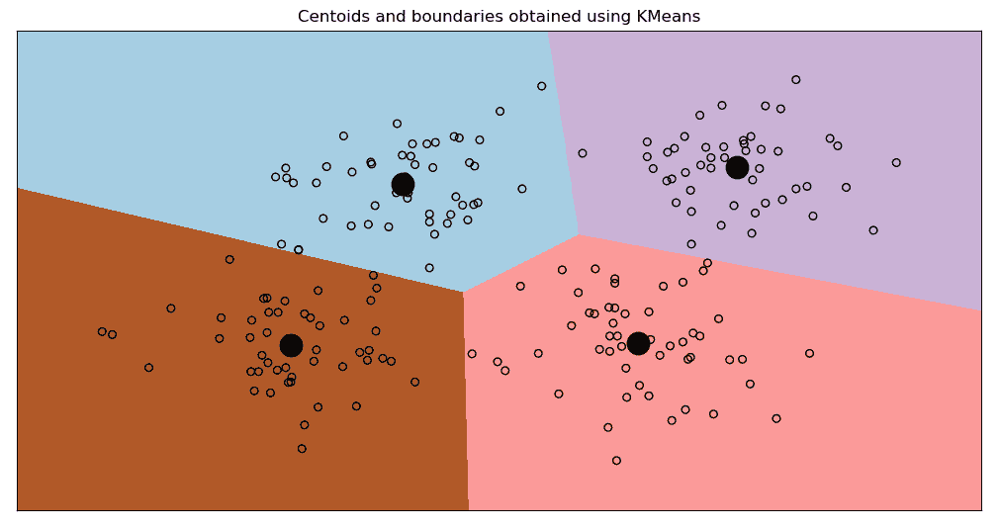
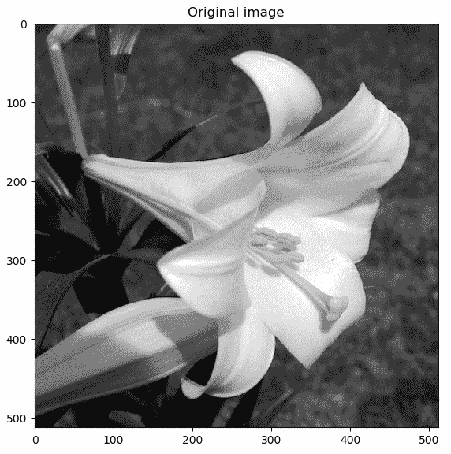
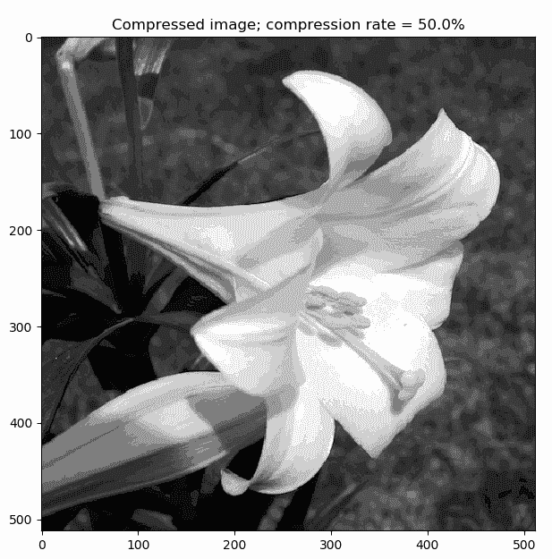

# 使用无监督学习进行聚类

在本章中，我们将涵盖以下食谱：

+   使用 k-means 算法进行聚类数据

+   使用矢量量化压缩图像

+   使用层次聚类对数据进行分组

+   评估聚类算法的性能

+   使用**基于密度的空间聚类应用噪声**（**DBSCAN**）算法估计簇的数量

+   在股票市场数据中寻找模式

+   构建客户细分模型

+   使用自动编码器重建手写数字图像

# 技术要求

为了处理本章中的食谱，你需要以下文件（可在 GitHub 上找到）：

+   `kmeans.py`

+   `data_multivar.txt`

+   `vector_quantization.py`

+   `flower_image.jpg`

+   `agglomerative.py`

+   `performance.py`

+   `data_perf.txt`

+   `estimate_clusters.py`

+   `stock_market.py`

+   `symbol_map.json`

+   `stock_market_data.xlsx`

+   `customer_segmentation.py`

+   `wholesale.csv`

+   `AutoencMnist.py`

# 引言

**无监督学习**是机器学习中的一个范例，其中我们构建模型而不依赖于标记的训练数据。到目前为止，我们处理的数据都是以某种方式标记的。这意味着学习算法可以查看这些数据，并学习根据标签对其进行分类。在无监督学习的世界中，我们没有这种机会！这些算法用于当我们想要使用相似度度量在数据集中找到子组时。

在无监督学习中，数据库中的信息会自动提取。所有这些都是在没有分析内容先验知识的情况下发生的。在无监督学习中，没有关于示例所属类别或对应给定输入的输出的信息。我们希望有一个模型能够发现有趣的属性，例如具有相似特征的组，这在**聚类**中发生。这些算法的应用示例是搜索引擎。这些应用能够根据一个或多个关键词创建与我们的搜索相关的链接列表。

这些算法通过比较数据和寻找相似性或差异来工作。这些算法的有效性取决于它们可以从数据库中提取信息的有用性。可用的数据仅涉及描述每个示例的特征集。

最常见的方法之一是聚类。你可能已经经常听到这个术语被使用；当我们想要在我们的数据中找到簇时，我们主要使用它进行数据分析。这些簇通常是通过使用某种相似度度量来找到的，例如欧几里得距离。无监督学习在许多领域得到广泛应用，例如数据挖掘、医学成像、股票市场分析、计算机视觉和市场细分。

# 使用 k-means 算法进行聚类数据

k-means 算法是最受欢迎的聚类算法之一。此算法使用数据的各种属性将输入数据划分为 *k* 个子组。通过一种优化技术实现分组，我们试图最小化数据点与簇对应质心之间的距离平方和。

# 准备工作

在这个方法中，我们将使用 k-means 算法将数据分组到由相对质心标识的四个簇中。我们还将能够追踪边界以识别每个簇的相关区域。

# 如何做到这一点...

让我们看看如何使用 k-means 算法进行聚类数据分析：

1.  此方法的完整代码在您已经提供的 `kmeans.py` 文件中给出。现在让我们看看它是如何构建的。创建一个新的 Python 文件，并导入以下包：

```py
import numpy as np 
import matplotlib.pyplot as plt 
from sklearn.cluster import KMeans 
```

1.  现在让我们加载输入数据并定义簇的数量。我们将使用您已经提供的 `data_multivar.txt` 文件：

```py
input_file = ('data_multivar.txt')
# Load data
x = []
with open(input_file, 'r') as f:
    for line in f.readlines():
        data = [float(i) for i in line.split(',')]
        x.append(data)

data = np.array(x)
num_clusters = 4
```

1.  我们需要看看输入数据的样子。让我们继续在 Python 文件中添加以下代码行：

```py
plt.figure() 
plt.scatter(data[:,0], data[:,1], marker='o',  
        facecolors='none', edgecolors='k', s=30) 
x_min, x_max = min(data[:, 0]) - 1, max(data[:, 0]) + 1 
y_min, y_max = min(data[:, 1]) - 1, max(data[:, 1]) + 1 
plt.title('Input data') 
plt.xlim(x_min, x_max) 
plt.ylim(y_min, y_max) 
plt.xticks(()) 
plt.yticks(()) 
```

如果你运行此代码，你将得到以下输出：



1.  我们现在准备好训练模型了。让我们初始化 `kmeans` 对象并对其进行训练：

```py
kmeans = KMeans(init='k-means++', n_clusters=num_clusters, n_init=10) 
kmeans.fit(data)
```

1.  数据训练完成后，我们需要可视化边界。让我们继续在 Python 文件中添加以下代码行：

```py
# Step size of the mesh 
step_size = 0.01 

# Plot the boundaries 
x_min, x_max = min(data[:, 0]) - 1, max(data[:, 0]) + 1 
y_min, y_max = min(data[:, 1]) - 1, max(data[:, 1]) + 1 
x_values, y_values = np.meshgrid(np.arange(x_min, x_max, step_size), np.arange(y_min, y_max, step_size)) 

# Predict labels for all points in the mesh 
predicted_labels = kmeans.predict(np.c_[x_values.ravel(), y_values.ravel()]) 
```

1.  我们刚刚在点网格上评估了模型。让我们绘制这些结果以查看边界：

```py
# Plot the results 
predicted_labels = predicted_labels.reshape(x_values.shape) 
plt.figure() 
plt.clf() 
plt.imshow(predicted_labels, interpolation='nearest', 
           extent=(x_values.min(), x_values.max(), y_values.min(), y_values.max()), 
           cmap=plt.cm.Paired, 
           aspect='auto', origin='lower') 

plt.scatter(data[:,0], data[:,1], marker='o',  
        facecolors='none', edgecolors='k', s=30) 
```

1.  现在让我们在它上面叠加 `centroids`：

```py
centroids = kmeans.cluster_centers_ 
plt.scatter(centroids[:,0], centroids[:,1], marker='o', s=200, linewidths=3, 
        color='k', zorder=10, facecolors='black') 
x_min, x_max = min(data[:, 0]) - 1, max(data[:, 0]) + 1 
y_min, y_max = min(data[:, 1]) - 1, max(data[:, 1]) + 1 
plt.title('Centoids and boundaries obtained using KMeans') 
plt.xlim(x_min, x_max) 
plt.ylim(y_min, y_max) 
plt.xticks(()) 
plt.yticks(()) 
plt.show() 
```

如果你运行此代码，你应该看到以下输出：



四个质心和它们的边界被充分突出显示。

# 它是如何工作的...

K-means 算法是由詹姆斯·麦克昆（James MacQueen）开发的，他在 1967 年设计它是为了根据对象的属性将对象分组到 *k* 个分区。它是 **期望最大化**（**expectation-maximization**，简称 **EM**）算法的一种变体，其目标是确定由高斯分布生成的 k 个数据点所属的组。两种算法之间的区别在于欧几里得距离计算方法。在 k-means 中，假设对象的属性可以表示为向量，从而形成一个向量空间。目标是使总簇内方差（或标准差）最小化。每个簇由一个质心来标识。

算法遵循以下迭代过程：

1.  选择 *k* 个簇的数量

1.  初始时创建 *k* 个分区，并将每个条目分区随机分配，或者使用一些启发式信息

1.  计算每个组的质心

1.  计算每个观测值与每个簇质心之间的距离

1.  然后，通过将每个数据点与最近的质心关联来构建一个新的分区

1.  新簇的质心被重新计算

1.  重复步骤 4 到 6，直到算法收敛

# 更多内容...

该算法的目的是定位*k*个质心，每个聚类一个。每个质心的位置尤其重要，因为不同的位置会导致不同的结果。最佳选择是将它们尽可能地彼此分开。当这样做的时候，你必须将每个对象与最近的质心关联起来。这样，我们将得到一个初步分组。完成第一次循环后，我们通过重新计算新的*k*个质心作为簇的重心来进入下一个循环。一旦定位到这些新的*k*个质心，你需要在新数据集和新的最近质心之间建立新的连接。在这些操作结束时，执行一个新的循环。由于这个循环，我们可以注意到*k*个质心会逐步改变位置，直到它们被修改。因此，质心不再移动。

# 参考资料还有

+   参考官方文档中的`sklearn.cluster.KMeans`函数：[`scikit-learn.org/stable/modules/generated/sklearn.cluster.KMeans.html#sklearn.cluster.KMeans.fit`](https://scikit-learn.org/stable/modules/generated/sklearn.cluster.KMeans.html#sklearn.cluster.KMeans.fit)

+   参考 Giuseppe Ciaburro 的《MATLAB for Machine Learning》，Packt Publishing

+   参考来自斯坦福大学的《K Means》[`stanford.edu/~cpiech/cs221/handouts/kmeans.html`](http://stanford.edu/~cpiech/cs221/handouts/kmeans.html)

+   参考 Andrew Moore 的《K-means and Hierarchical Clustering》[`www.autonlab.org/tutorials/kmeans.html`](https://www.autonlab.org/tutorials/kmeans.html)

# 使用矢量量化压缩图像

k 均值聚类的最主要应用之一是**矢量量化**。简单来说，矢量量化是四舍五入的*N*维版本。当我们处理一维数据，例如数字时，我们使用四舍五入技术来减少存储该值所需的内存。例如，如果我们只想精确到小数点后第二位，我们只需存储 23.73；或者，如果我们不关心小数位，我们可以只存储 24。这取决于我们的需求和愿意做出的权衡。

类似地，当我们将这个概念扩展到*N*维数据时，它就变成了矢量量化。当然，其中还有很多细微之处！矢量量化在图像压缩中非常流行，我们使用比原始图像更少的位数来存储每个像素，以达到压缩的目的。

# 准备工作

在这个菜谱中，我们将使用一个示例图像，然后我们将通过减少位数进一步压缩图像。

# 如何操作...

让我们看看如何使用矢量量化来压缩图像：

1.  该菜谱的完整代码在已经提供给你的`vector_quantization.py`文件中给出。让我们看看它是如何构建的。我们首先导入所需的包。创建一个新的 Python 文件，并添加以下行：

```py
import argparse 

import numpy as np 
from scipy import misc  
from sklearn import cluster 
import matplotlib.pyplot as plt
```

1.  让我们创建一个函数来解析输入参数。我们将能够传递图像和每像素位数作为输入参数：

```py
def build_arg_parser(): 
    parser = argparse.ArgumentParser(description='Compress the input image \ 
            using clustering') 
    parser.add_argument("--input-file", dest="input_file", required=True, 
            help="Input image") 
    parser.add_argument("--num-bits", dest="num_bits", required=False, 
            type=int, help="Number of bits used to represent each pixel") 
    return parser 
```

1.  让我们创建一个函数来压缩输入图像：

```py
def compress_image(img, num_clusters): 
    # Convert input image into (num_samples, num_features)  
    # array to run kmeans clustering algorithm  
   X = img.reshape((-1, 1))   

    # Run kmeans on input data 
    kmeans = cluster.KMeans(n_clusters=num_clusters, n_init=4, random_state=5) 
    kmeans.fit(X) 
    centroids = kmeans.cluster_centers_.squeeze() 
    labels = kmeans.labels_ 

    # Assign each value to the nearest centroid and  
    # reshape it to the original image shape 
    input_image_compressed = np.choose(labels, centroids).reshape(img.shape) 

    return input_image_compressed 
```

1.  压缩图像后，我们需要看看它如何影响质量。让我们定义一个函数来绘制输出图像：

```py
def plot_image(img, title): 
    vmin = img.min() 
    vmax = img.max() 
    plt.figure() 
    plt.title(title) 
    plt.imshow(img, cmap=plt.cm.gray, vmin=vmin, vmax=vmax)
```

1.  我们现在准备好使用所有这些函数。让我们定义一个主要函数，它接受输入参数，处理它们，并提取输出图像：

```py
if __name__=='__main__': 
    args = build_arg_parser().parse_args() 
    input_file = args.input_file 
    num_bits = args.num_bits 

    if not 1 <= num_bits <= 8: 
        raise TypeError('Number of bits should be between 1 and 8') 

    num_clusters = np.power(2, num_bits) 

    # Print compression rate 
    compression_rate = round(100 * (8.0 - args.num_bits) / 8.0, 2) 
    print("The size of the image will be reduced by a factor of", 8.0/args.num_bits) 
    print("Compression rate = " + str(compression_rate) + "%") 
```

1.  让我们加载输入图像：

```py
    # Load input image 
    input_image = misc.imread(input_file, True).astype(np.uint8) 

    # original image  
    plot_image(input_image, 'Original image') 
```

1.  现在，让我们使用输入参数来压缩这张图像：

```py
    # compressed image  
    input_image_compressed = compress_image(input_image, num_clusters) 
    plot_image(input_image_compressed, 'Compressed image; compression rate = '  
            + str(compression_rate) + '%') 

    plt.show() 
```

1.  我们现在准备好运行代码；在你的终端上运行以下命令：

```py
    $ python vector_quantization.py --input-file flower_image.jpg --num-bits 4
```

返回以下结果：

```py
The size of the image will be reduced by a factor of 2.0
Compression rate = 50.0%
```

输入图像看起来如下：



你应该得到一个压缩图像作为输出：



1.  让我们进一步压缩图像，通过减少位数到`2`。在你的终端上运行以下命令：

```py
    $ python vector_quantization.py --input-file flower_image.jpg --num-bits 2  
```

返回以下结果：

```py
The size of the image will be reduced by a factor of 4.0
Compression rate = 75.0%
```

你应该得到以下压缩图像作为输出：


1.  如果你将位数减少到`1`，你可以看到它将变成只有黑白两种颜色的二值图像。运行以下命令：

```py
    $ python vector_quantization.py --input-file flower_image.jpg --num-bits 1  
```

返回以下结果：

```py
The size of the image will be reduced by a factor of 8.0
Compression rate = 87.5%
```

你将得到以下输出：


我们已经看到，通过进一步压缩图像，图像质量已经大幅下降。

# 它是如何工作的...

向量量化是一种用于信号压缩、图像编码和语音的算法。我们使用几何标准（欧几里得距离）来寻找簇。因此，它是一个无监督训练的例子。这是一种通过原型向量的分布来建模概率密度函数的技术。向量量化通过使用与它们更接近的相似数量的点来将大量点（向量）划分为簇。每个簇由其质心点（如 k-means）表示。

# 更多内容...

向量量化算法可以用来将数据集划分为多个簇。该算法基于计算欧几里得距离来分配样本到它们所属的簇。算法包括以下步骤：

1.  在开始时，所有向量都被分配到同一个簇，其质心是所有向量的平均值。

1.  对于每个质心，引入一个扰动，生成两个新的簇中心。旧的代表性被丢弃。

1.  每个载体根据最小距离标准重新分配到新的簇中。

1.  新的代表性是分配给每个簇的向量的平均值。这些将成为簇的新中心。

1.  如果满足结束条件，算法终止。如果不满足，返回步骤 2。

# 参见

+   参考官方文档的`sklearn.cluster.KMeans`函数：[`scikit-learn.org/stable/modules/generated/sklearn.cluster.KMeans.html#sklearn.cluster.KMeans.fit`](https://scikit-learn.org/stable/modules/generated/sklearn.cluster.KMeans.html#sklearn.cluster.KMeans.fit)

+   参考论文《基于矢量量化算法的图像压缩：综述》：[`pdfs.semanticscholar.org/24d2/db6db81f1000b74246d22641e83390fb1065.pdf`](https://pdfs.semanticscholar.org/24d2/db6db81f1000b74246d22641e83390fb1065.pdf)

+   参考官方文档的`Argparse 教程`：[`docs.python.org/2/howto/argparse.html`](https://docs.python.org/2/howto/argparse.html)

+   参考官方文档的`scipy.misc.imread`函数：[`docs.scipy.org/doc/scipy/reference/generated/scipy.misc.imread.html`](https://docs.scipy.org/doc/scipy/reference/generated/scipy.misc.imread.html)

# 使用聚合聚类分组数据

在我们讨论层次聚类之前，我们需要了解**层次聚类**。层次聚类是指一系列通过连续分割或合并来创建树状聚类的聚类算法，它们使用树来表示。层次聚类算法可以是自底向上或自顶向下。那么，这意味着什么呢？在自底向上的算法中，每个数据点被视为一个单独的聚类，包含一个对象。然后这些聚类依次合并，直到所有聚类合并成一个巨大的聚类。这被称为**聚合聚类**。另一方面，自顶向下的算法从一个巨大的聚类开始，依次分割这些聚类，直到达到单个数据点。

# 准备工作

在层次聚类中，我们通过递归地使用自顶向下或自底向上的方式对实例进行分区来构建聚类。我们可以将这些方法分为以下几类：

+   **聚合算法**（自底向上）：在这里，我们从单个统计单元获得解决方案。在每次迭代中，我们聚合最相关的统计单元，直到形成一个单一的聚类为止。

+   **划分算法**（自顶向下）：在这里，所有单元属于同一个类别，并且与其它单元不相似的单元在每个后续迭代中添加到一个新的聚类中。

这两种方法都会产生一个树状图。这代表了一个嵌套的对象组，以及组之间变化的相似性水平。通过在所需的相似性水平处切割树状图，我们可以得到数据对象的聚类。聚类的合并或分割是通过一个相似性度量来完成的，该度量优化了一个标准。 

# 如何做...

让我们看看如何使用聚合聚类来分组数据：

1.  这个菜谱的完整代码在提供的`agglomerative.py`文件中给出。现在让我们看看它是如何构建的。创建一个新的 Python 文件，并导入必要的包：

```py
import numpy as np 
import matplotlib.pyplot as plt 
from sklearn.cluster import AgglomerativeClustering 
from sklearn.neighbors import kneighbors_graph 
```

1.  让我们定义一个执行聚合聚类的函数：

```py
def perform_clustering(X, connectivity, title, num_clusters=3, linkage='ward'): 
    plt.figure() 
    model = AgglomerativeClustering(linkage=linkage,  
                    connectivity=connectivity, n_clusters=num_clusters) 
    model.fit(X) 
```

1.  让我们提取标签并指定图形中标记的形状：

```py
    # extract labels 
    labels = model.labels_ 
` 
    # specify marker shapes for different clusters 
    markers = '.vx' 
```

1.  遍历数据点并相应地使用不同的标记进行绘图：

```py
    for i, marker in zip(range(num_clusters), markers): 
        # plot the points belong to the current cluster 
        plt.scatter(X[labels==i, 0], X[labels==i, 1], s=50,  
                    marker=marker, color='k', facecolors='none') 

    plt.title(title)
```

1.  为了展示聚合聚类的优势，我们需要在空间上连接且空间上彼此靠近的数据点上运行它。我们希望连接的数据点属于同一簇，而不是仅仅空间上彼此靠近的数据点。现在让我们定义一个函数来获取螺旋线上的数据点集：

```py
def get_spiral(t, noise_amplitude=0.5): 
    r = t 
    x = r * np.cos(t) 
    y = r * np.sin(t) 

    return add_noise(x, y, noise_amplitude) 
```

1.  在前面的函数中，我们向曲线添加了一些噪声，因为它增加了一些不确定性。让我们定义这个函数：

```py
def add_noise(x, y, amplitude): 
    X = np.concatenate((x, y)) 
    X += amplitude * np.random.randn(2, X.shape[1]) 
    return X.T 
```

1.  现在让我们定义另一个函数来获取位于玫瑰曲线上的数据点：

```py
def get_rose(t, noise_amplitude=0.02): 
    # Equation for "rose" (or rhodonea curve); if k is odd, then 
    # the curve will have k petals, else it will have 2k petals 
    k = 5        
    r = np.cos(k*t) + 0.25  
    x = r * np.cos(t) 
    y = r * np.sin(t) 

    return add_noise(x, y, noise_amplitude) 
```

1.  为了增加更多多样性，让我们也定义一个`hypotrochoid`函数：

```py
def get_hypotrochoid(t, noise_amplitude=0): 
    a, b, h = 10.0, 2.0, 4.0 
    x = (a - b) * np.cos(t) + h * np.cos((a - b) / b * t)  
    y = (a - b) * np.sin(t) - h * np.sin((a - b) / b * t)  

    return add_noise(x, y, 0)
```

1.  我们现在准备好定义主函数：

```py
if __name__=='__main__': 
    # Generate sample data 
    n_samples = 500  
    np.random.seed(2) 
    t = 2.5 * np.pi * (1 + 2 * np.random.rand(1, n_samples)) 
    X = get_spiral(t) 

    # No connectivity 
    connectivity = None  
    perform_clustering(X, connectivity, 'No connectivity') 

    # Create K-Neighbors graph  
    connectivity = kneighbors_graph(X, 10, include_self=False) 
    perform_clustering(X, connectivity, 'K-Neighbors connectivity') 

    plt.show() 
```

如果你运行此代码，如果我们不使用任何连通性，你将得到以下输出：


第二个输出图看起来如下：


如你所见，使用连通性功能使我们能够将相互连接的数据点分组，而不是根据它们的空间位置进行聚类。

# 它是如何工作的...

在聚合聚类中，每个观测开始于其簇，随后簇被合并。合并簇的策略如下：

+   伍德聚类最小化所有簇内平方差的和。

+   最大或完全链接用于最小化观测对簇之间的最大距离。

+   平均链接用于最小化所有观测对簇之间的距离的平均值。

+   单链接用于最小化观测对簇之间最近观察的距离。

# 还有更多…

为了决定哪些簇必须合并，有必要定义簇之间差异的度量。在大多数层次聚类方法中，使用特定的指标来量化两个元素对之间的距离，以及一个链接标准，它将两个元素集（簇）之间的差异定义为两个集中元素对之间距离的函数。

这些常用指标如下：

+   欧几里得距离

+   曼哈顿距离

+   均匀规则

+   马哈拉诺比斯距离，它通过变量不同的尺度和相关性来校正数据

+   两个向量之间的角度

+   汉明距离，它衡量将一个成员转换为另一个成员所需的最小替换次数

# 参见

+   请参阅`sklearn.cluster.AgglomerativeClustering`函数的官方文档：[`scikit-learn.org/stable/modules/generated/sklearn.cluster.AgglomerativeClustering.html`](https://scikit-learn.org/stable/modules/generated/sklearn.cluster.AgglomerativeClustering.html)

+   参考来自斯坦福大学的*层次聚类*（[`nlp.stanford.edu/IR-book/html/htmledition/hierarchical-agglomerative-clustering-1.html`](https://nlp.stanford.edu/IR-book/html/htmledition/hierarchical-agglomerative-clustering-1.html)）

# 评估聚类算法的性能

到目前为止，我们已经构建了不同的聚类算法，但还没有测量它们的性能。在监督学习中，将原始标签与预测值进行比较来计算它们的准确率。相比之下，在无监督学习中，我们没有标签，因此我们需要找到一种方法来衡量我们算法的性能。

# 准备工作

评估聚类算法的一个好方法是看簇之间的分离程度。簇是否分离得很好？簇中的数据点是否足够紧密？我们需要一个可以量化这种行为的指标。我们将使用一个称为**轮廓系数**的指标。这个分数为每个数据点定义；这个系数的定义如下：


在这里，***x***是当前数据点到同一簇中所有其他数据点的平均距离，而***y***是当前数据点到下一个最近簇中所有数据点的平均距离。

# 如何做...

让我们看看如何评估聚类算法的性能：

1.  这个菜谱的完整代码在已经提供给你的`performance.py`文件中给出。现在让我们看看它是如何构建的。创建一个新的 Python 文件，并导入以下包：

```py
import numpy as np 
import matplotlib.pyplot as plt 
from sklearn import metrics 
from sklearn.cluster import KMeans 
```

1.  让我们从已经提供给你的`data_perf.txt`文件中加载输入数据：

```py
input_file = ('data_perf.txt')

x = []
with open(input_file, 'r') as f:
    for line in f.readlines():
        data = [float(i) for i in line.split(',')]
        x.append(data)

data = np.array(x)
```

1.  为了确定最佳簇的数量，让我们遍历一系列值并查看它在何处达到峰值：

```py
scores = [] 
range_values = np.arange(2, 10) 

for i in range_values: 
    # Train the model 
    kmeans = KMeans(init='k-means++', n_clusters=i, n_init=10) 
    kmeans.fit(data) 
    score = metrics.silhouette_score(data, kmeans.labels_,  
                metric='euclidean', sample_size=len(data)) 

    print("Number of clusters =", i)
    print("Silhouette score =", score)

    scores.append(score) 
```

1.  现在，让我们绘制图表以查看它在何处达到峰值：

```py
# Plot scores 
plt.figure() 
plt.bar(range_values, scores, width=0.6, color='k', align='center') 
plt.title('Silhouette score vs number of clusters') 

# Plot data 
plt.figure() 
plt.scatter(data[:,0], data[:,1], color='k', s=30, marker='o', facecolors='none') 
x_min, x_max = min(data[:, 0]) - 1, max(data[:, 0]) + 1 
y_min, y_max = min(data[:, 1]) - 1, max(data[:, 1]) + 1 
plt.title('Input data') 
plt.xlim(x_min, x_max) 
plt.ylim(y_min, y_max) 
plt.xticks(()) 
plt.yticks(()) 

plt.show()
```

1.  如果你运行这段代码，你将在终端上得到以下输出：

```py
Number of clusters = 2
Silhouette score = 0.5290397175472954
Number of clusters = 3
Silhouette score = 0.5572466391184153
Number of clusters = 4
Silhouette score = 0.5832757517829593
Number of clusters = 5
Silhouette score = 0.6582796909760834
Number of clusters = 6
Silhouette score = 0.5991736976396735
Number of clusters = 7
Silhouette score = 0.5194660249299737
Number of clusters = 8
Silhouette score = 0.44937089046511863
Number of clusters = 9
Silhouette score = 0.3998899991555578
```

柱状图看起来如下：


就像这些分数一样，最佳配置是五个簇。让我们看看数据实际上看起来是什么样子：


我们可以直观地确认数据实际上有五个簇。我们只是以包含五个不同簇的小数据集为例。当你处理包含无法轻易可视化的高维数据的巨大数据集时，这种方法变得非常有用。

# 它是如何工作的...

`sklearn.metrics.silhouette_score`函数计算所有样本的平均轮廓系数。对于每个样本，计算两个距离：平均簇内距离（***x***）和平均最近簇距离（***y***）。一个样本的轮廓系数由以下方程给出：


实际上，**y**是样本与不包含样本的最近簇之间的距离。

# 更多内容...

最佳值为 1，最差值为-1。0 表示重叠的簇，而小于 0 的值表示该特定样本被错误地附加到簇中。

# 参见

+   请参考`sklearn.metrics.silhouette_score`函数的官方文档：[`scikit-learn.org/stable/modules/generated/sklearn.metrics.silhouette_score.html`](https://scikit-learn.org/stable/modules/generated/sklearn.metrics.silhouette_score.html)

+   参考维基百科上的*轮廓*（来自维基百科）：[`en.wikipedia.org/wiki/Silhouette_(clustering)`](https://en.wikipedia.org/wiki/Silhouette_(clustering))

# 使用 DBSCAN 算法估计簇数

当我们讨论 k-means 算法时，我们看到了必须给出簇的数量作为输入参数之一。在现实世界中，我们不会有这样的信息可用。我们可以肯定地扫描参数空间，使用轮廓系数得分找出最佳簇数，但这将是一个昂贵的流程！一个返回我们数据中簇数的方法将是解决这个问题的绝佳解决方案。DBSCAN 正是为我们做到这一点。

# 准备工作

在这个菜谱中，我们将使用`sklearn.cluster.DBSCAN`函数执行 DBSCAN 分析。我们将使用与之前*评估聚类算法性能*（`data_perf.txt`）菜谱中相同的相同数据，以比较两种方法。

# 如何做...

让我们看看如何使用 DBSCAN 算法自动估计簇数：

1.  此菜谱的完整代码已在`estimate_clusters.py`文件中提供。现在让我们看看它是如何构建的。创建一个新的 Python 文件，并导入必要的包：

```py
from itertools import cycle 
import numpy as np 
from sklearn.cluster import DBSCAN 
from sklearn import metrics 
import matplotlib.pyplot as plt 
```

1.  从`data_perf.txt`文件中加载数据。这是我们在上一个菜谱中使用的相同文件，这将帮助我们比较同一数据集上的方法：

```py
# Load data
input_file = ('data_perf.txt')

x = []
with open(input_file, 'r') as f:
    for line in f.readlines():
        data = [float(i) for i in line.split(',')]
        x.append(data)

X = np.array(x)
```

1.  我们需要找到最佳参数，所以让我们初始化几个变量：

```py
# Find the best epsilon 
eps_grid = np.linspace(0.3, 1.2, num=10) 
silhouette_scores = [] 
eps_best = eps_grid[0] 
silhouette_score_max = -1 
model_best = None 
labels_best = None
```

1.  让我们扫描参数空间：

```py
for eps in eps_grid: 
    # Train DBSCAN clustering model 
    model = DBSCAN(eps=eps, min_samples=5).fit(X) 

    # Extract labels 
    labels = model.labels_
```

1.  对于每次迭代，我们需要提取性能指标：

```py
    # Extract performance metric  
    silhouette_score = round(metrics.silhouette_score(X, labels), 4) 
    silhouette_scores.append(silhouette_score) 

    print("Epsilon:", eps, " --> silhouette score:", silhouette_score) 
```

1.  我们需要存储最佳得分及其相关的 epsilon 值：

```py
    if silhouette_score > silhouette_score_max: 
        silhouette_score_max = silhouette_score 
        eps_best = eps 
        model_best = model 
        labels_best = labels 
```

1.  让我们现在绘制条形图，如下所示：

```py
# Plot silhouette scores vs epsilon 
plt.figure() 
plt.bar(eps_grid, silhouette_scores, width=0.05, color='k', align='center') 
plt.title('Silhouette score vs epsilon') 

# Best params 
print("Best epsilon =", eps_best) 
```

1.  让我们存储最佳模型和标签：

```py
# Associated model and labels for best epsilon 
model = model_best  
labels = labels_best
```

1.  一些数据点可能保持未分配。我们需要识别它们，如下所示：

```py
# Check for unassigned datapoints in the labels 
offset = 0 
if -1 in labels: 
    offset = 1 
```

1.  按如下方式提取簇数：

```py
# Number of clusters in the data  
num_clusters = len(set(labels)) - offset  

print("Estimated number of clusters =", num_clusters)
```

1.  我们需要提取所有核心样本，如下所示：

```py
# Extracts the core samples from the trained model 
mask_core = np.zeros(labels.shape, dtype=np.bool) 
mask_core[model.core_sample_indices_] = True 
```

1.  让我们可视化结果簇。我们将首先提取唯一标签并指定不同的标记：

```py
# Plot resultant clusters  
plt.figure() 
labels_uniq = set(labels) 
markers = cycle('vo^s<>') 
```

1.  现在，让我们遍历簇并使用不同的标记绘制数据点：

```py
for cur_label, marker in zip(labels_uniq, markers): 
    # Use black dots for unassigned datapoints 
    if cur_label == -1: 
        marker = '.' 

    # Create mask for the current label 
    cur_mask = (labels == cur_label) 

    cur_data = X[cur_mask & mask_core] 
    plt.scatter(cur_data[:, 0], cur_data[:, 1], marker=marker, 
             edgecolors='black', s=96, facecolors='none') 
    cur_data = X[cur_mask & ~mask_core] 
    plt.scatter(cur_data[:, 0], cur_data[:, 1], marker=marker, 
             edgecolors='black', s=32) 
plt.title('Data separated into clusters') 
plt.show()
```

1.  如果你运行此代码，你将在你的终端上得到以下输出：

```py
Epsilon: 0.3 --> silhouette score: 0.1287
Epsilon: 0.39999999999999997 --> silhouette score: 0.3594
Epsilon: 0.5 --> silhouette score: 0.5134
Epsilon: 0.6 --> silhouette score: 0.6165
Epsilon: 0.7 --> silhouette score: 0.6322
Epsilon: 0.7999999999999999 --> silhouette score: 0.6366
Epsilon: 0.8999999999999999 --> silhouette score: 0.5142
Epsilon: 1.0 --> silhouette score: 0.5629
Epsilon: 1.0999999999999999 --> silhouette score: 0.5629
Epsilon: 1.2 --> silhouette score: 0.5629
Best epsilon = 0.7999999999999999
Estimated number of clusters = 5
```

这将生成以下条形图：


让我们看看标记的数据点和以下输出中用实心点标记的未分配数据点：


# 它是如何工作的...

DBSCAN 通过将数据点视为密集簇的组来工作。如果一个点属于一个簇，那么应该有很多其他点也属于同一个簇。我们可以控制的参数之一是此点与其他点之间的最大距离。这被称为**epsilon**。给定簇中的任意两点之间的距离不应超过 epsilon。这种方法的主要优点之一是它可以处理异常值。如果有一些点位于低密度区域中孤立存在，DBSCAN 将将这些点检测为异常值，而不是强迫它们进入一个簇。

# 更多内容…

DBSCAN 具有以下优缺点：

| **优点** | **缺点** |
| --- | --- |

|

+   它不需要事先知道簇的数量。

+   它可以找到任意形状的簇。

+   它只需要两个参数。

|

+   聚类的质量取决于其距离度量。

+   它无法对密度差异大的数据集进行分类。

|

# 参考信息

+   参考官方文档中的 `sklearn.cluster.DBSCAN` 函数：[`scikit-learn.org/stable/modules/generated/sklearn.cluster.DBSCAN.html`](https://scikit-learn.org/stable/modules/generated/sklearn.cluster.DBSCAN.html)

+   参考信息：*DBSCAN*（来自维基百科）：[`en.wikipedia.org/wiki/DBSCAN`](https://en.wikipedia.org/wiki/DBSCAN)

+   参考信息：*基于密度的方法*（来自布法罗大学）：[`cse.buffalo.edu/~jing/cse601/fa12/materials/clustering_density.pdf`](https://cse.buffalo.edu/~jing/cse601/fa12/materials/clustering_density.pdf)

# 在股票市场数据中寻找模式

让我们看看如何使用无监督学习进行股票市场分析。由于我们不知道有多少个簇，我们将在簇上使用一个称为**亲和传播**（**AP**）的算法。它试图为我们数据中的每个簇找到一个代表性的数据点，以及数据点对之间的相似度度量，并将所有数据点视为其各自簇的潜在代表，也称为**示例**。

# 准备工作

在这个菜谱中，我们将分析公司在指定时间段内的股票市场变化。我们的目标是找出哪些公司在时间上的报价行为相似。

# 如何操作...

让我们看看如何寻找股票市场数据中的模式：

1.  此菜谱的完整代码已在提供的 `stock_market.py` 文件中给出。现在让我们看看它是如何构建的。创建一个新的 Python 文件，并导入以下包：

```py
import json
import sys
import pandas as pd

import numpy as np
from sklearn import covariance, cluster
```

1.  我们需要一个包含所有符号及其相关名称的文件。这些信息位于提供的 `symbol_map.json` 文件中。让我们按照以下方式加载它：

```py
# Input symbol file 
symbol_file = 'symbol_map.json' 
```

1.  让我们从 `symbol_map.json` 文件中读取数据：

```py
# Load the symbol map 
with open(symbol_file, 'r') as f: 
    symbol_dict = json.loads(f.read()) 

symbols, names = np.array(list(symbol_dict.items())).T 
```

1.  现在让我们加载数据。我们将使用一个 Excel 文件（`stock_market_data.xlsx`）；这是一个多工作表文件，每个符号对应一个：

```py
quotes = []

excel_file = 'stock_market_data.xlsx'

for symbol in symbols:
    print('Quote history for %r' % symbol, file=sys.stderr)
    quotes.append(pd.read_excel(excel_file, symbol))
```

1.  由于我们需要一些特征点进行分析，我们将使用每天开盘价和收盘价之间的差异来分析数据：

```py
# Extract opening and closing quotes 
opening_quotes = np.array([quote.open for quote in quotes]).astype(np.float) 
closing_quotes = np.array([quote.close for quote in quotes]).astype(np.float) 

# The daily fluctuations of the quotes  
delta_quotes = closing_quotes - opening_quotes 
```

1.  让我们构建一个图模型：

```py
# Build a graph model from the correlations 
edge_model = covariance.GraphicalLassoCV(cv=3) 
```

1.  在我们使用之前，我们需要标准化数据：

```py
# Standardize the data  
X = delta_quotes.copy().T 
X /= X.std(axis=0) 
```

1.  现在让我们使用这些数据来训练模型：

```py
# Train the model 
with np.errstate(invalid='ignore'): 
    edge_model.fit(X) 
```

1.  现在我们已经准备好构建聚类模型，如下所示：

```py
# Build clustering model using affinity propagation 
_, labels = cluster.affinity_propagation(edge_model.covariance_) 
num_labels = labels.max() 

# Print the results of clustering 
for i in range(num_labels + 1): 
    print "Cluster", i+1, "-->", ', '.join(names[labels == i]) 
```

1.  如果你运行此代码，你将在终端得到以下输出：

```py
Cluster 1 --> Apple, Amazon, Yahoo
Cluster 2 --> AIG, American express, Bank of America, DuPont de Nemours, General Dynamics, General Electrics, Goldman Sachs, GlaxoSmithKline, Home Depot, Kellogg
Cluster 3 --> Boeing, Canon, Caterpillar, Ford, Honda
Cluster 4 --> Colgate-Palmolive, Kimberly-Clark
Cluster 5 --> Cisco, Dell, HP, IBM
Cluster 6 --> Comcast, Cablevision
Cluster 7 --> CVS
Cluster 8 --> ConocoPhillips, Chevron
```

识别出八个簇。从初步分析中，我们可以看到，分组的公司似乎对待相同的产品：IT、银行、工程、洗涤剂和计算机。

# 它是如何工作的...

AP 是一种基于点（项目）之间传递消息概念的聚类算法。与 k-means 等聚类算法不同，AP 不需要预先定义聚类数量。AP 搜索输入集的代表成员（样本），实际上这些成员代表了各个簇。

AP 算法的核心是识别一组样本。在输入中，取数据对之间的相似性矩阵。数据作为消息交换实值，直到出现合适的样本，从而获得良好的簇。

# 更多内容…

为了执行 AP 聚类，使用了`sklearn.cluster.affinity_propagation()`函数。在具有相似相似度和偏好的训练样本的情况下，聚类中心和标签的分配取决于偏好。如果偏好小于相似度，则将返回单个聚类中心和每个样本的 0 标签。否则，每个训练样本将成为其聚类中心，并分配一个唯一的标记。

# 参见

+   参考官方文档中的`sklearn.cluster.affinity_propagation()`函数：[`scikit-learn.org/stable/modules/generated/sklearn.cluster.affinity_propagation.html`](https://scikit-learn.org/stable/modules/generated/sklearn.cluster.affinity_propagation.html)

+   参考来自多伦多大学的*亲和传播：通过传递消息聚类数据*（[`www.cs.columbia.edu/~delbert/docs/DDueck-thesis_small.pdf`](http://www.cs.columbia.edu/~delbert/docs/DDueck-thesis_small.pdf)）。

# 构建客户细分模型

无监督学习的主要应用之一是市场细分。这是当我们不是始终有标记数据可用时的情况，但重要的是要对市场进行细分，以便人们可以针对个体群体。这在广告、库存管理、实施分销策略和大众媒体中非常有用。让我们来应用无监督学习到一个这样的用例，看看它如何有用。

# 准备工作

我们将处理一个批发商及其客户。我们将使用可用的数据[`archive.ics.uci.edu/ml/datasets/Wholesale+customers`](https://archive.ics.uci.edu/ml/datasets/Wholesale+customers)。电子表格包含客户对不同类型商品消费的数据，我们的目标是找到簇，以便他们可以优化他们的销售和分销策略。

# 如何实现它…

让我们看看如何构建一个客户细分模型：

1.  这个菜谱的完整代码在已经提供给你的`customer_segmentation.py`文件中给出。现在让我们看看它是如何构建的。创建一个新的 Python 文件，并导入以下包：

```py
import csv 
import numpy as np 
from sklearn.cluster import MeanShift, estimate_bandwidth 
import matplotlib.pyplot as plt 
```

1.  让我们加载`wholesale.csv`文件中的输入数据，该文件已经提供给你：

```py
# Load data from input file 
input_file = 'wholesale.csv' 
file_reader = csv.reader(open(input_file, 'rt'), delimiter=',') 
X = [] 
for count, row in enumerate(file_reader): 
    if not count: 
        names = row[2:] 
        continue 

    X.append([float(x) for x in row[2:]]) 

# Input data as numpy array 
X = np.array(X) 
```

1.  让我们构建一个均值漂移模型：

```py
# Estimating the bandwidth  
bandwidth = estimate_bandwidth(X, quantile=0.8, n_samples=len(X)) 

# Compute clustering with MeanShift 
meanshift_estimator = MeanShift(bandwidth=bandwidth, bin_seeding=True) 
meanshift_estimator.fit(X) 
labels = meanshift_estimator.labels_ 
centroids = meanshift_estimator.cluster_centers_ 
num_clusters = len(np.unique(labels)) 

print("Number of clusters in input data =", num_clusters) 
```

1.  让我们按照以下方式打印我们获得的簇中心：

```py
print("Centroids of clusters:")
print('\t'.join([name[:3] for name in names]))
for centroid in centroids:
    print('\t'.join([str(int(x)) for x in centroid]))
```

1.  让我们可视化一些特征以获得输出的感觉：

```py
# Visualizing data 

centroids_milk_groceries = centroids[:, 1:3] 

# Plot the nodes using the coordinates of our centroids_milk_groceries 
plt.figure() 
plt.scatter(centroids_milk_groceries[:,0], centroids_milk_groceries[:,1],  
        s=100, edgecolors='k', facecolors='none') 

offset = 0.2 
plt.xlim(centroids_milk_groceries[:,0].min() - offset * centroids_milk_groceries[:,0].ptp(), 
        centroids_milk_groceries[:,0].max() + offset * centroids_milk_groceries[:,0].ptp(),) 
plt.ylim(centroids_milk_groceries[:,1].min() - offset * centroids_milk_groceries[:,1].ptp(), 
        centroids_milk_groceries[:,1].max() + offset * centroids_milk_groceries[:,1].ptp()) 

plt.title('Centroids of clusters for milk and groceries') 
plt.show() 
```

1.  如果你运行此代码，你将在终端上得到以下输出：


你将得到以下输出，描述了特征的中心点，*牛奶*和*杂货*，其中牛奶位于*x*轴上，杂货位于*y*轴上：


在这个输出中，已识别簇的八个中心点被清晰地表示出来。

# 它是如何工作的…

在这个菜谱中，我们通过使用均值漂移算法来面对聚类问题。这是一种通过移动点到众数的方式来迭代地将数据点分配到簇中的聚类类型。众数是出现频率最高的值。

算法迭代地将每个数据点分配到最近簇的中心。最近簇的中心由大多数邻近点所在的位置确定。因此，在每次迭代中，每个数据点都会接近位于最多点的地方，这即是或会导致簇中心。当算法停止时，每个点都会被分配到一个簇中。与 k-means 算法不同，均值漂移算法不需要事先指定簇的数量；这是由算法自动确定的。均值漂移算法在图像处理和人工智能领域得到了广泛的应用。

# 还有更多…

为了执行均值漂移聚类，使用了`sklearn.cluster.MeanShift()`函数。此函数使用平坦核执行均值漂移聚类。均值漂移聚类使我们能够在均匀密度的样本中识别点聚集。候选中心点通过给定区域内点的平均值进行更新。然后，在后期处理阶段过滤这些点以消除可能的重复，形成最终的中心点集。

# 参考以下内容

+   参考官方文档的`sklearn.cluster.MeanShift()`函数：[`scikit-learn.org/stable/modules/generated/sklearn.cluster.MeanShift.html#sklearn-cluster-meanshift`](https://scikit-learn.org/stable/modules/generated/sklearn.cluster.MeanShift.html#sklearn-cluster-meanshift)

+   参考由 Dorin Comaniciu 和 Peter Meer 撰写的《Mean Shift: A Robust Approach Toward Feature Space Analysis》（[`courses.csail.mit.edu/6.869/handouts/PAMIMeanshift.pdf`](https://courses.csail.mit.edu/6.869/handouts/PAMIMeanshift.pdf)）

# 使用自动编码器重建手写数字图像

自动编码器是一种神经网络，其目的是将输入编码到小维度，并使获得的结果能够重建输入本身。自动编码器由以下两个子网络组成：编码器和解码器。添加了一个损失函数到这些函数中，它是数据压缩表示和分解表示之间信息损失量的距离。编码器和解码器将与距离函数可微分，因此编码和解码函数的参数可以被优化以最小化重建损失，使用梯度随机化。

# 准备工作

**手写识别**（**HWR**）在现代技术中得到了广泛应用。书写文本图像可以通过光学扫描（**光学字符识别**，**OCR**）或智能文字识别从纸张上离线获取。书法识别展示了计算机接收和解释手写输入的能力，这些输入可以从纸张文件、触摸屏、照片和其他设备等来源理解。HWR 包括各种技术，通常需要 OCR。然而，一个完整的脚本识别系统还管理格式，执行正确的字符分割，并找到最可能的单词。

**修改后的国家标准与技术研究院**（**MNIST**）是一个包含手写数字的大型数据库。它包含 70,000 个数据示例。它是 MNIST 更大数据集的一个子集。数字的分辨率为 28 x 28 像素，存储在一个 70,000 行和 785 列的矩阵中；784 列形成 28 x 28 矩阵中每个像素值，一个值是实际的数字。这些数字已经被尺寸归一化和居中在固定大小的图像中。

# 如何做到这一点...

让我们看看如何构建自动编码器来重建手写数字图像：

1.  此菜谱的完整代码已提供在`AutoencMnist.py`文件中。让我们看看它是如何构建的。创建一个新的 Python 文件，并导入以下包：

```py
from keras.datasets import mnist
```

1.  要导入 MNIST 数据集，必须使用以下代码：

```py
(XTrain, YTrain), (XTest, YTest) = mnist.load_data()

print('XTrain shape = ',XTrain.shape)
print('XTest shape = ',XTest.shape)
print('YTrain shape = ',YTrain.shape)
print('YTest shape = ',YTest.shape)
```

1.  导入数据集后，我们打印了数据的形状，以下结果被返回：

```py
XTrain shape = (60000, 28, 28)
XTest shape = (10000, 28, 28)
YTrain shape = (60000,)
YTest shape = (10000,)
```

1.  数据库中的 70,000 个项目被分为 60,000 个项目用于训练，10,000 个项目用于测试。数据输出由 0 到 9 范围内的整数表示。让我们如下进行检查：

```py
import numpy as np
print('YTrain values = ',np.unique(YTrain))
print('YTest values = ',np.unique(YTest))
```

1.  以下结果将被打印：

```py
YTrain values = [0 1 2 3 4 5 6 7 8 9]
YTest values = [0 1 2 3 4 5 6 7 8 9]
```

1.  分析可用的数组中两个值的分布可能是有用的。首先，我们计算出现的次数：

```py
unique, counts = np.unique(YTrain, return_counts=True)
print('YTrain distribution = ',dict(zip(unique, counts)))
unique, counts = np.unique(YTest, return_counts=True)
print('YTrain distribution = ',dict(zip(unique, counts)))
```

1.  以下结果被返回：

```py
YTrain distribution = {0: 5923, 1: 6742, 2: 5958, 3: 6131, 4: 5842, 5: 5421, 6: 5918, 7: 6265, 8: 5851, 9: 5949}
YTrain distribution = {0: 980, 1: 1135, 2: 1032, 3: 1010, 4: 982, 5: 892, 6: 958, 7: 1028, 8: 974, 9: 1009}
```

1.  我们也可以在图中看到它，如下所示：

```py
import matplotlib.pyplot as plt
plt.figure(1)
plt.subplot(121)
plt.hist(YTrain, alpha=0.8, ec='black')
plt.xlabel("Classes")
plt.ylabel("Number of occurrences")
plt.title("YTrain data")

plt.subplot(122)
plt.hist(YTest, alpha=0.8, ec='black')
plt.xlabel("Classes")
plt.ylabel("Number of occurrences")
plt.title("YTest data")
plt.show()
```

1.  为了比较在两个输出数据集（`YTrain`和`YTest`）上获得的结果，我们绘制并并排显示了两个直方图，如下所示：


1.  从前面的输出分析中，我们可以看到在两个数据集中，10 个数字以相同的比例表示。事实上，柱状图似乎具有相同的尺寸，即使垂直轴有不同的范围。

1.  现在，我们必须将所有值归一化到 0 和 1 之间：

```py
XTrain = XTrain.astype('float32') / 255
XTest = XTest.astype('float32') / 255
```

1.  为了降低维度，我们将 28 x 28 的图像展平成大小为 784 的向量：

```py
XTrain = XTrain.reshape((len(XTrain), np.prod(XTrain.shape[1:])))
XTest = XTest.reshape((len(XTest), np.prod(XTest.shape[1:])))
```

1.  现在，我们将使用 Keras 功能 API 构建模型。让我们开始导入库：

```py
from keras.layers import Input 
from keras.layers import Dense
from keras.models import Model
```

1.  然后，我们可以构建 Keras 模型，如下所示：

```py
InputModel = Input(shape=(784,))
EncodedLayer = Dense(32, activation='relu')(InputModel)
DecodedLayer = Dense(784, activation='sigmoid')(EncodedLayer)
AutoencoderModel = Model(InputModel, DecodedLayer)
AutoencoderModel.summary()
```

以下输出显示了模型架构：


1.  因此，我们必须为训练配置模型。为此，我们将使用`compile`方法，如下所示：

```py
AutoencoderModel.compile(optimizer='adadelta', loss='binary_crossentropy')
```

1.  在这一点上，我们可以训练模型，如下所示：

```py
history = AutoencoderModel.fit(XTrain, XTrain,
batch_size=256,
epochs=100,
shuffle=True,
validation_data=(XTest, XTest))
```

1.  我们的模式现在准备好了，我们可以使用它来自动重建手写数字。为此，我们将使用`predict()`方法：

```py
DecodedDigits = AutoencoderModel.predict(XTest)
```

1.  现在，我们已经完成了；模型已经被训练，并将随后用于做出预测。因此，我们可以打印出起始的手写数字以及从我们的模型中重建的数字。当然，我们只会对数据集中包含的 60,000 个数字中的部分进行操作。实际上，我们将限制自己只显示前五个；在这种情况下，我们还将使用`matplotlib`库：

```py
n=5
plt.figure(figsize=(20, 4))
for i in range(n):
 ax = plt.subplot(2, n, i + 1)
 plt.imshow(XTest[i+10].reshape(28, 28))
 plt.gray()
 ax.get_xaxis().set_visible(False)
 ax.get_yaxis().set_visible(False)
 ax = plt.subplot(2, n, i + 1 + n)
 plt.imshow(DecodedDigits[i+10].reshape(28, 28))
 plt.gray()
 ax.get_xaxis().set_visible(False)
 ax.get_yaxis().set_visible(False)
plt.show()
```

结果如下所示：


如您在前面的输出中看到的，结果非常接近原始数据，这意味着模型运行良好。

# 它是如何工作的...

自编码器是一种神经网络，其目的是将输入编码到小维度，并得到的结果以便能够重建输入本身。自编码器由以下两个子网络的组合组成。

首先，我们有一个编码器，它计算以下函数：


给定一个*x*输入，编码器将其编码到 z 变量中，这个变量也称为潜在变量。*z*通常比*x*小得多。

第二，我们有一个解码器，它计算以下函数：


由于 *z* 是编码器产生的 *x* 的代码，解码器必须将其解码，以便 *x'* 与 *x* 相似。自动编码器的训练旨在最小化输入和结果之间的均方误差。

# 还有更多...

Keras 是一个 Python 库，它提供了一种简单且清晰的方式来创建各种深度学习模型。Keras 代码是在 MIT 许可证下发布的。Keras 基于简约和简洁的原则构建，它提供了一个无装饰的编程模型，以最大化可读性。它允许以非常模块化的方式表达神经网络，将模型视为一个序列或单个图。

# 参考以下内容

+   请参阅 Keras 库的官方文档：[`keras.io/`](https://keras.io/)

+   请参阅《Keras 2.x Projects》，作者 Giuseppe Ciaburro，Packt Publishing 出版。
